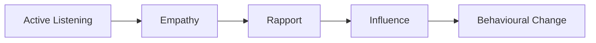

# Human Summary Standards

## Purpose

Book summaries in `summaries/` are written for human reading and learning.
They are general-purpose — the author's ideas as intended, no career lens, no exercises.
The goal: feel like you've read the book — not a brief overview, but a comprehensive walkthrough of every major idea, argument, story, and framework the author presents.

## Depth Standard

**These are COMPREHENSIVE summaries, not overviews.**
The reader should finish the summary feeling they understand the book deeply — not just the headlines.

- **Minimum length:** 1000 lines for shorter/simpler books, 1600+ lines for substantial books, 2400+ lines for taxonomy books (48 Laws, 33 Strategies, Laws of Human Nature)
- Every chapter or major section of the book must be represented
- Do not summarise a concept in one sentence when three paragraphs would teach it properly
- Include the author's reasoning, not just their conclusions — explain WHY they believe what they believe
- Preserve the chain of logic: premise → evidence → conclusion → implications

## Writing Standards

- Plain, engaging English — one idea per bullet, clear and direct
- Preserve the author's voice — if Greene is theatrical, mirror that energy; if Newport is methodical, mirror that tone
- Use the author's terminology with clear definitions on first use
- Bold key terms on first use for scannability
- 5-8 key quotes per book — short (under 15 words), memorable, properly attributed, placed where they crystallise a point
- Stories are the primary vehicle for retention — preserve ALL the best ones, not just one per concept

### Bullet Point Formatting

**All explanatory and analytical content must use bullet points and nested bullet points instead of dense prose paragraphs.**

Bullet points are easier to scan, absorb, and return to. Dense paragraph blocks cause context-switching fatigue.

**What to bullet-point:**
- Mechanism explanations (how something works, why it works)
- Evidence and research findings
- Lists of characteristics, traits, or features
- Nuance and limitations
- Author's reasoning chains (premise → evidence → conclusion)
- Comparisons between approaches

**What stays as short prose (1-3 sentences max):**
- Section openers (italic previews)
- Brief transition sentences between major ideas
- The 30-second blockquote at the top
- About the Author (3-5 sentences)

**Inside callout boxes (`> [!example]`):**
- Story content also uses bullet points for consistency — but NO coloured text inside callouts
- The `**The lesson:**` closing line stays as a standalone line (not bulleted)
- Nest where natural groupings exist (cause → effect, sequence of events)

**Nesting rules:**
- Use nested bullets (`  -`) to break down a point into sub-components
- Maximum 3 levels of nesting — deeper than that loses clarity
- Each top-level bullet should be a complete thought
- Sub-bullets elaborate, provide evidence, or give examples

Example — instead of this prose block:
```
Hedgehogs know one big thing. They view every problem through a single powerful framework — Marxism, free-market economics, game theory, whatever their speciality happens to be. They are excellent at constructing compelling narratives that explain everything. They exude the confidence that television producers and newspaper editors reward. When their predictions fail, they have an arsenal of self-protective explanations: the timing was off, an unprecedented event intervened, they were "almost right." They never update their model. They just explain away the miss.
```

Write this:
```
**Hedgehogs** know one big thing:
- View every problem through a single powerful framework — Marxism, free-market economics, game theory
- Excellent at constructing compelling narratives that explain everything
- Exude the confidence that television producers and newspaper editors reward
- When predictions fail, they deploy self-protective explanations:
  - The timing was off
  - An unprecedented event intervened
  - They were "almost right"
- **Never update their model** — just explain away the miss
```

### Colour and Emphasis Standards

Use coloured text to create visual hierarchy and draw attention to what matters most. Obsidian renders inline HTML, so use `<b>` tags with inline colour styles (markdown `**bold**` does not render inside HTML tags).

**Colour rules:**
- Coloured text is **ALWAYS bolded** — never use colour on plain or italic-only text
- Italic + bold + colour is fine (e.g. `<b style="color: #27ae60">text</b>`)
- Use colour sparingly — if everything is coloured, nothing stands out

**Colour system (3 colours only):**

| Colour | HTML | Use for | Example |
|--------|------|---------|---------|
| Red | `<b style="color: #e74c3c">text</b>` | Warnings, dangers, anti-patterns, what NOT to do | <b style="color: #e74c3c">Never outshine the master</b> |
| Green | `<b style="color: #27ae60">text</b>` | Core principles, key insights, what TO do | <b style="color: #27ae60">Target System 1, not System 2</b> |
| Blue | `<b style="color: #2980b9">text</b>` | Named frameworks, models, key terms on first introduction | <b style="color: #2980b9">Behavioural Change Stairway Model (BCSM)</b> |

**Frequency guidelines:**
- **Red:** 1-3 per chapter section — only for genuine warnings or critical anti-patterns
- **Green:** 1-2 per chapter section — the single most important principle or takeaway
- **Blue:** 2-5 per chapter section — named concepts and frameworks when first introduced
- Total coloured items per chapter section: roughly 5-8 (not more)

## Story & Example Standards

Stories and examples are what make a summary feel like reading the book, not reading about the book.

- **2-4 stories per major concept** — the author's best illustrative examples, paraphrased in 4-8 sentences each
- Include BOTH the "observance" (someone who followed the principle successfully) AND the "transgression" (someone who violated it and suffered) when the author provides both
- Preserve the narrative arc: who was involved, what was the situation, what happened, why it matters
- Include real names, dates, and specifics — "a French minister" is forgettable; "Nicolas Fouquet, Louis XIV's finance minister, in 1661" is memorable
- For books that use running case studies, follow the case study through the summary

## Mechanism & Nuance Standards

For every major concept, include:

- **What it is** — the idea in plain language, explained fully (not compressed to one sentence)
- **Why it works** — the underlying mechanism, psychology, or logic (2-3 paragraphs minimum)
- **The author's best evidence** — what data, research, or historical examples support the claim
- **When it applies** — the conditions under which this principle is most powerful
- **When it doesn't apply** — the exceptions, counter-conditions, and edge cases the author acknowledges
- **How it connects** — links to other concepts in the same book (internal coherence)

## Anti-Patterns — Never Do These

- No Toulmin structures (claim/grounds/warrant/qualifier/rebuttal)
- No implementation intentions ("When [situation], I will [action]")
- No career-specific framing or language
- No exercises or reflection prompts
- No "Application pattern" sections
- No academic or analytical formatting — this is a teaching document, not a research paper
- No robotic framework listing — weave ideas into engaging narrative
- **No compressing a 300-page book into 250 lines — that is a blurb, not a summary**

## Three-Depth Structure (Required)

Every summary must work at three reading speeds:

1. **30-second scan** — blockquote at top (5-7 sentences): what it's about, who wrote it, why it matters
2. **5-minute review** — About the Author (3-5 sentences) + Big Idea (3-4 substantial paragraphs) + Key Concepts at a Glance (two-column table: concept name + one-line summary)
3. **Full read** — complete summary with multiple stories per concept, full mechanisms, extensive nuance, and cross-references between the book's own ideas

## Taxonomy Books

- Include a Quick Lookup Table mapping every entry to its thematic group
- Group entries into 5-7 thematic clusters with cluster introductions explaining the theme
- **Every entry gets meaningful treatment** — at minimum 2 paragraphs (explanation + story), key entries get 4-6 paragraphs (explanation + mechanism + 2-3 stories + nuance)
- Let these be as long as they need to be — 1200+ lines is expected

## Non-Taxonomy Books

- **Every chapter** must be represented with its own section or subsection
- Each chapter section should cover: the chapter's core argument, the key frameworks introduced, 2-3 of the author's best stories/examples, and the nuance/limitations
- For manual/how-to books: include enough detail that someone could actually USE the technique from reading the summary alone
- For argument books: follow the argument step by step — premise, evidence, counterarguments, conclusion

## Verdict Section

The Verdict should be 3-4 substantive paragraphs:
1. The book's greatest contribution — what does it add to how you think?
2. The book's weaknesses — where is the evidence thin, the reasoning biased, or the advice naive?
3. Who benefits most — what kind of reader gets the most from this book?
4. How it compares — where does this book sit relative to others on the same topic?

## Copyright Compliance

- All quotes under 15 words
- All stories paraphrased in your own words
- No paragraph-length reproductions of source text
- When in doubt, paraphrase more aggressively

## Visual Formatting Standards

Dense prose is exhausting. These rules create visual variety so the reader's eyes have anchor points, breathing room, and different textures to process.

### Stories in Callout Boxes

Every story or extended example uses `> [!example]` with a bold title (who + when):

```
> [!example] Nicolas Fouquet's Fatal Party (1661)
> - Fouquet, France's finance minister, threw a lavish party at Vaux-le-Vicomte to honour Louis XIV
> - The gardens, entertainment, and architecture were more magnificent than anything the king possessed
> - Fouquet intended it as flattery — Louis received it as humiliation
> - Within three weeks, Fouquet was arrested and spent twenty years in prison
> **The lesson:** Never outshine the master.
```

- 4-8 bullet points per story callout — enough for narrative arc, not a wall
- Story content uses bullet points inside callouts — but NO coloured text inside callouts
- Include "**The lesson:**" as a standalone closing line (not bulleted)
- Collapsible format (`> [!example]-`) for stories longer than 8 bullets
- Nest where natural groupings exist (cause → effect, sequence of events)

### Key Insight Callouts

The single most important takeaway per major section gets `> [!tip]`:

```
> [!tip] Core Insight
> Humans make decisions with System 1 (emotional) and rationalise with System 2 (logical). Target System 1.
```

- Maximum one `> [!tip]` per chapter/major section — overuse dilutes impact
- Keep to 1-3 sentences — this is the distilled punchline, not another paragraph

### Practical Technique Callouts

Step-by-step techniques and actionable methods get `> [!abstract]`:

```
> [!abstract] The Ackerman System
> 1. Set your target price
> 2. First offer: 65% of target
> 3. Three raises at decreasing increments: 85%, 95%, 100%
> 4. Use precise, non-round numbers ($37,893 not $38,000)
> 5. Final offer includes a non-monetary item
```

- Use when the author presents a numbered method, protocol, or step-by-step process
- Numbered steps inside the callout for sequential methods
- Bullet points for non-sequential checklists

### Mermaid Diagrams

Each summary includes **2-5 Mermaid diagrams** to visualise relationships, processes, and structures:

- **Flowcharts** for sequential models (e.g. BCSM: listening → empathy → rapport → influence → change)
- **Concept maps** for how the book's key ideas relate to each other
- **Comparison diagrams** when the author contrasts two approaches or worldviews

Rules:
- Every diagram must have 1 sentence of interpretation immediately below it
- Use clear, short node labels (max 4-5 words per node)
- Use colour sparingly for emphasis (`style` for start/end nodes only)
- Prefer `flowchart` over `graph` for clarity
- Test rendering: Obsidian uses its own Mermaid renderer

Example:
````

````

### Tables for Structured Comparisons

Whenever a book presents types, categories, or frameworks with 3+ items, use a table instead of prose paragraphs:

```
| Type | Core Drive | Strength | Blind Spot |
|------|-----------|----------|------------|
| Analyst | Data and preparation | Thorough | Slow to act |
| Accommodator | Relationships | Warmth | Avoids conflict |
| Assertive | Results and speed | Decisive | Poor listener |
```

- Use for: personality types, framework dimensions, comparison of approaches, taxonomic categories
- Keep columns to 3-5 — wider tables break on mobile
- Follow each table with 1-2 sentences of interpretation or "which type are you" guidance

### Section Openers

Each chapter or major section begins with a 1-2 sentence italic preview that tells the reader what they're about to learn:

```
*Voss dismantles the myth that "Yes" is the goal and shows why designing for "No" creates genuine agreement.*
```

- One sentence preferred, two maximum
- Focus on the shift or surprise — what will change in the reader's thinking
- Do NOT repeat the section heading in prose form

### Key Concepts at a Glance — Table Format

Replace the dense bullet list with a scannable two-column table:

```
| Concept | One-line summary |
|---------|-----------------|
| **Tactical empathy** | Read and vocalise emotions to create safety |
| **Mirroring** | Repeat last 1-3 words, then go silent |
```

- Bold the concept name in the left column
- Right column: one sentence max, plain language, no jargon
- This is the 5-minute-review layer — it should be skimmable in 60 seconds

### Breathing Rules

- **Maximum 3 dense prose paragraphs in a row** before a visual break (callout, diagram, table, or horizontal rule)
- After every story callout, leave a blank line before resuming explanation
- After every diagram, include 1 sentence of interpretation before continuing
- Between major concept shifts within a chapter, use a `---` horizontal rule

## Quality Gate

Before saving a summary, verify:
- Every chapter/major section of the book is covered
- At least 2-3 illustrative stories per major concept
- Mechanisms explained (not just conclusions stated)
- Minimum line count met (1000 for simple books, 1600+ for substantial, 2400+ for taxonomy)
- Quick Lookup Table present and complete (taxonomy books)
- Cross-references use `[[wikilinks]]`
- Frontmatter includes: date, type, tags, author, title, year
- Verdict is 3-4 substantive paragraphs, not a perfunctory close
- 2-5 Mermaid diagrams present and rendering correctly
- Stories wrapped in `> [!example]` callouts
- Structured comparisons presented as tables, not prose
- No more than 3 consecutive dense prose paragraphs without a visual break
- Key Concepts at a Glance uses table format
- Each chapter section has an italic opener
- Explanatory content uses bullet points (no dense prose paragraphs outside callouts)
- Story content inside `> [!example]` callouts also uses bullet points (no colours inside callouts)
- Coloured text uses `<b style="color: ...">` HTML tags (not markdown `**` inside `<span>`)
- Colour used sparingly: ~5-8 coloured items per chapter section max, no colours inside callouts

## File Naming

`Title - Author.md` — e.g. `Thinking Fast and Slow - Daniel Kahneman.md`

Use the main title only (no subtitle). Sanitise characters that aren't valid in filenames.
