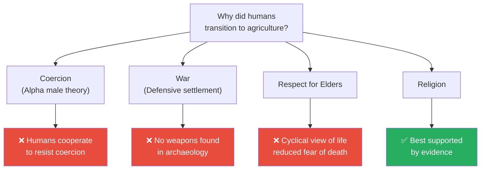
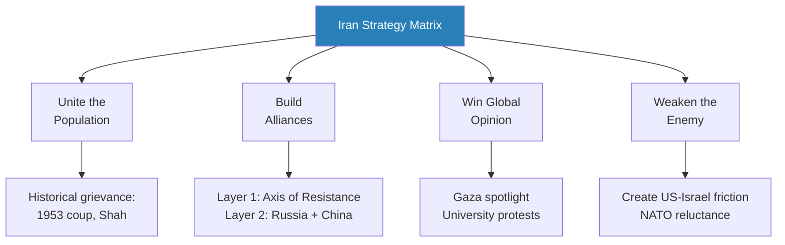

# Lecture Summary Standards

## Purpose

Lecture summaries in `lectures/` are written for human reading and learning.
They capture Prof. Jiang Xueqin's lectures — his arguments, evidence, theories, and historical narratives — as he presented them.
The goal: feel like you attended the lecture — not a brief overview, but a comprehensive walkthrough of every major argument, theory, and story he presents, enriched with visual diagrams that clarify complex relationships.

## Depth Standard

**These are COMPREHENSIVE lecture summaries, not class notes.**
The reader should finish the summary feeling they understand the lecture's argument deeply — every theory considered, every piece of evidence weighed, every conclusion grounded.

- **Target length:** 400-800 lines per lecture (scaled to content density — a 45-min lecture on one topic may be 400 lines, a dense 60-min lecture covering multiple civilisations may reach 800)
- Every major question or argument Prof. Jiang raises must be represented
- Do not summarise a theory in one sentence when two paragraphs would teach it properly
- Include his reasoning, not just his conclusions — explain WHY he favours one theory over another
- Preserve the chain of logic: question → theories → evidence for/against → conclusion → implications

## Writing Standards

- Plain, engaging English — one idea per bullet, clear and direct
- Preserve Prof. Jiang's voice — he is conversational, uses vivid analogies, and makes complex history accessible. Mirror that energy
- Use his terminology with clear definitions on first use (e.g. **asymmetrical warfare**, **asabiyyah**, **hubris**)
- Bold key terms on first use for scannability
- 3-5 key quotes per lecture — short (under 15 words), memorable, properly attributed (e.g. "We did not domesticate wheat. Wheat domesticated us." — Yuval Harari, cited by Prof. Jiang)
- Historical narratives are the primary vehicle for retention — preserve ALL the best ones with real names, dates, and specifics

### Bullet Point Formatting

**All explanatory and analytical content must use bullet points and nested bullet points instead of dense prose paragraphs.**

Bullet points are easier to scan, absorb, and return to. Dense paragraph blocks cause context-switching fatigue.

**What to bullet-point:**
- Theory presentations (what the theory claims, evidence for/against)
- Historical evidence and archaeological findings
- Lists of characteristics, causes, or consequences
- Nuance and counter-arguments
- Prof. Jiang's reasoning chains (question → theories → evidence → verdict)
- Comparisons between civilisations, strategies, or worldviews

**What stays as short prose (1-3 sentences max):**
- Section openers (italic previews)
- Brief transition sentences between major ideas
- The 30-second blockquote at the top

**Inside callout boxes (`> [!example]`):**
- Story content also uses bullet points for consistency — but NO coloured text inside callouts
- The `**The lesson:**` closing line stays as a standalone line (not bulleted)
- Nest where natural groupings exist (cause → effect, sequence of events)

**Nesting rules:**
- Use nested bullets (`  -`) to break down a point into sub-components
- Maximum 3 levels of nesting — deeper than that loses clarity
- Each top-level bullet should be a complete thought
- Sub-bullets elaborate, provide evidence, or give examples

### Colour and Emphasis Standards

Use coloured text to create visual hierarchy. Obsidian renders inline HTML.

**Colour rules:**
- Coloured text is **ALWAYS bolded** — never use colour on plain or italic-only text
- Use colour sparingly — if everything is coloured, nothing stands out

**Colour system (3 colours only):**

| Colour | HTML | Use for | Example |
|--------|------|---------|---------|
| Red | `<b style="color: #e74c3c">text</b>` | Warnings, dangers, fatal mistakes, what civilisations did WRONG | <b style="color: #e74c3c">Hubris: the fatal flaw of empires</b> |
| Green | `<b style="color: #27ae60">text</b>` | Core insights, key conclusions, what Prof. Jiang considers the answer | <b style="color: #27ae60">Religion, not agriculture, drove settlement</b> |
| Blue | `<b style="color: #2980b9">text</b>` | Named frameworks, models, key terms on first introduction | <b style="color: #2980b9">Iran Strategy Matrix</b> |

**Frequency guidelines:**
- **Red:** 1-2 per major section — only for genuine warnings or critical anti-patterns
- **Green:** 1-2 per major section — the professor's key conclusion or insight
- **Blue:** 2-4 per major section — named concepts and frameworks when first introduced
- Total coloured items per major section: roughly 4-7 (not more)

## Mermaid Diagram Standards

**This is the key differentiator from book summaries.** Prof. Jiang presents complex, interconnected ideas that benefit enormously from visual representation.

### Minimum Requirements

- **Minimum 4 diagrams per lecture, target 6-8**
- Every lecture MUST have at least one of each:
  1. A **timeline or flowchart** showing historical sequence
  2. A **concept map** showing how the lecture's ideas connect to each other
- Additional diagrams as appropriate to content

### Diagram Types

| Type | When to use | Mermaid syntax |
|------|-------------|---------------|
| **Timeline** | Historical sequences, rise/fall of empires | `flowchart LR` or `flowchart TB` with chronological nodes |
| **Concept Map** | How ideas relate within the lecture | `flowchart TB` with concept nodes and labelled edges |
| **Comparison** | Contrasting theories, civilisations, or approaches | `flowchart LR` with parallel branches |
| **Cause-Effect Chain** | Why something happened (multi-causal) | `flowchart TB` with converging arrows |
| **Strategy Matrix** | Geo-Strategy lectures especially | `flowchart TB` or `quadrantChart` |
| **Decision Tree** | Theory evaluation (theory → evidence → verdict) | `flowchart TB` with decision branches |
| **Cycle Diagram** | Recurring historical patterns | `flowchart` with circular arrows |

### Diagram Rules

- Every diagram MUST have 1-2 sentences of interpretation immediately below it
- Use clear, short node labels (max 5-6 words per node)
- Use colour sparingly for emphasis (`style` for key nodes only)
- Prefer `flowchart` over `graph` for clarity
- Keep diagrams under 15 nodes — split into multiple diagrams if larger
- Test that Obsidian's Mermaid renderer can handle the syntax

### Diagram Examples

**Timeline example:**
````

````
*Religious centres preceded permanent settlements — Göbekli Tepe's temple predates its houses by centuries.*

**Theory evaluation example:**
````

````
*Prof. Jiang evaluates four theories for the agricultural transition — only religion is consistently supported by archaeological evidence from Göbekli Tepe, Jericho, and Çatalhöyük.*

**Strategy matrix example (Geo-Strategy):**
````

````
*Every Iranian action — including Operation True Promise — must serve all four strategic goals simultaneously.*

## Story & Example Standards

Historical narratives are what make these lectures memorable.

- **2-4 historical narratives per major section** — the professor's best illustrative examples, paraphrased in 4-8 bullet points each
- Preserve real names, dates, and specifics — "Nicolas Fouquet, Louis XIV's finance minister, in 1661" not "a French minister"
- For archaeological evidence: name the site, the date, and what was found
- For geopolitical examples: name the operation, the year, and the outcome

### Story Callouts

Every historical narrative uses `> [!example]` with a bold title (who/what + when):

```
> [!example] The 2002 Millennium Challenge
> - The US military ran a war simulation of invading Iran
> - The US team had overwhelming military superiority
> - The "Iran" team used asymmetrical tactics: drone swarms, suicide boats
> - Iran won the first simulation
> - The US military then banned asymmetrical tactics and re-ran it
> - The US won the second simulation — proving only that they refused to adapt
> **The lesson:** Military dominance does not guarantee victory against an opponent who controls the terms of engagement.
```

- 4-8 bullet points per story callout — enough for narrative arc, not a wall
- NO coloured text inside callouts
- Include "**The lesson:**" as a standalone closing line
- Collapsible format (`> [!example]-`) for stories longer than 8 bullets

### Key Insight Callouts

The single most important takeaway per major section gets `> [!tip]`:

```
> [!tip] Core Insight
> Empires fall not because enemies grow stronger, but because hubris makes the empire inflexible. The dominant power refuses to adapt — that refusal, not the challenger's strength, is what determines the outcome.
```

- Maximum one `> [!tip]` per major section
- Keep to 1-3 sentences

### Theory Evaluation Callouts

When Prof. Jiang presents and evaluates competing theories, use `> [!abstract]`:

```
> [!abstract] Theory Evaluation: Why Did Humans Settle?
> | Theory | Evidence For | Evidence Against | Verdict |
> |--------|-------------|-----------------|---------|
> | Coercion | Gorilla alpha males | Humans cooperate to resist | ❌ |
> | War | Chimpanzee violence | No weapons found; bonobos peaceful | ❌ |
> | Elder respect | Universal cultural pattern | Cyclical view of death reduced fear | ❌ |
> | Religion | Göbekli Tepe, Jericho, Çatalhöyük | None currently | ✅ |
```

## Three-Depth Structure (Required)

Every lecture summary must work at three reading speeds:

1. **30-second scan** — blockquote at top (3-5 sentences): what question is asked, what the answer is, why it matters
2. **5-minute review** — The Question section + Key Concepts at a Glance table
3. **Full read** — complete summary with all theories, evidence, stories, diagrams, and connections

## Question-Driven Sections

Prof. Jiang structures every lecture around questions. The summary structure should mirror this:

- **Section headings should be questions** when the professor poses them as questions
  - Good: `## Why Did Humans Transition to Agriculture?`
  - Bad: `## The Agricultural Transition`
- When he presents multiple theories to answer a question, present ALL theories before evaluating
- Always make clear which theory Prof. Jiang favours and WHY

## Continuity & Cross-Reference Standards

Lectures are sequential and build on each other. Every summary must include:

### Connections Section (at the end, before The Takeaway)

```markdown
## Connections

**Builds on:** [[02 - Religion and the Dawn of Society]] (ancestor worship), [[05 - The Yamnaya Conquest of Europe]] (Indo-European expansion)
**Sets up:** [[08 - Rat Utopia and the Peloponnesian War]] (elite overproduction theme continues)
**Related books in vault:** [[Sapiens - Yuval Noah Harari]] (agricultural revolution), [[Antifragile - Nassim Nicholas Taleb]] (asymmetry)
```

- Use `[[wikilinks]]` with no path prefix
- Reference specific concepts from linked lectures, not just lecture titles
- Cross-reference book summaries in the vault when Prof. Jiang's ideas overlap

### Series Overview Updates

After each lecture summary is completed:
1. Update the series `_overview.md` — mark lecture as summarised, add one-line description
2. Add any new recurring themes discovered in this lecture

## Transcript Cleaning Notes

When reading raw transcripts during analysis:
- Strip timestamp markers (`Prof. Jiang  0:00`)
- Normalise speaker labels (`Speaker 1`, `Unknown Speaker` → `Student`)
- Recognise that Q&A sections contain important content — don't discard them
- Fix obvious transcription errors when the intended word is clear from context (e.g. "azmaia" → "asabiyyah", "goblin tepei" → "Göbekli Tepe")
- Preserve the professor's analogies and explanations — these are often the clearest articulations of complex ideas

## Anti-Patterns — Never Do These

- No Toulmin structures (claim/grounds/warrant/qualifier/rebuttal)
- No implementation intentions or exercises
- No career-specific framing
- No academic or analytical formatting — this is a teaching document
- No robotic framework listing — weave ideas into engaging narrative
- **No compressing a 60-minute lecture into 150 lines — that is a blurb, not a summary**
- No inventing content the professor didn't discuss — mark inferences with `[INFERENCE]`
- No correcting the professor's historical claims unless flagging as `[Note: scholars debate this]`

## The Takeaway Section

The Takeaway should be 2-3 substantive paragraphs:
1. What this lecture adds to the series' big picture — how does this piece fit into the puzzle?
2. The most surprising or counterintuitive insight — what would change how someone sees the world?
3. What questions remain open — what did the professor promise to address later, or leave unresolved?

## Quality Gate

Before saving a lecture summary, verify:
- Every major question/argument from the lecture is covered
- At least 2-3 historical narratives per major section
- Theories evaluated with evidence (not just conclusions stated)
- Line count within target range (400-800)
- **Minimum 4 Mermaid diagrams present and rendering correctly**
- At least 1 timeline diagram and 1 concept map
- Stories wrapped in `> [!example]` callouts
- Theory evaluations in `> [!abstract]` callouts
- Connections section links to adjacent lectures and relevant book summaries
- No more than 3 consecutive dense prose paragraphs without a visual break
- Key Concepts at a Glance uses table format
- Each major section has an italic opener
- Explanatory content uses bullet points
- Coloured text uses `<b style="color: ...">` HTML tags — no colours inside callouts
- Frontmatter includes: date, type, tags, lecturer, series, lecture-number, title

## File Naming

Lecture files live inside the Obsidian vault at `summaries/Lectures/<Series>/NN - Title.md` — e.g. `summaries/Lectures/Civilization/01 - Explaining Humanity's Transition to Agriculture.md`

Zero-pad the lecture number. Use the main title from the transcript filename (strip the audio codec info and series prefix). Sanitise characters that aren't valid in filenames.
