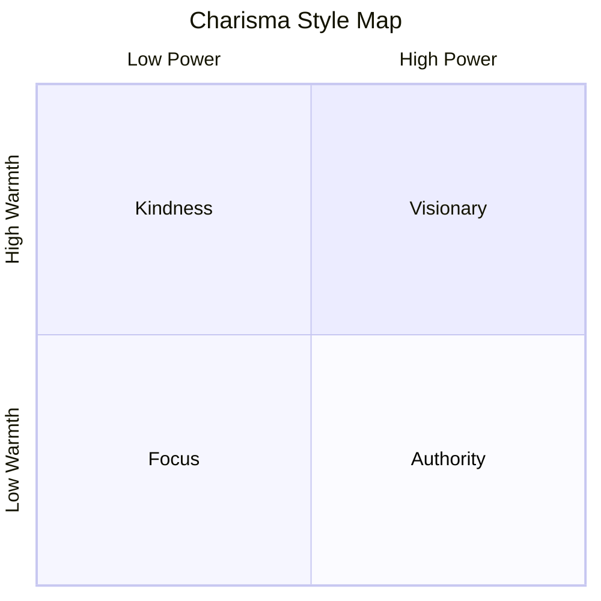

# The Charisma Myth — Olivia Fox Cabane

## Central Thesis

Charisma is not innate — it is a learnable skill composed of three elements: **Presence** (being fully engaged in the moment), **Power** (the perception that you can affect the world), and **Warmth** (the perception that you care about others). Different combinations produce different charisma styles (Focus, Visionary, Kindness, Authority). The book provides specific exercises — visualization, body language adjustment, mental state management — to develop each component.

---

## Key Frameworks

### The Three Pillars of Charisma

| Pillar | Definition | Body Language Signal | Without It |
|--------|-----------|---------------------|------------|
| **Presence** | Full engagement in the current moment | Eye contact, stillness, responsiveness | You seem distracted, fake |
| **Power** | Perceived ability to affect the world | Confident posture, space-claiming, vocal authority | You seem eager but ineffective |
| **Warmth** | Perceived genuine caring for others | Open body language, real smile, leaning in | You seem competent but cold |

### The Four Charisma Styles

1. **Focus Charisma** — Presence + Warmth. Bill Clinton effect. You make the other person feel like the only person in the room. Easiest to learn — simply requires being fully present.
2. **Visionary Charisma** — Power + Warmth projected outward. Steve Jobs effect. You inspire belief in a compelling future. Requires genuine conviction.
3. **Kindness Charisma** — Warmth dominant. Dalai Lama effect. You radiate unconditional acceptance. Requires genuine goodwill (hard to fake).
4. **Authority Charisma** — Power dominant. Colin Powell effect. You project status and confidence. Requires high-status body language and vocal patterns.

### The Charisma Equation

Internal state → Body language → Others' perception → Charisma

- You cannot fake charisma for long because micro-expressions betray your true internal state
- The solution is not to fake the body language but to genuinely change the internal state
- Techniques: visualization, cognitive reframing, responsibility transfer

### Charisma-Inhibiting Discomfort

Three main obstacles:
1. **Physical discomfort** — Hunger, cold, noise → fix the environment first
2. **Mental discomfort** — Anxiety, self-doubt, self-criticism → destigmatise, neutralise, rewrite
3. **Uncertainty** — Not knowing what will happen → responsibility transfer exercise

### Key Exercises

| Exercise | Purpose | How It Works |
|----------|---------|-------------|
| **Responsibility Transfer** | Relieve anxiety | Mentally hand your problems to a higher power for 10 minutes |
| **Visualization** | Build confidence | Imagine a specific scenario going perfectly before it happens |
| **Gratitude Focus** | Generate warmth | Before a conversation, think of three things you appreciate about the person |
| **Body Language Reset** | Project confidence | Stand in a power pose for 2 minutes before high-stakes situations |
| **Destigmatise-Neutralise-Rewrite** | Overcome negative thoughts | Recognise → reframe → visualise an alternative reality |

---

## Best Stories

1. **Marilyn Monroe's Subway** — Monroe walked through a New York subway unrecognised. Then she asked her companion "Do you want to see her?" and adjusted her posture, gait, and expression. She was immediately mobbed. Charisma is a switch, not a trait.
2. **Steve Jobs** (Visionary) — Jobs could make engineers believe they were changing the world because he genuinely believed it himself. His internal conviction drove his body language which drove others' perception.
3. **Bill Clinton** (Focus) — Clinton's legendary ability to make every person feel like the most important person in the room. Pure presence — he was genuinely, fully engaged.
4. **The Dalai Lama** (Kindness) — Radiates unconditional warmth. People feel accepted in his presence because he genuinely wishes them well.

---

## Book Structure

| Part | Topic | Core Message |
|------|-------|-------------|
| Part 1 | Demystifying Charisma | Charisma = Presence + Power + Warmth |
| Part 2 | The Charisma Obstacles | Internal discomfort kills charisma |
| Part 3 | Overcoming Obstacles | Destigmatise, neutralise, rewrite |
| Part 4 | The Charisma Styles | Focus, Visionary, Kindness, Authority |
| Part 5 | Charisma in Practice | First impressions, difficult situations, presentations |
| Part 6 | Living with Charisma | Charisma in crisis, the dark side of charisma |

---

## Key Insights for Summary

1. Charisma is not a personality trait — it is a set of behaviours driven by internal states
2. Body language is the delivery mechanism and it cannot be faked long-term
3. The fastest path to charisma is managing discomfort and generating genuine warmth
4. Focus charisma (just being present) is the lowest-effort, highest-return style
5. The Responsibility Transfer exercise is the single most impactful technique in the book
6. Charisma has a dark side — it can intimidate, create envy, and set unrealistic expectations

---

## Cross-References

- [[How to Win Friends and Influence People - Dale Carnegie]] — Carnegie's warmth principles as the foundation of Focus charisma
- [[Influence - Robert Cialdini]] — The liking principle that charisma activates
- [[What Every Body Is Saying - Joe Navarro]] — The body language signals that charisma produces and that others read
- [[Pre-Suasion - Robert Cialdini]] — Priming internal states before interactions
- [[Executive Presence - Sylvia Ann Hewlett]] — Authority charisma in corporate settings
