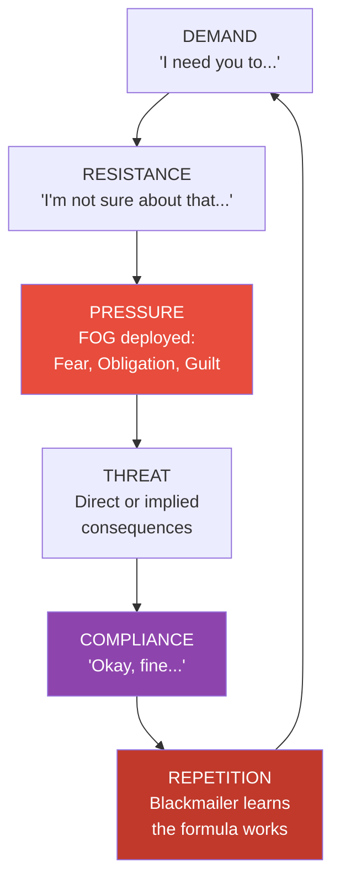

# Emotional Blackmail — Susan Forward

> Susan Forward names what millions of people experience but can't articulate: the feeling of being trapped by someone who uses your love, loyalty, or guilt against you.
> She calls it emotional blackmail, and it follows a predictable pattern: the blackmailer makes a demand; you resist; they apply pressure through fear, obligation, or guilt; you cave; and the cycle repeats — each round training you to cave faster.
> The book maps the entire system — the types of blackmailers, the FOG they deploy, the cycle they run, and the specific steps to break free.
> It is one of the most practical books ever written about manipulation in close relationships.

---

## About the Author

Dr. Susan Forward is a therapist, lecturer, and bestselling author specialising in toxic relationships and emotional abuse.
She is also known for *Toxic Parents* and *Men Who Hate Women and the Women Who Love Them*.
Her clinical practice spans decades, and the case studies in this book are drawn from real therapeutic work.

---

## The Big Idea

- <b style="color: #2980b9">Emotional blackmail is a system, not a single event</b> — it's a repeating cycle of demand, pressure, and compliance
- The blackmailer's weapon is **FOG**: Fear, Obligation, and Guilt
- It works because the target cares about the relationship more than the blackmailer does — the caring itself becomes the leverage
- <b style="color: #e74c3c">Giving in doesn't save the relationship — it trains the blackmailer to escalate</b>
- Breaking free requires tolerating the discomfort of saying no and weathering the storm that follows

---

## The FOG

Forward's acronym for the three emotional weapons blackmailers deploy:

| Weapon | How it works | Example |
|--------|-------------|---------|
| **Fear** | Of anger, abandonment, withdrawal of love, retaliation | "If you go to that dinner, don't bother coming home" |
| **Obligation** | "After everything I've done for you" — weaponising the relationship's history | "I sacrificed my career for this family and this is how you repay me?" |
| **Guilt** | Making you feel like a bad person for having boundaries | "I guess I'm just not important enough for you to care" |

- <b style="color: #2980b9">FOG works by bypassing rational thought and targeting emotional reflexes</b>
- You don't comply because you agree — you comply because the emotional discomfort of resisting feels unbearable

---

## Four Types of Blackmailers

Forward identifies four distinct styles:

- **Punishers** — The most direct. They tell you exactly what they'll do if you don't comply. "If you take that job, I'm leaving." Their weapon is fear.
- **Self-Punishers** — They threaten to harm themselves. "If you leave me, I don't know what I'll do to myself." Their weapon is guilt and terror.
- **Sufferers** — They don't make explicit threats. They make you responsible for their misery. "I'll be fine... I'll just sit here alone, I suppose." Their weapon is guilt.
- **Tantalizers** — They dangle rewards. "If you do what I want, wonderful things will happen." The carrot never arrives, but the demands keep coming. Their weapon is hope.

---

## Why You Give In

Forward is clear: emotional blackmail requires a willing (if unwitting) participant. The targets share common traits:

- <b style="color: #27ae60">Excessive need for approval</b> — you need the blackmailer to think well of you
- **Conflict avoidance** — the short-term pain of saying no feels worse than the long-term cost of saying yes
- **Self-doubt** — when they say you're being selfish or unreasonable, you wonder if they're right
- **Sense of obligation** — you've been trained to believe that good people always put others first
- **Fear of abandonment** — you'd rather lose yourself than lose the relationship

---

## The SOS Method

Forward's three-step response system:

1. **Stop** — Do not respond immediately. The blackmailer relies on your emotional reaction. Buy time. "I need to think about that" is a complete sentence.
2. **Observe** — Step back and notice what's happening. Name the FOG: "This is guilt. This is fear. This is obligation." Naming it breaks its grip.
3. **Strategise** — Decide in advance what you will and won't do. Write it down. Practice saying it out loud. Prepare for the backlash.

- <b style="color: #2980b9">The critical principle: you are not responsible for the blackmailer's reaction to your boundary</b>
- They will escalate. They will test. They will deploy more FOG. This is predictable and temporary.

---

## Saying No Without JADE

A key defence principle shared with other manipulation literature:

- **Do not Justify** — "I can't because..." gives them material to argue with
- **Do not Argue** — engaging with their logic validates their framework
- **Do not Defend** — defending yourself implies you need their approval
- **Do not Explain** — explanations become ammunition for the next round
- <b style="color: #27ae60">Instead: state your position simply and repeat it</b> — "I've made my decision." "I understand you're upset. My answer is the same."

---

## What to Expect When You Stop Complying

Forward is honest about the cost:

- The blackmailer will escalate before they stop — this is called an **extinction burst**
- They may recruit allies ("Can you believe what they did to me?")
- They may switch styles (a Sufferer might become a Punisher when suffering stops working)
- <b style="color: #e74c3c">Some relationships will not survive your boundaries — and Forward argues those relationships were already gone</b>
- The relationships worth having will adapt. The ones built entirely on compliance will collapse — and that collapse is a feature, not a bug.

---

## The Verdict

*Emotional Blackmail* is one of those rare self-help books that delivers exactly what it promises: a clear model, a concrete taxonomy, and a practical defence system. Forward writes with clinical precision and genuine compassion — she understands that the people most vulnerable to blackmail are the people who care the most.

The book's limitation is that it can feel repetitive — the case studies, while illustrative, follow similar arcs. But the FOG model and the SOS method are genuinely transformative frameworks. Once you learn to see the cycle, you can't unsee it — and that visibility is the beginning of freedom.

---

## Related Reading

- [[In Sheep's Clothing - George K. Simon|In Sheep's Clothing]] — The mechanics of covert aggression underlying emotional blackmail
- [[The Gaslight Effect - Robin Stern|The Gaslight Effect]] — When manipulation makes you question your own reality
- [[Crucial Conversations - Kerry Patterson|Crucial Conversations]] — Healthy communication frameworks as an alternative to the blackmail dynamic
- [[The Sociopath Next Door - Martha Stout|The Sociopath Next Door]] — When the blackmailer has no conscience at all
