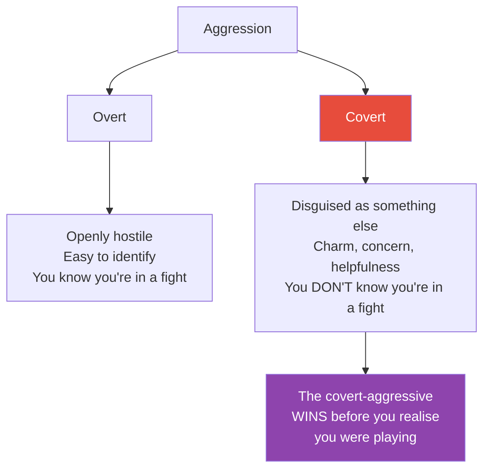

# In Sheep's Clothing — George K. Simon

> George Simon's thesis is unsettling: the most dangerous people in your life don't look dangerous.
> They look reasonable. They look helpful. They look like they care about you.
> But underneath the charm, the concern, and the apparent reasonableness, they are fighting — fighting for dominance, for control, for the upper hand — while hiding the fight itself.
> Simon calls them covert-aggressives, and this book is a field guide to recognising their tactics before you've already lost the battle you didn't know you were in.

---

## About the Author

Dr. George K. Simon is a clinical psychologist who has spent decades studying manipulative personalities and what he calls "character disturbance."
He challenges mainstream psychology's assumption that all problematic behaviour stems from insecurity or unresolved trauma.
His core argument: some people manipulate because it works, not because they're wounded.

---

## The Big Idea

- <b style="color: #2980b9">Not all aggression is visible — the most effective kind is disguised</b>
- Overt aggression is easy to spot (shouting, threats, intimidation). Covert aggression is hidden under helpfulness, charm, or victimhood
- Covert-aggressives are not neurotic or insecure — they know exactly what they're doing
- <b style="color: #e74c3c">Traditional therapy often fails here</b> because it assumes the manipulator is acting out of pain; Simon argues they're acting out of a desire to win
- The victim's biggest vulnerability is the assumption that everyone operates in good faith

---

## The Covert-Aggressive Personality

Simon distinguishes this personality type from passive-aggression. Passive-aggressive people resist through inaction. Covert-aggressives actively pursue dominance — they just hide the pursuit.

| Trait | Description |
|-------|-------------|
| **Charming surface** | Likeable, attentive, seemingly generous — designed to disarm |
| **Calculated tactics** | Every move is deliberate, not impulsive |
| **Denial of aggression** | If confronted, they act confused, hurt, or bewildered |
| **Awareness** | They know what they're doing — this is not unconscious behaviour |
| **Target selection** | They seek out conscientious, agreeable, conflict-averse people |

---

## The Manipulation Tactics

This is the book's core contribution — a taxonomy of the specific moves covert-aggressives use:

- **Minimisation** — "You're making a big deal out of nothing" — shrinks the significance of their behaviour
- **Denial** — Flat refusal to acknowledge what happened, even when evidence is clear
- **Rationalisation** — Providing a "reasonable" explanation that makes their behaviour sound justified
- **Diversion** — Changing the subject when you're getting close to the truth
- **Lying by omission** — Technically not lying, but withholding the information that would change your conclusion
- **Covert intimidation** — Subtle threats disguised as observations: "I'd hate to see what happens if..."
- **Guilt-tripping** — Making you feel selfish, ungrateful, or uncaring for having boundaries
- **Shaming** — Attacking your character to put you on the defensive
- **Playing the victim** — Framing themselves as the wronged party so you feel sorry for them instead of holding them accountable
- **Vilifying the victim** — Convincing others (and you) that you're the problem
- **Playing the servant** — "I'm only trying to help" — disguising aggression as selflessness
- **Seduction** — Flattery, charm, and excessive attention deployed strategically
- **Projecting blame** — "You made me do this" — making you responsible for their behaviour

---

## Why Good People Get Caught

Simon identifies a specific vulnerability profile:

- <b style="color: #2980b9">Conscientiousness</b> — you want to be fair, so you give them the benefit of the doubt
- **Agreeableness** — you hate conflict, so you back down when they push
- **Empathy** — they play the victim and you believe them because you'd feel terrible in their position
- **Self-doubt** — when they say "you're overreacting," you wonder if you are
- <b style="color: #e74c3c">The covert-aggressive's greatest weapon is your own good nature</b>

---

## How to Defend Yourself

Simon's defence framework is built around one principle: **judge actions, not words.**

- **Trust your gut** — if something feels wrong, it probably is, even if you can't articulate why
- **Stop JADE-ing** — do not Justify, Argue, Defend, or Explain. Every time you JADE, you hand them ammunition
- **Set concrete boundaries** — not "I'd prefer if you didn't" but "This is what I will and won't accept"
- **Name the tactic** — "That sounds like you're minimising what happened" — naming it breaks its power
- **Accept that they won't change** — covert-aggressives don't manipulate because they lack insight; they do it because it works
- <b style="color: #27ae60">Your only reliable defence is changing your own behaviour</b> — you cannot reform someone who sees nothing wrong with what they're doing

---

## Red Flags Checklist

You may be dealing with a covert-aggressive if:

- You frequently feel confused after conversations with them
- You find yourself apologising when you were the one wronged
- Their words say one thing but their actions consistently say another
- You feel guilty for having reasonable boundaries
- Others describe them as wonderful, but your experience is different
- You keep giving "one more chance" and the pattern never changes

---

## The Verdict

*In Sheep's Clothing* is a short, clinical, and deeply practical book. Simon writes without drama — this isn't a sensationalised account of evil manipulators. It's a calm, structured explanation of how certain personality types exploit the good faith of others, and what you can do about it.

The book's strength is its specificity. Instead of vaguely warning you about "toxic people," Simon names thirteen distinct tactics and explains the mechanism behind each one. Once you learn to see them, you can't unsee them.

Its limitation is that it focuses almost entirely on identification and defence — it doesn't go deep into recovery or the emotional aftermath of prolonged manipulation. For that, pair it with *Emotional Blackmail* or *The Gaslight Effect*.

---

## Related Reading

- [[Emotional Blackmail - Susan Forward|Emotional Blackmail]] — The FOG (Fear, Obligation, Guilt) model for understanding how emotional pressure works
- [[The Sociopath Next Door - Martha Stout|The Sociopath Next Door]] — The extreme end of the covert-aggressive spectrum: people with no conscience
- [[Snakes in Suits - Babiak & Hare|Snakes in Suits]] — Covert aggression in the corporate environment
