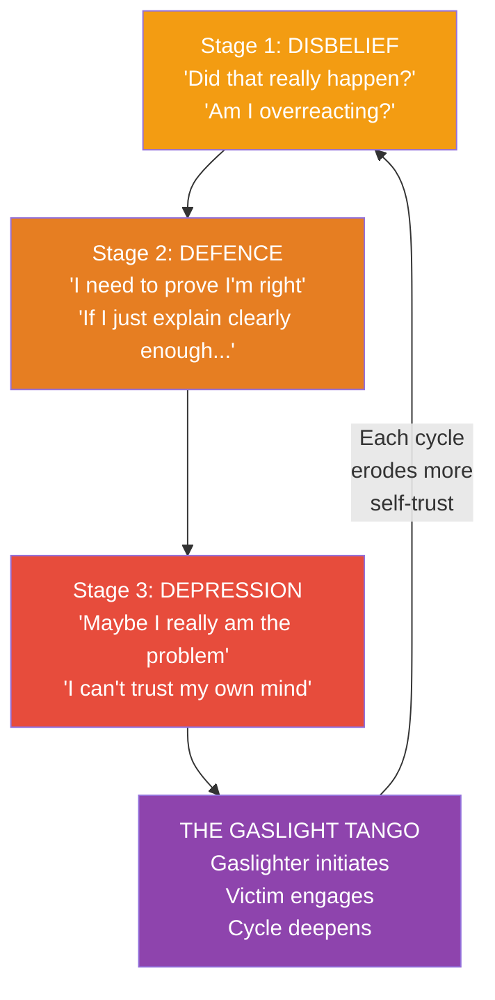

# The Gaslight Effect — Robin Stern

> Robin Stern names something millions of people experience but can't articulate: the slow, systematic erosion of your trust in your own reality by someone who claims to care about you.
> The gaslighter doesn't hit you. They don't scream. They say "That never happened." They say "You're too sensitive." They say "Everyone agrees with me."
> And over time, you stop trusting your own memory, your own feelings, your own perceptions — because the alternative is admitting that someone you love is deliberately destabilising you.
> Stern maps the three stages of gaslighting, explains why it takes two to tango, and provides a concrete framework for opting out of the dance.

---

## About the Author

Dr. Robin Stern is a psychoanalyst and the associate director of the Yale Center for Emotional Intelligence.
She coined the term "Gaslight Effect" based on the 1944 film *Gaslight*, in which a husband manipulates his wife into believing she is losing her mind.
Her clinical work focuses on emotional intelligence, relationships, and the subtle dynamics of emotional manipulation.

---

## The Big Idea

- <b style="color: #2980b9">Gaslighting is a specific form of manipulation where the gaslighter makes the victim doubt their own reality</b>
- It's not a single event — it's a gradual process that unfolds in three stages
- The critical insight is the **Gaslight Tango**: gaslighting requires two participants — the gaslighter who initiates and the gaslightee who keeps engaging
- <b style="color: #e74c3c">You can't win an argument with a gaslighter — winning the argument IS the trap</b>
- Recovery starts when you stop trying to get the gaslighter to agree with your version of reality and start trusting yourself again

---

## The Three Stages

### Stage 1 — Disbelief

- Something feels wrong but you can't quite name it
- The gaslighter says something that contradicts your experience and you think: "That's strange... but maybe I'm wrong?"
- You still have your bearings — you notice the inconsistency but give them the benefit of the doubt
- <b style="color: #27ae60">This is the easiest stage to escape from — if you trust your gut</b>

### Stage 2 — Defence

- You've noticed the pattern and you start fighting back — gathering evidence, building arguments, trying to prove you're right
- This is where most people get stuck, because **the act of defending yourself is the trap**
- Every time you argue, you're implicitly accepting that your reality needs the gaslighter's validation
- The gaslighter escalates: "You're paranoid." "You're obsessive." "You're imagining things."
- <b style="color: #e74c3c">The more evidence you gather, the more they use your evidence-gathering as proof that you're unstable</b>

### Stage 3 — Depression

- You've stopped fighting. You've started believing them.
- "Maybe I really am too sensitive." "Maybe I am imagining things." "Maybe the problem really is me."
- You feel foggy, confused, unable to make decisions — because you've lost trust in your own judgement
- This is the gaslighter's goal: a person who has surrendered their reality and now depends on the gaslighter to define it

---

## The Gaslight Tango

Stern's most important and most controversial insight: **gaslighting takes two.**

This does not mean the victim is to blame. It means:

- The gaslighter initiates the manipulation
- But the gaslightee participates by continuing to seek the gaslighter's approval, trying to win the argument, and needing the gaslighter to validate their reality
- <b style="color: #2980b9">The moment you stop needing them to agree with you, the gaslighting loses its power</b>
- You don't need to convince them. You need to trust yourself.

| The Gaslighter's Move | The Gaslightee's Trap |
|-----------------------|----------------------|
| "That never happened" | Searching for proof it did happen |
| "You're too sensitive" | Wondering if you really are too sensitive |
| "Everyone agrees with me" | Polling friends to check if they're right |
| "You always overreact" | Suppressing your emotions to prove you don't |
| "I was just joking" | Doubting whether you misread the situation |

---

## Warning Signs You're Being Gaslighted

Stern provides a self-assessment checklist:

- You constantly second-guess yourself
- You wonder "Am I too sensitive?" multiple times a week
- You feel confused or even "crazy" at work or at home
- You're always apologising — to your partner, your boss, your friends
- You can't understand why, with so many good things in your life, you aren't happier
- You make excuses for your partner's behaviour to friends and family
- You withhold information from friends and family so you don't have to explain things
- You know something is wrong but you can't articulate what it is
- <b style="color: #e74c3c">You start lying to avoid the put-downs and reality distortions</b>

---

## Turning Off the Gas

Stern's recovery framework centres on one principle: **opt out of the tango.**

- **Stop trying to win the argument** — the argument is the trap, not the topic
- **Identify the Explanation Trap** — the compulsion to explain yourself keeps you locked in. You do not owe an explanation to someone who will distort it.
- **Use "I" statements and disengage** — "I see things differently" is a complete response. You don't need to add evidence.
- **Build an external reality check** — trusted friends, a therapist, a journal — sources of truth that aren't controlled by the gaslighter
- <b style="color: #27ae60">Accept that you may never get the gaslighter to acknowledge what they've done</b> — your recovery does not depend on their confession

---

## Rebuilding Self-Trust

The deepest damage from gaslighting is to your relationship with yourself:

- You've been trained to distrust your own perceptions — recovery means re-learning to trust them
- Start with small decisions: what do I want for dinner? What do I feel right now? Am I comfortable in this situation?
- <b style="color: #2980b9">Treat your own feelings as valid data</b> — not as evidence that needs external verification
- The goal is not to become suspicious of everyone — it's to stop outsourcing your sense of reality to people who have demonstrated they'll distort it

---

## The Verdict

*The Gaslight Effect* is the definitive book on a form of manipulation that has entered mainstream vocabulary but is still poorly understood. Stern's three-stage model is clinically precise, and the "Gaslight Tango" concept — the idea that recovery requires the victim to stop engaging, not to reform the gaslighter — is both empowering and uncomfortable.

The book's strength is its specificity: Stern doesn't just describe gaslighting in the abstract; she shows you exactly what it sounds like in real conversations, maps the internal experience of each stage, and provides concrete language for opting out.

Its limitation is that it focuses primarily on romantic and personal relationships. For workplace gaslighting, pair it with *Snakes in Suits*. For the broader manipulation toolkit, pair it with *In Sheep's Clothing*.

---

## Related Reading

- [[Emotional Blackmail - Susan Forward|Emotional Blackmail]] — FOG tactics that frequently co-occur with gaslighting
- [[In Sheep's Clothing - George K. Simon|In Sheep's Clothing]] — The covert-aggression playbook that enables gaslighting
- [[The Sociopath Next Door - Martha Stout|The Sociopath Next Door]] — When the gaslighter has no conscience
- [[Snakes in Suits - Babiak & Hare|Snakes in Suits]] — Gaslighting in the corporate environment
