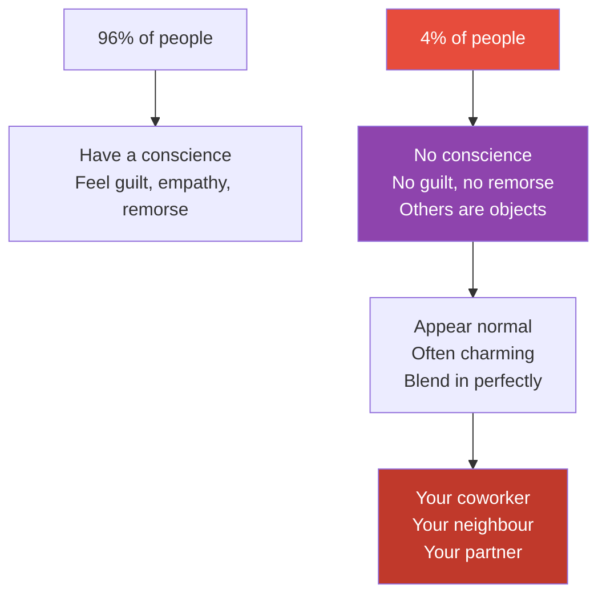

# The Sociopath Next Door — Martha Stout

> Martha Stout's central claim is simple and chilling: 1 in 25 people walking among us has no conscience.
> No guilt. No remorse. No emotional connection to other human beings.
> These are not the masked villains of crime dramas. They are your charming coworker, your attentive neighbour, your flattering date.
> They look like everyone else because conscience is invisible — and we are hardwired to assume everyone has one.
> This book teaches you to recognise the absence of something you've always taken for granted, and to protect yourself from people who experience other humans as objects in a game.

---

## About the Author

Dr. Martha Stout spent 25 years on the clinical faculty at Harvard Medical School, specialising in the treatment of psychological trauma.
Through her work with trauma survivors, she repeatedly encountered the devastation caused by individuals with antisocial personality disorder — and became convinced that the general public was dangerously uninformed about how common and how ordinary these people appear.

---

## The Big Idea

- <b style="color: #2980b9">4% of the population — 1 in 25 — meets the clinical criteria for antisocial personality disorder</b>
- That means in a company of 250 people, roughly 10 have no conscience
- They do not lack intelligence, charm, or social skill — they lack the ability to feel guilt, remorse, or genuine attachment
- <b style="color: #e74c3c">They are not all violent criminals — most are "successfully" integrated into society</b>, leaving a trail of confused, damaged people behind them
- The most dangerous thing about a sociopath is not what they do — it's that you cannot imagine someone doing what they do without feeling anything

---

## What a Sociopath Actually Looks Like

Stout dismantles the Hollywood image. Real sociopaths are rarely dramatic:

| Myth | Reality |
|------|---------|
| Violent serial killer | Mostly non-violent — they destroy through manipulation, not force |
| Cold, robotic demeanour | Often the most charming person in the room |
| Obviously evil | Frequently described as "wonderful" by people who haven't been targeted yet |
| Rare and extreme | 1 in 25 — more common than anorexia, and roughly as common as left-handedness |
| Can be reformed | Conscience cannot be taught to someone who lacks the neurological hardware for it |

---

## The Pity Play

Stout identifies the single most reliable red flag:

- <b style="color: #e74c3c">Consistent appeals to your sympathy are the most common calling card of a sociopath</b>
- A person who repeatedly positions themselves as the victim — despite evidence of their own harmful behaviour — is using your empathy as a weapon
- Normal people occasionally need sympathy. Sociopaths use the pity play as a primary strategy.
- If someone you know is constantly "hard done by" and it's always someone else's fault, pay very close attention

---

## Why Conscience Makes You Vulnerable

Stout explains the cruel irony:

- People with conscience cannot imagine life without it — so they project conscience onto everyone
- When a sociopath behaves badly, normal people assume there must be a reason: "They must be hurting. They didn't mean it. If I just show them enough love..."
- <b style="color: #2980b9">Your empathy is precisely what the sociopath exploits</b>
- The more compassionate you are, the more vulnerable you are — because you keep giving chances that a sociopath interprets as permission

---

## The 13 Rules for Dealing with Sociopaths

Stout's practical defence framework:

1. Accept that some people have no conscience — refusing to believe it makes you a target
2. Judge by actions, not words — in a contest between appealing words and a pattern of behaviour, trust the pattern
3. **The Rule of Threes** — one lie or broken promise could be a misunderstanding; two is very serious; three means you're dealing with a pathological liar — cut contact
4. Question authority — sociopaths often hide behind positions of power
5. Suspect flattery — when praise feels excessive or unearned, it's probably strategic
6. Redefine your concept of respect — fear is not respect
7. Do not try to outsmart them — this is their game and they've been playing it their whole life
8. <b style="color: #27ae60">The best defence is to refuse to play</b> — avoid contact entirely
9. Question your tendency to pity — especially when the person asking for pity has harmed you
10. Do not try to fix them — you cannot install software on hardware that doesn't support it
11. Never agree to help a sociopath conceal their true character — you become complicit
12. Defend your psyche — refuse to feel responsible for what they do
13. Living well is the best revenge — don't waste your life trying to change someone who can't change

---

## The Boredom Problem

Stout makes an underappreciated point about sociopaths and boredom:

- Without emotional connections, relationships, or genuine goals, sociopaths are chronically bored
- Much of their manipulative behaviour is driven not by strategic necessity but by entertainment
- <b style="color: #e74c3c">They play with people the way a cat plays with a mouse — not because they need to, but because the game itself is stimulating</b>
- This is why their behaviour often seems disproportionate or pointless to normal observers

---

## Why They Succeed

Stout argues that modern Western society inadvertently rewards sociopathic traits:

- Charisma, fearlessness, and dominance are celebrated in business and politics
- The "winner takes all" culture provides cover for ruthless behaviour
- Empathy and conscientiousness are seen as weaknesses in competitive environments
- Sociopaths thrive in systems that reward short-term results and don't audit the human cost

---

## The Verdict

*The Sociopath Next Door* is a deeply uncomfortable book, and that's precisely its value. Stout writes with the calm authority of a clinician who has seen the damage up close, and her goal is not to terrify but to inform. The 1-in-25 statistic alone is worth the price of admission — it recalibrates your expectations in every social environment.

The book's limitation is that it stays largely at the awareness level. It tells you how to recognise sociopaths and why to avoid them, but it offers less guidance on recovery for people who've already been deeply entangled. For that, pair it with *The Gaslight Effect* or *Emotional Blackmail*.

The Rule of Threes, however, is one of the most practical pieces of advice in any psychology book: one broken promise is human; three is a pattern — and patterns don't lie.

---

## Related Reading

- [[Snakes in Suits - Babiak & Hare|Snakes in Suits]] — Sociopathy in the corporate environment, with Hare's psychopathy research
- [[In Sheep's Clothing - George K. Simon|In Sheep's Clothing]] — The covert-aggression tactics sociopaths use in everyday interactions
- [[Emotional Blackmail - Susan Forward|Emotional Blackmail]] — When manipulation targets your conscience through FOG
