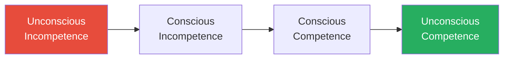
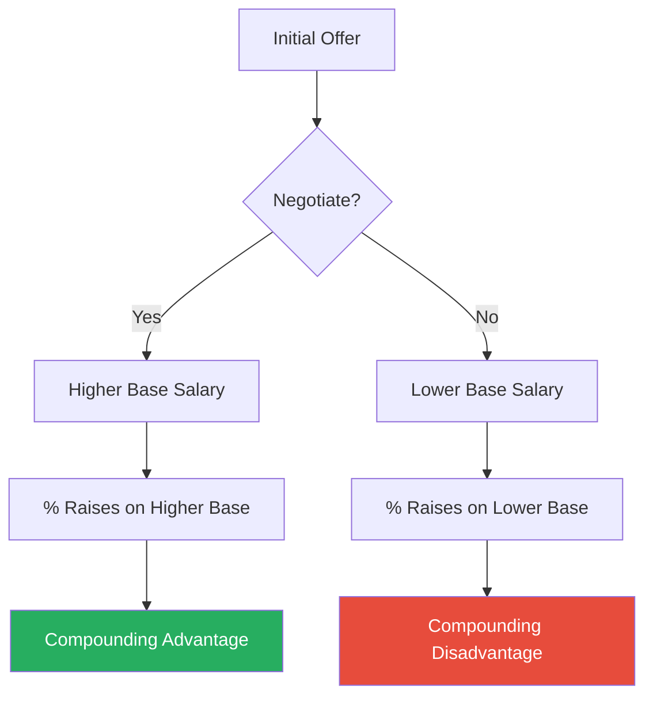
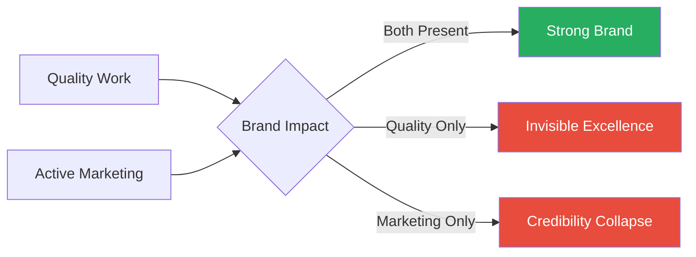
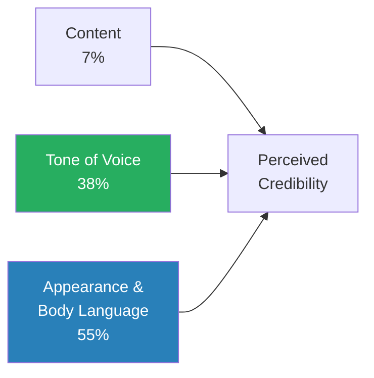
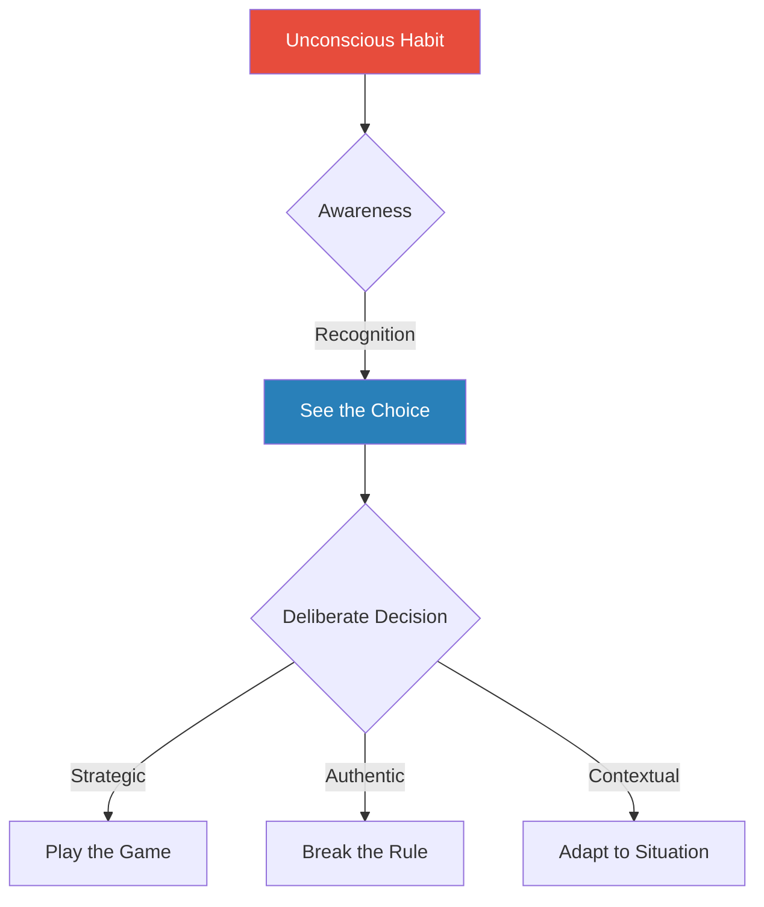

# Nice Girls Don't Get the Corner Office — Lois P. Frankel

> Lois Frankel's thesis is blunt: socialisation teaches people to play small, and playing small is a career-killing habit. She catalogues 133 unconscious behaviours — from over-apologising to volunteering for low-visibility work — that undermine professional advancement regardless of competence. The book is framed around women's workplace experience, but the underlying dynamics apply to anyone conditioned toward deference, modesty, or the belief that results speak for themselves. Frankel's model of the world is that the workplace is a game with unwritten rules, and those who refuse to learn the rules do not win on merit — they simply lose by default. The book's real value is diagnostic: reading through the list of mistakes forces an honest confrontation with which patterns you are unconsciously enacting, and Frankel provides actionable coaching tips for each one.

---

## About the Author

Lois P. Frankel holds a PhD in counselling psychology and has spent over twenty-five years coaching executives, managers, and high-potential professionals at Fortune 500 companies. She is the president of Corporate Coaching International, a Pasadena-based firm specialising in leadership development, team building, and executive coaching. Her coaching practice gave her a front-row seat to the behavioural patterns that separate people who advance from people who stagnate despite doing excellent work — and the 133 mistakes in this book are drawn directly from thousands of hours observing, diagnosing, and correcting those patterns in real professionals. The original edition was published in 2004 and became a bestseller; a revised 10th anniversary edition followed in 2014 with updated advice on social media, personal branding, and the evolving dynamics of the modern workplace. Frankel's background in psychology gives her a distinctive lens: she sees self-sabotaging workplace behaviours not as character flaws but as conditioned responses — learned in childhood, reinforced through socialisation, and entirely correctable once they are made conscious.

---

## The Big Idea

- Frankel's central argument is that <b style="color: #27ae60">competence is table stakes</b> — necessary for entry, but never sufficient for advancement
- The workplace is a game, and games have rules that extend far beyond doing good work
- Those rules include self-promotion, political fluency, negotiation, relationship management, and strategic communication
- People who were raised to be polite, agreeable, and hardworking often lack these skills — not because they cannot learn them, but because they were never taught that the skills matter
- The result is a population of talented, diligent professionals who do everything right except the things that actually determine whether they advance

---

- The book identifies 133 specific behavioural mistakes grouped into seven categories:
  - How you play the game
  - How you act
  - How you think
  - How you brand and market yourself
  - How you sound
  - How you look
  - How you respond
- Each mistake comes with a concrete coaching tip for correction
- The cumulative effect is less a self-help book and more a diagnostic manual — a mirror held up to the reader's professional habits, revealing the gap between how they behave and how they need to behave to get what they want
- The discomfort of recognition is the point: Frankel expects readers to wince at several entries, and the wince is the first step toward change

---

- The uncomfortable truth at the book's core: <b style="color: #27ae60">the people who get promoted are not always the people who work hardest — they are the people who ensure the right people see their work, who build the right relationships, who negotiate for what they want, and who understand that perception is not a distortion of reality but a component of it</b>
- This is not a cynical observation — it is a structural one
- Organisations are run by human beings with limited attention, imperfect information, and social biases
- The professional who understands this and acts accordingly is not gaming the system — they are operating within the system as it actually exists rather than as they wish it existed

---

## Key Concepts at a Glance

| Concept | One-line summary |
|---------|-----------------|
| **The Workplace-as-Game Model** | Business has rules, boundaries, strategies, winners, and losers; treating it as a pure meritocracy is the foundational mistake |
| **The Unconscious Competence Ladder** | Four-stage behavioural change model: unconscious incompetence → conscious incompetence → conscious competence → unconscious competence |
| **The 7-38-55 Credibility Rule** | Only 7% of credibility comes from content; 38% from tone; 55% from appearance and body language |
| **Employee vs Partner Mindset** | Employees do the job and wait; partners expand boundaries, create value, and shape direction |
| **The Quid Pro Quo Model** | Workplace relationships run on implicit exchange; every favour is a chip deposited into a relational account |
| **The Elevator Speech** | A concise, rehearsed statement of who you are, what you do, and what impact you create |
| **The DESCript Model** | Structured feedback: Describe behaviour, Explain impact, Specify change, state Consequences |
| **The Fait Accompli** | A manufactured "final" decision that is almost always still negotiable before implementation |
| **The Miracle Trap** | Consistently exceeding impossible expectations raises the baseline, creating unsustainable demand |
| **Personal Branding** | The deliberate construction of a professional identity that communicates a promise of performance |

---

## Chapter 1: Getting Started — The Unconscious Competence Model

*Before diving into the 133 mistakes, Frankel lays the conceptual foundation for how behavioural change works — and why the discomfort of self-recognition is the necessary first step.*

- She introduces the <b style="color: #2980b9">Unconscious Competence Model</b>, a four-stage framework borrowed from psychology that describes how people move from ignorance to mastery of any behaviour

**Stage 1 — Unconscious incompetence:**
- You are making the mistake and you do not know it
- This is where most readers begin with most of the 133 behaviours
- You have been over-apologising, volunteering for invisible work, or hedging your language your entire career, and it has never occurred to you that these habits are costing you anything

**Stage 2 — Conscious incompetence:**
- You now recognise the behaviour, but you cannot yet correct it consistently
- This is the most uncomfortable stage — you catch yourself mid-sentence adding an unnecessary "sorry" or volunteering for a thankless task
- <b style="color: #e74c3c">Many people quit here because the discomfort of awareness feels worse than the ignorance that preceded it</b>

**Stage 3 — Conscious competence:**
- You can perform the corrected behaviour, but it requires deliberate effort
- You pause before speaking and consciously eliminate the qualifier
- You draft the email, delete the preamble, and send it
- It works, but it does not feel natural yet

**Stage 4 — Unconscious competence:**
- The corrected behaviour is now automatic — you no longer need to think about it
- The declarative communication style, the refusal to apologise unnecessarily, the habit of self-promotion — these have become your default operating mode

The four stages move from ignorance (you do not know you are making the mistake) through painful awareness and effortful correction, until the new behaviour becomes automatic.

---

> [!example] Bonnie the Purchasing Manager — Passed Over Three Times
> - Bonnie was a purchasing manager at a chemical company who came to coaching after being passed over for promotion three times
> - She was technically excellent, universally liked, and worked longer hours than anyone on her team
> - When Frankel observed her in meetings, the problem was immediately visible: Bonnie spoke in questions rather than statements, apologised before making suggestions, and deflected credit to her team whenever her contributions were acknowledged
> - She was a textbook case of unconscious incompetence — she had no idea these habits were undermining her
> - Over six months of coaching, Bonnie moved through the stages: first the painful recognition, then the effortful correction, and finally the natural confidence that came from speaking as though she believed what she was saying
> - She was promoted within a year
> **The lesson:** Self-sabotaging behaviours are not personality traits — they are learned habits, and learned habits can be unlearned.

> [!tip] Core Insight
> The 133 mistakes are not personality flaws — they are conditioned responses. Nobody is expected to fix all 133. The goal is to identify the handful that are most damaging and work through the stages of competence for each.

---

## Chapter 2: How You Play the Game

*This is the book's foundational chapter, containing Frankel's most important conceptual claim: the workplace operates as a game, and people who pretend otherwise lose.*

### The Game Metaphor

- <b style="color: #27ae60">Every organisation has unspoken expectations about how to communicate, how to position yourself, and how to navigate hierarchy</b>
- Those who learn these unwritten rules advance; those who ignore them are advanced past
- The game has different playing fields for different organisations, different managers, and different cultures
- What works at a startup will not work at a defence contractor
- What impressed your last boss may irritate your next one
- The first task is to <b style="color: #2980b9">map the local rules</b> — observe who is winning and identify what they do differently from those who are stuck

> [!example] Barbara's Banking Playbook Fails at Chemicals
> - Barbara, a banking executive, transferred to a specialty chemicals company
> - She had been successful in banking by being aggressive, direct, and transactional — the rules of the banking game
> - In her new environment, the culture valued consensus-building, relationship cultivation, and a less confrontational style
> - Barbara applied her old playbook and was isolated within months
> - She had not failed at the work — she had failed at the game
> - The rules had changed and she had not noticed, because she had never learned to see the rules as rules
> **The lesson:** Every environment has its own game — and the rules are never posted on the wall.

> [!example] Monica the Analyst — Three Months of Observing
> - Monica joined a highly political consulting firm and spent her first three months doing nothing but observing
> - She watched who spoke first in meetings, how decisions were really made, who had informal influence despite modest titles, and what kinds of initiatives got funded
> - By the time she started contributing, she understood the playing field
> - Her contributions landed with precision because they were calibrated to the culture, not to her assumptions about what should work
> **The lesson:** Map the terrain before you make your move.

> "Business is a game, and you can learn to play it to win."

- The game metaphor also explains why some people feel that advancement is mysterious or arbitrary
- It is not arbitrary — it just follows rules that were never explicitly stated
- The person who complains "I do everything right and I still don't get promoted" is usually doing everything right within the rules of one game while the organisation is playing a different one

---

### Playing at the Edges of the Field

- <b style="color: #27ae60">Points are won at the edges of the field, not in the safe centre</b>
- Staying within the narrowest possible interpretation of your role is a guaranteed path to irrelevance
- People who play it safe — who do exactly what is asked and nothing more — are never seen as leadership material
- Leadership, by definition, requires initiative, risk, and the willingness to operate beyond your formal mandate

> [!example] Daniel the Invisible Middle Manager
> - Daniel was a reliable middle manager at a manufacturing company
> - He was never late, never dropped a deliverable, and never caused a problem — he was also never promoted
> - When Frankel asked his manager about him, the response was revealing: "Daniel is great — I never have to worry about him"
> - That was exactly the problem — Daniel had made himself so invisible through reliability that nobody thought about him at all
> - He was furniture — functional, dependable, and entirely forgettable
> - The people who got promoted were the ones who proposed new initiatives, challenged assumptions, and occasionally failed publicly — because those behaviours registered as leadership
> **The lesson:** Reliability without visibility makes you essential but unpromotable.

---

### Hard Work Is Not a Strategy

> "Nobody ever got promoted purely because they worked hard."

- This is Frankel's most direct assault on the meritocratic myth, and she returns to it throughout the book
- <b style="color: #e74c3c">Hard work is the baseline expectation — exceeding it produces more work, not more recognition</b>

The mechanism is straightforward:

- While one person is heads-down executing, someone else is building relationships with the people who make promotion decisions
- The person who decides your next role knows the colleague who had coffee with them far better than the person who stayed late to finish a report
- Decision-makers are human beings with limited information, and they promote people they know, trust, and feel comfortable with
- You can only become known through interaction, not through output alone

> [!example] Pamela vs Greg — Star Performer Loses to Networker
> - Pamela, a star performer at a technology company, worked twelve-hour days and consistently produced the best results on her team
> - When a leadership position opened, Pamela assumed she would be the obvious choice
> - Instead, the role went to a colleague named Greg, whose output was competent but unremarkable
> - Greg had spent years cultivating relationships with senior leaders — attending social events, volunteering for cross-functional projects, and making himself visible in ways that Pamela considered a waste of time
> - Greg was not more talented than Pamela — he was more known
> **The lesson:** Quality work alone is never sufficient. Relationship-building is a professional discipline, not a frivolous distraction.

- The corrective is to treat relationship-building as an investment of time that produces returns
- Frankel recommends that professionals spend a deliberate portion of each day on relationship cultivation:
  - Lunches and coffees
  - Hallway conversations
  - Social interactions that build the kind of familiarity that influences decisions

---

### Office Politics Is Not Optional

- <b style="color: #e74c3c">Avoiding office politics does not protect you — it excludes you from the system through which decisions are actually made</b>
- Frankel rejects the common view that avoiding politics is a sign of integrity
- <b style="color: #2980b9">Politics is the business of relationships and exchange</b>

She uses the analogy of Abraham Lincoln and the Thirteenth Amendment:

- Lincoln cut deals, traded favours, and engaged in ruthless political manoeuvring to abolish slavery
- He promised patronage appointments to wavering congressmen
- He timed the vote to coincide with military victories that made opposition politically costly
- The cause justified the means — and the means were unambiguously political
- Frankel's point is not that workplace politics is noble, but that it is the mechanism through which things get done

The <b style="color: #2980b9">quid pro quo model</b> works as follows:

- Every workplace favour earns a chip
- Every time you help a colleague, cover someone's work, or share information, you are depositing into an account
- The skill is having more chips than you need and knowing when to cash them
- People who give freely without any awareness of reciprocity are exploited
- People who only take are shunned
- The political operator understands the implicit exchange and manages it deliberately

> [!example] Elaine the Nonprofit Director — "Above Politics"
> - Elaine, a nonprofit director, prided herself on being "above politics"
> - She refused to attend social events, declined to join cross-departmental committees, and focused exclusively on delivering results within her own department
> - When budget cuts came, Elaine's department was slashed disproportionately
> - Not because her work was less valuable, but because she had no allies to defend her in the rooms where allocation decisions were made
> - She had no chips to cash because she had never invested in the relational economy
> **The lesson:** Political disengagement is not principled — it is unilateral disarmament.

> [!example] Roberta's Strategic Generosity
> - Roberta made a deliberate practice of helping colleagues in other departments, offering her team's expertise for cross-functional projects, and attending every social event she could
> - When Roberta's team needed budget for a critical project, she had allies in every department who owed her favours and were willing to advocate on her behalf
> - The project was funded in a single meeting
> - Roberta's political engagement was not manipulative — it was strategic generosity that created a network of mutual obligation
> **The lesson:** Building relational capital is not manipulation — it is the mechanism through which organisations fund, protect, and promote.

> [!tip] Core Insight
> The workplace runs on implicit exchange. Every favour deposits a chip; political fluency means accumulating chips deliberately and knowing when to spend them.

---

### Naivety as a Professional Liability

- Taking what people say at face value without examining their motives is a behaviour Frankel identifies as charming in junior professionals and devastating in senior ones
- In the early stages of a career, naivety invites mentorship — senior colleagues find it endearing and want to help
- But at senior levels, <b style="color: #e74c3c">naivety destroys credibility</b>
- If you are a director who cannot read a room, who takes promises at face value, and who fails to see when you are being managed or manipulated, you are not seen as trusting — you are seen as incompetent

> [!example] Lisa and Adam — Undermined from Within
> - Lisa, a talented manager, hired a new team member named Adam who came with strong political connections to senior leadership
> - Adam began undermining Lisa almost immediately — taking credit for her work, contradicting her in meetings, and building a narrative with his sponsors that Lisa was underperforming
> - Lisa noticed the signs but took Adam's reassurances at face value: "He said he was just trying to help"
> - By the time Lisa recognised the pattern, Adam had successfully positioned himself as her replacement
> - The damage was not that Adam was politically skilled — it was that Lisa refused to see what was in front of her
> **The lesson:** When someone's words consistently fail to match their actions, believe the actions.

- The mechanism Frankel identifies is a socialisation pattern:
  - Many people are trained to give others the benefit of the doubt, to assume good intentions, and to avoid questioning motives
  - This training is useful in personal relationships where trust is the goal
  - In professional environments where resources are scarce and ambitions compete, it is a vulnerability
- The corrective is not paranoia — it is <b style="color: #27ae60">healthy scepticism</b>

---

### Mentors vs Sponsors

- Frankel makes a distinction that many professionals miss: <b style="color: #2980b9">mentors offer advice; sponsors offer advocacy</b>
- A mentor is someone you talk to
- A sponsor is someone who talks about you to decision-makers when you are not in the room

She cites Harvard Business Review research (Ibarra, Carter & Silva, 2010):

- Professionals are systematically "overmentored and undersponsored"
- Many people have advisors who help them think through problems
- Far fewer have advocates who actively spend political capital on their behalf

The distinction matters because:

- <b style="color: #e74c3c">Promotion decisions happen in closed rooms</b>
- If nobody with influence is saying your name in those rooms, your candidacy does not exist — regardless of your qualifications
- A mentor can help you think about what you want
- A sponsor can help you get it

> [!example] Sandra's Three Mentors vs One Sponsor
> - Sandra, a marketing executive, had three mentors — all generous with their time, all offering excellent advice
> - Sandra felt supported and well-guided
> - But when a VP position opened, none of Sandra's mentors advocated for her — they were advisors, not advocates
> - The position went to a colleague who had a single sponsor — a senior executive who went to the selection committee and said, "This is the person for this role"
> - That one act of sponsorship was worth more than three years of mentoring
> **The lesson:** Sponsorship cannot be demanded, but it can be cultivated — be visibly competent, be reliable, and make your sponsor look good.

| Mentors | Sponsors |
|---------|----------|
| Offer advice and guidance | Offer advocacy and political capital |
| Help you think through problems | Put your name forward in closed rooms |
| Available on request | Invest their reputation on your behalf |
| No risk to themselves | Risk their credibility if you fail |

Sponsorship requires a different question: not "will someone mentor me?" but "am I someone worth sponsoring?"

---

## Chapter 3: How You Act

*This chapter moves from the conceptual to the behavioural — the unconscious patterns of action that communicate subservience, over-compliance, and a willingness to be exploited.*

### Doing the Work vs Getting the Work Done

- Frankel draws a distinction that sounds semantic but is organisationally profound: <b style="color: #27ae60">promotions reward people who get work done, not people who do the work</b>
- There are two orientations:
  - **Achievers** derive satisfaction from personal output
  - **Leaders** derive satisfaction from orchestrating outcomes through others
- At junior and mid-levels, being an achiever is sufficient and even desirable
- At senior levels, it becomes a trap

> [!example] Kristen the Manager Who Could Not Stop Doing Her Old Job
> - Kristen, a newly promoted manager, arrived early on her first day, made copies for the team meeting, fetched coffee for her new direct reports, and spent the afternoon completing a report that belonged to a junior team member
> - Within weeks, her team had learned that Kristen would pick up any slack — and they let her
> - She was working fourteen-hour days while her team left at five
> - Worse, her own manager began to question whether Kristen was ready for leadership: "If she's still doing the work herself, she's not managing"
> **The lesson:** Delegation is not laziness — it is the core competency of leadership.

- The pattern is rooted in the discomfort of delegation:
  - People promoted for individual output often feel guilty about assigning work to others
  - It feels like laziness, or like asking people to do things they "should" be doing themselves
  - But the transition from contributor to manager requires a fundamental identity shift
  - From "I am valuable because of what I produce" to "I am valuable because of what my team produces"

> [!example] Robert's Immediate Delegation
> - Robert, upon receiving his promotion, immediately delegated every operational task he had previously owned
> - He spent his first month meeting individually with each team member to understand their strengths, then restructured assignments to align with capabilities
> - Within a quarter, the team's output had increased while Robert's personal workload had decreased
> - His manager saw this as a sign of leadership readiness and began grooming Robert for the next level
> **The lesson:** The leader's job is not to produce — it is to orchestrate.

---

### The Miracle Trap

> "Being told to wait is a deflection, not career advice."

- Consistently exceeding impossible expectations does not earn recognition — it raises the baseline
- Frankel calls this <b style="color: #2980b9">the miracle trap</b>: year one's extraordinary effort becomes year two's minimum requirement
- Meanwhile, the energy spent performing miracles is not available for relationship-building, strategic thinking, or visibility
- You become trapped in a cycle where you must keep performing at an unsustainable level just to be perceived as adequate

> [!example] Anita's Unsustainable First Year
> - Anita was hired into a demanding role and, eager to prove herself, delivered results that far exceeded expectations in her first year
> - She worked weekends, stayed late, and produced work that her manager openly described as "miraculous"
> - In her second year, Anita tried to maintain a more sustainable pace
> - She was still performing at a level that would have been considered excellent by any objective standard — but relative to her first-year baseline, she appeared to be declining
> - Her manager expressed concern about her "trajectory"
> - Anita had set the anchor too high, and everything that followed was measured against an unsustainable peak
> **The lesson:** The first impression of your capability becomes the ruler against which all subsequent performance is measured.

- The mechanism is <b style="color: #2980b9">psychological anchoring</b>:
  - Human perception is relative, not absolute
  - If your baseline is miracles, anything short of a miracle registers as underperformance
  - This is why expectation management is not about lowering your standards — it is about ensuring your standards are visible and sustainable

> [!abstract] The Options Response (Replacing Silent Compliance)
> 1. Receive an impossible request
> 2. Identify the real trade-offs (scope, timeline, quality, resources)
> 3. Present two or three options: "I can deliver X in this timeline, or Y if we extend by two days. Which do you prefer?"
> 4. Let the requester own the decision
> 5. Prevent the establishment of an unsustainable baseline

- Options signal competence and control
- <b style="color: #e74c3c">Silent compliance signals exploitability</b>

> [!example] David the Project Manager Learns to Present Options
> - David burned out in his second year after absorbing unlimited pressure without complaint
> - He started responding to every unreasonable request with a calm presentation of two or three options, each with clear trade-offs
> - His managers initially found this annoying — they were used to David simply making things happen
> - But over time, they came to respect it — David was seen as someone who understood complexity and managed resources wisely
> - He was promoted within eighteen months
> **The lesson:** Managing expectations is not underperformance — it is a leadership skill.

> [!tip] Core Insight
> The miracle trap turns your best year into your worst enemy. Options replace silent compliance, signal competence, and prevent unsustainable baselines.

---

### The Employee vs Partner Divide

- Frankel draws a sharp line between <b style="color: #2980b9">employee thinking</b> and <b style="color: #2980b9">partner thinking</b>
- The distinction maps onto the divide between people who stagnate at mid-level and people who advance into leadership

| Employee Thinking | Partner Thinking |
|-------------------|-----------------|
| Collects paychecks | Gains transferable skills |
| Waits for assignments | Seeks opportunities and makes proposals |
| Follows instructions | Questions whether the instructions serve the goal |
| Protects their territory | Expands the pie |
| Does the job | Asks "what else does this connect to?" |

- Doing your job well is employee thinking
- Proposing initiatives nobody requested is partner thinking
- <b style="color: #27ae60">Organisations reward people who expand the pie, not those who efficiently consume their assigned slice</b>

> [!example] Diane the Financial Analyst — Thinking Like a Partner
> - Diane, a financial analyst, completed a routine quarterly report and noticed a pattern in the data suggesting the company was losing money on a particular product line
> - An employee would have noted the anomaly and moved on
> - Diane, thinking like a partner, put together a brief analysis of the issue and emailed it to her VP with a proposed solution
> - The VP was impressed — not because the analysis was brilliant, but because Diane had taken initiative beyond her job description
> - She was invited to present her findings to the leadership team, and the resulting visibility accelerated her next promotion
> **The lesson:** The act of proposing signals leadership potential in a way that flawless execution of assigned tasks never can.

- The shift is from reactive to proactive, from task-focused to outcome-focused
- The partner mindset requires comfort with ambiguity and a willingness to be wrong
- Not every proposal will be accepted, and not every initiative will succeed
- But the act of proposing registers as leadership in a way that silent execution does not

---

### Volunteering for Low-Visibility Work

- A related behavioural pattern Frankel identifies is the tendency to volunteer for work that is operationally necessary but strategically invisible:
  - Organising team events
  - Taking meeting notes
  - Cleaning up shared documents
  - Managing logistics for offsite meetings
- This work needs to be done, and the person who does it is often genuinely appreciated in the moment
- <b style="color: #e74c3c">But it is never the basis for a promotion — nobody was ever elevated to a leadership position because they organised great birthday parties</b>

> [!example] Peggy the Social Coordinator
> - Peggy had become the unofficial social coordinator for her department
> - She organised every team lunch, every holiday celebration, and every going-away party
> - Her colleagues loved her for it
> - But when Peggy asked her manager why she had not been considered for a leadership role, the answer was telling: "I think of you more as a team-builder than a strategic thinker"
> - Peggy's visibility was high — but it was the wrong kind of visibility
> - She was known for warmth and hospitality, not for strategic contribution
> **The lesson:** Before volunteering, ask: does this build the kind of visibility that advances me, or does it just get done?

---

## Chapter 4: How You Think

*This chapter addresses the internal mental models that shape behaviour — the beliefs, assumptions, and thought patterns that keep people playing smaller than their capabilities warrant.*

### The Failure to Negotiate

- Frankel devotes significant attention to the failure to negotiate
- People who do not negotiate for themselves consistently receive less — less pay, fewer opportunities, and lower recognition — regardless of actual performance

She cites research by Dr. Lisa Barron at UC Irvine:

- MBA graduates who negotiated their starting salaries received significantly more than those who accepted the initial offer
- The gap was not about merit — it was about asking
- The same credential, the same school, the same job — and yet the outcomes diverged based on a single behavioural choice

<b style="color: #2980b9">Three psychological barriers</b> prevent self-negotiation:

- **Feeling unentitled** — the belief that you must prove yourself before you have earned the right to ask
  - This creates a perpetual deferral: you will ask after the next project, after the next review, after the next year
  - The right moment never arrives because the standard for "enough proof" keeps moving
- **Anchoring to the offer** — equating your worth with what you are offered rather than what you can justify
  - When an organisation offers you a salary, it is not telling you what you are worth — it is telling you the minimum it thinks you will accept
  - The offer is a starting position, not a verdict
- **The prove-first trap** — wanting to demonstrate value before making requests, which means you never ask
  - This is particularly insidious because it feels responsible: "Let me show what I can do first"
  - But by the time you have shown what you can do, the terms have been set, and changing them requires a much harder conversation

> [!example] Rachel and Theresa — The Compounding Cost of Not Negotiating
> - Rachel and Theresa were hired into the same role at the same company on the same day
> - Rachel negotiated her starting salary; Theresa did not
> - The gap was modest at first — a few thousand dollars
> - But over five years, with percentage-based raises applied to a higher base, Rachel's total compensation exceeded Theresa's by a substantial margin
> - The cost of Theresa's failure to negotiate in that single conversation compounded over her entire career
> **The lesson:** A single negotiation conversation at the start can compound across an entire career.

The compounding effect of a single negotiation decision means that the cost of not asking grows every year — percentage-based raises amplify the original gap.

> [!tip] Core Insight
> Every offer is a starting point, not a verdict. Define what you want before the conversation begins, and frame requests in terms of organisational benefit rather than personal desire.

- The corrective is to treat every offer as a starting point, not a final answer
- Define what you want before the conversation begins
- Frame requests in terms of organisational benefit rather than personal desire
- Practise — Frankel recommends rehearsing negotiation conversations with a trusted colleague until the language feels natural
- <b style="color: #27ae60">The single greatest predictor of whether someone will negotiate is whether they feel comfortable doing so</b>

---

### Passive Patience vs Strategic Patience

- Frankel distinguishes between two kinds of patience:
  - **Strategic patience** — you deliberately wait because the timing is not right
  - **Passive patience** — you wait because you have been told to and lack the agency to push back

> "Being told to wait is a deflection, not career advice."

- When someone in authority tells you to be patient, it may be genuine counsel — or it may be a technique for managing your expectations downward
- The person who tells you "your time will come" faces no cost for that promise:
  - If they leave the organisation, their successor has no knowledge of the commitment
  - If priorities change, the promise evaporates
- <b style="color: #e74c3c">Verbal commitments without timelines, written documentation, or structural mechanisms are not commitments — they are intentions, and intentions decay</b>

> [!example] Kyoko's Evaporating Promise
> - Kyoko, a high-performing professional, was told by her manager that a promotion was coming and she just needed to "be patient"
> - Kyoko waited — six months later, her manager transferred to another division
> - The new manager knew nothing about the promotion promise and had her own priorities for the team
> - Kyoko started over — years of patience rendered worthless by a single personnel change
> **The lesson:** A promise without a date is not a promise — it is a wish.

- She contrasts this with a colleague of Kyoko's who responded to the same "be patient" counsel with: "I appreciate that. Can we agree on a specific date to revisit this conversation?"
- That single question transformed a vague intention into a concrete commitment
- When the review date arrived, the conversation happened — not because the manager was eager to have it, but because a date had been set and avoiding it would have been conspicuous

The corrective:

- Wait if waiting is strategic, but pin down the timeline
- Get the commitment in writing if possible
- Make clear that your patience is a choice, not a default

---

### The Fait Accompli

- One of Frankel's most practical insights concerns the <b style="color: #2980b9">fait accompli</b> — the manufactured irreversible decision
- When told "it's too late" or "that's just how it is" or "we've already decided," most people comply
- The technique is powerful because it exploits two psychological tendencies:
  - The desire to avoid conflict
  - The assumption that authority figures are telling the truth about constraints
- <b style="color: #27ae60">But most organisational decisions are reversible before implementation</b>
  - Budget allocations that "have been finalised" can be revised
  - Office assignments that "are set" can be changed
  - Role definitions that "have been approved" can be renegotiated
- The fait accompli works only if the target accepts the frame

> [!example] The Office That Was Not Actually Reassigned
> - A client was told that her office was being reassigned to a more senior colleague and that the decision was final
> - Rather than accepting, she asked a simple question: "Has the move happened yet?"
> - The answer was no — it was scheduled for the following week
> - She responded with a calm, reasoned case for why she should keep her office, citing her client-facing role and the impression that the space made on visitors
> - The decision was reversed — the "final" decision had never been final; it had been presented that way to avoid the effort of a conversation
> **The lesson:** "Final" decisions are often just decisions nobody has challenged yet.

> [!abstract] The Broken Record Technique
> 1. Identify the fait accompli — a decision presented as irreversible
> 2. Ask whether implementation has actually occurred
> 3. Restate your position calmly and clearly
> 4. If dismissed, restate in slightly different words
> 5. Maintain emotional composure throughout — agitation gives them a reason to dismiss you
> 6. Continue until genuine dialogue opens

- The key is emotional composure
- If you become agitated or confrontational, you give the other party a reason to dismiss you
- If you remain calm and simply keep restating your position, the pressure shifts to them to justify their decision

> [!example] Thomas Restores His Department's Headcount
> - Thomas, a manager, was told that his department's headcount had been reduced by two positions as part of a "final" reorganisation
> - Thomas did not accept the frame — he requested a meeting with the VP who had made the decision
> - He presented data on his department's workload and the revenue impact of the reduction, and calmly repeated his case across three meetings over two weeks
> - The positions were restored
> - Thomas's colleagues, who had accepted similar reductions without challenge, did not get their positions back
> - The difference was not bargaining power — it was willingness to push back
> **The lesson:** The fait accompli works only on those who accept the frame without challenge.

---

## Chapter 5: How You Brand and Market Yourself

*This chapter is about the gap between performance and perception — and why closing that gap requires deliberate, uncomfortable effort.*

### Waiting to Be Noticed

- Frankel identifies <b style="color: #e74c3c">waiting to be noticed</b> as one of the most damaging professional habits
- Decision-makers have limited attention
- They notice the people who tell them about their achievements, not the people who silently produce results
- Modesty is not interpreted as humility — it is interpreted as absence of impact

> [!example] Helena's Costly Deflection
> - Helena delivered a project under impossible conditions — tight timeline, insufficient resources, multiple stakeholder conflicts
> - The result was excellent, and when her VP congratulated her, Helena responded: "It was really nothing"
> - That single deflection cost her the leverage to request additional resources for the next phase
> - The VP, who had been ready to ask what Helena needed, took her at her word — if it was nothing, she did not need anything
> **The lesson:** When you minimise your achievements, people do not think "how humble" — they think "it must not have been that hard."

- The mechanism is what Frankel calls the <b style="color: #2980b9">modesty penalty</b>:
  - When you minimise your achievements, people do not think "how humble" — they think "it must not have been that hard"
  - Your own words become the frame through which your work is evaluated
  - If you describe a difficult project as "no big deal," you have taught others to see it that way

> [!example] Renee's Strategic Acceptance of Recognition
> - When congratulated on a similar achievement, Renee responded: "Thank you — I'm really proud of what the team accomplished under those conditions. We had to get creative with the timeline, and I think the result shows what we can do when we're given the right support"
> - This response accomplished three things simultaneously:
>   - It accepted the recognition
>   - It highlighted the difficulty of the work
>   - It planted a seed for future resource requests
> - Same achievement, radically different framing, radically different outcome
> **The lesson:** Accepting recognition gracefully is not arrogance — it is professional competence.

---

### Personal Branding

> "A personal brand is a promise of performance."

- Frankel argues that a <b style="color: #2980b9">personal brand</b> is not a luxury or an exercise in vanity — it is the mechanism through which professionals communicate their value in environments where attention is scarce
- A brand requires two things:
  - **Consistent quality** — the substance behind the promise
  - **Active marketing** — the communication of that substance
- Quality without marketing is like a good product without advertising — it exists, but nobody knows about it
- Marketing without quality is worse — it creates a promise you cannot keep, and the resulting credibility damage is severe

A personal brand requires both consistent quality and active marketing — either component alone leads to invisibility or credibility collapse.

- The test Frankel proposes is deceptively simple: complete the sentence <b style="color: #27ae60">"There goes a person who ___"</b>
- If you cannot finish that sentence with something specific and compelling, neither can anyone who might advocate for you
- When a promotion committee meets, your name will be accompanied by a one-sentence description in someone's head
- Is that sentence "the person who does reliable work" or "the person who built the AI capability and can turn ambiguity into structure"?
- The difference between those two descriptions is not a difference in work — it is a difference in branding

> [!example] The Client Who Could Not Articulate Her Value
> - A client was excellent at her job but could not articulate what made her distinctive
> - When Frankel asked her what she was best known for, she paused for thirty seconds and then said: "I guess I'm good at a lot of things"
> - That is not a brand — that is a blur
> - Frankel worked with her to identify the single thread that ran through her best work: she was the person who could take a chaotic, undefined situation and turn it into a structured plan with clear deliverables
> - Once she could articulate that — and once she began leading with it in conversations — her visibility shifted dramatically
> **The lesson:** If you cannot describe your distinctive value in one sentence, nobody else can either.

> [!tip] Core Insight
> A personal brand is a promise of performance. Without active management, your brand is defined by your weakest signals rather than your strongest work.

---

### The Elevator Speech

- The <b style="color: #2980b9">elevator speech</b> is Frankel's term for the prepared, rehearsed, concise description of who you are and what you do, ready for deployment at any moment
- The name comes from the scenario: you step into an elevator with a senior executive who asks, "What do you do?" — you have thirty seconds before the doors open
- Most people fumble this moment — they default to their job title, their department, or a vague description of their responsibilities
- None of these communicate impact

> [!abstract] Frankel's Elevator Speech Formula
> 1. State your title or role
> 2. Describe the impact you create (not just the activities you perform)
> 3. Add the distinguishing factor that makes you memorable

Example: "I lead the product development team — we're the group that brought X to market last year, which generated Y revenue. My focus is on turning complex technical capabilities into products that customers actually want to buy."

Compare with: "I'm in product development." Same person, same role, completely different impression.

> [!example] Two Introductions at a Networking Event
> - At a networking event, two attendees introduced themselves to the same senior executive
> - The first said: "I'm in IT"
> - The second said: "I run the systems that keep our customer data secure — we process about two million transactions a day, and my job is making sure none of them go wrong"
> - The senior executive spent twenty minutes talking to the second person and forgot the first within moments
> - The difference was not seniority, or even substance — it was preparation
> **The lesson:** Impact-oriented introductions create conversations; title-only introductions end them.

---

## Chapter 6: How You Sound

*Frankel argues that communication style is not a surface-level concern — it is the primary vehicle through which credibility is constructed or destroyed.*

### The 7-38-55 Rule

- Drawing on Albert Mehrabian's research, Frankel presents the <b style="color: #2980b9">7-38-55 rule</b>:
  - **7%** of perceived credibility comes from the content of what you say
  - **38%** from your tone of voice
  - **55%** from your appearance and body language
- This does not mean content is irrelevant — without substance, no amount of delivery can sustain credibility over time
- But it does mean that <b style="color: #27ae60">how you deliver a message matters far more than most people realise</b>
- A brilliant idea delivered hesitantly, with downcast eyes and a tentative voice, will be perceived as less credible than a mediocre idea delivered with confidence, eye contact, and vocal authority

Mehrabian's research suggests that over 90% of perceived credibility comes from delivery rather than content — making how you say something far more important than what you say.

The practical implications are immediate:

- If you want to be taken seriously, attend to delivery as carefully as you attend to content
- Prepare not just what you will say but how you will say it
- Practise the tone, the pace, the volume, and the posture
- Record yourself and listen — the gap between how you think you sound and how you actually sound is usually significant

---

### Preambles, Qualifiers, and Hedging

*Common credibility killers come in four flavours — and most people use all of them without realising it.*

| Credibility Killer | Example | What It Communicates | Corrective |
|-------------------|---------|---------------------|-----------|
| **Preambles** | "I was just thinking, and I know this might not be the right time, but maybe..." | This person is not confident | Delete everything before the point |
| **Qualifiers** | "Sort of," "kind of," "maybe," "I guess" | Uncertainty (regardless of intent) | Record yourself and count them |
| **Questions-as-statements** | "Don't you think we should reconsider?" | Surrendered ownership | "I think we should reconsider, and here's why" |
| **Apologetic framing** | "Sorry, but I think we have a problem" | Your contribution is a burden | "We have a problem I'd like to address" |

- <b style="color: #e74c3c">Preambles</b> bury the point — by the time the speaker reaches the actual idea, the audience has already formed a judgement: this person is not confident in what they are about to say
  - Frankel's corrective: delete everything before the point
  - "I recommend we look at the data from a different angle" — same idea, radically different perception
- <b style="color: #e74c3c">Qualifiers</b> signal ambivalence — "sort of," "kind of," "maybe," "I guess," "I think" (when used reflexively)
  - These words are verbal tics that rarely reflect actual uncertainty
  - But they communicate uncertainty regardless of intent
  - Frankel recommends recording yourself in a meeting and counting the qualifiers — most people are shocked at the frequency
- **Questions-as-statements** surrender ownership of your ideas
  - "Don't you think we should reconsider the timeline?" gives the listener permission to say "no" without engaging
  - The declarative alternative preserves ownership: "I think we should reconsider the timeline, and here's why"
- **Apologetic framing** signals that raising an issue is an imposition rather than a contribution
  - "Sorry, but I think we have a problem" — why are you apologising for identifying a problem?
  - Corrective: "We have a problem with the timeline that I'd like to address"

---

### The Headline Communication Model

- Frankel's recommended corrective for all of these patterns is the <b style="color: #2980b9">headline model</b>: lead with the bottom line, then support with two or three data points

> [!abstract] The Headline Model
> 1. Lead with the bottom line — state your position or recommendation first
> 2. Support with two or three data points
> 3. Format: "I propose we do X. Here is why: first, A; second, B; third, C."

This structure accomplishes several things simultaneously:

- Communicates confidence — you lead with a clear position
- Demonstrates analytical thinking — you have reasons, not just feelings
- Respects the audience's time — they know the point before the explanation begins
- Makes you quotable — your contribution will be remembered as a clear position rather than a meandering exploration

> [!example] Two Proposals to the Same Executive Committee
> - The first colleague spent four minutes building up to her recommendation, starting with background context, moving through the analysis, and arriving at her proposal at the end
> - The second colleague opened with "I recommend Option B, and I'll explain why in two minutes" and then delivered a crisp, structured argument
> - The committee adopted Option B
> - When Frankel later asked the CEO why, he said: "She seemed to know what she thought"
> - The first colleague knew what she thought too — but her communication style obscured it
> **The lesson:** Leading with the headline signals clarity of thought, even when the substance is identical.

> [!tip] Core Insight
> Lead with the bottom line. The audience should know your position before they hear your reasoning — not after.

---

### The DESCript Model

- For situations that require giving feedback or raising difficult issues, Frankel introduces the <b style="color: #2980b9">DESCript</b> framework

> [!abstract] The DESCript Framework
> 1. **D — Describe** the specific behaviour you observed, without interpretation or judgement: "In yesterday's meeting, you interrupted me three times while I was presenting"
> 2. **E — Explain** the impact of that behaviour: "When that happens, it disrupts my train of thought and makes it harder for me to communicate my ideas clearly"
> 3. **S — Specify** the change you want to see: "I'd like you to hold your questions until I've finished my section of the presentation"
> 4. **C — Consequences** — state the positive outcome if the change happens and the negative if it does not: "If we can do that, I think our presentations will be much more effective. If it continues, I'll need to raise it with our manager"

- The power of DESCript is its specificity
- Each component anchors the conversation in observable facts rather than feelings or interpretations:
  - "You're disrespectful" is an interpretation — it invites defensiveness
  - "You interrupted me three times in a single meeting" is a fact — it invites problem-solving

---

## Chapter 7: How You Look

*This is the shortest but most controversial chapter — Frankel acknowledges the tension upfront: appearance should not matter as much as it does, but pretending it does not matter is a form of self-sabotage.*

### Presence and Physical Credibility

- The 55% figure from Mehrabian's research means that more than half of your perceived credibility comes from visual signals:
  - Posture and eye contact
  - Gestures and facial expressions
  - Grooming and clothing
- This is not a judgement about what should be true — it is an observation about what is true

> [!example] Janet the Brilliant Engineer in Casual Clothes
> - Janet, a brilliant engineer, consistently wore casual clothing to client meetings at a firm where the norm was business formal
> - Janet believed her technical expertise should speak for itself — and it did, among her peers who knew her work
> - But clients who met her for the first time formed an immediate impression based on the visual mismatch between her appearance and the expectations of the environment
> - She was perceived as less senior than colleagues who were less technically capable but more visually aligned with the context
> **The lesson:** Visual presentation that creates friction means your substance has to overcome an extra barrier before it can land.

- The corrective is not about fashion or conformity for its own sake
- It is about <b style="color: #27ae60">strategic alignment</b> — ensuring that your visual presentation does not create friction that your substance then has to overcome
- Frankel's rule of thumb: dress one level above your current role — it communicates that you belong at the next level before anyone has formally put you there

> [!example] The Marketing Director's C-Suite Presentation
> - A marketing director was preparing for a presentation to the C-suite
> - Frankel coached her not just on content and delivery but on physical presentation:
>   - Posture that conveyed authority rather than deference
>   - Eye contact that was direct but not aggressive
>   - A speaking position that claimed the room rather than retreating to the corner
> - The presentation was successful, and the client later said the physical preparation was as important as the content preparation
> - Not because the executives were superficial, but because the body language gave her content permission to land
> **The lesson:** Physical presence is not superficial — it is the medium through which your content is received.

---

### Body Language and Spatial Presence

- Frankel identifies several body language patterns that undermine authority

| Pattern | What It Communicates | Corrective |
|---------|---------------------|-----------|
| **Taking up too little space** | "I am trying to be small" | Spread materials, use armrests, adopt open posture |
| **Tilting the head** | Deference or uncertainty (in authority contexts) | Neutral, level head position for declarative statements |
| **Excessive nodding** | Constant agreement, no independent judgement | Nod deliberately and sparingly, not reflexively |
| **Smiling during serious content** | Conflicting signal, confusion | Match facial expression to the message |

- <b style="color: #e74c3c">Taking up too little space</b> — sitting with arms close to the body, legs crossed tightly, materials pulled in — communicates "I am trying to be small"
  - The corrective: claim appropriate space, use the armrests, adopt an open posture that communicates comfort and ownership
- **Tilting the head** communicates curiosity and attentiveness — warm in social situations, but reads as deference or uncertainty when you are trying to project authority
- **Excessive nodding** — when overdone, it communicates constant agreement, undermining the perception of independent judgement
- **Smiling when delivering serious content** — a mismatch between expression and message confuses the audience

> [!tip] Core Insight
> More than half of your perceived credibility comes from visual signals. Attend to your physical presence as carefully as you attend to your words.

---

## Chapter 8: How You Respond

*The final chapter deals with how professionals respond to the situations, requests, and provocations that arise in daily work life — and how habitual response patterns reinforce or undermine professional standing.*

### Meetings as Marketing

> "Points are won at the edges of the field."

- Frankel argues that meetings are where reputations are built and brands are marketed
- <b style="color: #e74c3c">Skipping meetings or staying silent in them is a strategic error</b>
- She makes the provocative observation that meetings are called "meetings" not "workings" for a reason — they are opportunities to see and be seen, build relationships, and showcase expertise

Frankel describes a pattern she observed across twenty years of facilitating workshops:

- In nearly every mixed group, the first person to speak is a man
- Those who speak within the first few minutes of a meeting are consistently rated as more credible and more leadership-ready by observers, regardless of the substance of their contributions
- The <b style="color: #2980b9">primacy effect</b> — the tendency for first impressions to anchor subsequent perception — means that early contributors shape how the meeting unfolds and are remembered more vividly than latecomers

> [!example] Wei and Charlotte — Timing Trumps Quality
> - Wei and Charlotte were peers at a consulting firm with identical qualifications and similar performance ratings
> - Wei spoke within the first five minutes of every meeting, even if only to ask a clarifying question or to summarise what had been discussed
> - Charlotte waited until she had a fully formed thought, which often meant she spoke last or not at all
> - After a year, Wei was consistently rated as "high-potential" by leadership, while Charlotte was described as "quiet" and "needs to step up"
> - The irony: when Charlotte did speak, her contributions were often more insightful than Wei's
> - But perception was formed by frequency and timing, not by quality alone
> **The lesson:** In every meeting, speak within the first ten minutes — the contribution does not need to be brilliant, it needs to exist.

> [!abstract] Meeting Preparation Protocol
> 1. Before every meeting, prepare at least one contribution — a question, a data point, a summary of a key issue
> 2. Deliver it within the first ten minutes
> 3. The contribution does not need to be brilliant — it needs to exist
> 4. Frequency and timing shape perception more than quality alone

---

### Tolerating Inappropriate Behaviour

- Frankel identifies a pattern she calls <b style="color: #2980b9">tolerance of erosion</b> — the gradual acceptance of behaviours that, individually, seem too small to challenge but cumulatively create a dynamic of disrespect
- The colleague who consistently interrupts you
- The manager who takes credit for your ideas
- The peer who schedules over your meetings
- The team member who ignores your emails
- Each incident, taken alone, feels too minor to address: "It's not worth making a fuss"
- But the cumulative effect is that <b style="color: #e74c3c">others learn they can treat you this way without consequence — and the dynamic becomes self-reinforcing</b>

> [!example] Margaret and Paul — Months of Tolerated Interruptions
> - Margaret, a director, had a colleague named Paul who routinely interrupted her in meetings
> - Margaret tolerated it for months, reasoning that confrontation would be more disruptive than the interruptions
> - By the time she finally addressed it, the pattern was entrenched
> - Paul was genuinely surprised that Margaret objected, because she had never objected before
> - The longer you tolerate erosion, the harder it is to reverse, because the eroding party has come to see their behaviour as normal
> **The lesson:** Address erosion early, when it is still easy to frame as a minor adjustment rather than a confrontation.

- Frankel's corrective is to address erosion early, using the DESCript model:
  - "In yesterday's meeting, you interrupted me twice" [Describe]
  - "When that happens, it makes it harder for me to finish my point" [Explain]
  - "I'd appreciate it if you could hold your thoughts until I'm done" [Specify]
  - "I think that will make our meetings more productive for everyone" [Consequence]

> [!tip] Core Insight
> You teach people how to treat you. The longer you tolerate erosion, the harder it becomes to reverse — address it early, when correction is still a minor adjustment.

---

### Internalising the Rules vs Challenging Them

- Frankel ends the book with what she considers the most important point: the difference between understanding the rules and blindly obeying them
- The purpose of learning the 133 mistakes is not to create a new set of rigid behavioural prescriptions
- It is to expand the range of choices available to you:
  - Once you understand why you over-apologise, you can choose when to apologise (sometimes it is appropriate) and when not to (usually)
  - Once you understand why you volunteer for low-visibility work, you can choose when to do it (to help a colleague in crisis) and when not to (as a reflexive habit)
- The goal is <b style="color: #27ae60">conscious choice</b>
- Every behaviour in the book represents a moment of choice that you are currently making unconsciously
- Making it conscious does not mean always choosing the "strategic" option — it means knowing that you have options and selecting deliberately rather than reflexively

The endgame is not rigid compliance with a new set of rules — it is the expansion of your range of choices from one reflexive response to multiple deliberate options.

---

## Key Quotes

> "Business is a game, and you can learn to play it to win."

> "Nobody ever got promoted purely because they worked hard."

> "A personal brand is a promise of performance."

> "Being told to wait is a deflection, not career advice."

> "Points are won at the edges of the field."

> "Meetings are called meetings, not workings, for a reason."

> "If you don't toot your own horn, don't complain that there's no music."

> "You teach people how to treat you."

---

## The Verdict

*Nice Girls Don't Get the Corner Office* is a practical diagnostic manual disguised as a self-help book. Its greatest contribution is the sheer comprehensiveness of its 133-mistake taxonomy — reading through the list forces an honest reckoning with unconscious habits of deference, over-work, and under-promotion that most professionals do not even recognise as habits. The workplace-as-game framing is honest and useful: it strips away the comforting fiction that organisations are meritocracies and replaces it with a clear-eyed view of how advancement actually works. The insistence that competence alone never produces advancement is a truth many high-performers resist hearing, which is precisely why it needs to be said.

The book's weaknesses are real but bounded. The breadth of 133 mistakes means few get truly deep treatment — some are dispatched in a page or two, with a coaching tip that feels more like a fortune cookie than a framework. The evidence base is primarily anecdotal rather than research-driven; Frankel draws on her coaching cases more than on academic studies, which gives the book a practitioner's authority but limits its empirical weight. Some advice is dated — specific references to 2014-era social media platforms and workplace norms feel out of step with the current landscape. And the Mehrabian 7-38-55 rule, which Frankel cites prominently, has been widely criticised by communication researchers as over-simplified and context-dependent (Mehrabian himself has stated it applies only to the communication of feelings and liking, not to all communication).

The biggest structural gap is that the book focuses almost entirely on individual behavioural change without adequately addressing the systemic and organisational barriers that no amount of self-improvement can overcome. There are environments where the game is rigged — where advancement is determined by factors that individual behaviour cannot influence, no matter how polished. Frankel acknowledges this in passing but does not dwell on it, which leaves the reader with the impression that fixing their behaviour is always sufficient. Sometimes the most important diagnosis is not "I need to change my habits" but "I need to change my environment."

Still, for anyone who suspects that their professional habits might be holding them back — that they work too hard, promote themselves too little, avoid negotiation out of discomfort, and treat politics as beneath them — this book is a sharp, comprehensive, and genuinely useful mirror. The reader who emerges without having recognised at least a dozen of their own patterns was not reading honestly.

---

## Related Reading

- [[The 48 Laws of Power - Robert Greene|The 48 Laws of Power]] — the definitive tactical guide to power dynamics; covers many of the same themes (visibility, reputation, political fluency) through a historical and philosophical lens
- [[Power - Jeffrey Pfeffer|Power: Why Some People Have It and Others Don't]] — Jeffrey Pfeffer's research-backed argument that power accrues to those who actively seek it, not to those who deserve it; provides the empirical evidence that Frankel's anecdotal observations lack
- [[So Good They Can't Ignore You - Cal Newport|So Good They Can't Ignore You]] — Cal Newport's counterpoint: build rare and valuable skills first, then leverage them; a productive tension with Frankel's visibility-first emphasis
- [[Secrets to Winning at Office Politics - Marie G. McIntyre|Office Politics]] — Oliver James's field guide to navigating organisational power; complements Frankel's quid-pro-quo model with deeper psychological profiling
- [[The First 90 Days - Michael D. Watkins|The First 90 Days]] — Michael Watkins's framework for transitions; directly relevant to Frankel's principle of mapping the local rules when entering a new environment
- [[Executive Presence - Sylvia Ann Hewlett|Executive Presence]] — Sylvia Ann Hewlett's research on the qualities that signal leadership readiness; provides a deeper framework for the appearance and communication dimensions that Frankel touches on
- [[Stealing the Corner Office - Brendan Reid|Stealing the Corner Office]] — Brendan Reid's complementary argument that the "right" behaviours for advancement are counterintuitive; shares Frankel's thesis that competence without strategy produces stagnation
