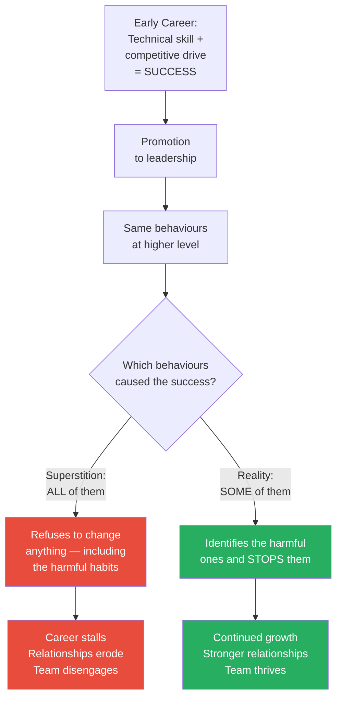
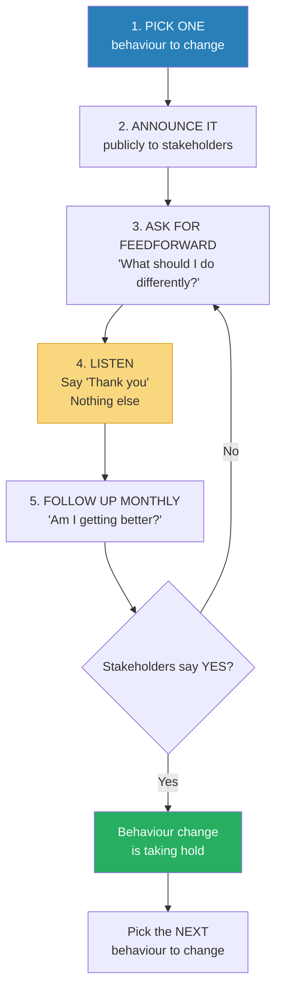
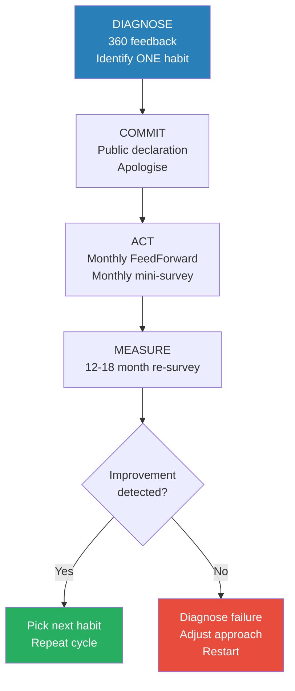
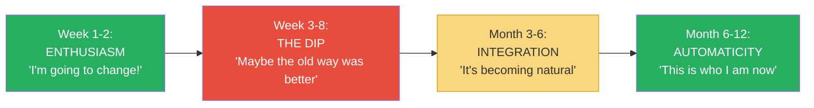
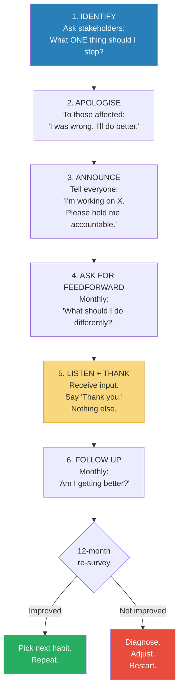

# What Got You Here Won't Get You There — Marshall Goldsmith

> Marshall Goldsmith's thesis is counterintuitive and uncomfortable: the habits that made you successful are not the same habits that will make you MORE successful — and some of them are actively holding you back.
> As the world's #1-ranked executive coach, who has worked with 150+ CEOs, Goldsmith has observed a consistent pattern: the very behaviours that drove early career success (competitiveness, assertion, confidence, decisiveness) become liabilities at senior levels where influence, collaboration, and emotional intelligence matter more.
> The book identifies twenty specific workplace habits that successful people cling to despite evidence they're destructive — and proposes a deceptively simple fix: stop doing them.
> This is not a book about learning new skills. It is a book about stopping old behaviours that are undermining the skills you already have.
> The hardest thing for a successful person to hear is that their success happened DESPITE certain habits, not BECAUSE of them.
> It is the essential anti-self-help book: instead of adding new behaviours, subtract the ones that are hurting you.

---

## About the Author

Marshall Goldsmith is the world's #1-ranked executive coach, according to multiple independent rankings including the American Management Association, Harvard Business Review, and Fast Company.
He has personally coached over 150 CEOs and their management teams at organisations including Ford, GlaxoSmithKline, the World Bank, the U.S. Army, and dozens of Fortune 500 companies.
He holds a PhD in organisational behaviour from UCLA and has written or edited over 35 books on leadership and management.

His coaching process is distinctive: he measures success not through self-assessment but through <b style="color: #2980b9">stakeholder-centred coaching</b> — the people around the leader rate whether the leader has improved.
If stakeholders don't report improvement, Goldsmith doesn't get paid.
This "pay for results" model has forced him to identify, with empirical precision, which behaviours actually matter and which are just noise.
The twenty habits in this book are the distilled product of that process.

---

## The Big Idea

- <b style="color: #2980b9">Success creates bad habits, not just good ones</b>
- The competitive drive that got you promoted to VP is the same drive that makes you need to "win" every argument at the leadership table
- The confidence that made you a star individual contributor is the same confidence that makes you dismiss input from your team
- The decisiveness that made you a great analyst is the same decisiveness that makes you judge every idea before it's fully formed

---

- <b style="color: #e74c3c">At senior levels, interpersonal behaviour matters more than technical skill</b>
- You weren't promoted to the C-suite because you know more about accounting or engineering than anyone else — you were promoted because someone believed you could lead people
- But the skills that made you technically excellent (precision, competitiveness, being right, individual achievement) are often the exact skills that make you a poor leader (rigidity, needing to win, being unable to listen, not sharing credit)
- <b style="color: #27ae60">The fix is not to DO more but to STOP doing things that are hurting you</b>

---

- Goldsmith's deeper insight: successful people suffer from <b style="color: #2980b9">success superstition</b>
- They believe: "I behave this way, AND I am successful. Therefore, I am successful BECAUSE I behave this way."
- <b style="color: #e74c3c">But correlation is not causation</b>
- Many of their behaviours have nothing to do with their success — and some actively hinder it
- The truth is often: "I am successful DESPITE certain behaviours, not BECAUSE of them"
- But because the behaviours and the success co-occurred, the successful person refuses to change anything in the formula — including the harmful parts

---

## Key Concepts at a Glance

| Concept | One-line summary |
|---------|-----------------|
| **The Twenty Habits** | Twenty specific interpersonal behaviours that successful people must stop to continue advancing |
| **Success Superstition** | The false belief that all your behaviours contribute to your success, when some actually hinder it |
| **Adding Too Much Value** | The most insidious habit — improving others' ideas by 5% while reducing their commitment by 50% |
| **FeedForward** | Future-focused alternative to feedback — "What should I do differently?" instead of "Here's what you did wrong" |
| **Stakeholder-Centred Coaching** | Measuring improvement through the perceptions of the people around you, not self-assessment |
| **Goal Obsession** | The twenty-first habit — pursuing a goal so single-mindedly that you destroy everything else in the process |
| **The Apology** | One of Goldsmith's most underrated tools — a genuine, unqualified apology with no "but" |
| **The Follow-Up** | Monthly check-ins asking stakeholders "Am I getting better?" — the engine of sustained change |

---

## The Twenty Habits — In Detail

*Goldsmith's core contribution: a taxonomy of the specific behaviours that derail successful leaders. Each habit below includes what it looks like, why successful people do it, and the damage it causes.*

### Habit 1: Winning Too Much

- <b style="color: #e74c3c">The need to win at all costs and in all situations — when it matters, when it doesn't, and when it's totally beside the point</b>
- This is the master habit from which most of the others flow
- Successful people are competitive by nature — that's part of what made them successful
- But at leadership levels, the need to win every argument, every discussion, every trivial point alienates the very people you need as allies
- Goldsmith asks: "Is it worth winning this argument if it means the other person feels diminished?"

> [!example] The Dinner Debate
> A CEO's wife told Goldsmith: "My husband is so competitive that he has to win every single argument at the dinner table. We can't discuss what movie to see, what restaurant to go to, or what colour to paint the bedroom without it becoming a contest. He treats every conversation like a negotiation."
> When Goldsmith asked the CEO about this, his response was telling: "But I'm usually RIGHT!"
> Goldsmith's reply: "Is being right about the paint colour worth the damage to your marriage?"
> <b style="color: #27ae60">The point is not that you're wrong — it's that being right has costs, and you're not accounting for them.</b>

---

### Habit 2: Adding Too Much Value

- <b style="color: #e74c3c">The overwhelming desire to add your two cents to every discussion</b>
- A direct report comes to you with an idea. You say: "That's a great idea. And you know what else you could do? You could also add X and Y, and that would make it even better."
- You've just improved the idea by maybe 5%
- But you've reduced the person's <b style="color: #2980b9">ownership</b> of it by 50%
- <b style="color: #e74c3c">Because it's no longer THEIR idea. It's YOUR idea with their name on it.</b>
- People execute their own ideas with passion. They execute other people's ideas with compliance.
- The 5% improvement in quality is not worth the 50% reduction in commitment

> [!warning] Why This Habit Is So Dangerous
> Adding value feels GOOD. You're being helpful! You're sharing your expertise! The other person should be GRATEFUL!
> But from the recipient's perspective, you've just hijacked their idea. They came to you excited and left feeling diminished.
> Over time, they stop bringing you ideas at all. Why bother? You'll just change them.
> Goldsmith considers this the single most destructive habit for leaders — because it appears positive on the surface while being corrosive underneath.

> [!example] The CEO Whose Team Stopped Trying
> Goldsmith coached a CEO who was brilliant at improving every idea his team brought him. After months of coaching, the CEO admitted: "My team has stopped bringing me ideas. They know I'll change them, so why bother?"
> The CEO's 5% improvement per idea had produced a 100% reduction in initiative from his team.
> <b style="color: #27ae60">Goldsmith's rule: before adding value, ask yourself: "Is my suggestion worth the decline in this person's ownership and enthusiasm?" If not — and it usually isn't — just say "Great idea" and move on.</b>

> [!danger] Before: Adding value
> Direct report: "I'm thinking we should restructure the quarterly report to lead with the key metrics."
> Leader: "Great idea! And you should also add a comparison to last quarter, and maybe include a forecast section, and definitely restructure the executive summary too."
> Result: The direct report now has YOUR report to write, not theirs. They execute with minimal enthusiasm.

> [!success] After: Restraint
> Direct report: "I'm thinking we should restructure the quarterly report to lead with the key metrics."
> Leader: "Great idea. Go ahead."
> Result: The direct report owns the project completely. They execute with passion and pride. The report might be 5% less "perfect" — but it gets done with 50% more energy and commitment.

---

### Habit 3: Passing Judgment

- <b style="color: #2980b9">The need to rate others and impose your standards on them</b>
- This includes positive judgments: "That's a GREAT idea!" still positions you as the judge
- When you evaluate everything someone says — even positively — you create a power dynamic where they need your approval
- They start performing for your rating rather than thinking independently
- <b style="color: #27ae60">The alternative: respond with curiosity instead of judgment. "Tell me more about that" instead of "That's great!"</b>

---

### Habit 4: Making Destructive Comments

- Sarcasm, cutting remarks, needless put-downs — the verbal shrapnel that smart people scatter without noticing the wounds
- <b style="color: #e74c3c">The comment that makes everyone laugh except the person it targets</b>
- Successful people often have sharp minds and quick wit — which means they CAN make devastating comments. The question is whether they SHOULD.
- Goldsmith's test: "Will this comment advance the conversation, or just make me feel clever?"
- "Before you speak, ask yourself: is it true? Is it necessary? Is it kind? If it fails any of these tests, don't say it."

---

### Habit 5: Starting with "No," "But," or "However"

- <b style="color: #e74c3c">The ubiquitous qualifiers that unconsciously tell people: "You're wrong and I'm about to explain why"</b>
- "That's a good point, BUT..." — everything before "but" is erased by the "but"
- "I agree with most of what you said, HOWEVER..." — the listener hears only the disagreement
- "NO, what I think is..." — the bluntest form: a direct negation before you even state your position
- <b style="color: #2980b9">Most people don't realise they do this</b> — Goldsmith recommends recording yourself in meetings for a week and counting
- The fix: replace "No, but, however" with "And"
- "That's a good point, AND here's another way to think about it" — builds on the other person's contribution rather than negating it

> [!tip] The "And" Discipline
> For one week, consciously replace every "but" and "however" with "and."
> You'll feel awkward at first. You'll slip back into "but" constantly.
> But by the end of the week, you'll notice something: conversations flow more smoothly, people open up more, and you're getting better ideas from your team — because they're no longer bracing for the "but" that signals their input is about to be dismissed.

---

### Habits 6-10: The Ego Cluster

| Habit | What It Looks Like | The Underlying Drive |
|-------|-------------------|---------------------|
| **6. Telling the world how smart you are** | Correcting people, citing credentials, one-upping stories | Need to be the smartest person in the room |
| **7. Speaking when angry** | Sending the furious email, making the cutting remark in the meeting | Anger feels powerful — until you see the damage |
| **8. Negativity ("Let me tell you why that won't work")** | Reflexive pessimism disguised as "realism" or "risk management" | Risk-awareness that has calcified into automatic opposition |
| **9. Withholding information** | Hoarding knowledge because information is power | Control instinct — if I know and you don't, I'm more valuable |
| **10. Failing to give proper recognition** | Not acknowledging others' contributions | Unconscious — when things go well, successful people attribute it to themselves |

- <b style="color: #2980b9">All five share the same root: ego</b>
- The successful person's ego was an asset in the early career (it drove ambition, confidence, risk-taking)
- At senior levels, the same ego becomes a liability (it blocks collaboration, alienates team members, prevents learning)
- <b style="color: #27ae60">Goldsmith's blunt advice: "The higher you go, the more your problems are behavioural, not technical. And the source of most behavioural problems is ego."</b>

---

### Habits 11-15: The Self-Protection Cluster

| Habit | What It Looks Like | The Damage |
|-------|-------------------|-----------|
| **11. Claiming credit you don't deserve** | "We did great" when you mean "I did great" | Demotivates the people who actually did the work |
| **12. Making excuses** | "Sorry I was late, but traffic was terrible" | The "but" turns the apology into a justification |
| **13. Clinging to the past** | "That's how we've always done it" | Blocks innovation and adaptation |
| **14. Playing favourites** | Rewarding people who flatter you over people who perform | Creates a culture of sycophancy, not excellence |
| **15. Refusing to express regret** | Never saying "I'm sorry" without a qualifier | Apologising feels like weakness, but refusal erodes trust |

> [!example] The Power of the Unqualified Apology
> Goldsmith considers the simple, unqualified apology one of the most powerful tools in leadership:
> NOT: "I'm sorry, BUT..." (excuse follows)
> NOT: "I'm sorry IF I offended anyone" (conditional, non-committal)
> NOT: "I'm sorry you feel that way" (blames the other person's reaction)
> YES: <b style="color: #27ae60">"I'm sorry. I was wrong. I'll do better."</b> Full stop.
> This takes approximately five seconds and costs nothing — but most leaders would rather undergo root canal surgery than deliver it.

---

### Habits 16-20: The Relationship Cluster

| Habit | What It Looks Like | Why It Destroys Relationships |
|-------|-------------------|------------------------------|
| **16. Not listening** | Waiting for your turn to talk; multitasking during conversations; finishing others' sentences | Signals: "What you're saying is less important than what I'm about to say" |
| **17. Failing to express gratitude** | Not saying "thank you" — or saying it perfunctorily | People feel taken for granted; small courtesies create disproportionate loyalty |
| **18. Punishing the messenger** | Attacking the person who brings bad news | Guarantees that bad news stops reaching you — until it's too late |
| **19. Passing the buck** | Blaming others for your failures; never accepting personal responsibility | Erodes trust; everyone knows who's actually responsible |
| **20. An excessive need to be "me"** | "I know I'm impatient/blunt/demanding, but that's just who I am" | Using identity as an excuse for bad behaviour — the ultimate get-out-of-jail card |

---

### The Most Dangerous Habit: #20 — "An Excessive Need to Be Me"

- Goldsmith considers Habit 20 the <b style="color: #e74c3c">meta-habit that enables all the others</b>
- When confronted about any of the first nineteen habits, the response is often: "That's just who I am. I can't change that. That's my personality."
- <b style="color: #2980b9">Goldsmith's devastating counter: "How do you know? Have you tried?"</b>
- The "that's just me" defence treats personality as fixed and immutable — a set of traits carved in stone
- <b style="color: #27ae60">Goldsmith treats personality as a set of habits — and habits, by definition, can be changed</b>
- "Being direct" is not a personality trait — it's a behavioural choice. You can choose to be direct AND kind. You can choose to be honest AND tactful.
- <b style="color: #e74c3c">"That's just who I am" is not self-knowledge. It's self-indulgence.</b>

> [!example] The "I'm Just Being Honest" Executive
> Goldsmith coached a COO who was known for brutal honesty — telling subordinates exactly what he thought of their work, without filter or tact.
> When confronted, he said: "I'm just being honest. People need to hear the truth."
> Goldsmith asked: "Is it possible to be honest AND diplomatic?"
> The COO: "Sure, but that's not ME."
> Goldsmith: "So you're choosing to be hurtful when you could choose not to be — and calling it authenticity?"
> The COO went quiet.
> After coaching, he learned to deliver the same honest feedback in a way that people could hear — by leading with what they did well, being specific about what needed to change, and framing it as development rather than criticism.
> His feedback was just as honest. But it was no longer destructive.
> <b style="color: #27ae60">His team's engagement scores improved by 40% in six months.</b>

---

### Habit 21: Goal Obsession

- Goldsmith adds a <b style="color: #e74c3c">twenty-first habit</b> that he considers the most dangerous of all: goal obsession
- Goal obsession is pursuing an objective so single-mindedly that you destroy relationships, health, ethics, or other important things in the process
- It is the shadow side of the "relentless focus" that every success book celebrates
- <b style="color: #2980b9">"I will hit my quarterly numbers"</b> becomes "I will hit my quarterly numbers even if it means burning out my team, cutting corners on quality, and neglecting my family"
- The goal itself may be perfectly valid. The problem is the unwillingness to consider its costs.

> [!warning] The Goal Obsession Test
> Before pursuing any goal with intensity, ask:
> 1. Is achieving this goal worth the cost I'm paying to achieve it?
> 2. Am I sacrificing something more important (relationships, health, integrity) to reach something less important (a number, a title, a deadline)?
> 3. If I achieve this goal but lose [X] in the process, will I consider it a success?
> If the answers trouble you, the goal isn't the problem — the obsession is.

---

## The Solution: FeedForward + Follow-Up

*Goldsmith's process for changing the twenty habits is deceptively simple — but he has used it with over 150 CEOs with measurable, stakeholder-verified results.*

### Why Traditional Feedback Fails

- Traditional feedback is backward-looking: "Here's what you did wrong in the last quarter"
- It triggers defensiveness: the recipient immediately starts explaining, justifying, or counter-arguing
- It is often delivered badly: vague, delayed, or weaponised as criticism rather than development
- And it is almost never followed up — the conversation happens once and is forgotten

### The FeedForward Process

1. <b style="color: #27ae60">Pick ONE behaviour to change</b> — not three, not five, ONE
   - The most important criterion: which behaviour, if changed, would have the biggest positive impact on the people around you?
   - Ask your direct reports, peers, and boss: "What is the ONE thing I could do differently that would make the biggest difference?"
   - The answer they give is your target

2. <b style="color: #27ae60">Announce it publicly</b> — tell everyone around you what you're working on
   - "I'm working on being a better listener. I'd appreciate it if you let me know when I interrupt you."
   - This does two things: it creates accountability AND it gives people permission to give you real-time feedback

3. <b style="color: #27ae60">Ask for FeedForward</b> — instead of asking what you did wrong (feedback), ask what you could do differently going forward
   - "What's one thing I could do in our next meeting to listen more effectively?"
   - FeedForward is future-focused, non-threatening, and specific
   - People love giving FeedForward because it doesn't require them to criticise your past behaviour

4. <b style="color: #27ae60">Listen without defending</b> — receive the suggestion, say "Thank you," and nothing else
   - No explaining. No justifying. No "But the reason I do that is..."
   - Just: "Thank you."
   - This is the hardest part for successful people — they want to explain why they behave the way they do

5. <b style="color: #27ae60">Follow up monthly</b> — ask stakeholders: "Am I getting better?"
   - This is the engine of sustained change
   - Without follow-up, the initial energy fades and the old habit returns
   - With monthly follow-up, the behaviour change becomes a visible, measurable, ongoing process

> [!danger] Before: Traditional feedback
> Boss tells you in December that you talked too much in meetings last March. You feel defensive. You explain why. Nothing changes.

> [!success] After: FeedForward + Follow-Up
> You tell your team in January: "I'm working on talking less in meetings. What's one thing I could do to listen more?"
> They give suggestions. You say "Thank you." You try the suggestions. In February you ask: "Am I getting better?"
> They say: "Actually, yes — you've been asking more questions and letting people finish." You continue.
> By June, the behaviour change is embedded. By December, it's who you are.

---

### Why "Thank You" Is the Hardest Part

- Goldsmith spends considerable time on why <b style="color: #2980b9">simply saying "Thank you" in response to feedback is so difficult for successful people</b>
- When someone gives you feedback or FeedForward, you want to:
  - Explain why you do the thing ("The reason I interrupt is because meetings run long and I need to keep us on track")
  - Justify the behaviour ("I'm direct because people need to hear the truth")
  - Disagree with the assessment ("I don't think I do that")
  - Turn it around ("Well, you do the same thing!")
- <b style="color: #e74c3c">Every one of these responses kills the feedback loop</b>
- The person who gave you feedback learns: "When I give this person honest input, I get an argument. I won't do that again."
- <b style="color: #27ae60">"Thank you" is the ONLY response that keeps the feedback loop open</b>
- It doesn't mean you agree. It doesn't mean you'll do exactly what they said. It means: "I hear you. I value your perspective. I will consider it."
- That's enough. And for most successful people, it's the hardest two words they'll ever say.

---

### The Stakeholder Check: External Measurement

- Goldsmith's most radical idea: <b style="color: #2980b9">your self-assessment of improvement is worthless</b>
- People consistently overestimate their own improvement — we FEEL like we've changed more than we actually have
- The only valid measurement is: <b style="color: #27ae60">do the people around you perceive improvement?</b>
- This is why Goldsmith's coaching process measures change through stakeholder surveys, not self-reports
- If your direct reports, peers, and boss all say you've improved, you've improved — regardless of how you FEEL
- If they say you haven't improved, you haven't — regardless of how hard you've been trying
- <b style="color: #2980b9">The map is not the territory. Your self-perception is not reality. Other people's experience of you IS reality — at least for the purposes of leadership effectiveness.</b>

---

## Deep Dive: Why Successful People Resist Change

### The Four Beliefs That Keep You Stuck

- Goldsmith identifies four beliefs that make successful people almost uniquely resistant to behavioural change:

| Belief | What It Sounds Like | Why It's Dangerous |
|--------|-------------------|-------------------|
| **"I have succeeded"** | "Look at my track record — I must be doing something right" | Past success becomes evidence that NO change is needed |
| **"I can succeed"** | "I've overcome challenges before, I can handle this" | Overconfidence in ability to handle anything WITHOUT changing |
| **"I will succeed"** | "Things will work out — they always do" | Optimistic bias that removes urgency to act |
| **"I choose to succeed"** | "I do this because I WANT to, not because I have to" | Frames the current behaviour as a deliberate choice, making change feel like surrendering autonomy |

- <b style="color: #2980b9">These beliefs are not wrong — they're incomplete</b>
- Yes, you've succeeded. But that doesn't mean every behaviour contributed to that success.
- Yes, you can succeed. But that doesn't mean you'll succeed without adjusting.
- Yes, you will succeed. But not if the people around you stop supporting you because of behaviours you refuse to change.
- Yes, you choose to succeed. But choice implies you could also choose differently — which is exactly what Goldsmith is asking you to do.

> [!warning] The Paradox of Success
> The same qualities that made you successful (drive, confidence, optimism, sense of control) are the exact qualities that make you resistant to the feedback that you need to continue succeeding.
> <b style="color: #e74c3c">Success makes you believe you don't need to change. But success at the NEXT level requires exactly the changes you're resisting.</b>
> This is the book's central paradox — and why Goldsmith considers coaching successful people harder than coaching struggling ones. The struggling person KNOWS something needs to change. The successful person is convinced nothing does.

---

### The Environment Problem

- Goldsmith introduces the concept of <b style="color: #2980b9">environmental triggers</b> — external stimuli that activate habitual responses
- You may be a patient listener at home but an impatient interrupter at work — because the work environment triggers different habits
- You may be generous with credit when you're relaxed but hoard credit when you're under pressure
- <b style="color: #27ae60">The behaviour is not fixed inside you — it's triggered by the situation</b>
- This is important because it means you don't need to change who you ARE — you need to change how you RESPOND to specific triggers

> [!tip] The Trigger Map
> Goldsmith recommends mapping your worst habits to their environmental triggers:
> 1. Which habit am I trying to change? (e.g., interrupting)
> 2. When does it happen most? (e.g., in large meetings with many voices)
> 3. What specifically triggers it? (e.g., when someone speaks slowly or repeats themselves)
> 4. What could I do instead when I notice the trigger? (e.g., take a breath, write down my response instead of speaking it, wait for a 3-second pause before contributing)
> 
> The trigger is inevitable. Your response to it is a choice.

---

## Deep Dive: The Art of Apologising

*One of the book's most underrated sections — Goldsmith devotes significant attention to the power and technique of the apology.*

### Why Successful People Can't Apologise

- Apologising feels like:
  - Admitting weakness (threatening to the ego)
  - Losing status (someone who was wrong is lower than someone who was right)
  - Opening yourself to exploitation ("If I admit fault, they'll use it against me")
- <b style="color: #e74c3c">All three of these fears are overblown</b>
- Research shows the opposite: leaders who apologise are rated as MORE competent and MORE trustworthy, not less
- An apology doesn't signal weakness — it signals <b style="color: #27ae60">self-awareness, emotional maturity, and confidence</b>
- <b style="color: #2980b9">It takes a secure person to say "I was wrong." An insecure person cannot afford to.</b>

### Goldsmith's Rules for Effective Apology

1. <b style="color: #27ae60">Say "I'm sorry" — and mean it</b>
2. <b style="color: #27ae60">Don't add "but"</b> — "I'm sorry, but..." is not an apology; it's an excuse with a preamble
3. <b style="color: #27ae60">Don't add "if"</b> — "I'm sorry if you were offended" is not an apology; it's blame-shifting
4. <b style="color: #27ae60">Don't explain</b> — "I'm sorry, the reason I did that was..." turns the apology into a justification
5. <b style="color: #27ae60">Do state what you'll do differently</b> — "I'm sorry. I was wrong to interrupt you in the meeting. I'm going to work on listening more."
6. <b style="color: #27ae60">Do it quickly</b> — the longer you wait, the less impact and the more resentment accumulates

> [!example] The Five-Second Apology That Changed a Career
> Goldsmith coached a VP who had a terrible relationship with her direct reports. They described her as "brilliant but toxic."
> The first thing Goldsmith had her do was apologise to each of her direct reports individually — a simple, unqualified apology for specific past behaviours.
> One direct report later described the experience: "She sat down, looked me in the eye, and said 'I'm sorry I embarrassed you in front of the team last month. I was wrong. I'm going to work on how I give feedback.' It took about five seconds. I've worked for her for three years, and in that five seconds, something completely changed."
> <b style="color: #27ae60">The apology didn't erase three years of bad behaviour. But it opened a door that had been sealed shut.</b>

---

## Deep Dive: Goldsmith's Coaching Process — Step by Step

*For those who want to apply Goldsmith's process to themselves or others, here is the full methodology.*

### Phase 1: Diagnosis (Weeks 1-2)

1. <b style="color: #2980b9">360-degree feedback collection</b>
   - Collect anonymous feedback from direct reports, peers, and supervisor(s)
   - Use a structured instrument: "What should this person START doing? STOP doing? CONTINUE doing?"
   - The feedback is confidential and anonymous — people are more honest when they can't be identified

2. <b style="color: #2980b9">Pattern identification</b>
   - Review all feedback for patterns — which behaviours appear repeatedly across multiple sources?
   - A behaviour mentioned by one person may be an outlier. A behaviour mentioned by five people is a pattern.
   - Select the ONE behaviour that appears most frequently AND has the most impact on stakeholders

### Phase 2: Commitment (Week 3)

3. <b style="color: #2980b9">Public declaration</b>
   - The leader tells their stakeholders (direct reports, peers, boss): "Based on the feedback, I'm going to work on [specific behaviour]. I'd appreciate your help by [specific request]."
   - This creates accountability AND gives stakeholders permission to give ongoing feedback

4. <b style="color: #2980b9">The apology</b>
   - The leader apologises to stakeholders for past instances of the behaviour
   - Unqualified. No "but." No "because."

### Phase 3: Action (Months 1-12)

5. <b style="color: #2980b9">FeedForward collection</b>
   - Monthly, the leader asks each stakeholder: "What is one thing I could do differently to be better at [the target behaviour]?"
   - Listens. Says "Thank you." Implements.

6. <b style="color: #2980b9">Mini-survey follow-up</b>
   - Monthly, the leader asks: "Compared to last month, how am I doing on [the target behaviour]? Better, the same, or worse?"
   - This provides a real-time progress signal

### Phase 4: Measurement (Month 12-18)

7. <b style="color: #2980b9">Re-survey</b>
   - Repeat the 360-degree feedback after 12-18 months
   - Compare with the baseline
   - If stakeholders report improvement → the coaching succeeded
   - If not → diagnose what went wrong and restart

> [!tip] The DIY Version
> You don't need a $100,000 executive coach to use this process:
> 1. Ask 5 people you trust: "What's the one thing I could change that would have the biggest impact?"
> 2. Pick the behaviour that comes up most often
> 3. Tell those 5 people what you're working on
> 4. Ask them monthly: "Am I getting better?"
> 5. Say "Thank you" to their feedback. Nothing else.
> 6. After 6 months, ask again: "How am I doing overall compared to when I started?"
> 
> This costs nothing and produces results comparable to professional coaching — because the mechanism is the same: external accountability + regular follow-up.

---

## Deep Dive: What Phil Ivey Teaches About Goldsmith

*An interesting connection to another book in this collection.*

- In [[Thinking in Bets - Annie Duke|Thinking in Bets]], Annie Duke describes poker champion Phil Ivey spending his victory dinner analysing his mistakes rather than celebrating
- Goldsmith would recognise Ivey as someone who has mastered the habit change: <b style="color: #27ae60">getting positive self-image from accuracy and learning, not from credit and ego</b>
- Most people celebrate wins and blame losses. Ivey celebrates learning and blames nothing.
- This is the SAME mindset shift Goldsmith asks his coaching clients to make:
  - Stop getting your identity boost from "being right" and start getting it from "getting better"
  - Stop measuring yourself by outcomes (which involve luck) and start measuring yourself by learning (which is in your control)
- <b style="color: #2980b9">Both Duke and Goldsmith are teaching the same lesson: your ego is the enemy of your improvement</b>

---

## The Comparison Table: What Got You Here vs What Gets You There

| Dimension | What Got You Here | What Gets You There |
|-----------|------------------|-------------------|
| **Primary skill** | Technical expertise | Interpersonal effectiveness |
| **Source of power** | Being right | Building relationships |
| **Communication style** | Tell, assert, correct | Ask, listen, acknowledge |
| **Response to ideas** | Improve them (add value) | Support them (build ownership) |
| **Response to mistakes** | Defend, justify, explain | Apologise, learn, adjust |
| **Measure of success** | Individual achievement | Team performance |
| **Identity source** | "I'm the smartest person in the room" | "I'm someone who helps others succeed" |
| **Feedback response** | "Let me explain why I do that" | "Thank you" |
| **Self-perception** | Fixed ("That's just who I am") | Growable ("That's a habit I can change") |
| **Relationship to ego** | Ego as fuel | Ego as obstacle |

## Deep Dive: Each Habit With Real-World Stories

### Habit 1 Deep Case: The CEO Who Had to Win Everything

- Goldsmith coached the CEO of a major pharmaceutical company who was universally acknowledged as brilliant — and universally feared
- His direct reports described meetings as "gladiatorial combat"
- <b style="color: #e74c3c">If you disagreed with him, he would argue until you either conceded or exhausted yourself</b>
- He won every argument. He also won something else: a team that had stopped disagreeing with him entirely
- His CFO told Goldsmith: "We just nod now. It's easier. We figure out what he wants to hear and say it. Real discussion died about two years ago."
- <b style="color: #2980b9">The CEO was winning every battle and losing the war</b> — he had the most compliant team in the industry, which meant he also had the least innovative
- The intervention: Goldsmith had the CEO count — literally count on paper — how many times per meeting he argued a point past the point of utility
- The CEO was stunned to discover he was averaging 12 unnecessary "wins" per one-hour meeting
- Each "win" took 3-5 minutes of meeting time AND cost one unit of team engagement
- <b style="color: #27ae60">Over 6 months, the CEO reduced his unnecessary arguments from 12 per meeting to 2-3. Team engagement scores improved by 35%. And — his own assessment — the quality of strategic decisions improved dramatically because people were finally telling him what they really thought.</b>

> [!tip] Goldsmith's "Winning" Heuristic
> Before arguing any point, ask:
> 1. Does it matter? (Is the outcome meaningfully different if they do it their way vs mine?)
> 2. Will winning this argument cost me more in relationship damage than the argument is worth?
> 3. Am I arguing because the point is important, or because I need to be right?
> If the answer to #3 is "because I need to be right" — stop. Walk away. Let them have it.
> The energy you save can be redirected to the 2-3 battles that actually matter.

---

### Habit 5 Deep Case: The "But" Epidemic

- Goldsmith tracked a senior VP's use of "but" and "however" for one week
- The count: <b style="color: #e74c3c">47 uses of "but" and 23 uses of "however" in five days of meetings</b>
- Each one negated or qualified whatever the other person had just said
- After seeing the data, the VP was shocked: "I had no idea. I thought I was agreeing with people."
- Goldsmith's analysis: "You WERE agreeing — for the first half of each sentence. Then you erased your agreement with 'but' and replaced it with your own view."
- The VP committed to the "and" discipline for 30 days
- <b style="color: #27ae60">By day 10, his direct reports noticed the change without being told</b>
- One said: "Something's different. I feel like he actually hears me now."
- Another: "Meetings feel less like debates and more like conversations."
- The VP's own observation after 30 days: "I haven't changed my opinions on anything. I'm still just as opinionated as I was. But people seem to actually CONSIDER my opinions now instead of getting defensive. Because I'm not negating theirs first."

---

### Habit 7 Deep Case: The Email Sent in Anger

- <b style="color: #e74c3c">Speaking when angry</b> is the habit that produces the most immediate and visible damage
- Goldsmith's most memorable case: a VP of marketing who, after receiving a critical email from a colleague, fired back a scathing reply — and CC'd the entire leadership team
- The reply was witty, devastating, and addressed every point in the original email with surgical precision
- It was also career suicide
- Within 48 hours, the CEO called the VP into his office and said: "The email was brilliant. It was also the last thing you'll write as a VP at this company."
- <b style="color: #2980b9">The VP didn't lose his job because he was wrong — in fact, he was right about most of the substantive points. He lost his job because the EMAIL revealed something about his CHARACTER that no amount of being right could compensate for.</b>
- Goldsmith's rule: <b style="color: #27ae60">"Never send an email written in anger. Write it if you must — then save it as a draft and wait 24 hours. If you still want to send it the next day, you probably still shouldn't."</b>

> [!danger] Before: The angry response
> You receive a provocative email at 10pm. You fire back a devastating reply at 10:15pm while your blood is up. You CC the leadership team to make sure everyone sees how wrong the other person is.
> By 10:30pm, you feel vindicated. By 10am the next morning, you feel sick. The email is now corporate lore.

> [!success] After: The 24-hour rule
> You receive the same provocative email. You write the same devastating reply — but save it as a draft. You go to bed. The next morning, you re-read it and think: "Was I right? Yes. Would sending this help me? No."
> You write a calm, measured response that addresses the substance without the venom. You send it to the other person only — no CC circus.
> The issue gets resolved. Your reputation is enhanced. Your career continues.

---

### Habit 10 Deep Case: The Leader Who Couldn't Say "Well Done"

- A COO at a technology company was technically exceptional and strategically brilliant
- His team was highly productive but had the worst retention rate in the company
- When Goldsmith investigated, the reason was simple: <b style="color: #e74c3c">the COO never acknowledged anyone's contributions</b>
- Not out of malice — he simply didn't notice. In his mind, doing good work was the expectation. Why would you praise someone for meeting expectations?
- His team's perspective was different: "I've been here three years and I honestly don't know if he thinks I'm doing a good job or not. He's never said."
- <b style="color: #2980b9">Goldsmith's insight: silence is not neutral. Silence reads as disapproval.</b> When you say nothing about someone's good work, they don't conclude "he's satisfied." They conclude "he doesn't notice or doesn't care."
- The intervention was the simplest of all: the COO committed to one sincere, specific piece of recognition per day
- Not "good job" (too generic) but "The way you structured the client presentation yesterday — the opening story about the supply chain disruption — that was exactly right. It set the frame for everything that followed."
- <b style="color: #27ae60">Within 6 months, team retention improved by 40%. The COO reported that giving recognition was initially "excruciating" — "It felt like handing out participation trophies" — but that he came to see it as "the highest-leverage activity in my day."</b>

> [!tip] The Recognition Formula
> Goldsmith's formula for effective recognition:
> 1. **Specific** — not "good job" but "the way you handled [specific thing]"
> 2. **Timely** — within 24 hours of the behaviour, not at the annual review
> 3. **Sincere** — only recognise what genuinely deserves it (insincere praise is worse than no praise)
> 4. **Public when appropriate** — recognition in front of peers amplifies its impact
> 5. **Frequent** — one piece of genuine recognition per day changes your leadership reputation within weeks

---

### Habit 16 Deep Case: The Leader Who Couldn't Listen

- Goldsmith considers <b style="color: #e74c3c">not listening</b> to be the habit most closely correlated with overall leadership failure
- He defines it precisely: not listening isn't about hearing impairment. It manifests as:
  - Finishing others' sentences
  - Checking phone/email while someone is talking
  - Composing your response while the other person is still speaking
  - Changing the subject to something you find more interesting
  - One-upping: "That reminds me of an even bigger deal I closed..."
  - Starting to speak the instant the other person pauses for breath

- <b style="color: #2980b9">The fundamental attribution error of bad listeners: they think they're being efficient. The other person thinks they're being disrespected.</b>

> [!example] The "I'm Listening" Delusion
> Goldsmith asked a CEO if he was a good listener. "Absolutely," the CEO said. "I pride myself on it."
> Goldsmith then asked the CEO's direct reports the same question. Their average rating of his listening skill: 2.3 out of 10.
> The gap between self-assessment and stakeholder assessment was the largest Goldsmith had ever measured.
> When he showed the CEO the data, the CEO's first response was: "They're wrong."
> His second response (after reflection): "Oh God. I really don't listen, do I?"
> His third response (after coaching): "Listening is the hardest thing I've ever learned. Harder than any business skill. Because it requires me to shut up — and shutting up has never been my strength."

- <b style="color: #27ae60">Goldsmith's listening protocol:</b>
  1. Before responding, count to three (silently). This prevents the "jump in the instant they pause" reflex.
  2. Before stating your view, summarise theirs: "So what I'm hearing is..." This proves you were listening AND gives them a chance to correct any misunderstanding.
  3. Before adding your perspective, ask a question: "Can you tell me more about [the part that interests you most]?" This deepens the conversation instead of steering it to your agenda.
  4. When you do respond, begin with what you AGREE with, not what you disagree with.

---

### Habit 17 Deep Case: The Cost of Not Saying Thank You

- <b style="color: #e74c3c">Failing to express gratitude</b> is the cheapest habit to fix and the most expensive to maintain
- It costs nothing to say "thank you" — zero money, zero time, zero effort
- It costs EVERYTHING not to: team members who feel unappreciated eventually leave, taking their knowledge, relationships, and discretionary effort with them
- Goldsmith cites research showing that <b style="color: #2980b9">the #1 reason people leave jobs is not pay but feeling undervalued</b>
- A study of 200,000 employees found that "my manager regularly acknowledges my contributions" was the single strongest predictor of engagement and retention

> [!example] The Two-Word Turnaround
> Goldsmith coached a division head at a financial services firm whose team engagement scores were the lowest in the company.
> After 360 feedback, the #1 complaint was: "He never says thank you."
> The intervention was the simplest Goldsmith has ever prescribed: say "thank you" to at least three people per day, for specific things they did.
> Not "thanks for everything" (generic) but "Thank you for staying late to fix the reporting error. The client presentation would have been a disaster without you."
> After 6 months: engagement scores improved from the bottom quartile to the top quartile.
> <b style="color: #27ae60">Two words. Three times a day. Complete transformation in how his team experienced him as a leader.</b>

---

## The Master Comparison: All Twenty Habits at a Glance

| # | Habit | Category | Fix |
|---|-------|----------|-----|
| 1 | Winning too much | Ego | Ask: "Is winning this worth the damage?" |
| 2 | Adding too much value | Ego | Just say "Great idea" and stop |
| 3 | Passing judgment | Ego | Respond with curiosity, not evaluation |
| 4 | Making destructive comments | Ego | Apply the "would I say this if they could hear me?" test |
| 5 | Starting with No/But/However | Communication | Replace with "And" |
| 6 | Telling people how smart you are | Ego | Let your work speak; arrange for others to cite your expertise |
| 7 | Speaking when angry | Impulse | 24-hour rule on all angry communications |
| 8 | Negativity | Mindset | Before saying why something won't work, find one thing that will |
| 9 | Withholding information | Control | Share proactively; information hoarding is career poison |
| 10 | Failing to give recognition | Awareness | One specific, sincere "thank you" per day |
| 11 | Claiming undeserved credit | Ego | Publicly attribute credit to the people who did the work |
| 12 | Making excuses | Self-protection | "I was wrong" without "but" |
| 13 | Clinging to the past | Comfort | "What would we do if we were starting from scratch?" |
| 14 | Playing favourites | Bias | Evaluate on performance, not on how much they agree with you |
| 15 | Refusing to apologise | Ego | The unqualified apology: "I was wrong. I'll do better." |
| 16 | Not listening | Impatience | Count to 3. Summarise their view. Then respond. |
| 17 | Failing to express gratitude | Awareness | "Thank you for [specific thing]" — 3 times daily |
| 18 | Punishing the messenger | Control | Thank the messenger. Investigate the message. |
| 19 | Passing the buck | Self-protection | "That was my responsibility. Here's what I'll do differently." |
| 20 | Excessive need to be "me" | Identity | "That's a habit, not my identity. Habits can change." |
| 21 | Goal obsession | Drive | "Is this goal worth everything I'm sacrificing to reach it?" |

## Deep Dive: The Organisational Ecosystem

### Why Individual Coaching Isn't Enough

- Goldsmith acknowledges a limitation of his own approach: <b style="color: #e74c3c">even if one leader changes, the organisational ecosystem may resist the change</b>
- If a leader stops adding value (Habit 2), but the culture REWARDS leaders who add value — the organisation will punish the reformed behaviour
- If a leader starts listening (Habit 16), but the culture REWARDS speed and decisiveness over deliberation — the leader will be perceived as "going soft"
- <b style="color: #2980b9">Individual behaviour change must be supported by the organisational context</b>
- This is why Goldsmith insists on the leader's boss being involved in the coaching process — the boss needs to recognise and reward the new behaviour, or it will extinguish

> [!warning] The Extinction Trap
> You work hard for six months to stop interrupting. Your team notices and appreciates it.
> But your boss — who doesn't know about the coaching — perceives you as "less decisive" and "less engaged in meetings."
> At the annual review, your boss rates you lower on "leadership presence."
> You conclude: "The old way was better. At least the boss valued it."
> The new behaviour extinguishes. The old habit returns.
> 
> <b style="color: #27ae60">This is why Goldsmith tells the boss FIRST what the coaching target is, and asks the boss to REWARD improvement specifically.</b>
> Without the boss's support, individual coaching is swimming against the current.

---

### The Cascade Effect

- When one senior leader successfully changes a habit, it creates a <b style="color: #2980b9">cascade effect</b> through the organisation
- Direct reports observe that the leader is more collaborative, more open, more willing to listen
- They begin to emulate these behaviours — partly because they see them modelled, partly because the leader's changed behaviour creates space for them to change too
- <b style="color: #27ae60">A CEO who stops adding value gives permission to every VP to stop adding value. A VP who starts listening gives permission to every director to start listening.</b>
- Goldsmith has observed this cascade repeatedly: coaching one senior leader often produces measurable improvement in the entire team's engagement scores — not because the team was coached, but because the leader's changed behaviour changed the team's environment

> [!example] The Cascade at a Tech Company
> Goldsmith coached the CEO of a mid-size technology company on Habit 1 (winning too much) and Habit 2 (adding too much value).
> After 12 months of coaching, the CEO's direct reports rated him significantly improved on both.
> But something unexpected also happened: the direct reports' OWN teams reported that their bosses had also improved on the same behaviours — even though the direct reports had not been coached.
> The explanation: when the CEO stopped needing to win every argument, his VPs stopped needing to win every argument with their directors. The directors stopped needing to win with their managers. The whole culture shifted — starting from one person's willingness to change.

---

### Before and After: The Full Transformation

> [!danger] Before: The Pre-Coaching Leader
> **In meetings:** Dominates the conversation. Interrupts. Adds value to every idea. Starts with "but." Wins every argument. Takes credit. Passes judgment on everything.
> **After meetings:** Sends angry follow-up emails. Complains about the team's lack of initiative. Wonders why no one challenges him.
> **Annual review from boss:** "Strong individual contributor. Needs to develop team leadership."
> **Team engagement survey:** 35th percentile.
> **Retention:** Losing top performers annually.
> **Self-assessment:** "I'm doing great. The team needs to step up."

> [!success] After: The Post-Coaching Leader (12 months later)
> **In meetings:** Speaks 30% less. Asks 50% more questions. Responds to ideas with "Tell me more" instead of "Here's what I'd do differently." Says "Thank you" after every contribution. Pauses before responding.
> **After meetings:** Sends a brief note: "Three things that came out of today's meeting that I thought were excellent: [specific, attributed]."
> **Annual review from boss:** "Remarkable improvement. Team is more engaged and productive than ever."
> **Team engagement survey:** 85th percentile.
> **Retention:** Zero voluntary departures in 12 months.
> **Self-assessment:** "I have a long way to go. But the feedback says I'm getting better."

---

## Deep Dive: Goldsmith on Specific Professions

### For Lawyers

- Lawyers are trained to argue, cross-examine, and find flaws — all of which are Habits 1, 3, 4, and 5
- <b style="color: #e74c3c">These skills are essential in the courtroom but catastrophic in the conference room</b>
- A partner who cross-examines associates during a planning meeting doesn't get collaboration — they get compliance and resentment
- Goldsmith's recommendation for lawyers: <b style="color: #27ae60">develop two distinct communication modes — "advocate mode" for courtroom/negotiation and "coaching mode" for team leadership</b>
- The advocate mode is adversarial by design: win the argument. The coaching mode is collaborative by design: help the team think.
- Most lawyers use advocate mode for everything, because it's what they were trained in and what they're rewarded for
- The fix: before every internal interaction, consciously ask: "Am I here to WIN or am I here to HELP?"

---

### For Doctors

- Doctors face similar challenges to lawyers: they're trained to diagnose (judge) and prescribe (tell), not to listen and collaborate
- <b style="color: #2980b9">The medical hierarchy reinforces Habits 1, 3, 6, and 16</b> — the attending physician is expected to be the smartest person in the room, to have the answer, and to direct others
- But modern medicine increasingly depends on team-based care — and teams don't function well when one member cannot be questioned
- Goldsmith points to studies showing that <b style="color: #e74c3c">the most common cause of medical errors is not incompetence but failure of communication</b> — specifically, junior team members who see a problem but are afraid to challenge the senior physician
- This is directly analogous to the NASA culture that produced the Challenger and Columbia disasters (cited in [[Yes! 50 Scientifically Proven Ways - Goldstein, Martin & Cialdini|Yes! 50 Ways]])

---

### For Entrepreneurs

- Founders face a unique version of the twenty habits problem: <b style="color: #2980b9">the skills that built the company from scratch (micromanagement, doing everything yourself, being the smartest person in every room) are exactly the skills that prevent it from scaling</b>
- A founder who cannot delegate (Habit 2 + Habit 9) will never build a company larger than their personal bandwidth
- A founder who cannot listen (Habit 16) will never hire people smarter than themselves — because smart people won't stay where they're not heard
- <b style="color: #27ae60">Goldsmith's advice for founders: the transition from founder to CEO requires you to STOP doing most of what made you a successful founder</b>
- Stop being the product visionary (hire one). Stop making every decision (delegate). Stop adding value to every idea (let your team own their work). Stop needing to be the smartest person in the room (hire people who are smarter in their domains than you are in yours).

> [!example] The Founder Who Couldn't Let Go
> A tech founder built a company from zero to 50 employees through sheer force of will — he made every product decision, reviewed every line of code, and personally managed every client relationship.
> At 50 employees, the company stalled. He couldn't scale because everything went through him.
> Goldsmith's diagnosis: Habits 1, 2, 9, and 20. He needed to WIN every decision (1), ADD VALUE to every product (2), CONTROL all information (9), and he justified it all with "that's just who I am as a founder" (20).
> The intervention: delegate one decision per week to a direct report — completely. No review. No "adding value." No taking it back.
> The founder described the first month as "agonising." By month three, the team was making better decisions than he had been — because they had more domain-specific information than he did.
> By month six, the company broke through the 50-employee ceiling and was growing again.
> <b style="color: #27ae60">"I didn't get better at leading by learning new things," the founder said. "I got better by STOPPING the things I was doing that prevented my team from leading themselves."</b>

---

## Goldsmith's Daily Questions

*In his later work, Goldsmith developed a "daily questions" practice that reinforces the habit changes. He recommends asking yourself these questions every day and scoring each on a 1-10 scale:*

| # | Daily Question | What It Measures |
|---|---------------|-----------------|
| 1 | Did I do my best to set clear goals today? | Focus and direction |
| 2 | Did I do my best to make progress toward my goals? | Action and execution |
| 3 | Did I do my best to find meaning in what I did? | Purpose and engagement |
| 4 | Did I do my best to be happy today? | Emotional wellbeing |
| 5 | Did I do my best to build positive relationships? | Interpersonal effectiveness |
| 6 | Did I do my best to be fully engaged? | Presence and attention |

- The key phrase is <b style="color: #2980b9">"Did I do my BEST to..."</b> — not "Did I succeed at..."
- This frames the question in terms of effort and intention, which are within your control, rather than outcomes, which are not
- <b style="color: #27ae60">Goldsmith scores himself on these six questions every day, and has his coach hold him accountable</b>
- The practice takes 2 minutes per day and creates a powerful feedback loop: areas where you consistently score low become obvious targets for the FeedForward process

> [!tip] The Daily Questions Habit
> 1. Write the six questions on a card and keep it by your bed
> 2. Every evening, score each one 1-10
> 3. After one week, review: which questions consistently score lowest?
> 4. Those are your development priorities
> 5. Apply the FeedForward process to those specific areas
> 
> Goldsmith has been doing this daily for over 20 years. He says it's the single most important habit in his life — more important than any coaching technique he teaches.

## Deep Dive: Habits 3, 4, 8, 9 — The Communication Destroyers

### Habit 3: Passing Judgment — The Subtle Killer

- Habit 3 is more insidious than Habits 1 or 2 because it can look POSITIVE
- <b style="color: #2980b9">Even positive judgments ("That's a great idea!") position you as the evaluator</b>
- When you rate everything someone says — even favourably — you create a dynamic where they need your approval before they feel confident
- Over time, your team stops thinking independently. They produce ideas for YOUR rating rather than for the work itself.
- <b style="color: #e74c3c">They become approval-seekers rather than problem-solvers</b>

> [!example] The Rating Trap
> A director of product had a habit of responding to every idea with a rating: "That's good." "That's brilliant." "That's OK, but not great." "That's not your best work."
> After coaching, she noticed that her team had stopped taking risks. Every idea they brought her was safe, conservative, pre-approved by their own internal "will she rate this highly?" filter.
> The creative, risky ideas — the ones that would have driven innovation — were self-censored before they ever reached her.
> <b style="color: #27ae60">The fix: respond with curiosity instead of evaluation. "Tell me more about that." "What led you to that approach?" "Walk me through your thinking." These responses engage the person's reasoning without positioning you as judge.</b>

---

### Habit 4: Making Destructive Comments — The Wit Tax

- Smart people make smart comments. Sometimes those comments are cutting, sarcastic, or belittling.
- <b style="color: #e74c3c">The comment that makes everyone laugh except the person it targets destroys one unit of trust per laugh</b>
- Goldsmith distinguishes between two types of destructive comments:
  1. **The public barb** — a witty put-down delivered in front of others ("Well, THAT was certainly an interesting approach...")
  2. **The private dig** — a comment made one-on-one that implies the person is inadequate ("Are you sure you're ready for this?")

- Both create the same damage: the recipient remembers the comment long after the speaker has forgotten it
- <b style="color: #2980b9">Goldsmith's test: "Would I say this if it would appear as a headline in tomorrow's newspaper?"</b>
- If the answer is no, don't say it
- A more nuanced test: "Will this comment advance the conversation, or just make me feel clever?"
- If it's the latter — swallow it. Your moment of wit costs more in trust than it earns in amusement.

> [!warning] The Permanent Record
> Goldsmith notes that most leaders dramatically underestimate how long destructive comments are remembered.
> The leader thinks: "That was just a joke. I didn't mean anything by it."
> The recipient thinks: "Three years ago, in front of the whole team, she said my analysis was 'cute.' I have never fully trusted her since."
> <b style="color: #e74c3c">Leaders forget their destructive comments. Recipients carry them forever.</b>

---

### Habit 8: Negativity — The Innovation Killer

- "Let me tell you why that won't work" is the phrase that kills more good ideas than any other in corporate life
- <b style="color: #e74c3c">Reflexive negativity masquerades as "being realistic" or "playing devil's advocate" or "risk management"</b>
- But there is a critical difference between genuine risk assessment and habitual opposition:
  - **Genuine risk assessment:** "I like this idea. Here are two risks I'd want us to mitigate before proceeding."
  - **Habitual opposition:** "That'll never work because [reason 1], [reason 2], and [reason 3]."
- The first preserves the idea while addressing risks. The second kills the idea before risks can even be assessed.
- <b style="color: #2980b9">Over time, habitual negativity trains the team to stop proposing anything that might be challenged</b> — which means they stop proposing anything innovative, because innovation is inherently challengeable

> [!example] The "Yes, And" Turnaround
> Goldsmith coached a CFO who was known as "Dr. No" — every proposal that came to her was met with a list of reasons it couldn't be done.
> She genuinely believed she was protecting the company. Her team believed she was killing it.
> The intervention: for 30 days, every time she felt the urge to say "no" or "but" or "that won't work," she had to say <b style="color: #27ae60">"Yes, and..."</b> instead.
> Not "Yes, but..." (which is just "no" with a preamble).
> "Yes, AND here's how we might address the risk I see."
> "Yes, AND what if we tested this on a small scale first?"
> "Yes, AND have we considered what happens if [scenario]?"
> <b style="color: #27ae60">After 30 days, her team brought her three times as many proposals as before — because they knew the proposals would be ENGAGED with, not KILLED.</b>
> More proposals = more ideas evaluated = better decisions made = better outcomes for the company.
> The CFO's "no" hadn't been protecting the company. It had been starving it of options.

---

### Habit 9: Withholding Information — The Power Hoarder

- Information is power — and some leaders accumulate it compulsively
- They share only what people "need to know" — which, conveniently, is always just enough to keep the leader indispensable
- <b style="color: #e74c3c">Withholding information is not just about control — it's about FEAR. Fear of being replaceable. Fear of losing status. Fear of others succeeding without you.</b>
- The paradox: <b style="color: #2980b9">leaders who hoard information become bottlenecks that the organisation eventually routes around</b>
- If you're the only person who knows how the system works, you're not powerful — you're a single point of failure. And organisations eventually eliminate single points of failure.
- <b style="color: #27ae60">The truly powerful move is to share information freely</b> — because the person who shares becomes the hub, the connector, the person everyone comes to. That's structural power, not hoarded power.

> [!tip] The Information Audit
> Ask yourself:
> - What information do I have that my team could use?
> - Am I sharing it proactively, or only when asked?
> - Am I holding any information because sharing it would make me less "needed"?
> - If I disappeared tomorrow, would my team have everything they need to continue?
> 
> If the answer to the last question is "no" — you're not protecting the organisation. You're making it fragile.

---

## Deep Dive: The Emotional Landscape of Change

### Why Change Feels Like Loss

- Goldsmith understands something that many coaching books miss: <b style="color: #e74c3c">changing a behaviour feels like losing a part of yourself</b>
- The leader who stops winning arguments feels like they've lost their competitive edge
- The leader who stops adding value feels like they've become less useful
- The leader who starts listening feels like they've surrendered control
- <b style="color: #2980b9">These feelings are real but misleading</b> — the behaviour was never the source of your value. The skills BENEATH the behaviour were. And those skills don't disappear when you change how you express them.
- You can be competitive without needing to WIN every argument
- You can be valuable without needing to ADD VALUE to every idea
- You can be decisive without needing to DECIDE everything yourself
- <b style="color: #27ae60">The skill stays. The destructive expression of it goes. What replaces it is MORE effective, not less.</b>

### The Dip

- Goldsmith warns that behavioural change follows a predictable pattern:
  1. **Enthusiasm** (weeks 1-2): "This is great! I'm going to change everything!"
  2. **The dip** (weeks 3-8): "This is hard. I'm not seeing results. Maybe the old way was better."
  3. **Integration** (months 3-6): "It's becoming more natural. I can feel the difference."
  4. **Automaticity** (months 6-12): "This is who I am now."

- <b style="color: #e74c3c">The dip is where 80% of change attempts die</b>
- The monthly follow-up is specifically designed to get you through the dip — external accountability when internal motivation has faded
- <b style="color: #27ae60">If you survive the dip, integration follows naturally. And once you're in integration, you start getting positive feedback from stakeholders — which provides the fuel to reach automaticity.</b>

---

### Goldsmith's Personal Confession

- Goldsmith is refreshingly honest about his own struggles with the twenty habits
- He admits that he still catches himself adding value, needing to win, and passing judgment — after decades of teaching others not to
- <b style="color: #2980b9">"I am not a reformed person preaching to sinners. I am a fellow sinner who has learned a few things about managing his sins."</b>
- He cites his own daily questions practice as evidence that the work is never "done" — it's a lifelong practice of awareness and adjustment
- This honesty is the book's greatest strength: Goldsmith doesn't claim to have a cure. He offers a management protocol for a chronic condition.

> [!quote] Goldsmith's Most Honest Line
> "I've made every mistake in this book. The only difference between me and the people I coach is that I've been making them for longer, and I've had more help in recognising them."

---

## Goldsmith vs Other Leadership Books: A Comparison

| Dimension | Goldsmith | Carnegie | Pfeffer | Drucker |
|-----------|-----------|---------|---------|---------|
| **Core message** | Stop bad habits | Build good relationships | Acquire power | Focus on contribution |
| **Method** | Subtraction (stop doing) | Addition (start doing) | Strategic action | Prioritisation |
| **View of ego** | Enemy of leadership | To be managed through genuine interest | Asset to be deployed | Irrelevant to effectiveness |
| **View of feedback** | Future-focused (FeedForward) | Indirect (praise + gentle correction) | Irrelevant (results matter) | Contribution-focused |
| **Measurement** | Stakeholder perception | Relationship quality | Power outcomes | Organisational results |
| **Tone** | Coaching (warm + direct) | Optimistic (sincerely appreciate) | Unsentimental (power is amoral) | Analytical (what produces results?) |
| **Biggest risk** | Excessive self-flagellation | Conflict avoidance | Amorality | Emotional disconnection |
| **Best for** | Senior leaders who are technically excellent but interpersonally struggling | Anyone in any role | Ambitious political navigators | Knowledge workers seeking effectiveness |

## Deep Dive: Habits 11-15 — The Self-Protection Cluster Expanded

### Habit 11: Claiming Credit You Don't Deserve

- <b style="color: #e74c3c">The most efficient way to demoralise a high-performing team is to take credit for their work</b>
- It doesn't even have to be intentional. When the CEO presents the quarterly results, if she says "I'm pleased to report that we exceeded targets" instead of "The team exceeded targets, and I want to specifically acknowledge [name] for [contribution]," the team hears: "She thinks SHE did this."
- Over time, the best performers leave. They know who did the work. And they know their leader doesn't.
- <b style="color: #2980b9">The fix is counterintuitive: OVER-attribute credit to others, because your default attribution is biased toward yourself</b>
- When in doubt about who deserves credit, give it to the other person. You're probably wrong about how much you contributed.

> [!example] The Presentation Theft
> A senior director spent three weeks helping a junior manager prepare a client presentation. On the day, the junior manager delivered it brilliantly.
> When the CEO congratulated the director afterward, the director said: "Thank you — I spent a lot of time on that one."
> The junior manager, standing nearby, heard everything. She never brought another presentation to the director for help again.
> <b style="color: #27ae60">The correct response: "Thank you — that was all [junior manager's name]. She did outstanding work." Even if you DID spend three weeks on it. Because the moment belonged to her.</b>

---

### Habit 12: Making Excuses — The "But" That Follows "Sorry"

- "I'm sorry I was late, BUT traffic was terrible."
- <b style="color: #e74c3c">Everything before the "but" is erased by the "but"</b>
- What the other person hears is not the apology but the justification — and the justification says: "It wasn't my fault"
- Goldsmith distinguishes between <b style="color: #2980b9">explanations</b> (neutral, informational: "I took a different route because of construction") and <b style="color: #e74c3c">excuses</b> (self-serving, responsibility-avoiding: "It wasn't my fault because...")
- The test: does the explanation serve the listener (helps them understand the situation) or the speaker (protects their ego)?
- <b style="color: #27ae60">If an apology needs a "but," it's not an apology — it's an excuse with a preamble. Drop the "but."</b>

| Statement | Type | Impact |
|-----------|------|--------|
| "I'm sorry I missed the deadline." | Apology | Trust maintained |
| "I'm sorry I missed the deadline, but the client changed the specs." | Excuse | Trust eroded — you're not actually taking responsibility |
| "I missed the deadline. The client changed specs, which cost us two days. Here's how I'll prevent this next time." | Accountability | Trust strengthened — you acknowledge, explain, and commit to improvement |

---

### Habit 13: Clinging to the Past

- <b style="color: #e74c3c">"That's how we've always done it"</b> is the corporate equivalent of "because I said so"
- Goldsmith sees this habit most often in leaders who were deeply involved in building the systems now being questioned
- The system they built WAS excellent — five years ago. But the world has changed, and their emotional attachment to the old system prevents them from seeing the new one clearly.
- <b style="color: #2980b9">The attachment is not to the system but to the identity: "I built this. If we change it, what does that say about me?"</b>
- <b style="color: #27ae60">Goldsmith's reframe: "The fact that you built something excellent is why we trust you to build the NEXT excellent thing. Changing the system doesn't invalidate your past contribution — it honours it by building on it."</b>

---

### Habit 14: Playing Favourites

- Leaders disproportionately reward people who:
  - Agree with them (confirmation bias)
  - Flatter them (reciprocity)
  - Are similar to them (in-group preference)
  - Make them feel good (emotional reward)
- <b style="color: #e74c3c">None of these criteria correlate with performance</b>
- The result: the leader is surrounded by agreeable sycophants while the independently-minded high performers — the ones who would have challenged the leader's thinking and improved decisions — are marginalised or gone
- This is one of the most structurally damaging habits because it doesn't just affect one relationship — <b style="color: #2980b9">it corrupts the entire team's incentive structure</b>
- If the path to promotion is agreeing with the boss, rational people will agree with the boss. Original thinking will be punished.
- <b style="color: #27ae60">Goldsmith's test: "Am I promoting this person because they're the best performer, or because they make me feel good?"</b>

> [!warning] The Sycophant Spiral
> Leader rewards agreeable people → Competent dissenters leave → Remaining team is more agreeable → Leader's decisions get worse (no one challenges them) → Results deteriorate → Leader blames "the team" instead of recognising they selected for compliance instead of competence.
> <b style="color: #e74c3c">By the time the spiral is visible, the best people are already gone.</b>

---

### Habit 15: Refusing to Express Regret

- "I don't apologise" is often presented as a sign of strength
- <b style="color: #2980b9">It is actually a sign of fragility — an ego so brittle it cannot absorb the weight of being wrong</b>
- The leader who never apologises creates a culture where mistakes are hidden rather than surfaced
- If the boss can't admit error, neither can anyone else — the cost of being wrong is too high
- <b style="color: #e74c3c">In a no-apology culture, errors compound silently until they become catastrophic</b>
- In a culture where apology is modelled by the leader, errors are caught early, corrected quickly, and used as learning opportunities
- <b style="color: #27ae60">The leader's apology is not a sign of weakness — it is a grant of permission for the entire organisation to be honest about mistakes</b>

> [!example] The CEO's First Apology
> Goldsmith describes a CEO who, in 30 years of leadership, had never apologised for anything.
> In the first coaching session, Goldsmith asked: "When was the last time you said 'I was wrong'?"
> The CEO thought for a long time. "I can't remember."
> Goldsmith: "When was the last time you WERE wrong?"
> The CEO: "This morning."
> Goldsmith: "Then you have a 30-year apology debt. Let's start paying it down."
> The CEO's first public apology — at an all-hands meeting, for a strategic decision that had cost the company a year of misdirected effort — was met with stunned silence, then applause.
> Three team members approached him afterward and said: "I've been wanting to tell you about a problem in my area, but I was afraid to admit I'd made a mistake. After today, I feel like I can."
> <b style="color: #27ae60">One apology unlocked a year's worth of hidden problems. The cost: 30 seconds of vulnerability. The return: organisational honesty.</b>

---

## The Goldsmith Toolkit: Quick Reference

### The Six-Step Change Protocol

### The Decision Filters

Before any interaction, run through:

| Filter | Question | If Yes → |
|--------|----------|----------|
| **Win filter** | "Am I about to argue to WIN, not to reach the best outcome?" | Let them have it |
| **Value filter** | "Am I about to 'improve' their idea when 'good enough' is good enough?" | Just say "Great idea" |
| **Judge filter** | "Am I about to rate/evaluate what they said?" | Ask a question instead |
| **Destruct filter** | "Am I about to say something clever but cutting?" | Swallow it |
| **But filter** | "Am I about to start with 'no,' 'but,' or 'however'?" | Replace with "and" |
| **Credit filter** | "Am I about to take credit that belongs to someone else?" | Name them specifically |
| **Anger filter** | "Am I about to respond while angry?" | 24-hour rule: draft → wait → review → decide |
| **Listen filter** | "Am I thinking about my response instead of hearing theirs?" | Count to 3. Summarise their view. THEN respond. |

---

## The Verdict

*What Got You Here Won't Get You There* is the most practical executive coaching book available — and its power comes from a single, counterintuitive insight that most leadership books miss entirely.

Most books tell you to learn new skills, adopt new frameworks, develop new competencies. Goldsmith says the opposite: <b style="color: #2980b9">you probably already have the skills you need. The problem is the behaviours that are UNDERMINING those skills.</b> The fix is not addition but subtraction — not doing more but stopping what's hurting you.

The twenty habits are immediately recognisable (you will identify at least three in yourself within the first chapter). The FeedForward process is a genuinely better alternative to traditional feedback — future-focused rather than backward-looking, specific rather than vague, and measured through stakeholder perception rather than self-assessment. And the monthly follow-up mechanism ("Am I getting better?") is the engine that turns insight into sustained behavioural change.

The book's weaknesses: the twenty habits overlap significantly (habits 1, 2, 6, 11, and 20 are all variations of ego), and some chapters feel padded with anecdotes that make the same point three times. Goldsmith's relentlessly upbeat coaching tone can also feel formulaic after a while.

But the core message — that your greatest professional liability is probably a behaviour you're proud of, and that the fix is to stop it rather than add something new — is one of the most important and most counterintuitive ideas in the leadership literature.

---

## Related Reading

- [[The Effective Executive - Peter Drucker|The Effective Executive]] — Drucker's "what can I contribute?" is the positive frame for Goldsmith's "what should I stop doing?"
- [[7 Rules of Power - Jeffrey Pfeffer|7 Rules of Power]] — A contrasting view: Pfeffer argues that some of Goldsmith's "bad habits" (like self-promotion) are actually necessary for power
- [[Crucial Conversations - Kerry Patterson|Crucial Conversations]] — The communication skills needed to implement Goldsmith's FeedForward process effectively
- [[The Culture Code - Daniel Coyle|The Culture Code]] — Vulnerability and psychological safety as the group-level equivalent of Goldsmith's individual coaching
- [[Emotional Intelligence - Daniel Goleman|Emotional Intelligence]] — The EQ competencies that Goldsmith's twenty habits systematically undermine
- [[How to Win Friends and Influence People - Dale Carnegie|How to Win Friends]] — Carnegie's warmth and appreciation principles as the antidote to most of the twenty habits
- [[Thinking in Bets - Annie Duke|Thinking in Bets]] — Phil Ivey's victory-dinner-analysis as the mindset Goldsmith's clients need to develop
- [[Influence - Robert Cialdini|Influence]] — The liking and reciprocity principles that explain WHY stopping the twenty habits improves your influence
- [[What Every Body Is Saying - Joe Navarro|What Every Body Is Saying]] — The nonverbal signals that tell you when you're committing one of the twenty habits (and when others are reacting to it)
