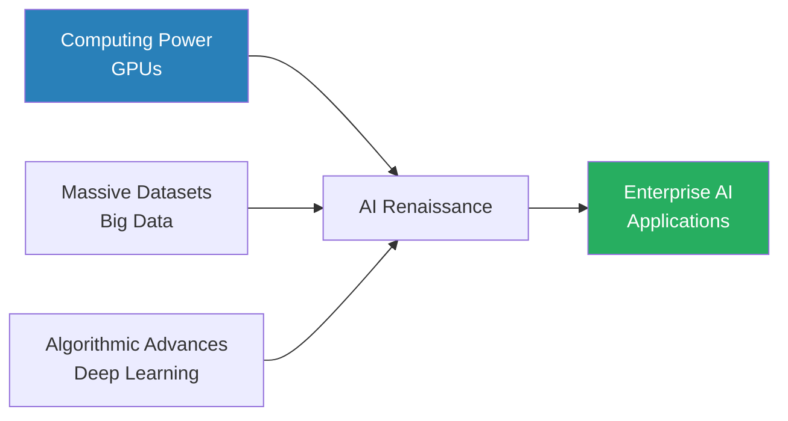
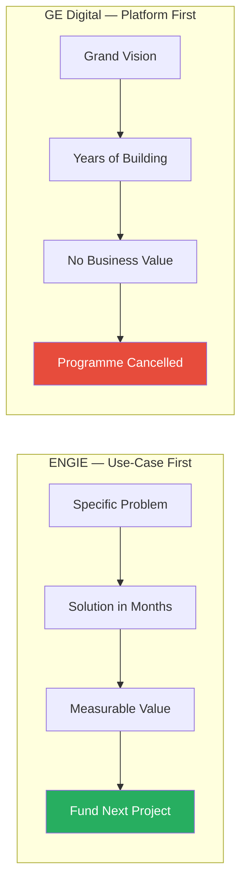
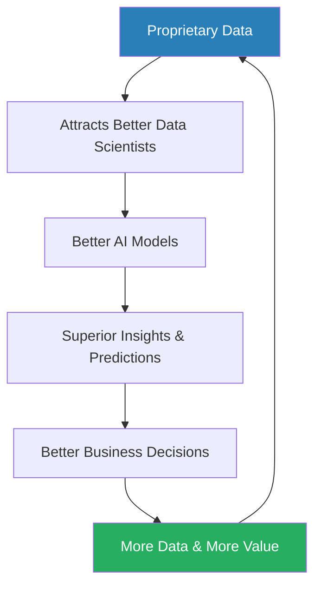
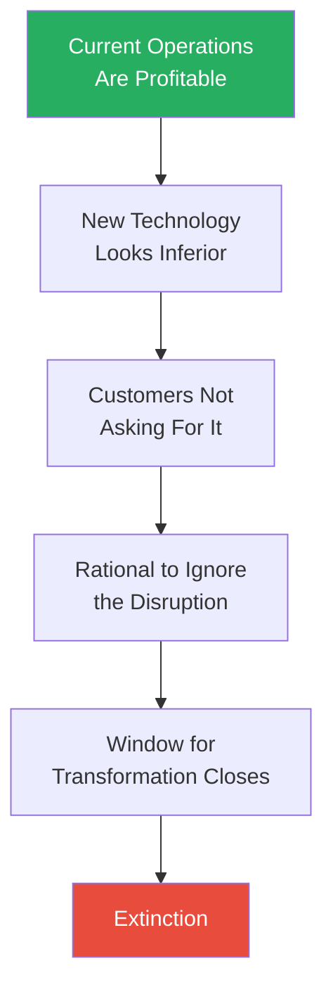

# Digital Transformation — Thomas M. Siebel

> Thomas Siebel's thesis is blunt: we are living through a corporate mass extinction event. Four converging technologies — cloud computing, big data, artificial intelligence, and the Internet of Things — are not improving business as usual but demolishing it entirely. 52% of Fortune 500 companies since 2000 have been acquired, merged, or gone bankrupt. Siebel argues this is not a gradual competitive shift but a punctuated equilibrium event borrowed from evolutionary biology: long periods of stability, then sudden, catastrophic change. His prescription is equally blunt — transformation must be CEO-driven, focused on reinventing core business processes (not digitising support functions), executed through cross-functional Centers of Excellence, and measured ruthlessly by economic value. The book is part strategic argument, part executive playbook, and part sales pitch for the platform-first approach his own company sells. Read it for the framing, filter the technology recommendations, and recognise that the urgency — while selectively applied — is directionally correct.

---

## About the Author

Thomas M. Siebel is one of the most commercially successful figures in enterprise software history. In 1993 he founded Siebel Systems, which became the dominant customer relationship management platform of the late 1990s, growing to over $2 billion in annual revenue before its $5.8 billion acquisition by Oracle in 2006. After Siebel Systems, he founded C3.ai, an enterprise AI platform company that provides tools for building and deploying large-scale AI applications for industrial and commercial customers. His career spans four decades of building, selling, and deploying enterprise technology at Fortune 500 companies — a vendor's perspective that deeply shapes this book's recommendations. The foreword is written by Condoleezza Rice, who serves on C3.ai's board of directors, and the case studies draw heavily from C3.ai's own customer base — a fact that is worth keeping in the foreground throughout.

---

## The Big Idea

*Siebel reframes digital transformation from a technology initiative into an existential event — and argues that the adoption cycle has flipped from bottom-up to CEO-driven.*

- Siebel's central argument is that digital transformation is not an IT initiative — it is an existential event
- He borrows the concept of <b style="color: #2980b9">punctuated equilibrium</b> from evolutionary biology to argue that industries do not decline gradually
  - They experience sudden mass extinction events when the underlying technological environment shifts
  - The current shift is driven by the simultaneous maturation of four technologies — cloud, big data, AI, and IoT — whose convergence creates capabilities that simply did not exist a decade ago

---

- <b style="color: #e74c3c">Optimisation will not save you</b> — the uncomfortable implication of the extinction framing:
  - Companies that digitise their existing processes are playing the wrong game entirely
  - The winners will be those that reinvent their core business processes using these technologies, not those that bolt AI onto the status quo
  - Digitising your HR system is table stakes
  - Digitising your supply chain, your underwriting engine, your predictive maintenance protocols — that is transformation
- Because core transformation crosses every functional boundary in an organisation, it cannot be delegated to a CIO or an IT department
  - <b style="color: #27ae60">It must be driven from the top</b>

> [!tip] Core Insight
> The technology adoption cycle has inverted. Historically, tools bubbled up from engineers to executives. Digital transformation must cascade downward from the CEO because it requires enterprise-wide reorganisation, budget reallocation, and cultural change that only the top can mandate.

- This leads to the book's most counterintuitive claim about the technology adoption cycle:
  - Historically, technology adoption moved bottom-up — engineers discovered useful tools, departments adopted them, executives eventually blessed what was already happening on the ground
  - Siebel argues that digital transformation inverts this pattern entirely
  - Organisations that wait for transformation to bubble up from their technical teams will not survive long enough to see it arrive

---

## Key Concepts at a Glance

| Concept | One-line summary |
|---------|-----------------|
| **Punctuated equilibrium** | Industries experience sudden extinction events, not gradual decline, when the technological environment shifts |
| **Core vs. context** | True transformation targets competitive differentiators (core), not support functions like HR and finance (context) |
| **The four technology vectors** | Cloud, big data, AI, and IoT are only transformative in confluence — each amplifies the others |
| **The three waves** | Wave 1 digitised processes, Wave 2 connected them, Wave 3 reinvents them entirely |
| **Data moats** | Incumbents possess irreproducible proprietary data — but the advantage only activates when they can extract predictive value |
| **CEO-driven mandate** | Transformation fails when delegated below the top because it requires cross-functional alignment only the CEO can mandate |
| **Center of Excellence model** | Cross-functional teams of data scientists, business analysts, and line managers bridge technical capability and business reality |
| **Phased delivery** | Small teams of 3-5 people delivering production applications in 10-16 week cycles with measurable economic value |
| **The CDO role** | A dedicated senior executive with genuine authority and budget — not advisory status or coordination |
| **Model-driven architecture** | Abstraction layers that reduce AI/IoT application complexity by orders of magnitude |
| **Metcalfe's Law applied to data** | Data value grows with the square of connected sources — cross-correlations create predictive power impossible from any single source |
| **The Innovator's Dilemma** | Successful incumbents fail to transform because their current operations work too well to justify betting on unproven alternatives |

---

## Chapter 1: The Mass Extinction Event

*Siebel opens with the statistic that half the Fortune 500 from 2000 no longer exists — and frames this not as competitive churn but as evidence of a biological-style mass extinction.*

- The average tenure of an S&P 500 company has dropped from 60 years in 1958 to under 20 years by 2012
- Half the companies on the Fortune 500 list in 2000 no longer exist as independent entities — acquired, merged, or bankrupt
- Siebel does not present this as normal competitive churn — he presents it as evidence of a mass extinction event

---

- The framing is deliberately borrowed from evolutionary biology:
  - <b style="color: #2980b9">Punctuated equilibrium</b> — a theory developed by Stephen Jay Gould and Niles Eldredge — holds that evolution does not proceed through slow, continuous change
  - Instead, species experience long periods of stability (stasis) interrupted by sudden, catastrophic bursts of change
  - During these bursts, organisms perfectly adapted to the old environment are wiped out, and organisms that happen to possess traits suited to the new environment thrive
- Siebel applies this directly to corporate life:
  - The argument is not that companies are failing because they are poorly managed
  - Many of the companies that have disappeared were superbly managed — for the old world

> [!example] Nokia's Collapse (2007-2013)
> - In 2007, Nokia held 49.4% of the global smartphone market
> - The iPhone was dismissed by Nokia's leadership as a niche product for technology enthusiasts — it did not even have a physical keyboard
> - By 2013, Nokia's mobile phone division was sold to Microsoft for $7.2 billion, a fraction of its peak value
> - The collapse was not gradual — Nokia was dominant, and then it was gone
> **The lesson:** Being the best at the old game provides zero protection when the game itself changes.

> [!example] Blockbuster Dismisses Netflix (2000)
> - At its peak, Blockbuster operated over 9,000 stores and employed 60,000 people
> - Netflix approached Blockbuster in 2000 with an offer to be acquired for $50 million
> - Blockbuster's CEO reportedly laughed at the proposal
> - Within a decade, Blockbuster was bankrupt and Netflix had transformed not just video distribution but the entire entertainment industry
> **The lesson:** The incumbent's laughter is often the disruptor's greatest competitive advantage.

- Siebel draws these stories together into a single structural argument — the problem is not stupidity or complacency but <b style="color: #2980b9">the Innovator's Dilemma</b>:
  - Clayton Christensen's framework explains why it is rational for successful incumbents to ignore disruptive threats
  - Current operations are profitable
  - Customers are not asking for the disruptive product
  - The new technology is initially inferior on the metrics that matter to existing customers
  - <b style="color: #e74c3c">By the time the threat becomes undeniable, the window for transformation has already closed</b>

"52% of Fortune 500 companies since 2000 have been acquired, merged, or gone bankrupt."

- The chapter closes with a warning about pace:
  - Each technology wave creates infrastructure that accelerates the next wave
  - Cloud computing enables AI; AI enables IoT; IoT generates data that feeds AI
  - The cycle is self-reinforcing, and the intervals between disruptions are shrinking
  - John Chambers, former CEO of Cisco, is quoted predicting that 40% of businesses will not exist in meaningful form within a decade
  - <b style="color: #27ae60">The speed of disruption is increasing, not plateauing</b>

---

## Chapter 2: The Three Waves and Core vs. Context

*Siebel organises the history of information technology into three waves — and introduces the critical distinction between digitising support functions and reinventing the capabilities that actually win customers.*

| Wave | Era | What happened | What changed |
|------|-----|---------------|-------------|
| **Wave 1: Digitisation** | 1980s-1990s | PCs, spreadsheets, relational databases | Automated existing processes — filing cabinets became databases, typewriters became word processors |
| **Wave 2: Internet** | 1990s-2000s | WWW, e-commerce, CRM, ERP | Connected processes — but e-commerce was the catalogue via browser, CRM was the rolodex made searchable |
| **Wave 3: Transformation** | 2010s+ | Cloud, big data, AI, IoT in confluence | Makes existing processes obsolete — fundamentally different activities, not faster versions of old ones |

Waves 1 and 2 were about efficiency. Wave 3 is about survival.

---

- <b style="color: #2980b9">Wave 3</b> does not automate or connect existing processes — it makes them obsolete:
  - An insurance company using AI to underwrite policies in real time based on IoT sensor data is not doing faster underwriting — it is doing a fundamentally different activity
  - A utility using machine learning to predict transformer failures is not doing better maintenance scheduling — it is eliminating the concept of reactive maintenance entirely

> [!tip] Core Insight
> Most organisations have spent two decades digitising context — HR platforms, cloud accounting, CRM tools. But their core business processes remain largely untouched. Context digitisation is table stakes. Core reinvention is transformation.

- This is where Siebel introduces Geoffrey Moore's distinction between <b style="color: #2980b9">core</b> and <b style="color: #2980b9">context</b>:
  - **Core** capabilities are what create differentiation and win customers
  - **Context** is everything else — HR, financial reporting, internal communications, facilities management
  - The distinction matters because context digitisation does not create competitive advantage
  - Every competitor has access to the same HR software and the same financial reporting tools
  - <b style="color: #27ae60">True transformation means applying AI, big data, and IoT to the processes that only your organisation performs</b>

> [!example] Amazon Enters Pharmacy
> - Pharmacies digitised prescriptions years ago — a context improvement
> - Then Amazon announced it was entering the pharmacy business, leveraging its logistics infrastructure, AI-driven personalisation, and massive customer data
> - Overnight, the entire competitive landscape shifted
> - The pharmacies had digitised the wrong thing — they had made their back-office efficient while leaving their customer-facing value proposition vulnerable
> **The lesson:** Digitising context creates efficiency. Digitising core creates survival.

- This distinction also explains why transformation must be CEO-driven:
  - Context improvements can be delegated to IT because they do not require cross-functional change
  - Core reinvention cannot — it requires the entire organisation to rethink how it competes
  - Which products to offer, which processes to reinvent, which capabilities to build, which to abandon
  - <b style="color: #e74c3c">Only the top of the organisation can mandate that level of change</b>

---

## Chapter 3: Cloud Computing

*Siebel positions cloud computing as the foundation layer — the technology that converts computing power from a capital expenditure into an operating expense, removing the infrastructure barrier for everything else.*

- Cloud computing, in Siebel's framing, is the foundation upon which everything else rests:
  - Before cloud, computing power was a capital expenditure — multi-million-dollar investment before a single line of code was written
  - Cloud converts this into an operating expense — rent what you need, when you need it, release it when done
- This is not merely a financial convenience — it is a structural change in who can participate:
  - Amazon Web Services, Microsoft Azure, and Google Cloud Platform have democratised access to infrastructure previously available only to the largest technology companies
  - <b style="color: #27ae60">A startup with three employees can now access the same computing power as a Fortune 500 firm</b>

---

- Siebel traces the intellectual origins through a clear lineage:
  - J.C.R. Licklider's 1960 paper "Man-Computer Symbiosis" and his vision of an "intergalactic computer network"
  - Time-sharing systems in the 1960s
  - Client-server architecture in the 1980s
  - Amazon's decision in the early 2000s to commercialise its internal infrastructure
  - AWS launched in 2006 and by 2019 was generating over $25 billion in annual revenue

| Model | What it provides | Level of abstraction |
|-------|-----------------|---------------------|
| **IaaS** (Infrastructure as a Service) | Raw computing resources | Lowest — you manage everything above the hardware |
| **PaaS** (Platform as a Service) | Development environments and tools | Middle — platform handles infrastructure, you build apps |
| **SaaS** (Software as a Service) | Finished applications | Highest — you configure and use, no development needed |

Each layer reduces the technical burden on the customer and increases the speed of deployment.

> [!tip] Core Insight
> Cloud removes the infrastructure excuse. "We cannot afford the servers" and "it will take 18 months to provision the hardware" are no longer valid. Cloud makes the other three vectors — big data, AI, and IoT — economically and operationally feasible for any organisation willing to use them.

---

## Chapter 4: Big Data

*Siebel redefines big data beyond "a lot of data" — it is data characterised by four dimensions that together overwhelm traditional tools and create the raw material AI needs to learn.*

- Big data, as Siebel defines it, is not just "a lot of data" — it is data characterised by the <b style="color: #2980b9">four V's</b>:

| Dimension | What it means | Why it matters |
|-----------|--------------|----------------|
| **Volume** | ~2.5 quintillion bytes generated per day; 40 zettabytes projected by 2020 | Traditional databases cannot store, index, or query at this scale |
| **Velocity** | Jet engines produce 1 TB per flight; financial markets generate millions of transactions per second | Batch processing is insufficient when data and decisions are real-time |
| **Variety** | Text, images, video, sensor readings, social media, logs | Most data is unstructured — far beyond SQL queries |
| **Veracity** | Data quality and trustworthiness | More data is not better if it is inaccurate, incomplete, or biased |

---

- <b style="color: #e74c3c">Without veracity, the other three V's are noise</b> — Siebel emphasises that data governance is a precondition for any AI application:
  - Data must be accurate, consistently formatted, properly sourced, and appropriately secured
  - Governance is not optional infrastructure — it is the foundation that determines whether AI models produce insight or hallucination

- Siebel traces the technology lineage to a pivotal moment:
  - Google's publication of the MapReduce paper in 2004 and the subsequent development of Apache Hadoop created a new paradigm
  - Rather than moving massive datasets to a central processor, <b style="color: #2980b9">MapReduce</b> distributes the computation to where the data already lives
  - This seemingly simple architectural shift made it possible to process petabytes of data on commodity hardware

> [!tip] Core Insight
> Big data provides the raw material. AI provides the intelligence. But without big data infrastructure — the ability to capture, store, integrate, and serve massive volumes of diverse data — AI has nothing to learn from.

---

## Chapter 5: The Internet of Things

*IoT is the technology vector that bridges the digital and physical worlds — generating data about physical reality at a scale and granularity that was previously impossible.*

- <b style="color: #2980b9">The Internet of Things</b> refers to networks of physical devices — sensors, actuators, cameras, thermostats, industrial equipment — connected to the internet and continuously transmitting data about their state, environment, and performance
  - By 2020, Siebel projects over 30 billion connected devices worldwide
  - By 2025, over 75 billion
- The transformation potential lies in the granularity of physical-world data:
  - A fleet of delivery trucks with GPS, accelerometers, fuel sensors, and engine diagnostics generates continuous data about routes, driver behaviour, fuel efficiency, and maintenance needs
  - A manufacturing plant with sensors on every machine generates data about production quality, equipment health, and energy consumption in real time

> [!example] Jet Engine Predictive Maintenance
> - A modern jet engine contains thousands of sensors measuring temperature, pressure, vibration, fuel flow, and dozens of other parameters
> - Each flight produces approximately one terabyte of data
> - Historically, this data was used reactively — reviewed after a problem occurred to understand what went wrong
> - With IoT and AI combined, the data is used predictively — machine learning models analyse sensor streams in real time and predict failures days or weeks before they occur
> - The shift from reactive to predictive maintenance transforms the economics of aviation
> **The lesson:** IoT turns physical assets into continuous data streams; AI turns those streams into foresight.

---

- The chapter also covers the security dimension of IoT:
  - Every connected device is a potential entry point for cyberattacks
  - <b style="color: #e74c3c">Security must be designed into IoT architectures from the beginning, not bolted on afterwards</b>

> [!example] The Mirai Botnet Attack (2016)
> - Compromised IoT devices were used to launch a massive distributed denial-of-service attack
> - Major websites including Twitter, Reddit, and Netflix were brought down
> - The attack demonstrated that IoT security is not theoretical but an active, exploitable vulnerability
> **The lesson:** Every unsecured connected device is a potential weapon in someone else's arsenal.

---

## Chapter 6: Artificial Intelligence

*Siebel's most technically detailed chapter traces AI from Turing's 1950 thought experiment through the AI winters to the modern renaissance — and argues that AI without the other three vectors is an academic exercise, not a business transformation.*

- Siebel traces the intellectual history through key inflection points:
  - Alan Turing's 1950 paper "Computing Machinery and Intelligence"
  - The AI winters of the 1970s and 1990s, when funding dried up after inflated expectations
  - The modern renaissance driven by three converging factors:
    - Dramatically increased computing power (particularly GPUs)
    - The availability of massive datasets (big data)
    - Algorithmic advances in deep learning

The modern AI renaissance required all three factors to mature simultaneously — computing power alone or data alone was insufficient.

---

- The chapter distinguishes between several categories:

| AI Category | Description | Example |
|-------------|-------------|---------|
| **Machine learning** | Algorithms that improve through data exposure, without explicit programming | The broad category encompassing all below |
| **Supervised learning** | Uses labelled input-output pairs to learn a mapping function | Fraud detection trained on historical fraud/not-fraud labels |
| **Unsupervised learning** | Finds patterns in unlabelled data | Customer segmentation from purchase behaviour |
| **Reinforcement learning** | Trains agents through trial and error, rewarding desired outcomes | Game-playing AI, robotic control |
| **Deep learning** | Neural networks with many layers learning hierarchical representations | Image recognition, NLP |
| **NLP** | Machines understanding, interpreting, and generating human language | Sentiment analysis, translation, chatbots |

- <b style="color: #2980b9">Deep learning's</b> resurgence traces to Geoffrey Hinton's work on backpropagation and the 2012 AlexNet breakthrough:
  - A deep convolutional neural network dramatically outperformed traditional methods in the ImageNet image recognition competition
  - This was the moment the field inflected

> [!tip] Core Insight
> AI is not a standalone technology. AI requires data (big data), computing power (cloud), and often physical-world inputs (IoT) to function at enterprise scale. AI without the other three vectors is an academic exercise, not a business transformation.

- <b style="color: #27ae60">The confluence argument is the chapter's most important contribution to the broader book thesis</b>:
  - A machine learning model is only as good as the data it is trained on
  - A deep learning model that would take weeks on a single machine can be trained in hours on a cloud GPU cluster
  - An AI system predicting equipment failures requires IoT sensors to provide real-time data
  - This is why Siebel insists the four vectors must be understood together

---

## Chapter 7: Case Studies — ENGIE and the Energy Sector

*The book's most instructive chapter contrasts ENGIE's rapid, use-case-first success with GE Digital's $7 billion platform-first catastrophe — illustrating the single most important execution principle in the book.*

- <b style="color: #2980b9">ENGIE</b>, the French multinational utility company, receives the most detailed treatment and functions as Siebel's primary exemplar of successful transformation:
  - Operates across electricity generation, natural gas distribution, and energy services
  - Approximately 150,000 employees in 70 countries
  - Faced a structural challenge: the energy sector transitioning from centralised fossil fuel generation to distributed renewable sources

---

- CEO Isabelle Kocher made a strategic decision to transform core operations using AI and IoT:
  - Appointed Yves Le Gelard as Chief Digital Officer with genuine authority and a substantial budget — not an advisory role but an operational one
  - Le Gelard established the <b style="color: #2980b9">Digital Factory</b>, a Center of Excellence bringing together data scientists, business analysts, and operational managers

> [!example] ENGIE's Digital Factory — Use-Case-First Delivery
> - ENGIE delivered four live AI applications in its first year of transformation
> - The first two use cases — predictive maintenance for power generation assets and optimised energy trading — were projected to exceed 100 million euros in annual economic benefit
> - The company planned a roadmap of 28 AI applications over three years, each with a quantified expected benefit
> - Each success funded and justified the next, building organisational momentum
> **The lesson:** Start with specific problems that deliver measurable value within months — momentum compounds.

> [!example]- GE Digital's $7 Billion Failure
> - General Electric, under CEO Jeff Immelt, invested approximately $7 billion over eight years in building Predix, a custom industrial IoT platform
> - The effort employed 3,000 programmers
> - It was conceived as a platform-first initiative — build the infrastructure, and the applications would follow
> - The platform was never completed
> - The CEO was fired
> - The digital division was separated from GE
> - GE's stock price collapsed, and the company was removed from the Dow Jones Industrial Average for the first time in over a century
> **The lesson:** Multi-year platform builds consume resources without demonstrating value. Executive attention drifts, patience exhausts, and the programme collapses.

"Work incrementally, capture value fast."

The contrast between ENGIE and GE is the book's most powerful illustration: use-case-first delivery builds momentum, while platform-first ambition starves itself of the executive patience it needs to survive.

---

## Chapter 8: Case Studies — Defence, Manufacturing, and Utilities

*Siebel extends his case studies across sectors to demonstrate that the transformation principles are industry-agnostic — each organisation transformed a different facet of its operations, but the structural approach was identical.*

### United States Air Force — Predictive Maintenance

- The Air Force operates thousands of aircraft with millions of individual components, each subject to complex maintenance schedules
- Traditional approaches were wasteful:
  - **Scheduled maintenance** replaces components at fixed intervals regardless of condition — wastes useful component life
  - **Reactive maintenance** fixes things after they break — causes unplanned downtime and potential mission failures

> [!example] Air Force Predictive Maintenance Prototype (12 weeks)
> - Working with C3.ai, the Air Force developed an AI system analysing sensor data from aircraft systems to predict component failures
> - A prototype was delivered in approximately 12 weeks
> - The system analyses data from thousands of sensors across the fleet, identifying patterns correlating with impending failures
> - These patterns are far too subtle and numerous for human analysts to detect
> - The system can predict failures days or weeks in advance, enabling maintenance during planned downtime
> **The lesson:** A 12-week prototype delivering real predictive value proves the model faster than any strategy document.

---

### Caterpillar — From Manufacturer to Service Provider

- <b style="color: #2980b9">Caterpillar's</b> challenge was not just maintaining its own equipment but providing predictive maintenance as a service to its customers:
  - A Caterpillar excavator in a remote mining location that breaks down unexpectedly can cost hundreds of thousands of dollars per day in lost production
  - By equipping machines with IoT sensors and applying AI to the data streams, Caterpillar transformed from a manufacturer that sells equipment into a service provider that guarantees equipment availability
  - <b style="color: #27ae60">The economic value shifts from the initial sale to the ongoing service relationship</b> — a fundamentally different business model

---

### Enel — Grid Intelligence

- <b style="color: #2980b9">Enel</b>, the Italian multinational energy company, manages over 70 million smart meters globally:
  - Applied machine learning to real-time consumption data
  - Developed capabilities in demand prediction, grid optimisation, and fraud detection
  - The fraud detection application alone — identifying customers tampering with meters or stealing electricity — was projected to save hundreds of millions of euros annually

---

| Company | Transformation type | What changed |
|---------|-------------------|-------------|
| **ENGIE** | Internal operations | Predictive maintenance and optimised energy trading |
| **Caterpillar** | Customer value proposition | From selling equipment to guaranteeing availability |
| **Enel** | Distribution intelligence | From passive delivery to predictive management |
| **US Air Force** | Operational readiness | From scheduled to predictive maintenance |

Each case study reinforces the same structural principles: CEO sponsorship, a dedicated transformation leader, cross-functional teams, use-case-first delivery, and quantified economic benefits.

---

## Chapter 9: Data Moats and Competitive Advantage

*Siebel makes one of his most compelling and original arguments: large incumbents possess a latent asymmetric advantage over startups — if they can transform their operations to exploit it.*

- The advantage is data — and it is <b style="color: #2980b9">irreproducible</b>:
  - A large financial institution has decades of transaction records, customer behaviour data, claims histories, and market interaction data
  - A large manufacturer has years of equipment telemetry, production quality data, and supply chain records
  - No startup can replicate this dataset — it represents an irreproducible historical record of an industry's operations
- <b style="color: #e74c3c">But possessing data is not the same as using it</b>:
  - Siebel uses the analogy of oil reserves — Saudi Arabia possesses enormous reserves, but those reserves are worthless without the technology to extract, refine, and distribute
  - Sitting on decades of transaction history without AI capability to analyse it is not a competitive advantage — it is a storage cost

---

- When an organisation does activate its data through AI, the advantage becomes a <b style="color: #2980b9">data moat</b> — a self-reinforcing competitive barrier:

Each cycle widens the gap between the organisation with the moat and its competitors — the advantage compounds exponentially, not linearly.

"If you cannot quantify the expected benefit, scrap the project."

> [!tip] Core Insight
> Siebel connects data moats to Metcalfe's Law: the value of an organisation's data grows with the square of the number of connected data sources. A single source provides limited power. But when engine vibration data is combined with temperature, fuel flow, weather, flight routes, and maintenance history, the cross-correlations multiply predictive accuracy in ways no single source could achieve.

- The practical implication is that organisations should think about <b style="color: #27ae60">data integration breadth from the outset</b>:
  - Many AI initiatives start narrowly — one system, one model, one use case
  - Siebel argues this is short-sighted
  - The real value emerges from connecting data across systems, departments, and business units
  - Cross-domain predictions that no siloed analysis can produce

---

- The catch — and Siebel acknowledges this — is that data moats require organisational capability:
  - Data must be clean, integrated, properly governed, and accessible to data scientists
  - In most large organisations, data is fragmented across dozens of systems, stored in incompatible formats, governed by different policies, controlled by different departments
  - <b style="color: #e74c3c">The data moat is latent until the organisation invests in the infrastructure and governance to activate it</b>

---

## Chapter 10: Model-Driven Architecture

*The most technically prescriptive chapter — and the one most directly connected to Siebel's commercial interests — argues that the complexity of enterprise AI demands a fundamentally different architectural approach.*

- Siebel frames the problem in terms of complexity:
  - An enterprise AI/IoT application must integrate data from dozens or hundreds of source systems
  - Each with its own database technology, API, data format, and access protocol
  - It must process data through machine learning pipelines, serve predictions, handle security and compliance, and operate reliably at scale

---

- If you attempt to build this using traditional structured programming, the connections grow combinatorially:

| Approach | Lines of code | Development time |
|----------|--------------|-----------------|
| **Structured programming** | ~83,000 lines | ~200 person-days |
| **Model-driven architecture** | ~1,450 lines | ~5 person-days |

- <b style="color: #2980b9">Model-driven architecture</b> works by introducing an abstraction layer between the developer and the underlying infrastructure:
  - Instead of writing code to connect specific databases to specific processing engines, the developer describes data relationships, business logic, and analytical workflows using a high-level modelling language
  - The platform handles translation to underlying infrastructure — database connections, API management, security, scaling
- Siebel's analogy is the transition from assembly language to high-level programming languages:
  - In the 1960s, programmers wrote in assembly — directly instructing the processor
  - Languages like FORTRAN and COBOL introduced an abstraction layer for business logic
  - Model-driven architecture does the same for AI applications — express business logic without worrying about data plumbing

> [!abstract] Siebel's Phased Delivery Model
> 1. Assemble small teams of 3-5 engineers and data scientists
> 2. Target a specific business problem with quantified expected benefit
> 3. Develop a production AI application in 10-16 weeks
> 4. Deliver measurable economic value at each cycle
> 5. Structure the full transformation as a sequence of such sprints

---

- <b style="color: #e74c3c">The chapter's credibility is undermined by the fact that C3.ai is itself a model-driven architecture platform</b>:
  - The specific numbers (83,000 vs. 1,450 lines, 200 vs. 5 person-days) come from C3.ai's own reporting
  - They should be treated as marketing claims, not independent benchmarks
- But the underlying structural point is not in dispute:
  - Building enterprise AI applications from scratch, integrating open-source components through custom code, is extraordinarily expensive and most organisations that attempt it fail
  - The GE Digital example ($7 billion, eight years, 3,000 programmers, failure) is the most dramatic illustration

> [!example] A UK Bank's Anti-Money-Laundering Platform
> - A UK bank spent 300 million euros with a systems integrator attempting to build a custom anti-money-laundering platform
> - After three years, nothing was delivered
> - The project consumed enormous resources without producing a single production-ready capability
> **The lesson:** Do not underestimate the infrastructure challenge, and do not assume your organisation can build what technology companies have spent billions developing.

---

## Chapter 11: The CEO Action Plan

*The final major chapter is the book's executive playbook — a ten-point framework grounded in Siebel's decades of enterprise deployment experience.*

### 1. Marshal the C-Suite

- The executive team is the transformation engine, not a steering committee:
  - The CEO must personally drive the transformation agenda
  - Every member of the C-suite must be aligned and accountable
  - This is not about delegating to a technology committee
  - <b style="color: #27ae60">Treat digital transformation with the same priority as a merger, an acquisition, or a restructuring</b>

---

### 2. Appoint a Chief Digital Officer with Authority and Budget

- The CDO must be a dedicated senior executive whose entire job is to make transformation succeed:
  - Not a committee chair, not an advisor, not a coordinator
  - A leader with authority to override departmental resistance, budget to fund projects, and mandate to reorganise work

> [!example] ENGIE's CDO — Yves Le Gelard
> - Le Gelard was given genuine operational authority over the Digital Factory and reported directly to the CEO
> - He was not embedded in IT, not subordinate to the CIO, and not dependent on business units for his budget
> - This structural independence was critical to his effectiveness
> **The lesson:** Structural independence — own budget, direct CEO reporting — is what separates effective transformation leadership from "responsibility without power."

- <b style="color: #e74c3c">The failure mode</b>: a CDO appointed with a title but no authority:
  - Becomes a bureaucratic coordinator — able to advise but not to decide, able to recommend but not to fund
  - Recommendations pile up, delivery stalls, and the organisation concludes that "digital transformation does not work here"

---

### 3. Work Incrementally — Capture Value Fast

"Work incrementally, capture value fast."

- This is the principle Siebel returns to most frequently, illustrated most vividly by the GE Digital catastrophe:
  - GE: $7 billion, eight years, platform-first → failure and near-dissolution
  - ENGIE: four live applications in year one → 100 million euros projected benefit
  - Shell: predictive valve maintenance → hundreds of millions in annual savings
  - US Air Force: predictive maintenance prototype → 12 weeks
- <b style="color: #27ae60">Executive attention is the scarcest resource in any organisation</b>:
  - Multi-year builds consume resources without demonstrating value
  - Use-case-first delivery proves value early and creates a constituency of supporters
- Siebel recommends structuring every programme as 3-6 month delivery cycles:
  - Each targeting a specific business problem
  - Each with a quantified expected economic benefit
  - Solve the problem first; build platform capability as a byproduct

---

### 4. Forge Strategic Vision in Parallel

- <b style="color: #e74c3c">Do not wait for the perfect strategy before acting</b> — strategy and execution must evolve together:
  - The transformation roadmap will change as the organisation learns what works and what does not
  - Siebel argues against the common pattern where strategy development becomes a substitute for action
  - Endless workshops, consultant reports, alignment sessions, and governance frameworks that delay delivery indefinitely
  - Start building while you are still planning — let early results inform the strategy

### 5. Draft a Transformation Roadmap

- The roadmap is not just a project plan — it is an alignment tool and a communication device:
  - Concrete milestones, named applications, expected economic benefits, and an aggressive but achievable timeline
  - ENGIE's roadmap: 28 applications over three years, each with a named business sponsor, quantified benefit, and delivery timeline
  - <b style="color: #27ae60">The roadmap made the abstract concrete and gave the organisation something to rally around</b>

---

### 6. Pick Partners Carefully

- Choose technology vendors and consultants with proven enterprise-scale deployment experience:
  - Many AI consulting engagements produce impressive demos and proofs of concept that never survive contact with production data, security requirements, and operational scale
  - This is transparently a pitch for companies like C3.ai — but the underlying point is valid
  - Look for partners who have deployed at scale in regulated, complex environments

### 7. Focus on Economic Benefit

"If you cannot quantify the expected benefit, scrap the project."

- Siebel reports that C3.ai discourages 70% of proposed projects — seven out of ten ideas declined because they cannot demonstrate sufficient economic value:
  - This is deliberately ruthless
  - Rigorous economic focus prevents resource dilution, maintains executive confidence, and ensures the programme builds credibility through demonstrated results

> [!example] Shell's Valve Maintenance Application
> - Shell has tens of thousands of valves across its global operations
> - An AI system predicts which valves will fail — and when — avoiding catastrophic failures, reducing unplanned shutdowns, and extending equipment life
> - The economic benefit runs to hundreds of millions of dollars annually
> - This is the kind of project that earns credibility and funds further transformation
> **The lesson:** Quantified, undeniable economic benefit is what converts sceptics into supporters.

---

### 8. Create a Culture of Innovation

- Transformation requires psychological safety, experimentation, and tolerance for intelligent failure:
  - People must feel safe to propose ideas that might fail, challenge existing processes, and experiment with new approaches
  - Google's "20% time" policy led to Gmail and Google News
  - 3M's similar innovation programme produced Post-it Notes
  - <b style="color: #27ae60">Culture cannot be mandated from above — it must be modelled by leadership and reinforced through incentives, recognition, and the tangible experience of seeing innovation rewarded</b>

### 9. Reeducate the Leadership Team

- The current leadership team does not have the skills to lead a digital transformation — this is not an insult but a structural reality:
  - Most C-suite executives built their careers in the pre-AI era
  - They understand strategy, operations, and finance but not machine learning, data architecture, or AI economics
  - Siebel argues for systematic, continuous executive education — not one-off workshops
  - The goal: enough technical literacy to evaluate AI proposals, distinguish realistic from inflated claims, and make resource allocation decisions with confidence

### 10. Continuously Reeducate the Workforce

- Skills depreciation in AI is faster than in any previous technology cycle:
  - Techniques cutting-edge today will be obsolete in three to five years

> [!abstract] C3.ai's Workforce Education Programme
> 1. Curated Coursera curriculum aligned to transformation needs
> 2. Cash bonuses ($1,000-$1,500) for course completion
> 3. Hall of Fame wall displaying names of employees who complete courses
> 4. CEO-signed certificates of achievement
> 5. ENGIE planned to train over 100 employees through its CoE in year one

- <b style="color: #27ae60">Learning must be continuous, visible, and executive-sponsored</b>

"Digital transformation is not a technology problem. It is a leadership problem."

---

## The Center of Excellence in Detail

*Siebel argues that the Center of Excellence is the correct organisational vehicle for transformation at scale — an abstraction layer between technical capability and business need, translating in both directions.*

- A <b style="color: #2980b9">Center of Excellence</b> brings together three capabilities that no single department possesses:
  - **Data scientists** who understand algorithms and model development
  - **Business analysts** who understand processes and domain logic
  - **Line managers** who understand operational reality and constraints

---

- Without this cross-functional composition, AI work fragments into departmental silos:
  - Data science teams build models that are technically elegant but do not reflect operational reality
  - Business teams request tools based on a naive understanding of what AI can actually do
  - Operations teams resist changes they were not consulted on and do not understand
- The CoE solves these coordination failures by creating:
  - A shared methodology
  - A unified talent pipeline
  - A structured process for use case prioritisation
  - Repeatable delivery processes
  - <b style="color: #27ae60">It is the organisational equivalent of model-driven architecture</b> — an abstraction layer translating between technical capability and business need

> [!example] ENGIE's Digital Factory — Structure and Independence
> - Staffed with a mix of data scientists, energy engineers, and business analysts
> - Had its own budget and its own delivery methodology
> - Reported directly to the CDO, who reported to the CEO
> - Structural independence meant it was not dependent on any single business unit for funding or direction
> - Could serve the entire organisation rather than one department
> **The lesson:** A CoE must have delivery responsibility, not just advisory status — otherwise it becomes a bureaucratic bottleneck issuing recommendations no one is obligated to follow.

- <b style="color: #e74c3c">The failure mode</b>: a CoE without genuine executive sponsorship and dedicated budget:
  - Issues recommendations that no one is obligated to follow
  - Produces roadmaps that business units ignore
  - Competes for resources against operational priorities and always loses
  - Operational priorities are immediate and visible; transformation benefits are future and uncertain

---

## The Innovator's Dilemma in Enterprise Context

*Siebel explains why competent, successful organisations consistently fail to transform — and his answer is structural, not motivational, extending Christensen's framework from markets to individual incentives.*

- Clayton Christensen's <b style="color: #2980b9">Innovator's Dilemma</b> describes a pattern in which established companies are rational to ignore disruptive innovations:
  - Their best customers do not want them
  - The initial market is small
  - The new technology is initially inferior on the metrics that matter to existing operations
  - By the time the disruptive technology improves enough to threaten the mainstream market, the incumbent has invested too heavily in the old model to pivot

---

- Siebel adds a critical layer to Christensen's original analysis — the dilemma operates at the individual level too:
  - Every middle manager in a successful organisation has a rational incentive to protect the status quo
  - Their performance is measured against existing metrics
  - Their budget is allocated to existing operations
  - Their career advancement depends on delivering results in the current system
  - <b style="color: #e74c3c">Proposing a radical transformation of the business they manage is a career risk with uncertain payoff — not proposing it is the safe choice</b>

> [!tip] Core Insight
> This is why transformation must be CEO-driven. The CEO is the only person in the organisation whose incentives are aligned with long-term survival rather than short-term operational performance. Everyone else is structurally incentivised to optimise the current system, even when it is headed for obsolescence.

"The adoption cycle has inverted."

- The pattern repeats across Siebel's examples:
  - Nokia's board dismissed the iPhone because their existing feature phones were selling in record numbers
  - Yahoo's board declined to acquire Google for $3 billion because Yahoo's own advertising business was growing
  - Blockbuster's CEO dismissed Netflix because Blockbuster's rental stores were still profitable
  - <b style="color: #27ae60">In each case, the decision was rational in the short term and catastrophic in the long term</b>

The Innovator's Dilemma is a structural trap: each step is individually rational, but the sequence leads to organisational extinction.

---

## Key Quotes

"Digital transformation is not a technology problem. It is a leadership problem."
— Thomas M. Siebel

"Work incrementally, capture value fast."
— Thomas M. Siebel

"If you cannot quantify the expected benefit, scrap the project."
— Thomas M. Siebel

"The adoption cycle has inverted."
— Thomas M. Siebel, on why transformation is now CEO-driven rather than bottom-up

"52% of Fortune 500 companies since 2000 have been acquired, merged, or gone bankrupt."
— Thomas M. Siebel, citing the scale of corporate disruption

"40% of businesses will not exist in meaningful form within a decade."
— John Chambers, former CEO of Cisco, quoted by Siebel

"Man-Computer Symbiosis" was the vision; cloud computing is the realisation.
— Siebel, paraphrasing J.C.R. Licklider's 1960 vision

---

## The Verdict

*Digital Transformation* is a useful and at times genuinely powerful book for anyone who needs to understand — or communicate — why AI and digital initiatives are not discretionary IT projects but existential strategic priorities. The **punctuated equilibrium** framing borrowed from evolutionary biology is the book's most lasting contribution: it gives executives a mental model for why gradual improvement is not sufficient and why the pace of disruption is accelerating, not stabilising. The **core vs. context** distinction is immediately applicable to any technology programme, providing a simple but effective filter for separating transformative work from table-stakes infrastructure. The case studies — particularly ENGIE versus GE Digital — provide genuinely instructive contrasts between approaches that succeed and approaches that fail spectacularly, and the GE story alone is worth the price of the book as a cautionary tale for anyone contemplating a multi-year platform build.

The book's greatest weakness is its conflict of interest, and it is impossible to read it without this lens. Siebel is the CEO of an enterprise AI platform company, and his most prescriptive advice — use a commercial platform, do not build your own — is exactly what his company sells. The case studies are almost exclusively C3.ai customers, creating significant selection bias. The dramatic numbers cited for model-driven architecture (83,000 lines reduced to 1,450, 200 person-days reduced to 5) come from C3.ai's own reporting and are presented without independent verification. The GE Digital failure, which Siebel repeatedly cites as proof that building your own platform is impossible, was a failure of strategy, governance, and executive leadership — not necessarily a validation of the buy-vs-build decision. Many organisations have built successful AI capabilities using open-source tools and targeted internal development, but these cases do not appear in Siebel's evidence base.

The treatment of organisational politics is perhaps the book's most conspicuous gap. For a book about enterprise transformation — an activity that requires reorganising budgets, displacing existing processes, and redistributing power across departments — there is remarkably little discussion of the political dynamics that determine whether a CEO mandate actually translates into operational change. Siebel assumes that if the CEO mandates transformation, it happens. Anyone who has worked in a large organisation knows this is naive. Middle managers can delay, dilute, and sabotage transformation through passive resistance, budget competition, and political manoeuvring in ways that never reach the CEO's attention. The book would be significantly stronger if it addressed what happens between the CEO's mandate and the organisation's response.

The book is best suited for executives and senior leaders who need the strategic vocabulary and urgency framing to justify and communicate transformation programmes. It is less useful for practitioners who need to understand the technical details of AI, data engineering, or cloud architecture — the treatment of these topics is broad but deliberately shallow, pitched at a CEO reading level. The urgency argument should also be consumed with appropriate scepticism: financial services has been "about to be disrupted" by fintech for over a decade, and while the long-term trend is real, highly regulated industries have barriers to entry that Siebel's preferred disruption examples (retail, media, entertainment) did not face. Read this book for the strategic framing and the executive vocabulary. Filter the technology recommendations through the lens of who is making them. And supplement it with books that address what Siebel ignores: the political, organisational, and human dynamics that determine whether transformation actually succeeds.

---

## Related Reading

- [[The First 90 Days - Michael D. Watkins|The First 90 Days]] — Michael Watkins on how leaders establish themselves in new roles, directly relevant to anyone appointed to lead a transformation programme
- [[Making Things Happen - Scott Berkun|Making Things Happen]] — Scott Berkun on execution discipline within complex programmes, complementary to Siebel's strategic framing
- [[Measure What Matters - John Doerr|Measure What Matters]] — John Doerr on OKRs and quantified goal-setting, aligns with Siebel's insistence on measurable economic value
- [[An Elegant Puzzle - Will Larson|An Elegant Puzzle]] — Will Larson on engineering management and organisational design, useful for the structural questions Siebel raises about CoEs
- [[Secrets to Winning at Office Politics - Marie G. McIntyre|Office Politics]] — Oliver James on the political dynamics Siebel almost entirely ignores
- [[Working Backwards - Colin Bryar & Bill Carr|Working Backwards]] — Colin Bryar and Bill Carr on Amazon's operating system, a complementary model for how mechanisms enforce principles in large organisations
- [[Thinking in Systems - Donella H. Meadows|Thinking in Systems]] — Donella Meadows on feedback loops and system dynamics, useful for understanding Siebel's data moat and self-reinforcing advantage arguments
