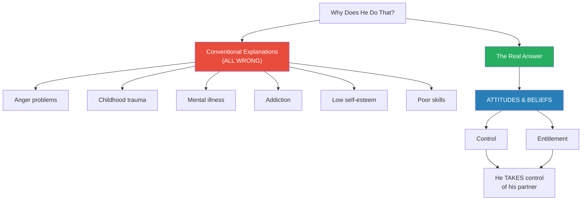
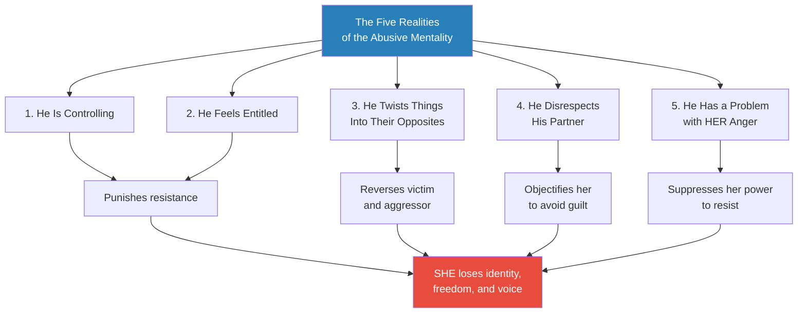
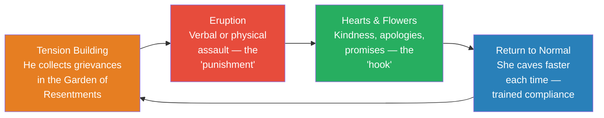
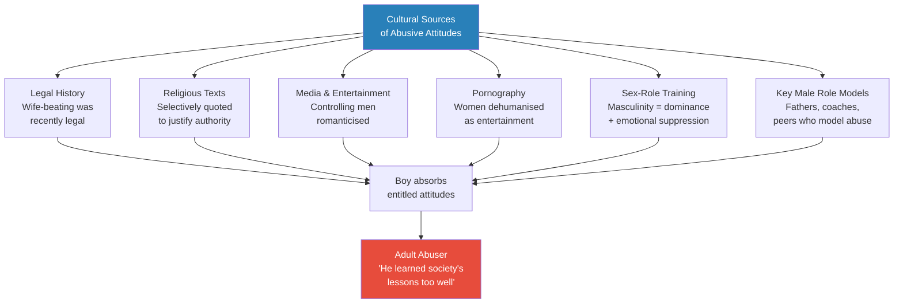
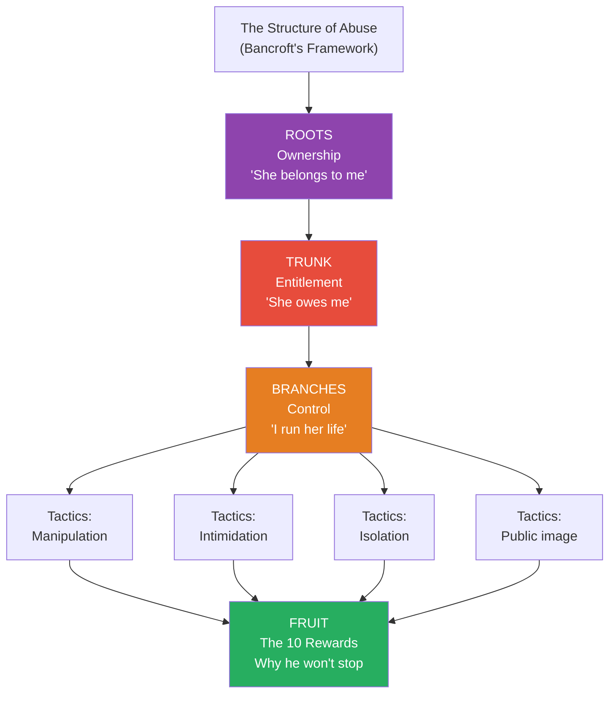

# Why Does He Do That? — Lundy Bancroft

> Lundy Bancroft spent fifteen years inside the minds of over two thousand abusive men — as their counselor, evaluator, and investigator — and emerged with a single, devastating insight: abuse is not caused by anger, mental illness, childhood trauma, addiction, or loss of control. It is driven by a system of attitudes and beliefs — specifically, entitlement and the desire for control — that make the abuser's behavior logical and rewarding from his own perspective. He doesn't lose his temper; he uses it. He doesn't lose control of himself; he takes control of his partner. This book strips away every comfortable myth about "why he does that," replaces them with a clear-eyed taxonomy of ten abuser types, maps the cycle that keeps victims trapped, and explains why separation is the most dangerous moment of all. It is the most important book in this vault for understanding what is happening inside the abuser's mind — the missing piece that every other book on this shelf approaches from the outside.

> [!note] A Note on Gender
> Bancroft writes about male abusers and female victims because that represents the statistical majority of his clinical experience. However, he explicitly states that the tactics, thinking patterns, and entitlement structures he describes apply regardless of the abuser's gender — including in same-sex relationships and in cases where women abuse men. The patterns are universal; only the pronouns vary. This summary preserves Bancroft's framing but the reader should understand that these dynamics can appear in any relationship.

---

## About the Author

Lundy Bancroft is a counselor, custody evaluator, and child abuse investigator who co-directed Emerge, the first program in the United States designed specifically for abusive men. Over fifteen years, he worked directly with more than two thousand abusive men — not as a theorist, but as a practitioner with clinical access to abusers' actual thinking. What makes his perspective unique is the dual vantage point: he interviewed both the abusers and their partners, systematically comparing the men's accounts with the women's experiences. This revealed the enormous gap between what abusers say and what they do — a gap that traditional therapy almost never closes. His authority comes not from laboratory studies but from thousands of hours sitting across from men who controlled, degraded, and terrorized their partners while believing they were justified.

---

## The Big Idea

- The conventional wisdom about abusive men is almost entirely wrong — people assume abuse comes from anger problems, childhood trauma, mental illness, addiction, stress, or poor communication skills
- <b style="color: #27ae60">Bancroft's central thesis demolishes all of these explanations: abuse is driven by THINKING — by attitudes, beliefs, and values — not by feelings</b>
- The abusive man has normal conflict-resolution abilities — he proves this every day by getting through tense situations at work, managing holidays with difficult relatives, and navigating social conflicts without threatening anyone
- He doesn't use these skills with his partner because he doesn't want to — not because he can't
- <b style="color: #2980b9">The twin engines of abuse are control and entitlement</b>:
  - **Control**: the belief that he has the right to direct her life, her associations, her time, her body
  - **Entitlement**: the belief that she owes him deference, caretaking, sex, emotional management, and freedom from accountability
- These are not feelings — they are deeply held convictions that guide action
- <b style="color: #e74c3c">The most dangerous misunderstanding is the "neurotic assumption" — the belief that everyone who behaves badly must be suffering inside</b>
  - This assumption protects abusers by generating sympathy instead of accountability
  - "He must be hurting" becomes cover for "He is choosing to hurt you"
  - This directly parallels George Simon's framework in [[In Sheep's Clothing - George K. Simon]]
- The abuser is not out of control — he is taking control
- The abuser doesn't lose his temper — he uses his temper
- Understanding this distinction is the key to everything that follows

*Every conventional explanation for abuse focuses on what is wrong with the abuser emotionally. Bancroft's fifteen years of clinical work revealed that the real driver is what is wrong with his thinking.*

---

## Key Concepts at a Glance

| Concept | One-line summary |
|---------|-----------------|
| **Abuse is thinking, not feeling** | Beliefs and values drive abuse — not anger, trauma, or mental illness |
| **Control and entitlement** | The twin engines: he believes he has the right to run her life and that she owes him everything |
| **The neurotic assumption** | The false belief that bad behaviour always stems from inner pain — this protects abusers |
| **The 10 abuser types** | A taxonomy from The Demand Man to The Terrorist — most abusers are hybrids |
| **The Water Torturer** | Calm, quiet psychological destruction — never raises his voice, then says "See, YOU'RE the abusive one" |
| **Mr. Sensitive** | Uses therapy language and emotional vulnerability as weapons — the most persuasive disguise |
| **The abuse cycle** | Tension building → eruption → hearts and flowers → repeat — the "good periods" ARE part of the abuse |
| **The 10 rewards of abuse** | Why he won't change: power, free labour, financial control, getting his way, public image |
| **Separation danger** | The most dangerous time — abusers escalate when they lose control |
| **The making of an abuser** | Culture makes abusers — legal history, media, religion, sex-role training |
| **The process of change** | Genuine change is rare, requires external pressure, and looks nothing like a "good period" |
| **Defining reality** | Mr. Right's tactic of imposing his version of truth until his partner doubts her own mind |
| **The Garden of Resentments** | How an abuser plants a minor complaint and cultivates it into justification for an explosion |

---

## Part One: The Nature of Abusive Thinking

### The Mystery (Chapter 1)

*Bancroft opens with the voices of confused women — each one describing a partner who seems like two different people — and promises to answer the question they all share: "Why does he do that?"*

- Women in abusive relationships share a common experience: profound confusion
  - "He's two different people — Dr. Jekyll and Mr. Hyde"
  - "Everyone else thinks he's great — I don't know what it is about me that sets him off"
  - "He really doesn't mean to hurt me — he just loses control"
- Bancroft introduces three women whose partners seem completely different:
  - **Kristen and Maury**: Maury was dazzling and charming at first, then gradually became critical, controlling, and cruel — Kristen blames herself
  - **Barbara and Fran**: Fran is quiet, shy, and "wounded" — his jealousy isolates Barbara from everyone, and his violence is escalating
  - **Laura and Paul**: Laura is convinced Paul's ex-wife is lying about abuse — she doesn't see the warning signs in her own relationship
- These three men appear to have nothing in common — different personalities, different styles, different levels of violence
- <b style="color: #27ae60">But they all share the same underlying structure: moodiness, excuses, and outlook bubbling from the same source — entitlement and the desire for control</b>

> [!example] Kristen and Maury — The Charming Critic
> - When Kristen first met Maury, he was charming, funny, smart, and crazy about her
> - She opened up about hard things she'd been through — he was completely on her side
> - After they moved in together, the criticisms began: she talks too much, she's self-centred, she's not doing anything with her life
> - Then it was her weight: "You need to work out more, you aren't watching what you eat"
> - He wanted sex less and less — if she tried to initiate, forget it
> - A few days ago he said: "You're a lazy bitch, just looking for a man to live off of like your mother"
> - Kristen says: "He says I've changed a lot, but I'm not always so sure it's me"
> **The lesson:** The charming opening was genuine — but so are the entitled attitudes underneath. Maury didn't plan to become cruel. He just expected Kristen to be a perfect, all-giving partner, and when she turned out to be a normal human being with needs of her own, he became contemptuous.

> [!example] Barbara and Fran — The Wounded Jealous Man
> - Fran was quiet, shy, and cute — Barbara had to pursue him
> - He opened up slowly, revealing that he'd been deeply hurt by past relationships — cheated on, mistreated
> - Barbara tried to show him she was different — she's not flirtatious, doesn't show her body off to other men
> - But Fran wouldn't believe it — he constantly accused her of making eyes at other men
> - She got married thinking it would make him feel secure — it didn't
> - At a birthday party, she had a conversation with a man (not even attractive) — Fran demanded they leave immediately
> - On the drive home, he screamed, pounded the dashboard, shoved her against the car door — with their children in the back seat
> **The lesson:** Fran's jealousy is not insecurity — it is possessiveness. He does not want reassurance; he wants isolation. The "wound" story is the hook that keeps Barbara caretaking instead of leaving.

- The statistics are staggering:
  - 2 to 4 million women are assaulted by their partners per year in the US
  - Partner violence is the number one cause of injury to women aged 15-44
  - One woman out of three will be a victim of violence by a husband or boyfriend
  - 1,500 to 2,000 women are murdered by partners and ex-partners per year

> [!tip] Core Insight
> The abuser creates confusion deliberately. If his partner can't name what is happening to her, she can't resist it. Clarity is the first step toward freedom.

---

### The Mythology (Chapter 2)

*Bancroft systematically demolishes seventeen myths about abusers — comfortable explanations that sound plausible but protect the abuser by directing attention away from his attitudes and toward his supposed pain. This chapter is the intellectual foundation for everything that follows — if you accept even one of these myths, the abuser has room to operate.*

- Each myth serves the same function: it generates sympathy for the abuser and obscures his actual thinking
- <b style="color: #2980b9">The key insight from the myth-busting chapter</b>: "Feelings do not govern abusive or controlling behavior; beliefs, values, and habits are the driving forces"
- The myths share a common error — they assume the abuser's behavior is caused by something going wrong inside him, when in fact it is caused by something going right (from his perspective): his attitudes are working exactly as intended

#### The Central Myths — Debunked

| Myth | Why It Seems True | Why It's Wrong |
|------|-------------------|----------------|
| **He was abused as a child** | Many abusers do have trauma histories | Half of abusers were NOT abused as children; most abused children do NOT become abusers |
| **His previous partner hurt him** | He tells a compelling story of being victimized | He uses the story to gain sympathy and set up the new partner to "prove" she's different |
| **He has low self-esteem** | He sometimes seems insecure | Abusers who gain self-esteem get WORSE, not better — self-esteem feeds entitlement |
| **He can't manage stress** | He does seem stressed | He manages stress fine everywhere except with his partner — he CHOOSES to dump on her |
| **His boss mistreats him** | Scapegoating seems logical | Many abusers ARE the boss; those with great jobs abuse just as much |
| **He has poor communication skills** | He seems bad at resolving conflict | He resolves conflicts perfectly at work and with friends — he's unwilling, not unable |
| **He loses control** | His rages look uncontrolled | He never breaks HIS own stuff; he doesn't assault his boss at Thanksgiving |
| **He's mentally ill** | Some abusers do have diagnoses | Mental illness doesn't cause abuse — it can intensify it, but the attitudes are separate |
| **Alcohol makes him do it** | He's often worse when drunk | Alcohol is an excuse, not a cause; sobriety alone has NEVER cured abusiveness |
| **There are as many abusive women as men** | Some women are aggressive | Where are the men fleeing to shelters? The men whose careers are destroyed? They're rare |
| **It's as bad for him as for her** | He seems to suffer too | He gets over incidents in hours; she carries them for years |

> [!example] The Self-Esteem Experiment (Bancroft's Discovery)
> - In the early years of abuse work, Bancroft and his colleagues made a revealing mistake
> - They invited clients who had made outstanding progress to speak on television or address groups of high school students
> - They thought the public could benefit from hearing a reformed abuser speak in his own words
> - But every time a client received public attention, he had a bad incident of mistreating his partner within days
> - Feeling like a star and a changed man, his head swelled from the attention, and he went home and ripped into his partner with accusations and put-downs
> - They had to stop taking clients to public appearances entirely
> **The lesson:** Higher self-esteem made the abuse WORSE, not better — because it fed his sense of entitlement and superiority.

> [!example] The Myth of "Losing Control"
> - Bancroft asks a simple question: If the abuser truly loses control, why does he never break his OWN prized possessions?
> - Why does he get through Thanksgiving with difficult relatives without threatening anyone?
> - Why does he manage workplace conflicts without screaming?
> - One client beat his partner viciously while drunk — but only hit her on her legs, where the bruises wouldn't show
> - When asked why, the client looked at Bancroft as if he were dim and said: "Of course I wasn't going to do anything that would show"
> **The lesson:** He was choosing his targets carefully, even while "out of control." The loss of control is a performance, not a reality.

#### The Most Insidious Myths in Detail

**Myth #1: He was abused as a child.** This is the myth that generates the most sympathy — and the most cover. Yes, many abusers have childhood trauma. But the majority of people who were abused as children do NOT become abusers. And approximately half of Bancroft's abusive clients did not grow up in abusive homes. Childhood trauma can just as easily make someone MORE sympathetic to suffering, not less. When a man uses his childhood as an excuse, he is choosing which lesson to draw from it — and the lesson he draws reveals his values, not his wounds.

**Myth #6: He has poor communication skills.** This myth is particularly persistent among therapists. The research is clear: abusers have NORMAL abilities in conflict resolution, communication, and assertiveness — when they choose to use them. They get through tense situations at work, share openly with siblings about a grandparent's death, and navigate social conflicts without threatening anyone. They don't WANT to handle conflicts nonabusively with their partners. You can equip an abuser with the most innovative communication skills and he will go home and continue abusing — because the problem isn't his ability, it's his willingness.

**Myth #11: He has low self-esteem.** This is the myth that leads to the most counterproductive interventions. If an abuser's self-esteem were the problem, then building it up should improve his behaviour. But Bancroft discovered the opposite: when his clients received public recognition and attention, they became MORE abusive, not less. Their heads swelled, their sense of entitlement expanded, and they went home and tore into their partners. The self-esteem myth is rewarding for the abuser because it gets everyone — his partner, his therapist, his friends — to cater to him emotionally. He gets praise for being a good person while continuing to abuse.

**Myth #17: Alcohol makes him do it.** This myth is so prevalent that Bancroft devotes an entire chapter to dismantling it. The key evidence: alcohol is a depressant with no biological connection to aggression; abusers make conscious strategic decisions even while drunk (choosing which possessions to break, which parts of the body to hit); sobriety alone has NEVER cured abusiveness in Bancroft's experience; and many abusers are just as cruel — or crueller — when sober.

> [!abstract] The Myth-Busting Principle
> Every myth about abusers shares a common error: it locates the problem inside the abuser's FEELINGS (his pain, his insecurity, his trauma, his chemistry) rather than in his THINKING (his beliefs, his entitlement, his contempt, his sense of ownership). Feelings-based explanations generate sympathy. Thinking-based explanations generate accountability. The abuser prefers sympathy.

- <b style="color: #27ae60">Bancroft's summary of the chapter</b>: "An abusive man's emotional problems do not cause his abusiveness. You can't change him by figuring out what is bothering him, helping him feel better, or improving the dynamics of your relationship."
- "There is no way to overcome a problem with abusiveness by focusing on tangents such as self-esteem, conflict resolution, anger management, or impulse control. Abusiveness is resolved by dealing with abusiveness."

---

### The Abusive Mentality (Chapter 3)

*This is the core theoretical chapter — Bancroft identifies five key realities that define the abusive mind, replacing the myths with a coherent framework.*

#### Reality #1: He Is Controlling

- Control is the abuser's primary tool — not rage, not violence, but the systematic management of his partner's life
- <b style="color: #2980b9">Control manifests in three spheres</b>:
  - **Arguments and decision-making**: his word is final; disagreement is defiance
  - **Personal freedom**: he monitors her movements, associations, clothing, schedule
  - **Parenting**: he considers himself the authority, though he contributes little to actual childcare
- The abuser sees his control as benevolent — "I'm doing this for her own good"
- <b style="color: #e74c3c">A large part of his abusiveness comes in the form of punishments used to retaliate against her for resisting his control</b> — this is one of the single most important concepts in the book

> [!example] Glenn and Harriet's College Paper (Control as Punishment)
> - Glenn arrived at his group session angry and agitated
> - Harriet had told him she was leaving and took their two-year-old son for the weekend
> - Glenn decided to "hurt her back" by going after something important to her
> - He found the college paper she had spent a week writing, sitting on her dresser
> - He tore it into little pieces, then ripped up family photos
> - He left the pieces in "a nice pile on the bed for her to come home to"
> - He told Bancroft proudly: "I think she learned something from that"
> - Glenn spoke of how he had "allowed" Harriet various freedoms, as if he were her parent
> **The lesson:** He didn't lose control. He made a calculated decision to destroy what mattered most to her as punishment for asserting independence.

> [!example] Russell the Commander (Extreme Control)
> - Russell required his children to do calisthenics each morning before school
> - His wife was not allowed to speak to anyone without his permission
> - He would order her back to her room to change clothes if he didn't approve of her outfit
> - At dinner, he sat back and commented on the food like a restaurant reviewer
> - He would periodically instruct her to go to the kitchen to get things for the children, as if she were a waitress
> **The lesson:** For Russell, his home was a military installation and his family were recruits. Control was total.

---

#### Reality #2: He Feels Entitled

- <b style="color: #2980b9">Entitlement</b> is the abuser's belief that he has special status providing him with exclusive rights and privileges that do not apply to his partner
- The attitudes that drive abuse can largely be summarised by this one word
- Bancroft identifies five domains of entitlement:

| Domain | What He Expects | What It Looks Like |
|--------|----------------|-------------------|
| **Physical caretaking** | She serves him — meals, housework, childcare | He is an unpaid king; she is an unpaid servant |
| **Emotional caretaking** | She manages his feelings, anticipates his needs | If she focuses on anything besides him, he erupts |
| **Sexual caretaking** | She satisfies him on demand | He may reject her advances but explode if she rejects his |
| **Deference** | His opinions are edicts; she must not disagree | Disagreement, especially in public, is treated as betrayal |
| **Freedom from accountability** | He is above criticism | Any attempt to hold him accountable is "nagging" or "provoking" |

- "For each ounce he gives, he wants a pound in return"
- <b style="color: #e74c3c">His sense of entitlement means he is never satisfied — no matter how much she gives, it will never be enough, because he believes his needs are her entire responsibility</b>

> [!example] Hank and the Affair (Freedom from Accountability)
> - Hank joined Bancroft's program after slapping his partner
> - Bancroft asked what led up to the abuse — was he arguing?
> - Hank said: "She accused me of having an affair! That really pissed me off!"
> - Bancroft asked: "Well, were you having an affair?"
> - Hank paused, startled: "Well, yeah... but she had no proof! She shouldn't go saying things like that when she has no proof!"
> - Hank reserved for himself the privilege of being critical of his partner — but complaints against HIM were to be stifled immediately
> **The lesson:** The abuser considers himself above reproach. Her job is to serve, not to question.

> [!tip] Core Insight
> The abuser isn't abusive because he is angry — he's angry because he's abusive. His unrealistic expectations guarantee that his partner can never follow all his rules or meet all his demands. The result is that he is frequently enraged. The anger is a PRODUCT of the entitlement, not the cause of the abuse.

- Bancroft uses a compass analogy with his clients: "You want your partner to be this compass, and you want to be North. No matter where the compass goes, it always points in the same direction. No matter where she goes, or what she's doing, you expect her to always be focused on you."
  - His clients sometimes protest: "But that's what being in a relationship is about — we're supposed to focus on each other"
  - But Bancroft notices: when HE focuses on her, most of what he thinks about is what she can do for HIM
  - And when he doesn't feel like focusing on her at all, he doesn't bother
- <b style="color: #e74c3c">An abuser can seem emotionally needy — but he's not so much needy as ENTITLED</b>
  - You can pour all your energy into keeping him content, but no matter how much you give, it will never be enough
  - He will keep coming up with more demands because he believes his needs are your responsibility
  - You may feel drained to nothing — and he will STILL feel she is the one controlling HIM

---

#### Reality #3: He Twists Things Into Their Opposites

- The abuser's entitled perceptual system causes him to mentally reverse aggression and self-defence
- When his partner defends herself, he defines her actions as violence toward HIM
- When he then injures her further, he claims he was defending himself against HER abuse
- "The lens of entitlement the abuser holds over his eye stands everything on its head, like the reflection in a spoon"
- This is not clinical projection — it is a deliberate (though sometimes semi-conscious) reversal of reality driven by his core belief that she has no right to resist him

> [!example] Emile and Tanya — Reversing Aggression and Self-Defence
> - Emile, a physically violent client, described his worst assault on his wife Tanya
> - He said he "grabbed her by the neck and put her up against the wall" because she "went way overboard with her mouth"
> - Then, filled with indignation: "She tried to knee me in the balls! How would you like it if a woman did that to you?"
> - "Of course I lashed out. And when I swung my hand down, my fingernails made a long cut across her face. What the hell did she expect?"
> - Notice the inversion: Emile was choking Tanya against a wall — a life-threatening attack — and when she attempted to defend herself, HE defined her action as violence against HIM
> - His injury to her face was, in his mind, self-defence
> **The lesson:** The abuser reverses who is the aggressor and who is the defender. In his mind, she is never entitled to resist — and any resistance becomes proof that SHE is the abusive one.

- Another client, Wendell, described his wife Aysha as "nagging for hours" — but when Bancroft spoke to Aysha, it emerged that Wendell had launched a verbal assault first thing in the morning and continued all day
  - "He totally dominates arguments; he repeats himself like a broken record; and I'm lucky if I can get a word in"
  - She finally reached her limit and began standing up for herself forcefully — and THAT was when Wendell claimed she was the one yelling
  - Why does Wendell think Aysha is doing all the yelling? Because in his mind, she's supposed to be LISTENING, not talking — if she expresses herself at all, that's too much
- When Bancroft challenges his clients to stop bullying their partners, they twist his words around just as they do their partners':
  - "You're saying I should just lie down and let her walk all over me"
  - "Your approach is that whatever she does is okay because she's a woman"
  - "So you're telling us our partners can do anything and we can't lift a finger"
- <b style="color: #2980b9">The abuser exaggerates and ridicules his partner's statements for a reason: he wants to avoid having to think seriously about what she is saying</b> — he feels entitled to swat her down like a fly instead

#### Reality #4: He Disrespects His Partner

- The abuser tends to see his partner as less intelligent, less competent, less logical, and even less sensitive than he is
- He will tell Bancroft, for example, that she isn't the compassionate person he is — while simultaneously being the one who degrades her daily
- He often has difficulty conceiving of her as a human being at all
- <b style="color: #2980b9">Objectification</b> (or depersonalization) is the mechanism by which the abuser shields himself from empathy
  - By reducing her to less than human in his mind, he protects himself from natural guilt
  - These walls grow over time — after years, he may feel no more guilt about degrading her than you would about kicking a stone in the driveway
  - This is why abuse tends to get WORSE over time, not better — as his conscience adapts to one level of cruelty, he builds to the next
- Most abusers reach for the words they know are most disturbing to women — terms that assault her humanity, reducing her to an animal, an object, or a degraded body part
  - These words carry a force and ugliness that feel like violence
  - Partners of Bancroft's clients report that the verbal degradation is as damaging as physical assault — sometimes more so, because the words echo inside the mind long after bruises heal

> [!example] Sheldon and Kelly — Objectification to the Extreme
> - Sheldon's relationship with Kelly was over — he was seeking custody of their three-year-old daughter Ashley
> - He claimed Kelly had never bonded with Ashley and had neglected her from birth
> - His words: "I don't consider her Ashley's mother. She's just a vessel, just a channel that Ashley came through to get into this world"
> - When he spoke of Kelly, he twisted his face up in expressions of disgusted contempt
> - He never sounded upset — he considered Kelly too far beneath him to raise his ire
> - His tone was the same you might have toward an annoying but harmless little dog nipping at your heels
> **The lesson:** Sheldon had reduced Kelly to an inanimate object in his mind — a baby-producing machine. This level of objectification, while extreme, was only a few notches worse than the common thinking of many abusive men.

- "Abuse and respect are diametric opposites: You do not respect someone whom you abuse, and you do not abuse someone whom you respect"

#### Reality #5: He Has a Problem with HER Anger

- <b style="color: #27ae60">The abuser doesn't have a problem with HIS anger — he has a problem with YOUR anger</b>
- He reserves the privilege of rage for himself alone
- Her anger is dangerous to him for three reasons:
  1. He considers himself above reproach — her anger challenges this
  2. On some level he senses there is POWER in her anger — if she has space to feel and express it, she will be better able to resist his suffocation
  3. He perceives her anger as a CHALLENGE to his authority — and responds by overpowering it with greater anger of his own
- He tries to suppress her anger to snuff out her capacity to resist his will
- If she expresses rage, he uses it as proof that she is "irrational" or "crazy"
- This is why assertive women enrage controlling partners — assertion is resistance, and resistance threatens his authority
- She may develop physical or emotional reactions to swallowing her anger: depression, nightmares, emotional numbing, eating and sleeping problems — which he then uses as further evidence that she is "the one with the problem"

> [!example] David and Joanne — Manipulation in Three Acts
> - **Act 1**: David is yelling at Joanne, pointing his finger and turning red. Joanne tells him he's too angry. He yells louder: "I'm NOT angry! Don't tell me what I'm feeling! I hate that!" — denying the obvious while escalating
> - **Act 2**: Joanne tells David she needs time off from the relationship. David shifts to tears: "What you're saying is that you don't love me anymore." The conversation switches to Joanne reassuring David she isn't abandoning him — and her original complaints get lost
> - **Act 3**: Joanne wants to go back to school. David says they can't afford it and refuses to help with childcare. Joanne proposes solutions; David finds something wrong with each one. Joanne gives up — but David insists HE wasn't trying to talk her out of it. She winds up feeling the decision not to go back to school was her own
> **The lesson:** Manipulation is worse than overt abuse in some ways. After being slapped, you know what happened. After a manipulative interaction, you may have no idea what went wrong — you just know you feel terrible, and somehow it seems to be your own fault.

---

#### Reality #6: He Confuses Love and Abuse

- The abuser often tries to convince his partner that his mistreatment is proof of how deeply he cares
- "The reason I abuse her is because I have such strong feelings for her"
- "I told her she'd better not ever try to leave me — you have no idea how much I love this girl!"
- <b style="color: #e74c3c">What the abuser calls "love" is actually a cluster of possessive desires</b>:
  - The desire to have her devote her life to keeping him happy
  - The desire for sexual access
  - The desire to impress others by having her as his partner
  - The desire to possess and control her
- Genuine love means respecting the other person's humanity, wanting what is best for them, and supporting their independence — this kind of love is incompatible with abuse

#### Reality #7: He Is Manipulative

- Few abusers rely entirely on intimidation — being a non-stop bully is too much work and makes him look bad
- He switches frequently to manipulation, which is in some ways worse than overt abuse:
  - After being called a name or shoved, she at least knows what happened
  - After a manipulative interaction, she may have no idea what went wrong — she just knows she feels terrible, and somehow it's her own fault
- Key manipulation tactics:
  - **Changing moods abruptly** — keeping her constantly off balance
  - **Denying the obvious** — "I'm not angry!" spoken with a trembling, furious voice
  - **Convincing her that what HE wants is what's best for HER** — making selfishness look like generosity
  - **Getting her to feel sorry for him** — so she's reluctant to push forward with complaints
  - **Getting her to blame herself** — or other people — for what he does
  - **Confusion tactics in arguments** — changing the subject, twisting her words, insisting she is thinking things she isn't
  - **Lying and misleading** — guiding her into doing what he wants through misinformation
  - **Turning people against each other** — betraying confidences, charming her friends, telling lies about what she supposedly said

#### Reality #8: He Has a Good Public Image

- Most abusive men put on a charming face for their communities
- He may be:
  - Enraged at home but calm and smiling outside
  - Selfish with her but generous with others
  - Domineering at home but willing to compromise at work
  - Assaultive toward her but nonviolent with everyone else
- The pain of this contrast eats away at the woman: "Your partner is so nice — you're lucky to be with him"
- His charm makes her reluctant to seek help because she fears no one will believe her
- <b style="color: #2980b9">The public image is not separate from the abuse — it is the shield that protects the abuse from exposure</b>

#### Reality #9: He Feels Justified

- Abusers externalise responsibility for their actions — "she pushed me too far," "she knows how to push my buttons"
- He may express guilt initially, but as soon as he is pressed to look at his history of abuse in detail, he switches back to defending his actions
- He doesn't believe that he should be accountable — and he gets furious when anyone tries to hold him accountable
- Most abusers DO have a conscience about their behaviour outside the family — at work, with friends, on the street — but at home, their sense of entitlement takes over

#### Reality #10: He Is Possessive

- Possessiveness is at the core of the abuser's mindset — the spring from which all the other streams spout
- On some level, he feels that he OWNS her and therefore has the right to treat her as he sees fit
- This is why abuse tends to get worse as relationships get more serious — the more history and commitment, the more he treats her as a prized possession
- His jealousy is driven not primarily by fear of infidelity but by the desire to ISOLATE her:
  - He wants her life focused entirely on his needs
  - He doesn't want her to develop sources of strength that could contribute to independence
- <b style="color: #e74c3c">Any relationships she develops — male or female — are perceived as threats to his control</b>

*All five realities converge on the same outcome: the systematic erosion of his partner's autonomy, identity, and capacity to resist.*

---

### The Types of Abusive Men (Chapter 4)

*Bancroft introduces ten abuser profiles drawn from his work with two thousand men. These are recognition tools, not diagnostic categories — most abusers are hybrids who draw from multiple types.*

- Every abuser has the same core ingredients — control, entitlement, disrespect, manipulation — but the relative amounts vary greatly
- The descriptions below capture each man while he is being abusive — not all the time
- <b style="color: #e74c3c">The Water Torturer and Mr. Sensitive are the hardest to identify and the ones most likely to be believed by outsiders</b>

---

#### Type 1: The Demand Man

*Extreme entitlement — "You owe me."*

- Expects his partner's life to revolve around meeting his needs
- Becomes enraged if he isn't catered to or is inconvenienced in even a minor way
- Has little sense of give and take — for each ounce he gives, he wants a pound in return
- Exaggerates and overvalues his own contributions while devaluing hers
- When he doesn't get what he feels is his due, he punishes her
- If anything is demanded of HIM, he erupts: "I'm not your fucking servant"
- May be less controlling than other types as long as his needs are met — but the effects of his entitlement can be just as destructive

- One key feature: he may be less controlling than other abusers as long as his needs are met on his terms — he may even allow her to have friendships or support her career
- But the entitlement itself is corrosive — she comes to feel that nothing she does is ever good enough, that it is impossible to make him happy
- He keeps a mental list of any favour or kindness he has ever done and expects each one repaid at heavy interest

**Central attitudes:**
- It's your job to do things for me. If I'm unhappy, it's your fault
- You should not place demands on me — be grateful for whatever I choose to give
- I am above criticism
- I am a very loving and giving partner — you're lucky to have me

---

#### Type 2: Mr. Right

*Intellectual domination — "I am the ultimate authority."*

- Considers himself the expert on every subject under the sun
- Speaks with absolute certainty, brushing her opinions aside like annoying gnats
- Sees the world as a classroom where he is the teacher and she is his student
- When they disagree, he turns it into a clash between Right and Wrong, Intelligence and Stupidity
- <b style="color: #2980b9">His key tactic is called "defining reality"</b> — giving the definitive pronouncement on what is correct, spoken in the Voice of Truth
- Over time, his partner begins to doubt her own intelligence

> [!example] Pat and Gwen — The Saab (Defining Reality)
> - Bancroft asked Pat about his abusive behaviors that week
> - Pat admitted to yelling at Gwen and calling her "bitch" — they were fighting about money
> - Bancroft patiently extracted from Pat what Gwen's actual opinions were
> - It turned out Gwen thought they needed new clothes for the children and suggested selling their Saab for a cheaper, more reliable car
> - Pat dismissed every one of Gwen's suggestions as "stupid" — the children's clothes were "just bought" (Gwen said four months ago), the Saab trade was "getting a shit box"
> - Each time Bancroft pushed for Gwen's actual words, they turned out to be reasonable and well-thought-out
> - But Pat's voice of authority had so thoroughly dominated that Gwen's views never got a fair hearing
> **The lesson:** Mr. Right doesn't debate ideas — he imposes his own. His partner comes to believe she's "not that smart," which is exactly what he wants.

**Central attitudes:**
- You should be in awe of my intelligence
- Your opinions aren't worth listening to
- If you would just accept that I know what's right, everything would go better
- When you disagree with me, that's mistreatment of me

---

#### Type 3: The Water Torturer

*Calm, quiet psychological destruction — the hardest abuser to identify. Named for the torture method of slowly dripping water onto a person's forehead — each drop is nothing, but the cumulative effect is maddening.*

- <b style="color: #e74c3c">The Water Torturer proves that anger doesn't cause abuse</b> — he can assault his partner psychologically without ever raising his voice
- He stays calm in arguments, using his own evenness as a weapon to push her over the edge
- He often has a superior or contemptuous grin on his face — smug and self-assured
- His repertoire includes sarcasm, derision, openly laughing at her, mimicking her voice, and cruel, cutting remarks — all at low volume
- He takes things she has said and twists them beyond recognition to make her appear absurd — especially in front of other people
- He gets to her through a slow but steady stream of low-level emotional assaults and perhaps occasional shoves or other "minor" acts of violence that don't cause visible injury
- When she finally explodes in frustration, he says: "See, YOU'RE the abusive one — you're the one yelling and refusing to talk things out rationally"
- Friends and relatives who witness their interactions back him up: "She just explodes at him over nothing"
- Her children may develop the impression that Mom "blows up over nothing"
- The psychological effects are severe — because his tactics are so difficult to identify, they sink in deeply
- She may develop the impression that there is something psychologically wrong with HER
- How do you seek support from a friend when you don't know how to describe what is going wrong? When someone slaps you, you know you've been slapped — but when you feel psychologically assaulted after an argument with the Water Torturer, you may turn your frustration inward
- He is payback-oriented but hides it well — his violence, if physical, takes the form of cold-hearted slaps "for your own good" rather than explosive rage
- <b style="color: #2980b9">If you finally leave him, you may experience intense periods of delayed rage</b> — as you become conscious of how quietly but deathly oppressive he was
- This type rarely lasts long in an abuser program — he is so accustomed to his tactics working that he can't tolerate an environment where counselors recognise and name his manoeuvres

> [!example] The Water Torturer in Action
> - He never raises his voice
> - He uses sarcasm, derision, and mimicking at low volume
> - He stays even-keeled while systematically pushing his partner toward explosion
> - When she finally cries or yells in frustration, he shakes his head sadly
> - He says: "See, you're the abusive one, not me. I wasn't even raising my voice"
> - Their friends confirm: "I don't know what goes on with her — she just blows up at him, and he's so low-key"
> - The children develop the impression that Mom "blows up over nothing"
> **The lesson:** The Water Torturer is the most dangerous type to identify because outsiders invariably side with him. His calm is his weapon.

**Central attitudes:**
- You are crazy — you fly off the handle over nothing
- I can easily convince other people that you're the one who is messed up
- As long as I'm calm, you can't call anything I do abusive, no matter how cruel
- I know exactly how to get under your skin

---

#### Type 4: The Drill Sergeant

*Total control of every aspect of his partner's life.*

- Runs his partner's life in every way he can — criticises her clothing, controls her schedule, interferes with her work
- Ruins her relationships with friends and family or forbids her to see them
- May listen to her phone calls, read her mail, or require the children to report on her activities
- Often fanatically jealous — verbally assaults her with accusations of cheating, while likely cheating himself
- Almost certain to become physically violent — and likely to escalate until she is hurt or terrified enough to submit
- <b style="color: #e74c3c">Getting away from the Drill Sergeant is especially difficult because he monitors her movements so closely</b>

**Central attitudes:**
- I need to control your every move or you will do it wrong
- You shouldn't have anyone else in your life besides me
- I am going to watch you like a hawk to keep you from developing strength or independence
- I love you more than anyone in the world, but you disgust me

---

#### Type 5: Mr. Sensitive

*Therapy language as a weapon — the most persuasive cover a man can have.*

- Soft-spoken, gentle, supportive — when he isn't being abusive
- Loves the language of feelings, openly sharing his insecurities and emotional injuries
- May attend men's groups, therapy, twelve-step programs, or read self-help books
- His vocabulary is sprinkled with jargon: "developing closeness," "working out our issues," "facing up to hard things about myself"
- <b style="color: #2980b9">He wraps himself in the most persuasive cover a man can have</b> — if you feel mistreated, you assume something is wrong with YOU
- You seem to be hurting his feelings constantly — and he expects your attention to be endlessly focused on his emotional injuries
- When YOUR feelings are hurt, he delivers pop-psychology dismissals: "Just let the feelings go through you"
- With time, he increasingly blames you for everything wrong in his life
- He has the potential to become physically frightening, despite his nonviolent persona

> [!example] Brad at the Workshop (Mr. Sensitive Unmasked)
> - Bancroft was leading an emotional recovery workshop when a participant named Deanna warned him about her ex-partner Brad, who had promised not to cause problems
> - Brad arrived with his new girlfriend, seemed likeable, kind, and — sensitive
> - Within hours, Brad was speaking to other people about his past with Deanna, getting them riled up about her "running away" from their unresolved issues
> - On Sunday morning, he provoked a humiliating public scene about their relationship in front of the entire workshop
> - When Bancroft confronted him privately and used the word "abuse," Brad exploded
> - He screeched: "I have only put a hand on a partner once" — and then SHOVED Bancroft hard by the shoulder — while demonstrating how "barely" he had pushed his ex
> - Bancroft required Brad to leave — and then faced a mini-insurrection from other participants who couldn't believe he was ejecting this gentle, crying man
> **The lesson:** Mr. Sensitive's tears and vulnerability are his armour. The people around him become his allies precisely because they can't reconcile his emotional openness with the possibility of abuse.

**Central attitudes:**
- I'm against the macho men, so I couldn't be abusive
- As long as I use psychobabble, no one is going to believe that I mistreat you
- I can control you by analysing how your mind and emotions work
- Nothing in the world is more important than my feelings
- Women should be grateful to me for not being like those other men

---

#### Type 6: The Player

*Chronic infidelity as a control mechanism.*

- Usually good-looking, often sexy — makes his partner feel lucky to have him
- After a while, his interest outside of sex wanes; he flirts constantly; rumours surface
- Stalls on commitment, though earlier he couldn't wait to get serious
- Creates tensions between women rather than between himself and them
- Chronic infidelity is abusive in itself, but The Player also becomes irresponsible, callous, and periodically verbally abusive
- His promiscuity is a symptom: he is incapable of taking women seriously as human beings rather than as playthings

**Central attitudes:**
- Women were put on this earth to have sex with men — especially me
- It's not my fault that women find me irresistible
- If you could meet my sexual needs, I wouldn't have to turn to other women

---

#### Type 7: Rambo

*Intimidation-based — stereotypical machismo.*

- Aggressive with everybody, not just his partner — thrives on the sensation of intimidating people
- Has an exaggerated view of what a man is "supposed to be"
- Can make a woman feel safe and protected early on — the gallant knight
- But he lacks respect for women, and this disrespect combined with general violent tendencies means it is only a matter of time before he will be the one she needs protection FROM
- Not all "tough guys" are Rambos — the danger signs are violence toward anyone and disrespect toward women

- Not all "tough guys" are Rambos — there are plenty of stereotypically masculine men who are friendly, avoid conflict whenever possible, and treat women with genuine respect
- The danger signs are not machismo itself but violence and intimidation toward ANYONE, combined with disrespect and superiority toward women
- The notion that all macho men are likely to abuse women is based on class and ethnic prejudices — the same misconceptions that allow Mr. Sensitive and Mr. Right to skate by undetected

**Central attitudes:**
- Strength and aggressiveness are good; compassion and conflict resolution are bad
- Anything remotely associated with homosexuality or femininity must be avoided at any cost
- Women are here to serve men and be protected by them
- Men should never hit women — however, exceptions can be made for my own partner if her behaviour is bad enough
- You are a thing that belongs to me, akin to a trophy

---

#### Type 8: The Victim

*Weaponised victimhood — "Life has been so unfair to me."*

- Life has been hard and unfair for The Victim — to hear him tell it
- He tells persuasive stories about being abused by his former partner
- He manoeuvres the new woman into hating his ex-partner and may enlist her in campaigns of harassment or custody battles
- Highly self-centred — everything revolves around his wounds
- <b style="color: #e74c3c">The Victim's most dangerous inversion: he insists that women exaggerate or fabricate their claims of abuse, or that men are abused just as much as women</b>
- If you leave him, he may seek custody by presenting himself to the court as the victim of YOUR abuse
- How to tell the difference between a genuine victim and The Victim:
  - Does he show contempt or disrespect for his ex, or just anger? A genuine victim can still speak of his ex as a human being
  - Can he describe what HE did wrong in the relationship? Can he accept any responsibility?
  - Does he feel sympathy for abused women, or does he insist men are abused just as much?
  - Does his story develop a pattern where women exaggerate their claims, fabricate abuse, or are "out to get" men?
  - Pay particular attention to a man who claims to have been physically abused by a woman — the great majority of men who make such claims are actually the perpetrators
- If you are involved with The Victim and want to leave, you may find yourself feeling guilty toward HIM — despite his treatment of you
  - His capacity to present himself as helpless and pathetic makes it harder to reclaim your own life
  - You may worry he won't take care of himself, will wither from depression, or might try to kill himself
  - These fears are precisely the control mechanism he relies on

> [!example] The New Girlfriend and the Wicked Ex-Wife
> - As a counselor, Bancroft frequently interviewed a man's former partner and then spoke with the new one
> - The new partner almost always spoke at length about what a wicked witch the woman before her was
> - Bancroft couldn't share what he knew — because of his responsibility to protect the former partner's confidentiality and safety
> - All he could say was: "I always recommend that women talk to each other directly and not just accept the man's denial"
> - The pattern was relentless: each new partner became the next ex-partner's replacement — and eventually, her successor
> **The lesson:** If every woman in his life is crazy, vindictive, or abusive, the common denominator is not the women — it's him.

**Central attitudes:**
- Everybody has done me wrong, especially women
- When you accuse me of being abusive, you're joining the parade of people who have been cruel to me
- I've had it so hard that I'm not responsible for my actions

---

#### Type 9: The Terrorist

*The most dangerous — explicit threats, sometimes lethal.*

- Highly controlling AND extremely demanding, but his worst aspect is that he frequently reminds his partner he could destroy her or kill her
- May not actually beat her — some abusers know how to terrorise with threats, veiled statements, and bizarre behaviours alone
- Unlike most other abusers, the Terrorist often appears sadistic — he gets enjoyment from causing pain and fear
- His top goal is to paralyse her with fear so she won't dare think of leaving or defying him

> [!example] Gerald's Six-Month Countdown
> - Gloria's husband Gerald would glare at her, drum his fingers on the table, and say: "You have six months left. Things better shape up around here. Six months."
> - Gloria would plead with him to explain what he planned to do
> - Gerald would answer with maybe just a hint of a cold smile: "Just wait and see. Six months, Gloria."
> - Gerald had never laid a hand on Gloria in five years — but she was terrified
> - She started working on an escape plan to run away with their two-year-old son
> **The lesson:** Physical violence is not required for terror. Gerald controlled Gloria's entire life without ever touching her.

- Other examples of terrorist behaviour Bancroft has witnessed:
  - One client cut an article out of the newspaper about a woman murdered by her husband and taped it to the refrigerator
  - Another responded to his partner's announcement that she was leaving by spilling the blood of an animal in front of the house
  - Another would take out his gun when angry at his partner but insist he was "just going to clean it"
- The great majority of abusers who make lethal threats never carry them out — but that still leaves many who do
- <b style="color: #e74c3c">The trauma of living with this kind of terror is profound and makes it extremely difficult to think clearly about strategies for escape — but most women DO manage to get out</b>
- When a woman does leave the Terrorist, he may stalk her, and this dangerous harassment can continue for a long time
- He may attempt to get custody or unsupervised visitation to terrorise or control her through the children
- It is essential that friends, relatives, courts, and communities provide the most complete support and protection possible — while simultaneously holding the abuser accountable

**Central attitudes:**
- You have no right to defy me or leave me — your life is in my hands
- Women are evil and have to be kept terrorised to prevent that evil from coming forth
- I would rather die than accept your right to independence
- The children are one of the best tools I can use to make you fearful
- Seeing you terrified is exciting and satisfying

---

#### Type 10: The Mentally Ill or Addicted Abuser

*Comorbidity, not causality.*

- This category is not separate from the others — any of the above types can also have psychiatric or substance-abuse problems
- Mental illness and addiction do NOT cause abuse but can increase the risk of violence and resistance to change
- <b style="color: #27ae60">Many abusers who are not mentally ill WANT women to think they are — in order to avoid responsibility</b>
- Sobriety is a necessary prerequisite for change, but it is not sufficient
- The attitudes driving this type are the same as the other nine, plus: "I'm not responsible because of my condition"

---

> [!abstract] The 10 Types at a Glance
> | Type | Core Drive | Key Tactic | Hardest to Spot? |
> |------|-----------|------------|-----------------|
> | The Demand Man | Extreme entitlement | Punishing unmet needs | No |
> | Mr. Right | Intellectual superiority | Defining reality | Moderate |
> | The Water Torturer | Quiet contempt | Calm psychological erosion | **YES** |
> | The Drill Sergeant | Total control | Monitoring and isolation | No |
> | Mr. Sensitive | Emotional manipulation | Therapy language as weapon | **YES** |
> | The Player | Sexual entitlement | Chronic infidelity | Moderate |
> | Rambo | Intimidation | Physical dominance | No |
> | The Victim | Weaponised victimhood | Eliciting sympathy | Moderate |
> | The Terrorist | Terror | Threats and bizarre behaviour | No |
> | Mentally Ill/Addicted | Varies | Using diagnosis as excuse | Moderate |

#### Hybrids and Shapeshifters

- Most abusers are NOT a single type — they are hybrids who draw from multiple categories
- One man might combine Mr. Right's intellectual domination with The Victim's weaponised self-pity
- Another might alternate between Mr. Sensitive's therapy language and The Demand Man's explosive entitlement
- Some abusers change so drastically from day to day that they don't fit ANY consistent profile — this unpredictability is itself a form of abuse
- <b style="color: #27ae60">The taxonomy is a recognition tool, not a diagnostic system</b> — its purpose is to help the partner put her finger on what is happening, not to create a clinical label
- The descriptions capture each man while he is being abusive — he may be charming, loving, and generous at other times, which is precisely what makes him so confusing

> [!tip] Core Insight
> If you recognise elements of your partner in several different types, that is normal — you are not imagining things. The core ingredients are always the same: control, entitlement, disrespect, and the belief that he is justified. Only the flavour varies.

---

## Part Two: The Abusive Man in Relationships

### How Abuse Begins (Chapter 5)

*Bancroft calls the beginning of a relationship with an abuser "The Garden of Eden" — and explains how the charming opening is not separate from the abuse but is the foundation on which it is built.*

#### The Idyllic Opening

- Almost every abusive relationship begins with an idyllic period — the man is charming, attentive, and seems deeply in love
- This isn't (usually) a conscious trap — the abuser genuinely dreams of a happy future
- But his dream contains a hidden blueprint: a woman who meets all his needs, has no needs of her own, and is in awe of his brilliance
- He is looking for a personal caretaker, not a partner — though he uses the language of mutuality
- <b style="color: #e74c3c">The idyllic opening performs several trap functions</b>:
  - She tells everyone how great he is — then feels too embarrassed to reveal his mistreatment later
  - She assumes something must have gone wrong inside him — and pours herself into fixing it
  - She can't let go of the dream of the wonderful man she fell in love with
  - She wonders if SHE did something wrong to knock down their castle

#### The Anatomy of an Abusive Argument

- Bancroft dissects a typical abusive argument between Jesse and Bea to reveal its hidden structure:

> [!example] Jesse and Bea — The Dinner Party (Premeditated Abuse)
> - Two weeks earlier, Jesse and Bea had been out to dinner with Jesse's relatives
> - Bea had been animated and engaged in conversation — receiving positive attention
> - Jesse stewed about this for two weeks, planting it in what Bancroft's colleague calls <b style="color: #2980b9">"The Garden of Resentments"</b>
> - On their walk together, Jesse launched a calculated verbal assault disguised as random irritability
> - He told Bea she talks too much, is full of herself, has fantasies of being famous, should "grow up"
> - He insulted her journalism class and told her other people don't take her seriously
> - When Bea raised her voice in frustration, he criticised her for yelling
> - Then he stomped off, walking home in the freezing cold — to play the victim
> - Bea was left feeling slapped in the face, but unable to explain what had happened to anyone
> **The lesson:** Jesse's attack was not impulsive — it was cultivated over two weeks and designed to punish Bea for receiving attention and developing independence. The abuse was the CAUSE of the argument, not the result.

- Four critical characteristics of the abusive man in arguments:
  1. **He sees an argument as war** — a contest to be won, not a problem to be solved
  2. **She is always wrong in his eyes** — her perspective has no legitimacy
  3. **He has an array of control tactics** — Bancroft lists over thirty, including:
     - Denying being angry while obviously enraged
     - Insulting, belittling, and patronising
     - Telling her that others look down on her and don't take her seriously
     - Criticising her for raising her voice (in response to his stream of insults)
     - Telling her that SHE is mistreating HIM
     - Stomping off and playing the victim
     - Attributing his own characteristics to her (she's "full of herself," she "holds grudges")
     - Changing the subject whenever she gets close to making a point
     - Going silent and refusing to engage — punishing her with withdrawal
  4. **He makes sure to get his way by one means or another** — if one tactic fails, he switches to another; this is why arguments with him are so exhausting

- The abuser's behaviour during arguments is NOT caused by the argument — it CAUSES the argument
  - Therapists often try to work with abusers by analysing their responses to disagreements
  - But this misses the point: the abuse was what created the tension in the first place
  - Attempting to teach an abuser "communication skills" is like trying to teach a bank robber about "financial management"

> [!abstract] The 30+ Control Tactics
> Bancroft catalogues over thirty specific conversational and behavioural control tactics that abusers deploy. These include: interrupting, talking over, changing the subject, redefining reality, denying the obvious, mimicking and mocking, playing the victim, using tears strategically, threatening separation, threatening financial consequences, bringing up past incidents she is ashamed of, questioning her sanity, enlisting allies, withdrawing affection, using silence as punishment, making veiled threats, accusing her of what HE is doing, "forgetting" important agreements, demanding immediate resolution when she needs time, and many more. The sheer volume of tactics available to the abuser is part of what makes his partner feel she is "going crazy" — she can never pin down exactly what he is doing because he rotates through his repertoire constantly.

#### He Is Neither a Monster Nor a Victim

- Two equally dangerous misconceptions:
  1. **The monster view**: abusers are evil, calculating brutes — this prevents women from recognising their partners because "he has a good side"
  2. **The redeemer view**: his gentle humanity is just barely hidden under the surface and can be drawn out by love — portrayed constantly in movies, songs, and novels
- <b style="color: #27ae60">The reality is in between: he is a human being with a profoundly complex and destructive problem that should not be underestimated</b>
- His behaviour is primarily conscious — he acts deliberately rather than by accident — but the underlying thinking that drives his behaviour is largely NOT conscious
- He has integrated manipulative behaviour to such a deep level that he acts on automatic
- He knows WHAT he is doing but not necessarily WHY

> [!example] Lance and the Skiing Weekend (Conscious Tactics, Unconscious Motives)
> - Lance wanted his partner Kelsea to go skiing with him — she didn't feel like it after an exhausting week and wanted to see her friends
> - Lance launched into put-downs: she's lazy, she never sticks with anything, she never gets good at anything
> - Kelsea started to doubt herself: "Maybe I should be more disciplined about learning to ski"
> - The real issue was simple: Lance wanted company and resented her prioritising friendships — a common abuser theme
> - He used whatever insults came to mind to bully her into going — and was having some success
> - When his abuser group challenged him, his real motives and entitled attitudes became visible
> **The lesson:** The abuser's immediate tactics are conscious and chosen. But the deeper attitudes driving them — "she should always be available for me," "her friendships threaten my control" — often operate below his awareness.

#### The 15 Early Warning Signs

- Bancroft provides a warning-sign checklist that should be part of every young person's education before they start dating
- No single sign is definitive (except physical intimidation) — but patterns should be taken seriously
- The best protection: make unacceptable behaviours clear immediately; if they recur, leave for a substantial period; a third occurrence means the probability of an abuse problem is very high

---

### The Abuse Cycle (Chapter 5, continued)

*The cycle is self-reinforcing, and — crucially — the "good periods" are not separate from the abuse but are functional parts of it.*

*Each revolution of the cycle trains the partner to cave faster. The "good periods" hook her back in, rebuild his public image, and set up the next eruption. The mechanism is intermittent reinforcement — the most addictive reward schedule known to psychology, the same principle that makes gambling addictive.*

#### Phase by Phase

- **Tension building**: he collects negative points about her and squirrels them away — every disappointment, every failure to live up to his image of the perfect selfless woman goes down as a black mark
  - Bancroft's colleague calls this <b style="color: #2980b9">The Garden of Resentments</b> — he plants a minor complaint and cultivates it until it grows to tremendous dimensions
- **Eruption**: once he feels she "deserves" a punishment, the tiniest spark ignites him — the explosion of verbal or physical assault follows
- **Hearts and flowers**: he becomes kind, loving, apologetic — may cry, bring gifts, make promises
  - <b style="color: #e74c3c">This phase is the most insidious because it looks like love but functions as a trap</b>
  - The mechanism is intermittent reinforcement — the most addictive reward schedule known to psychology (the same principle that makes gambling addictive)
- **Good periods serve the abuse** — they are not a break from the pattern but an integral part of it:
  - His kindness helps him feel good about himself — he can tell himself "See, I'm a great guy" and maintain his self-image
  - She feels warmer and more trusting — the good period hooks her back into the relationship, especially if he doesn't have other ways to keep her (like financial control or threats)
  - He rebuilds his public image — friends see the loving couple and think "I don't know what she complains about"
  - She drops her defences and becomes more vulnerable — making the next eruption even more devastating
  - Each cycle, she caves faster — this is trained compliance, and the cycle accelerates over time
  - The good period is the carrot that makes the stick tolerable — remove it, and she would leave immediately
- Women commonly ask Bancroft: "Why can't he just stay in the good period? What can I do to keep him there?"
  - The answer: the good period is not the real him any more than the abusive period is — both are aspects of a unified pattern
  - The abuser NEEDS the eruption because it reestablishes control, punishes her for perceived transgressions, and reminds her who is in charge
  - Without the eruption, the good period would lose its power — it is the contrast that makes it addictive

> [!example] The Abuser Who Joined the Group — Then Quit
> - A common pattern: a man joins Bancroft's abuser program while separated from his partner, hoping for reconciliation
> - During separation, he is on his best behaviour — attending sessions, appearing to grow, speaking the language of accountability
> - His partner, seeing the "change," agrees to let him move back in
> - Within weeks of reconciliation, the excuses begin: the program is too expensive, he doesn't need it anymore, he doesn't feel comfortable being in a room with "real abusers"
> - He quits — and the abuse gradually resumes
> **The lesson:** Many abusers treat the change process as a performance to achieve a specific goal (reconciliation, dropped charges). Once the goal is achieved, the motivation evaporates — because the underlying attitudes were never touched.

> [!tip] Core Insight
> The "good periods" are not evidence that the abuse is ending — they ARE part of the abuse. They serve specific functions: hooking her back in, rebuilding his public image, and training her to tolerate more. A "good period" after an abusive incident should be viewed with suspicion, not hope.

---

### The 10 Rewards of Abuse (Chapter 5, continued)

*If abuse didn't work for the abuser, he would stop. The fact that it works extremely well is the major social secret that Bancroft exposes.*

> [!example] The Dinner-Plate Incident (How One Explosion Creates Lasting Control)
> - A father is snappy at dinner, criticising everybody
> - When he finishes eating, he strolls out of the room
> - His ten-year-old daughter says: "Dad, Wednesday is your night to wash the dishes"
> - He explodes: "You upstart little shit!" — grabs a plate, smashes it on the floor, knocks over a chair, storms out
> - The following Wednesday, dinner passes normally — but when Dad leaves the table again, no one reminds him it's his turn
> - It will be many, many months before anyone makes that mistake again
> - One single incident created a context where he never has to do dishes again
> **The lesson:** Abuse doesn't have to be constant to be effective. A single explosion creates a permanent atmosphere of control.

| # | Reward | How It Works |
|---|--------|-------------|
| 1 | **Power and control** | The rush of ruling — a potent, thrilling sensation |
| 2 | **Getting his way** | He rarely has to compromise; he skips whatever he finds unpleasant |
| 3 | **Someone to dump on** | He uses her as a human garbage dump for life's ordinary frustrations |
| 4 | **Free labour** | No abusive man does his share — she handles the house, the children, the emotional work |
| 5 | **Centre of attention** | She spends all her time thinking about how to manage HIM — leaving no space for herself |
| 6 | **Financial control** | He dominates economic decisions, often putting assets in his name |
| 7 | **His goals prioritised** | His career, education, and leisure always come first |
| 8 | **Public status** | He soaks up praise for being a "great guy" and "wonderful dad" |
| 9 | **Approval of friends and relatives** | His social circle may actively reinforce his controlling behaviour |
| 10 | **Double standards** | He lives by a special set of rules designed just for him |

- <b style="color: #27ae60">The benefits of abuse are a major social secret</b> — abusers don't want anyone to notice how well this system is working for them
- As long as we see abusers as victims or out-of-control monsters, they will continue getting away with it
- "If we want abusers to change, we will have to require them to give up the luxury of exploitation"

---

### Is He Going to Get Violent? (Chapter 5, continued)

*Many women who are verbally and emotionally abused live with a constant, gnawing question: will he take it further?*

- Bancroft's first recommendation: <b style="color: #27ae60">a woman's intuitive sense of whether her partner will be violent is a substantially more accurate predictor of future violence than any other warning sign</b> — listen to your inner voices above all
- Questions to ask yourself:
  - Has he ever trapped you in a room and not let you out?
  - Has he ever raised a fist as if he were going to hit you?
  - Has he ever thrown an object that hit you or nearly did?
  - Has he ever held you down or grabbed you to restrain you?
  - Has he ever shoved, poked, or grabbed you?
  - Has he ever threatened to hurt you?
- If the answer to ANY of these is yes, stop wondering whether he'll be violent — he already HAS been
- In more than half of cases where a woman describes her partner as "verbally abusive," Bancroft discovers that he is physically assaultive as well
- <b style="color: #e74c3c">Use common-sense definitions of violence, not the abuser's definition</b> — the abuser always minimises by comparing himself to men who are worse
  - "I'm not like one of those guys who comes home and beats his wife for no reason" — implying that if he had "adequate justification," it isn't violence
  - If he never threatens, then threats define "real abuse"
  - If he only threatens but never hits, then "real abusers" are those who hit
  - If he hits but never uses a closed fist... and so on, forever
- Research indicates that the single best behavioural predictor of which men will become physically violent is their LEVEL OF VERBAL ABUSE — not their anger, not their history, not their psychology
- Physical abuse is dangerous and tends to escalate over time — from shoving to slapping to punching to choking
- Any form of physical intimidation is highly upsetting to children who are exposed to it

---

### The Abusive Man in Everyday Life (Chapter 6)

*Beyond the explosive incidents, abuse is a daily texture — a fabric of control, disrespect, isolation, and double standards woven through ordinary life.*

- The abuser's daily patterns include:
  - **Isolation**: gradually cutting her off from friends and family, either through direct prohibition or through making those relationships so stressful that she gives them up
  - **Financial control**: managing or restricting her access to money, putting assets in his name, sabotaging her employment or education
  - **Double standards**: he can come and go as he pleases while she must account for every minute; he can express anger while she must stay silent; he can flirt while she is accused of infidelity for speaking to another man
  - **Constant criticism**: a steady drip of negativity about her appearance, intelligence, competence, parenting, friends, family — calibrated to keep her self-esteem just low enough to prevent resistance
  - **Emotional unavailability alternating with intensity**: he may be cold and withdrawn for days, then suddenly warm and present — the unpredictability keeps her off balance and focused on him

- <b style="color: #2980b9">The abuser has a split between his public image and his private behaviour</b>:
  - Enraged at home but calm and smiling outside
  - Selfish with her but generous with others
  - Domineering at home but willing to compromise at work
  - His partner wonders: "What is it about ME that sets him off?"
  - The answer: it isn't about her — it's about the power dynamics of the relationship

- The abuser's double standards extend into every corner of life:
  - He can have friends; she shouldn't
  - He can be angry; she must be calm
  - His career matters; hers is expendable
  - His leisure is sacred; hers is laziness
  - He can make mistakes; she cannot
- <b style="color: #e74c3c">The double standard is itself a form of abuse — it establishes a two-tier system in which he is the citizen and she is the subject</b>

#### Isolation: The Invisible Prison

- Isolation is one of the abuser's most powerful tools — and one of the hardest for outsiders to detect
- He may not explicitly forbid her from seeing friends and family — he doesn't have to
- Instead, he makes every social contact so unpleasant that she gradually gives them up on her own:
  - He criticises her friends: "I don't know why you hang out with her — she's a bad influence"
  - He sulks or creates arguments before or after she sees someone
  - He calls or texts constantly when she's out: "Just checking in" — but really monitoring
  - He flirts with or is rude to her friends until they stop coming around
  - He tells her things her friends or family supposedly said about her — fabricated or distorted
  - He pits her family against her by being so charming with them that they take his side
- The result is that she becomes increasingly dependent on him for emotional support — which is exactly what he wants
- When she has no one left to turn to, his version of reality becomes the only one she hears
- This connects directly to gaslighting — as described in [[The Gaslight Effect - Robin Stern]] — the abuser doesn't just distort her reality; he eliminates all the reference points that might help her see through the distortion

#### Financial Control: The Golden Handcuffs

- Financial abuse is one of the least-discussed forms of control — and one of the most effective at preventing escape
- Tactics include:
  - Controlling access to bank accounts, credit cards, and cash
  - Putting assets in his name only — her house, her car, her savings
  - Sabotaging her employment through jealousy, making her late, or demanding she quit
  - Running up debt in her name
  - Giving her an "allowance" and requiring her to account for every penny
  - Using financial generosity as a weapon: "After everything I've bought you, THIS is how you treat me?"
  - Making all major financial decisions unilaterally
- <b style="color: #2980b9">An abuser's history of economic exploitation tends to put him in a much better financial position than his partner if the relationship ends</b>
  - This makes it harder for her to leave — especially with children
  - He may threaten to use his economic advantage to hire a lawyer and pursue custody
  - This is one of the most terrifying prospects an abused woman can face

#### Racial and Cultural Dimensions

- Bancroft finds that the fundamental thinking and behaviour of abusive men cut across racial and ethnic lines
- The underlying goal — control of the female partner through entitlement — is universal
- But the particular SHAPE that abuse takes varies by culture:
  - White American abusers tend to be extremely rigid about how their partners are allowed to argue
  - Abusers from certain cultures focus more on how meals are prepared and the home is kept
  - Others are known for fanatical jealousy about any contact with other males
- The excuses and justifications also vary culturally — but the core ingredients (control, entitlement, disrespect, victim-blaming) are always present
- <b style="color: #e74c3c">Pointing fingers at other cultures is often a way to ignore the serious problems in our own</b> — the US is the only industrialised nation that failed to ratify the UN convention on eliminating discrimination against women
- White, middle-class abusers feel every bit as justified as abusers from any other background — they just hide their beliefs better

---

### Abusive Men and Sex (Chapter 7)

*Sexual coercion is one of the least-discussed forms of intimate partner abuse — and one of the most destructive.*

- The abuser's sexual entitlement takes several forms:
  - He may not accept having his sexual advances rejected, yet turn HER down whenever he feels like it
  - He may coerce sex after an abusive incident as a way of "making up" — or as a way of demonstrating that he still owns her
  - He may use sexual degradation as a control tool — pornographic demands, humiliating comments, pressuring her into acts she doesn't want
  - Even her pleasure exists for HIS benefit — if she doesn't reach orgasm, he may resent her because he wants to see himself as a great lover
- Sexual assault within relationships causes even deeper and longer-lasting effects than assault by strangers — because the victim cannot escape the perpetrator
- Some abusers are sexually abusive but never physically violent in other ways — they may be the most difficult to identify because "he's never hit me"
- <b style="color: #27ae60">Sexual coercion or force in a relationship is abuse, period</b> — even if the partner doesn't feel the term "rape" applies

---

### Abusive Men and Their Allies (Chapter 11)

*The abuser does not operate alone — he recruits a support system.*

- <b style="color: #2980b9">The abuser cultivates a public image</b> that makes his partner's revelations unbelievable:
  - Enraged at home but calm and smiling outside
  - Selfish with her but generous and supportive with others
  - Domineering at home but willing to compromise outside
  - Assaultive toward his partner but nonviolent with everyone else
- Among Bancroft's clients: numerous doctors (including surgeons), successful businesspeople, college professors, lawyers, a radio personality, clergypeople, professional athletes
  - One violent client volunteered at a soup kitchen every Thanksgiving for a decade
  - Another worked at a major international human rights organisation
- <b style="color: #e74c3c">Couples therapy is dangerous with an abuser</b> — it gives him new ammunition:
  - The therapist may encourage the woman to share her vulnerabilities, which the abuser uses against her later
  - The abuser may dominate sessions with his version of reality
  - The therapist, applying the neurotic assumption, may treat both partners as equally responsible
  - The abuser learns therapeutic language to weaponise — like Mr. Sensitive

> [!tip] Core Insight
> Everyone seems to think he's the greatest guy in the world. That's not a coincidence — it's a strategy. The abuser's charm is not separate from his abuse; it is the shield that protects it.

---

#### How Allies Get Recruited

- The abuser doesn't just charm the public — he actively recruits allies:
  - He tells his version of events to friends and family first, framing her as the unreasonable one
  - He volunteers, donates, helps neighbours — building a reservoir of goodwill that makes her story unbelievable
  - He may betray her confidences to others, telling them things she shared in private
  - He pits her friends against her by telling each one that she said something negative about them
  - He may recruit her own family members, especially if they have a history of siding with authority
- <b style="color: #e74c3c">The most dangerous ally is the therapist who doesn't understand abuse</b>:
  - Couples therapy with an abuser is not just ineffective — it is actively dangerous
  - The therapist encourages her to share vulnerabilities — the abuser uses them as ammunition
  - The therapist treats both partners as equally responsible — the abuser gets validation
  - The abuser learns therapeutic language to weaponise: "You're not communicating your needs effectively"
  - Bancroft's recommendation: individual therapy for the victim and a specialised abuser program for the abuser — NEVER couples therapy
- Among Bancroft's clients: doctors, surgeons, successful businesspeople, college professors, lawyers, a well-known radio personality, clergypeople, professional athletes
  - One violent client volunteered at a soup kitchen every Thanksgiving for a decade
  - Another was a publicly visible staff member at a major international human rights organisation
  - The cruelty and destructiveness these men were capable of would have stunned their communities

#### The Abusive Man and the Legal System (Chapter 12)

- Courts, police, and judges frequently fail abused women:
  - They accept the abuser's denial at face value: "She says he abused her, but he denies it" — case closed
  - They accept his cross-accusations: "He says she does the same things, so they must abuse each other"
  - They are swayed by his public image, his professional status, his calm demeanour in court
  - They penalise her for showing emotion — the very emotion his abuse has caused
- The custody battle is one of the abuser's most powerful weapons:
  - He may seek custody not because he wants the children but because he wants to control her
  - He presents himself as the stable, calm parent — while she appears anxious and emotional (because she has been traumatised)
  - He may use custody proceedings to force continued contact, even after a restraining order
  - <b style="color: #e74c3c">The abuser often performs better on psychological tests during custody disputes because he isn't the one who has been traumatised</b>

---

### Abusive Men and Addiction (Chapter 8)

*Addiction does not cause abuse, but it is the abuser's favourite excuse.*

- <b style="color: #27ae60">Alcohol cannot create an abuser, and sobriety cannot cure one</b>
- Alcohol has no biological connection to aggression — it is actually a depressant
- The role of alcohol in abuse is primarily as an EXCUSE:
  - He turns himself loose to be as cruel as he feels inclined, knowing he can blame the alcohol tomorrow
  - "Hey, sorry about last night, I was really trashed"
- When abusers get sober, their abuse often gets WORSE:
  - The early period of recovery absorbs all their energy, temporarily reducing abuse
  - As recovery takes hold, energy and attention redirect toward controlling their partners
  - Recovery concepts become new weapons: "You're threatening my sobriety!" or "Stop taking my inventory!"
- Sobriety is a necessary prerequisite for change, but it is not sufficient — the abusiveness must be dealt with separately
- <b style="color: #2980b9">Substances are also used as weapons of abuse</b>:
  - Stomping out to drive drunk because he knows it will cause her to worry
  - Forcing her to assist in drug running, putting her at legal risk
  - Threatening to return to drinking if she doesn't meet his demands: "You're threatening my sobriety!"
  - Pressuring her into substance abuse herself, then using her addiction to increase his power and discredit her
  - Using recovery concepts against her: "Stop taking my inventory" (an AA term, weaponised to silence her complaints)
- The man who believes alcohol makes him violent will be right — not because of biology, but because the belief gives him permission
- "Alcohol does not change a person's fundamental value system. People's conduct while intoxicated continues to be governed by their core foundation of beliefs and attitudes"

> [!example] Max and Lynn — Conscious Choices While Drunk
> - Max came home drunk one evening and attacked his wife Lynn
> - He beat her viciously — punched her, tore her clothes, partly tied her to a chair
> - When describing her injuries, Max reported black-and-blue marks and welts up and down both legs
> - Bancroft asked about other injuries — arms? Face? There were none
> - Max looked at Bancroft as if he were dim and said: "Of course I wasn't going to do anything that would SHOW"
> - Lynn confirmed he had been stumbling drunk — but his inebriation had not caused him to lose control
> - Even while drunk, he restricted her injuries to places that would be covered by clothing
> **The lesson:** The abuser makes conscious, strategic decisions even while intoxicated. The alcohol is an excuse and a permission slip, not a cause.

---

### The Abusive Man and Breaking Up (Chapter 9)

*Separation is the most dangerous period in an abusive relationship — this chapter is a survival guide.*

- <b style="color: #e74c3c">Abusers escalate when they lose control — and nothing threatens control like a partner leaving</b>
- The abuser's five beliefs about breakups:
  1. Abuse is no reason to leave — "every couple has problems"
  2. His promises should be enough — "I said I'd change, what more do you want?"
  3. She should work on the relationship forever — his right to demand this has no limit
  4. She remains responsible for his feelings — even after she leaves
  5. She belongs to him — "The relationship is over when I say it's over"

- Tactics during and after separation include a devastating arsenal:
  - **Direct threats**: "If you leave me, you'll regret it" — escalating to threats of murder or suicide
  - **Stalking**: appearing at her workplace, following her car, monitoring her through the children or mutual friends
  - **Suicide threats**: "If you leave, I'll kill myself" — one of the most effective guilt weapons
  - **Turning allies**: systematically contacting her friends, family, and colleagues with his version of events — portraying himself as the heartbroken victim
  - **Legal warfare**: filing for custody, contesting the restraining order, filing counter-claims of abuse
  - **Financial destruction**: cutting off her access to money, cancelling credit cards, hiding assets
  - **Using the children**: pumping them for information, telling them Mummy is breaking up the family, using visitation as an opportunity to control or interrogate
  - **Sabotage**: interfering with her job, housing, or support systems — sometimes openly, sometimes through third parties
  - **The charm offensive**: suddenly becoming the loving, attentive partner she always wanted — the most seductive tactic of all, because it triggers the hope that kept her in the relationship

> [!example] Van and Gail — The Star Client Who Nearly Killed His Partner
> - Van was a star member of Bancroft's abuser group — articulate, remorseful, making visible progress
> - His partner Gail began to cautiously hope that change was possible
> - But when Gail finally decided to leave permanently, Van's progress evaporated
> - He backslid rapidly and violently
> - He violated his restraining order
> - The "change" had been a performance — perhaps convincing enough to fool even Van himself
> - But his underlying attitudes — his entitlement, his sense of ownership — had never shifted
> **The lesson:** Separation is when the abuser's true nature is revealed most clearly. If he appears to have changed but then escalates when she leaves, the change was never real.

- A woman's intuitive sense of whether her partner will be violent is a substantially more accurate predictor of future violence than any professional risk assessment tool
- <b style="color: #27ae60">The critical first step is to seek confidential help — call an abuse hotline as soon as it is safe to do so</b>
- Safety planning should include: a packed bag stored somewhere safe, copies of important documents, an emergency fund, a safe place to go, and a plan for the children
- <b style="color: #e74c3c">The period immediately after leaving is statistically the most dangerous — the first few weeks carry the highest risk of lethal violence</b>
- The abuser's escalation during separation is not "losing control" — it is a calculated effort to regain control
  - If threats of violence bring her back, the violence has worked
  - If legal harassment exhausts her, she may stop fighting for her rights
  - If he successfully isolates her from support, she has nowhere to go
  - If he turns the children against her, she faces the devastating prospect of losing them
- This is why community support is so critical — a woman leaving an abuser should not have to face his escalation alone
- Courts, police, friends, family, and employers all have a role to play in providing safety and accountability
- Bancroft emphasises: most women DO manage to get out — even from the most dangerous situations — but they need support, patience, and resources

> [!tip] Core Insight
> Leaving an abuser is not a single decision — it is a process that may take months or years. The average woman leaves and returns seven times before leaving permanently. Each return is not a failure — it is part of the process of building the strength, resources, and clarity needed to leave for good.

---

## Part Three: The Abusive Man in the World

### Abusive Men as Parents (Chapter 10)

*Abuse doesn't stay between two adults — it radiates through the entire family. The abuser's impact on children may be his most lasting and destructive legacy.*

- The abuser typically considers himself the authority on parenting despite contributing little to actual childcare
- He sees himself as a wise head coach who watches from the sidelines during easy times but steps in with the "correct" approach when his partner isn't handling the children properly
- His arrogance about the superiority of his parenting judgment may be matched only by how little he truly understands about the children's needs

#### How the Abuser Undermines Mothering

- He overrides her parenting decisions in front of the children — teaching them that her authority doesn't count
- He criticises her parenting constantly — she's too soft, too strict, too permissive, too controlling (the specific complaint changes; the undermining is constant)
- He uses the children as messengers, spies, or allies: "Tell your mother she'd better have dinner ready when I get home"
- He may tell the children bad things about their mother — poisoning their relationship
- <b style="color: #2980b9">The abuser creates divisiveness</b> — family members blame each other for his behaviour because it is unsafe to blame him
  - If an incident began with an argument over one child's misbehaviour, a sibling might say: "Daddy screamed at Mom because of YOU — you should have listened when I told you to be quiet"
  - The abuser thus turns the children against each other without lifting a finger
- He uses favouritism strategically — one child becomes the golden child, another becomes the scapegoat
- He uses collective punishment — requiring all children to pay a price for one child's behaviour
- He openly shames children — especially boys — for being close to their mother

#### Impact on Children

- Children exposed to abuse at home show higher rates of:
  - School behaviour and attention problems
  - Aggression, bullying, and substance abuse
  - Depression, anxiety, and emotional numbing
  - Difficulty forming healthy relationships in adulthood
  - PTSD symptoms — nightmares, hypervigilance, emotional flooding
- An estimated 5 million children per year witness an assault on their mothers
- Abuse of women has been found to cause roughly one-third of divorces among couples with children and one-half of divorces where custody is disputed
- <b style="color: #e74c3c">The abuser may be more dangerous as a parent than as a partner</b> — because children cannot leave, cannot set boundaries, and often cannot articulate what is happening to them
- The abuser as father often presents a particular danger during custody disputes:
  - He may not genuinely want custody — he may be using the court process as a tool to continue controlling his ex-partner
  - He performs well in court because he is calm, articulate, and not traumatised — while she may appear anxious, emotional, and "unstable" (because she HAS been traumatised)
  - Courts that award unsupervised visitation or custody to an abusive father are placing children in danger
  - The abuser may use visitation time to pump children for information about their mother, undermine her authority, or send controlling messages through the children

---

### The Making of an Abusive Man (Chapter 13)

*Abuse is culturally produced, not individually pathological. "An abuser can be thought of not as a 'deviant,' but as one who learned his society's lessons too well."*

- <b style="color: #27ae60">An abuser is not born — he is made</b>
- The sources of abusive attitudes:
  - **Legal history**: wife-beating was legal in many jurisdictions until shockingly recently
  - **Religious texts**: selectively interpreted to justify male authority and female submission
  - **Media**: movies, songs, and plays that romanticise controlling behaviour
  - **Pornography**: dehumanisation of women normalised as entertainment
  - **Sex-role training**: boys are taught to associate masculinity with dominance and emotional suppression
  - **Key male role models**: fathers, stepfathers, coaches who model abusive behaviour
  - **Peer influences**: male friend groups that reinforce attitudes of entitlement and contempt for women
- Boys who grow up with an abusive father AND heavy cultural messaging represent the highest risk
- But culture alone is sufficient — half of abusers did NOT grow up in abusive homes
- Abuse exists in almost every modern culture — the only exceptions are tribal societies where aggression is strongly disapproved and women and men have equal power
- <b style="color: #27ae60">"An abuser can be thought of not as a 'deviant,' but rather as one who learned his society's lessons too well"</b>
- This has a critical implication: abuse is not a psychological defect to be treated — it is a value system to be confronted
- The cultural production model explains why abuse is so resistant to traditional therapy — you cannot cure a worldview with empathy training

#### How Culture Trains Boys for Abuse

- **Legal history**: in many jurisdictions, a man was legally entitled to beat his wife until astonishingly recently — and the cultural residue persists long after the law changes
- **Religious texts**: selectively interpreted across multiple traditions to justify male authority — "God ordained that the man chastise the woman" is not an outlier view
- **Movies, TV, and music**: controlling men are routinely portrayed as passionate lovers whose persistence "wins" the reluctant woman
  - The "romantic stalker" trope teaches that refusing to accept "no" is romantic rather than coercive
  - Disney's *The Little Mermaid* features a heroine who gives up her voice — literally — to be with a man
- **Pornography**: the dehumanisation of women normalised as mass entertainment — Bancroft notes that heavy pornography use is correlated with (though does not cause) abusive attitudes
- **Sex-role training**: boys learn that masculinity means dominance, emotional suppression, sexual conquest, and the rejection of anything associated with femininity
- **Peer groups**: male friend circles that reinforce entitlement, contempt for women, and the normalisation of controlling behaviour

> [!example] Frankie and Johnny — Cultural Normalisation
> - Bancroft attended the play *Frankie and Johnny Got Married*
> - In the play, Johnny stalks Frankie, refuses to leave her apartment when ordered, grabs her arms, deprives her of food and sleep
> - When Frankie threatens to call the police, Johnny says: "Go ahead — in an hour they'll release me and I'll be back on your fire escape"
> - Once Frankie discovers she can't have ANY of her rights respected, she has an "epiphany" — overcomes her "fear of intimacy" — and falls into his arms
> - The audience gave a standing ovation — it was a "love story"
> - Bancroft sat alone, the only person in the theatre who recognised what he had just watched
> **The lesson:** When an audience applauds a woman falling in love with a man who has systematically stripped her of every right, the culture itself is producing the next generation of abusers.

*Abuse is not a deviation from culture — it is an amplification of cultural messages that are already everywhere.*

---

## Part Four: Changing the Abusive Man

### The Process of Change (Chapter 14)

*Genuine change is possible but rare, requires external pressure, and looks nothing like a "good period."*

#### What Bancroft's Program Actually Looks Like

- Bancroft and his colleagues at Emerge work with abusive men in group settings — not individual therapy
- A strict requirement: the counselors always speak to the woman the client has mistreated, whether or not the couple is still together
  - If he has started a new relationship, they talk to his current partner as well
  - This is how they became aware that abusive men continue their patterns from one relationship to the next
- The women's accounts taught them that abusive men present their stories with tremendous denial, minimisation, and distortion
  - It is therefore impossible to get an accurate picture without listening carefully to the abused woman
- The support the counselors give to the woman tends to be the aspect of the program she finds most valuable — more valuable than any changes in him
- A program that is not focused on supporting the abused woman and does not consider serving HER its primary responsibility is severely limiting what it can accomplish

#### Why Internal Remorse Is Never Enough

- <b style="color: #e74c3c">In Bancroft's fifteen years of experience, internal remorse alone has NEVER been sufficient to motivate lasting change</b>
- The men who make progress are the ones who know their partners will definitely leave unless they change, or who have a tough probation officer demanding they confront their abusiveness
- The initial impetus to change is always extrinsic — only after months of deep work do some men develop intrinsic motivation
- After a few months of deep work, some men do start to develop intrinsic reasons: feeling real empathy for their partners, becoming aware of harm to their children, or even realising they enjoy life more when they aren't abusive
- But it takes a long time to get there — and the majority of abusive men do not make deep and lasting changes even in a high-quality program

> [!example] Carl — The Perfect Client Who Was Still Beating His Wife
> - Carl was a model member of Bancroft's abuser group — he explored his feelings, showed guilt, appeared to gain deep insights
> - Several years into the program, Carl's ex-partner Peggy contacted Bancroft
> - She described a history of savage beatings — black eyes, smashed furniture, a knife held to her throat
> - Carl invariably blamed each attack on her, no matter how brutal
> - After speaking with Peggy, Bancroft returned to the group session where Carl went through his usual routine of self-exploration and guilt
> - Bancroft could say nothing — if Carl knew Peggy had told the truth, she would be in extraordinary danger
> - Carl created the appearance of learning at each session — but nothing changed at home
> **The lesson:** An abuser can gain profound "insight" into his feelings and still behave destructively. The problem isn't that he doesn't understand — it's that his attitudes remain untouched beneath the performance.

> [!example] Van — The Star Client Who Nearly Killed His Partner
> - Van was a star member of Bancroft's group — articulate, seemingly remorseful, making visible progress
> - His partner Gail began to cautiously hope for change
> - But when Gail decided to leave permanently, Van backslid rapidly
> - He violated his restraining order
> - The "change" had been a performance — convincing enough to fool everyone, including perhaps himself
> - His underlying attitudes had never shifted — they were simply suppressed by the threat of losing Gail
> **The lesson:** Genuine change cannot be measured by how nice he is being. It can only be measured by how respectful and noncoercive he has become — and whether those changes persist when he no longer has something to gain.

#### The Tree Metaphor — Steps to Genuine Change

- Bancroft uses an extended metaphor: a man who cuts down his neighbours' beloved tree must go through a specific sequence to make things right
- His clients agree that every step is fair and necessary — as long as they're talking about trees
- But as soon as Bancroft applies the steps to their treatment of women, they dig in their heels

> [!abstract] The Steps to Change (from the Tree Metaphor)
> 1. **Admit fully** to his history of abuse — stop all denial and minimisation
> 2. **Acknowledge the abuse was wrong** — unconditionally, without slipping back into justification
> 3. **Acknowledge it was a choice** — not a loss of control
> 4. **Recognise the effects** on his partner and children — show genuine empathy
> 5. **Identify his patterns** of controlling behaviour and entitled attitudes in detail
> 6. **Develop respectful behaviours** to replace abusive ones — carry his weight, support her independence
> 7. **Reevaluate his distorted image** of his partner — replace negativity with genuine respect
> 8. **Make amends** for the damage he has done — accepting he may never fully compensate
> 9. **Accept the consequences** of his actions — stop seeking sympathy for self-caused problems
> 10. **Commit to non-repetition** without conditions — no "I'll stop if you stop"
> 11. **Give up his privileges** — say goodbye to double standards
> 12. **Accept this is lifelong work** — he can never claim his work is done
> 13. **Be willing to be accountable** — replace his above-reproach attitude with openness to feedback

- Most abusers get through the first three steps (admitting, acknowledging it was wrong, acknowledging it was a choice) — and then dig in their heels
- <b style="color: #27ae60">An abuser who does not relinquish his core entitlements will not remain nonabusive</b> — this may be the single most overlooked point about abusers and change
- Even a genuine apology is only a starting point — many abusers weave apologies into their pattern of abuse so that "I'm sorry" becomes another weapon
  - His unspoken rule: once he has apologised, she must be satisfied and may not raise the issue again
  - If she tries to say anything more, he jumps back into abuse mode: "I already TOLD you I was sorry! Now shut up about it!"

#### The Abuser's Attitudes Toward Change

- Bancroft identifies five attitudes that abusers commonly bring to the change process itself:
  1. **"The change game is just like the rest of the routine"** — he applies his manipulative skills to creating an appearance of change, then drops out the moment he gets what he wants (reconciliation, dropped charges)
  2. **"I can stop abuse by learning nonabusive ways to control my partner"** — he wants "tools to manage her crazy behaviour," not tools for respecting her as an equal
  3. **"Change is a bargaining chip"** — he tries to cut deals: "I'll stop calling you names if you stop talking to your male friends" — requiring her to sacrifice rights in exchange for not being abused
  4. **"I don't mind changing some things, as long as I keep the attitudes most precious to me"** — he may give up a few forward positions but surrounds himself with sandbags around his core privilege
  5. **"Therapy is making me worse, not better"** — some abusers use therapy to become more self-centred, gaining new language for their entitlement while avoiding actual accountability

> [!tip] Core Insight
> If he reserves the right to bully his partner to protect even ONE specific privilege, he is keeping the abuse option open. And if he keeps it open, he will gradually revert to his full range of controlling behaviours. Partial change is not change — it is a strategic retreat.

#### How to Tell If He Is Really Changing

- Two main principles:
  1. He cannot change unless he deals deeply with his entitled and superior attitudes — no superficial changes offer real hope
  2. It makes no difference how NICE he is being — almost all abusers have nice periods — what matters is how RESPECTFUL and NONCOERCIVE he chooses to become
- Signs that he is genuinely changing:
  - He has stopped expecting you to be grateful for improvements
  - He can hear your anger without retaliating
  - He does not use his progress as a bargaining chip
  - He has given up the specific privileges he was most attached to
  - He accepts your right to not forgive him
- Signs that the "change" is a performance:
  - He says he's changed but you feel the same — or worse
  - He uses his program attendance as leverage: "I'm in the program, so you should let me move back in"
  - He drops out as soon as he gets what he wants (reconciliation, dropped charges)
  - He still blames you for his backslides: "I was doing great until you started up again"
  - He expects credit for not being abusive — as though basic decency deserves a medal
  - He says "I've changed but you haven't" — turning accountability back on her
  - He claims the program has taught him that SHE needs to change too
  - He pressures her to forgive quickly and "move on from the past"

> [!abstract] Distinguishing Real Change from a "Good Period"
> | Real Change | Good Period / Performance |
> |------------|--------------------------|
> | He accepts her right to be angry — and listens | He tolerates her anger briefly, then retaliates |
> | He has given up specific privileges he was attached to | He makes superficial concessions but protects his core entitlements |
> | He carries his weight in housework and childcare without being asked | He "helps out" and expects praise |
> | He supports her independence — friendships, career, education | He allows independence but keeps tabs |
> | He does not use his progress as a bargaining chip | He says "I'm working so hard — you should too" |
> | He accepts consequences without self-pity | He complains about the unfairness of being held accountable |
> | He is accountable to people outside the relationship | His "change" is visible only to his partner |
> | He talks about his entitled attitudes, not just his actions | He apologises for specific incidents but doesn't address the underlying worldview |

- <b style="color: #27ae60">No one is in a better position than the abused woman herself to distinguish genuine progress from window dressing</b>
- Bancroft's clients who were model participants in group sessions sometimes showed no improvement at home — while cantankerous clients sometimes made real changes
- What the client shows the counselor matters little — what matters is what the partner reports
- Two principles for assessing change:
  1. He cannot change unless he deals deeply with his entitled and superior attitudes — no superficial changes offer real hope
  2. It makes no difference how NICE he is being — what matters is how RESPECTFUL and NONCOERCIVE he chooses to become

---

## The Early Warning Signs

*Bancroft provides a checklist of warning signs that should be part of every young person's education before they start dating. Many of these signs are flattering or even exciting in the early stages of a relationship — which is precisely what makes them dangerous.*

| Warning Sign | What It Looks Like | Why It's Dangerous |
|-------------|-------------------|--------------------|
| Speaks disrespectfully about former partners | Contempt, not just anger; everything was her fault | If every ex was "crazy," you will be "crazy" next |
| Disrespects you | Put-downs, sneering, rude in front of others — or idealising you on a pedestal | Pedestals are just as dehumanising as insults — he isn't seeing YOU |
| Unwanted favours / excessive generosity | Creating indebtedness: "Look how much I've done for you" | He is building a debt ledger he will cash in later |
| Controlling | Plans everything without consulting you; gets annoyed if you don't comply | Early "take-charge" energy becomes ownership |
| Possessive / jealous | Constant calls, monitoring, wanting to spend every second together | Jealousy masquerades as love — but love doesn't require surveillance |
| Nothing is ever his fault | Steady stream of excuses and external blame | If he blames everyone now, he will blame you later |
| Self-centred | Does most of the talking, listens poorly, shifts topics back to himself | Self-centredness is highly resistant to change |
| Substance abuse | Especially if he pressures you to participate | Substances don't cause abuse but remove the last restraints |
| Pressures you for sex | Not respecting your wishes; framing sex as proof of love | Exploitativeness goes hand in hand with abuse |
| Gets serious too quickly | Rushing commitment, planning your future together too soon | Rushing = wrapping you up into a package he can own |
| Intimidates when angry | Raised fists, pounding walls, throwing things, reckless driving | Physical intimidation is the ONE definitive sign |
| Double standards | Different rules for him than for you | Double standards are the DNA of an abusive relationship |
| Negative attitudes toward women | Sexist beliefs about women's roles | He won't exempt you forever — you're a woman too |
| Treats you differently in public vs. private | Reserved cruelty for private moments | The split between public and private selves is a hallmark of abuse |
| Attracted to vulnerability | Seeks out younger, less experienced, or recently traumatised women | He is attracted to power imbalances, not to you |

> [!example] Alan and Tory — The Generosity Trap
> - Alan spent the first two years of his relationship with Tory helping her brother fix his car, helping her sister paint her apartment, and transporting her father to medical appointments
> - When Tory's family started to become upset about how Alan was treating her, he was able to convince Tory that her relatives had taken advantage of him and were now turning against him unfairly
> - He said: "Now that they don't need my help anymore, they want to get me out of the way so they can have you to themselves"
> - Alan succeeded in getting Tory to feel sorry for him — driving a wedge between her and her family that endured for years
> **The lesson:** Excessive generosity can be a trap. The favours create indebtedness, and the indebtedness becomes a weapon when the abuse begins.

---

### When Is It Abuse? — The Defining Lines

*Since abuse can sneak up on a woman, beginning with subtle control that gains intensity over time, Bancroft provides clear markers for when behaviour crosses the line.*

- The term abuse is about POWER — it means a person is taking advantage of a power imbalance to exploit or control someone else
- The defining lines include:
  - **He retaliates against you for complaining about his behaviour** — if you say "don't call me that" and he calls you it more, that's abuse
  - **He tells you that your objections to his mistreatment are YOUR problem** — "You're too sensitive," "Don't start acting like I'm abusive just because your ex abused you"
  - **He gives insincere apologies and demands you accept them** — then gets furious if you don't immediately forgive him
  - **He blames you for the impact of his behaviour** — if his verbal assaults make her lose interest in sex, he says "you must be getting it somewhere else"
  - **It's never the right time to bring things up** — no matter how carefully she raises a concern, he won't accept it
  - **He undermines your progress in life** — causes you to lose a job, drop out of school, damage friendships
  - **He denies what he did** — not debating interpretation, but flatly denying events that happened
  - **He justifies his acts or says you "made him do it"** — setting up quid pro quos: "I'll stop yelling if you stop nagging"
  - **He touches you in anger or puts you in fear** — physical aggression is abuse even if it happens ONLY ONCE
  - **His behaviour is a pattern** — when mistreatment becomes repetitive, it is abuse regardless of each individual incident's severity

> [!tip] Core Insight
> No single warning sign is definitive (except physical intimidation). But the best protection is simple: make it clear which behaviours are unacceptable. If they happen again, stop seeing him for a substantial period. If they happen a third time, the probability of an abuse problem is very high.

---

### The Effects of Abuse on the Victim

*Though Bancroft's focus is on the abuser's mind, he is deeply aware of the damage caused to the partner. This section connects directly to [[Complex PTSD - Pete Walker]] and [[The Gaslight Effect - Robin Stern]].*

- The effects of abuse are cumulative — each incident builds on the last, creating a progressively more constricted and damaged life
- Common effects include:
  - **Self-doubt**: she begins to question her own perceptions, intelligence, and sanity — "Maybe I AM overreacting"
  - **Depression and anxiety**: chronic exposure to criticism, contempt, and control takes a measurable toll on mental health
  - **Loss of identity**: she may not recognise herself anymore — the person she was before the relationship feels like a stranger
  - **Hypervigilance**: she develops an exhausting alertness to his moods, constantly monitoring for signs that he is about to explode
  - **Physical symptoms**: headaches, stomach problems, insomnia, eating disorders, chronic fatigue — the body keeps the score (as Bessel van der Kolk describes in [[The Body Keeps the Score - Bessel van der Kolk]])
  - **Isolation**: she may have lost most of her social connections, either because he drove them away or because she withdrew out of shame
  - **Financial vulnerability**: his economic exploitation may have left her with nothing
  - **Distorted beliefs about relationships**: she may come to believe that what she experiences is normal, that she deserves it, or that all relationships are like this
- <b style="color: #e74c3c">Perhaps the most insidious effect is the internalisation of the abuser's voice</b>
  - After years of being told she is stupid, crazy, selfish, and worthless, she begins to believe it
  - His criticisms become her inner monologue
  - Even after she leaves, the voice persists — it can take years of work to replace it
  - This is why recovery from an abusive relationship is so much more than "just leaving" — the damage continues long after the relationship ends
- The abuser knows, on some level, that these effects are happening — and he uses them:
  - Her depression becomes evidence that she is "unstable"
  - Her anxiety becomes proof that she is "irrational"
  - Her loss of interest in sex (caused by his abuse) becomes justification for infidelity or further degradation
  - Her isolation becomes confirmation that "no one else would want her"
- <b style="color: #27ae60">Recovery begins with one step: trusting your own perceptions again</b> — which is exactly what the abuser has worked hardest to destroy

---

### If You Recognise These Patterns

*Bancroft addresses the reader directly throughout the book — this is not an academic text but a survival guide.*

#### If You Are in an Abusive Relationship

- The single most critical step: do not stay isolated with your distress
  - Find someone you trust and unburden yourself — even if it's someone you've never considered opening up to before
  - Call an abuse hotline — in the US: National Domestic Violence Hotline (800) 799-7233
  - The hot line staff is there to listen to you regardless of what label you put on your partner's behaviour
- <b style="color: #27ae60">Trust your own perceptions</b> — if you feel something is wrong, something IS wrong, regardless of what he says or what other people think
- Do not try to diagnose or fix him — his problem is not your responsibility
- Do not go to couples therapy with him — seek individual support instead
- Safety plan: have copies of important documents, some money, and a bag stored somewhere he can't find them
- If you have children, plan for them too — shelters and hotlines can help

#### If Someone You Know Is Being Abused

- Believe her — the great majority of women who say they are being abused are telling the truth
- Do NOT:
  - Ask "Why don't you just leave?" — leaving is the most dangerous time, and she has reasons
  - Recommend couples therapy — it is dangerous with an abuser
  - Try to mediate or "hear both sides" — abuse is not a communication problem
  - Tell her what to do — she needs to make her own decisions on her own timeline
  - Give up on her if she goes back — most women leave and return several times before leaving permanently
- DO:
  - Listen without judgment
  - Tell her you believe her
  - Remind her that it is not her fault
  - Help her access resources — hotlines, shelters, legal aid
  - Be patient — escaping abuse is a process, not a single decision
  - Keep the door open — even if she isn't ready to leave yet

---

### Creating an Abuse-Free World (Chapter 15)

*Bancroft closes with a vision of systemic change — because individual interventions will never be sufficient if the culture keeps producing abusers.*

- The responsibility for ending abuse does not belong to the victim — it belongs to the community
- Systemic solutions include:
  - **Education**: teaching young people about healthy relationships, consent, and the warning signs of abuse — starting in schools
  - **Accountability**: courts, police, and communities must hold abusers accountable — not enable them through leniency, sympathy, or ignorance
  - **Supporting victims**: funding shelters, hotlines, legal aid, and counselling for abused women and children
  - **Reforming institutions**: training judges, therapists, clergy, and other professionals to recognise abuse and stop enabling it
  - **Challenging cultural messages**: confronting the media, religious institutions, and peer cultures that normalise control and disrespect toward women
  - **Changing how boys are raised**: teaching boys that masculinity is compatible with empathy, respect, and emotional vulnerability
- <b style="color: #27ae60">The ultimate goal is not just to stop individual abusers but to create communities in which abuse is genuinely unacceptable</b> — where the social cost of controlling and degrading a partner is so high that the behaviour stops being rewarding
- Partner abuse has been found not to exist in the few societies where males and females have equal or nearly equal power and where all forms of aggression are strongly disapproved
- This proves that abuse is not an inevitable feature of human nature — it is a cultural product that can be eliminated
- The women who have created and sustained the movement against abuse — many of them survivors themselves — have done more to change the world than any amount of therapy ever could
- "Each woman who stands up for herself — and her children — is a gift to everyone, because all forms of abuse are intertwined"

> [!tip] Core Insight
> Abuse will not end through individual therapy, anger management classes, or couples counselling. It will end when the culture stops producing abusers — when boys are raised differently, when media stops romanticising control, when courts stop enabling abusers, and when communities stop turning a blind eye. Until then, the most important thing is to equip women with the knowledge to recognise what is happening and the resources to get free.

*The roots are ownership. The trunk is entitlement. The branches are control. And the fruit — the ten rewards — is what makes the tree so resistant to being cut down.*

---

## Cross-References

This book connects deeply to several other books on this shelf, forming the most interconnected cluster in the Awareness & Protection category:

- **[[In Sheep's Clothing - George K. Simon]]** — Bancroft's central insight that abuse is driven by attitudes, not pain, directly parallels Simon's rejection of the neurotic assumption. Both authors agree: some people harm others because it works, not because they're wounded
- **[[Emotional Blackmail - Susan Forward]]** — Forward's FOG model (Fear, Obligation, Guilt) maps onto Bancroft's entitlement framework — FOG is the currency through which the abuser extracts compliance
- **[[The Gaslight Effect - Robin Stern]]** — Bancroft's "defining reality" is gaslighting by another name. Both books describe the same mechanism: the abuser imposes his version of truth until the victim doubts her own perceptions
- **[[Complex PTSD - Pete Walker]]** — Walker explains what happens TO the victim; Bancroft explains what is happening IN the abuser's mind. Read together, they form a complete picture
- **[[Who's Pulling Your Strings - Harriet B. Braiker]]** — Bancroft's 10 rewards of abuse parallel Braiker's analysis of manipulation mechanics — both explain why controllers don't voluntarily stop
- **[[Toxic Parents - Susan Forward]]** — Bancroft's cultural production model aligns with Forward's family systems perspective: the abuser was made, not born
- **[[Not Nice - Aziz Gazipura]]** — The approval-seeking and people-pleasing that Gazipura describes is exactly what makes someone a "soft target" for Bancroft's abuser types

### Key Convergences Across the Shelf

| Convergence | Bancroft's Contribution | The Other Book's Contribution |
|-------------|------------------------|-------------------------------|
| Abuse is strategic, not emotional | The abuser THINKS in entitled ways — his behaviour is logical from his worldview | Simon: The covert-aggressive fights to WIN, not because he's hurting |
| FOG is the currency of abuse | The abuser extracts compliance through fear, obligation, and guilt | Forward: FOG is the mechanism by which emotional blackmail operates |
| "Winning the argument IS the trap" | Mr. Right defines reality; the Water Torturer denies it | Stern: The Gaslighter makes you doubt your own perceptions |
| The victim develops CPTSD | Bancroft describes what the abuser DOES | Walker: The victim develops the four Fs (fight, flight, freeze, fawn) as survival strategies |
| Manipulation has mechanics | The 10 rewards explain why the abuser won't voluntarily stop | Braiker: Manipulation persists because it WORKS — the manipulator has no incentive to change |
| People-pleasing creates vulnerability | The abuser targets partners who prioritise his needs over their own | Gazipura: The Nice Person's inability to say "no" is the abuser's open door |
| The abuser was made, not born | Cultural production model — entitlement is learned from family, media, peers | Forward: Family systems transmit dysfunction across generations |

---

---

## Key Quotes

Bancroft's writing is direct and powerful. These short excerpts (under 15 words each) capture the book's core ideas:

- "The problem is not that he loses control — he TAKES control"
- "Abuse grows from attitudes and values, not feelings"
- "Feelings do not govern abusive behavior; beliefs and values do"
- "He isn't abusive because he's angry; he's angry because he's abusive"
- "He doesn't have a problem with HIS anger; he has a problem with YOUR anger"
- "Abuse and respect are diametric opposites"
- "An abuser is not born — he is made"
- "Abusers are unwilling to be nonabusive, not unable"
- "The roots are ownership, the trunk is entitlement, the branches are control"
- "If we want abusers to change, we must require them to give up exploitation"

---

## The Verdict

Bancroft's greatest contribution is stripping away the comfortable mythology that surrounds abusive men. For decades, the default explanation for abuse has been some variation of "he must be hurting inside" — an explanation that generates sympathy for the abuser and leaves the victim wondering what she did wrong. Bancroft replaces this with a framework that is both simpler and more disturbing: abuse is rational from the abuser's perspective. It works. It brings him power, comfort, free labour, sexual access, and freedom from accountability. He doesn't need therapy for his feelings — he needs to be confronted about his beliefs. This reframing is genuinely liberating for anyone who has been caught in the fog of an abusive relationship, because it removes the impossible burden of "fixing" the abuser through love, patience, or understanding.

The book's primary weakness is its reliance on clinical anecdote rather than formal research. Bancroft's sample of two thousand men is enormous, but it is not a controlled study — it is the accumulated observation of one practitioner and his colleagues. His cultural analysis is compelling but somewhat US-centric. And his near-total dismissal of psychological factors (trauma, attachment, mental health) as contributors to abusive behaviour puts him at odds with other experts in the vault, particularly Pete Walker, who would argue that many abusers DO carry deep wounds that interact with their entitled attitudes. Bancroft acknowledges this but insists — perhaps too categorically — that trauma doesn't "cause" the abuse. The truth is likely more nuanced: trauma doesn't excuse abuse, and it may not cause it in isolation, but it almost certainly contributes to the soil in which abusive attitudes take root.

The reader who will benefit most from this book is anyone who has been confused by a controlling partner — anyone who keeps thinking "but he can be so wonderful" or "maybe it's me." The ten-type taxonomy alone is worth the read, because it gives language to patterns that the victim may have spent years unable to articulate. The Water Torturer section in particular should be required reading for anyone who has ever been told "you're the one who's crazy" by a partner who never raises his voice. This is also essential reading for therapists, counsellors, and anyone in the legal system who works with domestic violence cases — Bancroft's warning about the dangers of couples therapy with an abuser is one of the most important practical insights in the book.

Among the books on this shelf, Bancroft occupies a unique position: he is the only author who has spent years inside the abuser's mind, listening to abusers explain their own thinking while simultaneously hearing their partners' accounts of what actually happened. Every other book approaches the problem from the outside — describing the victim's experience, the manipulation tactics, the psychological effects. Bancroft comes from the inside, and what he reports is chilling: these men know what they are doing. They choose their targets. They choose their tactics. And they choose to continue. Understanding this is the foundation for everything else on this shelf.

If there is one sentence from this book that should be tattooed on the inside of every therapist's eyelid, every judge's bench, and every friend's heart, it is this: "The problem is not that he loses control of himself — it's that he takes control of his partner. In order to change, he doesn't need to gain control over himself — he needs to let go of control of her." Until that sentence is understood, every intervention will fail. After it is understood, everything changes.

---
