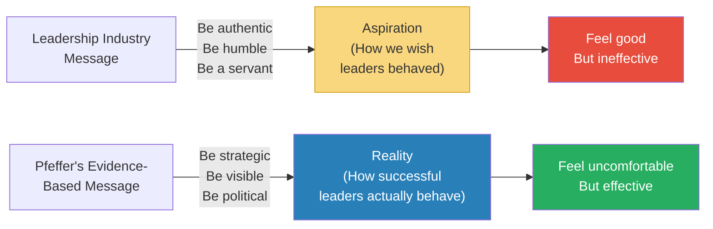
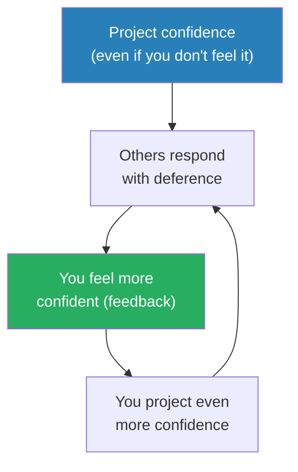
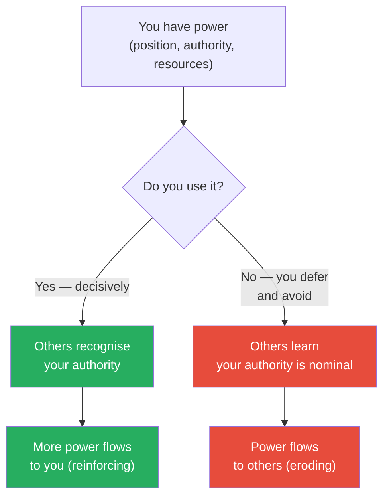

# 7 Rules of Power — Jeffrey Pfeffer

> Jeffrey Pfeffer's most direct book strips the subject of organisational power down to seven blunt, empirically-grounded rules — and in doing so, demolishes most of what the "leadership industry" has told you about how to succeed.
> His argument: the books, TED talks, and management seminars that preach authenticity, servant leadership, and leading with humility describe how people WISH leaders behaved, not how successful leaders ACTUALLY behave. The evidence says something different — and uncomfortable.
> This is the final instalment of Pfeffer's power trilogy (after *Power* and *Managing with Power*), and it is the most compressed and actionable of the three.
> Where *Power* was the diagnosis (performance is weakly correlated with career outcomes), *7 Rules of Power* is the prescription (here are the seven things you actually need to do).
> It is not a comfortable book. It is not a book that tells you what you want to hear. But it is a book that tells you what the evidence shows — and for anyone navigating organisations, that makes it indispensable.
> If *Power* made you see the problem, *7 Rules of Power* tells you exactly what to do about it.

---

## About the Author

Jeffrey Pfeffer is the Thomas D. Dee II Professor of Organizational Behavior at the Stanford Graduate School of Business, where he has taught since 1979.
He has authored or co-authored fifteen books on organisational power, evidence-based management, and what he calls the "knowing-doing gap."
His career has been spent in the empirical trenches of why talented people get stuck while less capable but more politically astute colleagues advance past them.
*Power* (2010) established the diagnosis; *Managing with Power* (1992) explored the organisational mechanics; *7 Rules of Power* (2022) delivers the individual prescription.

His distinctive approach: he does not tell you what SHOULD work based on theory. He tells you what DOES work based on decades of research and observation. The two are often disturbingly different.

---

## The Big Idea

- <b style="color: #2980b9">Power is a learnable skill</b> — not a personality trait, not a birthright, not something that comes automatically from doing good work
- The "leadership industry" — the books, speakers, coaches, and MBA programmes that dominate management thinking — sells an idealised vision of leadership that has almost no relationship to how power actually works
- <b style="color: #e74c3c">The evidence consistently shows that the behaviours that PRODUCE power are different from the behaviours that leadership books RECOMMEND</b>
- Leadership books say: be authentic, be humble, be a servant leader, lead with values
- The evidence says: be strategic, be visible, be confident (even when you're not), build networks aggressively, and use your power or lose it
- <b style="color: #27ae60">Pfeffer's seven rules are what the evidence says actually works</b>

---

- Pfeffer's critique of the leadership industry is scathing:
- <b style="color: #e74c3c">"The leadership industry has failed. Despite the billions spent on leadership development, workplaces are as bad as ever. Employee engagement is stagnant. Trust in leaders is declining. The industry has not produced better leaders — it has produced better-sounding leaders who perform the RITUALS of good leadership without actually practising it."</b>
- The reason: the industry teaches people what they WANT to hear (be authentic, be humble, be kind) rather than what they NEED to hear (be strategic, be political, be visible)
- <b style="color: #2980b9">Pfeffer's promise: "I will tell you what the evidence shows, not what you want to hear. You can decide what to do with it."</b>

---

## Key Concepts at a Glance

| Rule | Core Message | Why It's Uncomfortable |
|------|-------------|----------------------|
| **1. Get Out of Your Own Way** | Your biggest barrier is yourself — your discomfort with power, your belief that merit is enough | It means admitting that your principles may be holding you back |
| **2. Break the Rules** | Rules constrain those who follow them; strategic rule-breaking creates advantage | It means the "good girl/boy" approach is a losing strategy |
| **3. Appear Powerful** | Confidence, body language, and narrative create power — even before you've earned it | It means "faking it" is not dishonest but strategic |
| **4. Build a Powerful Brand** | If you don't control your narrative, others will write one for you | It means self-promotion is not distasteful but necessary |
| **5. Network Relentlessly** | Your network is your net worth — build relationships before you need them | It means "networking" is not sleazy but survival |
| **6. Use Your Power** | Power unused atrophies — those who wield it effectively gain more | It means being "nice" and "collaborative" can cost you influence |
| **7. Success Excuses (Almost) Everything** | Winners' methods are forgiven; losers' methods are condemned regardless | It means the same behaviour is judged differently based on outcome |

---

## Rule 1: Get Out of Your Own Way

*The single biggest barrier to acquiring power is not external — it's internal.*

- Most people sabotage their own power-building with a set of <b style="color: #e74c3c">false beliefs</b> they've absorbed from culture, education, and the leadership industry:
  - "My work should speak for itself" — it won't. What is unseen counts for nothing. (see [[Power - Jeffrey Pfeffer|Power]])
  - "Self-promotion is distasteful" — distasteful to whom? Not to the people who get promoted.
  - "I don't want to play politics" — politics is the allocation of resources and influence. If you don't play, you don't eat.
  - "Power corrupts" — some people are corrupted by power. Others use it to do extraordinary good. The tool is neutral.
  - "If I just work hard enough, I'll be recognised" — the just-world fallacy. Hard work is necessary but nowhere near sufficient.

> [!warning] The Self-Sabotage Inventory
> Pfeffer asks readers to honestly rate how much each of these beliefs limits their behaviour:
> - "I avoid speaking up in meetings because I might be wrong"
> - "I don't promote my accomplishments because it feels boastful"
> - "I avoid conflict because I want to be liked"
> - "I don't ask for what I want because I might be rejected"
> - "I wait for opportunities to come to me rather than creating them"
> 
> <b style="color: #e74c3c">Each of these beliefs, held by otherwise talented people, creates a self-imposed ceiling on their career.</b>
> The ceiling is not built by the organisation. It is built by the individual — and therefore it can be dismantled by the individual.

- <b style="color: #27ae60">The first step to power is accepting that it is necessary, learnable, and morally neutral</b>
- Pfeffer acknowledges this is emotionally difficult: "Many people would rather be RIGHT about the unfairness of the system than be EFFECTIVE within it. Being right feels good. Being effective produces results."

> [!example] The PhD Who Couldn't Self-Promote
> Pfeffer describes a Stanford PhD student — brilliant, published, respected by peers — who consistently lost out on opportunities to less-qualified candidates.
> The reason: she never told anyone about her work. She believed the work should speak for itself.
> When Pfeffer suggested she send her papers to key people in the field with a brief personal note, she was appalled: "That would be self-promotion!"
> Pfeffer: "What do you think the people who are getting the jobs do?"
> She eventually tried it. Within six months, she had three job offers.
> <b style="color: #27ae60">Nothing about her work changed. Everything about her visibility changed.</b>

---

## Rule 2: Break the Rules

- <b style="color: #2980b9">Rules exist to maintain the current power structure — and the current power structure benefits the people who made the rules</b>
- Following all the rules perfectly is a strategy for staying exactly where you are
- <b style="color: #e74c3c">Strategic rule-breaking creates advantage precisely because most people won't do it</b>
- This is NOT about being unethical or dishonest — it is about recognising which rules are genuine constraints and which are merely social conventions that limit your options

> [!example] The Rules That Constrain You
> Pfeffer gives examples of "rules" that successful people routinely break:
> - "Wait your turn" → The most successful leaders CREATE their turn by volunteering for visible assignments
> - "Don't go over your boss's head" → Sometimes the boss IS the problem, and the solution is their boss
> - "Stay in your lane" → The most promotable people work across boundaries, not within them
> - "Be modest about your achievements" → In organisations where visibility drives advancement, modesty is career suicide
> - "Pay your dues" → "Dues" is what incumbents tell newcomers to slow them down

- <b style="color: #27ae60">The key is strategic discretion: know which rules to break, when, and how to manage the consequences</b>
- Pfeffer: "The people who follow every rule are predictable. The people who are predictable are controllable. And the people who are controllable are not powerful."

---

## Rule 3: Appear Powerful

- <b style="color: #2980b9">People grant power to those who LOOK and SOUND powerful — even before those people have demonstrated competence</b>
- This is not fairness — it is human psychology
- Research shows that confidence, strong body language, decisive speech, and willingness to take up space all produce <b style="color: #27ae60">real power through a self-fulfilling prophecy</b>:
  1. You project confidence → others treat you as confident → you feel more confident → you project more confidence

- <b style="color: #e74c3c">"Acting powerful and being powerful are not sequential — they are simultaneous"</b>
- Research on "enclothed cognition" shows that wearing powerful-looking clothes actually changes your internal state — you don't just LOOK more authoritative, you FEEL and ACT more authoritatively
- This connects to Goyder's work on gravitas (see [[Gravitas - Caroline Goyder|Gravitas]]): the physical expression of authority creates the internal experience of authority, which creates the external perception of authority

### The Components of Appearing Powerful

| Component | What It Looks Like | What It Signals |
|-----------|-------------------|----------------|
| **Voice** | Low pitch, moderate pace, no filler words, comfortable with silence | Confidence, authority, thoughtfulness |
| **Body** | Upright posture, still (not fidgeting), takes up space, direct eye contact | Stability, dominance, comfort with power |
| **Language** | Declarative statements, no hedging, no apologising, uses "I" and "we" assertively | Certainty, leadership, decisiveness |
| **Presence** | First to speak, last to leave, remembers names, maintains eye contact | Status, investment, importance |
| **Narrative** | Has a clear, compelling story about themselves, their team, and their vision | Direction, purpose, charisma |

> [!danger] Before: Low-power presentation
> Enters the room quietly. Sits in the back corner. Waits to be called on. Speaks with rising intonation ("I was thinking maybe we could possibly consider...?"). Avoids eye contact. Fidgets.
> What the room perceives: low status, low confidence, not a leader.

> [!success] After: High-power presentation
> Enters the room at a measured pace. Chooses a seat with visibility. Makes eye contact with the decision-maker. When speaking, uses a firm voice: "Based on the data, I recommend we move forward with Option B." Pauses. Holds eye contact.
> What the room perceives: high status, high confidence, leadership material.
> <b style="color: #27ae60">Nothing about the person's competence changed between the two scenarios. Everything about their visibility and perceived power changed.</b>

---

## Rule 4: Build a Powerful Brand

- <b style="color: #2980b9">If you don't tell people who you are and what you've done, no one will know — and in the absence of your narrative, they will create their own (usually less flattering)</b>
- Your "brand" in organisational life is simply: <b style="color: #27ae60">the story that comes to mind when people hear your name</b>
- If you haven't actively shaped that story, it defaults to whatever fragments of information people have picked up — which may be incomplete, inaccurate, or unflattering
- Building a brand requires:
  1. <b style="color: #2980b9">Clarity</b> — know what you want to be known for (pick 1-2 qualities, not ten)
  2. <b style="color: #2980b9">Consistency</b> — reinforce the same narrative across all interactions
  3. <b style="color: #2980b9">Visibility</b> — ensure the right people encounter your brand regularly
  4. <b style="color: #2980b9">Evidence</b> — back the brand with concrete examples and outcomes

> [!tip] The Brand Statement Exercise
> Complete this sentence: "When people think of me, I want them to think of someone who _____."
> Now ask three trusted colleagues: "When you think of me professionally, what's the first word that comes to mind?"
> If their answers match your brand statement → your brand is working.
> If their answers don't match → there's a gap between how you see yourself and how others see you. That gap is costing you opportunities.

- Pfeffer notes that self-branding is where most people's discomfort with power is strongest: "It feels like bragging"
- <b style="color: #27ae60">His response: "The alternative to self-branding is not humility. It is invisibility."</b>

---

## Rule 5: Network Relentlessly

- <b style="color: #2980b9">Your network determines your opportunities, information flow, and influence</b>
- Most people network reactively — they reach out when they need something
- <b style="color: #e74c3c">By then, it's too late. Networking when desperate is networking too badly.</b>
- <b style="color: #27ae60">The most effective networkers build relationships BEFORE they need them</b> — investing consistently in their network when there's no immediate payoff

---

### Weak Ties Are More Valuable Than Strong Ties

- Mark Granovetter's famous research: <b style="color: #2980b9">weak ties (acquaintances, not close friends) are more valuable for career advancement than strong ties</b>
- Why? Your close friends have the same information and connections you do — they move in the same circles
- Your acquaintances move in DIFFERENT circles — they bring you information, opportunities, and connections that you would never encounter through your close network
- <b style="color: #27ae60">The most powerful network position is being a "bridge" between disconnected groups</b> (Ron Burt's structural holes theory, also discussed in [[Power - Jeffrey Pfeffer|Power]])

> [!example] The Structural Hole Advantage
> Pfeffer describes an executive who was promoted over more technically qualified colleagues because she was the only person in the organisation who had relationships in BOTH the engineering division and the sales division.
> When a product launch required coordination between the two (which had historically communicated poorly), she was the natural choice to lead it — not because she was the best engineer or the best salesperson, but because she was the only person both groups trusted.
> <b style="color: #27ae60">She had built a bridge between two disconnected networks — and the bridge became a highway for her career.</b>

---

### Pfeffer's Networking Rules

| Rule | Description |
|------|-------------|
| **Start before you need it** | Build relationships when you have nothing to ask for — just curiosity and generosity |
| **Be useful first** | Ask "How can I help you?" before "Can you help me?" (see reciprocity in [[Influence - Robert Cialdini|Influence]]) |
| **Maintain weak ties** | A quick message, a shared article, a brief check-in — low effort, high compound returns |
| **Network across, not just up** | Peers and people in other departments are as valuable as people above you |
| **Show up** | Attend events, conferences, dinners, and gatherings — visibility creates opportunity |
| **Follow up** | The meeting is the beginning, not the end. Following up is where relationships are actually built. |

---

## Rule 6: Use Your Power

- <b style="color: #e74c3c">Power unused atrophies. Those who wield it effectively gain more of it.</b>
- This is counterintuitive for many people: they believe that having power is enough — that you don't need to exercise it to keep it
- <b style="color: #2980b9">Pfeffer argues the opposite: power is like a muscle. If you don't use it, it withers.</b>
- When you have the authority to make a decision and you defer, delegate, or avoid it, people learn that your authority is nominal, not real
- When you use your authority decisively, people learn that your position carries actual power — and they behave accordingly

> [!example] The Executive Who Wouldn't Decide
> Pfeffer describes an executive with formal authority over a large budget and team, who consistently deferred decisions to committees, working groups, and consensus processes.
> Over two years, his team learned that his authority was ceremonial — decisions didn't actually flow through him.
> When a rival executive started making decisions that affected his domain, he had no power to push back — because he had never established that his authority was real.
> <b style="color: #e74c3c">His authority existed on the org chart but not in practice. And in organisations, practice is reality.</b>
> Pfeffer's blunt assessment: "He had power. He chose not to use it. So it ceased to be power."

---

### The Use-It-or-Lose-It Dynamic

- <b style="color: #27ae60">Using power doesn't mean being tyrannical. It means making decisions that are yours to make, holding people accountable, allocating resources strategically, and not shrinking from conflict when the situation demands it.</b>
- The key distinction: using power WISELY (for the benefit of the team and the mission) vs using power SELFISHLY (for personal aggrandisement). Pfeffer advocates the former — but insists that NOT using it at all is the worst option.

---

## Rule 7: Success Excuses (Almost) Everything

*Pfeffer's most provocative rule — and the one that makes most readers uncomfortable.*

- <b style="color: #e74c3c">Winners write history. Losers are written about.</b>
- The same behaviour is judged completely differently based on the outcome:
  - <b style="color: #27ae60">Steve Jobs was abusive, demanding, and dishonest</b> → celebrated as a visionary genius
  - A less successful CEO exhibiting the same behaviours → condemned as a tyrant
  - <b style="color: #27ae60">Jeff Bezos pushed employees to exhaustion</b> → lauded for "raising the bar"
  - A failing company doing the same → accused of being a sweatshop
- <b style="color: #2980b9">This is not a moral judgment — it is an empirical observation about how the world actually works</b>
- Pfeffer calls this the <b style="color: #2980b9">"halo effect of success"</b>: when you succeed, every behaviour is retroactively interpreted as having contributed to that success. When you fail, every behaviour is retroactively interpreted as having caused the failure. (see "resulting" in [[Thinking in Bets - Annie Duke|Thinking in Bets]])

> [!warning] Pfeffer's Caveat
> This rule does NOT mean "be unethical because you'll get away with it if you win."
> It means: "Understand that the world judges you on outcomes more than on methods — so focus at least as much energy on WINNING as on being virtuous about HOW you win."
> The ideal: win AND be ethical. But if you have to choose between being ethical and losing (which makes you irrelevant) vs being strategically aggressive and winning (which gives you the platform to do good) — Pfeffer argues the second is often the better choice for the world, not just for you.

---

## The Leadership Industry Critique — Expanded

### Why Leadership Books Don't Work

- Pfeffer's critique of the leadership industry is perhaps the book's most distinctive contribution
- He argues that the $50+ billion leadership development industry has <b style="color: #e74c3c">no measurable impact on leadership quality</b>
- Employee engagement scores have not improved. Trust in leaders has not improved. Workplace toxicity has not decreased. Despite decades of books, courses, and coaching.
- Why?

| Problem with Leadership Industry | Pfeffer's Diagnosis |
|--------------------------------|-------------------|
| Teaches aspiration, not reality | Leaders learn what they SHOULD do, not what ACTUALLY works |
| No accountability | Leaders attend a workshop, feel inspired, change nothing, and attend the next workshop |
| Selection bias | The leaders held up as exemplars are cherry-picked success stories, not representative samples |
| Ignores context | What works in one organisation, industry, or culture may be irrelevant in another |
| Confuses correlation with causation | "This CEO was humble AND successful" ≠ "humility causes success" |
| Financially incentivised to feel good | The industry's customers (corporate L&D departments) buy programmes that make leaders FEEL good, not programmes that produce measurable behaviour change |

> [!example] The Humility Myth
> Pfeffer's most pointed example: Jim Collins's "Level 5 Leadership" research claimed that the most successful companies were led by humble, self-effacing leaders.
> Pfeffer's counter: the same data set includes numerous successful leaders who were anything BUT humble (Jack Welch, Steve Jobs, Larry Ellison, Jeff Bezos).
> The "humility" finding was the result of <b style="color: #e74c3c">survivorship bias and confirmation bias</b> — Collins found humble leaders among the successful and concluded humility caused success, while ignoring the many successful leaders who weren't humble and the many humble leaders who weren't successful.
> <b style="color: #2980b9">"The leadership industry tells you what you want to hear — that nice, humble, authentic people win — because that's what SELLS. The evidence tells you that the relationship between niceness and success is, at best, complicated."</b>

---

## The Seven Rules — Master Comparison Table

| Rule | The Comfortable Version | The Evidence-Based Version |
|------|------------------------|---------------------------|
| **1. Get Out of Your Own Way** | "Be yourself and things will work out" | "Your beliefs about merit and fairness are holding you back" |
| **2. Break the Rules** | "Follow the rules and you'll be rewarded" | "Rules protect incumbents; strategic rule-breaking creates opportunity" |
| **3. Appear Powerful** | "Don't fake it — be authentic" | "Acting powerful and being powerful are simultaneous, not sequential" |
| **4. Build a Powerful Brand** | "Let your work speak for itself" | "What is unseen counts for nothing — control your narrative" |
| **5. Network Relentlessly** | "Networking is sleazy" | "Your network is your net worth — weak ties matter most" |
| **6. Use Your Power** | "Be collaborative and consensus-driven" | "Power unused atrophies — make the decisions that are yours to make" |
| **7. Success Excuses Everything** | "The process matters more than the outcome" | "The world judges outcomes, not process — so WIN" |

## Deep Dive: Real-World Case Studies

### Case Study 1: Lyndon B. Johnson — The Master of All Seven Rules

- Pfeffer considers LBJ the most instructive case study in political power of the 20th century
- Johnson embodied every one of the seven rules before they were articulated:
  1. <b style="color: #2980b9">Got out of his own way</b>: came from poverty in rural Texas with no elite connections — but never let that define his ceiling
  2. <b style="color: #2980b9">Broke the rules</b>: as a junior senator, he bypassed seniority norms to accumulate power that senior senators didn't have
  3. <b style="color: #2980b9">Appeared powerful</b>: the famous "Johnson Treatment" — physically looming over people, invading their space, using his 6'4" frame to intimidate
  4. <b style="color: #2980b9">Built a powerful brand</b>: positioned himself as the man who could get things done — "the Master of the Senate"
  5. <b style="color: #2980b9">Networked relentlessly</b>: knew every senator personally, their vulnerabilities, their needs, their family situations
  6. <b style="color: #2980b9">Used his power</b>: as Senate Majority Leader and later President, he was legendary for calling in favours, twisting arms, and making deals
  7. <b style="color: #2980b9">Success excused his methods</b>: his aggressive, manipulative style was forgiven because he passed the Civil Rights Act, the Voting Rights Act, Medicare, Medicaid, and the Great Society programmes

> [!example] The Johnson Treatment
> The "Johnson Treatment" was LBJ's signature influence technique:
> He would get physically close to you — much closer than social norms allow — and lean in with his full 6'4" frame, one hand on your shoulder, the other gesturing emphatically, his face inches from yours, speaking in a rapid, intense stream of logic, flattery, threats, and emotional appeals — all customised to your specific vulnerabilities.
> One senator described it: "He came at you like a tidal wave. By the time it was over, you'd agreed to things you'd sworn you'd never agree to. And you weren't even sure how it happened."
> <b style="color: #27ae60">Johnson understood something that most people don't: influence is physical, not just logical. The body communicates power as much as the words do.</b> (See [[What Every Body Is Saying - Joe Navarro|Navarro]] and [[Gravitas - Caroline Goyder|Gravitas]])

---

### Case Study 2: The Tech Founder Who Ignored Rule 4

- Pfeffer describes a Silicon Valley founder who built a technically superior product but refused to engage in "personal branding"
- He considered self-promotion beneath him: "The product should speak for itself"
- A competitor with an inferior product but a <b style="color: #e74c3c">carefully cultivated personal brand</b> — regular blog posts, conference appearances, media interviews, a polished LinkedIn presence — attracted more funding, more press, and more customers
- The founder eventually lost the market to the competitor — not because the competitor's product was better, but because the competitor was VISIBLE and the founder was invisible
- <b style="color: #27ae60">Pfeffer's lesson: "In a world where attention is the scarcest resource, being invisible is not humility. It is a competitive disadvantage."</b>

> [!danger] Before: The invisible builder
> "I don't need to be on LinkedIn or speak at conferences. The work speaks for itself."
> Reality: no one hears the work speaking because it's drowned out by competitors who ARE speaking.

> [!success] After: The visible builder
> "I'll invest 2 hours per week in sharing what I'm building: a blog post, a conference talk, a podcast appearance, a LinkedIn update."
> Reality: the work AND the builder are visible. Customers, investors, and talent find you because you're findable.

---

### Case Study 3: The Woman Who Broke Rule 1 — And Got Stuck

- <b style="color: #e74c3c">Women face particular challenges with Rule 1 (Get Out of Your Own Way)</b> because the social penalties for women who seek power are often greater than for men who do the same
- Pfeffer acknowledges this openly: "The rules of power were not designed with women in mind. The social costs of violating gender norms are real."
- But he argues that this makes the rules MORE important for women, not less: <b style="color: #27ae60">"Understanding the game is even more valuable when the game is rigged against you"</b>
- His specific advice for women:
  - Use Rule 3 (Appear Powerful) through the dimensions that are gender-neutral: voice, presence, clarity, stillness (see [[Gravitas - Caroline Goyder|Gravitas]])
  - Use Rule 5 (Network) to build alliances with powerful advocates who will champion your advancement
  - Use Rule 4 (Build a Brand) by emphasising results and expertise rather than self-aggrandisement — "Look at what WE achieved" rather than "Look at what I did"
  - Be strategic about which rules to break (Rule 2) — break norms where the expected payoff exceeds the social cost

> [!warning] The Double Bind
> Pfeffer cites Alice Eagly's research: women leaders face a double bind:
> - If they behave assertively (as the power rules recommend), they are penalised for violating gender norms ("cold," "aggressive," "bossy")
> - If they behave warmly and collaboratively (as gender norms demand), they are perceived as lacking leadership ability ("soft," "not tough enough")
> 
> <b style="color: #2980b9">There is no perfect solution to this. But Pfeffer argues that understanding the bind is the first step to navigating it — and that women who deploy the rules with awareness of the double bind can find paths that minimise the penalty while maximising the power gain.</b>

---

## Deep Dive: The Pfeffer Framework vs Other Power Frameworks

### Pfeffer vs Greene

| Dimension | Pfeffer | Robert Greene |
|-----------|---------|--------------|
| **Approach** | Empirical (research-based) | Historical (story-based) |
| **Tone** | Academic, unsentimental | Literary, seductive |
| **Ethics** | "Power is morally neutral — it depends on how you use it" | "Power is an amoral game — learn the rules or be destroyed" |
| **Audience** | Business professionals, academics | General readers, strategists, the power-curious |
| **Primary source** | Peer-reviewed organisational behaviour research | 3,000 years of history (Machiavelli, Sun Tzu, Louis XIV) |
| **Style** | Direct, data-driven, no narrative arc | Storytelling, metaphor, historical drama |
| **Key overlap** | Both agree: the world is not meritocratic, visibility matters more than talent, and those who refuse to play the power game are victims, not virtuous | |
| **Key divergence** | Pfeffer is prescriptive: "do these seven things." Greene is descriptive: "here are 48 patterns observed across history." |

---

### Pfeffer vs Carnegie

| Dimension | Pfeffer | Dale Carnegie |
|-----------|---------|--------------|
| **Core method** | Strategic assertion | Genuine warmth and interest |
| **View of people** | People respond to power signals | People respond to being valued |
| **On self-promotion** | Essential — what is unseen counts for nothing | Counterproductive — let others talk about you |
| **On humility** | A luxury for those who already have power | The foundation of all influence |
| **On conflict** | Sometimes necessary — avoiding it costs more than engaging it | Always avoidable — you can never win an argument |
| **Synthesis** | Pfeffer is right about the mechanics of power. Carnegie is right about the mechanics of liking. The best leaders use both. |

- <b style="color: #27ae60">Pfeffer would say Carnegie is naive. Carnegie would say Pfeffer is cynical. The truth, as always, lies somewhere between them.</b>
- <b style="color: #2980b9">The most effective leaders combine Pfeffer's strategic awareness with Carnegie's genuine warmth</b> — they understand the power game AND they make people feel valued within it

---

### Pfeffer vs Goldsmith

| Dimension | Pfeffer | Marshall Goldsmith |
|-----------|---------|-------------------|
| **On self-promotion** | Do MORE of it | Do LESS of it (Habit #6: telling the world how smart you are) |
| **On adding value** | Assert your perspective | STOP adding value to others' ideas (Habit #2) |
| **On winning** | Win strategically | STOP needing to win every argument (Habit #1) |
| **On ego** | Ego as necessary fuel | Ego as the primary obstacle |
| **Reconciliation** | Both are right, depending on career stage. Early career = Pfeffer (you need visibility and assertion to get noticed). Senior career = Goldsmith (you need restraint and humility to lead effectively). The transition between the two is the hardest moment in a leader's development. |

---

## Practical Toolkit: Implementing the Seven Rules

### The Weekly Power Audit

| Question | Purpose | Score (1-10) |
|----------|---------|:------------:|
| "Did I promote my accomplishments this week?" | Rule 4 — Brand |  |
| "Did I make a decision I was entitled to make (instead of deferring)?" | Rule 6 — Use Power |  |
| "Did I reach out to someone in my network with no immediate ask?" | Rule 5 — Network |  |
| "Did I speak with confidence even when uncertain?" | Rule 3 — Appear Powerful |  |
| "Did I hold myself back from an opportunity due to self-doubt?" | Rule 1 — Get Out of Your Own Way |  |
| "Did I challenge an unwritten rule that was limiting me?" | Rule 2 — Break Rules |  |
| "Did I focus on winning the RIGHT battles?" | Rule 7 — Focus on outcomes |  |

> [!tip] The 30-Day Power Challenge
> Choose ONE rule to focus on for 30 days. Score yourself daily. At the end of 30 days, move to the next rule.
> Seven rules × 30 days each = 210 days (about 7 months) to cycle through all seven.
> By the end, each rule has been practised deliberately for a full month — enough to shift from conscious effort to semi-automatic habit.
> 
> Recommended order:
> 1. Month 1: Rule 1 (Get Out of Your Own Way) — remove the internal barriers first
> 2. Month 2: Rule 3 (Appear Powerful) — change how others perceive you
> 3. Month 3: Rule 5 (Network Relentlessly) — build the structural foundation
> 4. Month 4: Rule 4 (Build a Brand) — make your value visible
> 5. Month 5: Rule 6 (Use Your Power) — start exercising authority
> 6. Month 6: Rule 2 (Break the Rules) — push boundaries strategically
> 7. Month 7: Rule 7 (Focus on winning) — integrate everything toward outcomes

---

## The Verdict

*7 Rules of Power* is the most uncomfortable leadership book you will ever read — and one of the most important.
Pfeffer's contribution is not any single rule but the meta-argument that <b style="color: #2980b9">the leadership industry has created a fantasy of how leadership works that is contradicted by the evidence</b>.
Humble leaders sometimes succeed. So do arrogant ones. Authentic leaders sometimes thrive. So do strategic performers.
The ONLY consistent predictor of power is the willingness to pursue it — and the seven rules describe HOW that pursuit works in practice.

The book's greatest strength is its empirical rigour. Pfeffer doesn't make arguments from personal philosophy — he makes them from research. When he says self-promotion works, he cites the studies. When he says humility doesn't predict success, he shows the data.

The book's greatest weakness is its tone, which occasionally crosses from unsentimental to cynical. Some readers will find the amorality alienating. And Pfeffer sometimes seems to celebrate power-seeking rather than merely describing it — a distinction he would argue is irrelevant but that many readers feel viscerally.

For anyone who has ever wondered why less talented people get promoted ahead of them — or why the leadership advice they follow never seems to produce results — this book provides both the explanation and the remedy.
It is not the book you want to read. It is the book you need to read.

---

## Related Reading

- [[Power - Jeffrey Pfeffer|Power]] — The detailed companion. Read this first for the full diagnosis of the performance-power disconnect.
- [[Managing with Power - Jeffrey Pfeffer|Managing with Power]] — The organisational-level application: how power operates within and between departments.
- [[The 48 Laws of Power - Robert Greene|The 48 Laws of Power]] — Greene's historical approach to the same themes. More entertaining, less empirical.
- [[The Culture Code - Daniel Coyle|The Culture Code]] — The optimistic counterpoint: culture as cooperation, not competition. Read alongside Pfeffer for a complete picture.
- [[Influence - Robert Cialdini|Influence]] — The psychological mechanisms behind Pfeffer's rules (especially liking, authority, and reciprocity in networking)
- [[What Got You Here Won't Get You There - Marshall Goldsmith|What Got You Here]] — Goldsmith's approach overlaps (stop self-sabotaging) but diverges (Goldsmith says stop being aggressive; Pfeffer says be MORE strategically aggressive)
- [[Gravitas - Caroline Goyder|Gravitas]] — The physical techniques behind Rule 3 (Appear Powerful)
- [[How to Win Friends and Influence People - Dale Carnegie|How to Win Friends]] — Carnegie's warmth and appreciation as the ethical backbone for Pfeffer's networking
- [[Thinking in Bets - Annie Duke|Thinking in Bets]] — Duke's "resulting" explains Rule 7 (Success Excuses Everything)
