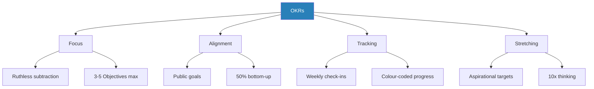
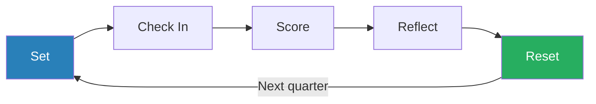
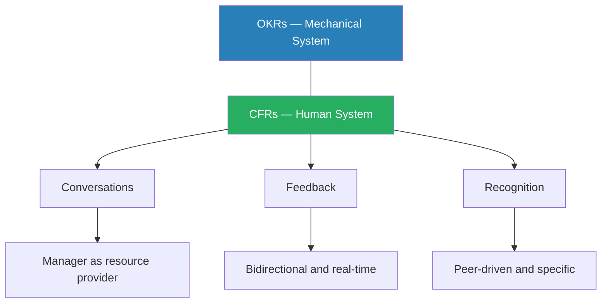

# Measure What Matters — John Doerr

> John Doerr learned a lightweight goal-setting system called OKRs from Andy Grove at Intel in the 1970s, then spent decades evangelising it to companies from Google to the Gates Foundation.
> His argument is deceptively simple: decide what matters most, write it down as a short Objective with a handful of measurable Key Results, make it public, review it quarterly, and repeat.
> The organisations that do this with discipline achieve extraordinary things.
> The ones that rely on vague annual targets, private goals, and rear-view-mirror performance reviews do not.
> Doerr structures the OKR value proposition around four "superpowers" — Focus, Alignment, Tracking, and Stretching — and illustrates each with case studies ranging from startups to global nonprofits.
> The second half extends into Continuous Performance Management, arguing that annual reviews should be replaced by ongoing Conversations, Feedback, and Recognition (CFRs).
> The result is part manifesto, part instruction manual, and part pitch deck for a system that has undeniably shaped how Silicon Valley — and increasingly the rest of the world — thinks about execution.

---

## About the Author

John Doerr is a venture capitalist at Kleiner Perkins Caufield & Byers who has backed some of the most consequential technology companies of the past forty years, including Google, Amazon, and Intuit. Before becoming an investor, he was an engineer at Intel under Andy Grove, where he first encountered the OKR system that would become his lifelong cause. Doerr has described his moment of conversion with near-religious conviction: sitting in a seminar led by Grove, watching a gruff Hungarian immigrant reduce the entire art of management to a question of measurable output, and realising that this one framework could change how organisations worked at every level. His unique position — part operator, part investor, part evangelist — gives him access to dozens of OKR case studies from companies in his own portfolio, which is both the book's strength and its most obvious bias. He has been introducing OKRs to organisations for over forty years, making him less a neutral observer and more a missionary who has found his gospel.

---

## The Big Idea

*Doerr argues that most organisations fail not from a shortage of ideas but from the absence of a disciplined system for translating ideas into measurable action — and OKRs are his answer.*

- Most organisations fail not because they lack ideas but because they lack a disciplined system for translating ideas into measurable action
- <b style="color: #2980b9">Objectives and Key Results (OKRs)</b> are Doerr's answer to this problem:
  - An **Objective** is a qualitative, inspirational statement of what you want to achieve — the direction
  - **Key Results** are the specific, measurable milestones that prove you got there — the evidence
- If the Objective is "Build the best mobile browser in the world," the Key Results might be "Reach 20 million active users" and "Achieve a Net Promoter Score above 70"
- <b style="color: #27ae60">The Objective gives meaning; the Key Results give accountability</b>
- Neither works without the other:
  - Objectives alone produce fuzzy aspiration
  - Key results alone produce soulless metric-chasing

---

- The system originated with Andy Grove at Intel in the 1970s, drawing on Peter Drucker's earlier <b style="color: #2980b9">Management by Objectives (MBOs)</b> but fixing what Grove saw as fatal flaws
- Where MBOs were annual, private, top-down, and tied to compensation, OKRs are quarterly, public, partially bottom-up, and deliberately divorced from pay
- Grove's genius was to take Drucker's insight — that knowledge workers need goals, not orders — and strip away the bureaucracy that had calcified around it over two decades
- The result was something lean enough for a startup and robust enough for a multinational

---

- Doerr introduced OKRs to Google in 1999, when the company had roughly forty employees
- He walked into a conference room, gave a sixty-minute presentation to Larry Page, Sergey Brin, and a handful of early Googlers, and laid out the system with a single slide
- Larry Page and Sergey Brin adopted it immediately, and Google has used OKRs every quarter since — through explosive growth, IPO, and maturity into one of the most valuable companies on earth
- Doerr does not claim that OKRs alone made Google successful, but he argues persuasively that without a shared language for goal-setting, the chaos of hypergrowth would have torn the company apart long before it reached its potential

The book's deeper argument is that OKRs are not just a productivity tool but a cultural transformation mechanism:

- When goals are public, alignment emerges organically
- When failure on stretch goals is non-punitive, ambition replaces sandbagging
- When continuous feedback replaces annual reviews, trust and development accelerate
- <b style="color: #27ae60">The act of writing down what matters, measuring it, and reviewing it in public changes how organisations think, not just what they do</b>

---

## Key Concepts at a Glance

| Concept | One-line summary |
|---------|-----------------|
| **OKRs** | Objectives (qualitative direction) paired with Key Results (quantitative evidence), set quarterly and scored 0.0–1.0 |
| **The Four Superpowers** | Focus, Alignment, Tracking, and Stretching — the four capabilities OKRs unlock |
| **MBOs vs OKRs** | Drucker's MBOs were annual, private, top-down, and tied to pay; Grove's OKRs fix all four |
| **Committed vs Aspirational OKRs** | Committed must hit 1.0; aspirational targets 0.7, with 40% failure rate expected |
| **CFRs** | Conversations, Feedback, and Recognition — the human companion to mechanical OKRs |
| **Pairing Key Results** | Every quantity metric paired with a quality counterpart to prevent perverse optimisation |
| **The OKR Shepherd** | A designated champion who ensures compliance and prevents system decay |
| **Scoring** | 0.0–1.0 scale with colour coding (green/yellow/red), followed by subjective self-assessment |
| **Sell Your Reds** | Leaders present at-risk OKRs and the group volunteers resources to help |
| **The OKR Lifecycle** | Set, Check In, Score, Reflect, Reset — a quarterly rhythm with mid-cycle flexibility |

---

## The Lineage: From Drucker to Grove to Doerr

### Peter Drucker and the Birth of MBOs

*The intellectual roots of OKRs stretch back seventy years to Peter Drucker's radical idea that knowledge workers cannot be managed like factory hands — they need defined objectives, not orders.*

- The intellectual roots of OKRs trace back to Peter Drucker's 1954 book *The Practice of Management*, which introduced <b style="color: #2980b9">Management by Objectives (MBOs)</b>
- Drucker's core insight was revolutionary for its time:
  - Knowledge workers cannot be managed like factory hands
  - You cannot stand behind a software engineer or a marketing strategist and watch the widgets come off the line
  - Instead, you must define what the worker is expected to produce, agree on how success will be measured, and then get out of the way

---

- <b style="color: #e74c3c">MBOs worked in theory but decayed in practice</b>
- Over the two decades following Drucker's book, they calcified into exactly the kind of bureaucracy Drucker warned against:
  - Annual goal-setting became a ritual
  - Goals were set privately between manager and employee, often negotiated downward to guarantee a good score
  - They were tied directly to compensation, which meant people aimed low to protect their bonuses
  - Because they were annual, by the time anyone checked in on them, the world had moved on and the goals were irrelevant
- What began as a tool for autonomy became a tool for control

### Andy Grove Reinvents the System

*Grove admired Drucker's core idea but saw that MBOs as practised had become "sclerotic" — so he rebuilt the system from scratch at Intel in the 1970s.*

- Andy Grove, the legendary CEO of Intel, was Drucker's most important student and most aggressive editor
- Grove admired the core idea — define objectives, measure output — but saw that MBOs as practised had become "sclerotic"
- At Intel in the early 1970s, he rebuilt the system from scratch and called it <b style="color: #2980b9">iMBOs (Intel Management by Objectives)</b>, which would later be rebranded as OKRs

> [!tip] Core Insight
> Grove made four critical changes to Drucker's MBOs — quarterly cycles, public goals, bottom-up origination, and divorcing goals from compensation — that transformed a bureaucratic relic into a living execution system.

- <b style="color: #27ae60">Grove made four critical changes</b>:
  - **Quarterly cycles** — shortened from annual, forcing regular reckoning with reality rather than a single year-end judgement
  - **Public goals** — every person's objectives were visible to every other person, creating transparency and peer accountability
  - **Bottom-up origination** — roughly half of objectives should originate from frontline employees who understood the work's reality, not just from executives with a strategy deck
  - **Divorced from compensation** — if you tied stretch goals to bonuses, people would stop stretching; the whole point was to create a system where ambition was safe
- Grove's famous articulation was characteristically blunt: "The key result has to be measurable. Did I do that or did I not do it? Yes? No? Simple."

---

- The Intel culture that emerged from this system was famously driven, transparent, and results-oriented:
  - Engineers at every level could see what their CEO was working on, what he was measuring, and how he was scoring himself
  - The information asymmetry that plagues most organisations — where the top knows everything and the bottom knows nothing — was structurally reduced

The OKR lineage runs from Drucker's original insight through Grove's radical redesign to Doerr's evangelism across Silicon Valley and beyond.

### Doerr Carries the Gospel to Google

*The pivotal moment came in 1999, when a venture capitalist walked into a conference room with forty Googlers and a single slide — and changed how the company would operate for the next quarter-century.*

- Doerr joined Intel as a young engineer in the mid-1970s, sat in Grove's now-legendary OKR seminar, and became a convert
- When he transitioned to venture capital at Kleiner Perkins, he brought OKRs with him as a standard recommendation for portfolio companies

> [!example] Doerr's Pitch to Google (1999)
> - Google was tiny — about forty employees, two products, and a vision to "organise the world's information"
> - Doerr invested in the company and offered to teach Larry Page and Sergey Brin the OKR system
> - In a conference room on a Thursday afternoon, he presented a single-page slide with one Objective and three Key Results
> - Page and Brin immediately saw the value: a lightweight system that could scale with their ambitions without adding layers of bureaucracy
> - Google adopted OKRs that quarter and has used them every quarter since
> **The lesson:** The right system, introduced at the right moment, can become the connective tissue of an organisation for decades.

- As Google grew from forty to tens of thousands of employees, OKRs became the shared language that made it possible for teams in Mountain View, Zurich, and Bangalore to understand:
  - What the company was trying to achieve
  - What their role was in that effort
  - How they would know if they were succeeding

---

## The Four Superpowers

*Doerr organises his entire argument around four capabilities that OKRs unlock — Focus, Alignment, Tracking, and Stretching — each illustrated with dedicated case studies.*

The four superpowers form an interlocking system: focus without tracking decays, alignment without stretch produces mediocrity, and all four require each other to function.

### Superpower 1: Focus and Commit to Priorities

*The first discipline is ruthless subtraction — choosing what matters is simultaneously choosing what does not.*

- Doerr recommends <b style="color: #2980b9">3–5 Objectives per cycle</b>, with no more than 5 Key Results per Objective
- The mechanism is straightforward:
  - Cognitive bandwidth is finite
  - Every commitment forfeits the chance to commit to something else
  - <b style="color: #27ae60">When you try to focus on everything, you focus on nothing</b>
  - The act of choosing what matters is simultaneously the act of choosing what does not

> [!tip] Core Insight
> "Ideas are easy. Execution is everything." Intel did not win because it had better ideas than Motorola — it won because it could execute on a small number of ideas with superhuman discipline.

> [!example] Remind's Costly Unfocused Ambition
> - Remind, an education technology startup backed by Doerr's firm, learned the cost of unfocused ambition the hard way
> - In their early OKR cycles, the founders set seven or eight objectives per quarter — covering product development, user growth, teacher engagement, school district partnerships, and platform reliability
> - The result was predictable: they accomplished almost none of them
> - The team was sprinting in every direction and arriving nowhere
> - When they cut their quarterly OKRs to two or three, achievement rates climbed dramatically
> - The founders later said that the discipline of saying "no" was itself a leadership skill they had been lacking
> **The lesson:** OKRs force the discipline of subtraction — and subtraction is a leadership skill.

---

> [!example]- Operation Crush at Intel (1980)
> - In 1980, Motorola's 68000 processor threatened to dethrone Intel's 8086 as the industry standard — an existential threat
> - Grove's response was **Operation Crush** — a total-company mobilisation against a single competitor
> - Every department was given one objective: make the 8086 the standard
>   - Field sales: specific KRs for design wins at key accounts
>   - Marketing: KRs for analyst mindshare
>   - Engineering: KRs for performance benchmarks
> - What made it extraordinary was not the number of people involved — it was that thousands of people were pointed at ONE goal
> - The entire company focused its energy on a single competitive battle and won decisively, establishing Intel's dominance for a generation
> **The lesson:** Focus is not about doing one thing — it is about pointing everything at one goal.

- <b style="color: #e74c3c">Premature focus can be dangerous</b> in very early-stage organisations where the right direction is not yet clear:
  - If you do not yet know which market to serve or which product to build, committing too narrowly too early can mean missing a pivot opportunity
  - The lesson is not that you can only do one thing — it is that everything you do should serve the same small number of goals
  - If you cannot articulate those goals yet, your first OKR should be about figuring them out

### Superpower 2: Align and Connect for Teamwork

*When OKRs are public — visible to every person from the CEO to the newest hire — duplication is eliminated, dependencies are surfaced, and social accountability kicks in.*

- When OKRs are public, three things happen:
  - **Duplication is eliminated** — teams can see when they are working on the same problem
  - **Dependencies are surfaced** — teams can see when their success depends on someone else's work
  - **Social accountability kicks in** — people work harder on goals that others can see
- Doerr argues that roughly <b style="color: #2980b9">50% of OKRs should originate bottom-up</b>, from frontline contributors rather than from leadership
- The mechanism draws on Drucker's original insight:
  - Top-down mandates create compliance but not commitment
  - When people help choose their own goals, they own the outcome psychologically
  - A California study Doerr cites found that people who wrote down and shared their goals were **43% more likely** to achieve them than those who merely thought about goals privately

> [!tip] Core Insight
> Alignment does not happen in the setting of goals — it happens in the conversation about goals. The negotiation between top-down direction and bottom-up ownership is where real alignment emerges.

> [!example] YouTube's Login Discovery (Rick Klau)
> - At YouTube, a product manager named Rick Klau wrote a bottom-up OKR about improving login completion rates — a seemingly mundane goal buried in the middle of a massive organisation
> - Because YouTube's OKRs were transparent and visible across the company, a senior engineer noticed Klau's goal
> - The engineer realised it aligned with a broader Google-wide authentication initiative and escalated it
> - What started as one person's modest OKR became a company-wide priority, eventually improving the login experience for millions of users
> - Without transparency, Klau's contribution would have remained invisible — a lone engineer fixing a small problem
> **The lesson:** Transparency transforms individual efforts into strategic levers.

---

> [!example] Intuit's Horizontal Alignment
> - When Intuit shifted from siloed goal-setting to transparent, horizontally visible OKRs, the effect was immediate
> - Teams that had been unknowingly duplicating each other's work discovered the overlap and consolidated
> - Dependencies that had been discovered only when something broke were surfaced in advance and managed proactively
> - Cross-functional coordination improved not because anyone ordered it, but because the information was available for anyone who wanted to look
> **The lesson:** Transparency does not require directives — it enables self-organising coordination.

> [!example] MyFitnessPal's Alignment Cascade
> - MyFitnessPal, the fitness tracking app acquired by Under Armour, used OKRs to align a rapidly growing team
> - The founders set top-level objectives and then asked each team to propose their own key results
> - The negotiation between top-down direction and bottom-up ownership created alignment that felt earned rather than imposed
> - When the team hit its 100-million-user milestone, the founders credited OKR-driven alignment as the key factor
> **The lesson:** Alignment works best when it is negotiated, not dictated.

- <b style="color: #e74c3c">Bottom-up goal-setting only works when contributors have sufficient strategic context</b>:
  - Without understanding the "why" behind the company's direction, frontline-originated OKRs may be well-intentioned but misaligned
  - Doerr recommends that leaders communicate direction clearly and then ask: "Given this Objective, what Key Results would you set?"

### Superpower 3: Track for Accountability

*Regular check-ins prevent goals from becoming "zombie OKRs" — goals that exist on paper but drive no behaviour.*

- Regular check-ins — at least monthly, ideally weekly — prevent goals from becoming what Doerr calls <b style="color: #2980b9">"zombie OKRs"</b>: goals that exist on paper but drive no behaviour
- The gap between plan and reality widens daily without monitoring
- Tracking serves two functions:
  - Surfaces problems early enough to course-correct
  - Provides the dopamine of visible progress, which research shows is more motivating than public recognition or monetary incentives
- <b style="color: #27ae60">"The single greatest motivator is making progress in meaningful work"</b> — Teresa Amabile's research, cited extensively by Doerr
  - Not bonuses. Not praise. Progress itself

> [!example]- YouTube's Billion-Hour Goal (2012–2016)
> - This is the book's strongest and most detailed case study
> - In 2012, Susan Wojcicki set the audacious goal of reaching one billion hours of daily watch time
> - YouTube was at roughly 100 million hours per day — a tenfold gap
> - The team tracked progress weekly against a carefully constructed model
> - Mid-course, they made a critical discovery that would have been invisible without rigorous tracking:
>   - One of their primary strategies — optimising for clicks — was actually *hurting* watch time
>   - Clickbait videos had high click-through rates but abysmal retention
>   - Users would click, watch for ten seconds, and leave
>   - The algorithm was feeding people junk food when it should have been serving meals
> - Without weekly tracking against the specific KR of watch *time* (not watch *clicks*), this counter-intuitive insight would have been discovered far too late
> - The team pivoted to optimising for watch time directly, recommending longer, higher-quality content
> - By 2016, YouTube hit the billion-hour mark — a 10x improvement in four years
> **The lesson:** Tracking the right metric — not just any metric — is what makes course correction possible.

> [!tip] Core Insight
> Tracking is not surveillance — it is navigation. The question is not "what did you do?" but "are we still headed in the right direction?"

---

> [!example] The Gates Foundation and Data-Driven Accountability
> - Bill and Melinda Gates brought OKRs to their foundation's global health work
> - The context was radically different from Silicon Valley: tracking vaccination rates in sub-Saharan Africa, not login conversions
> - When the Foundation set a goal to eradicate certain diseases, they measured progress region by region, month by month
> - At one point, they discovered that their data on yam consumption was useless because yams in different regions took vastly different times to cook — a detail that mattered enormously for nutritional interventions but would never have surfaced without granular tracking
> - Gates himself became an evangelist: "A good goal leads to a clear path"
> **The lesson:** Measurement infrastructure is not overhead — it is the foundation of effective intervention.

> [!example] Nuna's Zombie OKRs
> - Nuna, a health data analytics company, provides a cautionary tale about what happens when tracking lapses
> - In their early OKR cycles, CEO Jini Kim set goals with her team — and then everyone put them in a drawer
> - Nobody checked in, nobody colour-coded their progress, nobody course-corrected
> - The OKRs were "zombie OKRs" — technically alive but functionally dead
> - It was only when Kim made tracking a personal crusade — texting, Slacking, and physically grabbing people who had not updated their status — that OKRs became a living system
> **The lesson:** OKRs without tracking are just wish lists.

- <b style="color: #e74c3c">There is a fine line between tracking and surveillance</b>:
  - Doerr quotes Andy Grove: the goal is **"a stopwatch in his own hand"** — self-directed monitoring, not managerial policing
  - Over-monitoring destroys the psychological safety needed for stretch goals
  - If every missed milestone triggers an inquisition, people will stop setting ambitious milestones
  - The tracking cadence should match the work's natural rhythm: sprint teams at sprint boundaries, project teams at milestone points — not at arbitrary intervals chosen for bureaucratic convenience

### Superpower 4: Stretch for Amazing

*If you are hitting 100% of your goals, you are not aiming high enough — stretch goals force creative rethinking by making incremental approaches obviously insufficient.*

- <b style="color: #2980b9">Aspirational OKRs</b> should be uncomfortable — targets where 60–70% attainment counts as success
- If you are hitting 100% of your goals, you are not aiming high enough
- Stretch goals work through a specific psychological mechanism:
  - They make incremental approaches obviously insufficient, forcing creative rethinking of the problem
  - A 10% improvement means doing the same thing slightly better
  - <b style="color: #27ae60">A 10x improvement means inventing a new way to do it entirely</b>
- Larry Page's <b style="color: #2980b9">"gospel of 10x"</b> is central to this chapter:
  - Page was famous within Google for rejecting proposals that merely improved on the status quo
  - He wanted transformations, not optimisations
  - He structured Google's OKR culture to reward this thinking: aspirational OKRs where 70% was green, where failure was expected and even celebrated, where the only real sin was aiming too low

> [!example] Gmail's 1GB Storage Gambit (2004)
> - When Google launched Gmail in 2004, the original internal target for free storage was 100 megabytes — roughly competitive with Hotmail and Yahoo Mail
> - The team was challenged by Page to think bigger — much bigger
> - The final launch offered **1 gigabyte** of free storage — 500 times what competitors provided
> - The number was so absurd that many users assumed the April 1st launch date meant it was a prank
> - That single stretch goal redefined what users expected from email
> - It made Gmail a category-defining product not through superior engineering alone but through a willingness to set a target that sounded impossible and then figure out how to reach it
> **The lesson:** Stretch goals do not just improve performance — they redefine categories.

---

> [!example] Chrome's Compounding Stretch Goals
> - Google Chrome's early OKRs illustrate the compounding power of sequential stretch goals
> - The first-year target was 20 million seven-day active users — a stretch for a brand-new browser entering a market dominated by Internet Explorer and Firefox
> - The team hit it; the next year's target was 50 million, then 111 million
> - Each quarter's OKR was set at the boundary of what seemed achievable
> - Some were missed — and that was fine
> - The trajectory of aspiration created a culture where the team never settled into the comfort of the current number
> - By the time Chrome became the world's dominant browser, the habit of stretching was so ingrained that the team would have felt wrong setting a goal they knew they could hit
> **The lesson:** Sequential stretch goals compound into a culture of permanent ambition.

> [!example]- Bono and the ONE Campaign
> - One of the book's most unexpected case studies comes from Bono, the U2 frontman turned global poverty activist
> - When Bono founded the ONE Campaign and later (RED), he adopted OKRs as the governance framework
> - His Objective was nothing less than ending extreme poverty and preventable disease
> - The Key Results were specific: secure $50 billion in government commitments for African aid, deliver antiretroviral therapy to a target number of HIV patients
> - Bono's OKRs were stretch by definition — the goals were literally world-changing
> - By breaking "end extreme poverty" into measurable, time-bound milestones, the campaign could:
>   - Track progress and celebrate wins
>   - Course-correct on failures
>   - Maintain momentum across years and political administrations
> - The ONE Campaign's lobbying effort, powered by OKR discipline, helped secure commitments that delivered antiretroviral drugs to millions of people who would otherwise have died
> **The lesson:** Even world-changing aspirations become actionable when broken into measurable milestones.

> [!tip] Core Insight
> "If the ladder is not leaning against the right wall, every step we take just gets us to the wrong place faster." Stretch in the wrong direction is worse than no stretch at all — but stretch in the right direction, protected by a culture that tolerates failure, is how the impossible becomes routine.

- <b style="color: #e74c3c">Stretch goals are dangerous without psychological safety</b>:
  - If failure on an aspirational OKR carries real consequences — damaged reputation, lost compensation, reduced trust — then people will sandbag
  - They will set goals they know they can hit at 1.0 and call them "stretch"
  - Doerr insists that the organisational response to a 0.7 on a stretch goal must be celebration, not punishment

---

## Committed vs Aspirational: The Two Baskets

*Google divides OKRs into two categories, and Doerr argues this distinction is essential — collapsing them into a single undifferentiated list creates confusion about what must be delivered and what is an ambitious bet.*

| Dimension | Committed OKRs | Aspirational OKRs |
|-----------|---------------|-------------------|
| Expected score | 1.0 (full delivery) | 0.7 (sweet spot) |
| Failure rate | Near zero — requires post-mortem | 40% failure is normal and healthy |
| Purpose | Core deliverables, promises, table stakes | Big bets, breakthrough thinking |
| Examples | Product releases, revenue targets, compliance | Gmail's 1GB, Chrome's market dominance, YouTube's billion hours |

- <b style="color: #2980b9">Committed OKRs</b> are goals that must be achieved in full:
  - A score of 1.0 is expected
  - Tied to core deliverables — product releases, revenue targets, hiring plans, compliance deadlines
  - Missing a committed OKR is a serious event that requires a post-mortem and a recovery plan
  - These are the table-stakes goals: the things the organisation has promised to its customers, shareholders, or partners

---

- <b style="color: #2980b9">Aspirational OKRs</b> are big bets:
  - The expected average score is 0.7, and a 40% failure rate is normal and healthy
  - These goals exist to push teams beyond what they believe possible
  - They are where breakthrough thinking happens — where a team starts with "we don't know how to do this" and ends with something genuinely new
  - Google's most transformative products were all born from aspirational OKRs
- <b style="color: #e74c3c">The failure to distinguish between the two is one of the most common mistakes</b> Doerr sees in OKR deployments:
  - If every OKR is treated as committed, nobody stretches — the risk of failure is too high
  - If every OKR is treated as aspirational, nobody delivers — there is always the excuse that "0.7 is good enough"
- The art is in the ratio, and the ratio itself is a cultural decision:
  - Risk-averse organisations (banks, regulated industries, safety-critical systems) lean toward committed OKRs with a small number of aspirational bets
  - Innovation-driven organisations lean toward aspiration, with committed OKRs reserved for genuinely non-negotiable deliverables

---

## Pairing Quantity with Quality

*Andy Grove insisted that every quantitative Key Result should have a qualitative counterpart — to prevent what Doerr calls perverse optimisation, where an organisation gets exactly what it measures at the catastrophic expense of everything it does not.*

- One of the book's most practically valuable insights comes from Andy Grove's insistence on <b style="color: #2980b9">paired Key Results</b>
- <b style="color: #27ae60">Every quantitative KR should have a qualitative counterpart</b> to prevent perverse optimisation — the phenomenon where an organisation gets exactly what it measures, at the catastrophic expense of everything it does not

> [!example] The Ford Pinto Disaster (1970s)
> - Ford set two design metrics for the Pinto: under 2,000 pounds and under $2,000
> - Safety was nowhere on the list
> - The result was a car with a fuel tank positioned so that rear-end collisions at low speeds could cause fatal fires
> - Hundreds died
> - Ford's engineers were not incompetent — they were optimising for the metrics they were given, and those metrics did not include "don't kill the customers"
> **The lesson:** Metrics without quality counterparts can be lethal.

> [!example] The Wells Fargo Scandal
> - Wells Fargo's cross-selling targets — the number of accounts per customer — were the sole metric by which bankers were evaluated
> - The target was aggressive and directly tied to compensation
> - The result was millions of fraudulent accounts opened without customer consent, billions in fines, and the destruction of the bank's reputation
> - The employees were not malicious — they were rational actors in an incentive system that measured one thing and ignored everything else
> **The lesson:** When you measure only quantity, you get quantity at the expense of everything else.

> [!tip] Core Insight
> **Never measure a single metric in isolation.** "Three new features shipped" needs "fewer than five bugs per feature." "10,000 new users" needs "Net Promoter Score above 60." The paired KR forces the question: "If we achieve this number, will we be proud of how we achieved it?"

> [!abstract] Grove's Pairing Principle
> 1. Identify your quantitative KR (output, speed, volume)
> 2. Ask: "What could go wrong if we optimise only for this number?"
> 3. Define a quality counterpart that guards against that failure mode
> 4. Both KRs must be green for the Objective to count as achieved
>
> **Examples:**
> - "Three new features shipped" + "fewer than five bugs per feature"
> - "10,000 new users" + "Net Promoter Score above 60"
> - "Revenue growth of 15%" + "customer retention above 90%"

---

## The OKR Lifecycle

*Doerr describes a repeating quarterly cycle with five phases — the discipline is in the repetition, and each cycle teaches lessons that improve the next.*

The OKR lifecycle is a continuous loop — each quarterly reset feeds lessons back into the next cycle's goal-setting.

> [!abstract] The Five Phases
> 1. **Set** — Leadership sets 3–5 Objectives for the quarter; teams and individuals propose Key Results; the negotiation between top-down direction and bottom-up ownership is where real alignment happens; this phase should take days, not weeks
> 2. **Check In** — Weekly or monthly progress reviews; each KR is colour-coded: green (on track, 0.7–1.0), yellow (needs attention, 0.4–0.6), red (at risk, 0.0–0.3); this is not a status meeting — it is a navigation meeting
> 3. **Score** — At cycle's end, score each KR on a 0.0–1.0 scale; the Objective's score is the average of its Key Results; Google wipes scores after each cycle — they inform context but do not accumulate into a permanent record
> 4. **Reflect** — Subjective self-assessment provides the context that numbers alone cannot; a 0.7 achieved in a terrible market may deserve more credit than a 1.0 achieved with a tailwind; the reflection questions: What obstacles did I encounter? What would I change? What did I learn?
> 5. **Reset** — For each OKR, choose one of four options: **Continue** (keep it), **Update** (modify the KR), **Start** (add a new OKR), or **Stop** (drop an obsolete one); stopping is as important as starting — killing a zombie OKR frees bandwidth

- <b style="color: #27ae60">OKRs are living instruments, not frozen contracts</b>
- When circumstances change mid-cycle — a market shift, a competitor move, a key person leaving — the OKR should change too
- Stubbornly holding to an outdated goal is worse than dropping it and explaining why

> [!example] The Gates Foundation's Mid-Cycle Pivot
> - The Gates Foundation discovered mid-cycle that their yam-based nutritional data was flawed
> - Rather than ploughing ahead with bad data to protect a KR score, they changed the data set and adjusted the KR
> - The goal was not to score well — it was to do the work well
> **The lesson:** Adapting a KR mid-cycle is not failure — it is intellectual honesty.

---

## The OKR Shepherd

*Every OKR deployment needs a designated shepherd — someone who ensures everyone sets, updates, and scores their OKRs on time, because without one, the system decays into an exercise people tolerate rather than a tool they use.*

- Every OKR deployment needs a designated <b style="color: #2980b9">shepherd</b> — someone who ensures everyone sets, updates, and scores their OKRs on time
- Without one, compliance drifts and the system decays into an exercise people tolerate rather than a tool they use

> [!example] Google's Public Accountability (Jonathan Rosenberg)
> - Jonathan Rosenberg, then Senior Vice President of Products, would publicly email a list of every person who had not submitted their OKRs on time
> - The email was not hostile — it was matter-of-fact
> - But the social pressure of being named on a company-wide list was remarkably effective
> - People who had let their OKRs lapse suddenly found time to complete them
> **The lesson:** Social visibility is a powerful compliance mechanism when wielded without malice.

> [!example] Nuna's CEO as Shepherd (Jini Kim)
> - CEO Jini Kim took the shepherd role personally in the company's early days
> - She would text, Slack, and physically walk over to people who had not set their goals
> - Her persistence bordered on obsessive — and it worked
> - The message was unmistakable: if the CEO cares this much about OKRs, they must matter
> **The lesson:** When the leader shepherds personally, the system's importance is beyond question.

---

> [!example] Lumeris's COO Takes the Reins (Art Glasgow)
> - At Lumeris, the healthcare analytics company, nothing worked until COO Art Glasgow took on the shepherd role
> - He declared that OKRs would be the operating system of the company
> - Previous OKR attempts had been surface-level: people set goals because they were told to, then ignored them
> - Glasgow changed the dynamic by making OKR reviews the centrepiece of the company's leadership rhythm, tying meeting agendas to OKR progress, and personally following up on every at-risk goal
> **The lesson:** The shepherd must have organisational authority — a junior administrator cannot effectively shepherd executives.

- The shepherd must balance enforcement with support:
  - <b style="color: #e74c3c">Over-policing makes the process feel bureaucratic rather than empowering</b>
  - The best shepherds combine persistence with genuine enthusiasm for the system — not compliance officers, but evangelists

> [!tip] Core Insight
> The shepherd role requires someone who can look a VP in the eye and say, "Your OKRs are overdue" — while also making the system feel like a gift rather than a burden.

---

## Sell Your Reds

*Lumeris transformed its review meetings from parades of green lights into honest reckonings with difficulty — by asking leaders to "sell" their struggling goals to the group and then volunteering resources to help.*

- One of the book's most original practices comes from Lumeris's transformation under Art Glasgow
- In their OKR review meetings, they spend minimal time on green OKRs — those are on track and need no help
- Instead, leaders <b style="color: #2980b9">"sell" their red (at-risk) OKRs</b> to the group:
  - Each leader presents their struggling goals and explains what is going wrong
  - They make a case for why this red OKR deserves collective attention
  - The team votes on which reds matter most
  - People from other departments **volunteer resources** to help turn those reds green

> [!abstract] The Sell Your Reds Process
> 1. Leaders present their red (at-risk) OKRs to the group
> 2. Each explains what is going wrong and why it matters
> 3. The team votes on which reds deserve collective attention
> 4. People from other departments volunteer resources to help
> 5. Cross-functional teams form around the most critical problems

- <b style="color: #27ae60">The mechanism shifts the review meeting from status-reporting to problem-solving</b>:
  - Instead of a parade of green lights designed to make everyone look good, the meeting becomes an honest reckoning with difficulty
  - It also breaks silos: when someone from marketing volunteers to help engineering with a red OKR, cross-functional relationships deepen
  - People who would never have worked together discover shared interests and complementary skills

---

- Lumeris described the cultural shift as moving from a <b style="color: #e74c3c">"hero culture"</b> — where individuals hoarded problems and tried to solve everything alone — to a **"team culture"** where struggle was shared and help was freely offered
- The psychological effect was powerful:
  - Admitting difficulty became a sign of strategic awareness rather than weakness
  - Leaders who sold their reds well — who could clearly articulate what was stuck and why — were seen as more capable, not less
- Glasgow also introduced a binary system: <b style="color: #2980b9">no yellow OKRs</b>
  - Every goal was either green (on track) or red (needs help)
  - The elimination of the yellow category — which Doerr notes is where organisations hide their uncertainty — forced honesty
  - There was no comfortable middle ground where you could claim things were "mostly fine"

---

## CFRs: The Human Side

*OKRs are the mechanical system — the gears and pistons of organisational goal-setting. CFRs — Conversations, Feedback, and Recognition — are the human companion, and Doerr argues that OKRs without CFRs are sterile and ultimately unsustainable.*

OKRs and CFRs form two halves of a complete system — the numbers tell you where you are; the conversations tell you what it means.

### Conversations

*Regular one-on-ones driven by the subordinate's agenda — not status updates, but coaching conversations that transform the managerial relationship.*

- Regular one-on-ones between managers and their reports, driven by the <b style="color: #27ae60">subordinate's agenda</b>, not the manager's
- These are not status updates — the OKR dashboard handles status
- Conversations cover:
  - Goal progress in context
  - Obstacles that the numbers cannot capture
  - Coaching on skills and approach
  - Development toward longer-term aspirations

> [!abstract] Doerr's Conversation Template
> 1. What are you working on?
> 2. How are your OKRs coming along — where do you need help?
> 3. Is there anything blocking your progress?
> 4. What do you need from me?

- The shift from "What did you do this week?" to <b style="color: #27ae60">"What do you need from me?"</b> transforms the managerial relationship
- The manager becomes a resource provider and obstacle-remover rather than a scorekeeper

### Feedback

*Bidirectional, real-time, and specific — because telling someone in December that they had a problem in March is not coaching, it is record-keeping.*

- Bidirectional, real-time, and specific
- Peer-to-peer feedback and upward feedback (subordinate to manager) are normalised, not exceptional
- Doerr cites research showing that the annual review:
  - Costs an average of **7.5 hours per employee** in management time
  - Is considered worth the investment by only **6% of HR leaders**
- <b style="color: #e74c3c">The annual review is a relic of a slower era</b>
  - In a world where quarterly goals shift and daily decisions compound, feedback that arrives once a year is feedback that arrives too late to matter
- "Bad companies are destroyed by crisis. Good companies survive them. Great companies are improved by them." — Andy Grove
  - Honest feedback — even when it stings — is how organisations improve
  - But the feedback must be timely

### Recognition

*Peer-driven, frequent, and tied to organisational goals — not "Employee of the Month" but a daily habit of specific acknowledgement.*

- Peer-driven, frequent, and tied to organisational goals
- Doerr advocates replacing "Employee of the Month" with a culture where anyone can publicly recognise anyone else for a contribution that advances a shared Objective
- Recognition should be:
  - **Specific** — "You unblocked the Q3 product launch by solving the authentication issue in two days" rather than "Great job this month"
  - **Frequent** — not a quarterly ceremony but a daily habit
  - **Tied to goals** — connected to OKRs so that recognition reinforces priorities

---

### The Adobe Check-In Story

*Adobe's elimination of its annual review system — which consumed 80,000 hours of manager time per year — proved that removing the review did not remove accountability but rather restored it.*

> [!example]- Adobe Eliminates Annual Reviews (Early 2010s)
> - Adobe eliminated its annual performance review system — a system that consumed roughly 80,000 hours of manager time per year
> - It was replaced with a continuous process called **"Check-in"**: frequent manager-employee conversations structured around expectations, feedback, and growth
> - There were no ratings, no rankings, no forced distributions
> - Managers were initially terrified:
>   - Without the stick of the annual review, they worried performance would decline
>   - Underperformers would coast
>   - Stars would not feel recognised
> - The opposite happened:
>   - Voluntary attrition dropped by **30%** in the first year
>   - Employee engagement rose
>   - Managers reported feeling closer to their teams and more able to address problems in real time
> - The elimination of the annual review — which everyone had assumed was load-bearing — turned out to remove a source of anxiety, gaming, and wasted time without sacrificing accountability
> **The lesson:** The annual review is not load-bearing — it is load-creating.

> [!tip] Core Insight
> Annual reviews cost enormous management time and are valued by almost nobody. Replacing them with continuous, structured conversations improves retention, engagement, and real-time problem-solving.

### The Zume Pizza Experiment

> [!example] Zume Pizza's CFR Culture from Day One
> - Zume Pizza, a robotics-driven pizza delivery startup, adopted CFRs alongside OKRs from its founding
> - The co-CEOs held structured one-on-ones with every employee every two weeks
> - The conversations followed Doerr's template: goal progress, obstacles, coaching, and development
> - For a startup where the average employee age was in the twenties and few had worked in a structured corporate environment before, the CFR framework provided a maturity of management practice that would normally take years to develop
> - Employees reported that the regularity and structure of the conversations made them feel valued — not because the co-CEOs were saying nice things, but because they were genuinely listening, genuinely adjusting, and genuinely invested in each person's growth
> **The lesson:** CFRs provide instant management maturity, even for first-time leaders.

### The Pact Story

> [!example] Pact's Employee-Driven "Propel" System
> - Pact, a mobile app for charitable giving, developed a system called **"Propel"** that combined monthly one-on-ones with quarterly OKR reviews
> - The Propel system was notable for its emphasis on employee-driven agendas
> - At Pact, the employee — not the manager — controlled the conversation
> - They chose what to discuss, what feedback to seek, and what coaching they wanted
> - This inversion of the traditional power dynamic — where the manager interrogates and the employee defends — created a culture where feedback was sought rather than feared
> **The lesson:** When employees control the agenda, feedback becomes a resource they seek rather than a threat they endure.

---

## Culture Eats OKRs for Breakfast

*What happens when the culture is not ready for OKRs? This chapter addresses the question the rest of the book largely sidesteps — and the answer is uncomfortable.*

> [!example]- Lumeris: The Full Cautionary Tale
> - Lumeris, a healthcare analytics company, deployed OKRs for three quarterly cycles with high "participation rates"
> - On paper, the adoption was a success — everyone had set OKRs, everyone was scoring them, the compliance metrics looked green
> - But the process was superficial:
>   - People gamed their metrics, setting goals they knew they could hit
>   - Nobody understood the business rationale behind the company's direction
>   - Nobody held anybody accountable for missed goals because nobody felt safe doing so
> - The OKRs were a pantomime of goal-setting, not the real thing
> - The turnaround required a comprehensive cultural transformation far beyond goal-setting:
>   - Lumeris replaced **85% of its HR professionals**, exiting people who could not adapt to a culture of transparency
>   - Autocratic leaders who hoarded information and punished dissent were removed
>   - Interviewers were retrained to screen for cultural fit, not just technical competence
> - Only after this painful, multi-quarter cultural overhaul could OKRs take genuine root
> **The lesson:** OKRs cannot substitute for culture. They can amplify a healthy culture or expose a sick one, but they cannot create health where it does not exist.

> [!tip] Core Insight
> **OKRs are an amplifier, not a creator.** In a healthy culture, they accelerate execution. In a dysfunctional one, they expose rot — which is useful, but painful.

---

- <b style="color: #27ae60">Bono's ONE Campaign presents the opposite case</b> — OKRs as a catalyst for culture creation:
  - When Bono adopted OKRs for his advocacy work, the organisation had no prior management culture to speak of
  - It was a collection of passionate activists, musicians, and policy advocates united by a cause but lacking any shared language for execution
  - OKRs provided that language
  - The act of writing down "end extreme poverty" as an Objective and then asking "how would we know?" forced the team to think rigorously about what was measurable, what was achievable, and what was aspirational
  - The OKR process did not replace culture — it created the foundation on which a culture of disciplined idealism could be built
- "It almost doesn't matter what you know. It's what you can do with whatever you know or can learn that counts." — Andy Grove
  - Tools and knowledge are necessary but not sufficient
  - Execution — the ability to translate insight into action, repeatedly, at scale — is what separates great organisations from mediocre ones
  - OKRs are an execution tool, and like all tools, they are only as good as the hands that hold them

---

## The Google OKR Playbook

*Doerr includes an appendix-like section drawing on Google's internal OKR guidelines, providing the practical detail that the narrative chapters sometimes leave vague.*

- **Writing good Objectives:**
  - The Objective should be ambitious and feel slightly uncomfortable
  - If it is achievable with business-as-usual effort, it is not an Objective — it is a task
  - The language should be qualitative and inspirational: "Build the most loved product in the category" rather than "Increase market share by 3%"
- **Writing good Key Results:**
  - Key Results must be measurable, time-bound, and verifiable
  - At the end of the quarter, there should be no argument about whether a KR was achieved
  - <b style="color: #e74c3c">"Improve customer satisfaction" is not a KR</b> — "Achieve NPS of 70 by end of Q2" is
  - Each KR should be necessary for the Objective, and collectively the KRs should be sufficient — if all KRs are green, the Objective must logically follow

---

> [!abstract] The Sufficiency and Necessity Tests
> 1. **Sufficiency test:** After writing your KRs, ask: "If all of these are achieved at 1.0, is the Objective necessarily accomplished?" If the answer is no — if you can imagine scoring perfectly on every KR and still missing the Objective — then the KRs are incomplete or misdirected. Add what is missing.
> 2. **Necessity test:** For each KR, ask: "Is this KR essential to achieving the Objective?" If the answer is no — if the Objective could be achieved without it — then the KR is a distraction. Remove it.
> 3. Every KR that survives both tests earns its place on the list.

- <b style="color: #27ae60">The sufficiency test is perhaps the most valuable diagnostic tool in the entire book</b>
- **Scoring guidelines:**

| Score Range | Colour | Meaning | Response |
|-------------|--------|---------|----------|
| 0.7–1.0 | Green | Delivered | Celebrate and learn |
| 0.4–0.6 | Yellow | Made progress but fell short | Analyse what went wrong |
| 0.0–0.3 | Red | Failed to make significant progress | Post-mortem required |

- For committed OKRs, anything below 1.0 needs a post-mortem
- For aspirational OKRs, 0.7 is the sweet spot — it means the goal was set at the right level of difficulty

---

## How OKRs Transform Organisations: Extended Case Studies

### The Gates Foundation: Measurement as Moral Imperative

*For Bill Gates, measurement is not a management tool — it is a moral obligation, because when you are spending billions to save lives, you owe it to those you are trying to help to know whether your interventions are working.*

- Bill Gates brings a particular intensity to measurement that Doerr finds both inspiring and instructive
- <b style="color: #27ae60">For Gates, measurement is a moral obligation</b>:
  - When you are spending billions of dollars to save lives, you owe it to the people you are trying to help to know whether your interventions are working
  - Vague intentions are not enough
  - "Reduce malaria" is not a goal — "Reduce malaria deaths by 50% in target regions by 2020" is
- The Foundation adopted OKRs to bring Silicon Valley discipline to global health:
  - The results were mixed at first — the data infrastructure in sub-Saharan Africa was nothing like Google's
  - Tracking vaccination rates required building new data collection systems from scratch
  - But the discipline of asking "how would we know?" forced the Foundation to invest in measurement infrastructure that ultimately made every programme more effective
- Gates is quoted as a passionate advocate for OKRs in non-profit work, arguing that <b style="color: #2980b9">the absence of a profit motive makes measurement more important, not less</b>:
  - When you cannot rely on the market to tell you whether your product is working (because your "customers" are too poor to buy anything), you must create your own feedback loops
  - OKRs provide the structure for those loops

### Zume Pizza: OKRs from Day One

*Zume Pizza's story illustrates what happens when OKRs are embedded from the founding of a company rather than retrofitted later — the system becomes "how we do things here" rather than a management imposition.*

> [!example] Zume Pizza's Founding OKR Culture
> - The co-CEOs, Alex Garden and Julia Collins, wrote every first-cycle OKR themselves — a deliberate choice to model the behaviour before asking anyone else to adopt it
> - They shared their OKRs publicly, scored them honestly (including admitting to reds), and used the scoring conversation as a teaching moment for the entire company
> - The result was a startup culture where OKRs were not perceived as a management imposition but as "how we do things here"
> - New hires learned the system in their first week
> - Within a few quarters, the 50/50 balance between top-down and bottom-up OKRs had emerged naturally, without needing to be mandated
> **The lesson:** When leaders model OKR behaviour from day one — including honest scoring and public admission of failure — the system embeds itself in the culture naturally.

---

## Executive Buy-In: The Non-Negotiable Prerequisite

*Doerr is unequivocal: OKRs cannot succeed without conviction and modelling from the top — the CEO must be the first person in the room to put a number on the board.*

- <b style="color: #27ae60">OKRs cannot succeed without conviction and modelling from the top</b>
- The CEO or leader must personally set, share, and be held accountable for their own OKRs
- If the leader does not do it, nobody will take the system seriously

| Company | Leader | What they did | Effect |
|---------|--------|---------------|--------|
| Google | Larry Page | Personally reviewed every software engineer's OKRs for years | Sent an unmistakable signal: this matters |
| Nuna | Jini Kim | Publicly shared her own OKRs, including self-assigned grades and reds | Made it safe to struggle |
| Lumeris | Art Glasgow | Declared OKRs the company's operating system; personally shepherded the process | Transformed a failed experiment into genuine adoption |

- "It's not a key result unless it has a number." — Marissa Mayer
  - Vague aspirations are not goals
  - Goals have numbers
  - And the leader must be the first person in the room to put a number on the board

---

## Key Quotes

- **"Ideas are easy. Execution is everything."** — John Doerr
- **"If the ladder is not leaning against the right wall, every step we take just gets us to the wrong place faster."** — Stephen Covey, quoted by Doerr
- **"It almost doesn't matter what you know. It's what you can do with whatever you know or can learn that counts."** — Andy Grove, quoted by Doerr
- **"The single greatest motivator is making progress in meaningful work."** — Teresa Amabile, cited by Doerr
- **"Bad companies are destroyed by crisis. Good companies survive them. Great companies are improved by them."** — Andy Grove, quoted by Doerr
- **"It's not a key result unless it has a number."** — Marissa Mayer, quoted by Doerr
- **"A good goal leads to a clear path."** — Bill Gates, quoted by Doerr
- **"The key result has to be measurable. Did I do that or did I not do it? Yes? No? Simple."** — Andy Grove, quoted by Doerr

---

## The Verdict

*Measure What Matters* is the most accessible and comprehensive guide to OKRs in print, and its core contribution is codifying a system that genuinely works at scale. The Intel-to-Google lineage is well-documented and persuasive. The four superpowers — Focus, Alignment, Tracking, and Stretching — provide a clean mental model for understanding why structured goal-setting outperforms vague aspiration. The YouTube billion-hour case study alone is worth the read: a masterclass in how a specific, measurable, stretch goal with honest weekly tracking can drive a team to achieve something that seemed impossible. And the practical tools — the sufficiency test, the pairing principle, the sell-your-reds practice — are immediately usable by anyone who finishes the book.

The book's most significant weakness is survivorship bias. Doerr only tells stories where OKRs worked or were rescued after initial failure. We never hear about organisations where OKRs failed permanently, were abandoned, or caused harm beyond the brief Wells Fargo and Ford Pinto cautionary tales — which are used to argue for *better* OKRs, not against OKRs as a concept. The causal arrow is also unclear: did OKRs make Google successful, or did Google's exceptional people, capital, and market timing make OKRs look successful? Doerr never seriously engages with this question. And several case study companies — Remind, Nuna, Zume — are in his own investment portfolio, which makes the book part manifesto and part pitch deck. A reader who notices this cannot help wondering: is the author teaching, or is he selling?

The ideal reader for this book is someone who leads teams, runs programmes, or is responsible for organisational execution and wants a lightweight, proven framework for translating strategy into action. The system requires no expensive software, no consultants, and no multi-year implementation programme. It can be adopted by a team of five or a company of five thousand. Its quarterly cadence forces regular reckoning with reality, and its transparency requirement surfaces dysfunction that would otherwise fester in private. For the individual contributor or the technically-minded person who has never had a formal system for goal-setting, this book provides a clear and immediately applicable methodology.

Where the book falls short is in its treatment of the cultural prerequisites. Doerr acknowledges — particularly in the Lumeris chapters — that OKRs require trust, psychological safety, and genuine executive commitment. But he does not dwell on how hard these things are to build or how rare they are in practice. Most organisations are not Google. Most managers are not Andy Grove. Most teams operate in environments where admitting failure is risky, where metrics are gamed, and where transparency is a slogan rather than a practice. Doerr's system is genuinely powerful, but it is only as good as the culture it operates within — and culture is the one thing his system cannot install by itself.

---

## Related Reading

- [[grove_high-output-management|High Output Management]] — Andy Grove's foundational management text, where the OKR concept was first articulated alongside production principles for knowledge work
- [[pink_drive|Drive]] — Daniel Pink's exploration of intrinsic motivation, which provides the psychological research base for why stretch goals and autonomy (central to OKRs) outperform carrots and sticks
- [[sull_simple-rules|Simple Rules]] — Donald Sull's work on how organisations thrive with a small number of clear, actionable principles rather than complex strategy documents
- [[lencioni_five-dysfunctions|The Five Dysfunctions of a Team]] — addresses the trust and accountability dynamics that must be in place before OKRs can function as Doerr describes
