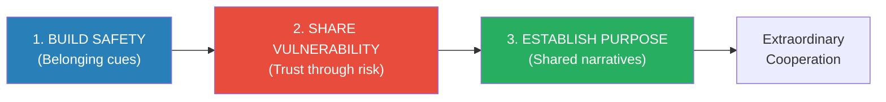
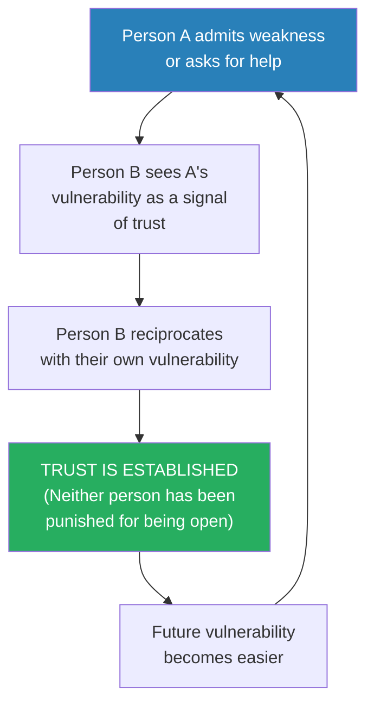
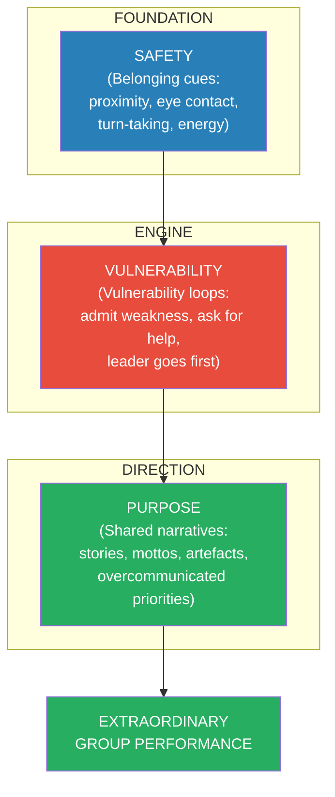

# The Culture Code — Daniel Coyle

> Daniel Coyle spent four years visiting the most successful groups in the world — the Navy SEALs, Pixar, the San Antonio Spurs, IDEO, Google, Zappos — and found that their cultures are not the product of genius individuals or lucky hiring but of specific, learnable skills.
> These skills are not what you'd expect. They don't involve strategic brilliance, motivational speeches, or elaborate incentive systems. They involve small, repeated signals — belonging cues — that tell each member of the group: you are safe here, we are connected, and we share a future.
> The three skills are: Build Safety (create belonging through signals of connection), Share Vulnerability (establish trust through mutual risk), and Establish Purpose (create shared meaning through narrative and values).
> This is the best book on group culture because it is built on observation of what actually works, not theory about what should work.
> Where Pfeffer tells you how INDIVIDUALS accumulate power, Coyle tells you how GROUPS develop the trust that makes power productive.

---

## About the Author

Daniel Coyle is a New York Times bestselling author and a contributing editor for Outside magazine.
He spent four years embedded with some of the most successful groups on earth to research this book, conducting hundreds of interviews and thousands of hours of observation.
He is also the author of *The Talent Code*, which examines how deep practice and myelination build skill.
His approach is journalistic rather than academic: he goes to where the results are and works backward to find the common causes.

---

## The Big Idea

- Group culture is not about WHO is in the group — it is about <b style="color: #2980b9">the signals the group sends</b>
- Coyle's research reveals three skills that create great group cultures, working in sequence:

- <b style="color: #27ae60">Safety enables vulnerability. Vulnerability builds trust. Trust enables shared purpose. Purpose drives extraordinary cooperation.</b>
- The sequence matters: you cannot skip steps. Vulnerability without safety feels threatening. Purpose without trust feels hollow.

---

## Key Concepts at a Glance

| Concept | One-line summary |
|---------|-----------------|
| **Belonging Cues** | Small signals (proximity, eye contact, turn-taking, energy, mirroring) that say "you are safe here" |
| **Psychological Safety** | The belief that you won't be punished for making a mistake — Google's #1 predictor of team success |
| **Vulnerability Loop** | Person A shares weakness → Person B shares weakness → Trust is established |
| **The Nyquist** | The informal connector whose conversations catalyse collaboration across the group |
| **BrainTrust** | Pixar's model: candid feedback on work-in-progress, with NO authority to mandate changes |
| **High-Purpose Environments** | Spaces filled with signals that connect present effort to a meaningful future |
| **Overcommunicate Priorities** | Successful groups repeat their priorities obsessively — far more than feels necessary |
| **Embrace the Messenger** | When someone delivers bad news, the group's response determines whether honest communication continues |

---

## Skill 1: Build Safety

*Safety is not about comfort — it is about the absence of threat. When people feel safe, their brains stop scanning for danger and redirect energy toward collaboration.*

### What Belonging Cues Look Like

- <b style="color: #2980b9">Belonging cues</b> are behaviours that signal connection, future relationship, and safety:

| Cue | What It Looks Like | What It Signals |
|-----|-------------------|----------------|
| **Close physical proximity** | People sit near each other, lean in, touch briefly | "We are connected" |
| **Eye contact** | Frequent, mutual, comfortable | "I see you and you matter" |
| **Turn-taking** | Everyone speaks; no one dominates | "Your voice is valued" |
| **Short, energetic exchanges** | Quick back-and-forth rather than long monologues | "We are in sync" |
| **Active listening** | Nodding, echoing, asking follow-up questions | "I am paying attention to you" |
| **Laughter** | Shared, frequent, genuine | "We enjoy being together" |
| **Attentive courtesies** | Thank-yous, door-holding, remembering names | "I notice and respect you" |
| **Mirroring** | Unconsciously matching posture, gestures, rhythm | "We are alike" (see [[The Art of Reading Minds - Henrik Fexeus|Fexeus]]) |

- <b style="color: #27ae60">These cues matter more than the CONTENT of what is being discussed</b>
- Research shows that group outcomes can be predicted from the pattern of belonging cues exchanged in the first five minutes of a meeting — before any substantive discussion has occurred

> [!example] Google's Project Aristotle
> Google studied hundreds of its teams to find what made some great and others mediocre.
> IQ, experience, seniority, and personality composition didn't predict success.
> <b style="color: #2980b9">The #1 factor was psychological safety</b> — whether team members felt safe to take risks and be vulnerable with each other.
> Teams with psychological safety:
> - Took more creative risks
> - Admitted mistakes faster
> - Gave and received feedback more openly
> - Produced measurably better outcomes
> Teams WITHOUT psychological safety:
> - Played it safe
> - Hid mistakes
> - Avoided difficult conversations
> - Underperformed despite having equally talented members

> [!example] The Tony Hsieh Experiment
> Tony Hsieh (founder of Zappos) bought a section of downtown Las Vegas and redesigned it to maximise "collisions" — random encounters between people from different backgrounds.
> He shortened hallways, created shared spaces, removed barriers, and hosted cross-group events.
> The result: a 23% increase in the rate at which new businesses formed in the area.
> <b style="color: #27ae60">Safety isn't just a team concept — it can be engineered at the level of physical space.</b>

---

### The Bad Apple Experiment

- Will Felps's famous study: he planted a "bad apple" (an actor behaving negatively) in project teams and measured the effect
- Three types of bad apples:
  1. <b style="color: #e74c3c">The Jerk</b> — aggressive, dismissive, rude
  2. <b style="color: #e74c3c">The Slacker</b> — disengaged, not contributing, checking phone
  3. <b style="color: #e74c3c">The Downer</b> — pessimistic, complaining, draining energy
- <b style="color: #e74c3c">A single bad apple reduced group performance by 30-40%</b> — regardless of the quality of the other group members
- One bad apple was enough to destroy safety for the entire group
- BUT: when one group member actively counteracted the bad apple by building belonging cues — making eye contact with everyone, asking questions, defusing tension with humour — the group performed as well as teams without a bad apple
- <b style="color: #27ae60">One positive connector can neutralise one negative disruptor — but only if they actively and consistently send belonging cues</b>

---

## Skill 2: Share Vulnerability

*Trust doesn't come before vulnerability — vulnerability comes before trust. This is one of the most counterintuitive and important findings in the book.*

### The Vulnerability Loop

- <b style="color: #e74c3c">Most leaders believe the opposite: "I need to establish trust BEFORE I can be vulnerable."</b>
- Coyle's research shows it works in reverse: <b style="color: #27ae60">"Vulnerability is the pathway to trust, not the product of it."</b>
- <b style="color: #2980b9">Leaders must go first</b> — if the leader doesn't model vulnerability, no one else will

> [!example] The Navy SEALs' After Action Review
> After every mission, SEAL teams conduct a "hot wash" or After Action Review (AAR).
> The rules: <b style="color: #2980b9">rank is irrelevant</b>. Everyone — from the newest member to the team commander — describes what they did well and what they did wrong.
> The commander goes FIRST, modelling vulnerability: "Here's what I got wrong today."
> This creates permission for everyone else to be honest about their own mistakes.
> The result: SEAL teams iterate and improve faster than any other military unit — because mistakes are surfaced and corrected immediately, not hidden and repeated.
> <b style="color: #27ae60">The vulnerability loop is the engine of rapid learning. Without it, teams repeat errors because no one admits them.</b>

> [!example] Pixar's BrainTrust
> Every Pixar film goes through the <b style="color: #2980b9">BrainTrust</b> — a meeting where directors present rough cuts and receive candid feedback from a group of senior creative leaders.
> The critical rule: <b style="color: #27ae60">the BrainTrust has NO authority to mandate changes</b>. It can only offer observations, reactions, and suggestions.
> This removes the threat: feedback isn't an order from a boss, it's a gift from a peer.
> The director is free to take or leave any suggestion — which paradoxically makes them MORE receptive to the feedback.
> Ed Catmull (Pixar co-founder): "Early on, all our movies suck. The BrainTrust is the mechanism by which they stop sucking."
> <b style="color: #2980b9">Every Pixar film has been through the BrainTrust process. Every Pixar film has been commercially and critically successful. This is not coincidence.</b>

---

### Vulnerability Is Not Weakness

- <b style="color: #e74c3c">The most common misunderstanding about vulnerability in professional settings: it means weakness</b>
- Coyle argues the opposite: <b style="color: #27ae60">vulnerability is the behaviour of the MOST secure individuals in the group</b>
- It takes more confidence to say "I don't know" than to bluff your way through
- It takes more courage to admit a mistake than to cover it up
- It takes more strength to ask for help than to struggle alone
- <b style="color: #2980b9">The weakest members of a group are not the ones who admit mistakes — they are the ones who HIDE them</b>

> [!danger] Before: Vulnerability-averse culture
> No one admits mistakes. Blame gets pushed downward. Problems are hidden until they become crises. The leader projects omniscience.
> Result: slow learning, repeated errors, eroded trust, eventual catastrophic failure.

> [!success] After: Vulnerability-embracing culture
> The leader says: "Here's what I got wrong this quarter. Here's what I'm going to do differently."
> The team follows: mistakes are surfaced, discussed, and corrected in real time.
> Result: rapid learning, continuous improvement, deep trust, resilient performance.

---

## Skill 3: Establish Purpose

*Purpose is not a mission statement on a wall — it is a set of signals that link the present to a meaningful future.*

### What High-Purpose Environments Look Like

- <b style="color: #2980b9">High-purpose environments are filled with signals that constantly connect current effort to future meaning</b>
- These signals include:
  - <b style="color: #27ae60">Stories</b> — narratives about the group's history, values, and defining moments
  - <b style="color: #27ae60">Mottos and catchphrases</b> — short, memorable phrases that encode priorities
  - <b style="color: #27ae60">Artefacts</b> — physical objects that represent the group's identity
  - <b style="color: #27ae60">Rituals</b> — repeated practices that reinforce connection and values

> [!example] Johnson & Johnson's Credo
> In 1943, Robert Wood Johnson wrote a one-page document called "Our Credo" that laid out J&J's priorities in explicit order:
> 1. Customers first
> 2. Employees second
> 3. Communities third
> 4. Shareholders last
> 
> Forty years later, when tainted Tylenol capsules killed seven people in Chicago, J&J's response was swift and decisive: they recalled 31 million bottles — at a cost of over $100 million — before any government agency asked them to.
> The decision was made in hours, not weeks. Why? Because the Credo had been so deeply embedded in the culture that when crisis hit, the answer was obvious: customers first.
> <b style="color: #27ae60">Purpose works best when it's embedded in stories and documents that have been repeated so often they become automatic decision-making frameworks.</b>

---

### Overcommunicate Priorities

- Successful groups don't state their priorities once and assume everyone remembers
- <b style="color: #2980b9">They repeat them obsessively — far more than feels necessary</b>
- Coyle found that the leaders of the most successful groups mentioned their core priorities an average of <b style="color: #27ae60">ten times more often</b> than the leaders of average groups
- This felt redundant to the leaders but was perceived by team members as clarity and consistency
- <b style="color: #e74c3c">If you're tired of saying it, your team is just starting to hear it</b>

---

## The Three Skills: Master Comparison

| Skill | What It Builds | Core Behaviour | When It's Missing |
|-------|---------------|----------------|-------------------|
| **Build Safety** | Belonging — "I'm part of this group" | Send belonging cues constantly | People are guarded, political, and self-protective |
| **Share Vulnerability** | Trust — "I can be honest with this group" | Admit mistakes, ask for help, and go first | Mistakes are hidden, blame is deflected, learning stops |
| **Establish Purpose** | Meaning — "I know WHY we're doing this" | Tell stories, repeat priorities, create shared narratives | People are busy but aimless; effort is unfocused |

---

## The Verdict

*The Culture Code* is the most practical book on group culture available — and its power comes from a single, counterintuitive insight that contradicts most management thinking: <b style="color: #2980b9">culture is not the product of hiring the right people. It is the product of sending the right signals.</b>

The three-skill framework (Safety → Vulnerability → Purpose) is both simple enough to remember in any meeting and deep enough to transform how you build teams. The research base is vivid — Google's Project Aristotle, Pixar's BrainTrust, the Navy SEALs' After Action Reviews, and the bad apple experiment alone justify the price of the book.

Coyle's most important insight may be the vulnerability finding: that trust doesn't precede vulnerability but follows from it, and that leaders must go first. This runs directly counter to the instinct of most new leaders, who believe they must establish credibility before showing weakness. Coyle's data shows the opposite: credibility IS built through showing weakness — because it demonstrates the security and honesty that teams need to see in order to trust.

The book is weaker on the purpose side — the final skill feels underdeveloped compared to the first two. And Coyle sometimes romanticises his case-study organisations (the SEALs, Pixar, and the Spurs have their own dysfunctions that receive less attention). But as a guide to the signals that make groups work, it is the best there is.

---

## Related Reading

- [[The Effective Executive - Peter Drucker|The Effective Executive]] — Drucker's strength-based approach to building productive teams
- [[7 Rules of Power - Jeffrey Pfeffer|7 Rules of Power]] — The individual power counterpoint: Pfeffer on navigating cultures, Coyle on building them
- [[Working Backwards - Colin Bryar & Bill Carr|Working Backwards]] — Amazon's culture-building mechanisms (Leadership Principles, narratives, six-pagers)
- [[Power - Jeffrey Pfeffer|Power]] — How power dynamics interact with (and sometimes override) culture
- [[Emotional Intelligence - Daniel Goleman|Emotional Intelligence]] — The individual EQ skills that collective safety requires
- [[Crucial Conversations - Kerry Patterson|Crucial Conversations]] — The communication skills needed to maintain vulnerability loops under pressure
- [[What Every Body Is Saying - Joe Navarro|What Every Body Is Saying]] — Reading the nonverbal belonging cues that Coyle describes
- [[The Charisma Myth - Olivia Fox Cabane|The Charisma Myth]] — Presence and warmth as the individual-level skills that create group-level safety
- [[Influence - Robert Cialdini|Influence]] — Social proof and liking as the psychological mechanisms behind belonging cues
