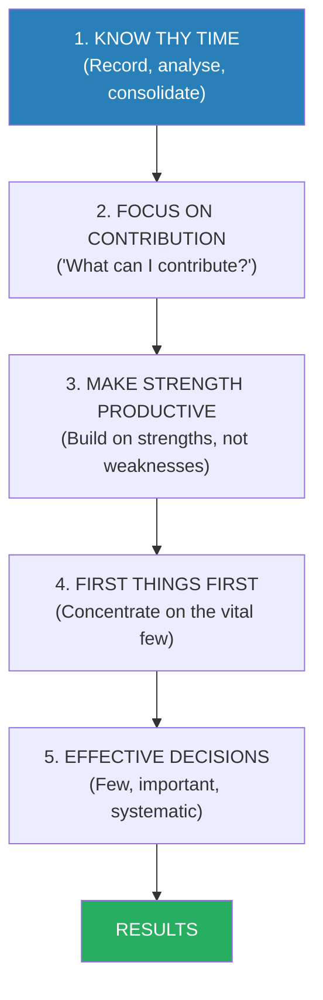
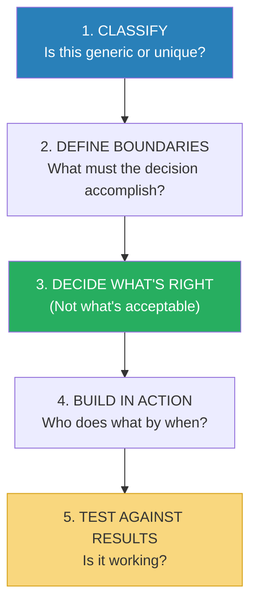

# The Effective Executive — Peter F. Drucker

> Peter Drucker's most practical book makes a single, powerful argument: effectiveness is a habit, and it can be learned.
> Intelligence, knowledge, and imagination are useless without the ability to convert them into results — and that conversion is what Drucker means by "effectiveness."
> Written in 1967 but reading as though it were written yesterday, the book identifies five practices that any knowledge worker can master: managing time, focusing on contribution, building on strengths, concentrating effort, and making effective decisions.
> It is the foundational text of modern management — the book that taught executives to ask not "How do I get things done?" but "What are the right things to do?"
> In a world drowning in productivity advice, Drucker cuts through with a question that most productivity books never ask: <b style="color: #2980b9">"What can I contribute that will significantly affect the performance and results of the institution I serve?"</b>
> The answer to that question — not task lists, not efficiency hacks, not time management tricks — is what makes an executive effective.

---

## About the Author

Peter Ferdinand Drucker (1909-2005) was an Austrian-born American management consultant, educator, and author widely regarded as the founder of modern management theory.
He wrote 39 books and consulted for organisations including General Electric, IBM, the U.S. government, the Red Cross, and the Salvation Army.
He held professorships at NYU and Claremont Graduate University, where the Drucker Institute continues his work.
*The Effective Executive* is considered his most concise and actionable work — the distillation of decades of observing what separates productive leaders from busy ones.
His influence extends far beyond management: he anticipated the rise of knowledge work, the information economy, and the nonprofit sector decades before they became mainstream concepts.

---

## The Big Idea

- <b style="color: #2980b9">Effectiveness is not a talent — it is a discipline</b>
- It consists of five practices that can be learned and must be earned through constant application
- The effective executive does not start with tasks — they start with <b style="color: #27ae60">time</b>, because time is the one truly irreplaceable resource
- <b style="color: #e74c3c">Intelligence without effectiveness produces nothing. Effectiveness without intelligence produces something.</b>

---

## Key Concepts at a Glance

| Concept | One-line summary |
|---------|-----------------|
| **Effectiveness Is Learnable** | It is a habit, not a talent — anyone can develop it through practice |
| **Know Thy Time** | Record how you actually spend time (you will be shocked); then ruthlessly eliminate waste |
| **Focus on Contribution** | Ask "What can I contribute?" not "What tasks do I need to do?" |
| **Make Strength Productive** | Staff for strength, not absence of weakness; build on what people CAN do |
| **First Things First** | Do the most important thing. Then the next most important thing. Second things not at all. |
| **Effective Decisions** | Few decisions, well-made: classify, define boundaries, decide what's RIGHT (not acceptable), build in action |
| **The Time Log** | The single most powerful diagnostic tool: track every minute for 3-4 weeks |
| **Contribution Focus** | The question that separates effective executives from busy ones |

---

## Habit 1: Know Thy Time

*Drucker's first and most radical insight: start with time, not tasks.*

- <b style="color: #2980b9">Time is the one resource you cannot buy, rent, borrow, or make more of</b>
- Most executives have no idea how they actually spend their time — they THINK they know, but the reality always shocks them
- Drucker's method: <b style="color: #27ae60">record → analyse → consolidate</b>

### Step 1: Record
- Track every minute of your day for 3-4 weeks — in real time, not from memory
- Use any method: notebook, app, assistant
- <b style="color: #e74c3c">Do NOT trust your memory — research shows people's time estimates are wildly inaccurate</b>
- Drucker found that executives typically overestimate time spent on important work by 50% and underestimate time spent on trivial work by the same margin

### Step 2: Analyse
- For every activity in the log, ask three questions:
  1. <b style="color: #2980b9">"What would happen if this were not done at all?"</b> If the answer is "nothing," stop doing it.
  2. <b style="color: #2980b9">"Could someone else do this as well or better?"</b> If yes, delegate it.
  3. <b style="color: #2980b9">"What do I do that wastes YOUR time?"</b> Ask your direct reports this — they will tell you things no time log can reveal.

> [!example] The Executive Who Discovered 25%
> Drucker describes an executive who tracked his time and discovered that <b style="color: #e74c3c">25% of his working hours were spent in meetings that accomplished nothing</b>.
> He hadn't noticed because the meetings were scattered throughout the week — 45 minutes here, an hour there — and each one felt "necessary" in the moment.
> After the time audit, he eliminated or shortened half of them.
> <b style="color: #27ae60">The freed time — roughly 10 hours per week — went to the two strategic projects that defined his team's performance for the next year.</b>

### Step 3: Consolidate
- <b style="color: #2980b9">Group your discretionary time into large, uninterrupted blocks</b>
- Fragmented time is useless for important work — you cannot write a report, develop a strategy, or think through a complex decision in fifteen-minute increments
- Drucker recommends blocking at least one quarter of the working day for concentrated work — and protecting that block ferociously

> [!danger] Before: Fragmented time
> 8:00 — email. 8:20 — meeting. 9:00 — email. 9:15 — phone call. 9:30 — walk-in interruption. 10:00 — meeting...
> The executive is "busy" all day but produces nothing of lasting value.

> [!success] After: Consolidated time
> 8:00-11:30 — deep work block (door closed, email off, phone off). 11:30-1:00 — meetings, email, admin. 2:00-4:30 — deep work block. 4:30-5:00 — wrap-up.
> The executive produces 6 hours of concentrated output — more than most produce in a week. (See [[Deep Work - Cal Newport|Deep Work]] for the modern version of this principle.)

---

## Habit 2: Focus on Contribution

- <b style="color: #27ae60">"What can I contribute that will significantly affect the performance and results of the institution I serve?"</b>
- This is Drucker's most powerful question — and the one that separates effective executives from merely busy ones
- Most people focus downward — on efforts rather than results, on activity rather than impact, on authority rather than responsibility
- The contribution question shifts focus outward and upward: <b style="color: #2980b9">from inputs to outcomes, from "what can I do?" to "what difference can I make?"</b>

### Three Dimensions of Contribution

| Dimension | Question | Example |
|-----------|---------|---------|
| **Direct results** | "What results does the institution need from me?" | Revenue, products shipped, patients treated, cases won |
| **Building values** | "What values and standards should I set and exemplify?" | Quality, integrity, innovation, customer focus |
| **Developing people** | "Whose capabilities am I building for the future?" | Mentoring, training, delegating with development intent |

- <b style="color: #e74c3c">Most executives focus only on the first dimension — direct results — and neglect the second and third</b>
- But Drucker argues that building values and developing people are HIGHER-LEVERAGE contributions because they compound over time
- The executive who develops three strong successors contributes more than the one who delivers great results but leaves no one capable of continuing them

> [!tip] Drucker's Contribution Test
> Before every meeting, presentation, or project, ask:
> "What will the people in this room need from me to be able to DO SOMETHING with what I present?"
> This reframes every interaction from "What do I want to say?" to "What do they need to hear?"
> The shift from self-focused to audience-focused communication is one of the most powerful changes a leader can make.

---

## Habit 3: Make Strength Productive

- <b style="color: #e74c3c">"The task of leadership is to create an alignment of strengths, making our weaknesses irrelevant"</b>
- Most organisations staff for the absence of weakness — they look for people with no major flaws
- <b style="color: #27ae60">Drucker argues for staffing for strength — finding people who are exceptionally good at ONE thing and building their role around that strength</b>
- "Never ask 'What can't this person do?' Ask 'What can this person do uncommonly well?'"

### The Strengths Deployment Matrix

| Approach | What It Produces | Long-Term Result |
|----------|-----------------|-----------------|
| **Staff for absence of weakness** | People who are adequate at everything but excellent at nothing | Mediocrity |
| **Staff for strength** | People who are outstanding at one thing and weak at others | Excellence (if the role is built around the strength) |
| **Try to fix weaknesses** | People who are slightly less weak at their weak points but resentful and demotivated | Frustration and turnover |
| **Build on strengths** | People who are even more outstanding at their best thing and energised by the work | Peak performance |

> [!example] Abraham Lincoln and General Grant
> Drucker's favourite example: Lincoln was told that General Grant was a drunkard. Lincoln's response: "If I knew his brand, I'd send a barrel to my other generals."
> Lincoln didn't care about Grant's weakness (drinking). He cared about Grant's strength (winning battles — which no other Union general could do).
> <b style="color: #27ae60">"The effective executive makes strength productive. He knows that one cannot build on weakness. To achieve results, one has to use all the available strengths."</b>
> This applies not just to others but to yourself: <b style="color: #2980b9">build your career around your strengths, not around shoring up your weaknesses</b>.

---

## Habit 4: First Things First

- <b style="color: #2980b9">"Do first things first, and second things not at all"</b>
- Not "second things second" — <b style="color: #e74c3c">SECOND THINGS NOT AT ALL</b>
- This is concentration: the courage to impose on time and events your own deliberate choice of what matters
- Most executives have a list of ten important things. They try to do all ten. They do all ten poorly.
- The effective executive identifies the ONE thing that matters most, does it, then identifies the next ONE thing.

> [!warning] The Concentration Paradox
> Doing fewer things feels wrong — it feels like you're not working hard enough, not being responsive enough, not "on top of everything."
> But <b style="color: #e74c3c">trying to do everything guarantees that nothing gets the attention it needs</b>.
> The executive who completes ONE strategic initiative per quarter contributes more than the one who starts ten and completes none.
> (See [[Essentialism - Greg McKeown|Essentialism]] for the modern version of this principle.)

### Drucker's Priority Rules

| Rule | Description |
|------|-------------|
| **Pick the future over the past** | Don't fix yesterday's mistakes — build tomorrow's opportunities |
| **Focus on opportunity, not problem** | Problems demand attention; opportunities demand initiative. Prioritise initiative. |
| **Choose your own direction** | Don't let other people's urgencies set your agenda |
| **Aim high** | "Aim to make a difference, not just to play it safe" |

---

## Habit 5: Effective Decisions

- The effective executive makes <b style="color: #2980b9">few decisions — but the right ones</b>
- Most people think decision-making means choosing quickly between options
- Drucker argues the opposite: effective decision-making means <b style="color: #27ae60">understanding the problem correctly before choosing anything</b>

### Drucker's Decision Process

| Step | Key Question | The Mistake Most People Make |
|------|-------------|----------------------------|
| **Classify** | Is this a symptom of a generic problem or a truly unique event? | Treating every problem as unique when most are instances of known patterns |
| **Define boundaries** | What must the decision achieve? What are the constraints? | Jumping to solutions without defining what "success" looks like |
| **Decide what's right** | If there were no constraints, what would be the ideal? | Starting with "what's politically acceptable" instead of "what's actually correct" |
| **Build in action** | Who will do what, by when, with what resources? | Making decisions that never become actions — "good intentions, not decisions" |
| **Test against results** | Did the decision produce the expected outcome? | Never revisiting decisions to check if they worked |

- <b style="color: #27ae60">"A decision that doesn't degenerate into work is not a decision — it is, at best, a good intention"</b>
- Every decision must include: who is responsible, what the deadlines are, who is affected and must be informed, and how results will be measured

> [!tip] Drucker's Decision Quality Check
> Before finalising any important decision:
> 1. "Have I understood the problem, or am I just reacting to a symptom?"
> 2. "Am I deciding what's RIGHT or what's ACCEPTABLE?"
> 3. "Is there action built into this decision, or is it just a statement of intent?"
> 4. "How will I know if this decision was wrong?"
> 
> If any answer is unsatisfying, the decision is not ready.

---

## The Verdict

*The Effective Executive* has aged better than almost any business book because it addresses the permanent challenge of knowledge work: converting intelligence into results.
Drucker's five habits are not theoretical — they are the distilled observation of what actually works, drawn from decades of consulting with the world's most effective leaders.

The time-management chapter alone is worth the price of the book: the idea of recording, analysing, and consolidating time is as relevant in 2026 as it was in 1967 — perhaps more so, given the fragmentation that email, Slack, and constant connectivity have introduced.

The contribution question — "What can I contribute that will significantly affect the performance and results of the institution I serve?" — is the single most powerful reframe in management literature. It shifts the executive from task-orientation to impact-orientation, from "busy" to "effective."

The book's weakness is its age: some examples feel dated, and Drucker's implicit assumption that executives are male is a product of its era. The prose is elegant but occasionally dense. And the chapters on decision-making and strength-building, while excellent, are less developed than the time and contribution chapters.

But as the one management book everyone should read — the book that defines what it means to be effective in knowledge work — it is unmatched. Everything written since is, in some sense, a commentary on Drucker.

---

## Related Reading

- [[Deep Work - Cal Newport|Deep Work]] — Newport's concentration principle is Drucker's "first things first" updated for the distraction age
- [[Essentialism - Greg McKeown|Essentialism]] — McKeown's entire framework is an expansion of Drucker's "do first things first, and second things not at all"
- [[Measure What Matters - John Doerr|Measure What Matters]] — Doerr's OKR system operationalises Drucker's contribution focus
- [[Zero to One - Peter Thiel|Zero to One]] — Thiel's contrarian thinking echoes Drucker's insistence on choosing the right problem
- [[What Got You Here Won't Get You There - Marshall Goldsmith|What Got You Here]] — Goldsmith's "stop doing" framing is the behaviour-level application of Drucker's concentration principle
- [[7 Rules of Power - Jeffrey Pfeffer|7 Rules of Power]] — Pfeffer's strategic effectiveness as the power complement to Drucker's operational effectiveness
- [[The Culture Code - Daniel Coyle|The Culture Code]] — Building the group dynamics that enable Drucker's individual effectiveness to scale
- [[Thinking in Bets - Annie Duke|Thinking in Bets]] — Duke's decision-quality framework complements Drucker's decision process
