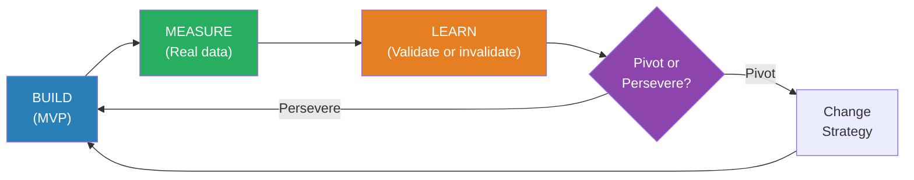
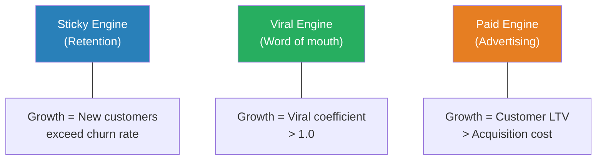

# The Lean Startup — Eric Ries

> Most startups die not from a failure of technology but from a failure of imagination — they build products nobody wants, then wonder why nobody buys them. Eric Ries, co-founder of IMVU, spent years building features that customers ignored before arriving at a disciplined alternative: treat every product idea as a hypothesis, test it with the smallest possible experiment, measure actual customer behaviour, and learn whether to change course or double down. *The Lean Startup* codifies that alternative into a repeatable methodology — the Build-Measure-Learn feedback loop — that has since become the default operating system for entrepreneurship worldwide. The book's core insight is deceptively simple: **don't ask customers what they want; build the smallest thing that tests whether they want it, and let their behaviour answer the question.**

---

## About the Author

Eric Ries is an entrepreneur and author who co-founded IMVU, a 3D avatar social platform, in 2004. His painful experience building features no one used — including a six-month effort to integrate IMVU with existing instant messaging networks that customers actively rejected — led him to develop the Lean Startup methodology. He drew on Toyota's lean manufacturing principles (via Steve Blank's Customer Development methodology and Taiichi Ohno's Toyota Production System) and applied them to the uncertainty of startups. He has since advised startups, Fortune 500 companies, and government agencies on applying lean principles to innovation.

---

## The Big Idea

- <b style="color: #2980b9">A startup is a human institution designed to create a new product or service under conditions of extreme uncertainty</b>
- Under uncertainty, the traditional management playbook — write a business plan, get funding, build the product, sell it — fails catastrophically because every assumption in the plan is untested
- <b style="color: #27ae60">The antidote is validated learning: running experiments that prove or disprove the assumptions your business depends on</b>
- Progress for a startup is not lines of code written or features shipped — it is learning what creates value for customers

---

## Key Concepts at a Glance

| Concept | One-line summary |
|---------|-----------------|
| **Build-Measure-Learn** | The core feedback loop — build an MVP, measure customer behaviour, learn whether your hypothesis is right |
| **Validated Learning** | Progress measured by what you learn about customers, not what you build |
| **Minimum Viable Product (MVP)** | The smallest experiment that tests a business hypothesis with real customers |
| **Pivot or Persevere** | The structured decision: change strategy (pivot) or stay the course (persevere) |
| **Innovation Accounting** | Measuring startup progress when revenue and profit are not yet meaningful |
| **Leap-of-Faith Assumptions** | The value hypothesis (will customers find this valuable?) and growth hypothesis (how will new customers discover it?) |
| **Engines of Growth** | Three models: sticky (retention), viral (word of mouth), paid (advertising) |
| **Small Batches** | Ship smaller increments more frequently to find problems faster |
| **Five Whys** | Trace every defect to its root cause by asking "why?" five times |

---

## The Build-Measure-Learn Loop

The loop is the engine of the Lean Startup, but Ries emphasises a critical subtlety: **you plan the loop in reverse**.

- Start by deciding what you need to **learn** (which hypothesis to test)
- Then figure out what you need to **measure** to know if the hypothesis is true or false
- Then build the **minimum** thing required to generate that measurement

Most teams do it backwards — they build whatever excites them, then scramble to find metrics that make the build look successful, then claim they "learned" something. That is not validated learning; that is rationalisation.

---

## The Minimum Viable Product

- An MVP is not a crappy version of your product — it is the <b style="color: #e74c3c">smallest experiment that tests a specific hypothesis</b>
- The goal is learning, not launch

Ries catalogues several MVP types:

- **Video MVP** — Dropbox: Drew Houston made a three-minute demo video showing how the product would work before writing a line of file-syncing code. The waiting list went from 5,000 to 75,000 overnight. He learned that people wanted the product without building it.
- **Concierge MVP** — Food on the Table: the CEO personally found recipes and bought groceries for a single customer, doing by hand what the software would eventually automate. He learned exactly what the customer valued before building anything.
- **Wizard of Oz MVP** — Zappos: Nick Swinmurn posted photos of shoes from local stores online. When someone ordered, he went to the store, bought the shoes, and shipped them. He learned that people would buy shoes online without carrying any inventory.
- **Landing Page MVP** — test demand by describing a product that does not exist and measuring how many people click "buy" or "sign up"

> The MVP is the beginning of the learning process, not the end. It is designed to be embarrassing — if you are not embarrassed by the first version, you launched too late.

---

## Pivot or Persevere

The hardest decision in entrepreneurship: when do you change course?

- A <b style="color: #2980b9">pivot</b> is a structured course correction — a change in strategy without a change in vision
- It is not failure; it is learning applied
- The danger is the "land of the living dead" — startups that have enough traction to survive but not enough to thrive, and whose founders are too emotionally invested to change course

Ries identifies several pivot types:

| Pivot Type | What changes | Example |
|-----------|-------------|---------|
| **Zoom-in** | A single feature becomes the whole product | Flickr started as a game; the photo-sharing feature became the product |
| **Zoom-out** | The whole product becomes a single feature | A standalone product becomes part of a larger platform |
| **Customer segment** | Same product, different customers | Discovered your real users are not who you expected |
| **Customer need** | Same customers, different problem | You built for problem A but customers care about problem B |
| **Platform** | Application becomes platform (or vice versa) | Single app evolves into a marketplace |
| **Channel** | Change how you reach customers | Direct sales to online, or retail to enterprise |
| **Technology** | Same solution, different technology | Rebuild with a fundamentally different tech stack |
| **Engine of growth** | Switch from viral to paid, or sticky to viral | The growth model changes |

---

## Innovation Accounting

Traditional metrics (revenue, profit, ROI) are meaningless for early-stage startups. Ries proposes a three-step framework:

1. **Establish the baseline** — use an MVP to get real data on where the startup stands today
2. **Tune the engine** — make changes designed to move the metrics from baseline toward the ideal
3. **Pivot or persevere** — if the metrics are not moving toward the ideal, the current strategy is not working

The critical distinction is between <b style="color: #e74c3c">vanity metrics</b> (total users, total revenue, page views — numbers that always go up and always look good) and <b style="color: #27ae60">actionable metrics</b> (per-cohort retention, conversion rates, revenue per customer — numbers that tell you whether your product is actually getting better).

---

## Engines of Growth

Every startup's growth is powered by one of three engines:

- **Sticky**: growth from high retention — customers keep using the product. The key metric is churn rate. If new customers exceed churned customers, the product grows.
- **Viral**: growth from existing customers bringing new ones. The key metric is the viral coefficient — if each user brings in more than one additional user, growth is exponential.
- **Paid**: growth from advertising where the revenue per customer exceeds the cost of acquisition. The key metric is the ratio of lifetime value (LTV) to customer acquisition cost (CAC).

Ries warns against trying to run all three engines simultaneously — focus on the one that fits your product and optimise ruthlessly.

---

## Small Batches and the Five Whys

From Toyota's production system, Ries imports two principles:

**Small batches**: ship smaller increments more frequently. Counter-intuitively, this is faster than large batches because:
- You find problems sooner (before they compound)
- You get feedback sooner (before you build more wrong things)
- You reduce work-in-progress (less wasted effort if priorities change)

**Five Whys**: when something goes wrong, ask "why?" five times to trace the symptom back to its root cause. Then make a proportional investment in fixing the root cause — not a massive overhaul, but enough to prevent recurrence. This prevents both under-reaction (ignoring the problem) and over-reaction (rebuilding everything after one bug).

---

## The Verdict

*The Lean Startup* is the most practically useful book on entrepreneurship available. Its methodology — hypothesis-driven development, MVPs, actionable metrics, structured pivots — has become so deeply embedded in startup culture that it is easy to forget how radical it was when published. Before Ries, the dominant approach was "stealth mode" — spend months or years building in secret, then launch with a big reveal. That approach produced spectacular failures alongside its successes, because it provided no mechanism for learning before commitment.

The book's weakness is that it overweights process and underweights vision. Peter Thiel's critique in *[[Zero to One - Peter Thiel|Zero to One]]* is sharp: lean methodology is excellent for optimising an existing idea but poorly suited for the kind of breakthrough thinking that creates entirely new categories. Nobody "iterated" their way to the iPhone. The lean approach also struggles with products where the value is only apparent at scale (network effects) or where the technology must work perfectly before any value exists (self-driving cars).

But for the vast majority of new products and ventures — where the biggest risk is building something nobody wants — the Build-Measure-Learn loop remains the single best defence against wasted effort.

---

## Related Reading

- [[Zero to One - Peter Thiel|Zero to One]] — Thiel's contrarian rebuttal: lean methodology produces incremental improvements, not breakthroughs
- [[The Effective Executive - Peter Drucker|The Effective Executive]] — Drucker's systematic abandonment and contribution focus anticipate Ries' pivot-or-persevere discipline
- [[The Phoenix Project - Gene Kim|The Phoenix Project]] — small batches, deployment pipelines, and feedback loops applied to IT operations
- [[Measure What Matters - John Doerr|Measure What Matters]] — OKRs as an operational framework for the kind of actionable metrics Ries advocates
