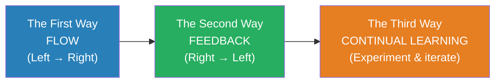
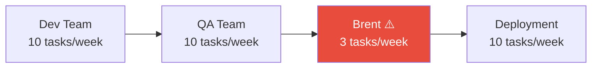

# The Phoenix Project — Gene Kim

> Bill Palmer is having the worst Tuesday of his career. He has just been promoted to VP of IT Operations at Parts Unlimited, a $4 billion auto parts manufacturer — and within hours he discovers that the company's most critical initiative, the Phoenix Project, is months behind schedule, millions over budget, and threatening to sink the entire company. Payroll is broken. Auditors are circling. The CEO has given him ninety days to fix everything or IT gets outsourced. Into this chaos steps Erik Reid, an eccentric board member who walks Bill through a manufacturing plant and asks a question that changes everything: *"What are the four types of work?"* Over the next ninety days, Bill learns that IT is not a mysterious black box — it is a production line, and the same principles that revolutionised manufacturing (Theory of Constraints, lean production, continuous improvement) can transform how technology organisations operate. *The Phoenix Project* is the origin story of the DevOps movement, told as a novel.

---

## About the Author

Gene Kim is a researcher, author, and former CTO who spent thirteen years studying high-performing technology organisations. He co-authored *The Phoenix Project* with Kevin Behr and George Spafford, drawing on Eliyahu Goldratt's *The Goal* (the manufacturing novel that inspired this book's format) and on Kim's own research into what distinguishes elite IT organisations from struggling ones. He later co-authored *The DevOps Handbook* (the non-fiction companion) and *The Unicorn Project* (a sequel told from a developer's perspective).

---

## The Big Idea

- <b style="color: #2980b9">IT work is work — and it follows the same physical laws as any other kind of work</b>
- Work in progress clogs the system. Bottlenecks determine throughput. Uncontrolled changes introduce chaos. Invisible work is unmanageable work.
- <b style="color: #27ae60">The Three Ways provide a philosophical framework for transforming IT from firefighting to flow</b>

---

## Key Concepts at a Glance

| Concept | One-line summary |
|---------|-----------------|
| **The Three Ways** | Flow, Feedback, Continual Learning — the philosophical pillars of DevOps |
| **Four Types of IT Work** | Business projects, internal IT projects, changes, unplanned work |
| **Unplanned Work** | The silent killer — crowds out all planned work and feeds on itself |
| **Theory of Constraints** | The system's throughput is limited by its single biggest bottleneck |
| **WIP Limits** | Stop starting, start finishing — limit work in progress to increase throughput |
| **Brent the Bottleneck** | One person who is the constraint for every critical system — the anti-pattern |
| **Make Work Visible** | You cannot manage what you cannot see — kanban boards expose hidden queues |
| **Deployment Pipeline** | Automated build-test-deploy reduces risk and increases speed simultaneously |
| **Change Management** | 80% of outages are caused by changes — controlling changes reduces unplanned work |

---

## The First Way: Flow

**Optimise the flow of work from left (development) to right (operations/customer).**

The first principle is about throughput — getting work through the system faster and more reliably. Key practices:

- **Make work visible.** Bill's breakthrough moment comes when he puts all IT work on a physical kanban board using Post-It notes. For the first time, everyone can see the queue of work, the bottlenecks, and the work in progress. Before this, work requests arrived via email, hallway conversations, and executive demands — invisible, untracked, and competing for the same resources.

- **Limit work in progress.** When everything is priority one, nothing is. Bill learns to limit the number of tasks in progress at any time, which counter-intuitively increases throughput — because people finish tasks instead of context-switching between dozens of half-done items.

- **Reduce batch sizes.** Instead of massive quarterly releases (which are terrifying, error-prone, and require heroic weekend efforts), move toward smaller, more frequent deployments. Smaller batches mean smaller risks, faster feedback, and easier rollback.

- **Reduce handoffs and queues.** Every time work passes from one team to another, it waits in a queue. Each queue adds delay. Each handoff loses context.

---

## The Four Types of IT Work

Erik's most important lesson to Bill: all IT work falls into exactly four categories, and you cannot manage any of them until you can see all of them.

| Type | Description | Example |
|------|-------------|---------|
| **Business Projects** | Work that serves the business directly | The Phoenix Project itself |
| **Internal IT Projects** | Infrastructure and capability improvements | Database upgrades, server migrations |
| **Changes** | Modifications triggered by the first two types | Config changes, patches, deployments |
| **Unplanned Work** | Firefighting — the work you did not plan for | Outages, security incidents, broken payroll |

<b style="color: #e74c3c">Unplanned work is the most destructive because it is invisible and self-reinforcing.</b> When you firefight instead of fixing root causes, you create the conditions for more fires. Unplanned work displaces planned work, which means commitments slip, which means executives escalate, which means more interruptions, which means more unplanned work. It is a reinforcing feedback loop.

---

## The Theory of Constraints (Applied to IT)

Erik teaches Bill that every system has exactly one constraint — one bottleneck that limits the entire system's throughput. In Parts Unlimited's IT department, that constraint is Brent.

- Brent is the brilliant engineer who knows every system, gets pulled into every escalation, and is the only person who can fix certain problems
- Every critical path runs through Brent
- His queue is infinite; everyone waits for Brent
- <b style="color: #2980b9">Any improvement not at the bottleneck is an illusion</b> — making other teams faster just fills Brent's queue faster

The constraint determines throughput: it does not matter that every other team can process ten tasks per week if Brent can only handle three.

Bill's solution follows Goldratt's five focusing steps:
1. **Identify** the constraint (Brent)
2. **Exploit** it (protect Brent's time — stop pulling him into every meeting and escalation)
3. **Subordinate** everything else to it (other teams adjust to Brent's capacity, not the other way around)
4. **Elevate** it (document Brent's knowledge so others can handle his work — cross-train, create runbooks)
5. **Repeat** (once Brent is no longer the bottleneck, find the new one)

---

## The Second Way: Feedback

**Amplify feedback loops from right (operations/customer) to left (development).**

The First Way optimises forward flow. The Second Way ensures that information flows backward — from production into development, from customers into product decisions, from operations into architecture.

- **Telemetry everywhere.** You cannot improve what you cannot measure. Instrument applications and infrastructure so that problems are detected in minutes, not days.
- **Peer review of changes.** No change goes into production without another pair of eyes.
- **Automated testing.** Build a suite of tests that runs against every change, catching regressions before they reach customers.
- **Shared pain.** When operations suffers from a deployment, developers should feel that pain directly — not hear about it in a weekly status report three days later.

The payroll disaster in the novel is a case study in missing feedback. A database change that should have been flagged and tested goes directly to production, breaks payroll for 5,000 employees, and triggers a frantic weekend recovery. The root cause was not incompetence — it was the absence of feedback loops: no change review, no automated testing, no visibility into what changed.

---

## The Third Way: Continual Learning

**Foster a culture of experimentation, risk-taking, and learning from failure.**

- **Allocate time for improvement.** If 100% of capacity is consumed by project work and firefighting, there is zero capacity for improving the system that does the work. Bill learns to reserve 20% of capacity for internal improvements.
- **Practise failure.** Run game days and incident simulations so the team practises recovery before a real crisis forces them to improvise.
- **Blameless post-mortems.** When something goes wrong, ask "what happened?" not "whose fault was this?" Blame discourages transparency; transparency prevents recurrence.
- **Share knowledge.** Brent's bottleneck status is a symptom of hoarded knowledge. The fix is documentation, cross-training, and runbooks that distribute capability across the team.

---

## The Transformation

The novel tracks Bill's ninety-day journey from chaos to competence:

| Phase | State | Key Insight |
|-------|-------|-------------|
| **Week 1** | Total chaos — Phoenix behind, payroll broken, auditors circling | Work is invisible; nobody knows what anyone is doing |
| **Week 3** | First kanban board — work becomes visible for the first time | You cannot manage invisible work |
| **Week 5** | WIP limits enforced — people resist, then throughput improves | Limiting WIP increases flow |
| **Week 7** | Brent protected — queue shrinks, knowledge transfer begins | Exploit the constraint, then elevate it |
| **Week 10** | Change management implemented — outages drop dramatically | 80% of outages are caused by changes |
| **Week 12** | Automated deployment pipeline — releases become routine | Small, frequent releases beat big, scary ones |
| **Day 90** | Phoenix launches successfully; IT is a strategic asset | IT is the factory floor of the digital enterprise |

---

## The Verdict

*The Phoenix Project* succeeds as both a management handbook and a compelling story — a rare combination. The novel format makes abstract concepts visceral: you feel Bill's panic when payroll breaks, his frustration when executives demand the impossible, and his gradual understanding as Erik's lessons click into place. The Four Types of Work, the Theory of Constraints applied to IT, and the Three Ways have become foundational vocabulary in technology organisations worldwide.

The book's limitation is that it presents a best-case transformation narrative. Bill has a wise mentor, a supportive (eventually) CEO, and a team that gets on board once the approach is demonstrated. In reality, organisational change is messier, more political, and more resistant than the novel suggests. The antagonists — the project manager who hoards resources, the security officer who blocks everything, the executive who makes impossible promises — are drawn sympathetically but simply. Real organisational dysfunction is more deeply rooted.

It is also worth noting that the book focuses almost entirely on operations and deployment. The developer experience — the daily life of writing code, managing technical debt, and making architectural decisions — is addressed in the sequel, *The Unicorn Project*.

For anyone working in or managing technology organisations, this is essential reading. It provides a vocabulary for diagnosing dysfunction, a framework for improvement, and a compelling narrative that makes the case far more effectively than any slide deck could.

---

## Related Reading

- [[The Effective Executive - Peter Drucker|The Effective Executive]] — Drucker's principles of knowledge work management underpin much of what Bill learns
- [[The Lean Startup - Eric Ries|The Lean Startup]] — the startup-side application of the same lean principles Bill applies to IT operations
- [[The Checklist Manifesto - Atul Gawande|The Checklist Manifesto]] — process discipline and checklists as tools for preventing failures in complex systems
- [[Thinking in Systems - Donella H. Meadows|Thinking in Systems]] — the theoretical foundation for the feedback loops and system dynamics Bill encounters
- [[An Elegant Puzzle - Will Larson|An Elegant Puzzle]] — systems-informed engineering management, building on the principles Kim dramatises
