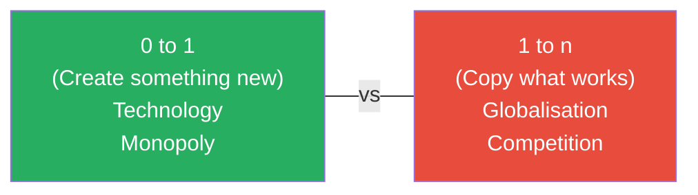
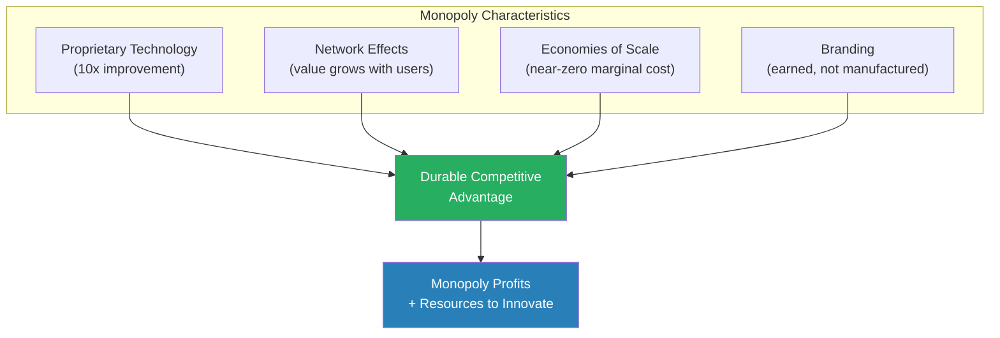
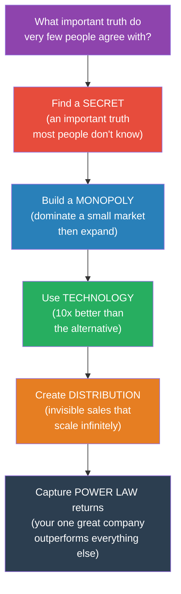
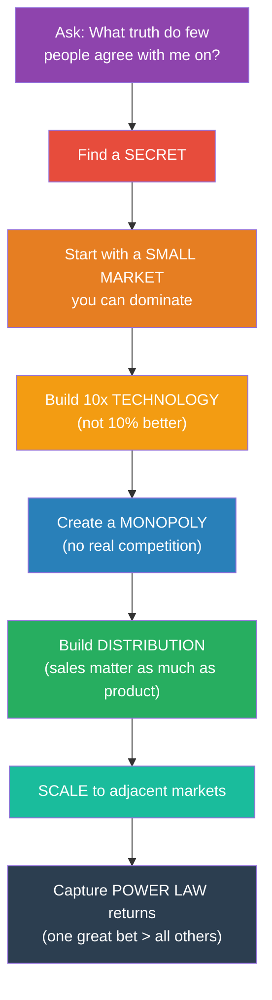

# Zero to One — Peter Thiel

> Peter Thiel's contrarian thesis: the next great company won't come from copying Facebook or Google — it will come from doing something no one has done before. That's going from zero to one. Copying what works is going from one to n. The first creates a monopoly; the second creates competition. And competition, Thiel argues, is for losers.
> Based on notes from Thiel's Stanford lecture series on startups, the book is a manifesto for contrarian thinking — for finding and acting on truths that most people don't believe, and for building businesses so good that they have no meaningful competition.
> It is the most intellectually ambitious startup book ever written, because it's not really about startups. It's about how progress happens.

---

## About the Author

Peter Thiel is a co-founder of PayPal, the first outside investor in Facebook ($500,000 for 10.2% — which became worth over $1 billion), and a co-founder of Palantir Technologies.
He is a partner at Founders Fund, a venture capital firm that has invested in SpaceX, Airbnb, Stripe, and dozens of other companies.
Before tech, Thiel studied philosophy at Stanford and law at Stanford Law School. He clerked for a federal judge and briefly worked at a New York law firm before leaving to start a hedge fund.

This book originated from a course he taught at Stanford in 2012, where student Blake Masters took detailed notes that went viral online. The notes were so popular that they became the skeleton of the book. The ideas predate the course — they represent Thiel's accumulated thinking over two decades about innovation, technology, and the nature of progress.

Thiel is a deeply contrarian thinker. He supported Donald Trump in 2016, advocates for seasteading (building new countries on the ocean), and has funded research into life extension. His contrarianism is not performative — it is core to his worldview and to this book's argument.

> [!example] Thiel's Contrarianism in Action
> In 2004, when Thiel made his $500,000 investment in Facebook, the conventional wisdom was that social networks were a fad (MySpace was already peaking and Friendster was dead). Most investors passed on Facebook. Thiel saw a secret: Facebook's college-by-college expansion strategy created genuine network effects — unlike MySpace's open model, Facebook's closed system created density and real identity. His $500,000 became over $1 billion. The contrarian bet paid because it was not merely contrarian — it was correct.

### Thiel's Intellectual Influences

Understanding Thiel's philosophical background illuminates the book's deeper arguments:

- **René Girard** (Stanford) — Thiel's most important intellectual influence. Girard's theory of mimetic desire — that we want things because others want them — underpins Thiel's argument that competition is destructive and imitative.
- **Leo Strauss** — The political philosopher's emphasis on "esoteric" truth (hidden truths that differ from public consensus) maps directly to Thiel's concept of secrets.
- **Ayn Rand** — Rand's celebration of the individual creator influenced Thiel's focus on founders and his distrust of committees and consensus.
- **J.R.R. Tolkien** — Thiel named Palantir after the seeing-stones in *The Lord of the Rings*. His fascination with fantasy reflects his belief that the future should be qualitatively different from the present — not an incremental extension of it.

> [!tip] The Contrarian Question — And How to Answer It
> Thiel's favourite interview question is: "What important truth do very few people agree with you on?"
>
> **Bad answers:**
> - "Education is broken" (most people agree with this — it's consensus, not contrarian)
> - "God doesn't exist" (controversial but not commercially actionable)
> - "The government is corrupt" (populist, not insightful)
>
> **Good answers take this form:** "Most people believe X, but the truth is the opposite of X."
> - "Most people think competition makes companies better. The truth is that competition makes companies worse." (Thiel's own answer)
> - "Most people think you need a degree to have a career. The truth is that the degree is increasingly irrelevant."
> - "Most people think remote work reduces productivity. The truth is that it increases it for most knowledge workers."
>
> The answer must be (a) genuinely unpopular, (b) actually true, and (c) actionable. If it meets all three criteria, you may have found a secret worth building on.

---

## The 30-Second Version

1. **Progress comes from creating new things** (0 to 1), not copying existing things (1 to n)
2. **Competition is for losers.** Monopolies drive both profits and innovation.
3. **Every great business is built on a secret** — an important truth most people don't know or don't believe
4. **The power law rules everything.** A small number of things produce the vast majority of results.
5. **Definite optimism** — having a specific plan for a better future — is what built the modern world
6. **Start with a small market you can dominate**, then expand. Don't start with a big market you can't win.
7. **Sales and distribution matter as much as product.** If you can't deliver it, it doesn't exist.

---

## The Big Idea

- <b style="color: #2980b9">Going from 0 to 1</b> = creating something entirely new (technology, vertical progress)
- Going from 1 to n = copying what already works (globalisation, horizontal progress)
- <b style="color: #27ae60">Every great company is built on a secret — an important truth that most people don't agree with</b>
- The contrarian question: "What important truth do very few people agree with you on?"

The distinction between 0 to 1 and 1 to n is the most important framework in the book. Thiel argues that globalisation (spreading existing solutions to more places) and technology (creating new solutions) are fundamentally different kinds of progress — and that technology is the one that matters more.

- **Globalisation without technology** is unsustainable. If every person in China consumes as much oil as every American, the planet collapses before it can be copied.
- **Technology without globalisation** is fine. One breakthrough — cheap solar energy, desalination, nuclear fusion — can change the game for everyone.
- <b style="color: #e74c3c">The world needs more people creating the future (0 to 1), not more people copying the present (1 to n).</b>

> [!example] 0 to 1 vs 1 to n in Practice
> - The typewriter → the word processor → the internet = 0 to 1 (each was fundamentally new)
> - Opening the 1,000th Starbucks in a new city = 1 to n (copying what works)
> - The first smartphone = 0 to 1
> - The 50th smartphone manufacturer entering the market = 1 to n
>
> Thiel's argument: the world rewards 0-to-1 innovation disproportionately — because it creates monopolies. 1-to-n competition, by definition, creates commodities.

### The PayPal Origin Story

Thiel illustrates his thesis with PayPal's own history. Before PayPal, sending money online was either impossible or required a bank wire (slow, expensive, requires a relationship). PayPal created something that did not exist: instant, free, peer-to-peer digital payments. That was going from 0 to 1.

After PayPal proved the model worked, dozens of competitors emerged: Google Wallet, Venmo, Square, Stripe. These were all 1 to n — variations on a proven concept. The 0-to-1 company captured the monopoly and defined the category. The 1-to-n companies competed for what was left.



### Why Most People Go from 1 to n

Going from 0 to 1 is frightening. It means believing something that most people think is wrong. It means investing time and money into something that has no proof of concept. It means being contrarian — and being contrarian feels lonely and risky.

Going from 1 to n is comfortable. Someone else has already proven the concept. The market exists. The demand is visible. You just need to execute better, cheaper, or faster.

- <b style="color: #2980b9">The paradox: going from 1 to n feels safer but IS riskier, because you're competing against everyone else who also chose the safe path. Going from 0 to 1 feels riskier but IS safer, because if you're right, you have no competition.</b>

> [!danger] The Crowd Is Dangerous
> Thiel quotes Ralph Waldo Emerson: "Every great man is a nonconformist." The crowd is not always wrong — but when it IS wrong, the losses are catastrophic because everyone is making the same mistake simultaneously. The dot-com crash, the 2008 financial crisis, and every market bubble in history were caused by 1-to-n thinking: everyone copying what everyone else was doing, driving up valuations until reality intervened.

---

## Key Concepts at a Glance

| Concept | One-line summary |
|---------|-----------------|
| **0 to 1 vs 1 to n** | Creating new things vs copying existing things |
| **The Contrarian Question** | "What important truth do very few people agree with you on?" |
| **Competition Is for Losers** | Monopolies drive profits and progress; competition destroys both |
| **The Power Law** | A small number of companies produce the vast majority of returns |
| **Definite Optimism** | Having a specific plan for a better future — not just vague hope |
| **Secrets** | Important truths not yet widely known — every great business is built on one |
| **Last Mover Advantage** | It's better to be the last great development in a market than the first |
| **The Seven Questions** | Every business must answer: engineering, timing, monopoly, people, distribution, durability, secret |
| **Man and Machine** | The best technology complements humans rather than replacing them |
| **The Founder's Paradox** | Great founders are simultaneously insiders and outsiders — their eccentricity is their edge |
| **Stagnation Thesis** | Technology has stagnated outside of computers since the 1970s |

---

## Competition Is for Losers

This is Thiel's most provocative argument, and it's the chapter that makes MBA students uncomfortable.

### The Competition Myth

Business schools teach that competition is healthy — it keeps companies sharp, drives innovation, and benefits consumers. Thiel says this is mostly wrong:

- <b style="color: #e74c3c">Competition and capitalism are opposites.</b> Under perfect competition, no firm makes economic profit — it all gets competed away.
- Monopolies (Google, Facebook at their peak) generate massive profits because they are so much better than the alternative that no one else comes close
- Monopolists downplay their monopoly status ("We're competing in a huge market!"); competitors exaggerate their uniqueness ("We're the only one doing X!")

> [!example] Google vs Airlines
> Google captures about 21% of search revenue as profit. US airlines, despite generating far more revenue, operate on margins of about 0.2%. Google is a monopoly (over 90% of search). Airlines are in brutal competition. The result: Google is one of the most profitable companies in history. Airlines collectively barely break even. Competition destroys profits. Monopoly creates them.

### The Four Characteristics of a Monopoly

1. **Proprietary Technology** — At least 10x better than the next alternative
2. **Network Effects** — The product gets more valuable as more people use it
3. **Economies of Scale** — Marginal cost of one more customer approaches zero
4. **Branding** — Earned by product quality, not manufactured by marketing



### How to Build a Monopoly: Start Small, Dominate, Expand

- <b style="color: #27ae60">Start with a very small market you can dominate completely</b>
- Amazon started with books online — not "e-commerce." Facebook started at Harvard — not "social networking."
- Once you dominate the small market, expand to adjacent markets

> [!warning] The Big Market Trap
> "We're targeting a $50 billion market" sounds impressive in a pitch deck. Thiel says it's actually a red flag. If the market is that big and you're entering it, you're competing against established players. Better: "We're targeting a $10 million niche that nobody else is serving, and we're going to capture 80% of it."

### The Monopoly Playbook

Thiel outlines a four-step sequence for building a monopoly:

1. **Start with a niche.** Find a small market with unserved or underserved needs. PayPal started with eBay power sellers — a tiny market with a desperate need (they had no way to accept credit card payments).

2. **Dominate it.** Capture 50–80% of that small market. Be so much better than the alternative that switching is unthinkable.

3. **Scale up.** Expand to adjacent markets one at a time. Amazon went from books to CDs to electronics to everything. Each expansion was a new market where their logistics and customer base gave them an advantage.

4. **Don't disrupt.** Thiel is sceptical of "disruption" — a word that draws attention and invites retaliation. Better to build quietly in a niche that incumbents don't notice or don't care about. By the time they notice, you own the market.

> [!example] Amazon's Monopoly Sequence
> 1. **Niche:** Online bookstore (1994). Small market. Clear need (bookstores had limited selection). Amazon dominated by offering every book in print.
> 2. **Dominate:** By 2000, Amazon owned online book sales. No competitor came close.
> 3. **Scale:** Expanded to CDs, DVDs, electronics, clothing — using the same logistics infrastructure.
> 4. **Moat:** By 2010, Amazon had network effects (sellers and buyers reinforce each other), economies of scale (massive fulfilment centres), and proprietary technology (recommendation engine, AWS). Attempting to compete with Amazon in e-commerce is nearly impossible.

### The Last Mover Advantage

Thiel makes a counterintuitive claim: it's better to be the last significant company to enter a market than the first.

- First movers get attention but often get the model wrong. Friendster preceded Facebook. Alta Vista preceded Google. Palm preceded iPhone.
- <b style="color: #2980b9">The last mover studies what the first movers got wrong, builds something dramatically better, and captures the market permanently.</b>
- The goal is not to be first — it is to be so good that no one needs to come after you.

| | Monopoly | Competition |
|--|---------|------------|
| **Profits** | High and sustainable | Competed away to zero |
| **Innovation** | Has resources and incentive to innovate | Too busy surviving to innovate |
| **PR story** | "We're in a huge competitive market" (to avoid regulation) | "We're totally unique" (to attract investors) |
| **Reality** | So good that no substitute exists | Interchangeable with rivals |

---

## Competition and Mimetic Desire

Thiel draws on the philosophy of René Girard — his professor at Stanford — to explain why competition is so seductive despite being destructive.

### Girard's Mimetic Theory

Girard argued that humans are fundamentally imitative: we want things because other people want them, not because we independently value them. This creates a cycle of escalating competition:

1. You see someone succeeding in investment banking → you want to be an investment banker
2. You enter the field → now you're competing with everyone else who imitated the same desire
3. The competition intensifies → you work harder for diminishing returns
4. By the time you "win" (if you ever do), you've spent years pursuing a goal you never independently chose

- <b style="color: #e74c3c">Thiel calls this "mimetic competition" — the most insidious form of 1-to-n thinking. You are not building something new. You are fighting over something old because everyone else wants it.</b>

> [!danger] The Ivy League Trap
> Thiel's most provocative application of mimetic theory is to elite education. Students at Harvard and Stanford compete fiercely for the same consulting and banking jobs — not because they independently value those careers, but because their peers value them. The most talented people in the world end up in the most competitive fields, destroying each other's margins, instead of creating something new. The 0-to-1 opportunity is to step outside the competition entirely and build in a space nobody else is looking at.

### Competition as Self-Destruction

Thiel argues that competition is not just unprofitable — it is psychologically destructive.

- In competitive markets, companies become obsessed with each other rather than with creating value
- Microsoft and Google spent years fighting over search, browsers, and office suites — distracting both from bigger opportunities
- <b style="color: #27ae60">Competition narrows your vision. Monopoly expands it. When you have no competitors, you can focus entirely on creating value instead of capturing it.</b>

---

## Secrets

Every great business is built on a secret — an important truth that most people don't know or don't believe.

### Types of Truths

| Type | Definition | Example |
|------|-----------|---------|
| **Conventions** | Things most people know and agree on | "The earth orbits the sun" |
| **Mysteries** | Things that may be unknowable | "Is there a God?" |
| **Secrets** | Important truths that CAN be known but AREN'T widely known | "Ride-sharing could replace car ownership" (Uber's secret in 2009) |

- <b style="color: #2980b9">The existence of secrets means the world still has hidden truths waiting to be discovered</b>
- Most people have stopped looking — they believe everything important has already been found
- <b style="color: #e74c3c">The best business opportunities are in areas where most people think there's nothing left to find</b>

> [!example] Airbnb's Secret
> In 2008, the secret behind Airbnb was: "People will rent their spare rooms to strangers, and strangers will pay to stay in them." This sounds obvious now. At the time, virtually everyone thought it was absurd. The founders saw a truth that most people denied. That gap between truth and consensus is where monopoly-building opportunity lives.

> [!danger] What Happens When Secrets Die
> Societies that stop believing in secrets stagnate. If there are no more secrets, there is no reason to explore, no reason to start new companies, and no reason to challenge the status quo. The belief in secrets is what drives progress.

### How to Find Secrets

Thiel offers practical advice for discovering secrets:

1. **Look where others aren't looking.** The most valuable secrets are in areas that most people consider boring, solved, or impossible. If everyone is excited about a field, the easy secrets have already been found.

2. **Ask: "What are people not allowed to talk about?"** Social taboos often protect secrets. If an important question cannot be asked publicly — because it's politically incorrect, professionally risky, or culturally taboo — there is probably a secret hidden underneath it.

3. **Look for overlooked industries.** The technology industry attracts the most talent and investment. Other industries — agriculture, construction, education, government — are often decades behind in technology adoption. The secrets hiding in these industries are easier to find because fewer people are looking.

4. **Study what's considered "natural" or "inevitable."** When people say "that's just how things are," they are often protecting a convention, not describing a truth. The convention is an agreement masquerading as a fact — and behind it, there may be a secret.

> [!example] Uber's Secret in Three Steps
> 1. **Look where others aren't:** Transportation was considered a "solved" industry. Taxi companies existed. What was there to discover?
> 2. **Find the overlooked truth:** Millions of people had cars they weren't using most of the time. Millions of other people needed rides and couldn't get them efficiently. GPS and smartphones had just made real-time matching possible.
> 3. **Act on it:** Uber connected idle car capacity with unmet demand through a smartphone app. The secret was not complex. It was hiding in plain sight — in an industry nobody in Silicon Valley was looking at.

### Natural Secrets vs Human Secrets

Thiel distinguishes between two types of secrets:

| Type | Definition | Where to Look | Example |
|------|-----------|---------------|---------|
| **Natural secrets** | Undiscovered truths about the physical world | Science, biology, physics, chemistry | CRISPR gene editing was a natural secret about how bacteria defend against viruses |
| **Human secrets** | Undiscovered truths about people and organisations | Psychology, economics, culture, institutions | "People will rent their homes to strangers" (Airbnb) was a human secret |

- <b style="color: #2980b9">Human secrets are often easier to find because they require social insight, not laboratory equipment. They are also more commercially valuable because they can be acted on immediately.</b>

### The Secret-Keeping Problem

Once you find a secret, who do you tell? Thiel's answer: as few people as possible, for as long as possible.

- A secret shared widely ceases to be a secret — and ceases to be a competitive advantage
- Tell only the people who need to know: your co-founders and your core team
- The company itself is the mechanism for exploiting the secret: you build a monopoly around it before the rest of the world catches on

> [!warning] The Timing Window
> Every secret has a timing window. Share it too early and competitors copy you before you've built a moat. Share it too late and someone else discovers it independently. The art of entrepreneurship is finding the right moment to act on a secret: early enough to have first-mover advantage, late enough that the technology exists to execute.

---

## Apply Zero to One to Your Life

### The Personal Contrarian Audit

| Question | Your Answer |
|----------|-----------|
| What important truth do very few people agree with me on? | |
| Where am I competing in a 1-to-n market? | |
| Where could I build something 0-to-1 instead? | |
| What is my personal "secret" — a truth I see that others don't? | |
| Am I being a definite optimist (with a specific plan) or an indefinite optimist (hoping it works out)? | |
| Where in my life does the power law apply? What is the ONE thing that matters most? | |
| Am I building monopoly-level skill in anything? Or am I competing generically? | |

### The Power Law Applied to Decisions

Most of your decisions don't matter. A few matter enormously. Thiel's power law says:

- **Career:** One career bet will define your trajectory more than all other decisions combined. Choose that bet deliberately.
- **Relationships:** One or two relationships will shape your life more than all others. Invest in those.
- **Learning:** One deep skill will produce more career value than ten shallow ones. Choose what to master.
- **Projects:** One project at your company probably matters 100x more than everything else. Find it. Work on it.

> [!tip] The 10x Question for Every Decision
> Before making any significant commitment — a job, a project, a partnership — ask: "Could this be 10x better than the alternative? Or is it merely incrementally better?" If it's incremental, you're going from 1 to n. If it's 10x, you might be going from 0 to 1. Only the latter produces monopoly-level returns.

---

## The Power Law

In venture capital, the single best investment in a fund outperforms all others combined. This pattern repeats everywhere: a few things matter enormously, most matter hardly at all.

- <b style="color: #2980b9">Implication: don't diversify your life. Find the one thing where you have a unique advantage and concentrate everything on it.</b>

### The Power Law in Venture Capital

Thiel provides the data from his own experience at Founders Fund:

- Facebook alone returned more than every other investment in the fund combined
- The second-best investment returned more than every other investment (except Facebook) combined
- The third-best investment returned more than #4 through the last

This is not an anomaly — it is the defining pattern of venture capital. The industry's entire return comes from a tiny number of massive winners. Everything else is effectively a loss.

> [!example] The Implications for Investment
> A traditional investor diversifies to reduce risk. A power-law investor concentrates to capture upside. Thiel argues that the venture capital model — make many bets, expect most to fail, rely on a few massive winners — is the correct framework for anyone making asymmetric bets (where the upside is much larger than the downside).

### The Power Law in Life

| Domain | Power Law Implication |
|--------|---------------------|
| **Career** | One career decision matters more than all others combined |
| **Relationships** | A few relationships produce the vast majority of your happiness |
| **Skills** | One exceptional skill is worth more than ten mediocre ones |
| **Markets** | One dominant position is worth more than ten competitive ones |
| **Time** | A few hours of deep work produce more value than 40 hours of shallow work |
| **Habits** | One keystone habit (exercise, sleep, reading) cascades into dozens of improvements |
| **Ideas** | One insight that changes your worldview is worth more than 100 facts |

> [!tip] The Power Law Test
> Ask: "Am I the best in the world at something that matters?" If not: "Is what I'm doing likely to make me the best?" If the answer is still no, you're operating in a competitive market where the power law will never work in your favour.

### The Anti-Diversification Argument

Conventional career advice says: diversify your skills, build a broad network, keep your options open. Thiel says the opposite:

- <b style="color: #e74c3c">Diversification is a hedge against ignorance. If you knew which bet was going to win, you'd put everything on it.</b>
- The people who change the world — Jobs, Musk, Bezos — did not diversify. They bet everything on one vision.
- For most people, the practical version of this is: instead of being mediocre at five things, become world-class at one thing. Let the power law work in your favour.

> [!warning] The Nuance
> Thiel's anti-diversification argument applies to professional focus, not to financial planning. You should absolutely diversify your investment portfolio. But you should NOT diversify your career. In your career, the power law says: find the ONE thing where you can be exceptional, and pour everything into it.

---

## Definite vs Indefinite Thinking

| | Optimistic | Pessimistic |
|--|-----------|------------|
| **Definite** | USA 1950s-60s: big plans, moon landings, infrastructure | China today: copies what works, plans for known future |
| **Indefinite** | USA today: "things will get better somehow" but no specific plan | Europe today: vague decline, no plan |

- Thiel argues that <b style="color: #e74c3c">indefinite optimism</b> — the belief that the future will be better without any specific plan for making it so — is the dominant mindset today and it is a disaster
- <b style="color: #27ae60">Definite optimism</b> — having a concrete vision and plan — is what built the modern world and what will build the next one
- Finance, consulting, and law are prestigious because they are indefinite: they let you keep options open without building anything specific

> [!warning] The Indefinite Trap
> "I'll go to a good school, get a good job, and things will work out" is indefinite optimism in personal form. It produces comfortable lives but not extraordinary ones. People who change the world start with a definite vision.

### The Four Quadrants in History

Thiel provides rich historical examples for each quadrant:

**Definite Optimism (USA 1950s–1960s):** Americans believed in specific plans for a better future and built them. The Interstate Highway System, the Apollo programme, the Golden Gate Bridge, the Hoover Dam. Engineers and visionaries drew blueprints and then constructed what they imagined. Robert Moses reshaped New York. NASA put men on the moon. The question was not "will the future be better?" but "what specifically will we build?"

**Indefinite Optimism (USA today):** Americans still believe the future will be better — but nobody has a plan for making it so. Instead of engineers, the economy is run by financiers, consultants, and lawyers — people who rearrange what already exists rather than creating anything new. The dominant career strategy is optionality: keep your options open, don't commit, diversify. <b style="color: #e74c3c">The result is a society that expects progress without doing the work of progress.</b>

> [!example] The Optionality Trap
> A Stanford graduate who gets a finance degree, works at McKinsey, goes to law school, and then joins a VC firm has kept their options open for 15 years — and built nothing. They have accumulated credentials, not capabilities. They can evaluate what others build, but they cannot build anything themselves. Thiel sees this as the tragedy of indefinite thinking: an entire generation of talented people trained to be critics rather than creators.

**Definite Pessimism (China today):** China believes the future is knowable and plans accordingly — but the plans are copies. Build the factories. Copy the technology. Industrialise. The Chinese approach is extremely effective at catching up to the frontier — but it cannot create the frontier. That requires going from 0 to 1, which requires definite optimism.

**Indefinite Pessimism (Europe today):** Europe expects decline and has no plan to reverse it. The default response is regulation: if you can't build a better future, at least prevent the present from getting worse. This produces managed decline — comfortable but stagnant.

```mermaid
quadrantChart
    title Definite vs Indefinite x Optimistic vs Pessimistic
    x-axis Pessimistic --> Optimistic
    y-axis Indefinite --> Definite
    quadrant-1 Definite Optimism (Build the future)
    quadrant-2 Definite Pessimism (Copy and catch up)
    quadrant-3 Indefinite Pessimism (Managed decline)
    quadrant-4 Indefinite Optimism (Hope without plans)
```

---

## Man and Machine: The Technology Chapter

One of the most prescient chapters in the book — written in 2014, before the current AI revolution — addresses the relationship between humans and technology.

### Substitution vs Complementarity

Thiel argues that the popular fear — "robots will replace us" — misunderstands how technology works. The best technology doesn't replace humans; it complements them.

- Computers are good at processing vast amounts of data but bad at making judgments
- Humans are good at making judgments but bad at processing vast amounts of data
- <b style="color: #27ae60">The most valuable companies combine human judgment with machine processing — they don't replace one with the other</b>

| Task | Computers Are Better | Humans Are Better |
|------|---------------------|------------------|
| Processing millions of data points | Yes | No |
| Pattern recognition in structured data | Yes | No |
| Moral judgment | No | Yes |
| Creative problem-solving | No | Yes |
| Understanding context and nuance | No | Yes |
| Empathy and persuasion | No | Yes |

> [!tip] The Complementarity Principle for Your Career
> Instead of asking "will AI replace my job?", ask "how can I combine my human judgment with AI's processing power to do something neither could do alone?" The people who thrive in a technology-rich world are not the ones who compete with machines — they are the ones who find ways to work alongside them.

### PayPal's Fraud Detection as a Case Study

Thiel tells the story of PayPal's early fraud problem. Automated systems alone couldn't catch sophisticated fraudsters — the patterns were too novel. Human reviewers alone were too slow — millions of transactions per day. PayPal's breakthrough was combining both: the algorithm flagged suspicious transactions, and humans made the final judgment. This hybrid approach was more effective than either approach alone.

- <b style="color: #2980b9">The lesson: don't ask "human or machine?" Ask "human AND machine — doing what each does best."</b>

---

## The PayPal Mafia: A Case Study in Founder Networks

Thiel devotes attention to the extraordinary network of founders who came out of PayPal — the so-called "PayPal Mafia." After PayPal was sold to eBay in 2002, its alumni went on to found or lead:

- **Tesla and SpaceX** (Elon Musk)
- **LinkedIn** (Reid Hoffman)
- **YouTube** (Steve Chen, Chad Hurley, Jawed Karim)
- **Yelp** (Jeremy Stoppelman, Russel Simmons)
- **Palantir** (Peter Thiel)
- **Yammer** (David Sacks)
- **Founders Fund** (Peter Thiel, Ken Howery, Luke Nosek)

This is not coincidence. Thiel argues that PayPal's founding culture — contrarian, technical, ambitious — attracted people with 0-to-1 mindsets. When the company ended, those people carried that mindset into new ventures.

> [!success] The Founder Network Effect
> The lesson for career strategy: the people you work with early in your career matter enormously. Join a company with exceptional people, and you'll absorb their thinking, ambition, and network. The PayPal alumni didn't succeed because they learned how to build payment systems. They succeeded because they learned how to think about building from scratch — and they did it alongside other people who thought the same way.

---

## Contrarian Thinking Applied to Your Career

Thiel's framework is not just for startup founders. The core ideas apply to anyone making career decisions.

### The Contrarian Career Question

"What career move do very few people think is valuable — but that I believe is correct?"

| Conventional Wisdom | Contrarian Alternative | Thiel's Logic |
|--------------------|----------------------|--------------|
| "Get an MBA for career advancement" | Build something instead of studying how to | MBAs are indefinite optimism — credentials without creation |
| "Join a prestigious company" | Join a small company where you'll have outsized impact | Power law: your contribution at a startup matters 100x more |
| "Diversify your skills" | Go deep in one area until you're the best | Power law: one exceptional skill beats ten mediocre ones |
| "Network broadly" | Build deep relationships with a few exceptional people | The PayPal Mafia proves that a small, intense network beats a large, shallow one |
| "Follow the market" | Create a new market | 0 to 1 beats 1 to n in careers as well as companies |

### The Career Secret

Just as every great business is built on a secret, every exceptional career is built on one too:

- <b style="color: #2980b9">A "career secret" is a truth about what work is valuable that most people don't believe or don't act on</b>
- It might be: "Remote work will become the default" (secret in 2014, consensus by 2022)
- It might be: "Writing clearly is the most undervalued professional skill" (still a secret for most)
- It might be: "The most important thing I can do is become excellent at one hard thing, not decent at many easy things"

> [!tip] Finding Your Career Secret
> Ask yourself:
> 1. What do I believe about work that most of my peers don't?
> 2. What valuable skill is undervalued in my industry?
> 3. What emerging trend do most people dismiss but I think is real?
> 4. Where can I be 10x better than the alternative — not 10% better?
> The answer to any of these questions could be your career's "secret" — the foundation of an extraordinary professional life.

---

## The Thiel Contrarian Framework: A Complete System



---

## Before and After: Thinking With and Without Zero to One

### Before Zero to One

You want to start a business. You look at what's working — food delivery, SaaS, e-commerce — and try to build a slightly better version. You pitch investors: "We're like Uber, but for dog walking." You enter a crowded market. You compete on price and features. Your margins shrink. You work harder for less. After three years, you've built a "lifestyle business" that barely covers your salary. You wonder what went wrong.

### After Zero to One

You ask the contrarian question: "What important truth do very few people agree with me on?" You identify a secret — something you believe that others dismiss. You find a small market that nobody else is serving. You build technology that is 10x better than any alternative — not an incremental improvement, but a category-defining leap. You dominate that small market. You expand from there. Your monopoly generates the profits that fund further innovation. You have gone from 0 to 1.

---

## The Limitations

1. **Survivorship bias.** Thiel writes from the perspective of someone who succeeded spectacularly. His advice — "aim for monopoly," "find a secret," "go from 0 to 1" — sounds obvious in retrospect. But for every PayPal, there are thousands of contrarian bets that failed silently. The book doesn't adequately address what to do when your contrarian thesis is wrong.

2. **Monopoly is morally ambiguous.** Thiel frames monopoly as universally positive: monopolies innovate, compete leads to decline. But monopolies also raise prices, reduce consumer choice, and use market power to crush potential competitors. Google and Facebook are monopolies — and they have also faced legitimate antitrust concerns.

3. **Not all innovation is 0 to 1.** Incremental improvement (1 to n) has produced enormous value: better cars, better phones, better medical procedures. Thiel's framework devalues "1 to n" work, but most of the world's progress comes from steady improvement, not revolutionary leaps.

4. **The privilege of contrarianism.** It's easier to be contrarian when you're already wealthy. Thiel could afford to make unconventional bets because failure wouldn't bankrupt him. A first-generation college student taking on debt cannot afford the same risk profile.

5. **Light on execution.** The book tells you what to think about, not how to build. For the "how," pair with [[The Lean Startup - Eric Ries|The Lean Startup]] (which Thiel disagrees with but which provides tactical execution frameworks).

> [!warning] The Most Important Limitation
> Thiel's central claim — "competition is for losers" — is true at the extremes but dangerous as a general principle. Most people are not building billion-dollar companies. For most people, competition is not the enemy; complacency is. The useful takeaway is not "avoid all competition" but "don't compete on someone else's terms — find or create a field where you can be uniquely excellent."

---

## Founders and the Founding Moment

- <b style="color: #2980b9">The founding moment is like the constitutional convention of a country — decisions at the start determine everything that follows</b>
- Get the founding wrong — wrong co-founder, wrong equity split, wrong culture — and no execution can fix it
- Great founders are often contrarian, difficult, and eccentric — because creating something new requires disagreeing with the consensus

### Thiel's Rules for Founding

1. **Co-founders should have a pre-existing relationship** — Cold co-founder matches are like arranged marriages: they occasionally work, but the odds are against you. The best founding teams have a shared history that creates trust under pressure.

2. **Everyone should be full-time** — Part-time commitment produces part-time results. "I'll keep my day job and work on this nights and weekends" signals that you don't believe in the company enough to bet your livelihood on it.

3. **Keep the board small** — three to five people. Large boards don't govern; they perform oversight theatre. A small board can make decisions quickly. A large board debates everything and decides nothing.

4. **Equity over salary** in early stages — People paid high salaries will protect the status quo. People with equity will push for growth. Salary creates employees. Equity creates owners.

5. **CEO salary should be low** — If a CEO makes more than $150K in an early-stage startup, the company has a problem. A low CEO salary sets the standard: everyone is here for the mission, not the compensation.

### The Founder's Paradox

The book's final chapter addresses the paradox of founders: the very qualities that make someone capable of creating something from nothing — contrarianism, obsession, eccentricity, disregard for convention — are the qualities that make them difficult to work with and prone to spectacular self-destruction.

| Founder Quality | 0-to-1 Advantage | Risk |
|----------------|------------------|------|
| **Contrarianism** | Sees opportunities others miss | Can also miss real dangers others see |
| **Obsession** | Relentless focus on the vision | Inability to adapt when the vision is wrong |
| **Eccentricity** | Unique perspective that drives innovation | Alienates people; creates culture problems |
| **Conviction** | Persists when everyone says quit | Persists when everyone is right to say quit |
| **Risk tolerance** | Willing to bet everything | Sometimes loses everything |

> [!example] The Steve Jobs Paradox
> Jobs was fired from Apple in 1985 — the company he founded — because his intensity, perfectionism, and abrasive management style alienated the board. He was invited back in 1997 because Apple was dying without him. The same qualities that made him unbearable as a colleague made him irreplaceable as a visionary. The founder's paradox: the qualities that create great companies are often incompatible with running them smoothly.

Thiel argues that society needs to be more tolerant of eccentric founders — not because eccentricity is inherently good, but because <b style="color: #27ae60">the kind of person willing to go from 0 to 1 is, by definition, someone who disagrees with the majority. That disagreement will manifest as eccentricity, stubbornness, and difficulty. The cost of suppressing it is stagnation.</b>

---

## Culture and Team: The "Cult" Chapter

Thiel makes an intentionally provocative argument about startup culture: the best startups look like cults from the outside.

### Why Cults and Startups Share Traits

| Trait | Cult | Great Startup |
|-------|------|---------------|
| Intense shared belief | Belief in a leader's vision | Belief in a product/mission |
| Tight social bonds | Members spend all their time together | Team works, eats, and socialises together |
| Hostility to outsiders | "The world doesn't understand us" | "The market doesn't see what we see" |
| Missionary zeal | Convert the unbelievers | Convert the market |
| Rejection of conventional thinking | Reject mainstream society | Reject conventional business wisdom |

- <b style="color: #e74c3c">Thiel's point is not that startups should BE cults. It is that the intensity of shared belief required to create something from nothing looks cult-like from the outside — and that's okay.</b>
- The alternative — a team of mercenaries who are there for the paycheck — will never produce 0-to-1 innovation. Mercenaries leave when things get hard. True believers stay.

> [!warning] The Line Between Mission and Delusion
> The difference between a cult and a great startup is whether the shared belief is true. A cult believes something false with total conviction. A great startup believes something true — that the world has not yet recognised — with total conviction. The belief looks the same from the outside. The outcome is completely different.

### Hiring for Mission, Not Talent

Thiel's hiring philosophy follows from his culture thesis:

- Don't ask: "Who is the most talented person for this role?"
- Ask: "Who believes most deeply in what we're building?"
- <b style="color: #27ae60">The 20th talented person you interview will be good. The person who has been waiting for THIS company to exist will be extraordinary.</b>
- Every new hire should be able to answer: "Why do you want to work HERE, specifically, rather than anywhere else in the world?"

---

## The Hidden Chapter: Thiel's Philosophy of History

Running beneath the entire book is an implicit philosophy of history that Thiel never fully articulates but that shapes every argument.

Thiel believes:
1. **Progress is not automatic.** It requires specific people making specific decisions. Left to itself, the world stagnates.
2. **The Enlightenment was a 0-to-1 moment.** The scientific revolution, the industrial revolution, and the technology revolution were all produced by definite optimists who believed they could understand and improve the world.
3. **We are in danger of losing that spirit.** Indefinite thinking, excessive regulation, and risk aversion are producing a society that manages decline rather than creating progress.
4. **The antidote is founders.** People willing to believe something the world doesn't believe, build something the world hasn't seen, and persist when the world tells them to stop.

> [!tip] The Question Behind the Book
> *Zero to One* is ultimately asking one question: **Are we still capable of building the future?** Thiel's answer is yes — but only if we choose to. The future doesn't happen by default. It happens because specific people imagine specific things and build them. The book is a call to be one of those people.

---

## Sales and Distribution

> [!danger] The Hidden Variable
> "If you've invented something new but haven't invented an effective way to sell it, you have a bad business — no matter how good the product."

This chapter is one of the most practically important in the book — because it addresses the blind spot that kills more startups than bad products: the inability to sell.

### The Engineer's Fallacy

Thiel observes that engineers and technical founders systematically undervalue distribution. They believe in meritocracy: the best product wins. In reality, the best-distributed product wins.

- Google search was better than AltaVista's. But Google also had a better distribution strategy: it became the default search engine on Mozilla Firefox (paying $300M/year for the privilege).
- Facebook was a better social network than MySpace. But Facebook also had a better distribution strategy: it expanded university by university, creating FOMO-driven adoption.
- <b style="color: #e74c3c">A mediocre product with great distribution beats a great product with no distribution. Every time.</b>

### The Distribution Spectrum

| Customer Lifetime Value | Distribution Method | Example | Key Metric |
|------------------------|-------------------|---------|-----------|
| $1M+ | **CEO sales** (complex sales) | Enterprise software, government contracts, aerospace | Relationships and trust — the CEO personally closes deals |
| $10K–$100K | **Inside sales team** | SaaS products, B2B services | Sales cycle: weeks to months. Requires trained salespeople. |
| $1K–$10K | **Marketing + sales hybrid** | Mid-market software, professional services | Lead generation + sales qualification + closing |
| $100–$1K | **Marketing and advertising** | Consumer products, subscription services | Cost per acquisition must be lower than lifetime value |
| <$100 | **Viral distribution** | Social networks, messaging apps, tools | Product must have built-in sharing mechanism |

### The Dead Zone

Thiel identifies a "dead zone" in distribution: products that cost between $100 and $1,000 are often impossible to sell profitably. They're too expensive for viral adoption but too cheap to justify a sales team.

- <b style="color: #2980b9">Many otherwise good products fail because they fall in this dead zone. The product works, the customers exist, but there is no cost-effective way to reach them.</b>
- The solution is either to make the product cheap enough for viral distribution or expensive enough to justify direct sales.

### Why Salespeople Are Invisible

The best salespeople don't look like salespeople. They look like friends, advisors, or trusted partners.

- "Customers will never buy from someone who looks like a salesperson. Sales is about making the customer feel like the decision was theirs."
- <b style="color: #27ae60">The most effective distribution is invisible. When the product "sells itself," that is actually the most sophisticated sales engineering — you've embedded the selling mechanism into the product so deeply that customers don't notice it.</b>

> [!tip] The Distribution Test for Any Business
> Before building anything, answer these questions:
> 1. How will customers find out about this product?
> 2. How will they evaluate whether to buy?
> 3. What is the cost of acquiring one customer?
> 4. Is that cost lower than the customer's lifetime value?
> 5. Does the distribution method scale?
> If you can't answer all five clearly, you don't have a business. You have a product waiting to be ignored.

### Distribution in Practice: PayPal's Growth Hack

PayPal's early growth came from a counterintuitive strategy: paying customers to sign up. PayPal literally gave $10 to every new user and $10 for every referral. This cost $60–70 million — but it produced exponential growth and cemented PayPal as the dominant payment platform on eBay.

- The logic: customer acquisition cost ($20) was lower than the expected lifetime value of a PayPal user
- <b style="color: #e74c3c">This was not a marketing gimmick. It was a calculated distribution strategy that traded short-term cash for long-term monopoly.</b>
- By the time competitors arrived, PayPal's network effects were too strong to overcome

---

## The Seven Questions

Every business must answer these. If you can't answer at least five well, the business will fail:

1. **Engineering:** Can you create breakthrough technology, not just incremental improvement?
2. **Timing:** Is now the right time to start this?
3. **Monopoly:** Are you starting with a big share of a small market?
4. **People:** Do you have the right team?
5. **Distribution:** Can you actually deliver the product?
6. **Durability:** Will your market position be defensible in 10-20 years?
7. **Secret:** Have you identified a unique opportunity others haven't seen?

> [!example] The Clean Tech Bubble Through the Seven Questions
> Thiel uses the clean tech bubble of the 2000s as a cautionary tale. Most clean tech companies failed because they couldn't answer even one of the seven questions well. Their technology wasn't 10x better than fossil fuels (engineering). Their timing was off — natural gas became cheap (timing). They entered huge markets with no niche dominance (monopoly). They had MBAs instead of engineers (people). They couldn't sell (distribution). China's cheap solar panels undercut them (durability). And their "secret" was just the conventional wisdom that the world needs clean energy — which isn't a secret at all.

### Applying the Seven Questions to Any Business

| Question | What a GOOD Answer Looks Like | What a BAD Answer Looks Like |
|----------|------------------------------|------------------------------|
| **Engineering** | "Our product is 10x faster/cheaper/better than any alternative" | "We're 20% better than the competition" |
| **Timing** | "The technology just became possible and no one else has noticed" | "Everyone is doing this — we need to get in now" |
| **Monopoly** | "We own 80% of a $5M niche" | "We have 0.1% of a $100B market" |
| **People** | "Our team has built and sold companies in this domain" | "Our team is smart and passionate" (true of every startup) |
| **Distribution** | "We have a clear, scalable sales channel that costs less than customer lifetime value" | "We'll figure out sales later — the product speaks for itself" |
| **Durability** | "Network effects + proprietary tech + switching costs protect us for 20 years" | "We move fast" (that's not a moat) |
| **Secret** | "We know something others don't — and it's specific, testable, and defensible" | "The market is big and growing" (that's not a secret) |

---

## The Dot-Com Lessons: What Everyone Learned (and What They Should Have Learned)

Thiel devotes an important chapter to the lessons of the 1999 dot-com crash. He argues that the conventional lessons everyone took from the crash were the wrong ones.

### What Everyone Learned

After the crash, Silicon Valley collectively adopted four rules:
1. Make incremental advances (don't be too ambitious)
2. Stay lean and flexible (don't plan too far ahead)
3. Improve on the competition (don't create new markets)
4. Focus on product, not sales (if you build it, they will come)

### What Thiel Says They Should Have Learned

The opposite of every one of those lessons:
1. <b style="color: #e74c3c">It is better to risk boldness than triviality</b>
2. A bad plan is better than no plan
3. Competitive markets destroy profits
4. Sales matter just as much as product

> [!danger] The Anti-Lesson
> The dot-com crash traumatised a generation of entrepreneurs and investors. But Thiel argues that the crash was caused not by ambition but by ambition without substance — companies that had vision but no technology, plans but no execution. The lesson should have been "be ambitious AND rigorous," not "stop being ambitious."

---

## Technology and the Future of Progress

### The Stagnation Thesis

One of Thiel's most controversial claims: technology has stagnated since the 1970s. Outside of computers and the internet, he argues, the physical world has barely changed.

- "We wanted flying cars, instead we got 140 characters"
- The average American today flies no faster than in 1970 (the Concorde was retired, not replaced)
- Nuclear energy, which could have transformed the world, was abandoned after Three Mile Island
- Healthcare costs have skyrocketed while life expectancy gains have slowed
- <b style="color: #2980b9">Thiel's diagnosis: we have had enormous progress in bits (the digital world) and almost none in atoms (the physical world)</b>

> [!warning] The Dangerous Consensus
> Thiel believes the biggest danger is not failure but complacency — the collective belief that incremental improvement is all we can hope for. "Things are fine. They're getting a little better each year." This indefinite optimism prevents the bold, definite projects (space colonisation, nuclear fusion, radical life extension, ocean cities) that could transform human civilisation. The world needs more 0-to-1 thinking, not more 1-to-n execution.

### The Singularity Question

The book's final chapter asks: will we create an AI that surpasses human intelligence? Thiel doesn't predict the singularity, but he frames the question in characteristically contrarian terms:

- Most people either deny the possibility (too science-fiction) or fear it (Terminator scenarios)
- Thiel's position: the question is not whether strong AI is possible, but whether we'll create it in time to solve the civilisational problems we face
- <b style="color: #27ae60">The real risk is not that machines become too smart. It is that humans become too complacent to build anything truly new.</b>

---

## Zero to One Applied: The Ideas in Action

### For a Job Seeker

| Conventional Approach | Zero-to-One Approach |
|----------------------|---------------------|
| Apply to 50 companies and hope | Identify one company where you can contribute 10x more than any other candidate |
| Optimise your resume for keywords | Find the company's secret problem and propose a solution in your cover letter |
| Network broadly at events | Build one deep relationship with someone at a company you believe in |
| "I'm a generalist" | "I'm the best in the world at the intersection of X and Y" |

### For a Team Leader

| Conventional Approach | Zero-to-One Approach |
|----------------------|---------------------|
| Hire from top schools | Hire people who believe in the mission, not the brand |
| Diversify your team's skills | Find people who are obsessively good at one thing |
| Set quarterly targets | Ask: "What is the one thing that, if we achieve it, makes everything else irrelevant?" |
| Benchmark against competitors | Ask: "What can we do that no competitor can?" |

### For a Product Builder

- Before building anything, answer the seven questions honestly
- If you can't answer at least five, stop and rethink
- <b style="color: #e74c3c">The most common failure mode is building something 10% better than what exists. That's not a company — that's a feature.</b>
- The goal is 10x — not 10x more features, but 10x more value for the customer

---

## The Thiel Worldview: Summary of Core Beliefs

| Belief | Implication |
|--------|------------|
| The future is not predetermined | We have agency to shape it — but only if we act with definite plans |
| Competition is destructive | Build monopolies through unique value, not incremental competition |
| Secrets still exist | The world has undiscovered truths waiting for contrarian thinkers |
| The power law governs everything | Focus on the ONE thing that matters most, not many things |
| Technology > globalisation | Creating new things (0 to 1) matters more than copying existing things (1 to n) |
| Founders matter | Great companies are born from the vision and obsession of specific individuals |
| Definite plans beat indefinite hope | Have a blueprint for the future, not just optimism |
| Talent is overvalued vs alignment | Hire for mission alignment and obsessive skill, not pedigree |
| Sales is as important as product | If you can't sell it, it doesn't exist |
| The biggest risk is not trying | Playing it safe — doing what everyone else does — is the riskiest strategy of all |

> [!success] The One Idea to Take Away
> If you take only one idea from *Zero to One*, take this: <b style="color: #27ae60">the most important question you can ask yourself — about your business, your career, your life — is "What important truth do very few people agree with me on?" Find that truth. Act on it. That is how you go from zero to one.</b>

---

## The Verdict

*Zero to One* is the most intellectually stimulating book on entrepreneurship and innovation available.
Thiel's contrarian framing — competition is bad, monopoly is good, secrets exist, definite plans beat indefinite hope — challenges nearly every assumption taught in business schools.

The book's weakness is that Thiel writes from the perspective of a billionaire investor, and some advice (like "aim for monopoly") is more applicable to venture-scale startups than to most businesses.
The book is also light on execution — it tells you what to think, not how to build.

But as a framework for thinking about where value comes from and how progress happens, it is unmatched. Even if you never start a company, the mental models — the power law, the contrarian question, the distinction between definite and indefinite thinking, the concept of secrets — are applicable to career decisions, project selection, and strategic thinking of any kind.

The book's deepest insight is not about business at all. It is about the nature of progress: <b style="color: #27ae60">the future won't get better by itself. Someone has to imagine something specific, believe it when nobody else does, and build it from nothing. That's what going from zero to one means.</b>

Every reader will disagree with something Thiel says — and that is part of the point. The book provokes you into examining your own assumptions, and the assumptions of the world around you. The ideas that make you most uncomfortable are probably the ones most worth sitting with. That is the contrarian mindset in action: truth often lives where discomfort is highest.

If you've been drifting — taking the safe path, following the crowd, optimising for optionality instead of commitment — this book is the alarm clock. It asks: What do you believe that nobody else believes? And what are you going to build with that belief?

If you don't have an answer, keep looking. The secret is out there. The world is waiting for someone to find it and build on it. The question is whether that someone will be you.

---

## Who Should Read This Book

| Reader | What They'll Get |
|--------|-----------------|
| **Aspiring founders** | A framework for thinking about what to build and why |
| **Investors** | Thiel's power law logic for evaluating startups |
| **Career strategists** | The contrarian question and power law applied to career decisions |
| **Anyone feeling stuck in competition** | Permission to stop competing and start creating |
| **Leaders and executives** | A vocabulary for discussing innovation vs incremental improvement |
| **Product managers** | The seven questions as a product-market fit checklist |
| **MBA students** | A direct challenge to everything business school teaches about competition |
| **Anyone who feels the world has stagnated** | Thiel's case that we've stopped building — and that we don't have to |

---

## The Book in One Diagram



---

## Related Reading

- [[The Effective Executive - Peter Drucker|The Effective Executive]] — Drucker's concentration principle applied to business strategy. Both authors agree: do fewer things, do them better.
- [[Antifragile - Nassim Nicholas Taleb|Antifragile]] — Taleb's barbell strategy echoes Thiel's power law thinking: most of your bets should be safe, but your upside bets should be asymmetric.
- [[The Lean Startup - Eric Ries|The Lean Startup]] — Thiel explicitly disagrees with the lean approach — he believes in bold plans, not iterative testing. Read both and decide.
- [[Essentialism - Greg McKeown|Essentialism]] — McKeown's "less but better" maps to Thiel's power law: focus your effort on the one thing that matters most.
- [[The Checklist Manifesto - Atul Gawande|The Checklist Manifesto]] — Thiel's seven questions are a startup checklist for avoiding category errors before you build.
- [[Seeking Wisdom - Peter Bevelin|Seeking Wisdom]] — Bevelin's mental models approach complements Thiel's framework: both are about having better cognitive tools for seeing what others miss.
- [[Thinking in Bets - Annie Duke|Thinking in Bets]] — Duke's probabilistic thinking pairs with Thiel's power law: most bets don't matter; a few matter enormously.
- [[7 Rules of Power - Jeffrey Pfeffer|7 Rules of Power]] — Pfeffer's contrarianism about organisational power parallels Thiel's contrarianism about markets: both argue that conventional wisdom is wrong about how the world actually works.
- [[The Culture Code - Daniel Coyle|The Culture Code]] — Coyle's insights on team culture pair with Thiel's emphasis on founding culture: the shared beliefs that make a startup function like a "cult" in the best sense.
- [[How to Win Friends and Influence People - Dale Carnegie|How to Win Friends and Influence People]] — Carnegie's interpersonal principles are the human side of Thiel's distribution argument: the best sales are invisible and relationship-driven.
- [[The Phoenix Project - Gene Kim|The Phoenix Project]] — Kim's DevOps principles show what happens when engineering teams go from 1 to n (copying processes) vs 0 to 1 (reimagining how software is delivered).
