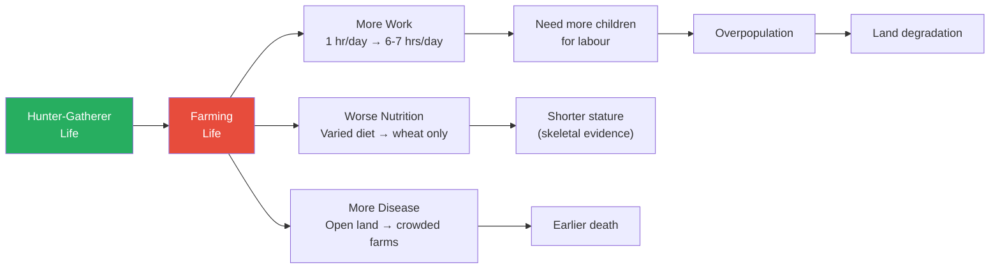
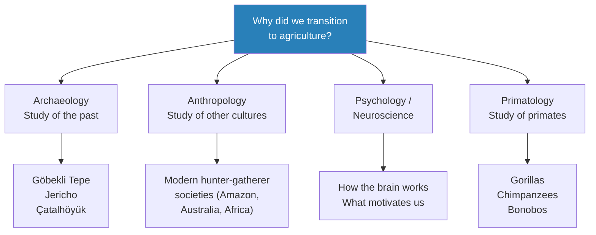
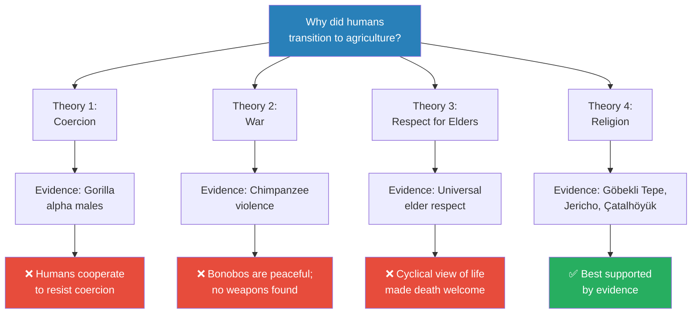
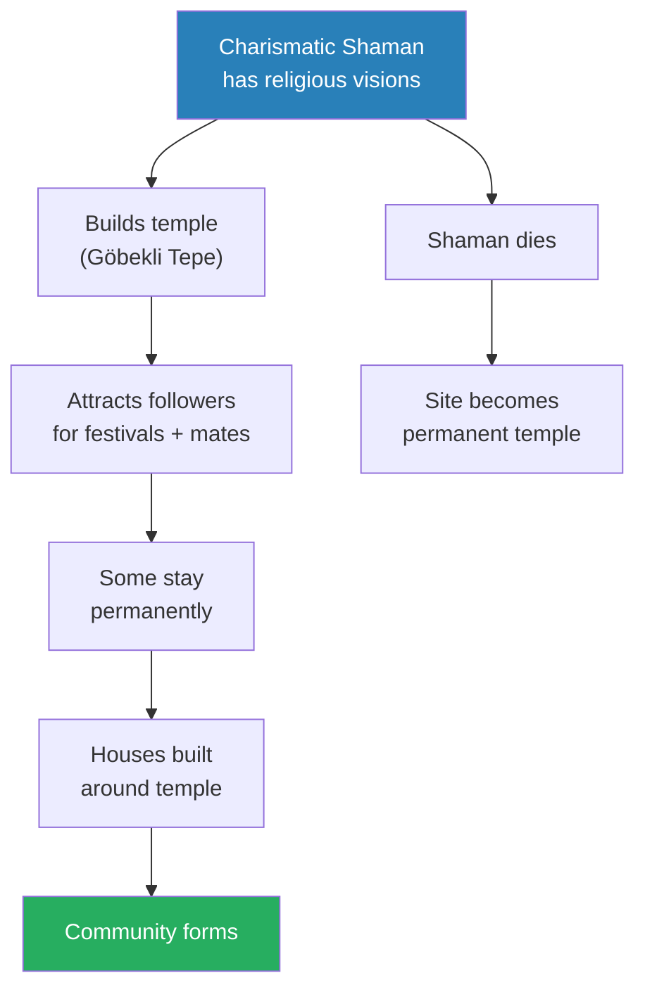
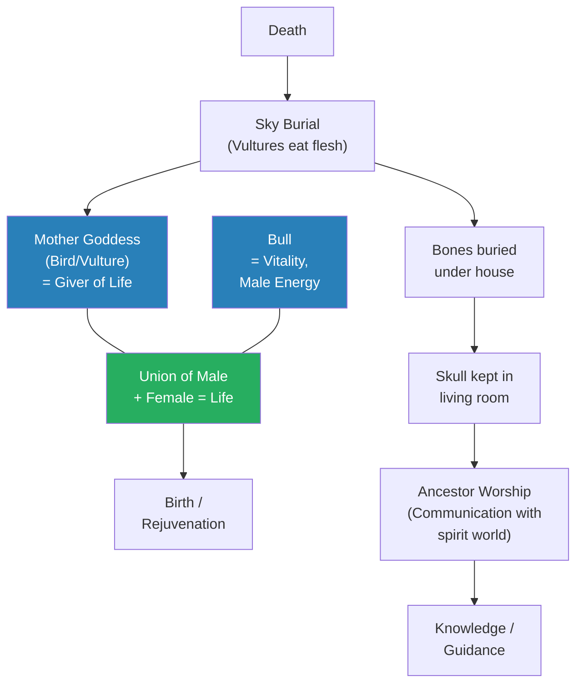
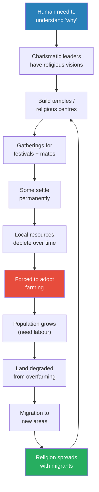

# Explaining Humanity's Transition to Agriculture

> Prof. Jiang opens the Civilization series with a deceptively simple question: why did humans switch from hunting and gathering to farming? The traditional story — agriculture enabled surplus, which enabled civilisation — turns out to have no evidence. In fact, farming made us shorter, sicker, and harder-working. After evaluating four competing theories, Prof. Jiang arrives at the scholarly consensus: religion, not material advantage, drove humanity to settle down. Three archaeological sites — Göbekli Tepe, Jericho, and Çatalhöyük — provide the evidence.

---

## The Question

*Why did humanity transition from hunter-gatherer society to agriculture — when that transition made life objectively worse?*

This is the foundational question of the entire Civilization series. The answer Prof. Jiang builds over this lecture — and returns to throughout the course — is that **religion, not rational self-interest, is the engine of civilisation**.

## Key Concepts at a Glance

| Concept | One-line summary |
|---------|-----------------|
| **Paradigm** | A story or model for understanding the world — the traditional one about agriculture is wrong |
| **Domestication (inverted)** | Wheat domesticated us, not the other way around — farming enslaved humans |
| **Charismatic leaders / Shamans** | Individuals with religious visions who attract followers and build communities |
| **Cult of the skull** | Ancestor worship through preserved skulls — communicating with the spirit world |
| **Sky burial** | Exposing dead bodies for vultures — tribute to the mother goddess at Çatalhöyük |
| **Cosmological alignment** | Temples designed to interact with celestial events — ancient "science" as religion |
| **Sedentary** | Staying in one place — achieved before farming, not because of it |

---

## The Traditional Story — and Why It's Wrong

*Prof. Jiang opens by presenting the textbook narrative everyone has heard, then systematically demolishes it.*

The standard paradigm goes like this:
- Hunter-gatherers lived in small groups of 20-50 people, roaming for food
- They discovered farming, which provided a stable, controllable food source (<b style="color: #2980b9">domestication</b>)
- Farming created <b style="color: #2980b9">surplus</b> — more food than needed
- Surplus enabled specialisation: leaders (politics), priests (religion), artists (culture)
- Villages grew into cities → literature, science, technology → modernity

<b style="color: #e74c3c">The problem: there is no evidence for this story.</b> The more evidence we collect, the more we realise the transition to agriculture was, in Prof. Jiang's words, "actually pretty stupid."

### Three Reasons Agriculture Made Life Worse

*Farming was objectively worse than hunting and gathering on every measurable dimension — work hours, nutrition, and mortality.*

- **More work:** Hunter-gatherers worked perhaps an hour a day — food was everywhere. Farmers worked 6-7 hours daily to grow their food
  - This creates a vicious cycle: more work → need more children as labour → overpopulation → land exhaustion
- **Worse nutrition:** Skeletal evidence shows hunter-gatherers were significantly taller than farmers
  - Hunter-gatherers had varied, protein-rich diets (meat, fruits, nuts, vegetables)
  - Farmers ate mainly wheat and limited vegetables — far less nutritious
- **Higher mortality:** Dense farming communities with livestock, waste, and poor sanitation bred disease
  - People living close together with animals were far more likely to contract disease and die young

> [!tip] Core Insight
> Yuval Harari's famous line from *Sapiens* captures the paradox perfectly: "We did not domesticate wheat. Wheat domesticated us." In nature, wheat has to work to attract animals. On a farm, wheat sits back while humans do all the work. Agriculture was a great deal for wheat — and a terrible deal for humans.

---

## How Do We Investigate What Happened?

*Since we can't go back in time, Prof. Jiang introduces four disciplines that provide evidence for constructing theories.*

*Four different fields of study each contribute evidence — but no single discipline can answer the question alone.*

- **Archaeology:** Digging up the past — houses, skeletons, clothing, temples. Three key sites: Göbekli Tepe, Jericho, Çatalhöyük
- **Anthropology:** Studying cultures that still live as hunter-gatherers (Amazon, Australia, Africa)
- **Psychology / Neuroscience:** Understanding human motivation, how brains work, why we behave as we do
- **Primatology:** Studying primates — gorillas, chimpanzees, and bonobos. Humans share 99% DNA with primates; their behaviour illuminates ours

---

## Four Theories — and Why Only One Survives

*Prof. Jiang presents four theories, systematically evaluates each against the evidence, and arrives at the scholarly consensus.*

*Prof. Jiang evaluates four theories — three are rejected based on counter-evidence, leaving religion as the consensus explanation.*

> [!abstract] Theory Evaluation: Why Did Humans Settle?
> | Theory | Source Discipline | Evidence For | Evidence Against | Verdict |
> |--------|------------------|-------------|-----------------|---------|
> | **Coercion** | Primatology (gorillas) | Alpha males dominate through size | Humans cooperate to resist; can flee | ❌ Rejected |
> | **War** | Primatology (chimps) | Chimpanzees are violent and territorial | Bonobos (closer relatives) are peaceful; no weapons found | ❌ Rejected |
> | **Respect for Elders** | Anthropology | Every culture respects elders | Cyclical view of life — death not feared | ❌ Rejected |
> | **Religion** | Archaeology | Three major sites show religion preceding settlement | None currently | ✅ Consensus |

### Theory 1: Coercion — An Elite Forced Everyone Else to Work

- Gorilla alpha males are physically enormous — they dominate through size, get all food and mates
- <b style="color: #e74c3c">Problem with humans:</b> physical size differences are small compared to gorillas
  - If a nine-foot giant walked into a room and said "I'm your boss," people could cooperate:
  - Make weapons, set traps, poison food, trick him, or simply run away
  - Human brains enable collective resistance — coercion among humans is "very, very hard to do"

### Theory 2: War — Farming Provided Defensive Advantages

- Chimpanzees are naturally violent — always fighting each other
- Settled farms allow walls, fortifications, ability to see enemies coming
- <b style="color: #e74c3c">Two problems:</b>
  - Bonobos, who are actually genetically closer to humans than chimpanzees, are peaceful — no evidence humans are naturally violent
  - Archaeology finds no weapons from early humans; violence found is intra-group (human sacrifice, group burials), not inter-group warfare

### Theory 3: Respect for Elders — Settling Down to Care for the Old

- Every human culture respects its elders (anthropological evidence)
- Nomadic life is hard on old people — settling down helps them survive
- <b style="color: #e74c3c">Problem:</b> early humans held a <b style="color: #2980b9">cyclical view of life</b>
  - Just as seasons cycle (summer → fall → winter → spring → summer), so does human life: born → die → reborn
  - Death was not feared — it was a transition to rebirth or the spirit world
  - An old person might welcome death rather than resist it

### Theory 4: Religion — The Consensus Answer

- <b style="color: #27ae60">Religion is the only theory consistently supported by archaeological evidence</b>
- All three major sites (Göbekli Tepe, Jericho, Çatalhöyük) show religious structures as central or preceding settlement
- The mechanism: humans have a deep need to understand "why" — religion answers this need
- Charismatic leaders with religious visions attracted followers → gatherings → permanent settlement

---

## The Evidence Tour: Three Archaeological Sites

### Göbekli Tepe — The Temple That Came Before the Town

*The most striking evidence that religion preceded settlement — a massive temple complex where the houses came later.*

> [!example] Göbekli Tepe (9500 BC, Central Turkey)
> - Discovered only in the past few decades; approximately 5% has been excavated
> - Features massive T-shaped pillars — each one taller than a human — carved with animals in hunting poses
> - The T-shapes are believed to represent human figures; animals carved on them include foxes in mid-pounce
> - The temple is OLDER than the houses found nearby — religion came first, settlement followed
> - Cosmologically aligned: the sun hits the structure in specific ways at specific times of year
> - Built entirely by hand 11,000+ years ago — no tools, no machinery, requiring years of labour by hundreds of people
> - Only religious devotion and faith could motivate this level of collective effort
> **The lesson:** When the temple predates the houses, you know settlement followed religion — not the other way around.

- <b style="color: #2980b9">Charismatic leaders (shamans)</b> likely led the construction — people with religious visions who bridged the human, animal, and spirit worlds
- These shamans became "celebrities" — people came from afar to hear them, practice religion, and find mates
- Some chose to stay permanently, building houses near the temple
- When the shamans died, the site became a place of worship — a temple
- The animal carvings served three purposes:
  - Asking forgiveness from animals before hunting (their spirits could take revenge)
  - Channelling animal hunting energy and wisdom before a hunt
  - Paying tribute and respect to maintain harmony with nature

*The mechanism by which a religious site became a permanent settlement — charismatic leadership driving community formation.*

---

### Jericho and the Natufian Culture — Sedentary Before Farming

*A culture that had farming technology, chose not to use it, and practised sophisticated ancestor worship.*

> [!example] The Tower of Jericho — Military Fortress or Religious Monument?
> - The Tower of Jericho was initially interpreted as a military fortification — walls to defend, a tower to spot enemies
> - Further research revealed it was actually a cosmological/religious monument
> - On the longest day of the year, a nearby mountain casts a shadow through the tower onto the entire village, covering it in darkness
> - This was "magic" — proof that the religious leader truly spoke to God
> - Darkness = connection with space and the sky; collapsing the distance between the cosmic and the earthly
> - The ability to make your village dark when it's naturally light was evidence of divine power
> **The lesson:** What looks like military infrastructure may actually be religious technology. Our assumptions about the past are often projections of our present.

The <b style="color: #2980b9">Natufian culture</b> (13,000-15,000 years ago, the Levant) reveals three critical facts:
- **Sedentary but not farming:** They stayed in one place (proved by gazelle bones with seasonal teeth colouring at the same site) but lived as hunter-gatherers
- **Had farming technology, chose not to use it:** Archaeologists found domesticated crop seeds (wheat, barley, vegetables) — they knew how to farm but preferred hunting and gathering. Some had personal gardens as hobbies.
- **Practised the <b style="color: #2980b9">cult of the skull</b>:** Skulls of the dead were covered in clay and kept in houses for ancestor worship
  - The dead person's spirit was now in the spirit world
  - Having the skull allowed communication with that world to learn its secrets
  - This was their method of "scientific discovery" — consulting ancestors for knowledge
  - Prof. Jiang's point: their intelligence and sophistication equalled ours — just a different belief system

> [!tip] Core Insight
> The Natufians had the technology to farm and chose not to. They were sedentary not because of agriculture but because of religion. This demolishes the traditional narrative that farming *caused* settlement.

---

### Çatalhöyük — The First Religious Community

*An entire town of 8,000 people where every home was a temple and religion explained everything.*

> [!example] Çatalhöyük's Comprehensive Religion (7500 BC, Turkey)
> - At its peak: 8,000 people, existed for ~2,000 years
> - Completely egalitarian — no central temple, no government building, all houses the same size
> - Every living room was a temple — religion permeated every moment from birth to death
> - Before Çatalhöyük, religious sites were places you visited occasionally; here, religion was daily life
> - Their religion was "extremely comprehensive" — it could explain everything about their world
> **The lesson:** The first large-scale human communities were built not on economic logic but on shared religious belief that made sense of the entire world.

*Çatalhöyük's belief system was a complete, self-reinforcing cycle — life, death, rebirth, and knowledge all connected through the mother goddess, the bull, and ancestor worship.*

The <b style="color: #2980b9">mother goddess</b> was central:
- Represented by birds and vultures (the sky belongs to birds)
- Goddess = giver of life, connected to birth and fertility
- Figurines show a large seated female figure — either a fertility goddess or the mother goddess herself

The <b style="color: #2980b9">bull</b> represented the complementary male force:
- Many houses contained bull depictions and paintings
- Bull = vitality and energy
- Only when male (bull) and female (mother goddess) joined together was life created

The death-rebirth cycle:
- When a person died, their body was placed in the open for a <b style="color: #2980b9">sky burial</b>
- Vultures consumed the flesh — this was tribute to the mother goddess
- Bones were buried under the house
- Skulls kept in the living room for ancestor worship — communicating with the spirit world
- Hunting rituals showed humans dancing with animals before the kill — paying tribute, maintaining harmony with nature

---

## The Synthesis: How Religion Led to Agriculture

*Prof. Jiang brings the threads together into a single causal chain.*

*The full causal chain: religion drove settlement, which forced farming, which caused migration, which spread religion further — a self-reinforcing cycle spanning thousands of years.*

<b style="color: #27ae60">The mechanism, step by step:</b>
- Humans have a deep need to understand "why" — religion addresses this need
- Charismatic shamanic leaders built places of worship that attracted followers
- Religious festivals also served as opportunities to find mates
- Over time, some people chose to settle permanently near these leaders and their temples
- Once sedentary, communities gradually depleted local hunting and gathering resources
- This forced the adoption of farming (which they already had the technology for, as the Natufians show)
- Farming increased population (more children needed as labour)
- Overpopulation degraded farmland, forcing migration to new areas
- Migrants brought their religion with them — restarting the cycle elsewhere

<b style="color: #e74c3c">Critically: this was not a single revolutionary moment.</b> It took thousands of years. The hunter-gatherer lifestyle was always more attractive — easier, healthier, more freedom. But religion provided something material comfort could not: meaning. And that was enough to tip the balance.

---

## Connections

**Sets up:** [[02 - Religion and the Dawn of Society]] (origins of religious visions, ice cave paintings from 40,000-50,000 years ago)
**Referenced throughout semester:** Göbekli Tepe, Jericho, and Çatalhöyük return in future lectures with deeper analysis
**Related books in vault:** [[Sapiens - Yuval Noah Harari]] (directly cited — "wheat domesticated us" argument about the agricultural revolution)

---

## The Takeaway

This lecture establishes the intellectual method and core thesis of the entire Civilization series. Prof. Jiang doesn't just teach a conclusion — he teaches how to evaluate competing explanations by weighing evidence from multiple disciplines. The four-theory evaluation framework (present theories → examine evidence for/against → reach a verdict) will recur throughout the course.

The most counterintuitive insight is the inversion of the standard narrative: religion didn't emerge *from* civilisation — civilisation emerged *from* religion. The places where humans first settled permanently were not farms but temples. Göbekli Tepe's temple predating its houses is the single most powerful piece of evidence for this claim, and it was only discovered in recent decades.

What remains open: if religion drove settlement, where did religion itself come from? Prof. Jiang promises to address this in Lecture 2 through ice cave paintings that push religious practice back 40,000-50,000 years — long before any settlement. The origins of religious vision (psychedelics, fasting, meditation) are flagged but deferred.
