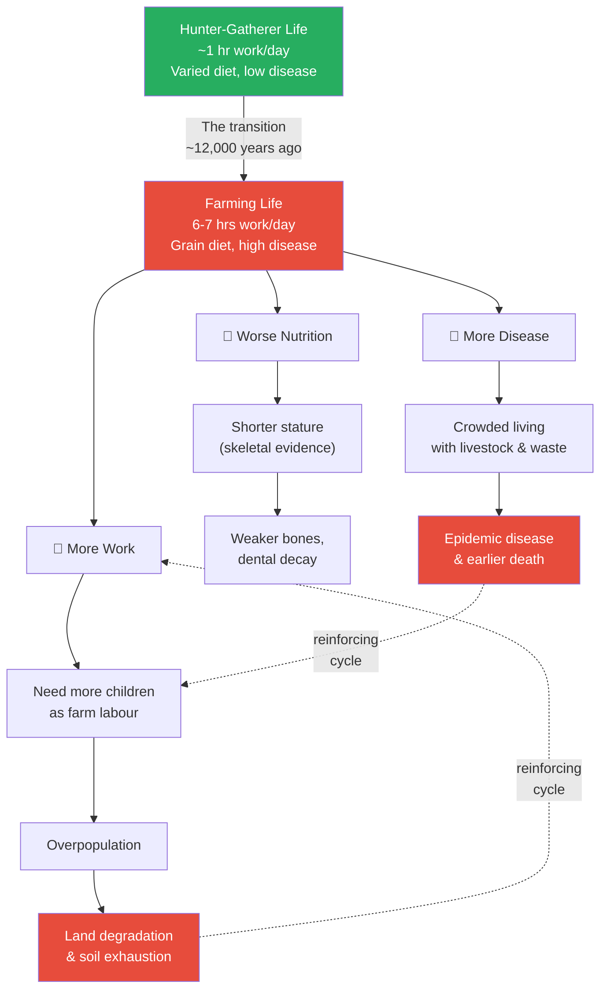
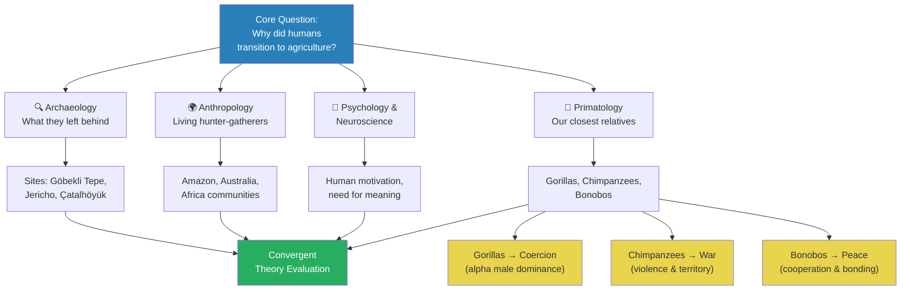
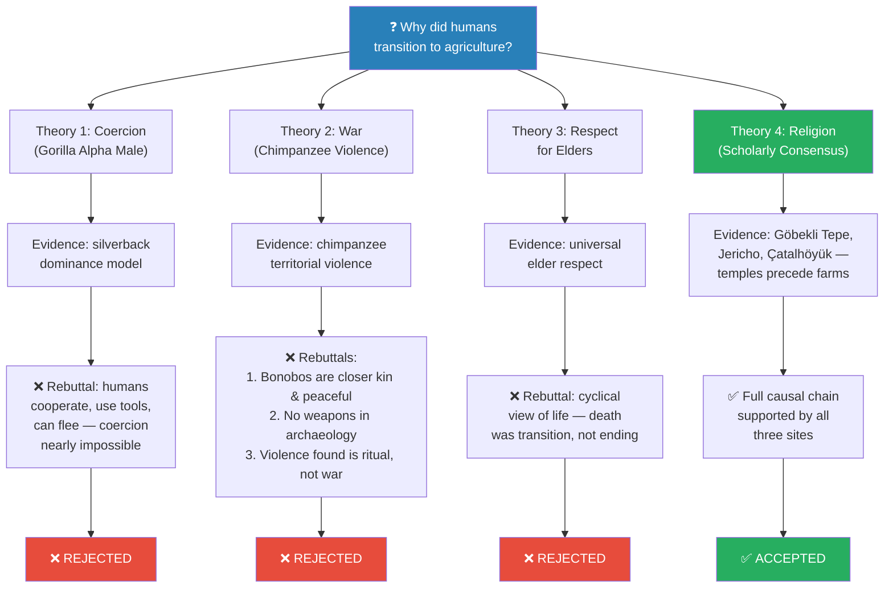
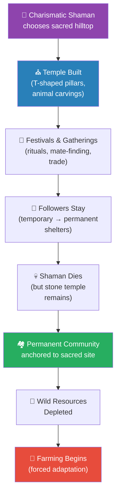
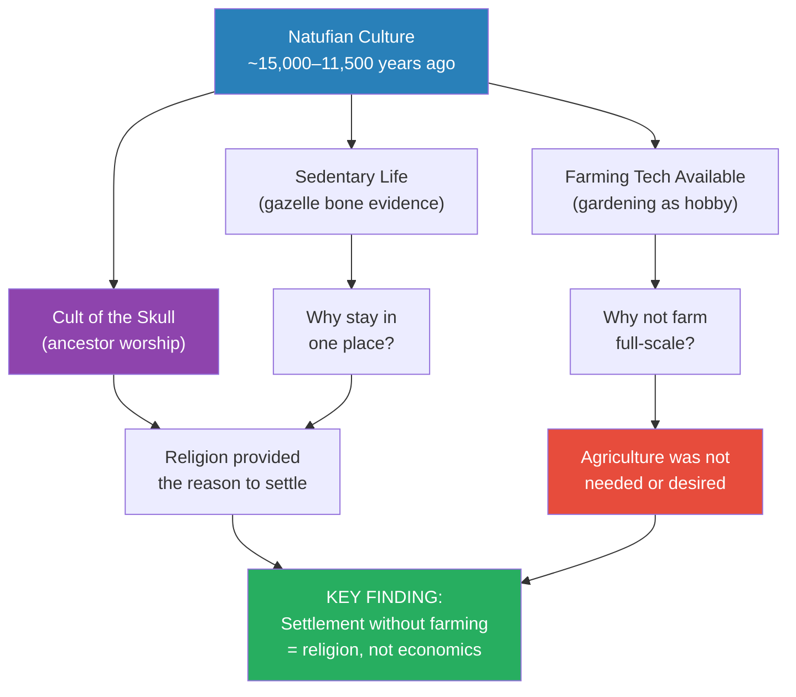
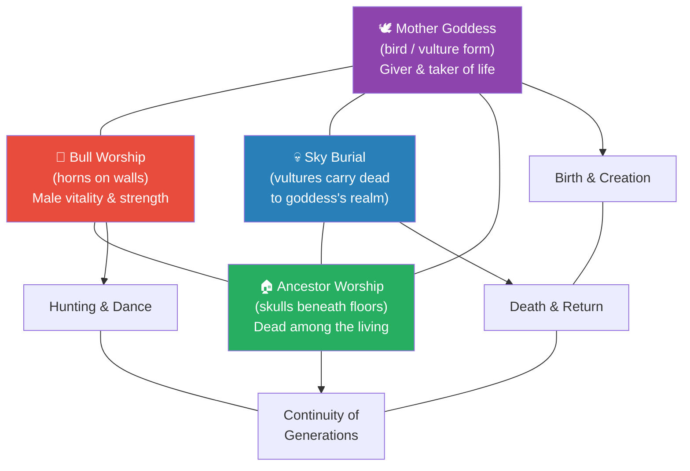

# Explaining Humanity's Transition to Agriculture

> Prof. Jiang opens the Civilization series with a deceptively simple question: why did humans switch from hunting and gathering to farming? The traditional story — agriculture enabled surplus, which enabled civilisation — turns out to have no evidence. In fact, farming made us shorter, sicker, and harder-working. After evaluating four competing theories using evidence from archaeology, anthropology, psychology, and primatology, Prof. Jiang arrives at the scholarly consensus: religion, not material advantage, drove humanity to settle down. Three archaeological sites — Göbekli Tepe, Jericho, and Çatalhöyük — provide the evidence.

---

## The Question

*Why did humanity transition from hunter-gatherer society to agriculture — when that transition made life objectively worse?*

This is the foundational question of the entire Civilization series — the mystery that Prof. Jiang places at the centre of sixty lectures spanning the whole arc of human history. What makes the question so disorienting is not its difficulty but its familiarity. Every student in the room thinks they already know the answer: people figured out farming, farming created food surpluses, surpluses freed up specialists to do politics and art and science, and that gave us civilisation. It is the story in every textbook, repeated so often that it has hardened into common sense.

Prof. Jiang's project in this opening lecture is to show that every piece of that story is wrong, and that the real answer — religion — upends most of what we assume about what drives human beings. The answer he builds over the next fifty minutes, and returns to throughout the course, is that **religion, not rational self-interest, is the engine of civilisation**.

But the question also carries a deeper implication that Prof. Jiang wants his students to sit with. If the most important transition in all of human history — the one that led, eventually, to everything we call civilisation — was not motivated by material gain, then what does that say about what we are? Are we the rational, self-interested creatures that economics textbooks describe? Or are we something stranger, something driven by forces that are harder to measure and harder to explain?

This first lecture is not just about agriculture. It is about the nature of the human animal — and the answer, when it arrives, will reshape how the students think about every civilisation they encounter for the rest of the course.

## Key Concepts at a Glance

| Concept | One-line summary |
|---------|-----------------|
| **Paradigm** | A story or model for understanding the world — the traditional one about agriculture is wrong |
| **Domestication (inverted)** | Wheat domesticated us, not the other way around — farming enslaved humans |
| **Charismatic leaders / Shamans** | Individuals with religious visions who attract followers and build communities |
| **Cult of the skull** | Ancestor worship through preserved skulls — communicating with the spirit world |
| **Sky burial** | Exposing dead bodies for vultures — tribute to the mother goddess at Çatalhöyük |
| **Cosmological alignment** | Temples designed to interact with celestial events — ancient "science" as religion |
| **Sedentary** | Staying in one place — achieved before farming, not because of it |
| **Mother goddess** | The giver of life at Çatalhöyük, represented by birds and vultures — the sky belongs to them |
| **Natufian culture** | Hunter-gatherers who settled 13,000–15,000 years ago in the Levant — had farming tech, chose not to use it |

---

## The Traditional Story — and Why It's Wrong

Prof. Jiang begins the very first lecture of the Civilization series the way a good mystery writer begins a novel: by telling you what everyone believes, and then showing you why they are wrong. He does not start with his answer. He starts with the audience's answer — the one they have carried since middle school, the one so familiar that nobody thinks to question it.

His tone is casual, even playful, as he walks the class through the textbook narrative step by step. But you can sense where it is heading, because he keeps pausing, almost daring the students to notice the cracks in the story before he points them out. This opening move — present the conventional wisdom with apparent respect, then demolish it with evidence — will become one of Prof. Jiang's signature techniques throughout the series. It is a technique borrowed from good science: you do not start with the answer you prefer. You start with the strongest version of the idea you want to challenge, so that when the evidence proves fatal, the audience knows it was not a straw man.

The first word Prof. Jiang teaches the class is <b style="color: #2980b9">paradigm</b> — a word he pauses to define carefully because it will recur throughout all sixty lectures. "It's a very sophisticated English word," he says, "and all it means is story or model or understanding." A paradigm is the story a society tells itself about how the world works. It is not necessarily true — it is simply the dominant explanation that most people accept without thinking.

The point of this course, he suggests with a faint smile, is to examine paradigms: to ask whether the stories we tell about civilisation actually match what the evidence shows. And the very first paradigm to fall will be the one about agriculture.

The traditional paradigm goes like this. For hundreds of thousands of years, humans lived in small bands of twenty to fifty people, wandering the landscape as hunter-gatherers, following animal herds and seasonal fruit. Then, roughly twelve thousand years ago, someone figured out how to plant seeds and grow food on purpose. This discovery — <b style="color: #2980b9">domestication</b>, the process of bringing wild plants and animals under human control — changed everything.

With reliable crops came <b style="color: #2980b9">surplus</b>: more food than the group needed to survive on any given day. Surplus freed people from the daily hunt. For the first time in human history, some members of the community did not need to spend their time finding food. They could specialise — in leadership (politics), in meaning-making (religion), in beauty (art), in solving problems (technology).

Villages formed around these specialists, then towns, then cities. Literature, science, philosophy, and engineering followed. The march from wheat field to smartphone was underway, and it was all thanks to that first clever farmer who stuck a seed in the ground.

It is a beautiful, logical story. It has a satisfying narrative arc — from primitive origins to modern complexity — and it flatters us by suggesting that the whole trajectory of civilisation has been one of rational improvement.

There is only one problem with it: <b style="color: #e74c3c">there is no evidence for it</b>. Prof. Jiang says this flatly, without drama, and lets the silence do the work. The more archaeologists dig, the more the evidence points in the opposite direction. The transition to agriculture did not make life better. It made life measurably, demonstrably worse — on every dimension we can measure.

In Prof. Jiang's blunt assessment, switching from hunting and gathering to farming was <b style="color: #e74c3c">"actually pretty stupid."</b> And he means this not as provocation for its own sake, but as an honest reading of what the evidence shows. The professor is not being irreverent. He is being empirical.

He proceeds to dismantle the traditional story with three categories of evidence, each one a separate blow to the idea that agriculture was progress. Taken individually, any one of these problems might be explained away — perhaps farming took more work but offered more security; perhaps the diet was narrower but more reliable; perhaps disease was worse but the community was stronger. Taken together, however, they are devastating, and Prof. Jiang presents them with the relish of someone who knows the punchline is going to land.

### 1. Farming Meant Far More Work

The first surprise is how little hunter-gatherers actually worked, and Prof. Jiang clearly enjoys watching this fact land on his students' faces. He leans forward and delivers the number almost casually: a typical hunter-gatherer spent roughly one hour a day obtaining food.

One hour.

This figure startles the students — it sounds impossibly low to anyone raised in a society that glorifies productivity, that treats busyness as a virtue and leisure as laziness.

But the natural world, Prof. Jiang explains, was extraordinarily generous to a species smart enough to exploit it without transforming it. Fruit hung from trees, ripe for the picking. Game animals wandered through open meadows. Nuts, roots, berries, tubers, and edible plants grew abundantly in forests and riverbanks without anyone planting, tending, or watering them. All a hunter-gatherer had to do was walk around and collect what nature freely provided.

The rest of the day — and this is the part that really stuns a modern audience — was free. Completely free. Free for socialising, for playing games, for resting in the shade, for telling stories around a fire, for teaching children the names of plants and animals, for making art on cave walls, for doing absolutely nothing at all. By any modern standard, hunter-gatherers were the most leisured people in human history.

A farmer, by contrast, worked six to seven hours a day, every day, in backbreaking labour — ploughing, planting, weeding, watering, harvesting, storing, repairing tools, feeding animals. There were no weekends, no holidays, no off-seasons (there was always something that needed doing). The comparison is almost absurd: a sevenfold increase in daily labour for a food supply that was less diverse, less reliable, and more vulnerable to drought, pests, and weather.

But it gets worse, because farming creates a vicious cycle that hunter-gathering does not. When you farm, you need labourers — someone has to plough, someone has to weed, someone has to harvest. Who are the cheapest labourers available? Your own children. So farming families had more children than hunter-gatherer families. More children needed more food. More food required more land. More land required more work. More work required more children. The population grew, the soil degraded, and the community found itself trapped on a treadmill it could never step off.

This is the point where Prof. Jiang invokes Yuval Harari's famous line from *Sapiens*: "We did not domesticate wheat. Wheat domesticated us." He lingers on this reversal, savouring it, because it captures the entire paradox of the agricultural revolution in a single sentence.

Consider the situation from wheat's perspective, as Harari invites us to do. In the wild, wheat has to work for its survival — it has to make itself attractive to animals who will eat it and spread its seeds, it has to compete with other plants for sunlight and water, it has to survive drought and frost and fire. A tough life for a plant. But on a farm? Wheat can just sit there. Humans clear the land for it. Humans remove every competing plant. Humans plant wheat in neat rows, water it during dry spells, weed around it, protect it from insects and animals, and harvest it at exactly the right time.

From wheat's perspective, the agricultural revolution was the best thing that ever happened. It went from a struggling wild grass — one species among thousands competing for survival on the plains of the Middle East — to the most successful plant on the planet, covering millions of acres across every continent, with an entire species of large-brained bipedal servants dedicated to its welfare. From the human perspective, the deal was catastrophic. We became wheat's labourers, and we have been ever since.

### 2. Farming Produced Worse Nutrition

The skeletal evidence is unambiguous, and Prof. Jiang presents it simply because the bones speak for themselves. When bioarchaeologists compare the skeletons of hunter-gatherers with the skeletons of early farmers from the same geographic regions and the same time periods, the hunter-gatherers are significantly taller. This is not a marginal difference — it is visible to the naked eye in museum displays. Height is one of the most reliable proxies for overall childhood nutrition — a well-fed child grows taller, a malnourished child does not — and the gap between forager and farmer skeletons tells a clear story of dietary decline.

The reason is dietary diversity. A hunter-gatherer ate meat, fish, fruits, nuts, roots, insects, shellfish, eggs, and dozens of seasonal plants that varied by region and time of year. This diet was rich in protein, healthy fats, vitamins, minerals, and fibre — all the building blocks a growing body needs. It was varied enough that no single nutrient deficiency could take hold, because what one food lacked, another provided.

A farmer, by contrast, ate mainly one or two staple crops — overwhelmingly wheat, perhaps supplemented by barley and a few garden vegetables. The caloric output of a wheat field is impressive — you can feed far more people per acre with grain than with foraging — but its nutritional profile is narrow and repetitive. Humans evolved over hundreds of thousands of years to thrive on dietary variety. Farming replaced that variety with monotony, and human bodies paid the price in stunted growth, weakened bones, tooth decay, and chronic nutritional deficiencies that would persist for millennia.

### 3. Farming Brought More Disease and Earlier Death

The third blow is the deadliest, and Prof. Jiang delivers it with the straightforward gravity it deserves. Hunter-gatherers lived in small, mobile groups spread across vast landscapes — groups of twenty or thirty or fifty people, moving camp every few weeks or months as resources shifted with the seasons. When they produced waste, they moved on, leaving it behind to decompose in the open air.

When one person fell ill, the group's natural dispersal — people spending most of their time outdoors, sleeping in temporary shelters — limited the spread of contagion. The very mobility that defined the hunter-gatherer lifestyle was, without anyone planning it, a remarkably effective public health strategy.

Farming destroyed every element of that strategy simultaneously. Dense, permanent settlements meant that humans, their domesticated animals, and their accumulated waste all lived together in the same confined space — not for weeks, but for years, for decades, for generations.

The animals were the biggest problem. Livestock carried pathogens — bacteria, viruses, parasites — that mutated over time and jumped to their human handlers. Many of the great epidemic diseases that have defined human history — measles, smallpox, influenza, tuberculosis — originated in domesticated animals and crossed to humans only after farming brought the two species into constant, intimate contact.

But the animals were not the only vector. Human waste accumulated in settlement peripheries, contaminating the very water supplies people depended on for drinking and cooking. Stored grain attracted insects and rodents, which became additional disease carriers. And the crowding itself — dozens, then hundreds, eventually thousands of people living side by side in permanent structures — meant that respiratory infections, once introduced by a single individual, could sweep through an entire community in days.

The result was epidemic disease on a scale that no hunter-gatherer community ever experienced or could have imagined. People in early farming settlements died younger, suffered more chronic illness, and endured more frequent periods of acute sickness than their foraging ancestors had.

The archaeological record bears this out with brutal clarity: early farming skeletons show not only shorter stature but also more evidence of infection, dental decay from a grain-heavy diet, anaemia from iron-poor nutrition, and nutritional stress markers etched into the very structure of their bones. These were bodies under siege — besieged not by enemies, but by the consequences of their own way of life.

Prof. Jiang pauses here to let the full picture sink in. The comparison between the two ways of life is so stark that it is worth seeing it laid out side by side:

| Dimension | Hunter-Gatherer | Farmer |
|-----------|----------------|--------|
| **Daily work** | ~1 hour foraging | 6-7 hours of labour |
| **Diet** | Varied: meat, fish, fruits, nuts, roots, insects | Narrow: wheat, barley, limited vegetables |
| **Height** | Taller (skeletal evidence) | Significantly shorter |
| **Disease** | Low — small, mobile groups | High — crowded, sedentary, with livestock |
| **Lifespan** | Longer on average | Shorter on average |
| **Freedom** | Mobile, autonomous | Tied to land, dependent on harvest |
| **Population pressure** | Self-regulating (small groups) | Escalating (more children needed for labour) |

The table is damning. On every measurable dimension, the hunter-gatherer life was superior. This is not romanticism or nostalgia — it is what the physical evidence shows. And it raises the question that will drive the rest of the lecture to a pitch of genuine intellectual urgency: if the farming life was worse in every way we can measure, what possible force could have been strong enough to make people adopt it anyway?

This diagram captures the triple penalty that farming imposed on humanity, and — crucially — the reinforcing feedback loops that made the trap inescapable once entered. The green node at the top represents the hunter-gatherer baseline: minimal work, excellent nutrition, low disease burden. The red node below it represents what replaced it after the transition to farming. Each of the three downward pathways (more work, worse nutrition, more disease) cascades into its own chain of worsening consequences.

But notice the dotted arrows looping back: land degradation from overfarming creates the need for even more labour to work even more land, and higher death rates from disease create pressure for even more children to replace the dead. These reinforcing cycles meant that once a community committed to farming, there was no easy way back. The trap closed behind them.

The diagram makes visible what Prof. Jiang's argument makes intellectually clear: the transition to agriculture was not a single trade-off but a compounding spiral of deterioration, a system of interlocking problems that fed on each other and grew worse over time.

> [!tip] Core Insight
> Yuval Harari's famous line from *Sapiens* captures the paradox perfectly: "We did not domesticate wheat. Wheat domesticated us." In nature, wheat has to compete for survival. On a farm, it just sits there while humans do all the work — ploughing, weeding, watering, guarding. Agriculture was a great deal for wheat and a terrible deal for humans.

So the question is now far more urgent than it seemed at the start. The transition to agriculture was not a clever innovation that unlocked civilisation. It was a catastrophe for the human body, a massive expansion of human labour, and a public health disaster. Hunter-gatherers lived longer, ate better, worked less, and were taller. Farmers were shorter, sicker, worked harder, and died younger.

And yet, across every continent, across thousands of years, human groups independently made the same seemingly irrational choice. Not once, but many times, in many places, without any contact between them. This is the detail that makes the mystery truly haunting — it was not a single mistake that spread by imitation. It was a pattern, a convergence, as if something deep in human nature was pulling every population on Earth toward the same terrible bargain.

Something extraordinarily powerful must have been at work — something that outweighed all of the material disadvantages, something that offered a benefit so compelling that people were willing to sacrifice their health, their freedom, and their longevity to obtain it.

Prof. Jiang lets the mystery hang in the air for a long moment before turning to the question of method. If this transition happened twelve thousand years ago, before writing, before records, before anything we would recognise as history — how can we possibly hope to figure out why it happened?

> [!example] The Wheat Reversal — Harari's Thought Experiment
> - Imagine you are a wild wheat plant 15,000 years ago, somewhere in the Middle East
> - You compete fiercely with other grasses for sunlight, water, and soil nutrients
> - You rely on animals eating your seeds and depositing them elsewhere to reproduce
> - You are vulnerable to drought, frost, insects, grazing animals, and being outcompeted by hardier species
> - Now imagine a species of large-brained primates starts clearing land just for you
> - They remove every competing plant, till the soil, and plant you in neat, orderly rows
> - They water you during droughts, protect you from pests, and pull weeds that threaten you
> - They guard you from animals and harvest you at precisely the right moment for maximum yield
> - Your only job now is to grow — everything else is handled by your servants
> - You have gone from a struggling wild grass to the most successful plant species on Earth
> - Meanwhile, your "masters" are working seven hours a day, getting shorter, sicker, and dying younger
>
> **The lesson:** What looks like human mastery over nature may actually be nature's mastery over humans. The species that "won" the agricultural revolution was wheat, not *Homo sapiens*.

---

## How Do We Investigate a 12,000-Year-Old Mystery?

Before Prof. Jiang introduces his four competing theories, he pauses to address a question that most lecturers would skip but that turns out to be one of the most important lessons of the hour: how do we know anything at all about what happened twelve thousand years ago? There are no written records from the Neolithic period — writing would not be invented for another seven thousand years. No one left a diary explaining why they decided to start planting wheat. No ancient journalist interviewed the first farmer. No cave wall carries a manifesto titled "Why We Stopped Hunting." The people who made this transition are long dead, their languages lost, their thoughts irrecoverable.

And yet scholars have, over the past century and especially in the last few decades, assembled a remarkably detailed picture of what likely happened — not from a single brilliant insight, but from the painstaking convergence of four very different fields of evidence.

Prof. Jiang introduces them one by one, and as he does, the students can sense that something more than content is being taught. His method — triangulating across disciplines rather than relying on any single one, demanding that a theory survive scrutiny from multiple independent angles before accepting it — is itself a lesson in how to think about questions that seem unanswerable. The message is quiet but powerful: when the question is big enough and old enough, no single discipline owns the answer. You need all of them, working together, checking each other, and you still need to hold your conclusions with humility.

### Archaeology — What They Left in the Ground

The first and most important discipline is <b style="color: #2980b9">archaeology</b> — the study of what humans left behind in the ground. Archaeologists excavate ancient sites — sometimes spending decades at a single location, brushing away centuries of sediment one millimetre at a time — and recover physical evidence that tells the story of people who left no written records.

They find the stone foundations of houses, the bones of the dead, the flint and obsidian tools people knapped by hand, the temples they built with extraordinary effort, the animal remains they discarded after meals, the seeds they planted or gathered, the pottery they shaped from local clay, the ornaments and jewellery they wore in life and were buried with in death.

Each object is a data point, a clue in a puzzle that no one will ever fully solve but that gets clearer and more detailed with every excavation. A skeleton's height tells you about that individual's nutrition as a child. A seed's species tells you what they ate and whether they cultivated it deliberately or gathered it wild.

A temple's orientation — which direction it faces, which celestial events it aligns with at specific times of year — tells you something profound about what the builders believed about the cosmos and their place in it. And the absence of an object can be just as revealing as its presence: if a site spanning centuries yields no weapons, no fortifications, and no evidence of violent death, that silence speaks volumes about whether the people there lived in fear of attack.

The three archaeological sites that will dominate this lecture — Göbekli Tepe in central Turkey (dating to roughly 9500 BC), Jericho in the Levant (associated with the Natufian culture, 13,000–15,000 years ago), and Çatalhöyük in southern Turkey (roughly 7500 BC) — are all products of painstaking excavation over many years, and their discoveries in recent decades have fundamentally transformed the scholarly conversation about the origins of civilisation.

Prof. Jiang notes with particular emphasis that Göbekli Tepe was discovered only in the past few decades and is still only about five percent excavated — which means that ninety-five percent of whatever story that site holds is still underground, waiting to be uncovered. This is a humbling reminder that the narrative of human origins is still being written, literally one shovelful at a time, and that any theory we hold today may need to be revised when the next trench is opened.

Archaeology gives us the hard physical evidence, the material facts on which all theories must ultimately rest. But it cannot, by itself, tell us what people were thinking, feeling, hoping for, or praying to. For that, we need other ways of knowing.

### Anthropology — The Living Window

The second discipline is <b style="color: #2980b9">anthropology</b> — the study of human cultures, particularly cultures that still exist today in conditions that resemble, however imperfectly, the conditions of the deep past. Scattered across the Amazon rainforest, the Australian outback, the Kalahari Desert of southern Africa, and the dense forests of central Africa, small communities of hunter-gatherers continue to live in ways that echo their ancestors' lifestyles from thousands of years ago. They hunt with bows and spears, gather wild plants and tubers, move camp with the seasons, and organise their societies without centralised leadership, written laws, or agriculture.

Anthropologists who embed themselves in these communities — sometimes living alongside them for years, learning their languages, participating in their rituals — can observe things that archaeology cannot recover. They can see how hunter-gatherer societies actually function in the texture of daily life: the conversations, the social dynamics, the disputes, the jokes, the spiritual practices.

How do they make collective decisions when there is no chief and no formal hierarchy? How do they treat their elders — with reverence, with pragmatic care, or with something more complex? How do they handle interpersonal conflict when two members of a small band disagree? What do they believe about the world of spirits, about what happens to a person's soul after death, about the relationship between the living and the dead? These are not the kinds of questions that can be answered by digging up a stone foundation or measuring the length of a thighbone. They require watching living people live.

The insights from anthropology are invaluable, but they come with a caveat that Prof. Jiang is careful to acknowledge. We cannot simply project the customs of a modern Amazonian tribe backward onto Neolithic people who lived ten thousand years ago in a completely different ecology and climate. The modern hunter-gatherers are not frozen relics of the past — they have their own long histories, their own adaptations to specific environments, their own unique cultural innovations.

But when the same patterns recur independently across many unrelated cultures on different continents — when the Hadza of Tanzania, the Aboriginal Australians, the San of the Kalahari, and the Yanomami of the Amazon all practise some form of elder respect, all hold some form of belief in a spirit world, all resolve conflicts through communal discussion rather than authoritarian decree — that convergence across independent cases tells us something genuinely important about deep human social instincts. The anthropological insights will prove critical when Prof. Jiang evaluates Theory 3 and confronts the profound question of how ancient peoples understood death and the cycle of life.

### Psychology and Neuroscience — The Inner Engine

The third discipline is <b style="color: #2980b9">psychology and neuroscience</b> — the study of how the human brain works and what motivates human behaviour at its deepest, most fundamental levels. This is the discipline that addresses the "why" behind the "what." Archaeology can show you that someone built a temple. Anthropology can show you that similar cultures worship their ancestors. But only psychology can ask — and begin to answer — the deeper questions.

Why do humans seek meaning in the first place? Why do we form communities rather than living as solitary predators, the way leopards and tigers do? Why do some individuals become charismatic leaders whom others follow willingly, even sacrificially, across years and continents? Why do we fear the unknown — and why, instead of simply avoiding what we do not understand, do we build elaborate stories and systems to explain it?

These questions bear directly on the central mystery of the lecture. If all of the material incentives pointed against farming — if the rational, self-interested choice was clearly to keep foraging — then something in human psychology must have overridden rational calculation.

Something deep in us wanted settlement, wanted community, wanted the thing that only settling down could provide — and wanted it badly enough to accept shorter lives, worse food, harder labour, and more disease as the price.

Psychology helps identify what that something might be, and Prof. Jiang's answer, which he will develop more fully in Lectures 2 and 3, centres on what he calls the human need to understand "why." It is not a luxury or an indulgence — it is a need, as fundamental as hunger or the need for warmth, wired into the very architecture of the human brain.

Humans are the only species that asks why the sun rises, why people die, why suffering exists, why the stars move across the sky in patterns. We cannot stop asking these questions. We cannot choose not to wonder. The wondering is compulsive, inescapable, and universal.

And religion — of all the things humans have ever created — satisfies that need more completely than anything else. It provides answers to the unanswerable: why are we here, what happens when we die, why do terrible things happen to people who do not deserve them, what is the meaning of all this pain and beauty.

If this need is truly innate — truly hardwired — then it becomes possible to understand why people would sacrifice material well-being for spiritual community. They were not being irrational. They were pursuing a different and more ancient kind of rationality: the rationality of meaning.

### Primatology — Our Closest Mirrors

The fourth and perhaps most surprising discipline is <b style="color: #2980b9">primatology</b> — the study of our closest genetic relatives among the great apes. Humans share approximately 99% of their DNA with chimpanzees and bonobos, and a slightly smaller percentage with gorillas.

This genetic closeness is the reason primatology matters for a question about human behaviour: observing how these species organise their societies — how they handle leadership, conflict, cooperation, and competition — can illuminate which aspects of human behaviour are biologically hardwired (shared with our primate cousins because we inherited them from a common ancestor) and which are culturally learned (unique to human societies because they arose after our evolutionary paths diverged).

Prof. Jiang introduces three primates, each of which maps neatly onto one of the theories he is about to evaluate, and his descriptions are vivid enough that the students immediately grasp the analogy.

First, gorillas. A gorilla troop is ruled by a single massive silverback alpha male who is physically enormous — much, much bigger than the females and the younger males. The silverback controls access to food and mates through sheer size and the threat of violence. Nobody challenges him because nobody can win.

This is a natural model for the coercion theory — the idea that one powerful individual or elite group forced everyone else to farm for them. If gorilla society works through physical dominance, perhaps early human society did too.

Second, chimpanzees. Chimpanzee society is a world of constant, brutal violence. Males form raiding parties that patrol the borders of their territory and attack neighbouring groups, sometimes beating rivals to death. They are territorial, aggressive, and competitive in ways that seem to mirror the worst of human warfare.

This is a natural model for the war theory — the idea that farming settlements formed primarily because walled communities with stored food could defend themselves against violent neighbours. If chimps fight constantly, perhaps early humans did too, and farming was a defensive strategy.

Third — and this is where the argument takes a crucial turn — bonobos. Bonobos look almost identical to chimpanzees, and until the 1920s they were classified as the same species. But their behaviour is radically different. Bonobos are remarkably peaceful. They resolve conflicts through social bonding, grooming, and physical affection rather than violence. They share food willingly. They cooperate rather than compete.

And here is the key detail that Prof. Jiang emphasises: bonobos are actually genetically closer to humans than chimpanzees are. This matters enormously. If we are looking for our "natural" behaviour in our closest primate relatives, the bonobo — not the chimp — is the better mirror. People love to cite chimpanzee violence as proof that humans are naturally warlike, but they conveniently ignore the bonobo, who is a closer relative and is anything but warlike. The bonobo evidence will prove crucial in the theory evaluation that follows, because it undercuts the widespread assumption that humans are "naturally" violent creatures who needed walls and weapons to survive. If our closest genetic relative is a peaceful cooperator, the war theory loses its biological foundation.

This diagram shows the intellectual architecture Prof. Jiang constructs before presenting any theory — a framework that is as important as any specific conclusion he will reach, because it teaches the students how to think about historical mysteries in general. Four independent disciplines, each with its own methods, strengths, and blind spots, each contributing a different type of evidence, all converge into a single evaluation process represented by the green node at the bottom.

No one field can answer the question alone — archaeology tells you what people built but not why, anthropology tells you how similar cultures behave today but cannot prove the past was identical, psychology explains the inner drives of the human mind but cannot excavate a temple, and primatology reveals deep biological tendencies but cannot account for the cultural innovations that make humans unique among the apes.

It is only when you lay the evidence from all four disciplines side by side that patterns begin to emerge and theories can be rigorously tested against multiple independent lines of evidence. The three primate species — gorillas, chimpanzees, and bonobos, shown in the yellow nodes branching from primatology — occupy a special position within this framework. Each one serves as a kind of natural experiment, a living test case that checks a specific hypothesis about human nature against the behaviour of a species that shares the vast majority of our genetic code.

If gorilla-style coercion is sustainable only because of extreme physical size differences that do not exist in humans, then the coercion theory weakens. If our closest genetic relative is a peaceful bonobo rather than a warlike chimpanzee, then the war theory loses its biological foundation. The primates do not give us definitive answers — they are different species living in different environments, facing different selective pressures — but they powerfully constrain which answers are biologically plausible and which are wishful thinking projected backward from modern assumptions.

Prof. Jiang is teaching his students something much broader here than the specific content of his answer about agriculture. He is modelling a way of thinking — a method for approaching questions that seem impossibly old and impossibly complex. You gather evidence from as many independent sources as possible. You resist the temptation to rely on any single line of reasoning, no matter how elegant or compelling it seems in isolation. You let the convergence or divergence of evidence across disciplines guide your conclusions, trusting the pattern more than any individual data point.

And you remain humble about what you cannot know — because, as Prof. Jiang reminds the class with characteristic candour, "even today, we are not able to explain to you why this transition happened." The best we can do is evaluate which theory the evidence supports most strongly and hold that theory provisionally, with open hands, ready to revise it the moment better evidence arrives. This intellectual humility — this willingness to say "we don't know for certain, but here is what the evidence suggests" — is one of the defining characteristics of Prof. Jiang's teaching throughout the series.

What follows from this methodological foundation is the intellectual centrepiece of the lecture: four theories, presented one at a time, each evaluated against the evidence from all four disciplines, three rejected for specific and compelling reasons, and one — religion — left standing as the scholarly consensus.

Prof. Jiang will walk his students through each theory with the patience and care of a detective presenting evidence to a jury. He will acknowledge the genuine strengths of each competing explanation before showing, piece by piece, where the evidence fails to support it. He will give every theory a fair hearing — even the ones he ultimately rejects — because that is what intellectual honesty demands.

And by the time he reaches Theory 4, the conclusion will feel not like an assertion imposed from professorial authority but like the only story the evidence can support, the only paradigm that survives contact with what we actually find in the ground.

## Why Did Humans Transition to Agriculture? Four Theories Tested

This is the centrepiece of the lecture — the moment the detective work begins in earnest. Prof. Jiang has spent the first half of the hour setting up the mystery (farming was terrible, so why did we do it?) and establishing his method (converge evidence from archaeology, anthropology, psychology, and primatology). Now he turns to the suspects. There are four competing theories for why humans abandoned the hunter-gatherer life, and he is going to test each one against the evidence, in order, with the rigour of a prosecution building a case.

His approach is distinctive and worth noticing. He does not simply list each theory's strengths and weaknesses as though filling out a pros-and-cons table. Instead, he inhabits each theory — he puts himself inside it, gives it its strongest possible voice, invites the students to believe it for a few minutes — and only then dismantles it. This generosity toward ideas he ultimately rejects is what makes the surviving theory so convincing. By the time he arrives at religion, the students have personally felt the appeal of the three alternatives and personally watched each one fail. The conclusion, when it comes, does not feel imposed. It feels earned.

---

### Theory 1: Coercion — The Gorilla Alpha Male

The first theory is the simplest, the most intuitive, and the one that probably occurs to most people first. It goes like this: a powerful individual, or a small group of powerful individuals, forced everyone else to farm. Some strong, dominant figure — a proto-king, a warlord, a bully with a bigger club — stood over the weaker members of the group and compelled them to work the fields, hand over the harvest, and submit. Agriculture, in this account, was not a communal choice. It was <b style="color: #2980b9">coercion</b> — the strong exploiting the weak.

The theory has a natural model in the animal kingdom, which is why Prof. Jiang introduces it through the gorilla. A gorilla troop is organised around a single silverback alpha male who is physically enormous — dramatically larger than the females and the younger males. The silverback's dominance is not subtle. He controls access to food and to mates. He does not need cunning or persuasion or charm. He is simply, overwhelmingly big, and the rest of the troop submits because resisting him is physically impossible.

If gorilla society works this way, the theory asks, could early human society have worked the same way? Could a single powerful individual — a kind of human silverback — have compelled others to settle down and farm for his benefit?

Prof. Jiang pauses here and conducts one of the most memorable thought experiments in the entire series. He invites the students to imagine they are sitting in the classroom, going about a normal day, when a nine-foot giant walks through the door. This giant is immensely strong — far stronger than any single student — and he makes three demands: you will farm for me, you will give me your food, and you will give me your women.

> [!example] The Classroom Rebellion — Prof. Jiang's Thought Experiment
> - A nine-foot giant walks into the classroom and towers over every student
> - He is far stronger than any individual in the room — no one-on-one challenge is possible
> - The giant makes three demands: farm for me, hand over your food, and give me your women
> - Prof. Jiang asks: "What would you do?"
> - The students quickly realise: "We would beat the crap out of him"
> - Humans have big brains — we cooperate, and cooperation defeats individual strength
> - Someone could fashion a weapon — a sharpened stick, a heavy stone, a trap
> - Someone could poison his food while he sleeps
> - Someone could dig a pit and lure him into it
> - Even without weapons: twenty humans rushing one giant simultaneously will overwhelm him
> - And the simplest option of all: just run away — humans are endurance runners, mobile and fast
> - No single individual, no matter how large, can coerce an entire group of cooperating, intelligent humans

The laughter in the room tells Prof. Jiang everything he needs to know: the students have grasped the point intuitively before he even explains it. Humans are not gorillas. The gorilla model works only because individual gorillas are roughly equal in intelligence and the silverback's advantage is purely physical. But in a species with <b style="color: #27ae60">brains capable of cooperation, planning, and tool-making</b>, raw physical dominance is not enough. A single bully can be poisoned, trapped, ambushed in his sleep, or simply outnumbered by a group that coordinates its attack. And if all else fails, the group can simply walk away — something a gorilla troop rarely does, but that nomadic humans did constantly.

<b style="color: #e74c3c">Coercion among humans is very, very hard to do</b>, Prof. Jiang concludes — and in pre-agricultural society, when people had no fixed property, no walls, and no possessions they could not carry, it was essentially impossible. You cannot enslave people who can disappear into the forest overnight. Verdict: rejected.

---

### Theory 2: War — The Chimpanzee Model

The second theory is darker and, for many people, more emotionally compelling than the first. It proposes that agriculture was a defensive strategy born out of violence. The logic runs like this: early humans lived in a world of constant warfare — raiding, killing, competing for territory — and the groups that settled down and built walls, stored food behind fortifications, and created permanent defensible positions had a survival advantage over nomadic groups that could be ambushed in the open. In this account, farming was not an economic choice. It was a <b style="color: #2980b9">military</b> one.

The animal model here is the chimpanzee. Chimpanzees live in a world of organised, lethal violence that disturbed primatologists when they first observed it. Male chimpanzees form raiding parties. They patrol the borders of their territory in silence, listening for signs of rival groups. When they find an isolated individual from a neighbouring troop — a young male, a female with an infant — they attack with overwhelming force, beating the victim to death. These are not frenzied outbursts. They are planned, coordinated, and terrifyingly purposeful.

If our closest primate relatives are capable of this kind of organised violence, the theory asks, isn't it reasonable to assume that early humans were too — and that the invention of agriculture was an adaptation to a world of constant war?

Prof. Jiang takes this theory seriously because it resonates with how many people view human nature. The idea that we are violent at our core, that civilisation is a thin veneer over a savage animal, is deeply embedded in Western thought — from Hobbes's "war of all against all" to the nightly news. But he proceeds to dismantle it with three converging lines of evidence.

The first counter-argument comes from primatology itself, and it is devastating. Bonobos — our other closest primate relative, genetically closer to us than chimpanzees are — are profoundly peaceful. They resolve conflicts through social bonding, grooming, and affection. They share food willingly. They do not form raiding parties, do not patrol borders, and do not beat strangers to death. If we want to cite our primate relatives as evidence for our "true nature," we cannot cherry-pick the violent species and ignore the peaceful one. <b style="color: #27ae60">The bonobo is a closer genetic mirror than the chimpanzee</b>, and the bonobo's reflection shows cooperation, not carnage.

The second counter-argument comes from archaeology, and it is simple: there are no weapons. When archaeologists excavate sites from the period of the transition to agriculture — the critical window between roughly 15,000 and 8,000 years ago — they do not find the kind of artefacts that a warlike society would produce. No spearheads designed for combat with other humans. No shields. No fortifications dating to the earliest settlements. No mass graves filled with bodies bearing the marks of violence. The material record of early Neolithic society is full of stone tools for grinding grain, for shaping obsidian, for scraping animal hides — tools of daily life, not tools of war.

The third counter-argument is perhaps the most subtle. When archaeologists do find evidence of violence in these early sites, it is not the right kind of violence — not inter-group warfare between rival communities, which is what the theory requires. Instead, the violence they find is intra-group: ritual sacrifice, intentional burial practices that involved breaking or modifying the body, and what appears to be religiously motivated treatment of the dead. The skulls found at Jericho, for example, were carefully plastered and painted — an act of ancestor worship, not battlefield trophy-taking.

Prof. Jiang is honest enough to leave the door slightly ajar. "Right now, we do not have any evidence" for inter-group warfare in this period, he tells the class. Future excavations might change that — Göbekli Tepe is only five percent excavated, and the unknown always holds surprises. But he is firm about where the evidence currently points: toward religion and ritual, not toward war. You cannot build a theory on evidence that does not yet exist, no matter how psychologically satisfying the theory feels. Verdict: rejected.

---

### Theory 3: Respect for Elders

The third theory is quieter and more sentimental than the first two. It proposes that humans settled down in order to care for their elderly — that the transition to a permanent, sedentary lifestyle was motivated by love and respect for aging members of the community who could no longer keep up with a nomadic existence.

There is something deeply appealing about this idea. Every human culture, past and present, appears to have some tradition of elder respect. Grandparents are valued as repositories of knowledge, experience, and wisdom. The idea that people would sacrifice their own mobility and health to care for those who raised them feels noble — it makes us look good as a species. And it is true that a nomadic lifestyle is hard on the elderly: long marches, carrying heavy loads, sleeping exposed to the elements. A permanent settlement, with solid shelters and stored food, would certainly make old age more bearable.

But Prof. Jiang pushes back with a single insight that unravels the entire theory, and it is drawn from anthropology — from what we know about how hunter-gatherer communities actually understand death.

Modern humans — especially modern Western humans — tend to view death as an ending, a catastrophe, the worst thing that can happen to a person. We spend enormous resources on medical care, life extension, and the prevention of death. The thought of losing our parents or grandparents fills us with dread and grief. We assume, without thinking about it, that our ancestors felt the same way.

But the anthropological evidence suggests they did not. Hunter-gatherer cultures across the world, studied independently by dozens of anthropologists on every inhabited continent, overwhelmingly hold a <b style="color: #2980b9">cyclical view of life</b>. "You're born, you die, then you're reborn, then you die again," as Prof. Jiang puts it, echoing the seasonal analogy that recurs in nearly every foraging culture. Just as the leaves fall in autumn and return in spring, just as the river floods and recedes and floods again, just as the herds migrate south and come back north — so too does human life move in cycles. Death is not an ending. It is a transition, a passage to the spirit world, from which one may eventually return.

In a culture that genuinely holds this belief — and the ethnographic record strongly suggests that pre-agricultural humans did — the imperative to keep elderly people alive at all costs simply does not exist in the same form. An aging elder who feels their body failing might not resist death but <b style="color: #27ae60">welcome it as a journey to the spirit realm</b>, a reunion with ancestors, a passage to the next phase of an eternal cycle. The community would mourn, certainly — but they would mourn a departure, not a destruction. The emotional urgency that drives modern humans to fight death with every tool at our disposal would have been absent, or at least radically different in character.

Without the terror of death-as-ending, the motivation to revolutionise an entire way of life simply to extend elderly lives by a few years evaporates. Caring for elders does not require permanent settlement — it requires the communal cooperation that hunter-gatherers already practised beautifully. Verdict: rejected.

---

### Theory 4: Religion — The Consensus

Three theories have now been tested and found wanting. The coercion model breaks against human cooperation. The war model breaks against the archaeological silence and the bonobo evidence. The elder-care model breaks against the cyclical view of death. What remains is the theory that Prof. Jiang has been building toward from the opening minutes of the lecture, the one that the scholarly consensus — cautious, provisional, but growing stronger with every excavation — now favours: <b style="color: #27ae60">religion drove humans to settle down</b>.

The argument begins not with agriculture but with the human brain. As Prof. Jiang established earlier through psychology and neuroscience, humans are uniquely compelled to ask "why" — why does the sun rise, why do people die, why does suffering exist, why are we here at all. This compulsion is not optional. It is wired into the architecture of our cognition. Every human culture ever documented has produced some system of answers to these questions — mythology, cosmology, theology — because the questions themselves are inescapable. We cannot stop asking, and we cannot live without answers.

In the world of mobile hunter-gatherer bands, this need for meaning was satisfied by individual shamans — charismatic figures, visionaries, people who seemed to have a special connection to the spirit world. Prof. Jiang describes them with vivid specificity: these were the individuals who could enter trance states, who reported visions of the spirit realm, who spoke with the voices of ancestors and animal spirits, who performed rituals that the rest of the community experienced as genuinely supernatural. A shaman's power was personal, magnetic, almost hypnotic — and in a small group of thirty or forty people, one powerful shaman was enough to provide the spiritual framework that the community needed.

But here is where the causal chain begins. A particularly charismatic shaman would attract followers — not just from his own band, but from neighbouring bands who heard about his powers. People would travel to see him, to participate in his rituals, to receive his blessings or his healing or his prophecies. And if the shaman's rituals required a specific place — a sacred grove, a hilltop aligned with the solstice, a cave with special acoustic properties — then the people who gathered around him would need to stay near that place. Not permanently at first. Seasonally, perhaps. For the duration of a festival. Long enough to build temporary shelters that gradually became permanent ones.

This is what the archaeology at Göbekli Tepe reveals. The massive stone pillars — some weighing over ten tonnes, carved with elaborate animal reliefs, arranged in precise circles that may align with celestial events — were not built by a settled agricultural community. They were built by hunter-gatherers who had not yet begun to farm. The temple came first. The settlement came after. The traditional narrative — people settled, then built temples — is exactly backward. People built temples, and then they settled.

Once settled around a sacred site, the community faced a new problem. Dozens, perhaps hundreds of people gathering in one place for religious festivals quickly exhausted the wild food resources in the surrounding area. You cannot feed two hundred people on the wild plants and game within walking distance of a hilltop temple indefinitely — the deer move away, the berry bushes are stripped bare, the tubers are dug up faster than they can regrow. The settled community, driven together by religious need, now had to find a way to feed itself that did not depend on the generosity of the local wild ecosystem.

And so they began to farm. Not because farming was a good idea — not because someone had a flash of agricultural insight — but because <b style="color: #e74c3c">they had no other choice</b>. Having committed to living in one place for religious reasons, they had depleted the wild resources and were forced to cultivate crops simply to survive. Farming was not the cause of settlement. It was the desperate consequence of a settlement that religion had already created.

The causal chain continues from there. Farming, once begun, produced more food per acre than foraging (even though that food was nutritionally inferior), which allowed the population to grow. A larger population required even more farming, which required more land, which required more labour, which meant more children, which meant a larger population still. The reinforcing cycle that Prof. Jiang described earlier — the trap that wheat set for humanity — was now fully engaged. And as the population grew beyond what a single settlement could support, people began to migrate outward, carrying their farming techniques and their religious practices with them, founding new settlements, building new temples, and spreading the agricultural way of life across the Fertile Crescent and eventually the world.

The beauty of this theory is that all three archaeological sites support it. Göbekli Tepe shows temples built by hunter-gatherers before agriculture. Jericho shows a community whose earliest and most prominent structures are not granaries or houses but ritual spaces — the famous plastered skulls, the cult of the ancestors, the evidence of elaborate burial practices that point to deep religious conviction. And Çatalhöyük, the largest and most complex of the three, shows a fully settled community of thousands whose daily life was saturated with religious imagery: mother-goddess figurines, vulture paintings, sky-burial platforms, and houses whose interior walls were decorated with the horns of bulls and the beaks of birds in arrangements that can only be described as shrines.

Prof. Jiang sums up the theory with a line that is deceptively simple but carries the weight of the entire lecture behind it: "The benefit of the farming lifestyle is that you had a religion." Not better food. Not more security. Not longer life. Religion — the communal practice of meaning-making, the shared answer to the question "why" — was the prize that made all the suffering worthwhile. Verdict: accepted.

The diagram above makes the logic of elimination visible at a glance. The central question branches into four theories, each tested against the available evidence, and the visual weight of the three red rejections pressing down on one side makes the single green acceptance on the other feel inevitable rather than arbitrary. Prof. Jiang's method is not to assert his preferred theory and then defend it. It is to test all four theories with equal rigour and let three of them fail under the weight of evidence, so that the last one standing earns its place not by rhetoric but by survival. The red-green contrast is also a useful mnemonic: students can reconstruct the entire argument simply by remembering that three theories turned red and one turned green.

This second diagram traces the full causal chain that Prof. Jiang builds across the lecture — the sequence of events that leads from a feature of the human brain (the compulsion to ask "why") all the way to the global spread of agriculture. The pathway is neither obvious nor simple, and that is precisely the point. Each link in the chain is supported by evidence from at least one of the four disciplines, and no link is speculative: the blue node (psychological need) is established by neuroscience; the purple node (temple construction by hunter-gatherers) is demonstrated by Göbekli Tepe; the red node (forced farming after resource depletion) is the mechanism that explains why farming was adopted despite its costs; and the green node (migration and spread) explains why the pattern repeated independently across the world.

The dotted arrow looping back from migration to temple-building captures the self-replicating nature of the process: each new settlement, founded by migrants carrying their religious practices, would eventually build its own sacred site, attract its own gatherings, deplete its own local resources, and force its own population into farming — which would generate its own population growth and its own wave of migration. The agricultural revolution was not a single event but a chain reaction, powered at every stage by religion.

> [!abstract] Theory Evaluation — Summary
>
> | Theory | Evidence For | Evidence Against | Verdict |
> |--------|-------------|-----------------|---------|
> | **1. Coercion** | Gorilla alpha male model; elite dominance is common in primates | Humans cooperate, use weapons/tools/traps, and can simply flee; physical dominance alone cannot sustain control over intelligent beings | ❌ Rejected |
> | **2. War** | Chimpanzee territorial violence; some modern human cultures are warlike | Bonobos (closer kin) are peaceful; no weapons in archaeological record; violence found is intra-group ritual, not inter-group warfare | ❌ Rejected |
> | **3. Elder Care** | Universal elder respect across cultures; settlement eases burden on elderly | Cyclical view of life meant death was a transition, not a catastrophe; no existential urgency to extend life at all costs | ❌ Rejected |
> | **4. Religion** | Göbekli Tepe temples predate agriculture; Jericho skull cult; Çatalhöyük mother-goddess worship; complete causal chain from religious need → settlement → forced farming | No strong counter-evidence; all three major archaeological sites support the theory | ✅ Accepted |

> [!tip] The Inversion That Changes Everything
> The traditional narrative says: agriculture → surplus → settlement → religion. Prof. Jiang's argument, supported by the archaeological consensus, reverses the entire chain: religion → settlement → resource depletion → agriculture. The temple came before the farm. The shaman came before the farmer. Meaning came before bread. If this is true, it suggests that humans are not primarily economic animals who invented religion as a luxury. We are primarily meaning-seeking animals who invented economics as a necessity.

The significance of this reversal extends far beyond the specific question of why humans started farming. It recasts the entire narrative of civilisation. If religion — the communal pursuit of meaning — is the engine that drove the most important transition in human history, then every subsequent civilisation that Prof. Jiang will examine over the next fifty-nine lectures needs to be understood through that lens. The empires, the wars, the philosophies, the scientific revolutions, the political upheavals — all of them, Prof. Jiang will argue, are downstream consequences of the same fundamental force that pulled a species of nomadic foragers into their first permanent settlements twelve thousand years ago.

We are the animal that cannot stop asking why. And everything we have built — the cities, the nations, the religions, the sciences, the arts — is, in the end, an attempt to answer that question.

---

## The Evidence: Three Archaeological Sites

With the theory in place, Prof. Jiang now does something that transforms the lecture from argument into experience: he takes his students on a tour. Three archaeological sites, spanning roughly five thousand years and separated by hundreds of miles across the ancient Near East, each preserving a different moment in the religion-to-agriculture pathway. Göbekli Tepe shows the very beginning — a temple built by hunter-gatherers before anyone farmed. Jericho shows the middle — a settled community with farming technology that chose not to use it, bound together instead by ancestor worship. And Çatalhöyük shows the culmination — a fully agricultural city of eight thousand people whose every waking moment was drenched in religious practice. Together, the three sites form a time-lapse of the most consequential transformation in human history, and Prof. Jiang narrates them with the vividness of someone who wants his students to see the carved pillars, smell the plaster on the skulls, and feel the darkness of a house whose walls are lined with bull horns.

### Göbekli Tepe: Where the Temple Came Before the Town

The year is roughly 9500 BC. The place is a hilltop in central Turkey, in the region that archaeologists call the northern arc of the Fertile Crescent. The site is called <b style="color: #2980b9">Göbekli Tepe</b> — "Belly Hill" in Turkish — and when it was finally recognised for what it was in the 1990s, it upended nearly everything scholars believed about the origins of civilisation. Even now, only about five percent of the site has been excavated. Ninety-five percent of whatever Göbekli Tepe has to tell us is still buried under the hill, waiting.

What has emerged so far is staggering. Enormous T-shaped stone pillars, some weighing over ten tonnes, arranged in precise circles and carved with extraordinary animal reliefs — foxes in mid-leap, boars with bristled backs, vultures with outstretched wings, serpents coiling down the stone faces. The T-shapes are not abstract. They represent stylised human figures: the horizontal top is the head, the vertical shaft is the body. These are not mere decorations. They are presences — beings that stand watch over whoever enters the circles.

Prof. Jiang lingers on the animal carvings because they reveal something profound about the worldview of the builders. The animals are not depicted as prey. They are depicted in motion, in power, in full vitality. A fox does not cower; it leaps. A boar does not lie dead; it charges. This is not the art of a culture that sees animals as resources to be consumed. It is the art of a culture that sees animals as equals — or perhaps as superiors.

Prof. Jiang identifies three purposes behind the carvings. First, they are acts of propitiation — asking forgiveness from the animal before killing it, because the builders believed that an animal's spirit would haunt the hunter who killed without respect. "Their spirit, their soul, will haunt you," Prof. Jiang says, channelling the voice of a Neolithic shaman. Second, the carvings are acts of invocation — channelling the animal's power and wisdom into the hunter, absorbing the fox's cunning or the boar's ferocity through the act of carving and contemplation. Third, they are gestures of friendship — maintaining a respectful relationship between the human world and the animal world, so that the animals would continue to offer themselves to the hunt. The underlying worldview is one of radical equality: "Animals, trees, humans — all equal."

But the single most important discovery at Göbekli Tepe is not what was carved on the pillars. It is what was found — and not found — around them. The temple complex is older than any domestic structure at the site. The houses, the storage pits, the hearths of daily life — all of these came later. The temple came first. People built a monument to their gods before they built homes for themselves.

This discovery deserves a moment of emphasis, because it is not a minor detail in the historical record. It is the single most important archaeological finding of the past half-century for anyone interested in the origins of civilisation. For generations, the scholarly consensus held that monumental architecture — temples, ziggurats, pyramids — was a product of settled, agricultural civilisation. First came farming, then surplus, then specialists, then architecture. Göbekli Tepe obliterates that sequence. Here is a monumental temple complex, built with breathtaking skill and enormous coordinated labour, by people who had not yet planted a single crop. The builders were hunter-gatherers. They had no surplus. They had no specialists in the modern sense. What they had was faith — and faith, it turns out, was enough to move ten-tonne stones up a hillside without wheels, without metal, without draft animals.

This is the archaeological fact that reverses the traditional narrative. The textbook story says: people settled, built towns, accumulated surplus, and then built temples as expressions of their prosperity. Göbekli Tepe says the opposite: people built a temple, and the settlement grew up around it. The sacred preceded the domestic. The shaman preceded the farmer.

Prof. Jiang reconstructs the probable sequence with a storyteller's eye. A charismatic shaman — one of those rare individuals whose visions and rituals seemed genuinely supernatural to his community — chose this hilltop as his sacred site. Perhaps it had cosmological significance; the pillars may align with celestial events, catching the sun at specific times of year "like a clock," though Prof. Jiang is careful to note that the builders' intention was not timekeeping but connection — "to connect with the outer world," the realm of spirits and cosmic forces. The shaman performed rituals. Word spread. People came — not just from the immediate area but from far away, drawn by the shaman's reputation the way people today are drawn to a celebrity.

They came for the rituals, yes. But they also came for something more practical: each other. These gatherings were opportunities for mate-finding, for forming alliances between bands, for trading obsidian and flint, for sharing knowledge. Religious festivals were also social festivals, and a hilltop temple was the Neolithic equivalent of a town square.

Some followers chose to stay. Temporary shelters became permanent houses. The shaman eventually died, but the temple — stone, massive, immovable — remained. And because the temple remained, the community remained. The dead shaman's successors maintained the rituals, and the settlement grew.

All of this was accomplished without metal tools, without wheels, without domesticated animals to haul stone. Every pillar was quarried, carved, transported, and erected by human hands and human faith alone. The labour required was immense — hundreds of people working for years, maybe decades. What motivated them? Not wages, not coercion, not the promise of material reward. "Religious devotion, faith," Prof. Jiang says simply. Eleven thousand years ago, people moved mountains for their gods.

> [!example] Göbekli Tepe — Key Evidence
> - Located in central Turkey, dated to approximately 9500 BC — older than agriculture in the region
> - Only ~5% excavated; 95% of the site remains underground
> - T-shaped pillars (some over 10 tonnes) represent stylised human figures
> - Animal carvings depict creatures in motion and power, not as prey
> - Three purposes of carvings: propitiation (asking forgiveness), invocation (channelling power), friendship (maintaining respect)
> - Underlying worldview: animals, trees, humans are all equal participants in the spirit world
> - The temple complex is older than surrounding domestic structures — religion before settlement
> - Possible cosmological alignment with celestial events ("like a clock" for connecting to the outer world)
> - Construction required enormous coordinated labour — no metal tools, no wheels, no draft animals
> - Charismatic shamans attracted followers like "celebrities," drawing people from distant bands
> - Followers came for rituals and mate-finding; some stayed and built permanent houses
> - Shamans died but stone temples remained, anchoring permanent communities
>
> **The lesson:** Göbekli Tepe is the single most important piece of evidence for the religion-first theory. The temple came before the town, the shaman before the farmer, the sacred before the domestic. It is proof, carved in stone, that meaning preceded economics.

This flowchart traces the causal sequence that Göbekli Tepe reveals — from a single charismatic individual to the birth of agriculture, with every step connected by evidence rather than speculation. The purple node at the top represents the human catalyst: a shaman whose personal vision was powerful enough to attract a community. The blue node represents the monumental expression of that vision in stone. And the red node at the bottom represents the unintended consequence — farming as a survival response, not a planned innovation. The entire chain, from mystic vision to agricultural drudgery, unfolds with the tragic logic of a story in which the heroes do not realise what they are setting in motion.

### Jericho and the Natufian Puzzle

If Göbekli Tepe shows the beginning of the religion-to-agriculture pathway, the Natufian culture of the Levant shows something even more puzzling: a people who had reached a critical midpoint in the journey and then, for thousands of years, refused to take the next step.

The <b style="color: #2980b9">Natufians</b> lived in the region around modern-day Israel, Palestine, Jordan, and Lebanon between roughly 15,000 and 11,500 years ago — making them older than Göbekli Tepe and among the earliest known sedentary communities on Earth. They were hunter-gatherers who had stopped wandering. The evidence for their sedentary life is precise and elegant: archaeologists have studied the bone teeth of gazelles found at Natufian sites and determined, from growth patterns in the bone, that these animals were hunted at the same location in both summer and winter. The Natufians were not following the herds. They were staying put, and the herds were coming to them.

Here is the puzzle that makes the Natufians so important for Prof. Jiang's argument: they had the technology to farm. They knew which plants were edible, which seeds could be cultivated, how to tend a garden. Archaeological evidence shows they practised a form of gardening — small-scale, casual, almost recreational. But they did not commit to agriculture. They did not clear fields, plant monocrops, or reorganise their society around the harvest cycle. Farming, for the Natufians, was a hobby — not a way of life.

Why not? If farming was such an obvious improvement (as the traditional narrative claims), why would a settled community with the knowledge and tools to farm choose not to? The Natufian refusal is one of the strongest pieces of evidence against the idea that agriculture was adopted because it was obviously better. It was available, and they said no.

What the Natufians did commit to was religion — specifically, a form of ancestor worship that Prof. Jiang calls the <b style="color: #2980b9">cult of the skull</b>. At sites across the Levant, archaeologists have found human skulls that were carefully removed from the body after death, covered in layers of plaster, painted with features to resemble living faces, and displayed in prominent positions within the community. These were not trophies taken from enemies. They were the skulls of family members — parents, grandparents, community leaders — preserved and adorned as objects of veneration.

The skulls were the Natufians' way of communicating with the spirit world. By preserving and honouring the dead, they believed they could maintain a connection between the living and the ancestors, between the visible world and the invisible one. Prof. Jiang frames this not as superstition but as epistemology: "their method of scientific discovery." The Natufians were asking the same questions that modern scientists ask — what happens after death, what forces govern the world, how can we understand what we cannot see — and the skull cult was their technology for investigating those questions.

The care lavished on these skulls tells us something about the intensity of the Natufians' belief. This was not casual ancestor worship — not a quick prayer before dinner. Each skull required painstaking work: separating it from the skeleton, cleaning the bone, building up layers of wet plaster to reconstruct the contours of the face, carving features, painting eyes. The result was something between a portrait and a relic — a physical object that occupied the boundary between the dead person and the living memory of them. The skulls were kept in the community's living spaces, not hidden in tombs. The dead were not banished. They were invited to stay, to watch, to participate. For the Natufians, the boundary between the living and the dead was not a wall but a membrane — and the plastered skulls were the holes in that membrane through which communication could pass.

The site of Jericho itself provides a further piece of the puzzle. The famous <b style="color: #2980b9">Tower of Jericho</b> — a massive stone structure dating to roughly 8000 BC — was long interpreted as a military fortification, evidence that early settlers needed walls and watchtowers to defend against attackers. This interpretation was attractive because it fit neatly into the war theory of human settlement: people built walls because they feared enemies, and they farmed to sustain communities behind those walls.

But more recent analysis has revealed that the tower has cosmological rather than military significance. On the longest day of the year, the shadow of a nearby hill engulfs the tower and the surrounding village in darkness — a dramatic astronomical event that the builders appear to have deliberately marked and incorporated into their religious practice. The alignment is too precise to be accidental: the tower was designed to interact with this specific celestial moment, marking the solstice as a turning point in the annual cycle.

The tower was not built to repel invaders. It was built to frame a moment of cosmic significance — a point in the solar calendar when darkness symbolically conquered light. "Only by performing magic can you show that this charismatic leader speaks to God," Prof. Jiang explains. The tower was a stage for shamanic performance, a device for demonstrating that the community's leader possessed genuine supernatural authority.

> [!example] The Natufian Evidence — What It Proves
> - Sedentary hunter-gatherers in the Levant, ~13,000–15,000 years ago — among the earliest settled people
> - Gazelle bone teeth prove year-round occupation (summer and winter kills at the same site)
> - Had farming technology and knowledge but chose not to adopt full-scale agriculture
> - Practised casual gardening as a hobby, not a livelihood — farming was available and rejected
> - Cult of the skull: family skulls plastered, painted, and displayed for ancestor worship
> - Skull preservation = communication with the spirit world, "their method of scientific discovery"
> - Tower of Jericho: once thought military, now understood as cosmological — shadows mark the solstice
> - The tower was a stage for shamanic performance, demonstrating supernatural authority
> - Natufian refusal to farm is strong evidence against the "farming was obviously better" narrative
> - Religion, not agriculture, was the organising principle of their settled life
>
> **The lesson:** The Natufians prove that settlement does not require farming. A community can be fully sedentary, technologically capable of agriculture, and still choose religion over economics as its reason for staying in one place. The skull cult, not the wheat field, held Jericho together.

The Natufian diagram makes a single devastating point: the two phenomena that the traditional narrative treats as inseparable — settlement and farming — were, at Jericho, completely independent. People settled (green node) for religious reasons (purple node), possessed farming technology (red node showing their refusal to use it), and maintained this arrangement for thousands of years. The Natufians are the control experiment that the religion theory needed: a case study in which all the conditions for agriculture existed but religion, not economics, determined how people actually lived.

### Çatalhöyük: The First Religious Community

The final site on Prof. Jiang's tour is the largest and most fully developed — a place where the process that began with a shaman on a hilltop and continued through skull-worshipping hunter-gatherers reached something like its mature form. <b style="color: #2980b9">Çatalhöyük</b>, located in southern Turkey, flourished from roughly 7500 BC and at its peak housed around eight thousand people — an enormous population for the Neolithic world. The community endured for approximately two thousand years, a span of stability that puts most modern cities to shame.

What makes Çatalhöyük extraordinary is not its size but its structure — or rather, its deliberate lack of structure. There is no central temple. No palace. No granary that could serve as a seat of government. No evidence of any ruling class, any political hierarchy, any system of taxation or tribute. The houses are all approximately the same size, built from the same materials, arranged in the same dense honeycomb pattern with shared walls and rooftop access. There were no streets — residents moved across the settlement by walking on rooftops and entering their homes through holes in the ceiling. Çatalhöyük was radically, almost aggressively <b style="color: #27ae60">egalitarian</b>.

This egalitarianism is itself significant. In a community of eight thousand people — far larger than any hunter-gatherer band — there is no evidence that anyone accumulated more wealth, more power, or more prestige than anyone else. No house is bigger. No burial is richer. No single individual's remains suggest a life of privilege. Compare this with later civilisations — Mesopotamia, Egypt, Rome — where monumental inequality was the organising principle of society, and Çatalhöyük's two-thousand-year experiment in equality becomes genuinely remarkable. What held this community together, if not a king, a government, or a warrior elite? The answer, which emerges from every excavated wall and every buried skull, is religion — and specifically, a religion so pervasive that it needed no separate institution to maintain it.

And yet religion saturated every inch of it. The reason there was no central temple is not that the residents were irreligious — it is that every single house was a temple. Interior walls were decorated with plaster reliefs of bull heads with real horns mounted in them, with paintings of vultures descending on headless human figures, with the skulls of ancestors embedded in platforms beneath sleeping areas. The residents lived, ate, slept, gave birth, and died surrounded by their gods and their dead. Religion was not something they went to. It was something they lived inside.

Prof. Jiang identifies four interlocking elements of Çatalhöyük's religious system. The <b style="color: #2980b9">Mother Goddess</b> — represented in figurines as a seated woman, sometimes flanked by leopards, sometimes depicted in bird or vulture form — was the giver and taker of life. Birds and vultures were her emissaries; the sky belonged to them, and by extension to her. <b style="color: #2980b9">Bull worship</b> celebrated male vitality and strength — the mounted bull horns that protruded from house walls were not decorations but sacred presences, the masculine complement to the feminine goddess. <b style="color: #2980b9">Sky burial</b> — the practice of exposing the dead on elevated platforms for vultures to consume — was the mechanism of return: the goddess's birds carried the dead back to her realm, completing the cycle of life. And <b style="color: #2980b9">ancestor worship</b>, continuous with the Natufian skull cult, kept the dead present in daily life — literally underfoot, buried beneath the floors on which the living slept.

The hunting paintings found at Çatalhöyük are particularly revealing. They do not depict the kill. They depict the dance — humans and animals moving together in patterns that suggest celebration, tribute, or ritual preparation. This is the same worldview seen at Göbekli Tepe, evolved over millennia into a comprehensive system: before you take a life, you honour it. Before you hunt, you dance with your prey. The animal is not a commodity. It is a partner in a sacred transaction.

Prof. Jiang calls Çatalhöyük's belief system an "extremely comprehensive religion" — one that explained the origin of life (the mother goddess), the meaning of death (sky burial and return), the relationship between humans and animals (the hunting dance), the nature of male and female power (bull and goddess), and the continuity between the living and the dead (ancestor skulls beneath the floor). It was a worldview with no gaps, no loose ends, no questions left unanswered.

This comprehensiveness is the key to Çatalhöyük's extraordinary longevity. Two thousand years is an almost incomprehensible span of time — longer than the entire history of Christianity, longer than the Roman Empire from founding to fall. And Çatalhöyük endured this long without any of the instruments of control that later civilisations would depend on: no army, no police, no written laws, no taxation system, no bureaucracy. The only force holding eight thousand people together in a honeycomb of identical houses, generation after generation, was a shared faith comprehensive enough to explain every aspect of existence and demanding enough to structure every moment of daily life. When a religion answers every question a person can ask — about birth, death, sex, food, animals, ancestors, stars, and the meaning of pain — there is no reason to rebel against it, no crack through which doubt can enter, no alternative that seems more attractive. For two thousand years, it was enough.

> [!example] Çatalhöyük — A Civilisation Built on Faith
> - Located in southern Turkey, ~7500 BC, population ~8,000 at peak
> - Endured for approximately 2,000 years — extraordinary stability
> - Radically egalitarian: no central temple, no palace, no ruling class, all houses identical
> - Every house was a temple — religion permeated every aspect of daily life
> - Mother Goddess in bird/vulture form: giver and taker of life, ruler of the sky
> - Bull worship: horns mounted on interior walls as symbols of male vitality
> - Sky burial: bodies exposed for vultures, returning the dead to the goddess
> - Ancestor worship: skulls buried beneath sleeping platforms — the dead literally underfoot
> - Hunting paintings show dancing with animals, not killing them — tribute before the hunt
> - Four-element religious system covered birth, death, gender, nature, and the cosmos
> - No evidence of warfare, weapons manufacture, or class hierarchy for the site's duration
>
> **The lesson:** Çatalhöyük is what happens when the religion-to-agriculture pathway reaches maturity. Eight thousand people, organised without government, held together for two millennia by a shared faith so comprehensive that it needed no temple — because every home was already one.

This concept map shows how Çatalhöyük's four religious elements interconnect to form a closed system with no gaps. The Mother Goddess (purple) governs creation; sky burial (blue) governs death; bull worship (red) governs the hunt and male strength; ancestor worship (green) maintains continuity across generations. Every connection between the nodes represents a theological link that the residents of Çatalhöyük lived with daily — not as abstract doctrine but as the plaster on their walls, the horns above their beds, the bones beneath their floors. The system's completeness is precisely what made Çatalhöyük stable for two thousand years: when a religion answers every question, there is no reason to look elsewhere.

---

## What the Students Wanted to Know

After two hours of sustained argument, Prof. Jiang opens the floor — and the questions his students ask reveal that they have not merely absorbed the information but been genuinely unsettled by it. Three exchanges stand out for what they reveal about the deeper implications of the lecture.

### Where Does Religion Come From?

The first question concerns the origins of religion itself. If religion drove the transition to agriculture, what drove religion? Where did it come from? It is the natural follow-up — the question that pushes the causal chain back one more link — and Prof. Jiang clearly expected it.

His answer is characteristically honest: not everyone can produce religious vision. Throughout human history, genuine religious experience has originated with rare individuals — charismatic visionaries, shamans, prophets — who possessed some combination of neurological sensitivity, psychological intensity, and rhetorical power that allowed them to see (or believe they saw) beyond the visible world. These individuals did not invent religion through rational deliberation. They experienced something — a vision, a voice, a moment of overwhelming certainty — and then communicated that experience to others with enough conviction that a community formed around them.

Religion, in this account, is not a collective invention. It is not something a committee sits down to design. It is a gift — or a curse — that falls on specific minds, and the rest of us follow. The shaman at Göbekli Tepe did not consult his community before beginning construction. He saw something, believed it with his whole being, and his conviction was powerful enough to move ten-tonne stones. This pattern — the visionary individual whose personal experience becomes communal practice — will recur throughout the Civilization series, from Moses to Muhammad to Martin Luther. Lecture 2 will push the question back even further, to the ice caves of Europe 40,000–50,000 years ago.

### Did Shamans Really See God?

The second question is bolder, and Prof. Jiang visibly relishes it: did the shamans really see God? Were their visions genuine supernatural contact, or were they hallucinating? It is the question that every modern, scientifically educated student wants to ask but is often too polite to raise.

Prof. Jiang does not dodge it, nor does he reduce it to a simple dichotomy between "real" and "fake." He notes that modern neuroscience has documented the effects of psychedelic plants, prolonged fasting, rhythmic drumming, extreme meditation, and sleep deprivation — all practices that shamanic traditions use — on the human brain. These practices reliably produce altered states of consciousness: vivid hallucinations, a feeling of contact with non-human intelligences, dissolution of the boundary between self and world, experiences of cosmic unity that the experiencer reports as more real than ordinary waking life.

Whether these experiences constitute "real" contact with a supernatural realm is a question science cannot answer — it falls outside the domain of empirical investigation. But Prof. Jiang insists on one thing, and he says it with a conviction that stops the room: "For them, it's true." The experience is real to the person having it. The shaman who reports a vision of the spirit world is not lying and is not performing. He is describing, as accurately as his language allows, something that happened to him in a state of consciousness as vivid as any waking moment. And that experience is real enough to build a temple, attract a community, and change the course of human history. The functional reality of the vision — its power to motivate, to organise, to inspire — matters more, for the purposes of this course, than the metaphysical question of whether God exists.

### Were Ancient People Less Intelligent?

The third exchange cuts to the heart of intellectual humility. A student asks whether ancient people were less intelligent than modern people — whether their reliance on religion rather than science proves that they were cognitively inferior. The question reveals a common assumption: that the march of history is a march of increasing intelligence, that modern people are smarter than ancient people in some fundamental biological sense.

Prof. Jiang's response is immediate and emphatic: ancient intelligence equals modern intelligence. The human brain has not changed significantly in the last fifty thousand years. The neural architecture, the processing speed, the capacity for abstraction and pattern recognition — all of it was fully in place long before Göbekli Tepe was built. The people who carved those pillars, who plastered skulls at Jericho, who painted dancing hunters at Çatalhöyük — they were exactly as smart as anyone in the classroom. They could learn calculus if you taught it to them. They could write code if you gave them a computer. They could do everything a modern person can do.

What they lacked was not intelligence but accumulated knowledge — the vast library of discoveries, techniques, and frameworks that each generation builds on and passes to the next. Their religion was their science — the best technology available to them for investigating questions about life, death, and the cosmos. It was empirical in its own way: they tested their ideas against their experience and refined them over millennia. The skull cult was an experiment in communicating with the dead, refined through hundreds of iterations.

Then Prof. Jiang delivers the line that lands hardest, the one several students will remember years later: "Maybe a thousand years from now, people will look at our science and be like, that was religion too." The grin on his face is half challenge and half confession. He is not dismissing science. He is pointing out that every era believes its own explanatory framework is the final one — and every era, so far, has been wrong. The humility demanded by this observation is staggering, and it is the foundation on which the entire Civilization series is built.

---

## Connections

**Builds on:** This is Lecture 1 — the foundational argument of the entire Civilization series. Every subsequent lecture rests on the claim established here: that religion, not material self-interest, is the primary engine of human civilisation. The paradigm inversion — religion → settlement → agriculture, rather than the reverse — becomes the interpretive lens through which Prof. Jiang examines every civilisation from Sumer to America. Students who do not grasp this opening argument will misunderstand everything that follows.

**Sets up:** [[02 - Religion and the Dawn of Society]] takes the question further back in time. If religion drove the transition to agriculture starting around 12,000 years ago, Lecture 2 asks: where did religion itself come from? Prof. Jiang traces religious experience to ice cave paintings going back 40,000–50,000 years, exploring the neurological and psychological origins of shamanic vision. The cave paintings become the earliest evidence of humans attempting to communicate with a spirit world — the same impulse that would eventually produce Göbekli Tepe, the skull cult, and the Mother Goddess.

**Related books in vault:** [[Sapiens - Yuval Noah Harari]] provides the most famous popular treatment of many themes in this lecture, particularly the idea that "wheat domesticated us" and that the agricultural revolution was history's biggest fraud. Prof. Jiang draws explicitly on Harari's framing but pushes the argument further by centring religion rather than cognitive or economic explanations. Students who have read *Sapiens* will recognise the shared ground but will find that Prof. Jiang's archaeological evidence — especially Göbekli Tepe — takes the argument to a place Harari only gestures toward.

---

## The Takeaway

This opening lecture does far more than answer a question about agriculture. It establishes the intellectual architecture for sixty lectures to come. Every civilisation Prof. Jiang will examine — Mesopotamian, Egyptian, Greek, Roman, Chinese, Islamic, European, American — will be understood through the lens forged here: that the human compulsion to make meaning is the deepest and most powerful force in history, stronger than economics, stronger than warfare, stronger than the rational pursuit of material advantage. If you do not accept this premise, the rest of the series will puzzle you. If you do accept it, everything that follows will click into place with the satisfying precision of a key turning in a lock.

The most counterintuitive insight is the paradigm inversion itself. The traditional narrative — agriculture → surplus → settlement → civilisation — is so deeply embedded in how educated people think about history that hearing it reversed feels almost physically disorienting. Religion → settlement → resource depletion → forced agriculture: every arrow points the opposite direction. The temple came before the town. The shaman came before the farmer. The sacred came before the economic. And the evidence for this reversal is not speculative or theoretical — it is carved into ten-tonne limestone pillars at Göbekli Tepe, plastered onto human skulls at Jericho, and painted on the walls of eight thousand homes at Çatalhöyük. Three independent archaeological sites, spanning five thousand years and hundreds of miles, all telling the same story. That convergence is what gives the religion theory its power: it is not a clever reinterpretation of ambiguous evidence. It is the straightforward reading of what the ground actually holds.

Prof. Jiang's method deserves attention in its own right, because it is the method he will use throughout the series. He does not begin with his answer. He begins with the audience's answer — the familiar, comfortable paradigm — and treats it with apparent respect. Then he demolishes it with evidence, carefully and systematically, the way a demolition crew takes down a building floor by floor. Then he presents competing theories, gives each one a fair hearing, and tests each one against evidence from multiple independent disciplines. Only the theory that survives scrutiny from archaeology, anthropology, psychology, and primatology simultaneously earns the right to stand. This is not rhetoric. It is something closer to the scientific method applied to history, and it teaches the students not just what to think but how to evaluate what they think. By the time they leave the classroom, they have not only learned a new answer to the question of agriculture — they have learned a new way of questioning any answer that claims to be settled.

The lecture ends, appropriately, on a note of humility that is rare in academic settings. Göbekli Tepe is only five percent excavated. New sites are discovered every decade. The Natufian culture is still yielding surprises. Ancient DNA analysis, isotopic studies, and satellite imaging are opening windows into the Neolithic past that previous generations of archaeologists could not have imagined. The evidence base for the origins of civilisation is still growing, still shifting, and any theory — including the religion theory — must be held provisionally. Prof. Jiang does not claim certainty. He claims that religion is the theory best supported by current evidence, and he holds it with open hands, ready to revise the moment new evidence demands revision. This intellectual honesty is rare in a lecturer, and his students sense it. They trust his conclusions more, not less, because he admits they might be wrong. The willingness to say "I do not know for certain" is not weakness — it is the hallmark of a mind that takes evidence more seriously than ego.

But the deepest takeaway is not about agriculture or religion or archaeology at all. It is about what kind of animal we are. The entire lecture has been building toward a single, quiet revolution in how the students think about themselves. If the most important transition in human history was driven not by rational calculation but by the need for meaning — if people accepted shorter lives, worse food, harder labour, and more disease in exchange for a community of shared belief — then the standard model of human nature, the one that treats us as rational maximisers of material well-being, is not just incomplete. It is wrong about the most fundamental thing.

We are not economic animals who sometimes seek meaning. We are meaning-seeking animals who sometimes do economics. That distinction changes everything — and Prof. Jiang will spend the next fifty-nine lectures showing his students exactly how.
