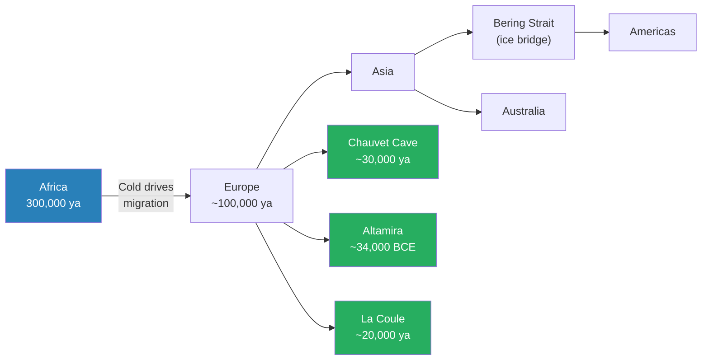
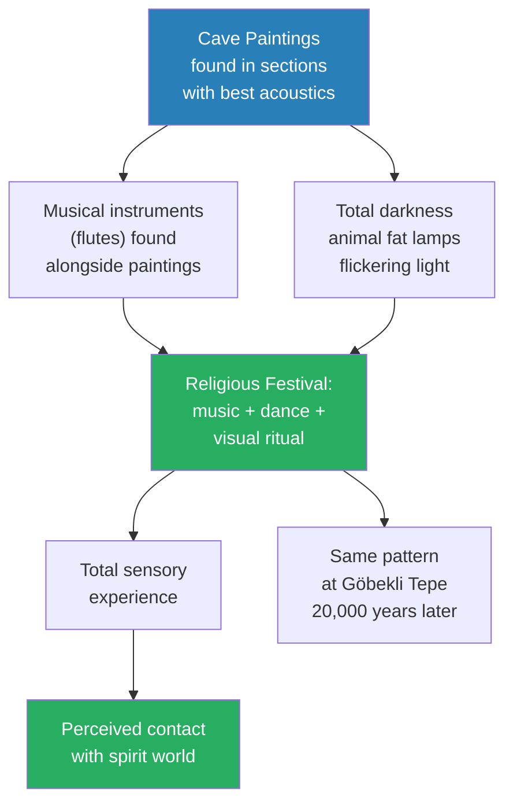
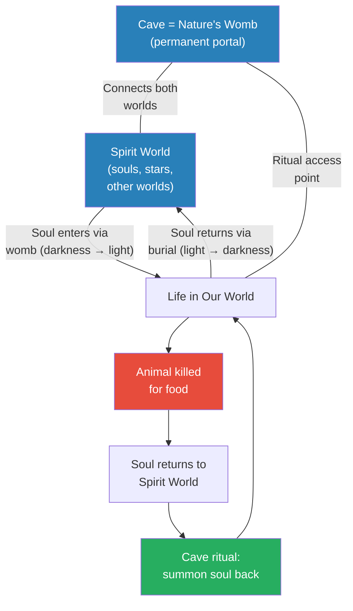
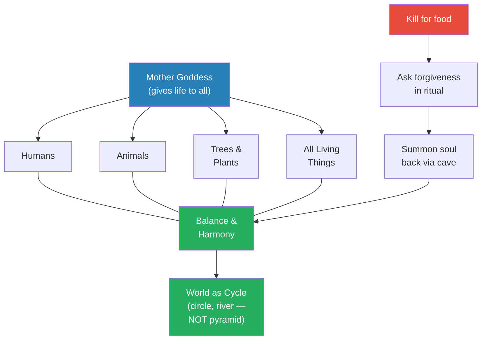
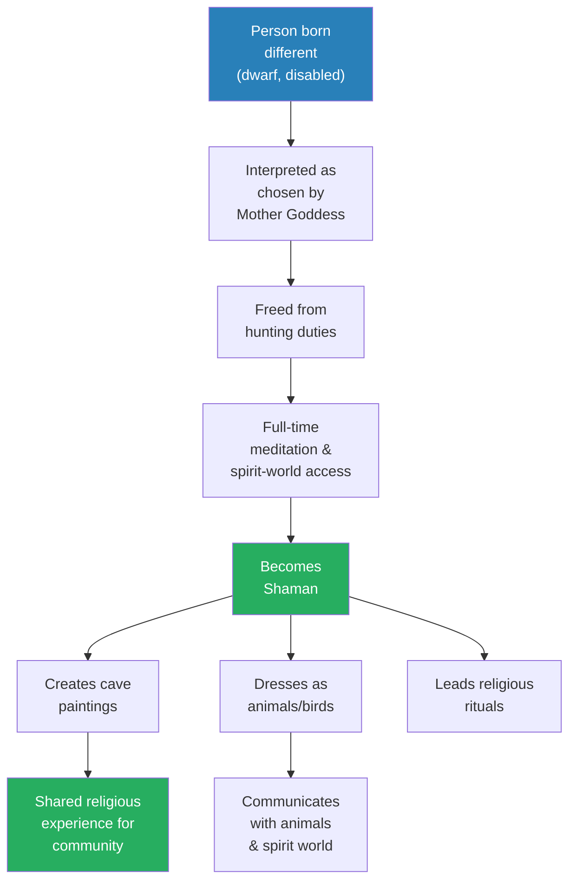
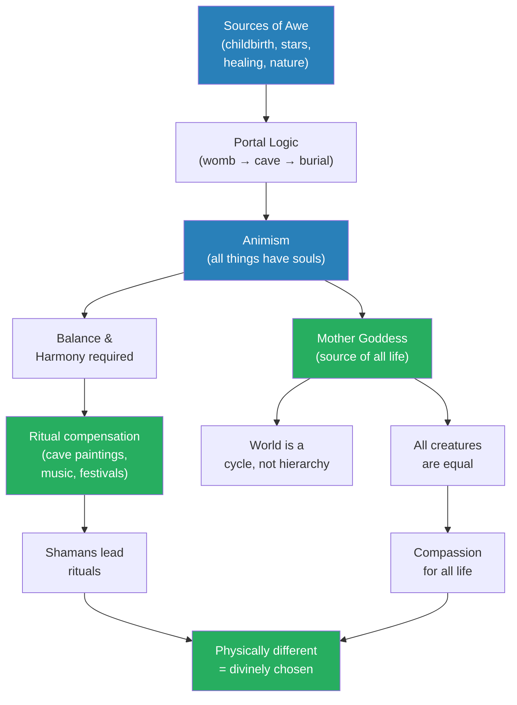
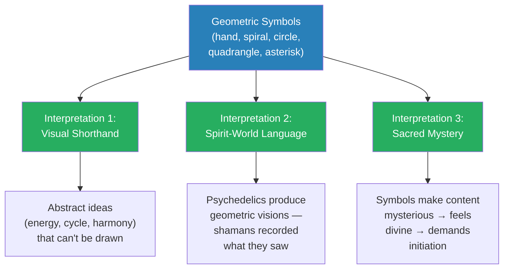
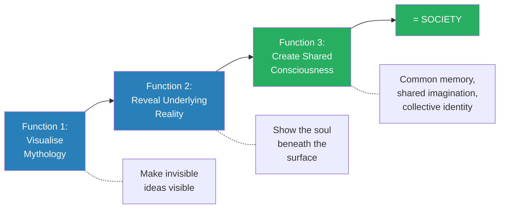
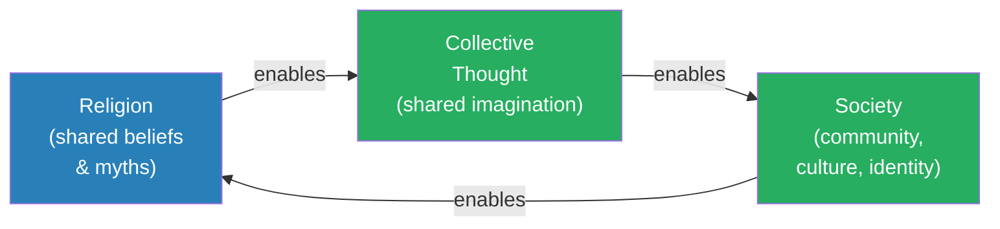
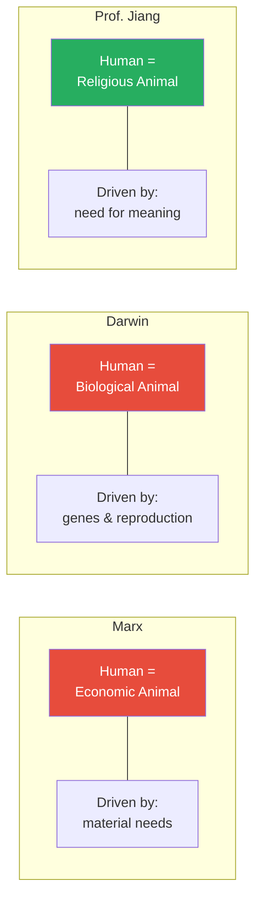

# Religion and the Dawn of Society

> Prof. Jiang pushes the argument from Lecture 1 deeper into the past. If religion drove the agricultural transition 12,000 years ago, has it always been there? Using Ice Age cave paintings dating back 30,000–40,000 years, he reconstructs humanity's first religion — animism: the belief that every living thing has a soul and that nature is an interconnected whole governed by a Mother Goddess. Citing Émile Durkheim, he argues that religion IS society — collective thought is impossible without shared belief, and shared belief is impossible without community. We are, first and foremost, religious animals.

---

## The Question

*If religion drove the transition to agriculture 12,000 years ago, how far back does religion actually go — and what role does it play in making us human?*

Lecture 1 established the scholarly consensus that religion, not rational self-interest, compelled the transition to agriculture. The evidence from Göbekli Tepe, Jericho, and Çatalhöyük all pointed the same way: humans settled down to worship, not to farm. But that answer immediately raises a deeper question — the one Prof. Jiang places at the centre of this second lecture. If religion was powerful enough to drive humanity's most consequential behavioural change, it cannot have appeared out of nowhere at the moment of settlement. It must have been there before. How far before? And if it has been with us for tens of thousands of years, then perhaps religion is not merely something humans do. Perhaps it is something humans *are*.

Prof. Jiang's answer spans three claims, each more radical than the last: first, that religion has been with humanity since the dawn of consciousness, at least 30,000–40,000 years ago, as evidenced by Ice Age cave paintings found across the world; second, that the first religion was <b style="color: #2980b9">animism</b> — the belief that every living thing has a soul, that all life is interconnected, and that balance must be maintained through ritual; and third, that religion is not a product of civilisation but its precondition — without shared belief, there could be no collective thought, and without collective thought, there could be no society.

The stakes of this argument are enormous. If Prof. Jiang is right, then religion is not — as many modern people assume — a primitive superstition that humanity will eventually outgrow. It is not a phase in human development, superseded first by philosophy and then by science. It is the foundational operating system of the human mind. We could not be human without religion, and we could not have religion without being together. Strip it away and you do not get a cleaner, more rational human being. You get no human being at all.

## Key Concepts at a Glance

| Concept | One-line summary |
|---------|-----------------|
| **Animism** | Probably the first religion — every living thing has a soul; nature is interconnected and must remain balanced |
| **Mother Goddess** | The force that gives life to everything — all living things are her children and therefore equal |
| **Cave as portal** | Caves resemble the womb — portals between the spirit world and our world |
| **Shamans** | Often physically different people (dwarfs, disabled) chosen to communicate with the spirit world |
| **Psychedelics** | Plants that alter perception — shamans used them to access the spirit world and its symbolic language |
| **Immanuel Kant's constructivism** | Reality is not passively perceived but actively imagined by the mind |
| **Émile Durkheim's sociology of religion** | Religion is collective thought — it creates society, and society creates it |
| **Three views of human nature** | Marx: economic animal. Darwin: biological animal. Prof. Jiang: religious animal. All interplay. |
| **Cyclical worldview** | Early humanity imagined the world as a river or circle, not a pyramid — no hierarchy among gods or creatures |
| **Gender equality in early society** | Women were equal or superior — childbirth was sacred, the supreme deity was female |

---

## Into the Caves: Art That Is Not Art

The story of human religion does not begin with temples or scriptures or priestly hierarchies. It begins in darkness — in narrow, freezing caves where the air is thin and the only light comes from a burning lump of animal fat. Prof. Jiang opens the heart of his lecture by taking the students back to the Ice Age, a period that spans most of human existence and that most people never think about at all. For roughly 300,000 years, he reminds them, our species has walked the earth. For all but the last 12,000 of those years, the planet was locked in ice. Understanding what humans believed during that vast stretch of cold and darkness is the key to understanding what we are.

The Ice Age is not merely a backdrop to this story — it is the engine. Prof. Jiang wants the students to feel the cold, to feel the scarcity, to understand that for the overwhelming majority of our existence as a species, life was harsh, uncertain, and governed by forces that no one could explain. The warmth we take for granted — the stable, mild climate that allows agriculture, cities, and everything we call civilisation — is a recent anomaly. The Ice Age ended only about 12,000 years ago. Before that, the world was a fundamentally different place, and the humans who lived in it were shaped by its challenges in ways that remain embedded in our psychology and our need for meaning.

The background is stark. Around 100,000 years ago, worsening cold in Africa created scarcity, and that scarcity pushed small bands of humans outward — first into Europe, then into Asia, then across the frozen Bering Strait into the Americas, and finally from Asia down to Australia. By 20,000 years ago, humans had colonised every major landmass on the planet. But there were remarkably few of them — only about one million people in the entire world. One million, spread across every continent. The world was vast, and we were small.

Along the way, humans encountered other human species — Neanderthals, Denisovans — and interbred with them before becoming the sole surviving branch of the human family. "We interbred with them," Prof. Jiang says matter-of-factly, "until we became the dominant human species." The story of human migration during the Ice Age is a story of astonishing resilience — tiny bands of people, armed with nothing but fire, language, and each other, spreading across a frozen planet and adapting to every environment they encountered. It is also, as Prof. Jiang will argue, a story that only makes sense if those people had something more than survival instinct to sustain them. They had religion.

It is in this world of ice, scarcity, and tiny nomadic bands that the cave paintings appear — and Prof. Jiang frames the entire investigation around three questions that drive the scholarly debate: *How* were the paintings made? *Why* were they made? And the hardest question of all: *What do they mean?*

He begins with what we can see. Chauvet Cave in France, dating to roughly 30,000 years ago, contains stunning depictions of bison and rhinoceros. What strikes Prof. Jiang most about the Chauvet paintings is their composition: the animals are painted with no focal hierarchy, no single subject dominating the scene. Lions, horses, and rhinos share the wall as though nature itself is one interconnected picture — a detail that will matter enormously when the lecture turns to animism.

La Coule Cave, also in France, from about 20,000 years ago, features lions rendered with a power and dynamism that seems almost cinematic. And Altamira in Spain, dating back to approximately 34,000 BCE, shows horses — but not the way a biologist would draw them. These are not realistic portraits. They are imaginative representations, nature reimagined through a distinctly human lens. "They're not looking for a realistic depiction of animals," Prof. Jiang says. "They're trying to imagine the natural world in their own way." This distinction between realistic depiction and imaginative representation is important: it means the paintings are not records of what the artists saw. They are expressions of what the artists *believed* — visual theology, not nature photography.

The artistic quality is breathtaking, and Prof. Jiang drives the point home with a famous anecdote. When Pablo Picasso — arguably the greatest artist of the twentieth century — was invited to view Ice Age cave paintings in person, he emerged and declared: *"We learned nothing in 10,000 years."* The remark was not casual praise. It was an admission of humility from a man who had spent his entire life trying to see the world in new ways, only to discover that people living 30,000 years before him had already achieved what he was reaching for.

One detail that Prof. Jiang emphasises is that the cave paintings were not created in a single session by a single artist. They were a continuous process — different people, at different times, went to the caves and painted different pictures. They might have added more things to existing pictures as well, layering new images over old ones across centuries or millennia. This means the caves were not individual artistic statements but communal religious documents, accumulated over generations the way a cathedral accumulates chapels and stained glass over centuries. Each painting was a contribution to a shared sacred space — evidence not of a single visionary mind but of a sustained, multi-generational religious tradition.

And it was not just a European tradition. Prof. Jiang stresses that cave paintings have been found "all around the world" — not only in France and Spain but across multiple continents. This global distribution is important because it suggests that the impulse behind the paintings was not a local cultural invention but something deeper — something rooted in the common experience of being human during the Ice Age.

If people on different continents, with no contact with one another, independently began painting animals on cave walls as part of religious rituals, then the religious impulse itself must be fundamental to human nature. It is not a random cultural innovation but an expression of something hardwired into the way our species processes awe, mortality, and the mystery of being alive. This is the first hint of the argument Prof. Jiang will make explicit at the end of the lecture: that we are, before we are anything else, religious animals.

Humans migrated out of Africa as the Ice Age worsened, eventually colonising every continent despite numbering only about one million worldwide. Along this journey, they left cave paintings in Europe that date back tens of thousands of years — the oldest surviving evidence of religious belief. The three sites Prof. Jiang highlights span roughly 14,000 years of continuous artistic and spiritual practice, suggesting that these rituals were not isolated events but a deep, enduring tradition.

There is another observation about the paintings that Prof. Jiang flags as significant, though its full meaning only becomes clear later in the lecture: the paintings have no focus. There is no central subject, no hierarchy of importance among the animals depicted. You see lions, horses, bison, and rhinos sharing the same wall space, none larger or more prominent than the others.

"It's almost like nature is one interconnected picture," Prof. Jiang says.

At this point in the lecture, the remark seems merely descriptive — an aesthetic observation about composition. Later, when he introduces animism — the belief that all living things are equal children of the Mother Goddess — it will become evidence. The paintings have no hierarchy because the *worldview* had no hierarchy. The art reflects the religion.

### How They Painted

The technical challenge alone is staggering, and Prof. Jiang wants his students to feel the weight of it before they rush to interpretation. Inside a cave, there is no light — not dim light, not filtered light, but absolute darkness, the kind where you cannot see your own hand. The painters used animal fat as fuel for crude lamps that could illuminate only small sections of the walls at a time, casting a flickering, unsteady glow that must have made the animal figures seem to move. Their palette was limited to two colours: <b style="color: #e74c3c">red from ochre</b>, a type of clay found in the earth, and black from charcoal. With these rudimentary materials, working in near-total darkness, breathing stale air in temperatures that hovered near freezing, they produced images that rival anything in the history of art.

Prof. Jiang lingers on this point because it matters for what comes next. These were not comfortable conditions. The caves were not pleasant places — they were dark, cold, wet, and oxygen-poor. You could not live in them. You could barely breathe in them.

Nobody endures those conditions for decoration. Nobody crawls deep into a freezing tunnel, far from the light, where every breath is laboured, to make something pretty for no one to see. The animals on these walls were not meant to be admired. They were meant to be *used* — as part of a ritual, as part of a ceremony, as instruments of a purpose so important that discomfort, danger, and difficulty were irrelevant. Whatever drove these people underground, again and again, over thousands of years, was far more compelling than aesthetics. It was compulsion. It was need. It was, Prof. Jiang will argue, religion.

### Why They Painted — and Where

The critical clue, Prof. Jiang argues, is not what the paintings show but where they are located. Researchers discovered that the paintings were not scattered randomly through the caves. They were concentrated in the sections with the best acoustics — the chambers where sound resonated most powerfully. This is not a trivial observation. Of all the surfaces available inside a cave system, the painters consistently chose the ones that would amplify and enrich sound. Alongside the paintings, archaeologists have found musical instruments, particularly flutes — among the oldest manufactured objects ever discovered.

The implication is hard to avoid: these caves were not galleries. They were ritual spaces — performance venues, if you like, but for a performance that was sacred rather than entertaining. The paintings were part of a <b style="color: #2980b9">religious festival</b>: a gathering of hunter-gatherers who came together periodically — perhaps seasonally, perhaps at significant astronomical moments — for music, dancing, and collective worship.

Think of it this way: the cave was the cathedral. The paintings were the icons. The flutes provided the hymns. And the acoustically optimised chamber was the nave, designed (or rather, selected by nature and chosen by humans) to make every sound feel enormous, otherworldly, divine. In the flickering light of animal fat lamps, with music echoing off the stone walls, the painted animals would have seemed to move — to breathe, to run, to leap. The effect must have been overwhelming: a total sensory experience of sound, light, shadow, and image, all orchestrated to produce a feeling of contact with something beyond the everyday world.

The parallels with Göbekli Tepe from Lecture 1 are striking — both are spaces where nomadic people gathered for religious purposes long before anyone thought of farming. The cave festivals may have been the Ice Age precursors to the temple gatherings that, 20,000 years later, would lead to permanent settlement and eventually to agriculture.

The evidence from the caves points to a multi-sensory religious experience far richer than "looking at pictures." Acoustic optimisation, musical instruments, flickering light from animal fat lamps, and the physical discomfort of the cave environment — cold, dark, thin air — would have combined to create an altered state of consciousness even without psychedelics. The painted animals, seemingly moving in the unsteady lamplight, would have felt alive. The sound of flutes echoing off stone walls would have felt otherworldly. This was not passive viewing. It was immersive ritual — a total environment designed to dissolve the boundary between the everyday world and the spirit world.

In other words, Prof. Jiang tells the class, these paintings are not about art. They are about religion. They are the visual expression of the religious beliefs of Ice Age humanity. And if that is true, then religion is not 12,000 years old, as the evidence from the agricultural transition might suggest. It is at least 30,000 to 40,000 years old — and possibly older. The cave paintings are evidence that humanity's religious impulse — this need to understand why we are here, what we must be doing, and where we are going — has been with us from the very beginning.

But Prof. Jiang is careful to add a caveat that he repeats several times during the lecture, almost as a mantra of intellectual honesty: <b style="color: #e74c3c">"There is absolutely no agreement on any of these questions."</b> Cave paintings are abundant — they have been found all around the world — but the evidence about what they mean is extremely thin. There are no written records. These people were pre-literate. There are no living informants. There is no way to travel back in time and ask them.

Everything he presents today, he tells the students plainly, is his own personal interpretation based on his research and understanding of the evidence. Other scholars interpret the paintings very differently. Some see purely artistic motivation. Some see hunting magic. Some see astronomical records. "Please be aware that there are many different interpretations," he says, "and the evidence is extremely unclear about many of these things."

The honesty is refreshing, and it models something Prof. Jiang clearly wants his students to learn: confidence in your interpretation does not require certainty. You can hold a theory passionately while acknowledging that the evidence is incomplete. What matters is that the theory is internally coherent and that it accounts for more of the evidence than the alternatives. This is how scholarship works — not by proving things beyond doubt, but by constructing the most compelling interpretation available and holding it open to revision. It is also, as Durkheim will suggest later in the lecture, how religion works — and how science works too.

> [!example] Picasso in the Cave
> - Pablo Picasso, arguably the most famous artist of the twentieth century, was invited to view Ice Age cave paintings in person
> - The paintings he saw were created by people living 30,000 or more years ago — in freezing darkness, with ochre and charcoal, by the light of burning animal fat
> - After emerging from the cave, Picasso declared: "We learned nothing in 10,000 years"
> - He meant it literally — the artistic sophistication of Palaeolithic cave painters matched or exceeded anything the modern world had produced
> - The animals are not crude sketches but vivid, dynamic, emotionally resonant works of art
> - The horses at Altamira are not photographic — they are imaginative, stylised, alive with movement
> - The bison at Chauvet are painted without focal hierarchy, as though the entire natural world is one interconnected scene
> - Picasso's reaction suggests something profound: human creative and imaginative capacity has not improved in 30,000 years
> - If anything, the cave painters had advantages modern artists lack — total immersion in the natural world, no mediation through photographs or screens, direct daily contact with the animals they depicted
> **The lesson:** If our ancestors' artistic ability was equal to ours, their intellectual and spiritual sophistication was likely equal too. These were not primitive minds producing primitive work. These were fully modern human beings, grappling with the same questions we grapple with — and the cave was their cathedral.

> [!example] The Evidence Chain: Cave Paintings as Religious Ritual
> - **Location:** Paintings consistently found in sections with the best acoustics — optimised for sound, not for viewing
> - **Instruments:** Musical instruments, particularly bone flutes, found alongside cave paintings — among the oldest manufactured objects ever discovered
> - **Darkness:** Caves are totally dark — painters used animal fat lamps that illuminated only a few square feet at a time
> - **Conditions:** Caves are cold, wet, and oxygen-poor — you cannot live in them, and painting in them is physically arduous
> - **Duration:** Paintings at a single site span thousands of years — Chauvet was used from ~36,000 to ~30,000 years ago, a continuous tradition lasting longer than all of recorded history
> - **Global distribution:** Cave paintings with similar themes found on multiple continents, suggesting a universal human impulse rather than a local cultural invention
> - **Content:** Overwhelmingly animals — the creatures that hunter-gatherers killed and depended on — not portraits, not landscapes, not abstract patterns
> - **Composition:** No focal hierarchy among depicted animals — lions, horses, bison share wall space equally, as if all nature is one interconnected whole
> **The lesson:** No single piece of evidence proves that cave paintings are religious. Taken together, however, the combination of acoustic optimisation, musical instruments, extreme physical hardship, millennia of continuity, global distribution, and animal-focused content points overwhelmingly toward organised ritual — religion, not art.

> [!tip] The Key Shift in This Lecture
> Cave paintings are not art. They are religion. The location (best acoustics), the instruments found alongside them (flutes), and the ritual context (periodic gatherings) all point to the same conclusion: the oldest surviving human creative works are evidence of the oldest surviving human belief system. Religion did not begin with agriculture. It has been with us for as long as we have evidence of being human.

---

## Building a Religion from Scratch

This is the intellectual centrepiece of the lecture — the moment where Prof. Jiang stops presenting evidence and starts asking his students to think. He poses a challenge that is deceptively simple: imagine you have been transported back to the Ice Age. It is cold. You live in a small band of nomadic people. And your memory has been wiped — you have lost all modern knowledge, all science, everything you learned in biology class. You are starting from zero. Now look around you. What in this world fills you with awe? What makes you think there must be something greater than yourself? What cannot be explained?

The exercise is vintage Prof. Jiang — interactive, Socratic, designed to make students reconstruct an answer rather than passively receive one. He is not telling them what Ice Age humans believed. He is asking them to *become* Ice Age humans and discover the beliefs for themselves. The genius of the approach is that by the time he names the religion — animism — the students have already built it from first principles. They understand it not as a fact to memorise but as a logic to inhabit.

This method also reveals something about Prof. Jiang's philosophy of teaching. He does not believe that understanding comes from receiving information. It comes from constructing it. You have to build the belief system yourself, step by step, from the raw experience of being alive and aware and ignorant in a beautiful, terrifying world. Only then do you understand why the first humans believed what they believed — not because they were told to, but because the beliefs were the most reasonable response to what they experienced. If you were there, you would have believed the same things.

### The Sources of Awe

Prof. Jiang works through the exercise with the class, collecting their answers one by one. The Socratic method is on full display — he does not lecture at the students here, he draws the answers out of them, building the religion brick by brick from their own intuitions. What would amaze you about the world if you had no science to explain it? What would make you think there must be something larger, something supernatural, something governing this mysterious world?

The first thing, he says — and he says it with the quiet wonder of a father remembering the birth of his own children — is <b style="color: #27ae60">childbirth</b>. "I have three kids," he tells the students, "and I can tell you, when I first saw my child being born, I was amazed. You have this life come out of nothing." Without biology, without any framework for understanding reproduction, the appearance of a new human being from inside a woman's body is simply miraculous. It is the kind of event that demands an explanation larger than the physical. And if you cannot explain it, you must conclude that it is sacred — that some divine force is at work. This, Prof. Jiang suggests, is why women were considered sacred in early human society: they could do the one thing that most clearly demonstrated the existence of a power beyond human understanding.

The second is the stars. On a night with no light pollution — and in the Ice Age, there was no light pollution anywhere on earth — the sky is overwhelming. It is not a dark dome with scattered points of light, the way city dwellers experience it. It is a blazing canopy, dense with brightness, stretching in every direction. What are those lights? Perhaps souls. Perhaps other worlds. Perhaps other gods. "The first thing that you recognise," Prof. Jiang tells the class, "is that our world is just one of many worlds out there." This is a crucial move in the construction of animism: the recognition that visible reality is not all there is. Behind or beyond or above the world we inhabit, there are other worlds — and the lights in the sky are the evidence.

The third is healing. Someone falls ill, wracked with fever, lying near death — and then, inexplicably, recovers. How do you explain that? Without germ theory, without pharmacology, without any understanding of the immune system, the only explanation available is that something invisible is at work. Perhaps the body has a soul, and disease is the result of the soul and the body falling out of alignment. Healing, then, is the process of bringing them back together — realigning the invisible with the visible, the spiritual with the physical.

Prof. Jiang draws a parallel that grounds the idea in something his students already know: traditional Chinese medicine operates on this exact same principle. The body has energy — *qi* — that flows through channels, and illness results from blockages or imbalances in that flow. The doctor's job is not to fight an invading pathogen (that is the Western model) but to restore harmony between the body's physical and energetic dimensions. The idea has survived for millennia across cultures — Chinese medicine, Ayurvedic medicine, indigenous healing traditions around the world — because it captures something intuitively compelling about the subjective experience of illness and recovery. When you are sick, you feel divided against yourself. When you heal, you feel whole again. The body-soul theory is a precise description of that subjective experience, even if its metaphysics are wrong.

This body-soul duality is also important for another reason: it introduces the idea that there is an invisible dimension to reality — a dimension that is just as real as the physical world but that cannot be seen with the eyes. This invisible dimension will become the spirit world. And the belief that reality has a hidden layer, a deeper truth beneath the surface, will eventually lead Prof. Jiang to Immanuel Kant and the philosophical claim that reality itself is something we imagine rather than something we see.

In a sense, the body-soul duality is the first philosophy. It is the first time a human being looks at the world and says: what I can see is not all there is. There is something more — something invisible, something that explains why the visible world behaves the way it does. This is the same impulse that will, tens of thousands of years later, produce atomic theory, quantum mechanics, and the search for dark matter. The scale changes. The instruments change. The impulse remains the same: there must be something behind what we can see.

The fourth is nature itself — the sheer vastness and power of the natural world. The animals, the trees, the rivers, the storms, the seasons cycling endlessly. All of it operating with a regularity and a beauty that seems to speak of design, of intention, of an intelligence behind the scenes.

If you are a small, cold human standing at the edge of an Ice Age forest, watching a herd of bison move across the plain like a single living wave, it is very difficult not to feel that something greater than yourself is at work. The forest breathes. The river flows. The stars wheel overhead. There is a rhythm to it all — a pattern that invites explanation. And the simplest explanation, the one that accounts for both the beauty and the danger, is that the world is alive. Not metaphorically. Actually alive — filled with spirit, governed by a force that humans can feel even if they cannot see it.

These four sources of awe — childbirth, the stars, healing, and the natural world — are the raw materials of religion. They are the experiences that make a purely physical, purely material explanation of reality feel inadequate. From these experiences, the mind reaches for something more. It reaches for explanation. And the explanations, Prof. Jiang will now show, connect into a system of startling coherence — a system so elegant that it feels not invented but discovered.

What is remarkable about Prof. Jiang's exercise is how naturally the pieces fit together. He has not imposed a theory on the students. He has simply asked them to pay attention to the world as an Ice Age human would, and the world itself has suggested the theory. Awe leads to questions. Questions lead to explanations. And the explanations — because they all spring from the same experience of living in an interconnected natural world — naturally converge into a unified belief system. The religion does not need to be imposed from above by a prophet or a priest. It grows organically from below, from the shared experience of being small, mortal, and bewildered in a vast and beautiful world.

### The Portal Logic

Prof. Jiang's reconstruction of Ice Age theology begins with the most primal of human experiences — the mystery of birth — and builds outward with the elegant symmetry of a geometric proof. Each step follows logically from the one before, and by the end, the entire belief system feels not invented but discovered, as though it could not have been otherwise. This is the section of the lecture where Prof. Jiang is at his most compelling, because he is not merely presenting a theory — he is *performing* a reconstruction, building the theology in real time with the students, asking questions, collecting answers, and showing how each answer leads inexorably to the next.

The logic moves through four stages: from childbirth to the portal metaphor, from the portal to the cave, from the cave to the summoning ritual, and from the ritual to the complete animistic worldview. At each stage, the students provide the key insight, guided by Prof. Jiang's questions. By the end, they have constructed a full religion — and they have done it themselves.

Start with childbirth. A new life emerges from the mother's womb — from darkness into light. If you have no biology to explain what happened, you need a metaphor. And the most natural metaphor is a <b style="color: #2980b9">portal</b>: the womb is a doorway through which a soul travels from another world — the spirit world — into ours. The soul existed before birth. It will exist after death. The womb is simply the passage. "What is the womb?" Prof. Jiang asks the class. A student answers: "A portal. A door." Exactly. The womb is the gate through which beings from the spirit world enter the physical world. And notice what the womb is, physically: a space of darkness. The soul comes from darkness into light. Birth is a journey from one world to another, through a tunnel of dark.

Now consider death. If the womb is a portal that brings souls from the spirit world into our world — from darkness into light — then how do souls return? Prof. Jiang poses the question and lets the students work it out. The answer is symmetrical, and the symmetry is what makes the whole system feel elegant rather than arbitrary. We bury the dead — we place them back into darkness, back into the earth. "The soul comes into our world from the mother's womb, from darkness," Prof. Jiang explains, "and then for us to return the soul back into the original world, we bury this person in darkness, and that carries that person back." Burial is the return portal. The soul entered through darkness and leaves through darkness. Birth and death are mirror images of the same journey — two doors in the same corridor, one opening inward, one opening outward.

And here is where the caves enter the picture — the moment where the entire reconstruction clicks into place. What in nature, Prof. Jiang asks the students, most resembles a mother's womb? The answer is immediate: a cave. A dark tunnel leading into the earth. A space of enclosed darkness that connects the surface world to something deeper, something hidden, something that cannot be seen. If the womb is a portal for human souls, and burial returns souls to the spirit world, then a cave — nature's womb — is a permanent portal between the two realms. It is always open, always accessible, always sacred. Unlike a mother's womb, which opens for one birth and closes, the cave is there every day, waiting.

This is why people painted in caves. Not because caves were convenient or sheltered — they were, as Prof. Jiang has already stressed, terribly inconvenient: dark, cold, and oxygen-poor. People painted in caves because caves were <b style="color: #27ae60">portals to the spirit world</b>. And this is why they painted animals. Hunter-gatherers killed animals to survive. When an animal died, its soul returned to the spirit world through the portal of death. But the community still needed the animal — next season, next year, the herds had to return. So they went to the cave — nature's portal — and performed rituals to summon the animal's soul back from the spirit world into the physical world. The paintings are not pictures. They are prayers. They are invocations. They are the visual component of a ritual designed to maintain the flow of life between two worlds.

Prof. Jiang pauses to let the logic sink in, and you can sense the students beginning to see the coherence of it. The cave paintings — their location deep underground, their subject matter (overwhelmingly animals), their ritual context (music, gathering, festival) — all make sense within this framework. They are not mysteries to be decoded individually. They are parts of a single, integrated belief system.

There is also a profound emotional logic at work. These people killed animals every day to survive. Without modern slaughterhouses and plastic-wrapped meat, they experienced killing intimately — the blood, the struggle, the moment of death. They saw the light leave the animal's eyes.

If you believe that animal has a soul — that it is your sibling, a child of the same Mother who gave you life — then killing it is not a neutral act. It is a moral event. It requires acknowledgment, grief, and reparation. The cave ritual provides all three: the painting honours the animal, the music mourns it, and the ceremony asks forgiveness and summons it back.

It is not merely a superstitious practice. It is a moral framework for living with the violence that survival demands. Modern societies have no equivalent. We hide the killing in factories, wrap the result in plastic, and consume it without ritual, without acknowledgment, without any sense of debt. The animists' approach was more honest — and arguably more psychologically healthy. They killed with full awareness of what they were doing, and they had a system for processing the moral weight of it.

The portal logic of animism is built on a single spatial metaphor: darkness is the passage between worlds. Souls enter our world through the darkness of the womb and leave through the darkness of burial. Caves — dark tunnels into the earth — are nature's permanent portals, always open for ritual use. When an animal is killed, its soul returns to the spirit world; the cave ritual summons it back, maintaining the cycle of life. Every element of this system — birth, death, hunting, art, ritual — connects through the same underlying logic.

Prof. Jiang extends the portal concept beyond caves during a student exchange later in the lecture. A student asks about the relationship between caves and agricultural settlements — could people live near caves? Prof. Jiang clarifies that you cannot live in a cave: there is no food, no oxygen, and the conditions are miserable. But the portal logic does not stop at caves. What other places in nature, he asks, might feel like portals — places where the physical world seems to touch the spirit world? The students offer answers, and Prof. Jiang confirms two: <b style="color: #2980b9">mountaintops</b> and <b style="color: #2980b9">rivers</b>. Mountaintops reach up toward the sky, the domain of the Mother Goddess. Rivers flow continuously, as if carrying something invisible from one place to another. Both feel liminal — boundary places where the rules of the ordinary world seem thinner.

And then the connection to Lecture 1 snaps into focus. "Guess what Göbekli Tepe was on?" Prof. Jiang asks. "A mountaintop." When humans settled down and began building permanent religious sites, they chose the same kinds of places that the portal logic identified as sacred: mountaintops and riversides. The religion came first. The choice of location followed from the religion. Agriculture, as always in Prof. Jiang's telling, came last — the reluctant consequence of communities that had grown too large to feed by hunting alone.

> [!example] Sacred Geography — Portals Beyond the Cave
> - A student asks Prof. Jiang about the relationship between caves and settlement — could people live near caves?
> - Prof. Jiang clarifies: "You can't live in a cave. There's no oxygen. It's too dark, it's too cold. You can only go there now and then"
> - But the portal logic extends beyond caves — other places in nature also feel like boundaries between worlds
> - **Mountaintops:** reaching up toward the sky, the domain of the Mother Goddess — elevated, exposed, close to the stars
> - **Rivers:** continuously flowing, as if carrying invisible energy from one place to another — liminal, always in motion, never the same
> - These are places where the physical world seems thinner, where the separation between worlds feels less absolute
> - **Key evidence:** Göbekli Tepe — the world's first known temple — was built on a mountaintop
> - Early agricultural settlements consistently formed around rivers and on elevated ground
> - The choice of settlement location was not random or purely practical — it was religious
> **The lesson:** The portal logic did not stay in the caves. It mapped sacred geography onto the entire landscape, and when humans finally settled down, they chose locations that their religion had already identified as spiritually significant. Religion determined where civilisation would be built.

### The Interconnection Principle

From the portal logic, Prof. Jiang draws out the broader implication that transforms a set of rituals into a complete worldview. If animals have souls — if their souls travel the same paths as ours, through the same portals, between the same worlds — then animals are not fundamentally different from humans. They are our equals. They are, in a real sense, our siblings. This is where the observation about the cave paintings having "no focus" becomes meaningful. The paintings depict lions, horses, bison, and rhinos sharing the same wall without hierarchy because, in the animistic worldview, they genuinely were equal — all children of the same Mother, all possessing the same sacred spark of soul.

And it is not just animals. Trees, plants, insects, every living thing — all of them have souls. All of them are connected to the same spirit world. All of them are children of the same force. Prof. Jiang names this force: the <b style="color: #2980b9">Mother Goddess</b>. She is the power that gives life to everything. The sky is her domain — birds are her emissaries. She is not a ruler sitting atop a hierarchy, issuing commands downward. She is more like a river running through all things, connecting them, sustaining them, making them part of one living whole. Or perhaps she is more like the mycorrhizal network Prof. Jiang will mention later — invisible, omnipresent, linking every root to every other root in a web of mutual sustenance.

If every living thing is the Mother Goddess's child, then every living thing is equal. Trees are equal to animals. Animals are equal to humans. There is no hierarchy in nature — no species that is inherently superior, no creature whose soul matters more than another's. The world is not a pyramid with humans at the top — an image that would only emerge much later, with the arrival of monotheism and the idea of a single supreme God granting dominion to a chosen species. Instead, the world is a <b style="color: #27ae60">circle</b> — a cycle in which every creature has a role to play, and the health of the whole depends on each part fulfilling its function. Nothing is more important than anything else. Nothing is expendable.

But this raises an obvious problem, and Prof. Jiang knows it, because he immediately puts it to the class: if animals are our brothers and sisters, what gives us the right to kill them? The students offer various answers — survival, necessity — but Prof. Jiang pushes deeper. The answer, within the logic of animism, is that the Mother Goddess has a plan. Each creature has a function in maintaining the balance of the world. Humans must eat, and if they do not kill animals, they will die. But there is a second, more ecological dimension: if animals are not killed, their populations will grow unchecked and the balance of the whole system will be disrupted. Too many deer means too little forest. Too many predators means too few prey. Everything has a role to play in maintaining the equilibrium.

This is a surprisingly sophisticated ecological insight for a belief system tens of thousands of years old — a recognition that ecosystems function as wholes, that the health of any part depends on the proper functioning of every other part. Killing is permitted, even necessary. But it comes with a sacred obligation: you must ask forgiveness, and you must ritually return the animal's soul to the cycle.

You cannot simply take. Every action requires compensation. Every taking requires a giving-back. The ritual in the cave — the music, the painting, the ceremony — is that compensation. It is the debt payment that keeps the spiritual economy in balance. And it is, Prof. Jiang implies, a far more honest relationship with the violence of eating than the modern one, where the killing is hidden in factories and the debt is never acknowledged at all.

Prof. Jiang also draws an important structural contrast that foreshadows later lectures. In this early worldview, the world is not a pyramid. There is no hierarchy — no god who is greater than other gods, no species that sits above other species, no person who outranks other persons. The world is a <b style="color: #27ae60">circle</b>, a cycle, a river. "Maybe today, you can think of a pyramid," Prof. Jiang tells the class. "There's people at the top. But back then, they would think like it's a river. We're all part of the river. It just goes in circles." The introduction of hierarchy — the idea that some beings are higher than others, that power flows downward from a single supreme authority — came much later, with monotheism. That transition from circle to pyramid, from equality to hierarchy, is one of the most consequential shifts in human history, and Prof. Jiang flags it as a major topic for future lectures.

A student asks about monotheism directly — a good question, since it forces Prof. Jiang to clarify the difference between the animistic and monotheistic worldviews. The three major religions of today — Christianity, Islam, and Judaism — are all monotheistic, believing in one God. But monotheism, Prof. Jiang explains, is a very recent innovation. Ice Age humans would not have had a concept of power hierarchy among gods. The Mother Goddess gives birth to our world, but perhaps there is another god who gives birth to another world — like the stars, each one perhaps a separate world with its own divine source. There is no ranking, no supreme deity above all others. The gods are like the stars: scattered, equal, everywhere. "There's no hierarchy in the stars," Prof. Jiang says. "They're all over the place."

If the world is a cycle rather than a hierarchy, then what constitutes sin or wrongdoing? In a hierarchical religion, sin is defying God's law — violating the rules handed down from above. In a cyclical religion, wrongdoing is disrupting the balance. Prof. Jiang offers examples from the student Q&A: incest, which violates the natural order of reproduction and creates disharmony within the community, and killing animals without performing the proper sacrificial rituals — taking from the cycle without giving back. "Things go wrong when there's conflict inside this river," he says, "when people don't do things they're supposed to be doing."

This is a genuinely different moral framework from the one most modern people operate within. In monotheistic religions, the question is: "Did I obey God's law?" In animism, the question is: "Did I maintain the balance?" The first is about authority — obeying a power above you. The second is about ecology — maintaining a web around you. The first produces guilt (I defied the law). The second produces ritual obligation (I must restore what I took). These are profoundly different ways of relating to morality, and Prof. Jiang will trace the consequences of the shift from one to the other throughout the series.

In this world, religion is essentially <b style="color: #2980b9">ritual</b> — habits, practices, and actions performed to maintain the balance that keeps the cycle turning. Belief, in the sense of holding certain propositions to be true, is secondary. What matters is what you *do*, not what you *think*. You perform the sacrifice. You sing the songs. You paint the animals. You dance in the cave. The religion lives in the doing. This insight — that early religion was ritual rather than belief, action rather than creed — is something Prof. Jiang promises to explore in depth in [[03 - The Religious Imagination]].

> [!abstract] Animism vs. Monotheism — A Preview of What Changes
> | Feature | Animism (Ice Age) | Monotheism (later) |
> |---------|------------------|-------------------|
> | **Gods** | Many — no hierarchy among them | One supreme God |
> | **World structure** | Cycle (river, circle) | Hierarchy (pyramid) |
> | **Human-nature relationship** | Equals — all creatures have souls, all are siblings | Humans given dominion over nature |
> | **Gender** | Women equal or superior — childbirth is sacred, deity is female | Men dominant — deity is male |
> | **What constitutes sin** | Disrupting balance (incest, killing without ritual) | Defying God's law |
> | **Moral framework** | Ecological — maintain the web around you | Authoritarian — obey the power above you |
> | **Religion in practice** | Ritual action (doing) | Doctrinal belief (thinking) |
> Monotheism's introduction of hierarchy will transform every aspect of human society. Prof. Jiang flags this as a major topic for future lectures — the shift from circle to pyramid is one of the most consequential revolutions in human history, and it will take many lectures to trace its causes and consequences.

This is <b style="color: #2980b9">animism</b>: the belief that every living thing — whether tree, mosquito, person, or mountain stream — has a soul; that all souls are interconnected as children of the Mother Goddess; and that the world must remain in balance through ritual compensation for every act that disturbs the natural order. It is, in Prof. Jiang's assessment, probably the first religion humans ever practised. And it is not extinct. Indigenous peoples in North America, South America, and Australia still hold versions of this belief. Buddhism, too, carries animistic elements — the interconnection of all living things, the sanctity of every life. What we call "primitive" religion turns out to be a worldview of remarkable depth — one that modern ecology is only now beginning to catch up with.

The animistic framework also closes the loop on the cave paintings. Why are they in caves? Because caves are portals. Why do they depict animals? Because the animals' souls must be summoned back after being killed. Why is there no hierarchy among the animals depicted? Because in the animistic worldview, all creatures are equal. Why were the paintings accompanied by music and ritual? Because the summoning is a religious act — a performance of the community's deepest beliefs about how the world works and how balance is maintained. Every question that opened the lecture now has an answer, and every answer is internally consistent with every other. Whether or not Prof. Jiang's reconstruction is historically accurate, it is undeniably coherent — and that coherence is itself a kind of evidence.

Prof. Jiang also draws a broader inference about the character of Ice Age society. "From this religion," he tells the class, "we can guess that the people back then were extremely compassionate." If every living thing has a soul, and every soul is precious, and the Mother Goddess loves all her children equally, then the moral universe of animism demands radical compassion. You cannot discard a person because they are different. You cannot exploit nature without consequence. You cannot take without giving back. The religion, by its own internal logic, produces a society that values every member — a society where the dwarf is honoured, where the disabled are revered, where the weak are protected not despite but because of the beliefs that hold the community together.

The Mother Goddess sits at the centre of the animistic worldview — not as a ruler above creation but as the source flowing through it. Every living thing is her child, and therefore every living thing is equal. The world is imagined as a cycle, a river, a circle — not the hierarchical pyramid that later religions and civilisations would impose. Balance is maintained through ritual: when you take a life, you must give something back.

This ecological ethic — remarkably sophisticated for a belief system originating in the Ice Age — demanded that humans see themselves as participants in nature rather than masters of it. There is no concept here of human dominion over the natural world, no idea that the earth exists for human exploitation. The relationship is reciprocal: nature feeds us, and we feed nature back through ritual. The cave paintings, the music, the festivals — all of it is a form of payment, a way of honouring the debt that living incurs. This is as far from the modern industrial relationship with nature as it is possible to get, and Prof. Jiang clearly finds the contrast instructive.

> [!tip] The Interconnection Insight
> Animism is not primitive. It is a coherent, ecologically sophisticated worldview that modern science has only recently begun to confirm. The belief that all living things are interconnected — that the health of the whole depends on the balance of its parts — is the foundational principle of ecology. Ice Age humans arrived at this insight through awe and intuition. We arrived at it through electron microscopes and mycorrhizal network research. The destination is the same.

### Modern Evidence for an Ancient Intuition

Prof. Jiang pauses the theological reconstruction to share a piece of modern science that would have delighted the animists: the discovery that trees communicate with each other. Scientists have found that trees in a forest are connected through <b style="color: #2980b9">mycorrhizal fungi</b> — vast underground networks of mushrooms linking root systems across thousands of trees. Through these networks, trees share information and resources in ways that look remarkably like the behaviour of a single organism.

If one tree in one part of the forest lacks water or nutrients, other trees will send resources to it through the fungal network. If pests or insects attack a single tree, that tree communicates the threat to others, which begin preparing their defences in advance. And most strikingly, mother trees recognise their own offspring — when their seedlings need nutrients, the mother trees send them preferentially, before helping others.

The forest, in other words, behaves like one interconnected living system — exactly what animism claimed it was, tens of thousands of years before anyone had a microscope. Prof. Jiang's point is not that animism was scientifically accurate in its specifics — it speaks of souls, not of fungi — but that people living in constant, daily contact with nature could *sense* the interconnection that modern biology has only recently confirmed. They watched how the forest responded to drought and disease. They noticed that when one part of the forest suffered, other parts seemed to respond. They saw mother trees shading their young, sending nutrients their way, protecting them.

Their intuition was sound. Their metaphor — that every living thing has a soul and that all souls are connected — captured a truth about the natural world that the reductionist science of the last few centuries had to rediscover the hard way. When modern ecologists describe forests as interconnected superorganisms, they are saying in scientific language what animists said in spiritual language 30,000 years ago. The vocabulary is different. The insight is the same.

> [!example] Trees That Talk — The Mycorrhizal Network
> - Scientists discovered that trees communicate through underground fungal networks called **mycorrhizal fungi**
> - Thousands of trees in a forest are linked through these mushroom networks at their roots
> - If one tree lacks water or nutrients, other trees send resources through the network to sustain it
> - If pests or insects attack a single tree, it sends a chemical signal — other trees begin preparing defences immediately
> - Mother trees recognise their own seedlings and send them nutrients preferentially
> - The forest functions as a single interconnected organism — a "wood wide web"
> - Hunter-gatherers living in constant contact with nature could intuit this interconnection without needing to understand the mechanism
> - The animistic belief that "every living thing has a soul and all are connected" anticipated by millennia what ecology now calls ecosystem interdependence
> **The lesson:** The first religion was not a fantasy. It was an intuitive theory of ecology — imprecise in its mechanism but correct in its central claim that the natural world is a web of interconnected, communicating life.

> [!example] The Romito Dwarf — Compassion as Evidence of Belief
> - Archaeologists found a skeleton from approximately 10,000 years ago — a person with dwarfism, known as "Romito 2"
> - As a dwarf, this person could not have contributed much to hunting — the primary survival activity of a hunter-gatherer band
> - In a harsh survival environment, one might expect disabled individuals to be abandoned or left behind
> - But DNA and bone analysis reveal that this person ate exactly the same food, of the same quality, as everyone else in the community
> - At the end of life, the dwarf received an elaborate, lavish burial — a mark of high status, not pity
> - David Graeber and David Wengrow document in *The Dawn of Everything* that "neither is Romito an isolated case" — Palaeolithic burials show high frequencies of individuals with disabilities, all given extensive care
> - The best explanation: physically different people were interpreted as **specially chosen by the Mother Goddess**
> - Their difference was not a deficit but a divine gift — a sign that the Mother Goddess had marked them for a special purpose
> - That purpose was most likely to serve as **shamans** — mediators between the human world and the spirit world
> - Being unable to hunt freed them for full-time religious practice: meditation, ritual, and the creation of cave paintings
> **The lesson:** Early human societies were not brutal or indifferent to weakness. Their religion demanded compassion — every soul was precious because every living thing was a child of the Mother Goddess. Difference was not disability but divine election.

### Shamans — The Bridge Between Worlds

Among the figures painted on cave walls, some of the most intriguing are neither fully human nor fully animal. They have human bodies but the heads or features of birds, bulls, or other creatures — hybrid beings that seem to occupy a space between the two worlds. Prof. Jiang identifies these as representations of <b style="color: #2980b9">shamans</b> — the religious specialists of Ice Age society, people who served as intermediaries between the human world and the spirit world. One particularly clear image, which Prof. Jiang shows the class, depicts what is unmistakably a human figure but with animal features — "This is clearly an animal, but this is also a person who's an animal, who's a human being, because of the figure." The ambiguity is the point. The shaman inhabits both worlds simultaneously.

The bird-like figures are particularly significant. In the animistic worldview, the sky is the domain of the Mother Goddess, and birds — the only creatures that can fly through it — are her closest emissaries. Prof. Jiang reminds the students of a connection from Lecture 1: at Çatalhöyük, the Mother Goddess was represented as a bird, and vultures (sky birds) played a central role in burial rituals. Here, 20,000 years earlier, the same association appears — evidence that this thread of belief stretches back deep into the Ice Age.

Shamans dressed as birds to channel the Mother Goddess's energy, to assert a connection with the divine realm. "It's almost like the Mother Goddess is channelling or herding the animals from the spirit world back into our world," Prof. Jiang says, describing one cave painting where bird-like figures appear to guide a herd of gazelles. The image is remarkable: two beings with bird-like features standing at the edge of a herd, directing the animals as if shepherding them from one world into another.

But shamans did not dress only as birds. They also dressed as other animals — as bulls, as deer, as creatures of the forest — because doing so allowed them to communicate with animal spirits more effectively. The shaman was not merely a priest performing rituals at a distance. The shaman was a translator, a shapeshifter in spirit if not in body, fluent in the language of multiple worlds. By becoming an animal — by donning its skin, mimicking its movements, inhabiting its perspective — the shaman could bridge the gap between the human community and the animal spirits it depended on for survival.

Prof. Jiang connects the shamans back to the evidence of the Romito dwarf and similar burials. The people chosen to be shamans were often those whom society considered physically different — dwarfs, people born with disabilities or unusual features. In a worldview where everything is interconnected and every divergence from the norm must have meaning, physical difference was not a deficit. It was a sign. If the Mother Goddess made you different, she must have had a reason. You were marked for something special. And the most special role in the community was the one that required not physical strength but spiritual sensitivity — the shaman, the person who could see what others could not, who could travel between worlds.

Prof. Jiang puts this logic to the class explicitly. "Let's make the assumption that he was, in fact, contributing to the community," he says about the Romito dwarf. "How could he contribute? If you're a dwarf, you can't hunt. What can you do?" The students offer suggestions — he could prepare food, perhaps. But Prof. Jiang pushes them: "Why would they think he was a special person? What could he do that others couldn't?" The answer, when a student finally arrives at it, is exactly what the logic of the religion predicts: he could communicate with the spirit world. "Maybe the religion back then is that everyone is special, everyone's the same," Prof. Jiang says. "You're different — it doesn't mean you're less special. It means you're more special. It means that the Mother Goddess has given you a special power, and maybe this power is to communicate with the spirit world."

Being a dwarf freed you from hunting. That freed time could be invested in meditation, in religious practice, in the deep communion with the spirit world that produced the cave paintings. "Clearly," Prof. Jiang says, "if you look at the cave paintings, they were done by a special mind." A person who sees the world differently — who has always been set apart, who has had decades to cultivate an inner life — is exactly the kind of person who could produce art of such depth and strangeness.

"And if you are a dwarf," he adds, "you clearly see the world in a different way. And being a dwarf, it makes the most sense to be a shaman — not only because people think you're special, but because you can invest time into meditation, into religious practice that enables you to communicate with the spirit world."

The cave paintings may well be the work of shamans — people who were honoured precisely because they were different, people whose physical limitations became the source of a spiritual authority that the rest of the community depended on. This is not speculation without evidence. As Graeber and Wengrow document, Palaeolithic burials consistently show that individuals with disabilities received "high levels of care until the time of death" and "remarkably lavish" funerals. These were not people being kept alive out of pity. They were being honoured for a role that the community could not survive without — the role of intermediary between the visible world and the invisible one.

The path from physical difference to spiritual authority follows a logic that is internally consistent and deeply humane. Disability was reinterpreted as divine selection, freeing the individual from the practical demands of hunting and enabling full-time devotion to the spiritual work that held the community together. The shaman dressed as animals and birds to communicate across the boundary between worlds — and the cave paintings they created were not personal expressions but communal religious experiences, the visual liturgy of humanity's first church.

This understanding of disability is, Prof. Jiang notes, a striking inversion of modern assumptions. In contemporary society, physical difference is often treated as a limitation — something to overcome or compensate for. In the animistic worldview, <b style="color: #27ae60">being different made you more special, not less</b>. It meant the Mother Goddess had given you a power that ordinary people did not possess: the ability to see beyond the surface of the physical world into the spirit world that lay behind it. The community did not merely tolerate its disabled members. It revered them. This single fact — that the most honoured people in Ice Age society were often those we would today call disabled — tells us more about the moral universe of animism than any amount of theological reconstruction.

### Gender and the Sacred Feminine

Prof. Jiang draws one more major implication from the animistic worldview before the lecture turns to symbols and philosophy: the status of women. In this early religious world, <b style="color: #27ae60">women were equal or superior to men</b>. The logic is straightforward and, within the animistic framework, irresistible.

Childbirth is the most sacred event in the animistic world — the moment when a soul passes through the portal from the spirit world into ours. It is mysterious, awe-inspiring, and inexplicable without divine intervention. And only women can do it. Men cannot give birth. Men cannot perform the most important act in the entire spiritual economy of the world. If the supreme deity is the Mother Goddess — female, the giver of all life — and if the most sacred act is childbirth — also female — then the conclusion is inescapable: women are closer to the divine than men.

"Back then," Prof. Jiang tells the class, "there was no separation of sexes. If anything, women were considered superior to men. Remember, the god is a Mother Goddess — a female — and therefore women are more special than men. And they know this because women give birth, not men. And childbirth is mysterious."

Male dominance, in this telling, is a historical aberration — a recent development that reversed the natural order of the animistic world. Prof. Jiang promises to explain how this reversal happened in Lecture 3. For now, the point is clear: the gender hierarchy that modern societies often treat as natural and inevitable was, for most of human history, either absent or inverted.

The "original" human society — if such a thing can be said to exist — was one in which women held the spiritual and possibly the social upper hand. The patriarchy is not a human universal. It is a human invention, and a relatively recent one. This claim will resurface throughout the series as Prof. Jiang traces the mechanisms — war, property, monotheism — through which male dominance was established and then naturalised until it seemed like the way things had always been.

This concept map traces the logical architecture of the entire first half of the lecture. Everything begins with awe — the irreducible human experience of wonder in the face of childbirth, stars, healing, and nature. From awe comes the portal logic, the elegant metaphor of darkness as the passage between worlds. From the portal logic comes animism, the belief that all living things share souls and are interconnected. And from animism flows every practical consequence: the Mother Goddess as source of life, the equality of all creatures, the demand for balance, the role of ritual, and the elevation of physically different individuals to the status of shamans. Each element depends on and reinforces the others — a self-consistent worldview built from first principles.

What makes this architecture remarkable is that no single authority needed to design it. There is no Moses descending from a mountain with tablets of law, no prophet delivering a divine revelation. The system emerges organically from the shared experience of living in a natural world that is beautiful, dangerous, and incomprehensible. Each piece of the belief system is a reasonable response to something that every member of the community has experienced — birth, death, hunger, the stars, the forest. Because the experiences are universal, the beliefs that spring from them are universal too. This is why animism appears independently among indigenous peoples on every inhabited continent: not because they copied it from one another, but because they all faced the same world and arrived at the same answers.

With the full animistic worldview reconstructed — from awe to portal logic to Mother Goddess to shamans — Prof. Jiang is now ready to make the lecture's boldest moves. In Part 2, he will explore the mysterious symbols that appear alongside the animal paintings, introduce Immanuel Kant's revolutionary claim that reality is something we *imagine* rather than something we see, quote Émile Durkheim's definition of religion as collective consciousness, and close with a provocation about the three competing visions of human nature.

The architecture of belief is in place. What remains is to show what it means — for how we understand reality, for how society comes into being, and for what kind of animal we really are. The stakes, as Durkheim will argue, are absolute: without the shared myths that religion provides, there is no collective thought; without collective thought, there is no society; and without society, there is no humanity.

Religion is not something we added to our nature. It is our nature. The cave paintings are the proof.

---

## The Secret Language of the Caves

The animal paintings are not the only thing on the cave walls. Alongside the bison, lions, and horses, researchers have found something far more puzzling — a set of recurring geometric symbols that appear in caves across the world. Canadian anthropologist Genevieve von Petzinger spent years cataloguing these marks and discovered that the same symbols appear again and again, on different continents, separated by thousands of miles and thousands of years: the hand, the spiral, the quadrangle, the circle, the asterisk. These are not random scratches. They are deliberate, consistent, and clearly meaningful to the people who made them. But what they mean is the subject of intense debate — and Prof. Jiang walks the class through three competing interpretations, each of which reveals something different about the nature of early religion.

The first interpretation is that the symbols are <b style="color: #2980b9">visual shorthand for abstract ideas that cannot be drawn</b>. You can paint a bison. You cannot paint energy, love, the cycle of life, or the harmony of the cosmos. If the cave paintings tell mythological stories — narratives about the relationship between the spirit world and our world — then some elements of those stories require abstraction. A spiral might represent the cycle of birth and death. A circle might stand for the interconnection of all life. An asterisk might symbolise the stars, the other worlds visible in the night sky. Each painting, on this reading, is not merely a picture but a chapter in a sacred narrative — and the symbols are the words that give the narrative its deeper meaning.

The second interpretation is stranger and more provocative: the symbols are the <b style="color: #2980b9">language of the spirit world</b>. Modern neuroscience has demonstrated that psychedelic substances — plants like psilocybin mushrooms and ayahuasca — alter brain chemistry in ways that produce remarkably consistent geometric visions: spirals, grids, zigzags, tunnels of light. These patterns, called entoptic phenomena, are not culturally specific. They appear across every human population that uses psychedelics, because they are generated by the brain's own neural architecture. If shamans used psychedelics to enter the spirit world — and there is substantial evidence that they did — then the geometric symbols may be faithful records of what they saw there. The symbols are not abstractions. They are observations — reports from a journey into altered consciousness, transcribed onto stone.

The psychedelic hypothesis is particularly compelling because it explains not only the symbols but the entire ritual context of the caves. Darkness, sensory deprivation, thin air, and rhythmic music are all known to amplify the effects of psychoactive substances. The cave was not merely a convenient location for the ritual — it was a technology for intensifying altered states of consciousness. Combined with psychedelics, the cave environment would have produced experiences of extraordinary vividness: tunnels of geometric light, encounters with animal spirits, dissolution of the boundary between self and world. The shaman would have felt — genuinely, neurologically *felt* — that they were travelling between worlds. And the symbols they painted on the wall after emerging would have been as specific and detailed as a map drawn by an explorer returning from a newly discovered continent. This does not mean the spirit world exists as a physical place. It means the experience of it was real — generated by a brain operating under conditions radically different from everyday waking life — and the symbols are the shaman's attempt to record that experience before it faded.

The third interpretation is the simplest and, in some ways, the most profound: the symbols make the content <b style="color: #2980b9">mysterious, and therefore divine</b>. A painting you can fully understand is just a picture. A painting surrounded by symbols you cannot decode feels like a revelation — something that contains more meaning than the eye can grasp, something that demands initiation, study, and spiritual effort to comprehend. The symbols transform the cave from a gallery into a temple. They create the sense of sacred mystery that all religions depend on — the feeling that there is always more to know, always a deeper layer, always a truth just beyond reach.

This third interpretation has implications that extend far beyond the Ice Age. Every major religion in history has used mystery as a binding mechanism. The Latin mass, unintelligible to most medieval Christians, was more powerful *because* they could not understand it — it signalled that the Church's knowledge exceeded their own, that there were depths of truth accessible only through devotion and authority. The Kabbalah in Judaism, the Sufi poetry in Islam, the koans in Zen Buddhism — all use incomprehensibility as a spiritual technology. Mystery creates dependence on the interpreter (the shaman, the priest, the guru) and simultaneously creates the sense of awe that is religion's emotional foundation. If the cave symbols served this function 30,000 years ago, then the link between mystery and the sacred is as old as religion itself.

These three interpretations are not mutually exclusive — the symbols may have served all three functions simultaneously. As narrative aids, they transformed pictures into stories. As records of psychedelic experience, they grounded the shaman's authority in direct contact with the spirit world. And as generators of mystery, they ensured that the cave's meaning could never be fully exhausted — that each visit revealed something new. What matters most is the shared implication: the cave paintings were not decorative. They were communicative, layered with meaning, and embedded in a belief system that demanded engagement rather than passive viewing.

Von Petzinger's most striking finding is the consistency across geography. The same thirty-two symbols appear in caves separated by thousands of miles and thousands of years. If these symbols were arbitrary inventions of local cultures, we would expect enormous variation from site to site. Instead, we find repetition — the spiral in France matches the spiral in Indonesia, the hand stencil in Spain matches the hand stencil in Australia. This global consistency suggests one of two possibilities, both extraordinary: either the symbols represent a shared symbolic vocabulary that humans carried with them out of Africa during the original migration, making them among the oldest surviving elements of human culture; or the symbols are generated by the universal architecture of the human brain — entoptic patterns that every human sees under certain conditions, hardwired into our neural circuitry. Either way, the symbols are evidence that the religious impulse behind the cave paintings was not a local phenomenon. It was a human universal — as fundamental to our species as language or tool-making.

Prof. Jiang uses the symbols to make a broader pedagogical point about interpretation. The cave paintings have been studied for over a century, and there is still no consensus on what the symbols mean. This is not a failure of scholarship. It is a feature of the evidence — we are dealing with a pre-literate civilisation that left no written records, no Rosetta Stone, no key to their symbolic language. Everything we say about the symbols is inference, reconstruction, educated guessing. And Prof. Jiang insists that this uncertainty should not paralyse interpretation. "There is absolutely no agreement," he reminds the students, "but the attempt to understand matters more than getting it right." The echo of Durkheim — "it was less important to succeed than to dare" — is deliberate. Scholarship, like religion, is an act of constructing meaning from incomplete evidence. The point is not to be certain. The point is to try.

---

## Kant, Reality, and the Imagining Mind

Prof. Jiang now takes a sharp turn from the Ice Age into the eighteenth century, introducing a philosopher he calls "the greatest philosopher who ever lived" — <b style="color: #2980b9">Immanuel Kant</b>. The connection might seem jarring at first: what does a German Enlightenment thinker have to do with Ice Age cave paintings? Everything, as it turns out.

Kant's central claim is that reality is not something we passively perceive. It is something our mind actively <b style="color: #2980b9">constructs</b>. Time and space, the two fundamental dimensions of all experience, are not properties of the external world — they are frameworks imposed by the human mind to organise raw sensory input into something coherent. We do not see reality as it is. We see reality as our brain imagines it to be. Kant called the world as it truly is — independent of any observer — the "thing in itself," and he argued that it is fundamentally unknowable. All we ever access is our mind's construction of it.

Modern neuroscience has confirmed this in ways Kant could not have anticipated. The brain does not function like a camera, faithfully recording the world outside. It functions like a projector, generating a model of reality based on sensory data, prior experience, and expectation. What we call "seeing" is actually a sophisticated act of imagination — the brain constructing a visual world and projecting it outward.

The evidence for this is now overwhelming. Optical illusions work because the brain's construction process can be tricked — the raw data says one thing, but the brain's model says another, and the model wins. Dreams are constructions that feel entirely real while they are happening, even though the external input is zero. Phantom limb pain — the sensation of pain in a hand or foot that has been amputated — demonstrates that the brain can construct a body part that no longer exists and make the construction feel completely real. The brain is not a passive receiver. It is an active author.

Change the brain's chemistry — through psychedelics, through meditation, through illness — and the constructed reality changes too. The walls breathe. The colours shift. Time slows or accelerates. None of this is hallucination in the dismissive sense. It is a different construction of reality, built from different neural inputs.

This is where the connection to the cave paintings becomes electric. If reality is something the mind constructs, then the shamans who entered caves, consumed psychedelic plants, and reported encounters with the spirit world were not deluded. They were constructing reality using the tools available to them — altered brain chemistry, sensory deprivation in the darkness, the reverberating sound of flutes. Their experience of the spirit world was as real to them as our experience of the material world is to us, because both are constructions. The shamans were not primitive minds producing primitive fantasies. They were fully modern human brains doing what all human brains do — imagining a world and living inside it.

This insight has a radical consequence that Prof. Jiang does not shy away from. If the shaman's reality and the scientist's reality are both constructions — different constructions, built with different tools, but constructions nonetheless — then the dismissal of pre-scientific worldviews as "superstition" is itself a kind of arrogance. It assumes that our current construction of reality is the final one, the correct one, the one that sees things as they truly are. Kant would say that this assumption is exactly what his philosophy refutes. We never see things as they truly are. We always see things as our minds construct them. The tools change — psychedelics give way to telescopes, drums give way to data — but the fundamental act is the same: the human mind building a world and inhabiting it.

The implications for understanding the cave paintings are radical. The shamans who entered the caves were not escaping reality. They were entering a *different* reality — one constructed by a brain operating under altered conditions.

The darkness of the cave eliminated normal visual input. The thin air affected oxygen levels to the brain. The reverberating music stimulated auditory processing in unusual ways. And the psychedelic plants, if used, restructured neural connectivity altogether. Under these conditions, the brain does what it always does — it constructs a reality. But the reality it constructs is different from the everyday one.

Spirits appear. Animals speak. The boundary between self and world dissolves. The shaman returns from the cave and reports what they saw, and there is no reason to disbelieve them. They *did* see it. Their brain constructed it, just as our brains construct the conference rooms and traffic jams we navigate every day.

Prof. Jiang is not arguing that the spirit world exists in any objective sense. He is arguing something subtler and more powerful: that the distinction between "real" reality and "imagined" reality is not as clean as we assume. If Kant is right that all experience is constructed by the mind, then the question is not "was the shaman's vision real?" but "whose construction should we privilege, and why?" The modern answer is that we privilege scientific construction because it makes better predictions. But the animistic construction served its community just as effectively for tens of thousands of years — it organised social life, provided moral frameworks, sustained ecological balance, and gave people a reason to cooperate and care for one another. By any practical measure, it worked.

Prof. Jiang drives this point home with characteristic intellectual humility. "Maybe a thousand years from now," he tells the class, echoing a provocation from Lecture 1, "people will look at our science and be like, that was religion too." The remark is not anti-science. It is a reminder that every generation constructs its reality using the best available tools and calls the result "truth" — until the next generation, with better tools, constructs something different. The animists used ritual and psychedelics. We use microscopes and particle accelerators. Both are acts of construction. Both are acts of imagination. And both are, in the deepest sense, religious — attempts to make meaning from the raw chaos of experience.

This is the deepest connection between Kant and the cave paintings: both tell us that reality is an act of imagination. The cave painters were not deluded primitives projecting fantasies onto stone. They were human beings doing exactly what human beings do — constructing a world and living inside it, together. The only thing that has changed in 30,000 years is the materials we use for construction.

---

## Why Art Exists: From Paint to Society

With Kant's framework in place, Prof. Jiang returns to the cave paintings one final time — not to explain what they depict, but to explain what they *do*. Why does art exist at all? What function does it serve in the life of a species trying to survive an Ice Age?

The question matters because the modern answer — "art exists for aesthetic pleasure" — is clearly inadequate for the cave paintings. Nobody crawls into a freezing cave for aesthetic pleasure. The aesthetic theory of art is a product of the Enlightenment, a time when wealthy Europeans could afford to contemplate paintings in comfortable salons. But in the Ice Age, art was not a commodity. It was not displayed in galleries. It was not signed by individual artists seeking fame. It was collective, anonymous, functional, and produced under conditions of extreme physical hardship. Whatever function it served, it was important enough to justify enormous cost — in time, in calories, in physical risk. Prof. Jiang identifies three functions, and the progression from the first to the third is the lecture's most important intellectual move.

The first function is to <b style="color: #2980b9">visualise mythology</b>. Religion begins as a set of ideas — souls, portals, the Mother Goddess, the interconnection of all life. But ideas are invisible. They live in the mind and die with the person who holds them unless they are made external, tangible, shareable. Art is the technology that makes the invisible visible. It takes the religion and puts it on the wall where everyone can see it.

And the symbols that accompany the animal paintings exist precisely because some ideas — energy, harmony, the cycle of life — cannot be drawn as pictures. They need abstraction. They need a symbolic language.

This is why every religion in history has produced art almost immediately — because religion without visualisation is private, and private religion cannot build anything. Christianity produced the crucifix. Islam produced geometric calligraphy. Buddhism produced the Wheel of Dharma. In each case, the art did not merely decorate the religion — it *transmitted* it, making complex theological ideas accessible to people who could not read, could not attend sermons, but could look at a wall and understand. The cave painters were the first to solve this problem, and their solution — make the invisible visible through images and symbols — has been used by every religion since.

The second function is to <b style="color: #2980b9">reveal underlying reality</b>. Art does not just illustrate what people already believe. It shows them something they could not otherwise see — that beneath the surface of the physical world lies a deeper dimension of soul, spirit, and divine connection. The cave paintings do not simply record animals. They transform animals into spiritual beings, revealing the soul that the animistic worldview insists is present in every living thing. The bison on the cave wall is not a copy of a bison in a field. It is a bison seen through the lens of a belief system — a bison with a soul, embedded in a web of sacred relationships, part of a cosmic cycle of death and rebirth. Art, in this sense, is a technology of revelation. It makes the hidden structure of reality visible — and once you have seen it, you cannot unsee it. This is what Kant would call the difference between the "thing in itself" and the "thing as we experience it": art takes the raw material of the physical world and reconstructs it according to the categories of the religious imagination, revealing a reality that is richer, deeper, and more meaningful than what the eyes alone can perceive.

The third function is the most consequential: art <b style="color: #27ae60">creates shared collective consciousness</b>. When a community gathers in a cave, listens to the same music, sees the same paintings, and participates in the same ritual, something happens that goes beyond individual experience. A common memory forms. A shared imagination crystallises. A collective language — of symbols, stories, and meanings — comes into being. And this shared mental world is not a byproduct of society. It *is* society. Society is nothing more than a group of people who share the same stories, the same symbols, and the same understanding of what is real and what matters. Before the cave gathering, there are fifty individual humans with fifty individual minds. After the cave gathering, there is a people — a community bound by shared experience, shared meaning, and shared identity. The cave is the technology that performs this transformation.

Art progresses from individual expression to social infrastructure in three stages. First, it makes the invisible ideas of religion visible and shareable. Second, it reveals a deeper layer of reality beneath the physical surface — the sacred dimension that animism insists is present in all things. Third, and most critically, it creates the shared consciousness that transforms isolated individuals into a community. This is why the cave paintings are not art in the modern, decorative sense. They are a social technology — the mechanism through which religion became collective and collectives became societies.

> [!tip] The Core Synthesis
> Art visualises religion. Religion creates shared consciousness. Shared consciousness IS society. This is why the cave paintings are not art in the modern sense — they are the technology through which scattered bands of Ice Age hunter-gatherers became a community, a people, a civilisation-in-waiting.

This three-step progression — from art to religion to society — is the lecture's central thesis. Art is not a luxury. It is a survival technology. Without it, the beliefs that hold a community together would remain locked inside individual minds, unable to be transmitted, shared, or accumulated. The cave was the first broadcast medium — the place where private belief became public religion, and public religion became collective identity.

Consider what happens without art. A shaman has a vision in the spirit world — a powerful experience of connection with the Mother Goddess, of the interconnection of all life. But the experience is locked inside one skull. It cannot be shared. It cannot be passed to the next generation. When the shaman dies, the vision dies with them.

Art solves this problem. The shaman paints the vision on the wall, and suddenly it is no longer private. It is public. It is permanent. It outlasts the shaman's death. It accumulates — each generation adds to it, deepens it, refines it. The cave becomes a library of visions, a cathedral of accumulated belief, a monument to the collective spiritual experience of a people across millennia.

This accumulation is critical. A single vision, however powerful, is ephemeral. A thousand visions, painted on the same walls over thousands of years, become a tradition — a body of shared knowledge that no single individual could have created but that the entire community inherits. The cave paintings are not snapshots. They are a growing, multi-generational archive of spiritual experience, the world's first religious scripture — written not in words but in images and symbols, authored not by a prophet but by a community spread across millennia.

This is also why the symbols matter so much. A realistic painting of a bison communicates one thing: "there is a bison." A realistic painting of a bison surrounded by spirals, asterisks, and quadrangles communicates something vastly richer: "there is a bison, and it has a soul, and its soul is part of a cycle, and that cycle connects it to you, and all of this is sacred." The symbols are what make the paintings religious rather than merely representational. They are the grammar that turns pictures into theology.

The modern world has its own versions of this three-step process, though we rarely recognise them as such. National flags visualise the mythology of the nation-state. Museums and monuments reveal an "underlying reality" — the narrative of progress, sacrifice, or founding genius that a society tells itself about its own origins. And mass media — from newspapers to social media — creates the shared consciousness that allows millions of strangers to imagine themselves as one people, one nation, one community. The technology changes. The function is identical. Art still makes religion visible. Religion still creates society. The cave has simply grown larger.

---

## Durkheim's Revolution: No Society Without Religion

Everything Prof. Jiang has built — the cave paintings, the animistic worldview, the Kantian insight that reality is constructed — now converges on a single thinker: <b style="color: #2980b9">Émile Durkheim</b>, whom Prof. Jiang introduces as "the founder of sociology."

Durkheim, writing in the early twentieth century, approached religion not as a theologian but as a social scientist. He was not interested in whether God exists. He was interested in what religion *does* — what social function it performs, why it appears in every human society without exception, and what would happen if it disappeared. His conclusions, Prof. Jiang tells the class, remain among the most powerful and unsettling in all of social science.

Durkheim's work on religion is the lecture's intellectual capstone, and the passage Prof. Jiang quotes crystallises the entire argument into a single, devastating sentence: "Religion is above all a system of ideas by which men imagine the society of which they are members."

Read that sentence again. Religion is not about God, in Durkheim's analysis. It is about *us*. It is the system of shared ideas through which a group of individual humans imagine themselves into a collective — a "we," a people, a society.

Without religion, there are only isolated minds. With religion, there is community, culture, civilisation. Religion does not serve society. Religion *creates* society.

This is why every human society ever discovered — without exception — has had a religion. Not because every society independently decided that religion was useful, but because society and religion are the same thing viewed from different angles. A group of people with shared beliefs *is* a society. A group of people without shared beliefs is merely a crowd.

But Durkheim's logic goes further, and it is the circular structure of his argument that Prof. Jiang finds most profound.

Religion requires collective thought — you cannot have a shared belief system without people to share it with. But collective thought requires society — you cannot think together unless you are already together. And society requires religion — you cannot be together in any meaningful sense without shared beliefs to bind you.

The three are interdependent, and none can exist without the others. This is not a chicken-and-egg problem with a hidden answer. It is a genuine circularity — the three emerge together or not at all, like the three legs of a tripod, each depending on the other two for stability.

Durkheim's circular dependency reveals something that linear thinking misses: religion, collective thought, and society are not a sequence where one causes the next. They are three names for the same phenomenon, viewed from different angles. You cannot have any one without the other two, because they are not three separate things — they are three aspects of a single thing: human beings constructing a shared reality and living inside it together.

This is why Prof. Jiang keeps insisting that religion is not an add-on to human nature. It is not something we invented after we became social. Being social and being religious are the same act. The cave gathering makes this concrete: the act of coming together (society), the act of sharing paintings and music (religion), and the act of forming a common understanding of the world (collective thought) all happen simultaneously, in the same place, at the same time. They are not three sequential events. They are one event with three aspects.

Durkheim's insight also explains why attempts to create purely rational, religion-free societies have repeatedly struggled. The French Revolution tried to replace Catholicism with the Cult of Reason. The Soviet Union tried to replace religion with dialectical materialism. Both ended up creating quasi-religious structures — saints, rituals, sacred texts, heresy trials — because the social function that religion performs cannot be eliminated. It can only be transferred to a new system of shared beliefs. The form changes. The function persists.

Prof. Jiang also highlights Durkheim's intellectual courage. Religion constructs an understanding of the world — and that construction, however imperfect, is what makes philosophy and science possible. "As soon as men became aware that internal connections exist between things," Durkheim wrote, "science and philosophy became possible." The first people to claim that invisible forces connect visible phenomena were not scientists. They were animists, insisting that the soul of a tree is connected to the soul of a deer. They were wrong about the mechanism — there are no souls in the scientific sense — but they were right about the structure: things are connected, and understanding those connections is the beginning of all knowledge.

This is a genuinely radical claim, and Prof. Jiang pauses to let it sink in. Durkheim is not saying that science eventually replaced religion. He is saying that science was *born from* religion — that the religious habit of looking for invisible connections between visible things is the same habit that, refined and formalised over millennia, became the scientific method.

The animist who says "the tree's soul is connected to the deer's soul" and the ecologist who says "the tree's root system is connected to the deer's food chain through mycorrhizal networks" are making the same fundamental intellectual move: they are asserting that the visible world is governed by invisible structures, and that understanding those structures is the key to understanding reality.

The animist's vocabulary is spiritual. The ecologist's vocabulary is chemical. The cognitive operation — seeing connections where none are apparent — is identical. And Durkheim's point is that this cognitive operation did not spring from nowhere. It was practised, refined, and transmitted for tens of thousands of years through religion before it was ever called science.

Durkheim captures this with a line that Prof. Jiang delivers with visible admiration: <b style="color: #27ae60">"It was less important to succeed than to dare."</b>

The attempt to understand the world — however imperfect, however wrong in its details — is what matters. The animists dared to construct a theory of everything, and that daring made everything that followed possible: philosophy, science, civilisation itself. Getting it right was secondary. Having the audacity to try was everything.

This is perhaps Durkheim's most generous insight about early humanity. He does not condescend to the animists. He does not treat them as confused children who could not distinguish fantasy from reality. He treats them as pioneers — the first humans brave enough to look at a bewildering world and say: "I think I understand how this works." Every scientist who has ever published a paper that was later proven wrong — which is to say, every scientist who has ever lived — is the intellectual descendant of those Ice Age thinkers who dared to construct a theory of everything from awe, intuition, and firelight.

The implications of this claim are sweeping. If Durkheim is right, then the common modern assumption that science replaced religion — that as we learned more about the physical world, we needed religion less — is fundamentally misguided. Science did not replace religion. Science *grew out of* religion.

The animistic impulse to see invisible connections between visible things is the same impulse that drives a physicist to search for unified field theories. The methods improved. The impulse remained.

And the social function of science — providing a shared understanding of reality that enables collective action — is identical to the social function that religion performed for the previous 30,000 years. Durkheim would say that science is simply the modern form of religion: a collectively constructed model of reality that enables a specific kind of society to function.

Prof. Jiang does not push this claim as far as it could go, but the implication hangs in the air. If religion is the foundation of society, and if science is a form of religion, then the modern world's attempt to build society on purely secular, rational foundations may be more fragile than it appears.

What shared beliefs hold a secular society together? What happens when different groups within the same society construct incompatible models of reality? These are not abstract questions — they are the defining political challenges of the twenty-first century, and they are anticipated, with uncanny precision, by a sociologist writing over a hundred years ago.

> [!tip] Durkheim's Circular Dependency
> Religion needs collective thought (you can't believe alone). Collective thought needs society (you can't think together without being together). Society needs religion (you can't be together without shared beliefs). The three are inseparable — not a causal chain but a single, self-sustaining loop. This is why Prof. Jiang argues that religion is not something humans invented. It is something humans *are*.

---

## Three Animals: Marx, Darwin, and the Religious Ape

Prof. Jiang closes the lecture with a provocation that reframes everything that came before. If religion has been with us for at least 30,000 years — if it is not a cultural invention but a constitutive feature of human nature — then what kind of animal are we? The question sounds philosophical, but Prof. Jiang treats it as empirical: the answer determines how you interpret all of human history. He offers three competing answers, each associated with a titanic thinker, and asks the students to choose.

<b style="color: #2980b9">Karl Marx</b> says we are <b style="color: #e74c3c">economic animals</b>. We are driven by material needs — food, shelter, resources. History is the story of who controls the means of production, and every cultural phenomenon, including religion, is a superstructure built on an economic base. Change the economics, and the culture follows.

In Marx's framework, the cave paintings would be explained as a primitive form of economic organisation — a magical attempt to ensure good hunting, motivated ultimately by the need to eat. Religion, for Marx, is an epiphenomenon: real at the level of experience, but caused by something more fundamental. The animists painted bison not because they felt awe but because they were hungry.

<b style="color: #2980b9">Charles Darwin</b> and the tradition of evolutionary biology say we are <b style="color: #e74c3c">biological animals</b>. We are driven by genes — the imperative to survive and reproduce. Culture, religion, art — all of it is an elaborate mechanism for passing on genetic material. The selfish gene is the true author of civilisation.

In this framework, the cave paintings would be explained as a form of social bonding that improved group survival — religion as an evolutionary adaptation, selected for because it made groups more cohesive and therefore more competitive against rival groups. The paintings are not about meaning. They are about fitness. The community that prays together stays together — and outcompetes the community that does not.

Prof. Jiang's answer is different, and it is the answer that the entire lecture has been building toward. We are, first and foremost, <b style="color: #27ae60">religious animals</b>. We are driven by the need for meaning — the compulsion to ask why we are here, what we should be doing, and where we are going. This need is what produced the cave paintings, the animistic worldview, the Mother Goddess, the shamans, and eventually agriculture, cities, and everything we call civilisation. Without the need for meaning, we would still be clever apes. With it, we became human.

The phrase "religious animal" does not mean that all humans believe in God. It means that all humans need to believe in *something* — a story about why existence matters, a framework for distinguishing right from wrong, a set of shared assumptions about what is real. An atheist who believes in human rights, the scientific method, and the moral arc of history is, in Durkheim's sense, no less religious than a Catholic who believes in the Trinity. Both are living inside a constructed system of shared beliefs. Both are using that system to navigate the world. And both would be lost without it.

Prof. Jiang puts the choice to his students directly: "So, what kind of animal are we?" The question is not academic. It determines how you read the rest of the series. If Marx is right, the history of civilisation is the history of economics. If Darwin is right, it is the history of biological competition. If Prof. Jiang is right, it is the history of meaning — the story of how different human communities constructed different answers to the same fundamental questions, and how those answers shaped everything from the architecture of their cities to the structure of their families to the weapons they used in war.

Prof. Jiang is careful not to dismiss Marx or Darwin entirely. All three dimensions — the economic, the biological, and the religious — interplay constantly. Humans do need food. Humans do reproduce. But the argument of this lecture and the series as a whole is that the religious dimension is primary, because it is the one that organises the other two. Religion tells you *how* to produce, *who* to reproduce with, and *what* the rules are. It is the operating system on which the economic and biological programs run.

The evidence from the cave paintings supports this ordering. Nobody painted bison on a freezing cave wall because it was economically rational. Nobody crawled into total darkness with a lump of burning fat because their genes told them to. They did it because the need for meaning — the compulsion to understand their place in the cosmos and to share that understanding with their community — was so powerful that it overrode both economic calculation and biological self-preservation. They risked their health, spent precious calories, and devoted time that could have been used for hunting, all in service of a spiritual need that Marx would call false consciousness and Darwin would call a spandrel. Prof. Jiang calls it the defining feature of the species.

The interplay between the three views is real and important. Prof. Jiang does not deny that economics shapes religion — a religion that forbids eating in a world of scarcity will not survive long. He does not deny that biology constrains religion — a religion that forbids reproduction will die out in a generation. But the direction of causation, he insists, runs primarily from meaning to economics and biology, not the other way around.

Consider the evidence from the lecture itself. The animists had every economic incentive to abandon their disabled members. A dwarf who cannot hunt is a pure economic cost. Yet they did not abandon them — they revered them. Why? Because their religion told them that every soul was sacred. The economic calculation was overridden by the religious one.

Consider again: the animists had every biological incentive to dominate and exploit nature as aggressively as possible — more food means more offspring means more genetic success. Yet they imposed strict ritual limits on how much they could take from nature. Why? Because their religion told them that balance must be maintained. The biological imperative was constrained by the religious one.

In both cases, religion was the force that shaped economic and biological behaviour, not the other way around. This does not mean that economics and biology are unimportant. It means they operate within a framework of meaning — and it is religion, in the broadest sense, that provides that framework.

When a religion fails to meet economic or biological needs, it must adapt or be abandoned — but the impulse to construct a new religion, a new system of meaning, never disappears. We do not outgrow religion. We replace one religion with another. The animists replaced their beliefs with polytheism. The polytheists replaced theirs with monotheism. The monotheists, in some parts of the world, replaced theirs with nationalism, Marxism, or scientific materialism — all of which, Durkheim would argue, function as religions in everything but name. The content changes. The need endures.

---

## Connections

**Builds on:** [[01 - Explaining Humanity's Transition to Agriculture]]

Lecture 1 argued that religion, not rational self-interest, drove the transition to agriculture. This lecture pushes that claim back 20,000 years by demonstrating that religion was already fully developed during the Ice Age — the cave paintings are its proof.

The Mother Goddess concept introduced briefly in Lecture 1 through Çatalhöyük receives here its full theological context: she is not merely a fertility symbol but the source of all life, the force connecting every soul in the animistic web. The bird symbolism of Çatalhöyük's vulture shrines also finds its explanation here: birds are the Mother Goddess's emissaries because they alone can fly through her domain — the sky.

The "sacred geography" argument also strengthens the case from Lecture 1: Göbekli Tepe was built on a mountaintop not because mountaintops are practical but because the portal logic of animism identified them as spiritually significant long before anyone thought of building there. What Lecture 1 presented as a historical argument — religion preceded farming — becomes here a claim about human nature itself.

**Sets up:** [[03 - The Religious Imagination]]

The next lecture will examine how religion operates in practice — as ritual, habit, and embodied action rather than abstract belief. Prof. Jiang has already hinted at this distinction in Lecture 2: animism is fundamentally about *doing* (performing the sacrifice, singing the songs, painting the animals) rather than *believing* (holding certain propositions to be true). Lecture 3 will develop this into a full theory of religious practice.

It will also confront the question this lecture raises but does not answer: if the animistic world was egalitarian and the Mother Goddess elevated women, how did men come to dominate? The reversal of gender equality — from the sacred feminine of the Ice Age to the patriarchal hierarchies of later civilisations — is one of history's most consequential transformations, and Lecture 3 will begin to trace its mechanisms through the shift from cyclical to hierarchical religion. What changed was not just who held power, but the very structure of the religious imagination — from a circle of equal souls to a pyramid of ranked authorities.

**Related:**

The Immanuel Kant discussed here — reality as mental construction — will return in full force in [[55 - Kant, Hegel, and the Theory of Everything]], where Prof. Jiang devotes an entire lecture to Kant's system and its consequences for Western civilisation. The brief introduction here serves as a conceptual seed: reality is imagined, not perceived. In Lecture 55, that seed will grow into a full account of how Kant's ideas reshaped philosophy, science, and eventually the political organisation of the modern world.

Karl Marx's "economic animal" thesis will be challenged directly in [[56 - What Marx Got Wrong]], where Prof. Jiang argues that Marx fundamentally misunderstood the relationship between economics and culture by treating religion as superstructure rather than foundation — the exact inversion of what Lecture 2 proposes. The three-animal framework introduced here will serve as the interpretive lens for that confrontation.

Durkheim's sociology of religion — the claim that religion and society are inseparable — threads through the entire series as a foundational assumption, surfacing whenever Prof. Jiang analyses why a particular civilisation held together or fell apart. The circular dependency introduced here will echo in lectures on Rome, Byzantium, the Islamic Golden Age, and the decline of the American Empire.

---

## The Takeaway

This lecture transforms the argument of the series from a historical claim into an anthropological one. Lecture 1 said that religion drove the transition to agriculture. Lecture 2 says that religion is what makes us human — that it has been with us for as long as we have evidence of being human, embedded in our cave paintings, our rituals, our burial practices, and our art.

The shift in scale is enormous. We are no longer talking about a 12,000-year-old innovation. We are talking about a 30,000-to-40,000-year-old constant — a feature of human life so deep and so persistent that calling it "cultural" feels inadequate. It is constitutional. It is who we are.

And the Durkheimian framework Prof. Jiang introduces here will serve as the analytical lens for the entire series: whenever a civilisation rises, it is because a shared religion has created the collective consciousness necessary for large-scale cooperation; whenever a civilisation falls, it is because that shared religion has fractured, and the collective consciousness has disintegrated into competing factions with incompatible visions of reality. Rome will fall this way. The Ottoman Empire will fall this way. And America, Prof. Jiang will argue in the series' final lecture, may be falling this way now.

The most counterintuitive insight of the lecture is Prof. Jiang's closing claim: that we are religious animals before we are economic or biological ones. This runs against the two most powerful intellectual frameworks of the modern world — Marxism and Darwinism — both of which treat religion as secondary, as a byproduct of more fundamental forces.

Prof. Jiang inverts the hierarchy. The need for meaning is not a luxury that appears after material and biological needs are met. It is the force that organises how those needs are met in the first place. Without shared stories about why life matters, humans cannot cooperate at scale — and without cooperation at scale, neither economics nor reproduction succeeds. Religion is not the superstructure. It is the foundation.

This is not a claim that requires you to be religious yourself. It is a claim about the architecture of human societies — that every successful society has been organised around a set of shared beliefs about reality, whether those beliefs involve the Mother Goddess, the God of Abraham, the Mandate of Heaven, or the invisible hand of the free market. Lose the shared beliefs, and the society fragments. Replace them with new shared beliefs, and a new society forms. The beliefs are the glue. Without them, there is nothing to hold the pieces together.

The Romito dwarf is this lecture's emotional core — and arguably the most powerful single piece of evidence in the series so far. Here is a person who, by every cold calculus of survival, should have been abandoned. A dwarf in a hunter-gatherer band contributes nothing to the hunt. Resources are scarce. Every mouth to feed is a cost.

And yet this person ate the same food as everyone else, received elaborate care throughout life, and was honoured with a lavish burial at death.

The only explanation that accounts for all the evidence is that the community's religion demanded it — that every soul was precious, that difference was divine, that the Mother Goddess loved all her children equally. Compassion was not a sentimental luxury. It was a theological obligation. And the fact that it was practised, consistently, across multiple Palaeolithic communities, is perhaps the strongest evidence we have that these early humans were not the brutish savages of popular imagination but people of remarkable moral sophistication. The Romito dwarf did not survive despite the religion. The Romito dwarf survived *because of* it — because a belief system that sees every soul as sacred cannot permit the abandonment of any soul, regardless of its body.

What makes the Romito evidence so powerful is that it is not a text. It is not a claim someone made about how compassionate they were. It is bones — physical evidence of care sustained over an entire lifetime, followed by physical evidence of honour at death. You cannot fake bones. You cannot rewrite them to make yourself look better. The skeleton tells us, with a clarity that no written document could match, exactly how this person was treated. And what it says is: this community practised radical compassion, not as an ideal but as a daily reality, for the entire duration of a human life. That is extraordinary. And it was religion that made it possible.

The lecture closes with open questions that the series will spend many episodes answering. If the animistic world was egalitarian — if it honoured women, revered the disabled, and imagined all life as interconnected — then what happened? How did hierarchy replace equality? How did the pyramid replace the circle? How did male gods replace the Mother Goddess, and male priests replace female shamans?

Something went catastrophically wrong between the Ice Age and the rise of the great civilisations, and the next several lectures — from the agricultural transition through the Yamnaya conquest of Europe in Lecture 5 — will trace the mechanisms of that transformation.

Lecture 3 will examine how the animistic religion of ritual and practice gave way to religions of doctrine and belief. Lectures 4 and 5 will introduce the Yamnaya — Indo-European warrior nomads who swept out of the Central Asian steppes and imposed a patriarchal, hierarchical worldview on the egalitarian societies of Old Europe. The Mother Goddess was dethroned. The cyclical worldview was flattened into a pyramid. The shamans were replaced by priests, and the priests answered to kings.

The world Prof. Jiang has reconstructed in this lecture is beautiful, coherent, and deeply humane. What destroyed it, and whether anything of it can be recovered, is the question that will drive the series forward.

And perhaps the deepest question the lecture raises is one that Prof. Jiang leaves unspoken but that Durkheim's logic makes inescapable: if religion is what makes society possible, and if the modern world is losing its religion, then what will hold us together?

The animists had the Mother Goddess. The monotheists had God. The nation-builders had patriotism. The Marxists had historical materialism. What do we have?

If the answer is "nothing" — if we are attempting the unprecedented experiment of building a society without shared sacred beliefs — then the lesson of this lecture is that we are in uncharted territory, doing something that no human community has ever successfully done in 30,000 years of trying.

Whether we can do it now, or whether we are simply in the interval between one religion and the next, is a question that the rest of the series — and perhaps the rest of this century — will answer.
