# The Religious Imagination

> For most of human history, humans lived inside a religious imagination that treated the spirit world as more real than physical reality, treated all living things as equal, and structured every moment of daily life through ritual. Prof. Jiang uses two contemporary indigenous cultures — the Barasana of the Amazon and the Pygmies of Central Africa — to reconstruct this lost worldview. The lecture's deepest claim: a collectively shared imagination, when believed by everyone, becomes more real and more powerful than the world we can see and touch. Next lecture will explain what destroyed this worldview.

---

## The Question

*If we can't travel back in time, how do we know what early humans believed — and why does it matter that their minds worked fundamentally differently from ours?*

Prof. Jiang's answer is <b style="color: #2980b9">anthropology</b> — the study of living cultures that still practise the same religion archaeologists find traces of in caves and temples. If the theory of universal animism is correct, then we should be able to find living cultures today that practise this religion — and we can. By immersing ourselves in how the Barasana of the Amazon and the Pygmies of Central Africa understand the world *today*, we can reconstruct the religious imagination that shaped humanity for 200,000 years. The gap between their worldview and ours turns out to be the central story of civilisation. This lecture is less about evaluating theories and more about experiencing a radically different way of seeing — Prof. Jiang reads extended ethnographic passages not to prove a point but to make students *feel* what it means to be a "child of the forest."

The structure of the lecture reflects this immersive ambition. The first half draws on Wade Davis's *The Wayfinders* to explore the Barasana of the Amazon — their creation myth, their cosmology, their hunting rituals, and the role of the shaman as cosmic engineer. The second half shifts to Colin Turnbull's account of the Pygmies of Central Africa, using their relationship with the forest to expose the chasm between the modern and pre-modern mind. Along the way, Prof. Jiang introduces two cognitive divides (control vs. trust, materialism vs. spirituality) and one recurring framework (grandness, completeness, unity) that will reappear throughout the series.

## Key Concepts at a Glance

| Concept | One-line summary |
|---------|-----------------|
| **The religious imagination** | The collective human capacity to imagine a world that becomes more real than physical reality |
| **Animism (reviewed)** | All living beings share one spiritual essence; body and soul are separate; the spirit world is the true reality |
| **Creation myths as law** | Creation myths encode the legal and moral structure of society, making rules feel cosmic rather than arbitrary |
| **Grandness, completeness, unity** | Three properties a religion needs to achieve the authority of science — flagged as recurring framework |
| **Reciprocity** | The foundational moral principle — hunting requires give-and-take with spirit guardians |
| **Ritual** | The expression of religion in everyday practice — every action carries religious meaning |
| **The shadow dimension** | The invisible spirit world behind every physical form, accessible only to shamans |
| **Control vs. trust** | Moderns fear nature because they need to control it; pre-moderns trust nature because they are part of it |
| **Materialism vs. spirituality** | The modern belief that only the measurable is real vs. the pre-modern belief that the invisible is more real |
| **Collective belief as reality** | A shared imagination, when believed by everyone, becomes more real than the physical world |

---

## Where We Left Off: Peaceful, Egalitarian, and Artistic

*Prof. Jiang opens with a substantial review of Lectures 1 and 2, establishing three foundational facts about early humanity before diving into new material. This review is not perfunctory — it serves as the baseline against which the entire lecture's argument will be measured. Every claim about the religious imagination must explain how humanity remained peaceful, egalitarian, and artistic for so long, and why that changed. He also previews next week's lecture: "A new group of people called the Yamnaya came into being, and they had a different religion that celebrated warfare, patriarchy, and wealth. And eventually spread all around Europe and Asia, and they conquered everyone, and they created a new history of humanity." This preview transforms the review section from a simple recap into a before-and-after frame: here is what we had, and next week you will learn what destroyed it.*

The review establishes a contrast that haunts the entire lecture. Today, Prof. Jiang notes, "we are not peaceful, we are not egalitarian, we are not that artistic." Something changed. The review section is designed to make students feel the weight of that change — to understand that the current state of human civilisation is not the natural or inevitable condition, but a dramatic departure from 200,000 years of history. The question "what changed?" becomes the series' driving engine, and this lecture provides the last piece of evidence before the answer arrives in Lecture 4.

Prof. Jiang is careful to clarify what "peaceful" means in this context. It does not mean non-violent — there is evidence of intra-group conflict, including skull fractures found in burials. But there is no evidence of organised warfare, which is a categorically different phenomenon.

Similarly, "egalitarian" does not mean that no one had higher status — shamans were buried more elaborately than others. But status came from religious authority, not from wealth, military power, or hereditary privilege. These distinctions matter because they prevent students from dismissing the claim as naive romanticism. Prof. Jiang is not saying early humans were angels; he is saying they organised their societies around fundamentally different principles than we do.

The third characteristic — "artistic" — is equally specific. Early humans were artistic not in the modern sense of self-expression or entertainment but in the sense of religious obligation. Cave paintings, monuments, music, and figurines were all forms of worship. Art was not optional or decorative; it was a necessary component of maintaining the relationship between humans and the spirit world. When Prof. Jiang says we are "not that artistic" today, he means that we have lost the understanding of art as a sacred duty and replaced it with art as a commodity or hobby.

- For approximately 200,000 years, Homo sapiens were <b style="color: #27ae60">peaceful, egalitarian, and artistic</b>
  - Peaceful does not mean non-violent — skull fractures found in burials prove intra-group conflict — but there is no evidence of organised warfare
  - Egalitarian — no evidence of hierarchy: no larger houses, no groups with special privileges, equal status for men and women
  - Individuals of higher status did exist — shamans were buried more elaborately — but this reflected religious authority, not wealth or conquest
  - Artistic — cave paintings, monuments, music, figurines — all expressions of religious worship, not decoration
- Their religion was <b style="color: #2980b9">animism and shamanism</b>:
  - All living beings come from the mother goddess — one source of life, including trees, animals, and humans
  - Every being has a permanent soul — the body dies but the soul continues, so death was not a big deal
  - A spirit world exists that is more real than the physical world — our world is merely a manifestation of it
  - The universe has an order — humans must maintain balance through tribute and respect
- The evidence spans the entire arc of human history:
  - A 40,000-year-old figurine found in a cave in Germany — religious art at the dawn of human expansion from Africa
  - A 40,000-year-old flute from the same period — music as religious expression from the very beginning
  - Göbekli Tepe's T-pillars with animal carvings — pre-hunt religious ceremonies, with animal bones found at the site confirming the ritual purpose
  - Cave paintings across Europe celebrating animals, not humans — because animals give humans life and nourishment

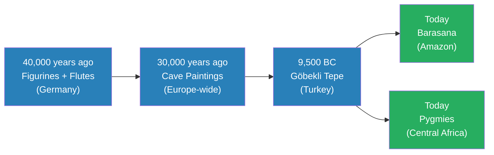

The same animist religion stretches from 40,000-year-old German caves to living cultures in the Amazon and Africa today. This timeline is the foundation of Prof. Jiang's method: anthropology bridges the gap between ancient archaeology and living practice. If we cannot travel back in time, we can travel across space — to places where the pre-modern religious imagination survives intact. The two green nodes represent the lecture's primary sources: the Barasana and the Pygmies, studied by anthropologists Wade Davis and Colin Turnbull respectively. The fact that two cultures on different continents — with no contact, no shared ancestry, and no cultural exchange — independently developed what is recognisably the same religion is perhaps the strongest evidence that animism was not a cultural invention but a natural expression of the human mind's relationship to the natural world.

Prof. Jiang connects each piece of archaeological evidence to the anthropological accounts that follow. The German figurine from 40,000 years ago turns out to depict a shaman dressed as an animal — the same practice the Barasana still perform today. The flute from the same period represents music as religious expression — the same role the Pygmies' molimo trumpet plays today.

Göbekli Tepe's T-pillars with their animal carvings depict "the manifestation of the animal spirit in us" — the same concept of shared spiritual essence that the Barasana describe when they say plants and animals are "physical manifestations of the same essential spiritual essence."

The evidence is not just chronological but conceptual: the same ideas keep appearing across thousands of years and thousands of miles.

This convergence is what gives Prof. Jiang confidence that anthropology can serve as a window into the distant past — that by studying living cultures, we can reconstruct the beliefs of people who left no written records.

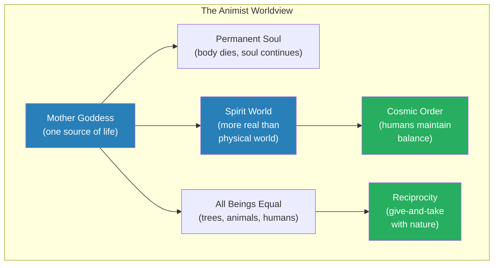

This concept map shows how the animist worldview forms an interconnected system rather than a list of separate beliefs. Everything flows from the mother goddess as single source of life: because all beings share the same origin, they are equals; because there is a spirit world more real than the physical one, there must be a cosmic order to maintain; and because humans are not superior to animals, they must practise reciprocity when they take life. Prof. Jiang emphasises that this is not a primitive collection of superstitions but a sophisticated, internally consistent philosophy that governed human life for 200,000 years. The diagram also reveals why the system is so stable: every element reinforces every other element. Equality reinforces reciprocity. The spirit world reinforces cosmic order. The mother goddess reinforces the equality of all beings.

There are no contradictions, no loose ends, no points of vulnerability — until an entirely different religion arrives and attacks the entire structure at once.

---

## What Do Creation Myths Actually Do?

*Prof. Jiang reads the Barasana creation myth aloud and asks students to look past the surface story for its real function — which turns out to be legal, not literary. The passage comes from Wade Davis's book The Wayfinders, which Prof. Jiang calls "a great book" and urges students to read. Davis is a Canadian anthropologist who spent years travelling the world to understand indigenous peoples, and his ethnography of the Barasana provides the first half of the lecture's primary evidence. Prof. Jiang explicitly tells students the book is "extremely well written" — a recommendation he does not give lightly, suggesting that the literary quality of Davis's prose is part of why his ethnography is so effective at conveying the Barasana worldview.*

The creation myth section is the lecture's first major shift from review to new material, and Prof. Jiang signals the transition clearly by reading directly from Davis's text. The act of reading aloud is itself pedagogically significant — it forces students to slow down and absorb the myth's imagery rather than skimming it as they might a textbook.

The myth's language is rich and specific: Romi Kumu's blood and breast milk gave rise to rivers, her ribs became mountain ridges, the spirits of the before-time "preyed on their own kindred, bred without thought, committed incest without consequence, devoured their own young." Prof. Jiang wants students to hear these details because each one does double duty — it simultaneously describes the origin of the world and prescribes the moral rules of the present.

The Barasana people of the Amazon Paraná have a creation myth centred on <b style="color: #2980b9">Romi Kumu</b>, the woman shaman. Prof. Jiang reads the myth in full, then presses students to identify what the story is really doing beyond explaining origins. After several guesses — "it explains how the world formed," "it tells us who we are and where we come from" — he steers them toward the deeper answer: the myth is establishing the legal and moral structure of society. By attributing evil behaviours to demons in the before-time, it makes those behaviours feel cosmically forbidden rather than merely socially inconvenient. The woman shaman as creator figure also connects to the mother goddess concept from Lecture 2 — the source of all life is female, which in turn reinforces the egalitarian relationship between men and women in pre-modern societies.

> [!example] The Romi Kumu Creation Myth (Barasana, Amazon)
> - In the beginning, before the creation of seasons, before the ancestral mother opened her womb, there was only chaos in the universe
> - Spirits and demons known as Hé preyed on their own kindred, bred without thought, committed incest without consequence, devoured their own young
> - Romi Kumu, the woman shaman, responded by destroying the world with fire and floods
> - "Just as a mother turns over a warm slab of manioc bread on the griddle," she turned the charred and inundated world upside down
> - From this empty template, she gave birth to a new world — land, water, forest, and animals
> - Her blood and breast milk gave rise to rivers; her ribs became the mountain ridges of the world
> - The new world came with rules: incest, cannibalism, and killing the young are evil because those are what the demons of the before-time did
> - The Barasana also have an elaborate cosmological visualisation — highly complex and sophisticated — that maps the entire structure of creation
> **The lesson:** Creation myths don't just explain origins. They encode the legal and moral structure of society — the rules feel cosmic and inevitable, not arbitrary or imposed by a human authority.

- <b style="color: #27ae60">The real function of creation myths is to establish why rules exist</b>
  - Why can't you commit incest? Because that's what evil spirits did before creation
  - Why can't you kill the young? Because the demons devoured their own offspring
  - The rules feel cosmic and inevitable, not arbitrary or imposed by a human authority
  - Every single civilisation and people has a creation myth — because every society needs to explain who we are, where we come from, and what the rules are
  - The myth encodes the legal system and explains not just what the rules are, but *why* we have them — the "why" is always: because violating them aligns you with the forces of chaos and evil

Prof. Jiang pushes students past the obvious answers. When they say "it explains how the world was formed," he acknowledges this but insists there is something "much more important." When they say "it tells us who we are and where we come from," he agrees but keeps pressing. The answer he is driving toward is that creation myths are legal documents disguised as stories. They don't merely describe the past — they prescribe the present. The Romi Kumu myth doesn't just say "incest happened before creation"; it says "incest is what evil spirits do, and if you do it, you are aligning yourself with the chaos that Romi Kumu destroyed." The moral weight of the prohibition comes not from a human lawgiver but from the structure of the cosmos itself.

This insight has implications far beyond the Barasana. Every civilisation the course will examine — from ancient Mesopotamia to modern America — uses origin stories to justify its legal and moral order. The American Declaration of Independence begins with a creation myth: "We hold these truths to be self-evident, that all men are created equal, that they are endowed by their Creator with certain unalienable Rights."

The function is identical to Romi Kumu's: to make the rules feel cosmic rather than arbitrary, to ground human law in a story about the origin of the world. Prof. Jiang does not make this comparison explicitly in this lecture, but the framework he introduces here — creation myths as legal systems — will recur every time he analyses how a civilisation justifies its power structures.

### What Makes a Religion Believable?

Prof. Jiang pauses over the extraordinary complexity of the Barasana cosmological visualisation and asks students a pointed question: why is it so complicated? The answer introduces a framework that he says will recur throughout the course, especially when studying Judaism and Christianity. For a religion to achieve the same authority as science — for people to believe it is genuinely *true* — it must accomplish three things. Prof. Jiang is explicit that this is not just about the Barasana: these criteria explain the power of every major religion in human history, and understanding them now will pay dividends in later lectures.

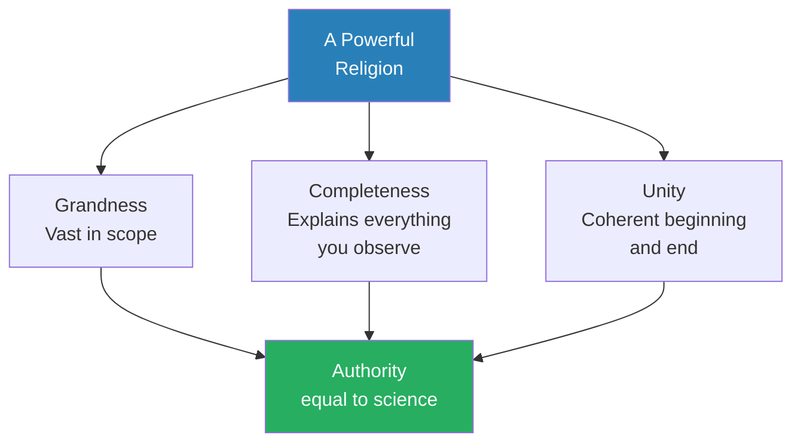

These three criteria — grandness, completeness, and unity — explain why the Barasana cosmology is so elaborate. A religion that covers only part of existence can be challenged; one that leaves phenomena unexplained invites doubt; one that lacks internal coherence collapses under scrutiny. The Barasana cosmology passes all three tests, which is why it has endured for millennia. Prof. Jiang explicitly flags this as a lens he will return to when studying Judaism (Lectures 21-22) and Christianity (Lectures 24-27), where these same criteria explain why those religions achieved civilisation-shaping power.

- **Grandness** — the religion must be vast, covering the entire scope of existence from the origin of the universe to the purpose of each individual life
- **Completeness** — everything you encounter in the world must be explained within the cosmology; there can be no unexplained phenomena that might create doubt or require a separate explanation
- **Unity** — there must be a coherent beginning and a coherent end; the story holds together as a single narrative arc rather than a collection of disconnected beliefs

These three criteria work together to produce authority. A religion that is grand but incomplete can be challenged by any unexplained phenomenon. A religion that is complete but lacks unity can be questioned for internal contradiction. A religion that has unity but lacks grandness can be dismissed as provincial. Only when all three are present does the religion achieve what Prof. Jiang calls "the authority of science" — the kind of unquestioned acceptance that makes people treat its claims as self-evidently true rather than articles of faith.

Prof. Jiang makes an important pedagogical move here: he tells students this framework is not just about the Barasana. "This is something that we will learn in this class as we explore other religions, including Judaism and Christianity. For religion to be powerful, for it to be authoritative, you need these three ideas: grandness, completeness, and unity."

By flagging the framework as recurring, he transforms it from a descriptive observation about one culture into an analytical tool that students will carry through the rest of the series. When they encounter Judaism's insistence on one God who created everything, they will recognise grandness. When they encounter Christianity's explanation for suffering (original sin), they will recognise completeness. When they encounter the Quran's narrative arc from creation to judgement, they will recognise unity.

> [!tip] Recurring Framework
> Prof. Jiang explicitly flags grandness, completeness, and unity as a lens he will return to when studying Judaism and Christianity later in the series. Watch for it in Lectures 21-28. The framework will also help explain why some religions spread globally while others remain local — and why the religions that do spread are always the ones that score highest on all three criteria.

---

## How Did the Animist World Actually Work?

*Prof. Jiang shifts from the creation myth to daily life — showing that for the Barasana, the entire natural world is a text to be read, and the visible world is only one layer of a much deeper reality. He reads extended passages from Wade Davis that paint the Amazon forest as a place saturated with religious meaning, where every rock, waterfall, plant, and animal is simultaneously a physical object and a spiritual being. The point is not just to describe the Barasana worldview but to make students feel its coherence and sophistication — to demolish the modern prejudice that people without technology must be intellectually primitive.*

Prof. Jiang reads Davis's prose slowly and with emphasis, pausing to let the imagery sink in. The passage describes a world where nothing is merely what it appears to be — where "every rock and waterfall embodies a story" and behind every tangible form lies a shadow dimension "invisible to ordinary people but visible to the shaman."

This is not metaphorical language in the Davis text or in the Barasana understanding. The rocks literally contain stories. The waterfalls literally carry religious meaning. The sap flowing through trees is literally "the bodily fluids of the primordial river of the Anaconda." For students raised in a materialist culture, this is the hardest part of the lecture to absorb: the Barasana do not treat these statements as poetic embellishment. They treat them as straightforward descriptions of reality — a reality that is, in their understanding, more real than the physical world we see.

- For the people living today in the forest of the Paraná, <b style="color: #27ae60">"the entire natural world is saturated with meaning and cosmological significance"</b>
  - Every rock embodies a story — not metaphorically, but literally in the Barasana understanding
  - Every waterfall carries religious meaning — sap and blood are "the bodily fluids of the primordial river of the Anaconda"
  - Plants and animals are "distinct physical manifestations of the same essential spiritual essence" — all beings come from the woman shaman, all carry the spark of life
- The visible world is explicitly described as only one level of perception:
  - Behind every physical form is a <b style="color: #2980b9">shadow dimension</b> — invisible to ordinary people but visible to the shaman
  - This is the "realm of the Hé spirit" — a place where rocks and rivers are alive, plants and animals are human beings, and everything is beautiful
  - In the very centre of stones are "the great malocas of the Hé spirit, where everything is beautiful, the shining feathers, the coca, the calabash of tobacco powder, which is, in itself, the skull and brain of the sun"
- Prof. Jiang highlights two things about this worldview that challenge modern prejudice:
  - It is <b style="color: #27ae60">extraordinarily imaginative</b> — these people have a vivid, complex, layered understanding of reality that rivals any philosophical system
  - It is <b style="color: #27ae60">extremely sophisticated</b> — the absence of cars and cell phones does not mean stupidity; their clothing, bodily arrangement, and ritual practice reveal deep organisational structure
  - Prof. Jiang addresses the prejudice directly: "One major prejudice that we might have about these people is, well, they don't drive cars, they don't have cell phones, therefore they must be stupid. But clearly, from our understanding of their religious beliefs, they're actually extremely imaginative and extremely sophisticated"
  - This is a theme Prof. Jiang will return to throughout the series: technological simplicity is not the same as intellectual simplicity, and the absence of material complexity often correlates with extraordinary spiritual and social complexity

### Ritual: Every Second Has Religious Meaning

Prof. Jiang shows photographs of Barasana shamans in religious practice and asks students what they notice. They observe the sophistication of the clothing, the care put into what the shamans wear, and the symmetry of their bodies in relation to each other. One student notes the apparent hierarchy — the elder stands in the middle. Prof. Jiang uses this to introduce the concept of <b style="color: #2980b9">ritual</b> — the expression of religion in everyday practice. He draws a direct analogy to the classroom: students arrive at eight, the teacher takes attendance, the bell rings at 8:45, you raise your hand to go to the restroom. All of this is ritual, and behind every ritual is a belief system. The school's belief system says this structure helps you learn to be on time, respect authority, and read books. The Barasana live the same way — except their belief system is religious, and it governs every single minute of their lives.

The photographs reveal more than clothing choices. The three figures display clear organisational structure — specific positioning relative to each other, deliberate symmetry, and bodily postures that are clearly prescribed rather than casual. Prof. Jiang's point is that if this were merely a hunting tribe focused on survival, "none of this makes any sense." But if the first priority is religion — if everything they do has religious significance — then the elaborate dress, the precise positioning, and the ritual order become not just comprehensible but essential. The word "ritual" captures this: religion is not something the Barasana do at specific times (like going to church on Sunday); it is the fabric of every moment.

Prof. Jiang's classroom analogy is worth dwelling on because it makes a subtle point about the universality of ritual. Students might think that ritual is something exotic — something "primitive" cultures do. But their own lives are "extremely ritualised": they arrive at eight, the teacher takes attendance, the bell rings at 8:45, they raise their hand to go to the restroom.

Behind these rituals lies a belief system: that this structure helps them learn, be on time, respect authority, and read books. The Barasana are doing exactly the same thing — the only difference is that their belief system is religious rather than educational. This analogy prevents students from exoticising the Barasana and instead helps them recognise ritual as a universal human practice that they themselves participate in every day.

### The Shaman as Nuclear Engineer

Prof. Jiang reads a key passage from Wade Davis that redefines the shaman's role for students who might associate shamanism with herbalism or folk medicine. The passage is carefully chosen to destroy that misconception. Davis writes that the shaman's duty is not to manipulate plants but to navigate the spirit world — a distinction Prof. Jiang considers crucial. The "nuclear engineer" analogy is particularly effective because it translates a spiritual role into a technical one: the shaman maintains invisible infrastructure that the rest of society depends on but cannot see. Just as a nuclear engineer's work is incomprehensible to most people but essential for the power grid, the shaman's work is incomprehensible to ordinary Barasana but essential for cosmic order.

- The shaman's role is not to use or manipulate medicinal plants — that is "popular lore in the West"
- His sacred duty is to <b style="color: #2980b9">"move in the timeless realm of the Hé, embrace the primordial powers, and harness and restore the energy of all creation"</b>
- Prof. Jiang offers a striking analogy: the shaman is like a modern engineer who enters the depths of a nuclear reactor to maintain the cosmic order
- His role is diagnostic and restorative — when the visible world shows symptoms of disorder, the shaman must enter the invisible world and fix the root cause
- The Barasana see the Earth as "potent" and "alive with spiritual beings and ancestral powers" — to live off the land is "to embrace both its creative and destructive potential"

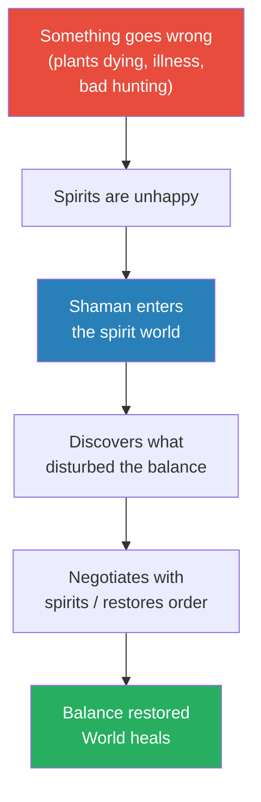

The shaman functions as both diagnostician and healer for the entire cosmic order — the physical world is merely a symptom of what happens in the spirit world. When plants are dying, the cause is not drought or disease in the modern sense; it is spiritual unhappiness. When hunting is poor, the explanation is not animal migration patterns but a disturbance in the balance between humans and spirit guardians. The shaman's trance journey into the spirit world is therefore the most important technology these societies possess — more vital than any tool or weapon, because it addresses root causes rather than surface symptoms. Prof. Jiang asks the class to follow the logic: "If plants are dying outside, what does this mean?" Students grasp the answer quickly: "The spirits are unhappy." "And therefore?" "You must go into the spirit world and understand why they're unhappy and fix it." The Socratic exchange makes the logic feel inevitable rather than exotic.

- <b style="color: #e74c3c">The implication is radical: our physical world doesn't matter.</b> What matters is the spirit world, because the spirit world controls everything
  - If plants are dying, it's because spirits are unhappy
  - If hunting is bad, something is wrong in the spirit realm
  - The shaman must enter that world and fix it — like a technician fixing infrastructure that the rest of us can't see
  - Human beings, plants, and animals share the same cosmic origins and are "essentially identical, responsive to the same principles, obligated by the same duties, responsible for the collective well-being of creation"
  - There is no separation between nature and culture — "without the forests and rivers, humans would perish; without people, the natural world would have no order or meaning; all would be chaos"
  - The social norms that drive human behaviour also define how humans interact with "the plants and animals, the multiple phenomena of the natural world — lightning and thunder, the sun and the moon, the scent of a blossom, the sour order of death"

---

## Why Is Hunting a Sacred Act?

*Prof. Jiang connects the Barasana hunting ritual to the cave paintings and Göbekli Tepe discussed in Lectures 1 and 2, revealing the logic that unifies all pre-modern hunting cultures. This section answers a question that has been building since the first lecture: if all living beings share the same spiritual essence — if animals and humans are equals — what gives humans the right to kill animals? The answer, reciprocity, turns out to be the foundational moral principle of the animist world, and it explains evidence that previously seemed mysterious. Prof. Jiang is visibly excited in this section — the pieces are clicking together, and the connection between 40,000-year-old cave paintings and contemporary Barasana hunting rituals becomes not just plausible but obvious.*

The hunting section also contains some of the lecture's most vivid imagery. Prof. Jiang reads Davis's description of the pre-hunt ritual with evident relish, lingering over the passage where the shaman "changes from fish to animal to human being and back again, transcending every form, becoming pure energy, flowing among every dimension of reality, past and present, here and there, mythic and mundane." This is not a brief prayer before a meal — it is an elaborate, multi-part ceremony involving two series of dances separated by the liminal moments of dawn, dusk, and midnight. The sophistication of the ritual is itself evidence against the "primitive" label that moderns reflexively apply to hunter-gatherer societies. No "primitive" culture could produce a ceremony of this complexity, duration, and symbolic density.

Prof. Jiang also uses the hunting section to resolve a puzzle that has been building since Lecture 1. Students have seen cave paintings that celebrate animals rather than humans. They have seen Göbekli Tepe's T-pillars carved with animal figures. They have seen 40,000-year-old figurines of shamans dressed as animals.

All of this evidence pointed toward a special relationship between humans and animals, but the nature of that relationship remained unclear. Now, through the Barasana ethnography, the relationship has a name — reciprocity — and a logic: hunting is not predation but courtship, meat is not a right but a gift, and killing without permission risks vengeance from spirit guardians.

Every piece of archaeological evidence from Lectures 1 and 2 suddenly makes sense. The cave paintings are tribute. The T-pillars are pre-hunt negotiation sites. The figurines are shamans preparing to enter the spirit world on behalf of their communities. The reciprocity principle is the key that unlocks 40,000 years of otherwise mysterious evidence.

The foundational question is deceptively simple: if all living beings come from the same mother goddess, if animals and humans are merely different physical manifestations of one spiritual essence, what moral authority allows a human to kill an animal for food? The modern answer — "we're at the top of the food chain" — is not available to people who believe all life is equal. The Barasana answer is <b style="color: #2980b9">reciprocity</b> — a principle of give-and-take that governs the relationship between humans and the spirit world. You may take life, but only with permission, only through negotiation, and only if you give something in return. Prof. Jiang connects this principle directly to the cave paintings discussed in Lectures 1 and 2: "Why did they spend so much time painting these animals? Because they're trying to pay tribute to the animals. If I kill you, I must thank you for taking your meat to replenish myself, but I also must ask for your forgiveness, otherwise the animal soul may seek vengeance."

> [!example] Barasana Hunting as Sacred Courtship
> - When men go to the forest to hunt, "it is never a trivial passage" — you cannot simply go and hunt
> - The shaman must first travel in trance to negotiate with the "masters of the animals"
> - He forges a "mystical contract with the spirit guardians" — always based on reciprocity
> - The Barasana compared hunting to marriage — "a form of courtship in which one seeks the blessings of a greater authority for the honour of taking into one's family a precious being"
> - Meat is "not the right of a hunter, but a gift from the spirit world"
> - Killing without permission risks death from a spirit guardian — in the form of a jaguar, anaconda, tapir, or harpy eagle
> - The ritual is elaborate: the shaman "changes from fish to animal to human being and back again, transcending every form, becoming pure energy"
> - His chants "name every point of geography met on the ancestral journey of the Anaconda"
> - The ritual spans two series of dances separated by the liminal moments of the day — dawn, dusk, and midnight
> - Its main purpose: celebrate the unity of life, ask permission, ask forgiveness
> **The lesson:** Hunting is not predation — it is a negotiated exchange between equals, mediated by the shaman and governed by reciprocity. This explains why shamans dressed as animals in the 40,000-year-old figurines.

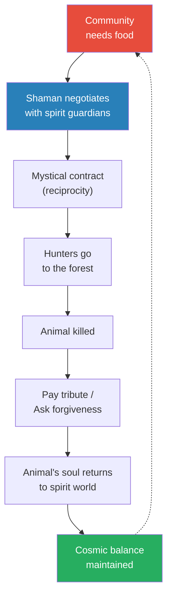

Hunting is not a one-way extraction — it is a cycle of negotiation, gratitude, and return. The dotted arrow from "cosmic balance maintained" back to "community needs food" shows that this is an ongoing relationship, not a one-time transaction. Every hunt renews the contract. Every kill requires fresh permission. Every meal comes with an obligation to give thanks and maintain the balance. This cyclical logic explains cave paintings (tribute to animals), Göbekli Tepe's animal carvings (pre-hunt religious festivals), and the 40,000-year-old shaman figurines (the shaman transforming into animal form to communicate with spirit guardians). The cycle also explains why the Barasana compare hunting to marriage: both are permanent relationships that require ongoing negotiation, respect, and reciprocity. You don't marry someone once and then ignore them; you don't hunt once and then forget your obligation to the spirit world.

The marriage analogy is one of Davis's most striking descriptions: hunting is "a form of courtship in which one seeks the blessings of a greater authority for the honour of taking into one's family a precious being."

The animal is not prey — it is a precious being. The hunter is not a predator — he is a suitor. The spirit guardian is not an obstacle — it is a blessing-giver. Every word in the analogy inverts modern assumptions about the relationship between humans and animals.

- This explains the evidence from Lectures 1-2:
  - **Cave paintings** celebrate animals, not humans — because animals give humans life and nourishment, and tribute must be paid. Prof. Jiang reminds students: "What they celebrate is not themselves. What they celebrate are the animals, because it's the animals that give them life, that give them nourishment and meat."
  - **Göbekli Tepe's T-pillars** with animal carvings were sites for pre-hunt religious ceremonies — the T-pillar represents "the manifestation of the animal spirit in us," and animal bones found at the site confirm the ritual-hunting connection. The site was a place where the reciprocal contract was renewed before every hunt.
  - **The 40,000-year-old figurines** of shamans dressed as animals — the shaman transforms into animal form to communicate with the spirit world during the elaborate pre-hunt ritual. This practice of transformation is documented in both the figurines and in the Barasana ethnography, spanning 40,000 years and two continents.
- The pre-hunt ritual itself is remarkably sophisticated:
  - The shaman "changes from fish to animal to human being and back again, transcending every form, becoming pure energy"
  - He flows "among every dimension of reality, past and present, here and there, mythic and mundane"
  - His chants name "every point of geography met on the ancestral journey of the Anaconda"
  - The ritual's purpose: celebrate the unity of life, ask permission, ask forgiveness

> [!abstract] The Reciprocity Principle as Universal Law
> Prof. Jiang presents reciprocity not as a quaint custom but as the foundational moral law of pre-modern humanity. In a world where all beings are equal — where killing an animal is morally equivalent to killing a person — the only way to justify taking life is through negotiated exchange. This single principle explains why pre-modern humans were peaceful (war violates reciprocity with the spirit world), egalitarian (hierarchy contradicts the equality of all beings), and artistic (art is the medium through which tribute and worship are expressed). Reciprocity also explains the elaborate cave paintings that celebrate animals: they are not decorations but acts of thanksgiving. It explains Göbekli Tepe: a temple for pre-hunt religious ceremonies where reciprocal contracts with the spirit world were forged. And it explains the 40,000-year-old figurines: shamans dressed as animals to facilitate the negotiation between human needs and spirit guardians.

---

## What Do the Pygmies Reveal About the Pre-Modern Mind?

*Prof. Jiang shifts from South America to Africa — from the Barasana to the Pygmies — and discovers essentially the same religion on a different continent, confirming its universality. But the Pygmy material serves a different analytical purpose than the Barasana sections. Where the Barasana ethnography illustrated the content of the animist worldview — its creation myths, cosmology, and hunting rituals — the Pygmy ethnography is used primarily to expose the chasm between the modern and pre-modern mind. Through British anthropologist Colin Turnbull's account, Prof. Jiang builds the two great cognitive divides of the lecture: control versus trust, and materialism versus spirituality. The shift to Africa also serves a geographical argument: if two cultures on different continents independently developed the same religion, the religion is not a cultural accident but a fundamental expression of human nature.*

The Pygmies of Central Africa are documented by British anthropologist <b style="color: #2980b9">Colin Turnbull</b> (likely *The Forest People*). At the centre of their religion is the <b style="color: #2980b9">molimo</b> — a trumpet-like instrument that allows them to communicate with the forest and the spirit world, and through which they resolve every issue in their community. The molimo captures the sound and spirit of the forest, and its singing brings the community together in ceremonies that can last for weeks. Despite being on a different continent with different specific beliefs, the Pygmies practise essentially the same religion as the Barasana. The details differ, but the core is identical: humans are part of nature, not separate from it; the forest and the spirit world are the true reality; and the community's job is to maintain balance and harmony through constant communication with the spiritual realm.

Prof. Jiang emphasises the geographical significance of this parallel. The Barasana live in the Amazon forest of South America. The Pygmies live in the jungles of Central Africa. They have had no contact with each other, no shared history, no cultural exchange.

And yet they independently developed what is recognisably the same religion. This convergence is powerful evidence for the theory that animism and shamanism were universal among early humans — not a cultural invention of one group that spread to others, but a natural expression of how the human mind relates to the natural world when left to develop without the influence of agriculture, cities, or organised warfare. Prof. Jiang notes that this convergence extends to Australia as well — indigenous Australian cultures practise similar religions, adding a third continent to the evidence base.

### The Forest Walk: Control vs. Trust

Prof. Jiang reads one of the lecture's most vivid passages — Turnbull following a group of Pygmies through the forest at night, the time when leopards hunt — and uses it to define the first great cognitive divide between modern and pre-modern minds. The passage works on two levels simultaneously: as a narrative about the Pygmies' relationship with nature, and as a revelation of Turnbull's own inability to comprehend that relationship. The word "shock" tells us everything: Turnbull is surprised because his modern mind cannot imagine walking through a leopard-infested forest unarmed and unafraid. Prof. Jiang reads the passage slowly, pausing to let the details accumulate: the silence (unusual for normally noisy Pygmies), the darkness, the absence of weapons, the cocking of heads to listen, the satisfaction that they are "really alone." Each detail deepens the mystery for Turnbull — and for the students — before the Pygmy's explanation resolves everything with stunning simplicity: "When we are the children of the forest, what need have we to be afraid of it?"

> [!example] The Pygmies Walk Through the Forest Unarmed
> - Turnbull follows a group of Pygmies through the forest at night — the time when leopards prowl in search of food
> - He has no idea how far they have come or in what direction, but knows they have left the camp far behind
> - He notices they are completely silent — unusual, since Pygmies are normally deliberately noisy
> - Just at the time leopards would be hunting, they seem "unwilling to disturb the forest or the animals it concealed"
> - It is as if "they were a part of the silence and the darkness of the forest itself"
> - They are fearful only "lest any sound might betray their presence to some person or thing not of the forest"
> - Then Turnbull realises with "sudden shock" that not one of them carries a spear or bow and arrow
> - They peer into the dusk, cock their heads, and satisfy themselves they are "really alone" — meaning alone from outsiders, not from animals
> - "They felt themselves so much a part of the forest and of all the living things in it, they had no need to fear anything except that which was not of the forest"
> - One Pygmy later tells Turnbull: "When we are the children of the forest, what need have we to be afraid of it? We are only afraid of that which is outside the forest"
> **The lesson:** The Pygmies don't fear leopards because they don't experience nature as "other." They are the forest's children. Fear comes only from what is outside the forest — the unfamiliar human world.

Prof. Jiang uses this passage to build a systematic comparison between the modern and pre-modern mind. He asks students a sequence of questions: Why does Turnbull feel shock? Because he expects danger. Why does he expect danger? Because leopards are predators. Why do the Pygmies not feel danger? Because they are part of the forest. What is the fundamental difference? The modern mind experiences nature as separate and threatening; the pre-modern mind experiences nature as home. And what drives that difference? The modern obsession with <b style="color: #e74c3c">control</b>. We like animals in zoos because we can control them. We fear animals in forests because we cannot. The Pygmies don't need control because they have something better: <b style="color: #27ae60">trust</b>.

The passage works on multiple levels simultaneously. On the surface, it describes a walk through the forest. But beneath that surface, it reveals an entire philosophy of existence. The Pygmies are "unwilling to disturb the forest or the animals it concealed" — not out of fear, but out of respect. They are silent not because they are hiding from predators but because they are part of the forest's silence. When they satisfy themselves that they are "really alone," they mean alone from outsiders — from people who are not of the forest. The forest's animals are not outsiders; they are family. This reversal of the expected meaning is the passage's genius, and Prof. Jiang lingers over it because it perfectly illustrates the cognitive chasm between worldviews.

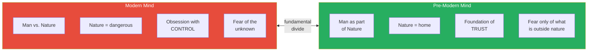

The modern mind treats nature as an enemy to be controlled; the pre-modern mind treats nature as a parent to be trusted. This single difference explains most of what separates us from our ancestors. Prof. Jiang notes that we have been taught to see nature as outside us, as an adversary — "man versus nature" is one of the foundational narratives of Western literature. The Pygmies would find this framing incomprehensible. You cannot be "versus" the forest when you are the forest's child. The word "shock" in Turnbull's text reveals that even a trained anthropologist, someone who has spent months living with the Pygmies, cannot fully escape the modern assumption that nature is dangerous. His shock is not a personal failing — it is a structural feature of the modern mind.

The passage also reveals something subtle about the nature of Pygmy fear. They are not fearless — they are afraid of "that which is not of the forest." This means they fear the human world outside the forest more than they fear leopards.

For a modern reader, this reversal is almost incomprehensible: we fear nature and feel safe in cities; they fear human civilisation and feel safe in the wild. Prof. Jiang does not spell out the implication, but it hovers over the lecture: perhaps the Pygmies are right to fear what is "outside the forest." The history of indigenous peoples' encounters with "civilised" societies — colonisation, slavery, genocide — suggests their fear is empirically justified.

- Why do *we* fear nature?
  - We experience the forest as unknown territory full of predators
  - The unknown makes us afraid because <b style="color: #e74c3c">we are obsessed with control</b>
  - We like animals in zoos (controlled) and fear animals in forests (uncontrolled)
  - If we cannot predict and manage our environment, we feel vulnerable
  - Prof. Jiang builds this through questioning: "Why do we fear nature? What makes us fear nature?" → "Why are you afraid of the unknown?" → "What is it that we are obsessed with?" → "Control"
- Why don't *they* fear nature?
  - They believe the leopards know them, and they know the leopards
  - The forest is not "out there" — they are inside it, part of it
  - The word is <b style="color: #27ae60">trust</b> — they don't need to control nature because they trust it
  - Their fear is reserved for what is "outside the forest" — the unfamiliar human world, not the natural one
  - The Pygmy's own words are the most powerful evidence: "When we are the children of the forest, what need have we to be afraid of it?"

---

## Why Is Sleeping the Worst Crime?

*The Pygmies' punishment for sleeping during the molimo ceremony seems bizarre to modern ears — but Prof. Jiang walks students through the logic step by step, using a classroom analogy that makes the principle startlingly clear. This section contains the lecture's most radical claim: that a collectively shared imagination, when believed by everyone, becomes more real and more powerful than physical reality itself. The punishment for sleeping is not about ritual etiquette — it is existential self-defence by a community whose entire reality depends on universal participation. Prof. Jiang spends more time on this section than any other in the lecture, building the argument layer by layer through Socratic questioning until students grasp not just what the Pygmies believe but why their logic is internally consistent and, on its own terms, entirely rational.*

The molimo singing ceremony requires every adult male to participate — eating, singing, and dancing. Everyone must eat, and no adult male is permitted to sleep while the molimo is singing. <b style="color: #e74c3c">The greatest crime a Pygmy can commit is to fall asleep while the molimo is singing</b> — a crime worse than murder, worse than theft, worse than any form of violence against another person. To understand why, Prof. Jiang says, you must understand what the ceremony is actually doing: it is sustaining the collective reality that holds the entire community together. The ceremony can last for weeks — it is not a brief service like a church visit but an extended, intensive period of communal religious experience that demands total participation from every member of the group.

> [!example] The Punishment for Sleeping During the Molimo
> - Everyone at the ceremony must eat, and no adult male is allowed to sleep while the molimo is singing
> - If a sleeping man is found during the ceremony, he is speared in the stomach with two spears — one under each arm
> - He is "killed completely and forever" — a phrase Prof. Jiang emphasises for its totality
> - His body is buried under the communal fire (the komala molimo) where the religious practice takes place
> - No one is allowed to mention his death, even to remark on his absence
> - The women are told that the molimo itself — "the great animal of the forest" — carried him off
> - No questions are asked by anyone — neither men nor women
> - The missing man is never spoken of again; he is erased from collective memory
> - One older Pygmy demonstrated the search-and-kill method to Turnbull with miming and obvious relish
> **The lesson:** The sleeping man is not just disrespecting a ritual. He is threatening the existence of the collective reality that holds the entire community together. In a world built on shared imagination, a non-believer is an existential threat.

Prof. Jiang builds the logic using a classroom analogy that students immediately grasp. A classroom exists only because everyone participates — the teacher teaches, students listen and respond. If someone sleeps, they are saying: "This is not real. This discussion is pointless." That doesn't just insult the teacher — it threatens the existence of the classroom itself. Prof. Jiang takes the analogy further: "Let's just say we're having a class and one of you is sleeping, and I get so angry that I want to kill that person. Why would I want to do that?" The initial student answer — "it's disrespectful of your authority" — is acknowledged but insufficient. "That is true, but then I just ask the person to leave my class, right? But I want to *kill* that person. Why?" The answer he is driving toward: because the sleeping student is not just insulting the teacher but denying the reality of the classroom itself. The classroom is a "collective experience" that "happens when everyone is participating in it." The sleeper's message is not "I'm tired" but "this is all pointless."

Now scale that up from a classroom to an entire civilisation built on shared belief. The molimo ceremony is not a class — it is the Pygmies' entire reality. Their religion, their relationship with the forest, their understanding of the cosmos — all of it exists only because everyone believes in it together.

Prof. Jiang states the principle with remarkable directness: "This religion is only possible if everyone believes that it is true. If you're sleeping, it means you don't think it's true, and therefore you are, first of all, rejecting the community. You're telling everyone: you're all idiots. Secondly, you might endanger the community because you're insulting the forest."

A single non-believer threatens not just social harmony but the existence of reality itself. This is why the punishment is not merely severe — it is total. The sleeper is not banished or punished; he is killed, buried under the sacred fire, and erased from collective memory. Even the women are given a cover story — the molimo "carried him off" — so that no one need acknowledge what really happened. The erasure is as important as the killing: if the community cannot even remember the non-believer, his threat is neutralised completely.

```mermaid
flowchart TB
    SLEEP["Someone sleeps<br/>during the molimo"]
    SLEEP --> MSG["Message: 'This<br/>religion is not real'"]
    MSG --> T1["Rejects the<br/>community"]
    MSG --> T2["Insults the<br/>forest / God"]
    MSG --> T3["Endangers<br/>collective belief"]
    T3 --> CORE["Religion is only real<br/>if EVERYONE believes"]
    CORE --> THREAT["One non-believer can<br/>cause the whole<br/>reality to collapse"]
    THREAT --> DEATH["The sleeper must<br/>be eliminated"]
    style SLEEP fill:#e74c3c,color:#fff
    style CORE fill:#2980b9,color:#fff
    style DEATH fill:#e74c3c,color:#fff
```

The punishment seems extreme only to moderns who separate belief from reality. In a world where shared belief IS reality, a non-believer is not merely rude — he is an existential threat to everything the community has built. The flowchart traces the logic that makes this punishment not only comprehensible but inevitable within the Pygmy worldview. The key node is the blue one: "Religion is only real if EVERYONE believes." This is not hyperbole or metaphor — Prof. Jiang presents it as a literal description of how collective imagination works. As long as everyone imagines the spirit world together, it exists. One person opting out can cause the entire edifice to crumble.

- The deeper principle: <b style="color: #27ae60">religion is only real if everyone believes it is true</b>
  - As long as everyone imagines the spirit world together, it exists — it is more real than physical reality
  - A single non-believer threatens the entire construction — not through active sabotage but through passive withdrawal
  - The sleeper is not committing violence against one person — he is committing violence against the community, the religion, and the forest itself
  - This is why the punishment is total: killed, buried, erased from memory — as if he never existed
  - Prof. Jiang summarises: "For most of human history, people take their religion extremely seriously, so seriously that they think it's more real than reality"

This principle — that collective belief sustains collective reality — is the lecture's signature insight, and Prof. Jiang signals that it will recur throughout the course.

When Judaism later requires strict observance of 613 commandments, the logic is the same: deviance threatens the community's covenant with God. When Christianity persecutes heretics, the logic is the same: a single non-believer endangers the salvation of all. When Islam requires five daily prayers, the logic is the same: the community must maintain constant communication with the divine.

The molimo sleeping punishment is the purest and earliest expression of a principle that will shape every civilisation the course examines.

> [!abstract] The Religious Imagination as Collective Reality
> Prof. Jiang's central claim: for most of human history, humans lived inside a shared imagination that was more real, more powerful, and more meaningful than the physical world. This imagination required collective belief to sustain itself. The punishment for sleeping during the molimo is not cruelty — it is self-defence by a community whose entire reality depends on universal participation. This insight will prove essential when studying how later religions (Judaism, Christianity, Islam) enforced orthodoxy through excommunication, heresy trials, and inquisitions — all versions of the same logic: the non-believer threatens the community's reality.

Prof. Jiang draws the lecture's themes together in a remarkable passage that captures the essence of the religious imagination: "Once we have the religious imagination, we can create things that are actually, for us, more real than reality." This is the title concept made explicit.

The religious imagination is not escapism or delusion — it is a technology for creating shared reality. Every culture that has ever existed has used it: the Barasana imagine a spirit world behind every physical form; the Pygmies imagine a forest that sleeps and wakes; modern nations imagine borders, constitutions, and human rights. The difference between the pre-modern and modern versions is not that one is "pretending" and the other is "real" — it is that the pre-modern version was conscious of itself as imagination, while the modern version pretends to be objective fact.

The lecture's final moments drive this point home with devastating clarity. Prof. Jiang tells students: "You can imagine a world, and this world, as long as many of you are imagining it together, it's more true, more powerful, more real than this world. That's the power of religion — what we call the religious imagination. And we'll see this over and over again in human history." The repetition of "over and over again" signals that this concept is not confined to Lecture 3 but will serve as an analytical lens for the entire 60-lecture series.

---

## What Does the Word "Pretending" Reveal?

*In a close-reading exercise that Prof. Jiang compares to SAT preparation, he asks students to find one word in Turnbull's text that reveals the unbridgeable gap between the modern anthropologist and the Pygmy worldview. The exercise is pedagogically brilliant: it teaches students to read for subtext, and it delivers the lecture's second great cognitive divide — between materialism and spirituality — through a single word rather than an abstract argument. Prof. Jiang reads the passage slowly, asking "What word tells us he doesn't understand these people?" and waiting patiently through several wrong answers. When a student finally identifies "pretending," the classroom seems to shift — the word that felt neutral suddenly feels like an accusation.*

Turnbull describes sitting at the communal fire for a month, watching the molimo ceremony night after night. He confesses that he "still had little idea of what was going on" — a remarkable admission for a trained anthropologist who has spent weeks embedded in the community. He describes women "pretending that they were afraid to see the animal of the forest." He describes men "pretending they thought that the woman thought that the drainpipes were animals." He describes the trumpet instruments imitating leopards, elephants, and buffaloes. He calls the ceremony "make-believe." And yet, in the same paragraph, he acknowledges feeling "something very real and very great was going on beneath it, something that everyone else took for granted and about which only I was ignorant." The tension between his vocabulary and his instinct is extraordinary: his words say "fake" and his gut says "real."

Prof. Jiang asks: what word tells us Turnbull doesn't understand these people? After several attempts, a student identifies it: <b style="color: #e74c3c">"pretending"</b>. The Pygmies would find this word deeply insulting. Prof. Jiang drives the point home with another analogy: if another teacher walked into his classroom and said "Wow, your class is a lot of fun — you play a lot," he would be insulted. Why? Because "fun" and "play" imply that what's happening is not serious academic work. The word "pretending" does the same thing to the Pygmies' deepest spiritual experience — it reduces it to a game, to play-acting, to something that is by definition not real.

The word repeats itself over and over in Turnbull's passage — "pretending," "pretending," "make-believe" — and each repetition deepens the chasm between the observer and the observed.

Prof. Jiang asks students to consider the Pygmy perspective: "We think they're pretending. We think they're playing. What do they think?" The answer is simple and devastating: "They think it's all true." For the Pygmies, the molimo ceremony is not a performance of belief — it is belief itself, more real than the physical ground they stand on. Prof. Jiang's phrasing captures the power of the religious imagination with striking precision: "You can imagine a world, and this world, as long as many of you are imagining it together, it's more true, more powerful, more real than this world."

- "Pretending" means playing, performing, acting as if something false were true
  - For the Pygmies, none of this is pretending — it is the most real and important thing in their lives
  - When the women show fear of the molimo, they are not performing fear — they are experiencing genuine awe before the great animal of the forest
  - When the men sing, they are not play-acting — they are communicating with the spirit world
  - The trumpet "drainpipes" are not props — they are the molimo itself, the voice of the forest
- Turnbull uses "pretending" because he is trapped in the modern worldview: <b style="color: #2980b9">materialism</b>
  - If you can't see it, it's not real. If you can't measure it, it doesn't exist
  - God can't be real because we can't find it. The soul can't be real because we can't measure it
  - The imagination can't be real because "we don't know where it comes from — it doesn't make sense"
  - The only vocabulary Turnbull's worldview gives him for describing deeply held spiritual experience is "pretending" and "make-believe"
  - And yet he *senses* the truth — "something very real and very great" — but his language cannot capture it
  - Prof. Jiang notes the tragedy: Turnbull is "ignorant" by his own admission, and "only I was ignorant" — everyone else in the community understands what is happening, and the trained anthropologist is the only one who does not

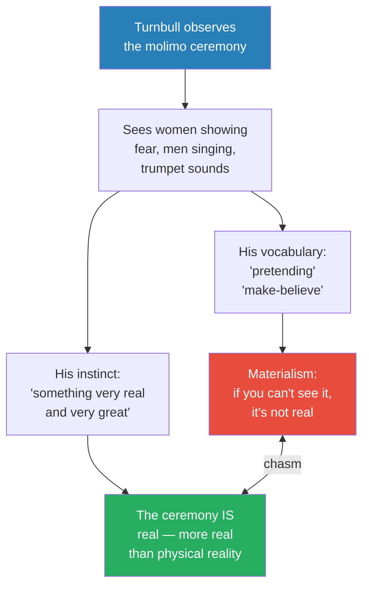

This diagram captures the tragedy of Turnbull's position. He is a trained anthropologist who has spent a month living with the Pygmies, and he can *feel* that something profound is happening — his instinct tells him "something very real and very great" is occurring. But his modern vocabulary, shaped by materialist assumptions, gives him only "pretending" and "make-believe" to describe it. The chasm between his vocabulary and his instinct is the chasm between the modern and pre-modern mind. Prof. Jiang calls materialism "obviously wrong" — "How can you say the imagination doesn't exist?" — and argues that modern science has structured society around a principle that would have been incomprehensible to 200,000 years of human ancestors. The tragedy is not that Turnbull is a bad anthropologist — he is clearly a gifted observer who senses the truth — but that his language, his education, and his entire civilisation have given him no tools to express what he senses. He is trapped between instinct and vocabulary, between what he feels and what he can say.

This tension — between sensing a truth and lacking the language to express it — is one of the lecture's most resonant themes. It applies not just to Turnbull but to every modern person who has ever felt that something important exists beyond the reach of measurement and proof.

> [!tip] The Materialism Trap
> Prof. Jiang defines materialism as the belief that if you can't see, measure, or feel something, it isn't real. God can't be real because we can't find it. The soul can't be real because we can't measure it. But Prof. Jiang calls this "obviously wrong" — "How can you say the imagination doesn't exist?" Modern science has structured our society around this principle, but for 200,000 years of human history, people believed differently — and their belief was not ignorance but a different, equally sophisticated way of knowing.

- The second great cognitive divide:
  - The modern worldview is **materialistic** — only the measurable is real
  - The pre-modern worldview is **spiritual** — the invisible world is at least as real as the visible one, and probably more so
  - Turnbull *senses* that something real is happening but his modern vocabulary only gives him "pretending" and "make-believe" to describe it
  - For the Pygmies, religion is "more true than this world" — and Prof. Jiang argues this is the power of the human imagination, not its weakness

Prof. Jiang is explicit about his own position: "Obviously, this idea of materialism is wrong. How can you say the imagination doesn't exist?" He acknowledges that modern science has structured society around the materialist principle — "when you go to science class, they teach you this: if it's real, you can measure it, you can see it, you can feel it" — but argues that for 200,000 years of human history, people believed differently. They believed the spiritual world mattered "just as much as reality — in fact, it probably matters more than reality." This is not a claim that science is wrong about what it studies; it is a claim that science is wrong to assume its method of knowing is the only valid one.

The Pygmies' way of knowing — through collective imagination, ritual, and trust — produced a stable, peaceful civilisation for 200,000 years. The modern way of knowing has produced extraordinary technology but also extraordinary destruction. Prof. Jiang is careful not to romanticise the pre-modern world — he has already acknowledged intra-group violence and other realities — but he insists that dismissing the animist worldview as "primitive" or "pretending" reveals more about our limitations than theirs.

### The Two Great Cognitive Divides: A Summary

The lecture builds two parallel contrasts between the modern and pre-modern mind, each revealed through a different piece of Turnbull's text. Together, they form the lecture's intellectual scaffolding — a framework Prof. Jiang will reference throughout the series whenever he needs to explain why modern people misunderstand ancient civilisations.

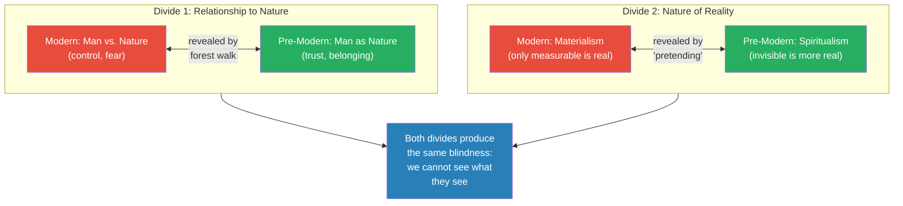

The first divide — control versus trust — explains how we relate to the natural world. The modern mind sees nature as separate and threatening, requiring control; the pre-modern mind sees nature as home, requiring trust. This divide was revealed through the forest walk passage, where Turnbull's "shock" at the Pygmies' lack of weapons exposed his assumption that nature is dangerous.

The second divide — materialism versus spirituality — explains how we relate to invisible reality. The modern mind dismisses what it cannot measure; the pre-modern mind treats the invisible as more real than the visible. This divide was revealed through the "pretending" passage, where Turnbull's vocabulary exposed his inability to describe genuine spiritual experience. Both divides produce the same result: modern people are structurally incapable of seeing what pre-modern people see, because our categories of understanding exclude their categories of reality. Prof. Jiang presents this not as a curiosity but as a genuine problem for students who want to understand history. If you cannot temporarily set aside the modern worldview — if you cannot, even for an hour, take the animist worldview seriously on its own terms — then you will never understand why civilisations rose and fell, why religions spread and died, or why people made the choices they made.

The two cognitive divides are not just descriptions of difference; they are obstacles that students must learn to overcome. The entire 60-lecture series requires this intellectual flexibility. Students who insist on judging ancient peoples by modern standards will miss the point of every lecture that follows. This is why Prof. Jiang spends so much time on the Barasana and Pygmy material — not because these cultures are intrinsically more important than others, but because understanding them requires the kind of radical empathy that the entire course demands.

---

## The Forest Is Sleeping: How the Pygmies Heal Their World

*The final passage completes the picture — showing how the Pygmy worldview produces a complete system for understanding and responding to suffering. Where modern medicine asks "what virus caused this illness?" and modern psychology asks "what trauma caused this behaviour?", the Pygmy system asks a single, elegant question: "Is the forest awake or asleep?" The answer determines the response, and the response — singing — is both diagnosis and cure. This section is brief but structurally essential: it demonstrates that the Pygmy religion satisfies the "completeness" criterion introduced earlier, and it provides the emotional climax of the lecture — the image of an entire community singing to wake the forest so it will be happy.*

Prof. Jiang reads the Pygmy elder's words with visible admiration: "Normally everything goes well in our world, in our forest. But at night, when we are sleeping, sometimes things go wrong, because we are not awake to stop them from going wrong." The elder's reasoning is transparent and beautiful: just as humans sometimes fall asleep and bad things happen (army ants invade, leopards steal children), the forest itself sometimes falls asleep and fails to protect its children. The solution is not punishment or sacrifice but communication: "We wake it up. We wake it up by singing to it. And we do this because we want it to awaken happy."

When things go wrong — bad hunting, illness, death — the Pygmies have a simple and elegant explanation that mirrors the Barasana system exactly. One Pygmy elder explains the logic to Turnbull in words that Prof. Jiang reads with evident admiration. The explanation has the same three qualities — grandness, completeness, unity — that the Barasana cosmology possesses, proving that these criteria are not culturally specific but universal features of powerful religious systems. The Pygmy elder's words are worth savouring for their beauty and clarity: they express a complete worldview in ordinary language, with no jargon and no abstraction.

The elder begins with the baseline assumption that the world is good by nature — "normally everything goes well" — and explains disorder as a failure of attention rather than a failure of the world itself. This is a profoundly optimistic cosmology: suffering is not punishment, not karma, not evidence of divine wrath.

It is simply a lapse — the forest fell asleep, the way a parent might fall asleep and let a child wander into danger. The remedy is therefore not sacrifice or penance but communication: wake the forest up, and make sure it wakes happy. The contrast with later religions is instructive: Christianity explains suffering through original sin (humanity deserves punishment), Buddhism explains it through attachment (desire causes pain), and Stoicism explains it through resistance to fate (suffering comes from wanting things to be different).

The Pygmy explanation is simpler, kinder, and in some ways more psychologically healthy than any of these alternatives. Suffering is nobody's fault — not humanity's, not the individual's, not God's. The forest simply fell asleep. And the remedy is not guilt, not renunciation, not acceptance — it is singing. It is the community coming together to do something beautiful. As therapeutic frameworks go, this one has much to recommend it.

- "Normally everything goes well in our world, in our forest"
  - "But at night, when we are sleeping, sometimes things go wrong, because we are not awake to stop them"
  - Army ants may invade the camp; leopards may steal a hunting dog or even a child
  - "If we were awake, these things would not happen"
- Therefore when something big goes wrong, "it must be because the forest is sleeping and not looking after its children"
  - The solution: <b style="color: #27ae60">"We wake it up. We wake it up by singing to it. And we do this because we want it to awaken happy"</b>
- And when the world is going well, they also sing — because "we want it to share our happiness"

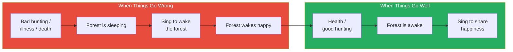

The Pygmy worldview is a complete, self-consistent system: suffering has an explanation (the forest is sleeping), healing has a method (sing to wake the forest), joy has a ritual (sing to share happiness), and there are no unanswered questions. The arrow from "forest wakes happy" to "health / good hunting" shows that healing is not a one-time event but a restoration of the normal state. The system is elegant precisely because it is simple — all suffering has one cause (the forest's inattention) and one cure (singing), which means the community always knows what to do. Compare this to the modern world, where suffering often seems random and meaningless, and where the response to tragedy is often paralysis or rage rather than communal action. The Pygmy system transforms every crisis into an opportunity for collective solidarity — the community comes together, sings together, and heals together.

Prof. Jiang draws the parallel to the Barasana system explicitly: "It's almost the same religion. Maybe the details are different, but the idea is the same." Both cultures believe all beings are interconnected — "animals, plants, humans, all the same." Both believe the physical world is not the real world — "this is not the real world; the spirit world, the forest, they're the real world." Both believe their job is to communicate with the spirit world and maintain its happiness — "for us to maintain our health and our happiness and our safety, we must always communicate with this other world and make sure they're happy." The convergence is not coincidental — it is evidence that this worldview is a natural product of the human mind living in close relationship with nature, undistorted by agriculture, cities, or organised religion.

Prof. Jiang uses the Pygmy elder's words to circle back to the lecture's opening question: what was the religious imagination of early humans? The answer is now complete.

It was a worldview in which humans are children of the natural world, in which the spirit world is more real than the physical world, in which every action carries religious meaning, and in which collective belief sustains collective reality. It was a worldview that produced — and was designed to produce — peace, equality, and artistic expression. And it was a worldview that lasted for 200,000 years, until something powerful enough to destroy it came along.

Prof. Jiang's closing words circle back to the series' driving question: "So now the question is, what changed? Why do we have war? Why do we have hierarchy? Why do we have patriarchy? Why are men superior to women? Why do some rich people have all the power?"

He answers with the preview that will drive Lecture 4: "This clearly goes against this religion, and what I will show you starting next class is the beginning of a new religion, and how this new religion that worships wealth, power, and war conquered everyone."

- This mirrors the Barasana system exactly:
  - Bad events → spirits are unhappy / the forest is sleeping
  - Response → communicate with the spirit world (shaman's trance / collective singing)
  - Outcome → balance restored, the world heals
- The religion produces a complete explanation for everything — which is why Prof. Jiang's "completeness" criterion matters so much
  - There are no unanswered questions in the Pygmy worldview: every form of suffering has the same cause, every crisis has the same solution
  - The system also explains good fortune: the forest is awake and looking after its children
  - And the response to good fortune mirrors the response to bad fortune: singing, communication, sharing
- <b style="color: #27ae60">This worldview also explains why early humans were peaceful and egalitarian:</b>
  - War causes chaos in the spirit world — humans are caretakers, not conquerors
  - Hierarchy contradicts the fact that all beings come from the same mother goddess / forest — "we're all from the same woman shaman"
  - Art is necessary because humans must celebrate and worship the spirit world
  - Conflict between people violates the principle of reciprocity and disturbs the cosmic balance

Prof. Jiang makes this connection explicit in his closing remarks, tying the entire lecture back to the three characteristics of early humanity established in the review. The logic is elegant: if your religion teaches that all beings are equal, you cannot build a hierarchy. If your religion teaches that your job is to maintain cosmic balance, you cannot wage war (because war is the ultimate disruption of balance). If your religion teaches that the spirit world is the true reality and must be worshipped, you must be artistic (because art is the medium of worship). The religion does not merely coexist with peace, equality, and art — it *produces* them. They are the inevitable social consequences of the animist worldview.

This also explains why the destruction of this worldview — the topic of Lecture 4 — was so catastrophic. The Yamnaya religion celebrated the opposite values: warfare, patriarchy, and wealth. To adopt a new religion was not just to change beliefs; it was to change the entire social structure. The transition from animism to the Yamnaya religion was simultaneously a transition from peace to war, from equality to hierarchy, from art-as-worship to art-as-power. Prof. Jiang is building toward this argument gradually, and this lecture provides the "before" picture in its fullest, most vivid form.

The elegance of the argument deserves emphasis. Prof. Jiang has not simply described the animist worldview — he has shown how it functions as a causal mechanism. The religion does not merely accompany peace, equality, and art; it produces them as logical necessities.

If you believe all beings share one spiritual essence, you *must* treat them as equals. If you believe your job is to maintain cosmic balance, you *must* avoid war. If you believe the spirit world requires worship, you *must* create art. The religion is not a cultural decoration layered on top of a hunting-gathering economy — it is the engine that drives the entire social order. When the engine changes, everything changes with it.

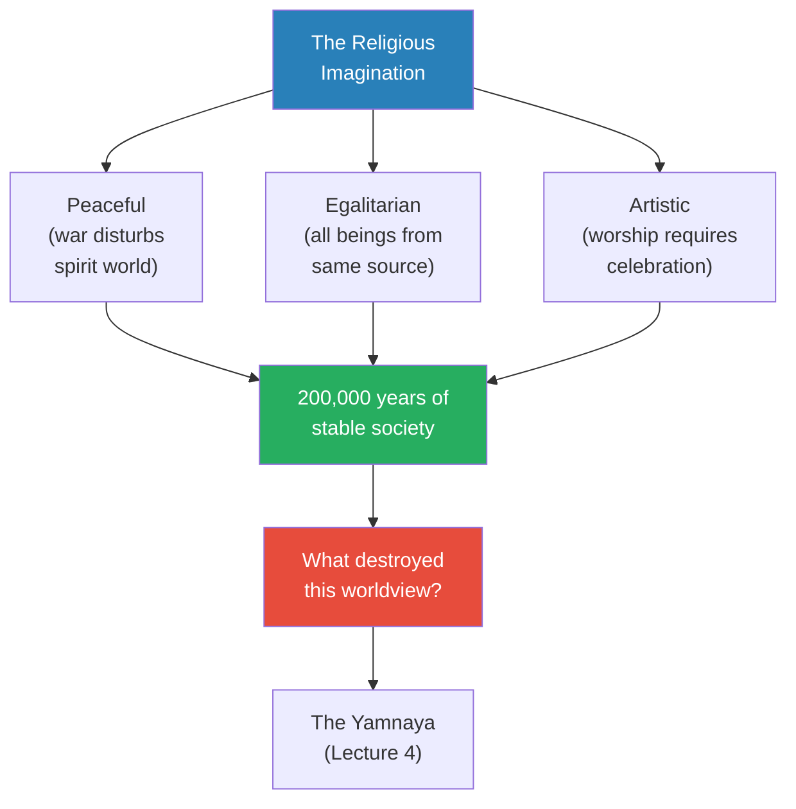

This diagram closes the lecture's argumentative arc by connecting the religious imagination back to the three characteristics established in the review section: peaceful, egalitarian, and artistic. The religion is not just a set of beliefs — it is the mechanism that produces and sustains these social outcomes for 200,000 years. The red node at the bottom marks the question that will drive the next lecture: if this system was so stable and so complete, what could possibly have been powerful enough to destroy it? Prof. Jiang's preview answer — the Yamnaya, with their religion of warfare, patriarchy, and wealth — sets up Lecture 4. The diagram also reveals the fragility hidden within the system's stability: because peace, equality, and art all depend on the same religious foundation, attacking the religion attacks all three simultaneously. The Yamnaya did not need to defeat the animist worldview in three separate battles — they needed to replace the religion, and everything else would follow.

---

## Evidence and Sources

*Prof. Jiang draws on a narrow but deep set of sources in this lecture — primarily two anthropological texts — supplemented by archaeological evidence reviewed from previous lectures.*

| Source | Type | What it shows |
|--------|------|---------------|
| Wade Davis, *The Wayfinders* | Anthropological book | Detailed ethnography of the Amazonian Barasana — creation myths, cosmology, hunting rituals, shamanic practice, the shadow dimension |
| Colin Turnbull (likely *The Forest People*) | Anthropological book | Pygmy religion — molimo ceremony, relationship with the forest, sleeping punishment, the "pretending" passage |
| Göbekli Tepe (reviewed) | Archaeological site | Pre-hunt religious festivals — T-pillars with animal carvings representing "the manifestation of the animal spirit in us" |
| Cave paintings (reviewed) | Archaeological evidence | Tribute to animals before hunting — explained by the reciprocity principle |
| 40,000-year-old figurine (Germany) | Archaeological artefact | Shaman dressed as animal — religious art at the dawn of human expansion from Africa |
| 40,000-year-old flute (Germany) | Archaeological artefact | Music as religious expression from the earliest period of human history |

Prof. Jiang explicitly recommends *The Wayfinders* to students: "This is a great book. If you guys ever have a chance, please read this book. It's extremely well written." The lecture relies heavily on extended quotations from Davis, read aloud in class, which give it a literary quality unusual for a history lecture. The Turnbull material is equally vivid but used more selectively — Prof. Jiang extracts three key passages (the forest walk, the sleeping punishment, and the "pretending" paragraph) and subjects each to close analysis.

---

## Student Q&A Highlights

*The transcript preserves several substantive Q&A moments where Prof. Jiang's Socratic method yields important insights that go beyond the prepared material.*

**Why creation myths are complicated:** Prof. Jiang shows students the Barasana cosmological visualisation — a dense, elaborate diagram of their understanding of creation — and asks them to explain why it is so complex. Students initially struggle, offering answers about storytelling and tradition. Prof. Jiang steers them toward the real answer: complexity is not decorative but functional. A religion needs to be vast (grandness), explain everything (completeness), and hold together (unity) in order to be believed. This Q&A exchange is the vehicle through which the grandness-completeness-unity framework is introduced, making it feel discovered rather than imposed. Prof. Jiang tells students: "One thing that you will learn in this class is that what's really important is for you to believe that your religion is correct — just as correct as science."

**What the shaman photographs reveal:** When Prof. Jiang shows photographs of Barasana shamans, he does not lecture about them — he asks students what they see. One student notices the elaborate clothing and the care put into the shamans' dress. Another observes the hierarchical positioning — the elder stands in the middle. A student named Jimmy notices the symmetry and the structured bodily relationships between the three figures. Prof. Jiang synthesises their observations into a single insight: these photographs prove that every aspect of Barasana life — clothing, posture, spatial relationships — carries religious meaning. He challenges the class directly: "If this is a tribe and all they're trying to do is hunt and eat food, none of this makes any sense, right? But the main argument that I've been trying to tell you is: no, their first priority is their religion." The photographs are evidence that religion structures every minute of life — not just ceremony times.

**Why sleeping is the worst crime:** This is the lecture's most extended Socratic sequence. Prof. Jiang begins with the classroom analogy ("If one of you is sleeping and I get so angry I want to kill that person — why?") and walks students through several layers of logic. The first student answer — "it's disrespectful of your authority" — is acknowledged but insufficient. "That is true, but then I just ask a person to leave my class, right? But I want to *kill* that person. Why?" He asks "What is a classroom?" and "What allows a classroom to exist?" before a student grasps the key: "Everyone participating in it." From there, the logic unfolds naturally: the classroom is a collective experience that depends on universal participation; the sleeping student says "this isn't real"; and in the Pygmy context, saying "this isn't real" threatens the existence of reality itself. The Q&A sequence demonstrates Prof. Jiang's teaching method at its best — he never gives the answer directly but constructs the path so precisely that students arrive at it themselves.

**The word "pretending":** Prof. Jiang structures this as a close-reading exercise, explicitly comparing it to the kind of analysis students will do on the SAT. He reads the passage twice, asks students to find the word that reveals Turnbull's incomprehension, and waits through several wrong answers before the right one surfaces. He adds another analogy to drive the point home: "If another teacher comes into my class and says, 'Wow, your class is a lot of fun — you play a lot,' I'd be insulted. Why? Because it implies what we're doing is not serious academic work. It's playing. It has no significance, no meaning." The word "pretending" does the same thing to the Pygmies' spiritual experience — it reduces the most important thing in their lives to a game. The pedagogical method mirrors the intellectual point: just as the answer is hidden in plain sight within the text, the chasm between modern and pre-modern thinking is hidden in plain sight within our everyday language.

---

## Connections

**Builds on:** [[01 - Explaining Humanity's Transition to Agriculture]] — Prof. Jiang explicitly reconnects Göbekli Tepe's T-pillars (representing "the manifestation of the animal spirit in us"), the cave paintings (tribute to animals before hunting), and the four disciplines of evidence (archaeology, anthropology, primatology, psychology). This lecture provides the anthropological evidence that Lecture 1 promised: living cultures that practise the religion archaeologists find traces of in ancient sites. The reciprocity principle finally explains *why* cave paintings celebrate animals rather than humans — they are acts of tribute and gratitude, not decoration.

**Builds on:** [[02 - Religion and the Dawn of Society]] — The animist framework defined in Lecture 2 (mother goddess, permanent soul, spirit world, cosmic order) is now given full ethnographic flesh through the Barasana and Pygmy material. The 40,000-year-old figurines and flutes from Germany, introduced in Lecture 2, are reinterpreted here as shamanic ritual objects — the figurine is a shaman dressed as an animal for the pre-hunt ritual; the flute is music as religious expression. Where Lecture 2 defined animism abstractly, Lecture 3 shows what it looks and feels like from the inside.

**Sets up:** [[04 - The Paradise Lost of Marija Gimbutas]] — Prof. Jiang explicitly previews the next lecture: a new group called the Yamnaya emerged with a different religion that celebrated warfare, patriarchy, and wealth. They "conquered everyone and created a new history of humanity." The peaceful, egalitarian, artistic worldview described in this lecture was destroyed. Understanding what was lost — the trust, the reciprocity, the completeness of the animist worldview — makes the Yamnaya conquest feel like a genuine civilisational catastrophe rather than a neutral historical event. The emotional weight of Lecture 3 is designed to make Lecture 4's story of destruction feel personal.

**Related books in vault:** [[Sapiens - Yuval Noah Harari]] (the agricultural revolution and religion's role in organising large-scale human cooperation — Harari's concept of "imagined orders" parallels Prof. Jiang's "religious imagination" directly), [[The Wayfinders - Wade Davis]] (directly cited — primary source for all Barasana ethnography in this lecture; Prof. Jiang calls it "a great book" and urges students to read it)

**Recurring framework introduced:** Grandness, completeness, and unity as criteria for religious authority — flagged by Prof. Jiang for reuse when studying Judaism (Lectures 21-22) and Christianity (Lectures 24-27). The control-versus-trust framework and the materialism-versus-spirituality divide will also recur throughout the series as Prof. Jiang examines how different civilisations relate to nature, power, and the invisible world.

---

## The Takeaway

This lecture does something none of the previous lectures attempted: it asks us to *inhabit* a radically different way of seeing the world. Where Lecture 1 evaluated theories and Lecture 2 surveyed evidence, Lecture 3 demands empathy. Prof. Jiang reads extended ethnographic passages not to prove a point but to create an experience — the experience of understanding, even briefly, what it feels like to be a "child of the forest" who trusts nature the way we trust gravity. The shift from analysis to immersion is deliberate: you cannot understand the religious imagination from outside it, because the entire point of the religious imagination is that it is experienced from within. By the end of the lecture, students should feel not just informed but slightly destabilised — less certain that the modern worldview is obviously correct.

The most important intellectual tool introduced here is the contrast between control and trust, between materialism and spirituality, between "pretending" and genuine belief. These are not just historical distinctions — they are alive today.

When Turnbull calls the Pygmy ceremony "make-believe," he is doing exactly what most modern people do when they encounter unfamiliar religions or worldviews: dismissing what they cannot measure. Prof. Jiang's challenge is direct: "How can you say the imagination doesn't exist?"

The materialism trap — the assumption that only the measurable is real — blinds us to entire dimensions of human experience that our ancestors took for granted. This is not an argument for abandoning science; it is an argument for recognising that science's epistemological framework, powerful as it is, cannot account for everything humans have valued and experienced.

The reciprocity principle deserves special attention because it solves a problem that modern ethics has never satisfactorily answered: what is our moral obligation to the natural world?

The modern answer — environmental regulation, carbon credits, sustainability targets — is transactional and bureaucratic. The Barasana answer is relational: you negotiate with the spirits of the animals you kill, you give thanks, you ask forgiveness, you maintain a personal relationship with every living thing you depend on.

Whether or not one believes in spirit guardians, the principle of reciprocity produces a relationship with nature that is fundamentally healthier than the modern relationship of extraction and control. The fact that this principle sustained human civilisation for 200,000 years — compared to the two centuries of accelerating ecological damage under the modern paradigm — should give us pause.

Prof. Jiang's method in this lecture models something valuable: the willingness to take another culture's worldview seriously on its own terms, rather than translating it into modern categories. He does not say "the Pygmies believe the forest is alive, which is of course a metaphor for ecological interdependence." He says the forest IS alive, the spirits ARE real, and the ceremony IS more real than reality — because that is what the Pygmies believe, and dismissing their belief as metaphor is just another version of Turnbull's "pretending."

This intellectual generosity — treating other worldviews as potentially true rather than quaintly false — is the analytical stance the entire lecture series requires. Students who cannot make this leap will struggle with everything from the Yamnaya's warrior religion to the power of Christianity to Islam's golden age. Every civilisation the course examines was built on beliefs that modern people find strange, and understanding those civilisations requires taking those beliefs seriously. The lesson of Lecture 3 is not just about the Pygmies and the Barasana — it is about how to think historically, how to escape the prison of one's own assumptions, and how to recognise that the modern worldview is not the only worldview, and may not be the best one.

The lecture ends with a question that will drive the rest of the course: if this peaceful, egalitarian, artistic worldview lasted for 200,000 years, what could possibly have been powerful enough to destroy it? The answer — the Yamnaya and their religion of war, wealth, and patriarchy — begins next class.

But the question lingers beyond the historical: if the religious imagination produced 200,000 years of relative peace and ecological balance, and modernity has produced 200 years of accelerating warfare and environmental destruction, which worldview should we consider "primitive"? Prof. Jiang does not answer this question explicitly, but the lecture's entire structure — its empathetic immersion, its demolition of modern prejudices, its insistence that the Barasana and Pygmies are "extraordinarily imaginative and extremely sophisticated" — makes his sympathies unmistakable.