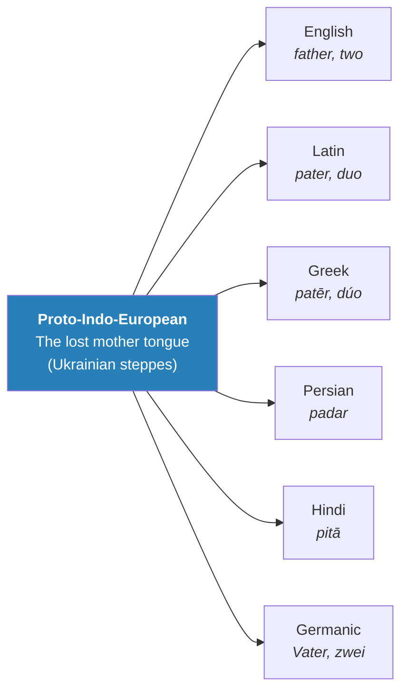
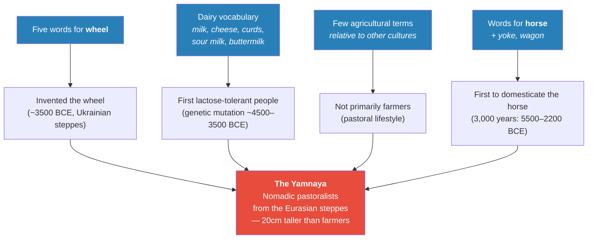
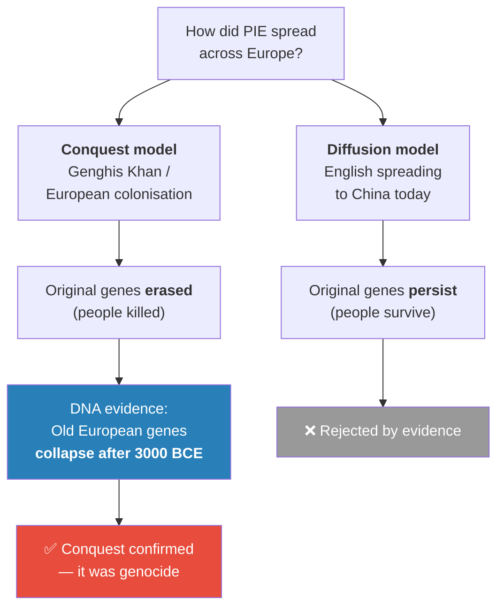
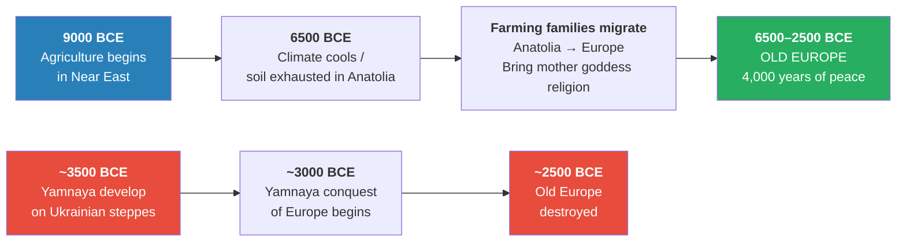
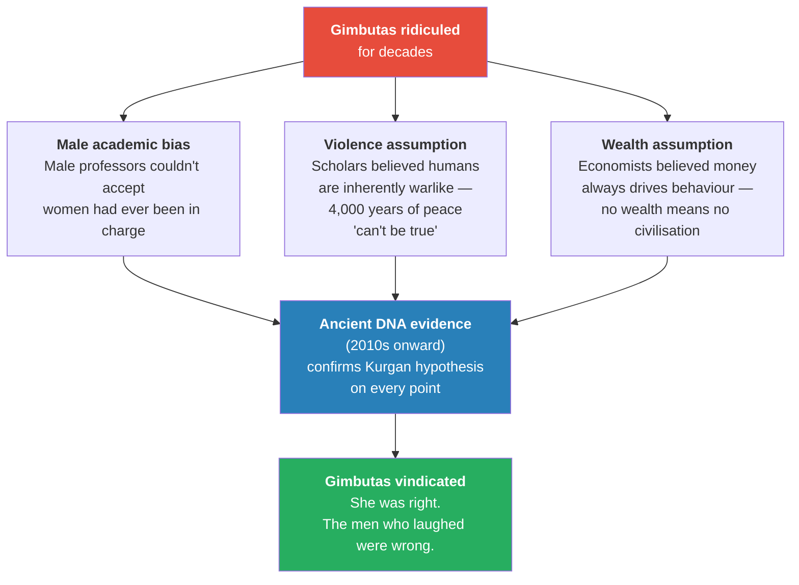
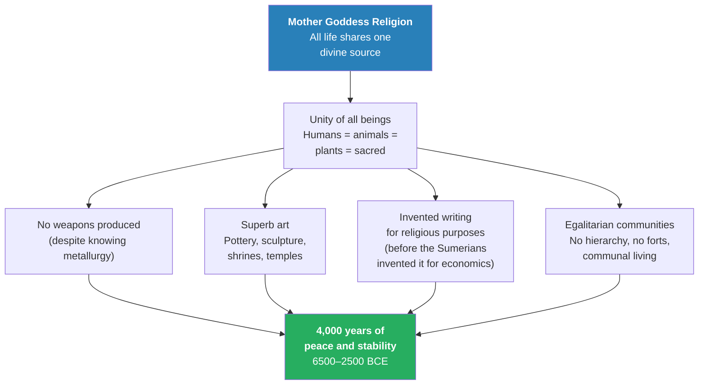
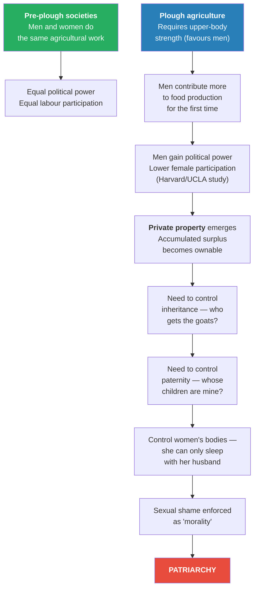
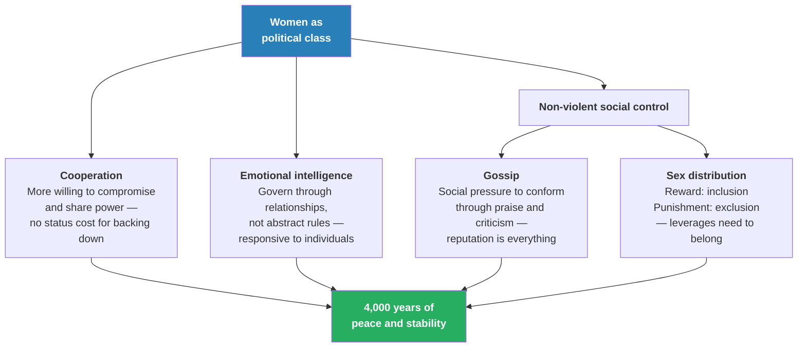

# The Paradise Lost of Marija Gimbutas

> If humans were peaceful, egalitarian, and artistic for most of their history — held together by the mother goddess religion from the Ice Age cave paintings to Göbekli Tepe to Çatalhöyük — how did we end up with war, private property, and patriarchy? Prof. Jiang reconstructs "Old Europe," the 4,000-year matriarchal civilisation documented by anthropologist Marija Gimbutas, using three converging lines of evidence: linguistics, archaeology, and DNA. The lecture's deepest claim is that everything we assume is natural about gender, violence, and ownership is a recent cultural invention — and the proof is now written in our genes.

---

## Overview: Key Highlights

- <b style="color: #2980b9">Proto-Indo-European (PIE)</b> — the reconstructed ancestor of almost every European and South Asian language, traceable through shared words for "father," "mother," and even the number "two"
- <b style="color: #27ae60">The Yamnaya were 20 centimetres taller than European farmers</b> — a biological advantage that came directly from being the first people to drink cow's milk
- <b style="color: #e74c3c">DNA has confirmed genocide, not cultural exchange</b> — after 3000 BCE, Old European genes collapse while Yamnaya genes flood in; the diffusion theory is dead
- <b style="color: #2980b9">The Kurgan hypothesis</b> — Gimbutas's theory that Yamnaya burial-mound culture violently replaced Old Europe — laughed at for decades, now confirmed by ancient DNA
- <b style="color: #27ae60">Old Europe had metallurgy and chose not to make weapons</b> — peace was an active, deliberate choice, not a failure of technology
- <b style="color: #e74c3c">Three biases kept the academy from accepting Gimbutas</b> — male dominance in universities, the assumption that humans are inherently violent, and the belief that money always drives behaviour
- <b style="color: #2980b9">Snake = life; Black = fertility; White = death</b> — three complete symbolic reversals show just how thoroughly the Yamnaya conquest rewrote the cultural vocabulary
- <b style="color: #27ae60">Sexual shame is an economic enforcement mechanism, not a moral category</b> — it was invented to protect private property and patrilineal inheritance
- <b style="color: #2980b9">The plough, not biology, created gender inequality</b> — a Harvard/UCLA study shows female political participation drops precisely when plough agriculture is adopted
- <b style="color: #e74c3c">Private property is the root cause of patriarchy</b> — every link in the chain from plough to sexual shame is cultural, not biological
- <b style="color: #27ae60">Women governed Old Europe through three non-violent mechanisms</b> — cooperation, emotional intelligence, and the strategic use of gossip and sex distribution
- <b style="color: #2980b9">Race was invented ~200 years ago</b> — to justify European imperialism, not to describe a biological reality

| Concept | One-line summary |
|---------|-----------------|
| **Proto-Indo-European (PIE)** | Reconstructed ancestor language of most European and South Asian tongues, traced through shared vocabulary |
| **The Yamnaya** | Steppe pastoralists from Ukraine (~3500–2500 BCE) who spoke PIE, drank milk, rode horses, and conquered Europe |
| **Old Europe** | Gimbutas's term for the pre-Yamnaya matriarchal, egalitarian civilisation (6500–2500 BCE) |
| **Kurgan hypothesis** | Gimbutas's theory that Yamnaya burial mounds mark a violent replacement of Old Europe — confirmed by DNA |
| **Conquest vs. diffusion** | Two models for language spread; DNA evidence shows Old European genes were erased, confirming conquest |
| **Lactose tolerance** | Genetic mutation that spread through Yamnaya ~4500–3500 BCE, giving them a dramatic physical advantage |
| **Nomadic pastoralists** | The Yamnaya lifestyle: moving livestock from pasture to pasture via horse and wagon across the steppe |
| **Cultural construct** | Gender roles, sexual shame, race, and violence are cultural inventions with specific origin points, not natural facts |
| **Non-violent social control** | Gossip and strategic sex distribution as governance tools — how women maintained order without coercion |
| **The plough–patriarchy chain** | Plough → male advantage → private property → inheritance → paternity control → sexual shame → patriarchy |
| **Animism** | The belief that all life — human, animal, plant — flows from one divine source, the mother goddess |
| **Writing for religion** | Old Europeans invented symbolic writing for religious purposes before the Sumerians invented it for economics |

---

# The Lecture

## The Story So Far: 300,000 Years of Peace [0:01–3:00]

*Prof. Jiang opens by recapping the arc of the course — from Africa to the ice age, from the cave paintings to the mother goddess religion — and poses the central question that will drive the rest of the series: if this peaceful, egalitarian world was the default state of humanity, what broke it?*

> [!tip] Core Insight
> The question is not "why were early humans peaceful?" — that was the norm for 200,000 years. The question is "what broke the norm?" War, patriarchy, and private property are the anomalies that need explaining, not the other way around.

> [!note]- Expand: Full Lecture Detail
> Prof. Jiang opens with a recapitulation: 300,000 years ago Homo sapiens were born in Africa. About 50,000 years ago, driven by climate change, we spread across the world — into Europe, across Asia, over the Bering Strait into the Americas, down to Australia. By that point there were roughly a million of us, and from the very beginning we were religious.
>
> He catalogues the evidence: the Ice Age cave paintings were not decoration but ritual. Göbekli Tepe in Turkey, built 11,500 years ago, was a temple before it was a settlement. Çatalhöyük was a city organised around the worship of the mother goddess. The religion in every case was <b style="color: #2980b9">animistic</b> — the belief that all living things come from one source, the mother goddess, and are all her children equally.
>
> - Because of this belief, early humans were compassionate and egalitarian — no difference in status between men and women
> - They were peaceful — some violence, but no organised warfare
> - They were artistic — celebrating the goddess through paintings, sculpture, and music
>
> Prof. Jiang frames the question directly: "If we were like this for most of human history, how is it that today we have war, private property, and patriarchy — where men make all the rules and women have little agency and power?" He tells the class this question is what the whole lecture will answer — and what the next lecture will complete.
>
> The answer begins with a lost language.

---

## A Dead Language Reveals a Lost People [3:00–11:49]

*Prof. Jiang introduces proto-Indo-European — the reconstructed ancestor language of most European and Asian languages — and shows how its vocabulary alone allowed linguists to build a cultural profile of its speakers before a single bone was dug up.*

*The family tree of Indo-European languages spans from Iceland to India. Shared words for "father," "mother," and basic numbers across dozens of tongues are too similar to be coincidental — they are fossils of a single lost ancestor language.*

> [!note]- Expand: Full Lecture Detail
> Prof. Jiang explains that for hundreds of years scholars have noticed something strange: "father" in English is *father*, in Latin *pater*, in Greek *patēr*, in Persian *padar*, in Hindi *pitā*. "Mother" follows the same ghostly pattern. Even the number "two" traces back through dozens of languages to a single root: *dua*.
>
> The implication was radical — all these languages, stretched across thousands of miles and thousands of years, descended from <b style="color: #2980b9">one lost mother tongue</b> that nobody alive has ever spoken. Linguists call it proto-Indo-European, and they were able to piece together its vocabulary by comparing words that sound the same across living languages.
>
> The scope is staggering: virtually every language spoken across Europe today, plus the major languages of Iran and northern India, traces back to one ancestral tongue. Two hypotheses competed for where it originated: Anatolia (modern Turkey) or the steppes of Ukraine. Prof. Jiang notes the linguistic evidence eventually pointed firmly to the steppes.
>
> Prof. Jiang then performs one of the lecture's most effective pedagogical moves: he presents the raw PIE vocabulary and asks students to look for patterns:
>
> - Animal words: bo, cow, ox, ram, eel, lamb, pig, piglet, dog
> - Dairy words: sour milk, curds, buttermilk, cheese
> - Movement words: wheel (five different words), yoke, wagon, shaft, plough, oxen, furrow
> - Horse words: domesticated horse, riding terms
> - Notably few crop words compared to other cultures
>
> "What do you notice about these words?" he asks. The students become detectives — from the vocabulary alone, before any archaeology, before any DNA, a portrait emerges of people whose lives centred on livestock rather than fields, on movement rather than settlement. The method is forensic: linguists reconstructing a civilisation from trace vocabulary, the way a detective reconstructs a crime scene from trace evidence.

---

## Four Clues in a Dead Vocabulary [11:49–15:59]

*From the PIE word list, linguists made four specific predictions about who these people were. Archaeology confirmed every one. DNA then sealed the case.*

*Four vocabulary clues converge on one cultural profile. Linguists guessed; archaeologists confirmed; DNA proved it. When three independent disciplines arrive at the same conclusion, the result is as close to certainty as the human sciences can achieve.*

> [!note]- Expand: Full Lecture Detail
> Prof. Jiang walks through each of the four deductions:
>
> **Deduction 1 — Wheel:** Five different words for "wheel" means these people invented the wheel and it was central to daily life. Archaeological evidence confirms: the wheel was invented around 3500 BCE in the steppe region of what is now Ukraine. This also timestamps the language — whoever first spoke PIE must have been speaking it after 3500 BCE, because the vocabulary contains a technology that did not exist before then. The word itself carries a date.
>
> **Deduction 2 — Dairy:** An extensive dairy vocabulary — milk, cheese, curds, buttermilk, sour milk — means these people were the first to be lactose tolerant. Prof. Jiang explains the significance: for most of human history, humans were lactose intolerant. The ability to digest cow's milk as adults required a specific genetic mutation. DNA evidence now shows this mutation spreading through the steppe population between roughly 4500 and 3500 BCE — breathtakingly fast, in evolutionary terms. The Yamnaya who could drink milk had such a survival advantage that the gene swept through the entire population in barely forty generations.
>
> The physical consequence was dramatic:
>
> - The Yamnaya consumed far more protein and calcium than any farming culture
> - <b style="color: #27ae60">They were on average 20 centimetres taller than the farmers they would eventually encounter</b>
> - This is the difference between looking someone in the eye and looking up at their chin
> - Imagine an entire population of people who tower over their neighbours, fuelled by a diet their neighbours' bodies literally cannot process
>
> A student asks about modern milk versus ancient milk. Prof. Jiang clarifies: the milk the Yamnaya drank came from grass-fed cows on open steppe — no hormones, no antibiotics. Modern commercial milk comes from factory-farmed cows injected with drugs to increase production. If you really want to be healthy, he jokes, go buy a cow and drink from that cow.
>
> **Deduction 3 — Not primarily farmers:** Relatively few agricultural terms, compared to their enormous vocabulary for animals and animal products, means they were pastoralists — people whose identity, economy, and daily life centred on moving herds of animals, not tilling fields. This distinction matters for psychology: farmers are rooted to one place, investing years of labour in a single patch of soil. Pastoralists are mobile, following grass and seasons. The horizon is not a boundary but an invitation.
>
> **Deduction 4 — Horse:** Words for horse and intimate relationship with horses means they were the first people in history to domesticate the horse. Prof. Jiang emphasises the patience involved: horses carry a gene for <b style="color: #2980b9">excitability</b> — an evolutionary survival instinct that makes them bolt from perceived threats. It took roughly 3,000 years (5500 BCE to 2200 BCE) to breed horses docile enough to ride. Three thousand years of choosing the calmest horses, breeding them together, and slowly dialling down the flight instinct.
>
> The archaeological evidence of this achievement is written directly into the riders' bodies: Yamnaya skeletons show distinctive spinal curvature from a lifetime spent on horseback — a physical signature found across hundreds of burial sites and entirely absent from contemporary farming populations.
>
> Putting wheel and horse together produced the wagon. The wagon turned the Yamnaya into <b style="color: #2980b9">nomadic pastoralists</b> on an entirely new scale — mobile, protein-fuelled, physically imposing, capable of moving entire families, herds, and belongings across vast distances. Prof. Jiang compares them to modern Mongolians: "Have you been to Mongolia? The way they make a living — moving their cows and sheep from place to place, loading all their belongings into a wagon, following the grass — that is exactly how the Yamnaya lived five thousand years ago."

---

## Conquest or Cultural Exchange? [15:59–24:30]

*For decades scholars debated whether proto-Indo-European spread through conquest or peaceful diffusion. DNA has settled the question with devastating finality — and the answer is the darkest possible one.*

*The test is simple and decisive: if the original population's genes persist after contact, the spread was peaceful; if they vanish, it was violent. European DNA shows Old European genetic signatures collapsing after 3000 BCE. The diffusion hypothesis does not survive the evidence.*

> [!note]- Expand: Full Lecture Detail
> Prof. Jiang presents the two competing models for how PIE spread so far and so completely.
>
> The first model was <b style="color: #e74c3c">conquest</b>: like Genghis Khan and the Mongols sweeping across the Asian steppe, or the Spanish and English decimation of indigenous peoples in the Americas. Conquerors arrive, kill the local population, take their land, impose their language. The second model was <b style="color: #2980b9">cultural diffusion</b>: like English spreading to China today. Nobody conquered China to make it learn English — Chinese families choose English because they believe it will open doors.
>
> For most of the debate's history, the academic consensus favoured diffusion. It was more comfortable. More civilised. More consistent with the gradualist instincts of scholarly life.
>
> A student asks: "What's the difference between conquest and diffusion?" Prof. Jiang's answer is one of the lecture's most elegant moments. He reduces the entire debate to a single test: if language spread through diffusion, the original inhabitants' genes persist — people adopt a new tongue but keep their biology. Your great-great-grandchildren speak differently but still carry your DNA. If language spread through conquest, the original genes are erased — because the original people were killed. Their genetic lineage ends. Their DNA vanishes from the population.
>
> This difference — persistence versus erasure — is testable. And DNA technology can now run the test definitively.
>
> The result: before 4500 BCE, most Europeans carry a genetic mixture of Anatolian farmer DNA and indigenous hunter-gatherer DNA. After 3000 BCE, a massive new genetic component — Yamnaya steppe DNA — explodes onto the map while the older components don't just shrink; they collapse. In some regions of Europe, the Yamnaya genetic signature replaces 75% or more of the pre-existing population's DNA within just a few centuries.
>
> <b style="color: #e74c3c">The genes were erased. The people were killed. It was genocide.</b>
>
> Prof. Jiang is careful: this lecture is not about the conquest itself — that story comes in Lecture 5. This lecture is about what was destroyed. But he previews the DNA evidence now so that the portrait of Old Europe that follows carries its full weight. You cannot understand what was lost unless you first understand how thoroughly it was erased.

---

## Two Migrations That Built Europe [19:47–24:30]

*Before the Yamnaya arrived, Europe was already shaped by an earlier migration — farming families from Anatolia who brought the mother goddess religion with them — and Prof. Jiang traces the climate forces that drove both movements.*

*Two great migrations shaped Europe's prehistory. The first brought peaceful Anatolian farmers who built 4,000 years of egalitarian civilisation. The second brought the Yamnaya who destroyed it. Between these two events lies one of the most remarkable periods in all of human history.*

> [!note]- Expand: Full Lecture Detail
> Around 9000 BCE, agriculture was born in the Near East — in the fertile crescent stretching from Turkey through Syria, Jordan, and into Mesopotamia. This region warmed first after the Ice Age and had the richest soils on earth. But by about 6500 BCE, two pressures were building simultaneously.
>
> First, the climate cooled again in the Near East, making farming harder. Second — and this is a pattern that will recur throughout the Civilization series — thousands of years of continuous cultivation had exhausted the soil. The land that had given generously was giving less each year. At the same time, Europe was warming up, and its untouched soils were rich with millennia of accumulated potential.
>
> Prof. Jiang asks his students what would propel a migration. One student guesses war. Prof. Jiang notes there is no evidence of warfare in this period — which is itself evidence for the peaceful character of these communities. Another student correctly identifies climate change, and Prof. Jiang confirms: it was the push of deteriorating conditions at home combined with the pull of promising conditions elsewhere.
>
> The result was a massive migration of farming families from Anatolia into Europe — not an army, not a conquering force, but families:
>
> - They brought their seeds, their livestock, their pottery techniques, their building methods
> - Crucially, they brought their religion — the mother goddess who had watched over Göbekli Tepe and Çatalhöyük now watched over a new continent
> - The civilisation they built reflected those values: egalitarian, peaceful, artistic
>
> Prof. Jiang shows students the European DNA picture at different time periods. Before 4500 BCE, European DNA is a mix of Anatolian farmer and indigenous hunter-gatherer — the legacy of the first migration blending with the people already there. Two populations merged peacefully over centuries. Then after 3000 BCE, everything changes.
>
> The sheer duration of Old Europe is almost impossible to grasp: four thousand years. The Roman Empire lasted roughly a thousand years. Christianity is about two thousand years old. The entire span of recorded history — Sumerian clay tablets to the present — is about five thousand years. Old Europe lasted for four-fifths of that entire span. And it was peaceful the entire time.

---

## Marija Gimbutas and the Kurgan Hypothesis [24:30–30:34]

*Prof. Jiang introduces the anthropologist whose life's work defined "Old Europe" — and the three biases that led the male academic establishment to ridicule her findings for decades.*

*Three biases blocked academic acceptance for decades — male dominance, the assumption of inherent human violence, and the belief that money always drives behaviour. All three turned out to be false. Gimbutas died in 1994; the DNA revolution that confirmed her vindicated her posthumously.*

> [!note]- Expand: Full Lecture Detail
> Prof. Jiang introduces Marija Gimbutas: born in Lithuania in 1921, she fled the Soviet occupation, trained at some of Europe's finest universities, and built her career at Harvard and UCLA. Despite this pedigree, the theory she spent her life developing was treated as a fantasy by most of her male colleagues.
>
> Over years of meticulous excavation across southeastern Europe — Romania, Bulgaria, Greece, the former Yugoslavia — Gimbutas assembled an extraordinary body of evidence: burial practices, pottery, sculpture, temple architecture, settlement patterns. From this she developed the <b style="color: #2980b9">Kurgan hypothesis</b> — named after the distinctive burial mounds (*kurgans*) that the steppe peoples left everywhere they went.
>
> Her argument rested on a simple comparison: the way two cultures buried their dead revealed everything about how they lived.
>
> > [!example] Two Burial Practices, Two Civilisations
> > - Old European farmer burials were communal graves — bodies placed together, sometimes dozens at the same site
> > - No weapons anywhere in the burial — not a single sword, spear, or arrowhead across thousands of excavated sites
> > - Graves surrounded by pottery, sculptures, and art objects celebrating the mother goddess
> > - No individual was elevated above any other — the dead were equals, as the living had been
> > - Yamnaya burials were radically different: single individuals buried alone in raised mound graves (kurgans)
> > - The body was surrounded by weapons — daggers, maces, spearheads — markers of warrior identity
> > - Accompanied by cattle bones and horse remains: personal wealth following the owner into death
> > - The mound itself was a monument to individual status — the bigger the mound, the more important the person
> > **The lesson:** how a culture treats its dead reveals how it treats its living — communal burial means communal life; individual burial means individual power.
>
> Gimbutas published two landmark books: *The Language of the Goddess* (1989) and *The Civilization of the Goddess* (1991). She was laughed at, dismissed, and professionally marginalised. Prof. Jiang asks his students why — and his answer reveals more about the people doing the ridiculing than about the theory they rejected.
>
> **Bias 1 — Male academic dominance:** In the mid-twentieth century, university professors in archaeology, anthropology, and history were overwhelmingly men who had grown up in patriarchal societies. Male dominance was not a theory to them — it was the air they breathed. If Gimbutas was right, male dominance was not natural or biological — it was a historical accident with a start date. Prof. Jiang is blunt: "They called her theory impossible because accepting it would have meant accepting that their own privilege was contingent, not deserved."
>
> **Bias 2 — The violence assumption:** The idea that Europe could have been peaceful for 4,000 consecutive years struck scholars raised on narratives of perpetual human conflict as simply, self-evidently absurd. But their worldview had been built on evidence drawn exclusively from the period *after* the Yamnaya conquest — the period of patriarchy and warfare that Gimbutas was arguing was the aberration, not the norm.
>
> **Bias 3 — The wealth assumption:** Modern Western society assumes material self-interest drives all human behaviour. If Old Europe had no private property and no wealth accumulation, what incentive could people have had to work, to build, to create? Gimbutas was saying the entire economic model was wrong — that people had been motivated for millennia by religion, community, and artistic expression, not profit.
>
> All three assumptions turned out to be false. Gimbutas died in 1994. The ancient DNA revolution that confirmed her Kurgan hypothesis began in the 2010s. She was right. The men who laughed at her were wrong.

---

## What Old Europe Actually Looked Like [30:34–42:00]

*Prof. Jiang reads from Gimbutas's own work and walks students through three cultural inversions — beliefs so different from ours that they force us to recognise how recently the world was remade.*

> [!tip] Core Insight
> Old Europe had metallurgy — the knowledge and raw materials to make weapons, forts, and armour. They chose not to. Peace was not their default condition through ignorance; it was their active, daily choice. That makes it more impressive, not less.

*Old Europe's stability flowed from one source: the mother goddess religion that bound all life into a sacred unity. This single foundational belief cascaded through every dimension of daily existence — producing art instead of weapons, shrines instead of forts, religious writing instead of economic ledgers, and 4,000 consecutive years of peace.*

> [!note]- Expand: Full Lecture Detail
> Prof. Jiang reads a key passage from *The Civilization of the Goddess* aloud to the class:
>
> > [!quote] Marija Gimbutas
> > "The goddess, in all her manifestations, was a symbol of the unity of all life in nature."
>
> He translates it into everyday language: if there is a mosquito buzzing around your head, you do not swat it — because it carries divine energy, the same energy that flows through you. If you find an injured bird on the ground, you pick it up and heal it — because that bird is a child of the goddess, just as you are. Every creature, every plant, every stone in a riverbed is part of one continuous web of sacred life.
>
> Gimbutas describes this culture as having "taken deep delight in the natural wonders of this world." Its people "did not produce lethal weapons or build forts in inexorable places as their successors did, even when they were acquainted with metallurgy." Instead they built magnificent tomb shrines and temples, comfortable houses in moderately sized villages, and created superb pottery and sculptures. She calls the entire four-millennium period <b style="color: #27ae60">"a long lasting period of remarkable creativity and stability, an age free of strife."</b>
>
> Prof. Jiang returns repeatedly to the phrase "even when they were acquainted with metallurgy." These people *knew* how to forge metal. They had the technology to make swords, spears, and armour. They chose not to.
>
> Gimbutas also discovered that Old Europeans had developed a form of symbolic writing *before* the Sumerians. Prof. Jiang acts out the Sumerian scenario: imagine you are building a temple and need to pay workers — you press marks into wet clay to track wages. Writing as an economic technology. But Old European inscriptions appeared on sculptures, pottery, and sacred objects — not accounting tablets. Their function was religious: marks that blessed objects with divine energy, prayers inscribed into the physical world. <b style="color: #27ae60">Writing, in its earliest form, was not a technology of commerce but a technology of worship.</b>
>
> Prof. Jiang then presents three cultural inversions — complete reversals of meaning between Old Europe and the modern world:
>
> | Symbol | Old Europe believed | We believe today |
> |--------|-------------------|-----------------|
> | **The snake** | Symbol of life, energy, and regeneration — snakes shed their skin and are reborn; "a most benevolent creature" | Symbol of danger, poison, and evil — the serpent who tempted Eve |
> | **Black and white** | Black = fertility, the colour of damp caves, rich soil, the womb of the goddess. White = death, the colour of bleached bones | White = purity, goodness. Black = death, evil |
> | **A woman's body** | Belonged to the woman — she chose her own sexual partners and had full agency | Belongs (implicitly or explicitly) to her husband — sexual "purity" enforced through shame |
>
> On the black/white inversion, Prof. Jiang makes a larger point: the modern association of white with goodness and black with evil is not ancient — it is roughly 200 years old, invented during European imperialism to justify colonisation. <b style="color: #e74c3c">Race was a recent cultural construct, manufactured to justify conquest</b> — not a description of biological reality.
>
> On the snake: in our world, shaped by the Genesis story, the snake is the original villain. But in Old Europe it was one of the most sacred symbols in the entire religious vocabulary — because snakes shed their skin. They appear to die and emerge renewed. For a culture built on the eternal cycle of death and rebirth, the snake was a perfect embodiment of <b style="color: #2980b9">regeneration, life energy, and eternal renewal</b>. The transformation of the snake from sacred to reviled is one of the clearest markers of the cultural revolution that followed the Yamnaya conquest.

---

## Sex, Community, and the Origin of Shame [38:26–51:47]

*Prof. Jiang's most provocative section argues that female sexual agency was the biological norm for most of human history — and that the shame we feel about sex was deliberately manufactured to protect private property and male inheritance.*

*The causal chain from plough to patriarchy runs through six links — every one of them cultural, not biological. Remove private property from the equation and the entire logic of patriarchal sexual control dissolves.*

> [!note]- Expand: Full Lecture Detail
> Prof. Jiang opens this section with a rhetorical question: if a man sleeps with a thousand women, we call him a stud — tall, good-looking, successful. If a woman sleeps with a thousand men, we call her a slut — someone without morality or character. "Why does this make any logical sense?" He lets the question sit.
>
> His answer: it doesn't make sense, because it was never meant to make sense. It was meant to control. There is no biological basis for the distinction whatsoever — it is a cultural prejudice designed to protect the system of private property and male inheritance that the Yamnaya conquest introduced to Europe.
>
> He assembles evidence from multiple sources:
>
> - Among rhesus monkeys, females aggressively seek out males for sex — the female is proactive
> - Among bonobos, humanity's closest primate relatives, females are the dominant sex and initiate sexual encounters — including with each other, as a deliberate mechanism of alliance-building and cooperation
>
> Prof. Jiang then cites a study from Harvard and UCLA that identified the precise historical moment when gender equality began to erode: <b style="color: #2980b9">the invention of plough agriculture</b>. Before the plough, men and women performed the same agricultural work and held the same political power. The plough required upper-body strength, so men could operate it more effectively. For the first time in human history, men contributed more to food production than women. The correlation is stark: societies that adopted the plough consistently showed lower levels of female participation in politics, in the workforce, and in public life. The implication: <b style="color: #27ae60">differences between men and women are not biological constructs — they are cultural constructs</b>. Gender inequality has a birthday. It was caused by a specific tool.
>
> Prof. Jiang then walks the full chain explicitly:
>
> - The plough creates surplus → surplus becomes personal property
> - Private property requires inheritance → who gets the goats when the old man dies?
> - Inheritance requires certainty of paternity → are these children biologically mine?
> - Certainty of paternity requires controlling who a woman sleeps with
> - Controlling that requires shaming her for sleeping with anyone but her husband
> - The shame has to be so intense, so socially devastating, that it overrides her natural freedom
>
> <b style="color: #e74c3c">Private property is the root cause of patriarchy; everything else is a symptom.</b>
>
> Under the mother goddess religion, the logic worked completely differently. Since all beings came from the same divine source, there was no concept of individual ownership — including ownership of children. A child was not "mine" or "yours" but a child of the community, a child of the goddess. If your friend's son and your own son are equally children of the goddess, you have exactly the same obligation to protect both. There is no concept of paternity because there is no concept of individual inheritance.
>
> Prof. Jiang explains that pre-modern peoples understood reproduction differently: the woman gives life, the man gives energy. If men give energy through sex, then more men means more energy for the child. A woman with multiple sexual partners was not doing something shameful — she was being generous, ensuring her child received maximum energy from the community.
>
> > [!example] Stories That Reframe Sexual Morality
> > - In some Melanesian cultures, when a woman married, the husband's male family members would have sex with her on the wedding night — semen was understood as energy, and the family wanted to give her as much collective energy as possible
> > - A French Christian missionary enters a village where people sleep freely with multiple partners; scandalised, he declares: "You people are shameless"
> > - A villager replies: "You have no sense. You French people love only your own children, but we all love all the children of our tribe"
> > - The missionary saw immorality; the villager saw a society where every adult was responsible for every child
> > - WWII American bomber pilots had the highest mortality rate of any soldiers in the war
> > - They developed a practice of sleeping with each other's wives — not from immorality but from survival logic
> > - If you died tomorrow, you needed to know your closest comrades would protect your widow and raise your children
> > - Sexual sharing built the bonds that made that promise credible — educated, modern, twentieth-century Americans defaulting to communal logic under extreme pressure
> > - Christopher Ryan's *Sex at Dawn*: gorillas, the largest primates, have penises only 4cm long when fully erect; human males are nearly four times larger
> > - One theory: in species where females have multiple sexual partners, males with larger organs spread their genes forward more successfully — human anatomy itself may be evidence of a long evolutionary history of female sexual choice
> > **The lesson:** sexual sharing across these examples is not shameful but deeply functional — it builds community solidarity, ensures collective responsibility for all children, and reflects a worldview in which no person belongs to any other person.
>
> A student asks whether these practices are "backwards or primitive." Prof. Jiang's answer is emphatic: <b style="color: #27ae60">there is no such concept as backwards or primitive</b>. The very words assume that history moves in one direction, from worse to better. Our obsession with sexual exclusivity exists because we live in a society organised around private property. Remove that, and the entire structure dissolves. "Slut" is not a moral category — it is an economic enforcement mechanism dressed up as ethics.

---

## Why Women Made Better Rulers [51:16–57:13]

*Prof. Jiang concludes with a structural argument: women as a political class produced more stable societies because they governed through cooperation and subtlety rather than coercion and violence — and he gives three specific mechanisms that explain why.*

*Three mechanisms of female governance produced Old Europe's extraordinary stability. Cooperation replaced competition in inter-community relations. Emotional intelligence replaced rigid rule-making. Gossip and sex distribution replaced violence as tools of social control — leveraging the most powerful force in human psychology (the need to belong) rather than the crudest one (the fear of pain).*

> [!note]- Expand: Full Lecture Detail
> Having established that Old Europe was governed by women for 4,000 years and that this was the longest stretch of peace in European history, Prof. Jiang asks: why? Why would female political leadership produce peace where male leadership produces war and collapse?
>
> He frames this as a structural argument, not a biological one. It is not that women are inherently superior — it is that the combination of female political leadership with the mother goddess worldview created incentives and mechanisms that systematically favoured peace over conflict.
>
> **Mechanism 1 — Cooperation:** Men are socialised toward competition — they want status, dominance, and victory, and interpret compromise as weakness. When two male-led communities enter a territorial dispute, negotiation easily escalates because neither leader can afford to appear weak. The incentive structure of male leadership pushes toward confrontation.
>
> Women, Prof. Jiang argues, are socialised toward relationship maintenance and inclusion. When conflict arose between two Old European communities, the women leaders of each side could negotiate a genuine compromise because their goal was resolution, not victory. Neither needed to "win" because winning was not how female authority was maintained. This single difference in incentive structure — resolution versus domination — could explain why Old Europe avoided organised warfare for forty centuries.
>
> **Mechanism 2 — Emotional intelligence:** Men tend to govern through rules, through abstract systems that treat individuals as interchangeable units within a hierarchy. Women tend to govern through relationships — paying attention to the specific person in front of them, their mood, their needs, their grievances. When someone is struggling, the leadership notices before the struggle becomes a crisis. When tensions build between two members of the group, the leadership intervenes through quiet conversation rather than waiting for violence.
>
> This mode of governance is slower than autocratic command but produces far fewer explosions — which is why Old Europe could sustain peace for forty centuries while subsequent male-led civilisations could barely manage forty years without a war.
>
> **Mechanism 3 — Non-violent social control:** Because women are generally not as physically strong as men, they could not rely on violence to enforce social norms. This constraint, paradoxically, was their greatest advantage — it forced them to develop more psychologically sophisticated and ultimately more effective tools.
>
> The first tool was gossip — not trivial cattiness but a sophisticated governance mechanism with real consequences. In a small community where everyone knows everyone, reputation is everything:
>
> - If the community's women talk approvingly about your generosity and reliability, your doors are open everywhere
> - If they talk disapprovingly about your selfishness or aggression, you find yourself gradually excluded — not through any formal decree but through a thousand small signals: nobody sits next to you, nobody shares food, nobody makes eye contact
> - The social temperature drops until conforming to community values becomes the only rational choice
>
> The second tool was the strategic distribution of sexual access. In a society where women controlled their own bodies, the ability to include or exclude a man from the sexual and social life of the community was an extraordinarily powerful lever. Good behaviour was rewarded with inclusion; antisocial behaviour was punished with social isolation.
>
> Prof. Jiang illustrates with a thought experiment: "Every time you walk the hallways and you see a girl wearing red, tell her: you look fantastic. I guarantee you, within two weeks, all the girls in the school will be wearing red." No violence, no commands — just flattery, attention, and the human desire to be praised. <b style="color: #27ae60">That is how Old Europe was governed.</b>
>
> A student asks: "If people are not violent, how do you control society at all?" Prof. Jiang's answer: in a community where everyone knows everyone, where your standing determines your access to companionship, food, sex, and support, the threat of social exclusion is far more terrifying than the threat of physical violence. A bruise heals in a week. Being shunned by your entire community lasts forever. The genius of Old European governance was that it leveraged the most powerful force in human psychology — the need to belong — rather than the crudest one — the fear of pain.
>
> Prof. Jiang draws out the deeper implication: our modern reliance on police, prisons, courts, and formal legal systems is not the only way to maintain social order. It is not even the most effective way. It is simply the way that emerged *after* private property created cities, hierarchies, and anonymous populations of strangers who did not know each other personally. When the community was small enough for everyone to know everyone, gossip and social inclusion were sufficient. When private property created scale, the old tools stopped working and violence stepped in to fill the gap.

---

## Connections

**Builds on:** [[01 - Explaining Humanity's Transition to Agriculture]] — established that religion, not economics, drove the transition to settled life; this lecture shows what the civilisation built on that foundation actually looked like across 4,000 years

**Builds on:** [[02 - Religion and the Dawn of Society]] — introduced the mother goddess as the central figure of early religion; this lecture shows what a civilisation built on that belief looks like at continental scale

**Builds on:** [[03 - The Religious Imagination]] — established the animist worldview's daily texture through the Barasana and Pygmy cultures; this lecture reveals the *political* consequences of that worldview at the scale of an entire continent

**Sets up:** [[05 - The Yamnaya Conquest of Europe]] — every detail of Old Europe documented here exists to make the contrast with the Yamnaya as stark as possible; the DNA evidence previewed in this lecture becomes the centrepiece of that argument

**Related books in vault:**
- Marija Gimbutas, *The Civilization of the Goddess* and *The Language of the Goddess* — the foundational texts for Old Europe; Prof. Jiang quotes directly from the former
- Christopher Ryan, *Sex at Dawn* — assembles anthropological and anatomical evidence for female sexual agency as the biological norm; the gorilla penis argument and the Melanesian examples both originate here
- [[Sapiens - Yuval Noah Harari]] — the "wheat domesticated us" inversion from Lecture 1 connects to the plough–patriarchy chain discussed here

---

## The Takeaway

This lecture is, at its core, a defamiliarisation exercise — a systematic effort to make the familiar strange and the "natural" historical. Prof. Jiang takes everything his students assume to be the permanent furniture of the human condition — that men lead, that war is inevitable, that sexual jealousy is biological, that white symbolises purity and black symbolises evil — and demonstrates that each of these beliefs has a specific origin point, a specific set of inventors, and a specific political function it was designed to serve. None of them are timeless truths. All of them are recent inventions. And all of them replaced something older, gentler, and more equitable — a world that lasted forty centuries and left its fingerprints in the vocabulary of every language spoken from Iceland to India.

The most surprising finding in the lecture is methodological as much as historical. Linguists guessed from vocabulary patterns, with no physical evidence and no native speakers. Archaeologists confirmed from bone analysis and burial goods. Geneticists proved from DNA sequences. Three independent fields — working with completely different methods and data sets — converged on the same conclusion. When that convergence happens in the human sciences, it is as close to certainty as those sciences can achieve. And Gimbutas, who proposed the core of this argument in the 1950s using only archaeological evidence, was vindicated by a technology that did not exist when she first made her case. Her posthumous vindication is itself a lesson about how paradigm shifts work: the old guard does not change its mind — it retires, and the next generation accepts what the evidence demands.

The lecture deliberately leaves one question unanswered — the question that will drive Lecture 5. If Old Europe was so stable, so peaceful, so well-adapted to human needs, why did it fall? Four thousand years of peace, an entire continent governed by cooperation rather than coercion, and then within a few centuries all of it swept away by horse-riding warriors from the steppe. The Yamnaya did not merely conquer Old Europe — they erased it so thoroughly that it took modern science to rediscover it had ever existed. The mother goddess religion that had guided humanity for 200,000 years was ripped out by the roots. The symbols of life were redefined as symbols of evil. The sexual agency women had enjoyed for millennia was replaced by patriarchal control. The world we live in today — its politics, its economics, its gender roles, its relationship to violence — is the direct product of that destruction. What made the Yamnaya so unstoppable? That is the question Lecture 5 will answer.
