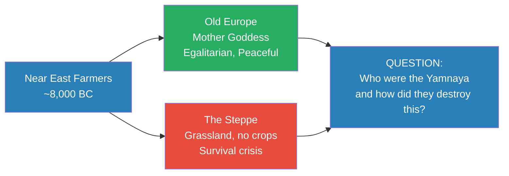
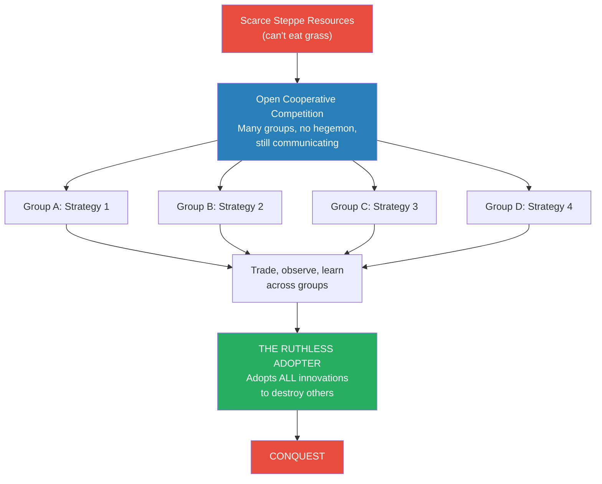
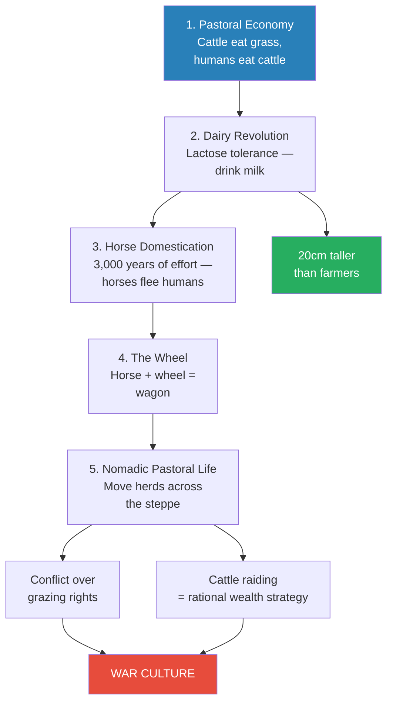
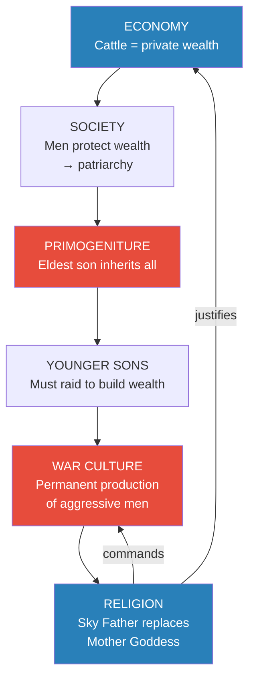
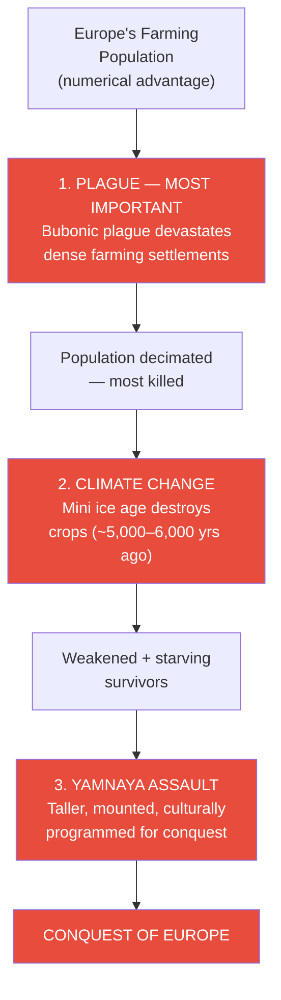
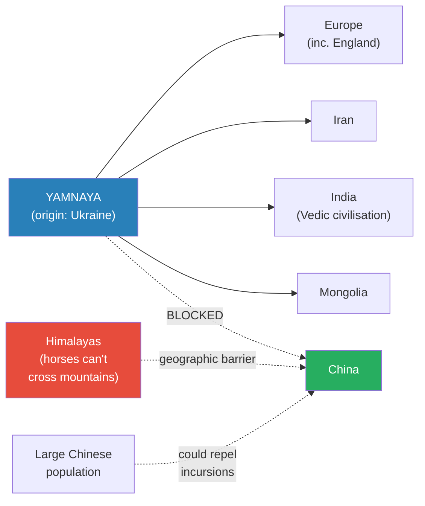

# The Yamnaya Conquest of Europe

> Prof. Jiang opens with three questions — who were the Yamnaya, where did they come from, how did they conquer Europe — and the answers overturn everything. The egalitarian, peaceful, artistic civilisation built by Old Europe's farmers is destroyed not by a superior army but by a triple catastrophe: plague, climate change, and a steppe culture that had spent thousands of years aligning its economy, society, and religion for conquest. The Yamnaya didn't choose to become conquerors — the harsh logic of the grassland made conquest their only rational behaviour. And the world they installed — patriarchy, private property, war, competitive religion — is the world we still live in.

---

## Overview: Key Highlights

- <b style="color: #2980b9">Social evolution</b> — open cooperative competition among many groups — is the greatest engine of human innovation, and it always ends the same way: a ruthless outsider adopts everything and conquers everyone
- <b style="color: #27ae60">The winner is not the most creative group but the most ruthless adopter</b> — the Yamnaya, Macedonians, and Akkadians all triumphed by synthesis, not invention
- <b style="color: #2980b9">Pastoral economy</b> — cattle on the steppe — gave the Yamnaya private property, the concept that changes everything
- <b style="color: #27ae60">Lactose tolerance gave steppe peoples a 20cm height advantage</b> over European farmers, producing a physically dominant warrior class
- <b style="color: #2980b9">Primogeniture</b> — eldest son inherits all — converts family succession into a permanent war engine, producing surplus aggressive young men every generation
- <b style="color: #e74c3c">The plague was the most important factor</b> in Europe's fall — it killed most of the farming population before the Yamnaya even arrived
- <b style="color: #e74c3c">Dense farming = plague incubator; dispersed nomadic = plague-resistant</b> — the same disease, asymmetric devastation
- <b style="color: #2980b9">Sky father religion</b> — source of Zeus and Jupiter — replaced the mother goddess, aligning the divine with cattle, wealth, and war
- <b style="color: #27ae60">Civilisational alignment</b> — when economy, society, and religion all point in the same direction, a culture becomes unstoppable
- <b style="color: #e74c3c">The Himalayas, not military resistance, stopped the Yamnaya</b> — China's isolation from this conquest is why East and West diverged
- <b style="color: #2980b9">Proto-Indo-European</b> — the common language from Europe to India — is the linguistic fingerprint of the Yamnaya conquest
- <b style="color: #e74c3c">"Before the Yamnaya, humans were egalitarian, peaceful and artistic. Now you have patriarchy, war, money."</b> — Prof. Jiang's summary of what was lost

| Concept | One-line summary |
|---------|-----------------|
| **Social evolution** | Open cooperative competition — produces extraordinary innovation, then a ruthless conqueror |
| **The ruthless adopter** | The winning group adopts ALL innovations to destroy others, not just some |
| **Pastoral economy** | Cattle herding on grassland — the foundational economic shift that creates private property |
| **Lactose tolerance** | Genetic mutation enabling milk consumption — created a 20cm physical advantage over farmers |
| **Private property** | The revolutionary idea that something belongs to you alone — source of every subsequent transformation |
| **Primogeniture** | Eldest son inherits everything — forces younger sons to raid, creating a structural war machine |
| **Sky father** | Male deity replacing the mother goddess — source of Zeus (Greek) and Jupiter (Roman) |
| **Civilisational alignment** | When economy, society, and religion all align for conquest, the culture becomes unstoppable |
| **Proto-Indo-European** | Common ancestral language shared from Europe to India — linguistic proof of the Yamnaya conquest |
| **Grazing rights** | The first territorial disputes — competition over who can pasture cattle on a given strip of steppe |
| **The three responses** | European farmers fought (died), cooperated (were absorbed), or fled to islands (Sardinia survived) |
| **The West** | Prof. Jiang's term for the Yamnaya-derived civilisational zone linking Europe, Iran, India, and Mongolia |

---

# The Lecture

## Old Europe Before the Conquest [0:00–1:30]

*Prof. Jiang opens by recapping Lectures 3 and 4 — before he can explain the Yamnaya conquest, students need to understand what was destroyed. Old Europe was not just a different society; it was a fundamentally different kind of society, built on principles that became almost unthinkable after the conquest.*

*Two paths from the same starting point — the Near East farmers — led to radically different societies. Understanding both is essential to understanding the collision.*

> [!note]- Expand: Full Lecture Detail
> Prof. Jiang opens with a deliberate recap. He tells the class: "Last class, we talked about Marija Gimbutas, who is an anthropologist, and she makes the argument that for the longest time, for most of its history, Europe was egalitarian, peaceful and artistic, but today we are a patriarchy. There's a lot of inequality, and we're always at war with each other. So what changed?"
>
> He frames three questions for the lecture:
> - Who are the Yamnaya?
> - Where do they come from?
> - How do they conquer Europe?
>
> Then he goes back to the starting point: 11,000 years ago in the Near East, humans develop agriculture. From his first lecture, the reason was religious — farming allowed communities to celebrate the mother goddess. The Near East (Turkey, Jordan, Syria, Israel) was where crops grew most easily after the Ice Age ended.
>
> Around 7,000-8,000 years ago, a cooling period forced migration. People in the Near East went in two directions:
>
> - **To Europe** — lucky, because the geography was similar. They brought their mother goddess religion and it flourished. Prof. Jiang lists the religion's core beliefs:
>   - A female supreme deity who gives life to all things
>   - Unity of all living beings — "we are the same as animals, as plants"
>   - A responsibility to protect nature
>   - The pursuit of harmony and balance
>   - The belief that every living thing has a soul that persists after death
>
> - **To the steppe** — the *caoyuan* (草原), a vast ocean of grassland from Europe to Mongolia. The problem: humans cannot eat grass, and you cannot grow crops on grassland easily. Everything had to be reinvented.
>
> > [!quote] Prof. Jiang
> > "The people in the Near East and the people of Europe were very similar. The problem starts when these people went off to what we call the steppe."
>
> Because of the mother goddess religion, Old Europe was:
> - <b style="color: #27ae60">Egalitarian</b> — no real difference between men and women; women often governed because their ability to give birth made them closer to the life-giving goddess
> - <b style="color: #27ae60">Peaceful</b> — no need to fight, resources felt sufficient
> - <b style="color: #27ae60">Artistic</b> — intellectual energies directed toward art celebrating the goddess

---

## The Engine of Innovation: Open Cooperative Competition [1:30–12:00]

*Prof. Jiang introduces the master analytical framework for the entire Civilization series — the process that produces humanity's greatest breakthroughs and, paradoxically, its most devastating conquerors. He will return to this pattern with the Greek city-states and the Sumerians later in the course.*

> [!tip] Core Insight
> Whenever there is open cooperative competition, tremendous innovation happens. And the group that triumphs is not the most innovative — it is the most ruthless at adopting ALL innovations for the sole purpose of destroying others.

*The Yamnaya are not unique — they are the first instance of a pattern Prof. Jiang will show recurring across three separate civilisations. Scarcity forces open competition; open competition produces innovation; innovation is harvested by the ruthless outsider.*

> [!note]- Expand: Full Lecture Detail
> Prof. Jiang defines <b style="color: #2980b9">social evolution</b> with precision. He wants this to be memorable, because it will reappear throughout the course. Three components:
>
> - **Open** — no central authority, no great power, no hegemon. Many different groups all competing independently. Crucially, no one can dictate which strategy is correct — the environment itself is the judge.
> - **Cooperative** — the competing groups are still communicating. They trade, they share ideas, they sometimes exchange wives. Competition does not mean isolation.
> - **Competitive** — everyone is trying different strategies to survive with scarce resources. Not enough to go around, so every group must innovate or die.
>
> He then states the two principles he wants students to remember for the rest of the course:
>
> 1. **"Whenever there's an open cooperative competition, tremendous innovation happens."**
> 2. **"The group that triumphs are the people who are most ruthless in adopting ALL innovations for the sole purpose of destroying others and becoming the sole hegemon."**
>
> He immediately illustrates with two parallels to make the pattern concrete:
>
> > [!example] The Macedonian Outsider (c. 500–330 BC)
> > - The Greek city-states — Athens, Sparta, Thebes — competed intensely for over a century
> > - This produced extraordinary innovation: democracy, philosophy, theatre, advanced military tactics
> > - None could conquer the others; the open competition persisted
> > - On the periphery, Macedon watched everything — the Greeks barely considered them civilised
> > - Philip II and Alexander adopted every Greek military innovation: the phalanx from Thebes, naval power, discipline
> > - Alexander then conquered the city-states, then Persia, then Egypt — the most "famous Greek" in history was actually Macedonian
> > **The lesson:** The outsider who watches everyone and adopts everything is more dangerous than any insider. Insiders are invested in their own approach; outsiders are free to take the best from each.
>
> > [!example] Sargon and the Sumerian City-States (c. 2500–2300 BC)
> > - The Sumerian city-states — Ur, Uruk, Lagash — competed for over a century
> > - They invented writing (cuneiform), mathematics, irrigation engineering, legal codes
> > - No single city could conquer the others; alliances shifted constantly
> > - The neighbouring Akkadians observed from the northern periphery
> > - Sargon the Great absorbed every Sumerian innovation and conquered them all
> > - He founded the Akkadian Empire — the world's first empire — and became the world's first empire builder
> > **The lesson:** The same pattern — open competition, ruthless synthesis, total conquest — played out here over 200 years earlier than with the Greeks, and thousands of miles from the steppe.
>
> Prof. Jiang asks the class which period of Chinese history most resembles this process. Students answer: the Spring and Autumn and Warring States periods. He confirms: this is exactly where most of China's intellectual breakthroughs came from — Confucius, Laozi, the foundations of Chinese philosophy — before Qin adopted everything and conquered the rest.

---

## Five Innovations That Built the Conquest Machine [12:00–24:00]

*On the steppe, survival forced a cascade of innovations — each one solving a problem but creating new pressures that demanded the next. No single breakthrough was enough; it was their combination that forged the most effective conquest culture in ancient history.*

*Five innovations cascaded into a war culture — each enabling the next, none sufficient alone. The dairy revolution branches off to create physical superiority while simultaneously feeding into the horse-domestication chain.*

> [!note]- Expand: Full Lecture Detail
> Prof. Jiang explains that the innovations the steppe peoples created "forever transformed human history." He walks through them in sequence.
>
> **Innovation 1: Pastoral Economy**
>
> The foundational insight: humans cannot eat grass, but cattle, sheep, and goats can. Steppe peoples took herd animals from the farmers they traded with and raised them on the unlimited grassland. They created a new relationship between humans, animals, and landscape — converting the steppe's one abundant resource (grass) into the protein humans needed.
>
> **Innovation 2: Dairy Revolution**
>
> - For most of human history, adults were <b style="color: #e74c3c">lactose intolerant</b> — could not digest milk
> - Steppe peoples developed the enzymes to drink milk — becoming lactose tolerant
> - A high-protein diet of meat and milk made steppe peoples on average <b style="color: #27ae60">20 centimetres taller</b> than European farmers
> - Farmers ate mostly wheat and vegetables — limited protein, shorter bodies
> - "20 centimetres is a lot, guys," Prof. Jiang emphasises
>
> > [!example] The Height Advantage (c. 4000–3000 BC)
> > - European farmers ate wheat, barley, and vegetables — limited protein
> > - Skeletal evidence shows steppe peoples averaged 20cm taller than contemporary European farmers
> > - Twenty centimetres is the difference between an average and a noticeably tall person — visible immediately
> > - Combined with a lifetime of horseback riding, herding, and physical labour in harsh conditions, steppe peoples were dramatically stronger
> > - A raiding party of these men — mounted, armed, and 20cm taller — riding into a farming village created overwhelming physical mismatch
> > **The lesson:** Diet is destiny. The pastoral economy didn't just feed people differently — it built a physically superior warrior class that no agricultural community could match in combat.
>
> **Innovation 3: Horse Domestication**
>
> - The steppe is vast — trade and communication required the ability to travel quickly
> - Horses are hardwired to flee from humans; they are among the most difficult animals to domesticate
> - This process took approximately <b style="color: #2980b9">3,000 years</b> of patient, persistent effort across generations
> - The payoff: mounted riders could cover distances impossible on foot, enabling the communication networks that kept open cooperative competition alive
> - A mounted warrior could strike faster, retreat more easily, and cover more ground than any foot soldier
>
> **Innovation 4: The Wheel and Wagon**
>
> - Horse + wheel = wagon
> - With wagons, entire families and possessions could move across the steppe, following herds to fresh pasture
> - Cattle eat all the grass in one area — then the whole community must move
> - Without wagons, families were stuck; with them, the steppe became an infinite resource
>
> **Innovation 5: Nomadic Pastoral Life**
>
> - Full mobility while herding creates new problems: whose grass is this?
> - <b style="color: #e74c3c">Grazing rights</b> — if your cattle eat another group's pasture, you are destroying their livelihood
> - Cattle raiding becomes rational: in a world where cattle are private wealth, the fastest path to prosperity is theft
> - This creates structural incentives for a permanent war culture — violence is not an aberration but the normal mode of interaction

---

## From Economy to Religion: The Great Transformation [20:00–29:00]

*Private property led to patriarchy, patriarchy to primogeniture, primogeniture to a war machine. Then religion adapted at every step to justify the new order. Prof. Jiang shows how three dimensions locked into a self-reinforcing loop that, once closed, could never be opened from within.*

> [!tip] Core Insight
> The Yamnaya won because their economy, society, and religion were all aligned. A group that adopted the pastoral economy but kept the mother goddess religion would lack the drive for conquest. Only the complete package — private property, patriarchy, primogeniture, sky father — produced the culture that overran a continent.

*Economy, society, and religion locked into a self-reinforcing loop — each justifying the others. Once closed, there was no internal mechanism to stop it.*

> [!note]- Expand: Full Lecture Detail
> Prof. Jiang walks through the transformation step by step, explaining that each change was driven by the logic of the previous one — not by ideology or choice.
>
> **The Economic Shift: Private Property**
>
> In Old Europe, there was no concept of private property — everything belonged to the community and the mother goddess. On the steppe, cattle changed everything:
>
> - Cattle are private wealth — you raised them, you fed them, they belong to you
> - Prof. Jiang states the revolutionary nature of this idea: <b style="color: #e74c3c">"this belongs to you and only you, not to society or to the mother goddess"</b>
> - This single concept — that an individual could own something separate from the community — drove every subsequent transformation
>
> **The Social Shift: Patriarchy and Primogeniture**
>
> - Constant violence over grazing rights and cattle raiding elevated men — the fighters and protectors — to dominance
> - Old Europe was governed primarily by women (life-giving = closest to the goddess)
> - Steppe society became a <b style="color: #e74c3c">patriarchy</b> — in a world of constant violent competition, fighting ability determines who governs
>
> Prof. Jiang then illustrates the inheritance problem with vivid arithmetic:
>
> > [!example] The Primogeniture Engine (c. 4000–3000 BC)
> > - A patriarch accumulates 100 cattle — enormous wealth in the pastoral economy
> > - He has 10 sons
> > - If wealth is divided equally: each son gets 10 cattle
> > - Those 10 sons each have 10 sons: 100 grandsons share 100 cattle — one each
> > - Within two generations, a wealthy family has been reduced to poverty
> > - The mathematics are merciless: equal division + population growth = guaranteed impoverishment
> > - Solution: <b style="color: #2980b9">primogeniture</b> — eldest son inherits everything, preserving family wealth intact
> > - Consequence: nine younger sons have nothing — no cattle, no wealth, no wives (in a patriarchal society, wealth buys a wife)
> > - Their only option: go out and steal cattle from other people
> > - This process repeats every generation — each prosperous family produces eight or nine surplus aggressive young men
> > **The lesson:** Primogeniture was not just an inheritance rule — it was a war engine that converted family succession into permanent territorial expansion, producing a never-ending supply of warriors with nothing to lose.
>
> **The Religious Shift: Sky Father Replaces Mother Goddess**
>
> The religion transformed to match the new economy and society. Prof. Jiang identifies three specific changes:
>
> - **Change 1:** Supreme deity shifts from female to male — the <b style="color: #2980b9">sky father</b> replaces the mother goddess. "Who's now God? A man, right? Because men fight wars."
> - **Change 2:** The divine gift shifts from life and nature to cattle, money, and wealth. The sky father gives material prosperity, not harmony.
> - **Change 3:** The divine commandment shifts from "love everything and protect nature" to "fight each other for the right to have wealth."
>
> Prof. Jiang names the sky father's descendants:
> - <b style="color: #2980b9">Zeus</b> — king of the Greek gods, the thunder/sky father
> - <b style="color: #2980b9">Jupiter</b> — the Roman equivalent, linguistically the same name
>
> | | Mother Goddess (Old Europe) | Sky Father (Yamnaya) |
> |---|---|---|
> | **Supreme deity** | Female — giver of life | Male — giver of wealth |
> | **What god provides** | Nature, harmony, unity | Cattle, money, property |
> | **What god commands** | Love everything, protect nature | Fight each other for wealth |
> | **Social order** | Egalitarian, women-led | Patriarchal, warrior-led |
> | **Attitude to violence** | Forbidden | Celebrated — war is sacred duty |
> | **Descendants** | Indigenous religions worldwide | Zeus (Greek), Jupiter (Roman) |
>
> He summarises the alignment: "Their religion becomes aligned with the society, which becomes aligned with the economy. This is a people obsessed with collecting wealth and fighting wars and expanding into new territories."

---

## How the Yamnaya Conquered Europe: The Triple Catastrophe [25:00–36:00]

*Europe had more people — but plague, climate change, and military superiority shattered its ability to resist. Prof. Jiang ranks the three factors in order of importance and uses the conquest of the Americas as the clearest parallel.*

*Three forces converged in sequence. The order matters: without the plague, Europe might have had enough people to resist; without climate change, survivors might have rebuilt. The Yamnaya military assault was devastating but delivered the final blow to a civilisation already on its knees.*

> [!note]- Expand: Full Lecture Detail
> Prof. Jiang poses the puzzle directly: the Yamnaya are stronger and more militaristic, yes — but Europe has a <b style="color: #27ae60">larger population</b>. Farming communities could number tens of thousands. Nomadic steppe bands were vastly outnumbered. In theory, sheer numbers should have held the line. So what happened?
>
> "Two things happen to reduce the population of Europe significantly," Prof. Jiang says. He adds a third. He is explicit about ranking them.
>
> **Factor 1: The Plague (Most Important)**
>
> - The <b style="color: #e74c3c">bubonic plague</b> — confirmed by DNA evidence from ancient burial sites — spread everywhere: Europe, the Near East, and the steppe
> - But it devastated farming communities while barely touching steppe peoples
> - Prof. Jiang explains the asymmetry with three reasons:
>   - **Density:** Farmers lived 10,000 to a settlement, alongside pigs, rats, and accumulated waste — ideal disease transmission. Steppe peoples lived far apart in small mobile bands — the disease could not sustain an epidemic chain
>   - **Hygiene:** Farm life meant permanent cohabitation with animals and filth. Nomadic life was cleaner — constant movement to fresh ground, no permanent refuse accumulation
>   - **Physical health:** Steppe peoples were stronger from protein-rich diets and physical exercise; their immune systems were better supported
>
> A student asks about the plague. Prof. Jiang confirms: "It killed most Europeans, yes, because Europeans were living on farms, right? So they were living together."
>
> > [!example] The Plague Parallel — Europe and the Americas
> > - When Europeans colonised North and South America from the late 1400s, they brought diseases the indigenous population had never encountered
> > - Smallpox, measles, influenza killed an estimated 50–90% of indigenous peoples — most great civilisations (Aztec, Inca, Maya) fell to disease, not to armies
> > - The exact same pattern had played out 4,500 years earlier on the Eurasian landmass
> > - Dense European farming settlements became plague incubators; mobile steppe communities were barely touched
> > - In both cases, the conquerors walked into a landscape already emptied by epidemic, facing scattered survivors rather than organised resistance
> > **The lesson:** The most devastating weapon in human history has never been a sword, a horse, or a gun — it has been disease transmitted between populations with different immunities.
>
> **Factor 2: Climate Change**
>
> - About 5,000–6,000 years ago, a <b style="color: #e74c3c">mini ice age</b> struck Europe
> - For farmers, catastrophic — crops failed, the agricultural economy collapsed
> - Steppe pastoral economy was more resilient — cattle can forage on dried grass, survive cold better than wheat crops survive frost
> - Climate change also pushed the Yamnaya westward, searching for new grazing land that their cold-damaged pastures could no longer provide
> - Dual effect: weakened European resistance AND drove the Yamnaya toward Europe simultaneously
>
> **Factor 3: The Conquest**
>
> Prof. Jiang describes the mechanism with stark clarity:
>
> - Young Yamnaya men — the younger sons left with nothing by primogeniture — rode into European farming villages
> - <b style="color: #e74c3c">"They killed the men and married the women."</b>
> - Some groups tried taking the women while letting men survive — but the men came back with their neighbours and killed everyone
> - This taught the Yamnaya that leaving enemy men alive was strategically foolish — an early and brutal lesson in total warfare
>
> The conquest was carried out not by one nation but by one <b style="color: #2980b9">culture</b> — many different Yamnaya groups sharing the same economy, society, and religion. There was no Yamnaya king or capital. There was only a Yamnaya way of life, and every group that adopted it fully became part of the conquest.
>
> **The DNA Evidence**
>
> Prof. Jiang mentions that DNA evidence is "pretty stark":
> - Nearly all modern Europeans carry significant Yamnaya ancestry in their Y-chromosomes (male line)
> - Female lineages show more continuity with pre-Yamnaya populations
> - This is exactly the genetic signature of a conquest where men were killed and women were taken
> - Europeans (except for island refuges like Sardinia), Indians, and Iranians are all descendants of the Yamnaya
>
> A student asks: "So are the Greeks the descendants?" Prof. Jiang: "Exactly, yes. Basically everyone in Europe, except for a few people, are descendants of the Yamnaya."

---

## The Reach of the Conquest — and Its One Limit [32:00–38:00]

*The Yamnaya culture spread from Ireland to India, creating a single civilisational zone. Only the Himalayas stopped them reaching China — and that geographic accident shaped the next five thousand years of world history.*

*The Yamnaya culture spread in every direction from Ukraine — west to the Atlantic, south to Iran, east to Mongolia, southeast to India. Only China remained outside this zone, protected by geography and demography.*

> [!note]- Expand: Full Lecture Detail
> Prof. Jiang traces the spread of the Yamnaya culture in all directions:
>
> - **Europe** — conquered completely, including England (which required the Yamnaya to first conquer coastal peoples with shipbuilding technology, learn it, then sail across)
> - **Iran** — Yamnaya descendants established the culture that would produce Zoroastrianism
> - **India** — became the Vedic civilisation that produced Hinduism and the caste system
> - **Mongolia** — the pastoral nomadic tradition persisted for thousands of years, eventually producing Genghis Khan
>
> A student asks about the Mongols. Prof. Jiang confirms: "The Mongolian people are descended from the Yamnaya, yes. The Mongolians are also nomadic pastoral people who are also very much warlike. In fact, what we will learn later on is that Genghis Khan adopted very similar policies as the Yamnaya."
>
> **Why China Was Different**
>
> Prof. Jiang asks why the Yamnaya could not conquer China. Students answer: the Himalayas. He confirms:
>
> - Horses cannot cross the Himalayas — the Yamnaya's primary military technology was useless against that barrier
> - China also had a huge population — "even if the Yamnaya came, the population could have repulsed the attack"
> - China was not conquered by the Yamnaya
> - <b style="color: #27ae60">This isolation is why China, for most of its history, developed separately from the rest of the world</b>
>
> This geographic accident would prove one of the most consequential in human history — East and West developed in parallel but along fundamentally different civilisational paths. The East-West divide is not modern politics; it is a five-thousand-year-old consequence of a mountain range.
>
> **Proto-Indo-European and the Birth of "the West"**
>
> From this conquest emerged a common language: <b style="color: #2980b9">Proto-Indo-European</b> — spoken from Europe to India. A common religion (the sky father) and constant trade linked this zone into what Prof. Jiang calls "the West" — distinct from China, which was isolated.
>
> "This world, okay, stretching from Europe all the way to India, was in constant communication with each other, trading ideas, people and gods — and this is what we call today the West."
>
> **Adaptation Along the Way**
>
> Prof. Jiang notes that the conquest was not a simple replacement — it was a slow cultural absorption. Key examples:
> - In Norway, early Yamnaya settlers burned down entire forests trying to recreate steppe grassland. Eventually they abandoned this and adopted local agricultural practices, blending Yamnaya culture with local methods.
> - Coastal conquests required a different kind of absorption — the Yamnaya had no shipbuilding technology. They conquered coastal peoples, learned their shipbuilding techniques, then sailed to England.
> - The pattern repeated: conquer a people, absorb their technology, use it to conquer further.
>
> Three European responses to the Yamnaya:
> - **Fight** — they were destroyed
> - **Cooperate** — they were eventually absorbed into the Yamnaya cultural system
> - **Flee to islands** — <b style="color: #27ae60">Sardinia</b> is the best-documented example; its population carries measurably less Yamnaya DNA than mainland Europeans

---

## A New History for Humanity [38:00–40:25]

*Prof. Jiang closes with a statement that reframes the entire lecture — not as ancient history but as the origin of the modern world. Before the Yamnaya, humans were egalitarian, peaceful, and artistic. After the Yamnaya, patriarchy, war, and money.*

> [!note]- Expand: Full Lecture Detail
> Prof. Jiang closes the pre-break portion of the lecture with a direct statement of what the conquest means:
>
> > [!quote] Prof. Jiang
> > "Before the Yamnaya, humans were egalitarian, peaceful and artistic. And now with the Yamnaya, you have patriarchy, you have war, you have money. But before we didn't have these concepts."
>
> He emphasises the phrase "we didn't have these concepts" — it is not just that practices changed, but that the very ideas of patriarchy, organised warfare, and monetary wealth did not exist in human civilisation before this moment.
>
> The Yamnaya conquest was not a gradual transition. It was a civilisational replacement. Every foundational structure was reversed:
>
> | Dimension | Before (Old Europe) | After (Yamnaya) |
> |-----------|-------------------|-----------------|
> | **Economy** | Communal property, shared resources | Private property, individual wealth |
> | **Social structure** | Egalitarian, women-led | Patriarchal, warrior-led |
> | **Inheritance** | Communal (no concept of inheritance) | Primogeniture (eldest takes all) |
> | **Religion** | Mother goddess, life-giving | Sky father, wealth-giving |
> | **Attitude to violence** | No weapons, no warfare | War culture, raiding normalised |
> | **Attitude to nature** | Sacred, must be protected | Resource, to be exploited |
> | **Young men's role** | Art, farming, community service | Raiding, conquest, wealth accumulation |
>
> Prof. Jiang tells the class: "When we come back from the break, we will discuss the new world that this creates. Because when you think of Western civilization, the Greeks, the Romans — well, they all come from this world. Basically, what the Yamnaya do is they create a new history for humanity."

---

## Connections

**Builds on:** [[02 - Religion and the Dawn of Society]] (mother goddess religion and ancestor worship that Old Europe practised), [[03 - Old Europe and the Mother Goddess]] (Marija Gimbutas's argument — the peaceful, egalitarian civilisation the Yamnaya destroyed), [[04 - The World Before the Yamnaya]] (the specific civilisational features of Old Europe)

**Sets up:** [[06 - The Greek City-States and the Birth of Western Civilization]] (the first civilisation built on the Yamnaya cultural inheritance), [[07 - Sumer and the First Empire]] (Sargon and the Akkadians — the same open-competition-then-conquest pattern)

**Related books in vault:** [[Sapiens - Yuval Noah Harari]] (the agricultural revolution and the "wheat domesticated us" argument), [[The Dawn of Everything - David Graeber]] (challenges the inevitability of hierarchy after the agricultural transition), [[The Power of the Powerless - Václav Havel]] (on how civilisational systems reproduce themselves without anyone choosing them — resonates with Prof. Jiang's account of how the Yamnaya war culture was structurally compelled)

---

## The Takeaway

This lecture is the pivot of the Origins arc. Four lectures established Old Europe as egalitarian, peaceful, and artistic — governed by women under the mother goddess. Lecture 5 destroys it. What Prof. Jiang demonstrates is that the destruction was not inevitable in any simple sense — it was the product of a very specific chain: a geography that made farming impossible forced innovation that eventually aligned an entire culture — economically, socially, religiously — for conquest. The Yamnaya did not decide to conquer Europe. The logic of the steppe decided for them, generation by generation.

The most counterintuitive insight in the lecture is the plague's primacy. Students arrive expecting military conquest to be the story — horses, warriors, violence. Prof. Jiang flips this: the Yamnaya military assault was the final blow, not the decisive one. Disease killed most of Europe's population before the warriors arrived. This is the pattern that will repeat with the conquest of the Americas thousands of years later — military force is the mopping-up operation after biology has done the real work. Understanding this asymmetry (dense farming = plague incubator, dispersed nomadic = plague-resistant) completely reframes what "military conquest" means in pre-modern history.

The question that Prof. Jiang leaves implicit but that hangs over the lecture: is the world the Yamnaya created — patriarchy, private property, war, competitive religion — the only possible outcome of the agricultural revolution? Or was it a contingent accident, dependent on a specific geography, a specific plague, a specific sequence of innovations? He does not answer this directly. But the pattern he establishes — open competition produces innovation; innovation is harvested by the ruthless outsider; the outsider's culture then becomes the default — will appear again with the Greeks, the Sumerians, and much later with European colonialism. The question of whether the cycle can be broken, or whether it is simply a law of civilisational history, is the thread that will run through the rest of the course.
