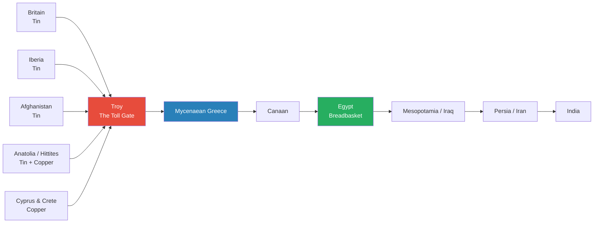
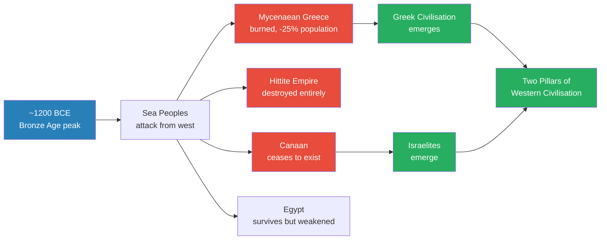
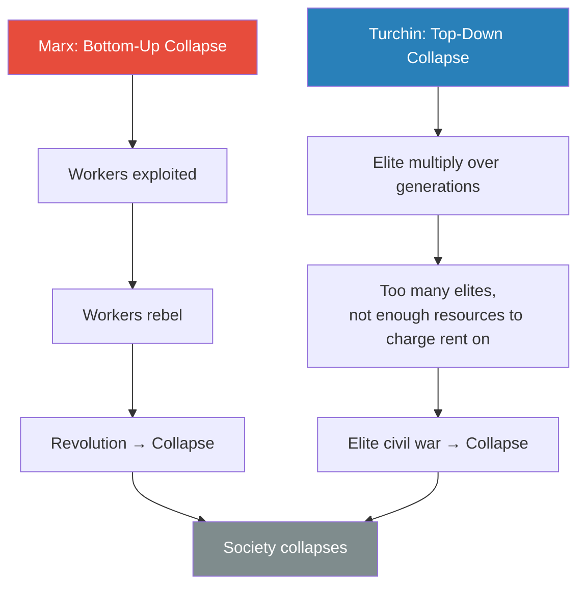
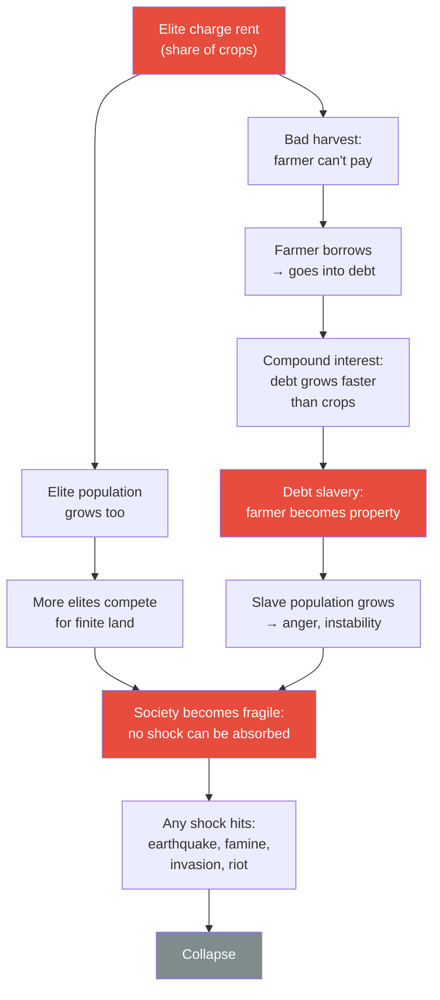
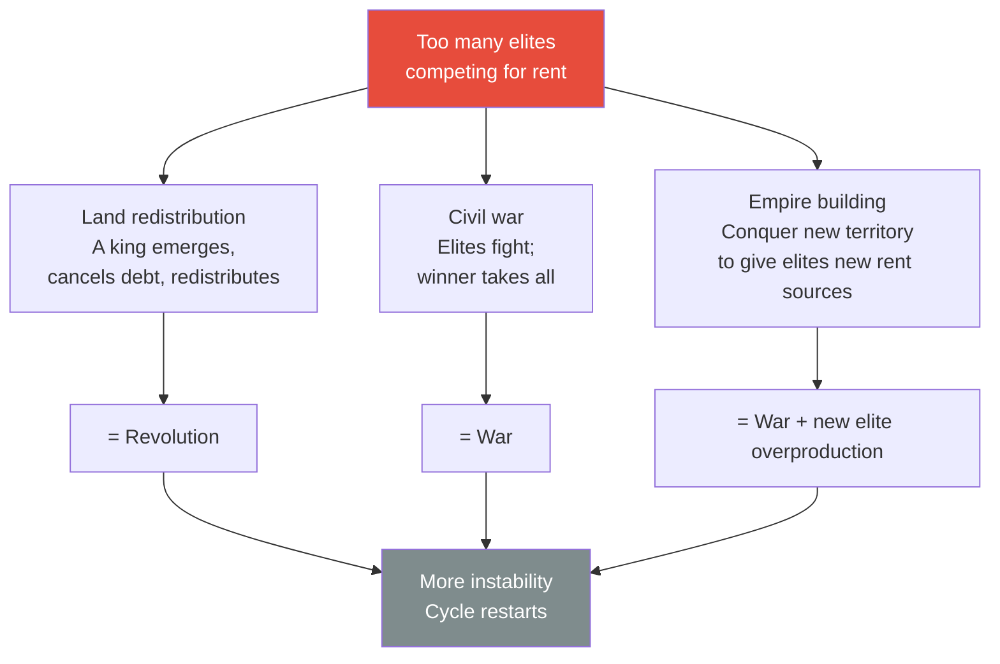
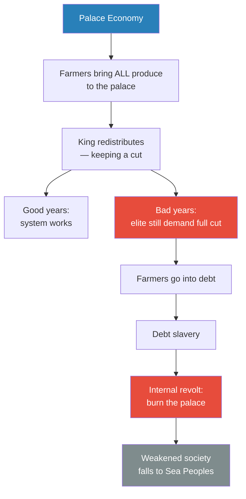
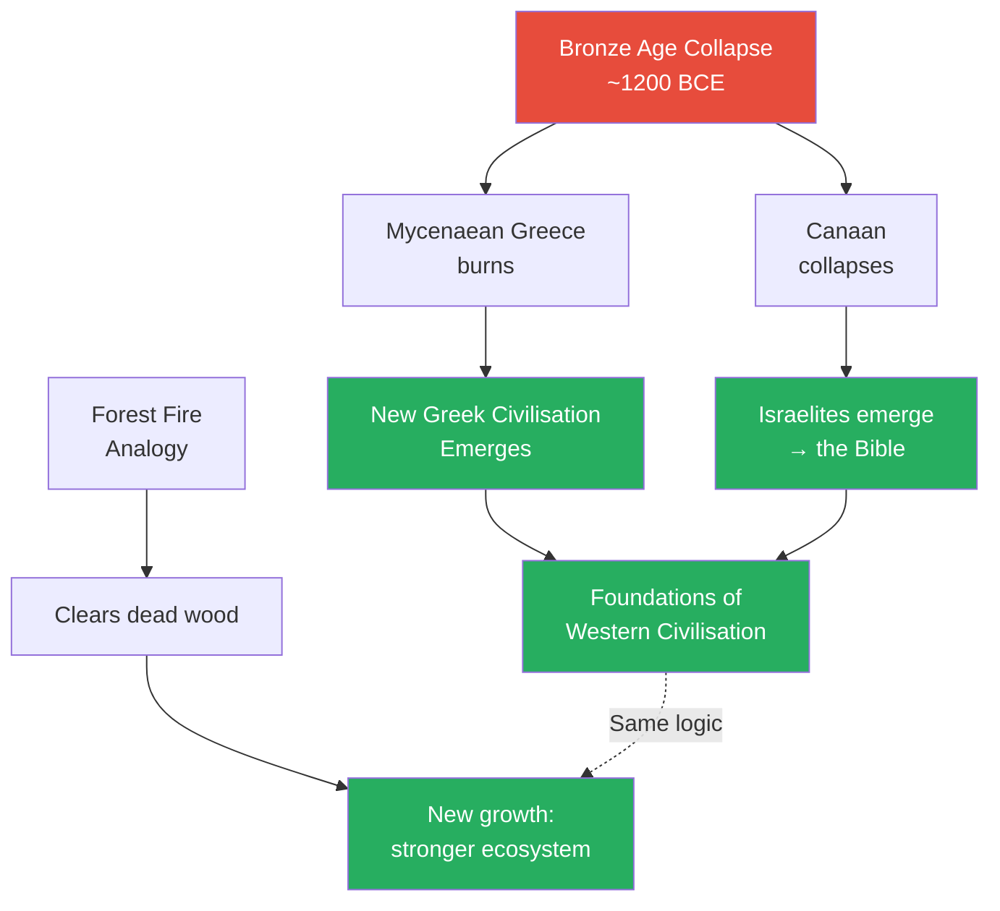
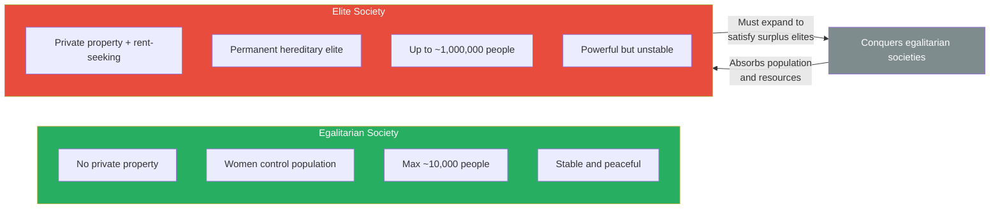

# Elite Overproduction and the Bronze Age Collapse

> In 1200 BCE the Bronze Age world was a globalised trading network stretching from Britain to India — wealthy, interconnected, and seemingly invincible. A few decades later it was gone. Mycenaean Greece burned, the Hittite Empire vanished, and Egypt never recovered its power. Scholars call this a "perfect storm" of earthquakes, climate change, and revolt. Prof. Jiang disagrees. Drawing on Peter Turchin's theory of elite overproduction, he argues the collapse was not a freak accident but an inevitable consequence of too many rich people competing for too little power. Every complex society carries the seeds of its own destruction — and that destruction, like a forest fire, is what makes renewal possible.

---

## Overview: Key Highlights

- <b style="color: #2980b9">Bronze Age globalisation</b> — the world of 1200 BCE was a trading network stretching from Britain to India, with bronze as its oil
- <b style="color: #e74c3c">Troy: the toll gate of the universe</b> — whoever controlled the Bosphorus chokepoint collected rent from the entire world
- <b style="color: #e74c3c">The "perfect storm" theory is wrong</b> — earthquakes and climate change were triggers, not causes; the real cause was structural fragility
- <b style="color: #27ae60">Elite overproduction</b> — Peter Turchin's insight: societies collapse not because the poor rebel, but because too many elites fight over too few resources
- <b style="color: #e74c3c">Rent-seeking behaviour</b> — the mechanism that turns elite advantage into societal fragility; the university degree is the modern equivalent of feudal land rent
- <b style="color: #27ae60">The social contract</b> — elites may charge rent only while they give back through public works and feasts; when they stop giving back, the system collapses
- <b style="color: #e74c3c">Debt slavery</b> — the natural endpoint of rent-seeking: compound interest makes debts unpayable, debtors become property
- <b style="color: #2980b9">Palace economy</b> — the Mycenaean system where all wealth flows to the palace for redistribution; the palace is the landlord of the whole society
- <b style="color: #27ae60">Three remedies, all unstable</b> — land redistribution, civil war, or empire building all generate more instability; the cycle has no permanent exit
- <b style="color: #2980b9">Piketty's modern proof</b> — capital grows at 5%, real economy at 2%; rational investors choose rent-seeking over building; the society hollows out
- <b style="color: #27ae60">Collapse creates civilisation</b> — from the ashes of Mycenaean Greece came Greek philosophy; from the collapse of Canaan came the Israelites and the Bible
- <b style="color: #e74c3c">Egalitarian societies are doomed once elite societies exist</b> — they are more stable but too small and unorganised to survive conquest

| Concept | One-line summary |
|---------|-----------------|
| **Bronze Age globalisation** | An interconnected trading world from Britain to India built on bronze as the universal commodity |
| **Troy as toll gate** | The Bosphorus chokepoint made Troy fabulously wealthy — and a permanent target for pirates |
| **Sea Peoples** | Mixed waves of pirates and refugees who destroyed Mycenaean Greece and the Hittites around 1200 BCE |
| **Perfect storm theory** | Scholarly consensus: multiple simultaneous crises caused collapse — Prof. Jiang rejects this |
| **Elite overproduction** | Turchin's theory: societies collapse because too many elites compete for finite rent-bearing resources |
| **Rent-seeking behaviour** | Extracting value through ownership (land, degrees, capital) rather than productive work |
| **Permanent hereditary elite** | A ruling class that passes wealth and status to children — new to human history around this era |
| **Social contract** | The agreement that elites may charge rent if they give back through public works and community feasts |
| **Debt slavery** | When compound interest makes debts unpayable, debtors and their children become property |
| **Palace economy** | Mycenaean system where all produce flows to the palace for redistribution, with a cut for the king |
| **Capital in the 21st Century** | Piketty's finding that financial capital grows faster than the real economy — elite overproduction in modern dress |

---

# The Lecture

## The Bronze Age World — A Globalised Economy Built on Bronze [0:00–9:00]

*Prof. Jiang opens by painting the world of 1200 BCE — a sophisticated, interconnected trading network that would not look out of place alongside modern globalisation. He traces the bronze supply chain from Britain to India and introduces Troy as the most strategically valuable piece of real estate on Earth.*

> [!tip] Core Insight
> The Bronze Age world was not primitive or isolated. It was a sophisticated globalised economy where making a single tool required raw materials from multiple continents. This interconnection created enormous wealth — and enormous fragility.

*The Bronze Age trading network stretched from Britain to India, with Troy controlling the critical chokepoint where East meets West. Every economic actor passed through Troy — which is why it was worth fighting over for centuries.*

> [!note]- Expand: Full Lecture Detail
> Prof. Jiang opens by asking the class to picture the world in 1200 BCE. He traces the map: Mycenaean Greece on one side of the Aegean, Anatolia (modern Turkey) on the other, where the Hittite Empire rules. South of Anatolia is Canaan — "important when we do the Bible, because that is the birthplace of the Israelites" — today's Lebanon, Syria, and Israel, then a province of the Egyptian empire. Further east is Mesopotamia (modern Iraq), then Persia (Iran), then Afghanistan, then India. Over in the west are the islands of Cyprus and Crete, then Iberia, then Britain.
>
> The critical point is not the geography but what it implies. This world is interconnected. It trades and communicates across enormous distances. And the commodity holding it together is bronze.
>
> - <b style="color: #2980b9">Bronze</b> is the oil of the ancient world — the basis of the entire economy
> - Bronze is an alloy of copper and tin, both of which must be mined, and only a few places on Earth have them
>   - Tin: Britain, Iberia, Anatolia, Afghanistan
>   - Copper: Cyprus, Crete, Anatolia
> - To make bronze, you must trade with the entire world — no single region can do it alone
> - This creates genuine global economic interdependence, from India to Britain, with China also partially integrated
>
> There are four ways to profit in this world:
> - **Mining** — extracting tin and copper from the earth
> - **Manufacturing** — smelting bronze and turning it into weapons, tools, and pottery
> - **Trading** — moving goods between regions; the most profitable position is the geographic centre
> - **Piracy** — stealing wealth by force from traders and cities
>
> Prof. Jiang asks the class: looking at this map, who profits most from trading? Who sits at the centre?
>
> The answer is the region controlling the chokepoint between East and West — the strait connecting the Aegean to the Black Sea. This place is called <b style="color: #2980b9">Troy</b>. "It's the toll gate of the world," he says. To get anywhere, you have to pass through Troy. Troy can collect tolls from everyone. For centuries, wars have been fought over this place.
>
> "When we do the Iliad next class, what you will discover is the Greeks who attacked Troy — they were basically pirates." Troy had grown fabulously wealthy from controlling the chokepoint. Pirates went to steal it.
>
> > [!example] Troy as the World's Toll Gate
> > - Troy sits at the strategic chokepoint between the Aegean and Black Sea — the only route connecting East and West
> > - Every merchant ship passing between Greece and the Black Sea must pass through Troy's waters
> > - Troy charges tolls and extracts a cut from all goods moving through
> > - This makes Troy the logistics hub of the known world — fabulously wealthy and constantly targeted
> > - For centuries, different powers have fought to control this single chokepoint
> > - The Greeks who attacked Troy in the Iliad were essentially pirates raiding the world's richest toll booth
> > **The lesson:** Control a chokepoint — a strait, a port, a mountain pass — and you extract rent from the entire economy that flows through it. This is rent-seeking on a geopolitical scale.

---

## The Collapse — What We Know and What Scholars Got Wrong [9:00–15:30]

*Within a few decades of 1200 BCE, the interconnected Bronze Age world disappeared. Prof. Jiang surveys what we know from the archaeological record and Egyptian written sources, then surveys three scholarly theories — before rejecting the dominant consensus.*

*The Bronze Age collapse destroyed the old order but cleared the ground for Greek civilisation and the Israelites — the two pillars of the Western tradition. Destruction was not the end of the story.*

> [!note]- Expand: Full Lecture Detail
> The scale of the collapse was catastrophic and rapid:
> - <b style="color: #e74c3c">Mycenaean Greece</b> — completely burned down, lost roughly a quarter of its population
> - <b style="color: #e74c3c">The Hittite Empire</b> — destroyed entirely; ceased to exist
> - <b style="color: #e74c3c">Canaan</b> — disappeared as a political entity
> - <b style="color: #e74c3c">Egypt</b> — survived the attacks but ceased to be a hegemon; "a few decades later, they were conquered by outside powers"
>
> The agents of destruction were the <b style="color: #2980b9">Sea Peoples</b>. Egypt has written records of battling them over the course of several decades — waves of different peoples attacking from the sea. Prof. Jiang is clear about what we actually know: "This was not one people. This was a series of different peoples attacking Egypt from the sea."
>
> The Sea Peoples were a combination of pirates and refugees. They attacked Egypt because Egypt was "the breadbasket of the world" — that's where the food was. These were hungry, desperate people joining with pirates on ships and heading for the richest target available.
>
> They destroyed Mycenaean Greece and the Hittites. They failed to destroy Egypt — they were stopped. But the question remains: what was driving this westward-to-eastward population movement in the first place?
>
> Prof. Jiang presents the three scholarly theories and evaluates each:
>
> > [!abstract] Three Scholarly Theories of the Collapse
> > | Theory | Evidence | Verdict |
> > |--------|----------|---------|
> > | **Northern invasion** drove populations southward into Mycenaean Greece, cascading east | None found | ❌ No archaeological evidence |
> > | **Volcanic eruption** caused climate disruption, failing harvests, population movement | Some | ❌ Insufficient on its own |
> > | **Perfect storm** — earthquakes + climate change + internal revolt, simultaneously | Archaeological evidence for all three | ❌ Describes symptoms, not root cause |
>
> The dominant scholarly consensus is the "perfect storm" or systems collapse theory: multiple simultaneous crises overwhelmed these societies. Prof. Jiang is direct: "I happen to disagree with this theory of the perfect storm, even though it is the scholarly consensus."
>
> His objection is not that earthquakes, cooling climate, and revolt didn't happen — the evidence shows they did. His objection is deeper: a healthy, resilient society can absorb such shocks. The real question is why these societies were so fragile that any shock could destroy them. The perfect storm theory identifies the triggers. It does not explain the underlying fragility. That is what elite overproduction explains.

---

## Peter Turchin and the Theory of Elite Overproduction [15:30–30:00]

*Prof. Jiang introduces the framework he considers the most powerful tool for understanding civilisational collapse — and which will return throughout the entire Civilization series. He contrasts it with Marx's bottom-up theory and explains how a permanent hereditary elite creates the conditions for its own destruction.*

*Marx and Turchin agree that societies collapse — they disagree about the direction. Marx blames the bottom; Turchin blames the top. The historical data, says Prof. Jiang, supports Turchin.*

> [!note]- Expand: Full Lecture Detail
> Before presenting Turchin, Prof. Jiang notes that the Bronze Age collapse is not unique. The Mayans followed the same pattern: their civilisation exploded from 200 AD, peaked around 900 AD, then collapsed within about 30 years, nearly disappearing by 1200 AD. Same arc, different continent. The question is whether a general law explains both.
>
> Enter <b style="color: #2980b9">Peter Turchin</b> — a Russian-American historian who developed the theory of elite overproduction by looking at historical data across many civilisations.
>
> The traditional view of why societies collapse comes from Karl Marx:
> - Societies collapse **bottom-up** — workers are exploited until they revolt
> - "If you treat workers badly, they will stop working. If you force them to work, they will go on strike. If you force them again, they will rebel. A worker revolution."
>
> Turchin looked at the evidence and said: the problem is not at the bottom. When societies collapse, it is because of infighting among the elite — **civil war from the top**. "The problem of society isn't that there are too many poor people. The problem is there are too many rich people."
>
> ### The Three Benefits of a Permanent Hereditary Elite
>
> Around 1200 BCE, a new kind of ruling class emerged: <b style="color: #2980b9">permanent and hereditary</b>. Previously, elites could be replaced and couldn't pass their status to children — everyone had to earn their position. The new elite held power across generations.
>
> This innovation brought three genuine advantages:
> - **Organisation** — the elite function as the brain of society; they coordinate resources for war, irrigation, and public works (the pyramids, the Great Wall)
> - **Wealth** — better organisation and inequality drive competitive effort, producing more total wealth
> - **Scale** — population can grow from the ~10,000 ceiling of egalitarian societies to roughly 1,000,000 or more
>
> These are real benefits. They explain why elite societies outcompeted egalitarian ones everywhere they met. But they come with a structural flaw: <b style="color: #e74c3c">rent-seeking behaviour</b>.
>
> ### Rent-Seeking — The Mechanism of Collapse
>
> Prof. Jiang explains rent-seeking through a series of analogies, each building on the last:
>
> - A **landlord** doesn't produce anything — they own land and charge others to farm it, taking a share of the crops
> - The elite make their money primarily through ownership that can be rented, not through productive work
>
> Then he turns it on the class directly:
>
> > [!example] The University Degree as Modern Rent
> > - Students go to university not to learn but to get the degree — "your ticket to success in society"
> > - The degree is rent: you pay for access to social mobility, not for knowledge itself
> > - "Should I have to actually teach you anything? You have to come to class anyway."
> > - Universities don't need to teach well because students are trapped — they need the credential regardless
> > - High school operates the same way: you pay tuition (rent) to access university, then pay more rent to access the credential
> > - "All you're doing is paying rent" — at every stage, from secondary school to the job market
> > **The lesson:** Rent-seeking is not ancient history. It structures modern education, real estate, and finance. The degree-credential system is the Bronze Age palace economy in a different building.
>
> The social contract holds the system together — but only temporarily:
> - The <b style="color: #27ae60">social contract</b> says: yes, we elites charge you rent, but we give back through public feasts, temples, irrigation, and public works
> - Cities competed for people (people = labour = wealth), so elites who didn't honour the contract lost population to rival cities
> - This kept the system stable — while the contract held

---

## From Rent to Debt Slavery — The Collapse Mechanism [24:00–35:00]

*Prof. Jiang traces the precise sequence by which rent-seeking leads to debt, compound interest, slavery, and eventual systemic fragility. He then introduces Piketty's modern data as confirmation that the same dynamic is operating today.*

*The rent-seeking cycle pressures society from both above (elite competition) and below (debt slavery), progressively stripping the system of resilience until any external shock — even a minor one — can bring it down.*

> [!note]- Expand: Full Lecture Detail
> Prof. Jiang walks through the failure sequence step by step.
>
> A landlord charges a farmer rent — say, 10% of the harvest. This is fine in good years. But suppose there is a bad harvest. The farmer has no crops to pay with. What happens?
>
> A student says: borrow. Exactly. The farmer goes into debt, promising to pay double next year. But the next year is also bad. And the year after that. Five bad years in a row. The debt accumulates with compound interest — it grows faster than any crop could repay it. The farmer is trapped.
>
> "If you can't pay me back, what happens?" A student says: your children. <b style="color: #e74c3c">Debt slavery</b> — the farmer's children are pledged to work for the landlord without pay. This is the natural endpoint of rent-seeking behaviour when things go wrong. "Over time, you're always going to have a percentage of your population who go into debt slavery, and this creates a lot of instability — obviously they'll either want to run away or they want to rebel."
>
> Simultaneously, the other pressure builds from the top:
> - The elite population grows over generations (inheritance means more heirs)
> - But the amount of land — the source of rent — stays finite
> - More elites competing for the same land means fiercer competition for power
> - "There's only so much land, so now people are competing for the power to charge rent"
>
> These two pressures squeeze society from opposite ends. The bottom fills with enslaved debtors who want to revolt. The top fills with competing elites who want to fight each other. The system loses <b style="color: #e74c3c">resilience</b> — its capacity to absorb shocks.
>
> "Think of a pillar that's about to collapse. It will not collapse on its own — something must hit it. But this one thing could be anything: the people riot, the weather turns bad, there's an earthquake, there's an invasion." The pillar was already weakened. The shock just reveals the weakness.
>
> ### Piketty's Modern Proof
>
> To show this is not ancient history, Prof. Jiang invokes Thomas Piketty's *Capital in the 21st Century*:
>
> > [!example] Piketty's 100-Year Proof
> > - Piketty examined 100 years of economic data across multiple countries
> > - Finding: financial capital (stocks, real estate, bonds) grows at roughly 5% per year
> > - Finding: the real economy (manufacturing, services) grows at roughly 2% per year
> > - If you have a million dollars, the rational choice is stocks or real estate, not opening a factory
> > - "If you have money today, you do not put your money into factories. You put it in the stock market, because you make more money that way."
> > - Result: everyone with capital engages in rent-seeking; nobody builds anything new
> > - "Money isn't real. Capital isn't real. It's a fiction." Nobody does any work; everyone speculates
> > - The economy becomes a bubble; real wealth creation stops; social collapse follows eventually
> > **The lesson:** Elite overproduction is not a Bronze Age quirk. The same logic operating in 1200 BCE is operating in every modern economy. The wealthy accumulate capital faster than the economy grows, rent-seeking crowds out productive work, and the system hollows out.
>
> Prof. Jiang concludes this section: "Peter Turchin's theory of elite overproduction is: because the number of rich people can only go up over time, your society must collapse at some point — unless you choose to have a revolution, a civil war, or invade other countries. Those are your three options." And all three options, as he will show, create further instability.

---

## Three Solutions — All Unstable [30:00–38:00]

*If elite overproduction is inevitable, what can a society do about it? Prof. Jiang presents three historical remedies. The punchline: none of them work permanently.*

*All three solutions to elite overproduction generate the very instability they were meant to solve. There is no stable exit from the cycle — only temporary resets before the next round.*

> [!note]- Expand: Full Lecture Detail
> Prof. Jiang asks the class: if you have too many elites, what can you do? Students offer ideas:
>
> - Kill the elite and redistribute their land
> - Civil war — let them fight it out
> - Empire building — conquer new territory
>
> He confirms all three. These are exactly the three historical mechanisms societies have used:
>
> **1. Land redistribution** — one powerful member of the elite seizes authority, cancels debts, and redistributes land to restart the social contract. "This is how kings came into power." But land redistribution is itself a revolution — it requires someone to take power by force, which is inherently destabilising.
>
> **2. Civil war** — the elites fight among themselves; the winner consolidates everything. The loser's land and wealth are absorbed by the victor, temporarily resolving the over-supply of elites. But civil war destroys wealth, kills population, and generates resentment — more instability in the long run.
>
> **3. Empire building** — instead of fighting each other, the elite agree to conquer new territories. New land = new rent opportunities, satisfying the surplus of elite claimants. "Does that make sense? Let's not fight it amongst ourselves. Let's go and conquer new territory." But empire building is war. It requires constant expansion to sustain the same elite, and eventually there is no new territory to conquer.
>
> <b style="color: #e74c3c">"No matter how you structure your society, it will collapse. Does that make sense?"</b>
>
> Each solution works temporarily. None of them addresses the underlying dynamic: as long as you have a permanent hereditary elite, the number of elites can only increase, and the amount of land is finite. The cycle will always restart.

---

## Case Study: Mycenaean Greece's Palace Economy [38:00–44:00]

*Prof. Jiang applies the theory to the best-documented Bronze Age civilisation. The archaeological evidence is unusually direct — the physical remains of Mycenaean palaces encode the story of their own destruction.*

*The Mycenaean palace economy concentrated both wealth extraction and systemic risk in a single building. When resilience collapsed, the people burned the very instrument of their oppression.*

> [!note]- Expand: Full Lecture Detail
> The Mycenaeans — direct descendants of the Yamnaya warrior culture from [[05 - The Yamnaya Conquest of Europe|Lecture 5]] — ran a <b style="color: #2980b9">palace economy</b>:
>
> - All farmers brought their produce to the central palace
> - The king redistributed everything — keeping a cut for the elite
> - The palace was literally the landlord of the whole society
> - "Everyone brings everything to the palace and the king redistributes everything to you — but obviously he takes a cut"
>
> This is rent-seeking with the palace as the institution of extraction. It worked when harvests were good. When the weather turned bad, the mechanism revealed its brutality:
>
> - Farmers couldn't meet their quotas
> - But the elite still demanded their full cut: <b style="color: #e74c3c">"It's not like 'oh, this year the weather's bad, let's suffer together, let's make sacrifices together.' No — 'we don't care, you still have to pay your taxes'"</b>
> - Farmers went into debt → debt slavery → resentment → revolt
>
> The archaeological evidence is striking in its specificity:
>
> > [!example] Archaeological Evidence of Internal Revolt at Mycenae
> > - Excavations of Mycenaean palaces reveal a distinctive burn pattern: the palace burned down, but the surrounding houses were not touched
> > - This is the signature of targeted internal revolt — the people specifically attacked the seat of elite power, not each other
> > - Linear B tablets (written records from the palace) confirm the palace economy's redistribution system in detail
> > - Royal burial sites show progressively more expensive burial goods over time — kings were getting wealthier precisely as the society grew more stressed
> > - The graves of the elite and the remains of the common people tell opposite stories
> > **The lesson:** The physical evidence matches the theory exactly. The palace was the target because it was the instrument of rent extraction. Internal revolt is not random — it is targeted at the machinery of exploitation.
>
> Prof. Jiang makes his conclusion explicit: "A lot of scholars believe that the Bronze Age collapse was a unique event in European history. What I'm trying to show you is it was not unique. It's just part of the natural cycle of history. Because when you have an elite who engage in rent-seeking behaviour, eventually the society will collapse — you have too many elite who want their cut."
>
> > [!quote] Prof. Jiang
> > "The problem isn't that there are too many poor people. The problem is there are too many rich people."

---

## Can We Avoid the Cycle? Why Collapse Is Not a Tragedy [42:58–51:00]

*A student asks the lecture's most important question: can we build a society that avoids the cycle? Prof. Jiang's answer is the most provocative moment of the lecture — and one of the most memorable of the entire series.*

> [!tip] Core Insight
> Trying to prevent collapse doesn't make a society safer — it makes the eventual collapse worse. Collapse clears away the rent-seeking elite and allows new civilisations to emerge. Without the Bronze Age collapse, there would be no Greek philosophy and no Bible — the two foundations of Western civilisation.

*The Bronze Age collapse looked like catastrophe. It was actually regeneration — the same dynamic as a forest fire clearing dead wood so new growth can emerge stronger.*

> [!note]- Expand: Full Lecture Detail
> A student asks: "Can you avoid the cycle in today's society?"
>
> Prof. Jiang pauses. "That's a great question. And the answer is no."
>
> It is impossible to build a society that is permanently stable. But his next move is unexpected: he argues that we shouldn't even try.
>
> - Collapse is not a failure of the system — it is the system working as intended
> - Innovation requires death, just as forests need fire
> - "Is it possible for us to live forever? No. The question then is: why would we want to live forever? Innovation happens when we die."
>
> The Bronze Age collapse produced the two foundations of Western civilisation:
> - From the ashes of Mycenaean Greece came a new society that gave us <b style="color: #27ae60">Greek civilisation</b> — philosophy, democracy, science
> - From the collapse of Canaan came the <b style="color: #27ae60">Israelites</b>, who gave us the Bible
> - "We would not have Western civilisation if these societies did not collapse, and new societies could come into being"
>
> The forest fire analogy makes the logic visceral:
>
> > [!example] Why Forests Need to Burn
> > - A forest that never burns becomes less resilient: fewer animals, weaker trees, less biodiversity
> > - Dead wood accumulates; the ecosystem loses vitality
> > - Periodic fires clear the dead wood and allow new growth — the forest emerges stronger
> > - "What happens if you don't have a forest fire? The resilience goes down. And also the ecosystem is less vibrant."
> > - A forest where all fires are suppressed will eventually face one catastrophic fire that destroys everything
> > - Societies work the same way: periodic collapse clears away rent-seeking elites and allows innovation
> > **The lesson:** Preventing collapse doesn't create stability — it creates fragility. The eventual collapse becomes catastrophic rather than regenerative.
>
> Prof. Jiang frames this as a principle for the entire series: "You can make the argument that innovation, progress, is driven by death and collapse. And if we do not die, if we do not collapse, there would be no progress."
>
> > [!quote] Prof. Jiang
> > "If Mycenaean Greece did not collapse, we would not have today."

---

## Egalitarian Societies — Stable but Doomed [48:20–54:00]

*A student's question leads Prof. Jiang to compare elite societies with the egalitarian pre-agricultural societies discussed in [[04 - The Paradise Lost of Marija Gimbutas|Lecture 4]]. He explains why egalitarianism, though more stable, cannot survive once elite societies exist.*

*Once elite societies emerged, egalitarian societies were doomed — not because egalitarianism was wrong, but because it could not produce the scale necessary to resist conquest.*

> [!note]- Expand: Full Lecture Detail
> A student asks about egalitarian societies — they were stable, weren't they? Why did we give that up?
>
> Prof. Jiang confirms: egalitarian societies were more stable. For most of human history, societies were egalitarian. They had leaders, but not permanent hereditary ones. No private property. The elite couldn't pass their status to children.
>
> He adds a detail he finds significant: "Usually it was the woman in charge, and the woman could control population — because as a woman, you have control over your body, so you could choose not to have children or have fewer children." Population stayed manageable. There was nothing to fight over. The societies were "remarkably peaceful and stable."
>
> But egalitarian societies had three fatal weaknesses relative to elite societies:
> - **Less organised** — couldn't coordinate large-scale infrastructure or military campaigns
> - **Less wealthy** — equality reduces competitive effort; total output stays lower
> - **Small** — maximum population around 10,000; elite societies could reach a million
>
> And elite societies have a structural imperative: <b style="color: #e74c3c">they must expand</b>.
>
> - If the elite don't find new rent sources, they fight each other (civil war)
> - So elite societies are always looking outward for new territory to conquer
> - Egalitarian societies are small, poorly armed, and unorganised relative to an expanding elite civilisation
> - "Once you are an empire, you must consciously expand in order to please the elite. Either you expand or you fight a civil war."
>
> Prof. Jiang is direct about the historical verdict: "You stay egalitarian, you will eventually be conquered by a non-egalitarian society."
>
> This does not mean egalitarianism was wrong — only that once the first elite society emerged, egalitarianism was on borrowed time. The competition was asymmetric. Higher organisation, wealth, and scale beat stability and equality every time in the short run.
>
> He closes the loop to the Sumer lectures ahead: when we examine the competing city-states of Mesopotamia, the same dynamic will appear — more organised, wealthier, larger societies will absorb smaller ones.
>
> > [!quote] Prof. Jiang
> > "For most of human history we were egalitarian. But once we start developing elite societies — kingdoms — then they can easily conquer egalitarian societies."

---

## Connections

**Builds on:**
- [[04 - The Paradise Lost of Marija Gimbutas]] — the egalitarian Old Europe that elite overproduction theory explains was structurally doomed once warrior hierarchies emerged
- [[05 - The Yamnaya Conquest of Europe]] — the Yamnaya warrior culture that became Mycenaean Greece and the Hittites; these are the very societies whose palace economies collapsed

**Sets up:**
- [[07 - Homer's Iliad and the Birth of Greek Civilization]] — the Greeks who attacked Troy were pirates in the Bronze Age trade network; Greek civilisation was born directly from the collapse covered here
- Future Mesopotamia lectures — Sumerian palace economies and city-state competition repeat the same rent-seeking cycle
- Future lecture on Marx — his bottom-up collapse theory is directly challenged by Turchin's top-down elite overproduction; this lecture establishes the basis for that debate

**Recurring theme introduced:** Elite overproduction and rent-seeking behaviour are introduced here as the master framework for civilisational decline. They will reappear in the fall of Rome, the Islamic golden age, European empires, and America's contemporary decline.

**Related books in vault:**
- [[Capital in the Twenty-First Century - Thomas Piketty]] — the modern economic data Prof. Jiang uses to confirm Turchin's historical pattern
- [[Sapiens - Yuval Noah Harari]] — the agricultural revolution and its paradoxes underpin the lecture's framing of progress and collapse
- [[The Laws of Human Nature - Robert Greene]] — the psychological dimensions of status competition and elite behaviour

---

## The Takeaway

This lecture is the capstone of the Origins arc (Lectures 1–6) and the foundation for everything that follows. Where earlier lectures traced humanity's path from hunter-gatherers to settled civilisations, this one introduces the mechanism that will tear those civilisations apart — again and again, across every culture and era.

The core insight is counterintuitive: the very thing that makes societies powerful — a permanent elite that organises, accumulates wealth, and enables scale — is the same thing that guarantees their eventual destruction. There is no stable equilibrium. The elite multiply, rent-seeking intensifies, resilience erodes, and eventually any shock is enough to bring the whole system down. The three available remedies (redistribution, civil war, empire) all feed the cycle rather than breaking it. Prof. Jiang's most striking contribution here is to identify the contemporary university degree as the modern palace economy — students paying rent for access to social mobility, trapped by credential requirements, while the institution extracts value without producing learning.

What makes the framing distinctive is the refusal to mourn the collapse. Forest fires do not destroy forests — they regenerate them. The Bronze Age collapse did not end civilisation — it created the conditions for Greek philosophy and the Hebrew Bible, the twin pillars of the Western tradition. Prof. Jiang is explicit about the implication: if you try to prevent collapse, you do not achieve stability; you accumulate dead wood until the eventual fire is catastrophic rather than regenerative. This is not nihilism — it is a structural claim about how civilisational renewal works.

The question for every subsequent lecture in the series is not whether a civilisation will fall, but what it will leave behind when it does. The answer in this case is: everything.
