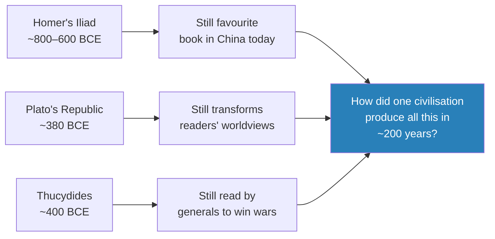
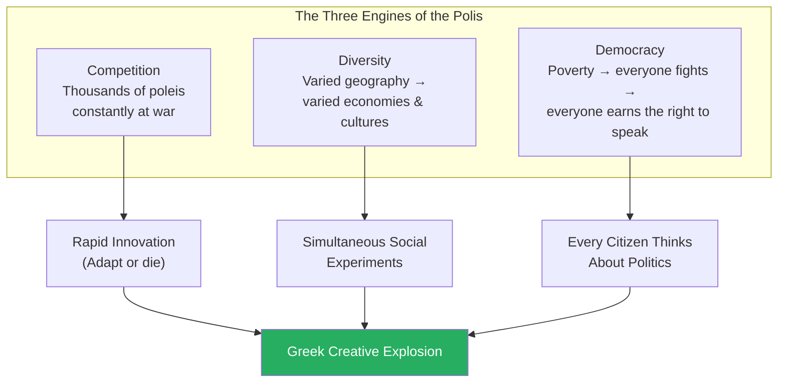
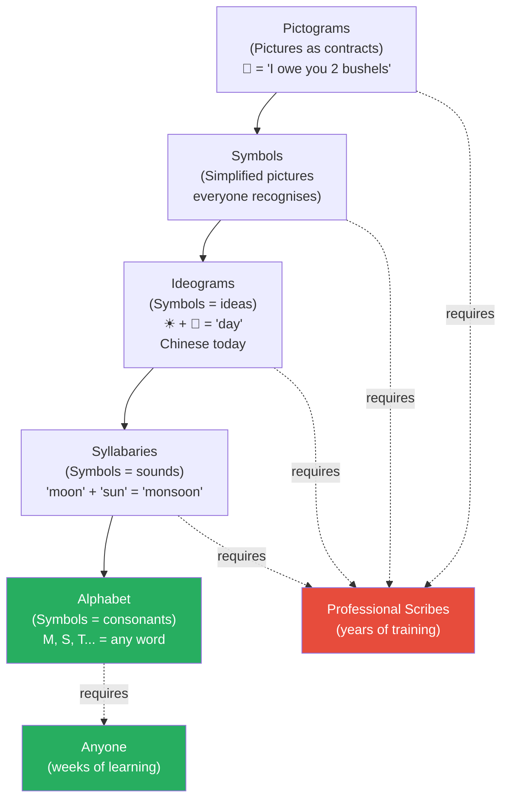
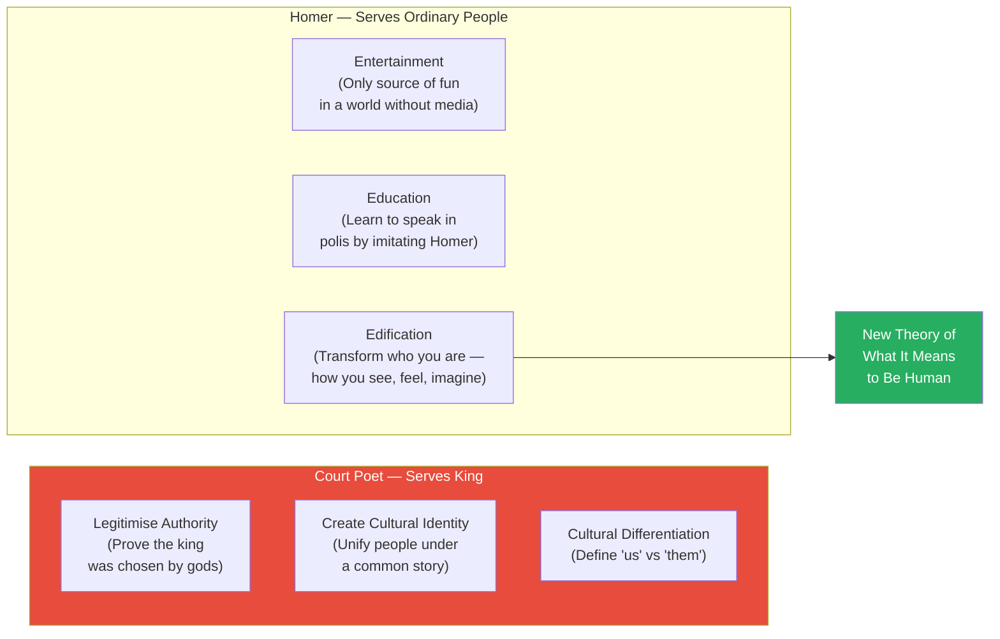
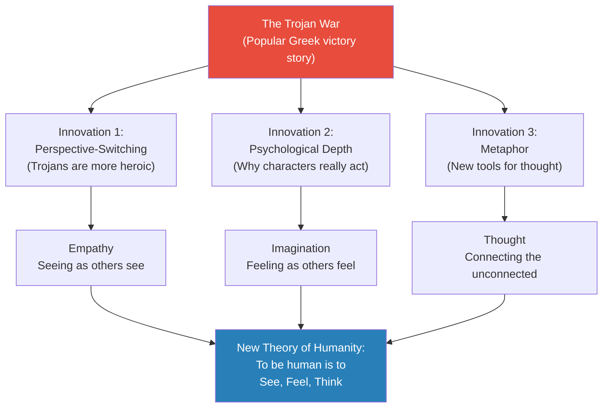
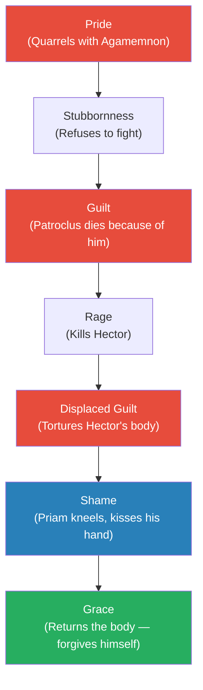
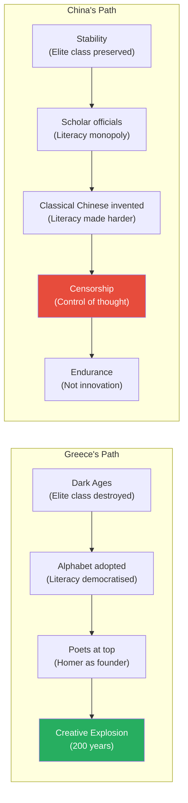

# Homer's Iliad and the Birth of Greek Civilization

> Greek civilization is the greatest, most creative, most significant in all of human history — and it was born from total destruction. When the Bronze Age collapse devastated Mycenaean Greece around 1200 BCE, the Greeks lost their central government, their literacy, and their wealth. For four hundred years they lived in a Dark Age. But it was precisely this catastrophe that made three revolutions possible: the polis (political), the alphabet (cognitive), and Homer (intellectual). Prof. Jiang argues that chaos became democracy, illiteracy became a revolution in thought, and a wandering poet — answerable to no king — gave humanity its first theory of what it means to be human. The Iliad's central claim: it is not war but love that creates civilization.

---

## Overview: Key Highlights

- <b style="color: #27ae60">Greece became great because it was destroyed</b> — decentralisation, illiteracy, and poverty were the exact conditions that made the three revolutions possible
- <b style="color: #2980b9">The polis</b> — city-state community of ~1,000 people where every citizen discussed politics; competition, diversity, and democracy drove rapid innovation
- <b style="color: #27ae60">Greek democracy was born from poverty, not idealism</b> — when everyone is too poor to exclude anyone from fighting, everyone earns the right to speak
- <b style="color: #2980b9">The alphabet</b> — the first writing system that collapsed the gap between writing and speaking; for the first time, anyone could become literate without years of scribal training
- <b style="color: #27ae60">The Greeks combined oral and literate culture simultaneously</b> — emotional power and logical discipline, creative freedom and reflective depth, all in the same minds
- <b style="color: #e74c3c">All previous writing systems required professional scribes</b> — the alphabet made those gatekeepers unnecessary overnight
- <b style="color: #2980b9">Homer's three innovations</b> — perspective-switching (empathy), psychological depth (imagination), and metaphor (tools for thought); together they constitute the invention of literature
- <b style="color: #27ae60">"It is not war that creates civilization. It is love."</b> — Priam's act of kneeling and kissing the hand of Hector's killer is the Iliad's central claim and the founding insight of Western civilization
- <b style="color: #e74c3c">Court poets served kings</b> — Homer had no king, so he served ordinary people, which is why the Iliad is honest rather than propaganda
- <b style="color: #2980b9">Edification</b> — Homer's highest function: not just entertaining or educating but transforming who you are by changing how you see, feel, and imagine the world
- <b style="color: #e74c3c">China never developed the alphabet because scholar officials monopolised literacy as power</b> — they made writing harder, not easier, to protect their status
- <b style="color: #27ae60">Destruction as the engine of civilizational innovation</b> — the main message of human history, demonstrated here more dramatically than anywhere else in the series

| Concept | One-line summary |
|---------|-----------------|
| **Polis** | Self-governing community of ~1,000 people — origin of "politics"; competition, diversity, and democracy produced rapid innovation |
| **Greek Dark Ages** | 400 years (1000–600 BCE) of illiteracy following the Bronze Age collapse — the incubation period for Greek greatness |
| **The Alphabet** | Writing system that equated writing with speaking, eliminating scribal gatekeepers and enabling universal literacy |
| **Oral culture** | Society based on speech — emotional, creatively free, memory-intensive; what the Greeks were before and during Homer |
| **Literate culture** | Society based on writing — logical, disciplined, reflective; what the alphabet added without replacing the oral |
| **Edification** | Being elevated to a higher version of yourself through art — Homer's unique function beyond entertainment and education |
| **Empathy** | Seeing the world from another's perspective — Homer's first invention, created by telling the Trojan War from both sides |
| **Metaphor** | Connecting two unconnected ideas — Homer's tool for teaching the Greeks how to think creatively |
| **Scholar officials** | Confucian bureaucratic elite whose entire power rested on their monopoly over literacy — the reason China never got an alphabet |
| **Achilles and Priam** | The Iliad's psychological core: a warrior consumed by displaced guilt, and a father whose love breaks through that rage |
| **Wooden horse** | Odysseus's stratagem to end the Trojan War — represents Greek cunning, but Homer makes the Trojans the moral heroes |
| **Classical Chinese** | The literary language Confucian officials invented to make literacy harder — the opposite of the alphabet's democratisation |

---

# The Lecture

## Greece Is the Greatest Civilization — Here Is Why That Matters [0:00]

*Prof. Jiang opens the lecture with a bold assertion and immediately grounds it in testable evidence spanning three thousand years. This is not patriotism for Western civilization — it is a genuine puzzle that demands explanation.*

> [!tip] Core Insight
> The Greeks produced their greatest works — Homer, Plato, Thucydides — in roughly 200 years. How does a civilization that collapsed into poverty and illiteracy produce, in that short a window, works that generals still read to win wars three millennia later?

*The staying power of Greek works across three millennia — in cultures completely different from ancient Greece — is itself evidence of something extraordinary that demands explanation.*

> [!note]- Expand: Full Lecture Detail
> Prof. Jiang opens by telling his students something he wants them to understand before anything else: Greek civilization is the greatest, most creative, most significant civilization ever in human history. "The Greeks really created Western civilization." He says it directly, without hedging.
>
> He then provides the evidence — not as abstract assertion but as specific, testable claims about works that still exist:
>
> - In literature: Homer wrote the *Iliad* and the *Odyssey* about 3,000 years ago. Prof. Jiang taught a "great books" course last year; "by far the favourite book was the Iliad." Think about what that means, he says — a Greek writer writing for a Greek audience 3,000 years ago, and his book "still resonates, still impresses students in China today"
> - In philosophy: Plato. "Even today, there are many who consider Plato the greatest philosopher who ever lived. There are many people who read the *Republic* by Plato and they say it transforms their lives. It makes them think very differently about the world."
> - In history: Thucydides. "If you are a military leader today, you read Thucydides. There are still many generals today in America, in Russia, in Europe, who believe reading Thucydides will help them win wars."
>
> The puzzle sharpens: "How were the Greeks able to create humanity's greatest civilization in really, about 200 years? They really were not dominant for a long time. They really created all these works in about 200 years altogether. So how is this possible?"
>
> His answer begins with the Bronze Age collapse — the catastrophe that destroyed Mycenaean Greece around 1200 BCE. Three consequences followed:
>
> - <b style="color: #e74c3c">Decentralisation</b> — the unified monarchy shattered; Greece became chaotic with no central authority
> - <b style="color: #e74c3c">Illiteracy</b> — the Greeks lost the ability to read and write entirely for 400 years (1000–600 BCE), the period we call the Dark Ages
> - <b style="color: #e74c3c">Poverty</b> — trade networks collapsed; Greece became isolated and dramatically poorer
>
> Then Prof. Jiang delivers the lecture's master claim: "It is because of these three things that Greece became the most creative civilization in the world." He repeats it for emphasis: "It is because the destruction of all Greece — it's because Greece became chaotic, illiterate and poor — that Greece eventually became the most civilised, the greatest civilization in the world."
>
> Three revolutions responded to these three catastrophes. The polis emerged from decentralisation. The alphabet emerged from illiteracy. Homer emerged from poverty. "The polis was a political revolution. It forever transformed society. The alphabet was a language revolution. It forever transformed the way people communicated. And Homer was really an intellectual revolution. It forever transformed how Greeks saw and imagined the world around them."

---

## Revolution 1: The Polis — Three Engines of Innovation [0:00–9:58]

*From the chaos of collapse emerged a new political unit — not a monarchy but a community of ~1,000 people who governed themselves. Prof. Jiang identifies three features of the polis that together produced a creative explosion no empire could match.*

*Three forces working together produced a feedback loop: democratic citizens debated diverse solutions to shared competitive pressures, and the best ideas spread rapidly. No single polis had to invent everything — collectively they invented more than any empire could.*

> [!note]- Expand: Full Lecture Detail
> Prof. Jiang introduces the polis carefully: usually translated as "city-state," but really meaning "community" — "a community of people who discuss politics together, how to best run the town." This is where we get the word "politics." Because of the collapse, there were thousands of these poleis across Greece, each of about 1,000 people, each self-governing. No central authority.
>
> **Feature 1 — Competition:**
> - With no emperor or palace to impose order, the poleis were in constant rivalry for resources and survival
> - "They were constantly at war with each other, and that allowed for massive innovation"
> - No safety net, no higher authority to appeal to — a polis that fell behind had to adapt or be absorbed
> - This competitive pressure was brutal but astonishingly productive: better ideas spread fast, laggards declined
>
> **Feature 2 — Diversity:**
> - Greece's geography is extremely varied: mountains, plains, coastland, farmland
> - Each polis developed a different economy, culture, and society based on its geography
> - Coastal poleis became trading hubs. Mountain poleis became fortress communities. Plains poleis oriented toward agriculture. Island poleis developed naval expertise
> - The result: Greece was not running one experiment in how to organise society — it was running thousands simultaneously
>
> **Feature 3 — Democracy:**
> - Prof. Jiang presents this as an economic necessity, not an idealistic choice
> - Greece was very poor. "If you're very poor, you need everyone to participate and work hard, especially in battles against other poleis"
> - The rule became: rich or poor, "if you fought for us, you had the right to speak" — you could be the poorest person in the polis and still had political voice because everyone had a responsibility to defend it
> - This meant even a farmer had to think about political life, "and you still had a responsibility to speak up in front of your peers"
> - "This is where we get the idea of polis from, and this was a major driver of innovation in Greece"
>
> The democratic requirement did not just redistribute political power — it transformed the culture from the ground up. In a monarchy, only the court thinks. In a polis, everyone thinks. The daily practice of forming arguments, evaluating evidence, and speaking publicly became a survival skill for every citizen. This created cognitive habits across the entire population that would eventually produce philosophy, rhetoric, and science.

---

## Revolution 2: The Alphabet — How Writing Became Thinking [9:58–19:32]

*The Greeks became illiterate and had to reinvent literacy from scratch. What they adopted — the alphabet — was not just a simpler writing system but a cognitive revolution. Prof. Jiang walks through the entire evolution of writing to show why the alphabet was the first system that made literacy universal.*

> [!tip] Core Insight
> Before the alphabet, every writing system required professional scribes because writing was a separate language from speech. The alphabet collapsed that distinction — writing became speaking. For the first time in history, anyone could learn to read and write without years of specialised training.

*Every writing system before the alphabet required a professional class of gatekeepers. The alphabet eliminated the gatekeepers entirely — the only stage in the progression where writing became equivalent to speaking.*

> [!note]- Expand: Full Lecture Detail
> Prof. Jiang frames the evolution of writing as a series of innovations, each one solving a problem created by the previous stage. He makes it concrete immediately.
>
> "Writing was first developed in Europe, in Western society, in Egypt and in Sumeria, and they did so to solve an economic problem. These societies were very wealthy, and they needed farmers to help them build roads and build irrigation networks and build temples. To do so I need to pay these workers, right? So a writing system became a contract."
>
> He demonstrates on the board: a pictogram of two people and two V-shapes (wheat). "What this is saying is: if you work for me, I promise to give two people two bushels of wheat." That drawing is a contract.
>
> > [!example] Prof. Jiang's Board Demonstration
> > - He draws two stick figures and two V-shapes representing bushels of wheat — a pictogram that functions as a contract
> > - Next simplification: "maybe just two faces and then two V's" — symbols everyone recognised; the pictures become abstract
> > - Then: symbols representing ideas, not things. Sun + moon = the concept of "day" — an ideogram. "Guys, Chinese is an ideogrammic language"
> > - Then: sounds replace meanings. "Moon" + "sun" = "monsoon" (the sound, not the meaning) — a syllabary
> > - Finally: individual consonants. M and S, combined to spell "sum" or any other word — the alphabet
> > - At each stage, the system becomes more flexible and requires fewer symbols to master
> > - Critical question: at which step does it stop requiring professional scribes? Only at the very last one
> > **The lesson:** The alphabet was not just another writing system — it was the first one that eliminated the gatekeepers. Every previous system required years of specialist training; the alphabet required weeks.
>
> The progression in detail:
>
> - **Pictograms** — pictures representing things, used as contracts. A drawing of a face and wheat means "I will pay you wheat for your labour"
> - **Symbols** — simplified, standardised versions that everyone recognises; the pictures become abstract enough to be written quickly
> - **Ideograms** — symbols representing ideas, not things. Sun + moon = "day." Prof. Jiang notes that Chinese is an ideogrammic language — each character represents a concept rather than a sound
> - **Syllabaries** — symbols representing sounds and syllables rather than meanings. "Moon" + "sun" = "monsoon" (the sound, not the concept)
> - **Alphabet** — symbols representing individual consonant sounds, the simplest possible units of language. With roughly two dozen symbols, you can represent any word in any language
>
> The critical breakthrough: before the alphabet, writing was a separate language from speech, requiring years of training by professional scribes. With the alphabet, writing became speaking. "Writing can become speaking. And this marked an incredible revolution in human thought and the capacity to think."
>
> **Why the Greeks could combine both oral and literate culture:**
>
> Before the alphabet, cultures were either oral or literate — not both. Prof. Jiang lays out what each mode provides:
>
> | | Oral Culture | Literate Culture |
> |---|---|---|
> | **Strength 1** | Emotional — speakers rouse audiences through rhetoric and passion | Logical — writing must persuade by reason alone; reader controls the pace |
> | **Strength 2** | Innovative — speakers can create new words freely, experiment in real time | Disciplined — writing requires shared vocabulary and agreed meanings |
> | **Strength 3** | Memory-intensive — photographic recall of hours-long speeches was baseline | Reflective — frees brain space for deep analysis and sustained critique |
>
> The oral culture memory point is striking: "Back then, they were a lot smarter than we are today" — because in oral culture you had to remember your speech and the audience had to remember it too, and "these speeches go on for hours and hours, so back then, during oral culture, everyone had a photographic memory." He draws the analogy directly to hunter-gatherers: "Back then, they were a lot stronger, faster and healthier than we are today, because today all we do is sit around."
>
> But the Greeks — by a unique historical accident — got both. They were still living in oral culture when the alphabet arrived. "When the Greeks discovered the alphabet, what happened was they combined the advantages of both cultures. Most of the time they were speaking, they were living in oral culture, but they also had the opportunity to write down their thoughts, which allowed them the advantages of literate culture to have a more disciplined, focused, logical mind."
>
> This was an unrepeatable historical moment. The Greeks caught the alphabet before it displaced oral culture — before the oral strengths (emotional power, creative freedom, prodigious memory) had atrophied. No civilisation before had possessed both simultaneously, and once the transition to full literacy is complete, the oral advantages are gone permanently.

---

## Revolution 3: Homer and the Functions of the Poet [19:32–27:12]

*Before Homer, every great poet was hired by a king to serve three political functions. Homer had no king — and that freedom changed everything. Prof. Jiang explains why Homer's poverty was the most liberating force in the history of literature.*

*Court poets produced propaganda — always constrained by what power needed people to believe. Homer, answerable only to ordinary people, followed the material wherever it led. That freedom produced the Iliad.*

> [!note]- Expand: Full Lecture Detail
> Prof. Jiang sets up the social role of poets in ancient societies before explaining why Homer was different.
>
> "Back then, there were many poets who went around and told stories about the world — legends, mythologies. The very best poets were usually hired by kings, rich people, because kings need poets to solve three problems."
>
> The three problems:
>
> 1. **Legitimate authority** — "Most kings get power by killing a lot of people. So when they become king, they need to clean up their image." How do you prove God chose you? A poet sings a beautiful song about you, and "this song can only come from divine inspiration." The poet is a vessel for divine messages. "This poem, this song is so beautiful, it must be divine. And if this divine song is saying 'the gods want me to become king', then I must be divine myself."
>
> 2. **Create cultural identity** — "In China you have books like *Romance of the Three Kingdoms*. You have the Bible. All these literary works. The function is to create a common cultural identity — it tells us what it means to be Chinese." Unified people obey the king who unified them.
>
> 3. **Cultural differentiation** — "To know who you are, you must also know who you are not. We're Chinese, so therefore we are not Japanese, we're not Korean, we're not American." Literary works draw boundaries, and those boundaries serve the ruler who draws them.
>
> Prof. Jiang names examples: the Aeneid served Rome, the Bible served the Church, the *Romance of the Three Kingdoms* served Chinese dynastic ideology. "All these literary works were designed to serve the powers that exist at that time."
>
> **Why Homer was different:**
>
> "The problem with Homer is, when he was around — we don't know actually when he was alive, maybe about 800 to 600 BC, around then, we don't know — there was no king. There's no one to pay him. Therefore he could only make his living by appealing to the people around him."
>
> How do you get poor ordinary people to pay you? Three reasons:
>
> - **Entertainment**: "Back then, their source of entertainment was to pay people like Homer to sing songs to them. That was what they thought was fun to do." In a world without books, theatre, or any recorded entertainment, a travelling poet was the whole entertainment industry
> - **Education**: "Greece was poor, they didn't have schools, but because of the polis system, they had to speak in front of their peers. So how did you learn to speak? By imitating people who speak well, who are usually poets." Homer was a master class in rhetoric you could imitate in your own political speeches
> - **Edification**: "To be a better you, to be a higher you." The way Homer accomplished this is by changing the way you saw the world around you, the way you felt about the world, the way you imagined the world.
>
> Prof. Jiang pauses on edification because it is what made Homer unique among all poets of his era. Entertainment leaves you the same person afterward. Education teaches you skills. But edification transforms who you are.

---

## The Iliad: Three Inventions of Literature [27:12–37:03]

*Homer took the most popular story in Greece — the Trojan War, a crowd-pleasing Greek victory — and did three things with it that had never been done before. Prof. Jiang calls this "the invention of literature."*

*Homer's three innovations are not isolated literary techniques — they form a unified theory of what it means to be human. Before Homer, greatness meant conquering land or accumulating power. After Homer, greatness meant the depth of your empathy, imagination, and thought.*

> [!note]- Expand: Full Lecture Detail
> Prof. Jiang tells the story of the Trojan War first, so his students understand what Homer was working with.
>
> > [!example] The Story of the Trojan War
> > - The goddess Nemesis creates a golden apple inscribed "to the most beautiful goddess in the world" and places it on Mount Olympus
> > - Three goddesses fight over it: Hera (queen of the gods), Athena (goddess of wisdom), Aphrodite (goddess of love)
> > - Zeus, tired of the fighting, finds "a human stupid enough to be the judge" — Paris
> > - Each goddess bribes Paris: Hera offers kingship of the world; Athena offers all knowledge; Aphrodite offers the most beautiful woman in the world
> > - Paris chooses Aphrodite — but the most beautiful woman, Helen, is already married to a Greek king
> > - Paris steals Helen and takes her to Troy; the Greeks raise a massive army and besiege Troy for ten years
> > - The war ends when Odysseus devises the wooden horse: Greeks pretend to leave, the Trojans bring the horse inside, the Greeks jump out at night and slaughter the city
> > - This is the story the Greeks loved: Greek heroism, Greek victory
> > **The lesson:** Homer took this crowd-pleaser and did something no one expected — he made the losers more heroic than the winners.
>
> **Innovation 1 — Perspective-Switching → Empathy:**
>
> "Rather than telling a story from the Greek side, he tells a story from both the Greek and Trojan side. In fact, when you read the Iliad, you'll discover that the Trojans are actually more heroic, more courageous and more brave than the Greeks."
>
> By switching perspectives — forcing a Greek audience to see the world through the eyes of their enemy — Homer creates a capacity that barely existed before: <b style="color: #27ae60">empathy, the ability to see the world from the perspective of other people</b>. "Before in human civilization, this didn't really exist before. But Homer creates this for the Iliad."
>
> **Innovation 2 — Psychological Depth → Imagination:**
>
> "For the first time, Homer discusses what motivates the characters in the Iliad, why are you fighting this war." He tells the story of Achilles and Priam:
>
> > [!example] Achilles and Priam — The Heart of the Iliad
> > - Achilles, greatest Greek warrior, quarrels with King Agamemnon and curses him: "You're a dog. I'm never going to fight for you again"
> > - Without Achilles, Hector (son of King Priam) leads the Trojans out to destroy the Greek army
> > - Greek generals beg Agamemnon to ask Achilles to return; Achilles says "screw off"
> > - Achilles's beloved friend Patroclus feels sorry for the Greeks, pretends to be Achilles, and goes to fight Hector
> > - Hector kills Patroclus — Achilles in rage leaps into battle and kills Hector
> > - Instead of returning Hector's body for ransom (the custom — only burial lets the dead find peace in the afterworld), Achilles tortures the corpse
> > - But Achilles cannot sleep; deep down he knows his own stubborn pride caused Patroclus's death — if he hadn't quarrelled with Agamemnon, Patroclus would never have fought Hector
> > - "His guilt turns into an intense hatred for Hector" — he tortures the body because he cannot face his own responsibility
> > - King Priam sneaks into the Greek camp, stands behind Achilles while Achilles talks to his generals. He could stab Achilles in the neck — but instead he kneels down and kisses the hand of the man who killed his son
> > - "Achilles is forced into awe of this king who has knelt down before him — he admires Priam's courage and love for his son so much that he feels tremendous shame and remorse for what he's done"
> > - He returns Hector's body to Priam
> > **The lesson:** "It is not war that creates civilization. It is love that creates civilization. It is Priam's love for Hector that gives him the courage to defeat Achilles in battle. And in this defeat, Achilles becomes a better person because he is able to forgive himself and do what is right."
>
> This is what Prof. Jiang calls "extremely complicated psychology" — forcing the reader to understand what really drives a character, including the self-deceptions they cannot see in themselves. Achilles thinks he hates Hector; what he actually feels is guilt about Patroclus. He tortures the body not because he hates Hector but because he cannot face his own responsibility. This kind of insight — that people's stated motivations often mask deeper, more painful truths — was genuinely new in human storytelling.
>
> **Innovation 3 — Metaphor → Tools for Thought:**
>
> "What are metaphors? Metaphors are connections between things that were unseen. If I say 'the sky is a snail', you're like, oh, I didn't know that. That's what a metaphor is — connecting two things that before were not connected. If you think about it, what this is is a new thought."
>
> The Iliad is dense with metaphors, and their cumulative effect is to teach readers not just what to think but how to think. "Metaphors teach you how to think. They are the tools for thought."
>
> **The unified theory:**
>
> Homer's three innovations, taken together, constitute a new theory of what it means to be human. "Before, we thought human beings fought over land. They fought over women like Helen. They struggle for power. What Homer is saying is: what it means to be human is someone who has empathy, imagination and the willingness to think. Only if you're willing to see, feel and think are you human."
>
> This is why the Greeks believed their civilization was founded not by a general or a king but by a poet. "It's because of the Iliad that they all read and memorised and they could recite — because, again, this is an oral culture where you're trained to have a very strong memory. Because they memorised the Iliad, it further transformed them as humans."

---

## The Psychological Arc of Achilles [~35:00–37:03]

*Prof. Jiang lingers on the resolution of the Iliad because it is the lecture's emotional centre. Priam's act — kneeling before his son's killer — is the founding image of Western civilization's claim that love is stronger than violence.*

*Achilles's journey from destructive pride to redemptive grace is not a simple arc — it passes through guilt, rage, and self-deception before arriving at grace. The turning point is not violence but a father's courage.*

> [!note]- Expand: Full Lecture Detail
> Prof. Jiang emphasises that the Iliad's psychology is "extremely complicated" and "forces you to think deeply about who we are as humans."
>
> The arc is worth tracing carefully because it is the proof of Homer's second innovation — psychological depth — in action:
>
> - Pride hardens into stubbornness: Achilles is insulted by Agamemnon and refuses to fight, even as his own army is being destroyed
> - Stubbornness produces guilt: Patroclus dies in the battle Achilles refused to join — and Achilles knows it was his own fault
> - Guilt transforms into rage directed at Hector, and rage becomes displaced guilt expressed through torturing Hector's body
> - But even as he tortures it, "he can't sleep, and he feels tremendous sadness, even though he's avenged the death of Patroclus"
> - The reason: "In his heart, Achilles knows he was the one responsible for killing Patroclus. If he didn't get into the stupid fight with Agamemnon, and if he did not refuse the Greeks when they requested help, then Patroclus wouldn't have died. So it's because Achilles was so stubborn and so proud that his friend Patroclus died."
>
> Then Priam's entrance. He has lost his son. He could stab Achilles in the neck. Instead:
>
> - "He kneels down and kisses the hand of Achilles, which forces Achilles to be in awe of this king who has knelt down before him"
> - Priam's courage and love — choosing vulnerability over revenge — is so overwhelming that Achilles feels shame and remorse
> - He returns Hector's body
>
> Prof. Jiang states the main message directly: "It's not war that creates civilization. It is love that creates civilization. It is Priam's love for Hector that gives him the courage to defeat Achilles in battle."
>
> This resolution is not just narrative — it is a demonstration of Homer's thesis. He has spent the entire Iliad teaching his audience to see from other perspectives (empathy), to understand inner lives (psychological depth), and to think in new connections (metaphor). And then at the climax, he shows what those capacities look like in action: a father's love overcoming the greatest warrior in the world.

---

## Why Greece and China Diverged [43:39–47:13]

*Prof. Jiang pivots to help his Chinese students understand their own civilization by contrast. The alphabet question and the Homer question have the same root cause — who controlled access to knowledge, and why.*

> [!tip] Core Insight
> Scholar officials derived their entire power from their monopoly on literacy. To protect that monopoly, they made writing harder — inventing Classical Chinese, a literary language divorced from speech that only years of training could master. They did the opposite of what the alphabet did, for exactly the same reason: power.

*Neither path is morally superior — China endured for millennia while Greece burned bright for 200 years. But the structural logic behind each choice explains their radically different creative outputs.*

> [!note]- Expand: Full Lecture Detail
> **Why didn't China develop the alphabet?**
>
> Prof. Jiang traces the alphabet's actual origin: "The people who actually developed the alphabet were the Egyptians. Egypt was constantly in contact and communication with many different societies and cultures, including the Sumerians and the Greeks, and they could adopt new practices to advance their language."
>
> The Phoenicians — Mediterranean traders — carried the alphabet from Egypt to Greece. The Greeks, freshly illiterate and searching for a new writing system, "eagerly adopted it." Two conditions were needed: openness to other cultures (trade contact) and urgent need (the Dark Ages had destroyed the old system).
>
> China had neither condition:
>
> - Geographically isolated from the rest of the world — "separated from other major civilisations by deserts, mountains, and oceans"
> - But more importantly: the scholar official class derived their entire power from their monopoly on literacy
>
> Prof. Jiang puts the question directly to his students: "What was their power? It was the ability to read and write. That's what differentiated them from everyone else. That's what made them indispensable to the Emperor. That's why they were so powerful."
>
> If anyone could read and write, anyone could become a bureaucrat, and the scholar officials would lose their privileged position. Their rational response: "When you have a monopoly over literacy, you don't want to give it up. You want to increase it." They invented Classical Chinese — a literary language so divorced from spoken Chinese that only years of specialised training could master it. The opposite of the alphabet. Making literacy harder, not easier.
>
> **Why didn't China produce a Homer?**
>
> The Confucian social hierarchy tells the whole story:
>
> - At the very top: scholar officials — "the most virtuous, the most well educated, the most cultivated"
> - Below them: farmers and artisans (who produce wealth)
> - Below them: merchants
> - At the very bottom: <b style="color: #e74c3c">artists and poets</b>
>
> In Greece, Prof. Jiang notes, "this was the complete opposite." They placed Homer at the very top. "Everyone wanted to be a poet like Homer."
>
> This explains why every major Greek thinker saw Homer as the model. "When Plato was running the Republic, he was trying to become Homer — a teacher of civilization, an inspirer of civilization, a big god of civilization. Thucydides, when he wrote the Peloponnesian War, was trying to do the same thing. They all wanted to become Homer because they all knew Homer was the father of civilization, and they wanted to continue his legacy."
>
> "And that's what made the Greeks unique in human history, because only this society put poets first and foremost at the top, and no other society did so."
>
> In China, the ruling class's "main role was censorship — controlling how people thought through censorship. And that's why China never really produced a Homer or a great thinker" in the same sense. Not because Chinese people were less intelligent, but because the social hierarchy directed the most talented people toward administration and compliance rather than creative transformation.
>
> > [!example] The Scholar Officials' Strategic Choice
> > - By 221 BCE, China had unified under the Qin dynasty; scholar officials were indispensable to administration
> > - Their power rested entirely on their ability to read and write — the credential that made them irreplaceable
> > - The alphabet was a known technology; Egyptian hieroglyphics had evolved toward phonetic writing; Phoenician traders brought alphabetic knowledge throughout the Mediterranean
> > - Scholar officials faced a choice: adopt simpler writing (more people literate, officials less special) or deepen the complexity (fewer people literate, officials more special)
> > - They chose the latter — creating Classical Chinese, a literary language so different from spoken Chinese that it required decades of study to master
> > - This was rational self-preservation, not ignorance: they understood exactly what the alphabet would do to their monopoly
> > **The lesson:** Those who control access to knowledge will always act to preserve and strengthen that control, because knowledge is the foundation of their authority.
>
> Prof. Jiang closes the comparison with the lecture's master thesis: "It's only because Greece got destroyed at the end of the Bronze Age, it became decentralised, illiterate and poor, that they could then become a great civilization. It was only through destruction that they could have the polis, the alphabet and Homer. And that's the main message of human history. It's through destruction that we have innovation, and it's only through this process that human beings are able to rejuvenate their society."

---

## Connections

**Builds on:** [[06 - Elite Overproduction and the Bronze Age Collapse]] — the collapse of Mycenaean Greece is the direct cause of everything in this lecture. Without the destruction of the monarchy, scribes, and trade networks, none of the three revolutions could have emerged. The Bronze Age collapse was not just an ending — it was a clearing.

**Builds on:** [[05 - The Yamnaya Conquest of Europe]] — the polis echoes the "open cooperative competition" framework from the Yamnaya steppe. Small competing groups produce more innovation than empires in both cases. The Yamnaya created the violent, patriarchal Indo-European world; Homer began to imagine a way beyond violence — a civilization founded on empathy rather than conquest.

**Builds on:** [[01 - Explaining Humanity's Transition to Agriculture]] — the series' master thesis runs through both lectures: crisis, not comfort, drives civilizational change. Agriculture was a catastrophe (more work, worse health) that produced civilization. The Bronze Age collapse was a catastrophe (illiteracy, poverty, chaos) that produced the greatest civilization in history.

**Sets up:** [[08 - Rat Utopia and the Peloponnesian War]] — the same competitive dynamics that drove Greek innovation also carried the seeds of destruction. When polis-vs-polis rivalry turned from innovation to annihilation, Greek civilization began consuming itself — the pattern Prof. Jiang will explain through John B. Calhoun's behavioural experiments.

**Sets up:** [[09 - Aeschylus, Sophocles, and Euripides as Prophets of Democracy]] — Greek tragedy is the direct continuation of Homer's literary tradition. The tragedians inherited his commitment to empathy, psychological depth, and the exploration of what it means to be human, and applied it to the political crises of democratic Athens.

**Sets up:** [[10 - Socrates and Plato's Cave]] — Plato's ambition to become "the next Homer" — a teacher and inspirer of civilization — is the direct consequence of the cultural hierarchy established in this lecture.

**Related books in vault:** [[Sapiens - Yuval Noah Harari]] — Harari's argument that farming enslaved humans parallels Prof. Jiang's argument about the Bronze Age collapse: what looks like decline is actually the prerequisite for the next civilizational leap. [[The Iliad - Homer]] — the primary text discussed in this lecture, which Prof. Jiang will assign next semester.

---

## The Takeaway

This lecture delivers a single counterintuitive thesis with extraordinary force: the most creative civilization in human history was made possible by total catastrophe. The Bronze Age collapse destroyed Greece's monarchy, literacy, and prosperity — and in doing so cleared the ground for democratic politics, cognitive revolution, and the world's first great poet. Prof. Jiang frames this as "the main message of human history": innovation requires the destruction of the old order, and the societies most likely to produce transformative ideas are those that have been forced to reinvent themselves from nothing.

The most radical claim is about Homer's place in society. Every other civilization puts warriors, kings, or bureaucrats at the top of its hierarchy. Only Greece placed a poet there — and made "continue Homer's legacy" the highest aspiration of its greatest minds. Plato was trying to become Homer. Thucydides was trying to become Homer. That single cultural inversion, Prof. Jiang argues, explains why Greek civilization produced so much in 200 years that no other society has matched. When the top of your hierarchy is a thinker who teaches empathy, imagination, and thought, the entire society orients toward those capacities. When the top is a bureaucrat who maintains order through censorship, the society orients toward compliance. The hierarchy does not merely reflect a civilization's values — it causes its intellectual output.

The question that hovers over everything is whether the Greek model is sustainable. The same competitive dynamics that drove the polis toward creativity could drive it toward mutual annihilation. Greece burned bright for 200 years and then began to devour itself. The Iliad's central message — that love, not war, creates civilization — is as counterintuitive today as it was when Homer first told it. Priam's act of kneeling before his son's killer did not just end one conflict. It proposed a theory of human greatness that challenged every assumption about power in the ancient world: that vulnerability can overcome violence, that surrender can be stronger than conquest, that the capacity for empathy is more powerful than any army. Three thousand years later, the question of whether that theory is true — or whether the world Achilles represents always wins in the end — remains the central unresolved tension of Western civilization.
