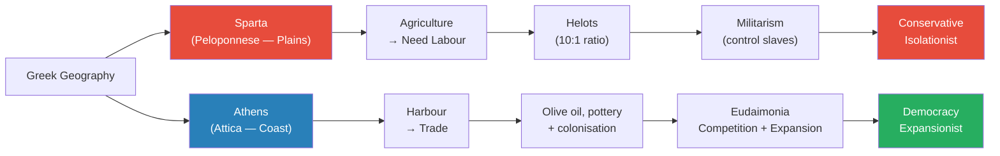
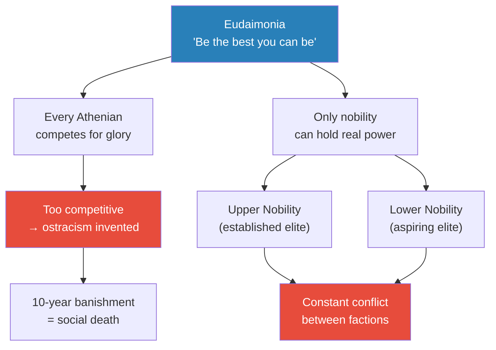
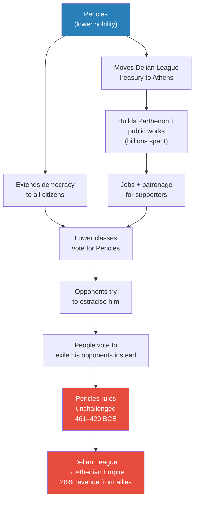
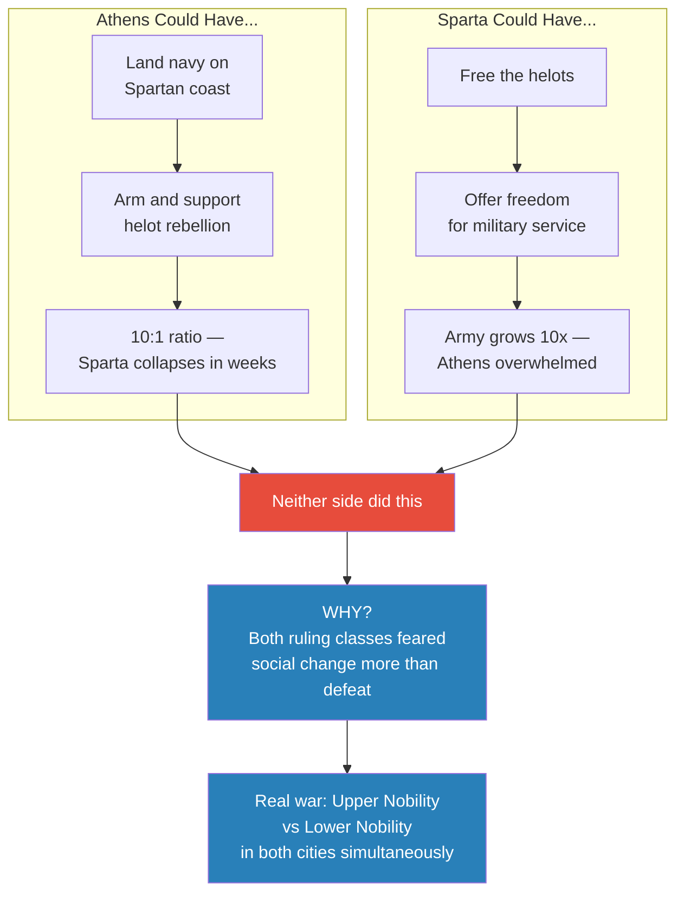
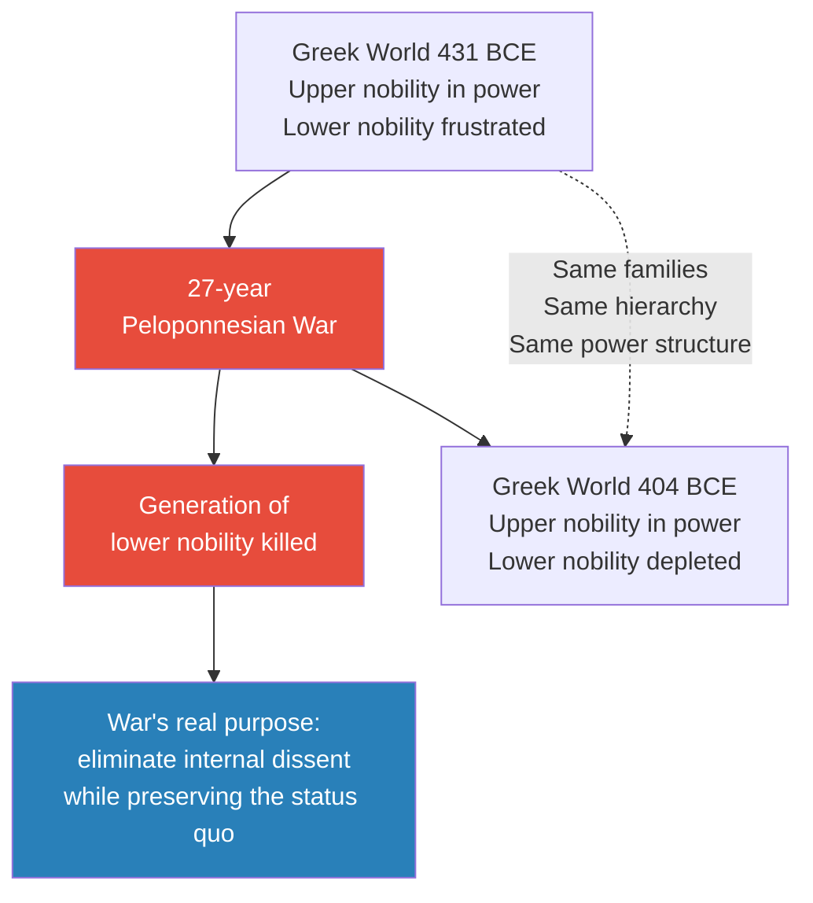

# Rat Utopia and the Peloponnesian War

> Prof. Jiang delivers a sweeping overview of Greek history — from Sparta and Athens as geographical mirror images, through the Persian Wars' pivotal battles, to the 27-year Peloponnesian War that destroyed Athens. But the lecture's real argument is hidden beneath the narrative: the Peloponnesian War made no military sense. Both sides refused obvious winning strategies. The real conflict was never between Sparta and Athens — it was between upper and lower nobility within each city. A 1960s experiment on rats in paradise provides the explanatory key: when societies grow too wealthy, status locks in, the young cannot rise, and the resulting frustration produces self-destructive violence that ends in total collapse.

---

## Overview: Key Highlights

- <b style="color: #2980b9">Geography is destiny</b> — physical landscape dictates culture, economy, and political structure; Sparta's plains produced militarism, Athens's harbour produced trade and ambition
- <b style="color: #2980b9">Eudaimonia</b> — Greek for "human flourishing"; the Athenian drive to be the best, even at the cost of death, that built the city and ultimately destroyed it
- <b style="color: #e74c3c">Helots outnumbered Spartans 10 to 1</b> — this single demographic fact made Sparta permanently conservative, isolationist, and consumed by internal control
- <b style="color: #e74c3c">Persian commanders chose ego over strategy at every turning point</b> — at Salamis and Plataea, they had winning positions and threw them away for personal glory
- <b style="color: #27ae60">Pericles was not a democrat — he was a politician who used democracy as a weapon</b> to crush the upper nobility by allying with the masses; he ruled unchallenged for 32 years
- <b style="color: #27ae60">"The culture that allows a nation to rise will also cause it to decline"</b> — eudaimonia built Athens, and eudaimonia destroyed it through imperial overreach and internal competition
- <b style="color: #e74c3c">Neither Athens nor Sparta tried to win the Peloponnesian War</b> — both had obvious winning strategies and refused to use them because victory would have destabilised the internal social hierarchy
- <b style="color: #2980b9">Rat Utopia (John B. Calhoun)</b> — in conditions of unlimited abundance, rat colonies always collapse through the same mechanism: status lock-in blocks the young, frustration turns into violence, and the entire society destroys itself
- <b style="color: #e74c3c">Status lock-in, not overpopulation, is the trigger</b> — Calhoun's own explanation (too many rats) was wrong; the colony never ran out of space; the real cause was that old rats lived longer and held power indefinitely
- <b style="color: #27ae60">The political world of 404 BCE was identical to 431 BCE</b> — after 27 years of slaughter, nothing changed except a generation of lower nobility was dead; the war's purpose was never victory but stasis
- <b style="color: #2980b9">Conflicts are between "have a lot" and "have some but want more"</b> — not rich vs. poor, but established elite vs. aspiring elite; this is the real axis throughout all of history
- <b style="color: #e74c3c">Cleon and Brasidas — the men who knew how to win — both died in the same battle</b> — Prof. Jiang's verdict: almost certainly assassinated, because both were more dangerous to their own side than to the enemy

| Concept | One-line summary |
|---------|-----------------|
| **Geography is destiny** | Physical landscape determines culture, economy, and political structure |
| **Eudaimonia** | Greek for "human flourishing" — the drive to be the absolute best, even at cost of death |
| **Helots** | Sparta's slave class at a 10:1 ratio — the source of both military strength and fatal vulnerability |
| **Hoplite / Phalanx** | Armoured infantry in overlapping-shield formation — the military innovation that defeated Persia |
| **Ostracism** | 10-year banishment from the polis — worse than death in a world where citizenship alone conferred rights |
| **Delian League** | Defensive alliance against Persia that Pericles converted into an Athenian imperial revenue machine |
| **Rat Utopia** | Calhoun's 1960s experiment: unlimited resources → status lock-in → social collapse → extinction |
| **Status lock-in** | When abundance lets the old live longer and hold power indefinitely, blocking the young from ascending |
| **Upper vs. lower nobility** | The real axis of conflict — not rich vs. poor but established elite vs. aspiring elite |
| **Elite overproduction** | The wider pattern: surplus elites who cannot find status outlets drive self-destructive conflict |
| **Polis** | A community of citizens, not a place — Athens survived the burning of its city because the people sailed away |
| **Lysander** | Half-citizen Spartan commander whom Persia forced Sparta to promote — the only man who won the naval war |

---

# The Lecture

## Geography is Destiny — Two Opposite Worlds [0:01–9:57]

*Prof. Jiang opens with a recap of the series so far — Bronze Age collapse, the polis, Homer — then introduces the lecture's analytical backbone: geography is destiny. Sparta and Athens are the same civilisation with the same gods and language, yet they became structural mirror images of each other, driven apart by the land beneath their feet.*

> [!tip] Core Insight
> Geography is not background scenery. For Prof. Jiang, it is the first cause. The flat plains of Sparta and the harbour coast of Athens each produced inevitable economic models, and those economic models produced inevitable cultures — one turned inward by fear of its own slaves, the other turned outward by the hunger for new markets.

*Geography produces economics, economics produces culture, culture produces politics — the causal chain runs left to right for both cities. Sparta's fear and Athens's ambition are not personality differences but structural outcomes.*

> [!note]- Expand: Full Lecture Detail
> Prof. Jiang opens by reminding the class of the story so far: the Bronze Age collapse destroyed Mycenaean Greece, which allowed for massive innovation — the polis, the alphabet, Homer. Today he will cover the overview of Greek history, focusing on the polis.
>
> His first analytical principle is stated bluntly: <b style="color: #2980b9">geography is destiny</b>. "Your geography will determine the culture, the economy, and the political structure of your society." Greek geography is extremely diverse — mountains, rivers, plains, coastlines — and depending on where you live, you get a different kind of polis. The two classic examples are Sparta and Athens.
>
> **Sparta — the military machine:**
> - Sparta sits in the Peloponnese on broad plains, ideal for large-scale agriculture
> - Farming at scale requires labour — Sparta's solution was conquest, producing a slave class called <b style="color: #e74c3c">helots</b>
> - The ratio: roughly 10 helots for every one Spartan citizen
> - This terrifying demographic imbalance became the central fact of Spartan life — "Sparta had to become a military society in order to control the helots"
> - Sparta had no private property and no money — everything, including the helots, belonged to everyone: "basically communism or proto-communism"
> - Any king or individual who tried to change society was killed; conformity was existential
> - Sparta was deeply conservative (change was dangerous) and isolationist ("if you leave us alone, we'll leave you alone")
> - Prof. Jiang draws the China parallel: "China throughout its history has been very conservative and very isolationist — not interested in the outside world. Why? Because it's focused on maintaining control over its peasantry." Sparta and China share the same structural logic.
>
> > [!example] Sparta's Education System — Soldiers from Childhood
> > - At age seven, boys were removed from their families and placed in boarding schools
> > - Schools were supervised by older children — eleven- and twelve-year-olds — who routinely beat the younger ones
> > - Purpose: instil emotional discipline — learning to endure pain and humiliation without breaking
> > - As teenagers, boys were paired with adult mentors aged 25–30 who became their lovers
> > - Spartans did not consider this homosexuality — they saw it as building emotional cohesion among soldiers who would fight and die together
> > - At 18 or 19, graduates married and started families — but soldiers were still required to eat and train together daily
> > - Family was secondary to the military unit
> > - Young soldiers patrolled the fields at night; any helot caught outside after curfew was stabbed to death on the spot — a deliberate campaign of terror to prevent uprisings
> > **The lesson:** Every aspect of Spartan culture — from childhood education to adult life — was engineered for one purpose: military control over a slave population that vastly outnumbered its masters.
>
> **Athens — the competitive crucible:**
> - Athens sits in Attica on the coast; terrain is hilly — bad for grain but excellent for olive trees
> - Athens has a superb natural harbour, making trade the default livelihood
> - Trade demanded exploration, new colonies, new markets — and it rewarded the bold and ambitious
> - Athens planted colonies throughout the Aegean, encouraging citizens to go out and find new markets
> - This outward-facing economy produced a completely different cultural value system

---

## Eudaimonia, Ostracism, and the Nobility Split [9:57–18:07]

*Prof. Jiang explains the cultural engine of Athens — eudaimonia — through Achilles's famous choice from Homer's Iliad. He then shows how eudaimonia's competitive pressure required a safety valve (ostracism), and ends with his most important reframe: democracy in Athens was never about the poor rising up — it was always conflict between upper and lower nobility.*

> [!tip] Core Insight
> "The conflicts in society are usually between the have-a-lot and the have-some-but-want-more." The poor riot; the lower nobility revolts. This distinction — upper nobility versus lower nobility — is the master key to understanding Athens, the Peloponnesian War, the French Revolution, and every modern class conflict.

*Eudaimonia generates competition; competition generates faction conflict; faction conflict is channelled through democratic institutions — but real power stays within the nobility.*

> [!note]- Expand: Full Lecture Detail
> Athens had a completely different cultural belief system from Sparta — Prof. Jiang introduces the core concept: <b style="color: #2980b9">eudaimonia</b>, a Greek word meaning "human flourishing." The idea: to be the best you can be.
>
> The most famous example is from Homer's Iliad:
>
> > [!example] Achilles's Choice — The Spirit of Eudaimonia
> > - Before sailing to Troy, Achilles consulted a fortune teller
> > - The prophet gave him two options:
> >   - Stay home, live long and healthy — but die as a nobody, forgotten by history
> >   - Go to Troy, die young on the battlefield — but die as a hero, remembered forever in songs of glory
> > - Achilles's response: "For me, that's not a choice. To be alive means to achieve eudaimonia. I have to be the best I can be."
> > - He chose Troy, chose death, chose glory
> > - In Athens: better to die young as a hero than to live long as a nobody
> > - In Sparta: the complete opposite — better to be a nobody and get along with everyone
> > **The lesson:** This single cultural difference — individual glory versus collective conformity — explains the entire divergence between the two civilisations.
>
> Eudaimonia made Athens ferociously competitive. In the Iliad, when Achilles quarrels with Agamemnon, he asks his goddess-mother to get the gods to help the Trojans so that Agamemnon will have to come begging. "He was basically committing treason. And in the Greek world, you're allowed to do that, because the most important thing is eudaimonia."
>
> Because of this extreme competition, Athens invented <b style="color: #2980b9">ostracism</b>: citizens could vote to banish any person from the polis for 10 years.
> - This was considered worse than death
> - In the polis system, only citizens had rights — and you had to be born into citizenship; you could not earn it
> - If banished, you became a legal non-person with no right to own land, speak in public, or be treated as a person anywhere in the Greek world
> - <b style="color: #e74c3c">Exile was social death, not just political defeat</b>
>
> Now the crucial reframe — Prof. Jiang insists on a misunderstood distinction:
> - Athens was nominally a democracy, but real political power was contested exclusively among the nobility
> - "The conflict in societies is between the haves and the have-nots — the rich and the poor. That is not true."
> - <b style="color: #27ae60">The real conflicts are between the have-a-lot and the have-some-but-want-more</b>
> - In this world: upper nobility versus lower nobility
> - In the French Revolution: petite bourgeoisie versus the aristocracy
> - Today: the middle class versus the established wealthy
> - "The poor people do not rebel. They might riot, but they do not revolt. It's usually the middle class or the lower nobility that revolt."
>
> Sparta was an oligarchy (rule by the few); Athens was a democracy. But in both cities, political competition was between noble factions — upper against lower. This distinction will explain every "irrational" decision of the Peloponnesian War.

---

## The Persian Wars — When Ego Defeats Strategy [18:07–37:35]

*Prof. Jiang narrates the Persian Wars not as a story of Greek heroism but as a case study in how ego overrides rational strategy. At Marathon, Salamis, and Plataea, Persian commanders had winning positions and threw them away for personal glory — the same pattern that will recur on both sides of the Peloponnesian War.*

```mermaid
flowchart LR
    IR["Ionian Greeks revolt<br/>against Persian taxes"] --> AH["Athens joins — eudaimonia"]
    AH --> MA["Battle of Marathon<br/>490 BCE<br/>10k Athenians vs 25k Persians"]
    MA --> MW["Athenians win<br/>192 vs 5,000 dead"]
    MW --> XE["Xerxes plans revenge<br/>~500,000 soldiers"]
    XE --> TH["Thermopylae 480 BCE<br/>300 Spartans + 5k Greeks fall"]
    TH --> AB["Athens burned"]
    AB --> SA["Battle of Salamis 480 BCE<br/>Themistocles's trap"]
    SA --> PN["Persian navy destroyed<br/>(ego overrides generals' advice)"]
    PN --> PL["Battle of Plataea 479 BCE<br/>100k vs 100k"]
    PL --> GV["Greeks win — Persia<br/>retreats permanently"]
    GV --> WL["Treasure flows into Greece<br/>→ extreme wealth"]
    style MA fill:#27ae60,color:#fff
    style SA fill:#27ae60,color:#fff
    style PL fill:#27ae60,color:#fff
    style AB fill:#e74c3c,color:#fff
    style WL fill:#2980b9,color:#fff
```

*Every green node is a Greek victory; the red node is Athens burning — the catastrophe that paradoxically set up salvation. The wealth node at the end seeds the conditions for the Peloponnesian War.*

> [!note]- Expand: Full Lecture Detail
> Around 500 BCE, Greeks living in Anatolia (Asia Minor) under Persian rule revolted against Persian taxes. They asked Sparta and Athens for help. Sparta's response: "Your problem, not my problem." Athens: "Yeah, let's do it — let's be Achilles."
>
> **Battle of Marathon (490 BCE):**
> - 10,000 Athenians versus 25,000 Persians — overwhelming Persian advantage
> - The Athenians destroyed the Persians: 192 Athenian dead versus roughly 5,000 Persian
> - The explanation: military innovation. The Greeks developed the <b style="color: #2980b9">hoplite/phalanx</b> system over roughly 100 years
>   - Hoplite comes from *hoplon* (Greek for shield) — heavily armoured infantry with large shields and long spears
>   - Phalanx formation: men standing shoulder to shoulder with shields overlapping — a moving wall of bronze and iron
>   - Persians relied on cavalry and horse archers, effective on flat plains; Greece's hilly terrain negated cavalry entirely
>   - When armour met no armour on infantry-favourable ground, it was a slaughter
>
> **Xerxes's Massive Invasion (480 BCE):**
> - Xerxes assembled approximately 500,000 soldiers plus a massive navy, drawing on every nation of the empire — Egypt, Phoenicia, Ionian Greeks
> - The Greek stand at Thermopylae: 300 Spartans plus 5,000 other Greeks held a narrow mountain pass before being overwhelmed
> - The Persians then marched south and burned Athens
> - But: <b style="color: #27ae60">the polis is a community, not a place</b> — when the Persians burned Athens, the Athenians simply boarded their ships and sailed away; the city was destroyed, but the community survived
>
> > [!example] Themistocles's Gambit at Salamis — How Ego Lost the War for Persia
> > - After Athens burned, the Greek navy was trapped near the island of Salamis
> > - The Spartans wanted to retreat south and defend their coastline — the Persians could arm the helots and destroy Sparta in days
> > - Themistocles issued a threat: "We either fight the Persians now, or Athens takes its ships west to Sicily — leaving Sparta to face Persia alone"
> > - Then he sent a spy to King Xerxes with a false message: "The Greek navy wants to run — attack now and you can destroy them all"
> > - Xerxes's own generals begged him to refuse: "My great king, we've won the war. Just sail to Sparta and arm the helots — the war is over"
> > - Xerxes refused: "My father King Darius lost at Marathon. I will prove I'm a greater king by defeating the Greeks in one glorious battle. History will remember me forever."
> > - He sent roughly 1,000 ships into the narrow strait at Salamis — where the heavier Greek ships had the advantage in close quarters
> > - The Greek navy destroyed the Persian fleet
> > **The lesson:** The Persian Empire lost a war it had already won because its king chose personal glory over rational strategy. Ego is more lethal than any army.
>
> **Battle of Plataea (479 BCE):**
> - With the navy destroyed, supply lines collapsed — Greece could not feed half a million soldiers; all supplies had to come by sea
> - Xerxes retreated home, leaving his cousin General Mardonius in Thebes with the land army
> - Mardonius had a simple winning strategy: sit in Thebes and wait — Athens was already burned, Sparta still under threat, time was on Persia's side
> - Instead, Mardonius chose to fight at Plataea: 100,000 Greeks versus 100,000 Persians on open ground
> - The Greeks destroyed the Persian army; Mardonius himself was killed; Persians lost five times more men
> - Prof. Jiang's verdict: "This war that the Persians should have won very easily, the Persians lost and were completely destroyed." Ego overruled strategy — again.
>
> After the Persian Wars, Greece became extraordinarily wealthy — Persian territories fell to Greek control, treasure flooded the Aegean. Athens emerged as the dominant power, its navy having saved Greece at Salamis. The stage was now set for the next disaster.

---

## Pericles — Democracy as a Weapon [37:35–44:23]

*Prof. Jiang delivers a deliberately contrarian portrait of Pericles — the man historians call the father of democracy. He does not dispute that Pericles achieved great things, but he shows that every achievement was first and foremost an instrument of personal power: democracy, empire, and the Parthenon all served the same function — making Pericles effectively king of Athens for 32 years.*

*Pericles's power cycle was self-reinforcing and nearly impossible to break from within. Democracy became the instrument of one-man rule precisely because it appeared to be the opposite.*

> [!note]- Expand: Full Lecture Detail
> In 461 BCE, Pericles comes to power. Historians celebrate him as the father of Athenian democracy — "one of the greatest leaders ever in Western history." But Prof. Jiang wants to show something else: "Pericles was first and foremost a politician who was concerned about amassing and keeping power. He did a lot of wonderful things for Athens, but these things, even though they seemed great, they really were about him amassing power for himself."
>
> **Democracy as a faction weapon:**
> - Pericles represented the lower nobility against the upper nobility
> - The upper nobility had more power because they had more money and prestige
> - His strategy: ally with the common people by giving them voting rights — "the way for the lower nobility to defeat the upper nobility is by allying itself with the people"
> - By extending voting rights to all citizens, Pericles made the masses into his electoral base, effectively becoming king through democratic machinery
> - He stayed in power from 461 to 429 BCE — 32 years
>
> **The Parthenon as official corruption:**
> - Pericles moved the Delian League treasury from Delos to Athens on the pretext that Persia might steal it
> - He then spent it — building the Parthenon (a gold-laden temple to Athena, costing "billions and billions of dollars in today's money") and other public works
> - Real purpose: create jobs and funnel money to his supporters — <b style="color: #e74c3c">"he basically made corruption official"</b>
> - Upper nobility accused him of corruption and moved to ostracise him
> - The people voted to exile his accusers instead — Pericles had no more political opponents
>
> **Empire:**
> - The Delian League allies were angry that Pericles had stolen their treasury
> - They tried to leave the league — Athens invaded them
> - The defensive alliance became the Athenian Empire, extracting roughly 20% of its revenue from subject "allies"
> - Empire made everyone rich, but made the wealthy even richer
> - The lower nobility, driven by eudaimonia but blocked from rising in Athens's locked hierarchy, launched overseas expeditions to conquer new territory for personal enrichment
> - Some succeeded; many failed (like the disastrous Egypt campaign)
> - Other Greek poleis united around Sparta against Athenian bullying — "Athens was basically a mafia organisation that was forcing these islands in the Aegean to pay tribute"
> - In 431 BCE, the Greek poleis united around Sparta and went to war
>
> Prof. Jiang notes the pattern: "The culture that allows a nation to rise will also cause it to decline. Eudaimonia causes Athens to rise, and it will ultimately lead to its decline as well."

---

## The War Nobody Tried to Win [44:23–53:00]

*Prof. Jiang turns to the Peloponnesian War and delivers his central analytical argument. Both Athens and Sparta had simple, obvious strategies that would have ended the war in weeks. Neither used them. The reason only becomes clear once you abandon the assumption that the war was about defeating the external enemy.*

> [!tip] Core Insight
> The Peloponnesian War was not a military conflict. It was an internal conflict — upper nobility against lower nobility — being conducted through the medium of a foreign war. Both ruling classes feared their own lower classes more than they feared the enemy. Victory was more dangerous than losing, because victory would have empowered exactly the people the ruling class needed to suppress.

*Both sides had clear paths to quick victory. Both refused. The diagram's red node — "neither side did this" — is Prof. Jiang's central evidence that the war's real purpose was never military victory.*

> [!note]- Expand: Full Lecture Detail
> Prof. Jiang asks the class directly: "Even though Sparta and Athens are now at war, this war should have been pretty easily won by Athens. What can Athens do to destroy Sparta?" The students answer: helots. Correct.
>
> **The strategy Athens never used:**
> - Athens had ships; it could have sailed to the Spartan coast, landed, and supported a helot rebellion
> - With 10 helots for every Spartan, and helots who had been terrorised for centuries, they would have rallied instantly
> - Sparta would have collapsed very quickly
> - Athens did not do this
>
> **The strategy Sparta never used:**
> - Sparta's counter was obvious: free the helots and offer them citizenship for military service
> - The helots would have said yes immediately — freedom in exchange for fighting Athenians
> - Sparta's army would have grown tenfold — enough to overwhelm Athens on any battlefield
> - Sparta did not do this either
>
> The explanation — the upper nobility in both cities:
> - <b style="color: #2980b9">"The upper nobility is only interested in maintaining the status quo. They're very conservative. They don't like wars because you could lose wars, and also because if you win wars, you have people who are now richer than you."</b>
> - The lower nobility can only become upper nobility through war or revolution — so they are always looking to upset the status quo
> - Sparta is not really trying to win the war against Athens — it is trying to maintain the status quo within Sparta
> - Athens is not really trying to win the war against Sparta — it is trying to maintain the status quo within Athens
>
> **Pericles's suicidal wall strategy:**
> - At the war's start in 431 BCE, people urged Pericles to go on the offensive
> - Pericles refused: "The Spartans are the greatest warriors in the world. We have no chance against Sparta. We'll hide behind our walls and let our navy protect us at sea."
> - The Spartans came to Attica and systematically destroyed all the farmland while the Athenians watched from their walls
> - The overcrowding from refugees created a plague that killed one-third of the Athenian population — including Pericles himself and both his sons
> - <b style="color: #e74c3c">If Athens had fought Sparta and lost badly, it would have lost perhaps 10% of its population. The "safe" defensive strategy killed three times more people.</b>
> - The strategy only makes sense if understood as internal faction management: Pericles wanted to prevent an aggressive war that might produce new military heroes from the lower nobility who could then challenge his faction through battlefield glory
>
> > [!example] Two Men Who Knew How to Win — And Died for It
> > - After Pericles died of the plague, the lower nobility became ascendant; Cleon rose to lead Athens
> > - Prof. Jiang reframes the historical "demagogue" label: "He's lower nobility who's trying to achieve eudaimonia — he's basically like Themistocles"
> > - Cleon proposed an aggressive strategy against Sparta — and Athens started winning
> > - Simultaneously, Sparta promoted Brasidas — a general who went north and began winning battles by telling helots: "If you fight for me, I'll give you your freedom"
> > - Helots rallied to Brasidas; he won battle after battle
> > - The Spartan leadership was horrified — not because Brasidas was losing, but because he was winning in a way that changed the social structure
> > - Both Cleon (empowering Athens's lower classes) and Brasidas (freeing helots) threatened the status quo more than any foreign enemy
> > - The two men met in battle — and both died in the same engagement
> > - Prof. Jiang: "That's extremely convenient, guys. I'd be very surprised if they actually both died in battle. My guess is they were both assassinated."
> > - After their deaths, both cities reverted to conservative leadership and the war dragged on for years with no decisive action
> > **The lesson:** The greatest threat to any ruling class is not the external enemy — it is the internal reformer who might actually win the war and change the hierarchy in the process.
>
> **Persia re-enters, and Lysander:**
> - Eventually Persia re-entered as a banker rather than an invader — giving Sparta a blank check to build a navy
> - But Sparta, conservative and insular, did not know how to fight a naval war
> - Persia kept advising: "If a general is winning against the Athenians, promote him" — Sparta refused to follow even this obvious advice, because promoting the wrong person would disrupt the internal social hierarchy
> - There was one Spartan commander who knew how to win naval battles: <b style="color: #2980b9">Lysander</b>
> - Problem: Lysander was a half-citizen — his father was Spartan but not his mother; citizenship required both parents
> - He was looked down upon and not promoted — until Persia essentially forced it
> - Once given authority, Lysander single-handedly won the naval war
> - He laid siege to Athens in 404 BCE, cut off food supplies, and Athens surrendered

---

## The Non-Punishment of Athens [55:52–1:05:52]

*After 27 years of slaughter, Sparta did nothing to Athens — no massacre, no enslavement. Prof. Jiang treats this as the most revealing moment of the entire war. Then he introduces Rat Utopia: the 1960s rat experiment that provides the behavioural mechanism underlying everything he has just described.*

> [!tip] Core Insight
> The upper nobility of Sparta and the upper nobility of Athens were friends. They intermarried. Rich people tend to marry each other. The war was not between them — it was fought to eliminate the lower nobility on both sides. After 27 years, the same families were in power with the same hierarchies intact. The only difference: a generation of young men was dead.

*The dotted line is Prof. Jiang's thesis made visual. The war changed everything on the surface — 27 years, thousands dead, an empire lost — and changed nothing at the structural level.*

> [!note]- Expand: Full Lecture Detail
> After 27 years of war, Lysander's navy besieged Athens and it surrendered. Now what? Prof. Jiang poses the question to the class: what should happen to Athens?
>
> The expected answer in the ancient world: kill all the men, enslave all the women and children. This is what the Persians wanted. This is what the other Greek cities wanted. Sparta refused.
>
> Official explanation: Sparta needed Athens as a counterweight to Persia — if Athens was destroyed, Persia could come back and destroy Sparta.
>
> Prof. Jiang's alternative explanation: <b style="color: #27ae60">"The upper nobility of Sparta and the upper nobility of Athens are good friends with each other. Rich people tend to marry each other. They tend to be good friends. Sparta and Athens weren't really enemies."</b>
>
> The war had served its purpose. The political world of 404 BCE was identical to 431 BCE — the same families in power, the same hierarchies intact — except that a generation of young people from the lower nobility, who might otherwise have challenged those hierarchies, were dead. That was the point.
>
> **Rat Utopia — the evidence for the theory:**
>
> Prof. Jiang announces he will now provide evidence for his theory — "that war is really about killing off internal dissent, not really about beating the other enemy." He calls it Rat Utopia.
>
> In the 1960s and 70s, American researcher James B. Calhoun asked: what would it be like for a society to live in a world of abundance? He built a large enclosure for rats — plentiful food, plentiful water, all the space they needed.
>
> First, he establishes what normal rat society looks like:
> - "Animals live in a heavily ritualised and rules-based world. We think of animals as chaotic — no. If you actually study ants, monkeys, rats, they live in an extremely rules-based, heavily ritualised world."
>
> > [!example] The Rat Courtship Ritual — Structure Before the Storm
> > - A female rat in heat goes out where males can see her
> > - A male spots her, climbs to a visible mound where she can observe him, and begins to dance
> > - She watches with interest; he comes down and they start chasing each other playfully
> > - She runs home and hides in her burrow; he waits patiently outside
> > - After some time, she comes out; they chase again; she retreats again
> > - This cycle repeats many times until finally she lets him catch her
> > - They mate, have children, and build a family together
> > - All rat fighting in normal conditions is playful — governed by strict rules; no rat is seriously injured
> > **The lesson:** Rat society runs on ritual, patience, and shared rules. The rituals are what make coexistence possible. When they break down, everything breaks down with them.
>
> Then, in Calhoun's utopia, the rituals collapsed completely:
> - Male rats stopped dancing — when they saw a female, they attacked her in gang rape instead
> - Male-on-male fighting escalated from playful sparring to lethal violence — rats tried to kill each other
> - Gangs broke into burrows to assault the females inside
> - Husbands initially fought off intruders, but eventually grew exhausted and abandoned their families entirely
> - Mothers — now sole defenders with no mate, under constant attack — became so traumatised they could no longer distinguish threats from non-threats
> - <b style="color: #e74c3c">Traumatised mothers attacked everything including their own children and kicked them out of the burrow</b>
> - Within months, the entire colony died — every single rat
>
> "This has been done many times and each time they do this, this happens. At some point the society will collapse."
>
> Calhoun's own explanation: overpopulation. Too much food → too many rats → overcrowding → conflict. Prof. Jiang rejects this: "The colony never became overpopulated. There was space for everyone. But at some point everyone starts to fight each other."
>
> Prof. Jiang's alternative explanation — <b style="color: #2980b9">status lock-in</b>:
> - In a world of abundance, the elderly benefit the most — old people live longer when resources are unlimited
> - Old rats hold the top positions in the social hierarchy, and because they live longer, they never leave
> - Young rats are waiting in a queue to ascend — but the queue has stopped moving
> - "These rats are online, waiting to climb the mountain. Everyone's moving along, slowly, but you're still moving. Then the line stops. Everyone's stuck in place. You get very anxious, very agitated: when is it my turn?"
> - The frustration cannot flow upward — the old are too entrenched — so it flows sideways and downward: "you start kicking the people behind you"
> - <b style="color: #e74c3c">The rules and rituals that held society together collapse under the pressure of a generation with nowhere to go and no hope of getting there</b>
>
> The connection to the Peloponnesian War: "If societies become too wealthy, you have a problem of rat utopia. If rat utopia, societies will then engage in wars that will lead eventually to its collapse — and that's what happened to Athens."

---

## Why Do Mothers Attack Their Children? [1:06:09–1:09:20]

*A student asks about the most disturbing detail of the Rat Utopia experiment — why do traumatised mothers attack their own offspring? Prof. Jiang uses the answer to draw a critical distinction between rat cognition and human cognition, and to clarify the limits of the Rat Utopia analogy.*

> [!note]- Expand: Full Lecture Detail
> A student asks: in the Rat Utopia, why do the mothers want to start attacking the kids?
>
> Prof. Jiang explains that this is actually a complicated question, and the key lies in the difference between humans and rats:
> - Humans have the ability to reason and adapt to new circumstances
> - Rats do not — they operate within a fixed set of instinctual rules
> - The mother rat's instinctual framework: the husband protects the family from strangers; if something is violent toward you, you must be violent back
> - When the husband abandons the family (exhausted from fighting intruders), the mother's framework collapses
> - She becomes what Prof. Jiang calls <b style="color: #e74c3c">traumatised</b> — "if you're traumatised, you can no longer reason. You're so focused on protecting yourself, you attack everything and everyone, including your own children"
>
> A second student asks whether the experimenters interfered with the rats' behaviour.
> - Prof. Jiang confirms they did not: "The rats were left by themselves. The rats could do whatever they wanted. The only thing the experimenters did was feed them every day."
> - Abundance alone — without any external disruption — was sufficient to produce total social collapse
>
> Prof. Jiang closes:
> - "All you need to understand is this: the entire society collapses. How it collapses can be different from family to family, but the entire society collapses. Everyone dies at the end."
> - Next class: Greek theatre. After that: Greek philosophy — Plato, Socrates, Aristotle.
>
> > [!quote] Prof. Jiang
> > "If there's abundance and there's wealth, then you have complete social collapse."

---

## Connections

**Builds on:** [[06 - Elite Overproduction and the Bronze Age Collapse]] — The "have-a-lot vs. have-some-but-want-more" framework is a direct extension of elite overproduction theory. In Lecture 6, Prof. Jiang showed how surplus elites destabilised Bronze Age civilisations through internal competition. Here, the same mechanism appears in fifth-century Greece: the lower nobility, frustrated by status lock-in, drives the Peloponnesian War not to defeat Sparta but to find an outlet for ambition that has no other channel. Rat Utopia is the same pattern viewed through a behavioural rather than economic lens.

**Builds on:** [[07 - Homer's Iliad and the Birth of Greek Civilization]] — Eudaimonia and Achilles's choice, introduced through the Iliad in Lecture 7, now become the driving force of both Athens's rise and its destruction. The competitive culture born in the Greek Dark Ages reaches its self-destructive peak in the Peloponnesian War. The polis system and eudaimonia-driven culture all originated in the post-Bronze-Age reconstruction described in Lecture 7.

**Parallel:** Sparta's relationship to its helots mirrors China's historical relationship to its peasantry — both are conservative, isolationist societies consumed by internal control rather than external engagement. Prof. Jiang uses this comparison as a structural analytical tool: when geography creates a large subordinated population, that society will inevitably become conservative and isolationist regardless of other cultural factors. He promises to return to this pattern throughout the series.

**Sets up:** [[09 - Aeschylus, Sophocles, and Euripides as Prophets of Democracy]] — The internal tensions and democratic decay described in this lecture will be dramatised by the Greek tragedians, who used theatre as political commentary on exactly these problems. Greek philosophy (Socrates, Plato, Aristotle) also emerges as a direct response to the civilisational crisis this lecture describes.

**Related books in vault:** [[Sapiens - Yuval Noah Harari]] — the agricultural revolution and humanity's self-domestication; [[The Laws of Human Nature - Robert Greene]] — status, hierarchy, and the mechanics of social competition; [[48 Laws of Power - Robert Greene]] — Pericles's democracy-as-weapon as a masterclass in Law 1 (never outshine the master) and Law 2 (use enemies as tools)

---

## The Takeaway

This lecture executes a remarkable intellectual manoeuvre. It presents what looks like a standard overview of Greek history — geography, Sparta, Athens, the Persian Wars, the Peloponnesian War — and then, in the final twenty minutes, reinterprets the entire narrative through a 1960s rat experiment. The effect is to transform the Peloponnesian War from a familiar story of great-power rivalry into something more unsettling: a mechanism by which ruling classes slaughter their own youth to prevent social change. The war was not a tragedy of miscalculation. It was a success of social engineering.

The most powerful analytical contribution is the "unused strategies" argument. Athens could have armed Sparta's helots; Sparta could have freed them. Neither did. This absence of obvious action is Prof. Jiang's key evidence that the war's purpose was never military victory but suppression of internal dissent. The upper nobility of both cities — who intermarried, who socialised, who shared more in common with each other than with their own lower classes — needed the war to continue, not to end. Every "irrational" military decision becomes rational once you understand whose interests it actually served. The "convenient" double death of Cleon and Brasidas — the two men who actually knew how to win the war — is the sharpest piece of evidence. Both were more dangerous to their own ruling class than to the enemy. Prof. Jiang's verdict that they were likely assassinated may be unprovable, but the structural logic is airtight.

The Rat Utopia model provides the behavioural mechanism for what elite overproduction theory describes in economic terms. Calhoun's rats had everything they needed — unlimited food, unlimited space, no predators — and destroyed themselves because abundance ossified the social hierarchy, blocked the young from rising, and shattered the rituals that made coexistence possible. Humans, Prof. Jiang implies, have the capacity to reason their way out of this trap. But the political world of 404 BCE, identical to 431 BCE after twenty-seven years of war, suggests that the Greek upper nobility chose not to. The capacity for self-destruction scales with the capacity for abundance — and that is the pattern Prof. Jiang will trace through Rome, the Islamic Golden Age, and the European empires for the rest of the series.
