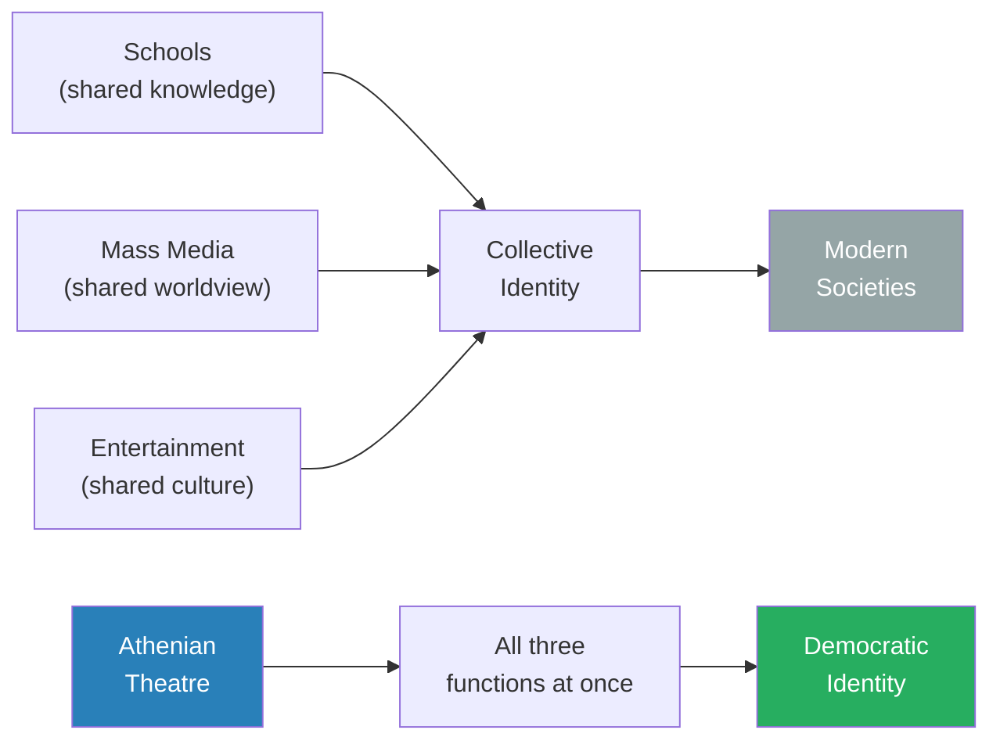
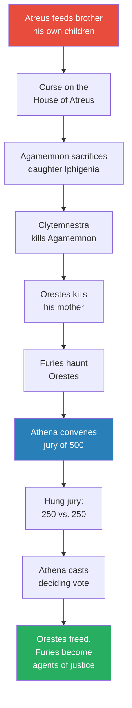
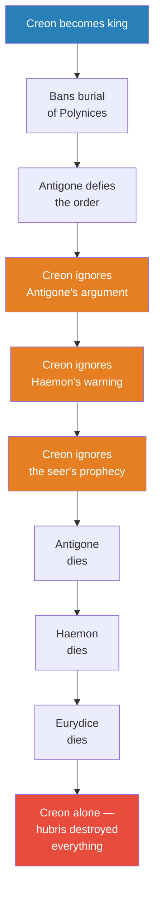
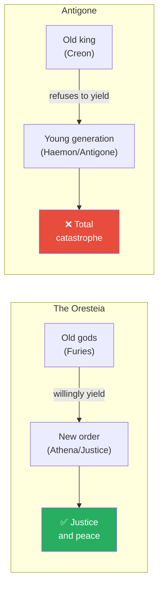
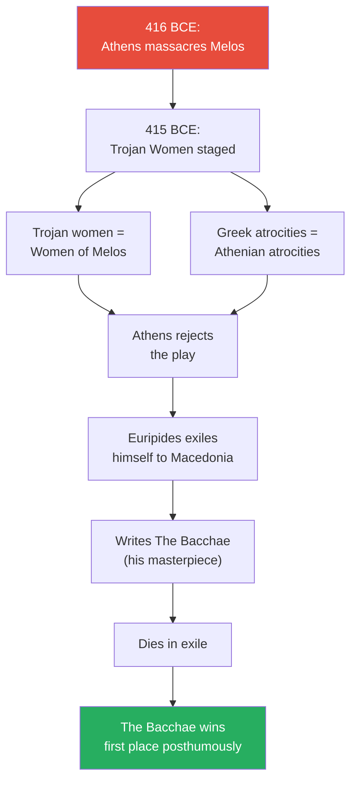
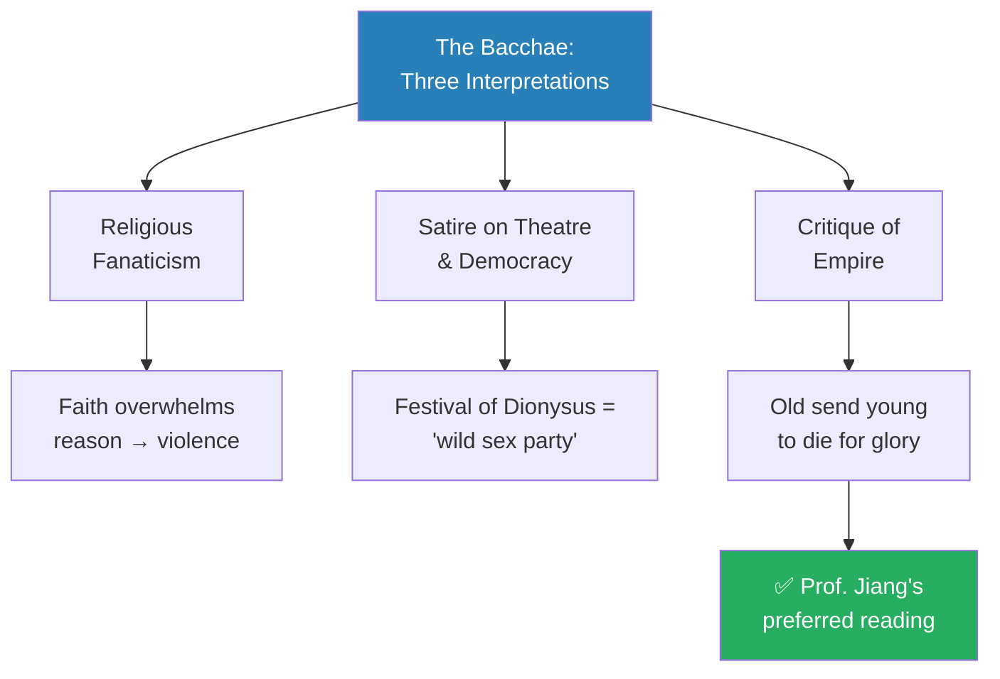
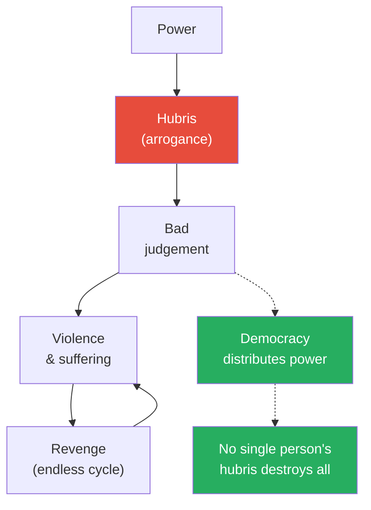

# Aeschylus, Sophocles, and Euripides as Prophets of Democracy

> Every society needs institutions to shape how its citizens think. Modern nations use schools, mass media, and entertainment. Athens had something more powerful — two months of free theatre every year where the entire city gathered to watch plays, vote on winners, and absorb a single message: this is what democracy means, this is why it matters, and this is how you protect it. Three playwrights — Aeschylus, Sophocles, and Euripides — served as prophets of that democracy, each delivering a different lesson: democracy is a divine gift, kingship breeds catastrophe, and genuine democracy demands honest self-criticism even when it hurts.

---

## Overview: Key Highlights

- <b style="color: #2980b9">Festival of Dionysus</b> — free, twice-yearly theatre festivals where 10,000–15,000 Athenians gathered; the greatest birthright of being an Athenian
- <b style="color: #27ae60">Theatre performed all three functions of identity formation simultaneously</b> — school, mass media, and entertainment collapsed into one communal ritual
- <b style="color: #2980b9">Protagonist / antagonist</b> — originally just "first competitor" and "second competitor" at the festival, not hero and villain
- <b style="color: #27ae60">Aeschylus: democracy is a gift from the gods</b> — the Oresteia shows Athena personally founding the jury system, making each citizen's vote as powerful as a goddess's
- <b style="color: #e74c3c">Sophocles: kingship always produces hubris</b> — Creon ignores Antigone, his son, and a seer, and ends up completely alone; the play is a structural argument against monarchy
- <b style="color: #2980b9">Antigone's divine law argument</b> — "human laws must conform to justice; there are divine, unwritten, immutable laws that we must respect" — the first recorded natural law argument
- <b style="color: #e74c3c">Euripides was the most talented and the most despised</b> — he criticised the empire directly, lost every competition during his lifetime, and died in exile
- <b style="color: #27ae60">The Bacchae's central image</b> — a mother parading her son's severed head, believing it is a lion's — Euripides's metaphor for empire sending young people to die for the glory of the old
- <b style="color: #2980b9">Pericles's Funeral Oration reimagined</b> — Euripides heard it and turned it into the celebrating mother: "what Pericles is really saying is, we're an empire, the young must die for our glory"
- <b style="color: #e74c3c">Hubris is structural, not personal</b> — "if you put someone in a position of power, he or she will always develop hubris" — the plays identify this as a universal feature of concentrated power
- <b style="color: #27ae60">The old must yield to the young</b> — when the Furies accept Athena's new order, justice is established; when Creon refuses to listen, everyone dies
- <b style="color: #27ae60">Even in criticising democracy, Euripides defended it</b> — democracy only works when citizens engage in honest debate and self-reflection; the mirror he held up was an act of loyalty

| Concept | One-line summary |
|---------|-----------------|
| **Festival of Dionysus** | Two annual month-long theatre festivals — free, communal, decided by popular vote — that formed Athenian identity |
| **Protagonist / Antagonist** | Originally "first competitor" and "second competitor" at the festival — not hero and villain |
| **Hubris** | Violent, excessive arrogance — the structural consequence of unchecked power, not a personal flaw |
| **Divine unwritten laws** | Antigone's argument: moral laws exist above human legislation and cannot be overridden by any king |
| **The Furies** | Ancient gods of cosmic order — transformed by Athena into agents of democratic justice |
| **Oresteia** | Aeschylus's trilogy in which a cycle of revenge is finally broken by Athena's democratic jury |
| **Antigone** | Sophocles's play in which Creon's hubris destroys everyone he loves — the case against monarchy |
| **Pericles's Funeral Oration** | Athens's most celebrated speech — reimagined by Euripides as imperial self-delusion |
| **The Bacchae** | Euripides's masterpiece: a mother holds her murdered son's head, believing it is a lion's — a metaphor for empire |
| **The old yielding to the young** | The recurring structural pattern: when the old yield, justice follows; when they cling to power, catastrophe follows |
| **Democratic self-criticism** | Euripides's legacy: a democracy that refuses to hear criticism has already failed |

---

# The Lecture

## Theatre as the Institution of Democracy [0:00–7:10]

*Prof. Jiang opens not with the playwrights but with a structural question: how does any society create a shared identity? He identifies three institutions in modern societies, then shows that Athens collapsed all three into a single extraordinary mechanism — the theatre.*

> [!tip] Core Insight
> Greek tragedy was not art that happened to contain political messages. It was a political institution that happened to use art as its medium. The Festival of Dionysus was school, newspaper, and cinema simultaneously — and its explicit purpose was to teach Athenians what it meant to live in a democracy.

*Modern societies need three separate institutions to accomplish what Athens achieved through one — producing a more integrated democratic consciousness than any modern nation has replicated.*

> [!note]- Expand: Full Lecture Detail
> Prof. Jiang opens with the broadest possible frame: "Every society has a problem — how do we organise the thinking of the people within our society? How do you create an identity?" He identifies three institutions that perform this function in modern societies. Schools transmit shared knowledge and a common worldview — "you're here to learn about the history of China, the politics of China, to make everyone think alike." Mass media presents a particular worldview, and when people absorb it, they become more American, or more Chinese. Entertainment — TV shows, movies, books — shapes shared culture.
>
> In America, these institutions create an individualistic identity. In China, a collectivist one. Prof. Jiang then makes his pivot: Athens had all three functions rolled into one. Theatre.
>
> - The <b style="color: #2980b9">Festival of Dionysus</b> ran twice a year — once in winter, once in summer — each lasting a full month
> - It was **free for all**: wealthy aristocratic families funded the performances to win popular favour
> - **No professional actors** — citizens were selected from the community to perform
> - **Winners decided by popular vote** — the process was democratic from top to bottom
> - The largest amphitheatre held **10,000–15,000 people** out of a total Athenian population of roughly 50,000
> - Attending theatre was considered <b style="color: #27ae60">the greatest birthright of being an Athenian</b>
> - Winning first place at the festival was "the highest honour in Athens — like winning the Nobel Prize in Physics today"
> - The terms <b style="color: #2980b9">protagonist</b> and <b style="color: #2980b9">antagonist</b> originally meant simply "first competitor" and "second competitor" — not hero and villain
>
> A student asks how 15,000 people in an open-air theatre could hear anything. Prof. Jiang explains the design: the oval cavern shape created natural resonance — sound was "captured in a cave" so it could travel to every seat. Actors shouted their lines slowly and clearly. But there was a second, more important reason: "these plays were so popular, everyone memorised the lines. They already knew the content of the plays and wanted to participate in the community aspect." The theatre was not about new information — it was about communal ritual. 15,000 people experiencing familiar stories together, simultaneously, as a single democratic body.
>
> The three most famous playwrights — <b style="color: #2980b9">Aeschylus, Sophocles, and Euripides</b> — were, in Prof. Jiang's direct phrase, "first and foremost prophets of democracy." They were poets and playwrights, yes, but their primary function was political: telling the Athenian people why they had democracy, why democracy was good, and how to protect it. "Every festival there'll be two competitors — the protagonist and the antagonist — and the entire point of theatre was to promote democracy in Athens."
>
> All the plays drew on Greek mythology — stories everyone already knew. "What the playwrights did was they took material from Greek mythology and packaged it in a contemporary context to explore modern themes." The power lay not in surprise but in interpretation: familiar myths became vehicles for political education.

---

## Aeschylus — Democracy as Divine Gift [8:00–21:00]

*Prof. Jiang turns to the oldest of the three prophets. Aeschylus chose the curse on the House of Atreus — one of Greek mythology's darkest stories — as the vehicle for a radical political claim: democracy is not a human invention but a gift from the goddess Athena herself.*

*The cycle of revenge continues through generations until one thing — democratic process — breaks it. Each act of vengeance is individually justifiable; only collective judgement can end the chain.*

> [!note]- Expand: Full Lecture Detail
> Prof. Jiang begins: "Let's talk about Aeschylus — he was really the first of the major playwrights. He wrote a play called the Oresteia." He then retells the myth in full, and the detail matters because the point of the play is to show that this chain of horror is precisely what democracy must break.
>
> The story begins with the curse on the House of Atreus:
>
> > [!example] The House of Atreus — Feast, Murder, and a Curse
> > - King Atreus of Argos defeats his younger brother in a war for the throne
> > - He pretends to forgive him and hosts a reconciliation feast — "a feast is a contract between you and the gods"
> > - During the feast, Atreus serves his brother the cooked flesh of his own sons
> > - When the brother realises what he has eaten, he curses Atreus before dying: "curse upon you and your house"
> > - His one surviving son, **Aegisthus**, escapes — now honour-bound to avenge his family
> > - Atreus's son **Agamemnon** becomes King of Kings and organises the invasion of Troy
> > - To gain wind for the fleet, Agamemnon sacrifices his daughter **Iphigenia** — "he should have said, I'm not going to do that"
> > - His wife **Clytemnestra** spends ten years plotting revenge while he besieges Troy
> > - She takes Aegisthus as her lover and, when Agamemnon returns victorious, kills him
> > - Agamemnon's son **Orestes** is now honour-bound to avenge his father — by killing his own mother
> > **The lesson:** Each act of revenge creates a new obligation for revenge — violence is self-perpetuating without a mechanism to break the cycle.
>
> Orestes, torn and anguished, consults Apollo, who confirms he is right to avenge his father. He kills Clytemnestra. But now the <b style="color: #e74c3c">Furies</b> — ancient demons who enforce cosmic order — rise from the underworld to haunt him. "We are old gods. We care about the laws of the universe. You killed your mother. We will haunt you for eternity."
>
> Apollo intercedes on Orestes's behalf. The Furies dismiss him: "You are a young god. We are old gods, much older and wiser than you. You have no authority over us." This confrontation between old gods and new gods is central to the play's political meaning — and mirrors Creon's contempt for Haemon later.
>
> In desperation, Orestes flees to Athens and begs <b style="color: #2980b9">Athena</b>. Her solution is revolutionary: she convenes a jury of 500 Athenian citizens. Both sides make their case. The vote splits evenly — 250 guilty, 250 innocent. Athena casts the deciding vote for Orestes.
>
> The Furies protest. Athena offers them a deal: "You are feared and hated now, but I will make you stand for justice, truth, and righteousness — the Athenian people will worship and admire you." The Furies accept. The old gods do not disappear — they are incorporated into the new democratic order.
>
> Prof. Jiang explains what this means for Athens: "It tells them where democracy comes from. Athena, the goddess herself, gave democracy to Athens. By giving the Athenian people democracy, it basically gave them the power of gods — because each of those 500 jurors has the same power as the goddess Athena. Athena can only cast one vote."
>
> - <b style="color: #27ae60">Democracy is a gift from the gods themselves</b> — not a human experiment but a sacred institution
> - Each citizen's vote carries the same authority as a goddess — a radical claim about ordinary people's dignity
> - Voting thoughtfully and seriously brings justice and truth into the world — a sacred act, not a bureaucratic one
> - The old order (blood vengeance) must give way to the new order (democratic judgement) — but the transition works only when the old willingly accept the new

---

## Sophocles — Why Kingship Destroys [21:00–35:00]

*Where Aeschylus celebrated democracy, Sophocles showed what happens without it. The Oedipus trilogy and Antigone are case studies in the catastrophe of concentrated power — not abstract arguments against monarchy but devastating demonstrations of what hubris does to everyone it touches.*

*Three consecutive refusals to listen — each escalating the stakes — show that Creon's tragedy is not a single bad decision but a structural feature of monarchy. Any human given absolute power will make the same choices.*

> [!note]- Expand: Full Lecture Detail
> "Sophocles wrote many plays. His most famous is the Oedipus trilogy." Prof. Jiang summarises the Oedipus story briskly because his political argument lies in what follows.
>
> > [!example] Oedipus — The King Who Could Not Escape Fate
> > - A prophecy declares the king of Thebes's son will kill his father and marry his mother
> > - The king orders the baby killed; the soldier abandons him in the woods instead — "dishonourable to kill a baby"
> > - A shepherd finds him; a childless king adopts him and names him **Oedipus**
> > - Oedipus, hearing the prophecy, flees to avoid fulfilling it — heading toward Thebes
> > - On the road, he kills an old man in an argument — unknowingly, his real father
> > - At Thebes, he solves the **Sphinx's riddle** ("What walks on four legs in the morning, two at noon, three in the evening?" — answer: man) and is made king
> > - He marries the queen — his real mother — and they have children
> > - Twenty years later, a plague strikes; a seer reveals the gods are angry: Oedipus killed his father and married his mother
> > - Oedipus **blinds himself** and exiles himself; his two sons fight for the throne and kill each other
> > **The lesson:** Even the wisest person — one who solved a riddle no one else could — cannot escape the consequences of a system that concentrates too much power in too few hands.
>
> The political heart of Sophocles lies in what happens next. Creon, the queen's brother, inherits power. He decrees that the loyal son gets a state funeral, but the rebel **Polynices** will be left unburied. Greeks believed only burial allowed the dead to find peace — refusing burial was a devastating punishment.
>
> > [!example] Antigone vs. Creon — Justice Against Authority
> > - **Antigone**, daughter of Oedipus and sister of Polynices, secretly buries her brother
> > - Creon demands: "How dare you defy my laws?"
> > - Antigone responds: "Your laws are unjust. Human laws must conform to justice. There are divine, unwritten, immutable laws of the universe that we must respect — your laws cannot override these"
> > - Creon: "The laws are the laws. Without laws, there will be complete chaos"
> > - His son **Haemon** (Antigone's fiancé) pleads — not for Antigone's sake but for Creon's own: "I'm not doing this for Antigone. I'm doing this for you"
> > - Haemon warns: "The people of Thebes fully support Antigone. They think she is a hero. They think you are a tyrant, father"
> > - Creon: "Should I, the king, listen to the mob?"
> > - Haemon: "No — you should listen to what is right and just"
> > - Creon throws Haemon out — then consults a seer who confirms Antigone is right
> > - He rushes to save her but arrives too late — she has killed herself in a cave
> > - Haemon, weeping over her body, lunges at his father with a sword, misses, and kills himself
> > - Haemon's mother learns of her son's death and kills herself too
> > - **Creon is left entirely alone**
> > **The lesson:** Power produces arrogance. Arrogance produces deafness. Deafness produces catastrophe. This is why Athens has democracy — not a king.
>
> A student asks why characters in the plays trust fortune tellers. Prof. Jiang explains: "Everyone is religious. The fortune tellers speak on behalf of the gods — they interpret the will of the gods. And remember, for most of human history humans were extremely religious people. The Greeks were especially incredibly religious." Creon's terror when the seer warns him is genuine; his tragedy is complete precisely because he listened too late.
>
> Prof. Jiang draws two explicit messages from Antigone:
>
> - <b style="color: #e74c3c">Message 1: Kingship is inherently dangerous</b> — kings do stupid things because power breeds hubris, "violent, excessive arrogance," that makes leaders refuse to listen to what is right and good and just. "Put anyone in Creon's position and they will develop the same deafness." The problem is the system, not the person
> - <b style="color: #27ae60">Message 2: The old must give way to the young</b> — the Oresteia ends well because the Furies accept the new order; Antigone ends in catastrophe because the old king refuses to yield. "Society works when the old give way to the young"
>
> Antigone's argument also articulates the first recorded case for what later thinkers would call <b style="color: #2980b9">natural law</b> — the principle that there exists a moral order above any legislation a human ruler can create. This idea would reverberate from Roman jurisprudence through Thomas Aquinas to Martin Luther King Jr.'s "Letter from Birmingham Jail."

*The same structural choice — old yielding to new versus old clinging to power — produces opposite outcomes. The Furies accept the new order and become agents of justice; Creon refuses his son's plea and becomes an agent of destruction.*

---

## Euripides — The Mirror Athens Didn't Want to See [35:00–46:00]

*The youngest and most talented of the three was also the most despised. Euripides criticised not kingship but the democracy itself — and the democracy punished him for it. His two key plays cut to the heart of what democratic empire actually does to human beings.*

*The tragic arc of Euripides's life: rejected by the democracy he tried to save, dying in exile, vindicated only after death — a pattern Prof. Jiang identifies as recurring throughout history for writers who tell uncomfortable truths.*

> [!note]- Expand: Full Lecture Detail
> "Euripides — he's the youngest of these three, and he was the least respected in Athens when he was alive. The reason why is Aeschylus and Sophocles celebrate Athenian democracy, but Euripides criticised Athenian democracy."
>
> The historical context is essential. In 416 BCE, at the height of the Peloponnesian War, Athens attacked Melos — a neutral island that refused to join the Athenian empire. Athens killed every man and enslaved every woman and child. One year later, in 415 BCE, Euripides staged *Trojan Women* — a play about the aftermath of the Trojan War depicting enslaved Trojan women.
>
> > [!example] Trojan Women — A Mirror Held Up to Athens (415 BCE)
> > - The play opens in the ruins of Troy — every man is dead
> > - **Hecuba**, queen of Troy, has watched all her sons die in the war
> > - One daughter was sacrificed at the tomb of Achilles — killed to accompany him in the afterworld
> > - Her remaining daughters are enslaved and divided among Greek generals as concubines
> > - **Andromache**, wife of the slain prince Hector, watches the Greeks seize her infant son — the law demands all Trojan boys be killed
> > - Andromache witnesses her baby — only months old — murdered by Greek soldiers
> > - Hecuba must personally bury the dead child before being dragged away to become Odysseus's slave
> > - "It is a play that made everyone in Athens weep"
> > - Written exactly one year after Athens massacred every man on Melos and enslaved every woman
> > **The lesson:** Euripides used mythology as a mirror — the Trojan women were the women of Melos, and the Greeks committing atrocities in the play were the Athenians sitting in the audience.
>
> What was Euripides telling the Athenian people? Prof. Jiang is direct: "Do you see how terrible we are? We are a terrible people. Do you see all the hurt and suffering we brought onto the world because of our empire?"
>
> The response was equally direct. Athens rejected the play. Trojan Women lost the festival competition to, as Prof. Jiang says with evident contempt, "this obscure nobody." Euripides, bitter and angry, exiled himself to Macedonia, where he would die far from the city he tried to save.
>
> In exile, he wrote his final play — *The Bacchae*. After his death, friends brought it back to Athens. It won first place. It is considered his masterpiece.
>
> > [!example]- The Bacchae — The God of Theatre Takes His Revenge
> > - **Dionysus** (also called Bacchus) was born in Thebes to a Theban princess and Zeus
> > - When the princess announced her divine pregnancy, no one believed her — the Thebans laughed and refused to worship Dionysus
> > - Bitter about the insult to his mother, Dionysus disguises himself as a wandering stranger
> > - He drives the women of Thebes mad — they abandon the city for orgies and wild rituals in the mountains
> > - King **Pentheus** decides to send his army and kill the Bacchae (followers of Dionysus)
> > - Dionysus in disguise offers a deal: come secretly and watch the women instead
> > - Pentheus agrees — climbs a tree for a better view; Dionysus lowers the branch, placing Pentheus in the circle of frenzied women
> > - Dionysus commands the women to tear Pentheus apart; they rip the king's body to pieces
> > - **Pentheus's own mother** tears off his head with her bare hands
> > - She returns to Thebes shouting: "Look how brave I am! I killed a lion with my bare hands!"
> > - She holds her son's severed head aloft, believing it is a lion's head
> > - It takes the horrified citizens a very long time to convince her that she holds her own son's head
> > **The lesson:** The image of a mother celebrating while holding her murdered son's head is Euripides's metaphor for empire — old people sending young people to die for their glory, then celebrating the sacrifice as heroism.
>
> Prof. Jiang then makes the interpretive move that anchors the entire section. The image — a mother holding her son's head and telling the world how brave she is — maps onto a specific historical speech: **Pericles's Funeral Oration**.
>
> In 431 BCE, after the first year of the Peloponnesian War, Athens held a state funeral for its war dead. Pericles gave the oration — "considered by many to be the greatest speech ever made." He said: Athens is the greatest place ever. We celebrate excellence. Anyone can come and achieve greatness through hard work. We are open, tolerant, cosmopolitan. We have a democracy where everyone can participate. Therefore, we must protect our democracy through war. It is good that the young fight for our empire because that's what gives meaning to their lives.
>
> "Euripides was probably in the audience," Prof. Jiang says. "Because everyone was in the audience when the speech was given."
>
> And what Euripides heard was: <b style="color: #e74c3c">a mother holding her son's head and telling the world how brave she is.</b> "What Pericles is really saying is, we're an empire — an empire is so good because it brings glory to the old people, and so the young must protect the glory of the old people by dying in a war."
>
> The self-deception is crucial. Pentheus's mother genuinely believes she holds a lion's head. She genuinely celebrates. She cannot see what she has done. "That's exactly how imperial rhetoric operates. Pericles's speech is beautiful, eloquent, and powerful. It is also a celebration of child sacrifice disguised as patriotism."

---

## The Three Interpretations of The Bacchae [46:00–50:30]

*Prof. Jiang acknowledges that scholars read The Bacchae in at least three ways and presents all of them with intellectual honesty — before explaining why he prefers the empire reading. The play sustains all three simultaneously.*

*Each interpretation is supported by the text — the play's enduring genius is that it sustains all three simultaneously. Prof. Jiang chooses the empire reading because it connects most directly to the specific historical moment.*

> [!note]- Expand: Full Lecture Detail
> "There are different interpretations of what this means. I'll tell you my interpretation."
>
> - **The most common scholarly interpretation**: The Bacchae is about the power and danger of religious devotion pushed to extremes. "This play is really about the power of religion and faith and how it drives us into madness." The women are not evil — they are overcome by a force they cannot resist. What is the boundary between genuine religious experience and destructive madness?
>
> - **The second interpretation**: A bitter satire on the Festival of Dionysus itself. For most of his career, Euripides competed at the festival and lost because audiences found him offensive. "Another interpretation is this play is a satire on the power of Dionysus and of theatre in general — it's a direct criticism of the Festival of Dionysus. What Euripides is really saying is, the festival is not about art and reflection and democracy. It's really just a wild sex party that's trying to please everyone." Under this reading, the play is also a direct attack on democracy itself.
>
> - **Prof. Jiang's preferred reading**: The empire interpretation. "I think the most likely explanation is it is a direct criticism of empire." It connects most powerfully to the specific historical context — Melos, the Peloponnesian War, Pericles's Funeral Oration. The play was written in exile by a man driven from Athens for criticising imperial violence. The central image maps precisely onto the relationship between Pericles's rhetoric and Athens's military reality.
>
> His closing line on the question is characteristic of his teaching throughout the series: "You can believe whatever you want, and that's the power of Athenian theatre. There are different ways to interpret it." The play sustains all three readings — a testament to the imaginative depth that makes Euripides, by scholarly consensus, the most talented of the three.

---

## Hubris, Revenge, and the Heart of Greek Tragedy [50:30–54:00]

*A student asks about revenge as a common theme, and Prof. Jiang uses the question to articulate the master framework unifying all three playwrights: revenge is the plot device, but hubris is the theme.*

*The Greeks chose democracy not because it eliminates hubris — they knew it doesn't — but because distributing power prevents any single person's arrogance from becoming catastrophic. The solid arrows are the natural cycle; the dashed arrows are democracy's intervention.*

> [!note]- Expand: Full Lecture Detail
> A student observes that revenge appears in every single play. Prof. Jiang affirms this immediately and makes a key distinction:
>
> "If you think about human motivation, what really drives us to violence? Revenge. Revenge is the main plot device we use to drive action — it's what motivates us to do violent things." Clytemnestra murders Agamemnon because he killed their daughter. Orestes murders Clytemnestra because she killed his father. The Furies haunt Orestes because he killed his mother. Dionysus destroys Thebes because the Thebans insulted his mother. Every killing demands another killing.
>
> But the deeper question is: what produces the arrogance that makes humans believe they are above consequences?
>
> "Another very common theme is hubris — arrogance. This is what the Greek playwrights focus a lot on. What they discovered is things go awry in society when the leaders develop hubris, because it leads to bad judgement. But what they also discovered is hubris is just a part of human nature. <b style="color: #e74c3c">If you put someone in a position of power, he or she will always develop hubris.</b>"
>
> Prof. Jiang emphasises that these playwrights were doing something unprecedented — not political propaganda but genuine philosophical investigation: "They're trying to explore what it means to be human. They're trying to decipher the essence of being human. They're trying to look into the human heart and figure out what makes us human."
>
> | Play | Who Has Hubris | How It Manifests | Consequence |
> |------|---------------|------------------|-------------|
> | **Oresteia** | Agamemnon | Sacrifices his daughter for a war that wasn't his quarrel | Murdered by his wife; the curse continues |
> | **Antigone** | Creon | Ignores Antigone, Haemon, and the seer | Loses everyone he loves; utterly alone |
> | **Trojan Women** | Athens (collective) | Massacres Melos — kills all men, enslaves all women | Euripides forces Athens to see itself as the villain |
> | **The Bacchae** | Pentheus / Athens | King's curiosity and empire's self-deception | Mother holds son's head — empire devours its young |

---

## Euripides's Reputation — Genius Recognised Only in Death [52:36–55:00]

*A student asks about Euripides's standing among scholars and contemporaries. Prof. Jiang draws out a pattern that recurs throughout the Civilization series: the most valuable voices in a democracy are often the ones it most wants to silence.*

> [!note]- Expand: Full Lecture Detail
> "The thing about Euripides — we today, scholars will all agree — among these three, Euripides was the most talented. His use of poetry, metaphors, imagery — it was the most imaginative. We also agree that he is the most shocking — his ideas, the way he presents things, the most visual and imaginative. In terms of pure talent, he's the most talented."
>
> But when he was alive: "He was extremely arrogant — a person who believed theatre should be about awakening people, should be about challenging people's sense of reality, about education and edification." This made him deeply unpopular with contemporaries. He lost festival competitions repeatedly because audiences found his work offensive.
>
> "After he was dead, his reputation was rejuvenated. Later generations respected him more. Even though Trojan Women did not win first place, the Bacchae did win first place — that's because Euripides was dead, and they were able to see the genius and imagination of the Bacchae much more closely."
>
> The pattern Prof. Jiang identifies: "If you are a controversial writer, you are not respected by contemporaries, but after you're dead, people appreciate your genius. This is true for most really famous writers."
>
> > [!quote] Prof. Jiang
> > "People respected his genius, but they didn't like the fact that he was so arrogant and candid."
>
> The implication is unsettling: the most valuable voices in a democracy — the ones who tell the truth it does not want to hear — are precisely the ones the democracy is most likely to silence. This pattern runs directly into the next lecture: Socrates, like Euripides, will be punished for demanding that Athens confront uncomfortable truths. Euripides's punishment was exile. Socrates's will be death.

---

## The Complete Democratic Education [44:00–46:00, 50:30–52:00]

*Prof. Jiang closes the lecture's main argument with the observation that Euripides — even in criticising democracy — was defending it. The three playwrights together form a complete democratic education.*

*Celebration → Defence → Critique: the three capacities every democracy needs to survive. Remove any one and the system fails.*

> [!tip] Core Insight
> Even in criticising democracy, Euripides was defending it. Democracy only works when citizens engage in honest argumentation, debate, and self-reflection. "What Euripides tried to do is put a mirror before the Athenian people and say: look how awful we are. We can do better." That honest confrontation with failure is what democracy really is.

> [!note]- Expand: Full Lecture Detail
> "If you think about it — even though Euripides is criticising Athenian democracy, what he's really doing is also trying to defend Athenian democracy. Because a democracy only happens when citizens are engaged in a process of argumentation, debate, and self-reflection. So what Euripides is really trying to do is put a mirror before the Athenian people and say: look how awful we are. We can do better. And that's what a democracy really is — it's an open and honest discussion about how we can be better."
>
> Prof. Jiang closes the substantive lecture with a reminder of the scope of these achievements: "These three — Aeschylus, Sophocles, and Euripides — are considered the three greatest playwrights in Athenian history, and these plays are actually still performed today. The Oresteia, Oedipus Rex, and The Bacchae are still performed in theatres around the world. That's how amazing they were."
>
> The three prophets form a deliberate arc:
> - **Aeschylus** teaches reverence — democracy is sacred, treat your vote as divine
> - **Sophocles** teaches vigilance — concentrated power always destroys, never allow a king
> - **Euripides** teaches honesty — democracy must criticise itself or it is not a democracy at all
>
> Remove any one of the three and the system fails. Celebration without critique becomes propaganda. Critique without celebration becomes nihilism. Defence without either becomes empty institutional maintenance.

---

## Connections

**Builds on:**
- [[07 - Homer's Iliad and the Birth of Greek Civilization]] — Homer's Iliad provides the mythological source material for both Aeschylus (the Trojan War backstory drives the entire Oresteia) and Euripides (Trojan Women is effectively a sequel to the Iliad told from the losers' perspective). Homer pioneered the empathy-through-perspective-switching technique — showing Hector as noble and sympathetic — that the tragedians continued in communal performance.
- [[08 - Rat Utopia and the Peloponnesian War]] — The Peloponnesian War is the essential political context for Euripides's critique. The massacre of Melos in 416 BCE, discussed in Lecture 8, directly inspired Trojan Women the following year — the tightest connection between history and art in the entire Greek arc.
- [[06 - Elite Overproduction and the Bronze Age Collapse]] — The hubris that the tragedians identify in kings and empires echoes the elite overproduction pattern from Lecture 6. Creon's deafness to his own son mirrors the Bronze Age palace elites who extracted ever more resources without adapting to changing conditions.

**Sets up:**
- [[10 - The Trial of Socrates and Plato's Allegory of the Cave]] — Athens's rejection of Euripides foreshadows its execution of Socrates. Both men were punished for demanding that democracy confront uncomfortable truths — Euripides through art, Socrates through philosophy. The progression from exile to execution suggests Athens's intolerance for self-criticism deepened over time.

**Thematic links:**
- [[01 - Explaining Humanity's Transition to Agriculture]] — Theatre as identity-forming institution parallels religion's role in creating communal identity explored in Lecture 1. The Festival of Dionysus was a religious festival and a political institution simultaneously — both functions reinforced each other.

**Related books in vault:**
- [[Sapiens - Yuval Noah Harari]] — Harari's analysis of how shared myths enable mass cooperation maps directly onto what the Festival of Dionysus accomplished for Athenian democracy
- [[The Republic - Plato]] — Plato, who will feature in the next lecture, was himself deeply influenced by the tragic tradition and would argue for censoring poets like Euripides precisely because their power over democratic audiences was so great

---

## The Takeaway

This lecture repositions Greek theatre from an artistic tradition to a political institution — arguably the most important political institution in the ancient world. Prof. Jiang's central claim is that Aeschylus, Sophocles, and Euripides were not playwrights who happened to comment on politics. They were democracy's primary teachers, and the Festival of Dionysus was the mechanism through which Athens created and renewed its democratic identity year after year, for generations. The plays were performed not for aesthetic pleasure but to answer the most urgent question any democracy faces: why do we govern ourselves this way, and how do we do it well?

The most counterintuitive insight in the lecture is that Euripides — the playwright who criticised democracy most savagely — was actually its most faithful defender. This paradox dissolves once you understand Prof. Jiang's argument: democracy is not a set of institutions but a practice of honest self-examination. A democracy that refuses to hear criticism has already failed, even if its institutions remain intact. The Bacchae's image of a mother celebrating while holding her murdered son's head is not just a critique of Athens — it is a warning to every democracy that mistakes imperial rhetoric for democratic values. The self-deception is total, and that is exactly the point: the mother genuinely believes she holds a lion. Pericles genuinely believes Athens's young men "died well." The most dangerous propaganda is the propaganda you cannot see.

The theme of generational transfer — the old yielding to the young — adds a dimension that connects this lecture to the course's broadest concerns about why civilisations rise and fall. The Furies' acceptance of Athena's new democratic order is a model for healthy transition. Creon's refusal is a model for catastrophe. Pericles's funeral oration is a model for how democratic rhetoric can disguise the sacrifice of the young for the glory of the old. The hubris theme introduced here — the structural consequence of concentrated power, inevitable whenever one person holds authority without accountability — becomes perhaps the single most important recurring concept in the entire Civilization series. It will reappear in Rome, in the British Empire, and in every civilisation Prof. Jiang examines that has destroyed itself from within.
