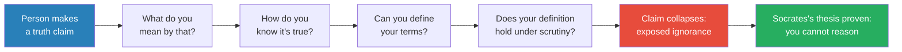
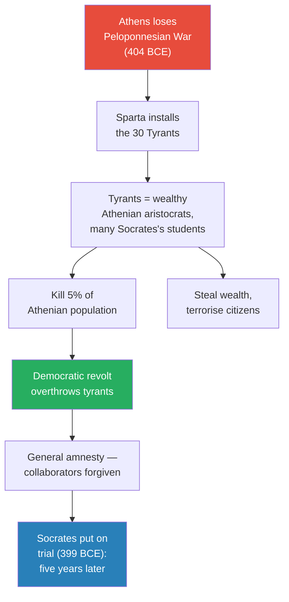
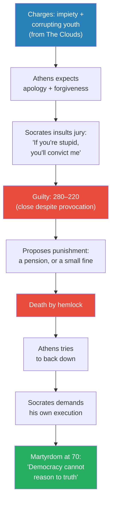
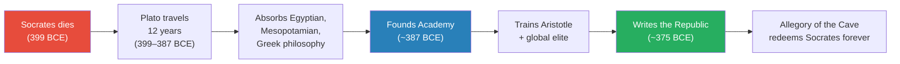
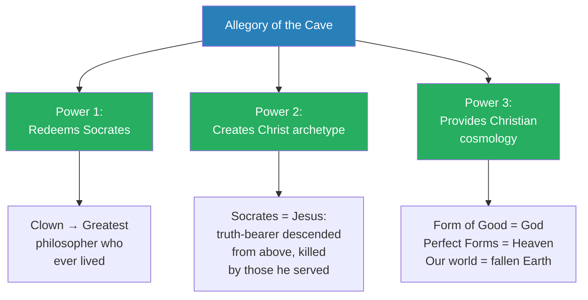
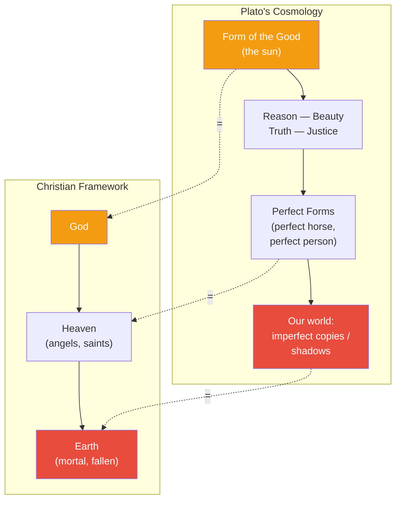
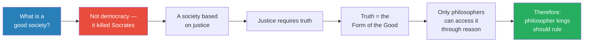
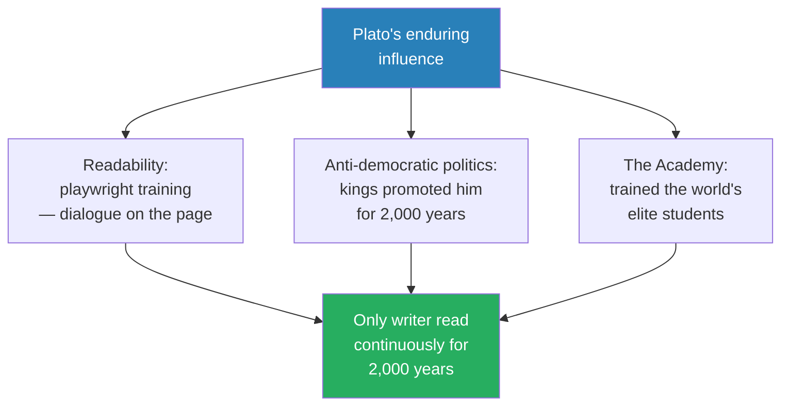

# The Trial of Socrates and Plato's Allegory of the Cave

> Prof. Jiang tells the story of democracy's foundational crisis: Athens executed Socrates — the philosopher who spent his life proving that ordinary citizens cannot reason — and in doing so, proved his point. Socrates at seventy turned his own trial into performance art, provoking a democratic jury into an irrational verdict that vindicated everything he had argued. His student Plato, twenty-eight years old and devastated, spent the rest of his life crafting a response: the Allegory of the Cave — the most famous metaphor in Western thought. That single allegory accomplished three civilisation-shaping things: it redeemed Socrates as the greatest philosopher who ever lived, it supplied the narrative template that early Christians mapped onto the life of Jesus, and it provided the cosmological framework that Christianity would adopt wholesale.

---

## Overview: Key Highlights

- <b style="color: #2980b9">Socratic dialogue</b> — a method of relentless questioning designed to expose the gap between confident assertion and genuine understanding
- <b style="color: #e74c3c">Democracy's fatal flaw, per Socrates</b> — citizens cannot exercise reason, therefore democratic deliberation cannot produce truth
- <b style="color: #27ae60">The Clouds (423 BCE)</b> — Aristophanes's satire shows Athenians saw Socrates as a fraud, a cloud-worshipper, and a corrupter of youth — twenty-four years before they killed him
- <b style="color: #e74c3c">The 30 Tyrants (404 BCE)</b> — Spartan-installed dictatorship drawn from Socrates's own students; killed 5% of Athens's population and made the philosopher guilty by association
- <b style="color: #2980b9">Performance art at trial</b> — Socrates deliberately provoked the jury, proposed a pension as his punishment, and had to demand his own execution when Athens tried to back down
- <b style="color: #27ae60">The Allegory of the Cave</b> — prisoners see only shadows; one escapes to sunlight (truth), tries to return and share it, and is killed — Socrates recast as the world's greatest philosopher
- <b style="color: #2980b9">Form of the Good</b> — the Platonic ultimate reality: eternal, immutable, perfect — the source of all truth, beauty, and justice
- <b style="color: #27ae60">Plato is the real founder of Christianity</b> — his cosmology (Form of the Good = God, perfect Forms = Heaven, our world = fallen Earth) becomes the intellectual architecture of Christian theology
- <b style="color: #2980b9">Philosopher kings</b> — Plato's answer to "what is a good society?": only those who can access truth through reason should rule
- <b style="color: #e74c3c">Plato in Syracuse</b> — he told the king to hand him power so there'd be a philosopher king; nearly got killed; proven terrible as a practitioner of his own philosophy
- <b style="color: #27ae60">Plato's three structural advantages</b> — readable writing (playwright training), anti-democratic politics (kings promoted him), and the Academy (trained the world's elites)
- <b style="color: #e74c3c">Censorship and lost philosophers</b> — Egyptian and Mesopotamian thinkers who influenced Plato were probably his equals, but no institutional mechanism preserved their work

| Concept | One-line summary |
|---------|-----------------|
| **Socratic dialogue** | Systematic questioning that exposes the gap between confident assertion and genuine knowledge |
| **Gadfly** | Socrates's self-description: a pest that bites the sluggish horse of Athens to keep it moving toward truth |
| **The Clouds** | Aristophanes's 423 BCE comedy portraying Socrates as a fraud who worships clouds and teaches youth to beat their fathers |
| **30 Tyrants** | Spartan-installed dictatorship (404 BCE) drawn from Socrates's aristocratic students — the link that doomed him |
| **Performance art** | Prof. Jiang's term for Socrates's trial strategy: every provocation was calculated to produce martyrdom |
| **Allegory of the Cave** | Plato's metaphor: prisoners in a cave see only shadows; one escapes to sunlight (truth), returns, and is killed |
| **Form of the Good** | The Platonic ultimate reality — the sun in the allegory, the source of all truth, beauty, and justice |
| **Theory of Forms** | Our world is an imperfect imitation of a higher, eternal, perfect reality |
| **Philosopher kings** | Plato's ideal rulers — only those who can access truth through reason should govern |
| **The Republic (~375 BCE)** | Plato's masterwork — asks "what is a good society?" and answers with philosopher kings |
| **The Academy (~387 BCE)** | Plato's school in Athens — the Harvard of the ancient world, which trained Aristotle and the global elite |

---

# The Lecture

## Recap: The Playwrights and Their Three Arguments for Democracy [0:00–0:45]

*Prof. Jiang opens by connecting this lecture to the previous one — the playwrights of Athens defended democracy as divine and just. Now he introduces their greatest intellectual opponent.*

> [!tip] Core Insight
> The playwrights taught Athenians that democracy is a gift from the gods, that kings fail through hubris, and that citizens deliberating in good faith produce truth. Socrates rejected every one of those premises — and spent every day in the agora proving it.

> [!note]- Expand: Full Lecture Detail
> - Prof. Jiang opens by recapping Lecture 9: Aeschylus, Sophocles, and Euripides were "prophets of democracy" who saw themselves as teachers
> - Three major benefits the playwrights identified:
>   - **First:** Kings have hubris — Creon in Antigone sentences Antigone to death unjustly because of hubris
>   - **Second:** Democracy is a gift from Athena to promote justice and truth — the Oresteia shows this
>   - **Third:** Citizens who deliberate together in good faith will produce a better world
> - Prof. Jiang: "Now, obviously there are people who disagree with this perspective, and one of the most famous opponents of democracy is Socrates"

---

## Socrates: The Gadfly in the Agora [0:45–5:55]

*Prof. Jiang introduces Socrates as Athens's most dangerous internal critic — not a foreign enemy, but a citizen who used democracy's own language of truth and reason to demolish its foundations.*

*The Socratic method is a chain of increasingly precise questions — each one forces the interlocutor to define terms they previously took for granted, until the original certainty collapses entirely.*

> [!note]- Expand: Full Lecture Detail
> - Socrates lived during the Golden Age of Pericles — Athens at its wealthiest and most powerful
> - His argument ran as a tight logical chain:
>   - Democracy requires citizens to deliberate and reach truth
>   - Reaching truth requires the ability to reason
>   - Most people are not capable of exercising reason
>   - Therefore democracy cannot work
> - Every day he sat outside the **agora** — the marketplace where all civic life converged — engaging anyone who passed
> - He called his method a **Socratic dialogue**: take a statement someone believes is true, then systematically dismantle it through questions
>
> > [!example] Live Demonstration in Class
> > - Prof. Jiang asks: "Give me a statement that is fundamentally and inherently true"
> > - A student offers: "The earth is a sphere"
> > - Socrates would ask: What is a sphere? A three-dimensional round shape. Like a ball? Yes. But you hold a ball — you can't hold the earth. So how do you *know* it's a sphere?
> > - The questioning could continue indefinitely
> > - Prof. Jiang: "This was Socrates did, and we still use this today — in American law schools, they teach you using the Socratic dialogue"
> > **The lesson:** The method never needs to prove the claim is wrong — it only needs to prove that the speaker's confidence far exceeds the reasoning behind the claim.
>
> - The reason it could continue forever: <b style="color: #2980b9">language is a convention for communication, not a mirror of reality</b> — Socrates was exposing the gap between what people say and what they actually know
> - How Athenians saw Socrates — three options, none flattering:
>   - **A bully** — an intellectual who humiliated people for sport
>   - **A clown** — an eccentric talking nonsense
>   - **A trickster** — someone who exploited language to make anyone look stupid
> - Prof. Jiang: "The most common understanding of Socrates was he was a trickster. He tricked you into making statements that were illogical, because fundamentally, language does not capture the truth"
> - Despite public contempt, Socrates had devoted followers — specifically **the children of the rich**
>   - Aristocrats who hated democracy because it treated commoners as their equals
>   - Socrates gave them what Prof. Jiang calls "mental or linguistic Kung Fu" — techniques to intellectually demolish ordinary citizens who dared claim equality
>   - Most famous students: **Plato** and **Alcibiades** (one of Athens's wealthiest citizens and eventual political leader)
> - Athens was "such a wealthy and open and tolerant society, they allowed Socrates to basically do whatever he wanted" — until 404 BCE

---

## Aristophanes's *The Clouds* — How Athens Mocked Socrates [5:55–11:30]

*Prof. Jiang retells the satirical comedy that captures exactly what ordinary Athenians thought of Socrates — produced twenty-four years before they killed him. It is not great literature, but it is the most important historical document for understanding the cultural environment that made the trial possible.*

> [!note]- Expand: Full Lecture Detail
> - Aristophanes was Athens's most famous satirist — he mocked Pericles, Cleon, and Socrates with equal relish
> - *The Clouds* was produced in **423 BCE** — a comedy performed before thousands of Athenians
> - Prof. Jiang: "This is not a great play — not a famous play of Greece. But it tells you what Athenians thought of Socrates at this time"
>
> > [!example] *The Clouds* by Aristophanes (423 BCE) — Plot Summary
> > - An Athenian farmer is drowning in debt because his wife spends lavishly; creditors are banging at his door
> > - He hears of a school called "the Thinkery," run by Socrates, that teaches logic and reason — so you can deceive jurors and escape debts
> > - He tries to send his playboy son, who refuses: "Socrates is a cheat, a liar, a fraud"
> > - The farmer goes himself and finds Socrates hanging from a basket on the ceiling
> > - Socrates explains: "From up here I have a clearer and higher vision of the world — I can draw inspiration from the clouds, who are the true gods, not Zeus"
> > - The farmer is convinced he's a genius; the son grudgingly enrols
> > - When creditors come, the farmer says: "I swore by Zeus to repay you, but Zeus doesn't exist, so I owe you nothing"
> > - The son returns from the Thinkery and immediately beats his father
> > - Father: "Why are you beating me?" Son: "Socrates taught me justice. You beat me as a child because I was naughty. You're naughty for not paying creditors. Therefore I can beat you"
> > - The logic is absurd but internally consistent — precisely what Athenians feared about Socratic reasoning
> > - Enraged, the farmer burns down the Thinkery with Socrates inside
> > **The lesson:** Before Plato rehabilitated him, Socrates was a joke — a man who "makes things out of thin air," worships nothing (clouds), and teaches the young to disrespect everything their parents hold sacred. The trial charges twenty-four years later — impiety and corrupting the youth — are lifted almost word for word from this comedy.
>
> - Prof. Jiang's interpretation: "What they're saying is, Socrates makes things out of thin air. He's just a fraud. He's a manipulator. He's a liar"
> - The Athenian hostility was cultural and public long before it became legal

---

## The 30 Tyrants — The Crisis That Changed Everything [11:30–14:00]

*The Peloponnesian War transforms Athens's relationship with its philosopher. What had been tolerated eccentricity becomes a political liability when Socrates's own students take power and terrorise the city.*

*The critical link: the 30 Tyrants came from the same aristocratic families whose sons had studied with Socrates. The philosopher became guilty by association, even though he personally refused to participate in the tyranny.*

> [!note]- Expand: Full Lecture Detail
> - Athens lost the Peloponnesian War to Sparta in **404 BCE** — its most devastating military defeat
> - Sparta had the right to burn Athens to the ground — but chose instead to install a puppet dictatorship
> - The **30 Tyrants** came from Athens's wealthiest families — "who also happened to be students of Socrates"
> - Prof. Jiang is careful: "Socrates did not actually participate in tyranny — Socrates refused to participate in tyranny"
> - But the tyrants were terrible rulers:
>   - Killed at least 5% of the Athenian population
>   - Stole enormous wealth
>   - So terrible that the Athenian people revolted and reinstalled democracy
> - After the revolt, the restored democracy declared a **general amnesty** — forgiving those who had participated in the regime
> - Prof. Jiang notes the maturity of this: even the actual collaborators were forgiven
> - Then, five years later: "something strange happened" — Socrates is put on trial

---

## The Trial of Socrates — Performance Art in the Court of Law [14:00–22:00]

*Prof. Jiang argues that Socrates's trial was not a miscarriage of justice but a calculated act of self-martyrdom. Every provocation was designed to produce the verdict he wanted.*

*At every stage, Socrates chose the option most likely to provoke an irrational response — insult during defence, demand reward during sentencing, insist on execution when the city tried to relent. The angrier the jury became, the more they validated his thesis.*

> [!tip] Core Insight
> Prof. Jiang: "In many ways, you can make the argument that for Socrates, this trial was a type of performance art. He was a performance artist."

> [!note]- Expand: Full Lecture Detail
> - In **399 BCE** — five years after democracy was restored and the general amnesty declared — Socrates is charged
> - Two charges:
>   1. **Impiety** — insulting the gods of Athens (Zeus), exactly what he did in *The Clouds*
>   2. **Corrupting the youth** — miseducating young Athenians, also from *The Clouds*
> - Prof. Jiang's interpretation: "It almost seems like this entire trial was a cruel joke put on by the people of Athens to teach Socrates a lesson"
> - The expectation: Socrates would apologise, make some jokes, and be forgiven
>
> > [!example] The Trial of Socrates (399 BCE) — Three Acts of Provocation
> > - **Act 1 — The Defence:** Socrates told the jury of 500: "I am not a good speaker. I am bad with words. I'm just a poor person who comes from a poor family, who spends every day seeking out the truth"
> > - He added: "I should not have to defend myself, because you're all capable of reason — think for yourself and you'll realise I'm not guilty"
> > - The sting: "If you're stupid, you'll vote me guilty. If you're stupid, there's nothing I can do about it"
> > - **Act 2 — The Verdict:** Jury voted 280 to 220 — guilty. "Still pretty close. Socrates was basically being a jerk during a trial, and they still voted him guilty, but it was a pretty close trial"
> > - **Act 3 — The Punishment:** Athenian law required the convicted man to propose his own sentence
> > - Socrates declared: "I am a gadfly — I go around pointing out the nasty truths of Athenian society. I put a mirror to your face and show you your warts, your pimples, your ugliness. I am the most selfless public servant. A just punishment would be a pension"
> > - Then: "I'm a generous and forgiving individual — if you don't want to give me a pension, I'll accept a small fine"
> > - **The Verdict:** Outraged jurors sentenced him to death by hemlock
> > - **The Twist:** Athens tried to back down after the verdict. Socrates "had to demand to be given hemlock, and he had to administer the hemlock by himself"
> > **The lesson:** At seventy, Socrates turned his trial into the ultimate proof of his thesis. If democracy could reason, it would acquit. It convicted. Therefore it cannot reason. His death was his greatest argument.
>
> - Socrates was 70 years old — "very old for back then" — with little to live for
> - Prof. Jiang: "The people of Athens realised that they were probably tricked, and they're trying to get out of condemning Socrates to death. But Socrates insisted"
> - The vote's closeness (280 to 220) matters: nearly half the jury saw what Socrates was doing — but the slim majority gave him exactly what he needed

---

## Plato's Response — Twelve Years of Travel, One Lifetime of Work [22:00–25:39]

*Plato was twenty-eight or twenty-nine when his mentor died. He would spend twelve years travelling the ancient world and the rest of his life making sure humanity remembered Socrates not as a clown but as its greatest philosopher.*

*The twenty-four-year gap between Socrates's death and the Republic's publication is crucial: Plato did not rush to respond. He prepared, travelled, absorbed, and built an institution before he wrote his masterwork.*

> [!note]- Expand: Full Lecture Detail
> - After Socrates's death, Plato "committed the rest of his life to restoring and redeeming the reputation of Socrates"
> - He spent twelve years travelling — absorbing philosophy from across the ancient world
> - Prof. Jiang emphasises Athens was not isolated: "Egypt was really the epicentre of learning and philosophy at this time — very close to Greece. Also Mesopotamia. The Persians"
> - We've lost most Egyptian and Mesopotamian sources, but Prof. Jiang: "We know the Egyptians heavily influenced the Greeks, so we can make the assumption that the Egyptians were heavily influenced on Plato as well"
> - At forty, Plato founded the **Academy** — "like Harvard or Oxford today — a place where all the elite children went"
> - Around **375 BCE**, he wrote **the Republic** — "arguably the greatest work of Western philosophy, and many today consider the Republic the greatest book ever written"
> - Prof. Jiang: "Reading the Republic is a life-transforming event — next semester we will actually read the Republic together"
> - The Republic's driving question: **what is a good society?** (not the Allegory of the Cave — the allegory appears *within* the Republic's larger argument)

---

## The Allegory of the Cave [25:39–31:26]

*Prof. Jiang tells the allegory in full. He prefaces it with a striking claim: "You will remember this allegory for the rest of your life. Maybe you'll forget the trial of Socrates, or anything else you learned in this class — but fifty years from now, you will still remember the Allegory of the Cave."*

```mermaid
flowchart TB
    P["Prisoners chained<br/>in cave — can only<br/>see the wall"] --> W["See only shadows<br/>of puppets cast<br/>by a fire"]
    W --> L["Name the shadows,<br/>create language,<br/>play games"]
    L --> A["Award the best<br/>describers — poets,<br/>playwrights, artists"]
    A --> LIE["All of it is<br/>illusion"]
    LIE --> FREE["One prisoner's<br/>chains loosen"]
    FREE --> CLIMB["Climbs toward<br/>the light above"]
    CLIMB --> PAIN["Sunlight burns —<br/>eyes unadjusted"]
    PAIN --> POOL["First sees<br/>reflections in pools"]
    POOL --> WORLD["Gradually sees<br/>the real world"]
    WORLD --> SUN["Finally sees<br/>the sun itself —<br/>source of all life"]
    SUN --> TRUTH["Fully understands<br/>truth for the<br/>first time"]
    TRUTH --> RETURN["Returns to cave<br/>out of pity<br/>for friends"]
    RETURN --> FAIL["Cannot describe<br/>truth — no language<br/>for sunlight"]
    FAIL --> KILL["Prisoners think<br/>he's an idiot —<br/>they kill him"]
    style P fill:#e74c3c,color:#fff
    style SUN fill:#f39c12,color:#fff
    style TRUTH fill:#27ae60,color:#fff
    style KILL fill:#e74c3c,color:#fff
```

*The cave = the world of appearances. The fire and puppets = the forces that create illusion. The sun = the Form of the Good. The freed prisoner = Socrates. The killing = the trial of 399 BCE.*

> [!note]- Expand: Full Lecture Detail
> - Prof. Jiang: "This is really the most famous allegory or metaphor or analogy in Western thought. By far. Nothing comes second."
> - The cave, as Prof. Jiang tells it:
>   - A cave deep underground with a large fire at the back, casting light forward
>   - Prisoners chained to the floor, necks immobilised — they can only stare at the wall in front of them
>   - Puppeteers behind them hold up cardboard pictures of rats, birds, objects; the fire projects shadows onto the wall
>   - The prisoners name the shadows, create language around them, play games to see who can best describe what they see
>   - They give awards to the most eloquent — "and that's the playwrights, right?" — Plato takes a direct shot at the artists Athens celebrates
>   - Prof. Jiang: "What Plato is saying is that we may honour art and poetry and drama, but they're all lies"
> - One day a prisoner's chains loosen; he climbs toward the light
>   - Outside, sunlight is agonising — "It's like burning him alive"
>   - At first he stares at the ground, sees reflections in pools
>   - Slowly acclimatises — begins to see the world: "it's beautiful, but it's so beautiful that it is beyond language"
>   - Finally develops courage to look at the sun itself: "he is amazed by how the sun is a source of all life — for the first time, he fully understands the truth of the world"
>   - He is "seized by regret" — remembers his friends still in the cave, pities them
> - He returns to the cave — voluntarily, despite knowing what will happen:
>   - Eyes now accustomed to sunlight, he stumbles in the darkness, falls, hurts himself
>   - Tries to tell prisoners: "I've been to the outside world. I know what truth is"
>   - They ask him to describe the shadows on the wall — he can no longer do it; he's been too transformed
>   - Prof. Jiang: "The people are convinced, utterly convinced, he's an idiot, he's insane, he's a clown"
>   - He insists on revealing truth — they kill him
> - Prof. Jiang: "You will remember this allegory for the rest of your life"

---

## Three Powers of the Allegory [25:39–31:26 continued]

*Prof. Jiang explains why this single metaphor transformed Western civilisation — it accomplished three distinct kinds of work simultaneously, each sufficient on its own to guarantee immortality.*

*The three powers operate on different scales: personal (redeeming Socrates), narrative (creating the Christ archetype), and structural (providing Christianity's cosmological framework).*

> [!note]- Expand: Full Lecture Detail
> - Prof. Jiang: "This allegory is powerful for three reasons — and I want you to remember these three reasons because we will go into them later on in the course"
>
> **Power 1 — It Redeems Socrates:**
> - The freed prisoner who sees truth and is killed — "that is obviously Socrates, right?"
> - Before the allegory, Socrates was despised: bully, clown, trickster
> - After the allegory, he becomes the greatest philosopher who ever lived — the only person brave enough to face truth and try to share it
> - Prof. Jiang: "That's why today we celebrate Socrates as the greatest philosopher who ever lived, and we consider him the first philosopher — even though he was not the first philosopher"
> - Plato did not just defend his teacher — he made Socrates the archetype of the truth-seeker, the model against which every subsequent philosopher would be measured
>
> **Power 2 — It Creates the Christ Archetype:**
> - Prof. Jiang: "This allegory becomes so powerful that in the imagination of Christians, Socrates becomes Jesus"
> - The structural parallel: a being who exists in a higher realm of truth, descends voluntarily to a world of ignorance and suffering, tries to share truth with people who cannot receive it, is killed by the very people he was trying to save
> - "Jesus was God, and he came down to our world in order to speak the truth, and because we feared the truth, we killed him"
> - For Christians, the Allegory of the Cave is the story of Jesus as well — "another martyr for the truth"
>
> **Power 3 — It Provides Christianity's Intellectual Framework:**
> - Behind the allegory lies a complete cosmology that Christianity would adopt wholesale
> - Plato's hierarchy:
>   - **Form of the Good** (the sun) — eternal, immutable, perfect — the source of all truth
>   - Emanating from it: **Reason, Beauty, Truth, Justice** — the fundamental concepts that structure the universe
>   - Below those: **perfect Forms** — the perfect horse, the perfect person
>   - At the bottom: **our world** — imperfect copies, shadows of the higher reality
> - Qualities of the upper world: "eternal, immutable, perfect" — it always has existed, will always exist, never changes
> - Our world is the exact opposite: we die, we feel pain, we fall short
> - Prof. Jiang makes the mapping explicit: "What is this? This is a Christian universe. This is God, this is Heaven, this is Earth"
> - His conclusion: <b style="color: #e74c3c">"Plato is the real founder of the Christian religion, not Jesus"</b> — Jesus provided the narrative, but the intellectual framework is Plato's
> - "We will go more into this when we discuss Christianity in the future"

---

## Plato's Cosmology — The Framework Christianity Inherited [after 25:39]

*The structural parallel is not approximate — it is nearly exact. The Form of the Good maps onto God; the realm of perfect Forms maps onto Heaven; and our imperfect world maps onto the fallen Earth of Christian theology.*

---

## The Republic — What Makes a Good Society? [31:26–37:48]

*A student asks what the Republic is actually about. Prof. Jiang explains the Allegory of the Cave is a supporting illustration within a much larger argument about justice, truth, and how society should be organised.*

*Each step in Plato's chain follows necessarily from the one before. The radicalism only becomes apparent at the end — when you realise you have committed yourself to abolishing democracy.*

> [!note]- Expand: Full Lecture Detail
> - Prof. Jiang clarifies: "The Republic isn't really about the Allegory of the Cave — the Allegory of the Cave actually appears *in* the Republic"
> - The Republic's driving question: **what is a good society?**
> - Plato's starting point: "It's clearly not democracy, because democracy kills Socrates"
> - His logical chain:
>   - A good society is based on **justice**
>   - Justice requires **truth**
>   - Truth is the **Form of the Good**
>   - Only **philosophers** can access the Form of the Good through reason
>   - Therefore a good society must be ruled by **philosopher kings**
>   - This is what Plato calls the Republic
> - Prof. Jiang: "Like, listen — 50 years from now, you will still remember the Allegory of the Cave. Maybe you'll remember the trial of Socrates, or anything else you learned in this class. But you will definitely remember the Allegory of the Cave"

---

## Why Plato Is the Most Influential Philosopher in History [37:48–42:11]

*Prof. Jiang argues that Plato's dominance is not because he was the best thinker — "it's not because he's the best," he says bluntly — but because of three structural advantages that no other ancient philosopher possessed simultaneously.*

*Each factor would have been sufficient on its own to ensure some influence. Together, they created a self-reinforcing system that no other ancient writer could match.*

> [!note]- Expand: Full Lecture Detail
> - Prof. Jiang: "It's not because he's the best — I would say there are three good reasons why he's so influential today"
>
> **Factor 1 — Readability:**
> - "Plato originally trained as a playwright — he wanted to be Aeschylus, he wanted to be Sophocles, because everyone wanted to be a playwright in Athens — it was the highest honour"
> - He learned the art of dialogue, and transferred it from stage to page: "When you read Plato, it's actually a lot of fun — it's basically Socrates having arguments and conversations with other people"
> - Prof. Jiang: "Later on the semester we will talk about Immanuel Kant and Hegel, and they are not readable. But Plato — anyone can read Plato and enjoy Plato"
>
> **Factor 2 — Anti-Democratic Politics:**
> - Plato "passionately hates democracy" because it killed his mentor — "the most traumatic event in his life"
> - "You know who else hates democracy? Kings. And throughout most of human history, kings ruled the world"
> - Kings promoted Plato because he gave them philosophical justification for denying power to ordinary citizens
> - The extraordinary result: "Plato is the only writer in human history who has been read continuously for 2,000 years. We lost Homer for a bit. We lost the playwrights for a long time. But Plato has always been read continuously"
>
> **Factor 3 — The Academy:**
> - "The Academy in Athens at that time — it's like Harvard or Oxford today — a place where all the elite children went"
> - "His students were the most powerful people in the world, basically"
> - His most famous student was **Aristotle**, who "basically packaged and promoted Greek culture" — to be discussed in future lectures
>
> - Prof. Jiang's invitation: "Feel free to argue with me. If you feel I've said anything controversial or you disagree with, let me know and I will rebut. We can have a Socratic dialogue"

---

## Student Q&A — Plato's Influences and the Lost Philosophers [37:48–42:11]

*A student asks about the intellectual influences on Plato. Prof. Jiang's answer produces one of the lecture's most important methodological insights: the history of ideas is shaped by the same forces of power that shape the history of empires.*

> [!note]- Expand: Full Lecture Detail
> - A student asks: what were the influences of Plato?
> - Prof. Jiang: "You can make the argument that Socrates was not that much of an intellectual influence on Plato — because Socrates questioned your wisdom, but he himself did not propose any of his own theories"
> - During the golden age of Greek philosophy, there were many philosophers in different cities proposing theories — Plato had access to all of them
> - After Socrates's death (399 BCE), Plato spent twelve years travelling, "absorbing lots of different philosophy"
> - Egypt: "really the epicentre of learning and philosophy at this time — actually very close to Greece"
> - Also Mesopotamia and Persia: "the Persians"
> - Prof. Jiang: "We don't have access to Egyptian sources, right? So we don't know what sources would influence Plato, but we know the Egyptians heavily influenced the Greeks"
> - His conclusion: "I'm sure there were philosophers at this time who are the equal of Plato in terms of originality — but we don't know who these people were, because most of this is lost to us"
> - The reason: "Censorship — it's not really just about changing the past. It's also about eliminating most of the past"
> - What survives is not what was best but what was preserved by institutions, patrons, and political systems with reason to keep it alive
>
> **Plato in Syracuse — the punchline:**
> - Plato himself went to Syracuse (a city on Sicily) to counsel its king on "how to be a good tyrant — a philosopher king"
> - Prof. Jiang: "Plato basically said to him, 'Well, you should let me be the king, and then you will have a philosopher king'"
> - The king "almost killed Plato" — but Plato had very wealthy friends who ransomed him out
> - Prof. Jiang's verdict: "As a politician, as a practitioner of his philosophy, he's terrible. He tried his philosophy in Syracuse. Didn't work out. Pissed off a lot of people"

---

## Preview — The Ideas Escape Athens [42:11–end]

*Prof. Jiang closes by pointing forward: these ideas, incubated in Athens, are about to be carried across the known world.*

> [!note]- Expand: Full Lecture Detail
> - Prof. Jiang: "Next class we will do the rise of Macedonia. These are ideas that are being incubated in Athens and in Greece at this time. But ultimately, these ideas conquer the world"
> - "Greek theatre, Greek philosophy, spread around the world — and the main reason is Macedonia"
> - Two individuals will create the Hellenistic Empire: **Philip the Second of Macedonia** and **Alexander** (Prof. Jiang says "Azmain" — apparent transcription error)
> - "This is why Greek culture will spread around the world and become the basis of Western civilisation"

---

## Connections

**Builds on:**
- [[09 - Aeschylus, Sophocles, and Euripides as Prophets of Democracy]] — the playwrights defended democracy as divine and just; Socrates is their intellectual counter-argument. *The Clouds* uses the playwrights' own medium (comedy) to attack the philosopher. This lecture resolves the tension: democracy killed the philosopher, but the philosopher's student built the institution that spread his ideas
- [[08 - Rat Utopia and the Peloponnesian War]] — the Peloponnesian War provides the essential political context; Athens lost the war, the 30 Tyrants were installed, and the trauma made the city unable to separate Socrates from the students who had betrayed it

**Sets up:**
- [[11 - The Greatness of Philip II of Macedon]] — Philip and Alexander build the Hellenistic Empire that carries Plato's philosophy across the known world; the Academy's ideas become the intellectual foundation of an empire from Egypt to India
- **Lectures 24-28 (Christianity)** — Plato's cosmology (Form of the Good = God, perfect Forms = Heaven, our world = fallen Earth) becomes the intellectual framework of Christian theology; Prof. Jiang promises to develop his claim that Plato, not Jesus, is the real founder of Christianity

**Related books in vault:**
- [[Sapiens - Yuval Noah Harari]] — Harari's treatment of the agricultural revolution echoes Prof. Jiang's argument that the big questions of civilisation require asking who really benefited from what looked like progress

---

## The Takeaway

This lecture captures one of history's most consequential chains of cause and effect: a democracy kills its sharpest critic, the critic's student writes the most powerful metaphor in Western thought, and that metaphor reshapes religion, philosophy, and civilisation for two millennia. The chain from Socrates's hemlock to Christianity's cosmological framework runs through a single text — the Republic — and a single image: prisoners watching shadows on a cave wall. What makes the sequence extraordinary is its improbability. A twenty-eight-year-old's grief at his teacher's death produced the intellectual architecture that a world religion would adopt four centuries later.

Prof. Jiang's most distinctive contribution here is his insistence that Plato's influence is structural, not purely intellectual. Plato endured because he was readable (playwright training), because kings needed him (he hated democracy), and because the Academy trained the most powerful people in the ancient world. The greatest philosopher in history owes his status partly to being anti-democratic in a world ruled by kings. This is not a comfortable observation — it means that what we call the Western philosophical tradition reflects not the best ideas produced by the ancient world, but the ideas that were most useful to the most powerful. The Egyptian and Mesopotamian thinkers who almost certainly influenced Plato have been lost, because no comparable institutional mechanism preserved their work.

The deepest irony runs in both directions. Socrates argued democracy cannot reason to truth — and the democratic jury proved him right by convicting him despite a close vote of 280 to 220. Plato argued philosophers should rule — and his one attempt to practise it ended in near-assassination in Syracuse. Neither the democrat nor the philosopher could make his system work. The tension between philosophical ideals and political reality is one the course will return to throughout its arc. Prof. Jiang's method is characteristic: he tells a story that seems to have a clear moral, then quietly undermines it with a counter-example, leaving the student to sit with the unresolved tension. Whether Athens's execution of Socrates represents democracy's fatal flaw or its self-correcting capacity — it also allowed Plato's Academy to operate for decades — is a question the course leaves deliberately open.
