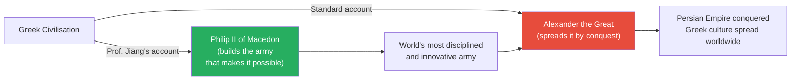
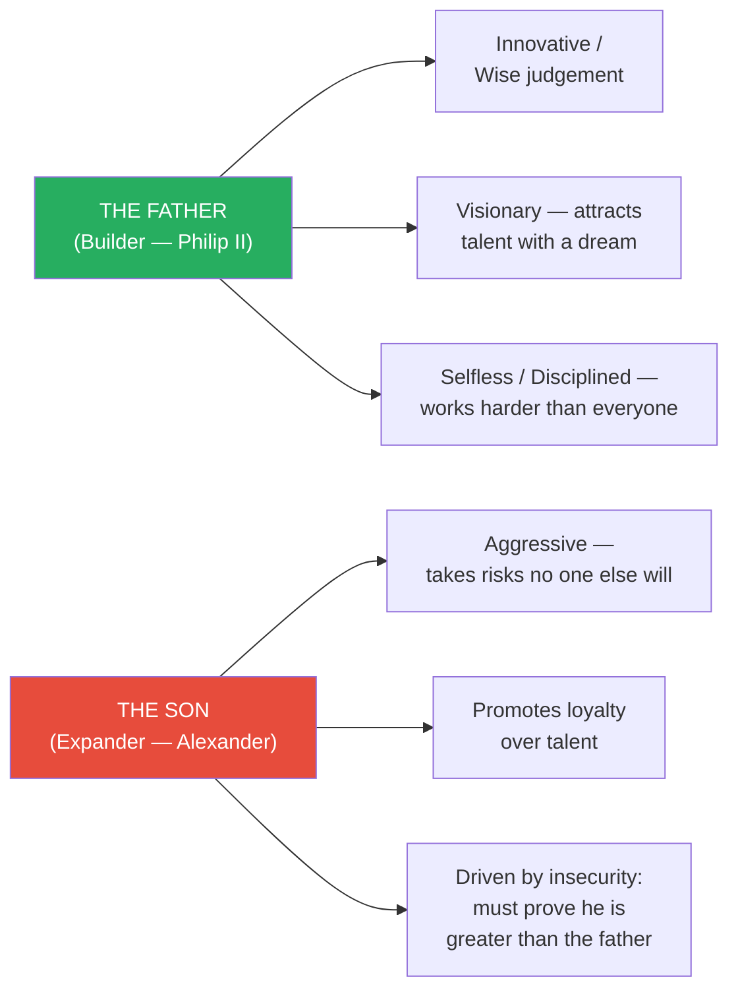
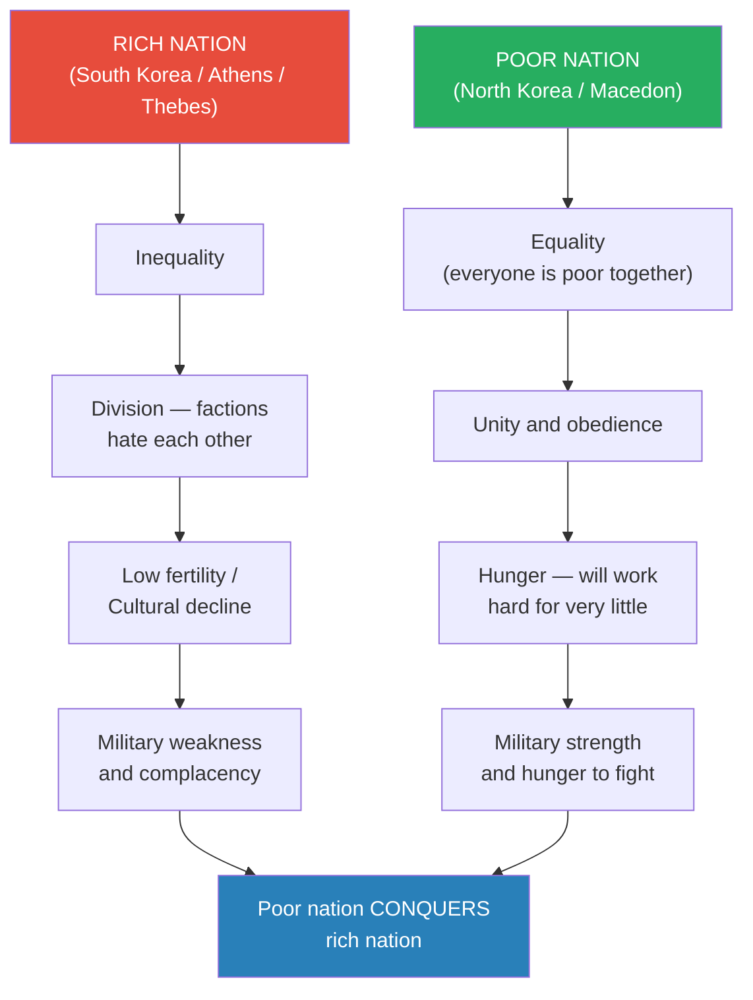
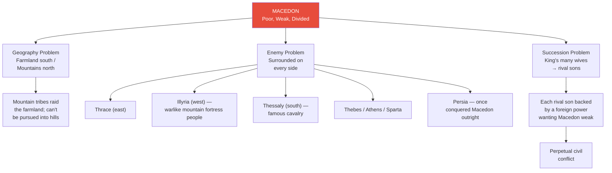
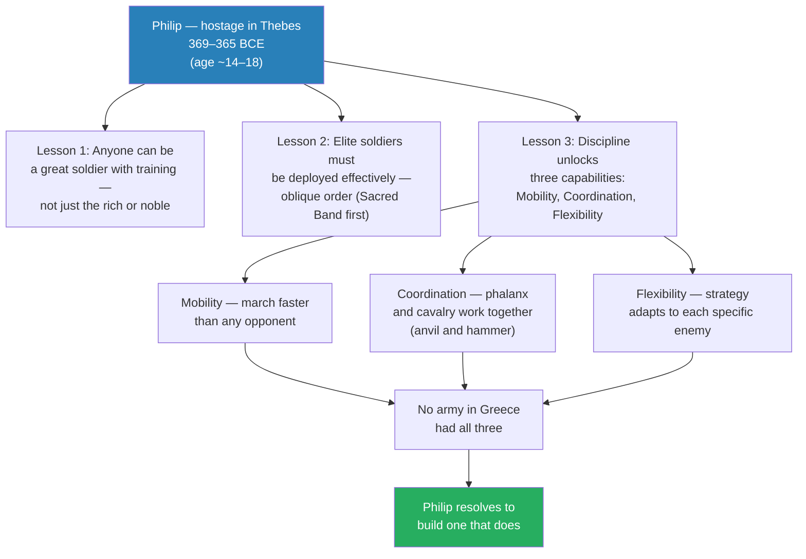
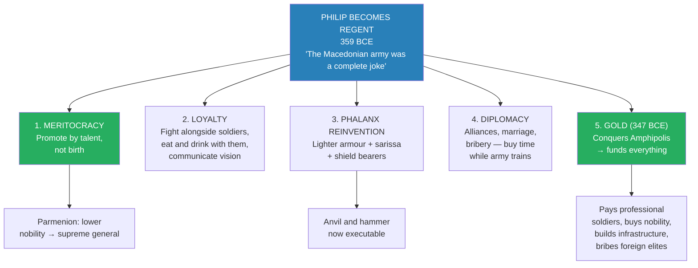
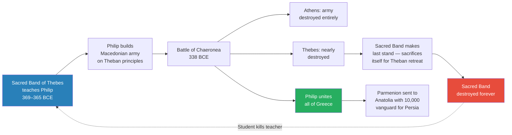
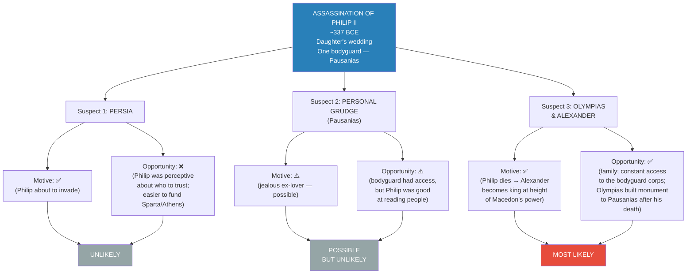
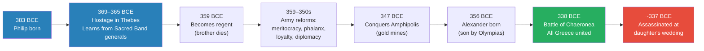

# The Greatness of Philip II of Macedon

> Prof. Jiang opens with a question most people get wrong: who actually spread Greek civilisation across the world? The standard answer is Alexander the Great — but Alexander merely inherited the world's most lethal army from his father, Philip II of Macedon. Philip took a kingdom that was poor, weak, and perpetually divided, and through military innovation, institutional meritocracy, and diplomatic cunning transformed it into the dominant power in Greece. Two thought experiments frame the lecture: why do we celebrate sons who expand over fathers who build? And why do poor, hungry nations keep conquering rich, complacent ones? Philip's life is the answer to both questions — and his assassination on the eve of his greatest campaign points directly at his own family.

---

## Overview: Key Highlights

- <b style="color: #27ae60">Philip II, not Alexander, was the true genius</b> — he built the institution; Alexander merely spent the inheritance
- <b style="color: #2980b9">The father-son archetype</b> — builders (fathers) get overlooked; expanders (sons) get the credit, a pattern recurring with Genghis Khan, Muhammad, Napoleon, and Caesar
- <b style="color: #e74c3c">The poor-conquers-rich dynamic</b> — hungry, united, obedient nations defeat wealthy, divided, complacent ones; Macedon vs. Greece maps onto North Korea vs. South Korea
- <b style="color: #2980b9">Three qualities of great world leaders</b> — strategic to the point of visionary, innovative to the point of revolutionary, disciplined to the point of selfless
- <b style="color: #27ae60">Meritocracy was Philip's institutional revolution</b> — promoting by talent over birth, exemplified by Parmenion rising from lower nobility to supreme general
- <b style="color: #2980b9">Sacred Band of Thebes</b> — 300 volunteer elite soldiers whose methods Philip learned as a hostage, then destroyed at Chaeronea; the student killing the teacher
- <b style="color: #27ae60">Anvil and hammer strategy</b> — the phalanx pins the enemy in place while the cavalry sweeps from behind; impossible without the discipline Philip built
- <b style="color: #2980b9">The sarissa and shield bearers</b> — lighter armour, longer pikes, and mobile flank protection transformed the phalanx from a slow wall into a fast, adaptable killing machine
- <b style="color: #e74c3c">Olympias and Alexander are the most likely assassins</b> — only they had both motive and opportunity; Olympias built a monument to the killer afterwards
- <b style="color: #27ae60">Philip fought in the front lines</b> — he lost an eye and carried many scars, building fanatical loyalty that no general who watched from the rear could match
- <b style="color: #e74c3c">Macedon's three structural weaknesses</b> — geography (mountains vs. farmland), hostile neighbours on every side, and perpetual succession crises driven by many wives and rival sons
- <b style="color: #2980b9">The gold of Amphipolis (347 BCE)</b> — the turning point; with money Philip could pay professional soldiers, bribe foreign elites, and build national infrastructure

| Concept | One-line summary |
|---------|-----------------|
| **Father-son archetype** | Builders (fathers) are more impressive than expanders (sons) — but history celebrates sons |
| **Three qualities of greatness** | Strategic/visionary, innovative/revolutionary, disciplined/selfless — Philip had all three; Alexander had none |
| **Poor-conquers-rich dynamic** | Hungry, united nations overwhelm wealthy, divided ones — Macedon exploited Greek exhaustion after the Peloponnesian War |
| **Sacred Band of Thebes** | 300 volunteer elite soldiers — ancient Special Forces — who taught Philip everything he used to destroy them |
| **Meritocracy** | Philip's institutional reform: promotion by battlefield performance, not noble birth |
| **Parmenion** | Philip's greatest general, risen from lower nobility — the embodiment of the new meritocratic system |
| **Anvil and hammer** | Phalanx locks enemy in place (anvil); cavalry sweeps from behind (hammer) — requires inter-unit discipline |
| **Sarissa** | The long pike replacing the traditional short Greek spear — keeps enemies at a distance; enables lighter armour |
| **Shield bearers (hypaspists)** | Mobile flank protection units that resolve vulnerabilities in real time — "the secret sauce of the Macedonian army" |
| **Battle of Chaeronea (338 BCE)** | Philip destroys Athens and Thebes; the Sacred Band makes its final stand; all of Greece is united under Macedon |
| **Motive and opportunity** | Prof. Jiang's murder framework: only Olympias and Alexander satisfy both conditions for Philip's assassination |
| **The son's psychology** | Driven by insecurity — the need to prove himself greater than his father, because everyone says he only succeeded on the back of what his father built |

---

# The Lecture

## Two Questions — Who Really Spread Greek Civilisation? [0:00–2:35]

*Prof. Jiang opens by reframing the entire story of Greek civilisation's spread. The standard Western account attributes it to Alexander — but Alexander was Macedonian, not Greek, and Macedon for most of its history was "poor, weak, and divided." This sets up the lecture's central puzzle: how did the most unlikely kingdom become the dominant power in the ancient world?*

> [!tip] Core Insight
> Greek civilisation did not spread because it was the best and everyone wanted access to it. It spread through conquest — conquest made possible by one man's institutional genius. Understanding that man is understanding why civilisations spread at all.

*The arrow from Philip to Alexander is the lecture's argument: every conquest Alexander made was riding on institutions Philip built.*

> [!note]- Expand: Full Lecture Detail
> Prof. Jiang opens by telling the class that today they will discuss how Greek culture spread around the world and became the basis of Western civilisation. He flags the standard Western account immediately: that Greek civilisation was the best, so everyone wanted access to it — it spread through a process of "fusion."
>
> He dismisses this: "Historically, that's not true." What actually happened was that Greek civilisation spread through conquest — conquest "primarily by accident."
>
> This raises the central question: how did Alexander the Great conquer the world? Because Alexander himself was not Greek — he was Macedonian. Macedon, to the north of Greece, was for most of its history "poor, it was weak, it was divided." How was it possible that Macedon, and not Sparta or Athens — the dominant powers in Greek history — would conquer the world?
>
> Prof. Jiang tells the class that to answer this, he needs to walk them through two thought experiments. These thought experiments will give them the "ethical tools" — the analytical frameworks — to better understand the process of military conquest. And the pattern those thought experiments reveal will recur throughout the entire Civilization series.

---

## Thought Experiment 1: The Father and the Son [2:35–11:22]

*The first thought experiment is the lecture's central analytical framework — and a lens for understanding every great conqueror the series will examine. A father builds from nothing; a son expands the inheritance. Society celebrates the son. But which is actually more impressive?*

> [!tip] Core Insight
> The father's achievement — building from nothing — requires genius. The son's achievement — expanding an inheritance — requires aggression. History consistently celebrates the wrong one.

*The father-son archetype maps directly onto Philip II and Alexander. The same pattern will reappear with Muhammad, Genghis Khan, Napoleon, and Julius Caesar.*

> [!note]- Expand: Full Lecture Detail
> Prof. Jiang introduces the thought experiment simply: a father starts with nothing and builds a business worth $10 million. His son inherits that business and expands it to $10 billion. Who is more impressive?
>
> He answers immediately: "The father is more impressive because he started with nothing. It's much harder to build something from nothing than it is to expand something."
>
> The problem is that society, history, and the media celebrate the son — because "$10 billion is a lot of money." So "it's a father who does all the work and builds the organisation and the capacity for growth. It's a son who expands it and gets all the credit."
>
> He then works through the qualities of each:
>
> **The Father's three qualities:**
>
> - <b style="color: #2980b9">Innovative and wise</b> — he has a new idea that allows him to capture markets. Even if he "stole" the idea, that shows wisdom and judgement. He sees the opportunity nobody else sees.
> - <b style="color: #2980b9">Visionary — an effective manager of people</b> — he has nothing, so he must attract workers. What draws someone to work hard for a startup with no track record? The vision. The dream. "The potential for growth." He communicates that dream compellingly. He is also fair: he promotes talent, not friends. "A good boss would promote talent, and most people would do what? Promote his or her friends, promote people that they like, promote people who suck up to them. That's a natural human instinct." The father resists that instinct.
> - <b style="color: #2980b9">Selfless and disciplined</b> — he works harder than everyone. If you come in at seven, he comes in at six. If you leave at ten at night, he leaves at midnight. "He is always working harder than you to show that he is the most loyal to the company — and that's what makes you loyal to the company as well."
>
> Prof. Jiang crystallises these as the three distinct qualities shared by all the great world-changers the series will examine:
>
> - **Strategic to the point of visionary** — they have a vision of what the world should be, and a long-term plan to achieve it
> - **Innovative to the point of revolutionary** — they understand that changing the world means destroying the status quo, even through bloody wars
> - **Disciplined to the point of selfless** — fanatically obsessed with achieving the vision; personal happiness is irrelevant
>
> "When we study other great leaders — for example, Genghis Khan, Mohammed — we will recognise they all share very similar personality traits."
>
> **The Son's three qualities:**
>
> - <b style="color: #e74c3c">Aggressive risk-taker</b> — with $10 million as collateral, the son goes to the bank and borrows a billion to buy out competitors. The father had no such leverage; the son does. He succeeds by taking risks nobody else will.
> - <b style="color: #e74c3c">Promotes loyalty over talent</b> — he wants people who listen, who are obedient, who he likes. The father knows this hurts the internal structure of the organisation; the son doesn't care.
> - <b style="color: #e74c3c">Driven by insecurity</b> — "He wants to be remembered, he wants to be famous, he wants to be admired and respected." The father cares about the vision. The son cares about personal glory. And the reason is insecurity: "Everyone will say to him, you are where you are because your father built a great organisation. So for him, he must prove he is better than the father by expanding and by winning glory for himself."
>
> > [!quote] Prof. Jiang
> > "This describes perfectly the relationship between Philip the Second of Macedon — the man who actually built the greatest military in the world — and Alexander the Great, who will take this army and conquer Persia."

---

## Thought Experiment 2: Why Poor Nations Conquer Rich Ones [11:22–19:00]

*The second framework solves a historical paradox that runs through world history: why do poor, primitive nations repeatedly defeat wealthy, technologically advanced ones? North Korea and South Korea are Prof. Jiang's modern analogy for Macedon and Greece.*

*The same dynamic that could allow North Korea to overtake South Korea explains how Macedon — the weakest power in Greece — conquered Athens, Sparta, and Thebes after they bled each other dry in the Peloponnesian War.*

> [!note]- Expand: Full Lecture Detail
> Prof. Jiang introduces the second thought experiment: throughout history, poor countries often conquer rich countries. This is confusing, because our instinct is that wealth = military strength = dominance. Yet this is demonstrably wrong across centuries of history.
>
> He uses North Korea and South Korea as the modern test case. Same people, same culture, night and day in every other way. South Korea is rich, technologically advanced, democratic. North Korea is poor, primitive, a dictatorship.
>
> "If we were to take a snapshot of North and South Korea today, we could easily predict that in 20 years' time, North Korea would be poorer, South Korea would be richer." But that may not happen.
>
> **South Korea's problem:** It has the world's lowest fertility rate — 0.8 — driven by inequality. "If you feel that the rich have all the resources and it is very hard for you to advance, why have children?" The culture is becoming increasingly anti-family: restaurants that refuse to let children in, a generation that resents parenthood. The country is growing divided, complacent, and demographically collapsing.
>
> **North Korea's advantage:** Because it is poor, it has equality — and equality creates unity. "They're not divided, they're united." The people are obedient. "They're hungry. They will work very hard for very little."
>
> Prof. Jiang develops the scenario further: right now, North Korea is sending weapons and soldiers to Ukraine. "When you do that, you make a lot of money for yourself, and with this money, you can upgrade your military." Then North Korea can threaten invasion. "What will South Korea do in response?" Pay. "North Korea doesn't even have to attack South Korea. It just has to threaten to attack, and South Korea will give them a lot of money not to attack." Meanwhile, North Korean soldiers gain live combat experience in Ukraine; the military gap narrows; South Korea gets poorer buying peace.
>
> "This gives us an understanding of why Macedon was able to conquer all of Greece, even though Macedon was by far one of the poorest places in Greece at that time. Because the people are <b style="color: #27ae60">hungry, united, and obedient</b>."

---

## Macedon's Three Structural Problems [19:00–25:00]

*Before Philip, Macedon was a kingdom defined by weakness. Prof. Jiang maps three structural problems that made it the permanent underdog of the Greek world — and the perfect canvas for a revolutionary.*

*Every vector of power — geography, neighbours, and the royal family itself — worked against Macedonian stability. This is the hole Philip climbed out of.*

> [!note]- Expand: Full Lecture Detail
> Prof. Jiang sets the scene at Philip's birth in 383 BCE. The Greek world has three major powers. Athens, despite losing the Peloponnesian War, is still wealthy and still has the best navy. Sparta has historically been the best land army. And Thebes — to the north of Athens — has now become the most dominant military force in Greece, precisely because Sparta and Athens "decimated each other during the Peloponnesian War." Macedon, far to the north of Thebes, is nobody's concern.
>
> **Problem 1 — Geography:** The kingdom is split between agricultural farmland in the south and ungovernable mountains in the north. "Most of its land can't even grow crops." And where it can grow crops, "its farmers are just peasants." Mountain tribes live in the hills and raid the farmland as their primary livelihood. "When you chase them, they go back to the mountains" — there is nothing Macedon can do.
>
> **Problem 2 — Hostile neighbours everywhere:**
> - Thrace to the east — a long-term enemy
> - Illyria to the west — "warlike, mountainous people who live in fortresses. It's almost impossible to invade them, and it's easy for them to come and attack you"
> - Thessaly to the south — known for their cavalry
> - Thebes, Athens, and Sparta — all wanting to play a role in controlling Macedon
> - Persia across the sea — "for a summit of history, Macedon was actually a province of Persia. Persia actually conquered or subjugated Macedon"
>
> **Problem 3 — Succession crises:** The king has many wives, which produces many sons, which produces perpetual civil war. Each rival son is "always supported by another foreign power, because the foreign powers want Macedon to always be in conflict."
>
> "For most of its history, Macedon was poor, weak, and divided. And then Philip the Second changes all that."

---

## Philip's Education in Thebes: The Hostage Who Learned Everything [25:00–32:00]

*A teenage prince sent as a hostage to Greece's dominant military power — treated well because nobody believed Macedon could ever be a threat. Philip used his freedom to study the world's best army from the inside.*

> [!tip] Core Insight
> Thebes gave Philip five years of access to their best generals and their elite military methods because they thought Macedon was a joke. It is the most consequential intelligence failure in ancient history.

*The three lessons from Thebes became the three pillars of Philip's military revolution. He was not just a student — he was planning to outbuild his teachers.*

> [!note]- Expand: Full Lecture Detail
> In 369 BCE, Macedon lost a war to Thebes. Standard practice required the defeated kingdom to send hostages to ensure they would not rebel. Philip was sent as a prince — and as a prince, he was "treated very, very nicely in Thebes." He could do whatever he wanted.
>
> "The thing that he wants to do is he wants to understand why Thebes is the dominant military power in Greece at this time."
>
> He attaches himself to the best Theban generals. They become his mentors. And the central institution he studies is the <b style="color: #2980b9">Sacred Band of Thebes</b>.
>
> > [!example] The Sacred Band of Thebes — Ancient Special Forces
> > - 300 soldiers who spend every day training to be the best fighters alive
> > - Modelled on Sparta's professional warrior class — but with a crucial difference
> > - In Sparta, only aristocrats, only citizens, could be soldiers
> > - In Thebes, the Sacred Band were volunteers — commoners who wanted to be soldiers, open to anyone with talent
> > - First lesson Philip learned: "With proper training, anyone can learn to be a great soldier. Not just the rich."
> > - The Thebans used them in **oblique order** — slanting the formation to place the Sacred Band directly against the enemy's best troops
> > - In a fair fight, the Sacred Band always destroyed the opposing elite — and the psychological shock broke the entire enemy formation
> > - Philip would eventually destroy the Sacred Band at Chaeronea — the student killing the teacher
> > **The lesson:** Thebes educated Philip because nobody believed Macedon could ever become a threat — the same reason nobody takes North Korea seriously today.
>
> From the Thebans, Philip extracted the principle that discipline in an army was the foundation of everything. "In Greece, remember, the Spartans had discipline. But most armies, like the Athenians, they were citizen soldiers. They did this for fun, as a civic duty, part time." When you train full time, you develop discipline. And with discipline come three capabilities:
>
> - <b style="color: #2980b9">Mobility</b> — your army marches faster than any opponent. "Maybe you want to attack a city. If you get there really fast, you can besiege it and destroy it. The city cannot ask for reinforcements — they will come too slowly."
> - <b style="color: #2980b9">Coordination</b> — different military units work together. In Greece, the phalanx and the cavalry operated independently. Discipline allowed them to work in concert, creating the <b style="color: #27ae60">anvil and hammer</b>: the phalanx locks the enemy in place (the anvil), then the cavalry streams in from behind and destroys them (the hammer).
> - <b style="color: #2980b9">Flexibility</b> — strategy adapts to the specific enemy. Philip had archers, shield bearers, phalanx, and cavalry. "In response to different enemies, he would change his strategy using these different units." No army in Greece had ever done this.
>
> "If you have these three things — mobility, coordination, and flexibility — you'll be invincible. No one could beat you. Because the very idea that an army could do this at that time was unheard of."
>
> A student later asks why Thebes gave Philip all this knowledge. Prof. Jiang's answer:
>
> > [!quote] Prof. Jiang
> > "No one thinks Macedon will ever be a threat. No one takes Macedon seriously. It's like today, no one would take North Korea seriously. Everyone thinks this place will collapse in five years time. And it's impossible to predict what Philip would do, because Philip is one of these individuals — these great men of history. They stand outside of history. They don't behave the way normal humans behave. Normally, if you're a prince, you just want to have a good time. You want personal glory. But Philip wanted to change the world."

---

## Philip Becomes Regent: The Military Revolution [32:00–42:00]

*In 359 BCE, Philip's brother dies and his nephew is too young to rule. Philip becomes regent — and immediately begins dismantling and rebuilding Macedon's military from the ground up. The transformation has five components: meritocracy, loyalty, the phalanx reinvention, diplomacy, and gold.*

*Five parallel reforms executed simultaneously over two decades — each one reinforcing the others.*

> [!note]- Expand: Full Lecture Detail
> Philip gets his chance in 359 BCE. His brother dies, and his nephew is too young to rule, so Philip becomes regent — and then, in effect, king for the rest of his life. He inherits an army that has been getting destroyed by everyone. "Illyria attacked and destroyed the army. Thrace attacked and destroyed the army. The Macedonian army was a complete joke."
>
> **Reform 1 — Meritocracy:**
>
> - Traditionally in Macedon, as everywhere, advancement was determined by social status, not performance
> - Philip's most controversial reform: he made the cavalry (traditionally reserved for nobility) equal in status to the infantry (made of common peasants)
> - "In this new system, as long as you perform well in battle, you will be promoted"
> - The exemplar was <b style="color: #2980b9">Parmenion</b> — born into the lower nobility, not wealthy, but talent recognised and promoted. Philip made Parmenion his greatest general and trusted partner, allowing him to lead armies independently — "he was not afraid that Parmenion would rebel, he trusted Parmenion"
> - "Philip had a tremendous understanding and judgement of people. He knew who to trust, and he knew how to use people effectively"
>
> **Reform 2 — Building fanatical loyalty:**
>
> Philip understood that a professional army requires a different kind of loyalty from a part-time citizen militia. He built it through three methods:
>
> - <b style="color: #27ae60">He fought in the front lines</b> — "he was not in the back watching the battle. He was in the front leading the battle. He trained with them every day. He trained harder than everyone else." In one battle, Philip lost an eye. He carried many battle wounds and scars. His soldiers saw their king bleed alongside them.
>   - Because he fought with his soldiers, he also refused to waste their lives: "He was very strategic. He would not put his soldiers in harm's way." This made his troops even more loyal — they knew their king valued their lives.
> - <b style="color: #27ae60">He ate and drank with common soldiers</b> — "that told the soldiers: we are equals, we are friends, and I am willing to listen to your complaints. Here is your opportunity to complain about me."
> - <b style="color: #27ae60">He communicated his vision and praised talent publicly</b> — he gave speeches explaining his dream: make Macedon great, conquer Greece, conquer Persia. And he used those speeches to publicly praise exemplary soldiers like Parmenion. "That made Parmenion feel really good. And that made him even more loyal to Philip."
>
> **Reform 3 — Reinventing the phalanx:**
>
> A student during Q&A asks about the specific changes to the phalanx. Prof. Jiang explains:
>
> - The traditional phalanx was powerful but immobile — "everyone's carrying heavy armour"
> - Philip's first change: lighten the load. Less armour = greater speed and mobility
> - The obvious vulnerability: without heavy armour, how do you protect yourself? Philip solved this two ways:
>   - The <b style="color: #2980b9">sarissa</b> — a very long spear, essentially a pike. "It became very hard to reach the phalanx because the pike was in the way." Enemies simply couldn't get close enough to exploit the lighter armour
>   - The <b style="color: #2980b9">shield bearers (hypaspists)</b> — mobile units on the flanks. "Their job was to protect the phalanx on the sides. If one part of the phalanx was being threatened, the shield bearers could converge on that and lock it down." Prof. Jiang calls them "the secret sauce of the Macedonian army"
>
> > [!example] The Phalanx Transformation — Problem and Solution
> > - Traditional Greek phalanx: heavily armoured soldiers locked in a wall — powerful but slow
> > - Problem 1: too slow to march fast or reposition in battle
> > - Problem 2: heavy armour meant no unit could respond dynamically to flanking attacks
> > - Philip's solution: lighter armour + longer pike + mobile shield bearers on the flanks
> > - Effect: the Macedonian phalanx was faster, longer-reaching, and more adaptable than any Greek army
> > - When the Macedonian phalanx met traditional Greek phalanxes: "The Macedonian phalanx proved superior because of these innovations — lighter, faster, longer spears, and shield bearers who could adapt to situations"
> > **The lesson:** Every innovation Philip made created a new vulnerability, and he then solved that vulnerability with another innovation — a compounding loop of military improvement no opponent in Greece had attempted.
>
> **Reform 4 — Diplomacy as weapon:**
>
> While building his army, Philip still had to survive. He understood that "having smart diplomacy is just as good as having the world's best military." The Greek world was "basically Game of Thrones — every nation at each other's throat. Sparta hates Thebes. Thebes hates Athens."
>
> - He played enemies against each other, forming alliances with one power to neutralise another — buying time while his army trained
> - He married princesses of other nations, binding kingdoms to him through family ties
> - He secured his northern frontier first (defeating Thrace and Illyria) before moving south — ensuring no enemy could strike from behind
>
> **Reform 5 — The gold of Amphipolis:**
>
> In 347 BCE, Philip conquers the city of Amphipolis and with it, its gold mines. This is the turning point.
>
> - <b style="color: #27ae60">Pays professional soldiers</b> who train full time instead of farming
> - <b style="color: #27ae60">Buys the loyalty of Macedon's fractious nobility</b>
> - <b style="color: #27ae60">Builds national infrastructure</b> — roads, projects that improve the economy and stir national pride
> - <b style="color: #27ae60">Bribes foreign elites</b> — "He starts bribing the nobility of Athens and other nations to support him"

---

## The Battle of Chaeronea (338 BCE) — The Student Destroys the Teacher [40:00–43:30]

*The decisive battle that unified Greece under Macedon — and contained the most poignant irony of Philip's career: the force that had created him became the force he destroyed.*

*The arc is complete: the force that educated Philip becomes the force he annihilates. The Sacred Band's final sacrifice was heroic — and built on their own principles, turned against them.*

> [!note]- Expand: Full Lecture Detail
> By 338 BCE, Philip is ready to move south. The only forces opposing him are Thebes and Athens — both weakened. "The great generals of Thebes have all died." Athens's aristocracy has largely been bribed to support Philip, so Athens "didn't really put out a great army."
>
> At the Battle of Chaeronea, Philip's "modern, highly disciplined, loyal army destroyed everyone. He crushed Thebes, he crushed Athens." He destroyed the entire Athenian army. He almost destroyed Thebes entirely.
>
> But as Thebes began to lose, the Sacred Band of Thebes made their stand. "They basically sacrificed themselves so the other soldiers of Thebes could escape." The Sacred Band was destroyed forever.
>
> "The irony, of course, is it's the Sacred Band of Thebes that taught Philip how to build a great army. In his last act, he destroyed the Sacred Band of Thebes."
>
> Philip now controls all of Greece. His next ambition: take this army into Persia. He sends Parmenion into Anatolia (modern Turkey) — home to Greek colonies under Persian rule that have long sought liberation — with a vanguard of 10,000 men to begin the invasion. Philip was about to follow and lead the full campaign.
>
> But first, his daughter's wedding.
>
> > [!quote] Prof. Jiang
> > "Philip was really in the prime of his life. He had thirty or forty years of military conquest to go. He died very young."

---

## The Assassination — A Murder Mystery [43:30–50:49]

*On the eve of his greatest campaign, Philip was killed by his own bodyguard. Three suspects. Two conditions for a murder: motive and opportunity. Only one combination satisfies both.*

> [!tip] Core Insight
> When evaluating a murder, look at two things: motive and opportunity. Persia had the motive but not the opportunity. Pausanias's personal grudge had the opportunity but a weak motive given Philip's skill at reading people. Only Olympias and Alexander had both — and Olympias built a monument to the killer.

*The detective-story framework: only Olympias and Alexander satisfy both conditions.*

> [!note]- Expand: Full Lecture Detail
> At the wedding, Philip brought only one bodyguard — "because at the wedding, there would be lots of diplomats and dignitaries. He wanted to appear approachable." That bodyguard, Pausanias, drew his sword and stabbed Philip in the ribs. The other bodyguards immediately killed Pausanias.
>
> Philip died around 337 BCE. His son Alexander, "like eighteen or nineteen at this time," became king.
>
> Three explanations circulate. Prof. Jiang evaluates each:
>
> > [!example] Three Suspects — Evaluated by Motive and Opportunity
> > - **Persia:** Motive — yes. Philip was about to invade. Opportunity — no. "How could Persia access Philip's inner court? Philip was not a dumb guy. He would know exactly who to trust and who not to trust." And if Persia was afraid of Philip, the more rational move was to give money to Sparta and Athens to attack him. **Verdict: unlikely. Most scholars agree it was not Persia.**
> > - **Personal grudge (Pausanias):** The story is that Philip and Pausanias were lovers, Philip found someone else, Pausanias became jealous. "Philip is very good at inspiring loyalty. He is also good at reading people." The notion that Philip would keep a dangerously jealous ex-lover as his sole bodyguard seems inconsistent with his renowned judgement. **Verdict: possible, but unlikely.**
> > - **Olympias and Alexander:** Both had motive — if Philip died, Alexander became king at the height of Macedon's power, with the world's greatest army and Persia as an easy target. Philip also had doubts: "Alexander, from a very early age, was a very violent young man. He couldn't really control his emotions. Philip is an excellent judge of character. You're kind of thinking: do I really want this guy to be the heir to my empire? Could he manage it?" Plus Philip had many wives — new sons could be produced who might prove better heirs. Both had opportunity — they were family, in constant contact with the bodyguard corps. The corroborating evidence: after Pausanias was killed, Olympias built a monument to him. **Verdict: most likely.**
> > **The lesson:** Motive + opportunity. Only one combination satisfies both. Next class will present further evidence from Alexander's behaviour that he wanted his father dead.
>
> Prof. Jiang closes by returning to the course's master pattern:
>
> > [!quote] Prof. Jiang
> > "What we will understand is this pattern of a great man emerging who creates a revolution that transforms the world. It will repeat itself many times — with Muhammad, with Genghis Khan, with Napoleon, with Julius Caesar. They all have this similar personality, and they're all working within a similar social context."

---

## Philip's Timeline: From Hostage to Master of Greece

*Philip's life compressed: from royal hostage to master of the Greek world in just over two decades — cut short by assassination on the verge of his greatest campaign against Persia.*

---

## Connections

**Builds on:**
- [[08 - Rat Utopia and the Peloponnesian War]] — The Peloponnesian War bled Athens, Sparta, and Thebes dry, creating the power vacuum Philip exploited. The Rat Utopia dynamic (wealthy societies decaying from within) explains exactly why these once-great powers couldn't resist a hungry, unified Macedon
- [[10 - The Trial of Socrates and Plato's Allegory of the Cave]] — Greek intellectual culture flourished even as political power shifted north to Macedon; the tension between philosophy and military power continues into the next lecture

**Sets up:**
- [[12 - The Tyranny of Alexander the Great]] — Alexander is the son archetype personified: aggressive, glory-seeking, promoting loyalty over talent, driven by insecurity about proving himself greater than Philip. The disciplined army Philip built will compensate for Alexander's strategic recklessness — but eventually the institution cannot survive the leader's ego

**Related books in vault:**
- [[Sapiens - Yuval Noah Harari]] — Harari's framework for how military and institutional innovation compound over time; Philip is a case study in asymmetric institutional advantage
- [[48 Laws of Power - Robert Greene]] — Law 1 (Never outshine the master) inverted: Philip built the master that his son then obscured; the pattern of builders erased by expanders

---

## The Takeaway

This lecture establishes two analytical frameworks that will recur through the entire Civilization series. The father-son archetype — builders who possess vision, meritocracy, and selflessness versus expanders who possess aggression, loyalty-promotion, and insecurity — maps cleanly onto Philip and Alexander, and will reappear with Genghis Khan, Muhammad, Napoleon, and Julius Caesar. The poor-conquers-rich dynamic, grounded in the North Korea/South Korea thought experiment, explains a pattern visible across millennia: wealthy societies grow unequal, divided, and complacent, while poor societies remain hungry, unified, and hungry to fight.

Philip II is the lecture's argument made flesh. He learned from the best military institution in the world — the Sacred Band of Thebes — during five years as a hostage, precisely because nobody thought Macedon would ever matter. He built a meritocratic institution that promoted talent over birth, creating a general like Parmenion who could lead armies independently. He invented a combined-arms doctrine decades ahead of his time — the sarissa phalanx, the shield bearers, the anvil-and-hammer cavalry — and held it all together through personal sacrifice: fighting in the front lines, losing an eye, eating with common soldiers, giving speeches that named and praised the talented. He was simultaneously a strategist, an innovator, a diplomat, and a manager of people. He is, Prof. Jiang argues, the more impressive figure in one of history's most celebrated relationships.

The deepest irony: the very army Philip built to conquer Persia would do so — but under his son's name. Alexander would ride Philip's institutional achievement to glory, and history would remember the son while forgetting the father. Prof. Jiang's challenge to the class is to see through that bias. The person who builds the system rarely gets the credit. The person who inherits and expands it does. This will be the pattern that repeats — and understanding it changes how you see every great achievement in history.
