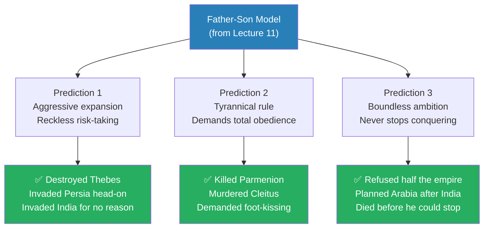
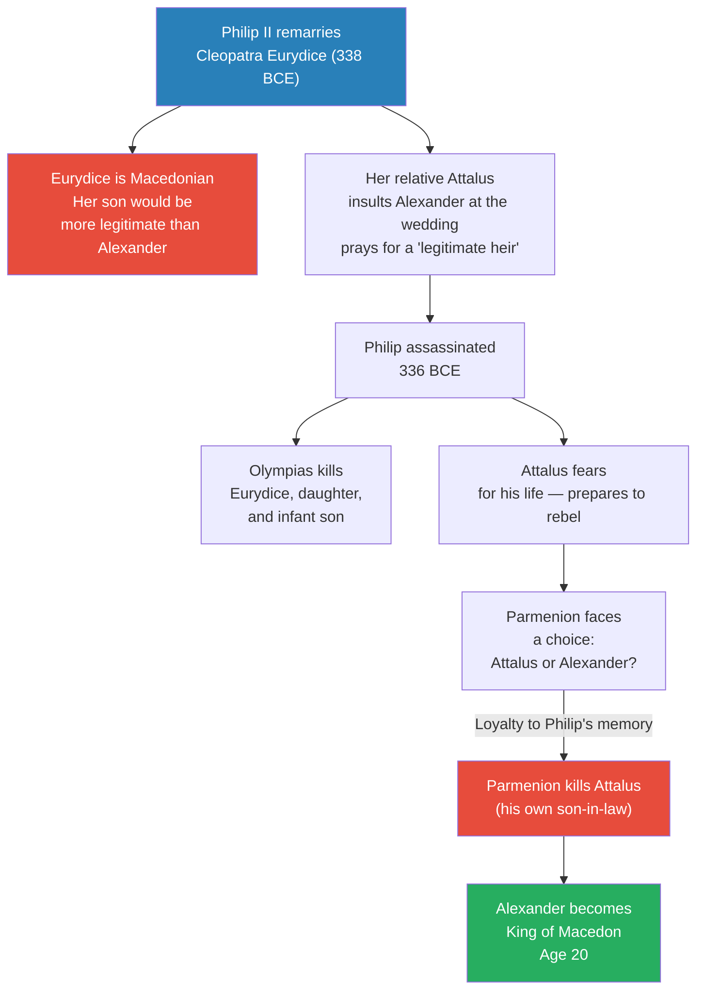
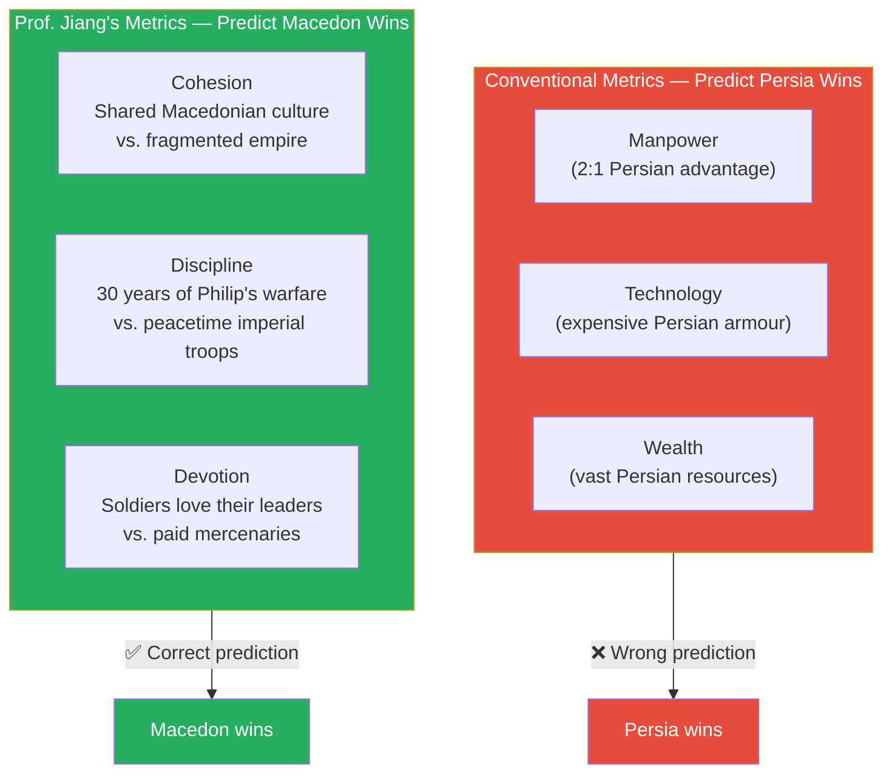
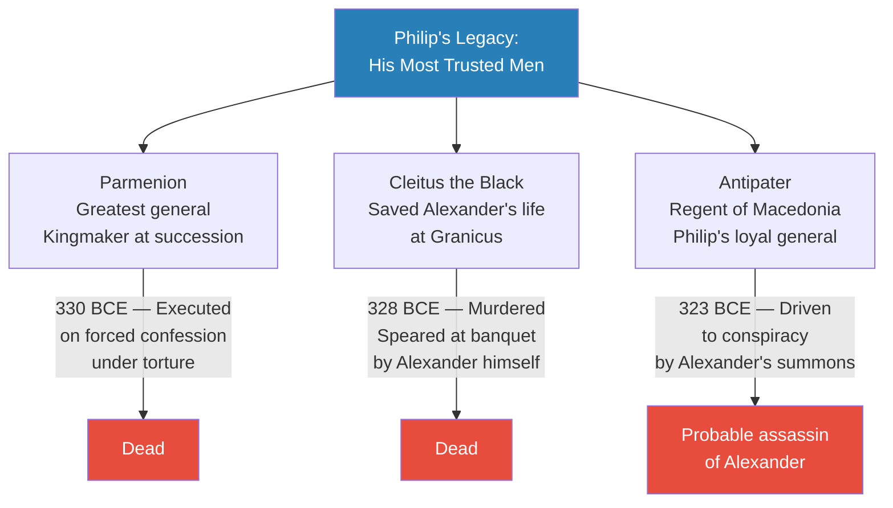
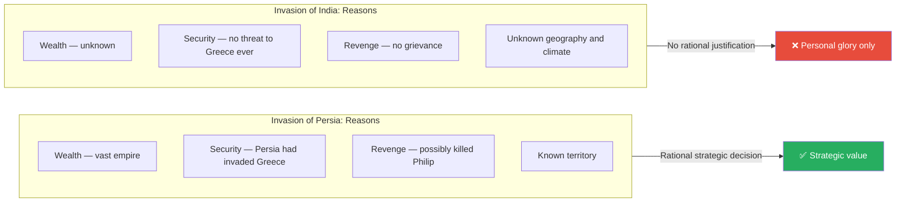
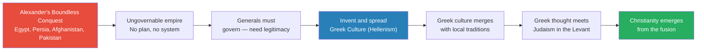

# The Tyranny of Alexander the Great

> Prof. Jiang takes the Father-Son analytical model from Lecture 11 and uses it as a prediction engine. If the model is correct, Alexander should display three defining traits when he becomes king: reckless expansion, tyrannical demand for obedience, and boundless ambition that can never be satisfied. The historical record confirms all three with striking precision. Alexander destroyed Thebes, conquered Persia through personally brave but strategically reckless battles, declared himself the son of Zeus Ammon, systematically killed every talented man his father promoted, and forced his exhausted army into India for no strategic reason whatsoever. He was almost certainly poisoned by his own generals at age 32. Yet his conquests accidentally created the Hellenistic world — which merged Greek culture with Judaism and gave birth to Christianity.

---

## Overview: Key Highlights

- <b style="color: #2980b9">The Father-Son model generates three predictions</b> — aggressive expansion, tyrannical obedience, boundless ambition — and all three are confirmed by Alexander's reign
- <b style="color: #e74c3c">Alexander destroyed Thebes</b> — massacring the men and enslaving the women, an act so unprecedented it permanently alienated the Greek world
- <b style="color: #27ae60">Cohesion, discipline, and devotion</b> — the three metrics that actually predict military outcomes, not manpower, technology, or wealth
- <b style="color: #2980b9">Tribal armies defeat empires</b> — the same pattern that explains Macedon's victory over Persia recurs with Muhammad, Genghis Khan, and Tamerlane
- <b style="color: #e74c3c">Alexander declared himself son of Zeus Ammon</b> — renouncing Philip as his father and demanding the Persian custom of foot-kissing from his own Macedonian soldiers
- <b style="color: #e74c3c">Parmenion executed on a forced confession under torture</b> — after this, no one in the army had the standing to restrain Alexander
- <b style="color: #e74c3c">Cleitus the Black murdered at a banquet</b> — the man who saved Alexander's life was killed for saying the one thing Alexander could not bear to hear
- <b style="color: #27ae60">Darius fled both battles — Issus and Gaugamela</b> — the discipline and devotion of Parmenion's infantry, not Alexander's brilliance, decided both victories
- <b style="color: #e74c3c">The India mutiny</b> — the army refused to go further; Alexander killed the leaders and marched survivors home through a desert to punish them
- <b style="color: #2980b9">Memnon of Rhodes's war of attrition</b> — the only strategy that could have defeated Alexander, killed by illness before he could implement it
- <b style="color: #27ae60">Alexander's accidental legacy</b> — his ungovernable conquests forced his generals to spread Greek culture, which merged with Judaism and produced Christianity
- <b style="color: #e74c3c">Probable assassination by Antipater's son</b> — the cupbearer poisoned Alexander's drink at a banquet; Alexander survived for weeks before dying in bed

| Concept | One-line summary |
|---------|-----------------|
| **Father-Son model** | Analytical framework from Lecture 11 — the Son is reckless, tyrannical, and insecure where the Father was careful, meritocratic, and selfless |
| **Three predictions** | Aggressive expansion, tyrannical obedience, boundless ambition — all confirmed by Alexander's historical record |
| **Cohesion-discipline-devotion** | The real metrics for military superiority — not manpower, technology, or wealth |
| **Tribal vs. Imperial armies** | United tribal forces consistently defeat fragmented empires; then devolve into civil war when they become empires |
| **Memnon of Rhodes** | The Greek mercenary who understood Alexander's weaknesses and proposed the one strategy that could have worked |
| **Proskynesis** | Persian custom of kissing the king's feet — Alexander demanded it from his Macedonian soldiers after declaring himself son of God |
| **Temple of Zeus Ammon** | The Siwa Oasis oracle where Alexander was told Zeus Ammon was his real father, not Philip |
| **Parmenion** | Philip's greatest general — kingmaker, battle-winner, executed on a false confession under torture |
| **Cleitus the Black** | Saved Alexander's life at Granicus; murdered at a banquet for saying "everything you've achieved is your father's" |
| **Hellenism** | Greek culture invented and spread by Alexander's successors to legitimise their rule over conquered territories |
| **Christianity as unintended legacy** | Greek Hellenism merged with Judaism in the Levant and produced Christianity — entirely unforeseen by Alexander |

---

# The Lecture

## The Prediction Engine: Three Forecasts from the Model [0:00–4:47]

*Prof. Jiang opens by reviewing the Father-Son analytical model from Lecture 11, then turns it into a prediction engine for Alexander's reign before narrating a single historical event — testing whether a good model can forecast history.*

> [!tip] Core Insight
> A good analytical model doesn't just explain the past — it predicts the future. The Father-Son archetype generates three specific, falsifiable forecasts about Alexander that map precisely onto his historical record.

*All three predictions generated by the Father-Son model are confirmed by Alexander's historical record — the model both explains and predicts.*

> [!note]- Expand: Full Lecture Detail
> Prof. Jiang opens the class with a review of last lecture's key framework. The Father is the founder and builder of a great organisation. He displays three characteristics unique to his position: first, he exercises really good judgment, because he starts with nothing and must build slowly; second, he promotes talent — he is generous, fair-minded, and actively builds a meritocracy; third, he is selfless and disciplined, putting the greater good before his own interests, which inspires loyalty from his soldiers.
>
> The Son is the inverse in every dimension. Because he inherits the enterprise rather than building it, the Son focuses on expansion and becomes an aggressive risk-taker. Because he is under his father's shadow and feels insecure, he promotes obedience and loyalty rather than talent. And because he is desperate to prove his own self-worth against the whispered accusation — "everything you've achieved, it's because of your father" — he is intensely selfish, focused on personal glory.
>
> Prof. Jiang then explains what a good analytical model must do. First, it must explain — it must help us better understand the motivations and behaviour of people around us. Second, and more importantly, it must predict. "If this model that we have is correct, then it will allow us to predict future events and behaviour."
>
> He invites a student to name the first prediction. The student answers: expansion. Prof. Jiang confirms: <b style="color: #2980b9">Prediction 1 — Aggressive expansion.</b> Alexander will focus on expansion and take risks that are not strategically wise.
>
> He asks for a second prediction. Another student: tyranny. <b style="color: #2980b9">Prediction 2 — Tyrannical rule.</b> Alexander will demand complete and total obedience. And because talented people challenge tyranny, he will eliminate the talented individuals his father promoted. "He's going to kill them."
>
> For the third prediction, Prof. Jiang asks: "Will he ever be happy?" The students answer: never. <b style="color: #2980b9">Prediction 3 — Boundless ambition.</b> His ambition will never stop because the insecurity that drives it can never be satisfied.
>
> Prof. Jiang warns the class to remain sceptical: "Is it possible that we are blinded by our prejudice and maybe we are being unfair to Alexander?" A good model requires the tester to look for disconfirming evidence, not just confirming evidence. He proposes to apply the model to Alexander's life while staying genuinely open to the possibility the model is wrong.

---

## The Bloody Succession: Philip's Death and Alexander's Rise [4:47–13:00]

*Two years before his death, Philip remarried — and this set off a succession crisis that exposed both the ruthlessness of Alexander and his mother Olympias, and the extraordinary loyalty of Parmenion.*

*The succession crisis of 336 BCE reveals the two forces that will define Alexander's reign: the ruthless ambition of the mother-son pair, and the unrewarded loyalty of Philip's greatest general.*

> [!note]- Expand: Full Lecture Detail
> Prof. Jiang explains that Philip's death did not happen in isolation — its context is essential to understanding Alexander's psychology. Two years before his assassination, Philip remarried. Macedonia practised polygamy, so Philip already had six or seven wives at this point. The problem was that only one wife, named Olympias, had given birth to a son — Alexander. Philip's new wife, Cleopatra Eurydice, was ethnically Macedonian.
>
> This was politically explosive for two reasons. First, if Eurydice bore a son, that son would be considered more legitimately Macedonian than Alexander, whose mother Olympias was Epirote. Alexander's right to the throne would be challenged. Second, Eurydice's relative was Attalus, a powerful general — and Attalus's father-in-law was Parmenion, Philip's closest military partner and the effective commander of the army.
>
> At the wedding banquet, Attalus delivered a toast: <b style="color: #e74c3c">"I pray that Macedonia will soon have a legitimate heir."</b> A direct insult to Alexander. Both Alexander and Olympias were, in Prof. Jiang's words, "freaking out."
>
> In 336 BCE, Philip was assassinated by his own bodyguard. Prof. Jiang says the motive was never established. What happened next is telling. Olympias moved immediately and killed Cleopatra Eurydice, her daughter, and her infant son — eliminating every rival claimant. Attalus, fearing for his life, prepared to rebel.
>
> Now Parmenion faced the decisive choice. He controlled the army. He could support Attalus, his own son-in-law, and potentially become king himself. Or he could support Alexander. Prof. Jiang says: "The faithful decision that Parmenion makes is he supports Alexander, and he kills Attalus — and Attalus is his son-in-law." Parmenion killed his own family member out of loyalty to the institution Philip had built.
>
> Alexander became king at age twenty.
>
> > [!example] The Succession Crisis of 336 BCE
> > - Philip remarries Cleopatra Eurydice — a Macedonian noblewoman whose son would outrank Alexander
> > - At the wedding, Attalus toasts: a prayer for a "legitimate heir" — a public insult to Alexander
> > - Philip is assassinated by his bodyguard; the motive is never established
> > - Olympias kills Eurydice, her daughter, and her infant son — all rival claimants
> > - Attalus prepares to rebel; Parmenion, who controls the army, must choose sides
> > - Parmenion chooses loyalty to Philip's memory over his own son-in-law — and kills Attalus himself
> > - Alexander is proclaimed king at age twenty
> > **The lesson:** Parmenion's loyalty to Alexander was bought at the price of his own family. This makes Alexander's later betrayal of Parmenion all the more damning — the man who sacrificed his son-in-law to make Alexander king was executed on a forced confession under torture.
>
> Prof. Jiang draws two conclusions from this event. First, "Olympias and Alexander are extremely ambitious — they will not be pushed aside. If they see any risk to their power, they will act viciously." They may even have arranged Philip's assassination. Second, Parmenion has proved complete loyalty to Alexander in the most costly possible way. He is not a threat; he is the foundation on which Alexander's kingship rests.

---

## The Destruction of Thebes: Terror as Policy [13:00–16:00]

*When Philip died, rebellions erupted across Greece. Alexander's response to the first serious challenge reveals exactly the kind of king he will be: one who chooses fear over loyalty.*

> [!note]- Expand: Full Lecture Detail
> When Philip died, several cities saw their opportunity and rebelled: the Athenians, the Thebans, the Spartans, and to the north, the Illyrians. Prof. Jiang explains that Alexander's overriding ambition — completing his father's dream of conquering Persia — meant he had to pacify all internal dissent first, and fast.
>
> He marched north and destroyed Illyrian opposition in a lightning campaign. Then he marched south against Greece itself. Thebes was the main source of organised resistance, and Athens and Sparta had both promised to send troops in support of the Theban cause.
>
> Alexander moved so fast that reinforcements never arrived. He laid siege to Thebes and destroyed the city completely. Then he did something that shocked the Greek world: he massacred all the men and enslaved all the women.
>
> Prof. Jiang pauses to explain why this was so extraordinary. Greeks did not do this to Greek cities. When Sparta defeated Athens in the Peloponnesian War in 404 BCE, Sparta did not destroy Athens. Sparta simply said: "promise not to bother us again" — and Athens agreed, and that was it. What Alexander did to Thebes, Prof. Jiang says, was "like basically setting off a nuclear bomb" in the Greek world.
>
> The result was a double-edged outcome. On one side, the Greeks were pacified by terror — no one dared rebel again. On the other side, "the Greeks were committed to overthrowing Alexander when the opportunity arose." <b style="color: #e74c3c">Alexander chose fear over loyalty</b> — and the Greek world never forgave him. Exactly as the Son archetype predicts: he wanted obedience, not love.

---

## The Persian Invasion: Brave Soldier, Poor Strategist [16:00–31:00]

*Alexander launches his father's dream — the conquest of Persia — but with a recklessness Philip would never have tolerated. The battles of Issus and Gaugamela reveal both what made Alexander great and what made him dangerous.*

> [!tip] Core Insight
> Military historians measure the wrong things. Manpower, technology, and wealth predicted Persian victory. Cohesion, discipline, and devotion predicted Macedonian victory. Only the second framework was right.

*The conventional framework predicted the wrong outcome. Prof. Jiang's three-part framework — cohesion, discipline, devotion — predicted the right one.*

> [!note]- Expand: Full Lecture Detail
> Prof. Jiang explains the structure of the Persian Empire. It was not a centralised state — it was more like a confederation or alliance. Provincial governors called satraps were responsible for defending their own territory. Darius III, the King of Kings, initially dismissed Alexander as a 20-year-old upstart who didn't really matter.
>
> But Darius had one genuinely capable advisor: <b style="color: #2980b9">Memnon of Rhodes</b>, a Greek mercenary who understood Greek warfare from the inside. Memnon proposed a strategy to the satraps at a war council:
>
> - Do not fight Alexander on the open battlefield — his army is the best in the world
> - Burn all the crops and starve his troops
> - Bribe Athens and Sparta to rebel against Alexander in his rear
> - Once Alexander is overextended on enemy terrain, he has no choice but to go home — war over at minimal cost
>
> The satraps refused the plan. Burning crops meant destroying their own property. They chose to fight Alexander directly instead — and paid for it.
>
> > [!example] The Battle of Granicus (334 BCE)
> > - Alexander landed in Anatolia with the largest invasion force Greece had ever assembled
> > - At the Battle of Granicus, Alexander charged to the very front of the battle — personally leading his cavalry
> > - A Persian satrap knocked Alexander down and was about to kill him
> > - Cleitus the Black — one of Philip's veteran officers — rushed in and cut off the satrap's arm, saving Alexander's life
> > - Two men now held the greatest claim on Alexander's personal gratitude: Parmenion (who made him king) and Cleitus the Black (who saved his life)
> > - Both were Philip's men, promoted for talent
> > - Alexander would kill them both
> > **The lesson:** The people who save a tyrant's life often become the tyrant's greatest threat — because their claim on gratitude becomes a source of power the tyrant cannot tolerate.
>
> After Granicus, Memnon of Rhodes was given full authority to implement his war of attrition strategy. He set sail for Greece to bribe Athens and Sparta into rebellion. And then — Prof. Jiang pauses for dramatic effect — he got sick and died. "Alexander gets very lucky a lot of times." With Memnon dead, there was no one who could unite the Greeks or implement the attrition strategy. Persia was left to defend itself in two massive pitched battles.
>
> **The Battle of Issus (333 BCE) and Gaugamela (331 BCE)** — Both followed exactly the same pattern. The Persians outnumbered the Macedonians roughly two to one. Each army arranged into a left flank, centre, and right flank. In both battles:
>
> - Darius committed his main force against Parmenion on the Macedonian left
> - Parmenion's infantry was outnumbered and nearly overwhelmed — but held its ground through extraordinary discipline
> - Alexander's cavalry found a gap in the centre and charged directly toward Darius
> - Darius saw Alexander closing in and — in both battles — he turned and ran
> - The Persian army collapsed; Alexander circled back and rescued Parmenion
>
> Prof. Jiang dwells on a key question: how great a commander was Alexander, actually? His answer: "He's a great soldier. He's very brave. But he's not a great strategist — not like his father."
>
> His case against Alexander's strategy in both battles:
> - Macedon was outnumbered two to one on enemy terrain
> - On enemy terrain, the Persians could deploy their resources far more efficiently
> - Alexander could not afford to retreat — if Parmenion's infantry broke, the entire army would die with no escape route
> - Before Gaugamela, Darius offered Alexander half the Persian Empire as a peace settlement. Alexander refused: "I need all of it."
>
> Prof. Jiang's verdict: "Philip would have thought this was a stupid idea." Philip cared about the safety of his soldiers and preferred negotiation. Alexander was concerned with personal glory and chose head-on confrontation for no tactical reason beyond the glory of the fight. His army's superiority — built by Philip over thirty years — won despite the strategy, not because of it.
>
> A student asks whether the Greeks could have been trusted in Alexander's invasion force given the destruction of Thebes. Prof. Jiang says: "Alexander didn't really trust the Greeks — and the Greeks didn't even consider the Macedonians to be Greek. So when Alexander developed his invasion force, there weren't that many Greeks in it — it was mostly Macedonians." He notes that Greek mercenaries were actually fighting *for* Darius — Memnon of Rhodes himself was Greek.
>
> He then delivers the broader pattern: "We see this throughout history where a tribal army — because of cohesion, discipline and devotion — they're basically able to conquer the world." He names Mohammed, Genghis Khan, and Tamerlane as parallel cases. All were tribal armies that, through cohesion-discipline-devotion, conquered vastly superior imperial forces — and all eventually devolved into civil war once they became empires themselves.
>
> | Metric | Persia | Macedon |
> |--------|--------|---------|
> | **Cohesion** | Multicultural empire — troops don't share language, units fight independently | Shared Macedonian culture — units coordinate naturally |
> | **Discipline** | Expensive armour but few recent battles — empires rarely fight | 30 years of continuous warfare under Philip — every soldier battle-hardened |
> | **Devotion** | Loyalty based on payment — mercenary motivation | Loyalty based on love — soldiers had followed these leaders through countless victories |

---

## The God-King Transformation: Egypt and Zeus Ammon [31:00–37:00]

*After conquering Egypt without resistance, Alexander vanishes into the desert for weeks — and returns with a revelation that will alienate his entire army.*

```mermaid
flowchart LR
    E["Egypt falls without<br/>resistance (332 BCE)<br/>Egyptians hated Persia"]
    E --> T["Alexander travels to<br/>Temple of Zeus Ammon<br/>Siwa Oasis — weeks in the desert"]
    T --> R["Oracle reveals:<br/>Philip is NOT<br/>Alexander's real father"]
    R --> G["True father:<br/>Zeus Ammon<br/>Supreme God of the known world"]
    G --> D["Alexander is the<br/>Son of God<br/>like Heracles and Dionysus"]
    D --> PR["Demands proskynesis:<br/>foot-kissing from<br/>Macedonian soldiers"]
    PR --> RM["Philip's men furious:<br/>Alexander has renounced<br/>his own father"]
    style T fill:#2980b9,color:#fff
    style G fill:#2980b9,color:#fff
    style PR fill:#e74c3c,color:#fff
    style RM fill:#e74c3c,color:#fff
```

*The divine revelation at Siwa was not merely religious theatre — it was a political declaration that severed Alexander's claim to legitimacy from Philip's legacy and demanded Macedonian soldiers submit to Persian customs.*

> [!note]- Expand: Full Lecture Detail
> After the victories at Issus and Gaugamela, Alexander swept through Egypt. The Egyptians had been trying to rebel against Persian rule for centuries without success — when Alexander arrived, they saw him as a liberator. Egypt fell without resistance.
>
> What Alexander does next disturbs his soldiers. He disappears into the desert for weeks. He travels to the Siwa Oasis, where the <b style="color: #2980b9">Temple of Zeus Ammon</b> stands. Prof. Jiang explains the significance: Zeus is the supreme Greek god, Ammon is the supreme Egyptian god, and the Temple of Zeus Ammon is the synthesis of both — the highest divinity in the known world.
>
> At the temple, Alexander receives a revelation. "Philip is not really his father," Prof. Jiang says. "His true father is — take a wild guess — Zeus Ammon." Alexander is the son of God. He is like Heracles and Dionysus, the divine heroes of Greek mythology.
>
> When Alexander returns to his soldiers, he expects them to accept this fact. The immediate practical consequence: <b style="color: #e74c3c">anyone entering Alexander's presence must now kiss his feet</b> — the Persian custom of *proskynesis*. The Macedonian army had a strong tradition of equality between officers and soldiers. The idea of prostrating themselves before a king was not just uncomfortable — it was a direct affront to Macedonian culture.
>
> Prof. Jiang marks this as a turning point: "There's growing concern about the tyranny of Alexander." The men who had served Philip — Parmenion, Cleitus the Black, and others — were particularly disturbed. Alexander had now publicly renounced Philip as his father. The men whose entire loyalty rested on devotion to Philip's memory were being told that Philip didn't matter.

---

## The Elimination of Philip's Men: Parmenion and Cleitus [37:00–44:00]

*With Persia conquered and Darius dead, Alexander turns on the two men most responsible for his victories — confirming the darkest prediction of the Son archetype.*

*Every man Philip promoted for talent — the very men who made Alexander's conquests possible — was destroyed by the Son who owed them everything.*

> [!note]- Expand: Full Lecture Detail
> **The Execution of Parmenion (330 BCE)**
>
> After Gaugamela, Darius was eventually killed by one of his own generals. The Persian Empire was effectively conquered. With the main threat eliminated, Alexander turned on the man most responsible for his victories.
>
> The chain of events was as follows. A minor conspiracy against Alexander was discovered among junior officers. One of the officers who learned about the conspiracy went to Parmenion's son, <b style="color: #2980b9">Philotas</b>, and told him: go warn the king. Philotas was drunk, considered it unimportant, and forgot to pass the information along. The conspiracy was uncovered through other means. Philotas was arrested, tortured — not for participation, but for failure to report. Under torture, he confessed that his father Parmenion was part of the plot. There was no other evidence implicating Parmenion.
>
> Prof. Jiang offers two interpretations:
>
> > [!example] Two Interpretations of Parmenion's Death
> > - **The generous interpretation:** Alexander didn't want Parmenion dead, but having killed the son under the army's judgment, he feared Parmenion would seek revenge. The execution was tragic but pragmatic — Alexander had no real choice once Philotas was condemned
> > - **The more likely interpretation:** Alexander had always resented Parmenion's legitimacy. Parmenion had more authority and more genuine loyalty from the troops than Alexander himself. Younger officers who wanted to rise in the ranks needed the old guard removed. The "conspiracy" may have been fabricated or amplified specifically to implicate Philotas, and through him, Parmenion
> > - Regardless of motive: an assassin was sent, and Parmenion was killed
> > - "After Parmenion was killed, basically all the shackles, all the restraints on Alexander, went away — because there's no one in the army who can resist Alexander anymore"
> > **The lesson:** When the last person who can say "no" to a leader is eliminated, tyranny becomes absolute. Parmenion's death was the point of no return.
>
> **The Murder of Cleitus the Black (328 BCE)**
>
> With Parmenion gone, Cleitus the Black held the most authority of Philip's surviving men — and therefore, from Alexander's perspective, posed the greatest threat to his absolute control. Alexander's solution: exile him. Assign him to a remote posting with a small force. Everyone understood this was political banishment.
>
> Before Cleitus was due to leave, a farewell banquet was held. Both men got drunk. Cleitus, knowing he was finished, said what he'd been thinking:
>
> - He accused Alexander of betraying the Macedonians — adopting Persian customs, demanding foot-kissing, promoting Persian officers within the army
> - He said: <b style="color: #e74c3c">"You could only conquer Persia with our help, and now you're turning into a Persian"</b>
> - Then he said the one thing Alexander could never bear: "Everything you've achieved, Alexander — it's because of your father. This is not you."
>
> Alexander lunged at Cleitus. His bodyguards restrained him and removed his sword. Prof. Jiang notes: "This makes us think he's been doing this a lot" — the bodyguards were evidently practiced at managing Alexander's drunken rages. Cleitus was dragged from the room, but forced his way back in to continue the argument. Alexander grabbed a spear and threw it at Cleitus, killing him on the spot.
>
> Prof. Jiang delivers the summary: <b style="color: #e74c3c">the two men most responsible for Alexander's victories — the man who made him king and the man who saved his life — were now both dead by his order.</b>
>
> **The Pages' Conspiracy**
>
> Shortly after Cleitus's murder, a genuine assassination plot emerged. During a royal boar hunt, one of Alexander's pages killed the boar before Alexander — violating the Persian custom that reserves the first kill for the king. Alexander beat the page severely. That night, the pages conspired to stab Alexander while he slept. The plan failed because Alexander went out drinking and didn't return until after the pages' shift. When the conspiracy was uncovered, Alexander had everyone executed. At their trial, the pages publicly accused him of tyranny — the word now applied to him by his own servants.

---

## The India Campaign and the Breaking Point [44:00–50:00]

*Alexander forces his army into India with no strategic justification, triggering a mutiny — and punishes the mutineers with deliberate cruelty.*

*The contrast between the rationale for invading Persia and the rationale for invading India perfectly illustrates Prediction 3: boundless ambition that no conquest can satisfy.*

> [!note]- Expand: Full Lecture Detail
> With Persia fully conquered, Alexander decided to take his army into India — modern-day Pakistan. Prof. Jiang asks the class to consider the justification.
>
> For Persia, there were multiple strong reasons: Persia was enormously wealthy; Persia had actually invaded Greece and remained a strategic threat; there was a widespread belief Persia may have been behind Philip's assassination; and the terrain and geography were well-known. For India: "They've never been to India. They have actually no idea what they will find in India. It's a different geography. There's no reason to invade India." Alexander forced the invasion anyway.
>
> The campaign won victories in modern Pakistan, but the soldiers were done. They were far from home, exhausted, drenched by monsoon weather, and had no idea when the wars would end. <b style="color: #e74c3c">The army mutinied. They refused to fight.</b> For the first time in his life, Alexander had to yield.
>
> But he punished them for it:
> - He killed all the leaders of the mutiny — every soldier who had spoken up on behalf of their comrades
> - Rather than marching the army home along the route they knew, he forced them to march through a desert. Many died from dehydration and starvation.
>
> Prof. Jiang does not editorialize, but the implication is clear: this was deliberate punishment, not military necessity. The Son archetype's final characteristic — the complete indifference to the wellbeing of his people — was now fully expressed.
>
> Back in Babylon, Alexander was already planning the next campaign: Arabia. Prof. Jiang notes that Arabia is desert, there is nothing worth conquering there, and that is precisely the point. <b style="color: #e74c3c">"Alexander wants to be the first to conquer Arabia because his ambition is boundless."</b> The only way to prove he is the greatest conqueror in history is to conquer the entire world. Arabia was simply next.

---

## The Death of Alexander (323 BCE): The Generals Strike [50:00–52:20]

*The top echelon of the Macedonian army concludes that Alexander will eventually kill everyone. They act first.*

> [!note]- Expand: Full Lecture Detail
> Several pressures had been building. Alexander was systematically replacing Macedonian soldiers with more obedient Persians — "persianizing" the army. Most of his senior generals were deeply unhappy with this. Then Antipater, the general governing Macedonia in Alexander's absence, had a falling out with Olympias. Alexander summoned Antipater to Babylon to settle matters.
>
> Antipater knew exactly what this summons meant. He had seen what happened to Parmenion. He had seen what happened to Cleitus. He understood that being summoned to Babylon was likely a death sentence. Prof. Jiang says: "The theory that makes the most sense is the top echelon of the Macedonian army — Antipater and the other generals — basically decided Alexander has to go because he's a tyrant, and eventually he's going to kill everyone."
>
> The probable sequence: at a banquet, Antipater's son — who served as Alexander's cupbearer — put poison in Alexander's drink. Alexander began vomiting and left the room. The cupbearer then brought a feather laced with more poison, ostensibly to "help Alexander vomit some more." But Alexander was, as Prof. Jiang puts it, so physically tough that he lasted several more weeks before dying in bed. He was 32.
>
> > [!example] The Probable Assassination of Alexander (323 BCE)
> > - Alexander had been replacing Macedonian troops with obedient Persians — his own generals were being marginalised
> > - Antipater, regent of Macedonia, had a conflict with Olympias; Alexander summoned him to Babylon
> > - Antipater knew the pattern: Parmenion and Cleitus had been summoned or isolated before being killed
> > - At a banquet, Antipater's son — Alexander's cupbearer — placed poison in his drink
> > - Alexander vomited and left the room; the cupbearer brought a poisoned feather to help him "vomit more"
> > - Alexander's constitution was extraordinary — he survived for several weeks before dying in bed
> > - He died in 323 BCE, age 32, having conquered Egypt, Mesopotamia, Iran, Afghanistan, and Pakistan
> > **The lesson:** When a ruler destroys every person capable of restraining him, the only check that remains is assassination. The tyranny that began with Thebes ended with a poisoned cup in Babylon.
>
> In ten years, Alexander had conquered most of the known world. But as Prof. Jiang notes, "the plan was not to conquer most of the world — it was just Alexander's boundless ambition that made them do so."

---

## The Accidental Legacy: Hellenism and the Birth of Christianity [50:12–52:20]

*Alexander's generals now face an impossible problem: how do you govern an empire no one planned to create? Their solution — inventing and spreading Greek culture — accidentally sets off a chain of events that changes the world forever.*

*The causal chain from Alexander's tyranny to Christianity — entirely unintended, entirely world-historical.*

> [!note]- Expand: Full Lecture Detail
> Prof. Jiang closes the lecture by stepping back to consider what Alexander's conquest actually produced. In ten years, he conquered Egypt, Mesopotamia, Iran, Afghanistan, and Pakistan. This created a massive problem for his generals — the successors, called the *Diadochi*.
>
> The conquests were never meant to be a unified empire. There was no administrative plan, no system of governance. What the generals inherited was an enormous patchwork of territories that needed to be held together somehow. To govern it, they needed legitimacy. And to establish legitimacy, they needed a common culture.
>
> Their solution: invent and spread <b style="color: #2980b9">Greek culture</b> — what historians call Hellenism. Greek language, philosophy, art, and religion were promoted across the conquered territories as a unifying force. This is the Hellenistic world: not something Alexander planned, but something his mess forced his successors to create.
>
> Greek culture spread across the Mediterranean, the Near East, and Central Asia. In the Levant, it encountered Judaism. These two traditions merged, producing new ideas at their intersection. From that fusion, a new idea emerged: Christianity.
>
> Prof. Jiang notes that many Christians came to see Alexander as part of God's plan. Yes, he was a tyrant. But without his conquests, Greek culture would not have spread, and without its spread, Christianity could not have been born. "He did what he did because he truly is the son of Zeus Ammon, and Zeus Ammon commanded him to conquer the world." Prof. Jiang adds: "But again, that is a Christian perspective."
>
> The lecture closes with the announcement of the next topic: the spreading of Greek culture and the building of the Hellenistic world — the legacy of Alexander's chaos.

---

## Connections

**Builds on:** [[11 - The Greatness of Philip II of Macedon]] — the Father-Son model constructed there is tested as a prediction engine here; every quality Philip embodied (judgment, meritocracy, selflessness) is inverted by Alexander (recklessness, tyranny, boundless vanity)

**Sets up:** [[13 - Aristotle and the Greek Legacy]] — Alexander's generals inherit an ungovernable empire and solve the problem by inventing and spreading Greek culture; Prof. Jiang says next class will conclude the Greeks section by examining how Hellenism merged with local cultures to create new civilisations

**Recurring themes:**
- <b style="color: #2980b9">Father-Son archetype</b> ([[11 - The Greatness of Philip II of Macedon]]) — Alexander as the definitive Son: aggressive, insecure, glory-driven, unable to trust the people who built him
- <b style="color: #e74c3c">Hubris as a fatal pattern</b> ([[09 - Aeschylus, Sophocles, and Euripides as Prophets of Democracy]]) — Alexander's self-deification as the ultimate expression of hubris; the Greeks predicted this pattern in their tragedies
- <b style="color: #2980b9">Tribal vs. Imperial armies</b> — the cohesion-discipline-devotion framework recurs with Muhammad, Genghis Khan, and Tamerlane; tribal armies conquer empires, then become empires and collapse
- <b style="color: #2980b9">Power and its corruptions</b> — Alexander is the clearest case study yet in how power eliminates restraint step by step, each removal making the next removal easier

**Related books in vault:**
- [[Sapiens - Yuval Noah Harari]] — Harari covers the Hellenistic world and Alexander's legacy in detail
- [[The 48 Laws of Power - Robert Greene]] — Laws 1 (Never Outshine the Master) and 7 (Get Others to Do the Work) both illuminate the father-son dynamic Prof. Jiang describes
- [[The Prince - Niccolò Machiavelli]] — Machiavelli's analysis of whether it is better to be loved or feared directly maps onto Alexander's choice to govern by terror after Thebes

---

## The Takeaway

This lecture is as much about analytical method as it is about Alexander. Prof. Jiang demonstrates something genuinely important: a well-constructed model can predict historical behaviour before narrating it. The Father-Son archetype, built abstractly in Lecture 11, generates three specific forecasts about Alexander's reign — aggressive expansion, tyrannical obedience, boundless ambition — and all three are confirmed by the historical record with striking precision. The lecture is a live demonstration of what it means to test an idea rather than merely assert it.

The deeper lesson is about the mechanics of tyranny and how it progresses. Alexander did not wake up one morning as a tyrant. The process was incremental: first terror against a foreign city (Thebes), then self-deification (Zeus Ammon), then the elimination of anyone with the standing to say no (Parmenion, Cleitus), then demands that degraded his army's fighting culture (India, the desert march, Persianization). Each step removed a restraint and made the next step easier. By the end, the only remaining check was assassination. The progression from conqueror to victim took just over a decade.

The greatest irony is what Alexander's tyranny accidentally produced. He wanted personal glory — an unquenchable fire that drove him because the Son can never prove he built the machine himself. What he got instead was an ungovernable empire that forced his generals to invent and spread Greek culture, which merged with Judaism, and produced Christianity. Alexander wanted to be remembered as the greatest warrior in history. He ended up as an unwitting instrument in the creation of the world's largest religion — something he would never have understood, and would certainly not have wanted.