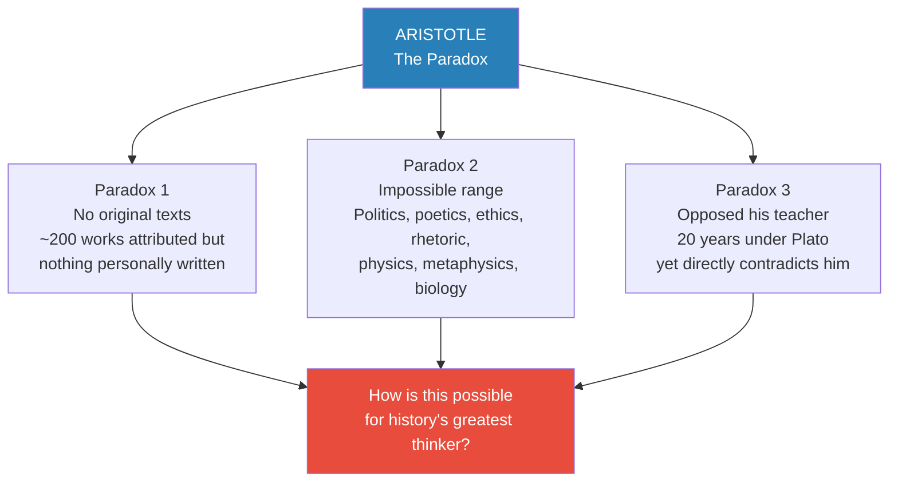
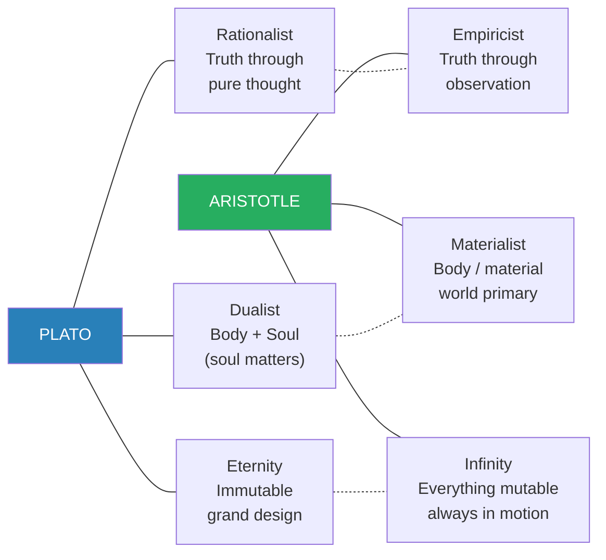
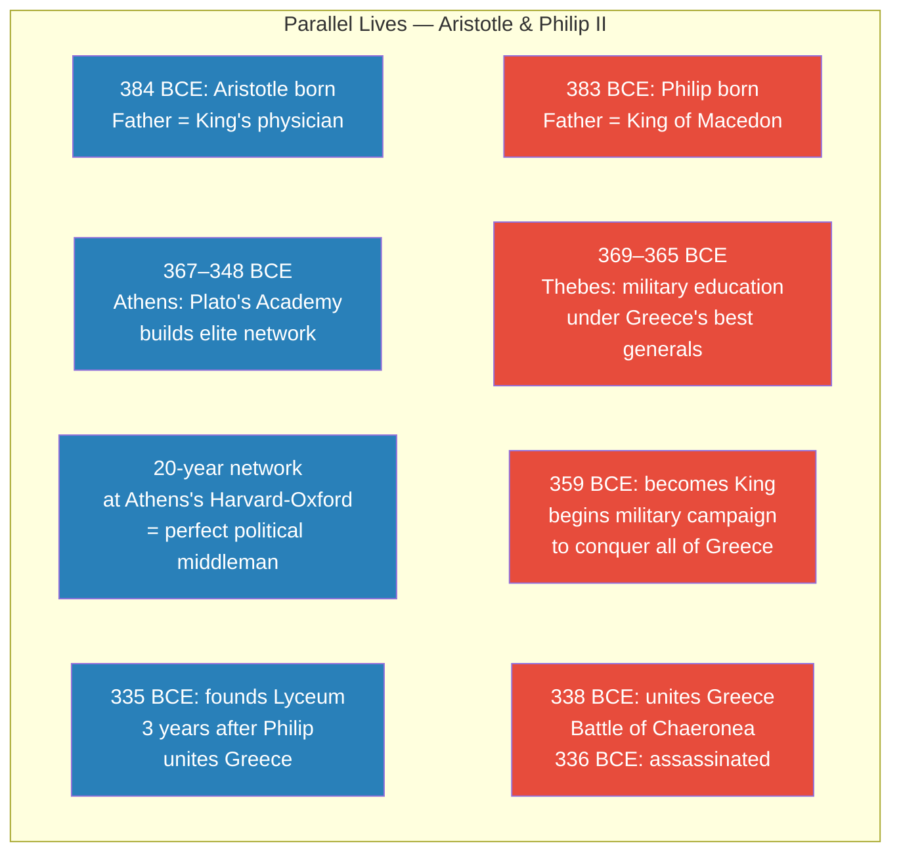
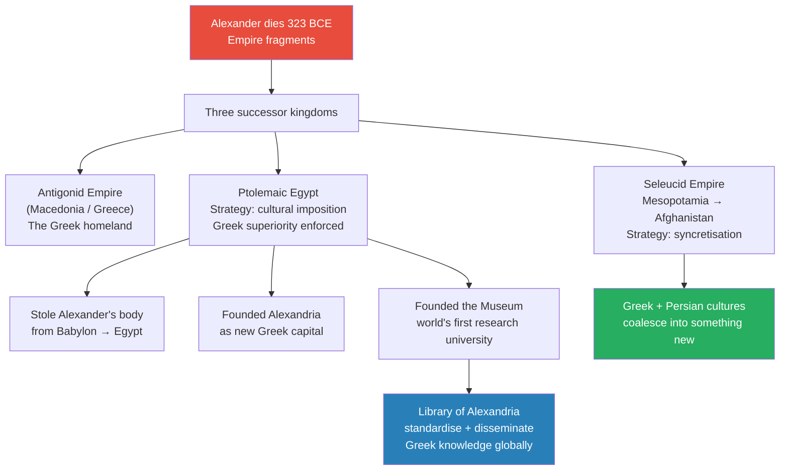
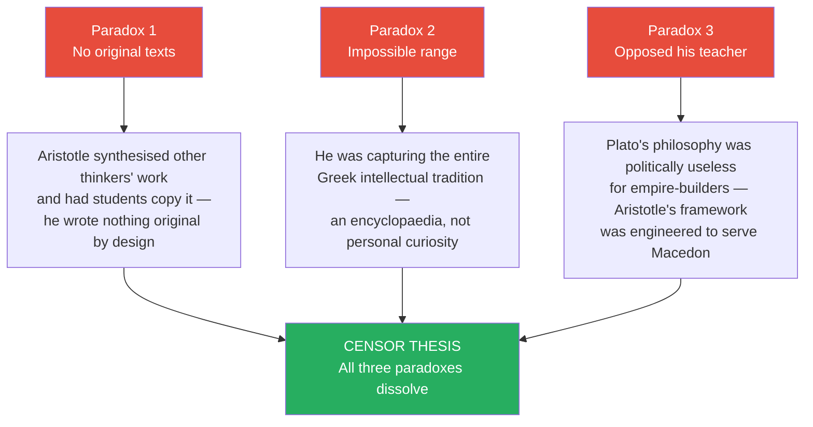
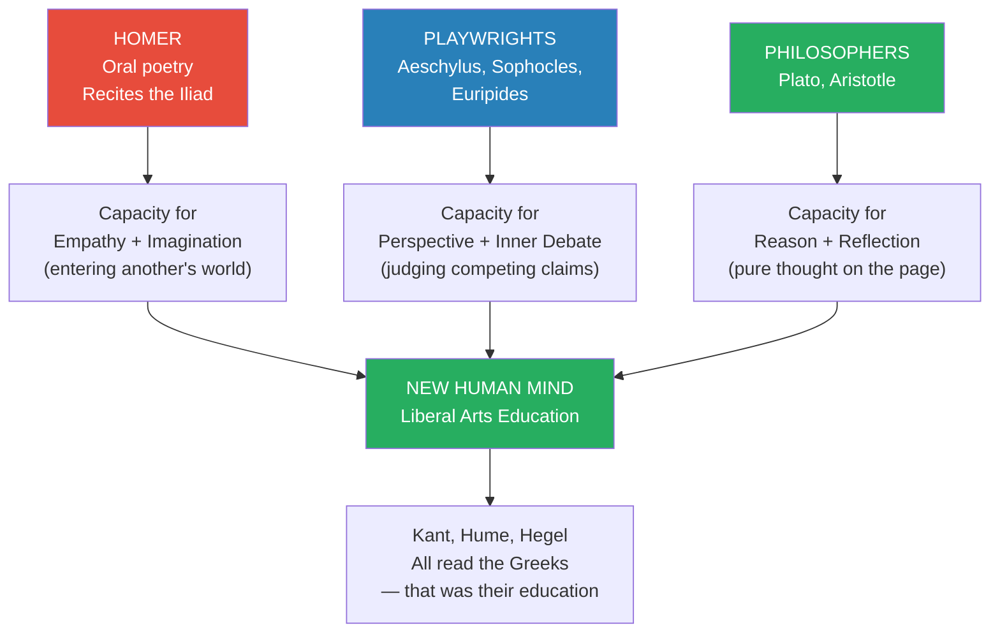
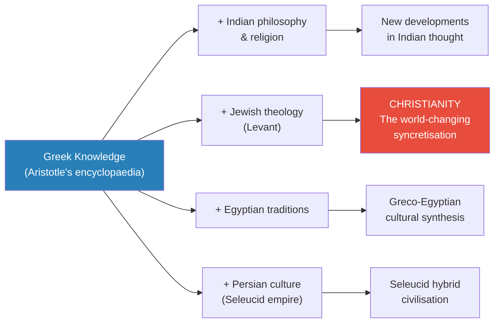

# Aristotle and the Greek Legacy

> Prof. Jiang closes the Greek arc of the Civilization series with a question that unravels history's most celebrated philosopher: why does Aristotle have no original texts, an impossibly broad range, and a worldview in direct conflict with his own teacher? His answer is deliberately controversial — Aristotle was not an original thinker but a political censor working alongside Philip II to create a Greek identity for empire. The lecture then widens into a synthesis of the entire Greek intellectual legacy: three successive innovations that built a new human mind, the Library of Alexandria's project of making that mind globally transmissible, and the syncretisation that produced Christianity.

---

## Overview: Key Highlights

- <b style="color: #e74c3c">Aristotle has no original texts</b> — nothing survives that he personally wrote, unique for someone of his supposed stature
- <b style="color: #2980b9">Aristotle as censor</b> — Prof. Jiang's controversial thesis: he was a political synthesiser, not an original philosopher, working for Philip II's empire-building project
- <b style="color: #27ae60">The Pan-Hellenic project</b> — Philip II needed someone to define Greek identity and create encyclopaedic textbooks; the Lyceum was that project
- <b style="color: #e74c3c">Plato's philosophy is anti-imperial</b> — it tells conquerors the material world is shadow and conquest is pointless; this made it politically useless for Macedon
- <b style="color: #27ae60">Aristotle's telos and eudaimonia</b> — everything moves toward its purpose; achieving that purpose with excellence produces flourishing — a philosophy perfectly suited for soldiers and empire-builders
- <b style="color: #2980b9">Rationalist vs. Empiricist</b> — Plato (pure thought accesses truth) vs. Aristotle (observation and induction access truth) — the divide that defined Western philosophy for 2,000 years
- <b style="color: #2980b9">Library of Alexandria</b> — the world's first research university, dedicated to standardising and disseminating Greek knowledge as a tool of Ptolemaic cultural domination
- <b style="color: #27ae60">Homer built empathy, playwrights built perspective, philosophers built reason</b> — three sequential Greek innovations that together produced the liberal arts mind
- <b style="color: #e74c3c">Greek philosophy + Jewish theology = Christianity</b> — the most consequential syncretisation of the Hellenistic world, made possible by the spread of Aristotle's work
- <b style="color: #2980b9">Pan-Hellenistic project</b> — after Alexander's death, the plan to unite Greeks became a plan to spread Greek culture to the entire known world
- <b style="color: #27ae60">Ptolemy stole Alexander's body</b> — to establish divine legitimacy in Egypt, physically relocating the god-king's remains from Babylon
- <b style="color: #e74c3c">The three paradoxes dissolve</b> — once you see Aristotle as censor, the missing texts, impossible range, and anti-Platonic worldview all make perfect sense

| Concept | One-line summary |
|---------|-----------------|
| **Aristotle's three paradoxes** | No original texts, impossible range, worldview opposed to his teacher — three facts that don't add up |
| **Censor / Synthesiser** | Prof. Jiang's term for Aristotle — someone who selects and packages others' ideas for political purposes |
| **Form of the Good** | Plato's God — eternal, perfect, immutable; the source of all ideal Forms |
| **Prime Mover** | Aristotle's God — the first cause that set everything in motion; like the Big Bang |
| **Telos** | Aristotle's concept of purpose — what a thing is moving toward; the basis of his ethics |
| **Arete** | Excellence — achieving your telos with mastery; the soldier who fights and wins |
| **Eudaimonia** | Flourishing or happiness — what you achieve when arete meets telos |
| **Rationalist vs. Empiricist** | Plato accesses truth through pure thought; Aristotle through observation and inductive logic |
| **Pan-Hellenic project** | Philip II's vision to unite all Greeks under a common identity by defeating Persia |
| **Pan-Hellenistic project** | After Alexander: spreading Greek culture to the entire conquered world |
| **Syncretisation** | Two different cultures or religions merging to create something new |
| **Museum (Mouseion)** | The world's first research university, founded by Ptolemy in Alexandria |

---

# The Lecture

## The Three Paradoxes of Aristotle [0:00–3:30]

*Prof. Jiang opens by announcing he will finish the Greeks with Aristotle — and immediately signals the lecture will be controversial. He frames Aristotle as one of history's most mysterious figures: universally celebrated, yet built on three facts that refuse to add up.*

> [!tip] Core Insight
> Aristotle is famous for being a genius whose genius cannot be verified. No original text, an impossibly wide range, and a worldview that contradicts the master he studied under for twenty years. These are not minor anomalies — they are the clues to what Aristotle actually was.

*Three anomalies surround Aristotle — taken individually, each might be explained away; together, they demand a different explanation.*

> [!note]- Expand: Full Lecture Detail
> Prof. Jiang opens by telling the class they will finish the Greeks by discussing Aristotle — and warns them upfront: "a lot of what I will say today will be controversial. Feel free to challenge me. Feel free to ask for clarification."
>
> He describes Aristotle as "one of the most mysterious figures in world history. He's one of the most famous, but he's one of the most mysterious." Then he lays out the three paradoxes one by one.
>
> **The first paradox: no original texts.**
> - Aristotle is ranked next to Plato as one of the greatest philosophers in human history
> - Yet we have no text we believe was personally written by him — "unique in human history"
> - Prof. Jiang draws the comparison: "We say Shakespeare was a great writer, and we can prove it by reading his text. We believe Aristotle is a great thinker, a great writer, but we have no evidence, no text to show us."
> - The conventional explanation: Aristotle wrote his own works but they were lost, and his students had to reassemble his thinking from memory
>
> **The second paradox: impossible range.**
> - About 200 works are attributed to Aristotle
> - They span: politics (what is the best political system?), poetics (what makes a good tragedy?), ethics (what is a good life?), rhetoric (how do you convince an audience?), physics, metaphysics, biology
> - "We have no analogue in human history like him. He's completely unique in the range of his curiosity."
>
> **The third paradox: opposition to his teacher.**
> - Aristotle studied under Plato for 20 years — he was Plato's most famous student
> - Yet Aristotle's understanding of the universe is "radically opposed" to Plato's
> - "You would think the best students would carry on the master's work, or at least build on it. But Aristotle's understanding of the universe is in conflict with Plato's work. In fact, you could argue Aristotle is negating Plato's worldview."

## Plato vs. Aristotle — The Great Divide [3:30–12:20]

*Prof. Jiang walks through both worldviews methodically, warning the class he is deliberately oversimplifying for clarity. A student asks whether Plato's Forms were real or abstract — a clarification that becomes the entry point for explaining why Aristotle's materialism feels instinctively "right" to modern minds shaped by science.*

*The three oppositions — rationalist/empiricist, dualist/materialist, eternity/infinity — are not just philosophical positions. They produce incompatible political programmes.*

> [!note]- Expand: Full Lecture Detail
> Prof. Jiang begins with Plato's universe. For Plato, God is the <b style="color: #2980b9">Form of the Good</b> — eternal, perfect, immutable. The Form of the Good emanates ideal concepts (justice, beauty, reason), which manifest as ideal Forms (the perfect horse, the perfect woman). Everything we see in our world is a copy — an imitation.
>
> - Our reality is a shadow realm — "everything is imitation"
> - Art and poetry are "imitations of imitations" — doubly removed from truth, doubly bad
> - Only through pure thought and mathematics can you approach the Form of the Good
> - The circle example: "No matter how hard you try, you could never draw a circle in this world — a circle has an edge, and if you go at a microscopic level, you will always find an edge. How do you create a circle? You create it by imagining it in your head — you're accessing the realm of the Forms."
>
> Prof. Jiang then describes Aristotle's universe. For Aristotle, God is the <b style="color: #2980b9">Prime Mover</b> — "just imagine the Big Bang: something explodes, boom, it moves, and forces other things to move." Everything is in motion; everything is change.
>
> - What is <b style="color: #27ae60">good</b>: moving toward your purpose — his word is <b style="color: #2980b9">telos</b>
> - What is <b style="color: #e74c3c">bad</b>: moving away from your purpose
> - The soldier example: "The purpose of a soldier is to fight and win wars. So if you go fight and do your best, you're doing good. If you run away from a war, you're doing bad."
>
> > [!quote] Prof. Jiang
> > "These two worldviews cannot harmonise. They are in conflict with each other. You have either one or the other."
>
> He then names the three key differences:
>
> - <b style="color: #2980b9">Rationalist vs. Empiricist:</b> Plato believes truth comes through pure thought. Aristotle believes it comes through observation and inductive logic — "If I see a woman wearing a dress, then another, then a third, I can induce that all women wear dresses — that's what separates women from men."
> - <b style="color: #2980b9">Dualist vs. Materialist:</b> Plato separates body and soul — the soul is eternal, the body decays, the soul matters. Aristotle focuses on the body: "There may be a soul, there may not be a soul. He doesn't really care. What matters is what happens to the body."
> - <b style="color: #2980b9">Eternity vs. Infinity:</b> For Plato there is a grand design and nothing that changes really affects it — things are eternal. For Aristotle, "almost nothing is immutable. Most things are mutable. Things will always change, always move — there's no stopping movement."
>
> A student (Doug) asks: for Plato, the Form of the Good isn't abstract — it's more real than our world, right? Prof. Jiang confirms: "For Plato, what we call our lives, the reality we live in, is not real. It's ephemeral. Whereas the Form of the Good — that's what's concrete, that's what's eternal. The reason this feels counterintuitive to us is because we're mainly influenced by Aristotle. We are materialists. Science is materialistic. But back then, and for most of human history, it was assumed that our world was transitory or ephemeral, and it was the spirit world that was real and eternal."
>
> He adds his disclaimer: "I am not an expert on Aristotle. I'm not an expert on Plato. I am committing oversimplifications. Scholars who are experts will hear this and be outraged. But for the purpose of this class, I feel these oversimplifications provide clarity."
>
> His closing framing on the legacy: "This conflict between Plato and Aristotle will inform the philosophical debate for all of Western civilisation. There are two major camps in Western philosophy — the rationalist camp (people like Descartes) and the empiricist camp (people like David Hume). For most of Western history, philosophers will go back and forth between these two extremes."

## Aristotle as Censor — The Controversial Thesis [13:00–26:00]

*The lecture pivots to Prof. Jiang's central argument: Aristotle was not a philosopher but a political partner of Philip II, tasked with building a Greek identity through encyclopaedic knowledge. He builds the case by placing the two men's biographies side by side.*

> [!tip] Core Insight
> Nothing Aristotle "thought" was original to him — he synthesised, selected, and packaged Greek knowledge for political convenience. When you see him as a censor rather than a genius, the three paradoxes dissolve instantly.

*When Aristotle's and Philip's lives run side by side, the parallels become hard to dismiss as coincidence.*

> [!note]- Expand: Full Lecture Detail
> Prof. Jiang announces his resolution to the three paradoxes: "My argument is that Aristotle was not a philosopher, not a thinker, not a writer. What he was ultimately is what I refer to as a censor — you can also use the words synthesiser, editor, or systemiser. Basically, nothing that he thought was original to him. He decided what would be politically convenient for the moment."
>
> He then builds his evidence through comparative biography.
>
> **The biographical parallels:**
> - Aristotle was born in 384 BCE; Philip II in 383 BCE — essentially the same age
> - Aristotle's father was the personal physician to the King of Macedon; Philip was the king's son
> - "From these two pieces of information, what can we guess? They grew up together. Aristotle's father was the king's personal doctor. Philip was the son of the king. It would make sense they were educated together."
> - From 367–348 BCE, Aristotle went to Athens to study at Plato's Academy. Around the same time — 369–365 BCE — Philip went to Thebes to study military innovation under the best generals in Greece
> - "Like the 1980s, when China sent its best and brightest to America to study science. We can surmise that even while they were away, they were still in contact with each other."
>
> **The bribery connection:**
> - Philip conquered Greece without significant Athenian resistance — a historical mystery
> - One theory: Philip bribed Athenian aristocrats
> - Evidence: Demosthenes, the most vocal opponent of Macedonian expansion, said in public speeches: "Philip tried to bribe me — and I know he's bribing all my opponents"
> - "If Philip was bribing Athenians, who's the middleman? Aristotle. Why? Because Aristotle was at the Academy for 20 years. The Academy in Athens was like Harvard-Oxford today — it's where all the rich and powerful go to study. For 20 years, Aristotle was in contact with and became friends with the most powerful individuals in Athens."
>
> > [!example] Demosthenes Warns Athens (c. 350s–338 BCE)
> > - Demosthenes was the most powerful Athenian statesman opposing Macedonian expansion
> > - In public speeches he told Athenians directly: "Philip tried to bribe me"
> > - He warned Philip was "a menace to democracy" and urged resistance
> > - Athens offered surprisingly little resistance despite its power
> > - Philip united all of Greece in 338 BCE at the Battle of Chaeronea
> > - Three years later, Aristotle opened the Lyceum in Athens — a new school in direct competition with Plato's Academy
> > **The lesson:** The most effective conquest is not military — it's buying the enemy's intellectual elite through someone embedded in their world for twenty years.
>
> **The Pan-Hellenic project:**
> - Philip's vision was the <b style="color: #2980b9">Pan-Hellenic project</b> — uniting all Greeks under a common identity to defeat Persia
> - Problem: that common Greek identity didn't actually exist
> - "If you were Greek living in Asia Minor, you were probably more Persian than you were Greek."
> - Philip needed someone to *create* a Greek identity — by standardising and systemising all Greek knowledge into an encyclopaedia of textbooks
> - "That's probably what Aristotle was doing when he started the Lyceum. He had lots of students. Throughout history, all conquerors did this — standardising and systemising knowledge was the best way to co-opt the intellectual elite and showcase your legitimacy. Otherwise, the intellectual elite would think of you as a barbarian conqueror."
>
> **Why Aristotle's philosophy had to contradict Plato:**
> - "If you're Philip or Alexander, what's your problem with Plato's philosophy?"
> - A student hesitates. Prof. Jiang voices the scenario himself: "You're Alexander. You go to Plato. 'I want to conquer the world.' Plato says: 'What's the point? It's all not real, Alexander. You're just conquering a shadow. What's real is the Form of the Good. Study mathematics. Stop going around killing people.'"
> - "And we know what Alexander would do here, right? He'd probably cut off Plato's head."
> - Now Aristotle's Prime Mover theory: "Everything is in motion, and what is good is if you fulfil your purpose. I'm Philip. My purpose is to unite the Greek world. The more I unite, the more good I'm doing for this world."
> - Aristotle also gave empire-builders their motivational framework: <b style="color: #27ae60">arete</b> (excellence in your role) and <b style="color: #27ae60">eudaimonia</b> (flourishing or happiness that results) — "Work hard. Fight for Alexander. Support him as he conquers the world — he's making the world better."
>
> **Three explanations for Aristotle's existence — a student exchange:**
> Doug asks whether Aristotle might have simply been co-opted by forces outside his control — just a philosopher whose work was adopted posthumously. Prof. Jiang accepts this as one of three possibilities:
> 1. **The partner theory** (Prof. Jiang's preferred): Aristotle actively collaborated with Philip, supervising students to create the Greek identity encyclopaedia
> 2. **The co-option theory** (Doug's alternative): Aristotle was a genuine independent philosopher; after Alexander's conquests, his generals adopted him as a symbol of Macedonian cultural superiority because it was convenient
> 3. **The fiction theory**: Aristotle is partly or wholly a construction of Library of Alexandria scholars who synthesised diverse Greek works and attributed them to a single legendary figure
>
> Another student notes that Aristotle's father being a physician might explain his materialist worldview naturally — a doctor's outlook on the world. Prof. Jiang finds this plausible but raises the counter-question: "If you are so opposed to Plato's understanding of the world because you're a materialist and he's a dualist — why were you studying under Plato for 20 years? That creates another problem."

## The Hellenistic World — Alexander's Unplanned Empire [26:00–36:00]

*Philip's project was to unite the Greek world. Alexander exceeded the brief by conquering everything from Egypt to Pakistan. Now the Pan-Hellenic project became something far larger — and three successor kingdoms each faced the problem of how to govern a world they hadn't planned to own.*

*Alexander's death produced a governance crisis: three kingdoms, each solving the problem of ruling non-Greek populations in different ways — but all relying on Greek knowledge as their tool of cultural authority.*

> [!note]- Expand: Full Lecture Detail
> Prof. Jiang sketches the geography of Alexander's conquests: Greece and Macedon (the homeland), Anatolia, Mesopotamia, Iran, Afghanistan, reaching as far as Pakistan; down through the Levant into Egypt.
>
> "This was not supposed to happen. Philip and the Pan-Hellenic project imagined conquest extending up to around Anatolia — a united Greek world. Alexander went too far. He conquered most of the known world."
>
> After Alexander died in 323 BCE, the empire split into three major fragments:
> - **Antigonid Empire** — the Greek homeland
> - **Ptolemaic Egypt** — founded by Ptolemy, one of Alexander's generals
> - **Seleucid Empire** — founded by Seleucus, stretching from Mesopotamia to Central Asia
>
> **The Seleucid strategy — syncretisation:**
> - Persian culture was "extremely well established" — thousands of years of sophisticated civilisation
> - The Seleucid kings adopted a process of <b style="color: #2980b9">syncretisation</b>: Greek and local cultures coming together and coalescing
> - "Throughout the Seleucid Empire, it was really a process of synchronisation. The Greeks adapted themselves to local customs and culture."
> - At the same time, they maintained Greek identity through Aristotle's standardised textbooks — his work gave Macedonian conquerors cultural legitimacy without requiring them to erase deep local traditions
>
> **The Ptolemaic strategy — cultural imposition:**
> - Egypt had thousands of years of proud civilisation and a history of rebelling against foreign rulers
> - The Persians had tried tolerance and openness — and Egyptians rebelled against them repeatedly
> - Ptolemy decided to impose Greek cultural superiority to demonstrate the new rulers were more divine than Egyptians themselves
> - He also needed legitimacy — and Alexander was viewed as a god in Egypt
>
> Three moves established this dominance:
> 1. He "went on a military expedition and stole the body of Alexander from Babylon, which started the War of the Diadochi — the successor wars." Possession of Alexander's divine body established Ptolemy's claim to Egypt's divine order.
> 2. He established a new capital at Alexandria — a Greek city, housing Alexander's body, named for the conqueror-god
> 3. He founded the <b style="color: #2980b9">Museum (Mouseion)</b> — "the world's first research university." Ptolemy and his heirs brought together the greatest Greek scholars to continue Aristotle's project of standardising and systemising Greek knowledge
>
> > [!example] How the Library of Alexandria Acquired the Great Plays
> > - Ptolemaic representatives went to Athens requesting the original manuscripts of Aeschylus, Sophocles, and Euripides — the three great playwrights
> > - The Athenians refused: these playwrights were like gods; their manuscripts were sacred
> > - The Egyptians proposed a deal: "Lend them to us, our scribes will copy them, we'll return the originals — and as guarantee, here's 15 talents of silver" (roughly a billion dollars in modern terms)
> > - The Athenians, who had never seen such money, agreed
> > - The Egyptians took the manuscripts, placed them in the Library of Alexandria, and told Athens: "Keep the money"
> > - Goal: make Alexandria — not Athens — the intellectual capital of the Greek world
> > **The lesson:** Whoever controls the authoritative texts controls the civilisation. The Library of Alexandria was not a storehouse — it was a factory for cultural power.
>
> Prof. Jiang zooms out: "After Alexander died and his generals took over, the Pan-Hellenic project really became what we call the <b style="color: #2980b9">Pan-Hellenistic project</b>. It went from uniting the Greek world into spreading Greek culture all around the world. And that's why we have Greek culture still with us today."

## Resolving the Three Paradoxes [36:00–46:00]

*With the historical framework in place, Prof. Jiang returns to the three paradoxes he opened with and shows how the censor thesis resolves each one cleanly. The classroom engages with alternative explanations, and he considers each fairly.*

*Each paradox becomes a feature, not a bug, when Aristotle is understood as a synthesiser serving a political project.*

> [!note]- Expand: Full Lecture Detail
> Prof. Jiang explicitly returns to the opening frame: "So let's go back to the original paradox. We have three paradoxes. I'm going to make an argument. It is controversial. My argument is that Aristotle was a censor."
>
> **Resolving paradox 1 — no original texts:**
> - "Why do we have nothing original from Aristotle? The answer is because Aristotle didn't write anything original. He stole everything from other thinkers and had his students copy it out in manuscript form."
> - He explains what literary originality looks like: "When you write something, you're manifesting your thought — but your thought comes from your personality. If you look at any work of genius, it's original and unique. If you read Shakespeare, there's no other Shakespeare. Homer is unique. Plato is unique. There's no point trying to imitate them — you can't, because you are not them."
> - "Now you look at Aristotle. When you read Plato's Republic, there are certain ideas that stand out — the Allegory of the Cave. Certain phrases capture your imagination. That doesn't exist with Aristotle's texts. They're really like textbooks."
>
> **Resolving paradox 2 — impossible range:**
> - "Why is his range so great? Because he was trying to capture the essence of Greek knowledge — to unify it into an encyclopaedia for dissemination around the world."
>
> **Resolving paradox 3 — opposition to Plato:**
> - "Why is Aristotle's philosophy so different from Plato's? Because if you're Philip or Alexander, Plato's philosophy is useless to you. It tells you conquest is meaningless shadow-chasing. Aristotle's philosophy is a governing ideology — it tells conquerors their work has cosmic purpose."
>
> A student (Doug) pushes back: "Couldn't Aristotle just have been co-opted by forces outside his personal control — by the generals who found his work convenient after Alexander died?" Prof. Jiang agrees this is equally valid: "There are many possibilities. The first is as I argue — he was Philip's active partner. The second is as Doug says — he was just a philosopher, and after Alexander's generals conquered the world, they needed a symbol of Macedonian cultural superiority and chose Aristotle because it was most convenient."
>
> Another student raises the physician-father angle: "His dad was a doctor — that's your approach to the world. You're going to be much more materialist." Prof. Jiang agrees this is plausible, then immediately raises the counter: "But that creates another problem. If you are so opposed to Plato's understanding of the world because you're a materialist and he's a dualist — why were you studying under Plato for 20 years?"
>
> He summarises the three possible explanations for how we have Aristotle's works at all:
> - **Possibility 1:** Aristotle, in his lifetime, organised his students and created the encyclopaedia — like a modern professor who supervises research but does little original work himself
> - **Possibility 2:** After Aristotle died, his students recalled his lectures from memory — which would explain why the manuscripts are fragmentary and incomplete
> - **Possibility 3:** "Aristotle is a fiction created by scholars at the Library of Alexandria. The scholars there created 'Aristotle' by synthesising all this work and attributing it to a single legendary figure in order to create the legend of this philosopher."

## The Three Legacies of the Greeks [46:00–57:30]

*Prof. Jiang steps back from the question of Aristotle's authenticity to make an undisputable claim: whatever its origins, Greek intellectual culture produced three world-changing legacies. He delivers these as a synthesis close to the entire Greek arc of the Civilization series.*

> [!tip] Core Insight
> Regardless of whether Aristotle was original, the Greek intellectual tradition he helped codify and spread built the conditions for everything that followed — Western philosophy, universal education, and Christianity itself.

*Three successive Greek innovations — oral epic, theatre, and philosophy — each added a cognitive capacity that the previous one lacked. Together they produced the liberal arts mind.*

*Greek knowledge did not just survive — it transformed every culture it touched. The most consequential syncretisation happened in the Levant, where Greek philosophy met Jewish theology.*

> [!note]- Expand: Full Lecture Detail
> Prof. Jiang transitions: "What is not debatable is the profound influence that Aristotle had on the world. We can argue if Aristotle was the original writer or thinker. What is not debatable is the tremendous influence he had. There are three aspects of the Greek legacy I want to discuss."
>
> **Legacy 1: A new way of being human.**
>
> Prof. Jiang traces a three-step progression through the Greek intellectual tradition:
>
> - **Homer** was an oral bard who recited epic poetry for hours before live audiences. "The point of listening to Homer was to enter Homer's world and become Achilles or Odysseus — and through this process, you became a different person. You learned empathy, but you also expanded your imagination."
> - **The playwrights** (Aeschylus, Sophocles, Euripides) changed the format: "Rather than speak directly at the audience, they had characters face each other in dialogue and debate. Now you have to step back and judge the story. There's a debate going on. You have to switch perspectives in order to understand the characters. This creates the capacity for an inner monologue and inner debate in you."
> - **The philosophers** (Plato, Aristotle) took dialogue from the stage and put it on the page — alone, with time: "You can reason out if the words make sense. You're no longer influenced by the crowd or the emotions of the actor. You can look at the words themselves and judge them on their own merit. You also have the capacity to reflect — you can go back to the words over and over across your lifetime."
>
> The cumulative result: "When you add these three things together — empathy and imagination, inner debate and perspective, reason and reflection — you now have a new human mind. And when you study all of them, that's what we call ultimately a liberal arts education."
>
> > [!example] The Liberal Arts Chain — from Homer to Hegel
> > - Homer creates empathy: listeners become Achilles and feel what he feels
> > - The playwrights create perspective: audiences must judge competing claims between characters
> > - Plato puts dialogue on the page: readers reason alone, without the crowd's influence
> > - Aristotle adds systematic categorisation: you can now think across domains with one method
> > - Kant, Hume, and Hegel all read the Greeks — that was their common education
> > **The lesson:** The liberal arts tradition is not ornamental. It is a sequential technology for building increasingly sophisticated cognitive capacities — each layer requires the previous one.
>
> **Legacy 2: The standardisation of knowledge.**
>
> The Library of Alexandria's project was not just preservation — it was making Greek education universally accessible:
>
> - **Standardised texts:** Different versions of Homer existed across the Greek world; the version we have today was established by Alexandria scholars who chose one authoritative text
> - **Created commentaries:** Teacher handbooks explaining how to teach the material — like annotated editions with pedagogical guidance
> - **Added scholarly apparatus:** Footnotes, chapter divisions, page numbers, codices, indexes — "the infrastructure of scholarship that we take for granted today"
> - "What this means is that we in China can actually read Homer, Aeschylus, and Plato for ourselves, even though we are not culturally Greek. That's the benefit of the Pan-Hellenistic project."
>
> **Legacy 3: A global revolution through syncretisation.**
>
> As Greek knowledge spread through the Hellenistic world, it interacted with powerful local cultures. Prof. Jiang gives examples of the outputs:
>
> - Greek + Indian → new developments in Indian philosophy and religion
> - Greek + Egyptian → Greco-Egyptian cultural synthesis
> - Greek + Persian → the Seleucid hybrid civilisation
> - "The most famous syncretisation is the Levant: Greek knowledge was being spread to the Jews. And so when you put the Greeks and the Jews together, you have a new idea that would forever revolutionise human history. It's called Christianity. Christianity would not have been possible if it were not for the work of Aristotle."
>
> Prof. Jiang closes with his verdict on the Greeks: "I think it's perfectly fair to say the Greeks were the most influential and consequential civilisation of all time. They're certainly the most creative. No other civilisation even comes close to their creativity."
>
> Final note: "Next class we start a new unit on Roman history."

## Connections

**Builds on:**
- [[11 - The Greatness of Philip II of Macedon]] — Philip's life runs directly parallel to Aristotle's throughout this lecture; the Pan-Hellenic project required an intellectual partner to create a Greek identity
- [[12 - The Tyranny of Alexander the Great]] — Alexander's unexpected conquests transformed the Pan-Hellenic project into the Pan-Hellenistic project, requiring a global cultural strategy that no one planned for
- [[10 - The Trial of Socrates and Plato's Allegory of the Cave]] — Plato's Form of the Good and his dualism are the explicit foil for Aristotle's Prime Mover and materialism in this lecture
- [[09 - Aeschylus, Sophocles, and Euripides as Prophets of Democracy]] — the playwrights appear here as the second step in building the Greek mind (perspective + inner debate)
- [[07 - Homer's Iliad and the Birth of Greek Civilization]] — Homer appears here as the first step (empathy + imagination)

**Sets up:**
- [[14 - Hannibal Barca, Lucius Brutus, and the Triumph of Rome]] — the Greek legacy now passes to Rome, which will absorb Hellenistic culture and transmit it to the modern world

**Related books in vault:**
- [[Sapiens - Yuval Noah Harari]] — the Pan-Hellenistic project as a driver of cultural evolution; syncretisation as a mechanism for civilisational change
- [[The Laws of Human Nature - Robert Greene]] — Aristotle's arete and eudaimonia as frameworks for understanding purpose-driven human behaviour

---

## The Takeaway

This lecture does two things at once. It offers a deliberately provocative reinterpretation of Aristotle, and it closes the Greek arc of the Civilization series with a synthesis that places everything in world-historical context. The controversial thesis — that Aristotle was a censor rather than an original philosopher — is less a historical claim than a methodological lesson. Prof. Jiang is teaching the class to ask: who benefits from this reputation? Aristotle's philosophy perfectly served Macedonian imperial interests. His empiricism justified material conquest; his telos-and-eudaimonia framework motivated soldiers and workers; his encyclopaedic range gave Macedonian rulers cultural legitimacy over the intellectual elites they needed to co-opt. That doesn't make Aristotelian philosophy wrong or unimportant — but it reframes the relationship between ideas and power. Ideas are not neutral. They are selected, promoted, and standardised by people with political needs.

The synthesis of the Greek legacy is the lecture's most enduring contribution. The three-step progression — Homer (empathy and imagination) → playwrights (perspective and inner debate) → philosophers (reason and reflection) — is an elegant model for understanding how the liberal arts tradition was born and why it remains the foundation of higher education centuries later. Each step required the previous one. You cannot reason well about what you cannot first imagine; you cannot judge competing arguments if you have never learned to switch perspectives. The Greeks didn't design this as a curriculum — they stumbled into it across three hundred years. But the Library of Alexandria recognised it, standardised it, and exported it to the world.

What remains open is Prof. Jiang's large claim: that the Greeks were "the most influential and consequential civilisation of all time." The coming lectures on Rome will test this. Rome may have been the greater institutionaliser and transmitter of Greek ideas, even if it was less original — and a case can be made that the builder deserves more credit than the inventor. More pressingly, the syncretisation claim for Christianity leaves a question: which mattered more, the Greek logos or the Jewish covenant? The New Testament authors themselves argued about this. That unresolved tension — between the Greek philosophical inheritance and the Jewish prophetic tradition — would drive Western intellectual history for the next two thousand years.
