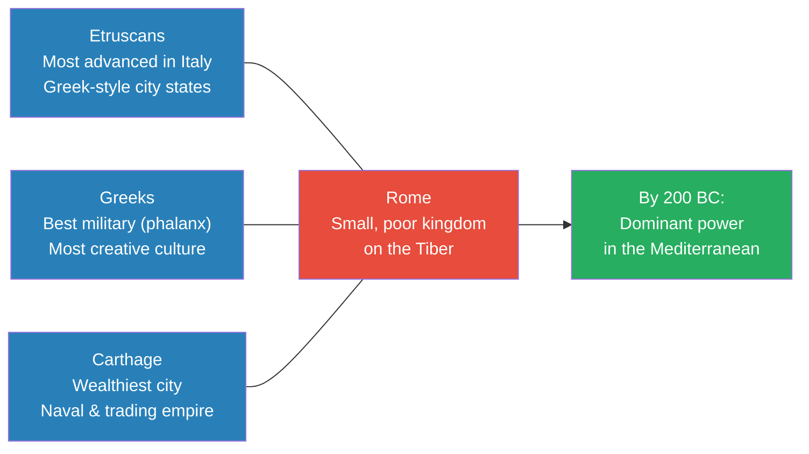
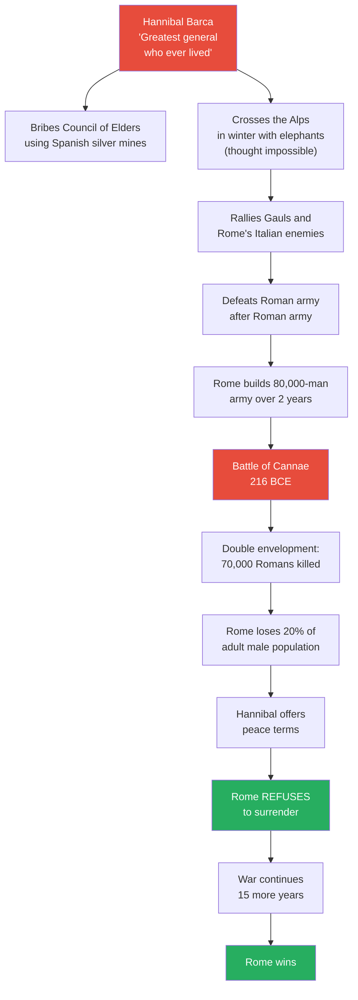
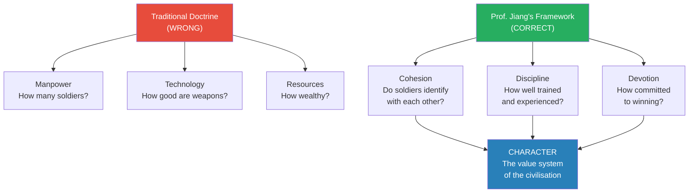
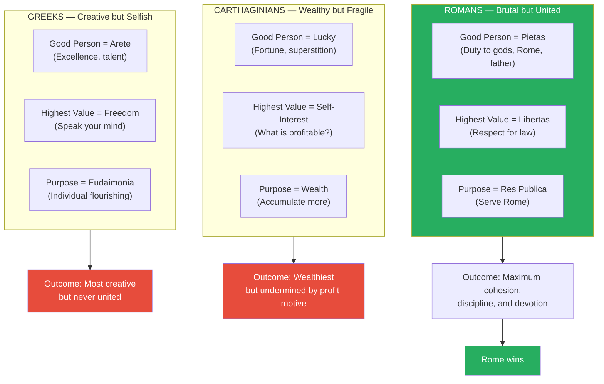
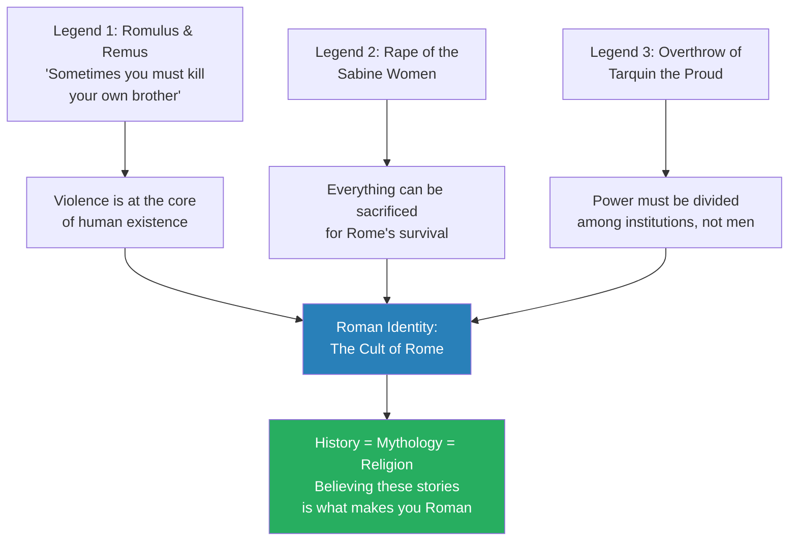
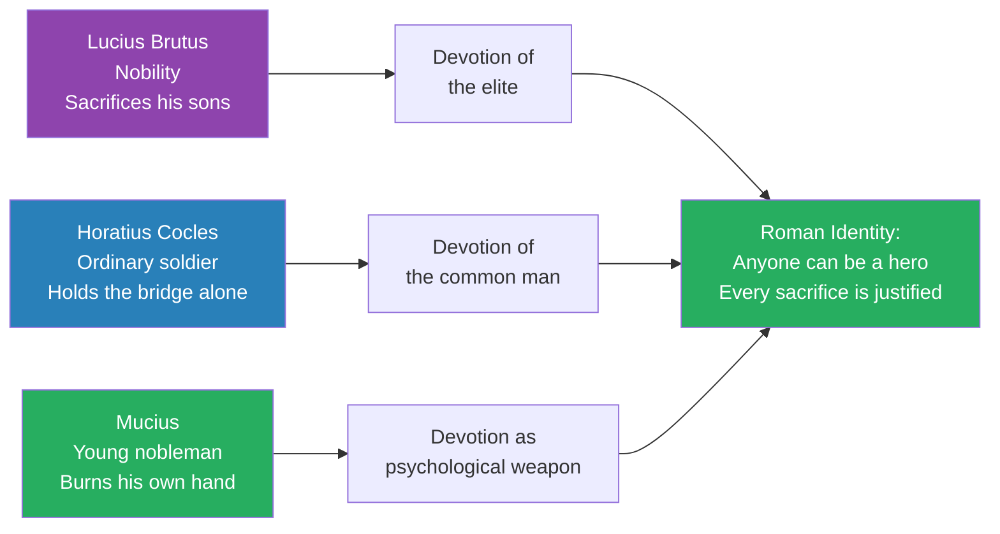
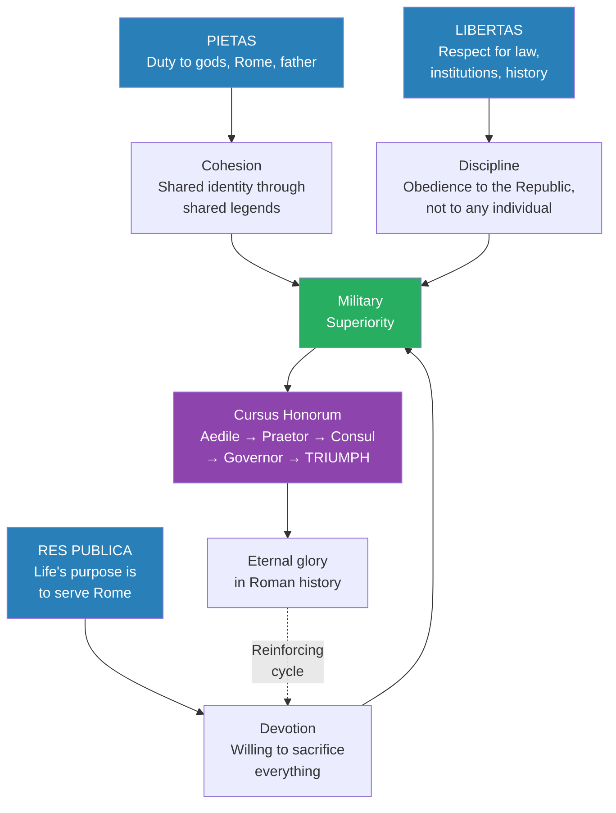

# Hannibal Barca, Lucius Brutus, and the Triumph of Rome

> Prof. Jiang opens the Roman arc of the Civilization series with a puzzle: how did the poorest, smallest, most uncivilised power in the Mediterranean defeat the wealthiest trading empire and the most sophisticated military culture in the ancient world? The conventional answer — manpower, technology, resources — fails to explain Pyrrhic victories, Cannae, or the refusal to surrender after losing 20% of all adult males. Prof. Jiang argues that civilisations win wars not through material superiority but through character — the value system that produces cohesion, discipline, and devotion. Three Roman legends — the founding of the Republic by Lucius Brutus, the bridge defence by Horatius Cocles, and the burning hand of Mucius — reveal the ethical system that made Rome unstoppable: piety, liberty, and res publica.

---

## Overview: Key Highlights

- <b style="color: #27ae60">Character, not resources, determines military victory</b> — cohesion, discipline, and devotion matter more than manpower, technology, and wealth
- <b style="color: #e74c3c">Rome lost 20% of its adult male population at Cannae and refused to surrender</b> — unprecedented in history until the industrial era
- <b style="color: #2980b9">Piety (pietas)</b> — duty to the gods, to Rome, and to your father; the foundation of Roman identity
- <b style="color: #2980b9">Liberty (libertas)</b> — not freedom of speech as the Greeks understood it, but respect for the laws, institutions, and history of Rome
- <b style="color: #2980b9">Res publica</b> — public virtue; the purpose of life is to serve Rome and make it stronger
- <b style="color: #27ae60">Rome's open citizenship policy gave it unlimited manpower</b> — anyone could become Roman, unlike the exclusionary Greeks and Carthaginians
- <b style="color: #e74c3c">Hannibal Barca was the greatest military strategist who ever lived — and he lost</b> — because armies do not win wars; nations win wars
- <b style="color: #2980b9">The double envelopment at Cannae</b> — the most famous battle in military history, where 40,000 defeated 80,000
- <b style="color: #e74c3c">Carthage's merchant culture could not recognise an existential threat</b> — business people undermined their own general because war was bad for profit
- <b style="color: #27ae60">Rome elevated its history into mythology</b> — history became religion; believing the stories of Lucius Brutus and Horatius Cocles was what made you Roman
- <b style="color: #2980b9">The Triumph</b> — a public parade celebrating a victorious general; the highest honour Rome could bestow, and the engine driving the competitive meritocracy
- <b style="color: #e74c3c">Rome destroyed Carthage utterly — killed everyone, burned all books, erased them from history</b> — devotion meant all or nothing, no mercy for enemies

| Concept | One-line summary |
|---------|-----------------|
| **Pietas (piety)** | Duty to the gods, to Rome, and to your father — the supreme Roman virtue |
| **Libertas (liberty)** | Freedom through law — respecting institutions, not individual self-expression |
| **Res publica** | Public virtue; life's purpose is serving and strengthening Rome |
| **Arete (Greek)** | Excellence and talent — the Greek ideal, which produces creativity but also selfishness |
| **Eudaimonia (Greek)** | Flourishing — the Greek purpose of life, focused on individual potential |
| **Double envelopment** | Hannibal's tactic at Cannae — concave formation trapping a larger army in a circle |
| **Pyrrhic victory** | Winning at such high cost you might as well have lost — named after Pyrrhus's wars against Rome |
| **The Triumph** | A grand parade celebrating a general who won new territory — what every Roman aspired to |
| **Cohesion, discipline, devotion** | Prof. Jiang's three criteria for military strength, replacing the conventional manpower/technology/resources |
| **History as mythology** | Rome's founding legends functioned as religion — believing them was what made you Roman |

---

# The Lecture

## Rome's Position in the Mediterranean World [0:00 - 5:00]

*Prof. Jiang sets the stage by mapping the four civilisations competing for Mediterranean dominance around 500 BCE — the Etruscans, the Greeks, the Carthaginians, and the Romans — and explains why no one would have predicted Rome's rise.*

*Three wealthy, sophisticated civilisations — and one poor, militaristic backwater. By 200 BC the backwater had defeated all three. The question driving the entire lecture is: how?*

> [!note]- Expand: Full Lecture Detail
> Prof. Jiang opens the Roman arc of the Civilization series: "We will spend the next four classes on the rise of the Roman Republic and then the rise of the Roman Empire."
>
> He sets the geographic scene:
>
> - Rome was traditionally founded in 753 BCE, though "we actually don't know — that's just what tradition says"
> - It began as "a small, insignificant kingdom in the middle of Italy" on the Tiber river, in the Latin area
> - For centuries, Rome was "a small, poor kingdom, always at war with its neighbours, primarily the Sabines"
> - The dominant civilisation in Italy was the <b style="color: #2980b9">Etruscans</b> — the most advanced culture, organised like Greek city states, trading across the Mediterranean
> - Across the sea sat <b style="color: #2980b9">Carthage</b>, a Phoenician colony from the Levant that "would become the dominant economic power of the Mediterranean, because they're very good at trade and very good at sailing"
> - Sicily was the strategic prize — "you want to control the Mediterranean Sea and the trade, you have to control Sicily"
> - Then there were the Greeks, already discussed at length in previous lectures
>
> Prof. Jiang frames the central mystery: "Around 500 BCE, if you look at these three major civilisations — the Etruscans, the Greeks, the Carthaginians — and then you have these Romans. No one could expect or predict that the Romans would become the great empire that it did become."
>
> He gives the "easy answer" first: Rome was good at war. But he immediately pushes deeper: "Why is it good at war? Why is it better than the Greeks or the Carthaginians?"
>
> - <b style="color: #27ae60">Romans were not afraid to die</b>
> - <b style="color: #27ae60">Romans had a different conception of citizenship than the Greeks</b> — the Greeks were "extremely jealous of citizenship," making it almost impossible for outsiders to become Athenian or Spartan
> - Rome, because it was "the poorest and smallest, had no choice — if you wanted to immigrate to Rome, they welcome you as a citizen"
> - This open citizenship gave Rome access to "almost unlimited manpower resources" from surrounding areas
> - Eventually, this manpower advantage "could overwhelm the Greeks and the Carthaginians"
>
> But Prof. Jiang is not satisfied with the easy answer: "I want to be more precise. I want to show you that ultimately, it's the value system, or what is known as the character of these different civilisations, that ultimately determine their fate and future."

---

## Rome vs. the Greeks — The Pyrrhic Victory [5:00 - 8:00]

*Prof. Jiang traces Rome's first confrontation with the Greek military machine — Pyrrhus's invasion of Italy in 280 BCE — where the Romans lost battle after battle but inflicted such devastating casualties that the Greeks had to withdraw. The phrase "Pyrrhic victory" enters the language.*

> [!note]- Expand: Full Lecture Detail
> Prof. Jiang explains Rome's early expansion:
>
> - Around 500 BCE, Rome became a republic and began absorbing Etruscan territory — "Rome is very good at war, it's slowly able to expand and conquer the Etruscans and basically control all of Italy"
> - Three of Rome's seven kings had been Etruscan, so the cultural influence ran deep
> - Rome's expansionist nature then brought it into conflict with Greek colonies in southern Italy
> - In about 280 BCE, the Greeks in southern Italy called for help from <b style="color: #2980b9">Pyrrhus</b>, one of Alexander's successors, who "decides this is an opportunity for him to build his own empire"
> - At this time, "the Greeks have the best military in the world because of the hoplite phalanx"
>
> The result was paradoxical:
>
> - "Pyrrhus is destroying the Romans. Battle after battle, Pyrrhus is destroying and decimating the Romans"
> - But then Pyrrhus said: "I'm winning so many battles. And if I continue to win battles, I will be completely out of men. I will have no more soldiers left"
> - <b style="color: #e74c3c">This is where the phrase "Pyrrhic victory" comes from — "you can win, but the cost of victory is so high, you might as well have lost"</b>
> - Even though the Romans were "militarily inferior to the Greeks, the Romans weren't afraid to die, and they inflicted so many casualties on the Greeks that the Greeks eventually had to withdraw"
> - This began "many centuries of war between the Romans and the Greeks"

---

## Rome vs. Carthage — The First Punic War [8:00 - 10:00]

*Rome turns its attention to Sicily, triggering the First Punic War against Carthage. Despite having no navy, Rome builds one from scratch, loses fleet after fleet, and eventually overwhelms the Carthaginian naval power through sheer persistence.*

> [!note]- Expand: Full Lecture Detail
> Prof. Jiang describes the collision with Carthage:
>
> - Rome's expansionism eventually demanded control of Sicily, bringing direct conflict with Carthage
> - The fundamental problem: "Carthage is a naval power. Rome is a land power. Rome has no navy"
> - Rome's response was characteristically blunt — build a navy from nothing:
>   - "At first it sucks. They lose a lot of ships"
>   - "So the Romans build more ships, and they get slaughtered by the Carthaginians at sea"
>   - "So they build more ships and more ships and more ships"
>   - "Eventually they overwhelm the Carthaginians"
> - After 20 years of war in the First Punic War, Rome became the dominant naval power in the Mediterranean
> - Carthage became second
>
> The pattern is already clear: Rome does not win through superior strategy or technology. It wins through relentless persistence and willingness to absorb catastrophic losses.

---

## Hannibal's Invasion — The Greatest General vs. the Roman War Machine [10:00 - 19:58]

*Prof. Jiang introduces Hannibal Barca — "the greatest general who ever lived" — and narrates his extraordinary campaign: crossing the Alps, destroying Roman army after Roman army, and finally executing the double envelopment at Cannae, killing 70,000 Romans in a single day. Then something unprecedented happens: Rome refuses to surrender.*

> [!tip] Core Insight
> After Cannae, Rome had lost 20% of its adult male population — more than Germany lost before surrendering in World War One. A third of the Senate was dead. The Greeks had opened a second front. And the Roman Senate told Hannibal: we will not surrender. We will raise another army. Come.

*The greatest military genius in history won every battle and lost the war. The diagram's turning point is the green node — Rome's refusal to surrender after the worst military disaster in ancient history.*

> [!note]- Expand: Full Lecture Detail
> Prof. Jiang introduces the man who nearly destroyed Rome:
>
> - Carthage, despite being a trading and maritime power, "loses a lot of wars against the Greeks and the Romans, who are just better warriors"
> - Then Carthage produced <b style="color: #2980b9">Hannibal Barca</b> — "considered by many military historians to be the greatest general who ever lived. As a military strategist, Hannibal had no competitor"
> - Hannibal understood Rome's nature: "Rome is fundamentally an expansionist military power. Rome will not stop until it has conquered the world. So even though technically, Carthage and Rome are at peace, eventually Rome will come for Carthage"
> - His strategic logic: "It is better to take the fight to Rome first than to wait for Rome to come to you"
>
> **The obstacle — Carthage's merchant politics:**
>
> - Carthage was "basically a republic like Rome" run by a Council of Elders — "the wealthiest citizens"
> - "These are merchants. These are wealthy people. War is bad for business. So they were not supportive of Hannibal"
> - Hannibal's solution was twofold:
>   - He conquered Spanish territory, generating wealth to "basically bribe the Council of Elders to leave him alone"
>   - He kept winning, making his campaigns profitable enough that "if it's profitable, they will support you"
>
> **The crossing of the Alps:**
>
> - "He did something that was thought unimaginable — he took his army and crossed the Alps"
> - "Before Hannibal did this, it was thought impossible to cross the Alps, especially in winter, with an army"
> - He lost many men and war elephants in the crossing, but once in Italy, "he was able to summon a lot of allies to his side, because Rome was at war with everyone in Italy and with the Gauls"
>
> **The destruction of Roman armies:**
>
> - "Rome heard about this, and at first, Romans were shocked, but they weren't scared. Rome is a war machine"
> - "Army after army fell against Hannibal. Hannibal was able to defeat Roman soldiers and armies using superior military tactics and strategies"
> - Rome's response was characteristically blunt: "We'll take two years off, and we're going to build the world's largest army — 80,000 men"
> - Hannibal had about 40,000 men
> - "The Romans are not creative. They are just brutal, bold and direct. That's just their way of war"
>
> > [!example] The Battle of Cannae (216 BCE) — The Double Envelopment
> > - Rome sent 80,000 soldiers against Hannibal's 40,000 at a place called Cannae
> > - Hannibal chose the battlefield — a small valley that forced the Romans to march in a narrow column rather than a wide line
> > - He arranged his army in a concave formation — bowing inward toward the Romans
> > - The Romans laughed: "They never seen anything like this before, and they think it's a sign of weakness. It means the military under Hannibal is undisciplined"
> > - As the Romans attacked, Hannibal sent his cavalry to overwhelm and destroy the Roman cavalry on both flanks
> > - The Roman charge was so powerful it pushed the concave line backward — flipping it into a convex shape
> > - This trapped the Roman army inside a circle, with Hannibal's cavalry now attacking from behind
> > - "What follows is the greatest massacre in history, militarily, until World War One"
> > - 70,000 Romans died in a single day — "no military will lose so many men until World War One, when they had much larger armies and machine guns"
> > **The lesson:** Superior numbers mean nothing against a general who controls the geometry of the battlefield. The double envelopment remains the gold standard of tactical warfare.
>
> **The aftermath — Rome's impossible decision:**
>
> - Rome had lost 20% of its adult male population — "to put that in context, in World War One, the Germans lost anywhere between 10 to 15% of their adult male population before they were forced to surrender"
> - A third of the Senate was dead
> - Hannibal convinced the Greeks to open a second front against Rome
> - "At this point, the war is basically over. Hannibal sends envoys to Rome and says, listen, the war is over. I'm willing to negotiate peace terms"
> - <b style="color: #27ae60">"And then something strange happens, and this is unique in human history"</b> — the Roman Senate met, assessed the hopeless situation, and told Hannibal: "We will continue the war. We will raise another army. If you want to come, attack us. Come. We will be ready for you"
> - "Hannibal does not know what to do"
> - The war continued for another 15 years — and Rome won

---

## Why Traditional Military Doctrine Is Wrong [21:31 - 24:00]

*Prof. Jiang dismantles the conventional understanding of military power — manpower, technology, and resources — and replaces it with three criteria that explain why smaller armies repeatedly defeat larger ones throughout history: cohesion, discipline, and devotion.*

> [!tip] Core Insight
> If military power were really about manpower, technology, and resources, then the Athenians could not have defeated the Persians, Alexander could not have defeated anyone, and Rome would have been no match for Carthage. The pattern repeats through Genghis Khan and Muhammad. Something else is doing the work.

*The left column is what every textbook teaches. The right column is what actually decides wars. All three criteria flow from a single source: the civilisation's character — its value system.*

> [!note]- Expand: Full Lecture Detail
> Prof. Jiang steps back from narrative to theory:
>
> - "Traditional military doctrine about who wins wars is basically wrong"
> - The conventional view rests on three pillars:
>   - **Manpower** — how many soldiers you have
>   - **Technology** — how good your weapons are
>   - **Resources** — how wealthy you are
> - "If you analyse it this way, then Rome should be no match against Carthage. Carthage is a lot wealthier. It has more technology. It has the greatest general in Hannibal"
> - But the conventional view fails repeatedly throughout history:
>   - "The Athenians should not have been able to defeat the Persians"
>   - "Alexander and the Macedonians should not have been able to defeat the Persians"
>   - "Think of Genghis Khan. Think of Muhammad"
>
> Prof. Jiang offers his alternative framework — three criteria for military strength:
>
> - <b style="color: #2980b9">Cohesion</b> — "Do the soldiers like and identify with each other? Are they united?"
> - <b style="color: #2980b9">Discipline</b> — "How well trained and experienced are they?"
> - <b style="color: #2980b9">Devotion</b> — "How committed are they to winning?"
>
> The key insight: "Each nation has a certain culture, a certain value system, which gives it a certain character, and this character will tell you if they're likely to win a war."

---

## The Character of Three Civilisations — A Comparison [24:00 - 31:22]

*Prof. Jiang builds a three-way comparison of Greek, Carthaginian, and Roman value systems — each defined by what makes a good person, what matters most, and what the purpose of life is. The comparison reveals why the Romans possessed more cohesion, discipline, and devotion than either rival.*

*Three value systems, three predictions, one outcome. The Greek system produces brilliance but not solidarity. The Carthaginian system produces wealth but not sacrifice. Only the Roman system produces all three military virtues simultaneously.*

> [!note]- Expand: Full Lecture Detail
> Prof. Jiang builds the comparison systematically by asking three questions of each civilisation:
>
> ### The Greeks
>
> - **What makes you a good person?** <b style="color: #2980b9">Arete</b> — "excellence. You could be an asshole, you could be a jerk, but if you have talent, then you're a good person." The arete Greeks most valued was "the ability to speak well and the ability to fight well"
> - **What is the most valuable thing in your life?** Freedom — specifically "the ability to speak your mind in front of your peers. Freedom of speech, basically"
> - **What is the purpose of life?** <b style="color: #2980b9">Eudaimonia</b> — "flourishing. You can only be happy as a person if you are achieving your true potential"
> - **Result:** "This explains why the Greeks were the most creative civilisation in human history. They're very creative. At the same time, they're also very selfish. And that's why they were never able to come together, except in times of national emergency"
>
> ### The Carthaginians
>
> - Prof. Jiang notes: "Unfortunately, we don't know anything about the Carthaginians. The reason why is Rome wiped Carthage out of history — killed everyone and erased Carthage from the history books"
> - What we know: they were "a mercantile empire focused on trade" where "the wealthiest citizens have the most political power"
> - **What makes you a good person?** Being lucky — "that's how business people are. That's why they're very superstitious." The Carthaginians were "notorious for being extremely religious and superstitious" and practised human sacrifice, even child sacrifice, "killing children and sacrificing them to the gods in return for divine favour in times of war"
> - **What is the most valuable thing?** Self-interest — "what's profitable?"
> - **What is the purpose of life?** Accumulating wealth
>
> ### The Romans
>
> - **What makes you a good person?** <b style="color: #2980b9">Pietas</b> — "duty to the gods, to the city of Rome, and to your father. They believed heavily in filial piety"
> - **What is the most valuable thing?** <b style="color: #2980b9">Libertas</b> — but a different conception from the Greeks: "The Romans believed liberty was about respecting the law, the institutions and the history of Rome. Only by respecting the law could you be free. Otherwise, we'd all just be savages"
> - **What is the purpose of life?** <b style="color: #2980b9">Res publica</b> — "public virtue, for the public good. The highest honour, the highest privilege, the purpose of life was to serve Rome and make it stronger and better. Standing for political office and being head of military was the highest honour Rome could bestow on you"
>
> Prof. Jiang draws the conclusion: "If we just do a compare-contrast, we can easily figure out — it's the Roman ethical system that will allow them the most cohesion, discipline and devotion in their military. And therefore, over time, in a war, the Romans should be able to defeat both the Carthaginians and the Greeks."

---

## Rome's History as Mythology — The Founding Legends [33:00 - 40:50]

*Prof. Jiang explains how Rome transformed its own history into sacred mythology. Three founding legends — Romulus killing Remus, the Rape of the Sabine Women, and the overthrow of Tarquin the Proud — reveal the psychological bedrock of Roman identity: violence as divine necessity, total sacrifice for Rome's survival, and the cult of the Republic.*

*The Greeks separated mythology from history. The Romans fused them. Their history became their religion, and believing it was the price of citizenship.*

> [!note]- Expand: Full Lecture Detail
> Prof. Jiang explains Rome's unique approach to identity: "What the Romans really did well is they basically created history as mythology. The Greeks separated mythology from history. The Romans elevated their history into mythology. Their history became their religion."
>
> ### Legend 1 — Romulus and Remus
>
> > [!example] The Founding of Rome — Romulus Kills Remus
> > - A king was overthrown by his brother, who banished the king's daughter to a temple as a virgin
> > - She became pregnant and claimed Mars, the god of war, had visited her
> > - The brother ordered the twin boys killed, but they were spared and raised by a she-wolf, then adopted by a shepherd
> > - The twins grew up, overthrew the usurper, and restored their grandfather's throne
> > - Sent to found their own city, they chose the hills by the Tiber for its defensive advantages
> > - But there were two twins and only one could be king
> > - Romulus killed Remus
> > **The lesson:** "Violence is at the core of human existence. Sometimes you have to kill your own brother, and that's the right thing to do, because that is ordained by the gods."
>
> ### Legend 2 — The Rape of the Sabine Women
>
> > [!example] The Rape of the Sabine Women
> > - Romulus welcomed immigrants and granted citizenship freely — "Rome becomes a nation of immigrants"
> > - Rome's neighbours, the Sabines, could not defeat Rome in war, so they devised a blockade: no daughters would marry into Rome, and in 20 years Rome would have no population
> > - Romulus organised a festival and invited all his neighbours, who brought their daughters
> > - At the festival, the women were kidnapped
> > - Romulus personally visited every woman, apologised, and promised they were now citizens of Rome under his protection
> > - The fathers and brothers raised an army and marched against Rome
> > - Just before battle, the women ran between the armies and begged both sides not to fight
> > - Romulus appeared and made everyone citizens of Rome, doubling the population
> > **The lesson:** "Everything can be sacrificed in the pursuit of Roman glory. What matters is Rome. Morals don't matter. Nothing matters. All that matters is the survival of Rome."
>
> ### Legend 3 — Tarquin the Proud and Lucretia
>
> - After seven kings ruled Rome over 200 years, the last king was <b style="color: #e74c3c">Tarquinius Superbus</b> — "Superbus is Latin for arrogant"
> - He was a tyrant who killed nobles who challenged him
> - His son was a predator who "enjoys raping the women of Rome"
> - He targeted Lucretia, famous for her virtue, "because she will be the most insulted by this"
> - Lucretia confronted her husband and his friend Lucius Brutus (the king's nephew) and asked them to avenge her honour
> - When they hesitated, "she takes a knife out from her dress and stabs herself in the heart"
> - Lucius Brutus called the nobility together to overthrow the king
> - The king was locked outside Rome's gates
>
> **The birth of the Republic:**
>
> - The king had held five powers: military, judicial, legislative, administrative, and religious
> - Lucius Brutus and the Romans divided these powers among elected institutions:
>   - Military → the <b style="color: #2980b9">Consul</b> (head of state)
>   - Judicial → the <b style="color: #2980b9">Praetor</b>
>   - Legislative → the <b style="color: #2980b9">Senate</b>
>   - Administrative → the <b style="color: #2980b9">Aedile</b>
>   - Religious → the <b style="color: #2980b9">Pontifex Maximus</b>
> - "This is the heart of republicanism" — power divided among institutions, all elected
> - The gap between patricians and plebeians was small: "Maybe you have one cow. Well, I have three cows. You could be the head of state, but if I'm an ordinary person, I can just come to your house and have dinner with you. There were no doors, there were no guards"
> - These were not Roman innovations — "the Romans just basically copied this from the neighbours, the Etruscans"
> - This system "will not change for about 500 years"

---

## Lucius Brutus — The Greatest Roman [46:12 - 51:00]

*Prof. Jiang narrates the story that became the foundation of Roman devotion: Lucius Brutus discovering that his own two sons conspired to restore the king, and overseeing their public execution while tears streamed down his face. This is the legend that made every subsequent sacrifice possible.*

> [!tip] Core Insight
> Lucius Brutus did not have to watch. Every Roman would have understood if he had stayed home. Instead, he stood at the execution, ordered the beheading of his own sons, and wept openly. It was the weeping that made it powerful — not stoic indifference, but visible agony overcome by duty.

> [!note]- Expand: Full Lecture Detail
> Prof. Jiang narrates the conspiracy and its aftermath:
>
> - The new Republic made everyone equal, which infuriated those from privileged backgrounds
> - A conspiracy formed to bring back the king — and it was discovered
> - Among the conspirators were Lucius Brutus's two sons — "they were princes, and they lost their privileges"
> - All conspirators were tried by the Senate and sentenced to death
> - The problem: "The Consul has to oversee the execution of the prisoners. Who's Consul? Lucius Brutus"
>
> > [!example] Lucius Brutus Executes His Own Sons
> > - Lucius Brutus could have resigned, called in sick — "everyone would be like, we understand, take the day off"
> > - Instead, "Lucius Brutus showed up for work and he oversaw the execution of his two sons"
> > - All of Rome came to watch — "everyone was watching the face of Lucius Brutus"
> > - "Throughout this process, he's crying. His tears are flowing down his face. He can't help himself"
> > - "But he's still standing still, and he's still slowly ordering the execution of his two sons"
> > - He had no more sons — "this is his legacy now"
> > **The lesson:** "You are so devoted to Rome that you're willing to sacrifice your own children to ensure its survival and its glory."
>
> Prof. Jiang explains that this legend is the keystone of Roman devotion — it set the standard by which every subsequent sacrifice was measured.

---

## Horatius Cocles and Mucius — Devotion as National Character [51:00 - 55:50]

*Prof. Jiang tells two more founding legends that demonstrate how Roman devotion extended beyond the nobility to every citizen. Horatius Cocles, an ordinary soldier, holds a bridge alone against an entire army. Mucius, a young nobleman, burns his own hand to terrify a king into retreat.*

*Three heroes, three classes, one message: devotion to Rome is not reserved for nobles or generals. An ordinary soldier on a bridge can save the Republic.*

> [!note]- Expand: Full Lecture Detail
> After the execution, Tarquin the Proud rallied an army of allied kings and marched against Rome. Lucius Brutus led the Roman army out to meet them:
>
> - When Tarquin's son saw Lucius Brutus, "he charges ahead because he wants to kill the man who insulted his family"
> - "Lucius Brutus sees the king's son running, and he gets angry, and he charges ahead as well"
> - "They spear each other to death, and they both die"
> - "Lucius Brutus is, at this point, considered the greatest Roman who ever lived. For most of Roman history, he'll be considered the greatest Roman ever lived — until Julius Caesar"
> - Prof. Jiang foreshadows: "It was in the memory and honour of Lucius Brutus that they would assassinate Julius Caesar — but we'll discuss this next class"
>
> ### Horatius Cocles — The Bridge
>
> > [!example] Horatius Cocles Holds the Bridge
> > - The king's army overwhelmed the Romans, who fled back into the city
> > - A drawbridge over the Tiber connected Rome to the mainland, guarded by a garrison
> > - The garrison saw the army coming and ran
> > - One man — Cocles — decided he could not run, "because if I run away, the army just marches into Rome and kills everyone"
> > - He stood alone on the bridge and started shouting insults: "You guys are slaves. We're Romans. We will always be free"
> > - The enemy army froze — "they have absolutely no idea what's going on. This is one guy on a bridge, shouting insults at them"
> > - Two other Romans ran to join him, and the three held off the army with their shields
> > - Behind them, soldiers were cutting down the bridge
> > - The two officers retreated; Cocles made a last stand alone
> > - As the bridge collapsed, he jumped into the Tiber and survived
> > **The lesson:** "Anyone can be a hero of Rome. Lucius Brutus — he's the king's nephew. He's nobility. But Cocles, he's just an ordinary Roman who had the courage, the devotion, to fight for Rome."
>
> ### Mucius — The Burning Hand
>
> > [!example] Mucius Burns His Hand Before the Enemy King
> > - Rome was surrounded and starving; a young nobleman named Mucius went to the Senate with a plan
> > - He would swim across the Tiber, sneak into the enemy camp, and assassinate the king
> > - He infiltrated the camp on payday and found two men on the podium — the king and his secretary — looking identical
> > - "An ordinary person would be like, I'll come back later. Let me spy first. Mucius is like, it's 50-50, man"
> > - He stabbed the wrong one — the secretary
> > - Arrested, the king threatened to burn him alive unless he revealed other spies
> > - Mucius lied: "I am one of 100 young Romans who have pledged their lives to kill you to free Rome. You kill me, there'll be 99 more"
> > - Then he put his hand into the fire and held it there
> > - "What makes him hold it together is what he sees — the face of Lucius Brutus as he orders the execution of his two sons. Because ordering execution of your two sons is a lot harder than burning your hand alive"
> > - The king looked at this and thought: "The Romans are the craziest bastards I have ever met. Screw this. I'm going home"
> > - He released Mucius, withdrew his army, and the Republic survived
> > **The lesson:** Roman devotion was not just brave — it was psychologically terrifying to enemies. When a man burns his own hand without flinching, the message is: you cannot win against people like this.

---

## Piety, Liberty, Res Publica — The Roman Ethical System [55:50 - 59:59]

*Prof. Jiang synthesises the three founding values into a coherent system that explains why Rome refused to surrender after Cannae and why the competitive structure of Roman politics — the cursus honorum culminating in the Triumph — turned public service into personal glory.*

*The Roman value system was self-reinforcing: pietas created cohesion, libertas created discipline, res publica created devotion, and the Triumph rewarded all three with the one thing Romans craved — a permanent place in history.*

> [!note]- Expand: Full Lecture Detail
> Prof. Jiang connects the legends back to the three values:
>
> - **Pietas** — "loyalty to Rome. This history is something that can be taught to anyone who becomes a citizen. If you are Roman, it's because you believe in this history. Believing in this history, knowing this history, is what makes you a Roman"
> - **Libertas** — "What Cocles did, what Lucius Brutus did, was preserve the liberty of Rome. Remember what liberty means — respecting and following the laws, institutions and history of Rome, because that's what makes Rome Rome"
>   - This is why Rome refused to surrender after Cannae: "Surrendering would mean surrendering their liberty. Hannibal would impose peace terms that would make Rome into a client state of Carthage. They would lose their liberty. And if you lose liberty, your life isn't worth living. Give me liberty or give me death"
> - **Res publica** — "Every nobleman, if you have the ability, you want to serve Rome. They turned Roman politics into a competition to produce the best men. It was basically a meritocracy"
>   - The <b style="color: #2980b9">cursus honorum</b>: aedile → praetor → consul
>   - The ultimate prize: becoming governor of a far-away province, winning new territory, and receiving a <b style="color: #2980b9">Triumph</b> — "a big parade where you are celebrated by all the Roman people"
>   - "That's what every Roman soldier aspired to — to become a great general who would receive his own Triumph, because he's won new territory for Rome"
>   - This explains why losing a third of the Senate at Cannae did not break Rome: "The other people were like, okay, now here's my opportunity to prove myself"
>   - <b style="color: #27ae60">Scipio</b> — one of these young men who seized the opportunity, conquered Spain, then led an army into North Africa and "destroyed Hannibal"
>   - "If you receive the Triumph, then you were remembered by Romans in their history, which is what gives your life meaning"

---

## Why Hannibal Lost — Nations Win Wars, Not Armies [1:03:26 - 1:08:00]

*Prof. Jiang explains the structural reasons behind Hannibal's defeat: Rome's alliance system, Hannibal's logistics problem, and — most critically — Carthage's merchant culture undermining its own general because victory would have made Hannibal too powerful to control.*

> [!note]- Expand: Full Lecture Detail
> A student asks how Rome could raise another army after Cannae. Prof. Jiang identifies three structural advantages:
>
> - **Rome's alliance system:** "Rome offered citizenship to anyone who fights for Rome. Once it conquered its neighbours, its neighbours promised to send soldiers to Rome in times of war. So Rome could draw on soldiers from all around the Italian peninsula"
> - **Hannibal's Gauls backfired:** "When Hannibal invaded Italy, he was doing so with many Gauls, who have traditionally been the enemy of the Italians. So Rome's neighbours rallied to Rome's support, because they saw the Gauls and Hannibal as invaders who threatened their culture"
> - **Hannibal had no logistics:** "He had no organisational and logistics support. He had no food supply, because he was basically doing this on his own initiative. Carthage is too far away, and Rome had the best navy in the Mediterranean, so there was no way Carthage could resupply Hannibal"
> - After Cannae, Rome adopted the <b style="color: #2980b9">Fabian strategy</b>: "We will never fight Hannibal in a battle again. We will cut off his food supply." Hannibal spent most of his time foraging while Rome rebuilt by freeing slaves and recruiting allies
>
> Then Prof. Jiang delivers the key insight about Carthage's self-sabotage:
>
> - "While Hannibal was winning glory in Italy — were the Council of Elders in Carthage happy about this? They're not. Because one, it's going to cost them a lot of money. And Italy is poor, so there's no profit from conquering Rome"
> - "Second, if Hannibal were to win glory in Italy, he would come back and become king of Carthage"
> - <b style="color: #e74c3c">"So Hannibal was being undermined by Carthage itself, even though Hannibal was trying to save Carthage"</b>
> - "That's what makes Rome unique. Rome has been united for most of its history, whereas most places like Greece and Carthage were divided into different political factions"
>
> > [!quote] Prof. Jiang
> > "Armies don't win wars. Nations win wars."

---

## The Destruction of Carthage — Devotion Means No Mercy [1:08:00 - 1:11:21]

*Prof. Jiang narrates the final chapter: Cato the Elder's visit to a rebuilt Carthage fifty years after the war, his insistence on total destruction, and Rome's methodical annihilation of the city, its people, and its entire written history.*

> [!note]- Expand: Full Lecture Detail
> Prof. Jiang fast-forwards fifty years after the Second Punic War:
>
> > [!example] Cato the Elder and the Destruction of Carthage (149-146 BCE)
> > - A Roman senator named Cato the Elder visited Carthage out of curiosity
> > - To his shock, "Carthage has become wealthier than ever before — fifty years of peace means Carthage is able to accumulate more wealth than ever before"
> > - Carthage had even paid off the war indemnity Rome had imposed
> > - Cato returned to Rome traumatised: "We have to destroy Carthage"
> > - Other senators argued: "If we destroy Carthage, Rome will no longer have an enemy. We will change as a people"
> > - Cato insisted, and eventually won the debate
> > - Rome manufactured a pretext — accusing Carthage of violating the peace treaty
> > - They demanded Carthage surrender all weapons; Carthage complied
> > - Then Rome demanded Carthage move its entire city 10 kilometres inland from the coast
> > - "At this point, the Carthaginians knew Rome was going to destroy Carthage"
> > - A three-year siege followed
> > - Rome "conquered Carthage, killed everyone inside, enslaved others, burned all the books and wiped out Carthage from history as well as the history books"
> > **The lesson:** "Devotion means all or nothing. You don't surrender, but you also don't show mercy to your enemies."
>
> Prof. Jiang closes the Carthage story with a bitter irony:
>
> - "Hannibal was right. Rome was a threat to Carthage"
> - "But because Carthage has a merchant culture run by business people, they could never recognise the threat"
> - Before the wars, "the Romans and the Greeks had nice things to say about the Carthaginians — they were good fighters, brave, very prosperous"
> - After the wars, "they focus on child sacrifice. The Carthaginians offended the gods because they practise child sacrifice, which is barbaric, and that's why the gods smited Carthage"
> - The winner writes history — and Rome wrote Carthage out of it

---

## Rome's Repugnant Appeal — Why Nobody Wanted to Be Roman [1:11:21 - 1:13:14]

*A student asks why people would want to come to Rome if it stood for res publica. Prof. Jiang's answer is blunt: nobody wanted to be Roman. Rome was the North Korea of the ancient world — a militaristic, barbaric society that people were forced into through conquest.*

> [!note]- Expand: Full Lecture Detail
> Prof. Jiang addresses a student's question directly:
>
> - "For most of history, people didn't want to go to Rome. Greeks didn't want to go to Rome because they thought Rome was uncivilised"
> - "Romans wanted to go to Athens because they thought Athens was the height of civilisation"
> - "The Carthaginians certainly didn't want to go to Rome"
> - "Rome was like Macedonia. You can even say it's like North Korea — a militaristic society that's barbaric"
> - The cultural gap was stark: "The Greeks like to watch theatre. The Romans like to watch gladiator shows or lions eat people"
> - "Many people wanted to be Greek because they were attracted by the culture. Nobody wanted to be Roman. The Romans made everyone into a Roman through conquest"
> - <b style="color: #e74c3c">"The Romans were repugnant in many ways. They just were a repugnant people"</b>
> - Only when Rome became a republic controlling the known world did people go there — "because that's how you could build your career. It was the capital of the world"

---

## Connections

**Builds on:**
- [[13 - Aristotle and the Greek Legacy]] — the Greek value system (arete, freedom, eudaimonia) is directly contrasted with Rome's in this lecture; the Greek legacy passes to Rome, which absorbs and transforms it
- [[12 - The Tyranny of Alexander the Great]] — Pyrrhus, one of Alexander's successors, is the first Greek general to confront Rome and discover the Romans' terrifying willingness to die
- [[08 - Rat Utopia and the Peloponnesian War]] — Greek selfishness and inability to unite (established in Lecture 8) is the structural weakness Rome exploits over centuries
- [[11 - The Greatness of Philip II of Macedon]] — Philip's meritocratic military reforms parallel Rome's competitive cursus honorum; both systems channel ambition into state service

**Sets up:**
- [[15 - The Myth-Making Genius of Julius Caesar]] — Prof. Jiang ends by noting that Lucius Brutus was considered the greatest Roman until Caesar, and that Caesar's assassination was done "in the memory and honour of Lucius Brutus"

**Recurring themes:**
- Character and value systems as the engine of civilisational power — established for agriculture (religion), now extended to warfare (devotion)
- History as mythology — Rome's founding legends function exactly like religion did in Lectures 1-3; belief creates identity creates power
- Debunking conventional explanations — the manpower/technology/resources doctrine is destroyed just as the agriculture-surplus paradigm was in Lecture 1
- Charismatic leaders — Hannibal, Lucius Brutus, Romulus all shape events through personal magnetism

**Related books in vault:**
- [[The 33 Strategies of War - Robert Greene]] — Hannibal's double envelopment at Cannae and the Fabian strategy of attrition are foundational case studies in military strategy; Greene's framework of "grand strategy" vs. tactical brilliance maps directly onto the Hannibal-Rome contrast
- [[The 48 Laws of Power - Robert Greene]] — Romulus's manipulation of the Sabine women and Cato's manufactured pretext for destroying Carthage exemplify multiple laws of power
- [[Sapiens - Yuval Noah Harari]] — Rome's founding myths as "imagined orders" that create social cohesion, paralleling Harari's argument about shared fictions enabling large-scale cooperation

---

## The Takeaway

This lecture marks the pivot from Greece to Rome in the Civilization series, and with it, a pivot in the kind of question being asked. The Greek lectures asked: what makes a civilisation creative, intellectually productive, capable of philosophical depth? The Roman lectures ask: what makes a civilisation survive? Prof. Jiang's answer is uncomfortable — the civilisation that survives is not the most brilliant or the wealthiest but the one whose value system produces the greatest willingness to sacrifice. Rome was poorer, less cultured, less creative, and more brutal than its rivals. It won anyway, because pietas, libertas, and res publica generated cohesion, discipline, and devotion that no amount of Carthaginian gold or Greek genius could overcome.

The most counterintuitive insight is that Hannibal's defeat was not a military failure but a civilisational one. Hannibal understood Rome's nature — "Rome will not stop until it has conquered the world" — and his strategic logic was flawless. But he was operating within a merchant culture that could not sustain existential commitment. The Council of Elders saw Hannibal's victories as a threat to their own power, not as salvation. Carthage undermined its greatest general because the value system that made Carthage wealthy — self-interest, profit-seeking, risk-aversion — was incompatible with the total war Rome was willing to wage. Character defeated strategy.

The lecture leaves an ominous question hanging. The senators who argued against destroying Carthage warned that Rome needed an external enemy to maintain its identity: "If we destroy Carthage, we will change as a people." Prof. Jiang does not resolve this — but the next lecture, on Julius Caesar, will show what happens when a civilisation built on devotion to the Republic produces a man who redirects that devotion toward himself.
