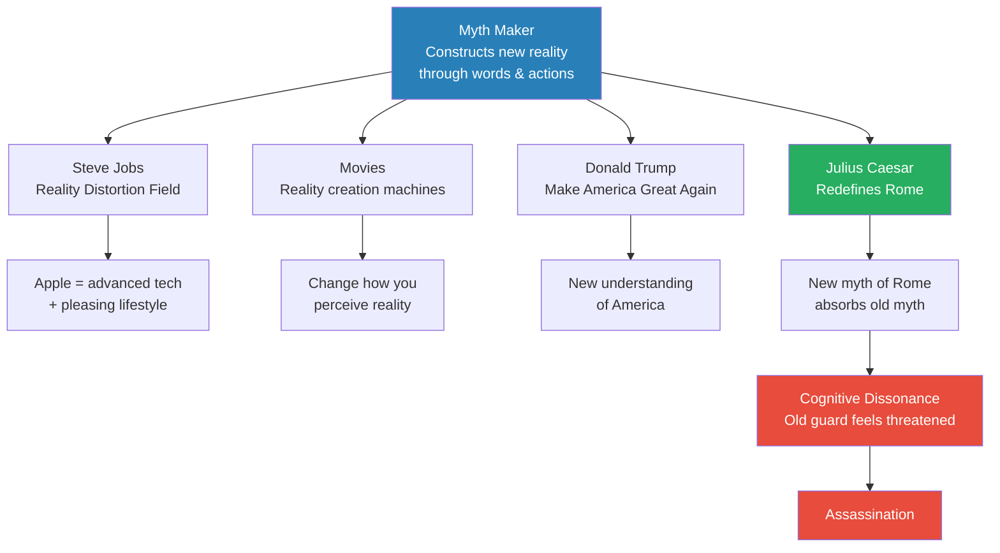
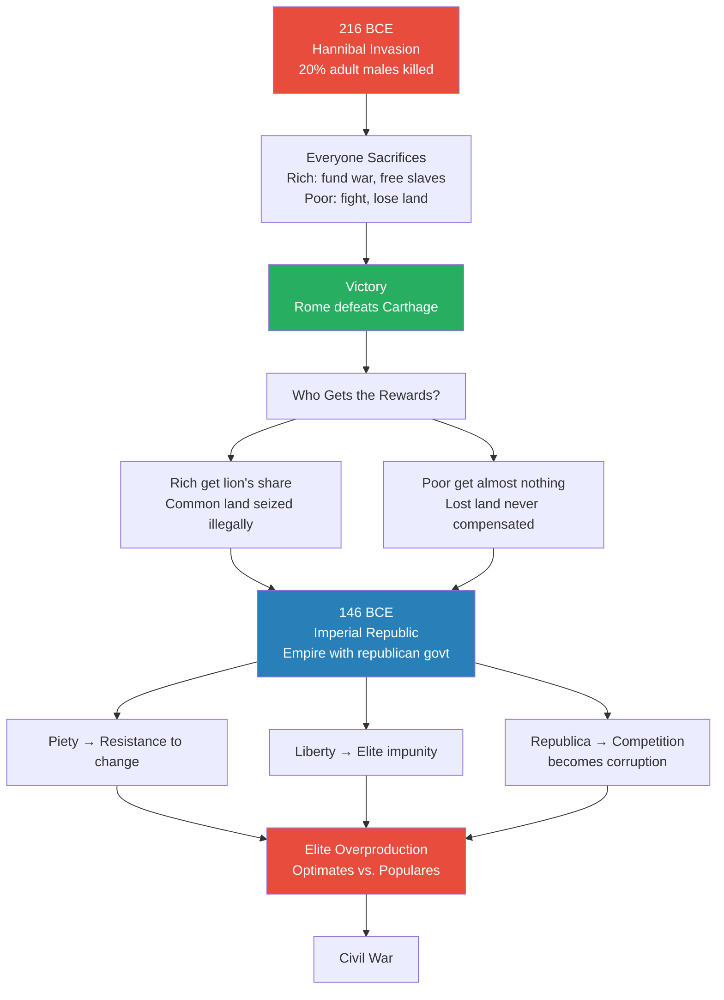
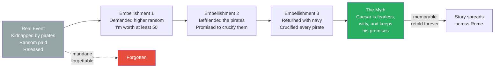
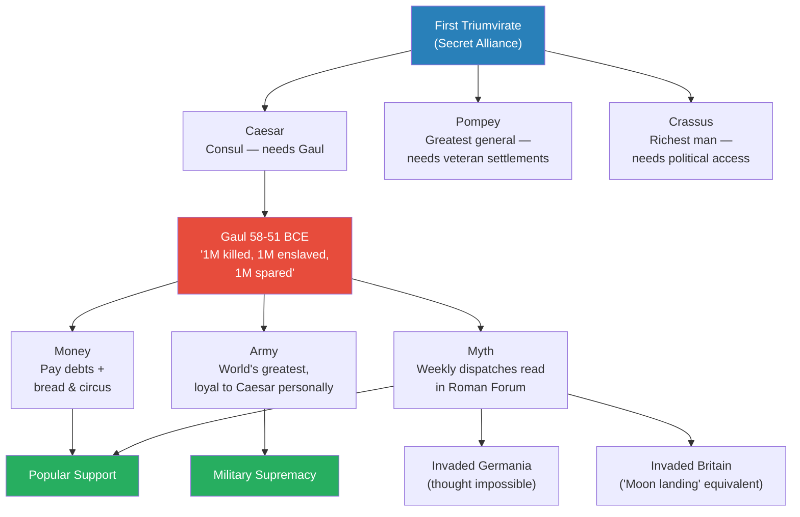
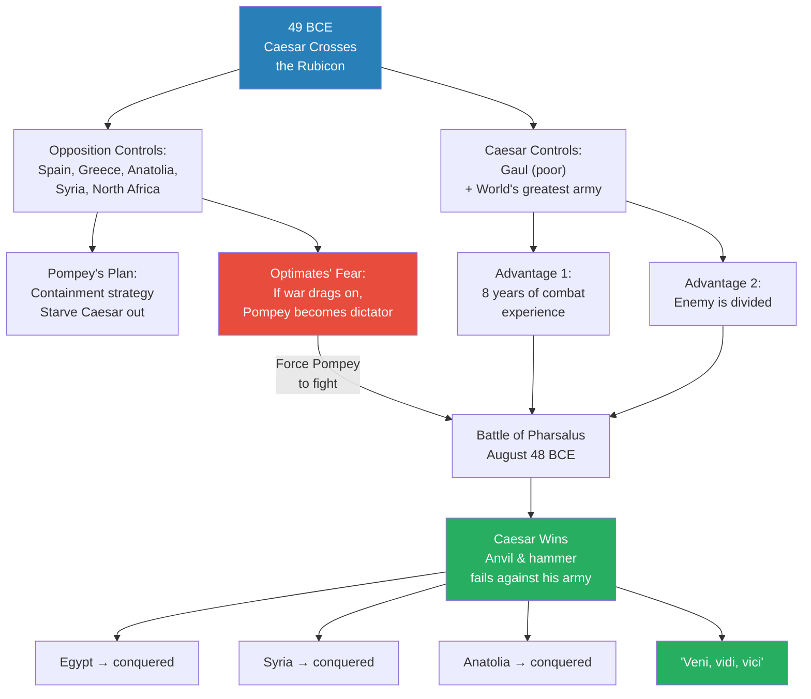
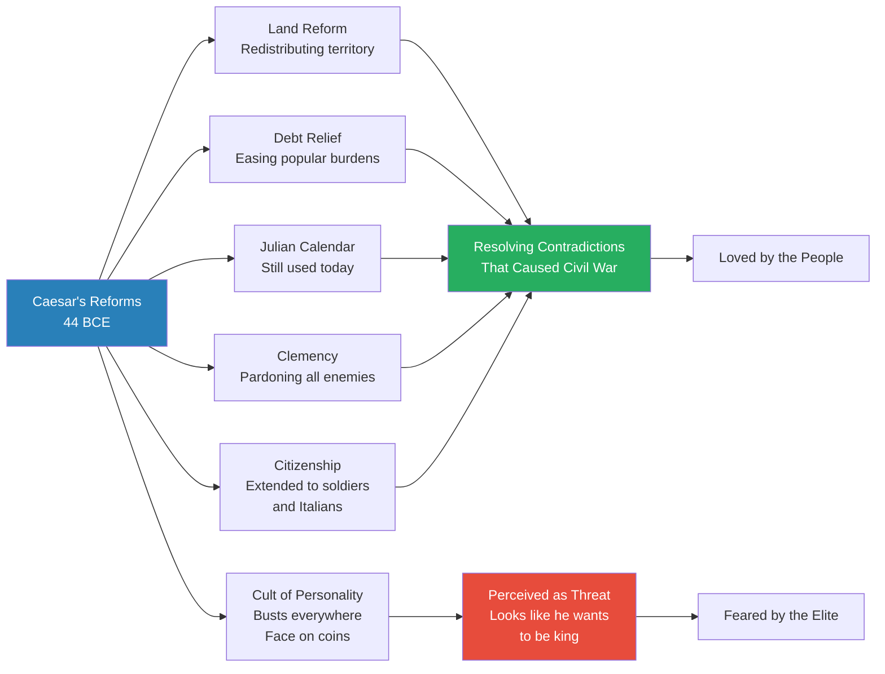
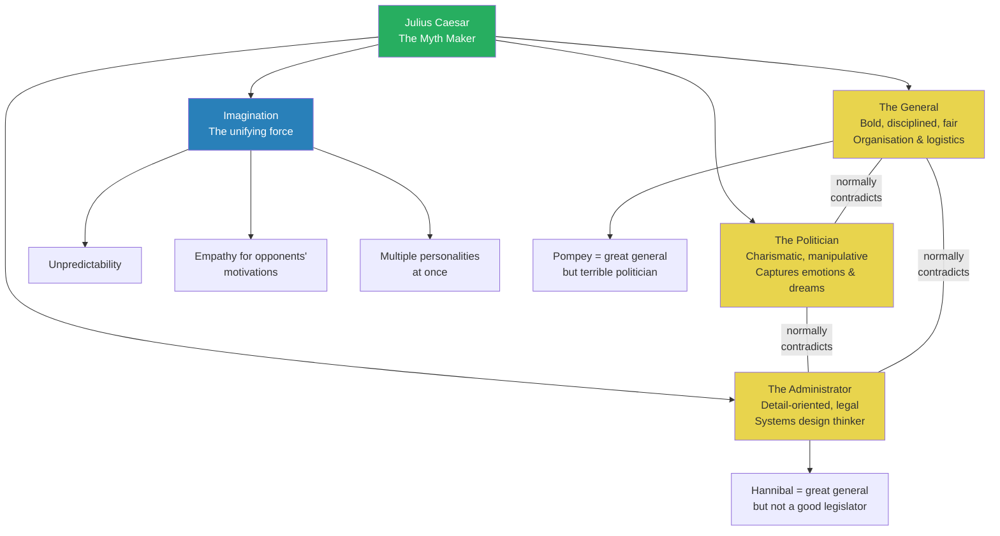
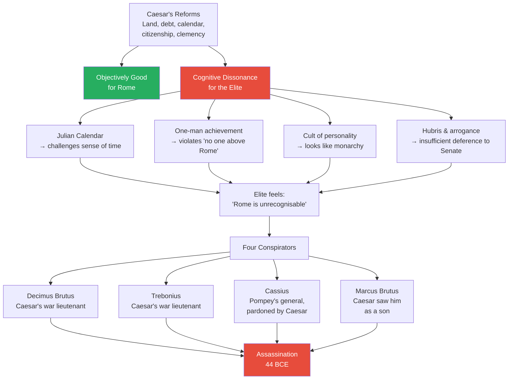

# The Myth-Making Genius of Julius Caesar

> Prof. Jiang presents Julius Caesar not as a military genius or a political tyrant but as something rarer and more dangerous: a myth maker — someone who constructs a new reality so compelling that it absorbs the old one. Caesar was simultaneously a great general, a masterful politician, and a visionary legislator, and the force that unified these contradictory roles was imagination. He succeeded because he could rewrite reality; he was killed because the people closest to him could not survive the cognitive dissonance his new reality created. The lecture traces the structural contradictions of the late Roman Republic — elite overproduction, land inequality, the impossible tension between imperial power and republican values — to show why Caesar's myth-making was both necessary and fatal.

---

## Overview: Key Highlights

- <b style="color: #2980b9">Myth maker</b> — Prof. Jiang's central concept: individuals who change history by constructing a new reality that absorbs the old one, through words, writings, and actions
- <b style="color: #27ae60">Caesar was general, politician, and legislator simultaneously</b> — most great Romans excelled at one; Caesar's imagination unified all three, making him unpredictable and unbeatable
- <b style="color: #e74c3c">The Imperial Republic was a contradiction that could not resolve itself</b> — Rome's republican values of piety, liberty, and Republica became obstacles once Rome became an empire
- <b style="color: #2980b9">Elite overproduction</b> — Peter Turchin's framework applied to Rome: too many elites competing for finite honours, with optimates vs. populares as the structural expression
- <b style="color: #27ae60">Caesar's clemency was itself myth-making</b> — by pardoning enemies rather than executing them, Caesar constructed the image of a merciful conqueror unlike any Rome had seen
- <b style="color: #e74c3c">The Gracchi assassination broke the Republic</b> — the system proved incapable of internal reform when the Senate murdered both brothers for proposing reasonable land redistribution
- <b style="color: #2980b9">Bread and circus</b> — Caesar sent war profits back to Rome to fund public feasts and festivals, building popular loyalty while fighting in Gaul
- <b style="color: #e74c3c">Caesar was killed by his friends, not his enemies</b> — the four conspirators (Decimus Brutus, Trebonius, Cassius, Marcus Brutus) were all people Caesar had personally elevated or pardoned
- <b style="color: #2980b9">Cognitive dissonance</b> — the real reason for the assassination: Caesar's reforms, however beneficial, disrupted the identity and worldview of the Roman elite
- <b style="color: #27ae60">"Veni, vidi, vici"</b> — Caesar's three-word dispatch to the Senate captured the myth-making genius: compress a military campaign into a phrase that lives forever
- <b style="color: #2980b9">Piety, liberty, and Republica</b> — the three pillars of Roman identity that both created Rome's greatness and prevented it from adapting to imperial reality
- <b style="color: #e74c3c">Sulla's proscriptions set the precedent for political murder</b> — a public kill list of 1,000-2,000 people, rewarding assassins with the victims' property

| Concept | One-line summary |
|---------|-----------------|
| **Myth maker** | Someone who constructs a new reality through words and actions so compelling it replaces the existing one |
| **Imperial Republic** | Rome's fatal contradiction: an empire governed by republican institutions designed for a small city-state |
| **Piety, liberty, Republica** | The three Roman values that united the city against Hannibal but became obstacles to necessary reform |
| **Optimates** | "The best people" — the upper nobility who wanted to preserve the traditional system |
| **Populares** | The lower nobility who aligned with the people to gain political power and push for reform |
| **Elite overproduction** | Too many elites competing for finite resources and honours — the structural cause of Roman instability |
| **Proscription** | Sulla's invention: a public kill list sanctioning murder for political purposes, with victims' property as reward |
| **Triumph** | A military parade establishing a general as a hero of Rome — the highest honour, benefiting entire family lines |
| **Bread and circus** | Using public entertainment and food distribution to build popular loyalty |
| **Clemency** | Caesar's deliberate policy of pardoning defeated enemies — both genuine mercy and strategic myth-making |
| **Cognitive dissonance** | The psychological discomfort caused when new realities disrupt established identity and worldview |
| **Cult of personality** | Caesar's busts, coins bearing his face, and public image campaign — constructing himself as larger than any institution |

---

# The Lecture

## What Is a Myth Maker? [0:00 - 6:30]

*Prof. Jiang opens with three questions about Caesar's life — what motivated him, why was he so successful, and why did his friends kill him — then introduces the concept that answers all three: Caesar was a myth maker, someone who constructs a new reality so compelling that it absorbs and replaces the old one.*

> [!tip] Core Insight
> A myth maker does not simply tell lies or spin propaganda. He constructs a new reality through words, writings, and actions — and lives inside it as the protagonist of a story he is writing. The myth becomes real because people choose to participate in it.

*The myth maker framework connects Caesar to modern figures — the mechanism is identical across eras. The green path traces Caesar's trajectory; the red nodes show why myth-making is inherently dangerous.*

> [!note]- Expand: Full Lecture Detail
> Prof. Jiang opens by framing the lecture around three questions about Julius Caesar's life:
>
> - **What did he want?** Did he want to become king of Rome, or was he trying to save the Republic? This debate has raged for 2,000 years unresolved.
> - **Why was he so successful?** He was one man who took on the entire Roman Empire and won. How did he accomplish so much in only 55 years?
> - **Why did they kill him?** He was killed by his friends — people he grew up with, fought wars with, pardoned and showed mercy to.
>
> His central argument: <b style="color: #2980b9">Caesar was so successful because he was a myth maker</b>.
>
> Prof. Jiang defines the concept carefully:
> - Myth makers are individuals who change the course of human history
> - They see themselves as a "man of destiny who must change the world for the better"
> - They construct a new reality that "begins to absorb the old reality and alters it"
> - They do this through their words, speeches, writings, and actions
> - They see themselves as "the main character, the protagonist in a novel that they are writing"
>
> He offers three modern analogies to make the concept concrete:
>
> - **Steve Jobs** — "Steve Jobs had a secret weapon called a reality distortion projector." Jobs lied to people, but in such an appealing way that it changed reality. Today we all use Apple computers because we are "participating in the myth that Steve Jobs created for us" — technology plus lifestyle plus attitude.
> - **Movies** — "Movies are reality creation machines." A great film sticks in your mind and changes how you perceive reality.
> - **Donald Trump** — Trump "wants to make America great again" by constructing a new understanding of America that "absorbs the imagination of everyone around him."
>
> Then the warning: <b style="color: #e74c3c">the problem with being a myth maker is that by creating new myths, you are disrupting old myths that people rely on for their understanding of the world</b>. This creates cognitive dissonance — psychological discomfort — and "people don't like cognitive dissonance." Caesar was killed because "his new myth of Rome was surpassing the old myth of Rome, and that made the old guard uncomfortable."

---

## The Hannibal Legacy and Rome's Fatal Contradiction [6:30 - 20:00]

*Prof. Jiang rewinds to 216 BCE and the Hannibal invasion to show how Rome's finest hour created the structural contradictions that would eventually destroy the Republic. The three values that saved Rome — piety, liberty, and Republica — became impossible to maintain once Rome transformed from a poor, small, threatened city into a wealthy empire.*

> [!tip] Core Insight
> The values that save a civilization in crisis become the chains that prevent it from adapting to success. Rome's piety, liberty, and Republica were perfectly suited to a poor city under siege — and perfectly toxic to a wealthy empire that needed reform.

*Rome's trajectory from Hannibal to civil war is a single causal chain. Victory over Carthage created the wealth that corrupted the republic, and the very values that enabled victory prevented the reforms that might have saved it.*

> [!note]- Expand: Full Lecture Detail
> Prof. Jiang connects this lecture to the previous one on Hannibal and Rome. He recalls the Battle of Cannae (216 BCE), where Rome lost roughly 20% of its adult male population. Rome should have surrendered or negotiated, but instead fought on because of its mythology based on three principles:
>
> - <b style="color: #2980b9">Piety</b> — devotion to the gods, ancestors, and tradition
> - <b style="color: #2980b9">Liberty</b> — freedom of Roman citizens
> - <b style="color: #2980b9">Republica</b> — public virtue; the best and brightest compete to promote Rome's national welfare
>
> Everyone sacrificed:
> - The rich paid for the war and freed their slaves so they could become citizens and fight
> - The poor fought in the army and lost their land through Rome's <b style="color: #2980b9">scorched earth policy</b> — making land unfarmable so Hannibal's army could not feed itself
> - This was Rome's "finest hour" — the moment when existential threat united every citizen
>
> **The problem came after victory:** Who got the rewards?
> - The rich controlled the government (Rome was a republic, not a democracy)
> - The rich received the lion's share of new territory conquered from Carthage
> - <b style="color: #e74c3c">Common land — territory that should have been distributed to all — was simply claimed by the rich as their own</b>, even land they occupied illegally
>
> By 146 BCE, Rome had defeated all major enemies (Etruscans, Carthaginians, Greeks) and become an empire. But this created a fundamental contradiction: <b style="color: #e74c3c">it was an Imperial Republic — an empire governed by institutions designed for a small city-state</b>. The three values that made Rome strong now became problems:
>
> - **Republica corrupted:** Winning political office was supposed to be meritocratic — prove you were the best speaker, had the best resume. But now wealth enabled bribery, and "very soon, bribery just became a fact of politics in Rome"
> - **The triumph system perverted:** Once elected, officials became generals who went to provinces not to serve Rome but to recover bribe money by exploiting locals and starting unnecessary wars
> - **The poor suffered:** Drafted into distant wars (Spain, Syria) for years, their land went uncultivated, they fell into debt, and the rich bought their land cheaply
> - The rich used land for cash crops and private parks, not food production — "for the first time in its history, Rome couldn't feed itself"
>
> > [!example] The Gracchi Brothers and the Death of Reform
> > - Tiberius and Gaius Gracchus were lower nobility who proposed a simple idea: land reform
> > - The proposal was reasonable: Rome would buy out the rich from land they were illegally occupying
> > - The rich would be compensated, not simply expelled
> > - The redistributed land would go to the poor, creating a social safety net
> > - The poor could then feed themselves and grow grain for Rome's population
> > - The rich refused because they opposed any change that challenged the social hierarchy
> > - Both brothers were assassinated by the conservative elite
> > **The lesson:** The assassination of the Gracchi proved the Republic was incapable of internal reform. The system could not change itself — and most historians mark this as the beginning of the Republic's fall.
>
> Prof. Jiang introduces Peter Turchin's concept of <b style="color: #2980b9">elite overproduction</b>: in times of peace and population growth, too many elites compete for finite positions of power. The conflict splits along a predictable line:
>
> - <b style="color: #2980b9">Optimates</b> ("the best people") — the established upper nobility, happy with the system as it is, committed to tradition
> - <b style="color: #2980b9">Populares</b> — the lower nobility who want prestige and honour, and align themselves with the masses to gain political power
>
> He clarifies: these are not separate social classes. "There's exactly like 20 noble families in Rome. The optimates are maybe like the fathers, and the populares are like the sons." They all know each other. They are cousins competing within the same elite.
>
> The escalation from the Gracchi onward:
> - The <b style="color: #2980b9">Social War</b> — Italian allies who fought Rome's wars rebel after being denied citizenship; Rome is forced to grant it
> - Servile wars (slave revolts) and piracy
> - The civil war between **Sulla and Marius** — both march their armies into Rome and kill their enemies, something "never done in Roman history before"
> - Sulla wins and invents <b style="color: #2980b9">proscription</b>: a public list of 1,000-2,000 individuals sanctioned to be killed, with their assassins rewarded with the victims' property
>
> One of those proscribed was a 19-year-old named Julius Caesar — nephew of Marius, from the prestigious Julian family. His family's wealth bought his survival. After Sulla died, the conflict only intensified.
>
> Prof. Jiang frames Caesar's self-understanding: "He grew up in a time of the Imperial Republic, a contradiction, and he saw himself as the man of destiny to save the Republic by implementing the reforms necessary in order to restore stability in Rome. He basically wanted to make Rome great again."

---

## Caesar the Young Myth Maker [20:00 - 30:10]

*Prof. Jiang shows how Caesar understood from an early age that public image was power. The pirate kidnapping story — embellished in three deliberate ways — reveals the myth-making method: it does not matter if the facts are true; what matters is whether the details are appealing enough that people remember and retell the story.*

*The pirate story shows the myth-making method in its purest form: take a mundane event, add three memorable embellishments, and the embellished version becomes reality because people retell it.*

> [!note]- Expand: Full Lecture Detail
> Prof. Jiang transitions to Caesar's personal life. Two things distinguished Caesar from an early age:
> - He saw himself as special
> - He cared intensely about his public image — "he cared about how people perceived and remembered him"
>
> > [!example] The Pirate Kidnapping (c. 75 BCE)
> > - At age 25, Caesar was sailing to Anatolia to work as an official
> > - Piracy was rampant due to corruption, inequality, and poverty in the empire
> > - Pirates captured and kidnapped him — not unusual for a nobleman
> > - They demanded a ransom of 20 silver talents; his family paid; he was released
> > - This is the real story — simple, unremarkable, forgettable
> > - **Embellishment 1:** Caesar claimed he was insulted by the ransom amount. "How dare you ask for 20? I'm worth at least 50."
> > - **Embellishment 2:** Caesar said he befriended the pirates, drank with them, and told them: "After I go home, I'm going to come back and crucify every one of you." The pirates laughed.
> > - **Embellishment 3:** After release, Caesar raised a navy, hunted down the pirates, and crucified every one of them. "We actually don't know if he actually did this."
> > **The lesson:** Caesar understood that facts do not create myths — appealing details do. "It doesn't matter if the facts are true or not. What matters is how appealing are the details." The story you remember forever and tell others is the one that spreads.
>
> Prof. Jiang then covers Caesar's early career:
> - Through bribery and charisma, Caesar was elected <b style="color: #2980b9">praetor</b>
> - As praetor, he went to Spain, fought wars against Spanish tribes, and won a <b style="color: #2980b9">triumph</b>
> - The triumph was the greatest honour in Rome — a military parade establishing you as a hero, benefiting your entire family line for generations
>
> The optimates' hatred intensified:
> - They saw Caesar as "arrogant," "impious," caring only about personal glory rather than Rome's welfare
> - He had a reputation as a libertine — sleeping with men and women indiscriminately
> - Three optimates in particular — **Cato**, **Scipio**, and **Cicero** — "hate Julius Caesar with a passion"
> - Prof. Jiang uses the phrase <b style="color: #e74c3c">"Caesar derangement syndrome"</b> — they had decided to destroy him at any cost
>
> The optimates forced a choice: Caesar could keep his triumph OR stand for the consulship, but not both. They assumed his ego would choose the triumph.
>
> <b style="color: #27ae60">Caesar surprised everyone by giving up the triumph</b> — "I don't want this crap. I want to stand for election." Prof. Jiang highlights the pattern: "He's unpredictable. He understands the mentality or the motivations of his opponents, but his opponents never understand him. They always underestimate him."

---

## The First Triumvirate and the Conquest of Gaul [30:10 - 39:51]

*Caesar forms a secret alliance with his political enemies — Pompey and Crassus — then uses the consulship to secure Gaul, where eight years of war create the world's greatest army, a cult of personality, and a new reality in which Caesar is Rome's greatest conqueror.*

> [!tip] Core Insight
> Caesar's Gallic wars served three purposes simultaneously: money to pay debts and fund bread and circus, a battle-hardened army loyal to him personally, and a myth of Caesar as conqueror that captured the imagination of every Roman. The genocide was the price of the myth.

*The Gallic wars were not just military campaigns — they were a three-pronged myth-making operation. Every battle served money, army, and narrative simultaneously.*

> [!note]- Expand: Full Lecture Detail
> As consul, Caesar pushed land reform while the optimates obstructed him at every turn. They also pre-assigned the next consul to Italy — "building roads and cutting trees" — to prevent Caesar from fighting wars and winning glory.
>
> Caesar's response was to form an alliance that "was completely unexpected": the <b style="color: #2980b9">First Triumvirate</b> with Pompey and Crassus.
>
> - **Pompey** ("Pompey the Great") — Rome's greatest general, angry because the Senate refused to settle his veterans with land
> - **Crassus** — the richest man in Rome, angry because the Senate blocked his political career
> - **Caesar** — a popularis allying with two optimates: "he was able to form an alliance with people who were technically his enemies"
>
> The deal: Caesar as consul would settle Pompey's veterans and promote Crassus's tax reforms. In return, they would secure him the governorship of Gaul after his consulship.
>
> From 58 to 51 BCE, Caesar governed Gaul. Prof. Jiang is blunt: "He goes and commits genocide in Gaul." In Caesar's own words: "I killed a million Gauls in war. I enslaved a million Gauls, and then I let a million Gauls live."
>
> The three strategic purposes of the Gallic wars:
>
> - **Money:** Caesar was deep in debt from bribing his way to the consulship. War profits covered debts, and the surplus funded <b style="color: #2980b9">bread and circus</b> — public feasts and festivals in Rome to build popular loyalty
> - **Army:** Eight years of constant fighting against tough Gallic warriors created "the most loyal, the most disciplined army in the world — and they're all loyal to him personally, because he's the one rewarding them"
> - **Myth:** Caesar wrote dispatches and sent soldiers back to Rome, where they read his accomplishments aloud in the Forum every week. "The things he was doing basically captured the imagination of Rome"
>
> Two exploits in particular built the myth:
>
> > [!example] The Invasion of Germania
> > - Romans believed the Germanic tribes were so barbaric that attacking them was impossible
> > - Caesar crossed into Germania and fought them anyway
> > - The military value was secondary — the symbolic value was enormous
> > - Caesar had ventured where no Roman dared
> > **The lesson:** Myth-making requires doing what people believe is impossible — the act itself becomes the story.
>
> > [!example] The Two Expeditions to Britain
> > - Britain existed in the Roman imagination as a mystical, almost imaginary place
> > - "Aren't there like dragons in Britain? Aren't there like sea monsters?"
> > - Caesar launched two major expeditions that "didn't really do anything" militarily
> > - "But that was not the point. The point was Caesar ventured into the unknown"
> > - Prof. Jiang compares it to the moon landing: an act of imagination as much as conquest
> > **The lesson:** The myth maker does not need to achieve practical results. He needs to do something so unprecedented that it rewrites what people believe is possible.

---

## Caesar vs. Pompey: The Civil War [39:51 - 49:41]

*The optimates strip Caesar of command and force a showdown. Caesar crosses the Rubicon with one army against an entire empire. His two advantages — a superior army and division within the opposition — prove decisive, especially when the optimates force Pompey into the battle he knows he should avoid.*

*The civil war was decided not by Caesar's strength but by the opposition's internal contradiction: the optimates feared Pompey's growing power as much as Caesar's, so they forced a premature battle that their best general knew he should avoid.*

> [!note]- Expand: Full Lecture Detail
> While Caesar built his myth in Gaul, the optimates — Cato, Scipio, and Cicero — recognised the threat: "They realise this guy's not beatable. If he runs for elections, he's gonna win all the elections."
>
> Their plan: strip Caesar of his military command and put him on trial for the illegal acts he committed gaining power. Caesar recognised this meant war and crossed the Rubicon — declaring war on the Roman Senate.
>
> The Senate appointed Pompey to counter Caesar. The strategic situation:
>
> - **Caesar controlled:** Gaul — poor, with limited resources, but with the world's finest army
> - **The opposition controlled:** Spain, Greece, Anatolia, Syria, and North Africa — the provinces that fed Rome
> - **Pompey's optimal strategy:** <b style="color: #2980b9">containment</b> — simply wait. Caesar could not feed Rome from Gaul. Eventually, starvation would turn the Roman people against him. "All Pompey has to do is wait."
>
> Caesar's two advantages:
> - An army hardened by eight years of constant warfare — "extremely disciplined, extremely devoted"
> - <b style="color: #e74c3c">Division within the opposition</b> — the optimates did not trust Pompey either. "Even if Caesar loses, they'll make Pompey the dictator." The optimates wanted the status quo, not a new strongman.
>
> This division proved fatal. The optimates pushed Pompey to fight quickly rather than let his power grow, overriding his strategic judgment.
>
> Caesar's campaign:
> - **Spain:** Crushed all opposition, then offered <b style="color: #27ae60">clemency</b> — "We're all Romans. We're all fighting for the greater good of Rome." Enemies could go home if they promised not to fight again. Many chose to join Pompey instead.
> - **Pharsalus (August 48 BCE):** Pompey used the <b style="color: #2980b9">anvil and hammer strategy</b> — infantry locks the enemy in place, cavalry sweeps from behind. "This is the strategy that Philip and Alexander the Great used against the Greeks and Persia." But Caesar's army was so disciplined they withstood the cavalry charge and destroyed Pompey's forces.
> - **Egypt, Syria, Anatolia:** conquered in rapid succession
>
> When the Senate asked for a report, Caesar delivered the most famous myth-making line in history: <b style="color: #27ae60">"Veni, vidi, vici"</b> — "I came, I saw, I conquered." Three words in Latin. "The most powerful Latin phrase ever spoken in human history."
>
> > [!quote] Julius Caesar
> > "Veni, vidi, vici."
>
> Prof. Jiang notes the battles where Caesar's army acted beyond his control:
>
> > [!example] The Battle of Thapsus — Soldiers Who Refused Mercy
> > - Caesar's veterans were exhausted and wanted the war to end
> > - At the Battle of Thapsus in Africa, they defied Caesar's direct orders not to engage
> > - They attacked on their own initiative and won
> > - Caesar ordered them to show mercy to the defeated
> > - His veterans massacred the enemy instead — "to ensure they can't fight back again"
> > **The lesson:** Even the myth maker cannot fully control the reality he creates. Caesar's army had internalised the logic of total war beyond what Caesar himself intended.
>
> > [!example] The Battle of Munda — Fighting Uphill
> > - The last battle, in Spain, against enemies positioned on a hill
> > - Military doctrine says never attack uphill — the disadvantage is enormous
> > - Caesar's soldiers were so experienced they simply "marched up the hill and destroyed the enemy"
> > - This demonstrated how far beyond normal military capability Caesar's army had evolved
> > **The lesson:** Eight years of constant war had produced soldiers who could do what no textbook said was possible.

---

## Caesar's Reforms and the Cult of Personality [49:41 - 53:11]

*Caesar returns to Rome in 44 BCE as undisputed master. He launches sweeping reforms — land redistribution, debt relief, the Julian calendar, expanded citizenship — while simultaneously building a cult of personality that makes the Roman elite increasingly uneasy.*

*Caesar's reforms addressed every structural problem that had plagued the Republic — but the cult of personality that accompanied them made the reforms look like a power grab rather than public service.*

> [!note]- Expand: Full Lecture Detail
> Caesar returned to Rome and launched legislative reform addressing the structural contradictions that had caused decades of instability:
>
> - **Land reform** — redistributing territory to address the inequality that began after the Hannibal wars
> - **Debt relief** — easing the burden on the poor
> - **The Julian calendar** — replacing the lunar calendar with a solar calendar designed with astronomers, "which is exactly what we still use today"
> - **Clemency** — any former enemy willing to work for Rome's good was invited back into the Senate
> - **Citizenship** — extended to his soldiers and to Italians
>
> Prof. Jiang notes: "What Caesar was doing was basically trying to resolve a lot of the contradictions that led to instability and civil war."
>
> But alongside reform came the cult of personality:
> - Busts of Caesar placed throughout Rome — "he was everywhere"
> - Coins minted with his face on them
> - His ambition extended beyond reform: he planned to conquer Parthia (the old Persian Empire) and then Germania — "he basically wanted to conquer the entire world"
>
> "He was loved by the people" — but the combination of genuine reform and personal glorification blurred the line between saviour and king.

---

## Why Was Caesar So Successful? The Three-in-One Genius [53:11 - 58:00]

*Prof. Jiang answers the second question by arguing that Caesar was unique because he combined three contradictory personality types — general, politician, and administrator — in a single person. The unifying force was imagination, which allowed him to inhabit all three roles simultaneously and remain perpetually unpredictable.*

*Most great Romans excelled at one role. Caesar's imagination let him inhabit all three simultaneously — the same faculty that made him a myth maker made him a three-in-one genius.*

> [!note]- Expand: Full Lecture Detail
> Prof. Jiang identifies three types of individuals who accomplish great things in society, each with distinct personality traits:
>
> - **The General** — bold, disciplined, fair. Concerned with organisation and logistics. "How do you move an army from place to place? How do you feed your army? That's what Hannibal did."
> - **The Politician** — "an avatar of the people." Charismatic, manipulative, able to capture and represent the emotions, dreams, and longings of the masses.
> - **The Administrator/Legislator** — detail-oriented, concerned with law and regulation. "Almost a systems design thinker — very big picture, trying to figure out how the different pieces fit together."
>
> These three are "very different personalities — they're contradictions with each other." Most great leaders excel at one:
> - Pompey was a great general but a terrible politician
> - Hannibal was a great general but not a good legislator
>
> <b style="color: #27ae60">What made Caesar distinctive is he was all three at once.</b> The force that enabled this was <b style="color: #2980b9">imagination</b>: "He was able to imagine himself as different people at once, and therefore he was different people at once. He had multiple personalities, and that's why he was so unpredictable."
>
> This imaginative capacity is also why he could understand his opponents' motivations when they could never understand his — and why he became a myth maker. The same imagination that let him inhabit three contradictory roles let him construct a new reality and live inside it as its protagonist.

---

## Why They Killed Him: Cognitive Dissonance and the Death of the Myth Maker [58:00 - 1:03:52]

*Prof. Jiang answers the final question: Caesar was killed not by enemies but by friends — people he had elevated, fought alongside, and pardoned — because his reforms, however beneficial, disrupted the Roman elite's identity. The assassination was not about policy disagreement but about the unbearable psychological discomfort of having your reality rewritten by someone else.*

> [!tip] Core Insight
> Caesar did nothing wrong — every reform served Rome's interests. But reform causes cognitive dissonance: it disrupts identity, challenges worldview, and makes the future feel uncertain. The conspirators killed Caesar not because he was bad for Rome, but because his new myth made them unable to recognise the Rome they had grown up in.

*The assassination diagram reveals the cruel paradox: Caesar's clemency — pardoning Cassius, loving Marcus Brutus — created the very people who killed him. His mercy was genuine, but it could not overcome the cognitive dissonance his reforms produced.*

> [!note]- Expand: Full Lecture Detail
> Prof. Jiang identifies the four major conspirators against Caesar, emphasising that every one of them was personally close to him:
>
> - **Decimus Brutus** — Caesar's lieutenant in war
> - **Trebonius** — another of Caesar's major war lieutenants
> - **Cassius** — had fought for Pompey, but Caesar pardoned him because he recognised Cassius as a great general
> - **Marcus Brutus** — "Caesar actually saw him as a son"
>
> "These are the people who are closest to Caesar, and they ultimately killed Caesar."
>
> Prof. Jiang then explains the mechanism. A student asks how Caesar challenged Roman identity. He lists the specific disruptions:
>
> - **The Julian calendar** — "He was challenging people's sense of time." Replacing the lunar calendar with a new system disrupted something fundamental about daily experience.
> - **One-man achievement** — Caesar was winning military victories, introducing legislation, and reforming the state all by himself. But Roman identity taught that "no one is above Rome. Everyone is equal in the eyes of Rome." A general who won against Carthage did so because he fought for Rome, not because he was a great man.
> - **Cult of personality** — busts everywhere, face on coins, personal glory exceeding institutional glory
> - **Perceived desire for kingship** — "Rome does not need kings. In fact, Rome is anti-monarchy." Caesar showed insufficient deference to the Senate and appeared to want divine status.
>
> > [!example] The Rice Analogy — Why Beneficial Reform Still Provokes Violence
> > - Prof. Jiang asks the class: imagine the Chinese government outlaws rice
> > - The reason is scientifically sound — white rice is nutritionally poor
> > - The replacement is objectively better — steak, potatoes, broccoli
> > - The result: every Chinese person would be healthier and stronger
> > - But how would Chinese people feel? "They'd be pissed"
> > - The reform is objectively correct but psychologically intolerable
> > - It disrupts identity — rice is not just food, it is who you are
> > **The lesson:** Cognitive dissonance is not about whether the change is good or bad. It is about whether the change disrupts your sense of who you are. Caesar's reforms were Rome's steak and potatoes — nutritionally superior but identity-destroying.
>
> Prof. Jiang's verdict: "Caesar did nothing wrong, and everything that Caesar did was for the good of Rome. But change, reform, causes cognitive dissonance. It makes people anxious and uncomfortable. It disrupts your identity, and that's why there's a conspiracy that ultimately killed Caesar."
>
> A final student question asks about the triumvirate. Prof. Jiang clarifies that Pompey and Crassus were both optimates — supporters of Sulla. Caesar was a popularis. "Their alliance was secret. It was completely unexpected, and that's why they were able to accomplish so much." It was born of pure expedience: each had issues the Senate was blocking. Caesar's genius was forming an alliance with his political enemies — "people who were technically his enemies" — through charisma and manipulation.
>
> Prof. Jiang closes by previewing Lecture 16: "Next class, we're going to look at the world that Caesar created, because after he dies, the Republic falls."

---

## Connections

**Builds on:** [[14 - Hannibal Barca, Lucius Brutus, and the Triumph of Rome]] (the Hannibal invasion, piety/liberty/Republica, Rome's mythology of sacrifice), [[06 - Elite Overproduction and the Bronze Age Collapse]] (Peter Turchin's elite overproduction framework applied directly to Roman optimates vs. populares), [[11 - The Greatness of Philip II of Macedon]] (anvil and hammer strategy, the three qualities of great leaders)
**Sets up:** [[16 - Julius Caesar's Will and Octavian's Birth of Empire]] (the fall of the Republic after Caesar's death and the birth of Empire)
**Related lectures:** [[12 - The Tyranny of Alexander the Great]] (hubris, cult of personality, one-man rule), [[08 - Rat Utopia and the Peloponnesian War]] (rise-and-fall paradox — the values that create greatness prevent adaptation)
**Related books in vault:** [[The 48 Laws of Power - Robert Greene]] (myth-making, image control, the danger of outshining the master), [[The 33 Strategies of War - Robert Greene]] (containment strategy, unpredictability, offensive warfare)

---

## The Takeaway

This lecture reframes Julius Caesar not as a conqueror or a dictator but as something the classical tradition has no word for: a reality engineer. Prof. Jiang's myth-maker concept — someone who constructs a new reality through words and actions until it absorbs the old one — connects Caesar to Steve Jobs, Trump, and the logic of cinema. The comparison is deliberately provocative, but it works: what made Caesar unique was not that he was the best general (Pompey was comparable), or the best politician (others were as charismatic), or the best administrator (many Romans understood law). It was that he was all three simultaneously, and the force that unified them was imagination — the same faculty that let him construct myths, inhabit contradictory roles, and remain permanently unpredictable.

The deepest insight is structural. The lecture demonstrates that the Roman Republic did not fail because of bad leaders or moral decay — it failed because its values were designed for a poor, small, threatened city, and those values could not adapt to the reality of empire. Piety meant no change. Liberty meant elite impunity. Republica meant competition without regulation. The Gracchi assassination proved the system could not reform itself; Sulla's proscriptions proved it could not maintain order; Caesar's assassination proved it could not even tolerate the person who solved its problems. The Republic was not murdered — it was a contradiction that exhausted every possible resolution.

What remains unresolved is the question Prof. Jiang acknowledges has no answer after 2,000 years of debate: did Caesar want to be king? The lecture argues he did not — that he wanted to reform and restore, like Sulla before him. But the cult of personality, the coins, the busts, the hubris — these suggest a man who had begun to believe his own myth. The next lecture will explore what happens when the myth maker dies and the myth survives without its author.
