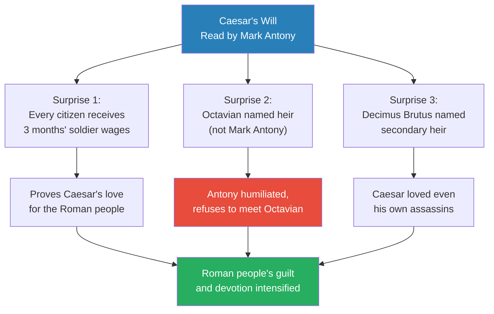
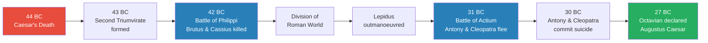
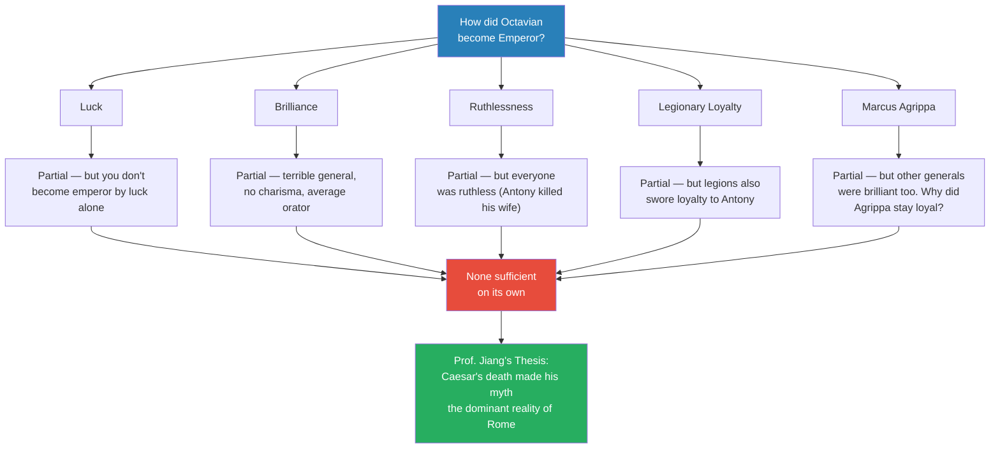
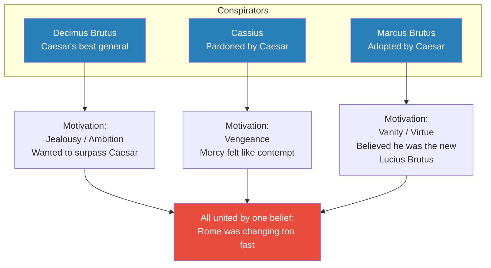
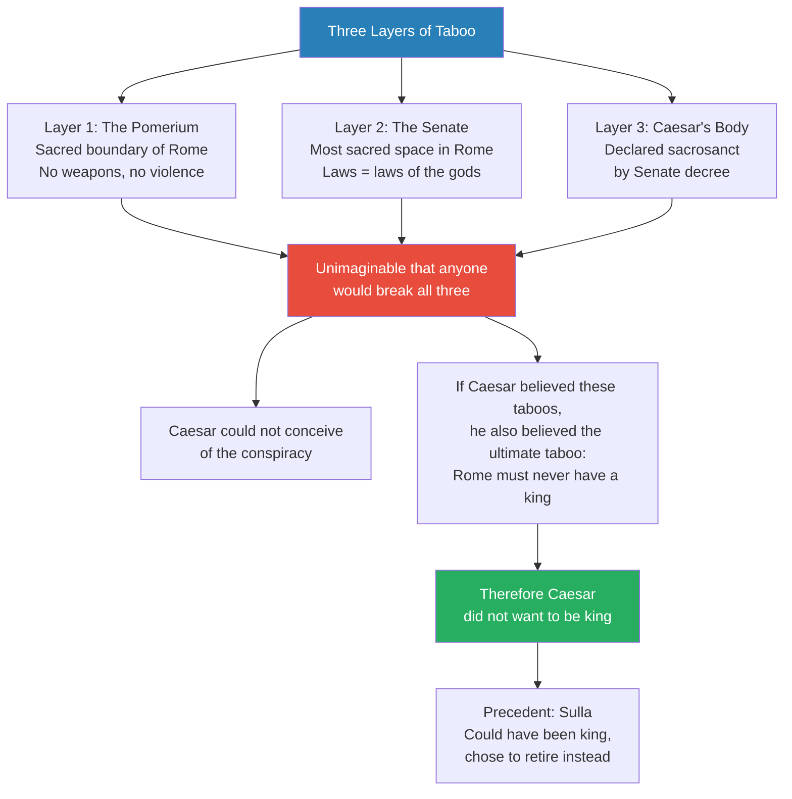
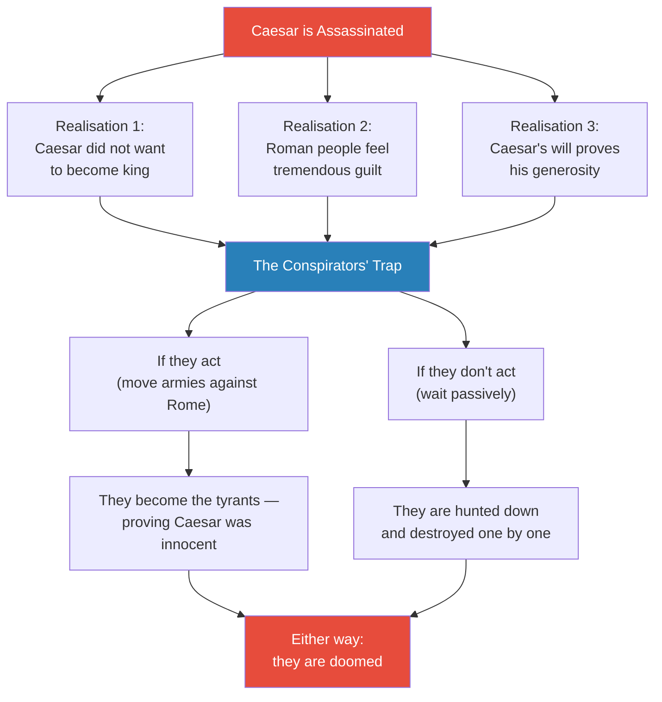
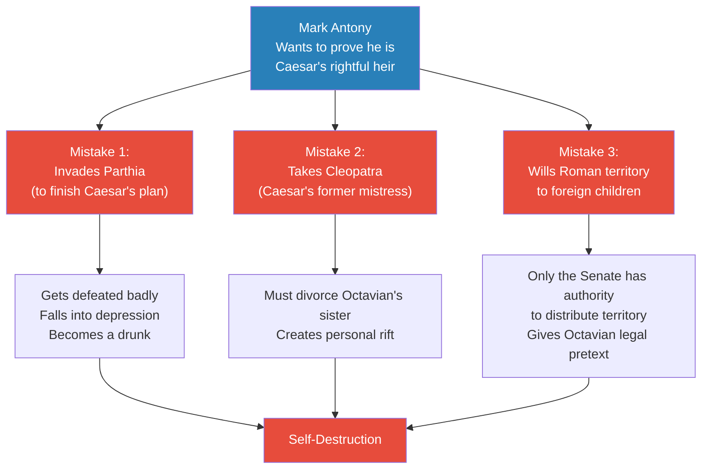
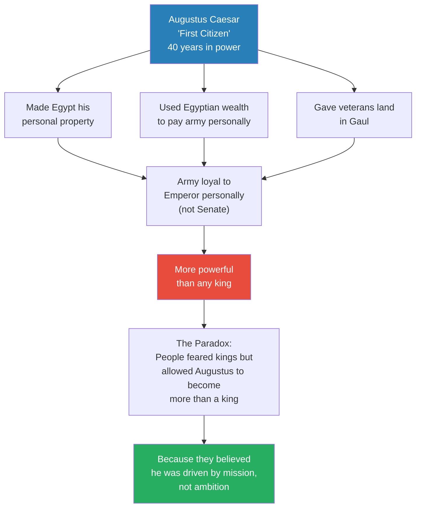
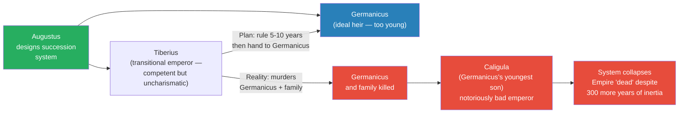

# Julius Caesar's Will and Octavian's Birth of Empire

> Prof. Jiang picks up immediately after Caesar's assassination in 44 BC and traces the fifteen-year civil war that ended the Roman Republic. The central question is not "what happened" but "how did Octavian — an eighteen-year-old with no army, no allies, and no charisma — defeat every rival and become emperor?" Five conventional explanations (luck, brilliance, ruthlessness, legionary loyalty, and Marcus Agrippa) each contain partial truth but none suffice. Prof. Jiang's thesis: Caesar's death transformed his myth from a contested political narrative into an unchallengeable reality that paralysed his enemies and propelled his heir. The love of the Roman people, born of guilt for doubting Caesar, was the force that made Octavian unstoppable.

---

## Overview: Key Highlights

- <b style="color: #27ae60">Caesar's death made his myth the dominant reality of Rome</b> — while alive, his myth competed with others; dead, it became unchallengeable
- <b style="color: #e74c3c">The conspirators were paralysed by their own logic</b> — if Caesar never wanted to be king, then killing him was a crime against Rome, and they could not act without proving themselves the tyrants they accused Caesar of being
- <b style="color: #2980b9">Caesar's will</b> — three surprises that reshaped Roman politics: generosity to every citizen, Octavian named heir over Mark Antony, and Decimus Brutus named secondary heir
- <b style="color: #27ae60">The love of the Roman people propelled Octavian into power</b> — not brilliance, not ruthlessness, but the transfer of devotion from father to adopted son
- <b style="color: #2980b9">The pomerium and Senate taboos</b> — sacred boundaries that made Caesar's assassination unimaginable and proved he never intended to become king
- <b style="color: #e74c3c">Mark Antony self-destructed chasing Caesar's shadow</b> — invading Parthia, taking Cleopatra, willing Roman territory to foreign children
- <b style="color: #2980b9">The Second Triumvirate</b> — Octavian, Antony, and Lepidus shared power, then systematically destroyed each other
- <b style="color: #27ae60">Octavian acted while others hesitated</b> — not brilliantly, but consistently; action in a world of paralysis was enough
- <b style="color: #e74c3c">Augustus destroyed the Republic he claimed to save</b> — the people's trust allowed him to concentrate power beyond any king
- <b style="color: #2980b9">Augustus's succession system</b> — adoption of the most competent relative, designed for perpetual good governance
- <b style="color: #e74c3c">Tiberius killed Germanicus and broke the system</b> — the succession plan collapsed within one generation, producing Caligula
- <b style="color: #27ae60">Political change is a war of myths</b> — whoever controls the dominant myth controls the state

| Concept | One-line summary |
|---------|-----------------|
| **Caesar's will** | Three shocking provisions that proved Caesar's love for Rome and named Octavian as heir |
| **Pomerium** | The sacred boundary of Rome — no weapons, no violence allowed within it |
| **Senate sacrosanctity** | The Senate was the most sacred space in Rome, violence there was the ultimate taboo |
| **Second Triumvirate** | Power-sharing dictatorship of Octavian, Antony, and Lepidus that destroyed the conspirators |
| **Battle of Philippi (42 BC)** | Largest battle in Roman history — Antony and Octavian crushed Brutus and Cassius |
| **Battle of Actium (31 BC)** | Naval battle where Octavian defeated Antony and Cleopatra, ending the civil war |
| **Augustus Caesar** | Title given to Octavian in 27 BC — "first citizen," effectively first emperor |
| **Myth as political force** | Caesar's death elevated his myth from contested narrative to unchallengeable reality |
| **Transfer of devotion** | The love people felt for Caesar transferred to his adopted son — the mechanism of Octavian's rise |
| **Succession by adoption** | Augustus's system for perpetuating good governance — adopt the best man, not your blood son |
| **Germanicus** | Augustus's chosen long-term heir — brilliant, beloved, murdered by Tiberius |

---

# The Lecture

## The Game of Thrones After Caesar's Death [0:01 - 5:30]

*Prof. Jiang opens with a rapid review of the situation in 44 BC. Caesar is dead, assassinated by sixty senators. Mark Antony has brokered a fragile peace with the conspirators, but he is working behind the scenes to turn public opinion against them. Then Caesar's will is read — and everything changes.*

> [!tip] Core Insight
> Caesar's will was a political earthquake: it proved his generosity to every citizen, bypassed his most loyal lieutenant in favour of an unknown teenager, and even named one of his own assassins as a secondary heir. It demonstrated a love so expansive it could embrace even the men who killed him.

*The will was not just a legal document — it was Caesar's final myth-making act. Each surprise deepened the Roman people's guilt for having doubted him and their devotion to his memory.*

> [!note]- Expand: Full Lecture Detail
> Prof. Jiang begins by reviewing the immediate aftermath of the assassination. Three main conspirators — Marcus Brutus (the leader), Cassius, and Decimus Brutus — led a conspiracy of sixty senators, roughly 7% of the Roman Senate. Mark Antony, the sitting consul and head of state, brokered a deal with the conspirators: he would not seek retribution, and in return they would declare Caesar was not a tyrant and did not want to become king.
>
> - This peace agreement was fragile from the start
> - Mark Antony worked behind the scenes to inflame public sentiment against the conspirators
> - Eventually the conspirators were forced to flee to the provinces
>
> Then came Caesar's will. Prof. Jiang reminds the class that Rome had private property, so when a man died, his will stipulated how that property would be distributed. Caesar's will contained three bombshells:
>
> - **First surprise:** Caesar, the wealthiest man in Rome, stipulated that every Roman citizen would receive three months of a soldier's wage upon his death — an extraordinary act of generosity. He also ordered much of his private property converted into public parks for the Roman people.
> - **Second surprise:** Mark Antony fully believed he would be named Caesar's heir. Instead, Caesar named Gaius Octavius — a virtual unknown, just eighteen years old — as his adopted son and primary heir. Upon adoption, Octavius became Gaius Julius Caesar Octavianus (historians use the shorthand "Octavian").
> - **Third surprise:** Caesar named secondary heirs who would inherit if Octavian died. Mark Antony was among them — but so was Decimus Brutus, one of the men who had conspired to kill Caesar.
>
> Prof. Jiang emphasises the political impact: "This will shows the Roman people that Caesar really loved them, and that Caesar loved everyone, including the people who conspired to kill him."
>
> Mark Antony was furious. When eighteen-year-old Octavian returned to Rome to claim his inheritance, Antony refused to meet him and refused to hand over Caesar's property and wealth. Octavian's response was remarkable: to honour Caesar's will, he borrowed enormous sums of money to ensure every citizen received their three months' wages. This single act established Octavian as Caesar's true heir in the eyes of the people.
>
> Prof. Jiang then maps the players in this "Game of Thrones" situation:
>
> - **Mark Antony** — considers himself Caesar's legitimate heir, refuses to acknowledge Octavian
> - **Octavian** — eighteen years old, no army, few allies, but demands recognition as heir
> - **Decimus Brutus** — in Gaul with a large army
> - **Marcus Brutus and Cassius** — in the Roman east (Anatolia and Syria) with the largest army ever assembled in Roman history, about 100,000 soldiers
> - **Lepidus** — a competent administrator with his own army, wanted to avenge Caesar but was stopped by Antony
> - **Cicero** — the last great optimate, controller of the Senate, whose sole motivation was maintaining senatorial supremacy by playing everyone against each other

---

## The Civil War: Octavian Destroys All Rivals [5:30 - 11:29]

*Over fifteen years, the teenager with no army systematically eliminated every rival. Prof. Jiang traces the sequence: Antony attacks Decimus Brutus, Cicero authorises Octavian to raise an army, the Second Triumvirate forms, they massacre a third of the Senate, crush Brutus and Cassius at Philippi, divide the world, and then turn on each other until only Octavian remains.*

*Fifteen years from assassination to empire. Each rival fell in sequence — the conspirators first, then Lepidus, then Antony — until the eighteen-year-old nobody became the most powerful man in the world.*

> [!note]- Expand: Full Lecture Detail
> Prof. Jiang traces the civil war step by step:
>
> - Mark Antony marched against Decimus Brutus in Gaul, wanting his armies
> - Cicero, to maintain the balance of power, authorised Octavian to raise his own army to challenge Antony
> - Antony lost, then stole Lepidus's army to march against Decimus Brutus again
> - Then something unexpected happened: Lepidus, Octavian, and Mark Antony sat down together and agreed to share power
>
> This was the <b style="color: #2980b9">Second Triumvirate</b> — and it was brutal:
>
> - Their first act was to kill all potential challengers, including Cicero — who had been Octavian's patron
> - They killed approximately a third of the Senate and replaced them with their own allies
> - Antony and Octavian then marched against Marcus Brutus and Cassius
>
> > [!example] The Battle of Philippi (42 BC)
> > - Marcus Brutus and Cassius had assembled roughly 100,000 soldiers in the Roman east — the largest army in Roman history at that time
> > - They had prepared for years, knowing conflict was inevitable
> > - The battle took place at Philippi in Macedonia, a city named after King Philip
> > - Mark Antony and Octavian triumphed in what was the largest battle in history at that point
> > - Both Marcus Brutus and Cassius were killed
> > **The lesson:** The largest army in Roman history could not overcome the political momentum of Caesar's myth.
>
> After Philippi, the three triumvirs divided the Roman world:
>
> | Triumvir | Territory | Significance |
> |----------|-----------|-------------|
> | **Octavian** | Rome and Italy | The political centre |
> | **Lepidus** | North Africa | The smallest share |
> | **Mark Antony** | Egypt, Anatolia, Syria | The lion's share — wealthiest provinces |
>
> - Lepidus came into conflict with Octavian — and Octavian gave a speech to Lepidus's soldiers that persuaded them to defect
> - Then Octavian came into conflict with Mark Antony
> - At the <b style="color: #2980b9">Battle of Actium</b> in 31 BC in Greece, Antony's forces allied with Cleopatra's forces faced Octavian
> - Antony and Cleopatra fled the battle, then committed suicide before capture
> - In 27 BC, Octavian returned to the Senate in triumph and was declared <b style="color: #27ae60">Augustus Caesar</b> — the first emperor of Rome

---

## Why Did Octavian Win? Five Explanations Tested [11:29 - 18:13]

*Prof. Jiang poses the lecture's central question: how did an eighteen-year-old with no army, no charisma, and no allies triumph over everyone? He tests five conventional explanations, finds partial truth in each, and then offers his own thesis — that Caesar's death created a new reality that made Octavian's rise inevitable.*

> [!tip] Core Insight
> Octavian did not win because he was the best general, the most charismatic leader, or the most ruthless politician. He won because Caesar's death transformed Caesar's myth from a contested narrative into the dominant reality of Rome — and as Caesar's heir, Octavian inherited that reality.

*Five explanations tested, five found wanting. Each contains truth, but none explains why Octavian specifically — and not any of the other ruthless, well-connected men — ended up as emperor.*

> [!note]- Expand: Full Lecture Detail
> Prof. Jiang evaluates each explanation systematically:
>
> **Explanation 1 — Luck:**
> - Yes, Octavian was lucky at several points
> - But "you don't become emperor by becoming lucky" — luck doesn't sustain a fifteen-year campaign
>
> **Explanation 2 — Brilliance:**
> - Julius Caesar was brilliant. King Philip was brilliant. Very few people say Octavian was brilliant in the traditional sense
> - He lacked Caesar's charisma
> - His oratory was decent but nowhere near Antony's or other Romans'
> - He was a terrible, terrible military leader — he lost many battles during the civil war
> - He was brilliant politically, but not in the ways that traditionally win power
>
> **Explanation 3 — Ruthlessness:**
> - True — Octavian would do anything for power
> - But in the Roman world, everyone was ruthless
> - Mark Antony killed his own wife
> - Ruthlessness was the baseline, not the differentiator
>
> **Explanation 4 — Legionary loyalty:**
> - The army remembered Julius Caesar, and now Octavian was considered Caesar's son
> - The legions swore loyalty to him
> - But they also swore loyalty to Mark Antony, who arguably had a stronger claim to Caesar's legacy
> - Legionary loyalty alone doesn't explain why Octavian won over Antony
>
> **Explanation 5 — Marcus Agrippa:**
> - Marcus Agrippa was Octavian's partner and a brilliant general
> - He was responsible for all of Octavian's major military victories, especially Actium
> - But other sides had brilliant generals too — Cassius, Decimus Brutus
> - And the deeper question: in the ruthless world of Roman politics, why did Agrippa stay loyal to Octavian? What kept them together?
>
> Prof. Jiang then introduces his own thesis: <b style="color: #27ae60">"The death of Caesar allowed Octavian to become emperor."</b>
>
> The argument:
> - While alive, Caesar had created a myth of himself as a man of destiny who would save the Republic
> - But this myth competed with other dominant myths — especially the myth of Lucius Brutus, the man who founded the Republic by killing the king
> - When Caesar was killed, his myth became the dominant myth of Rome — it turned from a contested narrative into reality
> - It was this new reality that propelled Octavian into power
>
> A student raises examples of this pattern: the Russian Revolution creating a legacy figure, China doing the same. Prof. Jiang agrees: "Politics, political change — it's really about myths. If you want to create political change, you have to change the myths."
>
> > [!example] The Trudeau and Bush Dynasties
> > - Justin Trudeau became Canada's Prime Minister despite being widely considered incompetent
> > - He served for roughly ten years — sustained by the transfer of love from his father Pierre Trudeau, one of Canada's most popular prime ministers
> > - Similarly, George W. Bush benefited from the legacy of his father George H.W. Bush
> > - In both cases, the people transferred their devotion from the father to the son
> > **The lesson:** Political succession often works through the transfer of love — competence matters less than the myth attached to the family name.

---

## The Psychology of Caesar's Assassins [18:31 - 24:05]

*Prof. Jiang steps back to examine why each conspirator wanted Caesar dead — jealousy, vengeance, and vanity — and then poses a deeper question: how could a genius like Caesar not see the conspiracy coming? The answer reveals the power of Roman taboos and proves that Caesar never wanted to be king.*

*Three men, three different motivations — but one shared fear: that Caesar's reforms were transforming Rome into something unrecognisable.*

> [!note]- Expand: Full Lecture Detail
> Prof. Jiang examines each conspirator's psychology:
>
> **Decimus Brutus** — Caesar's most competent general:
> - He wanted to be recognised as such
> - Driven by jealousy or frustrated ambition — he wanted to prove he was better than Caesar
>
> **Cassius** — a great general who fought for Pompey:
> - Caesar showed him mercy, pardoned him, and made him one of his own generals
> - But in the Roman world, <b style="color: #e74c3c">mercy was not considered a good thing</b>
> - By showing mercy, Caesar was implying Cassius was not a threat — which Cassius could interpret as contempt
> - Cassius may have been driven by a desire for vengeance against this perceived insult
>
> **Marcus Brutus** — the most psychologically complex:
> - He fought for Pompey, but he was also the son of Caesar's favourite mistress
> - Caesar ordered his soldiers: if you see this man in battle, capture him and send him to me — do not kill him
> - Caesar adopted Marcus Brutus and fast-tracked his career
> - Shakespeare's play *Julius Caesar* argues Marcus Brutus was driven by vanity — he believed he was named after Lucius Brutus, founder of the Republic, and therefore had a responsibility to save it from tyrants
> - What Shakespeare doesn't mention: Romans believed Marcus Brutus was Caesar's biological son
> - There may have been a deeply personal dynamic — the son's resentment of the father
>
> Prof. Jiang identifies the unifying factor: all the conspirators felt that <b style="color: #e74c3c">Rome was changing too fast</b>. Caesar's reforms, while good for the empire long-term, threatened the nobility short-term:
>
> - He brought in senators from the provinces — culturally Roman but seen as foreigners
> - He ended corruption in the provinces — which was how nobles got rich
> - His speed and effectiveness disturbed not just the nobility but the conservative Roman people
>
> Then Prof. Jiang asks the critical question: Caesar was a genius — how could he not see this coming?

---

## The Power of Taboo — Why Caesar Could Not Imagine His Own Death [24:05 - 30:00]

*Prof. Jiang explains the three layers of taboo that made Caesar's assassination literally unimaginable — and in doing so, proves that Caesar never wanted to become king. The taboos that protected Caesar were the same taboos that prevented him from seeking kingship.*

> [!tip] Core Insight
> Caesar could not imagine being killed in the Senate because he believed in the same taboos as every Roman. And if he believed those taboos, then the ultimate taboo — that Rome must never have a king — means he genuinely did not want to become king. The assassination proved the assassins wrong.

*The logic is circular and self-reinforcing: the taboos that made assassination unimaginable are the same taboos that prevented Caesar from seeking kingship. His death proved he was telling the truth all along.*

> [!note]- Expand: Full Lecture Detail
> Prof. Jiang introduces a concept critical to understanding Roman culture: the <b style="color: #2980b9">pomerium</b>.
>
> - The pomerium is the sacred boundary of Rome — the physical, geographic border of the city
> - Rome the city was sacred and divine, protected by the gods
> - Soldiers entering Rome had to enter as private citizens — no weapons, no military identity
> - Any act of violence within the pomerium would bring divine vengeance
>
> The second layer of taboo was the Senate itself:
> - The Senate was the most sacred and divine space in all of Rome
> - No weapons allowed, no violence permitted
> - The Senate's laws were considered the laws of the gods
> - The Senate had declared Caesar's body <b style="color: #2980b9">sacrosanct</b> — divine and sacred, not to be touched
>
> The third layer: every senator had been personally appointed by Caesar. They all owed their positions to his generosity.
>
> Prof. Jiang makes the logical leap: "It was just unimaginable for Julius Caesar to think that his friends could be conspiring against him." But if this is true, then something else follows — Caesar did not want to become king, because being king was the ultimate taboo:
>
> - Caesar believed in these taboos sincerely
> - The ultimate taboo was that Rome could never have a king
> - Therefore Caesar himself would not become king
> - He behaved arrogantly, even regally — but he would not cross that line
>
> Prof. Jiang cites the precedent of <b style="color: #2980b9">Sulla</b> — a dictator who came into power before Caesar, killed all his enemies, and then voluntarily retired. Sulla could have become king but chose not to, because kingship would mean the death of the Republic. Caesar saw himself as a better Sulla — more merciful, more reformist, but ultimately committed to restoring the Republic and then stepping aside.
>
> > [!example] The Assassination — Only Five Senators Acted
> > - Sixty senators were part of the conspiracy, all carrying hidden daggers in their togas
> > - They had planned meticulously for months, imagining exactly how they would kill Caesar
> > - When the moment came, only five senators actually attacked — the rest stood paralysed
> > - The first attacker stood behind Caesar while he was addressing the Senate, shaking so badly he could only manage a pinprick in Caesar's back — "this is where we get the idea of backstabbing from"
> > - Caesar barely noticed: "Hey, what are you doing, man?"
> > - Even under attack, Caesar could not imagine anyone would break these taboos
> > - These were soldiers, generals, men accustomed to killing — but it was not fear of death that paralysed them. It was fear of breaking the taboo of the Senate
> > **The lesson:** Taboos are more powerful than swords. Sixty armed men could not overcome the psychological force of sacred prohibition.

---

## How Caesar's Death Paralysed His Enemies [30:00 - 34:01]

*Prof. Jiang explains the devastating psychological aftermath of the assassination. The conspirators killed Caesar because they feared he would become king — but his death proved he never intended to. This realisation trapped them: any action they took would make them the tyrants they accused Caesar of being.*

*The conspirators faced a perfect trap: action proved Caesar right, inaction guaranteed their destruction. Caesar's death was more politically powerful than his life.*

> [!note]- Expand: Full Lecture Detail
> Prof. Jiang traces the psychological chain reaction triggered by Caesar's death:
>
> - While Caesar was alive, the Roman people were sceptical — they loved him but feared he would become king
> - Upon his death, two things happened simultaneously:
>   - <b style="color: #27ae60">People felt tremendous guilt for doubting Caesar</b> — their doubt had enabled the conspirators. If they had simply believed in Caesar's myth — that he was a man of destiny who wanted only to save the Republic — he would still be alive
>   - Caesar's will compounded the guilt by showering them with generosity from beyond the grave
>
> The conspirators were trapped by their own logic:
>
> > [!example] Marcus Brutus Refuses to Save Decimus Brutus
> > - While Decimus Brutus was being attacked by Mark Antony and then by Octavian, Cassius urged Marcus Brutus to come to his aid
> > - Cassius argued: if Decimus falls, they will come after us next
> > - Marcus Brutus refused to act — he did nothing
> > - His reasoning was devastating: he killed Caesar because Caesar was too ambitious. But if Marcus Brutus moved his own army against Rome, then he would be the ambitious one — the man who wanted to become king
> > - Therefore Marcus Brutus and Cassius could only wait for their deaths
> > - If Caesar never wanted to be king, then they had committed a crime against Rome — and any further action would only prove their guilt
> > **The lesson:** The conspirators' moral justification for killing Caesar became the very logic that destroyed them. They could not act without becoming the tyrants they claimed to be fighting.

---

## Mark Antony's Self-Destruction [34:01 - 40:58]

*Prof. Jiang shows how Mark Antony, Lepidus, and Octavian each responded to Caesar's shadow — and why Antony's obsessive need to prove he was Caesar's rightful heir led him to make three catastrophic mistakes that guaranteed his downfall.*

*Every one of Antony's mistakes was an attempt to prove he was Caesar. The Parthian invasion, the affair with Cleopatra, the will giving Roman territory to foreign heirs — none of these served his interests. They all served his obsession with being the true Caesar.*

> [!note]- Expand: Full Lecture Detail
> Prof. Jiang examines each rival's response to Caesar's shadow:
>
> **Mark Antony — self-destruction through imitation:**
>
> Antony felt betrayed by Caesar's will. His response was to prove he was the rightful heir by continuing Caesar's legacy. This led to three catastrophic decisions:
>
> - **Mistake 1 — The Parthian invasion:** Caesar had planned to end his career by conquering Parthia, Rome's last great enemy, then sweeping back to conquer Germany — proving himself greater than Alexander the Great. Antony decided to finish this plan. The problem: <b style="color: #e74c3c">Romans were not good at war against Parthians</b> — Romans fought as infantry, Parthians as cavalry with horses. Antony was humiliated, fell into depression, and became a drunk.
>
> - **Mistake 2 — Cleopatra:** Cleopatra was queen of Egypt and, more importantly, Caesar's mistress. Rumours said Caesar planned to bring her to Rome upon retirement. Antony went to Egypt and became her lover — because he was trying to be Caesar. To marry Cleopatra, he had to divorce his wife — who happened to be Octavian's sister. This created a deeply personal rift.
>
> - **Mistake 3 — The will:** Antony named in his own will that his children with Cleopatra would inherit all the territory he controlled in the Roman east. These were foreign citizens, and Antony had no authority to distribute Roman territory — only the Senate could do that. Octavian seized on this will as the legal pretext to attack Antony, with overwhelming support from the Roman people.
>
> Prof. Jiang's verdict: "Mark Antony, because he's trying so hard to escape the shadow of Julius Caesar, because he's trying so hard to prove he is the legitimate heir, he basically self-destructs. He didn't have to do any of this."
>
> **Lepidus — retreat through insecurity:**
> - Lepidus was an effective administrator but lacked charisma and confidence
> - He didn't dare challenge Octavian for ultimate power
> - Seeing his insecurity, his soldiers defected to Octavian — because Octavian was Caesar's heir, and they all worshipped Caesar
>
> **Octavian — action through belief:**
> - He was not brilliant, not charismatic, not a great general
> - But he believed himself to be Caesar's heir — Julius Caesar had believed in him, and therefore he had a responsibility to finish his father's legacy
> - This belief drove him to act where others hesitated
> - He wasn't very successful in individual actions, but he was willing to act — and in a world where his enemies were paralysed, a few successes were enough
> - This belief also explains why Marcus Agrippa stayed loyal — they were both fighting for Caesar's legacy, not personal ambition
> - <b style="color: #27ae60">The Roman people allowed Octavian to amass power because they believed he, like Caesar, was driven by mission — the desire to save the Republic</b>

---

## Why Caesar Chose Octavian Over Antony [40:58 - 43:16]

*A student asks the critical question: why did Caesar name Octavian as heir instead of Mark Antony, his most loyal lieutenant? Prof. Jiang's answer reveals Caesar's genius — he valued competence over loyalty.*

> [!note]- Expand: Full Lecture Detail
> A student (Echo) asks: Octavian was Caesar's great-nephew — his sister's grandson — and they knew each other well. But Mark Antony was the most loyal, most trusted lieutenant. Why did Caesar pass him over?
>
> Prof. Jiang's answer: "Caesar as a genius — he doesn't care about loyalty. He cares about talent. He cares about ability."
>
> Mark Antony's flaws were well-documented:
> - He was a notorious hot-head with a violent temper
> - He was a drunk
> - He had terrible personal qualities
>
> > [!example] Antony Left in Charge of Rome
> > - While Caesar was campaigning against Pompey, he put Mark Antony in charge of Rome
> > - All Antony did was alienate everyone — he got into fights with the Senate, caused chaos
> > - He was so incompetent that Caesar had no choice but to replace him with Lepidus
> > - Antony was emotionally volatile and emotionally unstable
> > **The lesson:** Loyalty without competence is a liability. Caesar needed an heir who could manage the delicate politics of Rome for decades, not a hot-headed soldier.
>
> Octavian, by contrast, was level-headed and a brilliant political manipulator. Caesar was proven correct: Octavian ruled for forty years, balancing dozens of competing political factions — a task that required patience, subtlety, and emotional control, none of which Antony possessed.

---

## Augustus Caesar — The Paradox of the Saviour Who Destroyed the Republic [43:30 - 48:00]

*Prof. Jiang traces how Octavian, now Augustus Caesar, concentrated power beyond any king while claiming to be merely "first citizen." The Roman people allowed it because they believed in his mission — and their trust became the very thing that destroyed the Republic.*

*The ultimate irony: Romans had been taught to fear kings above all else. They allowed Augustus to exceed any king's power because they trusted his myth — the same trust that had been born from guilt over Caesar's death.*

> [!note]- Expand: Full Lecture Detail
> Prof. Jiang describes how Augustus systematically concentrated power:
>
> - He did not call himself emperor — he was "first citizen" or "first man in the Senate"
> - His stated responsibility was to ensure the eternal prosperity and stability of the Roman Republic
> - But over forty years, he amassed all powers to himself:
>   - He made Egypt — the wealthiest country in the world at that time — his personal private estate
>   - He used Egyptian wealth to pay every soldier in the army personally. Before Augustus, the army was loyal to the Senate. Now it was loyal to the emperor
>   - He gave land in Gaul (which Caesar had depopulated through genocide) to his veterans, binding them to him
> - <b style="color: #e74c3c">The Roman people allowed him to do all of this because they believed that, like Caesar, Octavian was driven by his sense of mission — his desire to save the Republic</b>
> - But ultimately, their trust enabled Augustus to destroy the very thing they believed he was saving

---

## The Succession Problem — and the Death of the Empire [48:00 - 51:09]

*Augustus designed a succession system based on adoption of the most competent man — but it collapsed within a single generation when Tiberius murdered the chosen heir and installed Caligula. Prof. Jiang argues this moment, not a dramatic military defeat, marked the real death of the Roman Empire.*

*Augustus's succession plan was elegant in theory: adopt the best man, not your blood son. It required only one thing — that each transitional emperor honour the system. Tiberius did not.*

> [!note]- Expand: Full Lecture Detail
> Prof. Jiang explains Augustus's solution to the problem of succession:
>
> - Augustus was a great emperor, but the second emperor had to be great as well
> - His solution: adopt the most competent relative to be emperor, creating a system where the best man in Rome would always be adopted into the imperial throne
> - His chosen long-term heir was <b style="color: #2980b9">Germanicus</b> — very much like Julius Caesar, a brilliant speaker loved by his soldiers
> - The problem: Germanicus was too young. He needed a transitional ruler
> - Augustus appointed his stepson <b style="color: #2980b9">Tiberius</b> — not charismatic, not popular, but competent. The plan: Tiberius rules for five to ten years, then Germanicus inherits
>
> The system's fatal flaw:
> - Tiberius resented that he could not appoint his own successor
> - He murdered Germanicus
> - He murdered most of Germanicus's family
> - He killed many others
> - He adopted <b style="color: #e74c3c">Caligula</b>, Germanicus's youngest son, as the next emperor — a notoriously terrible ruler
>
> Prof. Jiang's verdict: "You could make the argument that Tiberius marked the death of the Roman Empire. The Roman Empire will continue for another 300 years, but it's basically dead — meaning it was wracked by internal revolt, internal tensions, and it was only because of its size and inertia that it was able to continue for so long."
>
> The irony is complete: Augustus Caesar's intention was to continue Julius Caesar's legacy and create eternal prosperity for the Roman Republic. By the time power passed to Tiberius, the system had already collapsed.

---

## Connections

**Builds on:** [[15 - The Myth-Making Genius of Julius Caesar]] (Caesar's myth-making genius — this lecture shows what happened to that myth after his death), [[14 - Hannibal Barca, Lucius Brutus, and the Triumph of Rome]] (Lucius Brutus myth as the counter-narrative Caesar's myth competed against)

**Sets up:** [[17 - Homer, Vergil, and the War for the Soul of Rome]] (Rome's legacy and cultural contribution under Augustus)

**Related books in vault:** [[The 48 Laws of Power - Robert Greene]] (Law 1: Never Outshine the Master — Fouquet's fate mirrors the conspirators' miscalculation), [[The 33 Strategies of War - Robert Greene]] (myth as a weapon of political warfare)

**Recurring themes:**
- **Myth as political force** — first introduced in Lecture 15 with Caesar's myth-making genius; here we see how death elevated the myth beyond challenge
- **Father-Son archetype** (Lecture 11) — Caesar as builder-father, Octavian as heir-son; but Octavian is an unusual son who preserves rather than destroys
- **Hubris** (Lecture 9) — Mark Antony's hubris in trying to become Caesar led to his self-destruction
- **Rise-and-fall paradox** (Lecture 8) — the people's love that made Augustus possible was the same force that destroyed the Republic

---

## The Takeaway

This lecture reframes the fall of the Roman Republic as a war of myths rather than a war of armies. Prof. Jiang's central insight — that Caesar's death made his myth more powerful than his life — inverts the conventional narrative. The conspirators thought they were killing a tyrant; instead, they created a martyr whose legacy was immune to challenge. Every rival was destroyed not primarily by military force but by the psychological gravity of Caesar's myth: the conspirators were paralysed by guilt, Antony self-destructed trying to prove himself the true heir, Lepidus retreated from insecurity, and Octavian succeeded not through brilliance but through the simple willingness to act when everyone else was frozen.

The most counterintuitive insight is the taboo argument. Caesar could not imagine his assassination because he genuinely believed in the sacred prohibitions of the Senate — and if he believed those taboos, he also believed the ultimate taboo against kingship. His death proved he was innocent of the very charge that motivated his murder. This created a feedback loop of guilt among the Roman people that made them willing to hand limitless power to his heir — which, in the cruelest irony, produced exactly the outcome the conspirators feared: the end of the Republic and the birth of an empire more concentrated than any king's.

The lecture leaves one question hauntingly open: was Augustus's succession-by-adoption a viable system that failed due to bad luck (Tiberius's jealousy), or was it inherently doomed? If one jealous transitional ruler could destroy the entire system in a single generation, then the Republic's fate was sealed the moment it entrusted its future to any individual — no matter how well-intentioned.
