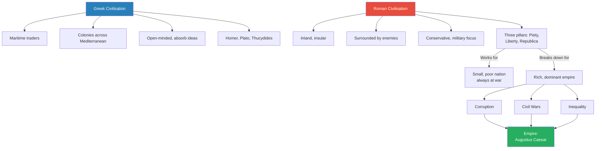
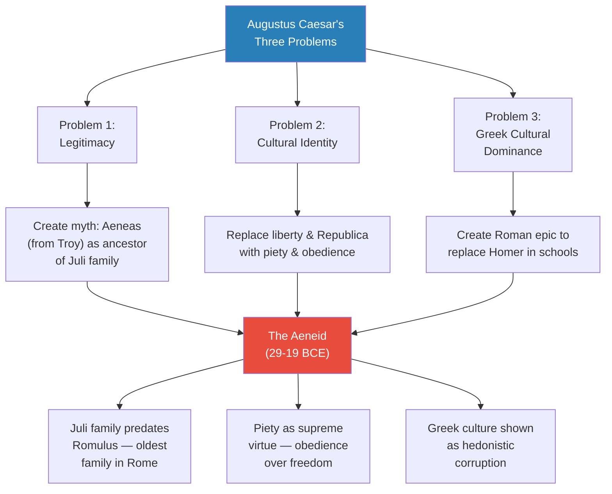
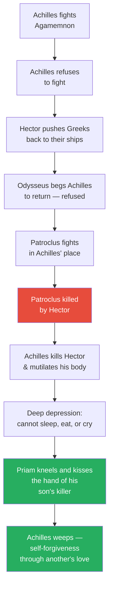
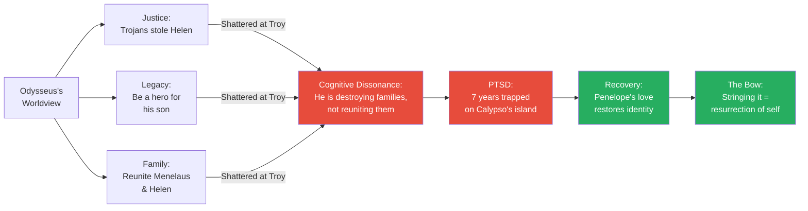
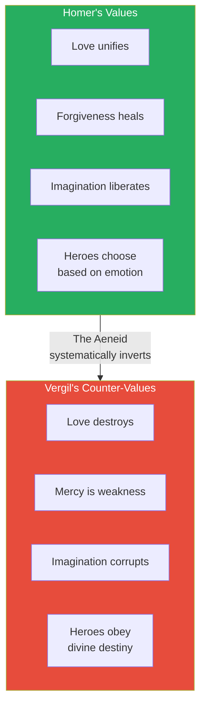
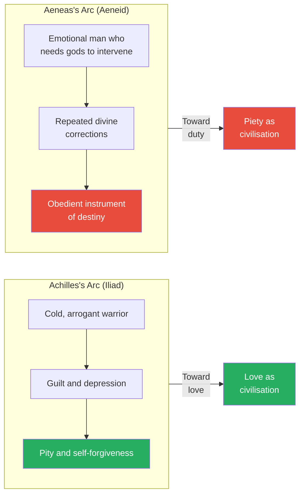
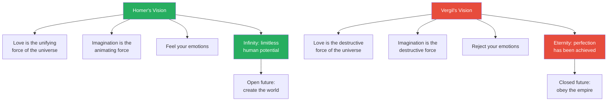

# Homer, Vergil, and the War for the Soul of Rome

> Augustus Caesar has conquered the world, but three problems threaten his empire: he has no ancient legitimacy, the old Republican identity encourages assassination, and Greek culture is corrupting Roman values. His solution is a single book. He commissions Vergil to write the Aeneid — a Latin epic to replace Homer in Roman schools and reshape the Roman soul. Prof. Jiang compares all three epics — the Iliad, the Odyssey, and the Aeneid — to reveal a civilisational war between two visions of humanity: Homer's vision, where love is the unifying force of the universe, and Vergil's counter-vision, where love is a disease that must be replaced by piety and obedience. The Aeneid is, Prof. Jiang argues, the greatest work of propaganda in human history — and the intellectual foundation for Christianity.

---

## Overview: Key Highlights

- <b style="color: #27ae60">Love is the basis of civilisation in Homer's worldview</b> — the Iliad and the Odyssey both argue that love is the unifying force that makes us human
- <b style="color: #e74c3c">Love is a disease in Vergil's worldview</b> — Helen's love caused the Trojan War, Dido's love will cause the Punic Wars; love creates conflict, not unity
- <b style="color: #2980b9">The Aeneid</b> — commissioned by Augustus Caesar as propaganda to solve three political problems: legitimacy, cultural identity, and Greek cultural dominance
- <b style="color: #27ae60">The Iliad is the character transformation of Achilles</b> — from a merciless, vain warrior into a man capable of pity, self-reflection, and self-forgiveness
- <b style="color: #27ae60">The Odyssey is the power of love to heal trauma</b> — Odysseus's PTSD is cured not by war but by Penelope's love and his own rediscovery of identity
- <b style="color: #e74c3c">The real Trojan horse is Greek culture</b> — logic, philosophy, and theatre are the weapons that will destroy Rome from within if embraced
- <b style="color: #2980b9">Three pillars of Roman culture</b> — piety (obedience to gods, Rome, fathers), liberty (no kings), and Republica (public good and sacrifice for Rome)
- <b style="color: #e74c3c">A good wife kills herself for her husband</b> — Vergil's Aeneid presents female self-sacrifice as virtue and female independence as civilisational poison
- <b style="color: #2980b9">Pax Romana</b> — the end point of history in the Aeneid; Augustus Caesar as the fulfilment of destiny, bringing eternal peace through obedience
- <b style="color: #27ae60">Homer creates infinity; Vergil creates eternity</b> — Homer liberates human potential through imagination; Vergil freezes the world into permanent imperial order
- <b style="color: #2980b9">Cognitive dissonance</b> — Odysseus's worldview shatters in Troy when he sees that "justice" is actually massacre, causing PTSD
- <b style="color: #e74c3c">Christianity is the Roman solution</b> — piety and obedience, not love and imagination, will become the cornerstone of Western civilisation through a new religion

| Concept | One-line summary |
|---------|-----------------|
| **Piety (pietas)** | Obedience and loyalty to gods, Rome, and fathers — the Roman virtue that replaces love |
| **Liberty (libertas)** | No kings, no tyrants — the Republican value that threatens the Emperor and must be dismantled |
| **Republica** | The public good; everyone sacrifices for Rome's honour and glory |
| **Cognitive dissonance** | When worldview and reality conflict — Odysseus experiences this when "justice" becomes massacre |
| **PTSD** | Post-traumatic stress disorder — Odysseus's paralysing guilt and shame after Troy |
| **Pax Romana** | The Roman Peace — Augustus's claim that empire has ended all conflict, making history complete |
| **Eternity vs. Infinity** | Vergil's eternity freezes the world in obedient perfection; Homer's infinity opens it to limitless creation |
| **The Aeneid as propaganda** | A 10-year co-authored project to replace Homer in schools and reshape Roman identity |
| **Eudaimonia** | Achilles's concept of flourishing — he can only achieve it in battle |
| **The Praetorian Guard** | The Emperor's secret police — no soldiers in Rome, but imperial enforcers loyal only to one man |
| **The Juli family myth** | Aeneas as ancestor of both Romulus and Julius Caesar — a fabricated lineage older than Rome itself |

---

# The Lecture

## Review: Rome vs. Greece — Two Civilisations, Two Worldviews [0:00 - 6:28]

*Prof. Jiang opens with a sweeping comparative review: the Greeks were maritime traders scattered across the Mediterranean, absorbing ideas freely from Egypt, Mesopotamia, and Persia. The Romans were inland, insular, and conservative — surrounded by hostile neighbours and forged into the world's greatest military machine. He traces the arc from Republic to Empire, explaining why Augustus Caesar must now solve three existential problems.*

> [!tip] Core Insight
> Rome's three cultural pillars — piety, liberty, and Republica — were a survival system designed for a small, poor nation always at war. They broke down the moment Rome became rich, powerful, and dominant.

*The same culture that made Rome survive its enemies ultimately made Rome destroy itself. Augustus Caesar's empire is the resolution — but it creates new problems of its own.*

> [!note]- Expand: Full Lecture Detail
> Prof. Jiang tells the class this will be a long, dense lecture — a review of Rome so far, a comparison with Greece, and a look forward to how both will influence Western civilisation, including Christianity.
>
> He begins with the contrast:
> - <b style="color: #2980b9">The Greeks</b> are scattered across the Aegean and Mediterranean, with colonies everywhere — near Egypt, Mesopotamia, and Persia
>   - They are primarily focused on maritime trade with the great empires of the Near East
>   - This makes them open-minded: they absorb new ideas easily from every civilisation they touch
>   - Greek culture is therefore cosmopolitan, curious, and creative
>
> - <b style="color: #2980b9">The Romans</b> are across the Adriatic in Italy, inland and isolated
>   - They are surrounded by aggressive peoples: the Latins, the Sabines, the Etruscans
>   - Rome has always had to struggle to survive in a hostile environment
>   - To survive, they developed a cultural system that made them "the world's greatest military machine"
>
> The three pillars of Roman culture:
> - **Piety (pietas)** — obedience and loyalty to the gods, to Rome, and to your fathers
> - **Liberty (libertas)** — no kings, no dictators, no tyrants; the nobility at the heart of Roman society
> - **Republica** — the public good; everyone must sacrifice himself for the honour and glory of Rome; there is a competition for prestige by winning new territory
>
> Prof. Jiang notes this is a great system for a small, poor nation always at war. He invokes the Second Punic War: in 216 BCE Hannibal destroyed every Roman army, but the Romans rallied and ultimately defeated Carthage — because the system made them resilient.
>
> But this system breaks down when you become a rich, big empire and the dominant hegemon. Three major problems emerge:
> - <b style="color: #e74c3c">Corruption</b> — wealth breeds greed
> - <b style="color: #e74c3c">Division and civil wars</b> — Marius vs. Sulla, Julius Caesar vs. Pompey, Octavian vs. Mark Antony
> - <b style="color: #e74c3c">Inequality</b> — the gap between rich and poor becomes destabilising
>
> The resolution: Octavian becomes Emperor, takes the name Augustus Caesar. He centralises military authority, makes Egypt his private estate to bankroll a professional standing army (soldiers now serve 20-30 years, paid by the Emperor through Egyptian revenue), and establishes the <b style="color: #2980b9">Praetorian Guard</b> — "basically the secret police of Rome," responsible for peace and security in the city, answerable only to the Emperor.

---

## Augustus Caesar's Three Problems [6:28 - 16:27]

*Even after conquering the world, Augustus Caesar faces three existential challenges: he lacks dynastic legitimacy, the old Republican identity encourages regicide, and Greek cultural superiority corrupts Roman values. His solution to all three is a single book — the Aeneid.*

*One book, three problems solved. Augustus and Vergil co-authored the Aeneid over ten years — Augustus provided the political vision, Vergil provided the poetry.*

> [!note]- Expand: Full Lecture Detail
> Prof. Jiang identifies the three problems Augustus must solve to rule as emperor:
>
> **Problem 1 — Legitimacy:**
> - In the ancient world, legitimacy comes from your family — how old and established it is
> - Two founding myths of Rome already exist: Romulus (first king) and Lucius Brutus (founder of the Republic)
> - Julius Caesar and Augustus Caesar descend from neither of these families
> - <b style="color: #2980b9">The solution</b>: invent a new myth that goes back even further — before Romulus
> - Julius Caesar planted the seeds: a man named Aeneas escaped the destruction of Troy and came to Italy, building the foundations that would become Rome
> - Romulus descends from Aeneas — but so does Julius Caesar, through the Juli family
> - This makes the Juli the first family of Rome, older than the Republic itself
>
> **Problem 2 — A new Roman cultural identity:**
> - The old identity — piety, liberty, Republica — is dangerous for an emperor
> - Marcus Brutus and the other assassins believed they were descendants of Lucius Brutus, the man who expelled the kings
> - They felt a responsibility to kill all tyrants — which is why they assassinated Julius Caesar
> - <b style="color: #e74c3c">You cannot allow this identity to persist</b> — it will encourage more assassinations
> - Augustus must dismantle liberty and Republica as core values and promote piety and obedience instead
>
> **Problem 3 — Greek cultural dominance:**
> - Even though Rome has conquered the Mediterranean militarily, Greek culture is dominant
> - The Greeks have Homer, Plato, Thucydides, Aeschylus — all Romans acknowledge Greek cultural superiority
> - As Romans embrace Greek culture, Augustus believes they become corrupted — too hedonistic, too individualistic
> - He points to Mark Antony as proof: a good Roman who went to Egypt, was seduced by Cleopatra and Greek culture, and betrayed Rome
> - Augustus believes Greek culture caused the civil wars — it made Romans selfish
> - <b style="color: #e74c3c">The very essence of Greek culture is Homer</b> — the Iliad and Odyssey were the Bible of Greek civilisation, the basis of all education
> - To defeat Homer, Augustus needs a Roman epic in Latin to replace Homer in the schools
>
> Prof. Jiang introduces the key distinction between the two poets:
> - <b style="color: #27ae60">Homer was writing when Greek civilisation was just beginning</b> — he is trying to create the seeds of civilisation; he is an educator
> - <b style="color: #e74c3c">Vergil is writing when Rome is already everywhere and everything</b> — he is teaching people how to be part of an empire; he is a propagandist
>
> > [!quote] Prof. Jiang
> > "You can make the argument that Vergil's Aeneid is the greatest work of propaganda ever in human history."

---

## The Iliad: Achilles and the Discovery of Self-Forgiveness [16:27 - 26:16]

*Prof. Jiang retells the story of Achilles — his fight with Agamemnon, the death of Patroclus, the killing and mutilation of Hector, and the extraordinary final scene where an old king's courage defeats the greatest warrior on Earth. The Iliad, he argues, is the character transformation of a merciless warrior into a man capable of pity.*

> [!tip] Core Insight
> It was not Hector who killed Patroclus — it was Achilles. His fight with Agamemnon, his refusal to accept Odysseus's embassy, and his decision to let Patroclus fight in his place all led to the death of his closest friend. Achilles's rage at Hector is really guilt he cannot face.

*The arc of the Iliad is not a war story — it is the psychological transformation of Achilles from a man imprisoned by guilt into a man freed by another's love.*

> [!note]- Expand: Full Lecture Detail
> Prof. Jiang tells the story focusing entirely on Achilles:
>
> **The setup:**
> - Helen, queen of Sparta, is seduced by Paris, prince of Troy — they flee together
> - Menelaus and his brother Agamemnon raise an army for a 10-year siege
> - Troy is the largest walled city in the world — the Greeks cannot break through
>
> **The conflict:**
> - Achilles, the greatest Greek warrior, insults Agamemnon and calls him a dog: "I fight for you — I will refuse to fight, and let the Trojans kill you all"
> - Agamemnon refuses to lose face: "I don't need you"
> - Without Achilles, Hector pushes the Greeks back to their ships — about to burn them and strand the Greeks forever
> - Agamemnon sends Odysseus to beg Achilles to return: "We'll give you everything — treasures, anything you want"
> - Achilles refuses: "I want Agamemnon to come beg me himself" — vanity overrides survival
>
> **Achilles's prophecy:**
> - Before Troy, Achilles received a prophecy: die old at home as a nobody, or die young at Troy and be remembered forever
> - For Achilles, this is no choice — he only achieves <b style="color: #2980b9">eudaimonia</b> in battle
> - Sitting in his ship watching Greeks die is the worst punishment on earth
> - But his arrogance traps him — he demands an apology that will never come
>
> **The death of Patroclus:**
> - Patroclus, Achilles's best friend, volunteers to fight in his place
> - Achilles agrees but orders: "Stop the advance — do NOT fight Hector"
> - Patroclus fights Hector. Patroclus is killed.
>
> **Achilles's guilt:**
> - Achilles kills Hector in a duel, then drags Hector's body behind his chariot around the walls of Troy
> - Hector's parents — King Priam and Queen Hecuba — watch from the walls, screaming
> - But Achilles falls into deep depression: cannot sleep, cannot eat, cannot cry
> - Prof. Jiang explains: "Homer is really the first psychologist"
> - <b style="color: #e74c3c">It was not Hector who killed Patroclus — it was Achilles</b>
>   - If Achilles hadn't fought with Agamemnon
>   - If Achilles had accepted Odysseus's embassy
>   - If Achilles hadn't sent Patroclus into battle
> - Because Achilles lacks self-awareness, he is trapped by guilt and takes his rage out on Hector's corpse
>
> **The resolution — Priam and Achilles:**
>
> > [!example] Priam's Act of Courage
> > - The gods broker a peace deal and tell Priam to go retrieve Hector's body
> > - Late at night, Priam sneaks into Achilles's tent — he could stab Achilles to death
> > - Instead, Priam kneels and kisses the hand of the man who killed and mutilated his son
> > - Achilles is "in awe of this old man who has demonstrated more courage, more strength than Achilles has ever witnessed"
> > - In his act of submission, Priam has emotionally defeated Achilles
> > - Achilles is ashamed of himself — and by forgiving Achilles, Priam allows Achilles to forgive himself
> > - In Priam's face, Achilles sees his own father, Peleus — he pities Priam for losing his son
> > - In Achilles's face, Priam sees his son Hector
> > - They embrace and cry — the first time Achilles has been able to cry since Patroclus's death
> > - These tears release Achilles from the ghost of Patroclus
> > **The lesson:** The Iliad ends not with victory but with two enemies weeping together. Love — not war — is the basis of civilisation.
>
> Prof. Jiang draws the conclusion:
> - <b style="color: #27ae60">The Iliad is the character transformation of Achilles</b> — from cold-blooded, merciless, vain, and arrogant warrior into a man capable of pity, self-reflection, and self-forgiveness
> - This transformation is itself a process of civilisation
> - The central message: even though the Iliad is about war, it argues that love is the basis of civilisation — the unifying force of the universe
> - Even the most bitter enemies can find common ground through love

---

## The Odyssey: Love as the Cure for Trauma [26:16 - 41:58]

*Prof. Jiang retells the Odyssey as a story about PTSD, cognitive dissonance, and the healing power of love. Odysseus does not want to go to war, is traumatised by what he does at Troy, becomes paralysed by shame, and can only recover when Penelope's love restores his shattered identity.*

*Odysseus's worldview — justice, legacy, family — is the lens through which he understands himself. When Troy shatters that lens, he loses not just his peace of mind but his very identity. Only love can reassemble it.*

> [!note]- Expand: Full Lecture Detail
> Prof. Jiang contrasts Odysseus with Achilles from the start:
>
> **Odysseus does not want war:**
> - Achilles jumps at the chance for glory — Odysseus does not
> - Odysseus has a prophecy: if he goes to Troy, he will be gone for 20 years — 10 at war, 10 lost at sea
> - He lives in Ithaca with his wife Penelope and their newborn son Telemachus
> - He loves his family and does not want to leave
> - He pretends to be insane: he ploughs a field and salts it, destroying the land
> - The Greek soldiers test him by placing baby Telemachus in front of the plough
> - Odysseus stops — his deception is exposed, and he is forced to go to war
>
> **Odysseus's worldview:**
> - <b style="color: #2980b9">Worldview</b> — the framework that explains who you are, what you want, and what you should do
> - Three components drive Odysseus:
>   - **Justice** — the Trojans are unjust; how dare they steal another man's wife
>   - **Legacy** — he wants to build a legacy for his son Telemachus
>   - **Family** — he wants to reunite Menelaus and Helen, just as he wants to return to Penelope
>
> **The shattering — cognitive dissonance at Troy:**
> - Odysseus devises the Trojan Horse strategy — the Greeks sneak inside and open the gates
> - Total mayhem: the Greeks massacre everyone in the city
> - Odysseus kills a Trojan soldier — the soldier's wife screams and throws herself on the body
> - <b style="color: #e74c3c">Cognitive dissonance</b>: his worldview (justice, legacy, family) does not match reality (massacre, destruction of families)
> - He came to Troy for justice — he is perpetrating slaughter
> - He came to reunite a family — he is destroying families
> - Odysseus is traumatised by what he sees and does
>
> **PTSD and paralysis:**
> - After Troy, Odysseus is lost at sea
> - He ends up on Calypso's island for seven years as a kind of "sex slave" to the goddess
> - Every day he cries on the beach — he has PTSD
> - He does not want to go home because he is ashamed to face his family
> - He is paralysed: stuck between a past he cannot face and a future he cannot reach
>
> **The family is paralysed too:**
> - Penelope waits, but everyone believes Odysseus is dead
> - 100 suitors demand her hand in marriage
> - She refuses to accept Odysseus is dead but cannot reject all suitors — she is frozen
> - Telemachus is stuck: he cannot inherit (Odysseus may be alive) and cannot grow up (Penelope is frozen)
> - The entire family is depressed and immobilised
>
> **Athena intervenes:**
> - Athena, goddess of wisdom, pities the family and resolves to bring them together
> - She frees Odysseus from Calypso and sends him home disguised as a beggar
> - She warns him: do not reveal yourself to Penelope — the 100 suitors would kill you
>
> **The brooch scene — recognition through love:**
>
> > [!example] The Brooch of Odysseus
> > - Odysseus meets Penelope while still disguised as a beggar
> > - He sees she is distraught and tries to comfort her: "I have seen Odysseus — he is alive"
> > - Penelope breaks down in tears, then demands proof
> > - Odysseus describes a brooch he carries on his cloak — in poetic, intimate detail
> > - Penelope collapses: only Odysseus would know the details of this brooch
> > - The brooch was Penelope's gift to Odysseus as he sailed for Troy — a promise he would return
> > - Though he has lost the physical brooch in war, it is "implanted in his mind"
> > - The brooch symbolises his everlasting love for Penelope
> > **The lesson:** Even when trauma strips away everything external, the memory of love survives as the deepest layer of identity.
>
> **The bow — resurrection of identity:**
> - Penelope devises a plan: an archery contest with Odysseus's bow
> - Whoever can string the bow and hit a target wins her hand
> - All 100 suitors fail — none can string it
> - The "beggar" asks to try — the moment he strings the bow, the suitors know it is Odysseus
> - He kills all 100 suitors with the bow
> - <b style="color: #27ae60">The bow symbolises his identity</b> — by stringing it, he is "resurrecting" his worldview
>   - He remembers he is a father
>   - He remembers he is a hero who fights for justice
>   - He remembers he fights to protect his family
>
> Prof. Jiang draws the conclusion:
> - The Odyssey is about the power of love to heal trauma after war
> - The same message as the Iliad: <b style="color: #27ae60">love is the unifying force of the world</b> — it heals, it brings people together, it is what makes us human

---

## The Aeneid, Part I: The Trojan Horse as Greek Culture [41:58 - 44:08]

*Vergil opens the Aeneid by reinterpreting the Trojan Horse — not as a military trick but as a metaphor for the seductive danger of Greek culture. Logic, philosophy, and theatre are the weapons that will destroy Rome from within.*

> [!tip] Core Insight
> The Aeneid's very first move is to tell Romans that the Trojan Horse is Greek culture itself. A Greek soldier uses eloquence, logic, and storytelling to convince the Trojans to accept the horse — exactly how Greek philosophy and theatre seduce Romans into abandoning their own values.

> [!note]- Expand: Full Lecture Detail
> Prof. Jiang notes that neither the Iliad nor the Odyssey actually tells the story of the Trojan Horse — but the Aeneid opens with it.
>
> The scene:
> - The Trojans wake up to find a huge wooden horse outside the gates
> - Most suspect a Greek trick: "Let's burn it down"
> - But they capture a Greek soldier who tells an eloquent, logical, moving false story
>   - The Greeks became disheartened by the war's progress
>   - They decided to sail home
>   - To ensure safe passage, they built the horse as an offering to the gods
> - The story is "so moving and so beautiful, the Trojans believe him"
> - They let the horse in — and Troy falls
>
> Prof. Jiang decodes the propaganda:
> - <b style="color: #e74c3c">The real Trojan Horse is Greek culture</b> — logic, philosophy, and theatre
> - The Greek soldier uses exactly these tools — eloquence, logical argument, theatrical storytelling — to manipulate the Trojans
> - The message to Romans: if you embrace Greek culture (its logic, philosophy, and theatre), your culture will be destroyed from within
> - "We must resist it at all costs"

---

## The Aeneid, Part II: The Fall of Troy and the Rejection of Love [44:08 - 52:16]

*Vergil retells the fall of Troy to invert Homer's values. Where Homer showed love and forgiveness between Priam and Achilles, Vergil shows Priam murdered without mercy. Where Homer showed Helen as a complex figure, Vergil reduces her to a whore whose love caused catastrophe. Where Homer's heroes choose love, Vergil's hero must choose duty.*

*The Aeneid is not a new story — it is Homer's story retold with every value reversed. What was virtue becomes vice; what was human becomes dangerous.*

> [!note]- Expand: Full Lecture Detail
> Prof. Jiang walks through the Aeneid's narrative, pausing to decode each scene as propaganda:
>
> **The murder of Priam:**
> - Aeneas wakes to find Troy in flames — Greeks massacring everyone
> - He runs to save King Priam, but arrives to see Priam's son killed by Neoptolemus (Achilles's son)
> - Priam curses Neoptolemus: "Your father was an honourable man — we were friends"
> - Neoptolemus kills Priam: "My father is dead. You should join him in the underworld."
> - Prof. Jiang's interpretation: <b style="color: #e74c3c">"There is no place for love, friendship, and forgiveness — that's all a lie. Only brutality and force will triumph."</b>
> - This directly inverts the Iliad's climax — where Priam and Achilles found peace through love
>
> **Aeneas and Helen:**
> - Aeneas discovers Helen hiding and blames her for everything
> - He calls her "a whore, a slut" — if she had stayed home and done her duty, the war would never have happened
> - He is about to kill her when Venus (his mother, the Roman Aphrodite) appears
> - Venus tells him: "You are destined for greater things — leave Helen, return to your family"
> - Aeneas obeys his mother — not because he chooses to, but because duty overrides emotion
>
> **The escape from Troy:**
> - Aeneas returns to find his family alive — his son Julius, his father, and his wife
> - He wants to go back and die fighting: "I'll die with the city"
> - His family begs him not to — he is one man against an army
> - Then his son Julius's hair catches fire with a golden crown — a divine sign
> - His father interprets it: "Your son will be the founder of a great empire"
> - <b style="color: #27ae60">This is what stops Aeneas from committing suicide</b> — duty to his son's destiny
> - He carries his father (who cannot walk) and his son to safety
>
> **The wife's death:**
>
> > [!example] The "Good Wife" of the Aeneid
> > - Aeneas's wife follows behind as they flee
> > - When they reach the ships, she has disappeared
> > - Aeneas goes back and discovers she has killed herself
> > - Her reasoning: she would be a hindrance in the new world; if captured, she would become a Greek slave and dishonour him
> > - Prof. Jiang decodes the propaganda: "A good wife is someone who will kill herself for her husband"
> > - Helen is the bad wife — independent, seeking love
> > - Aeneas's wife is the good wife — self-sacrificing, removing herself so her husband can fulfil his destiny
> > **The lesson:** In Vergil's Rome, female virtue is self-annihilation in service of the husband's duty.
>
> **Aeneas and Dido in Carthage:**
> - Aeneas and his survivors end up in Carthage as guests of Queen Dido
> - Dido falls in love with Aeneas — they marry, and he is happy
> - The gods intervene: "You have a destiny — go to Rome. Stop fooling around in Carthage."
> - Aeneas tells Dido he must leave
> - <b style="color: #e74c3c">Dido goes insane and kills herself</b>
> - Before dying, she instructs the Carthaginians to destroy Rome — this is the mythological origin of Hannibal's wars
> - Prof. Jiang's reading: "Love is a disease, a plague upon the world"
>   - Helen's love caused the Trojan War
>   - Dido's love will cause the Punic Wars
>   - In every case, love destroys

---

## The Aeneid, Part III: Aeneas's Transformation and the Triumph of Duty [52:16 - 55:19]

*Prof. Jiang reveals the Aeneid's hidden structure: Aeneas undergoes a character transformation, just like Achilles — but in the opposite direction. Where Achilles learns to feel, Aeneas learns to stop feeling. Where Achilles discovers love, Aeneas discovers obedience.*

*Two arcs, two destinations. Achilles moves from cold warrior to feeling human. Aeneas moves from feeling human to obedient instrument. Homer's civilisation is built on the first; Vergil's empire requires the second.*

> [!note]- Expand: Full Lecture Detail
> Prof. Jiang addresses the scholarly debate about the Aeneid's ending:
>
> **The ending:**
> - In Italy, Aeneas meets King Latinus, who is so impressed by Aeneas's nobility that he wants his daughter to marry him
> - But the daughter is already promised to a prince named Turnus
> - War breaks out between Aeneas and Turnus — an echo of the Iliad
> - Turnus kills one of Aeneas's friends and takes a belt that was Aeneas's gift to that friend
> - Eventually Aeneas and Turnus duel — Aeneas overpowers Turnus
> - Turnus surrenders, drops his sword, and begs for mercy
> - Aeneas wants to show mercy — "I've beaten you, you're no longer a threat, I can be merciful"
> - But then he sees the belt — Turnus killed his friend
> - He plunges his spear into Turnus
>
> **Scholars say the ending is unfinished — Prof. Jiang disagrees:**
> - The scholarly argument: the ending is too abrupt, therefore Vergil didn't finish the Aeneid
> - Prof. Jiang's argument: the ending is the entire point
> - <b style="color: #27ae60">Track Aeneas's character transformation:</b>
>   - At Troy: he wants to kill Helen — the gods intervene to stop him
>   - At Troy: he wants to die fighting — the gods send a sign to redirect him
>   - At Carthage: he wants to stay with Dido — the gods send a messenger to order him onward
>   - In every case, the gods must intervene because Aeneas follows his emotions
>   - But at the end, when he wants to show mercy to Turnus, the gods do not intervene
>   - Aeneas himself recognises what his duty is — and kills Turnus
> - <b style="color: #27ae60">Aeneas has become the embodiment of piety and duty</b> — he no longer needs divine correction
> - The arc is complete: from a man ruled by emotion to an instrument of destiny

---

## The War for the Soul of Civilisation: Love vs. Piety [55:19 - 59:12]

*Prof. Jiang steps back to reveal the civilisational stakes. This is not just a literary comparison — it is a war between two visions of what makes a civilisation. Homer says love and imagination; Vergil says piety and obedience. The Roman Empire will enforce Vergil's vision through a concept borrowed from Egypt: eternity.*

> [!tip] Core Insight
> Homer creates infinity — the idea that human potential is limitless, that our actions and emotions can create the world anew. Vergil creates eternity — the idea that perfection has been achieved, history has ended, and all that remains is to obey.

*Every element of Homer's worldview is systematically inverted. The Roman Empire does not just replace Homer's stories — it replaces Homer's entire conception of what it means to be human.*

> [!note]- Expand: Full Lecture Detail
> Prof. Jiang lays out the fundamental opposition:
>
> **On love:**
> - Homer: love is the unifying force of the universe — it heals, it creates, it binds enemies together
> - Vergil: love is the force that creates conflict — Helen, Dido, every instance of love leads to war and destruction
>
> **On imagination:**
> - Homer: imagination is the animating force — it gives life, creates possibility, drives civilisation forward
> - Vergil: imagination is the destructive force — it leads to disobedience, chaos, and conflict
>
> **On emotion:**
> - Homer: love is what you feel — the embrace of your emotions is what makes you human
> - Vergil: piety is what you are told — the rejection of your emotions is what makes civilisation stable
>
> **Eternity vs. Infinity:**
> - <b style="color: #2980b9">Vergil creates the idea of eternity</b> — something that lasts forever, perfection achieved, history concluded
> - <b style="color: #2980b9">Homer creates the idea of infinity</b> — how human actions and emotions can create the world endlessly
> - In the Pax Romana under Augustus Caesar: "All I have to do is obey and the world will be perfect"
> - "We have come to the end of history. We have found perfection. We have found the perfect model to organise human civilisation."
>
> > [!quote] Prof. Jiang
> > "We have come to the end of history. History has stopped because we have found perfection."
>
> Prof. Jiang notes that this transition from Homer's Greece to Vergil's Rome marks a radical shift in Western civilisation — from a culture of creative freedom to a culture of obedient stability.

---

## Looking Ahead: Egypt and Christianity [59:12 - 1:02:00]

*Prof. Jiang closes with two forward-looking connections: the Roman concept of eternity is borrowed from Egypt (the subject of the next lecture), and the Roman emphasis on piety over love will eventually produce Christianity — the religion that will make obedience the cornerstone of Western civilisation.*

> [!note]- Expand: Full Lecture Detail
> Prof. Jiang makes two connections to future lectures:
>
> **The Egyptian origin of eternity:**
> - The Romans were "the most non-creative people in the world — anti-creative"
> - Everything they had, they borrowed from somewhere else
> - The concept of eternity comes from Egypt
> - Next class will show how the Romans adopted the Egyptian sense of eternity
>
> **The Christian future:**
> - The Roman conception of piety and obedience as the cornerstone of society is "not as appealing as the Greek conception" at first
> - But eventually the Romans will create a new religion called Christianity
> - Christianity will make piety the cornerstone of society and civilisation
> - This is the long arc: Greek love and imagination → Roman piety and obedience → Christian doctrine
>
> A student asks whether the Romans actually rejected Greek culture:
> - Prof. Jiang clarifies: Augustus Caesar wants them to reject it, but they cannot because "it's so powerful"
> - This lecture is about "the new conception of reality as introduced by the Roman Empire"
> - It will not become the new reality immediately — "it will take time"
> - Christianity is the mechanism that will eventually make it real

---

## Connections

**Builds on:** [[07 - Homer's Iliad and the Birth of Greek Civilization]] (the Iliad's argument that love creates civilisation), [[13 - Aristotle and the Greek Legacy]] (Greek cultural legacy and syncretisation), [[16 - Julius Caesar's Will and Octavian's Birth of Empire]] (Augustus's transition from Republic to Empire)
**Sets up:** [[18 - The Great Pyramid as Ancient Egypt's Manhattan Project]] (Egyptian concept of eternity that Rome borrows), [[25 - Paul of Tarsus, Messiah of Rome]] (Christianity as the fulfilment of Roman piety), [[26 - Constantine's Monotheistic Revolution]] (Christianity becomes state religion)
**Related books in vault:** [[Sapiens - Yuval Noah Harari]] (cultural myths as social glue), [[The Prince - Niccolo Machiavelli]] (propaganda and the construction of political legitimacy)

---

## The Takeaway

This lecture reveals that the transition from Greek to Roman civilisation was not just political or military — it was a war over what it means to be human. Homer's Greece said that love, emotion, and imagination are what create civilisation; Vergil's Rome said that love is a disease and only piety, duty, and obedience can sustain order. The Aeneid is not merely a poem — it is a political weapon designed to replace the Bible of Greek culture with a Roman counter-gospel. Prof. Jiang's close reading of all three epics shows that Augustus Caesar understood something most conquerors miss: military conquest is insufficient without cultural conquest. You must change what people believe, not just who they obey.

The most counterintuitive insight is how the Aeneid inverts every value of the Iliad and Odyssey while using the same narrative structures. Achilles and Aeneas both undergo character transformations — but Achilles moves toward feeling and Aeneas moves toward not feeling. Both end with a climactic scene of mercy — but Priam's mercy heals, while Turnus's plea for mercy is denied. Vergil is not ignorant of Homer's power; he is deliberately dismantling it, scene by scene, value by value.

The open question is the one Prof. Jiang poses at the end: if the Roman conception of piety is less appealing than the Greek conception of love, how does it eventually win? The answer he previews is Christianity — a religion that will finally make obedience to divine authority feel as natural as love once did. That story begins with Egypt's concept of eternity and culminates with Paul of Tarsus. The war for the soul of civilisation is not over — it has only just begun.
