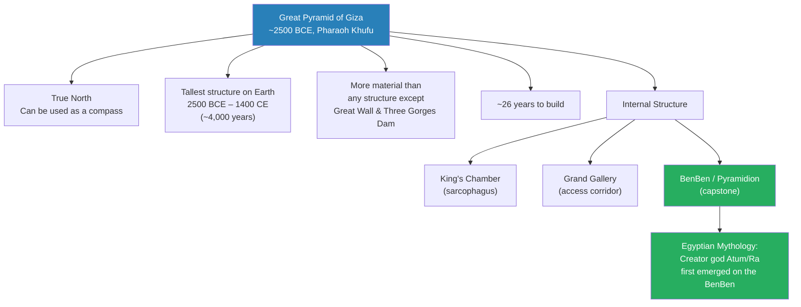
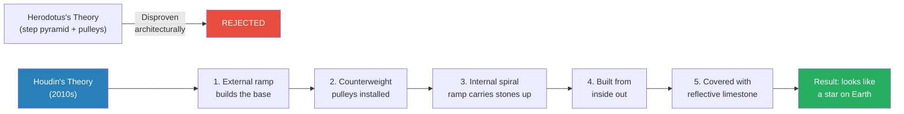
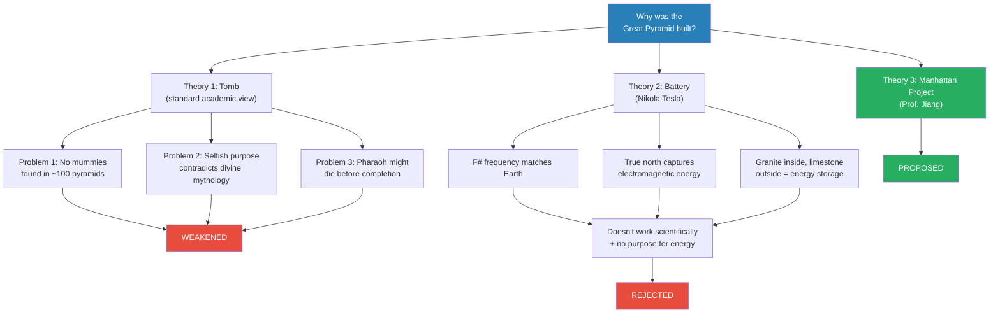
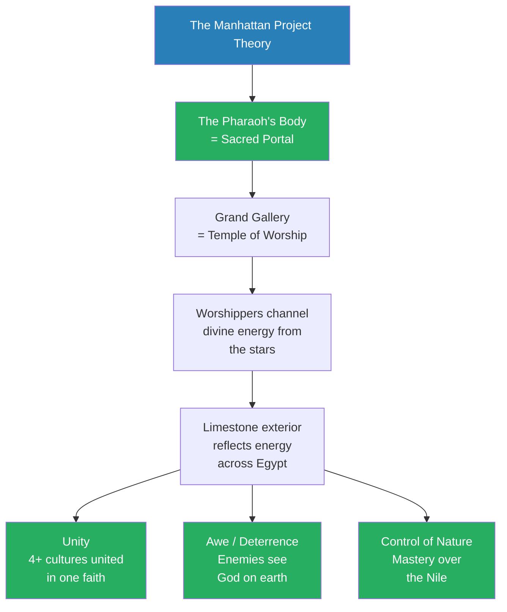
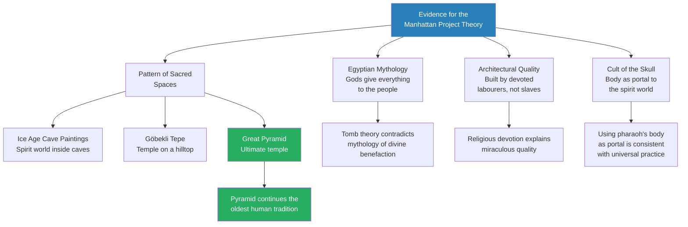
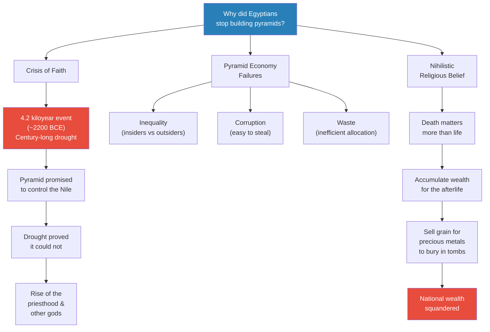
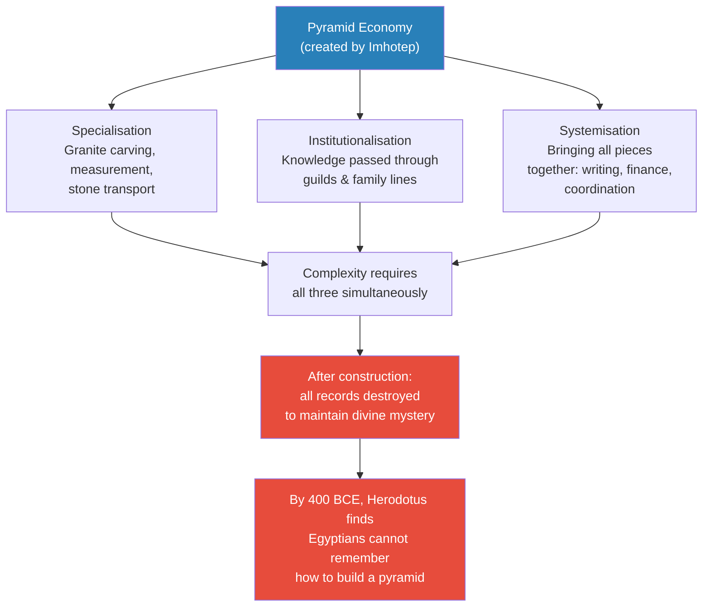
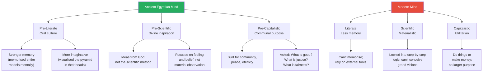

# The Great Pyramid as Ancient Egypt's Manhattan Project

> Prof. Jiang tackles the Great Pyramid of Giza — built around 2500 BCE by the pharaoh Khufu — by asking three questions: how was it built, why was it built, and why did the Egyptians stop? He dismantles the standard "tomb" theory on logical grounds, briefly entertains Nikola Tesla's battery hypothesis, and then proposes his own radical interpretation: the pyramid was Egypt's Manhattan Project, an attempt to channel divine energy through the pharaoh's body and bring eternal peace to the nation. The lecture closes with a meditation on the pre-literate, pre-scientific, pre-capitalistic mind — and why we can no longer imagine building something so extraordinary.

---

## Overview: Key Highlights

- <b style="color: #27ae60">The Great Pyramid was Egypt's Manhattan Project</b> — designed to channel divine energy through the pharaoh's body and bring eternal peace, not merely to serve as a tomb
- <b style="color: #e74c3c">The tomb theory has three fatal logical problems</b> — no mummies found in any pyramid, selfish purpose contradicts divine mythology, and no guarantee the pharaoh would outlive construction
- <b style="color: #2980b9">BenBen (pyramidion)</b> — the capstone representing the primordial mound from which the creator god Atum first emerged, making the pyramid a re-enactment of creation itself
- <b style="color: #27ae60">The pharaoh's body as divine portal</b> — not a corpse to be entombed but a mechanism for channelling heavenly energy onto earth through worship in the Grand Gallery
- <b style="color: #2980b9">Jean-Pierre Houdin's internal ramp theory</b> — a French architect who never visited Egypt solved the construction mystery through computer simulation: external ramp for the base, internal spiral ramp and counterweights for the rest
- <b style="color: #e74c3c">The pyramid economy created its own destruction</b> — centralisation bred inequality, corruption, and waste, while nihilistic afterlife beliefs diverted wealth into graves
- <b style="color: #2980b9">The 4.2 kiloyear event</b> — a century-long drought around 2200 BCE that shattered faith in the pyramid system and ended the Old Kingdom
- <b style="color: #27ae60">Three pillars of the pyramid economy</b> — specialisation, institutionalisation, and systemisation, orchestrated by the legendary Imhotep
- <b style="color: #2980b9">Kemet (black earth)</b> — the Egyptian name for Egypt, revealing that the Nile's fertile soil was the true source of all national wealth and the reason divine control of nature mattered
- <b style="color: #e74c3c">The pre-literate mind was more imaginative than ours</b> — oral memory, divine inspiration, and communal purpose enabled feats of creation that our scientific, capitalistic minds cannot replicate
- <b style="color: #27ae60">The Giza complex as constellation</b> — three pyramids mirroring the pattern of stars, with lesser tombs ensuring loyalty through the promise of eternal proximity to the divine pharaoh
- <b style="color: #2980b9">The pyramid as continuation of cave paintings and Gobekli Tepe</b> — the latest step in humanity's long pattern of building sacred spaces to connect the spirit world with the material world

| Concept | One-line summary |
|---------|-----------------|
| **BenBen / Pyramidion** | The capstone of the pyramid, representing the primordial mound of creation from which the god Atum emerged |
| **Manhattan Project analogy** | The pyramid as a state-level project to harness divine power and create eternal peace — not a personal tomb |
| **Grand Gallery as temple** | The internal passageway where worshippers channelled divine energy from the pharaoh's body to all of Egypt |
| **Pyramid economy** | The centralised economic system of specialisation, institutionalisation, and systemisation required to build pyramids |
| **4.2 kiloyear event** | A century-long drought (~2200 BCE) that proved the pyramid system could not control nature, triggering a crisis of faith |
| **Imhotep** | Grand Vizier who created the pyramid economy — later deified for his contribution to Egyptian civilisation |
| **Kemet** | The Egyptian name for Egypt, meaning "black earth" — the Nile's fertile soil as the source of all life |
| **Cult of the pharaoh** | The priestly order responsible for protecting the pharaoh's sacred body and maintaining the divine energy system |
| **Pre-literate mind** | Oral cultures had stronger memory and more powerful imagination than literate cultures — they could visualise the entire pyramid mentally |
| **Giza complex** | Three pyramids plus surrounding tombs forming a constellation — a system of divine hierarchy and moral loyalty |

---

# The Lecture

## The Architecture and Grandeur of the Great Pyramid [0:00 - 3:30]

*Prof. Jiang opens with the sheer scale of the Great Pyramid — 4,500 years old, true north, and the tallest human-made structure on earth for four millennia — before introducing the three questions that will drive the entire lecture.*

*The BenBen capstone is not mere decoration — it is the re-enactment of the moment of creation itself. Every pyramid was, architecturally, a re-staging of the universe's birth.*

> [!note]- Expand: Full Lecture Detail
> Prof. Jiang tells the class this will be a "fun class" and immediately plunges into the facts:
>
> - The Great Pyramid was built around <b style="color: #2980b9">2500 BCE</b> — roughly 4,500 years ago — by the pharaoh <b style="color: #2980b9">Khufu</b>
> - It was one of the Seven Wonders of the Ancient World — and the only one still standing
> - From 2500 BCE until roughly 1400 CE, it was the tallest man-made structure on earth — a record held for approximately 4,000 years
> - Its orientation is true north — "you can actually use the pyramids as a compass to tell the directions"
> - Napoleon calculated that the stones from the Great Pyramid could build a wall around all of France
> - Only two structures contain more material: the Great Wall of China and the Three Gorges Dam (both in China)
> - It took approximately 26 years to build
>
> He walks through the internal architecture:
> - The <b style="color: #2980b9">King's Chamber</b> — where the pharaoh's mummy rests in the sarcophagus
> - The <b style="color: #2980b9">Grand Gallery</b> — the corridor providing access to the King's Chamber
> - The <b style="color: #2980b9">BenBen (pyramidion)</b> — the capstone at the pyramid's apex
>
> The BenBen, he explains, is "extremely significant culturally and religiously." In Egyptian mythology, the creator god <b style="color: #2980b9">Atum</b> (also known as <b style="color: #2980b9">Ra</b>, the sun god) first came into existence on the BenBen. He describes two versions of the myth:
> - A large, dark ocean with nothing — then a mound emerges, and upon it appears Atum
> - From the dark ocean of space, a BenBen descends, and Atum rests upon it
>
> Prof. Jiang pauses to frame the lecture's structure. Three questions will drive the class:
> 1. **How** did they build this?
> 2. **Why** did they build this?
> 3. **Why did they stop** building pyramids?

---

## How Was It Built? — Houdin's Internal Ramp Theory [3:30 - 8:00]

*Prof. Jiang disposes of the "how" question relatively quickly, presenting Jean-Pierre Houdin's internal ramp theory as the leading explanation — notable because Houdin was an architect who had never been to Egypt, never studied Egyptology, and solved the mystery through pure imagination and computer simulation.*

*Houdin's breakthrough came not from fieldwork but from architectural imagination and computer simulation — a modern echo of the Egyptians' own imaginative capacity.*

> [!note]- Expand: Full Lecture Detail
> Prof. Jiang notes that how the pyramid was built "is an extremely controversial question that has plagued historians and Egyptologists and archaeologists for hundreds of years."
>
> - The original theory came from the Greek historian <b style="color: #2980b9">Herodotus</b>: the pyramid was built in steps using pulleys to haul stones upward
>   - This was accepted for centuries simply because no better theory existed
>   - It has since been architecturally disproven — the mechanics do not work
>
> - About ten years ago, a French architect named <b style="color: #2980b9">Jean-Pierre Houdin</b> proposed a new theory
>   - Houdin had never been to Egypt, did not speak Arabic, and had never studied Egypt
>   - He and his father were simply fascinated by the construction problem
>   - They ran computer simulations and arrived at a theory with strong physical evidence
>
> - Houdin's construction sequence:
>   1. An external ramp was built to construct the pyramid's base
>   2. From the base, two counterweight structures were installed — functioning like pulleys to lift stones
>   3. Surrounding these structures was an internal spiral ramp to carry stones upward
>   4. The pyramid was essentially built from the inside out
>   5. Once the structure was complete, it was covered with reflective limestone
>
> - The limestone exterior meant that "if you actually were living back then and you saw the pyramids from a distance, you would think it was a star that has come down on the planet Earth"
>
> Prof. Jiang then raises a deeper question: how did the Egyptians plan this without blueprints or modern engineering?
> - The answer: they built a scale model beside the pyramid to work out the full-scale construction
> - Egyptologists resist this explanation because "they believe that Egyptians didn't have the intellectual capacity to imagine this"
> - Prof. Jiang disagrees — and promises to return to the question of ancient imagination at the lecture's end

---

## Why Was It Built? — The Tomb Theory and Its Problems [8:00 - 14:00]

*Prof. Jiang turns to the more controversial question of purpose. He presents the standard "tomb" interpretation, then dismantles it with three logical objections before briefly entertaining Nikola Tesla's battery theory. Both fail — setting up his own Manhattan Project thesis.*

> [!tip] Core Insight
> If the pyramid were a tomb, it would mean the pharaoh — supposedly a divine benefactor — arrived on earth with the primary goal of building his own escape route. This contradicts everything Egyptian mythology says about the gods' relationship to humanity.

*Two theories are tested and weakened or rejected. The tomb theory has supporting evidence but fatal logical problems. Tesla's theory is elegant but scientifically unworkable. Both clear the way for Prof. Jiang's own interpretation.*

> [!note]- Expand: Full Lecture Detail
> **The Tomb Theory:**
>
> The standard academic interpretation holds that the pyramid is a tomb:
> - Egyptians believed in the afterlife
> - The pyramid was designed to ease the pharaoh's transition into the heavens, where he would become a star or sun
> - It is described as a "resurrection machine" — the pharaoh ascends, then after centuries, reincarnates inside the pyramid
>
> Prof. Jiang presents three logical problems:
>
> - <b style="color: #e74c3c">Problem 1 — No bodies:</b> There are approximately 100 pyramids in Egypt. "We have not found a mummy or a body inside any sarcophagus inside the pyramids." If this is a tomb, the most basic requirement — a body — is missing
>
> - <b style="color: #e74c3c">Problem 2 — Selfish gods:</b> The pharaohs were divine — "the emanation of God on earth." The tomb theory implies the pharaoh's first priority upon arriving on earth was building his own exit. "Does that make any sense?" In Egyptian mythology, the gods are benefactors: Atum gave life, Osiris gave civilisation, Horus gave kingship. "These gods come to Earth in order to help the human race." A pharaoh obsessed with his own tomb would be treating the Egyptian people as slaves — contradicting the entire theology
>
> - <b style="color: #e74c3c">Problem 3 — Timing risk:</b> If the pharaoh's primary concern is the afterlife and the pyramid is the means of achieving it, and it takes 26-30 years to build — "how can you be sure that you won't die before the pyramid is built?"
>
> He acknowledges the counterevidence — a pharaoh's writing to his son: "Make your grave well furnished and prepare thy place in the West... The House of the Dead is for life." This text supports the tomb theory. But Prof. Jiang notes the debate remains unresolved.
>
> **Tesla's Battery Theory:**
>
> Prof. Jiang introduces <b style="color: #2980b9">Nikola Tesla's</b> hypothesis with genuine interest:
> - The King's Chamber resonates at F sharp — which is also the frequency of planet Earth
> - The pyramid's true-north orientation captures energy from the Earth's electromagnetic field
> - Granite inside, limestone outside — "a perfect way to trap and store energy"
> - The limestone exterior reflects solar and lunar light, which is stored as energy
> - The pyramid functions as a battery to channel free, clean energy across Egypt
>
> "This is actually much more plausible than the tomb theory," Prof. Jiang says. But it fails for two reasons: it does not work scientifically, and even if it did, "what are they using it for?"
>
> Both theories leave the question open: why was the Great Pyramid built?

---

## The Manhattan Project Theory — Channelling Divine Energy for Eternal Peace [14:52 - 26:00]

*Prof. Jiang presents his own theory: the Great Pyramid was Egypt's Manhattan Project — a state-level project to harness divine energy through the pharaoh's sacred body, unite the nation's disparate cultures, deter enemies through awe, and demonstrate mastery over nature. He reinterprets the pharaoh's writing about the "House of the Dead" to support this reading.*

> [!tip] Core Insight
> Replace Tesla's "free clean energy" with "divine energy" and the battery model suddenly makes theological sense. The pyramid was not storing electricity — it was storing the power of God, channelled through the pharaoh's body and reflected across Egypt through limestone walls.

*The theory gives the pyramid three practical functions — unity, deterrence, and divine control of the Nile — all flowing from a single theological mechanism: the pharaoh's body as a channel between heaven and earth.*

> [!note]- Expand: Full Lecture Detail
> Prof. Jiang draws the Manhattan Project analogy explicitly:
>
> - The Manhattan Project took ~130,000 people over five to six years, working across the US, Canada, and UK
> - The world's best scientists collaborated to create what may be "humanity's greatest invention ever"
> - Many who worked on it believed they were bringing eternal peace to Earth — "mastering the secrets of the universe, channelling the power of God"
> - "Because we've had no major war after World War Two — fingers crossed — they were right"
>
> He applies this framework to Egypt:
>
> > [!quote] Prof. Jiang
> > "The Egyptians conceptualised and created the Great Pyramid in order to harness the power of God, in order to create eternal peace on earth, to bring an end to history, to bring an end to pain, suffering and death."
>
> **The Mechanism — The Pharaoh's Body as Portal:**
>
> - If the pharaoh was divine, his body after death would be sacred
> - After death, the pharaoh ascends to the heavens to become a star or sun
> - <b style="color: #27ae60">The body (mummy) then becomes a portal for communicating with the pharaoh in the heavens — and a mechanism for channelling his divine powers onto earth</b>
> - The Grand Gallery is where worshippers pray, drawing energy from the stars through the mummy
> - The limestone exterior reflects this divine energy across all of Egypt
> - "Nikola Tesla said this was a battery to channel free, clean energy. Well, what if we change this to divine energy instead?"
>
> **The Experience of Worship in the Grand Gallery:**
>
> Prof. Jiang imagines what it would feel like to worship inside the pyramid — a series of collisions and nexuses:
> - <b style="color: #2980b9">Life and death</b> — the pharaoh is dead but alive through faith; you are mortal but communicating with God
> - <b style="color: #2980b9">Birth and death</b> — the Grand Gallery resembles a womb (taking you back to the point of birth) and a tomb (a place of burial) simultaneously
> - <b style="color: #2980b9">Heaven and earth</b> — from outside, the pyramid looks like a star that has landed on earth
> - <b style="color: #2980b9">Myth and reality</b> — through worship, you are reversing the Big Bang, creating oneness and wholeness
>
> "You have achieved the union and the unity of all things through your faith in the Pharaoh, which gives you divine energy to be born anew, cleansed of your sins."
>
> **Three Functions of Eternal Peace:**
>
> - <b style="color: #27ae60">Unity:</b> Egypt had at least four different cultures with their own mythologies and religious practices. The pyramid forced all faiths into one singular object — the worship of the pharaoh. "If you were in Egypt and you looked at the pyramid, you could not help but think this is God on earth." This centres faith and compels obedience
>
> - <b style="color: #27ae60">Deterrence through awe:</b> Enemy scouts approaching Egypt would see the Great Pyramid. "What are they seeing? They're seeing God on earth. You're not going to attack God on earth. You're going to run away."
>
> - <b style="color: #27ae60">Domination of nature:</b> The Nile was the source of Egyptian wealth. A good flood meant rich soil and easy crops; a bad flood meant starvation or drowning. "It's very important for you to be able to control the moods of the gods — and that's what the pyramid is meant to do."
>
> Prof. Jiang then reinterprets the pharaoh's quotation through this lens:
> - "Death counts little for us" — we are pharaohs, we are gods, we do not worry about death
> - "Life is valued highly by us" — our concern is the well-being of the Egyptian people
> - "The House of the Dead is for life" — the pyramid is our legacy, our benevolence, how we make Egypt eternal
>
> > [!example] Reinterpreting the Pharaoh's Testament
> > - Traditional reading: "Make your grave well furnished" = build a luxurious tomb for the afterlife
> > - Prof. Jiang's reading: "Death counts little for us" = we are divine, death is irrelevant
> > - "Life is valued highly by us" = our purpose is the welfare of the Egyptian people
> > - "The House of the Dead is for life" = the pyramid is a gift to the living, not a shelter for the dead
> > - The same text that Egyptologists cite as proof of the tomb theory actually supports the Manhattan Project interpretation when read through the lens of divine benefaction
> > **The lesson:** Evidence does not speak for itself — the framework through which you read it determines what it says.

---

## The Evidence — Mythology, Architecture, and Sacred Precedent [26:00 - 31:15]

*Prof. Jiang presents four pieces of evidence supporting his Manhattan Project theory, drawing on Egyptian mythology, the quality of construction, the cult of the skull, and the long archaeological pattern from Ice Age caves through Gobekli Tepe to the pyramid.*

*The pyramid is not an anomaly — it is the latest step in a pattern stretching back to the Ice Age. Every major sacred site in the series so far has been an attempt to connect the spirit world with the material world.*

> [!note]- Expand: Full Lecture Detail
> Prof. Jiang presents four pillars of evidence:
>
> **1. Egyptian Mythology — Gods as Benefactors:**
> - In Egyptian mythology, unlike other mythologies they will study later, "the gods give everything to the people"
>   - Ra gives life
>   - Osiris gives civilisation
>   - Horus provides kingship
> - The Egyptian understanding of the divine relationship: "if they worship the gods well enough, the gods always reward them"
> - <b style="color: #e74c3c">"The idea that the gods will make the people build tombs doesn't really make any sense"</b>
> - It makes far more sense that the pharaoh is helping Egyptians achieve eternal peace by inspiring them to build the pyramid
>
> **2. Architectural Quality — Not Slaves, But Devotees:**
> - There is a widespread misconception that the pyramids were built by slaves
> - Egypt did use slaves, "but they never used slaves for religious purposes — you can't really trust slaves"
> - Tens of thousands of labourers built the pyramid together — and the quality of their work is considered miraculous
> - Prof. Jiang draws the comparison: "for the past 1,000 years, the most impressive buildings in the world are usually churches, temples, mosques"
> - <b style="color: #27ae60">Religious devotion in the act of creation</b> explains the impossible quality — if the Egyptians saw the pyramid as "bringing God on earth," every worker would give their absolute best
>
> **3. Cult of the Skull — The Body as Portal:**
> - Around this period, ancestor worship was practised worldwide
> - Communities kept decorated skulls of revered ancestors — coated with clay and ochre — as portals to the spirit world
> - "The idea that they would use the Pharaoh's body as a portal into the heavens is a very common idea at that time"
> - This connects directly to the lecture's central mechanism: the mummy as channel for divine energy
>
> **4. The Pattern from Cave Paintings to Pyramid:**
> - Ice Age cave paintings (covered in Lectures 2-3): paintings inside caves served as a means of religious worship, "bringing the spirit world into our world"
> - <b style="color: #2980b9">Göbekli Tepe</b> (covered in Lecture 1): a religious monument on top of a hill — another mechanism for connecting earth with the heavens
> - The Great Pyramid: "the ultimate temple"
> - "There's a pattern of humans trying to connect the spirit world with our world through religious worship, and the pyramid represents the ultimate temple"

---

## Why Did They Stop? — Faith, Economy, and Nihilism [31:28 - 40:00]

*Prof. Jiang turns to the lecture's final question: why did the Egyptians stop building pyramids? Three interlocking reasons — a crisis of faith triggered by climate catastrophe, the inherent flaws of centralised economic planning, and a nihilistic religious belief system that incentivised corruption and waste.*

> [!tip] Core Insight
> The pyramid system contained the seeds of its own destruction. It promised divine control of nature, so when nature refused to cooperate — a century-long drought — the entire theological and economic structure collapsed.

*Three forces converge to end the pyramid age. The crisis of faith is the trigger, but the economic and theological rot were already in place — the drought merely revealed what was always unsustainable.*

> [!note]- Expand: Full Lecture Detail
> **Reason 1 — Crisis of Faith (the 4.2 kiloyear event):**
>
> - Around 2200 BCE, the <b style="color: #2980b9">4.2 kiloyear event</b> struck — "think of this as a mini ice age, where for about 100 years, there's a drought in Egypt"
> - This was devastating because "the entire point of the pyramid, why people sacrificed themselves so hard to work on the pyramid, was to prevent a drought in Egypt"
> - The pyramid system promised to control the Nile through divine energy — and it failed
> - <b style="color: #e74c3c">The result: a crisis of faith</b> — "many now are forced to reject their faith in the Pharaoh"
> - The priesthood rises in power, and other gods gain prominence as alternatives to the pharaoh-centric system
>
> **Reason 2 — The Pyramid Economy's Inherent Flaws:**
>
> - Building pyramids required a <b style="color: #2980b9">pyramid economy</b> — centralised planning where the pharaoh and his palace coordinated all state resources
> - Centralisation creates three predictable problems:
>   - **Inequality:** insiders prosper, outsiders become poor
>   - **Corruption:** "people in the system want to steal because it's just easy to do"
>   - **Waste:** centralised allocation is inherently inefficient
> - "The pyramid economy is just a complete waste of resources"
>
> **Reason 3 — Nihilistic Religious Belief:**
>
> - The Egyptian afterlife theology created a perverse incentive structure:
>   - Life does not matter — death matters
>   - Death allows you to become godlike, eternal
>   - To ensure a good afterlife, you must be close to the pharaoh AND accumulate wealth
> - In practice, this meant Egypt was "taking all its grain, all its resources, and selling it overseas in order to bring back precious metals that they could put in their graves"
> - <b style="color: #e74c3c">"They were just taking all this tremendous wealth of Egypt, almost unlimited wealth, and just squandering it, gambling it away, in the promise of an eternal afterlife"</b>
> - The elites were "concerned about abusing power in order to steal as much money as possible to ensure a good afterlife"
> - They "really didn't care about building a great nation" or ensuring prosperity and happiness
>
> > [!example] The Tower of Babel Parallel
> > - A student raises a point about Egypt's resilience beyond the Old Kingdom — which Prof. Jiang readily acknowledges
> > - Even though they stopped building pyramids, Egyptian civilisation flourished for another 2,000 years
> > - The Middle Kingdom and New Kingdom devolved centralised power into a priest-bureaucracy — "very much like the Confucian bureaucracy in China"
> > - They imported new ideas from overseas and experienced a "new flourishing of creativity and innovation"
> > - Prof. Jiang connects this to the biblical Tower of Babel story: humans arrogantly building a tower to reach God, and God laughing, punishing them by making them speak different languages
> > - "You can argue that's what the pyramid is" — the ultimate expression of human hubris, destined to fail
> > **The lesson:** The end of pyramid-building was not the end of Egypt — it was the beginning of a more resilient, decentralised civilisation.

---

## The Pyramid Economy — Specialisation, Institutionalisation, and Systemisation [40:00 - 44:00]

*A student asks what the Egyptians of later periods remembered about the Great Pyramid. Prof. Jiang uses this to explain the extraordinary complexity of the pyramid economy — and why the knowledge was deliberately destroyed to preserve the pyramid's divine mystery.*

*The deliberate destruction of records was not ignorance but theology — if anyone could understand how the pyramid was built, it would cease to be a gift from God.*

> [!note]- Expand: Full Lecture Detail
> A student asks what later Egyptians remembered about the Great Pyramid's original purpose.
>
> Prof. Jiang responds with a key fact:
> - <b style="color: #2980b9">Herodotus</b>, writing around 400 BCE — about 2,000 years after the Great Pyramid — travelled around Egypt as a historian-journalist
> - He wanted to know how the Great Pyramid was built
> - "What he discovers is they just don't know. Not only do they not know, but they don't really know how to rebuild one"
> - The expertise had been completely lost
>
> Prof. Jiang explains the complexity of the <b style="color: #2980b9">pyramid economy</b> through three components:
>
> - **Specialisation:** massive specialisation in granite carving, stone transport, precision measurement — individual mastery of specific crafts
> - **Institutionalisation:** creating memory of this knowledge by passing skills from father to son, through guilds and workshops — keeping expertise alive across generations
> - **Systemisation:** integrating all the specialised pieces into a coordinated whole — requiring writing systems, financial systems, and administrative coordination
>
> He credits <b style="color: #2980b9">Imhotep</b> — the Grand Vizier who created this system:
> - Imhotep was royalty but a human being, not a god
> - His contribution to Egypt was so extraordinary that he was deified after death
> - His major achievement was creating the pyramid economy — making specialisation, institutionalisation, and systemisation work simultaneously
> - "It's actually very hard to put the pieces together. You need a writing system. You need a financial system. You need a lot of elements."
>
> Then Prof. Jiang explains why the knowledge was lost:
> - "For the Egyptians and for the Pharaoh, the pyramid represented God on Earth — so there has to be mystery and secrecy around the building"
> - They built scale models for construction teams to follow, but after completion, <b style="color: #e74c3c">"it would make sense for them to destroy all records in order to maintain a sense of divinity and inspiration"</b>
> - "They're trying to create awe and fear and inspiration. They would not want people to know how to build the pyramids."
> - The destruction of knowledge was not accidental — it was theological policy

---

## The Giza Complex and the Missing Mummy [43:54 - 49:00]

*Prof. Jiang addresses two student questions: where was the pharaoh's body, and what was inside the pyramid? His answers reinforce the Manhattan Project theory — the body was the most important element of the entire system, protected at all costs, and deliberately hidden when the system collapsed.*

> [!note]- Expand: Full Lecture Detail
> **The Giza Complex as Constellation:**
>
> A student asks where the pharaoh's mummy was kept. Prof. Jiang explains:
> - The Great Pyramid was part of the <b style="color: #2980b9">Giza complex</b> — which includes two other pyramids and surrounding tombs
> - The complex mirrors a constellation: "when you look at the sky, stars don't travel by themselves — they travel in constellations"
> - The son and grandson of Khufu built their pyramids alongside his — as lesser deities, lesser pyramids — showing "the harmony, balance and order of the system"
> - Workers loyal to the pharaoh were granted tombs around the pyramids, guaranteeing their ascension into the afterlife
> - <b style="color: #27ae60">"This is a system of morality" — loyalty is rewarded with eternal proximity to the divine</b>
>
> **Why the Body Was Hidden:**
>
> - When the Old Kingdom began to collapse and civil war threatened, the cult of the pharaoh had a responsibility: remove the body and hide it somewhere unfindable
> - "What matters in this system is not the pyramid — what matters is the body. The body is what gives the pyramid energy and power"
> - "If we have that body, then we control the Pharaoh. We control God."
> - <b style="color: #e74c3c">The reason no mummies are found in pyramids is not because they were never there — it is because they were deliberately removed and hidden to prevent anyone from seizing control of the divine mechanism</b>
> - "They must have secret caves or places where they put these bodies, and the purpose is to ensure they can never be found"
>
> **What Was Inside the Pyramid:**
>
> - 4,500 years of tomb raiding make it impossible to know the original contents with certainty
> - Very few hieroglyphics were found inside the Great Pyramid — unlike other pyramids which had paintings and artwork
> - Prof. Jiang argues this supports the temple theory: if it were a decorative tomb, there would be more artwork; if it were a place of worship focused on the divine energy of the body, austerity makes theological sense
> - Egyptologists use the absence of decoration as evidence for the tomb theory — Prof. Jiang inverts the same evidence

---

## The Pre-Literate Mind — Why We Cannot Build Another Pyramid [49:00 - 55:00]

*Prof. Jiang closes with a philosophical reflection on why modern interpretations of the pyramid are so limited. Three differences between the ancient and modern mind — pre-literate, pre-scientific, and pre-capitalistic — explain both how the Egyptians could build the pyramid and why we cannot.*

> [!tip] Core Insight
> Even though we are far more technologically advanced and wealthier than the Egyptians, we lack the imagination, memory, and communal will to build something like the Great Pyramid. The pyramid reveals the limitations of the modern mind, not the ancient one.

*Prof. Jiang inverts the standard hierarchy: the ancient mind was not inferior to ours — in imagination, memory, and moral purpose, it was superior. We gained technology and lost vision.*

> [!note]- Expand: Full Lecture Detail
> Prof. Jiang frames this final section as answering a meta-question: why is his interpretation so different from mainstream academia?
>
> The answer: "the way that our minds work today are radically different from the way that the minds of people like the Egyptians worked." Three differences:
>
> **1. Pre-Literate Mind:**
> - The Egyptians did not read and write — they spoke
> - "We are taught the literate mind is more powerful than the oral mind. But that's not true."
> - The oral mind works through imagination and is capable of tremendous memory
> - "Back then, in order to do anything, you have to memorise a lot of information. Now we can just go online."
> - <b style="color: #27ae60">This is why they could build the Great Pyramid</b> — "everyone was able to memorise the model and figure out his or her place inside the structure"
> - He cites Homer and Virgil: children learned them by memorisation. People today memorise the Quran and Torah — it is possible, it just takes commitment
> - "They were able to visualise the pyramid in their minds"
>
> **2. Pre-Scientific Mind:**
> - In today's world, "science is our God"
> - The scientific method is step-by-step and logical: collect information, synthesise, write a thesis
> - But with a pre-scientific mind, "where do you get your ideas from? You get your ideas through divine inspiration from God"
> - <b style="color: #27ae60">"Back then, they were capable of these grand ideas that we're not capable of today, because we're locked in by the discipline of science"</b>
> - Science is also materialistic — "we're focused on what we can see, as opposed to what we feel or what we believe"
> - "When we look at the pyramid, we're always about what was built, instead of what were they feeling when they were building this"
>
> **3. Pre-Capitalistic Mind:**
> - "Today, we do things to make money. We come to school because we want to get a job."
> - For most of human history, civilisations were not capitalistic — they were religious, communal, focused on contribution
> - They asked big questions: "What is good and what is evil? What is justice? What is fairness?"
> - They were focused on "building a pyramid as a way to build community and peace and eternity on Earth"
>
> Prof. Jiang's conclusion:
>
> > [!quote] Prof. Jiang
> > "Even though we are much more technologically advanced, we're much wealthier than the Egyptians, we don't have the imagination. We don't have the will to build something like the Great Pyramid again."
>
> "The Great Pyramid captures the imagination of so many people around the world because it's really beyond our own imagination. It really shows the limitations of our own imagination."

---

## Connections

**Builds on:** [[01 - Explaining Humanity's Transition to Agriculture]] (religion as the driver of civilisation, cult of the skull, Gobekli Tepe as sacred site), [[02 - Religion and the Dawn of Society]] (Ice Age cave paintings as connection to the spirit world), [[03 - The Religious Imagination]] (pre-literate oral mind and its imaginative power), [[06 - Elite Overproduction and the Bronze Age Collapse]] (centralised economies breeding inequality, corruption, and eventual collapse)

**Sets up:** [[19 - Gilgamesh and Mesopotamia's Quest for Immortality]] (Mesopotamia as the next great Bronze Age civilisation), [[20 - The Proto-Buddhists of the Indus Valley Civilization]] (third great Bronze Age civilisation)

**Related books in vault:** [[Sapiens - Yuval Noah Harari]] (agricultural revolution, the power of shared myth to coordinate large-scale human cooperation)

**Thematic connections:**
- The pyramid economy's centralisation, inequality, and collapse mirrors the elite overproduction pattern from Lecture 6 — except here the mechanism is theological rather than demographic
- The pre-literate mind argument connects directly to Lecture 3's discussion of the religious imagination — both argue that ancient humans had cognitive capacities modern humans have lost
- The Tower of Babel reference foreshadows the Israelite lectures (21-22) and the monotheistic arc (24-28)

---

## The Takeaway

This lecture marks the beginning of the Ancient Near East arc, and Prof. Jiang uses Egypt to make a civilisational argument that runs deeper than any single pyramid. The Great Pyramid is not just an architectural marvel — it is a window into a fundamentally different kind of human consciousness. The pre-literate, pre-scientific, pre-capitalistic mind could conceive and execute a project that our modern minds, for all their technological superiority, cannot even imagine. The pyramid was not a tomb for the dead but a gift for the living — a state-level attempt to channel divine power and create eternal peace.

The most surprising insight is the structural parallel with the Manhattan Project. Both were civilisation-defining investments in a single idea: that if we can just build this one thing, we can end war and suffering forever. Both succeeded architecturally and failed theologically — the pyramids could not prevent drought, and nuclear weapons have not prevented conflict. But both reshaped the civilisations that built them in ways their creators never intended.

The lecture leaves open the question of whether any civilisation can sustain the kind of centralised, purpose-driven economy that grand projects require. The pyramid economy's three pillars — specialisation, institutionalisation, and systemisation — are the same ingredients required for any moonshot, from the Manhattan Project to the Apollo programme to China's Three Gorges Dam. But centralisation breeds the same three diseases every time: inequality, corruption, and waste. The question Prof. Jiang implicitly poses for the rest of the series is whether there is any structure that can channel collective purpose without also channelling collective destruction.
