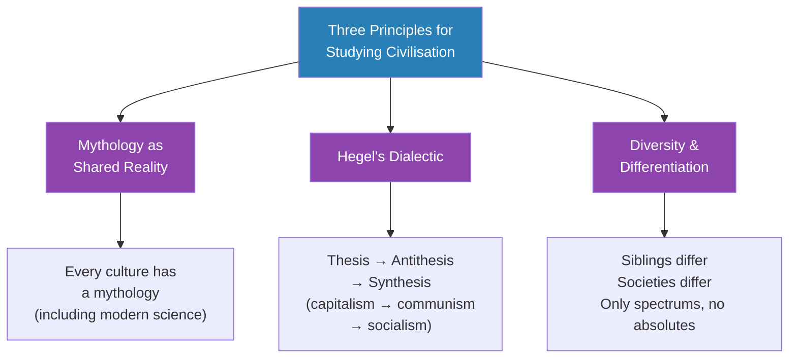
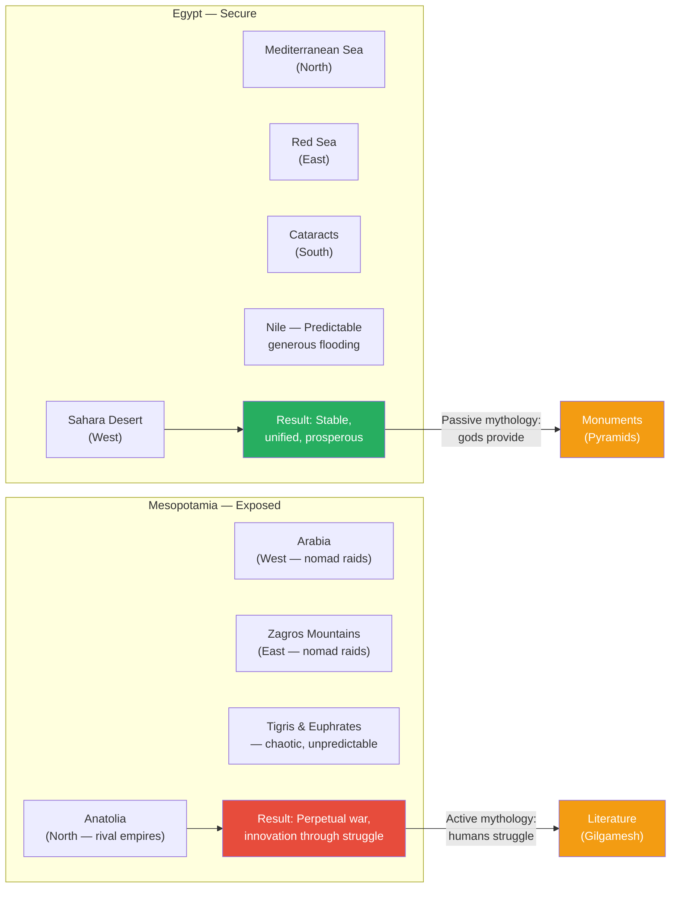
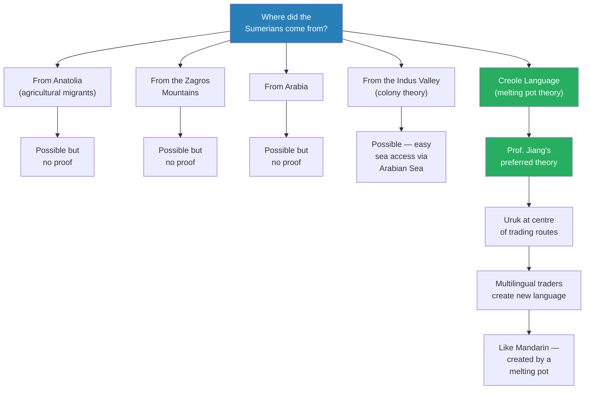
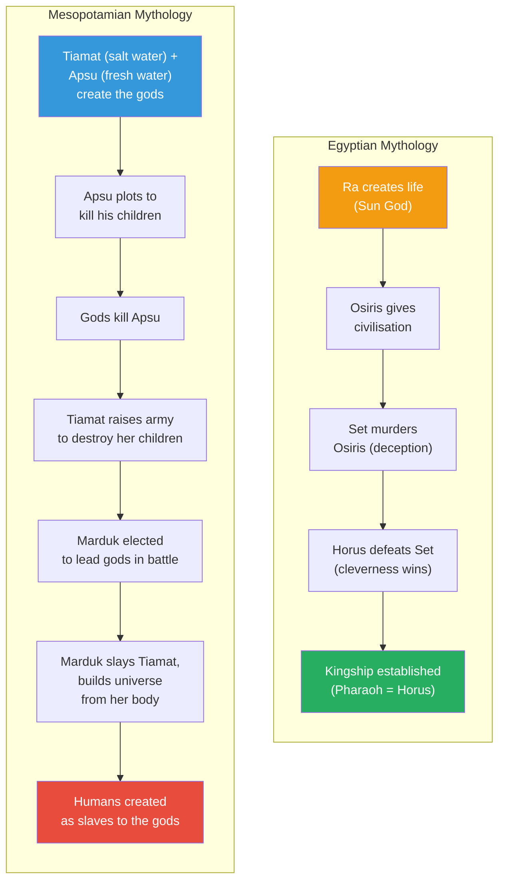
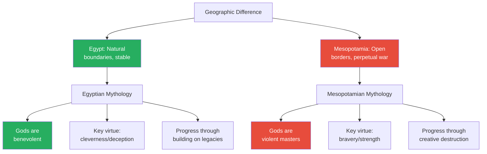
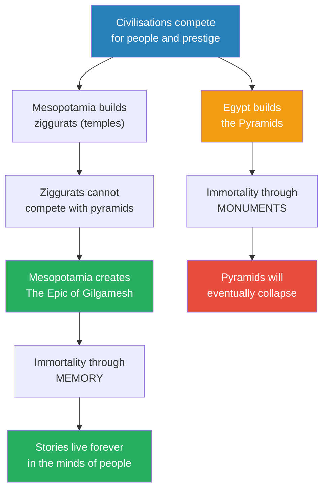
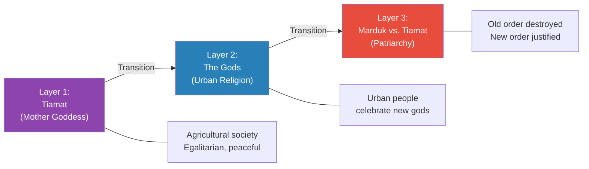
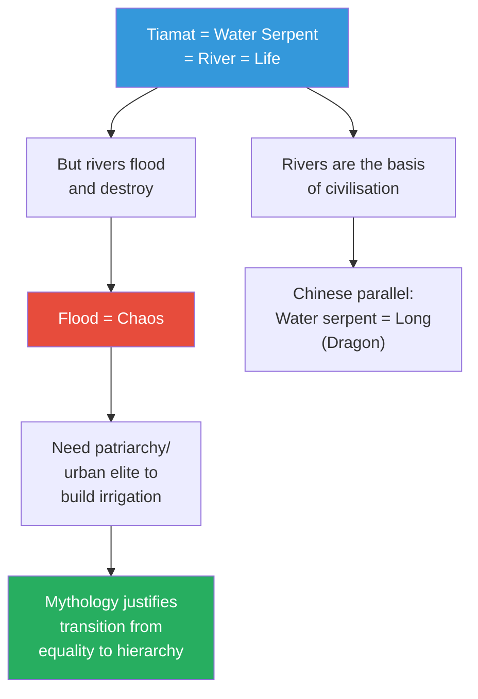

# Gilgamesh and Mesopotamia's Quest for Immortality

> Prof. Jiang moves from Egypt to Mesopotamia and reveals a civilisation defined by struggle, not stability. Where Egypt's geography provided security and its mythology promised divine benevolence, Mesopotamia's open geography invited constant invasion and its mythology demanded human servitude. Three conceptual tools — mythology as shared reality, Hegel's dialectic, and diversity-differentiation — frame the analysis. The lecture culminates in the Epic of Gilgamesh, the world's first work of literature, which Prof. Jiang reads as Mesopotamia's answer to the pyramids: immortality is not a monument you build for yourself but a memory earned through struggle and service to your people.

---

## Overview: Key Highlights

- <b style="color: #27ae60">Immortality is being remembered by those who love you</b> — Gilgamesh's epiphany upon returning to Uruk redefines what it means to live forever
- <b style="color: #2980b9">Mythology as shared reality</b> — every civilisation has a mythology that constitutes its collective worldview, including modern science and history
- <b style="color: #2980b9">Hegel's dialectic</b> — history is driven by opposing ideas moving toward synthesis (capitalism vs. communism → socialism)
- <b style="color: #e74c3c">Mesopotamia had no natural boundaries</b> — open to invasion from Anatolia, Arabia, and the Zagros Mountains, creating a civilisation forged in perpetual war
- <b style="color: #27ae60">Uruk as the world's first city</b> — a multicultural trading hub at the centre of the ancient world, birthplace of writing, law, mathematics, and astronomy
- <b style="color: #2980b9">Sumerian as a Creole language</b> — Prof. Jiang's preferred theory: Sumerian was invented by a melting pot of cultures converging at Uruk
- <b style="color: #e74c3c">Mesopotamian gods demand servitude</b> — humans are created as slaves, in stark contrast to Egypt's benevolent divine order
- <b style="color: #2980b9">Creative destruction</b> — the Mesopotamian principle that new civilisation requires destroying the old (Marduk slaying Tiamat)
- <b style="color: #27ae60">Bravery over cleverness</b> — Mesopotamia valued raw courage and strength; Egypt valued deception and palace intrigue
- <b style="color: #2980b9">The Enuma Elish</b> — Mesopotamia's creation myth encoding three layers of social evolution: mother goddess, urban gods, patriarchal order
- <b style="color: #e74c3c">The Epic of Gilgamesh is a dialectic with the pyramids</b> — a direct challenge to Egypt's monument-based immortality
- <b style="color: #27ae60">Literature as civilisational legacy</b> — where Egypt built pyramids, Mesopotamia invented literature to shape memory and inspire future generations

| Concept | One-line summary |
|---------|-----------------|
| **Mythology** | A civilisation's shared reality — the collective story that makes sense of the world |
| **Dialectic (Hegel)** | History advances through thesis vs. antithesis reaching synthesis |
| **Diversity and differentiation** | Societies and individuals instinctively strive to be different from each other |
| **Fertile Crescent** | The arc of fertile land from Mesopotamia through the Levant |
| **Uruk** | The world's first city (~40,000 people), considered the cradle of civilisation |
| **Cuneiform** | Sumerian writing system — the world's first script |
| **Creole language theory** | Sumerian arose from a multilingual trading community, like Mandarin |
| **Enuma Elish** | Mesopotamian creation myth: Marduk slays Tiamat, builds the universe from her body |
| **Creative destruction** | New order requires destroying the old — the mythological engine of Mesopotamian progress |
| **Epic of Gilgamesh** | The world's first work of literature — a quest for immortality that redefines what immortality means |
| **Ziggurat** | Mesopotamian stepped temples built to house the gods |

---

# The Lecture

## Three Principles for Studying Civilisation [0:00 - 9:48]

*Prof. Jiang opens with three conceptual tools that will frame not just this lecture but the comparison between Egypt and Mesopotamia: mythology as shared reality, Hegel's dialectic of opposing ideas, and the iron law of diversity and differentiation.*

> [!tip] Core Insight
> Every civilisation has a mythology — a shared reality — that is no more or less "true" than any other. Modern science and history are our mythology. Recognising this dissolves the arrogance that treats ancient worldviews as primitive.

*These three principles structure the entire lecture. Mythology explains why Egypt and Mesopotamia built different worldviews. The dialectic explains why they competed. Diversity explains why their differences were inevitable.*

> [!note]- Expand: Full Lecture Detail
> Prof. Jiang tells the class they are now doing Mesopotamia — the Bronze Age. Last class was Egypt; next class will be the Indus Valley. Before diving in, he establishes three intellectual tools:
>
> **Principle 1 — Mythology as shared reality:**
> - Every culture has a mythology, and that mythology is the collective worldview that lets people understand reality around them
> - <b style="color: #2980b9">Mythology is a shared reality</b> — every civilisation has one, and it is what makes the culture unique
> - Prof. Jiang makes a provocative claim: "Today, our mythology would be science and history. We think they are true and objective, but they're actually mythologies — they are shared reality"
> - The method for understanding Mesopotamia: compare and contrast its mythology with Egypt's
>
> **Principle 2 — The dialectic (Hegel):**
> - Proposed by the German philosopher <b style="color: #2980b9">Friedrich Hegel</b> in the 19th century
> - History is driven by opposing ideas — whenever one mythology or idea exists, an opposing idea must arise to challenge it
> - History always moves toward a <b style="color: #2980b9">synthesis</b> of ideas
> - Example: capitalism (thesis) vs. communism (antithesis) → socialism (synthesis)
> - Key insight: "Ideas can be living things that change over time"
>
> **Principle 3 — Diversity and differentiation:**
> - Humans have fundamental natures — one of these is the instinct to be different
> - <b style="color: #27ae60">Diversity is the iron law of society</b>
> - In a family, all siblings will be different; in a classroom, students differentiate themselves
> - If you move to a new classroom where people are similar to you, you will change to differentiate yourself
> - Societies and cultures fall on a spectrum — you cannot make absolute generalisations
> - Prof. Jiang warns: "I am going to make very broad generalisations today, and they're useful for our purposes, but I want you to be aware that these are simplifications"

---

## Geography as Destiny — Egypt vs. Mesopotamia [9:48 - 19:06]

*Prof. Jiang demonstrates how radically different geographies produced radically different civilisations. Egypt's natural boundaries created stability and prosperity; Mesopotamia's open terrain created permanent insecurity and a culture built on struggle.*

> [!tip] Core Insight
> Geography is destiny. Egypt could afford to be passive and fatalistic because its natural boundaries kept enemies out. Mesopotamia had to develop a mythology based on struggle and achievement because it was surrounded by threats — and that struggle made it the cradle of innovation.

*The same question — "how does a civilisation prove its greatness?" — produces completely different answers depending on geography. Secure Egypt builds eternal monuments. Besieged Mesopotamia writes eternal stories.*

> [!note]- Expand: Full Lecture Detail
> **Egypt's geography — natural fortress:**
> - To the west: the Sahara Desert
> - To the north: the Mediterranean Sea
> - To the east: the Red Sea
> - To the south: the cataracts (rapids that make travel up the Nile from the south extremely difficult)
> - Only two real access points — from the south and from the Levant (Israel, Syria, Jordan) — both easily defended
> - <b style="color: #27ae60">Egypt doesn't really feel threatened by external enemies</b>
> - The Nile was generous — it flooded predictably every season, making agriculture highly productive
> - Productive agriculture → large population → capacity for monumental building (pyramids)
> - For most of its history, Egypt was stable and prosperous
>
> **Mesopotamia's geography — open and vulnerable:**
> - Mesopotamia means "the land between two rivers" (Greek) — the <b style="color: #2980b9">Euphrates and the Tigris</b>
> - Located in modern Iraq
> - <b style="color: #e74c3c">No natural boundaries whatsoever</b>
> - To the west: Arabia and the Levant
> - To the north: Anatolia — prosperous, eventually home to rival empires like the Hittites
> - To the east: the Zagros Mountains — home to aggressive nomads who constantly raided
> - The people of Arabia were also nomads who launched constant raids
> - "Throughout its history, Mesopotamia has always been at war with its neighbours"
> - The Euphrates and Tigris "don't really cooperate — they're very chaotic, they change course all the time"
> - The only way to tame them was through <b style="color: #2980b9">irrigation</b> — farming too close to the riverbank meant getting flooded
>
> **The four civilisations of Mesopotamia:**
> - Prof. Jiang explains the succession in response to a student question:
>   - <b style="color: #2980b9">Sumerians</b> — the first great civilisation, organised as city-states (like the Greeks before Macedon)
>   - <b style="color: #2980b9">Akkadians</b> — under Sargon of Akkad (Sargon the Great), united the Sumerian city-states into an empire
>   - <b style="color: #2980b9">Assyrians</b> — inherited northern Mesopotamia after the Akkadian Empire fell
>   - <b style="color: #2980b9">Babylonians</b> — inherited southern Mesopotamia
> - All four "saw themselves as heirs to the Sumerian civilisation" and shared a common mythology
>
> > [!example] The Origins of Mesopotamian Civilisation
> > - Agriculture first appeared in Anatolia and the Levant
> > - The 8.2 kiloyear event (dramatic climate change) forced migration to Egypt, Europe, and Mesopotamia — spreading agriculture and the mother goddess mythology
> > - The 5.9 kiloyear event (~4000 BCE / 6000 years ago) caused another radical change
> > - A place called Uruk was founded — considered the world's first city, with about 40,000 people
> > - Uruk marks the beginning of the Sumerian civilisation — the "cradle of civilisation"
> > - The Sumerians gave the world: irrigation, mathematics, astronomy, cuneiform writing, legal systems, hierarchy, and religion
> > - Uruk eventually grew so large that people migrated and founded colony cities across Mesopotamia
> > - These colonies became wealthy and independent, leading to tension and sometimes warfare — though not the total warfare of later periods
> > **The lesson:** Innovation explodes when cultures collide — Uruk's position as a crossroads of the ancient world made it the incubator of civilisation itself.

---

## The Mystery of the Sumerians [19:06 - 22:35]

*Prof. Jiang turns to one of history's great unsolved puzzles: where did the Sumerians come from? Their language has no known relatives. Five theories compete, but Prof. Jiang favours one — Sumerian was a Creole language invented by a multicultural trading hub.*

*Five theories for the Sumerian mystery — Prof. Jiang favours the Creole hypothesis because it explains both the language isolate and Uruk's extraordinary burst of innovation.*

> [!note]- Expand: Full Lecture Detail
> Prof. Jiang presents the puzzle: when scholars deciphered cuneiform and translated the Sumerian language, they discovered it was completely unlike the surrounding Semitic languages. Sumerian is a <b style="color: #2980b9">language isolate</b> — there is no other language like it in the world.
>
> He walks through the competing theories:
> - **Anatolia theory:** Sumerians came from Anatolia and settled along the Euphrates because it was good for agriculture
> - **Zagros Mountains theory:** they came from the eastern mountains
> - **Arabia theory:** they came from the Arabian Desert
> - **Indus Valley theory:** the Indus Valley civilisation — "very advanced, 5 million people, larger than Egypt and Mesopotamia combined" — sent a colony to Mesopotamia. Prof. Jiang notes it is "actually pretty easy to get from the Indus Valley to Uruk because of the Arabian Sea"
> - **Creole language theory:** Prof. Jiang's preferred explanation — Sumerian was invented by a melting pot of cultures
>
> He explains the Creole theory by analogy:
> - "It's very similar to the Mandarin we speak today — Mandarin didn't exist, but because you had so many different cultures coming to the palace, they had to create their own language to communicate with each other"
> - <b style="color: #27ae60">Uruk was at the centre of the world</b> — from Uruk you could access the Indus Valley, the Arabian Desert, Anatolia, the Zagros Mountains, and the Yamnaya steppes
> - These civilisations traded with each other (the Bronze Age required alloys of tin and copper from different regions)
> - "Humans have been trading with each other since the beginning because we like to explore and experience different cultures"
> - If Uruk was a trading centre of the world, it makes sense for it to be "a multicultural and multilingual community"
> - Traders from all these regions came together and "developed their own language and their own culture"
> - Because it was a melting pot and an immigrant culture, "they were able to bring the most advanced ideas from all around the world and combine them together, which creates new inventions — like writing, like legal systems, like mathematics, like astronomy"
> - <b style="color: #27ae60">Sumerian became the cradle of civilisation because it was the meeting place of the world's cultures and ideas</b>
> - The instability of the environment — taming the Tigris and Euphrates, defending against outside enemies — forced them to develop "a new culture, a new mythology based on struggle"
> - "The Egyptians can afford to be passive and fatalistic — let the gods decide. But because, as an immigrant community, they have to focus on struggle and achievement — which is very much like America today"
>
> Prof. Jiang is careful to add: "Just to be absolutely clear, no one knows, and we'll probably never know the answer"

---

## Egyptian vs. Mesopotamian Mythology [22:35 - 36:03]

*Prof. Jiang places the two creation myths side by side — Egypt's story of benevolent gods building on each other's legacies, and Mesopotamia's Enuma Elish, where violent gods demand human servitude. Three fundamental differences emerge: benevolence vs. violence, cleverness vs. bravery, and continuity vs. creative destruction.*

> [!tip] Core Insight
> The gods you worship reveal the world you live in. Egypt's safe, prosperous world produced benevolent gods who give humans everything. Mesopotamia's violent, unstable world produced violent gods who demand servitude. Mythology is not fantasy — it is geography encoded as theology.

*Two creation myths, two worldviews. Egypt's story ends with divine kingship bestowed as a gift. Mesopotamia's ends with human slavery imposed by force. The same question — "why are we here?" — produces opposite answers.*

*Three differences between the mythologies map directly onto three differences in geography and history. Neither is "better" — each is a perfectly rational response to its environment.*

> [!note]- Expand: Full Lecture Detail
> **The Egyptian creation myth (simplified):**
> - The first god was <b style="color: #2980b9">Ra</b>, the sun god (other versions name Atum or Amun)
> - Ra comes to the world and creates life — he gives life to everything, including humans
> - Humans worship Ra, but eventually become misguided and worship false gods
> - Ra becomes angry and kills many humans, but then feels tremendous regret
> - He decides his time is up and gives the throne to <b style="color: #2980b9">Osiris</b>
> - Osiris is a great god who gives people civilisation — cities, pyramids, writing
> - Osiris's brother <b style="color: #2980b9">Set</b> is jealous and plots to usurp the throne
> - Set builds a beautiful sarcophagus and tricks Osiris into lying in it — then closes it forever, kills Osiris, and dismembers his body
> - Osiris's wife <b style="color: #2980b9">Isis</b> searches for his body and reassembles it (but cannot find the head)
> - Osiris becomes god of the underworld; he impregnates Isis, and they have a son: <b style="color: #2980b9">Horus</b>
> - Horus grows up enraged that his uncle Set has usurped the throne
> - The gods decree a series of duels between Horus and Set
>   - One duel: both turn into hippopotamuses and try to stay submerged the longest
>   - Horus tells Isis to spear Set while he is distracted — she tries but is "paralysed with fear" and fails
>   - Horus is so angry he beheads his own mother (she survives but loses her head)
> - Eventually Horus poisons Set before Set can poison him, and Horus becomes king
> - Horus gives Egypt the institution of kingship — every Pharaoh is a reincarnation of Horus
>
> **The Mesopotamian creation myth — the Enuma Elish ("From on High"):**
> - Two primordial gods: <b style="color: #2980b9">Tiamat</b> (salt water) and <b style="color: #2980b9">Apsu</b> (fresh water)
> - They come together and give birth to other gods, who in turn produce more gods
> - Apsu grows annoyed — his children are too loud and he cannot sleep
> - He resolves to kill all his children and bring peace
> - Tiamat discovers the plot and warns her children
> - The gods band together and kill Apsu
> - Tiamat is enraged by her consort's death and raises a massive army to destroy her children
> - The gods elect <b style="color: #2980b9">Marduk</b>, a third-generation god, to lead them in battle
> - Tiamat transforms into a giant water serpent and challenges Marduk to a duel
> - Marduk unleashes whirlwinds into Tiamat's mouth, stunning her, then strikes her down
> - <b style="color: #27ae60">He uses her body to create the universe</b> — half becomes the sky, half becomes the continents; he creates the moon and stars
> - After creation, the gods want to rest — but they need servants to tend the land
> - <b style="color: #e74c3c">They create humans as their slaves</b> — each city gets its own god, and the humans must serve that god for eternity
>
> **Three fundamental differences:**
>
> | Dimension | Egypt | Mesopotamia |
> |-----------|-------|-------------|
> | **Divine nature** | Gods are benevolent — they give humans life, civilisation, kingship | Gods are violent and self-serving — they demand servitude |
> | **Key virtue** | Cleverness and deception — "palace intrigue" (like Sun Tzu's Art of War in China) | Bravery and raw strength — "no trickery, just pure power" |
> | **Model of progress** | Continuity — gods build on each other's legacies (Ra → Osiris → Horus) | Creative destruction — "to create something new, you must destroy the old" |
>
> Prof. Jiang elaborates on each:
> - **Benevolence vs. violence:** In Egypt, "the gods give us everything — we just sit back and the gods will give us life, civilisation, kingship, pyramids." In the Enuma Elish, "gods are extremely violent and they demand our servitude — they're our masters"
> - **Cleverness vs. bravery:** Egypt was an empire where what mattered was "the ability to manipulate internal politics — palace intrigue." He draws a direct parallel to China: "Sun Tzu's Art of War is a manual on palace intrigue — how to trick other people. It's not a manual on how to go to war." In Mesopotamia, "the value that is most prominent is bravery or strength, not cleverness"
> - **Continuity vs. creative destruction:** In Egypt, "the gods are helping each other — they build on top of each other's legacies." In Mesopotamia, <b style="color: #2980b9">creative destruction</b> prevails: "In order to create something new, you must destroy the old. Tiamat represents the old, therefore she must be destroyed. And from the old you can build a new civilisation." He concludes: <b style="color: #27ae60">"Conflict is a source of creativity"</b>
>
> Prof. Jiang reminds the class: "They have these two different mythologies because they're reflecting the shared reality of the different geographies and history"

---

## The Competition for Immortality — Pyramids vs. Gilgamesh [36:03 - 44:21]

*Prof. Jiang reveals that the ancient world was a marketplace of ideas — civilisations competed for people and prestige. Egypt built the pyramids to prove divine favour. Mesopotamia, unable to match that spectacle, did something more enduring: it created the world's first work of literature.*

*Two civilisations, two strategies for eternity. Prof. Jiang argues that Mesopotamia's answer — literature — was the more durable innovation. The pyramids still stand, but Gilgamesh still speaks.*

> [!note]- Expand: Full Lecture Detail
> Prof. Jiang sets up the competition:
> - Both Egypt and Mesopotamia were in "a struggle to prove their mythologies are the best"
> - This era saw constant trade and migration — "people have a choice. If you're not happy here, you can always move somewhere else"
> - "There isn't any idea of nation or culture or race — people have autonomy"
> - <b style="color: #27ae60">Civilisations must constantly prove they are the best to attract people, which provides the labour to drive the civilisation</b>
> - Egypt's answer: the pyramids — "to show the people around them: we are favoured by the gods, because it's only the gods who could inspire us to build the pyramids"
>
> The Mesopotamians faced a problem: "How do you compete against the pyramids?"
> - They tried: they created <b style="color: #2980b9">ziggurats</b> — stepped temples to house the gods
> - But then they did something completely different
> - They created <b style="color: #27ae60">The Epic of Gilgamesh</b>
> - "Today we celebrate the Epic of Gilgamesh as the first work of world literature"
>
> **The plot of the Epic of Gilgamesh:**
>
> > [!example] The Epic of Gilgamesh — The World's First Story
> > - Gilgamesh is king of Uruk, a demigod — enormous, brave, and powerful
> > - He has built great walls and a prosperous city, but he grows bored
> > - He starts bullying young men (beating them up) and raping young women
> > - The people's parents pray to the gods for relief
> > - The gods create Enkidu, made of clay, as Gilgamesh's equal
> > - The two fight — Gilgamesh wins, but he is thrilled to have found a friend and equal
> > - They go on adventures together, defeating gods and monsters through friendship and bravery
> > - The goddess Ishtar falls in love with Gilgamesh, but he refuses her — he will not become her "sex slave"
> > - Ishtar sends the Bull of Heaven to destroy Uruk; Gilgamesh and Enkidu kill it
> > - The gods, enraged, decree that Enkidu must die — they inflict a disease that kills him
> > - Gilgamesh is heartbroken and terrified of death
> > - He sets out to find an immortal man who survived a great flood
> > - Everyone he meets tells him to give up: "Immortality is for the gods — enjoy your life, drink, be merry"
> > - Gilgamesh refuses and eventually finds the immortal man
> > - The man explains: the gods created a flood to kill noisy humans, but one god warned him; he built a boat and saved animals (the basis of the biblical flood story)
> > - The gods, regretting the flood, granted this one man immortality — a one-time exception
> > - The man challenges Gilgamesh to stay awake for six nights and seven days — Gilgamesh fails
> > - Gilgamesh returns home defeated — but upon seeing the walls of Uruk and his happy people, he has his epiphany
> > **The lesson:** Immortality is not living forever. Immortality is being remembered by the people who love you. The irony: by going on the quest and failing, Gilgamesh became immortal — because his story of struggle was remembered forever.
>
> Prof. Jiang draws the meaning:
> - "This is a reflection of the values of Mesopotamia"
> - <b style="color: #27ae60">"The point is in the achievement. The point is not in the victory. The point is in the exploration. The point is in the struggle."</b>
> - That is why the Mesopotamians were so innovative — and also why they went to war constantly
> - "This is the beginning of the idea of literature — where memories can be shaped in such a way that it becomes so beautiful that it becomes implanted in the minds of others for centuries, which will inspire them to greater heights of achievement"
>
> **The dialectic with the pyramids:**
> - Prof. Jiang reads the Epic of Gilgamesh as a direct response to Egypt's monument-building:
> - <b style="color: #e74c3c">"The Epic of Gilgamesh is also saying to the pyramids: immortality is an illusion. Eventually these pyramids will collapse"</b>
> - "For the Pharaoh to seek immortality is a delusion. What matters is for the Pharaoh to look after the well-being of his people here and now"
> - "He will die if his people die — but if your people live on because of your contributions, then you'll be remembered forever, you'll become immortal"
> - Egypt's legacy: pyramids — a testament to the tremendous creativity of the Egyptian people
> - Mesopotamia's legacy: the Epic of Gilgamesh — equally a testament to tremendous creativity, but achieved through literature rather than architecture

---

## The Enuma Elish as Social History [44:21 - 50:50]

*Prof. Jiang reveals a hidden layer within the Mesopotamian creation myth: three mythologies embedded within one, each representing a stage of social evolution — from egalitarian mother goddess worship to urban religion to patriarchal order.*

> [!tip] Core Insight
> The Enuma Elish is not just a creation story — it is a record of social change. Tiamat is the mother goddess of the old egalitarian world. Marduk is the patriarchal urban elite. The myth justifies the destruction of the old order by recasting the feminine as chaos and the masculine as civilising force.

*Three layers of mythology encode three stages of social evolution. The myth does not merely describe the creation of the world — it justifies the creation of a new social order.*

*The water serpent symbolism works the same way across civilisations. The river gives life but also threatens it — and that threat justifies centralised authority.*

> [!note]- Expand: Full Lecture Detail
> Prof. Jiang reveals the hidden structure of the Enuma Elish:
>
> **Three mythologies embedded in one:**
> - **First layer — Tiamat and Apsu create the world:** This represents the <b style="color: #2980b9">mother goddess</b> culture — the original egalitarian, peaceful agricultural society. Tiamat is the giver of life.
> - **Second layer — The emergence of the gods:** This represents the urban people and their new religious practices — the rise of cities and city-based worship.
> - **Third layer — Marduk vs. Tiamat:** This represents the battle between the old society and the new — the agricultural and the urban. The agricultural was egalitarian and peaceful; the urban is patriarchal.
>
> Prof. Jiang asks: "How do you justify the transition from an equal society to a patriarchy?"
> - The answer is embedded in the mythology: <b style="color: #e74c3c">Tiamat represents chaos; Marduk represents order</b>
> - "Even though we are letting go of the old, we're destroying the old — it's to create a more peaceful and orderly world"
>
> **The water serpent symbolism:**
> - Tiamat is a water serpent — and "for the longest time, we believed the water serpent to represent life and divinity"
> - Why? "The serpent, the water serpent, looks like the river, and the river is the basis of civilisation"
> - He draws a parallel to China: "What do we call the water serpent in China? Long — the dragon"
> - "The problem is the river floods. And if you flood too much, you destroy civilisation. So it's chaotic"
> - <b style="color: #27ae60">This is why patriarchy and urban elites become necessary</b> — "they can command us to create irrigation, to build walls, which will tame the river and the water serpent"
>
> **The Epic of Gilgamesh as political evolution:**
> - Prof. Jiang also reads the Epic of Gilgamesh as encoding a political transition
> - "The story starts with the king going on all these adventures — the story ends with the king coming back and recognising what matters is the well-being of his people"
> - This represents "the beginning of a bureaucratic elite which will help the king order the world"
> - "But first the king must recognise his own hubris — he must become humble"
> - <b style="color: #e74c3c">The great fear of the Mesopotamians: their king will become like the Pharaoh</b> — channelling all resources to build a monument, creating inequality, corruption, and waste, leading to massive suffering during drought
>
> **Innovation through competition:**
> - Mesopotamia's irrigation was very advanced because the Tigris and Euphrates were uncooperative — they changed course constantly
> - Because the region comprised different trading city-states, "if one city-state creates a really good irrigation system, another city-state could just copy it really easily"
> - Competition between city-states drove rapid innovation

---

## Preview — The Indus Valley Paradox [50:50 - 52:04]

*Prof. Jiang previews the next lecture by posing a paradox: the Indus Valley Civilisation had every geographic condition for an Egypt-style monarchy, but was instead peaceful and egalitarian — the opposite of what geography-as-destiny would predict.*

> [!note]- Expand: Full Lecture Detail
> Prof. Jiang tells the class the next lecture will cover the Indus Valley Civilisation, and frames it as a mystery:
> - Using the "geography is destiny" framework from today, you would expect the Indus Valley to resemble Egypt — monarchy, centralised authority, great monuments
> - The Indus Valley was a "huge, huge civilisation" with very advanced technology
> - Big, well-designed cities with plumbing, sanitation, and even air conditioning (towers that trap hot air)
> - People lived a very long time — "over half the population lived past 55, which is an incredible achievement"
> - <b style="color: #27ae60">But it was peaceful and egalitarian</b> — a "complete mystery" given the geographic logic
> - "Next class, we will look at the Indus Valley Civilisation and try to resolve the paradox as to why it is advanced, prosperous, and at the same time peaceful and egalitarian"

---

## Connections

**Builds on:** [[18 - The Great Pyramid as Ancient Egypt's Manhattan Project]] (Egyptian civilisation and the pyramids as cultural statement), [[01 - Explaining Humanity's Transition to Agriculture]] (mother goddess mythology, the role of religion in settlement), [[04 - The Paradise Lost of Marija Gimbutas]] (egalitarian mother goddess societies before patriarchal conquest), [[06 - Elite Overproduction and the Bronze Age Collapse]] (Mesopotamia as part of the Bronze Age trading network)

**Sets up:** [[20 - The Proto-Buddhists of the Indus Valley Civilization]] (the Indus Valley paradox — geography predicts Egypt-style monarchy but produces egalitarian peace)

**Recurring themes:**
- Geography as destiny — the foundational argument of this lecture, extending the comparison begun in Lecture 18
- Creative destruction — new to this lecture, the Mesopotamian principle that progress requires destroying the old
- Mythology as shared reality — every civilisation's worldview is equally valid, equally "mythological"
- Hubris of kings — Gilgamesh's journey from arrogant bully to humble servant of his people mirrors the hubris theme from Lectures 9 and 12
- Struggle as the engine of innovation — Mesopotamia's permanent insecurity drove its status as the cradle of civilisation, paralleling the poor-conquers-rich dynamic from Lecture 11

**Related books in vault:**
- [[Sapiens - Yuval Noah Harari]] — the agricultural revolution, early civilisations, and the power of shared myths ("imagined orders") that hold societies together
