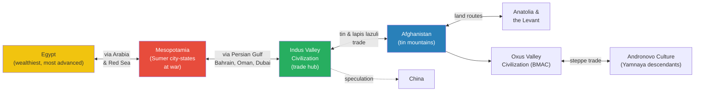
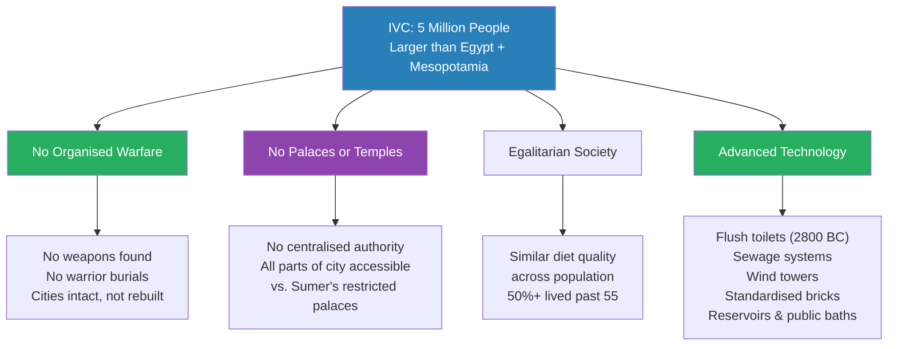
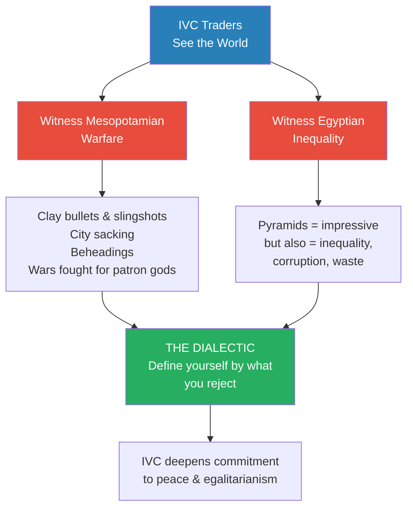
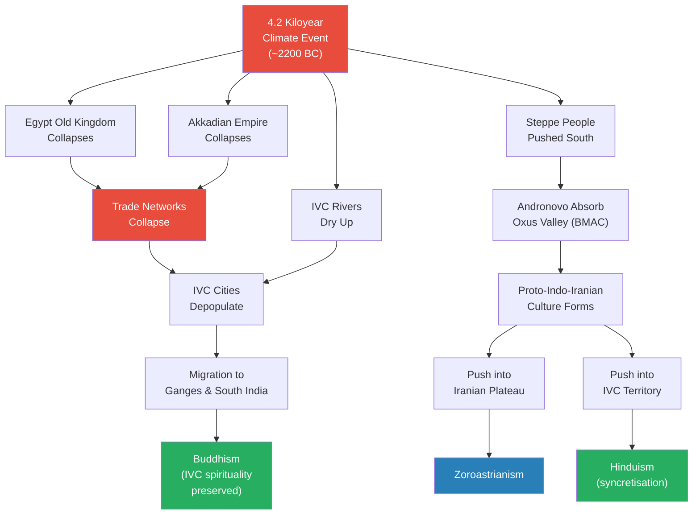
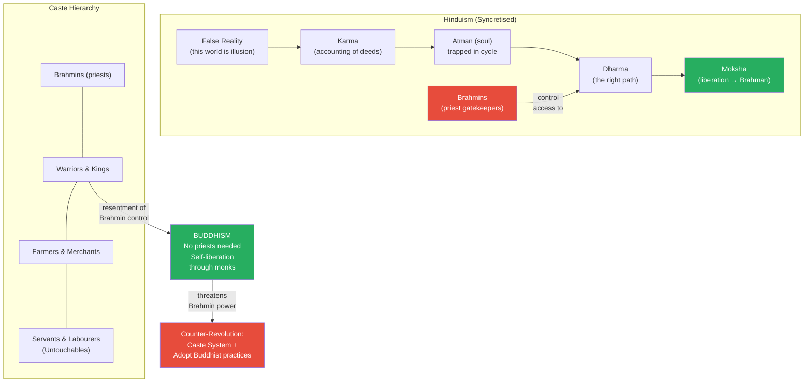
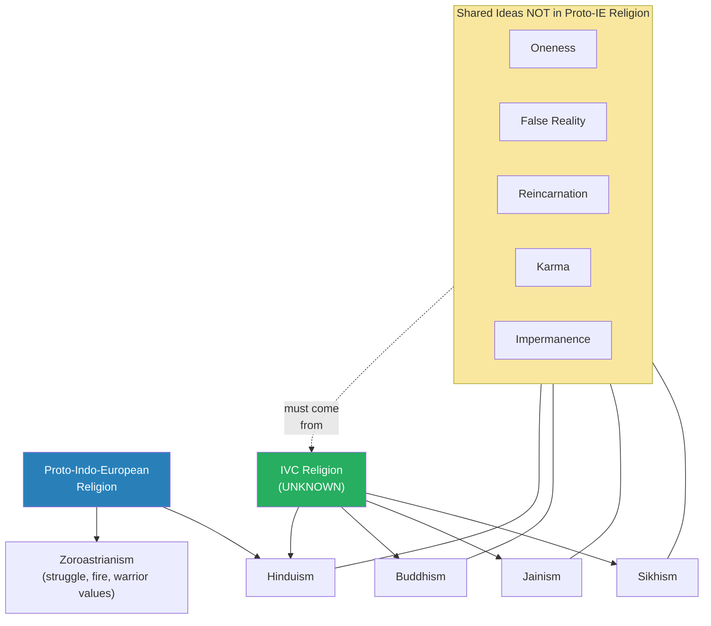
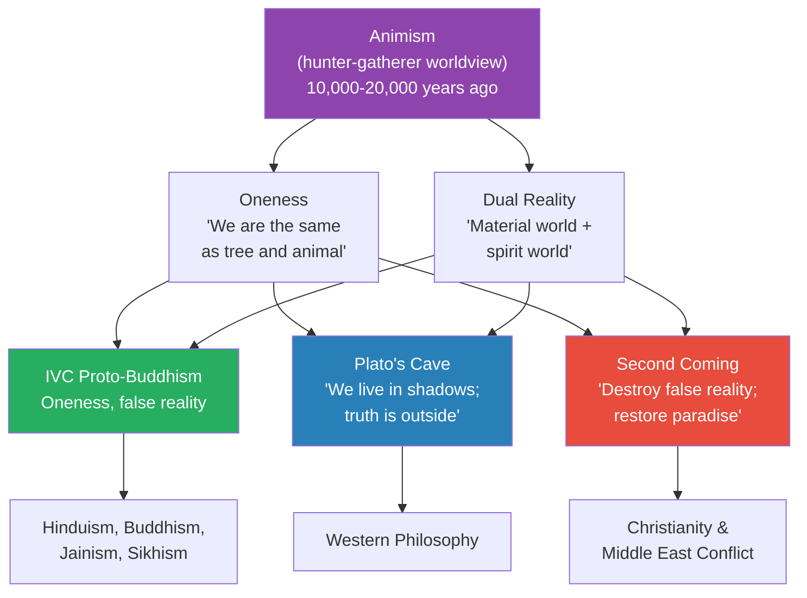

# The Proto-Buddhists of the Indus Valley Civilization

> Prof. Jiang closes the Bronze Age unit with the Indus Valley Civilization — the third great civilization of the era, and by far the strangest. Covering an area larger than Egypt and Mesopotamia combined, the IVC left behind no palaces, no temples, no weapons, and no decipherable writing. Its cities had flush toilets, standardised bricks, wind-tower air conditioning, and public baths — yet no evidence of organised warfare or ruling class. Prof. Jiang speculates that IVC traders, witnessing the violence of Mesopotamia and the corruption of Egypt, developed a proto-Buddhist worldview of oneness and false reality rooted in ancient animism — a spiritual framework that would survive their civilization's collapse and ultimately give birth to Hinduism, Buddhism, Jainism, and Sikhism.

---

## Overview: Key Highlights

- <b style="color: #27ae60">The IVC was peaceful and egalitarian</b> — no palaces, no temples, no weapons, no evidence of organised warfare across an area larger than Egypt and Mesopotamia combined
- <b style="color: #2980b9">The dialectic</b> — Prof. Jiang's key explanatory concept: the IVC defined itself in opposition to the violence and inequality it witnessed in Mesopotamia and Egypt
- <b style="color: #e74c3c">Their writing system is undecipherable</b> — written on degraded palm leaves rather than papyrus or clay, leaving their religion and worldview a complete mystery
- <b style="color: #27ae60">Trade, not warfare, was the engine of civilization</b> — the IVC was a value-adding processing centre that traded peacefully with Sumer, Egypt, the Persian Gulf states, and possibly China
- <b style="color: #2980b9">Proto-Buddhism</b> — Prof. Jiang's speculative argument that the IVC religion contained the seeds of Buddhism: oneness, false reality, and liberation from the material world
- <b style="color: #e74c3c">The 4.2 kiloyear climate event collapsed the trade networks</b> — drought destroyed demand in Egypt and Mesopotamia, depopulating IVC cities and leaving them vulnerable
- <b style="color: #2980b9">Syncretisation</b> — the merger of proto-Indo-Iranian religion with IVC spirituality created Hinduism; displaced IVC people created Buddhism
- <b style="color: #27ae60">Standardised weights and measurements</b> — every brick was the same size across the entire civilization, producing structures so stable they survive 5,000 years later
- <b style="color: #e74c3c">The caste system was a Brahmin counter-revolution</b> — created by Hindu priests specifically to contain the threat of Buddhism's egalitarian message
- <b style="color: #2980b9">Wind towers</b> — ancient air conditioning using cool high-altitude air funnelled down to push out hot air from houses
- <b style="color: #27ae60">Human nature is curiosity and imagination</b> — Prof. Jiang's concluding argument: what makes us human drives both peace (IVC) and destruction (the Second Coming), depending on circumstance
- <b style="color: #e74c3c">Cultural genocide, not military invasion</b> — the Indo-Aryan "invasion" was a gradual process of assimilation: kill or enslave the men, marry the women, absorb the culture

| Concept | One-line summary |
|---------|-----------------|
| **Indus Valley Civilization (IVC)** | Bronze Age civilization (~2600-1900 BC) spanning Afghanistan, Pakistan, and NW India — peaceful, egalitarian, trade-based |
| **The dialectic** | Civilizations define themselves in opposition to what they observe in neighbouring cultures |
| **Value-adding processing centres** | IVC cities specialised in transforming raw goods into finished products for export |
| **Wind towers** | Ancient air conditioning — cool high air funnelled down to displace hot interior air |
| **4.2 kiloyear event** | Global climate catastrophe (~2200 BC) that collapsed trade networks and ended the Old Kingdom, Akkadian Empire, and IVC |
| **Syncretisation** | The merger of two religions sharing and blending gods — how Hinduism and Zoroastrianism were born |
| **Proto-Buddhism** | Prof. Jiang's speculation that IVC religion contained the core ideas later formalised as Buddhism |
| **Brahman (Hindu)** | The true absolute reality beyond the false material world — accessible only through spiritual purification |
| **Karma / Dharma / Moksha** | Accumulated deeds / the right path / liberation from the cycle of rebirth — the Hinduism framework |
| **Caste system** | Hierarchical social separation enforced by Brahmins in response to Buddhism's egalitarian challenge |
| **Soma** | Ritual drink from proto-Indo-Iranian culture, carried into Zoroastrian and Hindu practice |
| **Animism as nostalgia** | The deep human longing for oneness with nature — the worldview of our hunter-gatherer ancestors |

---

# The Lecture

## The Bronze Age World and the IVC's Place in It [0:00 - 5:37]

*Prof. Jiang opens by setting the Indus Valley Civilization within the interconnected Bronze Age world of approximately 2500-2000 BC. Three civilizations — Egypt, Mesopotamia, and the IVC — formed a trading network spanning from the Mediterranean to possibly China, with the IVC positioned as the great commercial connector.*

*The IVC sat at the centre of Bronze Age globalisation — connected to every major civilization through trade partners, colonies, and overland routes. The two primary sources of demand were Egyptian burial goods and Mesopotamian bronze weapons.*

> [!note]- Expand: Full Lecture Detail
> Prof. Jiang opens by announcing the class is finishing the Bronze Age unit with the Indus Valley Civilization, having already covered Egypt and Mesopotamia. He frames the lecture around three questions: what made the IVC distinct, why did they decline, and what is their legacy.
>
> He sets the scene by describing the Middle Bronze Age world (~2500-2000 BC):
>
> - <b style="color: #2980b9">Egypt</b> is "by far the wealthiest, most advanced civilization in the Bronze Age"
> - Arabia, though rarely discussed in world history, is crucial as a trading corridor — nomads carry goods between Mesopotamia and Egypt
> - Mesopotamia, specifically the Sumerian city-states, is the beginning of Mesopotamian civilization
> - The IVC covers modern Afghanistan, Pakistan, and northwest India
> - Its coastal position gives it access to both Mesopotamia and Egypt
>
> The IVC's unique trade products:
> - **Indigo dye** — heavily sought after in Mesopotamia and Egypt
> - **Handicrafts and jewellery** — famous throughout the Bronze Age world
> - Trade conducted primarily through Gulf state intermediaries: Bahrain, Oman, and Dubai
> - They maintained a colony by the Persian Gulf
> - Prof. Jiang believes they even traded with China: "their ships were huge and they were very good navigators"
>
> Two resources drove the Afghan expansion:
> - **Tin** — essential component of bronze, found in Afghanistan's mountains, and "really sought after" as the Bronze Age progressed
> - <b style="color: #2980b9">Lapis lazuli</b> — "really sought after by the Egyptians for its spiritual and aesthetic qualities"
>
> The Afghan trade routes also gave rise to secondary civilizations:
> - The <b style="color: #2980b9">Oxus Valley Civilization</b> (Bactrian-Margiana Archaeological Complex / BMAC) — connected northward to the steppe peoples of the Andronovo culture
>
> Prof. Jiang emphasises the scale: "There's no piece of the Western world the Indus Valley Civilization does not touch"
>
> Two sources of demand drove the entire system:
> - Egypt's enormous wealth and appetite for burial goods
> - Mesopotamia's constant warfare, creating demand for bronze armour — "bronze armour is much more stronger than copper armour"

---

## A Civilization Without War, Kings, or Temples [5:37 - 19:13]

*Prof. Jiang presents the evidence for what makes the IVC uniquely strange among Bronze Age civilizations: no organised warfare, no palaces or temples, radical egalitarianism, and astonishing urban engineering — flush toilets, standardised bricks, wind-tower air conditioning — all without a decipherable written record to explain why.*

> [!tip] Core Insight
> For a civilization of five million people covering an area larger than Egypt and Mesopotamia combined, the absence of warfare, palaces, and temples is not a gap in the evidence — it is the evidence. Something fundamentally different was operating here.

*Every feature of the IVC points in the same direction: a civilization organised around collective welfare rather than centralised power. The mystery is how — and the answer lies in a religion we cannot read.*

> [!note]- Expand: Full Lecture Detail
> Prof. Jiang begins presenting what makes the IVC "radically different" from Egypt and Mesopotamia.
>
> **Size and peace:**
> - The IVC covers a "huge area" — larger than Egypt and Mesopotamia combined
> - Population at its peak: approximately 5 million people
> - "We have found no evidence of any organised warfare in this region during this time"
> - The region is connected through trade — five major urban centres function as <b style="color: #2980b9">value-adding processing centres</b>
> - These centres specialise in "taking raw goods like metals and agricultural products and turning them into finished products, like jewellery, handicrafts to be shipped"
> - The trade network extends to Mesopotamia, Egypt, possibly China, and north through the Oxus Valley to the Yamnaya steppe peoples
>
> **Evidence for peace:**
> - A student asks how we know there was no warfare. Prof. Jiang explains:
>   - Cities were found "pretty intact" — not built on top of or destroyed, unlike Mesopotamian sites
>   - Graves contain no distinct warrior caste, no helmets, no armour, no weapons
>   - <b style="color: #e74c3c">However, the evidence is not conclusive</b> — the IVC did not have a strong tradition of burying their dead, and burial sites may not be located in the cities
>   - "The evidence leans towards they were a peaceful civilization, but as we dig up more, we may discover this was not true"
> - The civilization was only discovered 100 years ago — by the British, not the Indians themselves
>
> **Egalitarian design:**
> - In Mesopotamian cities like Ur and Uruk, huge palaces and temples suggested centralised power in priests and kings
> - In the IVC's five urban centres: <b style="color: #27ae60">"there are no palaces, there are no temples"</b>
> - Cities are "extremely well designed" — anyone can access every part of the city
> - In Sumer, entering a city meant you could only access the temple or palace — "authority is centralised"
> - In the IVC, "authority is sort of decentralised"
>
> **The walls question:**
> - If they were peaceful, why did the cities have walls?
> - Prof. Jiang's answer: customs and taxes — "this is a value-adding processing centre, and the way they survive economically is by collecting tolls and customs on people who trade"
> - When entering the city, traders go to the customs house and pay before accessing the city
>
> **Technological achievements:**
>
> > [!example] The First Flush Toilets (2800 BC)
> > - Every private home had its own toilet
> > - Faeces entered a sewage system
> > - Water flushed the waste out of the city
> > - This dates to approximately 2800 BC — nearly 5,000 years ago
> > - "These are people who are very concerned about the well being of all its citizens"
> > **The lesson:** Urban sanitation on this scale implies a society that prioritised collective health — not individual power or monumental display.
>
> - <b style="color: #2980b9">Wind towers</b> — ancient air conditioning: "These are high towers, and there is a hole on top. The higher the air is, the cooler it is. This wind that's cool gets trapped into the wind tower, it comes down and it pushes out the hot air from the other side"
> - <b style="color: #27ae60">Standardised weights and measurements</b> across the entire civilization — "every brick that they have is the same size, which means that their buildings, their structures, are extremely stable and resilient. That's why 5,000 years later, we still have their cities intact. You can actually go to the cities and live in them."
> - Reservoirs and public baths
>
> **The writing problem:**
> - Their writing system, if it existed, was ideographic (like Chinese) — the spoken language was not the same as the written language
> - Unlike Egypt (papyrus in dry air) or Mesopotamia (cuneiform on clay tablets), the IVC likely wrote on palm leaves — "which degrades very easily in the jungle air"
> - Only seals with characters have survived — not enough to decipher the language
> - <b style="color: #e74c3c">"Without access to the writing, we don't have access to their religion"</b>
> - And religion, Prof. Jiang reminds the class, "is the operating system of the culture. It is the collective consciousness, the collective worldview, that gives life to their culture. It explains why they do what they do."
>
> He concludes: "It's a complete mystery to archaeologists, to scholars, as to why this very advanced civilization was very peaceful and very egalitarian. We only speculate."

---

## The Dialectic — Why the IVC Chose Peace [19:13 - 27:45]

*Prof. Jiang introduces the concept of the dialectic — civilizations defining themselves in opposition to what they observe in others — to explain the IVC's unique character. As long-distance traders who witnessed Mesopotamian warfare and Egyptian inequality firsthand, the IVC people were repulsed by what they saw and reinforced their own values of peace and egalitarianism.*

> [!tip] Core Insight
> The IVC's peace was not ignorance — it was informed rejection. These traders saw the sacked cities and the pyramids built on corruption. Their egalitarianism was a deliberate cultural choice made in full knowledge of the alternatives.

*The dialectic is not passive — it actively shapes values. Japan watches China. Canada watches America. The IVC watched Mesopotamia and Egypt and chose the opposite path.*

> [!note]- Expand: Full Lecture Detail
> Prof. Jiang begins his speculative argument about why the IVC was peaceful and egalitarian.
>
> **The key is religion:**
> - "What is the religion? Because that will give us clues as to their mentality, their value system"
> - Mesopotamian religion focused on "struggle and achievement"
> - Egyptian religion focused on the afterlife — "this life that we live, what's important is not the here and now. What's important is what happens afterwards. That's why the Egyptians built the pyramid"
> - The IVC religion must have been different — something that produced peace and egalitarianism
>
> **The trade-based argument:**
> - The IVC had been traders "for at least 7,000-8,000 years before they became a civilization"
> - As traders, they accessed the entire world — artefacts from the IVC appear in Sumer and the Persian Gulf states
> - They saw what was happening in Mesopotamia and Egypt firsthand
>
> **The dialectic:**
> - Prof. Jiang introduces <b style="color: #2980b9">the dialectic</b> — "a very important idea for us to appreciate how history is often driven"
> - He gives three modern examples:
>
> > [!example] The Dialectic in Action — Three Modern Cases
> > - **Japan and China** — neighbouring civilizations that are radically different. Much of Japanese cultural practice developed "in response to what they see as failings or successes in Chinese culture"
> > - **Canada and the United States** — the US is "probably the most belligerent nation in the world." Canada, sharing the world's longest border and the same language, "invented peacekeeping." Canadian values are "in response to what it believes to be failings and successes in the American model"
> > - **New Zealand and Australia** — similar pattern of dialectical cultural divergence
> > **The lesson:** Neighbouring civilizations do not converge — they define themselves by what they reject in each other.
>
> **Applied to the IVC:**
> - "I believe that's what happened with the IVC, where these traders saw what's happening in Egypt and saw what's happened in Mesopotamia, and they were kind of disgusted"
> - Mesopotamian warfare was "pretty awful" — clay bullets, slingshots ("think of David and Goliath"), beheadings, all fought in the name of patron gods
> - Egyptian pyramids were impressive but also revealed "massive inequality, massive corruption, just massive waste"
> - <b style="color: #27ae60">"By trading with these two civilizations, it reinforces the deep cultural values of the IVC people and basically compels them towards peace and egalitarianism"</b>
>
> **The geographic argument:**
> - Prof. Jiang acknowledges other explanations — "maybe these people are just genetically peaceful"
> - But he has argued throughout the course that early humans were inherently peaceful and egalitarian
> - Different geographic circumstances changed outlooks — the Yamnaya, in harsh grasslands, "were forced to be cattle ranchers" and developed an "aggressive, expansionist and opportunistic" culture
> - Eventually the Yamnaya became even more aggressive — "eventually the Mongols, Genghis Khan and Mongols will come from this civilization"
> - The IVC's relative peace came from favourable geography plus the dialectic reinforcing their natural values
>
> He qualifies: "There are still inequalities in the IVC. We know there are classes, we know there's wealth inequality, but relative to Mesopotamia and Egypt, it was a relatively peaceful and egalitarian society."

---

## The Collapse — Climate, Trade, and Cultural Conquest [27:45 - 38:54]

*Prof. Jiang explains how the IVC declined through a cascade of interconnected forces: the 4.2 kiloyear climate event collapsed the trade networks the IVC depended on, internal social tensions (elite overproduction, rat utopia) weakened cohesion, and the aggressive Andronovo steppe people gradually assimilated the culture through a process of cultural genocide — not military invasion. This collision produced two world religions: Hinduism and Buddhism.*

*A single climate event set off a chain reaction that destroyed three civilizations and created three world religions. The IVC's spiritual legacy survived its political death.*

> [!note]- Expand: Full Lecture Detail
> A student asks whether the IVC was ever invaded — since, as Prof. Jiang has taught, peaceful and egalitarian societies eventually attract aggressive cultures.
>
> **The Indo-Aryan invasion theory:**
> - For a long time, a theory existed — "first proposed by basically the Nazis" — called the <b style="color: #2980b9">Indo-Aryan invasion</b>
> - The idea: white people swept into India, conquered the natives, and introduced civilization
> - This theory has been "discredited," but "there is a slight kernel of truth"
>
> **What actually happened — the cascade:**
> - The <b style="color: #e74c3c">4.2 kiloyear event</b> — massive global climate change around 2200 BC
>   - Ended the Egyptian Old Kingdom
>   - Collapsed the Akkadian Empire (Sargon of Akkad's conquest of all Sumer)
>   - Devastated the IVC: rivers dried up, drought struck the Indus region
> - The IVC's economy was entirely trade-dependent — "their entire economy is basically based on trade"
> - When demand from Egypt and Mesopotamia collapsed, IVC cities depopulated
> - People returned to farms or migrated east to the Ganges
>
> **Internal tensions (applying earlier course frameworks):**
> - <b style="color: #2980b9">Elite overproduction</b> — too many people competing for limited status, large trading houses versus small ones, internal family conflicts
> - <b style="color: #2980b9">Rat utopia</b> — "too many old people living for too long, which means less opportunities arise for achievement for the young"
> - "Some people would even say it was a revolutionary time, when old customs and old mores were being overthrown"
>
> **The steppe migration:**
> - Climate change also forced the Andronovo culture (Yamnaya descendants) to leave the steppes
> - They pushed into the Oxus Valley Civilization and gradually assimilated it
> - This was "not an intentional invasion" — no general, no army
> - It was "more opportunistic" — trading first, then pushing in as the Oxus civilization declined
> - Two strategies employed:
>   - Wipe out depopulated villages entirely
>   - <b style="color: #e74c3c">"Come in, kill all the men and marry all the women"</b>
> - "A gradual process of assimilation, cultural conquest, but it's not a military invasion"
> - Prof. Jiang calls it "cultural genocide" — a process taking about 200 years
>
> **Syncretisation and the birth of world religions:**
> - The Andronovo + Oxus merger created a <b style="color: #2980b9">proto-Indo-Iranian</b> culture
> - This culture pushed south into the Iranian Plateau → became the Persian people → created <b style="color: #2980b9">Zoroastrianism</b>
> - Three characteristics of proto-Indo-Iranian religion carried into Zoroastrianism:
>   - <b style="color: #2980b9">Soma</b> — a ritual drink
>   - Fire worship and fire rituals
>   - Horse sacrifice — warriors buried with horses, emphasising warrior culture
> - The same culture pushed into IVC territory, gradually displacing indigenous people over ~500 years
> - Indigenous people migrated to South India, merging with local animist folk culture
>
> > [!example] The Birth of Four Religions from One Collision
> > - Proto-Indo-Iranian religion merges with IVC spirituality in northern India
> > - This syncretisation produces Hinduism — neither purely Indo-European nor purely IVC
> > - Displaced IVC people carry their spiritual values south
> > - This creates Buddhism — a formalisation of IVC proto-Buddhist values
> > - The same process also produces Jainism and Sikhism
> > - "Basically this process created thousands, tens of thousands of new religions"
> > - But only four survived as major world religions
> > **The lesson:** The destruction of a civilization does not destroy its ideas. The IVC died politically but its spiritual core lives on in four world religions practised by billions.

---

## The IVC Legacy — Proto-Buddhism and the Architecture of Hinduism [38:54 - 55:43]

*Prof. Jiang presents his most speculative argument: that the IVC's lost religion was proto-Buddhism — the idea of oneness, false reality, and liberation — and that this spiritual inheritance explains both the structure of Hinduism and why Buddhism arose as a revolutionary challenge to it. He traces how Hinduism's caste system was a Brahmin counter-revolution against Buddhist egalitarianism.*

*Buddhism was a revolution of kings against priests — the warrior class rejecting Brahmin gatekeeping of spiritual liberation. The Brahmins responded by hardening the caste system and absorbing Buddhism's most popular practices.*

> [!note]- Expand: Full Lecture Detail
> Prof. Jiang turns to the IVC's legacy. He frames it by comparison: Egypt's legacy is the pyramids; Mesopotamia's is writing, cuneiform, and the Epic of Gilgamesh. The IVC's legacy is "their special spiritual practice, their spiritual values."
>
> **Hinduism's basic framework:**
> - The reality we live in is false — the real reality is called <b style="color: #2980b9">Brahman</b>, the "true absolute reality"
> - As we live in this false reality, we collect <b style="color: #2980b9">karma</b> — "basically just an accounting of your good deeds and your bad deeds"
> - "Throughout your life, you're going to accumulate more bad deeds than your good deeds"
> - Karma keeps your soul (<b style="color: #2980b9">Atman</b>) trapped in the material world — "the Brahman is pure. You can only return to Brahman if you're a pure person"
> - It takes many lifetimes to cleanse the Atman — this process is <b style="color: #2980b9">Dharma</b>, "the right path"
> - If you achieve Dharma over thousands of lifetimes, you reach <b style="color: #2980b9">Moksha</b> — "liberation. Moksha releases your soul from the physical world and allows you to return to the Brahman, where you will live eternally in paradise"
> - But this process is "gatekeeped by priests called Brahmins" — "you think being a good person is enough. No, it's not. You have to listen to the Brahmin, because only the Brahmin understands Dharma"
>
> **The caste hierarchy and skin colour:**
> - Brahmins (priests) at top — access to spiritual knowledge
> - Warriors and kings — second tier
> - Farmers and merchants — keep the economy running
> - Servants and labourers — the bottom
> - Prof. Jiang notes this hierarchy maps onto skin colour: the proto-Indo-Iranians had white skin, the IVC people (he calls them "proto-Dravidians") had darker skin
> - "The proto-Indo-Iranians accumulated and centralised power through the idea of Hinduism"
>
> **Who was unhappiest? — Applying earlier frameworks:**
> - Prof. Jiang asks the class to apply the elite overproduction framework: in the four-tier caste system, who most wants revolutionary change?
> - The answer: the warriors and kings — <b style="color: #27ae60">"the lower nobility"</b>
> - "The kings are actually the lower nobility. The upper nobility are the Brahmins. Because it's the Brahmins who control access to the Brahman"
> - "The kings must obey the priests. So the kings aren't happy with this"
>
> **Buddhism as revolution:**
> - Siddhartha Gautama, the first Buddha, "was actually a prince before he became the Buddha"
> - Ashoka, the emperor of the Mauryan Empire, "was the one who introduced institutionalised Buddhism as state religion" and sponsored missions to China, Greece, and Egypt
> - "These rulers don't like Hinduism because they see the Brahmin class as a threat to their power"
> - <b style="color: #27ae60">Buddhism's key difference from Hinduism: "You don't need the Brahmins to access nirvana. You can do it by yourself, through spiritual guidance by monks"</b>
> - "Buddhism is, in many respects, a revolutionary religion to overthrow the power of the Brahmin class"
>
> **The Brahmin counter-revolution:**
> - In response to Buddhism, the Brahmins created the <b style="color: #e74c3c">caste system</b>
> - Classes "must separate from each other. They are not allowed to intermingle. They're not even allowed to touch each other. They're not even allowed to touch each other's food"
> - The lowest castes became "the untouchables"
> - Over time, Hinduism defeated Buddhism by two strategies:
>   - **Absorbing Buddhist practices:** "yoga, meditation and also Nirvana — the Hindu Brahmins will adopt whatever is popular in Buddhism"
>   - **Assimilating local religions:** "Most Indians throughout history believe in their local folk gods. Eventually, all these gods will be assimilated into the Hindu hierarchy. That's why you have like a million gods in the Hindu religion"
>   - The assimilated gods became lesser gods beneath the Brahman Holy Trinity

---

## Doug's Question — What Was the IVC Religion? [51:46 - 55:43]

*A student's question prompts Prof. Jiang to make his most speculative claim: just as Indo-European languages can be traced to a common ancestor, the common denominator across Hinduism, Buddhism, Jainism, and Sikhism — ideas absent from proto-Indo-European religion — must trace back to the IVC. The IVC religion, he argues, was proto-Buddhism.*

*The shared spiritual DNA of four Indian religions — oneness, false reality, reincarnation, karma, impermanence — has no source in proto-Indo-European religion. By elimination, it must originate in the IVC.*

> [!note]- Expand: Full Lecture Detail
> Doug's question connects back to an earlier discussion about Indo-European languages: just as linguists reconstructed proto-Indo-European from shared features across descendant languages, can we reconstruct the IVC religion from shared features across Hinduism, Buddhism, Jainism, and Sikhism?
>
> Prof. Jiang responds with his most explicit speculative argument:
>
> - "I think the religion of the IVC is proto-Buddhism. And the reason why is — if you look at Zoroastrianism, and you look at proto-Indo-Iranian religion, there are a lot of similarities"
> - Zoroastrianism fits within the proto-Indo-European religious framework
> - "When you learn Hinduism, you've got this strange idea. You believe in karma, dharma, reincarnation, impermanence, Brahman, the ultimate reality. Like, this is not part of the proto-Indo-European religion anywhere"
> - At the same time, Hinduism, Buddhism, Jainism, and Sikhism "all share this fundamental belief in the world, that this world is a false reality. It's a reality created by our false beliefs"
> - "If we learn to tame our emotions, if we learn to see the underlying reality governing all human structure, then we will be released from this world"
> - <b style="color: #27ae60">"Where would that come from? That must have come from the IVC, because there would be no other place"</b>
>
> Supporting evidence — geographic localism:
> - These religions "don't have any followings anywhere else" outside India
> - "Hinduism is basically localised to India, so is Jainism, so is Sikhism"
> - They are "appealing to a fundamental sense of the world among Indians — they're basically appealing to a nostalgia"
> - "Where is this nostalgia from? It must be from the IVC"
>
> Prof. Jiang's conclusion:
> - "If we were able to construct the religion of the IVC, the poor religion, we would see a proto-Buddhism"
> - "It would be very different, because Buddhism evolved over 1,000 years"
> - "But the underlying assumptions about the world — basically the idea of oneness, the idea of false reality — I think these two ideas would be very apparent in the IVC"
> - These same ideas are "apparent now in all four major Indian religions: Hinduism, Buddhism, Jainism, and Sikhism"

---

## The Deep Nostalgia — Animism, Plato, and the Second Coming [55:43 - 1:01:39]

*Prof. Jiang widens the argument to its philosophical conclusion: the ideas of oneness and false reality are not uniquely Indian — they appear in Plato's Allegory of the Cave and the Christian Second Coming. These are expressions of a universal human nostalgia for the animist worldview of our hunter-gatherer past, when humans, animals, and nature were one.*

*All roads lead back to animism — the Ice Age worldview where humans, animals, and nature were not separate. Every civilization's deepest spiritual ideas are attempts to recover that lost oneness.*

> [!note]- Expand: Full Lecture Detail
> Prof. Jiang makes his most sweeping claim — that the IVC's proto-Buddhist ideas are not uniquely Indian but reflect universal human nature:
>
> - "I would argue that we as humans fundamentally have a nostalgia for these two ideas: oneness and false reality"
>
> **Two parallel Western ideas:**
> - <b style="color: #2980b9">Plato's Allegory of the Cave</b> — "the idea that we live in a shallow world and the truth is out there, but we have to seek it. It's a very powerful idea. And it's very similar, by the way, to the ideas found in Hinduism and Buddhism"
> - <b style="color: #2980b9">The Second Coming of Jesus</b> — "the return of Jesus signifies paradise on earth. It signifies the destruction of our current reality and the replacement of a new reality that creates oneness, completeness and wholeness on Earth. So in many ways, this is very similar to what the Indians are proposing as well"
>
> **The animist root:**
> - "At a fundamental level, everyone has a nostalgia for a distant past. And what is this distant past? The distant past is the idea of animism"
> - 10,000-20,000 years ago, during the Ice Age, as hunter-gatherers: "you could only think you were the same as the tree or as the animal. It's the idea of oneness. We're no different. We're all part of the life cycle. We're all part of Mother Nature, the mother goddess"
> - "We also believe we inhabit different realities at the same time — the material reality and the spiritual reality. And what we do spiritually matters a lot more than what we do materially"
> - "We can hunt and kill animals, as long as we pay the proper respects to the animals we kill, as long as we contribute spiritually to the cycle of life and death"
>
> **Buddhism's origin in animism + dialectic:**
> - <b style="color: #27ae60">"That's where Buddhism comes from. It comes from animism"</b>
> - This animist proto-Buddhism "became reinforced and became much more concrete because it was experiencing a reality in Mesopotamia and Egypt that was abhorrent to the people"
> - "War goes against the human experience. Inequality and corruption goes against the human experience. We fundamentally believe this to be evil and wrong"
>
> **A student asks: is human nature fundamentally benevolent?**
> - Prof. Jiang's answer: "I don't believe human nature is benevolent. I believe humans naturally seek a spiritual understanding of the world"
> - "We want to know why. Why are we here? Where are we going? Where do we come from?"
> - "We're also curious. We want to explore the world"
> - Trade is "not a new invention" — it is "a very inherent thing to human nature"
> - "This was a globalised world 5,000 years ago — extremely sophisticated, complex, globalised world"
> - What makes us fundamentally human: "our curiosity and our imagination"
> - "Sometimes this is a good thing, sometimes this is a bad thing"
> - In the IVC, curiosity led to peace and egalitarianism
> - The same curiosity drives "the idea of the Second Coming, which is what's driving the conflict in the Middle East today"
> - <b style="color: #27ae60">"If this curiosity, this imagination, is channelled effectively, then it's a good thing. When channelled opportunistically, then it's a bad thing"</b>
>
> Prof. Jiang closes: "So this ends our Bronze Age unit. We looked at the three major Bronze Age civilizations — Egypt, Mesopotamia, and IVC. Next class, we'll start the Bible — the Hebrew Bible."

---

## Connections

**Builds on:** [[01 - Explaining Humanity's Transition to Agriculture]] (animism as original human worldview, religion preceding economics), [[04 - The Paradise Lost of Marija Gimbutas]] (peaceful egalitarian societies destroyed by aggressive invaders), [[05 - The Yamnaya Conquest of Europe]] (steppe people's expansion pattern — the Andronovo culture are Yamnaya descendants), [[06 - Elite Overproduction and the Bronze Age Collapse]] (elite overproduction and internal tensions as collapse mechanism), [[08 - Rat Utopia and the Peloponnesian War]] (rat utopia framework applied to IVC's aging population)
**Sets up:** [[21 - The Apology of King David of Israel]] (beginning of the Hebrew Bible unit), [[23 - Cyrus the Great as Messiah]] (Persian/Zoroastrian civilization that emerged from the same proto-Indo-Iranian culture)
**Related books in vault:** [[Sapiens - Yuval Noah Harari]] (trade networks, agricultural revolution), [[Antifragile - Nassim Nicholas Taleb]] (fragility of trade-dependent systems)

---

## The Takeaway

This lecture completes the Bronze Age triptych — Egypt, Mesopotamia, the IVC — and the contrast could not be sharper. Where Egypt built pyramids and Mesopotamia waged wars, the IVC built flush toilets and standardised bricks. Prof. Jiang's argument is that this was not accidental but deliberate: the IVC traders saw the consequences of power and rejected them. The dialectic — defining yourself by what you refuse to become — is one of the most powerful explanatory tools introduced in the entire series, applicable far beyond the ancient world.

The most provocative claim is also the most elegant: that the IVC's lost religion was proto-Buddhism. The reasoning is linguistic in method — just as shared vocabulary across descendant languages implies a common ancestor language, shared spiritual concepts across Hinduism, Buddhism, Jainism, and Sikhism (oneness, false reality, karma, reincarnation) that appear nowhere in proto-Indo-European religion must trace back to the IVC. If Prof. Jiang is right, then a civilization whose writing we cannot read nonetheless transmitted its deepest ideas across five thousand years and four billion adherents.

The lecture leaves one question hauntingly open: if the IVC's peaceful, egalitarian values represent something fundamental in human nature — a nostalgia for the animist oneness of our hunter-gatherer past — why do those values keep losing? Old Europe fell to the Yamnaya. The IVC fell to the Andronovo. The pattern Prof. Jiang has traced across the entire course is that peace and egalitarianism are the default human state, but aggressive, expansionist cultures always eventually overwhelm them. The question the series has not yet answered is whether that pattern is inevitable.
