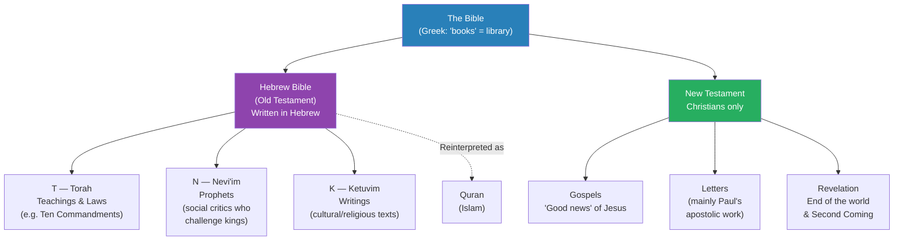
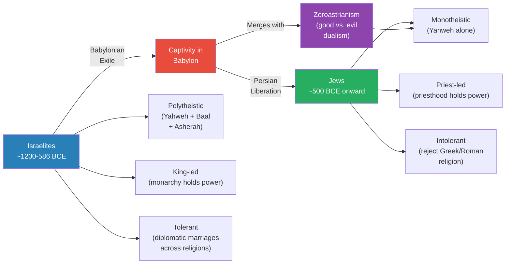
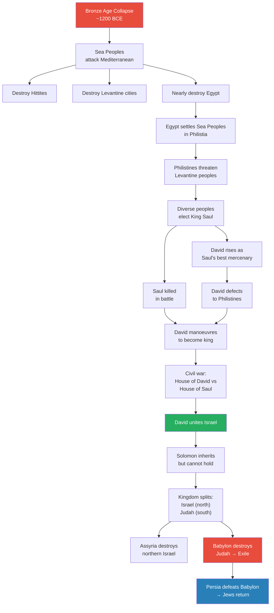
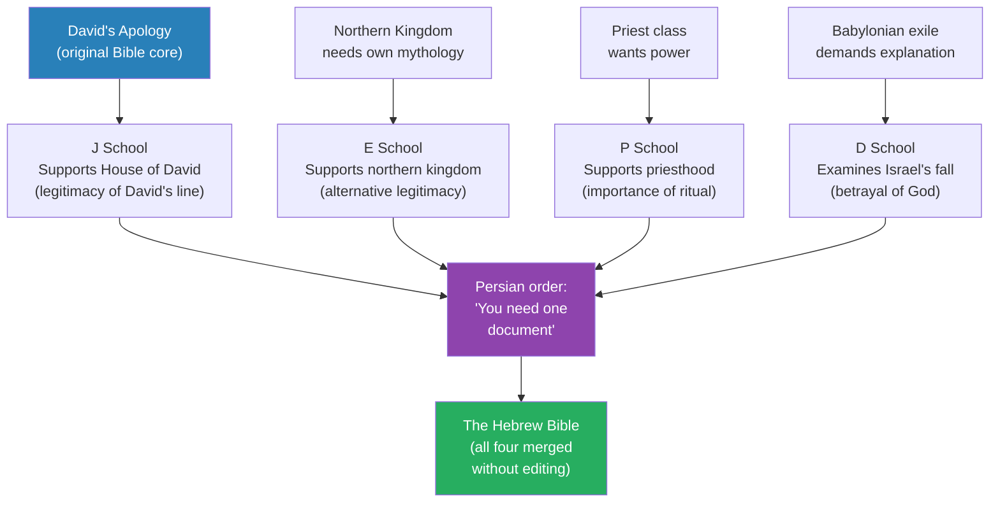
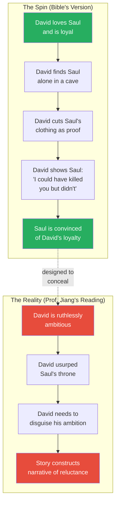
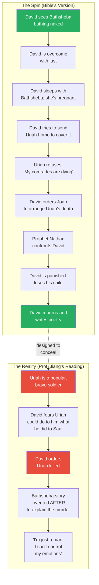
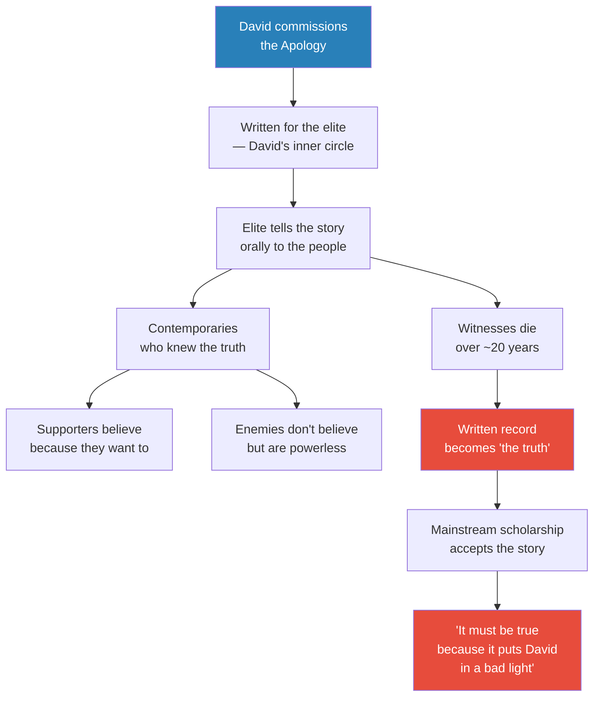

# The Apology of King David of Israel

> Prof. Jiang begins the Bible unit by dismantling three foundational myths about the Hebrew Bible: that Judaism was always monotheistic, that Israelite history is continuous, and that the Bible is a historical record. He traces the real history of the Israelites from the Bronze Age collapse through the Persian period, showing how a diverse, polytheistic coalition in the Levant became the monotheistic, priest-led religion we know today. The lecture's centrepiece is the "Apology of David" — the political propaganda that became the Bible's first literary core. Through three stories from the David narrative, Prof. Jiang reveals how a ruthless military usurper constructed literature so brilliant that scholars still mistake the spin for history.

---

## Overview: Key Highlights

- <b style="color: #27ae60">The Bible is literature, not history</b> — 300 years of archaeology has failed to find evidence for anything before David; the Bible is a work of collective imagination
- <b style="color: #2980b9">The Apology</b> — a standard ancient practice where kings commission writings to justify their seizure of power by claiming divine mandate and personal reluctance
- <b style="color: #e74c3c">Three myths demolished</b> — Judaism was not always monotheistic, Israelite history is not continuous, and the Bible is not a historical record
- <b style="color: #2980b9">The Bible as political real estate</b> — the most valuable political real estate in the world; everyone wants to be in it because inclusion grants legitimacy
- <b style="color: #27ae60">David is the true founder of Israel</b> — Prof. Jiang argues David, not Abraham, founded the nation; Abraham is retroactive mythology
- <b style="color: #e74c3c">David's ruthlessness is disguised as moral wrestling</b> — every story in the Apology inverts his crimes into evidence of his virtue
- <b style="color: #2980b9">Four documentary schools (J, E, P, D)</b> — the Bible was composed by four competing political factions, then merged under Persian order
- <b style="color: #27ae60">The Levant as a melting pot</b> — the crossroads of Egypt, Mesopotamia, and Anatolia; Israel emerged from this diversity, not despite it
- <b style="color: #e74c3c">Monotheism emerged from exile</b> — the religion became fanatical only when detached from local reality during the Babylonian captivity
- <b style="color: #2980b9">Zoroastrianism</b> — the Persian dualistic religion that merged with Israelite belief to produce monotheism
- <b style="color: #27ae60">"History is written by the writers, not the winners"</b> — Prof. Jiang's reframing of the cliche captures the Bible's enduring power
- <b style="color: #e74c3c">The Bathsheba story hides a political murder</b> — David killed Uriah not out of lust but out of fear of a popular rival; the love story is cover

| Concept | One-line summary |
|---------|-----------------|
| **Apology** | A king's commissioned writing that justifies his seizure of power as divinely ordained |
| **Tanakh (T-N-K)** | The Hebrew Bible: Torah (teachings), Nevi'im (prophets), Ketuvim (writings) |
| **Monotheism** | Belief in one god — a late development in Israelite religion, not the original form |
| **Polytheism** | Belief in many gods — the original religion of the Israelites, including Yahweh, Baal, and Asherah |
| **Levant** | The eastern Mediterranean crossroads where three empires met — birthplace of Israel |
| **Philistines** | Sea peoples settled by Egypt in coastal Levant; the military threat that forced Israel's formation |
| **Documentary Hypothesis (J, E, P, D)** | Four schools or factions whose texts were merged to create the Hebrew Bible |
| **Political real estate** | Prof. Jiang's metaphor: inclusion in the Bible grants legitimacy, so every faction fought to be in it |
| **Zoroastrianism** | Persian dualistic religion (good vs. evil) that fused with Israelite belief during the Babylonian exile |
| **Spin** | Distorting reality through narrative framing — David's Apology is ancient spin |

---

# The Lecture

## Introducing the Bible — Why It Matters [0:00 - 7:30]

*Prof. Jiang opens the final unit before the semester break by declaring the Bible the most important book ever written — not because it is holy scripture, but because it has driven history from antiquity to the Israel-Palestine conflict today. He warns the class that his arguments will be "extremely controversial" and invites them to challenge him.*

> [!tip] Core Insight
> The Bible is not a single book with a unified worldview. It is a library — a collection of works by many different authors with different agendas. You can find whatever you want in the Bible because it contains every faction's version of truth, merged together without reconciliation.

*The Bible's structure reveals its composite nature — the Hebrew Bible alone is three collections (Torah, Prophets, Writings), and the New Testament adds its own layers. Islam later reinterprets and extends the tradition further.*

> [!note]- Expand: Full Lecture Detail
> Prof. Jiang opens by telling the class this is the most important unit of the course: "The Bible is the most important book ever, and it is driving a lot — it has driven a lot of history. It's driving a lot of history today."
>
> - He frames the stakes immediately: "You want to fully understand the conflict in the Middle East, what's happening between Israel and Iran, what's happening in Palestine — you cannot do so without a full understanding of the Bible"
> - He acknowledges the controversy head-on: "There are billions of people around the world who believe the Bible is the Word of God. It's Holy Scripture. Every word in the Bible comes to us from the Divine, the Divinity himself. And obviously that's not what I believe"
> - He goes further: "I'm going to make arguments in this class that go against not only the traditional understanding of the Bible, but also the mainstream academic understanding of the Bible"
> - He asks students to be sceptical: "Come to class with doubting my authority, doubting my understanding of the Bible — feel free to challenge me"
>
> He then introduces the Bible's structure:
>
> - <b style="color: #2980b9">"Bible" is Greek for "books" — it really means library</b>
> - "The first thing you need to understand is the Bible is a collection of different works by many different authors, so there's no worldview or consistency or continuity in the Bible"
> - "You can find whatever you want in the Bible, because it's such a — it's a library. It's a huge collection of ideas. There's about 2000 pages"
> - "Very few people actually read the Bible in its entirety" — most receive their understanding from priests or rabbis
>
> He walks through the structure:
>
> - The Hebrew Bible = the <b style="color: #2980b9">Tanakh</b> (T-N-K):
>   - **T = Torah** (teachings) — the laws of the Jewish tradition, including the Ten Commandments
>   - **N = Nevi'im** (prophets) — divided into minor and major prophets; "In Rome, the people who are most admired are the generals. In Greece, the poets. In the Jewish tradition, the people who are most admired are the prophets — these individuals who speak the truth of God. They're social critics who challenge the authority of the kings"
>   - **K = Ketuvim** (writings) — texts of cultural or religious significance that do not fit in the other two categories
> - The New Testament — accepted only by Christians, not Jews:
>   - Gospels (Greek for "good word") — the good news that Jesus is on earth to deliver humanity from sin
>   - Letters (mainly by Paul) — the work of Jesus's apostles spreading the gospel after his death
>   - Revelation — "about the end of the world. The idea of the Second Coming, how even though Jesus is dead, he will return and bring peace, eternal peace, to the world"
> - From the Bible comes the Quran, the basis for Islam — "eventually we'll do all three"
> - The unit begins with the Old Testament, the Hebrew Bible

---

## Three Myths About the Hebrew Bible [7:30 - 17:08]

*Prof. Jiang identifies three foundational beliefs about the Hebrew Bible that Jews hold today — monotheism, continuity, and historicity — and declares all three false. He then provides a sweeping historical overview of the Israelites, from the Bronze Age Levant through the Persian period, showing how a diverse coalition of peoples became the Jews.*

> [!tip] Core Insight
> The religion of the Israelites under the kings was polytheistic, tolerant, and politically flexible. It became monotheistic, intolerant, and priest-controlled only after the Babylonian exile — when detachment from local reality allowed the elite to redesign the religion as they saw fit.

*The Babylonian exile is the hinge of Israelite history — everything before it (polytheistic, king-led, tolerant) is fundamentally different from everything after it (monotheistic, priest-led, intolerant). The Israelites and the Jews are, in Prof. Jiang's framing, "very different people."*

> [!note]- Expand: Full Lecture Detail
> Prof. Jiang introduces three myths that he will correct across this and future lectures:
>
> **Myth 1 — Judaism has always been monotheistic:**
> - "The Jews today believe the Jewish religion has always been monotheistic, meaning the Jews have always believed in one God. His Name is Yahweh, and he is the God of the Jews since Abraham"
> - <b style="color: #e74c3c">"I will show you this is not true. In the beginning, Jewish people, like everyone else, were polytheistic"</b>
> - "Monotheistic is a modern idea that has been retroactively put back into Jewish history"
> - The Israelites had a pantheon of gods — "Yahweh is at the top. They also celebrate other gods, like Baal and Asherah. We know because they're written down in the Bible"
>
> **Myth 2 — Jewish history is continuous for 3,000-4,000 years:**
> - "There have been many major changes to the religion, and these changes are so drastic that you can argue these are very different people"
> - <b style="color: #e74c3c">"The Israelites, the people who founded the religion, are very different from the people we call Jews today"</b>
>
> **Myth 3 — The Bible is a historical record:**
> - "We've been trying for at least 200-300 years to prove that the Bible is a historical record"
> - "There are archaeologists who spent fortunes, entire lifetimes, looking for things like Noah's Ark, looking for people like Moses. Can't find them"
> - <b style="color: #27ae60">"The Bible is not a historical record. It is a work of our imagination. It is a literary work"</b>
> - "It's a very powerful literary work, and that's what explains its relevance and its power today"
>
> He then provides the broad historical overview:
>
> **The Biblical account:** Around 2000 BCE, Abraham, from the city of Ur in Mesopotamia, receives a covenant from God Yahweh: "You are the most righteous and dignified man I've ever seen in the world, and I will make you a father of a new nation called Israel." God later tells David: "You are the greatest man I've ever seen. I love you as you love me. Therefore I will make your house, the house of David, eternal."
>
> **The historical record (starting ~1200 BCE):**
>
> - The Levant at the end of the Bronze Age was the crossroads of three empires:
>   - <b style="color: #2980b9">Egypt</b> — "for most of its human history, the wealthiest and most powerful nation"
>   - <b style="color: #2980b9">Mesopotamia</b> — "the cradle of civilization — mathematics, writing, astronomy, architecture"
>   - <b style="color: #2980b9">Anatolia (Hittites)</b> — "extremely wealthy"
> - The Levant was "sandwiched between three extremely aggressive, wealthy and powerful nations" — always a colony of either Egypt or Anatolia
> - Because of its position, the Levant was a <b style="color: #2980b9">melting pot</b>: "Every culture, every language, every religion that was imaginable at this time met in the Levant, mainly for trade purposes"
> - The Levant's province of Canaan was administered by local elites tied to Egypt and foreign mercenaries — including Greeks (evidenced by pottery)
> - The population included: Canaanite city-dwellers, Bedouin nomads from Arabia, hill people, foreign mercenaries who intermarried with local women, and Egyptian priests exiled for heretical or politically inconvenient beliefs
>
> **The transformation after the Bronze Age collapse:**
>
> - Three major differences emerged after the Persian period (~500 BCE):
>   1. **Polytheism → Monotheism:** The religion merged with <b style="color: #2980b9">Zoroastrianism</b> during the Babylonian captivity; "Zoroastrianism is a dualistic religion, meaning there's good and evil"
>   2. **King-led → Priest-led:** "The centre of power became the priesthood. The priests, the people with the absolute authority, are the priests, not the kings"
>   3. **Tolerant → Intolerant:** Under kings, "you need to establish diplomatic alliances with other countries who have different religions — so when you marry someone from another political dynasty, you also are marrying into that religion." Under priests, "you become intolerant because you insist that your religion is the best"
>
> - This intolerance explains the later Jewish rebellions against the Greeks (Seleucid Empire) and the Romans
>
> > [!example] The Exile Analogy — Chinese Identity Abroad
> > - Prof. Jiang draws a parallel to help students understand how exile transforms identity
> > - "Right now, you're not sure what it means to be Chinese. Chinese in China, it's a very fluid, very diverse identity"
> > - "When you go out to America, then you have a much more concrete, much more clear understanding of what it means to be Chinese"
> > - The same happened to the Israelites in Babylon: "Within Israel itself, the religion is constantly changing, it's very fluid"
> > - "But when they're off to Babylon, they have to use their religion to survive as a people, as an identity, and so it becomes much more formed, much more concrete"
> > - Once concrete, it interacted with Zoroastrianism and "becomes basically what it is today"
> > **The lesson:** Religions become fanatical not when they are strongest but when they are most threatened — exile and displacement strip away flexibility and harden identity into doctrine.

---

## The Levant, the Bronze Age Collapse, and the Birth of Israel [17:08 - 29:49]

*Prof. Jiang traces how the Bronze Age collapse created the conditions for Israel's emergence: the sea peoples destroyed existing powers, the Philistines settled on the coast, and the diverse peoples of the Levant elected King Saul to fight them. David rose as Saul's mercenary, betrayed him, fought for the Philistines, then manoeuvred his way to kingship after Saul's death.*

*The entire history of ancient Israel fits between two collapses — the Bronze Age collapse that created space for it, and the Babylonian conquest that destroyed it. Everything that came after (Persian liberation, monotheism, the priesthood) produced a fundamentally different religion.*

> [!note]- Expand: Full Lecture Detail
> Prof. Jiang explains the significance of the Levant's diverse population at the end of the Bronze Age:
>
> - Egyptian priests lived in the Levant "because they had a certain religion that was considered heretical or controversial in Egypt, so they had to leave to practise their religion, or maybe they were priests who got into a political struggle and were exiled"
> - "The Levant at this point is not a nation. It's really a meeting place, a melting pot of cultures, languages and religions. It's as diverse as can be, and historically, this has always been the case"
>
> **The Bronze Age collapse and the Philistines:**
>
> - The sea peoples — "basically like pirates" — were refugees in forced migration, "trying to feed their families"
> - They "basically overrun the Hittites, destroy the cities of the Levant, and almost destroy Egypt"
> - Egypt held off the sea peoples because it was wealthy enough to resist
> - Egypt and the sea peoples reached an agreement: "Stop attacking us, and we'll give you land in the Levant. You can settle down, grow your own food, feed your families"
> - This settlement became <b style="color: #2980b9">Philistia</b>, and the people became the Philistines — "mainly Greek, actually"
> - The Philistines were "a foreign presence that is very aggressive and expansionist," threatening everyone else in the Levant
>
> **The birth of Israel:**
>
> - The diverse peoples of the Levant "agreed to elect a king to lead them in war against the Philistines" — <b style="color: #2980b9">King Saul</b>
> - "Saul is a very good king. He's a very good military leader. He's helping the people in the Levant fend off the Philistines and aggressive neighbours"
> - David was "an extremely capable, charismatic soldier" serving as Saul's mercenary
> - David "develops a following" and "is also very ambitious, and eventually he has a falling out with Saul"
> - <b style="color: #e74c3c">"Borders and alliances and allegiances are extremely fluid at this time. If it benefits me, I'll fight for you. But if it doesn't benefit me, then I'll betray you"</b>
> - David defected to the Philistines — "he's fighting for the Philistines"
> - After Saul and his sons were killed in battle, "David sees a political opening" and manoeuvres to become king
> - David's power base was in Hebron in the south, but "the house of Saul is still around — so there's a civil war"
> - David eventually triumphed, united the peoples, and "creates a new nation called Israel"
> - Under David, Israel "is able to basically put down any aggressions from its neighbours, and they're able to build an empire, a small empire — nowhere near Egypt, but it's an empire"
>
> **After David:**
>
> - "David is so charismatic that when he dies, his son Solomon is not able to hold the empire together"
> - Israel divides into the northern kingdom (Israel) and <b style="color: #2980b9">Judah</b> (house of David)
> - The Assyrian Empire destroys the northern kingdom
> - The Babylonian Empire destroys Judah and takes the Israelite elite as captives to Babylon
> - The Persian Empire defeats Babylon and releases the captives, sending them back to govern the Levant — "it is only at this point that we get the term Jews. This is a Persian idea. The Jews — before, they were called the Israelites. And this is about 500 BCE"
>
> **The Bronze Age collapse's larger significance:**
>
> - Prof. Jiang clarifies: "The Bronze Age collapse was not a global phenomenon. It was a localised phenomenon to the Mediterranean" — Mesopotamia (Assyrians, Babylonians) was unaffected
> - <b style="color: #27ae60">"The Bronze Age collapse will give us Greek civilization — Homer and Plato — and it will also give us the Bible"</b>
> - "The Greeks and the Bible are the two fundamental pillars of Western civilization"
> - Western fascination with the Bronze Age collapse: "In their minds, the Bronze Age collapse is part of God's divine plan to create classical Greece and the nation of Israel, so that his vision for the world can be achieved through Jesus"
>
> **Student Q&A — Abraham vs. David:**
> - A student asks about Abraham's role. Prof. Jiang is direct: "The historical record is — we barely have evidence of David. We have absolutely no evidence of anything before David"
> - <b style="color: #27ae60">"I think David is the founder of the nation of Israel, not Abraham. Next class, I'll explain to you why they constructed this mythology"</b>

---

## The Bible as Political Real Estate [29:49 - 42:10]

*Prof. Jiang introduces the concept of the "apology" — political propaganda commissioned by kings to justify their seizure of power — and explains how the Bible evolved from David's personal legitimation document into a composite text created by four competing schools. The merging of these schools under Persian order produced the Bible we know today.*

> [!tip] Core Insight
> The Bible is the most valuable political real estate in the world. Every faction fought to be included because inclusion granted legitimacy. The result is a text that reads like four different authors arguing with each other — because it is.

*Four factions, four agendas, one document. The Persians did not choose a winner — they merged all four, creating a text that reads "A, B, C, D, A, B, C, D" as Prof. Jiang puts it. The result is unreadable without this history, but politically satisfying to every faction.*

> [!note]- Expand: Full Lecture Detail
> Prof. Jiang explains the concept of the <b style="color: #2980b9">apology</b>:
>
> - "Most kings, every king obtains power through really nefarious means — they either kill a lot of people to obtain power, or maybe the younger brother kills the older brother to usurp the throne"
> - "Usually kingship requires ruthlessness, but the problem is, when you're ruthless, you have a legitimacy problem"
> - "The way that most kings resolve this issue is by sponsoring writings or an apology to explain why he or she is king"
> - The formula: "Because God willed it so. Because I had no choice in the matter. I'm not ambitious. I was not at all ambitious, but the circumstances forced my hand — to save my people, to do God's work, I had to kill my brother, I had to kill my enemies, even though I myself am not a violent person"
>
> **Writing as expensive technology:**
>
> - "The very idea of writing is new. It's a new technology, but it's also very expensive technology"
> - You need rare materials AND a team of scribes — "writing back then is like movie making today. It's a very expensive endeavour that was usually sponsored by the king"
>
> **Every king faces three problems:**
>
> | Problem | What it means | David's challenge |
> |---------|--------------|-------------------|
> | **Legitimacy** | What gives you the right to be king? | He ruthlessly usurped Saul's throne |
> | **Identity** | How do you unite diverse peoples? | Israel was multicultural — different languages, cultures, religions |
> | **Differentiation** | How do you divorce people from former loyalties? | Egyptian priests needed to see themselves as Israelites, not Egyptians |
>
> > [!example] Augustus Caesar and the Aeneid — The Roman Parallel
> > - Augustus Caesar faced the same three problems as David
> > - He commissioned the Aeneid by Vergil to solve all three
> > - **Legitimacy:** Augustus is a direct descendant of Aeneas, founder of Rome — "Augustus Caesar is the end point of Roman history. Everything before him led to him. He is the Jesus of Rome"
> > - **Identity:** The Aeneid redefined Roman values as piety and loyalty over liberty — solving the problem that "Romans didn't like kings, but now he's a king"
> > - **Differentiation:** The Aeneid is anti-Greek — "Greek culture is like a Trojan horse; if you let it into your city, it will corrupt you and destroy you"
> > - This was necessary because "Greek culture was vastly superior to Roman culture, and many Romans were adopting Greek cultural practices, like Mark Antony"
> > **The lesson:** The Aeneid and the Bible are parallel solutions to the same political problem — legitimacy, identity, and differentiation through state-sponsored literature.
>
> **The four documentary schools:**
>
> - <b style="color: #2980b9">J School</b> — supports the House of David; the original Apology of David
> - <b style="color: #2980b9">E School</b> — supports the northern kingdom's legitimacy (after Israel split)
> - <b style="color: #2980b9">P School</b> — supports the priesthood and "the importance of ritual"
> - <b style="color: #2980b9">D School</b> — examines why Israel fell, concluding "because the Israelites refused to follow the will of God, because they became polytheistic or immoral"
> - "These are just the four major schools. There are other schools as well"
>
> **Why the Bible is unreadable:**
>
> - When the Persians took over, "they insisted: you need one religion, you need one document"
> - "All they did was just put them together" — no major editing or revision
> - "If you read the Bible, it's like A, B, C, D, A, B, C, D — so one line is from the E school, the next line is from the J school, the other line is from the P school"
> - "If you don't understand this history, it is impossible for you to read the Bible. It's not readable"
>
> **Why they merged instead of editing:**
>
> 1. "Most people didn't read or write back then, so the Bible itself didn't really matter. What mattered was the oral explanation of the Bible controlled by the priest class"
> 2. <b style="color: #27ae60">"The Bible is political real estate — the most valuable political real estate in the world. Everyone wants to be in the Bible, because to be in the Bible gives you legitimacy"</b>
> - Like dividing a kingdom among four sons: "You have four extremely powerful schools and political factions, so the best way to resolve the issue is just to say, listen, we'll put you all in the Bible together"

---

## The Apology of David — Story 1: The Cave [42:10 - 52:48]

*Prof. Jiang turns to the first of three stories from the Apology of David, each designed to disguise David's ruthless ambition as divine reluctance. In the cave story, David proves his loyalty to Saul by cutting a piece of Saul's clothing instead of killing him — a story Prof. Jiang says "cannot be true" but is brilliant propaganda.*

*The cave story is the simplest of the three — a straightforward claim that David had the power to kill Saul and chose not to. The entire Apology of David, Prof. Jiang argues, is "focused on the lack of ambition of David" — the one quality David most certainly possessed.*

> [!note]- Expand: Full Lecture Detail
> Prof. Jiang sets up the problem David faces:
>
> - "Now that David is king, a lot of people don't think he's legitimate. Why? Because he ruthlessly tried to usurp the throne from Saul"
> - "Saul is the king that everyone picked or elected, and he was a good king. He was good at war. He was someone that most people liked. And David stole the throne from him"
> - <b style="color: #e74c3c">"If you, David, set the precedent of stealing the throne, then others are now empowered to steal the throne from you as well"</b>
>
> **The cave story:**
>
> - Saul is chasing David with his army, trying to kill him
> - One day, Saul is alone in a cave, praying to God for deliverance
> - David sneaks up behind Saul, takes his sword, and cuts a piece of Saul's clothing
> - David disappears, then rushes to Saul: "My King, I beg of you — back in the cave, I could have killed you. This piece of clothing is proof. But I didn't, because I love you, because I'm loyal to you. I would never kill you"
> - Saul is convinced: "This is proof that you never meant to kill me"
>
> Prof. Jiang's verdict: "Obviously, this story cannot be true. But this is what the Bible is trying to do — it's trying to show us that David is not at all ambitious"
>
> - <b style="color: #27ae60">"The entire Apology of David is focused on the lack of ambition of David"</b> — the very quality the spin is designed to conceal

---

## The Apology of David — Story 2: The Murder of Abner [52:48 - 54:13]

*Prof. Jiang presents the second story: the assassination of Abner, Saul's general who switched sides to David. The Bible blames David's general Joab for killing Abner in a personal vendetta. Prof. Jiang argues David ordered the killing — because a king must always fear the man who controls his army.*

> [!note]- Expand: Full Lecture Detail
> **The Bible's version:**
>
> - After Saul's death, his son takes the throne, but Abner — Saul's loyal general — sees the political winds shifting toward David
> - Abner writes to David, offering to swear loyalty and end the civil war between the House of Saul and the House of David
> - David accepts, gives Abner a feast, and sends him on his way
> - As Abner leaves, he encounters <b style="color: #2980b9">Joab</b>, David's general — "Joab and Abner go a long way back. They were friends. They were enemies. Abner killed Joab's brother"
> - In an act of personal anger, Joab stabs Abner to death
> - "Once Abner is dead, the house of Saul basically gives up, and David is able to unite Israel"
> - David curses Joab and gives Abner a great funeral — "because David does not want to betray his friends"
>
> **Prof. Jiang's deconstruction:**
>
> - "If you're David and you're king, which person in the world are you most afraid of?"
> - Not Abner — "Abner is your enemy." The real threat is <b style="color: #e74c3c">Joab</b> — "because Joab has access to your army. So if Joab wants to betray you, he could"
> - "Because David is most suspicious of Joab, if Joab were ever to act independently, then David would need to kill him"
> - "In this circumstance, Joab acted independently. David told Joab Abner was an honoured guest, and Joab didn't care — this cannot possibly be true"
> - <b style="color: #27ae60">"Joab had to kill Abner because he was ordered to by David"</b>
> - Why David wanted Abner dead: "In his mind, he thinks — if Abner can betray the House of Saul, he could also betray the House of David. He is an ambitious man"
> - "And why would David come to this conclusion? Because he himself is like that" — David betrayed Saul, so he is "very careful or cautious about people who betrayed their leaders"
> - But David "could not say this publicly, because if he were to say this publicly, it would show he knew this because he betrayed Saul"
> - "You can see how wonderful the spin is. It's almost impossible to see the truth from this"

---

## The Apology of David — Story 3: Bathsheba and Uriah [54:13 - 1:06:29]

*Prof. Jiang presents the most famous David story — his affair with Bathsheba and the murder of her husband Uriah — and performs the lecture's most brilliant deconstruction. The mainstream reading sees a flawed poet-king wrestling with his sins. Prof. Jiang sees a calculated political assassination disguised as a love story so compelling that scholars have been fooled for millennia.*

> [!tip] Core Insight
> The Bathsheba story is not about lust. It is about power. David killed Uriah because Uriah was a popular, brave soldier — exactly what David had been before he usurped Saul. The love story was constructed after the murder to explain it to an army that loved Uriah.

*The Bible inverts the sequence: first lust, then murder. Prof. Jiang inverts it back: first political threat, then murder, then the love story as cover. The spin is so effective that the mainstream academic reading still accepts the Bible's version.*

> [!note]- Expand: Full Lecture Detail
> **The Bible's version (in full):**
>
> - David is on his rooftop and sees Bathsheba bathing naked across from him
> - He is overcome with lust and, as king, orders his servant to bring her to him
> - They have sex and she becomes pregnant
> - The problem: Bathsheba is married to <b style="color: #2980b9">Uriah the Hittite</b>, one of David's best soldiers, currently at war
> - "Once Uriah comes home and finds Bathsheba has a new child, he's going to know it's not his"
> - David's plan: invite Uriah home on a "vacation" to sleep with his wife, covering the pregnancy
> - Uriah refuses: "My comrades are dying. They're starving out in the battlefield. I cannot abandon them. How can I find pleasure with my wife when my friends are suffering? I refuse to go home until the battle is won"
> - David then gives Uriah a letter for Joab with secret instructions: send Uriah to the front, then withdraw all other soldiers, leaving Uriah alone to be killed by the enemy
> - "That's what happens. Once Uriah is dead, David marries Bathsheba"
> - Prophet Nathan confronts David with a parable: a rich shepherd with 100 sheep steals a poor shepherd's only two sheep to feed a guest
> - David is indignant: "Of course the rich shepherd is in the wrong!"
> - Nathan: "You, David, are the rich shepherd. You have violated God's law. As punishment, God will take away your child with Bathsheba"
> - David goes into mourning, writes poetry — "this is a very powerful story that has captured the imagination of everyone for 1,000 years"
>
> **Prof. Jiang's deconstruction:**
>
> - "It's complete spin. This did not happen"
> - First clue: Nathan accuses David of stealing a man's wife — but <b style="color: #e74c3c">"what's David's real crime? He killed Uriah! He had Uriah killed — that's the real crime. He slept with Bathsheba — that's bad, but it's much worse if you murder someone"</b>
> - Second clue: "Why would he murder Uriah? Why not just talk to him honestly?"
> - Answer: "Because the army is loyal to Uriah. Uriah is a popular, brave soldier — just like David. And David used his popularity to usurp the throne from Saul. Therefore David thinks Uriah could do the same thing to me. Therefore I have to get him killed"
> - <b style="color: #27ae60">"The Bathsheba thing must have come later to disguise the fact that David killed Uriah because he feared Uriah's popularity"</b>
> - The sequence in reality: David feared Uriah's popularity → had him killed → needed to explain it to the army who loved Uriah → constructed the love story: "Oh, because I fell in love with his wife. I can't control myself. I'm just a man. I can't be God"
>
> **The irony — propaganda becomes literature:**
>
> - "Because David is working so hard to disguise his ruthlessness, he's creating very powerful literature"
> - "You think about it — you think a lot about the story. It unleashes a lot of ideas in you. You have to ask yourself: What is man? What is God? Are we capable of controlling our emotions?"
> - <b style="color: #27ae60">"This story is extremely well constructed — it inspires you to imagine your own personal and emotional and moral life. We call this literature"</b>
> - "It's no coincidence that today the Jewish people are the most creative people in the world. These past 200 years, there have been three revolutionary thinkers — Karl Marx, Albert Einstein, and Sigmund Freud. They're all Jewish, raised in the Jewish tradition of asking deep questions about what it means to be human"

---

## The Power of Spin — Why People Believed It [1:06:29 - 1:11:10]

*Prof. Jiang fields student questions about why people would believe David's propaganda, what the mainstream academic understanding is, and why writing mattered when most people were illiterate. His answers illuminate how political narratives sustain themselves across generations.*

*The Apology works not because everyone believes it immediately, but because the written record outlasts living memory. Once the witnesses die, truth becomes whatever was written down — "History is written by the writers, not the winners."*

> [!note]- Expand: Full Lecture Detail
> **Student Q&A — Why would people believe the Apology?**
>
> - "Most didn't believe the Apology of David. Most were very clear about David's ambitions"
> - "But when you're king, you need to impose your reality on others"
> - "It was written for people who were part of David's political coalition — his enemies wouldn't believe this"
> - <b style="color: #27ae60">"It's basically meant to appease or convince those who want to believe David"</b>
> - He draws the modern parallel: "Spin happens today. When you watch the news, it's spin — it's distorting reality. Most people will believe the media. There are some people who will never believe the media — like I don't believe anything the media tells me, whether it's Chinese media or American media"
> - "Most people will believe this because they have absolutely no interest in not believing it. David's king. If you don't believe it, then you have to believe your king is a murderer"
>
> **Student Q&A — What is the mainstream academic understanding?**
>
> - "The mainstream understanding is it has to be true. Why? Because it puts David in a bad light"
> - Mainstream scholars see David as a <b style="color: #2980b9">poet-king</b>: "A man who prays constantly and is engaged in a process of self-reflection. That's what makes David great — he's constantly praying to God"
> - "The Bible goes on endlessly about this — how David is constantly in communication with God, praying and asking for light, for truth, about his own weaknesses"
> - The Bathsheba story is seen as "the most dramatic example — why would a man make this up? It puts David in the worst possible light, therefore it must be true"
> - <b style="color: #e74c3c">"Most scholars think the Bathsheba story shows David is a poor king who is constantly thinking about his own moral failings, and so he's an inspiration to his people. That's the mainstream understanding"</b>
> - Prof. Jiang's counter: "I've told you why" — the story is spin designed to cover a political murder
>
> **Student Q&A — Why write it down if people were illiterate?**
>
> - "This was written for the elite, for the people around David, to know what story to tell people"
> - "This was for internal consumption — to basically preserve David's historical legacy"
> - "Maybe 20 years from now, when everyone's dead, when people who knew Uriah and Bathsheba were dead — what is truth? Now the truth is what's been written down"
> - <b style="color: #27ae60">"That's why they say: history is written by the writers, not the winners. History is written by the writers"</b>

---

## Connections

**Builds on:** [[06 - Elite Overproduction and the Bronze Age Collapse]] — the Bronze Age collapse is the precondition for Israel's existence; without it, Egypt and the Hittites would have continued to control the Levant. [[01 - Explaining Humanity's Transition to Agriculture]] — the Levant, Jericho, and Canaan reappear here as political geography rather than archaeological sites. [[07 - Homer's Iliad and the Birth of Greek Civilization]] — the Iliad and the Bible are both post-Bronze Age collapse literary products that became civilisational foundations. The Aeneid parallel directly connects to [[17 - Homer, Vergil, and the War for the Soul of Rome]].

**Sets up:** [[22 - The Literary Genesis of the Yahwist]] — next class will cover "where the ideas of Abraham and Moses came from" and how the Bible evolved from David's apology into a larger mythology addressing identity and differentiation. [[23 - Cyrus the Great as Messiah]] — the Persian period that transformed Israelite religion into Judaism is previewed here and will be explored in detail.

**Recurring themes:**
- **Debunking traditional narratives** — three foundational myths about the Bible demolished
- **Charismatic leaders** — David as a charismatic military figure who reshapes history through personal magnetism
- **Literature as power** — the Bible as state-sponsored literature paralleling Augustus's Aeneid
- **Legitimacy through mythology** — the apology as a universal mechanism of kingship
- **Father-Son archetype** — David (charismatic founder) vs. Solomon (unable to hold the empire together)

**Related books in vault:** [[Sapiens - Yuval Noah Harari]] — Harari's discussion of imagined orders and collective myths connects directly to Prof. Jiang's argument that the Bible is "a work of our collective imagination" that derives its power from being believed, not from being true.

---

## The Takeaway

This lecture reframes the Bible from sacred text or historical record into political technology — a tool invented to solve a specific problem (David's legitimacy crisis) that proved so powerful it reshaped civilisation. Prof. Jiang's central argument is not that the Bible is false, but that its literary power is the direct product of its political function. David needed to disguise ruthlessness as virtue, and the narrative gymnastics required to do so produced stories so psychologically rich that they became foundational literature. The propaganda outlived its purpose and became truth.

The most counterintuitive insight is about Bathsheba. The mainstream academic reading — that the story must be true because it makes David look bad — is itself a product of the spin. The story makes David look human, wrestling with his flaws before God. It does not make him look like a cold political assassin who eliminated a popular rival and then constructed a love story to explain it. The "flaw" the story reveals (lust) is far less damaging than the one it conceals (calculated murder of a loyal soldier). The genius of the spin is that it offers readers a palatable sin to contemplate instead of an unforgivable one.

Prof. Jiang leaves the class with a question that will drive the next several lectures: if David's apology is the Bible's origin story, what happened when the Bible outgrew David? The mythology that began as one man's political instrument became the vessel for an entire civilisation's identity, morality, and relationship with the divine. How that transformation happened — through the J, E, P, and D schools, through exile, through contact with Zoroastrianism — is the subject of the lectures to come.
