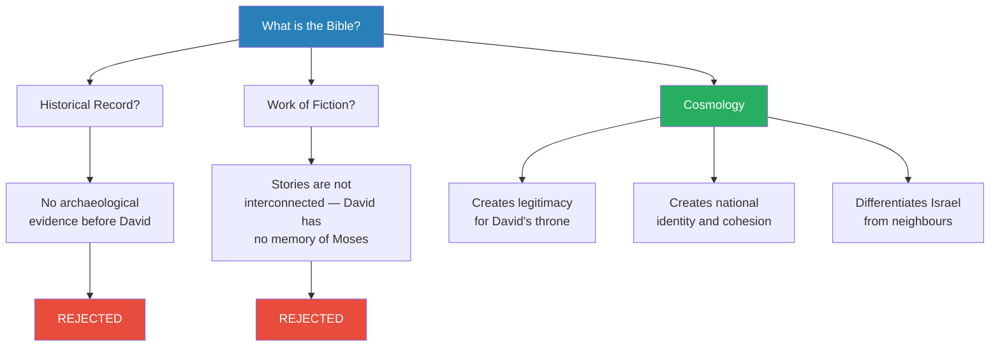
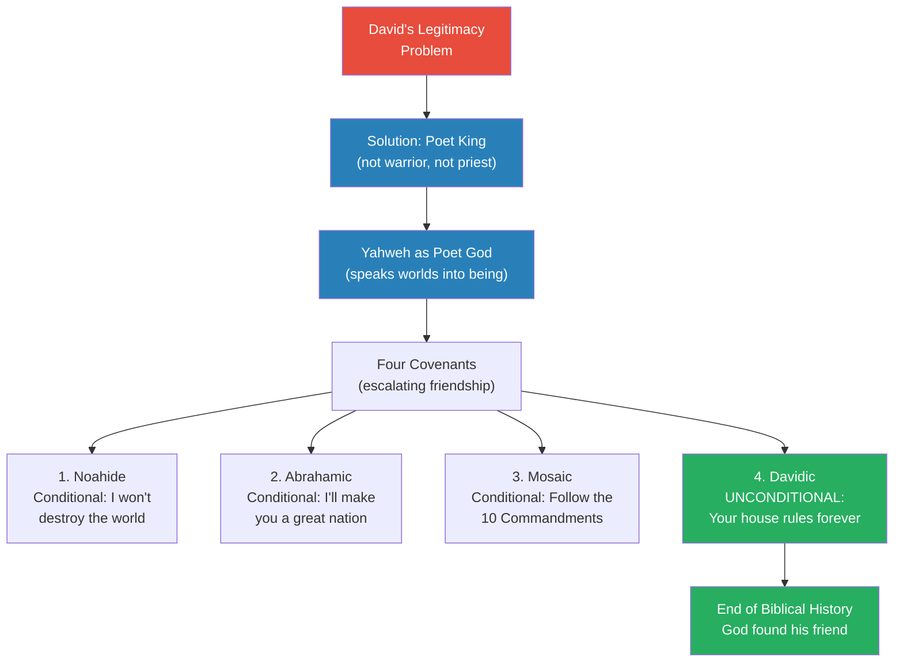
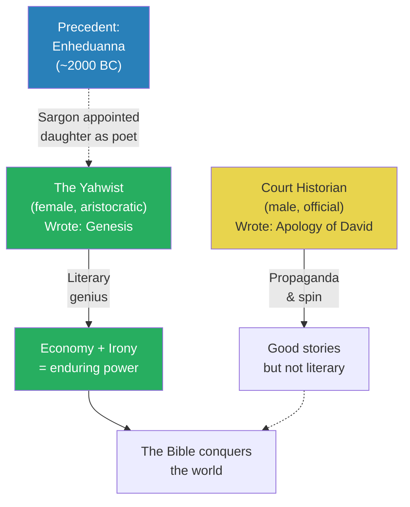
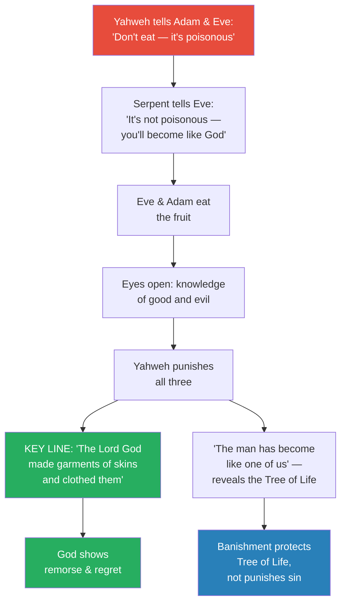
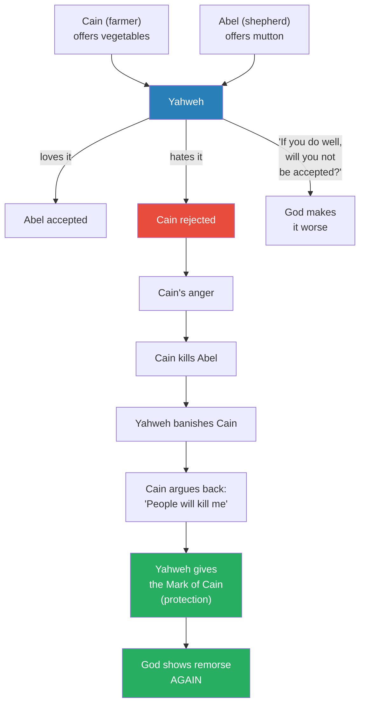

# The Literary Genesis of the Yahwist

> Prof. Jiang continues the Hebrew Bible arc by asking a question that has puzzled scholars for centuries: if the Bible is neither reliable history nor coherent fiction, what is it? His answer: it is a cosmology — a literary creation designed to give legitimacy to David's throne, cohesion to a fractured people, and differentiation from surrounding nations. But the Bible conquered the world not because of its political function but because of its literary genius, and Prof. Jiang attributes that genius to a single anonymous author he calls the Yahwist — almost certainly a woman of David's court, possibly his daughter or granddaughter. Through close readings of Adam and Eve and Jacob and Rachel, he reveals the Bible's two secret weapons: economy and irony.

---

## Overview: Key Highlights

- <b style="color: #27ae60">The Bible is a cosmology, not a chronology</b> — it was designed to create identity, not record history
- <b style="color: #2980b9">The Yahwist</b> — the anonymous literary genius (likely a woman of David's court) who wrote Genesis and gave the Bible its enduring power
- <b style="color: #e74c3c">No evidence exists for any biblical event before David</b> — Abraham, Moses, the Exodus, Noah's Ark, the Garden of Eden are all unverified
- <b style="color: #2980b9">Poet God</b> — Yahweh is presented as a creator who speaks worlds into existence and then edits them, a radical new conception of divinity
- <b style="color: #27ae60">The Davidic Covenant is unconditional</b> — unlike all previous covenants, God promises David's house will rule forever, marking the end of biblical history
- <b style="color: #2980b9">Synchronisation</b> — the process of merging different tribal religions and genealogies into one unified national story
- <b style="color: #e74c3c">God is fallible</b> — in the Yahwist's telling, God lies to Adam and Eve, plays favourites with Cain and Abel, and shows remorse for his mistakes
- <b style="color: #27ae60">Faith requires argument with God</b> — because God is fallible, arguing back is how both humans and God grow
- <b style="color: #2980b9">Knowledge of good and evil</b> — not moral knowledge but the capacity for self-reflection, learning, and growth
- <b style="color: #27ae60">Economy and irony</b> — the Yahwist's two literary signatures: maximum meaning from minimum words, and humour that subverts the highest authority
- <b style="color: #e74c3c">Adam and Eve is a domestic comedy, not a tragedy of sin</b> — a story about a parent who lies, gets caught, and feels remorse
- <b style="color: #2980b9">Co-creation</b> — the Bible's power comes from what the reader brings to the text, not just what the author puts in

| Concept | One-line summary |
|---------|-----------------|
| **Cosmology** | A structured origin story that creates identity and meaning — what the Bible actually is |
| **Poet God** | Yahweh as literary creator who speaks, edits, and seeks friendship — not a warrior or priest deity |
| **Covenant** | A contract between God and humans — four covenants escalate from conditional to unconditional |
| **Davidic Covenant** | The unconditional promise that David's house will rule forever — the end of God's search for friendship |
| **Synchronisation** | Merging different tribal gods and genealogies into a single national narrative |
| **The Yahwist** | The anonymous female author who gave the Bible its literary genius through economy and irony |
| **Knowledge of good and evil** | The capacity for self-reflection and learning from mistakes — what makes humans potentially equal to God |
| **Tree of Life** | The second tree God never mentioned — eternal life, which combined with knowledge of good and evil would make humans into gods |
| **Economy (literary)** | Using as few words as possible to express as much as possible |
| **Irony** | Humour that subverts authority — the Yahwist makes fun of Yahweh himself |
| **Co-creation** | The reader's interpretation gives life to the text — the Bible's power is participatory |
| **Original sin (reinterpreted)** | Not a tragedy of disobedience but a domestic comedy about a parent who lied and got caught |

---

# The Lecture

## The Biblical Chronology — and Its Evidentiary Collapse [0:00 - 7:41]

*Prof. Jiang opens by recapping the entire biblical narrative from creation to conquest — God, Adam and Eve, Noah, Abraham, Moses, Joshua, the Judges, Saul, and finally David — before revealing that not a single event before David has any archaeological or historical evidence.*

```mermaid
flowchart LR
    A["Creation<br/>~4000 BC<br/>(traditional)"] --> B["Adam & Eve<br/>Garden of Eden"]
    B --> C["Noah's Ark<br/>The Great Flood"]
    C --> D["Abraham<br/>~2000 BC<br/>Covenant"]
    D --> E["Isaac → Jacob<br/>12 Tribes"]
    E --> F["Joseph<br/>Egypt"]
    F --> G["Moses<br/>Exodus"]
    G --> H["Joshua<br/>Conquest of Canaan"]
    H --> I["Judges<br/>Tribal leaders"]
    I --> J["Saul → David<br/>Kingdom of Israel"]
    style A fill:#e74c3c,color:#fff
    style B fill:#e74c3c,color:#fff
    style C fill:#e74c3c,color:#fff
    style D fill:#e74c3c,color:#fff
    style E fill:#e74c3c,color:#fff
    style F fill:#e74c3c,color:#fff
    style G fill:#e74c3c,color:#fff
    style H fill:#e74c3c,color:#fff
    style I fill:#e74c3c,color:#fff
    style J fill:#27ae60,color:#fff
```

*Every red node has zero archaeological evidence. Only when we reach David (green) do historical records begin to confirm the Bible's claims. The entire narrative before David is literary construction, not history.*

> [!note]- Expand: Full Lecture Detail
> Prof. Jiang walks through the full biblical timeline as a recap from the previous lecture:
>
> - <b style="color: #2980b9">In the beginning</b>, God (Yahweh) created the world, then Adam and Eve in the Garden of Eden
> - Adam and Eve disobeyed God by eating the forbidden fruit and were banished — they had two sons, Cain and Abel
> - Humanity misbehaved — war, greed — so God destroyed the world in the Great Flood, sparing only Noah
> - After Noah's Ark, Abraham appeared (~2000 BC), born in Ur in Mesopotamia
>   - God made a <b style="color: #2980b9">covenant</b> with Abraham: swear allegiance to Yahweh, and your descendants will found a great nation (Israel) stretching from the Nile to the Euphrates
>   - The mark of the covenant: circumcision
> - Abraham's son Isaac had a son Jacob, who stole Esau's birthright through trickery
>   - Jacob married Leah and Rachel, had 12 sons — the founders of the 12 tribes of Israel
>   - Jacob was renamed "Israel" by God — the true founder of the nation
> - Jacob's youngest son Joseph was sold into slavery by jealous brothers, rose to power in Egypt through his gift of reading dreams
>   - Joseph rescued his family from famine in Israel, bringing the entire nation to Egypt
>   - After decades, a new pharaoh enslaved the Israelites
> - Moses was born, hidden in a basket on the Nile, raised as an Egyptian prince
>   - God revealed his mission: deliver the Israelites to the Promised Land
>   - 10 plagues, the parting of the sea, the drowning of Pharaoh's army
>   - Moses received the 10 Commandments on the mountain
>   - The Israelites created an idol while Moses was away — Yahweh punished them with decades of desert exile
>   - Moses could see the Promised Land but not enter it — the mission passed to Joshua
> - Joshua led the military conquest of Canaan, then came the period of the Judges (12 tribal leaders)
> - King Saul was chosen, then David usurped the throne
>
> Prof. Jiang then delivers the devastating verdict on this narrative:
>
> - <b style="color: #e74c3c">Noah's Ark</b> — "if there really was a flood, there will be a geological record. There will be a ship. We have never been able to find any concrete evidence"
> - <b style="color: #e74c3c">The Garden of Eden</b> — "if the Garden of Eden really existed, we can find it, and we've never been able to find it"
> - <b style="color: #e74c3c">Abraham, Isaac, and Jacob</b> — "no evidence that any of these individuals ever existed"
> - <b style="color: #e74c3c">Moses</b> — "we would think there would be some records of him in Egyptian history. Ten plagues is a travesty and a disaster on the Egyptian people. No record of that. The parting of the sea, no record of that"
> - <b style="color: #e74c3c">The Judges, Joshua</b> — "nothing"
> - "It is only until we get to David when we begin to see historical records"

---

## Not Chronology, Not Fiction — Cosmology [7:41 - 11:17]

*Prof. Jiang rejects both the literalist reading (it is history) and the dismissive reading (it is fiction), arguing instead that the Bible is a cosmology — a structured origin story designed to serve political and cultural purposes.*

> [!tip] Core Insight
> If the Bible is not a historical record and not a coherent work of fiction (its characters have no memory of each other — David does not remember Moses, Moses does not remember Abraham), then it must be something else entirely: a cosmology. A story designed not to record the past but to create a people.

*Two interpretive frameworks fail; a third — cosmology — explains why the Bible is structured the way it is. The three functions of cosmology map directly onto the political needs of David's new kingdom.*

> [!note]- Expand: Full Lecture Detail
> Prof. Jiang poses the interpretive challenge directly:
>
> - If you read the Bible as a historical record, "you will only get confused"
> - If you read it as fiction, it also fails — "these events aren't actually interconnected with each other"
>   - David has no memory of Moses
>   - Moses has no memory of Abraham
>   - The stories exist in isolation, not as a continuous narrative
> - "So if this is not a historical record, if this is not a work of pure fiction, what is this thing?"
> - His answer: <b style="color: #27ae60">"This is not a chronology. This is a cosmology."</b>
>
> He then recalls the framework from the previous lecture — kings sponsor writing projects for three reasons:
> 1. **Legitimacy and authority** — establishing the right to rule
> 2. **National identity and cohesion** — unifying diverse groups into one people
> 3. **Differentiation** — defining who you are by defining who you are not

---

## The Three Functions of the Biblical Cosmology [11:17 - 29:39]

*Prof. Jiang systematically explains how each element of the Bible serves one of three political functions: legitimising David's usurped throne, creating cohesion among fractured tribes, and differentiating Israel from its neighbours. Along the way, he introduces the concept of synchronisation and reveals the political logic behind Abraham, Moses, circumcision, and the Judges.*

### Function 1: Legitimacy — The Poet God and the Poet King [11:38 - 19:36]

*David usurped the throne from Saul and needed a radically new form of legitimacy. The Bible's solution: present David as a poet king and Yahweh as a poet God — the first time in human history divinity was defined through literary creation rather than war or priesthood.*

*The four covenants form a progression from conditional promises to unconditional friendship. The Davidic Covenant is the climax of the entire Bible — the moment God stops searching.*

> [!note]- Expand: Full Lecture Detail
> Prof. Jiang explains David's legitimacy problem:
>
> - Saul came from a noble family and was elected by the chieftains
> - David launched a rebellion and usurped the throne — he has a "major legitimacy problem"
> - The Bible's solution: present David as a <b style="color: #2980b9">poet king</b>
>   - Not a warrior king (who wins by defeating enemies)
>   - Not a priest king (who rules through religion)
>   - A poet king — "he writes poetry, he sings songs, he's a sensitive soul"
>   - This explains his affair with Bathsheba: he is too sensitive to have been ambitious enough to murder Saul
>
> The poet king requires a poet God:
>
> - <b style="color: #2980b9">Yahweh as poet God</b> — "a radical conception of divinity in the ancient world"
>   - Previous gods had been priests or warriors
>   - Yahweh creates through speech: "Let there be light" — he speaks and things are created
>   - Then he edits: "and this is good" — he is a writer who reviews and refines
>   - He creates Adam and Eve because he is lonely — "he wants friendship"
> - <b style="color: #27ae60">"The Bible is fundamentally a story of friendship between two poets who were alone in the world"</b>
>
> The covenant system escalates this friendship:
>
> - **Noahide Covenant** — after destroying the world, Yahweh feels "tremendous remorse" and promises: as long as humans are not too evil, "I will not destroy the world"
> - **Abrahamic Covenant** — if Abraham and his descendants stay true to Yahweh, "I will create a great nation out of you"
> - **Mosaic Covenant** — if the Israelites follow the 10 Commandments and worship only Yahweh, he will protect them
> - All three are <b style="color: #e74c3c">conditional</b> — "if you do this, then I will do this"
> - **Davidic Covenant** — <b style="color: #27ae60">unconditional</b>: "I Yahweh will promise that you David and your descendants will forever rule Israel"
>   - This marks "the end of biblical history" — Yahweh has found his great friend
>   - "His search has ended, and biblical history has ended"
>
> Prof. Jiang draws out the radical implications:
>
> - "In the beginning there was the Word" — reality can be constructed through words
> - This is why Jewish people are "so literary" — the Jewish faith is "the first faith to focus on literary creation"
> - "Some of the most famous writers, the most famous thinkers in the world, they're mainly Jewish"

### Function 2: Cohesion — Synchronisation and Merged Genealogies [19:36 - 25:00]

*Prof. Jiang explains how the Bible's convoluted genealogies are not confused history but a deliberate synchronisation process — merging the origin stories of diverse tribes into a single family tree to create national unity.*

> [!note]- Expand: Full Lecture Detail
> Prof. Jiang introduces the concept of <b style="color: #2980b9">synchronisation</b> — "when you bring different religions together and create a new religion":
>
> - Example: "My god is Zeus, and your God is Hera, and I conquer you. So what we do is we marry our gods to each other. Now Zeus is married to Hera, and they have children like Aphrodite and Athena"
> - This soothes the process of conquest: "even though I've conquered you, I still have to live with you"
> - The same process applies to genealogy — every tribe has a patriarch who establishes their claim to the land
>   - When tribes merge, "their ancestors merge together and become sons and fathers of each other"
>   - Different family histories are fused into one line
>
> This explains the patriarchs:
>
> - <b style="color: #2980b9">Abraham, Isaac, and Jacob</b> are "basically three major tribes of Israel coming together to form one family history"
>   - Jacob/Israel is the most powerful tribe — he gives his name to the nation
>   - Abraham is second — he is the progenitor of the family
>   - Isaac receives "the least amount of attention" — the weakest tribe in the alliance
>
> This also explains Moses:
>
> - "We've been looking for 100 years and have not found any evidence that Moses ever existed"
> - Moses explains why there are Egyptian priests in the nation of Israel
> - David needed Egyptian priests to centralise authority through religious ritual
>   - He built the Temple of Jerusalem — "the house of Yahweh"
>   - To worship Yahweh, "you had to come all the way to Jerusalem to offer a sacrifice"
>   - The priests controlled the sacrifice process — and they were Egyptian
> - "Moses is an Egyptian name. It means 'son of'" — like Ramses means "son of Ra"
> - Moses and his brother Aaron are Egyptian names for Egyptian priests
> - Circumcision is "an ancient Egyptian practice that priests specialised in"
>   - Making circumcision the mark of Israelite identity gave authority to Egyptian priests
>
> The Judges serve a similar function:
>
> - "The judges are these local heroes that bring in all the other tribes of Israel together"
> - Every tribe gets a deity or ancestor within the biblical cosmology
> - This explains why biblical history is "so convoluted, contradictory and complex" — it is trying to accommodate everyone

### Function 3: Differentiation — War as Identity [25:00 - 29:39]

*The Bible's extensive war narratives serve a specific purpose: when your nation contains members from every surrounding culture, the only way to prove loyalty is to go to war with those cultures.*

> [!note]- Expand: Full Lecture Detail
> Prof. Jiang explains the differentiation function:
>
> - "You have Egyptian priests in Israel. How do we know they're loyal to Israel and not to Egypt? Because the Egyptian priest went to war with the Pharaoh"
> - "We have Canaanites within the State of Israel. How do we know they're loyal? Because they went to war with the Canaanites"
> - In the Bible, "the Israelites went to war with everyone — the Egyptians, the Philistines, the Canaanites"
> - "Because they had members from every single geography and location in that area"
>
> Prof. Jiang adds an important caveat about ancient identity:
>
> - <b style="color: #e74c3c">"Nation" in the ancient world does not mean what it means today</b>
>   - Not a fixed nation-state — "a loose political affiliation that is fluid"
>   - "If you're an Israelite, you could walk across the street and become a Moabite"
>   - "The very idea of ethnicity, race, group identity back then was extremely fluid — basically non-existent"
> - <b style="color: #27ae60">"Israel, the very idea of Israel, is a literary creation. The idea of Israelite is a political creation."</b>
>
> This raises the central question of the lecture:
>
> - Everyone in the ancient Near East created national identities this way — "this was standard cultural practice"
> - "So why is it we have the Bible today and not other texts from Egypt or Mesopotamia?"
> - "The Bible was able to conquer the world and capture the imagination of humanity"
> - The answer: "It was how it was written that made it so powerful"

---

## The Yahwist — The Literary Genius Behind the Bible [29:39 - 35:00]

*Prof. Jiang introduces the Yahwist — the anonymous author who transformed political propaganda into enduring literature. He makes the case that she was almost certainly a woman, likely a daughter or granddaughter of King David, and draws a parallel to Enheduanna, the first named author in human history.*

> [!tip] Core Insight
> The court historian wrote propaganda and spin. The Yahwist wrote literature. The difference between a forgettable political document and a text that conquered the world is the presence of a singular literary genius — one person who saw domestic comedy where others saw theology.

*The court historian produced serviceable political narrative. The Yahwist produced literature of infinite interpretive depth. The parallel to Enheduanna — another king's daughter appointed as official poet — strengthens the identification.*

> [!note]- Expand: Full Lecture Detail
> Prof. Jiang distinguishes between the court historian (discussed last lecture) and the Yahwist:
>
> - The court historian wrote the Apology of David, the Bathsheba story, the Abner story — "good, but not literary. They're just propaganda and spin"
> - "But the person who wrote the Bible, especially Genesis, was a unique literary genius of the stature of Homer and Plato and Dante"
> - She is called <b style="color: #2980b9">the Yahwist</b> — "by convention, because she uses Yahweh as the name of God. Other writers don't actually use Yahweh"
>
> Why she is probably a woman:
>
> - "She focuses not on war, not on conflict, but on domestic tragedy and affairs, childbirth, marriage, love"
> - "This is unique in human history"
>
> Why she is probably David's daughter or granddaughter:
>
> - Her writings are favourable to the court of David
> - Only aristocratic women had "the privilege of reading and writing"
> - She clearly had access to mythology from Egypt, Mesopotamia, and Anatolia — "a great education"
> - Most importantly: "What she wrote was so controversial and so unique and so imaginative that the priesthood could not possibly accept what she did"
>   - If she were of lower birth, "there was no way her writings would become part of the Bible"
>   - She must have had authority that could not be overruled
>
> > [!example] Enheduanna — The Precedent (~2000 BC)
> > - Sargon of Akkad, the first great empire builder, conquered Mesopotamia
> > - He appointed his daughter Enheduanna as High Priestess of their religion
> > - Enheduanna is a poet — and the first named author in human history
> > - She wrote extensively, establishing the precedent of kings appointing daughters as official poets
> > - David would have known about Sargon's practices — "everyone knew and worshipped" Sargon
> > **The lesson:** There is historical precedent for a king appointing his daughter as the official literary voice of the nation. The Yahwist fits this pattern precisely.

---

## Adam and Eve — The Domestic Comedy [35:00 - 46:07]

*Prof. Jiang delivers the lecture's centrepiece: a close reading of Adam and Eve that demolishes the traditional "original sin" interpretation. In the Yahwist's telling, this is not a story about human disobedience — it is a domestic comedy about a parent who lied to his children, got caught, and felt remorse.*

*The flow of the story reveals its true logic: God lied, got caught, punished the children — then felt guilty and gave them a gift. The banishment is not punishment for sin but self-protection: God cannot risk humans gaining eternal life on top of knowledge.*

> [!note]- Expand: Full Lecture Detail
> Prof. Jiang begins by challenging the class: "You think you know the story of Adam and Eve, but I guarantee you, it's wrong."
>
> **The mainstream version (wrong):**
> - God told Adam and Eve they could do anything in Eden except eat from the Tree of Knowledge of Good and Evil
> - They disobeyed, God got angry, banished them
> - This is original sin — "the first act of disobedience that has doomed us forever until the redemption of Jesus"
>
> **What the Bible actually says:**
> - God tells Adam and Eve the fruit is poisonous — <b style="color: #e74c3c">this is a lie</b>
> - Eve meets the serpent, who tells her: "No, it's not poisonous. You're being lied to. Once you eat it, you will become like God"
> - Eve gets angry "because she feels manipulated" and convinces Adam to eat too
> - Their eyes open — they now have knowledge of good and evil
> - Yahweh discovers them hiding, embarrassed about their nakedness
> - Adam blames Eve, Eve blames the serpent
> - Yahweh punishes all three:
>   - Serpent: slither on the ground, hunted by man
>   - Eve: painful childbirth for all her descendants
>   - Adam: must sweat to grow food — life becomes toil and suffering
>
> Then comes the genius:
>
> - "The Lord God made garments of skins for the man and his wife and clothed them"
>   - This is right after punishment — <b style="color: #27ae60">God giving them a present out of pity</b>
>   - "This is God showing remorse and regret"
> - "Then the Lord said: 'See, the man has become like one of us, knowing good and evil, and now he might reach out his hand and take also the tree of life and live forever'"
>   - There is a <b style="color: #2980b9">second tree</b> God never mentioned — the Tree of Life
>   - Two things differentiate God from humans: knowledge of good and evil, and immortality
>   - Now that humans have the first, if they get the second, "they become God"
>   - The banishment is not punishment — it is God protecting the Tree of Life
>
> > [!example] The Whiskey Cabinet — Prof. Jiang's Analogy
> > - Imagine you have two young daughters, six or seven years old
> > - They see you drinking whiskey and ask what it is — you tell them it is poison
> > - They ask their uncle, who says it is obviously not poisonous
> > - The daughters break into the alcohol cabinet, drink whiskey, get happy, throw up
> > - You come home and shout at them: "I told you not to drink that! Go to your room!"
> > - Then you come knocking: "Hey, do you guys want to go to McDonald's and have a hamburger?"
> > - You feel guilty because you know the real mistake was yours — you should not have lied
> > **The lesson:** Adam and Eve is a domestic comedy. A parent lied, got caught, punished the children, then felt remorse. This is something that happens in families all the time.

---

## Knowledge of Good and Evil — The Capacity for Growth [39:23 - 42:26]

*Prof. Jiang pauses to clarify a crucial misunderstanding: "knowledge of good and evil" does not mean knowing God and knowing Satan. It means the capacity for self-reflection — knowing what is good for you and what is bad for you — which enables learning and growth.*

> [!note]- Expand: Full Lecture Detail
> Prof. Jiang explains the concept carefully:
>
> - "Good and evil does not mean you know God, you know Satan. That's not what it means"
> - It means: <b style="color: #2980b9">"You know what's good for you, what's bad for you"</b>
> - Without this knowledge: "I hit this table. I feel pain. Is that good or bad? I don't know, so I do it again. And again. I cannot learn from my mistakes"
> - With this knowledge: "I hit this thing. I feel pain, therefore it's evil, therefore I shouldn't do it again"
> - <b style="color: #27ae60">"Knowing good and evil means you have the capacity to learn and to grow through a process of self-reflection"</b>
> - If you combine this with the Tree of Life (living forever): "your knowledge is now infinite. You become God"
> - This is what terrifies Yahweh — not disobedience, but the possibility that humans will grow beyond him
>
> Then the radical turn: why does God show remorse?
>
> - "You show remorse and regret when you've done something wrong. But what did God do wrong?"
> - <b style="color: #e74c3c">God lied to Adam and Eve</b> — he said the fruit was poisonous when it was not
> - This makes God a "bad parent" — not evil, but naive and inexperienced
> - "Yahweh is a poet God. He's curious about the world. He wants friends. But he's naive. He's a new father, so he's going to make mistakes"
> - <b style="color: #27ae60">"What makes humans exceptional, what makes humans unique from animals, is our capacity to make mistakes and to learn from them"</b> — because we ate from the Tree of Knowledge

---

## Cain and Abel — Faith Requires Argument [46:07 - 50:10]

*Prof. Jiang continues the domestic comedy into the next generation. Cain and Abel's story reveals another layer of God's fallibility — and introduces the radical idea that arguing with God is not blasphemy but the essence of faith.*

*The same pattern repeats: God behaves badly (blatant favouritism), suffers the consequences (Cain murders Abel), and then shows remorse when confronted (the Mark of Cain). The key innovation: it is Cain's argument that enables God's growth.*

> [!note]- Expand: Full Lecture Detail
> Prof. Jiang tells the story with characteristic domestic framing:
>
> - Adam and Eve are banished from Eden and have two sons: Abel (shepherd) and Cain (farmer)
> - Both love God and want his attention — they each bring offerings
>   - Abel offers mutton — "God tastes it. This mutton, it's tasty, awesome. Thank you, Abel"
>   - Cain offers vegetables — "God is like, this food sucks, man"
> - "The Lord had regard for Abel and his offering, but for Cain and his offering he had no regard"
> - Cain is devastated. God's response makes it worse: "Why are you angry? If you do well, will you not be accepted?"
>   - Prof. Jiang translates: "You suck, man. The problem isn't me. The problem is you"
>   - <b style="color: #e74c3c">"God is being a terrible parent"</b> — showing blatant favouritism
>
> The consequences unfold:
>
> - Cain kills Abel
> - Yahweh banishes Cain
> - Cain argues back: "You banish me, people will know I committed wrong, and I will be killed"
> - Yahweh relents: "I will put a mark on you — the Mark of Cain — and if anyone touches you, I will punish that person"
> - <b style="color: #27ae60">"God showing remorse and regret for what he's done, because God knows in his heart he's done it wrong"</b>
>
> The radical theological implication:
>
> - "What allowed God to understand he committed wrong is because Cain argued with him"
> - <b style="color: #27ae60">"Faith, love of God requires you to argue with God, because it's only through the process of argument that God, who is fallible, will learn and grow"</b>
> - "When you argue, when you fight back, you're helping the other person grow"
> - This is a "radical conception of faith in the Hebrew Bible"

---

## Economy and Irony — The Yahwist's Two Weapons [50:10 - 55:55]

*Prof. Jiang identifies the two literary techniques that make the Yahwist unique in the history of literature: economy (maximum meaning from minimum words) and irony (humour that subverts authority). He illustrates both through the story of Jacob and Rachel.*

> [!note]- Expand: Full Lecture Detail
> Prof. Jiang names the Yahwist's two distinguishing qualities:
>
> - <b style="color: #2980b9">Economy</b> — "using as few words as possible to express as much as possible"
>   - The stories of Adam and Eve and Cain and Abel are "very economical — she's using very few words"
>   - "But within these words are a universe of ideas, almost infinite meaning"
>   - "You can interpret these stories any way you want"
>
> - <b style="color: #2980b9">Irony</b> — "she's funny"
>   - "If you tell your kids don't eat that fruit because it's poisonous, guess what? Your kids will only eat that fruit"
>   - "And then you look like an idiot because it's not poisonous"
>   - "She's making fun of Yahweh — the highest authority in the Israelite faith"
>   - This is why she must have been David's daughter or granddaughter — "there's no way this story would have gotten into the Bible" otherwise
>
> He then illustrates both qualities with the story of Jacob and Rachel:
>
> > [!example] Jacob, Rachel, and Leah — A Universe in a Few Sentences
> > - Jacob runs away from his brother Esau (whose birthright he stole) and arrives at the home of his relative Laban
> > - Laban has two daughters: Leah (eldest) and Rachel (younger)
> > - Jacob falls in love with Rachel immediately and offers to work seven years for her hand
> > - Laban agrees — "you're a relative, and it's better for me to give her to you than to a complete stranger"
> > - After seven years, at the wedding night, Jacob sleeps with a woman — and wakes to find it is Leah, not Rachel
> > - Laban explains: "It is the custom of our people to marry the firstborn first. Work seven more years and I will give you Rachel as well"
> > - Jacob agrees and works another seven years
> > **The lesson:** In just a few sentences, the Yahwist creates a universe of family drama. We can reconstruct every emotion, every relationship, every unspoken resentment — from Leah's jealousy to Laban's calculating self-interest to the extraordinary depth of Jacob and Rachel's love.
>
> Prof. Jiang unpacks what is implied but never stated:
>
> - Leah and Rachel hate each other — "Leah stole Jacob from Rachel"
> - For seven years, "every night at dinner, Leah would cry and scream at her father: how could you embarrass me like this? I'm your firstborn. Do I mean nothing to you?"
> - Laban's calculation: "If after seven years Jacob marries Rachel, they're going to run off together. And for the rest of my life, I'm stuck with Leah screaming at me and hitting me in the head"
> - Jacob's love: "He's willing to put up with this crap for another seven years to be with Rachel"
> - Rachel's love: "She could at any time just run off and be with someone else. But she's willing to endure. She's willing to suffer"
> - <b style="color: #27ae60">"We can imagine the entire family dynamic and history based on just a few sentences in the Bible — that's the power of the Yahwist"</b>

---

## The Bible as Co-Creation [55:55 - 58:29]

*Prof. Jiang explains why the Bible has endured for thousands of years: the Yahwist's economy creates a participatory text where the reader becomes a co-author, and the stories activate deep human memories of the Ice Age paradise we lost.*

> [!note]- Expand: Full Lecture Detail
> Prof. Jiang draws out the broader significance:
>
> - "The power of the Yahwist — she's really writing about what it means to be human, what it means to have a family"
> - "That's why the Bible endures to this day — these powerful stories reveal to us what it means to love, what it means to forgive, what it means to have family"
> - The Bible has "inspired people for thousands of years" because of <b style="color: #2980b9">co-creation</b>:
>   - "You are part of the writing process"
>   - "Your meaning, your understanding, your interpretation is what gives life to these words"
>   - "There are not that many words, but your understanding of these words is what makes them powerful to you"
>
> He offers a final interpretive layer on Adam and Eve:
>
> - The story "makes us nostalgic for the Ice Age"
> - The Garden of Eden is "a metaphor, a symbol for that time"
>   - An egalitarian society where everyone was equal
>   - Food was plentiful
>   - "We were all friends with each other. We didn't really struggle against each other"
>   - "We were one with nature and with each other"
> - <b style="color: #27ae60">"Within each of us must be a long-lost memory of a time when we humans were alone in the world"</b>
> - The story activates this buried nostalgia — and that is part of its timeless power

---

## Scriptural vs. Literary Interpretation [58:29 - 1:01:09]

*Prof. Jiang briefly addresses how Christians traditionally understand biblical authorship — divine inspiration through prophets — and clarifies that his lecture offers a literary interpretation, not a scriptural one.*

> [!note]- Expand: Full Lecture Detail
> Prof. Jiang addresses a student question about who Christians believe wrote the Bible:
>
> - A minority believe God wrote every word directly — prophets are "just a mailman" who receive a parchment from God and announce his words on Earth
> - Most Christians believe the authors were "inspired by God" — prophets who wrote down divine truths in human language
> - In practice, "no one reads the Bible in its entirety" — most people read sections and get their understanding from preachers
> - The Bible has been "redacted so many times" — at least four different sources spliced together and edited over centuries
> - "What I'm offering you today is not a scriptural interpretation of the Bible. I'm offering you a literary interpretation of the Bible"
>
> He previews the next lecture:
>
> - Next class will cover <b style="color: #2980b9">Zoroastrianism</b> — the religion of the Persian Empire
> - When the Persians conquered the world, Zoroastrian ideas began to merge with the Bible
> - This created new ideas that "will eventually become the basis of Christianity"

---

## Connections

**Builds on:** [[21 - The Apology of King David of Israel]] — the previous lecture established David's political context, his usurpation of Saul's throne, and the court historian's propaganda. This lecture builds directly on that foundation by asking: if the court historian wrote spin, who wrote literature? The three functions of royal writing projects (legitimacy, cohesion, differentiation) were introduced in Lecture 21 and are systematically applied here.

**Sets up:** [[23 - Cyrus the Great as Messiah]] — the next lecture covers Zoroastrianism and the Persian Empire, whose religious ideas will merge with the Bible to create the theological foundations of Christianity. The Yahwist's literary Bible meets Zoroastrian eschatology.

**Recurring themes:**
- **Religion as civilisation driver** (Lecture 1) — the Bible is not a historical record but a religious cosmology that created a nation
- **Synchronisation** (Lecture 7) — the process of merging religious traditions, here applied to Israelite tribal genealogies
- **Debunking traditional narratives** (Lecture 1) — Prof. Jiang demolishes both the literalist and the "fiction" readings of the Bible
- **Literary creation as power** — extends the poet king concept: words do not merely describe reality, they create it
- **Father-Son archetype** (Lecture 11) — the Yahwist's God is a father figure — flawed, learning, growing through relationship with his "children"

**Related books in vault:**
- [[Sapiens - Yuval Noah Harari]] — Harari's treatment of the agricultural revolution and the power of shared myths to create large-scale cooperation. The Bible as "imagined order" aligns with Prof. Jiang's "cosmology" argument
- [[The 48 Laws of Power - Robert Greene]] — Law 27 (Create a Cultlike Following) and the mechanics of how leaders use narrative and ritual to build loyalty — relevant to David's use of the Bible as political tool

---

## The Takeaway

This lecture fundamentally reframes how to read the Bible. Prof. Jiang's argument is not that the Bible is false — that would be as reductive as saying it is literally true. His argument is that the Bible is something far more interesting than either history or fiction: it is a cosmology, a literary creation designed to forge a nation out of fragments. Abraham, Isaac, Jacob, Moses, the Judges — these are not individuals who existed but political solutions to the problem of unifying diverse tribes under one identity. The convoluted, contradictory structure of the Bible is not a flaw; it is the whole point.

The most radical idea in the lecture is not about the Bible's political function — that is fairly standard scholarship. The radical idea is about God. The Yahwist's Yahweh is not omniscient, not infallible, not even particularly wise. He is a new parent who lies to his children, plays favourites, overreacts, and then feels guilty. He grows through his mistakes, but only when his children argue back. This conception of divinity — fallible, lonely, learning — is, as Prof. Jiang insists, unprecedented in human history. It transforms the relationship between human and divine from obedience into partnership, from worship into argument.

What remains open is the question Prof. Jiang raises but does not fully answer: why did this particular text conquer the world? He attributes it to the Yahwist's literary genius — economy and irony — but the next lectures will add another layer. Zoroastrianism will introduce ideas (heaven, hell, resurrection, messianic redemption) that the Bible did not originally contain. The Bible we know today is not purely the Yahwist's creation but a synthesis of her literary genius with Persian theological innovation. That synthesis — and its transformation into Christianity — is where the series is heading.
