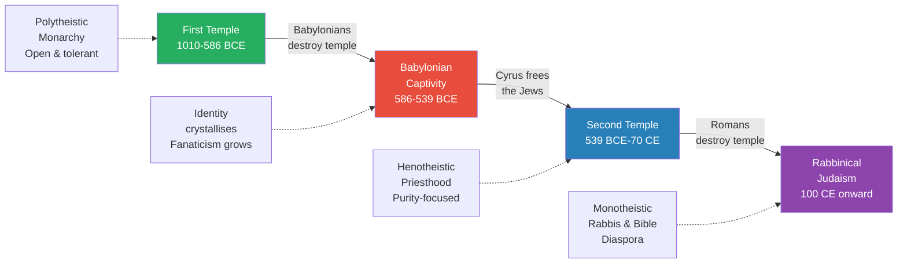
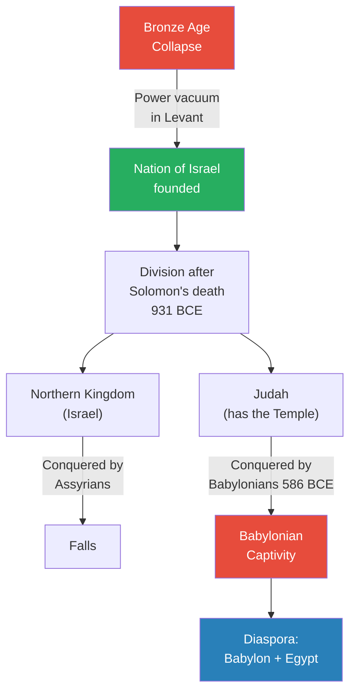
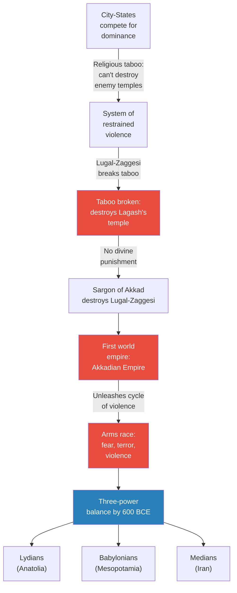
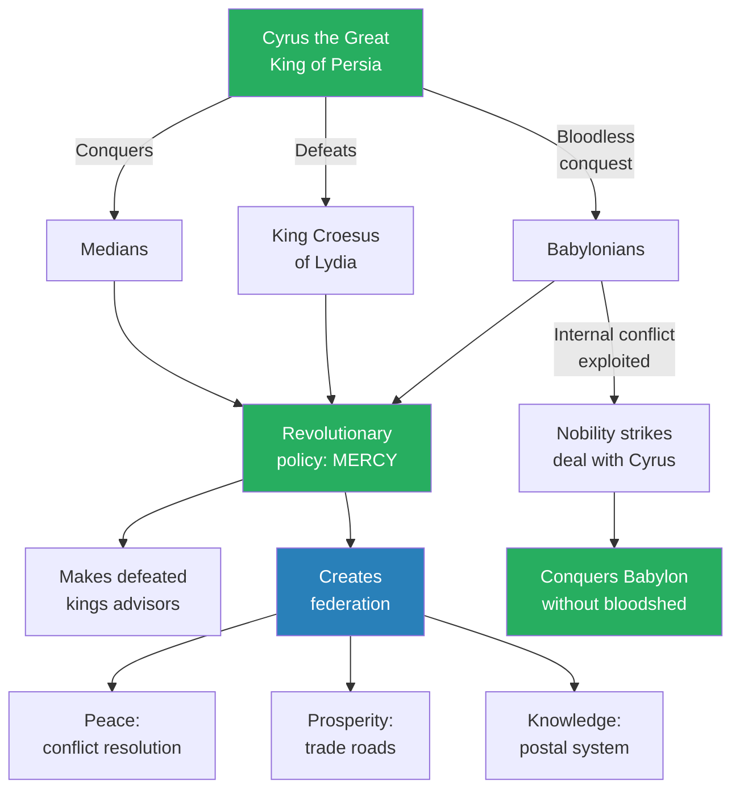
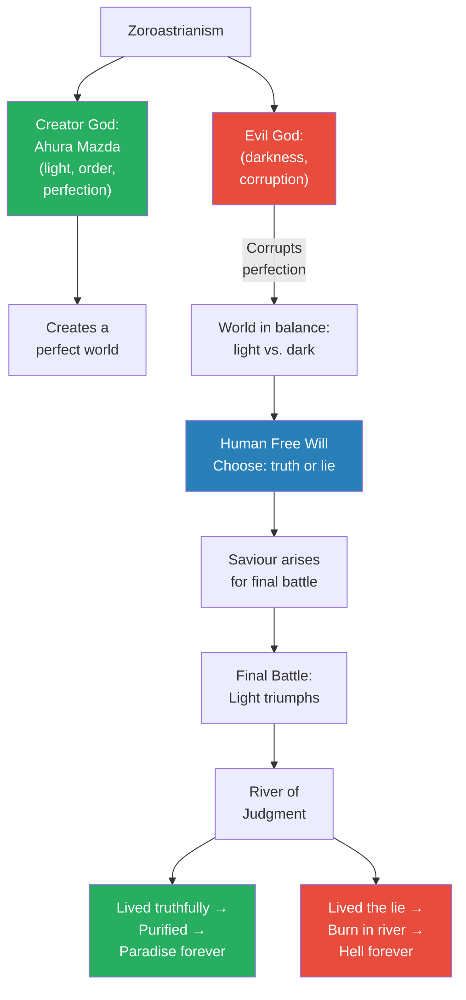
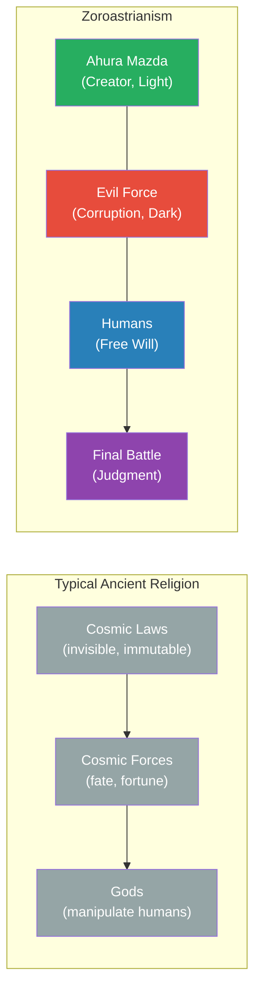
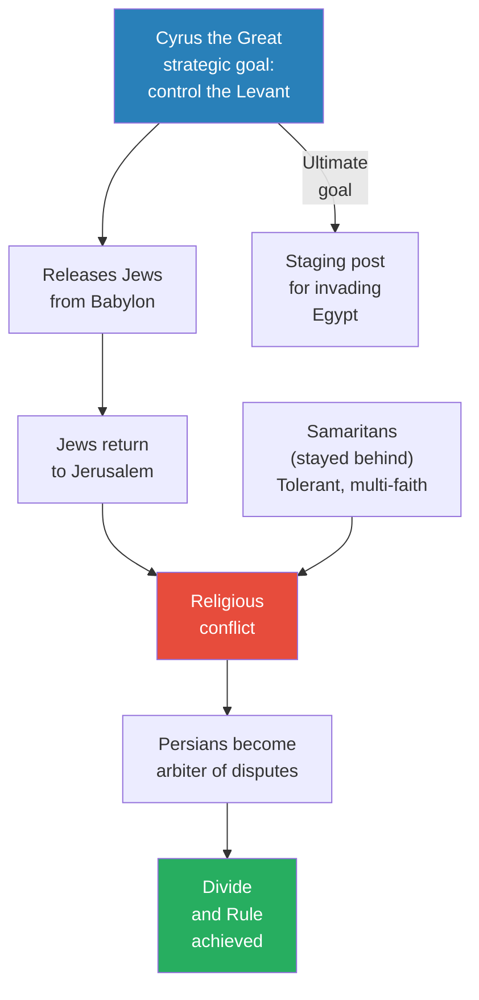
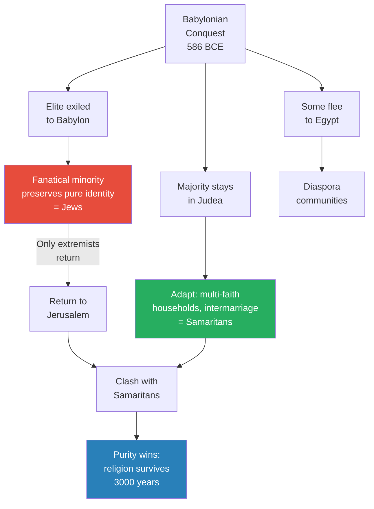

# Cyrus the Great as Messiah

> Prof. Jiang traces the transformation of Israelite religion across a thousand years — from David's open, polytheistic monarchy through the trauma of Babylonian captivity to the emergence of a fanatical, purity-obsessed Judaism under the priest Ezra. The pivot is Cyrus the Great of Persia, the only foreigner called Messiah in the Bible, whose revolutionary policy of mercy and federation replaced Mesopotamia's cycle of violence with a system of divide and rule. The lecture's deepest argument is that Zoroastrianism — the first truly complete, unified, and grand religion — merged with Judaism to produce the concepts of eschatology, cosmic good-versus-evil, and a coming Messiah that would become the foundation of Christianity.

---

## Overview: Key Highlights

- <b style="color: #27ae60">Cyrus the Great is the only foreigner called Messiah in the Bible</b> — the Jews considered him God's anointed saviour after he freed them from Babylon
- <b style="color: #2980b9">Three periods of Jewish history</b> — First Temple (1010-586 BCE), Second Temple (539 BCE-70 CE), and Rabbinical Judaism (100 CE onward), each with fundamentally different religious character
- <b style="color: #e74c3c">Babylonian captivity transformed Israelite religion</b> — diaspora forged a fanatical, identity-locked minority out of what had been an open, tolerant faith
- <b style="color: #2980b9">Zoroastrianism</b> — the first eschatological religion: a Creator God (Ahura Mazda), a cosmic battle between truth and lie, free will, a final judgment, heaven and hell
- <b style="color: #27ae60">Mercy as revolutionary strategy</b> — Cyrus conquered Babylon without bloodshed by showing clemency to defeated kings, breaking the Mesopotamian cycle of violence
- <b style="color: #2980b9">Divide and rule</b> — the Persian innovation of balancing internal factions so that conquered peoples depend on the empire for stability rather than uniting against it
- <b style="color: #e74c3c">Sargon of Akkad broke the religious taboo</b> — by destroying temples and suffering no divine punishment, he unleashed an arms race of violence that lasted centuries
- <b style="color: #27ae60">Three qualities of the "best" religion</b> — grandness, completeness, and unity — Zoroastrianism was the first to achieve all three
- <b style="color: #2980b9">Eschatology</b> — the concept that history has an endpoint and a final judgment, borrowed from Zoroastrianism into Judaism and then Christianity
- <b style="color: #e74c3c">Ezra's radical purity laws</b> — Jewish men forced to divorce foreign wives; the Bible compiled from four competing manuscripts to create the illusion of a unified people
- <b style="color: #27ae60">The Zoroastrian-Jewish merger produced Christianity's core ideas</b> — eschatology, good vs. evil as cosmic forces, and a Messiah from the House of David
- <b style="color: #2980b9">Federation over empire</b> — the Persians built the first multinational system where participation was voluntary because it brought peace, trade, and knowledge

| Concept | One-line summary |
|---------|-----------------|
| **First Temple period** | David's open, polytheistic monarchy unified by charisma and the Yahwist's literary genius (1010-586 BCE) |
| **Second Temple period** | Purity-focused, henotheistic, anti-monarchical Judaism rebuilt under Persian sponsorship (539 BCE-70 CE) |
| **Rabbinical Judaism** | Bible-centred diaspora religion led by rabbis after Rome destroyed the Second Temple (100 CE onward) |
| **Babylonian captivity** | 70 years of exile that forged a fanatical religious identity from a previously fluid one |
| **Zoroastrianism** | Persian religion: Ahura Mazda vs. evil, free will, final battle, judgment, heaven and hell |
| **Eschatology** | An understanding of how the world ends — final battle, resurrection, judgment |
| **Messiah** | The anointed one, chosen by God to save the people — originates in Zoroastrian-Jewish merger |
| **Divide and rule** | Balancing factions within a territory so all depend on the empire for stability |
| **Federation** | People choosing to participate in an empire because it benefits them — peace, trade, knowledge |
| **Grandness, completeness, unity** | The three criteria for evaluating religions — Zoroastrianism was the first to achieve all three |
| **Covenant** | Contract between Yahweh and Israel: loyalty in exchange for protection — broken covenant explains suffering |
| **The four Bibles** | J (Yahwist), E (Elohist), P (Priestly), D (Deuteronomist) — Ezra merged them into one |

---

# The Lecture

## A Thousand Years of Judaism in Three Periods [0:00-5:22]

*Prof. Jiang opens with a sweeping overview of Jewish religious history, dividing it into three distinct periods — each triggered by catastrophe, each producing a fundamentally different religion from the same roots. The transformation from David's open, generous faith to the closed, purity-obsessed Judaism of the Second Temple is the arc he wants the class to understand.*

> [!tip] Core Insight
> The religion we call Judaism today is not the religion of King David. Every 500 years, historical catastrophe forced the Israelites to reinvent their faith — each time becoming more concrete, more exclusive, and more focused on purity as the price of survival.

*Each catastrophe — Babylonian conquest, Persian liberation, Roman destruction — did not merely change the political circumstances of the Jewish people but fundamentally transformed the character of their religion.*

> [!note]- Expand: Full Lecture Detail
> Prof. Jiang begins by telling the class he wants to give them a broad overview of the first thousand years of Jewish religious history. He identifies three periods, each with distinct characteristics.
>
> **The First Temple Period (1010-586 BCE):**
> - The nation of Israel was created by King David as a coalition of different tribes, cultures, and religions
> - Two things held the coalition together: David's personal charisma and the literary genius of the Yahwist — the individual who wrote the first stories of the Bible (Adam and Eve, the patriarchs, Moses)
> - The First Temple in Jerusalem was the centre of religious unity — everyone had to come there to make sacrifices to Yahweh
> - Three key characteristics defined this period:
>   - <b style="color: #2980b9">Polytheistic in practice</b> — the religion aspired to monotheism, but it was only aspirational; ordinary people believed what their fathers and grandfathers believed, maintaining multiple faiths
>   - It was a monarchy — political and religious power centred on the king
>   - It was an <b style="color: #27ae60">open, tolerant, and optimistic religion</b> — the Bible told the story of Yahweh and David forming an everlasting friendship that became the basis for the nation
> - Yahweh in this period was a "poet God" — fallible, sensitive, well-meaning, willing to grow
> - To show devotion to Yahweh, you had to argue with him — a radically interactive, confident religion
>
> **The Second Temple Period (539 BCE-70 CE):**
> - By this period, the Israelites were called Jews, and though they shared the Bible with their ancestors, "in terms of culture and values, they're very different"
> - <b style="color: #2980b9">Henotheistic</b> — they believed other gods existed but that Yahweh was superior; all other gods were false idols and deceivers
> - Power shifted from the monarchy to the priesthood — focused on religious ritual
> - The culture became <b style="color: #e74c3c">extremely focused on purity and fanaticism</b> — a closed, conservative culture that believed their way was best and forbade intermixing
> - Jewish women were explicitly forbidden to marry foreign men
>
> **Rabbinical Judaism (100 CE onward):**
> - After the Romans destroyed the Second Temple in 70 CE and banished the Jews from Jerusalem, the religion transformed again
> - Became fully monotheistic — only one God, period
> - The centre of authority shifted to the rabbis (meaning "teachers") — the Bible replaced the temple as the centre of worship
> - <b style="color: #2980b9">Diaspora</b> — spread across the world, producing multiple strands of Judaism as the religion interfaced with local cultures and customs

---

## Why the Religion Changed — The Geopolitics of the Levant [5:22-10:28]

*Prof. Jiang explains that these massive cultural shifts were not theological accidents but direct responses to geopolitical reality. Israel was a historical accident born from the Bronze Age collapse, and its strategic location guaranteed that superpowers would eventually crush it.*

*Israel existed because the Bronze Age collapse temporarily removed the superpowers that controlled the Levant. Once the Assyrians and Babylonians recovered, the Levant's strategic value as a staging post for invading Egypt made Israelite independence unsustainable.*

> [!note]- Expand: Full Lecture Detail
> Prof. Jiang connects the religious transformations to geopolitical forces:
>
> - The nation of Israel was a historical accident — the Bronze Age collapse forced the Hittites and Egyptians to retreat from the Levant, creating a power vacuum
> - Normally, the Levant was controlled by a superpower from Anatolia, Egypt, or Mesopotamia
> - The Levant's strategic importance — as a staging post for invading Egypt — meant empires would always return to claim it
> - Israel was multicultural and multilingual, held together only by David's charisma
> - When David died and eventually Solomon died in 931 BCE, the nation split into the Northern Kingdom (Israel) and Judah
> - The critical problem: <b style="color: #e74c3c">the religion was centred on temple rituals, and the temple was in Jerusalem in Judah</b> — the Northern Kingdom had to modify their religion and create new worship sites
> - In 586 BCE, the Babylonians destroyed Judah and burned the First Temple
> - Babylonian policy: capture the elite and hold them hostage, send a foreign delegation to control the territory — this was the Babylonian captivity
>
> **What sustained them in exile:**
> - Two memories: the greatness of King David (a united monarchy under a beloved leader) and the Bible (the Yahwist stories)
> - Because these memories were written down, the Israelites specialised in intellectual activities — they became administrators, teachers, and intellectuals in Babylon
> - Their identity, previously fluid and dynamic, became <b style="color: #27ae60">concrete and locked in</b> during exile
>
> > [!example] The Overseas Chinese Analogy
> > - Prof. Jiang draws a parallel to Chinese diaspora communities
> > - In China, they use simplified Chinese characters
> > - In Southeast Asian diaspora communities, they use traditional Chinese characters
> > - Overseas Chinese hold on to Chinese culture "much more fanatically than in China"
> > - The same process happened: the Jews in Babylon preserved a more rigid version of their religion than the Israelites who stayed in the Levant
> > **The lesson:** Diaspora communities preserve culture more rigidly than the homeland — distance and vulnerability make identity non-negotiable.
>
> **The covenant explanation for suffering:**
> - The Jews needed to explain why they lost their promised land
> - The answer: they broke their <b style="color: #2980b9">covenant</b> with Yahweh — a contract stating that if Israel worshipped only Yahweh, He would protect them
> - Three specific violations: worshipping foreign gods, having kings (whose authority contradicts Yahweh's), and breaking the Ten Commandments
> - The people who articulated this explanation were the <b style="color: #2980b9">prophets</b> — establishing the prophetic tradition that Jewish people must remain pure in their devotion to survive

---

## Mesopotamia's Cycle of Violence — From Sargon to Cyrus [10:28-20:09]

*Prof. Jiang steps back from the Jewish story to explain the larger context: the violent, competitive world of Mesopotamian city-states, the religious taboo that kept them in check, the moment Lugal-Zaggesi broke that taboo, and the escalating cycle of imperial violence that followed — culminating in the three-power balance that Cyrus the Great would shatter through mercy rather than force.*

> [!tip] Core Insight
> For centuries, religious taboos prevented Mesopotamian city-states from destroying each other's temples. When Lugal-Zaggesi broke the taboo and nothing happened, he unleashed an arms race of violence that lasted until Cyrus the Great proved that mercy could achieve what violence never could.

*The escalation from restrained competition to total violence began with a single act of temple destruction. By 600 BCE, centuries of imperial violence had produced a three-way balance of power — the equilibrium that Cyrus would break through an entirely different approach.*

> [!note]- Expand: Full Lecture Detail
> Prof. Jiang sets the scene of Mesopotamia before Cyrus:
>
> - Mesopotamia was the centre of the world — wealthy, multi-ethnic, multinational, and the crossroads of all trade
> - Two groups of aggressive nomadic peoples surrounded the city-states: the Arabians in the desert and mountain peoples from the Zagros Mountains
> - These nomads were <b style="color: #2980b9">opportunistic — they would trade with the city-states but also raid and steal from them</b>
> - City-states had walls for defence and fought each other for dominance
> - The Mesopotamian religion demanded that people fight for the honour and glory of their patron god
>
> **The religious taboo that kept the system stable:**
> - Each city-state had a temple where a great god lived
> - You could destroy an enemy's army on the battlefield, but <b style="color: #e74c3c">you could not ransack their city or temple — that would incur the wrath of their god</b>
> - This taboo kept the system in check for centuries
> - Despite constant warfare, this system produced "tremendous innovations" — writing, mathematics, astronomy — making it the cradle of civilisation
>
> **Lugal-Zaggesi breaks the taboo:**
>
> > [!example] Lugal-Zaggesi's Nuclear Moment
> > - Lugal-Zaggesi was the king of Umma, a city-state perpetually in conflict with Lagash
> > - He grew tired of winning battles but never being able to finish his enemies
> > - He decided to test the gods: "I'm going to go into Lagash, destroy the temple, steal all their wealth, and see if their god will seek revenge"
> > - Prof. Jiang compares this to "the equivalent of using a nuclear weapon today"
> > - He went to Lagash, burned the temple, stole everything — and nothing happened
> > - Emboldened, he began conquering other city-states across Sumer
> > **The lesson:** When someone breaks a foundational taboo and suffers no consequences, the entire system of restraint collapses.
>
> **Sargon of Akkad seizes the opportunity:**
> - The city-states, unified in hatred of Lugal-Zaggesi, created an opening for a new warlord
> - <b style="color: #2980b9">Sargon of Akkad</b> (his name means "legitimate king" — "which tells us no one thought he was legitimate") was a mercenary who had usurped the throne of Kish
> - He had a legitimacy problem: kings were supposed to be descended from the gods
> - He created legitimacy by destroying Lugal-Zaggesi — capturing him, parading him, and killing him to prove divine favour
> - By unifying Mesopotamia, Sargon created the first world empire — the Akkadian Empire
> - But <b style="color: #e74c3c">by creating the first empire, he also unleashed a permanent cycle of violence</b> — an arms race of fear, terror, and imperial rise-and-fall
> - The problem: no natural boundaries for defence, so empires were easy to build and easy to lose
>
> **By 600 BCE:** Three superpowers — the Lydians (Anatolia), the Babylonians (Mesopotamia), and the Medians (Iran) — checked and balanced each other, each too powerful to be destroyed but not powerful enough to dominate

---

## Cyrus the Great — Mercy as Revolution [20:09-33:24]

*The lecture's centrepiece: Prof. Jiang introduces Cyrus the Great, considered the greatest ruler in human history before Julius Caesar, and explains how his revolutionary policy of mercy and federation replaced Mesopotamia's cycle of violence with a system that made participation voluntary and beneficial.*

> [!tip] Core Insight
> Cyrus the Great proved that mercy could achieve what centuries of violence never could. By showing clemency to defeated kings and making participation in his empire beneficial, he created a federation that people chose to join — and this is why the Jews called him Messiah.

*Cyrus broke the Mesopotamian pattern by replacing violence with generosity. His conquest of Babylon — achieved through reputation alone — was the proof that mercy could be more powerful than any army.*

> [!note]- Expand: Full Lecture Detail
> Prof. Jiang introduces Cyrus with undisguised admiration:
>
> - Cyrus the Great was "considered to be the greatest ruler in human history"
> - Alexander the Great saw him as a role model — when Alexander invaded Persia and found Cyrus's tomb desecrated, he stopped his campaign to have it renovated
> - Even the Greeks, Persia's enemies, thought he was "fabulous"
> - Before Julius Caesar, he was the uncontested greatest ruler ever
> - The problem: "because we don't have access to writing, we know very little about him"
>
> **What we know:**
> - He was king of the Persians, "descended from the Yamnaya, so they use horse archers in their warfare"
> - He conquered the Medians, prompting King Croesus of Lydia to attack — but Cyrus defeated him too
> - <b style="color: #27ae60">Instead of parading and executing defeated kings (as Sargon would have done), Cyrus made them advisors to his court</b>
> - "He shows mercy, he shows clemency, he shows forgiveness, and this shocks and awes the people of Mesopotamia"
> - His mercy demonstrated confidence, power, and divine favour — simultaneously
>
> **The bloodless conquest of Babylon:**
>
> > [!example] The Conquest of Babylon Without a Sword
> > - The Babylonian Empire was the last major power Cyrus needed to unify Mesopotamia
> > - The Babylonians had an internal conflict: their king wanted to change the official god from Marduk to Sin to establish his own religious authority
> > - Normally, this internal conflict would lead to civil war
> > - Normally, hearing that Cyrus had conquered the Medians and Lydians would force them to unify against the threat
> > - But Cyrus's reputation for mercy changed the calculation — the Babylonian nobility struck a deal with him
> > - Cyrus conquered Babylonia "without doing anything" — no battle, no siege, no bloodshed
> > - In his official history, Cyrus claimed this was his greatest conquest — achieved through generosity rather than killing
> > **The lesson:** A reputation for mercy can conquer what violence cannot — because rational actors prefer surrender to a generous victor over resistance to a cruel one.
>
> **The Persian federation:**
> - The Persians realised that to truly control people, you must use <b style="color: #2980b9">divide and rule</b>
> - Previous empires (Akkadians, Assyrians, Babylonians) used violence and fear — which only united people against them
> - The Persians recognised that every society has natural internal factions competing with each other
> - If you balance these factions, they become dependent on the empire for stability
> - The result was not an empire but a <b style="color: #2980b9">federation</b> — people chose to participate because it benefited them
>
> **Three benefits of the federation:**
> - <b style="color: #27ae60">Peace</b> — conflicts resolved through Persian mediation rather than war
> - <b style="color: #27ae60">Prosperity</b> — roads enabled trade throughout the empire, making trade more profitable than fighting
> - <b style="color: #27ae60">Knowledge</b> — a national imperial postal system with checkpoints (like hotels for postmen) with food, clothing, and rest stops, enabling communication across the empire
>
> Prof. Jiang marvels: "These nations warred with each other throughout their history, and these are very aggressive people with lots of religious differences, and Cyrus the Great and his descendants were able to create a system that allowed them to work together and prosper together."
>
> This is why the Jews called him <b style="color: #27ae60">Messiah</b> — "God's chosen, God's anointed, a man picked by God to come to save the human race."

---

## Zoroastrianism — The World's First Complete Religion [33:24-45:03]

*Prof. Jiang makes a claim that reframes the rest of the lecture series: religions can be measured and compared. He introduces three criteria — grandness, completeness, and unity — and demonstrates that Zoroastrianism was the first religion to achieve all three, making it the intellectual engine that powered the Persian administrative system and ultimately gave Judaism (and then Christianity) its most powerful ideas.*

> [!tip] Core Insight
> Zoroastrianism introduced ideas that now seem universal but were revolutionary: a single Creator God opposed by an evil force, human free will to choose between them, a final battle between good and evil, resurrection of the dead, and judgment that sends souls to heaven or hell. Every one of these concepts entered Judaism and then Christianity through the Persian-Jewish encounter.

*Zoroastrianism's narrative arc — perfection, corruption, free will, final battle, judgment — is a complete circle. This "completeness" is exactly what made it superior to the loose, three-tiered pantheon systems of other ancient religions.*

> [!note]- Expand: Full Lecture Detail
> Prof. Jiang introduces a framework for evaluating religions — a bold claim he knows will provoke:
>
> **The three criteria for religious quality:**
> - <b style="color: #2980b9">Grandness</b> — "it's a big topic, kings and gods and wars and love"
> - <b style="color: #2980b9">Completeness</b> — "there's a beginning and there's an end"
> - <b style="color: #2980b9">Unity</b> — "there's a plot. Things are united"
>
> He uses a storytelling analogy: Gilgamesh — a king who fights gods in search of immortality and discovers it is impossible — is grand, complete, and unified. But a story about "a guy named Robert who wants to get A's in school and studies all the time" fails on all three counts. "It's the same with religions."
>
> **Why most religions fell short:**
> - The typical ancient religion had a three-tier structure:
>   - Gods who participate in human affairs and manipulate us
>   - Higher cosmic forces (fate and fortune) that govern the gods
>   - Invisible, immutable laws of the cosmos at the highest tier
> - This system — used by the Greeks, Romans, and most Mesopotamian cultures — "may be grand, but it's not complete or unified. It's a very loose system"
>
> **Zoroastrianism's revolutionary narrative:**
> - <b style="color: #2980b9">Ahura Mazda</b>, the Creator God — God of creation, light, and order — creates a perfect world
> - An evil presence, an evil god, enters and corrupts the perfection
> - The world becomes a perfect balance of dark and light
> - What tips the balance is the human race: <b style="color: #27ae60">"We have free will, therefore we can choose to fight for goodness or to fight for darkness, to fight for the truth or to fight for the lie"</b>
> - The central dichotomy is truth versus lie — fighting for truth makes the world better; fighting for the lie corrupts it
> - Eventually, a saviour will arise to prepare for the final battle between dark and light
> - Light will triumph, and a river will emerge
> - Everyone — including the dead, who will be resurrected — must cross the river
> - If you fought for truth: the river cleanses you; you become an eternal soul in paradise
> - If you lived the lie: <b style="color: #e74c3c">you burn in the river and are condemned to hell forever</b>
>
> This is <b style="color: #2980b9">eschatology</b> — "an understanding of how the world ends." Prof. Jiang stresses: "Zoroastrianism is the first eschatological religion. It has an ending, a final battle, good versus evil, where everyone will be judged."
>
> **Why this made the Persian system work:**
> - If you were an administrator in the Persian Empire and believed in Zoroastrianism, you had a duty to fight for the truth
> - "We're here at most for 60-80 years. And what we do in those 60-80 years will decide how we live our lives for all of eternity"
> - <b style="color: #27ae60">The Persians were under tremendous pressure to be good people</b> — this was radical in human history
> - Previous civilisations measured goodness by achievement (Mesopotamia), status (Egypt), or luck
> - The Persians measured goodness by moral conduct — "you have to show generosity, compassion, and mercy to others, as exemplified by the life and works and words of Cyrus the Great"
>
> **Student question — Are there "worst" religions?**
> - Prof. Jiang clarifies: "There's really no bad religion — the most common religion is folk religions, where you live in a village and believe in a local god"
> - When he says "best," he means "intellectually" — "it's a religion that can attract the best and the brightest"
> - He compares it to the Confucian classics in China — you had to know them to become a scholar-official; similarly, you had to believe in Zoroastrianism to become a Persian administrator
> - The religion's abstraction was a feature, not a bug — it was a filter for recruiting intelligent, capable administrators
> - "They're not trying to promote their religion. They're trying to use their religion to filter out the best and the brightest"
>
> > [!quote] Prof. Jiang
> > "We're here at most for 60-80 years. And what we do in those 60-80 years will decide how we live our lives for all of eternity."

*The typical ancient religion was a loose three-tier hierarchy with no narrative arc. Zoroastrianism was a unified story with a beginning (creation), a conflict (good vs. evil), a protagonist (humanity with free will), and an ending (final judgment). This narrative completeness is what made it intellectually superior.*

---

## Cyrus's Strategic Release of the Jews [45:03-51:20]

*Prof. Jiang reveals the strategic calculus behind Cyrus's seemingly generous act. Releasing the Jews to Jerusalem was not compassion — it was divide and rule. By inserting fanatical returnees into a territory occupied by tolerant Samaritans, Cyrus created the religious conflict that made the Levant dependent on Persian arbitration.*

*Cyrus's release of the Jews was not an act of compassion but a masterpiece of divide and rule — inserting a fanatical minority into a tolerant majority guaranteed the religious conflict that made both sides dependent on Persian arbitration.*

> [!note]- Expand: Full Lecture Detail
> Prof. Jiang pulls back the curtain on Cyrus's motives:
>
> - Cyrus allowed the Jews to return to Jerusalem "for strategic purposes — he's not doing it because he feels sorry for the Jews"
> - Jerusalem and the Levant were geographically critical — they controlled access to Egypt, the wealthiest nation in the world, which Cyrus eventually wanted to conquer
> - In the Persian worldview, stability comes from balancing forces within a local area — <b style="color: #2980b9">"he needs to create conflict in the Levant"</b>
>
> **The Samaritan-Jewish split:**
> - The Israelites who stayed in the Levant after the Babylonian conquest were now called <b style="color: #2980b9">Samaritans</b>
> - "Jews" was a Persian word meaning "people who live in the province of Judea"
> - Samaritans and Jews came from the same people, but 70 years of separation had created deep differences:
>   - Samaritans had adapted — they still practised their religion but had intermarried with women of different faiths; households commonly practised multiple religions
>   - The Jews in Babylon had become fanatical — they believed it was essential to practise only one faith
> - When Cyrus sent the Jews back, it "immediately creates conflict between the Samaritans who believe they are the true descendants of the Israelites and the Jews who believe they are the true descendants"
> - This was exactly what Cyrus wanted: religious conflict that made the Persians the necessary arbiter
>
> **A critical detail:**
> - Only the most fanatical Jews returned — "the rest of the Jews are perfectly happy in Mesopotamia" with successful careers as administrators and intellectuals
> - The returnees were a minority — Samaritans were the majority
> - The Persians supported the fanatical Jewish minority in their push for purity, ensuring the conflict persisted
>
> Prof. Jiang also credits Cyrus with sponsoring the construction of the Second Temple and encouraging the project of compiling the Bible — led by a priest named Ezra who returned from Babylon to Jerusalem

---

## Ezra's Bible Project and the Four Manuscripts [51:20-58:48]

*Prof. Jiang explains how the priest Ezra returned from Babylon determined to win the religious war against the Samaritans. His three radical moves — forced divorce of foreign wives, mandatory ritual observance, and the compilation of four competing Bibles into one — created the unified Jewish identity that would survive for three thousand years.*

> [!tip] Core Insight
> The Bible is not a single book written by a single author. It is four competing manuscripts — Yahwist, Elohist, Priestly, and Deuteronomist — stitched together by Ezra to create the illusion of a unified people. The seams are visible: "If you actually read the Bible, you'll find it completely unreadable."

```mermaid
flowchart TB
    EZRA["Ezra returns<br/>to Jerusalem<br/>~443 BCE"]
    EZRA --> D1["Forces Jewish men<br/>to divorce<br/>foreign wives"]
    EZRA --> D2["Mandatory<br/>religious ritual<br/>observance"]
    EZRA --> D3["Compiles the<br/>Bible from 4<br/>manuscripts"]
    D3 --> J["J (Yahwist):<br/>David's legitimacy<br/>Temple in Jerusalem"]
    D3 --> E["E (Elohist):<br/>Northern Kingdom<br/>alternative sites"]
    D3 --> P["P (Priestly):<br/>Ritual manuals<br/>how to worship"]
    D3 --> D["D (Deuteronomist):<br/>Prophetic history<br/>why we suffered"]
    J --> BIB["The Bible<br/>(unified text)"]
    E --> BIB
    P --> BIB
    D --> BIB
    BIB --> KEY["Key change:<br/>Moses replaces David<br/>as central figure"]
    style EZRA fill:#2980b9,color:#fff
    style BIB fill:#27ae60,color:#fff
    style KEY fill:#e74c3c,color:#fff
```

*Ezra's compilation was an act of political genius — by merging four rival traditions into a single text, he created a unified identity for a people who had never actually been unified. The shift from David (king) to Moses (priest-lawgiver) as the Bible's central figure reflected the transfer of power from monarchy to priesthood.*

> [!note]- Expand: Full Lecture Detail
> Prof. Jiang describes Ezra's three-pronged strategy:
>
> **1. Forced divorce:**
> - "If you are a Jewish man, you must divorce a foreign woman" — any wife who did not share the faith
> - This was "extremely controversial" but Ezra considered it necessary for purity
>
> **2. Mandatory ritual:**
> - "From now on, it is mandatory for Jewish men to observe religious rituals, to go to temple and make your sacrifice"
> - Attendance was no longer optional — it was the price of membership
>
> **3. The Bible compilation:**
> - Multiple competing Bibles existed, each serving a different faction:
>   - <b style="color: #2980b9">The J (Yahwist) manuscript</b> — portrayed Yahweh as a fallible, well-meaning poet; its purpose was to legitimise David as ruler and the Jerusalem temple as the centre of worship
>   - <b style="color: #2980b9">The E (Elohist) manuscript</b> — created by the Northern Kingdom after they split from Judah and could no longer access Jerusalem; "Elohim" was simply a different word for God; this Bible established alternative worship sites
>   - <b style="color: #2980b9">The P (Priestly) manuals</b> — detailed instructions for performing rituals correctly; "very precise, they're to be effective"
>   - <b style="color: #2980b9">The D (Deuteronomist) manuscript</b> — the prophetic history explaining why the Israelites suffered: because they disobeyed God
> - Ezra's method was simple: "he basically just takes different parts from each of these books and puts them together"
> - The result: "if you actually read the Bible, you'll find it completely unreadable" — because it was never meant to be a single narrative
> - The most significant change: <b style="color: #e74c3c">the most important person shifted from David (the king) to Moses (the priest-lawgiver)</b> — reflecting the transfer of authority from monarchy to priesthood
>
> **Three Zoroastrian ideas that entered Judaism:**
> - <b style="color: #27ae60">Eschatology</b> — an endpoint to history: all empires of the world, because they defy God, will converge against Israel in one final battle; Israel will win, creating eternal peace
> - <b style="color: #27ae60">Good versus evil as cosmic forces</b> — before, good and evil were personal and internal; now, Israel stands for good and the empires (Babylonians, Greeks, Romans) represent evil
> - <b style="color: #27ae60">The Messiah</b> — a hero from the House of David who will come to lead Israel against all its enemies; "the Son of Man"
>
> Prof. Jiang delivers the punchline: "The Christians basically take all this, this merger of Zoroastrianism and Judaism, and their claim is the Messiah is Jesus. And this creates Christianity, which we will discuss next class."

---

## The Diaspora Mind — Why Extremists Preserve Religion [58:48-1:03:48]

*In an extended Q&A exchange, Prof. Jiang explains the sociology of religious survival: why the most fanatical minority is always the one that keeps a religion alive, and why diaspora communities preserve culture more rigidly than the homeland.*

*The paradox of religious survival: the tolerant majority assimilates and disappears; the fanatical minority preserves identity at the cost of exclusion. Prof. Jiang argues this pattern holds for all religions — "it's only people who are most willing to die for their religion that keeps the religion alive."*

> [!note]- Expand: Full Lecture Detail
> Prof. Jiang responds to a student question with a sociological analysis of religious survival:
>
> - When the Babylonians conquered Jerusalem in 586 BCE, three groups formed:
>   - The majority stayed in Judea — "just ordinary people" who adapted to new circumstances
>   - The elite were exiled to Babylon — a few thousand people
>   - Some fled to Egypt
> - The majority who stayed were pragmatic: <b style="color: #27ae60">"It's very common back then for a person to have multiple faiths — the faith of your father, the faith of your mother, the faith of your wife, the faith of your neighbour"</b>
>   - This was how people got along: "If you said that my god is better than your God, you will piss off your neighbour, you will piss off your colleague. Why would you do that?"
>   - These were "extremely multi-religious people"
> - The exiled minority in Babylon took the opposite path:
>   - They had to maintain a fanatical religion to preserve their identity — "how do you separate yourself from these other people?"
>   - Without rigid identity, assimilation was inevitable: "most people chose to be assimilated because that was the easiest thing to do"
>   - But "a fanatical minority, mainly priests, were determined to keep alive their religion, because only by keeping alive their religion could they keep alive Yahweh, could they keep alive Israel"
>
> - When these Jews returned to Judea and saw the Samaritans' multi-faith households, they were horrified:
>   - "We were in Babylon, and for 70 years, we fought hard to save our religion, to maintain the purity of our religion — they go back and they see their people adopt foreign gods"
>   - Their logic: <b style="color: #e74c3c">"This is why we fail as a people. This is why Yahweh punished us, because we refuse to be loyal"</b>
>   - Their ultimatum: divorce your foreign wife or leave — "Jerusalem, it's only the land of the pure"
>
> - Prof. Jiang acknowledges this is controversial, then makes a broader claim:
>   - "It's really only the extremists who keep the religion alive — this is true for all religions"
>   - "It's only people who are most willing to die for their religion that keeps the religion alive"
>   - "If everyone's willing to compromise, the religion dies very quickly"
>   - Judaism survived 3,000 years because it always had "a minority, but still a lot of people, who are willing to die for the religion"
>
> He previews the next lecture: "We will discuss the rise of Christianity — Jesus, basically."

---

## Connections

**Builds on:** [[21 - The Apology of King David of Israel]] (David's founding of the nation, the charismatic leadership model), [[22 - The Literary Genesis of the Yahwist]] (the J manuscript, the Yahwist's literary genius, the Bible as political literature), [[06 - Elite Overproduction and the Bronze Age Collapse]] (the collapse that created the power vacuum enabling Israel's existence), [[05 - The Yamnaya Conquest of Europe]] (the Persians as descendants of the Yamnaya, horse archers)

**Sets up:** [[24 - Resurrecting the Gnostic Jesus]] (the Zoroastrian-Jewish merger's concept of a Messiah becomes Christianity's founding claim — Jesus as the promised Son of Man from the House of David)

**Recurring themes:**
- **Religion as civilisation driver** (Lecture 1) — Zoroastrianism as the administrative engine of the Persian Empire; Judaism's survival through religious fanaticism
- **Charismatic leaders** (Lecture 1) — Cyrus the Great as the ultimate example: mercy, generosity, and strategic wisdom replacing brute force
- **Debunking traditional narratives** (Lecture 1) — Cyrus's release of the Jews reframed from compassion to strategic divide-and-rule
- **Poor-conquers-rich dynamic** (Lecture 11) — the Persians rising from a small regional power to conquer three superpowers
- **Three qualities of great leaders** (Lecture 11) — Cyrus as strategic/visionary (federation), innovative/revolutionary (mercy instead of violence), disciplined/selfless (making enemies into advisors)

**Related books in vault:**
- [[Sapiens - Yuval Noah Harari]] — the agricultural revolution and the power of shared myths to unite strangers; the "imagined order" concept resonates with Ezra's compilation of competing Bibles into a unified identity document

---

## The Takeaway

This lecture sits at the junction of two of the series' major arcs — the Ancient Near East sequence (Lectures 18-23) and the Rise of Monotheism sequence (Lectures 24-28). Everything that came before — David's charisma, the Yahwist's literary genius, the Bronze Age power vacuum, Mesopotamia's cycle of violence — converges here in the figure of Cyrus and the religion of Zoroaster. And everything that follows — Jesus, Paul, Constantine, Muhammad — flows from the Zoroastrian-Jewish merger that this lecture documents. The pivot point of the entire series may be this single historical moment: a Persian king releases Jewish priests from Babylon, and two religions collide to produce the ideas that will dominate human history for the next two thousand years.

The most counterintuitive insight is Prof. Jiang's reframing of religious extremism. We tend to see fanaticism as a bug — dangerous, intolerant, destructive. Prof. Jiang presents it as a survival mechanism without which no religion would endure. The tolerant majority assimilates; the fanatical minority preserves. Judaism survived three thousand years not despite its extremists but because of them. This is uncomfortable, and Prof. Jiang knows it — "I know this is a controversial idea" — but the historical evidence is difficult to dismiss.

The question left open is whether Zoroastrianism's merger with Judaism was a one-way absorption or a genuine synthesis. Prof. Jiang presents the three big Zoroastrian ideas (eschatology, cosmic good-vs-evil, the Messiah) as imports into Judaism, but the mechanism of merger — how exactly Persian administrative religion influenced Jewish priestly theology during and after the captivity — remains gestural rather than documented. The next lecture, on Jesus and the birth of Christianity, will test whether the merger produced something genuinely new or simply dressed Zoroastrian ideas in Jewish clothing.
