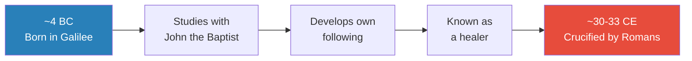
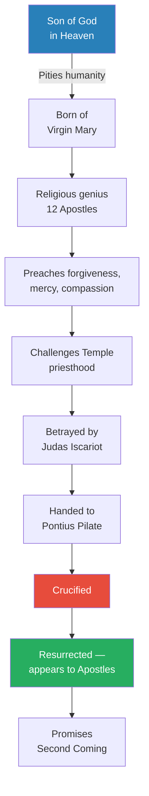
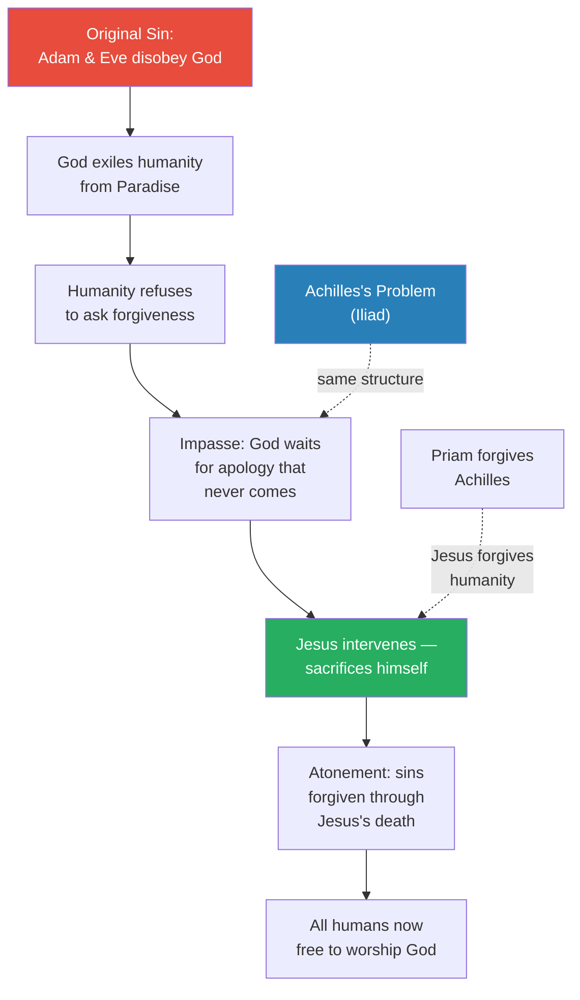
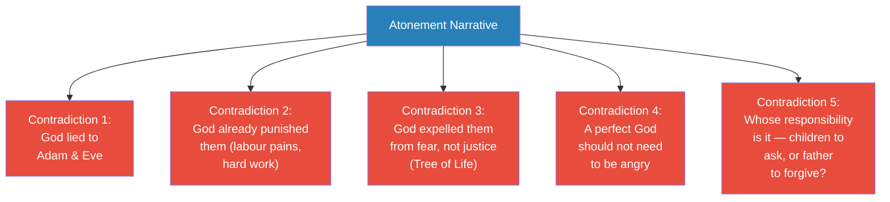
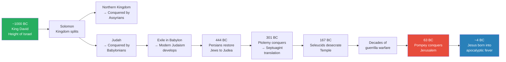
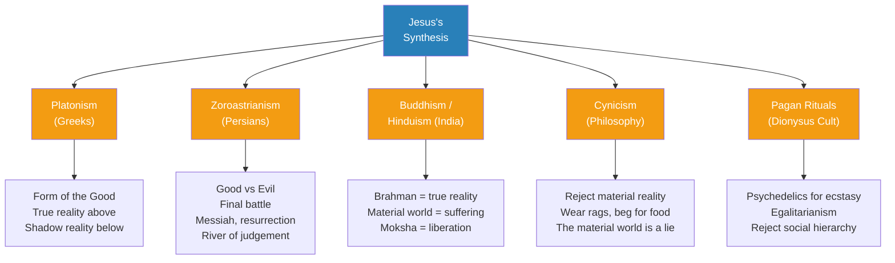
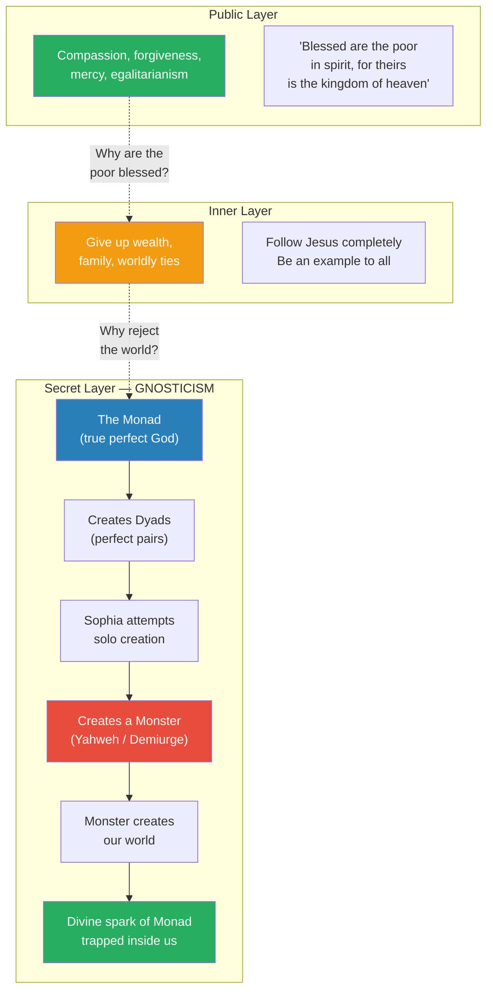
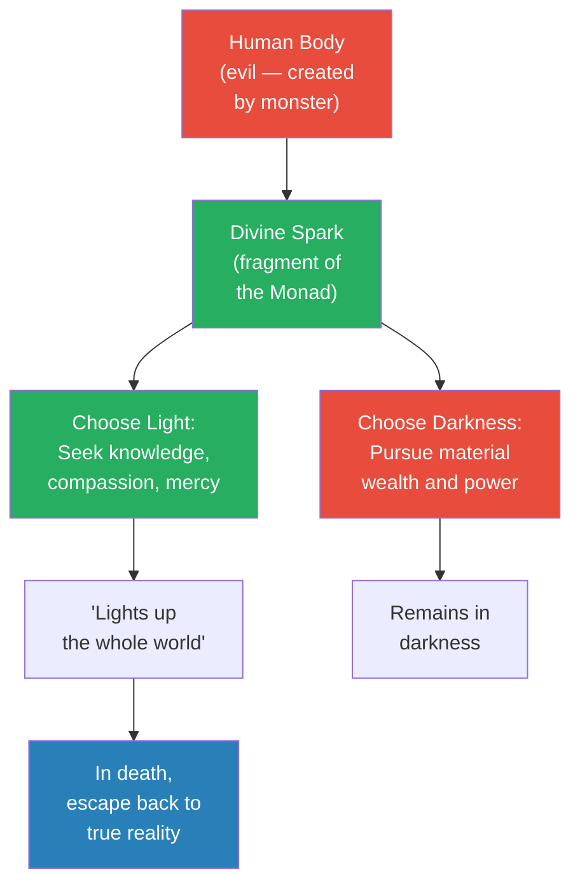
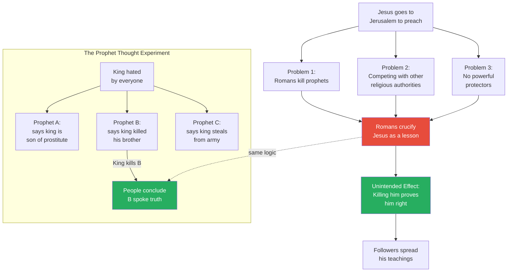

# Resurrecting the Gnostic Jesus

> Prof. Jiang tackles the most famous figure in human history — Jesus of Nazareth — and argues that the religion Jesus actually founded was not Christianity but Gnosticism. After separating the historical Jesus from the biblical Jesus and exposing the contradictions in the standard Christian narrative of atonement and original sin, Prof. Jiang reconstructs what Jesus truly believed using the recently discovered Gospel of Thomas. The secret teaching: our world was created by a monster god (Yahweh), a defective offspring of Sophia, who is herself an emanation of the true God (the Monad). Trapped in a false material reality, humans carry a divine spark that can liberate them — but only through knowledge, compassion, and the rejection of material power. The founder of Christianity, Prof. Jiang argues, was not Jesus but Paul — the subject of the next lecture.

---

## Overview: Key Highlights

- <b style="color: #27ae60">Jesus was a Gnostic, not a Christian</b> — his secret teaching was about escaping a false reality created by a monster god, not atonement for original sin
- <b style="color: #2980b9">The three layers of religious teaching</b> — every religion operates at a secret, inner, and public layer; Jesus's public message of compassion concealed a radical metaphysics
- <b style="color: #e74c3c">The atonement narrative collapses under scrutiny</b> — God already punished Adam and Eve, lied to them, and feared their power; the idea that Jesus had to die for original sin is internally contradictory
- <b style="color: #2980b9">Gospel of Thomas</b> — discovered at Nag Hammadi in 1945, this non-biblical gospel reveals Jesus's Gnostic teachings in his own words
- <b style="color: #27ae60">The divine spark</b> — in Gnostic teaching, each human carries a fragment of the true God (the Monad) trapped inside a body created by a false god
- <b style="color: #2980b9">Apocalyptic eschatology</b> — the widespread Jewish belief that God was about to return and destroy his enemies; the historical context in which Jesus preached
- <b style="color: #e74c3c">The Bible's antisemitic claim that "the Jews killed Jesus" is historically false</b> — the three Jewish factions (Sadducees, Pharisees, Essenes) never executed fellow Jews, and Pontius Pilate was a violent thug, not a reluctant judge
- <b style="color: #2980b9">The Monad and Sophia</b> — in Gnostic cosmology, the true God (Monad) creates perfect pairs (dyads); Sophia's unsanctioned act of solo creation produces a monster who becomes Yahweh
- <b style="color: #27ae60">Jesus's death was meant to awaken, not to atone</b> — his crucifixion focused attention on his teachings, triggering a self-discovery process in his followers
- <b style="color: #e74c3c">The Romans created a hero by killing Jesus</b> — in a climate of apocalyptic expectation, executing a prophet proved him right in the eyes of the people
- <b style="color: #2980b9">Achilles's problem</b> — Prof. Jiang connects the Christian concept of redemption to the central conflict of the Iliad: if you cannot forgive yourself, who will forgive you?
- <b style="color: #27ae60">Jesus synthesised Greek, Persian, Buddhist, and pagan traditions</b> — his genius was combining Platonism, Zoroastrianism, Hinduism/Buddhism, cynicism, and Dionysian egalitarianism into a single coherent religion

| Concept | One-line summary |
|---------|-----------------|
| **Historical Jesus** | Born ~4 BC in Galilee, student of John the Baptist, healer, crucified ~30-33 CE — almost nothing else is confirmed |
| **Biblical Jesus** | Son of God who descended to atone for humanity's sins and promised a second coming |
| **Original sin** | The doctrine that humanity's disobedience in Eden requires divine atonement — Prof. Jiang argues this is internally contradictory |
| **Apocalyptic eschatology** | The belief that God will return imminently to destroy evil and establish paradise — widespread in first-century Judea |
| **Gnosticism** | The secret teaching of Jesus: the material world is a false reality created by a defective god; liberation comes through knowledge (gnosis) |
| **The Monad** | The true, perfect God in Gnostic cosmology — eternal, immutable, the source of all emanation |
| **Sophia** | A divine emanation (dyad) who defied the Monad by creating alone, producing a monster |
| **Yahweh as Demiurge** | In Gnostic teaching, the God of the Hebrew Bible is the monster created by Sophia — ignorant of the true reality above him |
| **The divine spark** | A fragment of the Monad trapped inside every human body — the basis for human potential and redemption |
| **Gospel of Thomas** | A collection of Jesus's sayings discovered at Nag Hammadi in 1945, revealing his Gnostic worldview |
| **Three-layer teaching** | Secret (Gnostic metaphysics), inner (radical self-denial for disciples), public (compassion and mercy for all) |
| **Achilles's problem** | If we cannot forgive ourselves, who will? Christianity answers: Jesus will — solving the impasse from the Iliad |

---

# The Lecture

## The Historical Jesus — What Scholars Actually Know [0:00 - 4:00]

*Prof. Jiang opens by stating the stakes: Jesus is the most famous person who ever lived, worshipped by two billion people. But when you strip away the faith, what do historians actually know about him? Remarkably little.*

*The entire confirmed biography of the most studied individual in human history fits into five nodes. Everything else is interpretation, theology, or legend.*

> [!note]- Expand: Full Lecture Detail
> Prof. Jiang opens with the weight of the subject: "Today, we are doing Jesus, the most famous man who has ever lived. There are about 2 billion people on this planet, about a quarter of the human race who worship him."
>
> He then presents only what scholars and archaeologists broadly agree on:
>
> - Jesus was born around <b style="color: #2980b9">4 BC in Galilee</b> — a region in Judea (modern Israel) that was a crossroads of cultures, religions, and beliefs within the Roman Empire
> - He was a student of <b style="color: #2980b9">John the Baptist</b>, a major Jewish religious leader who preached baptism as cleansing from sin in preparation for the coming kingdom of heaven
> - After studying with John the Baptist, Jesus broke away and began preaching his own message, developing a large following
> - He was well known for his healing powers — curing the sick through faith and belief
> - Around 30-33 CE, when he was roughly 34-37 years old, he was crucified by the Romans
>
> Prof. Jiang pauses on crucifixion to make sure the class understands its horror:
>
> - Crucifixion was reserved for the lowest status individuals — bandits, pirates, rebels — people who defied Rome
> - It was specifically for poor, illiterate people with no social standing
> - The cause of death was not bleeding or pain but suffocation — once the victim lost strength, they could no longer hold up their body to breathe
> - It took approximately three days to die
> - "It's really the worst way to die"
>
> Prof. Jiang emphasises: "Historically, this is all that we know about him. Jesus is the most studied individual in human history. No one comes close, but we really don't know much about him."

---

## The Biblical Jesus — The Story Christians Tell [4:00 - 9:20]

*Prof. Jiang pivots from history to theology, presenting the Bible's version of Jesus — Son of God, virgin birth, twelve apostles, betrayal by Judas, crucifixion under Pontius Pilate, resurrection, and the promise of a second coming. He presents this straight, without commentary, from the four Gospels of Mark, Matthew, Luke, and John.*

> [!tip] Core Insight
> The historical Jesus and the biblical Jesus are "two very different individuals." One is a wandering healer from Galilee who was executed by Rome. The other is the Son of God who descended to redeem humanity. The gap between these two figures is where the real story lies.

*The biblical narrative follows a descent-sacrifice-return arc: God comes down, dies for humanity, rises, and promises to come back. Prof. Jiang will spend the rest of the lecture dismantling this arc.*

> [!note]- Expand: Full Lecture Detail
> Prof. Jiang walks through the biblical story methodically:
>
> - Jesus is the <b style="color: #2980b9">Son of God</b>, living in heaven, who looks down and pities humanity — he wants to liberate us from pain and suffering, to redeem and atone for our sins
> - He is born of a virgin mother named Mary
> - From an early age he is a religious genius who attracts followers and develops twelve apostles
> - His core message: the kingdom of heaven is coming, and we must be ready
>   - He preaches forgiveness, redemption, compassion, generosity, and mercy
>   - "Do not judge others. Let those who are without fault, without sin, without mistakes, be the first to cast the stone"
> - He is a <b style="color: #27ae60">social revolutionary</b> — he opposes the priesthood's model of faith through animal sacrifice and payment
>   - True faith is shown by being a good person, by generosity, by refusing materialism and greed
>   - This directly threatens the priests of the Temple in Jerusalem
> - He is betrayed by his apostle <b style="color: #e74c3c">Judas Iscariot</b>, who reports him to the religious authorities
> - The priests turn him over to the Roman governor, Pontius Pilate
>   - The Bible portrays Pilate as reluctant and sympathetic — he does not know what crime Jesus committed
>   - But the priests insist, and Pilate agrees to crucify Jesus
> - After death, Jesus is <b style="color: #27ae60">resurrected</b> — he appears before his apostles and tells them he came to atone for humanity's sins
>   - He commands them to spread his gospel (Greek for "good news")
>   - He promises a second coming — he will return on clouds to destroy God's enemies and build paradise
>
> Prof. Jiang notes the contradictions within the Bible itself — the four Gospels (Mark, Matthew, Luke, and John) are written by different individuals and contain inconsistencies. But taken together, this is the story of Jesus as Christianity tells it.

---

## The Problem of Atonement — Why Did the Son of God Have to Die? [9:21 - 17:50]

*Prof. Jiang identifies the central theological problem of Christianity — if Jesus is divine, why must he die? — and presents the standard explanation through the lens of original sin, the Garden of Eden, and the Iliad's Achilles problem. Then he tears it apart.*

*The standard Christian explanation maps perfectly onto the Iliad's Achilles problem — if we cannot forgive ourselves, someone must forgive us first. Jesus is Christianity's answer to Priam.*

> [!note]- Expand: Full Lecture Detail
> Prof. Jiang poses the central question: "If he is, in fact, the Son of God, if he is divine, how to explain the crucifixion and the resurrection? Why does the Son of God have to die? And how does a Son of God die?"
>
> He presents the standard theological answer:
>
> - God and humanity are at war — a religious war
> - God created us in the Garden of Eden with one rule: do not eat from the Tree of Knowledge of Good and Evil
> - We disobeyed, and God exiled us from Paradise
> - In our "stupidity, ignorance, and selfishness" we never recognised our <b style="color: #2980b9">original sin</b>
> - We continue making mistakes, creating a more corrupt world
> - God, though merciful, <b style="color: #e74c3c">must be asked for forgiveness before he can forgive</b> — he cannot unilaterally pardon
> - Jesus recognises the impasse and decides to sacrifice himself to atone for humanity's sins
>
> Prof. Jiang then draws a connection to <b style="color: #2980b9">Achilles's problem</b> from the Iliad (Lecture 7):
>
> - Achilles is paralysed by his own guilt over Patroclus's death
> - He cannot forgive himself, so his rage escalates
> - It takes Priam — the father of his enemy Hector — to release Achilles from his guilt through forgiveness
> - If Priam had never come, Achilles would have been trapped forever in anger and depression
>
> > [!example] The Achilles-Jesus Parallel
> > - Achilles is trapped by guilt he cannot resolve alone — he caused Patroclus's death through arrogance
> > - He takes out his rage on Hector's body, desecrating it, still unable to face himself
> > - Priam enters Achilles's tent and forgives him — this external forgiveness releases Achilles
> > - Christianity replicates this structure at civilisational scale: humanity is trapped by original sin
> > - Jesus becomes the universal Priam — his sacrifice releases all of humanity from guilt and shame
> > - "If you believe in him, then you will become a new person. You can become whoever you want to be"
> > **The lesson:** The problem of Achilles — the inability to forgive oneself — is the emotional engine that powers Christianity's appeal.
>
> Prof. Jiang adds one more dimension: before Jesus, access to God was restricted:
>
> - In Judaism, only Jews had access to God
> - Within Judaism, only the high priest could enter the Holy of Holies — the innermost room of the Temple where God dwelled
> - Jesus's sacrifice universalised access to God — <b style="color: #27ae60">God is within all of us, not just the Jewish people</b>
>
> He reads from the <b style="color: #2980b9">Gospel of Mark</b> to illustrate:
>
> - When Jesus dies, "the curtain of the temple was torn in two from top to bottom"
> - This curtain protected the Holy of Holies — the room where God resided
> - The tearing of the curtain means God is released into the world — no longer trapped behind a barrier accessible only to priests
> - The first person to recognise Jesus as divine is not an apostle but a Roman centurion: "Truly, this man was God's Son"
> - The centurion is history's first Christian — a non-Jew who recognises the universal truth of Jesus's sacrifice

---

## Why the Standard Story Doesn't Hold — Contradictions in Atonement [17:51 - 25:00]

*Prof. Jiang pivots from theology to critique. The atonement narrative sounds beautiful, he says, but "it really doesn't make much sense." He identifies internal contradictions in the story of original sin and exposes the historical inaccuracies in the Bible's account of who killed Jesus.*

> [!tip] Core Insight
> The Bible's atonement narrative contains at least four internal contradictions: God lied to Adam and Eve, God already punished them, God kicked them out for fear (not justice), and a perfect God should not need to be asked for forgiveness. These are not minor quibbles — they collapse the theological foundation.

*Five cracks in the atonement foundation. Prof. Jiang connects each back to the class's earlier study of Genesis (Lecture 22), where they established that both God and Adam and Eve were at fault.*

> [!note]- Expand: Full Lecture Detail
> Prof. Jiang presents the theological contradictions systematically:
>
> - <b style="color: #e74c3c">Contradiction 1 — God lied</b>: In their earlier study of Genesis (Lecture 22), they established that God told Adam and Eve not to eat from the Tree of Knowledge, but God was not entirely truthful about the consequences
> - <b style="color: #e74c3c">Contradiction 2 — Already punished</b>: God already punished humanity for disobedience — Adam was condemned to hard labour growing food, Eve to suffer pain in childbirth. If the punishment was already administered, why is atonement still needed?
> - <b style="color: #e74c3c">Contradiction 3 — Fear, not justice</b>: God expelled Adam and Eve from Eden because he feared they would eat from the Tree of Life and gain immortality — this was an act of self-protection, not righteous anger
> - <b style="color: #e74c3c">Contradiction 4 — A perfect God's anger</b>: "If he's God, he's perfection. Why does he have to be angry at us?" A truly perfect being would not be emotionally reactive to the failures of his own creations
> - <b style="color: #e74c3c">Contradiction 5 — Whose responsibility?</b>: "Would a father be angry at his children always? Is it the responsibility of the children to ask for forgiveness, or the responsibility of the father to forgive his children?"
>
> Prof. Jiang then turns to the historical inaccuracies:
>
> - The Bible claims "the Jews killed Jesus" — this claim has fuelled antisemitism for centuries, but historically it makes no sense
>
> - <b style="color: #2980b9">Problem 1 — The three factions</b>: First-century Jerusalem had three major Jewish religious groups:
>   - **Sadducees** — aristocratic priests who controlled the Temple and led through animal sacrifice
>   - **Pharisees** — reformers who emphasised obedience to God's law over sacrifice (ancestors of modern rabbis)
>   - **Essenes** — populists who believed a Messiah was coming, lived frugally, and rejected materialism
>   - These groups hated each other and were in constant conflict — but they never killed each other because "they believed that they were all God's people"
>   - The idea that priests would send a fellow Jew to his death "doesn't really fit into the culture and practice of people at that time"
>
> - <b style="color: #2980b9">Problem 2 — Pontius Pilate</b>: The Bible portrays Pilate as reluctant and sympathetic, but historical records paint a very different picture:
>   - He was a violent thug — "like most Romans"
>   - He was in active conflict with Jerusalem's Jews over the cult of Caesar — he wanted to bring images of Emperor Tiberius into the holy city, violating the First Commandment
>   - When Jews came to complain, he threatened to kill them all — the Jews called his bluff and offered their own throats
>   - Pilate had to relent — "If Pontius Pilate could kill a Jew, he would kill a Jew"
>   - The idea that he would be sympathetic to Jesus is historically absurd

---

## The World Jesus Was Born Into — Apocalyptic Eschatology [25:09 - 32:00]

*Prof. Jiang reconstructs the historical context of first-century Judea. He traces a thousand years of Jewish history — from King David through Babylonian exile, Persian restoration, Greek conquest, and Roman occupation — to explain why, by the time Jesus was born, the Jewish people were convinced the world was ending and God was about to return.*

*A thousand years of conquest, exile, desecration, and occupation created the psychological conditions for apocalyptic expectation. By the time Jesus appeared, the Jewish people were primed to believe God's return was imminent.*

> [!note]- Expand: Full Lecture Detail
> Prof. Jiang offers a condensed version of what the class has studied across several lectures:
>
> - <b style="color: #2980b9">King David (~1000 BC)</b> — founder of the Israelite religion, the height and peak of the State of Israel, a time of confidence and openness
> - David's son Solomon could not hold the kingdom together — it splits into the Northern Kingdom and Judah
> - Both are conquered: Northern Kingdom by Assyrians, Judah by Babylonians
> - The Jewish elite are sent into exile in Babylon, where they develop the religion of Judaism in its modern form
> - The Persians return the Jews to Judea, where they write the Bible (~444 BC)
> - Alexander the Great conquers the region (~301 BC), and Ptolemy takes control of Egypt and Judea
>   - Ptolemy is wealthy and diplomatic — he invites Jewish elites to Alexandria to translate the Hebrew Bible into Greek
>   - This becomes the <b style="color: #2980b9">Septuagint</b> — the Greek Bible that will become the foundation of Christianity, since most future Christians will read Greek, not Hebrew
> - In 167 BC, Antiochus of the Seleucid Empire desecrates the Temple by sacrificing a pig to Zeus inside it
>   - This triggers decades of guerrilla warfare by the Jews
> - In 63 BC, the Roman general Pompey conquers Jerusalem, kills tens of thousands of Jews, and enslaves others
>
> By the time Jesus is born a few decades later (~4 BC), the Jewish people face an existential question:
>
> - <b style="color: #e74c3c">If they are the chosen people, if Yahweh is the greatest God, why is this happening?</b>
> - Foreigners conquer them, burn down the Temple, desecrate it, and kill God's chosen people
>
> Two explanations emerge:
>
> - **Explanation 1 — Self-blame**: "We were not loyal enough to God. God sent these foreigners to punish us for worshipping foreign idols and disobeying his commandments"
> - **Explanation 2 — Apocalyptic eschatology**: All this suffering is happening because God is planning his return
>   - <b style="color: #2980b9">Eschatology</b> — from Greek *eschaton* ("the end") — the study of end times
>   - <b style="color: #2980b9">Apocalypse</b> — from Greek for "revelation" or "unveiling"
>   - Together: <b style="color: #2980b9">apocalyptic eschatology</b> = revealing how the world ends with the return of God
>
> Prof. Jiang stresses: "When Jesus was born, it was assumed that God was about to return to the world and destroy all his enemies." There were many prophets preaching this message. Jesus was one of them — "but he was not unique in his message that the kingdom of heaven was returning."

---

## The Religious Melting Pot — Five Traditions Jesus Absorbed [32:11 - 36:36]

*The Levant was the centre of the world — every major religion and philosophy passed through it. Prof. Jiang maps the five intellectual traditions available to Jesus, showing how each contributed an element to his eventual synthesis.*

> [!tip] Core Insight
> Jesus was not inventing from nothing. He was a "unique religious genius" operating at the intersection of Greek philosophy, Persian dualism, Indian mysticism, Cynic asceticism, and pagan egalitarianism — and he synthesised all of them into a single coherent religion.

*Five rivers feeding one ocean. Each tradition contributed a distinct element — metaphysical structure (Plato), cosmic dualism (Zoroaster), liberation from suffering (Buddhism), ascetic rejection (Cynicism), communal ecstasy (paganism) — that Jesus would weave into Gnosticism.*

> [!note]- Expand: Full Lecture Detail
> Prof. Jiang maps the intellectual landscape of the Levant at the time of Jesus:
>
> - <b style="color: #2980b9">Platonism (Greek)</b>:
>   - God is the "Form of the Good" — from which emanate other ideas: reason, truth, beauty, justice
>   - These ideas create physical manifestations called "forms" — the Realm of Forms is essentially heaven
>   - We live in a shadow reality that is merely an imitation of the Form of the Good
>   - Our objective is to study philosophy in order to return to the Form of the Good
>   - "Only mathematics will help us return" — Plato got this idea from the Egyptians, who called it <b style="color: #2980b9">sacred geometry</b>
>
> - <b style="color: #2980b9">Zoroastrianism (Persian)</b>:
>   - The creator Ahura Mazda is the perfect God of light who creates a perfect world of free will
>   - This world is corrupted by an evil god equal in power to Ahura Mazda
>   - Humans must fight for good — eventually a <b style="color: #2980b9">saviour/Messiah</b> will lead the Army of Light against the Army of Darkness
>   - After the final battle, everyone who ever died will be resurrected and forced to cross a river
>   - Good people will feel cleansed and enter paradise forever; bad people will burn and suffer for eternity
>
> - <b style="color: #2980b9">Buddhism and Hinduism (Indian)</b>:
>   - A true reality called <b style="color: #2980b9">Brahman</b> — equivalent to Plato's Form of the Good
>   - We live in a false reality of suffering
>   - Through good works (Dharma) we can achieve <b style="color: #2980b9">Moksha</b> — liberation back into Brahman
>   - "Hinduism is very similar to Platonism" — Prof. Jiang emphasises the interconnection: "The Greeks know Buddhism very well, and the Buddhists know the Greeks very well"
>
> - <b style="color: #2980b9">Cynicism (Philosophy)</b>:
>   - Prof. Jiang states directly: "Cynicism is what Jesus believed"
>   - Cynics reject all material reality — they deliberately wear bad clothes and beg for food
>   - "The material reality is a lie or it's evil"
>
> - <b style="color: #2980b9">Pagan rituals / Cult of Dionysus</b>:
>   - People gather and use psychedelics to achieve religious ecstasy and a feeling of oneness
>   - The key feature is <b style="color: #27ae60">egalitarianism</b> — "You can be a slave, you can be a rich person, but once you enter these rituals, you're all one and the same"
>   - They reject the social hierarchy of the real world

---

## The Three Layers of Jesus's Teaching [36:37 - 46:11]

*This is the lecture's centrepiece. Prof. Jiang introduces the concept of three-layer religious teaching (public, inner, secret), then uses the Gospel of Thomas — discovered at Nag Hammadi in 1945 — to reconstruct Jesus's actual belief system: Gnosticism. The secret teaching reveals a radical cosmology where the God of the Bible is a monster, the material world is a prison, and each human carries a divine spark from the true God.*

*The three layers are concentric circles of the same truth. At the public level, Jesus preaches compassion. At the inner level, he demands total renunciation. At the secret level, he explains why: the material world is a prison created by a monster, and only knowledge (gnosis) can free us.*

> [!note]- Expand: Full Lecture Detail
> Prof. Jiang introduces a structural principle: most religions have three layers:
>
> - **Secret layer** — available only to the founder and closest followers
> - **Inner layer** — what the disciples are taught
> - **Public/outer layer** — what is preached to the masses
>
> These three layers "operate at different levels, and they speak different truths, but they're all interconnected — they're coherent and they're one and the same."
>
> Prof. Jiang then declares: <b style="color: #27ae60">"Jesus was a Gnostic. The religion he founded was Gnosticism, not Christianity."</b>
>
> **The Public Layer — Compassion and Mercy:**
>
> - From the Sermon on the Mount (Matthew): "Blessed are the poor in spirit, for theirs is the kingdom of heaven"
> - The public message: God favours the poor, not the rich; be compassionate, generous, merciful
> - "If you're a poor person, you will find solace and comfort in this idea"
>
> **The Gospel of Thomas — Revealing the Secret:**
>
> - Discovered in 1945 at <b style="color: #2980b9">Nag Hammadi</b>, Egypt
> - This gospel is not in the Bible but reveals what Jesus actually thought
> - Key quotation: "There is light within a man of light, and he lights up the whole world. If he does not shine, he is darkness"
>
> Prof. Jiang reads this quotation at all three layers:
>
> - **Public layer**: We must be good people — God favours those who do good, who are generous and compassionate
> - **Inner layer**: "If you want to follow me, you must give up the world" — give up wealth, children, family, and follow Jesus as an example to others
> - **Secret layer**: This is a secret knowledge about the structure of reality itself — <b style="color: #2980b9">Gnosticism</b>
>
> **The Gnostic Cosmology:**
>
> - In the beginning there is a perfect God called <b style="color: #2980b9">the Monad</b> (or "the One") — eternal, immutable, perfect
> - The Monad creates <b style="color: #2980b9">Dyads</b> — perfect pairs, including one called <b style="color: #2980b9">Sophia</b> (Knowledge)
> - These pairs create Triads — perfection creating perfection, all with the Monad's permission
> - What makes the Monad special: he can create new things from his own thoughts alone; the Dyads must couple with each other to create
> - <b style="color: #e74c3c">Sophia's transgression</b>: She decides she can be like the Monad — she wants to create something alone, without her partner's cooperation or the Monad's permission
> - Because she violates the rules of the universe, she creates a <b style="color: #e74c3c">monster</b>
> - Ashamed, Sophia hides the monster in a separate reality, shrouded from the true world
> - The monster is ignorant of the true reality — "he doesn't know that he's a monster, and he thinks he's a god"
> - Lonely, the monster starts creating the world — us, Adam and Eve, everything
> - <b style="color: #e74c3c">The monster's name in the Bible is Yahweh</b>
> - The world is completely corrupt because it was created by a monster — this is the origin of sin, corruption, and evil
>
> > [!example] The Gnostic Reinterpretation of "Blessed Are the Poor"
> > - The public teaching: God loves the poor because poverty is noble
> > - The Gnostic truth: the poor are blessed because they refuse to participate in the material game
> > - Winning in a world created by a monster means becoming a monster yourself
> > - The wealthy and powerful are evil because they have succeeded in a system designed by evil
> > - The poor, by not participating, preserve their connection to the divine spark
> > - "If you're poor, you don't participate in this evilness. And therefore you are blessed by God"
> > **The lesson:** The Sermon on the Mount is not sentimental charity — it is a radical metaphysical claim about the nature of reality itself.

---

## The Divine Spark and the Escape from False Reality [46:12 - 49:25]

*Prof. Jiang deepens the Gnostic teaching: our bodies are evil prisons, but each contains a divine spark from the Monad. Through knowledge, compassion, and the recognition of our common humanity, we can escape this false reality. He reads a second passage from the Gospel of Thomas to illustrate.*

> [!quote] Gospel of Thomas
> "When you make the two one, and when you make the inside like the outside... and when you make the male and the female one and the same... then will you enter the kingdom."

*The Gnostic path: recognise that your body is a prison, find the divine spark within, choose compassion over material success, and escape the false reality upon death.*

> [!note]- Expand: Full Lecture Detail
> Prof. Jiang elaborates on the implications of the Gnostic cosmology:
>
> - Our bodies are evil — "we feel pain, we die. A perfect God would not make us alive, because it makes no sense. Why would a perfect God condemn his children to suffer?"
> - "Only a monster would do this"
> - But even though the monster created our bodies, <b style="color: #27ae60">there is still a divine spark in us that comes from the Monad</b>
> - If we recognise this spark and choose a life of goodness by seeking true knowledge, "this light will light the world"
> - If we do not, "we'll continue to suffer in darkness"
>
> Prof. Jiang reads a second passage from the Gospel of Thomas:
>
> - "When you make the two one, and when you make the inside like the outside, and the outside like the inside, and the above like the below, and when you make the male and the female one and the same... then will you enter the kingdom"
>
> His interpretation:
>
> - The categories of our world — rich/poor, male/female, inside/outside — are false distinctions <b style="color: #e74c3c">created by the authorities who worship a monster</b>
> - Escape comes from recognising the connectedness of humanity in every person
> - "That's why it's important to show mercy, to be compassionate, because we're all stuck together"
> - "You have eyes and you think that what you see is true, but it's not true. It's all fake. It's all a lie"
> - "You have to see with your soul, with the divine spark that is in you, and then you will see the truth"
>
> **Why did Jesus die?** In the Gnostic framework:
>
> - Death is not a punishment but a liberation — if you die, you can escape back into the true reality
> - Jesus died to <b style="color: #27ae60">awaken us</b> — his death was so tragic that it focused humanity's attention on him
> - "When we focus on Jesus, we focus on his teachings. And slowly, over time, through our own self-discovery process, we're able to recognise the true teaching"
> - Once we recognise the secret teaching, we can practise a compassionate life, bring light into the world, and in death escape back to the true reality

---

## Why the Romans Made Jesus Famous [49:26 - 56:28]

*Prof. Jiang reconstructs what actually happened historically: Jesus went to Jerusalem to preach, lacked powerful protectors, and was crucified by the Romans as a lesson to the Jews. But in a climate of apocalyptic expectation, killing a prophet proved him right. Prof. Jiang ends by posing the question the next lecture will answer: how did Gnosticism become Christianity?*

> [!tip] Core Insight
> If Jesus were alive today and saw that two billion people worship him as a divine redeemer, "he would be appalled." The religion about Jesus (Christianity) is radically different from the religion of Jesus (Gnosticism). The man who bridged the gap was Paul — the subject of the next lecture.

*The Romans' strategic error: in a climate where everyone expects a Messiah, killing a prophet is the fastest way to create one. Prof. Jiang's thought experiment makes the mechanism visceral.*

> [!note]- Expand: Full Lecture Detail
> Prof. Jiang reconstructs Jesus's final period:
>
> - Jesus develops his theory of the world — his Gnostic religion — and wants to spread it
> - He goes to Jerusalem, the religious capital of the Jews, because "if you want people to pay attention to you, you have to go to Jerusalem"
> - Three problems:
>   - The Romans are in Jerusalem and they want to kill Jewish prophets — they see them as troublemakers
>   - Jesus is now competing against the existing religious authorities (Sadducees, Pharisees, Essenes)
>   - Jesus does not have a powerful faction or protector behind him
> - "The Romans saw an opportunity to teach the Jews a lesson, so they arrested him and crucified him"
>
> > [!example] The Prophet Thought Experiment
> > - Imagine a king everyone hates
> > - Three prophets speak against him: A says the king's mother was a prostitute, B says the king murdered his brother, C says the king steals from the army
> > - The people do not know which prophet to believe
> > - The king kills Prophet B
> > - Now the people know: B must have been speaking the truth — otherwise why would the king silence him?
> > - Everyone follows B's teachings
> > **The lesson:** Martyrdom is proof of truth. By killing Jesus, the Romans validated him in the eyes of the Jewish people.
>
> Prof. Jiang adds that Gnosticism was "really appealing to people — it makes a lot of sense." But then comes the critical question:
>
> - <b style="color: #e74c3c">If Jesus was a Gnostic</b> — if he taught that there is a light in us, that we must shine our light onto the world through compassion and knowledge —
> - <b style="color: #e74c3c">How do we get from that to modern Christianity</b> — which teaches that Jesus came to redeem us from our sins and will return to save the world?
> - "These are two radically different conceptions of the world"
> - "If Jesus were alive today and he saw that we worship him as a redeemer, he would be appalled by what he's seen"
>
> Prof. Jiang's answer: the founder of Christianity is not Jesus but <b style="color: #2980b9">Paul</b>. "Christianity, the religion about Jesus, is very different from Jesus and what he really taught." Paul is the subject of Lecture 25.

---

## Connections

**Builds on:** [[22 - The Literary Genesis of the Yahwist]] (Adam and Eve, God's lies, original sin), [[23 - Cyrus the Great as Messiah]] (Persian influence, messianic expectation), [[10 - The Trial of Socrates and Plato's Allegory of the Cave]] (Platonic philosophy, Form of the Good, shadow reality), [[07 - Homer's Iliad and the Birth of Greek Civilization]] (Achilles's problem — the inability to forgive oneself)

**Sets up:** [[25 - Paul of Tarsus, Messiah of Rome]] (how Gnosticism was transformed into Christianity by Paul)

**Related books in vault:** [[Sapiens - Yuval Noah Harari]] (religious revolutions, agricultural transition), [[The Gnostic Gospels - Elaine Pagels]]

---

## The Takeaway

This lecture reframes the most influential figure in history. The Jesus of the Bible — divine redeemer, sacrifice for sins, promise of return — is, in Prof. Jiang's reconstruction, a theological invention layered on top of a far more radical thinker. The historical Jesus was a Gnostic who believed our entire material reality is a prison created by a defective god, that the God of the Hebrew Bible is not the true God but a monster born from Sophia's transgression, and that every human carries a fragment of the real God — a divine spark that can only be activated through knowledge, compassion, and the rejection of material power. This is not a minor doctrinal quibble. It is a total inversion of what two billion people believe.

The most counterintuitive insight is the connection between poverty and metaphysics. "Blessed are the poor in spirit" is not sentimental charity in the Gnostic reading — it is a precise logical conclusion. If the material world is evil because it was created by a monster, then succeeding in that world means becoming complicit in evil. The poor are blessed precisely because they have refused to play the game. This reframes the Sermon on the Mount from a moral instruction into a metaphysical claim about the nature of reality itself.

The lecture leaves one enormous question unresolved: how did Jesus's Gnostic teachings — a sophisticated synthesis of Greek, Persian, Indian, and pagan thought — get replaced by the radically different theology of Christianity? Prof. Jiang has named the man responsible: Paul of Tarsus. The next lecture promises to explain the most consequential theological pivot in human history.
