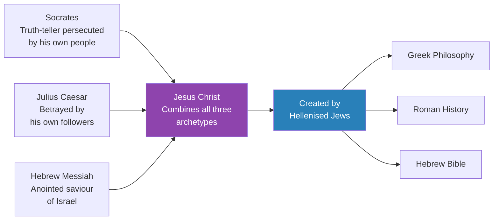
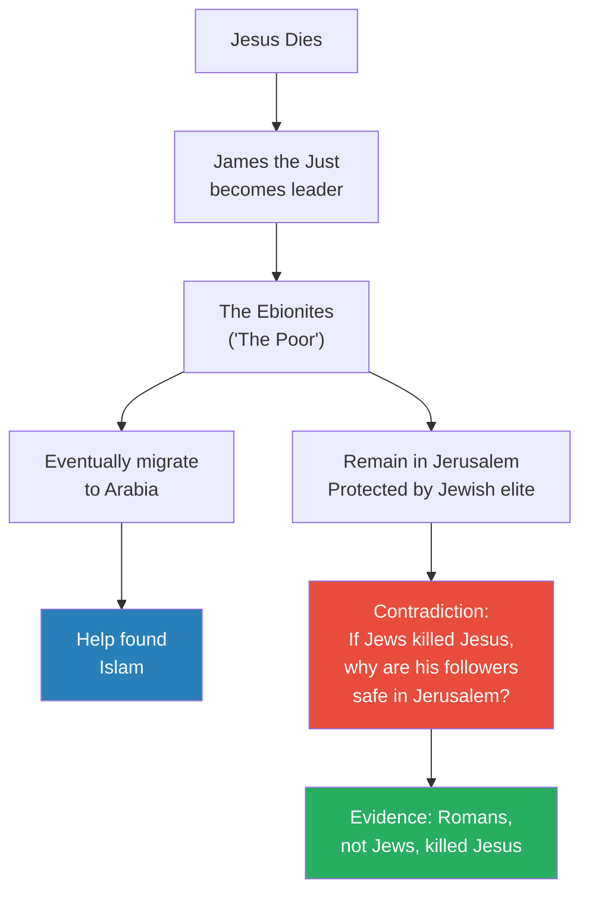
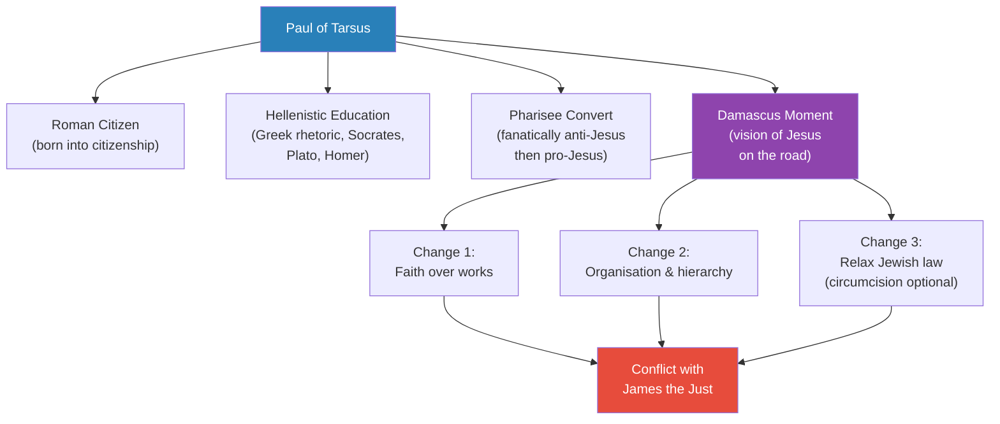
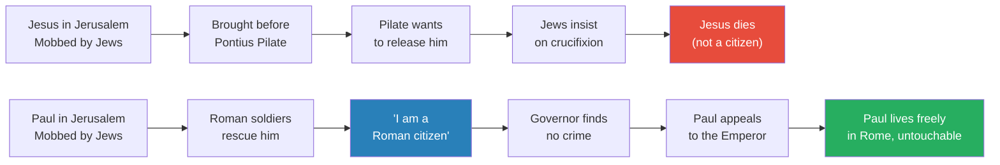
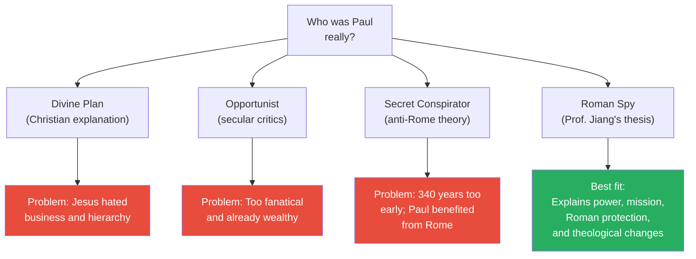
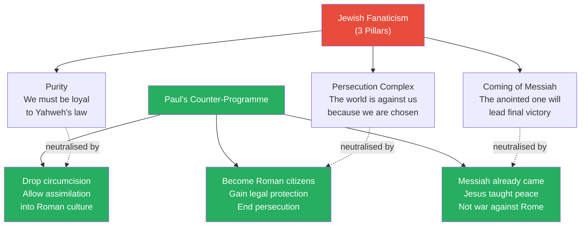

# Paul of Tarsus, Messiah of Rome

> Prof. Jiang picks up from the previous lecture's central paradox — that what Jesus believed is radically different from what Christianity teaches about Jesus — and asks the obvious next question: how did we get from one to the other? The answer is a single man, Paul of Tarsus, a wealthy Hellenised Jewish Roman citizen who never met Jesus, rarely quoted him, and fundamentally altered his message. After a close reading of the Acts of the Apostles that reveals Paul's extraordinary political power and Roman protection, Prof. Jiang advances a provocative thesis: Paul was likely a Roman agent whose mission was to neutralise Jewish fanaticism by transforming a revolutionary Jewish sect into a universalist religion compatible with empire.

---

## Overview: Key Highlights

- <b style="color: #27ae60">Paul, not Jesus, is the real founder of Christianity</b> — Christianity is a religion about Jesus, not by Jesus, and Paul authored roughly a third of the New Testament
- <b style="color: #e74c3c">Paul's message contradicts Jesus's teachings</b> — Jesus taught salvation through good works and inner spiritual truth; Paul taught salvation through faith in Jesus alone
- <b style="color: #2980b9">Three layers of Jesus's teaching</b> — public (generosity, mercy), inner (renounce worldly possessions), secret (this world is false, the divine spark connects us to the monad)
- <b style="color: #27ae60">The Jesus story deliberately echoes Socrates and Julius Caesar</b> — persecuted truth-teller + betrayed leader, requiring knowledge of Greek, Roman, and Hebrew traditions to construct
- <b style="color: #2980b9">Hellenised Jews</b> — individuals with access to all three knowledge systems (Hebrew Bible, Greek philosophy, Roman history) who could create this synthesis
- <b style="color: #e74c3c">James the Just and the Ebionites remained in Jerusalem after Jesus's death</b> — contradicting the Bible's claim that Jews killed Jesus, since his followers were protected by the Jewish elite
- <b style="color: #2980b9">The Damascus moment</b> — Paul's conversion on the road to Damascus, now a famous English metaphor for sudden belief change
- <b style="color: #27ae60">Paul's three revolutionary changes</b> — faith over works, organisational hierarchy, and relaxation of Jewish law (especially circumcision)
- <b style="color: #e74c3c">Three pillars of Jewish fanaticism</b> — purity, persecution complex, and the coming Messiah — all of which Paul's theology systematically neutralised
- <b style="color: #2980b9">Paul as Roman spy</b> — Prof. Jiang's own thesis: Paul's mission was to defuse Jewish revolutionary energy by transforming Judaism into a universalist, Rome-compatible religion
- <b style="color: #27ae60">Paul believed he himself was the true Messiah</b> — not in the theological sense, but as the saviour who would rescue his people by adapting them to Roman reality
- <b style="color: #e74c3c">Paul's legacy redefined faith itself</b> — faith shifted from experience to belief, miracles were invented to explain contradictions, and tradition replaced scripture

| Concept | One-line summary |
|---------|-----------------|
| **Hellenised Jews** | Jews educated in Greek rhetoric and living in the Roman Empire — possessing all three major knowledge systems |
| **Ebionites** | Jesus's original followers led by James the Just, committed to poverty — ancestors of Islam |
| **The Damascus moment** | Paul's sudden conversion on the road to Damascus — a metaphor for radical belief change |
| **Apostle to the Gentiles** | Paul's self-appointed title — he opened the religion to non-Jews by relaxing Jewish law |
| **Franchise model** | Prof. Jiang's analogy: Paul was to Jesus what Ray Kroc was to the McDonald brothers — a salesman who scaled a product the creator never intended to sell |
| **Jewish fanaticism (3 pillars)** | Purity, persecution complex, and messianic expectation — the triple foundation of Jewish resistance to empire |
| **Circumcision as identity marker** | The covenant between Abraham and Yahweh that separated Jews from Greeks — central to the gymnasium problem |
| **Acts of the Apostles** | The biblical book that continues Jesus's story through Paul — written 50-60 years after Jesus's death, extremely pro-Paul |
| **Faith vs. works** | Paul's radical shift: salvation comes through belief in Jesus, not through good deeds — reversing Jesus's own teaching |
| **Roman citizenship** | Acquired by birth, military service, or imperial favour — Paul's citizenship gave him legal immunity and access to the emperor |

---

# The Lecture

## Review: The Two Jesuses [0:00 - 5:00]

*Prof. Jiang opens by revisiting the central paradox from the previous lecture — that the historical Jesus and the biblical Jesus teach fundamentally different things — and frames today's driving question: how did Christianity travel from one worldview to the other?*

*The two Jesuses side by side — the teacher of inner spiritual truth (left) versus the divine saviour of biblical Christianity (right). Prof. Jiang's question: how did we get from one to the other?*

> [!note]- Expand: Full Lecture Detail
> Prof. Jiang reviews the three tiers of Jesus's actual teaching:
>
> - **Public layer:** generosity, mercy, focusing on being a good and kind person
> - **Inner layer:** demands total renunciation — "if you're rich, if you want to follow him, then you must abandon all your wealth"
> - **Secret layer:** this material world is false, controlled by a malevolent force; the divine spark within connects us to the <b style="color: #2980b9">monad</b> (the One, the true reality)
>
> Prof. Jiang recounts Jesus's central metaphor: <b style="color: #e74c3c">the pursuit of wealth is like drinking salt water</b> — "the more you drink, the more thirsty you become, and you feel it's because you have not drunk enough. So you drink more and more salt water, and eventually you will poison yourself." The rich deserve compassion, not envy, because they are "the ones who are most misguided and deluded."
>
> He emphasises that Jesus's teachings are "no different from Buddhist teachings or Hindu teachings or Zoroastrian teachings" — all major religions are aligned in this belief.
>
> Then he presents the biblical Jesus: Son of God, the original sin narrative, the crucifixion as atonement, the resurrection, and the promise of the Second Coming. He notes the contradictions: "If Jesus is a son of God, then what is God's role in this? And how does a son of God, a God, actually die on Earth? And why does he have to die first before he can return again?"
>
> The question is now set: "How did we get from here to here?"

---

## The Cleverness of the Jesus Story [5:00 - 10:00]

*Prof. Jiang reveals how the biblical narrative of Jesus's persecution and betrayal was deliberately constructed to echo the two most famous individuals in world history — Socrates and Julius Caesar — and identifies the only group of people who possessed all three knowledge systems needed to create this synthesis.*

> [!tip] Core Insight
> The Jesus story is a literary construction that fuses three traditions: a truth-teller persecuted by his own people (Socrates), a leader betrayed by his closest followers (Julius Caesar), and a messiah fulfilling Hebrew prophecy. Only Hellenised Jews in the Roman Empire had access to all three.

*The Jesus narrative is a triple synthesis — requiring mastery of Greek philosophy (Socrates as archetype), Roman history (Caesar's betrayal), and Hebrew scripture (messianic prophecy). Only Hellenised Jews had all three.*

> [!note]- Expand: Full Lecture Detail
> Prof. Jiang draws attention to the biblical structure of Jesus's death:
>
> - Jesus gets into trouble in Jerusalem after building a following in the provinces
> - The Jewish religious elite rally the people against him
> - He is betrayed by Judas Iscariot, one of his own followers
> - The Jews bring Jesus before Pontius Pilate, the Roman governor
> - Pilate refuses to punish him at first, but the Jews insist
> - Pilate crucifies Jesus "to satisfy the will of the Jewish people"
>
> He then asks the class: "Who was also persecuted by his own people, which caused his death?" The students answer: <b style="color: #2980b9">Socrates</b>. Then: "Who else was betrayed by his own followers?" The answer: <b style="color: #2980b9">Julius Caesar</b>.
>
> "You see how clever this is. The two most famous individuals in world history at this point, Socrates and Julius Caesar, are brought into the story of Jesus, so that it conflates all three together. Jesus is Socrates is Julius Caesar."
>
> Prof. Jiang insists this fusion "can only be done if you have a very nuanced understanding of Greek history, Roman history, and the Jewish Bible." The only people who possessed all three sets of knowledge were <b style="color: #2980b9">Hellenised Jews in the Roman Empire</b> — Jews who grew up with a Greek education within the Roman imperial system.
>
> "And the major individual in the Bible who is a Hellenised Jew in the Roman Empire is named Paul, and he is credited with most of the writing of the New Testament — about a third of the New Testament — either is written by Paul, or it's about Paul."

---

## Paul, Not Jesus, Founded Christianity [10:00 - 10:45]

*Prof. Jiang states the thesis bluntly: Christianity is not a religion by Jesus — it is a religion about Jesus — and Paul is its real creator.*

> [!tip] Core Insight
> Christianity is not a religion by Jesus. It is a religion about Jesus. Paul created the theology, the organisation, and the narrative that turned a small Jewish sect into a world religion.

> [!note]- Expand: Full Lecture Detail
> Prof. Jiang frames the distinction sharply:
>
> - Jesus taught a philosophy of inner spiritual truth, compassion, and renunciation of worldly goods
> - Christianity teaches that Jesus is the Son of God who died to redeem humanity from original sin
> - These are "two very different worldviews"
> - Paul is credited with roughly a third of the New Testament — either directly authored by him or narrating his story
> - <b style="color: #27ae60">"Not Jesus, but Paul, is the real founder of Christianity"</b>

---

## James the Just and the Ebionites [10:45 - 12:00]

*Prof. Jiang introduces Jesus's brother James the Just, who led the movement after Jesus's death, and reveals a major biblical contradiction: if the Jews killed Jesus, why were his followers safe in Jerusalem?*

*The fate of Jesus's original followers — they remained in Jerusalem under Jewish protection, then migrated to Arabia where they influenced the founding of Islam. Their safety in Jerusalem is powerful evidence against the biblical claim that Jews killed Jesus.*

> [!note]- Expand: Full Lecture Detail
> After Jesus's death, his brother <b style="color: #2980b9">James the Just</b> becomes leader of his movement:
>
> - They are called "the poor" — <b style="color: #2980b9">Ebionites</b> — because they deny worldly goods and focus on spiritual life
> - They demand poverty of all followers, believing material reality is evil
> - They remain in Jerusalem — which means they are "being protected and honoured by the Jewish elite"
> - Prof. Jiang flags this as critical: "If the Jews killed Jesus, all his followers would have to leave Jerusalem. But after his death, they're all in Jerusalem."
> - This is "a major contradiction in the Bible" and evidence that <b style="color: #27ae60">it was the Romans, not the Jews, who killed Jesus</b>
> - The Ebionites will eventually leave Jerusalem and go to Arabia, "where they will help found the religion of Islam"

---

## Who Was Paul? [12:00 - 20:00]

*Prof. Jiang reconstructs Paul's biography from the Acts of the Apostles — a wealthy Roman citizen, Hellenistically educated, fanatical convert, self-appointed apostle — and traces his escalating conflict with James the Just over whether Christianity should remain Jewish or become universal.*

> [!tip] Core Insight
> Paul made three radical changes to the movement: salvation through faith in Jesus rather than good works, organisational hierarchy over egalitarianism, and relaxation of Jewish law to attract Gentiles. Each change moved Christianity further from Jesus's actual teachings and closer to a universalist religion compatible with Roman imperial culture.

*Paul's background gave him the tools, and his conversion gave him the mission — but his three radical changes to the religion put him on a collision course with Jesus's own brother.*

> [!note]- Expand: Full Lecture Detail
> Prof. Jiang notes we know very little about Paul's early life, but key facts emerge from the Bible:
>
> - He is from <b style="color: #2980b9">Tarsus</b>, part of the Jewish Diaspora
> - He is Jewish and a Roman citizen — "pretty rare for a Jewish person"
> - Roman citizenship comes through three paths: birth to citizens, twenty years of military service, or service to the emperor
> - Paul says "I'm born a Roman citizen, therefore my parents are citizens, which means his parents were very wealthy and part of the Roman elite"
> - He grew up secular, learning Greek rhetoric — "Socrates, Plato, Homer, all that"
> - He converts to become a <b style="color: #2980b9">Pharisee</b> and becomes fanatical — "if you convert, you actually become very fanatical"
> - As a Pharisee, he was "tasked with destroying the Jesus movement" — which Prof. Jiang flags as contradictory, since James and the followers are being protected by the Pharisees in Jerusalem
>
> Paul's conversion story:
>
> - He decides to go to Damascus to destroy the Jesus movement there
> - On the road, he sees a vision of Jesus saying "Paul, stop persecuting me and my people"
> - This is the <b style="color: #2980b9">Damascus moment</b> — "a very famous metaphor in English meaning to see the light and to change your opinion"
> - He becomes "a fanatical follower of Jesus, even though he's never met Jesus and he's never met the followers of Jesus — this is extremely weird"
>
> Paul's three revolutionary changes:
>
> - **Faith over works:** Jesus taught salvation through good works and compassion; <b style="color: #e74c3c">Paul teaches that belief in Jesus as saviour is what offers salvation — "the good works don't matter"</b>
> - **Organisation and hierarchy:** Jesus and his followers were egalitarian — no hierarchy, no structure; Paul insists "only if you have hierarchy and organisation and structure will you have the ability to fully promote Jesus's message"
> - **Relaxing Jewish law:** Many diaspora Jews were uncircumcised (Greek fathers, Jewish mothers); Paul says "if you're 20 years old, you're not circumcised, don't worry about it — what the law doesn't matter, what matters is your faith in Jesus"
>
> The conflict with James the Just escalates:
>
> - James hears reports that Paul is "telling people you don't have to follow Jewish law"
> - Paul writes back: "What matters is not the letter of the law but the spirit of the law"
> - Paul names himself <b style="color: #2980b9">"Apostle to the Gentiles"</b> — "I am liberating this religion for all. I am bringing this religion to everyone — Greek, Roman and Jew alike"
> - James spreads rumours about Paul; many of Paul's churches abandon him
> - Paul tries to bribe James with money
> - Paul argues: "Just because you're Jesus's brother doesn't mean you know what he actually says — because Jesus talked to me, man, Jesus came to me in a vision, therefore I'm the one who really understands Jesus"

---

## Paul in Jerusalem and Rome [20:36 - 28:40]

*Prof. Jiang performs a close reading of the Acts of the Apostles, revealing how the text parallels Paul's persecution with Jesus's — with one critical difference: Paul is a Roman citizen, and that distinction saves his life. The final passages of Acts reveal a man with extraordinary, unexplained political power.*

*The parallel narratives of Jesus and Paul in Jerusalem — identical structure, opposite outcomes. The variable that determines life or death is Roman citizenship.*

> [!note]- Expand: Full Lecture Detail
> Paul goes to Jerusalem to settle the conflict with James:
>
> - At first the meeting goes well, but then people who hate Paul recognise him
> - A mob forms — "they want to kill this guy"
> - Prof. Jiang notes the narrative is "very similar to the Jesus story, where Jesus is being mobbed by Jews"
> - The critical difference: <b style="color: #27ae60">"Paul tells the Roman soldiers, 'I am a Roman citizen.' And the soldiers are like, 'Oh, wow. Okay, then we must protect you.'"</b>
> - The Roman governor finds no crime but cannot release Paul because of the mob
> - Paul invokes his right as a citizen: "Let me talk to the Roman emperor"
> - The governor must comply — "You, as a Roman citizen, have the right to talk to the Roman emperor"
>
> Prof. Jiang draws the explicit moral: "If Jesus were a Roman citizen, he could preach all he wants. But he wasn't, and therefore he was killed."
>
> He then reads the ending of Acts of the Apostles aloud, flagging each anomaly:
>
> > [!quote] Acts of the Apostles
> > "Paul was allowed to live by himself with a soldier who was guarding him."
>
> - Prof. Jiang: "Paul is a criminal. The Jews are accusing Paul of violating their laws... but this is what the Bible says — Paul was allowed to live by himself. He was being guarded by a soldier who was protecting him. That's a contradiction."
>
> The next passage is even stranger:
>
> - "Three days later, he called together the local leaders of the Jews" — Prof. Jiang is incredulous: "From the perspective of Jews, he is a criminal. He's asking people to break the laws of Moses. What's going on here?"
> - Paul tells the Jewish leaders: "I had done nothing against our people" — which Prof. Jiang notes is a direct lie given that he abolished circumcision
> - Paul then makes a veiled threat: he could go to the Emperor and accuse the Jews of attacking a Roman citizen
> - "What Paul is saying is: if you mess with me, I'm going direct to the Emperor and accuse you of attacking a Roman citizen"
>
> > [!example] Paul's Power Play in Rome
> > - Paul arrives in Rome as a prisoner, supposedly to be judged by the Emperor
> > - Instead of being jailed, he is allowed to live freely with a personal guard
> > - He summons the Jewish leaders of Rome to his house — despite being the one accused
> > - He tells them he has done nothing wrong — despite openly violating circumcision laws
> > - He threatens to accuse them before the Emperor if they interfere with him
> > - The Jewish leaders leave him alone; some even convert
> > - He lives in Rome for two years "at his own expense" — clearly very wealthy
> > - He preaches "with all boldness and without hindrance" — no one can touch him
> > **The lesson:** The ending of Acts reveals a man with political power and imperial protection that far exceeds anything a mere religious convert should possess.

---

## Four Explanations for Paul [28:41 - 49:06]

*Prof. Jiang evaluates four theories for who Paul really was and what drove him — the divine plan, the opportunist, the secret conspirator, and the Roman spy — rejecting the first three and making his own case for the fourth.*

*Four theories evaluated — only the spy thesis accounts for Paul's unexplained political power, his systematic neutralisation of Jewish fanaticism, and the Roman Empire's consistent protection of him.*

> [!note]- Expand: Full Lecture Detail
> Prof. Jiang lists the anomalies that any explanation must account for:
>
> - Who is this man with so much power and money that no one can touch him?
> - Why does he convert? His conversion story is strange — after Jesus speaks to him, Jesus disappears from the story, and Paul rarely quotes Jesus
> - Paul's message is fundamentally different from Jesus's — Jesus taught inner salvation through good works; Paul taught damnation for anyone who does not believe in Jesus, including all Buddhists, Hindus, and Zoroastrians
> - Why is Paul focused on organisation rather than spiritual truth?
> - Why do the Romans consistently protect him from the Jews?
>
> **Theory 1 — The Divine Plan (Christian explanation):**
>
> - Jesus brought truth; Paul created the structure to spread it
> - Prof. Jiang draws the <b style="color: #2980b9">McDonald's analogy</b>: the McDonald brothers had an amazing restaurant in 1950s California; Ray Kroc visited, saw the potential, and convinced people across America to open franchises by promising the American dream
> - "Paul said to everyone, if you believe in Jesus, you will achieve salvation" — same salesmanship as Kroc promising wealth
> - <b style="color: #e74c3c">Problem: "Jesus was not selling hamburgers. In fact, Jesus hated hamburgers."</b> Jesus's central message was that wealth, business, and hierarchy are wrong — the very things Paul was building
> - "Jesus didn't want a business manager, and Jesus believed that it was our own individual responsibility to discover our own truths"
>
> **Theory 2 — The Opportunist:**
>
> - Paul saw that Jesus had "gone viral" and wanted to monetise the movement
> - <b style="color: #e74c3c">Problem:</b> Paul worked too hard — he travelled the entire Roman Empire fanatically spreading the message; "opportunists are not fanatical, they're kind of lazy"
> - He was already wealthy as a Roman citizen and didn't need the money
> - He was highly educated and didn't want to deal with uneducated people like James the Just — so why was he doing it?
>
> **Theory 3 — The Secret Conspirator:**
>
> - Paul and his supporters hated Rome and believed Christianity would destroy the empire
> - <b style="color: #e74c3c">Problem:</b> Christianity's triumph over Rome was 340 years in the future — how could Paul know?
> - Paul was a beneficiary of the Roman Empire: wealthy, protected, privileged
>
> **Theory 4 — The Roman Spy (Prof. Jiang's thesis):**
>
> Prof. Jiang provides the historical context:
>
> - Jews had always been a problem for empires because they refused the authority of pagan rulers
> - The <b style="color: #2980b9">Maccabean Revolt</b> (167-160 BCE) against the Seleucid Empire lasted seven years
> - Three Jewish-Roman wars: 66-73 CE (the temple destroyed, Jews banned from Jerusalem), 115-117 CE, and 132-136 CE
> - "The Jews are fanatical. That's what gives the Jews power."
>
> > [!example] Rome Understands Fanaticism — The Lesson of Cannae
> > - In 216 BCE, Hannibal invades Italy and destroys all Roman armies at the Battle of Cannae
> > - He kills at least 20% of the Roman adult male population and a third of the Senate
> > - The Romans should have surrendered and sued for peace
> > - Instead, they refused — their own fanaticism eventually allowed them to destroy Carthage
> > - Now the Romans see the same fanaticism in the Jews: a poor, small province that refuses to submit
> > - The Romans understand, above all, how powerful fanaticism is — "it cannot be defeated"
> > - And because of the Jewish Diaspora, it can never be rooted out — "you can destroy Jerusalem, but there are Jews all around the world"
> > **The lesson:** Rome recognised in Jewish fanaticism the same unstoppable force that had built their own empire. They knew military conquest alone could not extinguish it.

---

## The Three Pillars of Jewish Fanaticism [40:08 - 49:06]

*Prof. Jiang identifies the three beliefs underpinning Jewish resistance to empire — purity, persecution complex, and messianic expectation — and shows how Paul's theological innovations systematically neutralised each one.*

*Paul's theology as a point-by-point neutralisation of Jewish fanaticism. Each of the three pillars that made the Jews "almost invincible" is systematically defused by a corresponding Pauline innovation.*

> [!note]- Expand: Full Lecture Detail
> Prof. Jiang identifies three central beliefs underlying Jewish fanaticism:
>
> **Pillar 1 — Purity:**
>
> - Why are the Jews, God's chosen people, always being pushed around by larger empires?
> - The answer: "Because we Jews have not been pure enough. We have not been loyal enough to Yahweh."
> - Only through absolute purity and obedience to the Law of Moses will Jews triumph
> - The Jews most hated were assimilated Jews like Paul — "traitors to the nation of Israel"
>
> **Pillar 2 — Persecution Complex:**
>
> - "The entire world is against us because we are God's chosen people"
> - Therefore Jews must "stand united and stay pure"
>
> **Pillar 3 — The Coming of the Messiah:**
>
> - All current suffering is part of the divine plan — "testing us, making us strong"
> - <b style="color: #2980b9">"The Messiah, the Anointed One, will come from heaven and lead us into a final battle against all enemies, the Roman Empire, and we will destroy them"</b>
> - Then the Kingdom of Heaven will be established on Earth
>
> Prof. Jiang: these beliefs make the Jews "almost invincible, because it makes them fearless. They're not afraid to die. Dying is part of the divine plan."
>
> **Paul's counter-programme:**
>
> - **Against purity:** Paul says circumcision is unnecessary — this is not just theological but practical. Prof. Jiang explains the <b style="color: #2980b9">gymnasium problem</b>: in most cities, the gymnasium was "the heart and centre of life in the community" where men exercised naked. Circumcised men were immediately identified and ridiculed, making it "hard for the Jews to associate with the Greeks." Dropping circumcision allowed Jews to assimilate into surrounding culture
> - **Against persecution complex:** Paul's own story demonstrates the solution — become a Roman citizen. "Why did Jesus get persecuted? Because he was not a Roman citizen. If he were a Roman citizen, then Pontius Pilate would have protected him." Roman citizenship ends persecution
> - **Against the Messiah:** Paul declares the Messiah has already come — it was Jesus, and Jesus taught a message of peace, not war against Rome. "If you want to be saved, you must believe that we are born evil, and Jesus has come to cleanse us of our evil"
>
> Prof. Jiang is careful to note that Paul's target audience was not fanatical Jews — they would never accept this: "His message was for diaspora Jews like him, who were stuck between the Roman Empire and the Jewish faith — maybe their fathers were Greek and their mothers were Jewish."
>
> Then Prof. Jiang offers what he considers the deepest insight about Paul:
>
> - "I don't want to say Paul is an opportunist or he's evil. I believe he was also a believer in his mission."
> - His mission was to save his people by adapting them to Roman reality — "you can't wait for the Messiah to come save you; you have to save yourself"
> - <b style="color: #27ae60">"What's odd about Paul is he teaches us that Jesus is the Messiah, but in his heart, and you can tell by his writings, he himself believes he's really the Messiah who has come to save his people"</b>

---

## Paul's Revolution of Faith [49:07 - 51:03]

*Prof. Jiang traces the theological consequences of Paul's work — how his need to paper over contradictions in the biblical narrative led to radical changes in the very concept of faith, the invention of miracles, and the elevation of church tradition above scripture.*

> [!note]- Expand: Full Lecture Detail
> Because "the story of Jesus doesn't really make any sense, and his story doesn't make any sense either" — Paul is forced to introduce new concepts:
>
> - **Faith redefined:** Before Paul, faith was <b style="color: #2980b9">experiential</b> — something you personally encountered and knew to be true. Paul transforms faith into <b style="color: #e74c3c">belief</b> — something you must accept without evidence
> - **Miracles invented:** "If something cannot be explained, it's because it's a miracle." This concept "didn't really exist before" — it was created specifically to explain the contradictions and inconsistencies in the biblical story
> - **Tradition over scripture:** "The stories, interpretation of the Bible is now more important than the Bible itself." Paul's church — which will become the <b style="color: #2980b9">Catholic Church</b> — eventually bans ordinary believers from reading the Bible: "Only priests are allowed to read the Bible, because the fear is, if you read the Bible, you might misinterpret the Word of God"

---

## Who Wrote the Acts of the Apostles? [52:19 - 54:46]

*A student asks about authorship. Prof. Jiang explains that Acts was written by the same person who wrote the Gospel of Luke, around 80-90 CE, and that the text is essentially pro-Paul propaganda written at a time when Paul was widely hated.*

> [!note]- Expand: Full Lecture Detail
> Prof. Jiang addresses a student's question about authorship:
>
> - We don't know who wrote Acts, but we know it was the same person who wrote the <b style="color: #2980b9">Gospel of Luke</b> — Acts is "the continuation of the story of Jesus found in Luke"
> - Luke was written around 80-90 CE — about 50-60 years after Jesus's death
> - Paul might still be alive at this time
> - Acts is "very pro-Paul" — it was written to promote a positive image of Paul
> - "At this point in history, there are a lot of people, especially Jews, who hate Paul. They feel that Paul has corrupted their religion, especially the teachings of Jesus"
> - Prof. Jiang believes "it's an open secret that he's working very closely with the Roman Empire. He's either collaborator or he's a spy"
> - Acts was written to "apologise or to clean up the image of Paul"
> - He draws a parallel: "The Bible started out as an apology for King David" — the same literary tradition of image rehabilitation
>
> > [!quote] Prof. Jiang
> > "What we're showing you is that through close reading, you can see how problematic it is."

---

## Preview: The Monotheistic Revolution [54:47]

*Prof. Jiang closes with a preview: next class will address monotheism — not merely as belief in one God, but as "a radical reconception of reality."*

> [!note]- Expand: Full Lecture Detail
> - Next lecture will cover the coming of monotheism
> - Prof. Jiang challenges the standard definition: "Many scholars believe that monotheism means belief in one God. What I will show you next class is monotheism is a radical reconception of reality"

---

## Connections

**Builds on:** [[24 - Resurrecting the Gnostic Jesus]] (the central paradox — Jesus's actual teachings vs. biblical Christianity; the three-tiered teaching structure; Jesus's Gnostic philosophy of the divine spark and the false material world). Also draws on [[10 - The Trial of Socrates and Plato's Allegory of the Cave]] (Socrates as archetype of the truth-teller persecuted by his own people — Prof. Jiang explicitly links Jesus's persecution to the Socratic template). Connects to [[23 - Cyrus the Great as Messiah]] (the concept of the Messiah and its political dimensions in Jewish thought).

**Sets up:** [[26 - Constantine's Monotheistic Revolution]] (Prof. Jiang previews that monotheism is "a radical reconception of reality," not merely belief in one God — Paul's universalist theology makes Constantine's adoption of Christianity politically possible). The Ebionites' migration to Arabia directly sets up [[28 - Muhammad's Revolution of God]] (Islam's connection to Jesus's original followers).

**Recurring themes:**
- **Debunking traditional narratives** — Paul as divine instrument vs. Paul as Roman agent; the Bible as propaganda document requiring close reading
- **Close reading as methodology** — the anomalies in Acts of the Apostles reveal what the text is trying to hide
- **Religion as political technology** — Paul transforms a spiritual movement into an organisational weapon that serves imperial interests
- **Fanaticism as ultimate weapon** — Jewish fanaticism mirrors Roman fanaticism at Cannae; both are "undefeatable" through conventional means
- **Father-Son archetype (inverted)** — Paul is the "son" who takes over the "father's" (Jesus's) legacy and transforms it beyond recognition

**Related books in vault:**
- [[Sapiens - Yuval Noah Harari]] — Harari's treatment of the spread of universal religions as imperial unifiers; Paul as the mechanism by which Christianity became exportable beyond ethnic Judaism
- [[The 48 Laws of Power - Robert Greene]] — Paul's political manoeuvring echoes multiple laws: using others' work as your own, controlling the options, appearing as a friend while working as a spy

---

## The Takeaway

This lecture recasts one of history's most consequential figures. Paul is traditionally understood as Christianity's greatest evangelist — the man who spread Jesus's message to the world. Prof. Jiang inverts this: Paul did not spread Jesus's message. He replaced it. Jesus taught that the kingdom of God is within, accessible through compassion and the renunciation of worldly things. Paul taught that the kingdom of God is accessible only through belief in Jesus as divine saviour — a belief that conveniently required no challenge to Roman authority, no rejection of wealth, and no spiritual transformation. The religion Paul built was perfectly designed for empire: hierarchical, organisationally scalable, and doctrinally compatible with Roman citizenship.

The most striking insight is the structural one. Prof. Jiang shows that Paul's theology was not random — it was a precise counter-programme targeting the three pillars of Jewish fanaticism. Purity was neutralised by dropping circumcision. Persecution was neutralised by encouraging Roman citizenship. Messianic expectation was neutralised by declaring the Messiah had already come and taught peace. Whether or not Paul was literally a Roman spy, his programme functioned exactly as one a spy would design. The close reading of Acts makes this difficult to dismiss: a man who was supposedly a prisoner living freely, summoning community leaders, threatening them with imperial authority, and preaching "without hindrance" for years.

The question Prof. Jiang leaves unresolved is the deepest: was Paul cynical or sincere? He argues for a paradox — Paul genuinely believed he was saving his people by adapting them to Roman reality, even as he destroyed the very teachings he claimed to champion. In his heart, Prof. Jiang suggests, Paul believed he was the real Messiah — not in the theological sense, but as the practical saviour who would rescue the Jewish people from their own fanaticism. The next lecture, on monotheism, will explore what this theological revolution ultimately produced: not just a new religion, but a new conception of reality itself.
