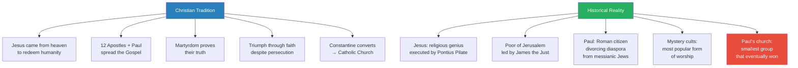
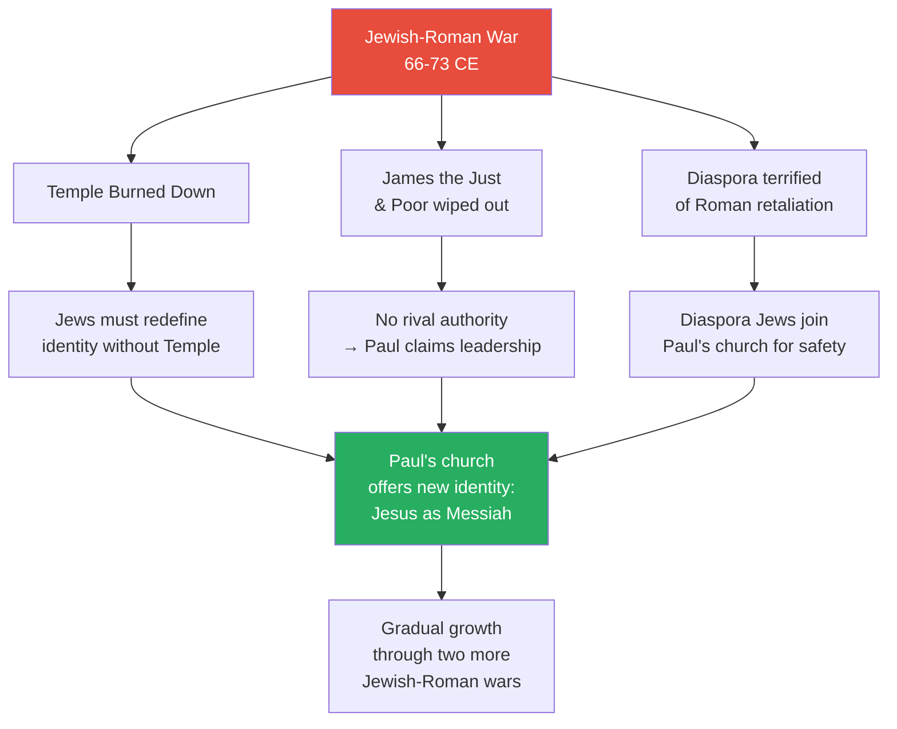
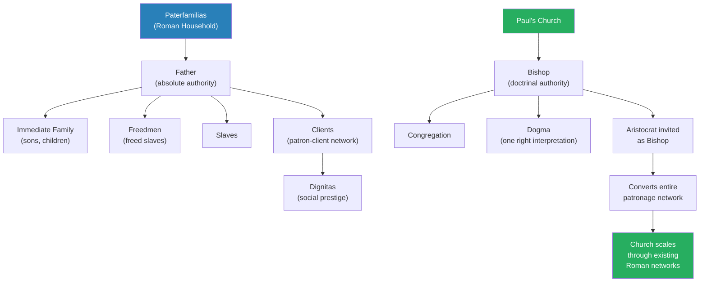
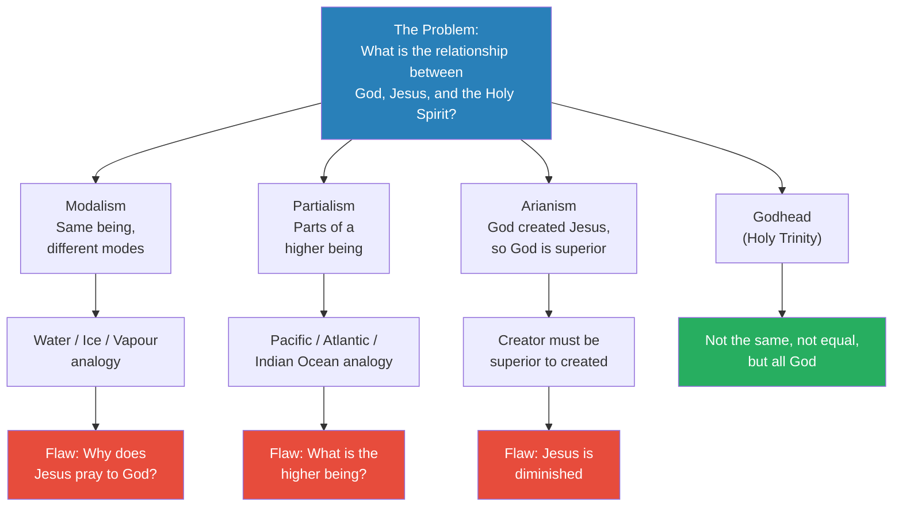
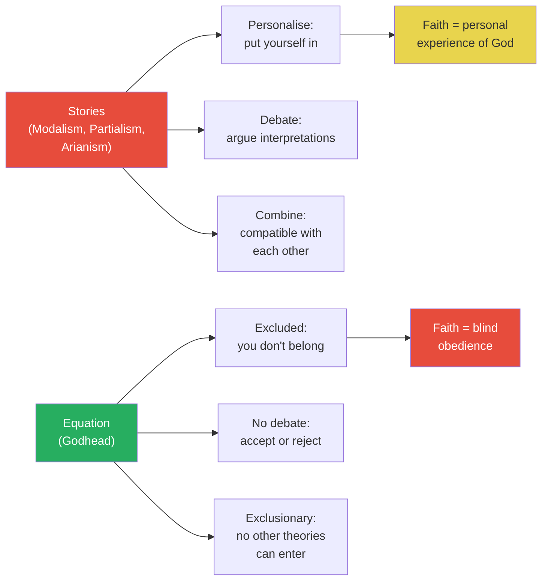
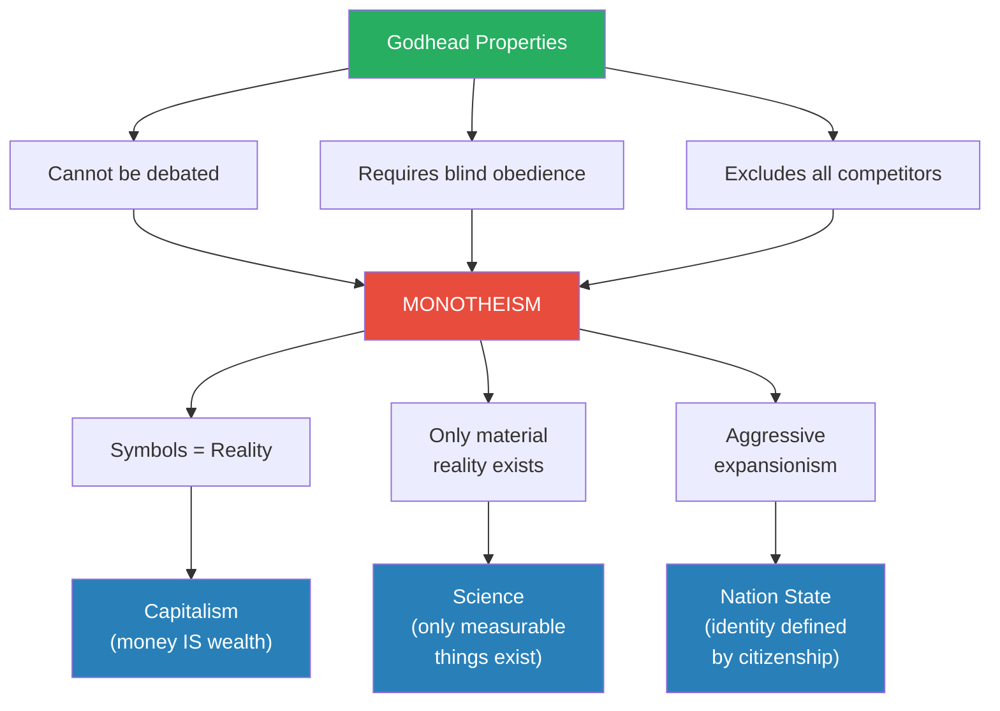
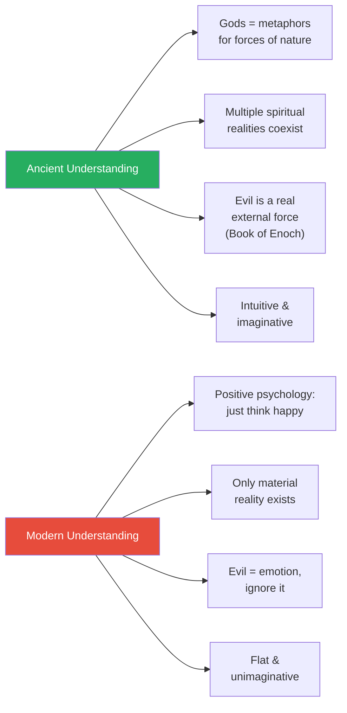
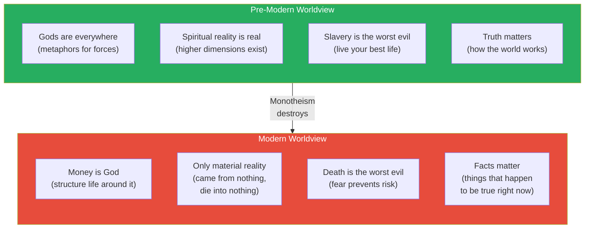

# Constantine's Monotheistic Revolution

> Prof. Jiang argues that the Council of Nicaea in 325 CE did not merely settle a theological dispute — it created a new kind of idea: monotheism. The Godhead (the Holy Trinity) was not chosen because it was the best explanation of God's nature but because it was an equation rather than a story — impossible to debate, requiring blind obedience, and excluding all competitors. This single intellectual move, Prof. Jiang claims, planted the seeds of the three defining institutions of modernity: capitalism, science, and the nation state. All three rest on the monotheistic principle that symbols are reality — that money is wealth, that only the material world exists, and that a nation defines who you are.

---

## Overview: Key Highlights

- <b style="color: #27ae60">Monotheism is the intellectual revolution that created modernity</b> — capitalism, science, and the nation state all descend from the Godhead's logic
- <b style="color: #2980b9">The Godhead (Holy Trinity)</b> — God, Jesus, and the Holy Spirit are not the same, not equal, but all God — an equation, not a story
- <b style="color: #e74c3c">The Godhead eliminates debate</b> — unlike Modalism, Partialism, and Arianism, it cannot be personalised, interpreted, or argued
- <b style="color: #27ae60">Symbols become reality under monotheism</b> — money does not represent wealth; money IS wealth, just as God is nothing and everything
- <b style="color: #2980b9">Council of Nicaea (325 CE)</b> — Constantine ordered all bishops to resolve the nature of God, producing the formula that became Christian orthodoxy
- <b style="color: #e74c3c">Faith shifts from experience to blind obedience</b> — before the Godhead, faith was personal encounter with God; after, it is memorising an equation
- <b style="color: #2980b9">Paterfamilias church structure</b> — Paul's church mirrored Rome's hierarchical household system, enabling aristocratic conversion of entire networks
- <b style="color: #27ae60">Constantine converted for political consolidation</b> — great kings always introduce new religions to unify their empires
- <b style="color: #e74c3c">Monotheism crowds out all other realities</b> — spiritual realities are destroyed, only the material remains, and dissent is forbidden
- <b style="color: #2980b9">The Book of Enoch</b> — banned by the Catholic Church because it showed evil tempting the powerful, a dangerous idea for those in power
- <b style="color: #e74c3c">Ancient civilisations were more sophisticated than us</b> — they understood gods as metaphors for forces of nature; we have lost that layered imagination
- <b style="color: #27ae60">Pre-modern people feared slavery, not death</b> — monotheism reversed this, making death the worst evil and turning everyone into slaves afraid to take risks

| Concept | One-line summary |
|---------|-----------------|
| **Godhead (Holy Trinity)** | God, Jesus, and Holy Spirit — not the same, not equal, but all God: an equation that ends debate |
| **Modalism** | God, Jesus, and Holy Spirit are the same being in different modes — like water, ice, and vapour |
| **Partialism** | God, Jesus, and Holy Spirit are parts of a higher being — like oceans within one global ocean |
| **Arianism** | God created Jesus, so God is superior — logical but rejected at Nicaea |
| **Orthodoxy** | "Right thinking" — the Catholic Church's mechanism for eliminating competing interpretations |
| **Paterfamilias** | Roman patriarchal household structure that Paul's church mirrored for scalability |
| **Dignitas** | Social prestige in Roman society, measured by how many clients obeyed you |
| **Monotheism** | One God and only one God — radical because it destroys all other realities and spiritual planes |
| **Symbols as reality** | The monotheistic principle: representations of reality become reality itself — money IS wealth |
| **Aggressive expansionism** | Monotheism must expand to become true — a self-fulfilling prophecy that drives religious wars |
| **Book of Enoch** | Banned text explaining evil's origin through fallen angels (Watchers) who tempted the powerful |
| **Ebionites** | The Poor of Jerusalem — Jesus's original followers who remained Jewish and later influenced Islam |

---

# The Lecture

## Review: The Christian Tradition vs. Historical Reality [0:00 - 5:00]

*Prof. Jiang opens with a rapid review of the previous lectures on Christianity — first the official Christian narrative (Jesus, the Apostles, martyrdom, triumph, Constantine, the Catholic Church), then the historical reconstruction he has built across the series. The gap between the two stories sets up the lecture's central question.*

*The Christian tradition tells a story of inevitable triumph through divine favour. The historical reality shows Paul's church was the smallest denomination — its victory requires a political explanation, not a theological one.*

> [!note]- Expand: Full Lecture Detail
> Prof. Jiang begins with the official Christian account:
>
> - Jesus came from heaven to redeem humanity, sacrificed himself, was resurrected, and told his 12 Apostles (plus Paul) to spread the Gospel
> - The Apostles went everywhere — India, the Levant, the wider Mediterranean — challenging pagan authority
> - They were all martyred, proving their sincerity: "You know that they were telling the truth because they were persecuted"
> - Their students became <b style="color: #2980b9">bishops</b>, heading the local churches the Apostles had established
> - Despite Roman persecution, their faith in God brought eventual triumph
> - Constantine became the first Christian emperor; a later emperor made Christianity the official religion
> - This created the <b style="color: #2980b9">Catholic Church</b> — "Catholic means universal or the one and only"
> - With the Catholic Church came <b style="color: #2980b9">orthodoxy</b> — "right thinking" — and the mission to combat heresy
>
> Prof. Jiang then pivots: "But as we discuss in our class, historically, that's not what happened."
>
> He reviews the historical reconstruction:
>
> - Jesus was a "religious genius" whose movement became <b style="color: #2980b9">Nazism</b> (Nazarene Judaism)
> - He was crucified by Pontius Pilate as a political gesture against the Jews — "a middle finger to the Jewish people"
> - His execution accidentally made him a national hero and martyr
> - His followers, the <b style="color: #2980b9">Poor of Jerusalem</b>, were led by his brother James the Just
>   - They saw themselves as a branch of Judaism, following the Law of Moses as Jesus interpreted it
>   - They would eventually become the <b style="color: #2980b9">Ebionites</b>, who spread to Arabia and helped develop Islam
> - Paul was a Roman citizen from the Jewish Diaspora who saw Jesus as an opportunity
>   - He wanted to divorce diaspora Jews from messianic nationalism that was provoking Roman retaliation
>   - His message: Jesus is the Messiah, but a prophet of peace, not war — believe in Jesus and assimilate into Rome
>   - <b style="color: #e74c3c">Most people refused to follow Paul — his was the smallest group</b>
> - Other groups included Gnostics and <b style="color: #2980b9">mystery cults</b>
>   - Mystery cults were the most popular form of worship: small secret groups focused on group devotion, oneness, egalitarianism
>   - They used psychedelics extensively to achieve spiritual experiences
>   - Many adopted Jesus because he could be "easily incorporated into a religion"

---

## Why Paul's Church Won [5:00 - 10:00]

*Prof. Jiang poses the central historical puzzle: Paul's church was the smallest of all early Christian groups, yet it eventually triumphed over the Ebionites, the Gnostics, and the mystery cults. Three events during the Jewish-Roman War (66-73 CE) explain why — and all three were lucky breaks for Paul.*

> [!tip] Core Insight
> Paul's church did not triumph because of superior theology or divine favour. It won because the Jewish-Roman War destroyed its competitors, terrified the diaspora into seeking a safe alternative, and left Paul as the last authority standing.

*Three consequences of a single war gave Paul's church the opening it needed. The destruction of the Temple removed the old definition of Jewish identity; the death of James removed rival authority; the terror of persecution drove diaspora Jews toward Paul's safer alternative.*

> [!note]- Expand: Full Lecture Detail
> Prof. Jiang frames the question sharply: "Why is it that Paul's Church, which was the smallest of all these different denominations of early Christianity — why would they triumph in the end?"
>
> He identifies three consequences of the Jewish-Roman War (66-73 CE):
>
> **1. The Temple was burned down:**
> - The Temple was the centre of Jewish religious worship — "the equivalent of Mecca today"
> - Diaspora Jews prayed in the direction of the Temple
> - With the Temple destroyed, Jews had to redefine what it meant to be Jewish
> - <b style="color: #27ae60">Paul already had a new definition: believe in Jesus as Messiah rather than make sacrifices at the Temple</b>
>
> **2. James the Just and his group were wiped out:**
> - The Poor of Jerusalem were targeted and largely extinguished during the war
> - James was the major authority figure — he was Jesus's brother
> - With James dead, "there's no more authority — therefore Paul can claim, as he does, to be the real authority"
>
> **3. The Diaspora was terrified:**
> - Jews across the empire feared Roman retaliation against them
> - Paul's church offered a way to "show their allegiance to the Romans but still maintain the Jewish identity"
> - An increasing number joined Paul's church as an escape mechanism
>
> Prof. Jiang notes this was just the first of three major Jewish-Roman wars: "Both wars, a lot of Jews would get killed, a lot would get enslaved, and this would drive more participation into Paul's Church."

---

## The Paterfamilias Structure [10:00 - 16:00]

*Prof. Jiang explains the second reason Paul's church scaled: it mirrored the social structure of the Roman Empire itself. The Roman household — the paterfamilias — was a miniature empire with a patriarch at the top, and Paul's church replicated this hierarchy with the bishop in place of the father. This made the church compatible with Roman aristocratic power networks.*

*Paul's genius was structural, not just theological. By making the church hierarchical rather than egalitarian, he made it compatible with Roman power — and when aristocrats joined, their entire networks converted with them.*

> [!note]- Expand: Full Lecture Detail
> Prof. Jiang explains the Roman social structure:
>
> - The <b style="color: #2980b9">paterfamilias</b> was the idea of patriarchy — "one man, the father, who's in charge of the entire household"
> - The household was "a small Empire unto itself":
>   - Immediate family (sons, children)
>   - Freedmen (slaves who had been freed to work in the household)
>   - Slaves
> - Beyond the household, Romans had <b style="color: #2980b9">clients</b> — people who depended on a patron
>   - "In Chinese, we call this a houtai" — a sponsor
>   - The goal was to have as many clients as possible
>   - This gave you <b style="color: #2980b9">dignitas</b> — social prestige: "The more clients you had, the more people who obeyed you, the more dignitas you had"
>
> Paul's church was modelled on this same hierarchy:
>
> - At the top was the <b style="color: #2980b9">bishop</b>
> - The bishop controlled <b style="color: #2980b9">dogma</b> — "how Jesus is to be understood"
> - <b style="color: #e74c3c">Most early Christians were egalitarian, which meant anyone could have their own interpretation of Jesus</b>
> - In Paul's hierarchical church, "only the bishop or the person in charge had the right interpretation, and you had to follow his interpretation"
> - This allowed the church to scale: one interpretation, enforced from the top, replicable across new churches
>
> The critical scaling mechanism:
>
> - Once a church reached a certain size, it invited a local aristocrat to become bishop
> - <b style="color: #27ae60">The aristocrat would then convert his entire patron-client network</b>
> - The aristocrat agreed because the church expanded his social network and political power
> - "The church became a mechanism for him to expand his social network and political power"
>
> Eventually, the church became powerful enough to challenge the Emperor:
>
> - "Throughout history, the nobility was always in conflict with the king, the Emperor"
> - The church gave nobility better organisational capacity
> - This provoked some local (not imperial) persecutions of Christians — power struggles, not religious persecution

---

## Constantine and the Birth of the Catholic Church [16:00 - 20:00]

*Prof. Jiang explains why Constantine converted: not out of faith, but because great kings always introduce new religions to consolidate power after civil wars. Constantine sponsored the Catholic Church and became its first head — then faced the problem of orthodoxy: with so many competing versions of Christianity, which one was correct?*

> [!tip] Core Insight
> Constantine's conversion follows a pattern repeated throughout history: King David introduced Judaism, Augustus introduced the imperial cult, and Constantine introduced Christianity. New religions are tools of political consolidation, not expressions of personal faith.

> [!note]- Expand: Full Lecture Detail
> Prof. Jiang places Constantine in a recurring historical pattern:
>
> - Constantine had fought "a very bitter civil war" to reclaim the throne
> - "As we know from our history, from our reading of history, <b style="color: #27ae60">great kings always want to introduce new religions to consolidate their authority</b>"
> - Examples:
>   - King David introduced Judaism
>   - Augustus introduced the imperial cult (the Ennead)
>   - Constantine introduced Christianity
> - Constantine wanted "a new religion to unify the Empire and to consolidate his authority"
> - He became the first head of the Catholic Church — "he was the first pope"
>
> But the Catholic Church immediately faced a problem: <b style="color: #2980b9">orthodoxy</b>
>
> - Throughout Christianity's history, there were "many divergent forms of Christianity"
> - The Catholic Church began "a process of eliminating all its competitors until it became the most dominant"
> - The fundamental problem underlying orthodoxy: <b style="color: #e74c3c">what is the relationship between God and Jesus?</b>
>   - "Who is Jesus really?"
>   - This was a fundamental problem then and "it still remains a fundamental problem today"
>   - There is also the Holy Spirit — "the expression of God on earth"
>   - "When God wants to do something on earth, for example, he wants to move this table — he does it through the Holy Spirit"

---

## Three Failed Theories of God's Nature [20:00 - 25:00]

*Prof. Jiang presents three theories that attempted to explain the relationship between God, Jesus, and the Holy Spirit — Modalism, Partialism, and Arianism. Each is logical and intuitive, each has a fatal flaw, and all three share one critical feature: they are stories, not equations.*

*Three intuitive theories — all rejected. The winning formula was chosen not because it made more sense but because it made no sense in a way that could not be argued with.*

> [!note]- Expand: Full Lecture Detail
> Prof. Jiang walks through each theory:
>
> **Modalism:**
> - God, Jesus, and the Holy Spirit are the same being in different modes
> - Metaphor: water — "if it's really cold, water becomes ice; if it's really hot, water becomes vapour"
> - Water, ice, and vapour are the same substance expressed differently at different times
> - <b style="color: #e74c3c">Problem: "If you actually read the Bible, you will see some passages where Jesus prays to God — doesn't make any sense, because why would you pray to yourself?"</b>
>
> **Partialism:**
> - God, Jesus, and the Holy Spirit are parts of a higher being
> - Metaphor: the ocean — "there's one ocean that covers the entire planet but there are different parts — the Pacific, the Atlantic, the Indian Ocean"
> - <b style="color: #e74c3c">Problem: "What is this higher being?" — it introduces a new mystery without solving the original one</b>
>
> **Arianism** (created by the teacher Arius):
> - "If God created Jesus, then God came before Jesus, which means God has to be superior to Jesus"
> - Jesus is still great, but God is the higher being
> - <b style="color: #e74c3c">Problem: it diminishes Jesus — "not great" as a foundation for a religion centred on Christ</b>
>
> Prof. Jiang notes: "There's this huge controversy as to the nature of God and the nature of Jesus."
>
> This controversy led to the <b style="color: #2980b9">Council of Nicaea</b> in 325 CE:
>
> - Constantine ordered all bishops of the Roman Empire to converge at Nicaea
> - The four major churches — Rome, Alexandria, Antioch, and Jerusalem — were all represented
> - Their task: figure out the nature of God, Jesus, and the Holy Spirit
>
> The solution — the <b style="color: #2980b9">Godhead (Holy Trinity)</b>:
>
> - "There are three beings — God, Holy Spirit, and Jesus"
> - "They are not the same thing — they're separate"
> - "They're not equal"
> - "But they're all God"
> - <b style="color: #27ae60">"Even today no one really can figure out" what this means — and that is precisely the point</b>

---

## Why the Godhead Won: Equation vs. Story [25:00 - 28:00]

*Prof. Jiang reveals the real reason the Godhead was chosen over Modalism, Partialism, and Arianism. The first three are stories — you can personalise them, debate them, interpret them differently. The Godhead is an equation — closed, impersonal, and impossible to argue with. This distinction is the hinge of the entire lecture.*

> [!tip] Core Insight
> The Godhead was chosen not because it explains God better but because it cannot be debated. Stories invite interpretation; equations demand acceptance. The shift from story to equation is the shift from experienced faith to blind obedience — and that shift created monotheism.

*The three stories (red) are open systems — you can enter them, argue about them, combine them. The equation (green) is a closed system — you are excluded, debate is impossible, and no competitor can coexist with it. This is why the Godhead won: not theological superiority, but political utility.*

> [!note]- Expand: Full Lecture Detail
> Prof. Jiang draws a sharp distinction between the three failed theories and the Godhead:
>
> "These first three theories — Modalism, Partialism, and Arianism — are really stories. The Godhead is an equation."
>
> He explains the difference:
>
> - **In a story:** "You can personalise it, you can put yourself in the story, and you can talk to God, and therefore you can interpret the story the way you want. And therefore you can argue about the story with others."
> - **In an equation:** "How do you put yourself into this equation? You don't belong anywhere. The system is closed off to you. You're excluded from it."
>
> Three advantages of the Godhead as equation:
>
> 1. <b style="color: #27ae60">No debate:</b> "You cannot debate anything because there's nothing to debate. You either accept it or you don't accept it. There's nothing in between."
>
> 2. <b style="color: #27ae60">Faith becomes blind obedience:</b> "Before we understood faith as something that you experience personally — you can talk to God, you can feel God. But with a Godhead, it's something that you have to believe." He compares it to mathematics: "When you go to math class, you're not asked to figure out why the proofs work. You have to just memorise the proofs."
>
> 3. <b style="color: #27ae60">Exclusionary:</b> "Modalism, Partialism, and Arianism — you can actually put them together. They're not contradicting each other. Whereas with this equation, it's exclusionary — you cannot put any other theories into it, and you cannot put this into any other theories."

---

## The Birth of Monotheism [28:00 - 32:00]

*Prof. Jiang synthesises the three properties of the Godhead — no debate, blind obedience, exclusionary — into a single, radical new idea: monotheism. He argues this is not merely "one God" (which existed before) but something entirely unprecedented: a system that makes symbols into reality, destroys alternative realities, and must expand aggressively to survive. From monotheism, he derives the three pillars of the modern world: capitalism, science, and the nation state.*

*The Godhead's three properties produce monotheism, which generates three principles, which in turn create the three institutions of modernity. Prof. Jiang traces a direct causal line from the Council of Nicaea to the world we live in today.*

> [!note]- Expand: Full Lecture Detail
> Prof. Jiang draws the three properties together:
>
> "Something that you have to accept, you cannot debate it. Something that forces your blind obedience. Something that is exclusionary. It creates a new idea in human history called <b style="color: #2980b9">monotheism</b>."
>
> He distinguishes this from earlier one-god religions:
>
> - "Before there were some religions with one God, but this one God would also interact with other gods, or this one God would create new gods"
> - <b style="color: #27ae60">Monotheism means "there's only one God and that's it" — no interaction, no creation, no alternatives</b>
> - "This is radical in human history"
>
> The only way to make the Godhead logically consistent, Prof. Jiang argues, is to accept one understanding of reality:
>
> - <b style="color: #27ae60">"God is nothing and everything"</b> — everywhere and nowhere at the same time
> - "God is all of reality"
> - This means "symbols become reality — the symbols of reality, the representation of reality, becomes conflated into reality itself"
>
> From this principle, three new ideas emerge:
>
> **Capitalism:**
> - "What is the underlying basis of capitalism? Money."
> - Ancient wealth was based on gold — beautiful, hard to obtain, rare
> - Modern wealth is based on paper money the government prints at will
> - "Why do we think money is valuable? Because we believe money is God — because money is nothing and everything, because the symbols have become reality"
>
> **Science:**
> - "Science only concerns itself with the material reality — if you can't see it, it doesn't exist"
> - <b style="color: #e74c3c">Science refuses to engage with hard questions: "What is thought? What is consciousness?"</b>
> - "A human being is just the sum of biological parts — your brain and your head and your eyes and your arms put together, because that's what we can measure"
>
> **The Nation State:**
> - "Who are you? You are a Chinese citizen"
> - Before, people saw themselves as members of a community — potentially a global community
> - "You could have many identities. But now, if you're a Chinese citizen, you're not an American citizen, because you're in competition with each other"

---

## The Three Consequences of Monotheism [32:00 - 39:00]

*Prof. Jiang explains why we believe in money, why science avoids consciousness, and why monotheism must expand violently. He identifies three mechanisms through which monotheism reshaped reality: symbols replacing reality, the destruction of spiritual realities, and aggressive expansionism that punishes dissent.*

> [!note]- Expand: Full Lecture Detail
> Prof. Jiang asks: "Why do we believe this crap? Why do we believe money is God?"
>
> He answers with three mechanisms of monotheism:
>
> **1. Symbols become reality:**
> - "Money does not represent wealth — money IS wealth"
> - The government can print as much money as it wants, yet we trust it has value
> - If someone from 1000 years ago asked us why paper money is valuable, we could not give a coherent answer
> - <b style="color: #27ae60">"The symbols have become reality"</b>
>
> **2. Monotheism crowds out other realities:**
> - "Before in human history, we believed there are many realities — there were many spiritual realities"
> - In those realities, money did not matter
> - "Now with monotheism, we've destroyed those other realities — only the material reality exists"
>
> **3. Aggressive expansionism:**
> - "For monotheism to work, it has to expand until it becomes true — it's a self-fulfilling prophecy"
> - <b style="color: #e74c3c">"Not only will it expand, but it has to destroy those who criticise it"</b>
> - "You are not ever allowed to ask the question: what if money has no value because the government can print as much money as it wants?"
> - "You are not allowed to think of this question. You're not allowed to imagine the possibility of this question."
> - "That's why the two major monotheistic religions of our time, Christianity and Islam, are so violent — they're the source of most major wars throughout human history"

---

## Ancient Sophistication vs. Modern Poverty [39:00 - 46:00]

*Prof. Jiang argues that ancient civilisations understood reality more deeply than we do — they knew their gods were metaphors for forces of nature, and they grappled seriously with evil. Monotheism destroyed this layered understanding by collapsing all realities into one material plane and banning questions about evil.*

*Prof. Jiang inverts the standard narrative of progress: ancient people were more sophisticated because they could imagine themselves living in multiple realities simultaneously. Modern people are impoverished because monotheism destroyed every reality except the material one.*

> [!note]- Expand: Full Lecture Detail
> Prof. Jiang challenges the assumption that ancients were superstitious:
>
> - "You're taught in school that we are so much more sophisticated than ancient civilisations because they had superstitious beliefs — like gods — that obviously don't exist"
> - <b style="color: #27ae60">"If you go back to these societies and analyse thoroughly how they understood Apollo and Athena, you would understand that they didn't actually believe these gods existed"</b>
> - "They believed these gods were metaphors and symbols for forces in nature that could influence our lives"
>
> > [!example] Gods as Metaphors for Forces of Nature
> > - Hatred and vengeance became manifested in gods like Strife and Nemesis
> > - The ancients believed these forces were so powerful that humans could not really control them
> > - Therefore, they had to be conscious of these forces and learn to manage them
> > - Today, we believe hatred and vengeance "don't really exist — they're just states of mind, just emotions"
> > - We believe "you can just pretend they don't exist, and then you're fine"
> > - Prof. Jiang: "The word we use for this is positive psychology — the dumbest idea in the world"
> > **The lesson:** Ancient people treated dangerous psychological forces as external realities demanding respect and management. Modern people dismiss them as emotions to be overridden by willpower — and are worse off for it.
>
> Prof. Jiang then turns to the question of evil, introducing the <b style="color: #2980b9">Book of Enoch</b>:
>
> - After God created the world, His angels (the Watchers) saw humans and thought them stupid and evil
> - They came down to manage humanity but lusted after human women
> - Their children were the <b style="color: #2980b9">Nephilim</b> — giants whom humans worshipped as gods
>   - "Remember the Epic of Gilgamesh? Gilgamesh was a Nephilim"
> - The Nephilim grew greedy and began devouring humans and fighting amongst themselves
> - God sent a flood to destroy them, but because they were born of angels, they were immortal
> - They became evil spirits roaming the Earth, creating chaos
> - King Solomon captured them with a ring, but they tempted him with a beautiful woman
>   - "To have sex with me, you must worship my god" — Solomon agreed and fell under their control
>
> <b style="color: #e74c3c">The Catholic Church banned the Book of Enoch:</b>
>
> - "If you're a powerful person, you don't want ordinary people thinking that you can be tempted by evil"
> - Evil spirits target the powerful because they love power — they are the easiest to tempt
> - "Today we're not allowed to ask the question about evil. Where does evil come from? Why are people evil? You're not allowed to think of it"

---

## Pre-Modern vs. Modern: What We Lost [46:00 - 51:00]

*Prof. Jiang closes with a direct comparison between the pre-modern and modern worldviews, arguing that monotheism replaced a rich, multi-layered understanding of reality with a flat, materialist one. The consequences: depression, alienation, the dominance of facts over truth, and the transformation of death — not slavery — into humanity's greatest fear.*

*The shift from pre-modern to modern is not progress but loss. Each green item was replaced by its red counterpart — and the replacement made life narrower, more fearful, and less meaningful.*

> [!note]- Expand: Full Lecture Detail
> Prof. Jiang lays out the contrasts:
>
> **Pre-modern: Gods are everywhere → Modern: Money is God**
> - "Before, every day we were talking about Gods because we believed in spiritual realities — gods are metaphors"
> - "Now, we believe that money is God. We structure our lives around the idea of money"
> - "Why do we come to school? To get good grades. Why? So we can get into university. Why? Because we need a job to make money. Why? Because buying things will make us happy"
> - <b style="color: #e74c3c">The consequence: "Life is alienating. Think about the number of depressed people in the world. Depression is a new idea — it didn't exist before"</b>
>
> **Pre-modern: Spiritual reality is real → Modern: Only material reality is real**
> - "There's a higher plane. There are higher dimensions. There are these spirits who roam in these dimensions. When we die, we will enter these spiritual realms"
> - Now: "When we die, we're nothing. We came from nothing. We live our lives. Then we die, we become nothing. That's really depressing"
> - Consequence: <b style="color: #27ae60">"Facts matter more than truth. In school, you learn facts, you don't learn truth"</b>
>   - "Facts are things that happen in the world. Truth is how the world works. There's a difference"
>   - "You don't learn how the world works in science class — you just learn things that happen to be true right now"
>
> **Pre-modern: Slavery is the worst evil → Modern: Death is the worst evil**
> - "If you believe in spiritual realities, and you believe that when you die you will just ascend to the spiritual realm, then you want to live your best life on earth — you don't want to be a slave"
> - <b style="color: #e74c3c">"Now, what are you taught? Death is the worst evil. The worst thing that can happen to you is dying"</b>
> - "It means we are all slaves. If you're afraid of dying, you can't live your best life. You're not going to take risks, you're not going to ask questions, you're not going to explore"
> - "We are all slaves, every one of us, because we are afraid to die"
>
> Prof. Jiang concludes with a qualification:
>
> - "This is not an instant change — this is something that will have to be fought over for about 1000 years"
> - "This Godhead — it is such a strange idea that people refuse to believe it"
> - It was a minority religion at first, "but because this is a religion that must expand, it will eventually triumph"
> - "Only by killing millions and millions of people in these religious wars"
> - "From the first day the Catholic Church was built, it was engaging in crusades and inquisitions against people who refused to believe in this orthodoxy"

---

## Q&A: What "More Sophisticated" Means [51:00 - 56:00]

*A student challenges Prof. Jiang's claim that ancient people were more sophisticated. He clarifies: sophistication means intuition and imagination — the ability to perceive multiple realities simultaneously, like the Iliad's layered world where gods negotiate above the human plane. Capitalism, science, and the nation state have systematically destroyed this capacity.*

> [!note]- Expand: Full Lecture Detail
> A student asks how we are less sophisticated compared to ancient times. Prof. Jiang responds:
>
> - "Before, everyone was very intuitive and very imaginative — they could imagine themselves living in different realities at the same time"
> - "There's a physical reality that you experience, but then there's also this high dimension, the spiritual reality, that you could feel"
>
> > [!example] The Iliad's Layered Realities
> > - If two people fought in the ancient world, they experienced the physical reality of the fight
> > - But they could also perceive gods behind each fighter, "pulling the strings"
> > - In Homer's Iliad, there are "all these other realities that exist on top of each other — the reality that we live, but also the high reality where the gods negotiate amongst themselves"
> > - "This is a metaphor, a symbol for the structural forces that govern the universe"
> > **The lesson:** "Sophisticated" means the capacity to perceive structural forces operating beneath surface events — something the ancients excelled at and moderns have lost.
>
> Prof. Jiang explains what destroyed this capacity — the three pillars of modernity:
>
> - <b style="color: #e74c3c">Capitalism:</b> "What it teaches us is that money is the only good, the highest good — so it crowds out other things, like love of each other, interconnectedness"
>   - "The most beautiful thing in the world is a mother loving her children. But because of capitalism, we're taught that doesn't exist because you cannot financially exploit it. You can't measure it."
> - <b style="color: #e74c3c">Science:</b> "Science is the ultimate religion because everyone believes it has to be true — it's objective"
>   - But objectivity does not exist — "this is something proven, something that elite scientists know"
>   - "The universe, reality — it is a collective hallucination... The idea is that the universe is what we imagine it to be. It doesn't exist on its own"
>   - "When you go to science class, you think you're learning the truth, but you're actually learning a religion that hinders you from imagining other realities"
> - <b style="color: #e74c3c">The Nation State:</b> "Who are you? You are a Chinese citizen"
>   - "Before, we just saw ourselves as members of a community — a global community — and you could have many identities"
>   - "But now, if you're a Chinese citizen, you're not an American citizen, because you're in competition"

---

## Connections

**Builds on:** [[25 - Paul of Tarsus, Messiah of Rome]] (Paul's church structure, the patron-client mechanism, why his denomination was the smallest), [[24 - Resurrecting the Gnostic Jesus]] (Gnostic Christianity and mystery cults as competitors to Paul's version), [[10 - The Trial of Socrates and Plato's Allegory of the Cave]] (Plato's philosophy as proto-religion supplying Christianity's intellectual framework)

**Sets up:** [[27 - Augustine's Empire of God]] (Augustine's theological framework builds on Nicene orthodoxy), [[28 - Muhammad's Revolution of God]] (the Ebionites who fled to Arabia and helped develop Islam — the direct descendant of James the Just's church)

**Recurring themes extended:**
- Religion as civilisation driver — monotheism is the ultimate expression: religion creating not just civilisation but the entire structure of modernity
- Debunking traditional narratives — the Christian tradition vs. the historical reality; the "progress" narrative inverted
- Philosophy as proto-religion — the Godhead as equation mirrors Plato's Forms: abstract, impersonal, beyond debate
- Great kings and new religions — Constantine follows the pattern of David and Augustus

**Related books in vault:**
- [[Sapiens - Yuval Noah Harari]] — the "imagined orders" argument: money, nations, and human rights are fictions that work because everyone believes them. Prof. Jiang pushes further by tracing all imagined orders to the single intellectual revolution of monotheism.

---

## The Takeaway

This lecture makes one of the most ambitious claims in the entire Civilization series: that a single theological formula, adopted at a council in 325 CE, planted the seeds of capitalism, science, and the nation state. The argument hinges on a distinction that sounds academic but is genuinely profound — the difference between a story and an equation. Stories are open systems: you enter them, argue about them, combine them with other stories. Equations are closed systems: you accept them or you do not. The Godhead was chosen precisely because it was an equation — it ended debate, demanded obedience, and excluded all competitors. This, Prof. Jiang argues, is what monotheism actually is: not "one God" but a way of structuring reality that makes symbols into truth and destroys every alternative.

The most counterintuitive claim is about sophistication. Prof. Jiang argues that ancient people — with their multiple gods, their layered realities, their metaphors for psychological forces — were more intellectually sophisticated than moderns who live in a single, flat, material reality and cannot even ask what consciousness is. The Book of Enoch is his centrepiece: a text that grappled seriously with why the powerful are most easily corrupted — banned by the very powerful people it warned about.

What remains unresolved is the mechanism of transmission. Prof. Jiang acknowledges that monotheism took roughly 1,000 years of religious wars to become dominant. How a formula that "no one really can figure out" nevertheless conquered the world — through what combination of political power, military violence, and genuine spiritual appeal — is the story the next several lectures will tell.
