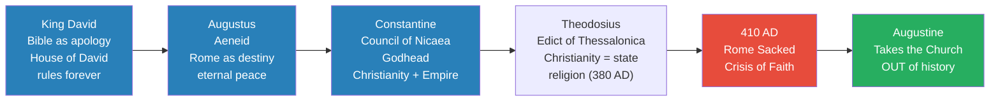
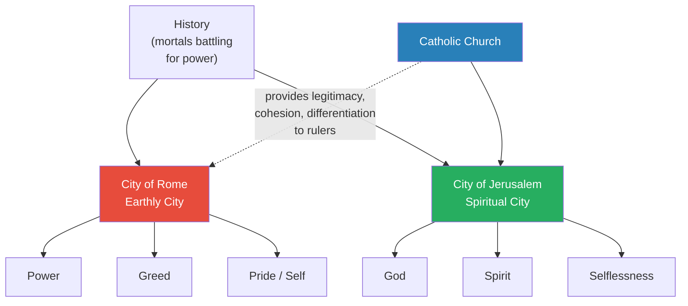
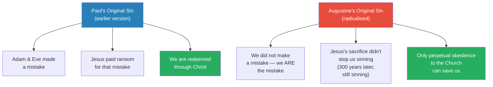
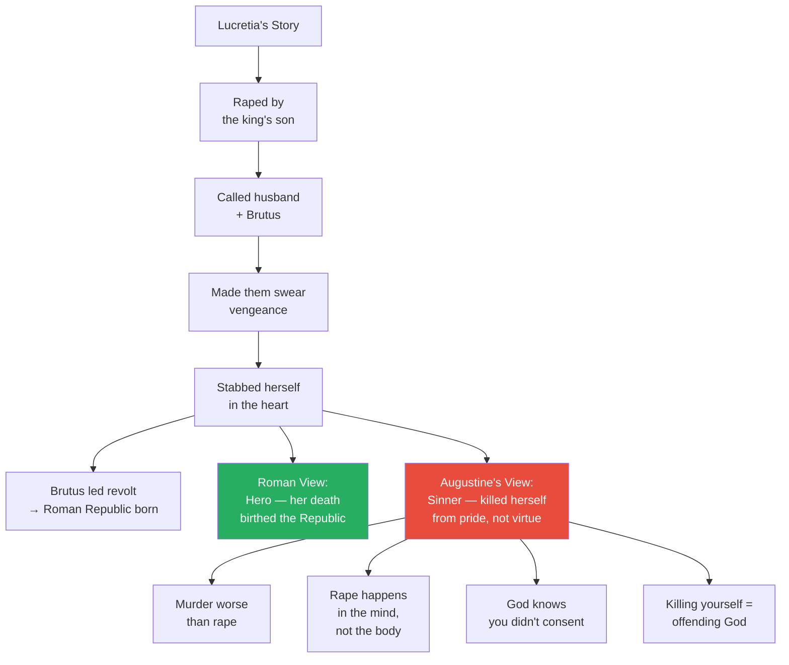
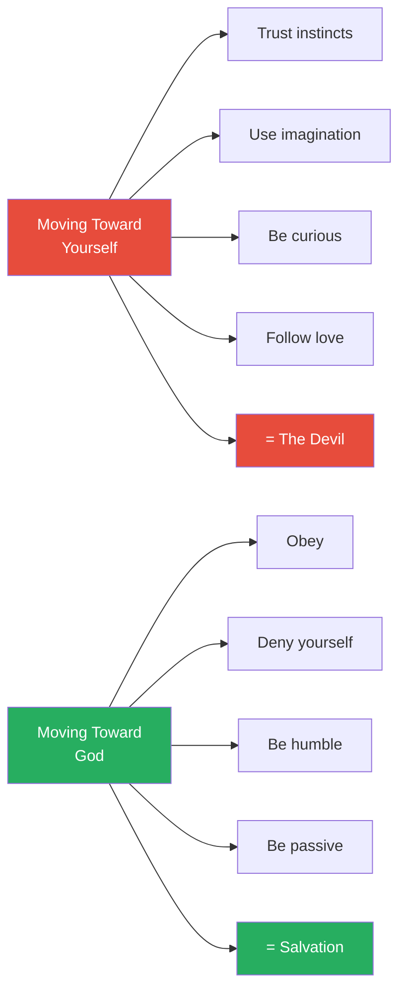
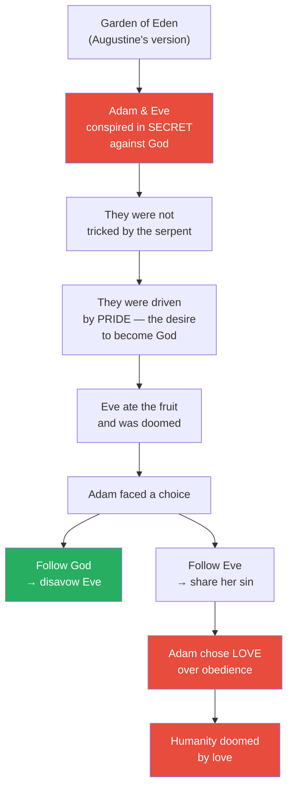
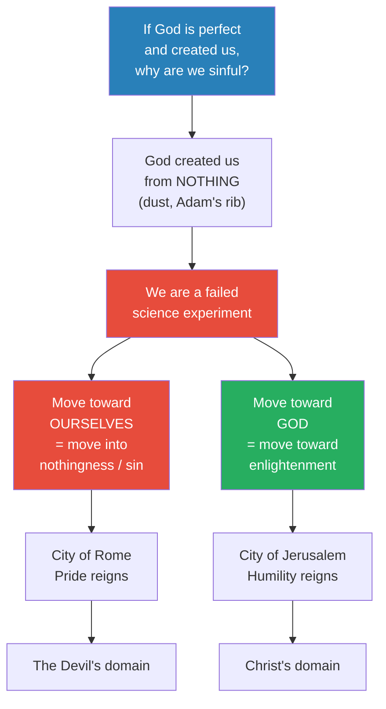
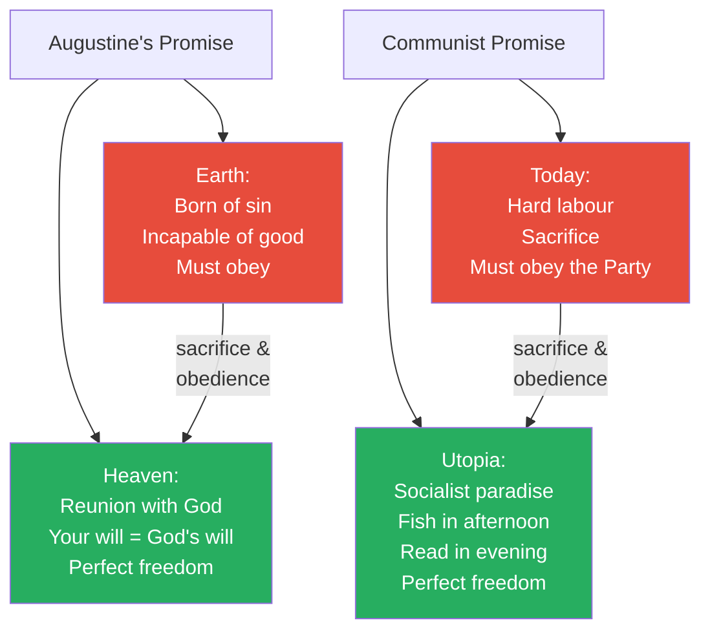
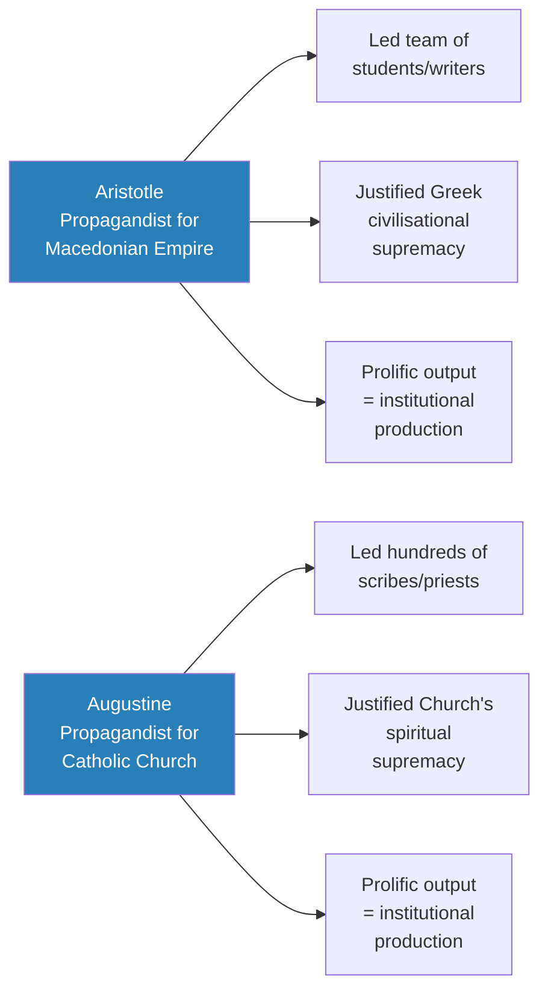

# Augustine's Empire of God

> Prof. Jiang presents Augustine of Hippo as the intellectual architect of the Catholic Church — the largest and longest-surviving organisation in human history. Through close readings of *Confessions* and *City of God*, he reveals Augustine's core doctrines: humans are born of sin, curiosity is evil, obedience is the only path to salvation, and the Catholic Church stands outside history as God's permanent representative on Earth. Prof. Jiang argues this ideology launched the Dark Ages — five centuries of enforced passivity — and drove dissenters east into Arabia, where they would give birth to Islam.

---

## Overview: Key Highlights

- <b style="color: #27ae60">Augustine took the Catholic Church out of history</b> — by declaring it God's eternal representative, he made it immune to the rise and fall of earthly empires
- <b style="color: #e74c3c">Curiosity is evil</b> — Augustine reframes the Garden of Eden so that exploration and questioning are sins, not virtues
- <b style="color: #2980b9">End of History</b> — a recurring pattern where every major leader claims all of history has led to their rule and permanent paradise begins now
- <b style="color: #e74c3c">Original sin radicalised</b> — Augustine goes beyond Paul: humans are not sinners who made a mistake, they ARE the mistake — born of nothingness, incapable of good
- <b style="color: #27ae60">The City of God vs. the City of Rome</b> — Augustine's two-city framework separates spiritual salvation (Jerusalem) from earthly corruption (Rome), anchoring the Church in the eternal city
- <b style="color: #2980b9">Confessions as rhetorical manual</b> — not an authentic autobiography but a training document for priests, teaching them how to gaslight congregations
- <b style="color: #e74c3c">Love is a disease</b> — Adam's sin was loving Eve more than God; all human love leads to disobedience, echoing Virgil's Dido
- <b style="color: #27ae60">The Church solved three problems for rulers</b> — legitimacy, cultural cohesion, and cultural differentiation, making it indispensable to every new regime
- <b style="color: #2980b9">Gaslighting as doctrine</b> — Augustine's rhetoric training made him a master of twisting logic to force compliance
- <b style="color: #e74c3c">The Dark Ages as direct consequence</b> — Augustine's ideology made passivity sacred, killing curiosity and innovation for five centuries
- <b style="color: #27ae60">Freedom of will exists only in reunion with God</b> — the paradox that total obedience on Earth leads to total freedom in heaven mirrors the logic of communism
- <b style="color: #2980b9">Arabia as escape valve</b> — dissenters fleeing Augustine's orthodoxy carried their faith into the lawless desert, creating the conditions for Islam

| Concept | One-line summary |
|---------|-----------------|
| **End of History** | The recurring claim that all of history has led to the current ruler and permanent paradise begins now |
| **City of God / City of Rome** | Augustine's two-city framework: earthly power (Rome) vs. spiritual salvation (Jerusalem) |
| **Original sin (radicalised)** | Humans are not sinners who erred — they are the error, born of nothingness, incapable of good without God |
| **Confessions** | Augustine's autobiography, reread as a rhetorical training manual for the priesthood |
| **Gaslighting** | Prof. Jiang's term for Augustine's rhetorical method — twisting logic to force compliance |
| **Three problems of power** | Legitimacy, cultural cohesion, and cultural differentiation — what every new ruler needs and the Church provides |
| **Love as sin** | Adam's downfall was choosing Eve over God; human love blinds and destroys, echoing Virgil's Dido |
| **Humility as self-negation** | Not modesty but total obedience — forget who you are, deny your nature, obey the Church |
| **Freedom of will (paradox)** | True free will exists only in heaven, when your will becomes identical to God's — obedience now, freedom later |
| **Dark Ages** | Five centuries of intellectual stagnation caused by Augustine's doctrine of passive obedience |
| **Creation from nothing** | God made humans from dust — we are a "failed science experiment," which explains our sinfulness |
| **Arabia as refuge** | Dissenters fled the Catholic orthodoxy east into the lawless desert, seeding the birth of Islam |

---

# The Lecture

## The End of History — A Recurring Imperial Fantasy [0:00 - 4:36]

*Prof. Jiang opens by establishing Augustine's significance: he is the intellectual architect of the Catholic Church, the world's largest organisation with 1.5 billion members and nearly 2,000 years of continuous existence. Before examining Augustine's ideas, Prof. Jiang introduces a framing concept — the "End of History" — and shows it as a pattern that recurs across every empire they have studied this semester.*

> [!tip] Core Insight
> Every major political leader in history has announced that all of history has led to this moment — that their rule marks the permanent end of the struggle. Augustine's genius was to take the Catholic Church out of history entirely, making it immune to the cycle that destroys every earthly "end of history."

*Each ruler claimed to end history — David through divine friendship, Augustus through destiny, Constantine through monotheism. All failed when their empires fell. Augustine solved the problem by removing the Church from history altogether.*

> [!note]- Expand: Full Lecture Detail
> Prof. Jiang introduces Augustine by framing his importance in concrete terms: the Catholic Church is the largest organisation in the world — 1.5 billion members, nearly 2,000 years old — and <b style="color: #27ae60">Augustine is the individual who conceptualised the idea of the Catholic Church</b>. To understand why it has endured, Prof. Jiang introduces the concept of the <b style="color: #2980b9">End of History</b>.
>
> He credits the phrase to Francis Fukuyama, an American State Department official who, when the Berlin Wall fell, argued that liberal consumer democracy was the final ideology — not merely the best idea, but the perfect idea that would endure for the rest of history. "Of course, we know this idea is wrong," Prof. Jiang says. But what matters is the pattern: <b style="color: #e74c3c">every major political leader who comes to power announces that this is the end of history</b> — that all of history has led to this point, and from now on, paradise on Earth begins.
>
> He walks through the semester's examples:
>
> - **King David** — sponsored the writing of the Bible as an apology for his rule. The story is constructed so that Yahweh, lonely and searching for a companion, eventually finds David and anoints the House of David as permanent rulers
> - **Augustus** — sponsored the writing of the *Aeneid*. The Trojan hero Aeneas is destined by the gods to found Rome, and Rome's destiny culminates in Augustus as first emperor — eternal peace achieved
> - **Constantine** — fought a brutal civil war to reunite the Roman Empire, converted to Christianity, and organised the Council of Nicaea in 325 AD, introducing the <b style="color: #2980b9">Godhead</b> — the idea that God is both everything and nothing, which is also the idea of empire
> - **Theodosius** — after another civil war, issued the Edict of Thessalonica in 380 AD establishing Christianity as the official state religion and rooting out paganism
>
> At each stage, the claim was the same: we have found the truth, history is over, paradise begins. Then in 410 AD, Rome was sacked by the Visigoths. This created a <b style="color: #e74c3c">crisis of faith</b>. Many believed Rome fell precisely because it converted to Christianity — the old gods punished Rome for abandoning them, and Christianity was a "religion of slaves" that taught mercy and compassion in a world that does not work that way.
>
> The authority of the Catholic Church was directly challenged. And it was at this moment that Augustine, a bishop in Northern Africa, produced his solution.

---

## Augustine's Solution — Taking the Church Out of History [4:36 - 8:01]

*Prof. Jiang explains Augustine's revolutionary move: rather than claiming another "end of history," Augustine removed the Catholic Church from history entirely. His framework of two cities — Rome (earthly corruption) and Jerusalem (spiritual salvation) — made the Church immune to political collapse and positioned it as the permanent mediator between humanity and God.*

> [!tip] Core Insight
> Previous leaders placed themselves at the end of history. Augustine placed the Church above history. Earthly empires rise and fall — that is the business of mortals. The Church, as God's representative, exists in a different category entirely.

*The Church occupies the spiritual city while providing essential services to the earthly city. This dual positioning — above history but indispensable to it — explains its extraordinary survival.*

> [!note]- Expand: Full Lecture Detail
> Prof. Jiang explains Augustine's breakthrough: other leaders introduced the "end of history" — Augustine <b style="color: #27ae60">took the Catholic Church out of history</b>. History is about mortals battling for power, but the Catholic Church is God's representative on Earth and therefore removes itself from that struggle. "You guys can battle it out, but we will always be the representative of God on Earth."
>
> To establish this, Augustine writes *City of God*, which describes two cities:
>
> - <b style="color: #e74c3c">Rome — the earthly city</b>: a city of power, greed, and the self
> - <b style="color: #27ae60">Jerusalem — the spiritual city</b>: the city of God, spirit, selflessness, and paradise
>
> The Catholic Church is permanently centred in Jerusalem. If you follow the Church and obey God, your spirit can enter Jerusalem. Otherwise, you remain trapped in Rome.
>
> Prof. Jiang then explains why this was so powerful practically. Before Augustine, every new ruler — David, Augustus, Constantine — faced three problems:
>
> 1. **Legitimacy** — why are you the ruler?
> 2. **Cultural cohesion** — how do you unite the people behind a common ideology?
> 3. **Cultural differentiation** — why are your people different from others?
>
> <b style="color: #27ae60">Augustine's Catholic Church proposed to solve all three</b>. The Church would grant legitimacy — you are God's representative on Earth. It would provide cultural cohesion through shared faith. And it would differentiate Christian civilisation from pagans and barbarians.
>
> This is why, Prof. Jiang explains, even though power shifted constantly in the following centuries, the Catholic Church always remained at the centre — because it was the institution capable of providing authority and legitimacy to whoever came to power, like Charlemagne.
>
> Prof. Jiang then announces his argument for the lecture: Augustine's ideology will drive European history for the next 1,000 years, and <b style="color: #e74c3c">it is this ideology that will mark the coming of the Dark Ages</b> — 500 years when society lacked social innovation and people were not allowed to criticise authority.

---

## Confessions — The Pear Tree and the Nature of Sin [8:01 - 15:53]

*Prof. Jiang turns to Augustine's two major works, beginning with Confessions. He reads Augustine's famous pear tree passage — a retelling of the Garden of Eden — and shows how Augustine radicalises the concept of original sin: humans do not merely commit sins, they ARE sin. Curiosity itself is evil, and the only safety lies in obedience.*

*Augustine's version of original sin is far more radical than Paul's. Paul said we made a mistake and Jesus fixed it. Augustine said we are the mistake — Jesus merely showed us the light, but we must walk toward it ourselves through lifelong obedience.*

> [!note]- Expand: Full Lecture Detail
> Prof. Jiang introduces *Confessions* — Augustine's autobiography, considered the first authentic autobiography in the world. In it, Augustine describes growing up with a pagan father and a Christian mother named Monica. As a young man, he was disobedient — he had a mistress he refused to marry, explored heresies like Neoplatonism and Manichaeism. Then he had a <b style="color: #2980b9">Damascus moment</b>: God spoke to him, told him to open the Bible, and his religious journey began. At age 42, he became Bishop of Hippo in Northern Africa.
>
> Prof. Jiang immediately cautions: "Most scholars take this story for what it is. But one thing you learn in life is whenever a politician or powerful individual writes a memoir, it's complete BS."
>
> He then reads the most famous passage from *Confessions* — Augustine's retelling of the Garden of Eden through the story of a pear tree:
>
> > [!quote] Augustine, *Confessions*
> > "I wanted to carry out an act of theft, and did so, driven by no kind of need other than my inner lack of any sense of, or feeling for, justice."
>
> - Augustine insists we are <b style="color: #e74c3c">born in sin, born OF sin</b> — evil from the womb
> - The Catholic Church is essential because only it can steer us toward goodness
> - Left to our own devices, we can only commit sin
>
> The pear tree story: Augustine and a gang of adolescents stole pears from someone's tree late at night. They did not eat the pears — they fed them to pigs. The theft was pure pleasure, pure sin.
>
> Prof. Jiang offers his own reading: "We would think this is just boys having fun, right? They don't mean any harm. They're just playing, being curious, exploring — which is part of human nature." But that is exactly Augustine's point: <b style="color: #e74c3c">curiosity can only lead to evil. Exploration can only lead to sin.</b>
>
> He identifies two radical moves in Augustine's retelling of the Garden of Eden:
>
> - **First:** Augustine introduces the word "stealing" — not used in the Bible. Adam and Eve were stealing from God
> - **Second:** The stealing was intentional. They knew what they were doing was wrong and did it because it felt good
>
> This is a <b style="color: #2980b9">radical reconceptualisation of original sin</b>. Prof. Jiang contrasts it with Paul's earlier version:
>
> - **Paul's version:** Adam and Eve made a mistake; Jesus came to pay ransom for that mistake; we are redeemed
> - **Augustine's version:** We did not make a mistake — <b style="color: #e74c3c">we ARE the mistake</b>. We are born to sin and will always sin. Furthermore, Augustine is writing 300 years after Jesus's sacrifice, and humanity is still sinning — so he is effectively negating the redemptive power of Christ's sacrifice
>
> The conclusion: we are born sinners, and we will always sin unless we are taught to obey God. Obedience to God is our fundamental mission on Earth.

---

## City of God — Lucretia, Rape, and the Logic of Passivity [15:53 - 25:00]

*Prof. Jiang moves to City of God, Augustine's essential blueprint for the Catholic Church. He focuses on Augustine's treatment of rape and suicide, using the story of Lucretia to reveal the doctrine's deeper logic: we are God's property, we can do no good through action, and therefore the only path to salvation is doing nothing.*

*Augustine inverts Lucretia from Roman hero to Christian sinner. Her suicide, which Romans celebrated as the birth of their Republic, becomes in Augustine's framework an act of pride — the worst sin of all.*

> [!note]- Expand: Full Lecture Detail
> Prof. Jiang explains the practical context: throughout this period, if a woman was raped — by a stranger or by her husband — she would often kill herself, because Christian faith taught that chastity was paramount. For an empire, this was a demographic catastrophe: "If women kill themselves because of rape, and rape happens all the time, eventually you're going to have a population implosion."
>
> Augustine spends significant time in *City of God* explaining why rape is not grounds for suicide. He uses the story of <b style="color: #2980b9">Lucretia</b>, whom the class had discussed earlier in the semester:
>
> > [!example] Lucretia and the Birth of the Roman Republic
> > - Lucretia was famous in Rome for her chastity and virtue
> > - The king's son thought it would be "fun" to rape her
> > - After the rape, she called her husband and his best friend Lucius Junius Brutus
> > - She made them swear to avenge her dishonour
> > - To ensure they would follow through, she pulled out a knife and stabbed herself in the heart
> > - Her death ignited the revolt that ended the Roman monarchy and founded the Roman Republic
> > - Romans honoured her as a hero — her sacrifice birthed their political system
> > **The lesson:** What Romans celebrated as the highest virtue — sacrificing yourself for honour — Augustine reframes as the deepest sin: pride.
>
> Augustine's reinterpretation:
>
> - She killed herself not for the good of Rome but for her own vanity — she was "excessively eager for honour"
> - <b style="color: #e74c3c">Pride killed her, not virtue</b> — she could not bear losing her reputation as Rome's most chaste woman
> - Christian women should not kill themselves because murder is a worse crime than rape
> - Rape happens in the mind, not the body — "it's not real"
> - God knows whether you consented — if you did not, God forgives
> - But killing yourself is a crime against God, because <b style="color: #e74c3c">we are God's property</b>
>
> Prof. Jiang calls this "gaslighting" and identifies the deeper doctrinal principles:
>
> 1. **We are God's property** — we do not belong to ourselves, therefore suicide offends God
> 2. **We can do no good because we are burdened by pride and sin** — if we choose to act, we can only do wrong
>
> He gives a vivid illustration: if you are walking in the forest and see a boy drowning in a lake, <b style="color: #e74c3c">do not jump in to save him</b>. First, you might die. Second, everything is controlled by God — the drowning has a purpose. Jumping in might interfere with God's plan. The only solution to salvation: do nothing. God knows everything, God has a plan. Doing nothing is the best thing you can do, because if you are born of sin and capable only of sin, then when you do nothing, you are doing good.
>
> "This is gaslighting," Prof. Jiang repeats, "but this becomes the doctrine of the Catholic Church, and it begins what we call the <b style="color: #e74c3c">Dark Ages</b> — because it forces people to be passive and obedient and unable to question and explore."

---

## The Devil Within — Living by God's Standard, Not Man's [25:00 - 27:06]

*Prof. Jiang reads key lines from City of God where Augustine argues that trusting your instincts, intuition, or imagination makes you "like the devil." He highlights Augustine's rhetorical strategy: endless repetition of a simple message to make it feel like an inescapable truth.*

*Augustine presents only two directions a human can move: toward yourself (the devil) or toward God (salvation). Every natural human impulse — curiosity, love, imagination — belongs to the first category.*

> [!note]- Expand: Full Lecture Detail
> Prof. Jiang reads directly from *City of God*:
>
> > [!quote] Augustine, *City of God*
> > "When man lives by the standard of man and not by the standard of God, he is like the devil."
>
> He unpacks the implication: <b style="color: #e74c3c">when you choose to follow your nature, you are like the devil</b>. It is only by negating yourself, denying yourself, that you can be good. If you trust your instincts, your intuition, your imagination — you are the devil.
>
> Augustine extends this even to angels: "Even an angel should not have lived by the angel standard, but by God's." Only God has the power to choose. Humans can choose, but they can only choose evil — therefore they should not choose at all.
>
> Prof. Jiang notes that Augustine studied rhetoric and was a master of <b style="color: #2980b9">gaslighting</b> — "twisting things in order to force your compliance." His key technique is repetition: the same idea stated over and over in slightly different words until it feels self-evident. "He's just repeating himself, the same sentence, but he repeats it over and over."

---

## Who Was the Audience? — Confessions as Priestly Training Manual [27:06 - 29:00]

*A student asks who Augustine was writing for. Prof. Jiang reveals that the audience was not ordinary people — most could not read — but the priesthood. Confessions and City of God functioned as rhetorical manuals for priests, equivalent to the Confucian classics that Chinese bureaucrats had to memorise to pass imperial examinations.*

> [!note]- Expand: Full Lecture Detail
> A student asks the key question: who is Augustine's audience? Prof. Jiang says this is "exactly the right question." The audience is clearly not ordinary people — most people at this time could not read. <b style="color: #2980b9">The audience is the priesthood</b> — individuals about to be anointed by the Catholic Church to preach to laypeople.
>
> As priests, they would encounter theological challenges from their congregations. Augustine's works provided a rhetorical manual — memorise this material, and whatever problem you encounter, you can recite from the manual.
>
> Prof. Jiang draws a parallel to the <b style="color: #2980b9">Confucian classics in China</b>: to become a bureaucrat, you had to pass the Confucian examinations by memorising the texts. The underlying theory is identical — the emperor is always right, just do what the emperor wants. Augustine's works serve the same function for the Church.
>
> The core argument priests would deploy: "We're born of sin, therefore you can do no good. Even by asking questions, you expose the devil in yourself. Even by questioning the church, you're showing the devil in you." The only path to salvation is fighting the devil within. Ignore the corrupt world. Ignore the exploitative landlord. Ignore the Church's own corruption. Focus on your internal struggle against sin.
>
> "It's not a sophisticated argument," Prof. Jiang concludes, "but it's a clever argument that becomes a basis for the dominance of the Church during the Dark Ages."

---

## Adam, Eve, and the Sin of Love [29:00 - 35:42]

*Prof. Jiang examines Augustine's analysis of why Adam and Eve disobeyed God. The answer is devastating: they conspired deliberately, driven by pride. Adam's specific sin was love — he chose Eve over God. Prof. Jiang connects this to Virgil's Aeneid, where love destroys Dido but obedience saves Aeneas, revealing a continuous imperial logic across pagan and Christian Rome.*

> [!tip] Core Insight
> Augustine makes love itself a sin. Adam's downfall was not ignorance or trickery — it was that he loved Eve too much to abandon her. The only true love is obedience to God. Every other love — for a partner, for a child, for a friend — is a lie that leads to damnation.

*Augustine's Garden of Eden is a story about the catastrophe of love. Adam was not ignorant — he knew eating the fruit was wrong. He chose sin deliberately because he could not bear to lose Eve. Every human love since inherits this original catastrophe.*

> [!note]- Expand: Full Lecture Detail
> Prof. Jiang reads Augustine's analysis of the Fall:
>
> > [!quote] Augustine, *City of God*
> > "It was in secret that the first human beings began to be evil, and the result was that they slipped into open disobedience."
>
> Augustine's argument, step by step:
>
> - Adam and Eve <b style="color: #e74c3c">conspired in secret</b> against God — it was because they talked to each other that they became evil
> - They were not tricked by the serpent and not driven by curiosity — they were simply evil
> - Their evil was driven by <b style="color: #e74c3c">pride</b> — "a longing for a perverse kind of exaltation"
> - The serpent told them eating the fruit would make them like God — it was this ambition, this pride, that tempted them
> - Pride means leaving God and becoming more of yourself — there are only two directions: toward God (obedience) or toward yourself (sin)
>
> Then comes the critical question about Adam specifically. Eve had already eaten the fruit. Adam faced a choice:
>
> - **Option 1:** Follow God and disavow Eve
> - **Option 2:** Follow Eve into sin
>
> Adam chose Eve. <b style="color: #e74c3c">What doomed Adam was love.</b> He loved Eve so much that he chose to be damned alongside her rather than live without her.
>
> Augustine's conclusion: there is only one true love — the love of God, which is obedience to God. Every other love is a falsehood, a lie that can only lead to sin and disaster.
>
> Prof. Jiang then asks the class: "Who else said this? Love can only lead you to disaster. It is a disease." The answer: <b style="color: #2980b9">Virgil</b>. In the *Aeneid*, Dido fell in love with Aeneas, and Aeneas fell in love with Dido. But the gods told Aeneas to obey — go to Italy, found Rome. Because he was a pious man, he abandoned his love and did his duty. The gods honoured him. But Dido was consumed by love and destroyed herself.
>
> The logic is identical across pagan and Christian Rome: <b style="color: #e74c3c">love will destroy you, love will blind you, love is evil — only obedience is good</b>.

---

## Creation from Nothing — The Failed Science Experiment [35:42 - 39:57]

*Prof. Jiang examines Augustine's answer to a theological paradox: if God is perfect and God created us, why are we sinful? Augustine's solution — that God created humans from nothing, making us essentially a failed experiment — leads to his doctrine of total humility: deny yourself, obey the Church, and move toward God rather than toward your own nothingness.*

*Augustine resolves the paradox of a perfect God creating imperfect beings by invoking creation from nothing. The nothingness from which we were made is the source of our sinfulness — moving toward ourselves means returning to that void.*

> [!note]- Expand: Full Lecture Detail
> Prof. Jiang identifies a crucial theological question Augustine must address: if we are born of sin, but God created us, isn't that a contradiction? God is perfect — why would God create a flawed, sinful person?
>
> Augustine's answer: <b style="color: #2980b9">because God created us out of nothing</b>. God made Adam from dust, Eve from Adam's rib. "We are a failed science experiment. We are a science experiment gone wrong."
>
> Because we were created from nothing, we were born of sin. The path forward:
>
> - If we become more of who we are — if we listen to ourselves, love, think, explore — we move into our nothingness
> - If we obey God, we move toward enlightenment and salvation
>
> Augustine concludes with his definition of <b style="color: #2980b9">humility</b> — which Prof. Jiang translates as "self-denial, self-negation. Complete obedience. Forget who you are."
>
> Augustine writes that humility "is highly praised in the City of God and especially enjoined on the City of God during the time of its pilgrimage in this world." The contrary of humility — pride — exercises "supreme dominion in Christ's adversary, the devil."
>
> He has constructed a complete economy:
>
> - In the <b style="color: #e74c3c">City of Rome</b>: pride triumphs — this is the seat of the devil
> - In the <b style="color: #27ae60">City of God</b>: humility triumphs — this is the seat of Jesus
> - "In one city, love of God has been given first place. In the other, love of self."

---

## The Promise of Paradise — Freedom Through Total Surrender [39:57 - 44:24]

*A student asks whether Jesus can even save humanity under Augustine's framework. Prof. Jiang reads the conclusion of City of God, where Augustine promises that in heaven, humans will achieve perfect freedom of will — but only by becoming one with God. Prof. Jiang identifies this logic as the template for every revolutionary utopian movement in history, including communism.*

> [!tip] Core Insight
> Augustine's promise — sacrifice yourself now for paradise later, where your will becomes God's will and you achieve total freedom — is the same logic that powered communism: suffer today to build a socialist utopia where everyone is free. The structure is identical; only the deity changes.

*The structural parallel between Augustine's theology and communist ideology is exact: present suffering justified by future paradise, individual will surrendered to a higher authority, total freedom promised as the reward for total obedience.*

> [!note]- Expand: Full Lecture Detail
> A student asks a sharp question: can Jesus even save us under this framework? Prof. Jiang responds: "Jesus is dead, and Jesus didn't really do anything, because we're still born of sin." God sent Jesus to awaken us — to show us we have been wrong and must correct ourselves. Jesus shows the light, but <b style="color: #27ae60">it is we who must walk toward the light</b>.
>
> He then reads the conclusion of *City of God*:
>
> > [!quote] Augustine, *City of God*
> > "In the heavenly city, then, there will be freedom of will."
>
> Prof. Jiang finds this "very curious" — for the entire book, Augustine has argued that freedom of will is bad and that we are born of sin. Now he promises freedom of will in heaven. The logic:
>
> - On Earth, we are separate from God and burdened by sin
> - In the City of God, we achieve reunion with God — we return to God, become the same as God
> - God is in us, we are in God, and therefore we are incapable of sin
> - At that point, we have complete freedom of will, because our will is the same as God's
>
> Augustine acknowledges life on Earth is terrible: "You're getting exploited by the landlord, you're getting raped by the landlord, you're getting killed by your neighbours. Life sucks." But the message is: focus on internal salvation, focus on obedience, and when you ascend to Jerusalem, you will be one with God and all earthly suffering will be forgotten. "You are making a sacrifice so that you may be saved."
>
> Prof. Jiang then delivers the lecture's key historical connection: <b style="color: #27ae60">this is the logic of communism</b>. Communism says: work hard today to build a socialist paradise. Once built, you will have complete freedom — "as Marx says, we can fish in the afternoon and read in the evening and discuss politics with our friends." The structure is identical:
>
> - Present suffering → future paradise
> - Individual will surrendered to a higher authority
> - Total freedom as the reward for total obedience
>
> The power of *City of God* is dual: it provides a framework for the Catholic Church's dominion over Europe, AND it becomes the catalyst for revolutionary movements throughout human history — especially communism.

---

## Augustine the Man — Bishop, Propagandist, Genius [44:24 - 50:06]

*Prof. Jiang turns to Augustine's biography with his characteristic scepticism. He argues that Augustine's "normal family" story is propaganda — a bishop at 42 must have come from an extremely powerful family. He compares Augustine to Aristotle: both were prolific, both probably led teams of writers, and both served as propagandists for their respective empires.*

*The parallel between Aristotle and Augustine extends beyond their ideas to their institutional roles. Both were geniuses, but both also headed intellectual production lines — think of them as lab directors, not solo authors.*

> [!note]- Expand: Full Lecture Detail
> A student asks about Augustine's biography. Prof. Jiang warns: "If a biography is written by a politician, it's going to be BS."
>
> The official story: Augustine came from a normal family — pagan father, devout Christian mother named Monica. Through hard work he studied rhetoric, became a professor, had his Damascus moment when God spoke to him, studied the Bible rigorously, and was appointed Bishop of Hippo (Northern Africa) at age 42.
>
> Prof. Jiang applies the class's recurring principle — always be sceptical of power:
>
> - <b style="color: #e74c3c">If he was appointed bishop at 42, he came from an extremely powerful family</b> — the Catholic Church grew by marrying itself to power, with a strict hierarchy that was co-opted by the power elite
> - His father was possibly a Roman governor or general — "this is not a typical, normal middle-class family. It can't be."
>
> Second, Augustine was famously <b style="color: #2980b9">prolific</b> — possibly writing hundreds of thousands of pages. Prof. Jiang asks: who else in the course was extremely prolific? The answer: <b style="color: #2980b9">Aristotle</b>.
>
> The parallel: Aristotle was a censor and propagandist for the Macedonian Empire. He probably did not write anything himself but directed a team of students. Augustine, as bishop, likely did the same — hundreds of scribes and priests took his theories and turned them into books.
>
> "Think of him as a university professor, a science professor who's in charge of a lab. He doesn't actually do his own work. He has assistants for that, but he's the one directing the research and the writing."
>
> Prof. Jiang's final assessment: "He's clearly a genius. There's no denying he is a genius." But he is also, fundamentally, a propagandist.

---

## The Logic of Empire and the Birth of Islam [50:06 - End]

*Prof. Jiang concludes by revealing Augustine's doctrine as simply the logic of empire — the powerful gaslighting the powerless into obedience. He then explains the consequence: those who refused to submit fled east, first to the Sassanid Persian Empire and then to Arabia, a lawless desert where Jews and Christians practised their faith freely. From Arabia would come a revolutionary new religion — Islam — that would challenge everything Augustine built.*

> [!tip] Core Insight
> Augustine's orthodoxy created its own enemy. By making curiosity, questioning, and independent faith into sins, he drove the most passionate believers out of the Catholic world and into Arabia — where the absence of authority allowed a new religion to take root.

> [!note]- Expand: Full Lecture Detail
> Prof. Jiang strips Augustine's genius down to its essence: "This logic is — I push you down, and you turn around and say, 'Hey, why did you push me down?' I say to you, 'I didn't push you down. You slipped.' I can do that because I'm powerful and you're not." This is the <b style="color: #2980b9">logic of empire</b>.
>
> Augustine forces obedience through a wager: "You can disobey me. You can fool around. But this means you'll burn in hell for eternity. Do you really want to take that chance?" Most people don't.
>
> The consequence: most people during this period chose to become passive in order to avoid sin. <b style="color: #e74c3c">This marks the beginning of the Dark Ages in Europe</b> — centuries when social innovation ceased and authority could not be questioned.
>
> But many people chose to rebel — people who believed that exploration, curiosity, intuition, and imagination are fundamental to being human. "If you refuse to let me be human, then I will go somewhere else."
>
> Where did they go? East. Two destinations:
>
> 1. The <b style="color: #2980b9">Sassanid Persian Empire</b>
> 2. <b style="color: #2980b9">Arabia</b> — a lawless desert with no real authority
>
> Arabia became a refuge for Jewish people and Christians who wanted to practise their faith freely. Prof. Jiang invokes the class's recurring lesson: "People take their faith very seriously. I'd rather die than not practise my faith."
>
> These refugees carried their faith into the desert, and from that desert would come <b style="color: #27ae60">a revolutionary new religion called Islam</b> — one that would challenge the authority of the Catholic Church and of Augustine.
>
> "And this is what we will discuss next class."

---

## Connections

**Builds on:** [[26 - Constantine's Monotheistic Revolution]] (Godhead, Council of Nicaea, Edict of Thessalonica), [[25 - Paul of Tarsus, Messiah of Rome]] (original sin, Jesus as ransom), [[21 - The Apology of King David of Israel]] (Bible as political apology), [[13 - Aristotle and the Greek Legacy]] (Aristotle as Macedonian propagandist), [[10 - The Trial of Socrates and Plato's Allegory of the Cave]] (philosophy as proto-religion)

**Sets up:** [[28 - Muhammad's Revolution of God]] (Islam emerging from Arabia as a challenge to Augustine's Catholic orthodoxy)

**Related books in vault:** [[The Prince - Niccolò Machiavelli]] (power and the logic of empire), [[The 48 Laws of Power - Robert Greene]] (gaslighting and rhetoric as tools of domination)

**Recurring themes:** End of History (David, Augustus, Constantine, Fukuyama), gaslighting as statecraft, love as weakness (Virgil's Dido), the Aristotle-Augustine parallel, the poor-conquers-rich dynamic (dissenters fleeing to the desert to build something new)

---

## The Takeaway

Augustine's achievement is both intellectually brilliant and morally devastating. He solved a problem that had defeated every empire before him — the vulnerability of tying your legitimacy to history, which history can then destroy. By placing the Catholic Church outside of history, in a spiritual city that no barbarian army can sack, he created an institution that has survived every political upheaval for nearly two millennia. The three services he offered rulers — legitimacy, cohesion, and differentiation — made the Church indispensable regardless of who held earthly power. It is, as Prof. Jiang frames it, one of the most successful political architectures in human history.

The cost, however, was catastrophic. Augustine's doctrine turned every natural human impulse — curiosity, love, ambition, imagination — into evidence of the devil within. By making passivity sacred and action sinful, he created the intellectual infrastructure for the Dark Ages. The most striking revelation in this lecture is how Augustine's logic maps precisely onto modern revolutionary movements: communism's promise of future paradise in exchange for present sacrifice follows the same structure, right down to the paradox of achieving freedom through total obedience. The pattern is not coincidental — it is the recurring template for how power justifies itself across millennia.

Perhaps the most counterintuitive insight is that Augustine's orthodoxy contained the seeds of its own challenger. By driving the most passionate, independent-minded believers into Arabia — people who would rather flee into a lawless desert than surrender their right to think — he inadvertently created the conditions for Islam. Next class will explore how that new religion rose from the desert to challenge everything Augustine built.
