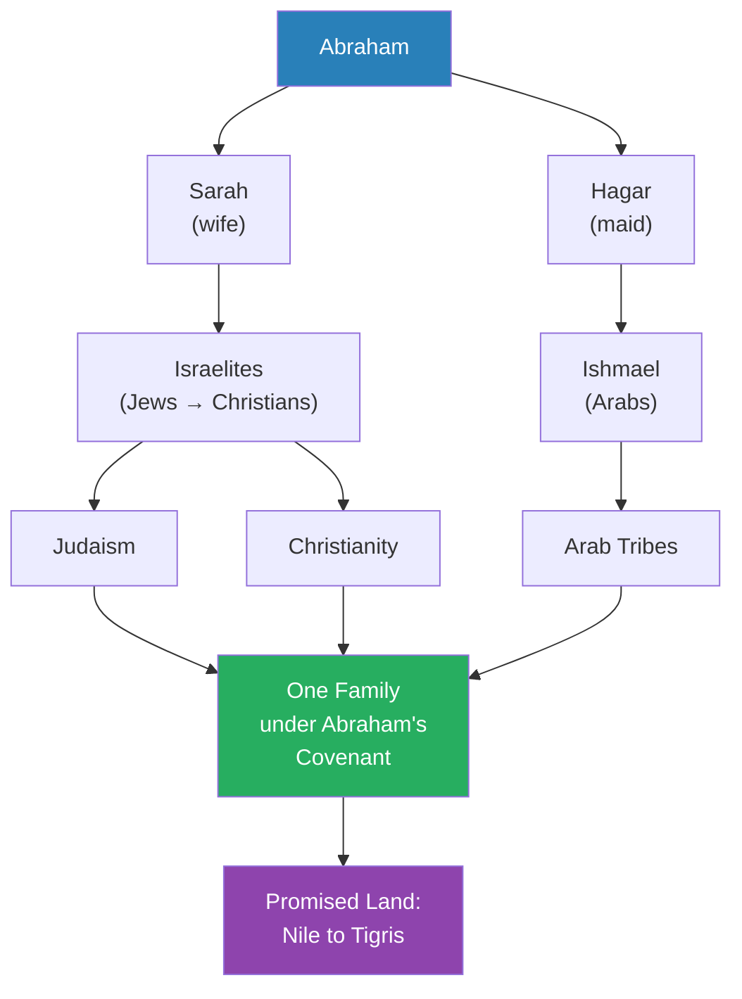
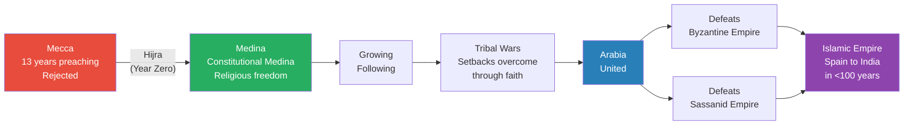
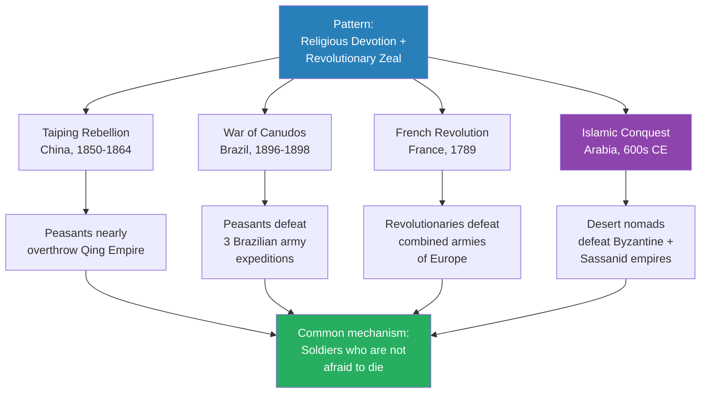
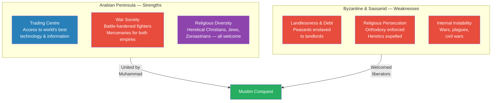
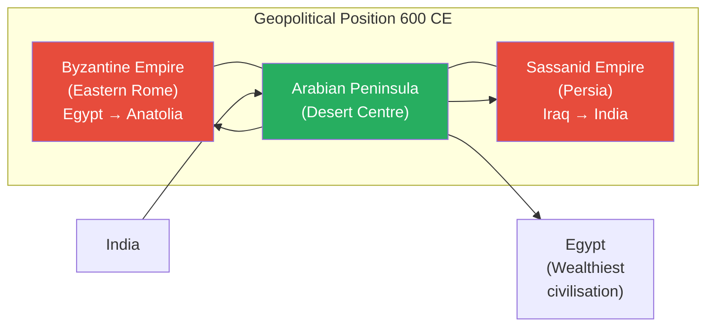
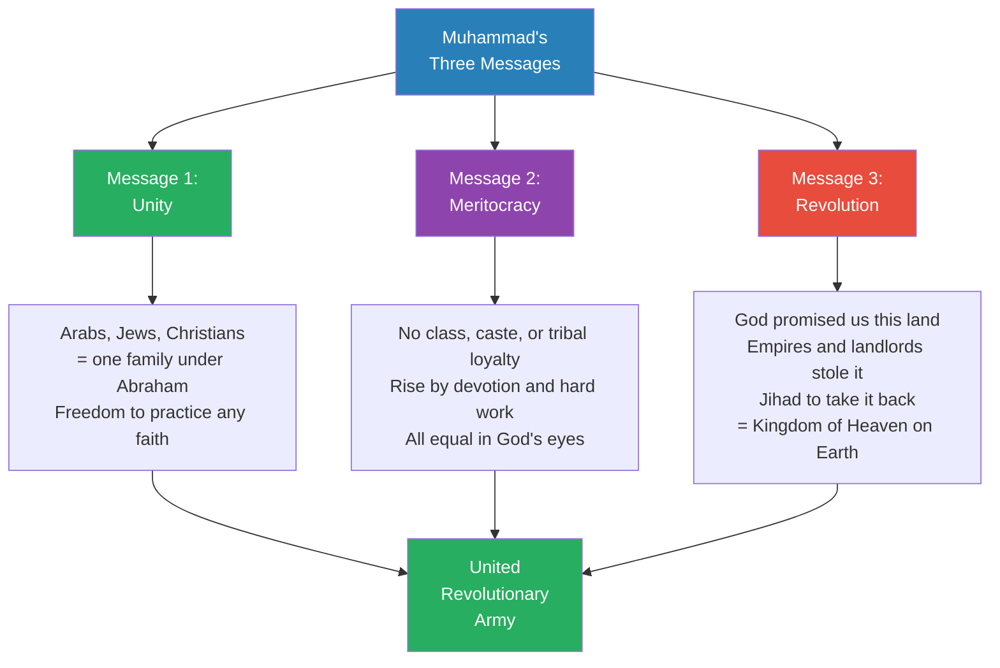
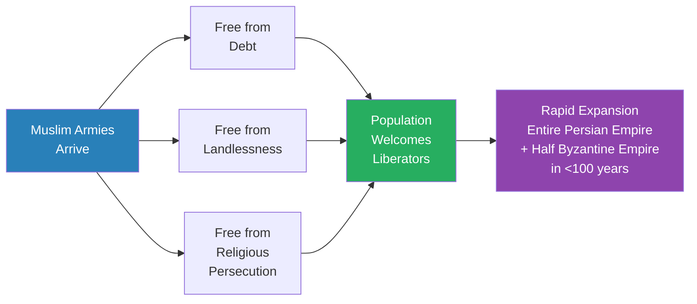

# Muhammad's Revolution of God

> Prof. Jiang reframes the rise of Islam as the world's first global revolution rather than a purely religious movement. Muhammad, he argues, was not merely a prophet preaching monotheism to polytheistic Arabs — he was a revolutionary who promised freedom from debt, landlessness, and religious persecution, uniting Arabs, Jews, and Christians under the banner of Abraham's covenant. Using three historical analogues — the Taiping Rebellion, the War of Canudos, and the French Revolution — Prof. Jiang explains how revolutionary zeal combined with religious devotion produces soldiers who are not afraid to die, and why that combination allowed desert nomads to topple two world empires in less than a century. The lecture closes with a provocative answer to why so little is known about early Islam: the revolution won, and empires do not celebrate revolutionaries.

---

## Overview: Key Highlights

- <b style="color: #27ae60">Islam was the world's first global revolution</b> — not merely a religious conversion, but an overthrow of the social order promising land, freedom from debt, and religious tolerance
- <b style="color: #e74c3c">The traditional narrative is a whitewash</b> — the conflict was not monotheism versus polytheism but revolution against inequality, corruption, and persecution
- <b style="color: #2980b9">The Abrahamic family</b> — Muhammad's central claim: Arabs (through Ishmael), Jews, and Christians all descend from Abraham and are one family under God
- <b style="color: #27ae60">Revolutionary zeal + religious devotion = invincibility</b> — soldiers infused with both are not afraid to die, which is why peasant armies repeatedly defeat professional militaries
- <b style="color: #2980b9">Arabia as the innovation hotbed</b> — the peninsula was not backward but the most cosmopolitan, open-minded, and militarily experienced region in the world by 600 CE
- <b style="color: #e74c3c">Byzantine and Sassanid weakness</b> — landlessness, debt, religious persecution, plagues, civil wars, and constant warfare had hollowed out both empires
- <b style="color: #2980b9">Three qualities of great leaders</b> — strategic/visionary, innovative/revolutionary, disciplined/selfless — the formula from Philip and Caesar applied to Muhammad
- <b style="color: #27ae60">Muhammad's three unifying messages</b> — we are all God's children (unity), merit over caste (meritocracy), and God promised us this land (revolution)
- <b style="color: #2980b9">Apocalyptic eschatology</b> — the widespread belief in a coming Messiah across Zoroastrian, Christian, and Jewish traditions created demand for a prophetic leader
- <b style="color: #e74c3c">Victors erase revolutionary history</b> — once the Islamic empire was established, celebrating a revolutionary who hated corruption and inequality became dangerous
- <b style="color: #2980b9">Historical analogues method</b> — with so little direct evidence, Prof. Jiang uses the Taiping Rebellion, War of Canudos, and French Revolution to reconstruct what likely happened
- <b style="color: #27ae60">The Constitutional Medina</b> — Muhammad's promise of religious freedom for all peoples, a revolutionary principle in a world of orthodoxy and persecution

| Concept | One-line summary |
|---------|-----------------|
| **Abrahamic covenant** | God promised Abraham's descendants the land from the Nile to the Tigris — Arabs claim this through Ishmael |
| **Hijra** | Muhammad's migration from Mecca to Medina — marks year zero of the Islamic calendar |
| **Constitutional Medina** | Muhammad's charter promising freedom of religious expression to all peoples in Medina |
| **Jihad (as presented)** | Holy war to reclaim the Promised Land from empires that stole it — framed as restoring God's covenant |
| **Apocalyptic eschatology** | The belief that a Messiah will come to establish the Kingdom of Heaven — widespread across all three monotheisms |
| **Revolutionary zeal** | The willingness to die for a new social order — distinct from but amplified by religious devotion |
| **Client states** | Buffer kingdoms established by Byzantines and Sassanids within Arabia, giving Arab mercenaries access to advanced military doctrine |
| **Christological debates** | Disputes over the nature of Christ (divine, human, or both) that drove heretical Christians east into Arabia |
| **Hadith** | Oral tradition about Muhammad's life passed down through generations — the main source of biographical detail |
| **Kingdom of Heaven** | The revolutionary promise: God's law on earth means equality, mercy, tolerance, and land redistribution |
| **Orthodoxy** | The Catholic demand for one correct interpretation of faith — dissenters were expelled or killed, many fleeing to Arabia |
| **Meritocracy** | Muhammad's second message: rise should be based on devotion and hard work, not tribe, class, or caste |

---

# The Lecture

## Who Was Muhammad? The Sources Problem [0:00–9:46]

*Prof. Jiang opens by establishing how little we actually know about Muhammad — fewer written sources than for Jesus, a holy book that barely mentions him, and an earliest written account from a Christian bishop decades after his death. He then walks through the traditional biography from the Hadith before revealing what he thinks was really going on.*

> [!tip] Core Insight
> Muhammad was not just a prophet preaching monotheism. He was a revolutionary who promised Arabs, Jews, and Christians that they were one family descended from Abraham — and that God's covenant entitled them to reclaim the Promised Land from the empires that had stolen it.

*Muhammad's theological claim mapped genealogically: all three faiths trace back to Abraham, making the Promised Land a shared inheritance. This claim dissolved the boundaries between Arab, Jew, and Christian — turning religious division into family reunion.*

> [!note]- Expand: Full Lecture Detail
> Prof. Jiang begins by placing Muhammad among the most important figures in human history — "as important as Jesus" — then immediately confronts the paradox: we know remarkably little about him.
>
> - We have fewer quotations from Muhammad than from Jesus
> - The Quran, Islam's holy book, "doesn't really mention him, even though, in theory, it is written by him"
> - The earliest written source about Muhammad comes from a Christian bishop named Sebeos, writing approximately 20-30 years after Muhammad's death in 632 CE
> - We do not even know his real name — "Muhammad just means blessed one in Arabic"
>
> Prof. Jiang reads from the Sebeos source directly: "A certain man from along those same sons of Ishmael, whose name was Mamet, a merchant, as if by God's command, appeared to them as a preacher."
>
> He then unpacks what Sebeos reveals about Muhammad's message:
>
> - Muhammad told the Arabs they were descendants of Abraham through Ishmael
> - <b style="color: #27ae60">Christians, Jews, and Arabs are all one big family</b> — united by Abraham's covenant with Yahweh
> - God promised Abraham the <b style="color: #2980b9">Promised Land</b> — not just Israel, but the entire territory from the Nile to the Tigris (modern-day Iraq)
> - This land had been taken from them — by Romans, by Persians, by landlords
> - Muhammad's call to action: "Love sincerely only the God of Abraham, and go and seize the land which God gave to your father, Abraham. No one will be able to resist you in battle, because God is with you."
>
> Prof. Jiang draws the parallel explicitly: "This is actually very similar to the story of Moses in the Bible." Moses led the enslaved Jews out of Egypt back to the Promised Land. Muhammad is doing the same thing — and the Quran's most quoted figure is Moses, not Muhammad or Jesus.
>
> He then runs through the <b style="color: #2980b9">Hadith</b> — the oral tradition about Muhammad's life:
>
> - Born in 570 CE into an Arab tribe in Mecca
> - Became a merchant — "most people at that time were either nomads or merchants"
> - Married a wealthy widow at a young age
> - Until age 40, "his life was prosperous but uneventful"
> - At 40, he began meditating in a cave, where the angel Gabriel appeared to him
> - Gabriel told him: your family are descendants of Ishmael, you were once monotheistic but became corrupted into polytheism, and your mission is to return the Arabs to the worship of Yahweh
> - Gabriel, through visions, told Muhammad the story of the Bible — including Moses leading the Jews out of Egypt
> - This was considered miraculous because Muhammad was "an illiterate merchant who had no exposure to the Bible"
>
> Prof. Jiang notes that Muhammad spent 13 years preaching in Mecca but was rejected — "Arabia is a polytheistic, primitive and backward society, so the people of Mecca reject him."

---

## The Hijra and the Rise of Islam [9:46–11:50]

*Prof. Jiang traces Muhammad's move from Mecca to Medina — the foundational moment of Islam — through the unification of the Arabian Peninsula and the stunning military defeats of both the Byzantine and Sassanid empires, setting up the central mystery of the lecture.*

*From rejection in Mecca to an empire stretching from Spain to India — the single most rapid military expansion in world history, accomplished in less than a century.*

> [!note]- Expand: Full Lecture Detail
> Prof. Jiang covers the key sequence:
>
> - Muhammad's move from Mecca to Medina is called the <b style="color: #2980b9">Hijra</b> — "the immigration"
> - This marks year zero in the Islamic calendar, just as the birth of Jesus marks year zero in the Christian calendar
> - He was invited to Medina because the local tribes — one of which was Jewish — were fighting and needed an arbitrator
> - In Medina, Muhammad created the <b style="color: #2980b9">Constitutional Medina</b>, which "promises the freedom of religious expression to all people. There will be no religious prejudice in Medina."
> - Over time, more followers were drawn to his message of monotheism
> - He built a following and an army, but faced attacks from other Arab tribes
> - "Through the love of God, through the will of God, he triumphs over them, and he unites the Arabian Peninsula"
> - Both the Byzantine Empire and the Sassanid Persian Empire attacked the Muslims
> - "Through the miracle of God, the Muslims are able to defeat both empires"
> - <b style="color: #27ae60">In less than 100 years, they conquered most of the known world</b> — from Spain in the west to India in the east, including Egypt, the Levant, Mesopotamia, and Iran
>
> Prof. Jiang frames this as the lecture's central mystery: "It is one of the greatest mysteries in world history, how this happened. How was it possible for desert nomads who are poor, primitive and backward to defeat two world empires and conquer most of the world? And this mystery has never been solved. We will try, in today's class, to solve this mystery."

---

## Historical Analogues: Revolution Disguised as Religion [11:50–19:10]

*Prof. Jiang introduces his method for this lecture — historical analogy, since direct evidence is scarce — and presents three cases where peasant movements infused with religious devotion and revolutionary zeal defeated professional armies: the Taiping Rebellion in China, the War of Canudos in Brazil, and the French Revolution.*

> [!tip] Core Insight
> When soldiers are infused with both religious devotion and revolutionary zeal, they are not afraid to die. That combination — God is with us AND we are making a new world — has allowed peasant armies to defeat professional militaries throughout history.

*Four revolutions separated by centuries and continents, all driven by the same mechanism. Prof. Jiang's analogical method compensates for the scarcity of direct evidence about early Islam.*

> [!note]- Expand: Full Lecture Detail
> Prof. Jiang explains his methodology: "Given that we know so little about the early history, and given that there are few written sources... we can only use historical analogues. Are there historical incidents that mirror or are similar to what happened in the Arabian Peninsula 1500 years ago?"
>
> ### The Taiping Rebellion (China, 1850-1864)
>
> > [!example] Hong Xiuquan and the Taiping Rebellion
> > - A young man named Hong Xiuquan failed the Chinese civil service examination three times
> > - After his third failure, he encountered a Christian missionary and received a pamphlet about Jesus
> > - He then had a dream where he met Jesus, who told him: "You're my brother — my little brother"
> > - After failing the exam a fourth time, he abandoned the scholar-official path and embraced his "destiny as the Chinese brother of Jesus"
> > - Over ten years, he built a following that conquered most of China and nearly overthrew the Qing Empire
> > - The rebellion was only defeated because the British Empire intervened on behalf of the Qing Dynasty
> > **The lesson:** A new religion that is revolutionary — in the right social, historical, and economic circumstances — can be extraordinarily powerful.
>
> - Prof. Jiang identifies the key mechanism: "What drove the Taiping soldiers in battle was both the idea of religious devotion — God is with us — and revolutionary zeal — we are making a new world"
> - <b style="color: #27ae60">When soldiers are infused with both religious devotion and revolutionary zeal, they are not afraid to die</b>
> - "They will fight to the death, and that's why they were able to overwhelm the government's soldiers"
>
> ### The War of Canudos (Brazil, 1896-1898)
>
> > [!example] The War of Canudos
> > - Brazil was an extremely racist and unequal society where few landlords controlled all the wealth
> > - A preacher in the northern province of Canudos declared the coming of the Kingdom of Heaven
> > - He attracted peasants and bandits — people with nothing to lose
> > - "They didn't have any guns. They didn't have any weapons. They didn't have any soldiers."
> > - The Brazilian army sent three expeditions against these peasants — all three were destroyed
> > - In hand-to-hand combat, peasants with revolutionary zeal defeated well-armed, well-trained soldiers
> > - The army finally sent its entire force and surrounded the area with artillery, "bombarding the peasants until they were all dead — they basically nuked the peasants"
> > - They could not defeat the peasants in direct combat
> > **The lesson:** Professional armies cannot defeat peasants who believe they are building the Kingdom of Heaven — the only option is overwhelming firepower that avoids direct engagement.
>
> ### The French Revolution
>
> - Prof. Jiang briefly invokes the French Revolution — to be covered in depth next semester
> - The nobility and monarchy were overthrown; a revolutionary government was established
> - "The monarchies of Europe united against France because they saw France as a threat to the established social order"
> - <b style="color: #27ae60">The French revolutionaries defeated the combined armies of Europe</b>, and under Napoleon, established a French Empire
>
> Prof. Jiang draws the common thread: "All three incidents are very similar to what happened in the Arabian Peninsula in 600 CE. So in other words, what I believe happened is the Muslims were the world's first global revolution."

---

## Arabia as the World's Innovation Centre [19:10–34:16]

*Prof. Jiang overturns the assumption that Arabia was a backward desert by showing it was actually the most cosmopolitan, militarily experienced, and religiously diverse place in the world by 600 CE — while the Byzantine and Sassanid empires were rotting from within.*

> [!tip] Core Insight
> The conventional picture is exactly wrong. Arabia was not weak and the empires were not strong. Arabia was the world's innovation hotbed — open-minded traders with access to the best technology, battle-hardened mercenaries trained by both empires, and a refuge for the smartest religious dissidents from across the civilised world. The empires, meanwhile, were hollowed out by debt, landlessness, plagues, civil wars, and religious persecution.

*The real power balance in 600 CE — Arabia's three strengths versus the empires' three weaknesses. When Muhammad united the Arabian side, the outcome was inevitable.*

*Arabia sat at the geographic crossroads of world trade — every route between India and Egypt, between Persia and Rome, passed through the desert. This position gave Arab traders access to the best information, technology, and knowledge from every civilisation.*

> [!note]- Expand: Full Lecture Detail
> Prof. Jiang shows a map and establishes the geopolitical context of 600 CE: the Byzantine Empire (heirs to Rome) to the northwest, the Sassanid Persian Empire to the northeast, and the Arabian Peninsula — "this desert" — between them.
>
> He argues that conventional wisdom is exactly wrong about the balance of power:
>
> ### Arabia's Three Strengths
>
> **1. Trading Centre — Access to the World's Knowledge**
> - Arabia was "basically the centre of the world" for trade
> - If India wanted to access Egypt — "for the longest time, the wealthiest civilisation" — goods had to pass through Arabia
> - Being a trading centre meant access to "the most advanced technology, information and knowledge in the world"
> - "They know everything about the world. They know exactly what's happening in the Byzantine Empire. They know exactly what's happening in the Sassanid Empire, even though most people don't know what's happening in the desert."
> - <b style="color: #2980b9">Because they were traders, they were "extremely open-minded and cosmopolitan"</b> — "they have no prejudices. They have to be friends with everyone."
> - Traders constantly learn new information — "so that's the first unique characteristic"
>
> **2. War Society — The Best Soldiers in the World**
> - No cities, no centralised control — "just tribes, just different clans, different families fighting each other"
> - Honour culture: "If you offend someone in my family, we go to war"
> - <b style="color: #e74c3c">Because they were always at war, "these are strong, brave people who know how to fight"</b>
> - Both the Byzantines and Sassanids hired Arab tribesmen as mercenaries
> - As mercenaries, they learned "the most advanced warcraft, military doctrine of both the Sassanids and the Byzantines"
> - "These were the best soldiers in the world, basically"
> - Both empires established <b style="color: #2980b9">client states</b> within the Arabian Peninsula — buffer kingdoms that gave Arabs direct access to imperial military methods
>
> **3. Religious Diversity — The World's Refugee Camp for Innovators**
> - Prof. Jiang connects back to the previous lecture on Augustine: the Catholic Church demanded <b style="color: #e74c3c">orthodoxy</b> — one correct interpretation of faith
> - The problem of <b style="color: #2980b9">Christology</b>: "What is the nature of Christ? Is he divine? Is he human? Is he both? Is he half-half?"
>   - The basis of Christianity is that Jesus died for our sins — "but how does God suffer? How does God die? That makes no sense."
>   - Christians have fought over this since the very beginning and still cannot agree
> - Those who held the "wrong" interpretation were branded heretics — "you either have to go somewhere else or you die"
> - Many fled east — to the Sassanid Empire or the Arabian Desert
> - "In the Arabian Desert, there's no sense of authority. You are free to practice the faith as you choose."
> - <b style="color: #27ae60">The most heretical were often the most innovative</b> — "because they like to ask questions. They like to explore. They want to practice a personal faith."
> - The Catholic Church demanded that "you can only access God through priests. You're not to read the Bible. You're not allowed to question orthodoxy."
> - "Most intelligent people want to do that — they want to speak to God, they want to practice their own personal faith, they want to ask questions."
> - The Arabian Desert also attracted Jews — close to Jerusalem, established as traders, and able to coexist with Arabs through the shared Abrahamic heritage
>   - Jews escaping persecution
>   - Jews who fought in civil wars against Rome and lost
> - Zoroastrians from the Sassanid Empire who wanted religious freedom
> - Result: "The Arabian Desert is a hotbed of religious diversity and religious tolerance"
> - These refugees "lent their expertise to the Arab military machine" — helping develop "innovative siege warfare and military doctrine and science"
>
> ### The Empires' Three Weaknesses
>
> Prof. Jiang then flips to the other side of the equation:
>
> **The People's Grievances (both empires):**
> - <b style="color: #e74c3c">Landlessness</b> — a few landlords controlled all the land
> - <b style="color: #e74c3c">Debt</b> — peasants were so deeply indebted that "their entire family, for generations, are enslaved to the landlords"
> - These are "problems that have existed throughout human history" — the same forces driving Chinese revolutions
> - Additionally, <b style="color: #e74c3c">religious persecution</b> — "you are not allowed to practice your own faith"
>
> **The Governments' Instability:**
> - Constant warfare between the two empires drained resources
> - The <b style="color: #2980b9">Justinian Plague</b> wiped out 10-20% of the population
> - Civil wars over imperial succession
>
> Prof. Jiang reverses the conventional picture entirely: "We think it seems that the Byzantines and Sassanids are really strong and the Arabs are really weak. When you actually analyse it, you realise that the Byzantines are extremely weak, the Sassanids are really weak, and the Arabs are really strong. The problem the Arabs have, though, is they're divided — into tens of thousands of different tribes. So the question now is, how do you unite them?"

---

## Muhammad as Revolutionary Leader [34:16–44:17]

*Prof. Jiang applies the great-leader formula from earlier lectures — strategic/visionary, innovative/revolutionary, disciplined/selfless — to Muhammad, and reconstructs the three messages that would have been necessary to unite the fractured Arabian Peninsula into a single revolutionary force.*

> [!tip] Core Insight
> Muhammad's genius was not theological but political: he crafted three messages that dissolved every barrier to unity — religious division (we are all God's children), class hierarchy (merit over caste), and economic injustice (God promised us the land, and we will take it back).

*Three messages, each solving a different barrier to unity. Together they created an unstoppable combination: religious brotherhood, social revolution, and territorial ambition — all sanctioned by God.*

> [!note]- Expand: Full Lecture Detail
> Prof. Jiang opens by reminding the class that many prophets claimed to be the Messiah at this time — "there are 100 people who figure themselves as Messiah" — because <b style="color: #2980b9">apocalyptic eschatology</b> was widespread across Zoroastrian, Christian, and Jewish traditions. The more stable empires became, the more corruption and inequality grew, the more people turned to messianic hope.
>
> He then invokes the great-leader formula established in earlier lectures:
>
> 1. So strategic that he becomes **visionary**
> 2. So innovative that he becomes **revolutionary**
> 3. So disciplined that he becomes **selfless**
>
> "We met individuals in this class that follow this formula — Philip of Macedon, Julius Caesar. They reimagined warfare. They made their armies into meritocracies. They were selfless — always first in battle."
>
> Prof. Jiang then reconstructs what Muhammad must have said to unite the Arabian Peninsula:
>
> ### Message 1: Unity — "We Are All God's Children"
> - Arabs, Jews, Christians are all descendants of Abraham
> - "Therefore we are all God's children. We are one big family."
> - "There should be no religious difference and persecution among us"
> - <b style="color: #27ae60">Because we are all God's children, "we should be free to practice any religion we want"</b>
>
> ### Message 2: Meritocracy — "We Are All Equal"
> - "The idea of class, the idea of caste, the idea of tribal loyalties, goes against the will of God"
> - "We're all equal in the eyes of God"
> - "Those who are most willing to work hard to achieve God's vision on earth should rise to the top regardless of your religion, regardless of your class, regardless of your caste"
> - <b style="color: #2980b9">Meritocracy is revolution</b> — it overturns every existing power structure
>
> ### Message 3: Revolution — "God Gave Us This Land"
> - The Promised Land — from the Nile to the Tigris — is what God promised Abraham's children
> - "Each and every one of us should have land. But the Byzantines, the Persians, stole this land from us. The landlords stole it from us."
> - "Therefore we must fight a jihad to take it back, because that is God's will"
> - "When we take it back, we'll establish the Kingdom of Heaven on Earth"
> - "God's Law demands equality. It demands mercy and tolerance. It demands openness."
>
> Prof. Jiang then returns to the Sebeos source to verify this reading:
>
> > [!quote] Sebeos (Christian bishop, c. 660 CE)
> > "Go and seize the land which God gave to your father, Abraham."
>
> - "As if by God's command" — he is the Messiah, God has ordered this
> - "Appeared to them as a preacher" — he united them, and they started to see themselves as children of Abraham
> - He gave them the law of God: "not to eat carrion, not to drink wine, not to speak falsely, and not to engage in fornication"
> - "This land is yours and you must take it back"
>
> Prof. Jiang states his thesis directly: "Muhammad was a revolutionary who wanted to overthrow the social order in order to establish the Kingdom of Heaven. He was the Messiah promised to the Jews and promised to the Christians, who would now unite Arabs, Christians, and Jews in achieving the Kingdom of Heaven on Earth."

---

## How the Revolution Triumphed [44:17–44:57]

*Prof. Jiang explains the mechanism of conquest: wherever the Muslim armies went, they liberated people from the three oppressions — debt, landlessness, and religious persecution — which is why conquered populations welcomed rather than resisted them.*

*The revolution succeeded not just through military force but because it addressed the three grievances that made the conquered populations miserable. Liberation, not subjugation, drove the expansion.*

> [!note]- Expand: Full Lecture Detail
> Prof. Jiang explains the mechanism concisely:
>
> - "This combines revolutionary zeal — overturning social order — with religious devotion — God is with us"
> - "This is the same mentality that drove the French Revolution, the War of Canudos in Brazil, and the Taiping Rebellion in China"
> - <b style="color: #27ae60">"Wherever they went, they freed the people from debt and landlessness and religious persecution"</b>
> - "You are now allowed to practice any faith you want. You have that freedom."
> - "You now have some land where you can grow crops, and we will wipe away your debt."
> - "In less than 100 years, they were able to conquer the entire Persian Empire and half of the Byzantine Empire"
> - "That's the power of religious devotion and revolutionary zeal"

---

## Why We Know So Little: The Revolution's Erasure [44:57–46:20]

*Prof. Jiang closes with a provocative explanation for the scarcity of early Islamic sources: the revolution won, and empires cannot afford to celebrate revolutionaries. The history was deliberately whitewashed to prevent future Muhammads from appearing.*

> [!tip] Core Insight
> Victorious revolutions always erase their own origin stories. An empire built by a revolutionary who promised equality, land redistribution, and freedom from persecution cannot afford to tell that story — because it would inspire the next revolution against the empire itself.

> [!note]- Expand: Full Lecture Detail
> Prof. Jiang asks: "Why don't we know any of this? Why isn't this taught in history books?"
>
> His answer: "Because the revolution worked. They won. They achieved the revolution. But now, after they achieve the revolution, they become an empire."
>
> - <b style="color: #e74c3c">"If you're an empire, you don't want people to revolt against you, so you have to whitewash this history"</b>
> - "You don't want people to know that Muhammad was a revolutionary"
> - The real history: "Muhammad was disgusted by the inequality, corruption he saw in the world around him. He promised the people freedom from religious persecution, from debt, and from landlessness, and that's what drew followers to him."
> - "You don't want another Muhammad appearing in your empire."
> - So the history was changed: "The real conflict was that Muhammad wanted monotheism. The Arabs wanted polytheism. That's what the problem was."
>
> He draws a direct parallel to modern China:
>
> > [!example] Mao Zedong and the Erasure of Revolutionary History
> > - Mao Zedong created the Chinese revolution and enabled the Communist Party to control China
> > - In Chinese schools today, students do not learn about Mao's revolutionary methods in detail
> > - The current regime cannot celebrate a revolutionary who overthrew the existing order — because that would legitimise overthrowing them
> > - "They're trying to whitewash their history, because it's embarrassing for a global empire to celebrate a revolutionary who hated corruption and inequality"
> > **The lesson:** Every successful revolution eventually becomes the establishment it overthrew — and the first thing the new establishment does is erase the story of how it got there.
>
> Prof. Jiang concludes: "That's why there's so little written about Muhammad, and that's why the Quran doesn't really tell us that much about Muhammad — because his revolution won."

---

## Preview: Dante and the Birth of Modern Europe [46:20–end]

*Prof. Jiang closes with a brief preview of the final two lectures of the semester — both on Dante, whom he calls "the greatest poet, the greatest prophet in human history" and "the second coming of Homer."*

> [!note]- Expand: Full Lecture Detail
> - Two more classes remain before semester end — both on Dante
> - Prof. Jiang frames Dante as the most important figure in the transition to modernity: "Dante is the greatest poet, the greatest prophet in human history, and he's really the second coming of Homer"
> - "Remember Homer created Greek civilisation? Well, Dante, with his work Divine Comedy, will create modern European civilisation."
> - The parallel is deliberate: just as Homer's epics gave Greece its identity, Dante's *Divine Comedy* will give Europe its modern identity

---

## Connections

**Builds on:** [[27 - Augustine's Empire of God]] — Augustine created the intellectual blueprint for Catholic orthodoxy, demanding obedience and one correct interpretation of faith. This lecture shows the direct consequence: orthodoxy drove heretical Christians, Jews, and Zoroastrians into the Arabian Desert, creating the religious diversity that became Islam's intellectual fuel. [[11 - The Greatness of Philip II of Macedon]] — the great-leader formula (strategic/visionary, innovative/revolutionary, disciplined/selfless) and the poor-conquers-rich dynamic are applied directly to Muhammad.

**Sets up:** [[29 - Dante's Divine Comedy and the Liberation of the Human Imagination]] — Prof. Jiang explicitly frames Dante as "the second coming of Homer," suggesting the same civilisation-creating power that Homer wielded for Greece. [[37 - The Golden Age of Islam]] — the empire Muhammad's revolution created will reach its intellectual and cultural peak.

**Recurring themes:**
- Three qualities of great leaders (Lectures 11, 15) — applied to Muhammad as it was to Philip and Caesar
- Poor-conquers-rich dynamic (Lecture 11) — hungry, united desert nomads overwhelm wealthy, divided empires
- Religion as civilisation driver (Lecture 1) — Islam as the culmination of the thesis that religion, not economics, shapes history
- Elite overproduction and collapse (Lecture 6) — the Byzantine and Sassanid empires exhibit the same rot
- Orthodoxy and persecution (Lectures 26-27) — Constantine and Augustine created the conditions that drove dissidents to Arabia

**Related books in vault:**
- [[Sapiens - Yuval Noah Harari]] — Harari covers the agricultural revolution and the role of shared myths in enabling large-scale human cooperation; Muhammad's revolution is a supreme example of a unifying myth enabling collective action
- [[The 33 Strategies of War - Robert Greene]] — revolutionary warfare, the power of moral authority in battle, and the dynamic of unconventional forces defeating conventional ones

---

## The Takeaway

This lecture reframes one of the most significant events in world history. The standard textbook account — that Muhammad converted polytheistic Arabs to monotheism and then religious zeal drove military conquest — is, in Prof. Jiang's telling, a deliberate post-hoc construction by the empire that resulted. The real story is revolution: a charismatic leader who promised the oppressed freedom from debt, land, and religious persecution, binding them together under a shared Abrahamic identity that dissolved the boundaries between Arab, Jew, and Christian. The theological content was real, but it served a revolutionary purpose — and that is why it worked.

The most counterintuitive insight is the reversal of the Arabia-versus-empires power balance. We imagine desert nomads as weak and empires as strong. Prof. Jiang shows the opposite: Arabia was the world's innovation centre — cosmopolitan traders with access to the best information, battle-hardened warriors trained as mercenaries by both empires, and a refuge for the smartest religious dissidents fleeing orthodoxy. The empires, meanwhile, were hollowed out by the same forces that destroy every empire in this series: debt, landlessness, inequality, and the rigidity that comes from enforcing a single correct interpretation of reality. Muhammad did not defeat strong empires with weak forces. He united strong forces against weak empires.

The lecture's closing argument — that victorious revolutions erase their own origin stories — is perhaps the most far-reaching. It explains not just the scarcity of early Islamic sources but a universal pattern: every establishment was once a revolution, and every establishment has reasons to forget that fact. The parallel to modern China is pointed. It also explains why the Quran, the hadith tradition, and the surviving historical record tell a sanitised theological story rather than the revolutionary one Prof. Jiang reconstructs. The winners write history — but sometimes they write it by leaving things out.
