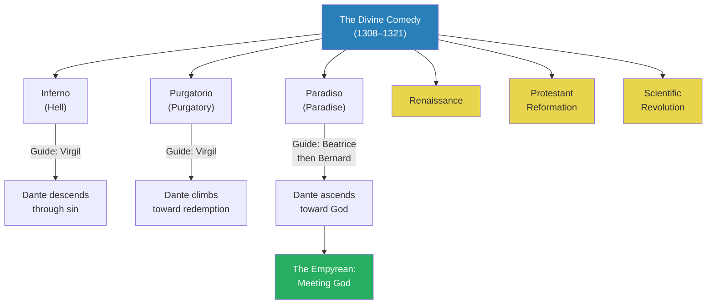
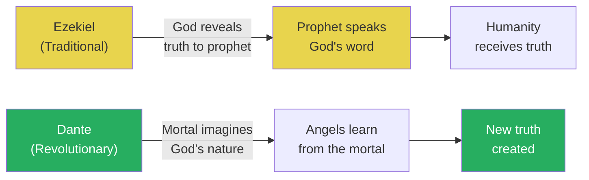
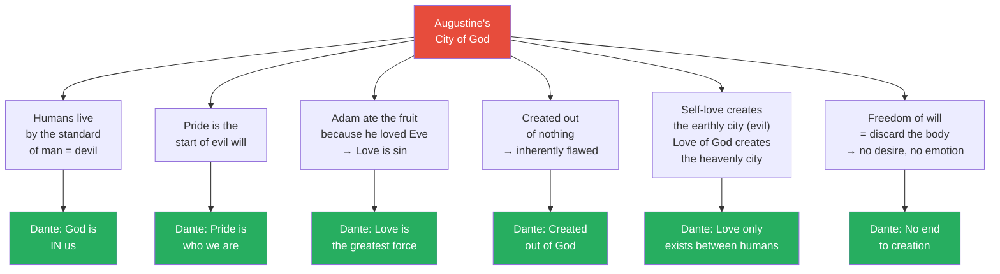
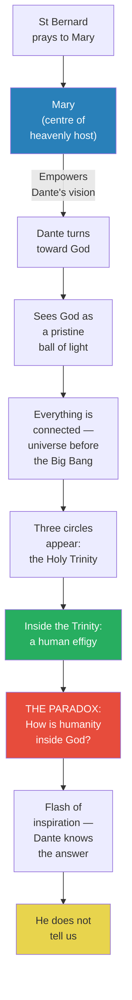
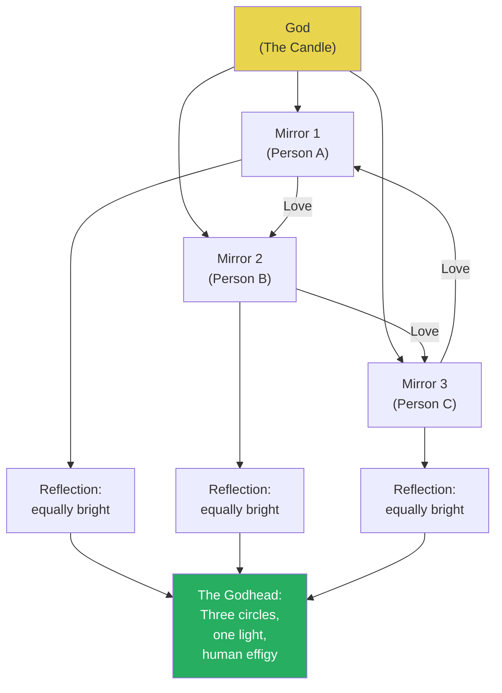
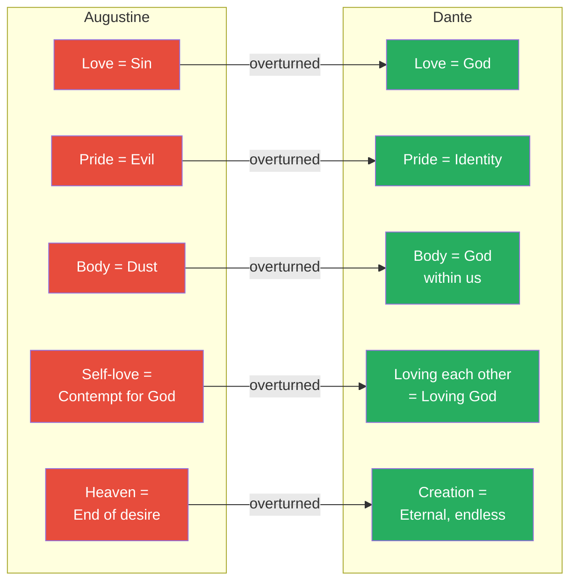

# Dante's Divine Comedy and the Liberation of the Human Imagination

> Prof. Jiang calls Dante the height of civilisation — someone you could study for a lifetime and never exhaust. In this first of two lectures on the Divine Comedy, he traces Dante's mission to meet God at the end of Paradise and reveal the deepest secret of the universe. What Dante discovers is a paradox: the human image exists inside the Holy Trinity. Through a mirror experiment embedded early in the poem and a series of nested paradoxes, Dante arrives at an answer that overturns five centuries of Augustinian theology — God is love, love is God, and because love burns in every human being, we are not born in sin but born of God. If Homer was the father of Greek civilisation, Dante is the father of modern European civilisation: the Divine Comedy plants the intellectual seeds of the Renaissance, the Protestant Reformation, and the Scientific Revolution.

---

## Overview: Key Highlights

- <b style="color: #27ae60">God is love, love is God</b> — the concluding revelation of the Divine Comedy: the force that moves the sun and the stars is the same force that burns between human beings
- <b style="color: #e74c3c">Dante is a direct rebuttal to Augustine</b> — every Augustinian doctrine (love is sin, pride is evil, we are born of nothing) is systematically overturned
- <b style="color: #2980b9">The Divine Comedy as intellectual jigsaw puzzle</b> — built on paradoxes and mathematical structure that unravel in the reader's mind over time, creating a new consciousness
- <b style="color: #27ae60">Mary, not Jesus, is the centre of Dante's theology</b> — the greater miracle is that a mortal woman gave birth to God, not that God died for humanity
- <b style="color: #2980b9">Apocalyptic literature tradition</b> — the Divine Comedy belongs to the genre begun by Ezekiel, but Dante overturns it: instead of God speaking through a prophet, a mortal man imagines God
- <b style="color: #e74c3c">God lacks imagination</b> — because God is omniscient and omnipresent, He cannot imagine; only mortal humans can, which is why Dante alone can reveal God's nature
- <b style="color: #2980b9">The mirror experiment</b> — Beatrice's three-mirror candle experiment proves light reflects equally at any distance, revealing the structure of the Godhead
- <b style="color: #27ae60">The human effigy inside the Holy Trinity</b> — the deepest secret of the universe: we are within God because God's love burns in every person
- <b style="color: #2980b9">Tuscan as the language of Europe</b> — Dante chose to write in low vernacular rather than Latin; because the poem is so magnificent, Tuscan becomes Italian
- <b style="color: #e74c3c">Dante would have been burned</b> — if the Catholic Church understood what the Divine Comedy actually says, they would have destroyed it and executed its author
- <b style="color: #27ae60">Imagination as divine act</b> — when we imagine and love, we continue God's legacy of creation; there is no end to the universe, only endless creation
- <b style="color: #2980b9">Blueprint for three revolutions</b> — the Renaissance, the Protestant Reformation, and the Scientific Revolution are all seeded in the Divine Comedy's paradoxes

| Concept | One-line summary |
|---------|-----------------|
| **Comedia** | Dante's original title — "comedy" means written in low/vernacular style for ordinary people, not in Latin for elites |
| **Paradox** | A truth that seems like a contradiction — Dante's primary literary device throughout the Divine Comedy |
| **Apocalyptic literature** | The genre where God reveals truth through a prophet — Dante inverts it so the mortal reveals truth to heaven |
| **Empyrean** | The final level of Paradise where God dwells as a pristine ball of light, surrounded by the heavenly host |
| **The Godhead** | Three interlocking circles (the Holy Trinity) with the human effigy inside — what Dante sees when he experiences God |
| **Effigy** | A mirror image — Dante sees humanity reflected within the Holy Trinity itself |
| **The mirror experiment** | Beatrice's proof that light reflects with equal brightness at any distance — the physical metaphor for God's love |
| **Beatrice** | Dante's lifelong love, who died at 24 — she guides him through Paradise and their relationship embodies the poem's theology |
| **Bernard (St Bernard)** | The highest angel who guides Dante in the Empyrean and prays to Mary to empower Dante's vision |
| **Squaring the circle** | The phrase originates here — the ultimate paradox Dante cannot solve through reason alone |
| **Virgin Mother** | The opening paradox of Canto 33: a mother who is a virgin, a daughter of her own son, a creature from her creator |

---

# The Lecture

## Introduction: Dante as the Height of Civilisation [0:00–7:50]

*Prof. Jiang opens with an extraordinary claim: Dante is the height of civilisation, a figure you could study for a lifetime and never fully understand. He introduces the structure, language, and literary architecture of the Divine Comedy, and makes the case that this poem is the intellectual blueprint for modern European civilisation.*

> [!tip] Core Insight
> The Divine Comedy is not a poem to be read — it is a jigsaw puzzle to be lived with. Its paradoxes and mathematical precision engage the mind so deeply that, over time, the reader's consciousness is transformed. This is how one poem created the Renaissance, the Reformation, and the Scientific Revolution.

*The Divine Comedy is a three-part spiritual journey — from the depths of hell to the presence of God — and its literary legacy seeded three revolutions that created modern Europe.*

> [!note]- Expand: Full Lecture Detail
> Prof. Jiang opens with undisguised reverence: "Today we do Dante, and Dante really is the height of civilisation. It does not get better than Dante." He tells the class he has taught Dante three times, and each time discovers new insights — his theory is that Dante is someone you could study for an entire lifetime and never truly understand his power, truth, and beauty. Two classes will be devoted to Dante, ending the first semester.
>
> He introduces the poem's original title: <b style="color: #2980b9">comedia</b> — not "The Divine Comedy," which was added later. Why "comedy"? Because in epic writing there are two styles:
> - **Tragic/High:** deals with gods and kings, written in sophisticated style
> - **Comic/Low:** deals with ordinary people, written in common vernacular
>
> Dante chose the low style deliberately. At this period in European history (1308–1321, the thirteen years Dante spent writing), the high language was Latin. Dante chose to write in <b style="color: #2980b9">Tuscan</b> — the local language of Florence. This was revolutionary: because the *comedia* is so magnificently produced, Tuscan will become the official language of the entire Italian peninsula. "Today in Italy, they speak the Tuscan dialect because of the Divine Comedy."
>
> The poem's structure: an epic divided into three parts. Dante goes on a spiritual journey into the cosmos to seek truth, to seek God:
> - **Inferno** (Hell) — guided by Virgil
> - **Purgatorio** (Purgatory) — the mountain between hell and paradise
> - **Paradiso** (Paradise/Heaven) — guided by Beatrice, then by St Bernard
>
> Prof. Jiang explains two literary devices that Dante uses throughout:
> - <b style="color: #2980b9">Paradox</b> — "a truth that seems like a contradiction." He gives the Zen example: "What is the sound of one hand clapping?" The Divine Comedy is saturated with paradoxes
> - <b style="color: #2980b9">Mathematical structure</b> — the poem is "mathematically precise, brilliant." There is deep mathematics embedded throughout
>
> He then delivers the key metaphor: the Divine Comedy is an intellectual jigsaw puzzle. The human mind does not like contradictions or paradoxes. If you engage with the poem, you become enthralled, obsessed — and then your mind will slowly, over time, all by itself, start to unravel these paradoxes and create a new truth of the universe.
>
> The stakes: "We are talking about the creation, through the Divine Comedy, of a new mind for humanity." If Homer was the father of Greek civilisation, then <b style="color: #27ae60">Dante is the father of modern European civilisation</b>. The Divine Comedy becomes the intellectual blueprint for three major movements:
> - The <b style="color: #2980b9">Renaissance</b> — which starts in Florence, Dante's city
> - The <b style="color: #2980b9">Protestant Reformation</b> — a religious revolution against the Catholic Church
> - The <b style="color: #2980b9">Scientific Revolution</b>
>
> Prof. Jiang promises to show how the seeds of all three revolutions are imprinted in the poetry.

---

## The Apocalyptic Tradition — and Dante's Inversion [7:50–10:00]

*Prof. Jiang situates the Divine Comedy within the apocalyptic literature tradition beginning with Ezekiel — then shows how Dante completely overturns this tradition by replacing God's revelation with human imagination.*

*In the apocalyptic tradition, truth flows downward from God to prophet to humanity. Dante reverses the direction: truth flows upward from mortal imagination to the heavenly host.*

> [!note]- Expand: Full Lecture Detail
> Prof. Jiang introduces the literary genre: <b style="color: #2980b9">apocalyptic literature</b>. "Apocalypse literature just means God reveals the truth to us through a prophet or a poet." He traces it to Ezekiel, one of the earliest books of the Hebrew Bible.
>
> The pattern in Ezekiel:
> - Ezekiel, an Israelite prophet, ascends to heaven
> - He meets monsters, demons, and angels
> - He meets God Himself
> - God gives him a scroll and says "Eat it"
> - He eats the scroll — "it was as sweet as honey"
> - He returns to Earth to speak God's words to the Israelites
>
> This establishes the tradition: a prophet is someone who speaks the word of God. Truth comes from God, passes through the prophet, and reaches humanity.
>
> Prof. Jiang then delivers the key claim: "What Dante will do is completely overturn this tradition." In Dante's version, the flow of truth is reversed. God does not know who He is. The angels do not know who God is. Only Dante — a mortal man — has the capacity to imagine God's nature. This is because <b style="color: #e74c3c">God, being omniscient and omnipresent, lacks imagination</b>. If you know everything and are everywhere, you cannot imagine anything — imagination requires uncertainty, limitation, mortality.

---

## Augustine's Dark Ages — the World Dante Must Overturn [10:00–17:30]

*Prof. Jiang reviews six key doctrines from Augustine's City of God to remind the class what mentality produced the Dark Ages — and to set up Dante's systematic rebuttal of every one of them.*

> [!tip] Core Insight
> Augustine's theology created five centuries of darkness by declaring human nature evil, love sinful, pride demonic, and the body worthless. Dante's mission is to dismantle every single one of these claims.

*Every Augustinian doctrine on the left (red) is systematically overturned by Dante on the right (green). The Divine Comedy is a point-by-point rebuttal of the theology that created the Dark Ages.*

> [!note]- Expand: Full Lecture Detail
> Prof. Jiang returns to Augustine's *City of God*, which he covered in Lecture 27. He reads six quotes to reconstruct the Dark Ages mentality:
>
> **Doctrine 1 — Human nature is demonic:**
> - "When man lives by the standard of man and not by the standard of God, he is like the devil"
> - The devil is within us — we must constantly fight against our own nature to be with God
>
> **Doctrine 2 — Pride is the root of evil:**
> - "Could anything but pride have been the start of the evil will?"
> - Pride is used almost synonymously with "ego" — we are born proud and will strive for godhood if allowed
>
> **Doctrine 3 — Love is sin:**
> - "His was a venial transgression when he refused to desert his wife's companion"
> - Adam ate the fruit because he loved Eve — therefore <b style="color: #e74c3c">love causes sin</b>
> - If you love, you will commit sin; you cannot trust love
>
> **Doctrine 4 — We are made of nothing:**
> - "Its falling away from its true being is due to its creation out of nothing"
> - If God created us, why are we bad? Because God created us out of dust, out of nothing
> - "We are a failed science experiment"
>
> **Doctrine 5 — Self-love is evil:**
> - "The earthly city was created by self-love reaching the point of contempt for God, the heavenly city by the love of God"
> - When we love ourselves, we create evil; when we love God, we do good
>
> **Doctrine 6 — Freedom means discarding the body:**
> - In heaven, "there will be freedom of will" — meaning we discard our bodies and only our souls remain
> - The body is flawed because it is made of dust; the soul is perfect because God breathed it in
> - Without bodies: no desire, no sex, no hunger, no fighting, no emotions
> - All that remains is "to enjoy unfailingly the light of eternal joys"
>
> Prof. Jiang summarises the Dark Ages worldview: "It is a negation of human will. It is a contempt for human love. It is a distrust of all human agency. And these ideas are what will lead to the Dark Ages."
>
> Then the pivot: <b style="color: #27ae60">"Dante is trying to rebut Augustine and free us from the Dark Ages."</b>

---

## The Empyrean: Dante's Mission to Meet God [17:30–27:10]

*Prof. Jiang walks the class through Canto 33 of Paradiso — the final canto of the entire Divine Comedy. Dante stands before God in the Empyrean, guided by St Bernard and empowered by the prayers of Mary and all of heaven. What follows is an extraordinary sequence: Dante sees God as the universe before the Big Bang, perceives the Holy Trinity as three circles, and discovers the deepest secret — the human effigy exists inside God.*

*Dante's journey culminates in the ultimate paradox: a human mirror image exists within the Holy Trinity. He solves it — then refuses to tell the reader, because the jigsaw puzzle only works if you assemble it yourself.*

> [!note]- Expand: Full Lecture Detail
> Prof. Jiang sets the scene. Dante is in the <b style="color: #2980b9">Empyrean</b> — the final level of Paradise. He has a mission: to meet God and tell us who God is. Because God does not know, and neither do any of the angels around Him. The reason: "If God is omniscient and omnipresent — if He knows everything and is everywhere — then God, by definition, lacks an imagination."
>
> **The Scene in the Empyrean:**
> - To the left is God — a pristine ball of light
> - The heavenly host surrounds Him — angels who have proved themselves worthy
> - At the very centre of the host is Mary (not Jesus)
> - St Bernard guides Dante
>
> Prof. Jiang pauses on this structural choice: <b style="color: #27ae60">in Dante's rendering, Mary is at the centre of Christian theology, not Jesus</b>. The question: "Is it a greater miracle that a god could come to earth and die for our sins, or is it a greater miracle that a mortal woman is able to give birth to a god?"
>
> **The Prayer to Mary (Canto 33 opening):**
>
> Bernard invokes Mary's love to empower Dante. The opening lines are saturated with paradoxes:
> - "Virgin Mother" — a mother who gives birth without sex
> - "Daughter of your son" — Mary is the daughter of Jesus, who is her son
> - "Creature from its creator" — God was born of His own creation
>
> > [!quote] Dante, Paradiso Canto 33
> > "Virgin mother, daughter of your son, more humble and sublime than any creature."
>
> **The Radical Claim — Bernard burns for Dante's vision:**
> - Bernard, the highest of the angels, says: "I never burned for my own vision more than I burned for yours"
> - This means: even the highest angel wants to know the truth, and only Dante — a mortal man — can provide it
> - <b style="color: #e74c3c">"If the Catholic Church actually understood any of this, Dante would have been burned"</b>
>
> **Mary's Love Overcomes Sin:**
> - If everyone is born in sin (as Augustine claims), how to explain Mary?
> - If Mary had sin, then God was born through sin
> - The only explanation: Mary cleansed herself of sin through a mother's love for her child
> - Prof. Jiang illustrates: a mother who loves her child does not give in to every demand — "I love you, therefore I will not allow you chocolate every day. I care about your health"
> - <b style="color: #27ae60">Love is the ultimate power — not the absence of sin, but the redemption from sin through love</b>
>
> **Dante Turns Toward God:**
> - Bernard prays that Mary will "disperse all the clouds of his mortality" — meaning Dante's fear and doubt
> - Bernard also asks that Dante's "sentiments preserve their perseverance" — meaning he must remember what he sees
> - Prof. Jiang notes this anticipates modern neuroscience: "You imagine the world, and then over time, you turn the world into a story, and the story becomes your memory. 800 years before, Dante knew how our brain actually works."
>
> **The Experience of God:**
> - Dante's sight "becoming pure, was able to penetrate the ray of light more deeply"
> - The key word is "vision" — not sight but imagination. "You cannot see God. You have to imagine God"
> - He is blinded: "Speech can't show at such a sight, it fails, and memory fails when faced with such excess"
> - He sees the universe before the Big Bang — everything connected, chaotic, but unified: "substances, accidents, and dispositions as if conjoined"
>
> **The Three Circles:**
> - After 20 years of meditating on the experience, Dante identifies three circles — the <b style="color: #2980b9">Holy Trinity</b>
> - "One circle seemed reflected by the second, as rainbow is by rainbow. The third seemed fire breathed equally by those two circles"
> - Separate but equal — the theological mystery of the Trinity
>
> **The Effigy — the Deepest Secret:**
> - Inside the Holy Trinity, Dante sees "our effigy" — a mirror image of humanity
> - <b style="color: #27ae60">We are in God. We are at the very essence of God</b>
> - Prof. Jiang: "This should not be happening. We are separate. God is good, we are evil — that's what Augustine told us"
> - Dante tries to understand: "As the geometer intently seeks to square the circle" — this is the origin of the phrase "squaring the circle"
> - His wings are "far too weak" — reason alone cannot solve this paradox
>
> **The Flash — and the Refusal:**
> - "Then my mind was struck by light that flashed, and with this light, received what had been asked"
> - He knows the answer. He has figured out the universe.
> - But he does not tell us: "Force failed my high fantasy, but my desire and will were moved already like a wheel revolving uniformly by the love that moves the sun and the other stars"
> - <b style="color: #e74c3c">We have journeyed through the entire Divine Comedy and Dante will not reveal the answer</b>
> - Why? Because it is a jigsaw puzzle. It only works if you spend the time putting the pieces together yourself. Dante spent 20 years doing this. It is a lifetime journey.

---

## The Mirror Experiment — Beatrice Invents Science in Heaven [27:10–40:10]

*Prof. Jiang jumps back to the beginning of Paradise to unlock the answer Dante withheld. Beatrice and Dante, reunited in heaven, immediately start asking questions about the universe — and when Dante proposes a wrong theory about the moon, Beatrice demands they run an experiment. The three-mirror experiment becomes the key to understanding the Godhead.*

> [!tip] Core Insight
> Beatrice's mirror experiment is not a footnote in the poem — it is the answer to the poem. God is the candle that burns in every human being. The more you love, the brighter it burns, and no matter how far the reflection travels, the light never diminishes. This is why the human effigy is inside the Holy Trinity.

```mermaid
flowchart LR
    Q["Why are there<br/>dark spots<br/>on the moon?"]
    Q --> DT["Dante's theory:<br/>dense vs hollow rock<br/>reflects/passes light"]
    DT --> R1["Beatrice refutes:<br/>solar eclipse shows<br/>no holes in moon"]
    R1 --> R2["Beatrice refutes:<br/>spiritual light reflects<br/>equally everywhere"]
    R2 --> E["THE EXPERIMENT:<br/>Three mirrors<br/>+ one candle"]
    E --> P["Candle reflects<br/>with equal brightness<br/>in all three mirrors"]
    P --> I["Infinite layers<br/>= still equally bright"]
    I --> G["The Godhead:<br/>three circles =<br/>three mirrors"]
    style Q fill:#2980b9,color:#fff
    style E fill:#27ae60,color:#fff
    style G fill:#27ae60,color:#fff
    style DT fill:#e74c3c,color:#fff
```

*The question about the moon's dark spots leads to an experiment that unlocks the nature of God. Dante's wrong answer (dense vs. hollow rock) is refuted by Beatrice, who designs a physical experiment — in heaven — to prove that divine light never diminishes.*

> [!note]- Expand: Full Lecture Detail
> Prof. Jiang tells the class he will now give them his answer to the jigsaw puzzle — "it may not be the best answer, it may not even the right answer, but it's an answer." He jumps back to the beginning of Paradise.
>
> **Beatrice and Dante in Heaven:**
> - Beatrice is someone Dante loved all his life — they met when they were 10 years old
> - Their families were friends, but Beatrice came from a wealthier, higher-status family
> - She was betrothed to someone of her social station and died at 24 giving birth
> - Dante never forgot her — he wrote poetry after poetry celebrating her
> - He wrote the Divine Comedy for her, and she repaid him by guiding him through Paradise
>
> > [!example] Dante and Beatrice's Reunion in Paradise
> > - They are reunited in heaven after a lifetime of separation
> > - You might expect them to embrace, make love, eat chocolate — enjoy paradise
> > - Instead, the very first thing they do is start asking questions about the universe
> > - "How do the stars work? How does the moon work?"
> > - Beatrice says: "Direct your mind to God in gratefulness — He has brought us to the first star" (the moon)
> > - Dante immediately responds: "Thank you — but now tell me, what are the dark marks on this planet's body?"
> > **The lesson:** For Dante, the highest form of love is not physical or emotional — it is the shared pursuit of truth. Paradise is not rest; it is endless curiosity.
>
> **Dante's Theory of the Moon:**
> - Dante proposes: the moon has parts that are dense (rock, which reflects light) and parts that are rare/hollow (which let light pass through), creating dark spots
> - This was the generally accepted theory of the time
>
> **Beatrice's Refutation:**
> - First rebuttal: if parts of the moon are completely hollow, why does the moon block the sun completely during a solar eclipse? There should be holes where light comes through
> - Second rebuttal: even if the dark spots are deep caverns rather than holes, Beatrice invokes the spiritual principle — in the spiritual universe, all light reflects brightly no matter where it is, because light comes from the essence of God
>
> **The Experiment:**
> - Dante does not believe her. He thinks "she's full of crap"
> - <b style="color: #27ae60">Beatrice's response: "Let's do an experiment"</b>
> - Prof. Jiang pauses: "They're in heaven, and they do an experiment. Why? Because Dante doesn't believe her. This is not a revolution? If you don't believe someone, do an experiment. It's okay to doubt. Doubt is heavenly. It's divine."
>
> The experiment:
> - Take three mirrors and a candle
> - Place two mirrors at equal distance from you, the third farther back between the two
> - Light the candle at your back so it kindles all three mirrors
> - In the third mirror, the image will be smaller — but the candle will be just as bright
> - This is physically true — you can do this at home
>
> **Scaling the experiment:**
> - Add a second layer: five mirrors. Still equally bright
> - A third layer. Still equally bright
> - A million layers. Still equally bright
> - <b style="color: #27ae60">No matter how far the candle is, if it is reflected from the first candle, it will be just as bright</b>
>
> **The Revelation — the Mirror Experiment IS the Godhead:**
> - Three mirrors reflecting a single candle = three circles containing a human image
> - This is exactly what Dante saw when he experienced God: three circles with the human effigy inside
> - The candle is God's love — it burns in every human being
> - The more you love one another, the brighter the candle burns, and the closer you are to God
> - <b style="color: #27ae60">"When you love, you experience God. That is why you are without sin when you love."</b>

*The mirror experiment maps directly onto the Godhead. God is the candle; each person is a mirror reflecting that light. Love between people is what keeps the light burning at full brightness. The three mirrors are the three circles of the Holy Trinity — and the reflection in each mirror is the human effigy Dante saw inside God.*

---

## The Ending — and the Answer [40:10–45:00]

*Prof. Jiang reads the final lines of the Divine Comedy again, now decoded. He then systematically overturns each of Augustine's six doctrines with Dante's answers, showing that the Divine Comedy is a point-by-point liberation of humanity from the Dark Ages.*

*The Divine Comedy as a systematic dismantling of Augustinian theology. Each red doctrine that imprisoned Europe in the Dark Ages is replaced by a green liberation that seeds modernity.*

> [!note]- Expand: Full Lecture Detail
> Prof. Jiang re-reads the final lines of the Divine Comedy with the mirror experiment as decoder ring:
>
> > [!quote] Dante, Paradiso Canto 33
> > "Force failed my high fantasy, but my desire and will were moved already like a wheel revolving uniformly by the love that moves the sun and the other stars."
>
> He explains: "God is love. Love is God. Love is the universe. It is the force that binds everything together. It is the unifying force of the universe." But crucially: "Before we could only see — but now we can imagine. God is something you cannot see. God is something that you must imagine."
>
> **Dante's Rebuttal of Augustine — Point by Point:**
>
> Prof. Jiang returns to the Augustine slide and systematically overturns each doctrine:
>
> - **"Man lives by the standard of man, not God — he is like the devil"**
>   - Dante: We are in God because <b style="color: #27ae60">God is in us</b>. God is the candle, the love that burns in us. If we love, the candle burns brighter, bringing us closer to God
>
> - **"Pride is the start of the evil will"**
>   - Dante: Pride is who we are. We all strive to be better. This is not evil — it is our nature
>
> - **"Love is sin" (Adam ate the fruit because he loved Eve)**
>   - Dante: <b style="color: #27ae60">Love is the greatest force in the universe, because it IS God</b>
>
> - **"Created out of nothing"**
>   - Dante: We are created out of God. God is in us. God is with us
>
> - **"The heavenly city was created by the love of God, the earthly city by self-love"**
>   - Dante: Love only exists between humans. You cannot love money. You cannot love chocolate. You can only love each other, because God is within us. <b style="color: #e74c3c">If you love God as an abstraction, you miss the point — you have to love Beatrice, your mother, your son</b>
>
> - **"In heaven there will be freedom of will — enjoying the delight of eternal joys"**
>   - Dante: There is no end to the universe. At no point will we know everything. We exist because we are continuing God's legacy. <b style="color: #27ae60">When we imagine, we are engaged in the act of creation. That is God. We are like God</b>
>
> Prof. Jiang delivers the conclusion: "When we imagine, when we love — that is our ultimate mission in life. To love and to imagine, because then we create new worlds for God to celebrate."

---

## The Question of Audience and Translation [40:27–45:00]

*A student asks who Dante was writing for. Prof. Jiang explains Dante's deliberate strategy of writing in Tuscan to avoid the Catholic Church's Latin-centric censorship, his use of patronage as a pretext, and why translation makes close reading impossible.*

> [!note]- Expand: Full Lecture Detail
> A student asks: who is Dante writing to? Who is his audience?
>
> Prof. Jiang explains the strategic choice:
> - He writes in Tuscan rather than Latin — partly to avoid the Catholic Church, which operated primarily in Latin
> - "If the Catholic Church actually understood what he was doing, they would have basically burned his manuscript"
> - But he is not writing for any particular audience: "He's really writing for the universe, if that makes any sense"
> - The poem is a "secret box" — someone in the future will come, read it, be curious, and over time it will transform how they see the world
> - "He's a prophet. He's a poet. He's not writing to make money. He's writing because he has a moral mission to speak the truth. When you speak the truth, you're speaking to the universe, not to an individual."
>
> On patronage:
> - Dante did have a patron (a count) — this was necessary for funding
> - Parts of the Divine Comedy clearly appeal to the patron
> - But the patron is a pretext: "What drives him is he believes God has spoken to him, and he believes that he knows God. He believes that in the Divine Comedy are the secrets of the universe. He himself probably doesn't know all the secrets, but he believes that they're all there, if someone is willing to look hard enough."
>
> On translation:
> - The translation used in class is by <b style="color: #2980b9">Allen Mandelbaum</b> — "the most relatable, the most accessible"
> - Other translations exist: Longfellow (beautiful but complicated), Ezra Pound, and others
> - Because the poem was written in Tuscan, close reading of diction is impossible — "it depends on the translation"
> - Close reading will come when the series reaches English literature (Shakespeare, Milton)

---

## Connections

**Builds on:** [[27 - Augustine's Empire of God]] — Augustine's six doctrines (love is sin, pride is evil, we are created from nothing, self-love is contempt for God) are the direct target of Dante's rebuttal. This lecture is impossible to understand without Augustine as the adversary. [[07 - Homer's Iliad and the Birth of Greek Civilization]] — Prof. Jiang explicitly positions Dante as "the second coming of Homer": if Homer created Greek civilisation through epic poetry, Dante creates modern European civilisation through the Divine Comedy.

**Sets up:** [[30 - Dante as the Second Coming of Homer]] — the second lecture on Dante will continue exploring his civilisation-creating legacy. [[42 - The Protestant Reformation and the Birth of Capitalism]] — the Protestant Reformation is one of the three revolutions seeded in the Divine Comedy. [[43 - The Structure of Scientific Revolutions]] — the Scientific Revolution is another.

**Recurring themes:**
- Religion as civilisation driver (Lecture 1) — Dante's poem creates a new religious consciousness that births modern Europe
- Charismatic leaders / prophets (Lecture 1) — Dante as poet-prophet, writing not for money or patronage but because he has a moral mission to speak truth
- Debunking traditional narratives (Lecture 1) — Dante overturns the entire Augustinian paradigm that defined five centuries
- Philosophy as proto-religion (Lecture 10) — Plato's forms and the Allegory of the Cave prefigure Dante's claim that truth must be imagined, not seen

**Related books in vault:**
- [[Sapiens - Yuval Noah Harari]] — Harari's argument about shared myths creating collective reality mirrors Dante's claim that the Divine Comedy transforms consciousness through its paradoxes
- [[The 48 Laws of Power - Robert Greene]] — Dante's decision to write in Tuscan rather than Latin, disguising revolutionary ideas under the cover of vernacular comedy, parallels Greene's strategies of concealing true intentions

---

## The Takeaway

This lecture reframes the Divine Comedy from a literary masterpiece into a civilisational weapon. Prof. Jiang's argument is not that Dante wrote beautiful poetry about God — it is that Dante engineered a cognitive device designed to dismantle five centuries of Augustinian thought and replace it with a worldview that celebrates human agency, love, imagination, and the endless pursuit of truth. The three revolutions that follow (Renaissance, Reformation, Scientific Revolution) are not coincidental — they are the predictable consequences of a poem that told Europeans, for the first time in 500 years, that they were not born evil, that love was not sin, and that curiosity was not a crime.

The most counterintuitive insight is the reversal of the apocalyptic tradition. In every previous version, God speaks truth downward to humanity through a prophet. Dante inverts this: God does not know who He is because omniscience eliminates imagination. Only a mortal — limited, uncertain, flawed — can imagine God's nature. This makes human limitation not a weakness but a superpower. It is precisely because we do not know everything that we can imagine anything. The angels, who know more than us, cannot do this. God Himself, who knows everything, cannot do this. Dante alone can, and the entire heavenly host prays for his success.

The mirror experiment is the lecture's structural masterpiece. A question about dark spots on the moon leads to a physical experiment in heaven, which leads to a proof that light never diminishes with distance, which maps directly onto the Godhead — three circles reflecting one flame, with the human image visible in each. God is the love that burns in us. The more we love each other, the brighter it burns. When we imagine, we create new worlds. That is our divine purpose — not obedience, not the suppression of desire, not the mortification of the body, but the endless, joyful act of creation through love and imagination.
