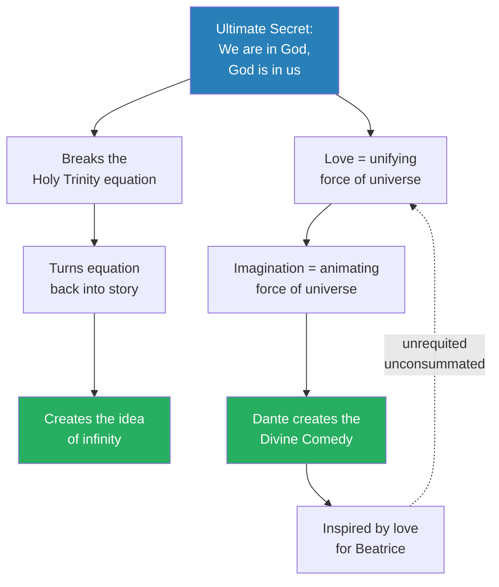
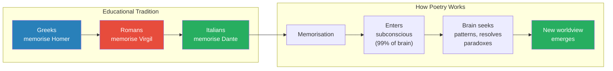
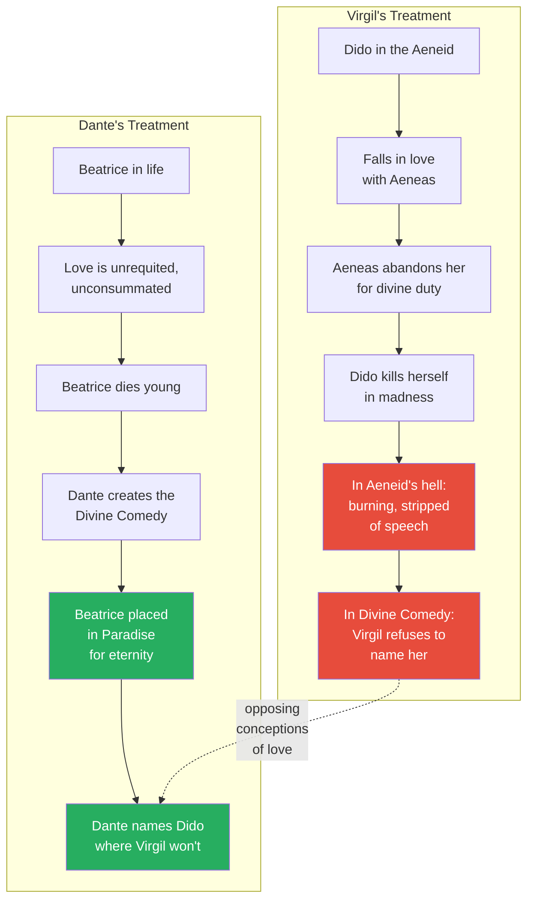
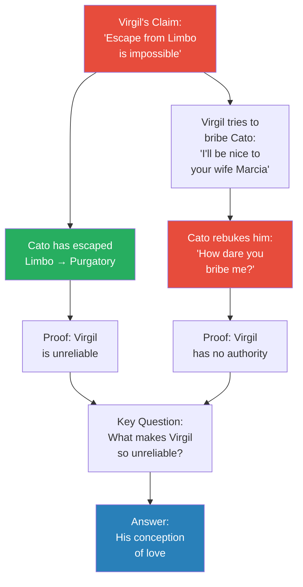
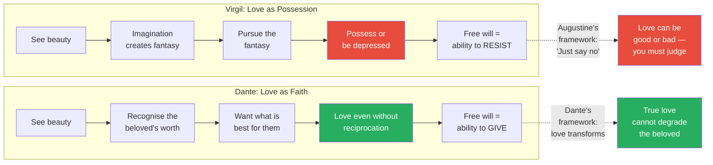
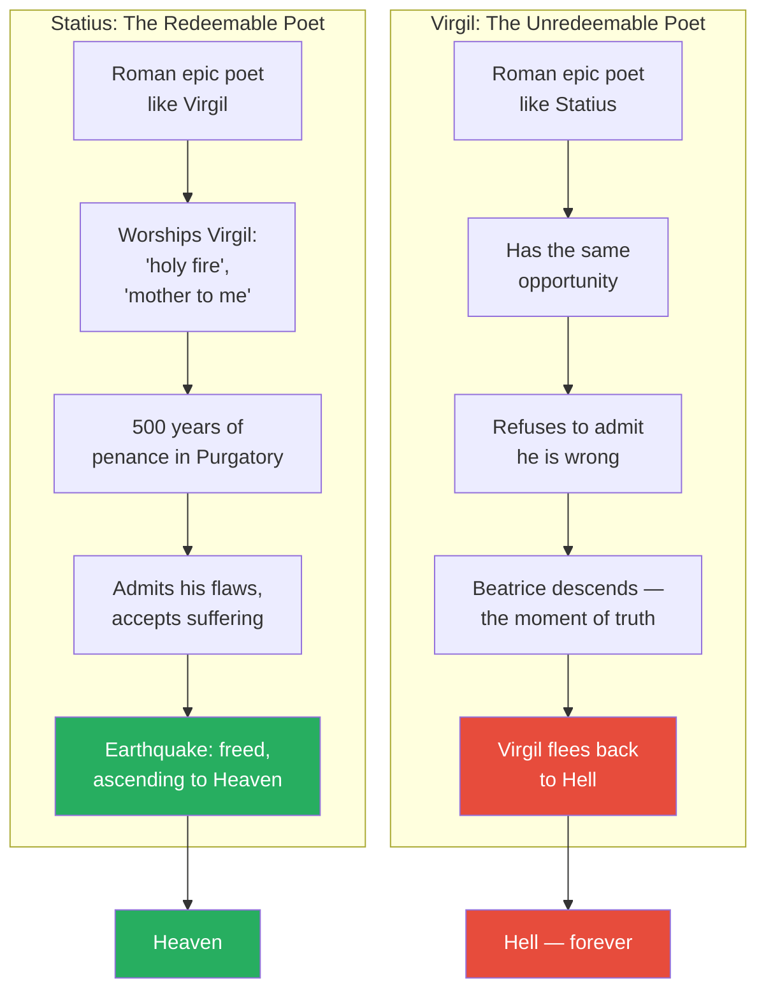
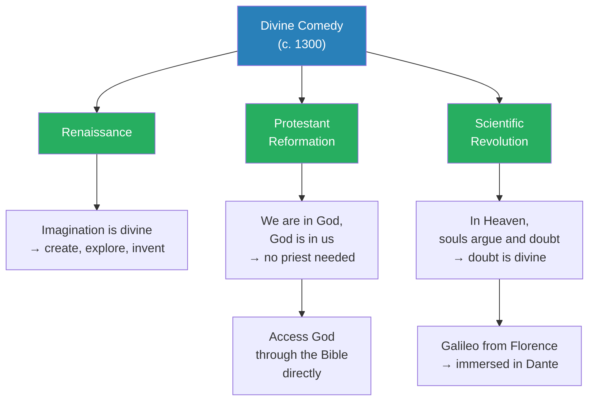

# Dante as the Second Coming of Homer

> In this final lecture before the semester break, Prof. Jiang reveals Dante's master strategy in the Divine Comedy: how to perform brain surgery on an entire civilisation. Virgil's Aeneid had been the foundational text of the European mind for a thousand years, and Dante understood that to create a new worldview he had to displace the old one — not by attacking Virgil directly, but by making Virgil the hero of his poem and then systematically revealing him as an unreliable narrator whose conception of love is fundamentally broken. Through a close reading of four passages from Inferno, Purgatory, and Paradise, Prof. Jiang traces Dante's literary coup: Virgil refuses to name Dido, lies about the rules of Limbo, fails to impress Cato, defines love as possession, and finally flees the moment Beatrice appears — choosing hell over admitting he was wrong. The poem's genius is that the reader absorbs all this subconsciously, and the Aeneid dissolves from the mind as the Divine Comedy takes its place, seeding the Renaissance, the Reformation, and the Scientific Revolution.

---

## Overview: Key Highlights

- <b style="color: #27ae60">Dante's true enemy is Virgil, not Augustine</b> — to create a modern mind, Dante must displace the Aeneid from Europe's collective subconscious
- <b style="color: #2980b9">The unreliable narrator</b> — Dante makes Virgil the hero-guide of the Divine Comedy, then systematically reveals him as untrustworthy
- <b style="color: #e74c3c">Virgil's conception of love is possession</b> — see something beautiful, turn it into a fantasy, chase it until you own it; this is the worldview Dante must destroy
- <b style="color: #27ae60">Dante's conception of love is faith</b> — love is not about possession but about wanting what is best for the other person, even if you can never have them
- <b style="color: #2980b9">Poetry as brain surgery</b> — poetry is memorised, enters the subconscious, and becomes the building blocks of how the brain understands the world
- <b style="color: #e74c3c">Virgil damns Dido into hell; Dante sends Beatrice into heaven</b> — their treatment of the women they write about reveals everything
- <b style="color: #2980b9">Cato's escape from Limbo</b> — proves Virgil lied about the rules of the afterlife; merit alone can elevate a soul
- <b style="color: #e74c3c">Virgil flees when Beatrice descends</b> — he would rather burn in hell for eternity than admit his understanding of love is wrong
- <b style="color: #27ae60">Statius chose penance; Virgil refused</b> — the difference between Purgatory and Hell is willingness to admit you are wrong
- <b style="color: #2980b9">The Divine Comedy as industrial blueprint</b> — it seeds the Renaissance (imagination), the Reformation (direct access to God), and the Scientific Revolution (the divinity of doubt)
- <b style="color: #27ae60">Galileo grew up immersed in the Divine Comedy</b> — the link between Dante's Florence and the father of modern science is not accidental
- <b style="color: #e74c3c">You cannot save those who refuse to be saved</b> — Beatrice's final instruction to Dante as Virgil disappears

| Concept | One-line summary |
|---------|-----------------|
| **Unreliable narrator** | A guide who appears trustworthy but is systematically revealed as wrong |
| **Poetry as superfood** | Memorised verse rewires the subconscious mind, reshaping how the brain models the world |
| **Love as possession (Virgil)** | See beauty, fantasise, pursue, possess — a transactional, controlling conception |
| **Love as faith (Dante)** | Want what is best for the beloved, even at the cost of never possessing them |
| **Purgatory vs. Hell** | Both hold sinners — the difference is willingness to admit fault and do penance |
| **Limbo** | A theological device for virtuous pagans born before Christ — Virgil claims escape is impossible |
| **Cato** | Roman patriot who escaped Limbo through merit alone, disproving Virgil's claims |
| **Statius** | Roman poet in Purgatory who worships Virgil but surpasses him in spiritual growth |
| **Dido** | Virgil's literary creation, damned and unnamed — a mirror of his hatred, contrasting Dante's love for Beatrice |
| **Thomas Aquinas** | Theologian whose ideas align with Dante's, but philosophy lacks poetry's power to reshape the subconscious |

---

# The Lecture

## Review: The Secrets of the Divine Comedy [0:00 - 3:00]

*Prof. Jiang opens the final pre-break session by reviewing the three key insights from the previous lecture on Dante — the ultimate secret of the universe, the historical significance of the Divine Comedy, and the identification of Virgil as Dante's true enemy.*

*The Divine Comedy's theological architecture: the secret that we are within God transforms the Trinity from an exclusionary equation into an open-ended story, empowering human imagination as a continuation of God's creative work.*

> [!note]- Expand: Full Lecture Detail
> - Prof. Jiang reminds the class of three points from the previous lecture
> - **Point 1:** The ultimate secret embedded in the Divine Comedy is that we are in God, and God is in us
>   - This breaks apart the Holy Trinity, which is an equation that makes God exclusive from humanity
>   - At the end of the Divine Comedy, Dante inserts humanity back into God
>   - This turns the equation back into a story — "a story that we are empowered to write"
>   - It creates the idea of infinity
> - The foundation of this idea goes back to Homer: for Dante, <b style="color: #27ae60">love is the unifying force of the universe</b>
>   - God is the force within us that enables us to love and connect with others
>   - Imagination is the animating force — the more we love, the more we can imagine
>   - It is our responsibility, our legacy, our gift to imagine the universe and continue the work of God
> - The prime example is Dante himself — his love for Beatrice inspired the Divine Comedy
>   - Their love was unrequited: they never married, never consummated their love
>   - Beatrice died young, but Dante never forgot her
>   - That love produced "the greatest literary achievement in human history"

---

## Poetry as Brain Surgery [3:00 - 10:00]

*Prof. Jiang explains WHY the Divine Comedy was so historically significant despite being difficult to understand — because poetry is not consumed like prose but memorised like food, entering the subconscious and becoming the architecture of thought itself. He then reveals Dante's master strategy: making his true enemy, Virgil, the hero of the poem.*

> [!tip] Core Insight
> Poetry is a superfood for the brain. You are what you eat, and your brain thinks the way it has consumed information. Memorised poetry enters the subconscious and becomes the building blocks of your psyche — which is why displacing one poem with another is the most powerful revolution possible.

*Each civilisation was shaped by the poem it memorised. Dante understood that to create the modern mind, he had to replace Virgil in the same way Virgil had replaced Homer.*

> [!note]- Expand: Full Lecture Detail
> - **Point 2:** The Divine Comedy is historically significant because it becomes an industrial blueprint for the Renaissance, the Protestant Reformation, and the Scientific Revolution
> - The obvious question: "When I read the Divine Comedy, I don't really understand what's going on — so how did it come to be so historically significant?"
> - The answer is that it is <b style="color: #2980b9">poetry</b>, and poetry is a unique form of writing
>   - Poetry is meant to be memorised — this was how education worked for a thousand years in Western history
>   - The Greeks memorised Homer, the Romans memorised Virgil, the Italians memorised Dante
> - Prof. Jiang introduces an analogy: "Think of poetry as a superfood for the brain"
>   - "You are what you eat, and your brain thinks the way that it has consumed information"
>   - Poetry is "extremely dense, nutritious food that the brain will use to formulate its understanding of the world"
> - The brain works 99% subconsciously — "we are not consciously aware of what the brain is doing most of the time"
>   - What the brain does most of the time is try to figure out the patterns of the universe
>   - <b style="color: #27ae60">The brain does not like paradoxes, mysteries, or contradictions</b> — it is always trying to resolve them
>   - The Divine Comedy is full of paradoxes which force the brain to constantly work to resolve them
>   - The greatest paradox: that we are within God
>   - Once the brain resolves this paradox, it formulates a new understanding of the world
>   - That new understanding becomes "the Renaissance brain, the scientific brain, which will power the rise of modernity"
> - **Point 3 — the most important:** Dante's true enemy is not Augustine but <b style="color: #e74c3c">Virgil</b>
>   - At this time, every educated individual was educated through Virgil
>   - Virgil's understanding of the world captured the imagination of the European mind
>   - Dante's mission: to supplant Virgil — "to remove Virgil from the brain, the mind of the European"
>   - "He basically needs to poetically do surgery"
> - But direct confrontation would fail:
>   - If Virgil is the basis of your mind, you cannot enter open conflict with him
>   - "People will choose their customs, their habits first — if you threaten their habits and customs, they will see you as a threat and reject you"
> - <b style="color: #27ae60">Dante's solution is brilliantly counterintuitive: he makes Virgil the hero of the Divine Comedy</b>
>   - Virgil is the guide, the narrator, the protagonist
>   - The poem opens with Dante lost in the woods (a metaphor for midlife crisis), and Virgil appears, sent by Beatrice, to guide him through Hell and Purgatory
> - Three things then happen in sequence:
>   1. Virgil is established as the hero and guide — the reader trusts him
>   2. Virgil is revealed as an unreliable guide — he contradicts himself, tells falsehoods
>   3. Virgil is gradually displaced by other figures, culminating in Beatrice
> - "It is one of the greatest literary tricks" — to defeat your nemesis, you make him your hero
> - The reader absorbs this subconsciously: "If you were to read the Divine Comedy by yourself, you wouldn't notice it"
>   - But the brain will slowly pick up the problems with Virgil and construct a new worldview that is "anti-Virgil and pro-Dante"

---

## Passage 1: Dido in Hell — Virgil's Venom, Dante's Mercy [10:48 - 20:00]

*Prof. Jiang walks the class through the first proof of Virgil's unreliability: in the circle of Hell reserved for those who sinned through love, Virgil names every spirit in the parade of the lustful — except one. He refuses to acknowledge Dido, his own literary creation, whom he damned to hell and stripped of speech in the Aeneid. Dante names her instead.*

*The mirror structure reveals everything: Virgil punishes the woman who refused him; Dante immortalises the woman he could never possess. Their treatment of the women they write about exposes their incompatible conceptions of love.*

> [!note]- Expand: Full Lecture Detail
> - Virgil and Dante enter Limbo, the outermost circle of Hell — a pleasant place reserved for virtuous pagans born before Jesus
>   - You can only be saved if you are baptised into the faith
>   - Those born before Christ lack baptism, so they are placed in Limbo
>   - Virgil himself is one of them, alongside Plato, Homer, and Julius Caesar
> - Dante asks: is this an iron law, or were there exceptions?
>   - Virgil answers: only once in history — when Jesus died and descended into Hell, he took the most virtuous figures from the Hebrew Bible (Abel, Adam, Noah, Moses, Abraham, David) into heaven
>   - "But that was it" — a one-time event that will never recur
> - They move deeper into Hell, to the first inner circle — reserved for those who sinned through love or lust
> - A parade of spirits passes before them: Semiramis, Cleopatra, and hundreds more
> - Virgil names every single spirit — except one
>   - "The other spirit, killed herself for love and she betrayed the ashes of Sychaeus" — this unnamed person is <b style="color: #e74c3c">Dido</b>
>   - Dido is Virgil's own literary creation from the Aeneid
> - Why is Dido in Hell? Because Virgil put her there
>   - In the Aeneid, Dido is the queen of Carthage who welcomes the shipwrecked Aeneas
>   - They fall in love, but the gods order Aeneas to continue to Rome
>   - Dido warns: "If you leave, I will kill myself"
>   - Aeneas leaves anyway — "he's pious, that's what he's famous for"
>   - Dido stabs herself and throws herself into a funeral pyre
>   - Later, when Aeneas passes through the Aeneid's underworld, Dido runs from him — she has lost even the power of speech
> - Prof. Jiang surmises: "Dido must have existed" — a real woman who possibly spurned Virgil, and Virgil took his revenge through literature
>   - <b style="color: #e74c3c">"She burns herself to death. It's a terrible way to die, and she dies driven into madness by love. You can almost make the argument that Virgil really hates this person"</b>
> - The contrast with Dante is total:
>   - Dante loved Beatrice but could not possess her
>   - So he created the Divine Comedy so that Beatrice could be in Paradise for all eternity
>   - "This is diametrically opposed"
> - Dante names Dido where Virgil refuses to: "Those spirits left the ranks where Dido suffers"
>   - "Virgil, you refuse to acknowledge your creation, but I will, because she deserves our mercy. She deserves our charity and our generosity"
> - <b style="color: #27ae60">Within the poetry, there is a massive conflict between Virgil and Dante — "and it's all very subtle"</b>

---

## Passage 2: Cato in Purgatory — Virgil's Authority Collapses [20:00 - 28:00]

*Arriving in Purgatory, Virgil and Dante encounter Cato — a Roman contemporary of Virgil who has escaped Limbo and become the guardian of Purgatory. This directly contradicts Virgil's claim that escape from Limbo is impossible. When Virgil tries to leverage his friendship and bribe Cato by offering favours to Cato's wife Marcia, Cato rebukes him. Virgil's authority and honesty are shattered in a single scene.*

> [!tip] Core Insight
> The difference between Hell and Purgatory is not the severity of the sin — it is the willingness to admit you are wrong. Those in Purgatory accept their fault and commit to penance. Those in Hell refuse to acknowledge their error. Virgil, who refuses to admit he is wrong about love, belongs in Hell by his own logic.

*Two failures in one scene: Virgil's factual claim is disproven by Cato's presence, and his attempt at social manipulation is rebuffed. Both point to the same underlying problem — Virgil's understanding of how the world works is wrong.*

> [!note]- Expand: Full Lecture Detail
> - Purgatory is an isolated mountain, the halfway point between Hell and Paradise
>   - People must ascend Purgatory to reach Paradise
> - The first person they meet is Cato — "a solitary patriarch, his aspect worthy of the reverence that even son to father owes no more"
>   - Cato is a Roman patriot who opposed Julius Caesar
>   - When Caesar was about to win the Civil War, Cato killed himself rather than submit
> - The critical detail: Cato and Virgil are contemporaries — they knew each other in Rome
>   - When they died, both went to Limbo
>   - But Cato is now in Purgatory — he has left Limbo, left Hell entirely
>   - He has become the guardian of Purgatory, controlling access
> - <b style="color: #e74c3c">This means Virgil was lying</b> — he said it was impossible for merit to leave Limbo
>   - "This right away tells us Virgil is not a reliable narrator"
> - Cato challenges them: "Who are you? How did you escape from Hell?"
> - Virgil says: "Let me do the talking, because I know this guy — we're friends"
>   - He explains he was sent by Beatrice to guide Dante through Hell and Purgatory
>   - Then Virgil makes his move: "I know who you are — you're Cato, who killed himself in Utica rather than submit to Caesar"
>   - He invokes Cato's wife Marcia, still in Limbo: "She still prays to you — for her love, allow our journey. I'll thank her for the kindness you bestow"
>   - In other words: give me access to Purgatory, and I'll be nice to your wife back in Limbo
> - Cato's response is devastating:
>   - "While I was in the other world, Marcia pleased my eyes. But now that she dwells beyond the evil river, she has no power to move me any longer"
>   - Cato is saying: <b style="color: #27ae60">how dare you bribe me? If I was able to ascend to Purgatory on my own merit, then so was Marcia. If she is not here, she is not as virtuous as I once thought</b>
> - Virgil has no authority over Cato — Cato does not respect him, even though they know each other well
> - Prof. Jiang: "Again, this is very, very clever. It's almost impossible to see unless I tell you what's happening"
> - The lecture pivots: now that Virgil is proven unreliable, what is his fundamental problem?
>   - The answer: <b style="color: #2980b9">Virgil's conception of love</b>
>   - Virgil damns Dido into Hell; Dante sends Beatrice to Heaven
>   - "These two individuals have radically opposing conceptions of love"

---

## Passage 3: Two Conceptions of Love — Virgil vs. Dante [28:00 - 35:00]

*Prof. Jiang presents the philosophical heart of the lecture: Virgil's theory of love, drawn directly from the text of the Divine Comedy, and Dante's devastating response. Virgil defines love as a natural animal instinct — see beauty, fantasise, pursue, possess. Dante counters that true love means wanting what is best for the beloved, even if it means letting go.*

*Two incompatible worldviews. For Virgil, love is a fire you must either possess or suppress — the Augustinian model of resisting temptation. For Dante, true love is self-evident: if the beloved demands degradation ($10 million for marriage), you know it is not love, and you walk away — not by resisting desire, but because love itself reveals the truth.*

> [!note]- Expand: Full Lecture Detail
> - Prof. Jiang reads Virgil's theory of love directly from the poem:
>   - "The soul, which is quick to love, responds to everything that pleases just as soon as beauty wakens it to act"
>   - First: we are animals with souls that respond to beauty — "If I see a beautiful woman across the street, I stop and I chase her"
>   - "Your apprehension draws an image from a real object and expands upon that object until the soul has turned toward it"
>   - Second: the imagination takes over and turns the real woman into a fantasy you can control
> - Prof. Jiang illustrates with his recurring example:
>   - You meet a beautiful woman and say "I want to marry you"
>   - She says "I will if you give me $10 million"
>   - She is clearly saying no — but the imagination tricks you into believing her love is something you can purchase and possess
> - Virgil continues: "If so turned, the soul tends steadfastly, then that propensity is love"
>   - <b style="color: #e74c3c">Love, in Virgil's model, is the compulsion to possess beauty</b>
>   - He uses natural imagery — fire ascending — to frame this as beyond our control
>   - "We are consumed by our lust"
> - The only role for free will in Virgil's system is resistance:
>   - "The power to curb that love is still your own"
>   - This is the Augustinian position: love is a natural force, and morality consists of saying no to bad love
>   - "Those who reach the roots of things learn of this inborn freedom — the bequest that thus they left onto the world is ethics"
> - Dante's response cuts through:
>   - "If you truly love someone, then you only want what's best for that person"
>   - If the person says "I will only marry you if you give me $10 million" — then you know she does not love you
>   - "You turn away and say: all I care about is your happiness. If you're happier without me, then I will leave"
>   - <b style="color: #27ae60">"I certainly will not degrade you by thinking that you're only worth $10 million — to my eyes, you're priceless"</b>
>   - "Love is not about possession — it's about respecting the person for who she is"
> - The philosophical divide:
>   - Virgil: love can be good or bad, and you must resist the bad kind
>   - Dante: true love is inherently good — if it leads you to degrade someone, it is not love but desire

---

## Passage 4: Statius, Virgil's Disappearance, and Beatrice's Verdict [35:00 - 47:00]

*Prof. Jiang traces the final three movements of Dante's literary coup: the story of Statius, who proves that Purgatory rewards willingness to change; Virgil's flight at the moment of Beatrice's descent, proving he would rather burn forever than admit he was wrong; and Beatrice's instruction to Dante — let him go, you cannot save those who refuse to be saved.*

*Two Roman epic poets, identical in every way except one: Statius was willing to admit his understanding was flawed. That willingness — not baptism, not merit, not divine intervention — is what separates Heaven from Hell.*

> [!note]- Expand: Full Lecture Detail
> - Prof. Jiang explains the mechanism of Purgatory:
>   - A force field protects the mountain from natural elements
>   - Periodically, the mountain trembles with an earthquake — a soul has cleansed itself of sin and is ascending to Heaven
>   - The heavens celebrate each ascension
> - Virgil and Dante meet <b style="color: #2980b9">Statius</b>, a poet who has just completed his penance after 500 years
>   - Statius is ecstatic — he is going to Heaven
>   - The key distinction: people in Purgatory recognise they have sinned and are willing to do penance
>   - People in Hell refuse to admit they have done anything wrong
>   - <b style="color: #27ae60">"The difference is the question of will — people in Purgatory are willing to admit they've committed a sin. Hell is where you go because you refuse to admit you're wrong"</b>
> - Statius reveals who inspired him: "The sparks that warmed me, the seeds of my ardour, were from the holy fire"
>   - The holy fire is not God — it is Virgil
>   - "The Aeneid — it was mother to me, it was nurse"
>   - "To have lived on earth when Virgil lived — for that, I would extend by one more year the time I owe before my exile's end"
>   - He has been in Purgatory for 500 years, but would stay one more year just to meet Virgil
> - Statius does not know he is sitting next to Virgil
>   - Virgil turns to Dante and silently signals: "Be still — I don't want him to know who I am"
> - The critical proof: Statius was not baptised — he is exactly like Virgil, a Roman epic poet
>   - But Statius ascends to Heaven; Virgil cannot
>   - The reason: Statius was willing to admit his understanding was flawed and undergo introspection
>   - Virgil is not
>
> > [!example] Virgil's Flight at the Moment of Truth (Canto 30)
> > - Beatrice descends from Heaven on a chariot — radiant, beautiful
> > - Dante is enraptured: "I felt the mighty power of old love" — decades since he last saw her, but he is trembling
> > - He turns to share his joy with Virgil — "just as a little child, afraid or in distress, will hurry to his mother anxiously"
> > - He calls out: "Virgil! Virgil! It's Beatrice!"
> > - He wants to share this happiness with the man he considers his father
> > - But "Virgil had deprived us of himself" — Virgil has run away
> > - "Virgil, the gentlest father. Virgil, he to whom I gave myself for my salvation"
> > - Dante weeps — "even our ancient mother lost was not enough to keep my cheeks from darkening again with tears"
> > - Why did Virgil flee? Because seeing Dante and Beatrice's love proves his conception of love is wrong
> > - Dante never possessed Beatrice, but never stopped loving her — love is not possession
> > - Rather than admit he is wrong and go to Heaven, Virgil chooses eternal Hell
> > **The lesson:** The greatest prison is not punishment but pride. Virgil could have been saved — but he would rather burn forever than acknowledge a truth that contradicts his worldview.
>
> - Beatrice speaks to the weeping Dante: "Do not yet weep. You'll need your tears for what another sword must yet inflict"
>   - <b style="color: #e74c3c">"Let him go. You can't save him. There's no point in trying to save those who don't want to be saved"</b>
> - This is the last we see of Virgil
> - Prof. Jiang: "At this point, in our hearts, we've also learned to let Virgil go"
>   - "This means that slowly, from our minds, the Aeneid will dissipate, will dissolve"
>   - "And we will have a new memory called the Divine Comedy come into place, which will reshape the way we see the universe"

---

## Q&A: Dido, Limbo, Purgatory, and the Seeds of Revolution [47:00 - 1:01:00]

*The Q&A session covers four topics: the backstory of Dido in the Aeneid, the theological origins of Limbo and Purgatory, how Dante drew on Gnostic ideas, and the specific mechanisms by which the Divine Comedy seeded the Reformation and the Scientific Revolution.*

*The Divine Comedy did not directly cause these three revolutions — it rewired the European brain so that these revolutions became thinkable. Galileo grew up in Florence, memorising Dante. That is not an accident.*

> [!note]- Expand: Full Lecture Detail
> - **Dido's full backstory:** A student asks how Virgil "put Dido in Hell"
>   - In the Aeneid, Aeneas (Prince of Troy) is on a divine mission to found Rome
>   - He is shipwrecked at Carthage, where Queen Dido welcomes him
>   - They fall in love, marry, consummate the relationship
>   - The gods send Mercury: "Go to Rome"
>   - Aeneas, being pious, obeys — Dido warns she will kill herself if he leaves
>   - "Aeneas is basically like, yeah, go kill yourself"
>   - Dido stabs herself and throws herself into a fire
>   - In the Aeneid's underworld, Aeneas meets Dido — she runs from him, having lost the power of speech
>   - "For the Greeks and the Romans, losing the power to speak was even worse than death"
>   - Dante assumes every reader has already read the Aeneid — and continues the story
>
> - **Origins of Limbo and Purgatory:**
>   - Limbo was created to solve a theological problem: a baby born before Christ who dies innocent would otherwise burn in Hell — "that doesn't make any sense"
>   - Purgatory was created as a middle ground for sins that do not qualify for Hell but prevent access to Heaven
>   - The Catholic Church formalised Purgatory at the Council of Lyon in 1274
>   - Dante drew on this recent theology and made it vivid — "before Dante, the idea of Purgatory was not that common; after Dante, Purgatory became a much more common concept"
>   - A student notes that Purgatory later became a revenue mechanism — the Church sold indulgences to shorten Purgatorial sentences
>   - This corruption became one of Martin Luther's primary grievances: "Over the course of 200 years from the time this was instituted, it creates a literary masterpiece — but also kind of plants the seeds" of the Reformation
>
> - **Dante and Gnosticism:**
>   - "If you actually read the Divine Comedy, it's clear that Dante is drawing a lot of his ideas from Gnosticism"
>   - The educated elite were resisting Catholic orthodoxy and creating their own theology
>   - "They all believe in Jesus, but the interpretation of Jesus is different"
>   - Orthodoxy: Jesus died for our sins (redemption)
>   - Dante's Beatrice: Jesus died to awaken us, to educate us to our own flaws — "the death of Jesus was so shocking that it forced us to look ourselves in the mirror and see the sin within us"
>   - <b style="color: #27ae60">"It was an act of education, an act of inspiration — rather than an act of redemption"</b>
>
> - **Thomas Aquinas and the limits of philosophy:**
>   - Around 1300, a new theologian — Thomas Aquinas — was replacing Augustine's orthodoxy with a more enlightened worldview
>   - Aquinas and Dante's ideas align closely
>   - But "philosophy is not as effective as poetry"
>   - "Philosophy is about ideas, and you can debate these ideas — but poetry goes into your subconscious and becomes the building blocks of your psyche"
>   - The cultural practice of memorising poetry is one "that we no longer do, to our detriment"
>
> - **The three revolutions seeded by the Divine Comedy:**
>   - <b style="color: #2980b9">Protestant Reformation:</b> the key idea is direct access to God through the Bible — no priestly middleman needed
>     - Because God is within you and you are within God, self-study grants access to truth
>   - <b style="color: #2980b9">Scientific Revolution:</b> the institution of doubt — questioning is encouraged, debate is divine
>     - In Dante's Heaven, souls argue all the time — "it's divine to ask questions, it's divine to doubt, it's divine to experiment"
>     - "The father of the Scientific Revolution is Galileo. Where's Galileo from? Florence. Galileo grew up immersed in the Divine Comedy. These things aren't accidental"

---

## Connections

**Builds on:** [[27 - Augustine's Empire of God]] — Augustine made curiosity a sin and imposed orthodoxy; Dante's entire project is to dismantle that orthodoxy from within, replacing Augustine's closed system with an open-ended story. [[17 - Homer, Vergil, and the War for the Soul of Rome]] — Augustus commissioned Virgil's Aeneid to replace Homer; now Dante commissions the Divine Comedy to replace Virgil. The same literary-displacement mechanism operates across a thousand years. [[24 - Resurrecting the Gnostic Jesus]] — Dante's theology echoes Gnostic ideas: Jesus as educator rather than redeemer, direct access to the divine without institutional mediation.

**Sets up:** [[42 - The Protestant Reformation and the Birth of Capitalism]] — Purgatory's monetisation through indulgences becomes Luther's trigger. [[43 - The Structure of Scientific Revolutions]] — the "institution of doubt" that Dante embeds in Paradise becomes the scientific method. [[41 - Dante's Quiet Revolution]] — the political and social consequences of Dante's literary revolution.

**Recurring themes:**
- Poetry as civilisation-builder (Lectures 7, 17) — Homer created Greek civilisation, Virgil created Roman civilisation, Dante creates modern European civilisation
- Love as cosmic force (Lectures 4, 22) — from Gimbutas's mother goddess to the Yahwist's God seeking friendship, love as the engine of cultural creation
- The unreliable authority (Lectures 10, 25, 27) — Socrates exposed democratic Athens, Paul repackaged Jesus, Augustine imposed orthodoxy; Dante exposes Virgil
- Willingness to change vs. refusal to change (Lectures 6, 8) — elite overproduction and Rat Utopia both describe systems that collapse because they refuse to adapt

**Related books in vault:**
- [[The 48 Laws of Power - Robert Greene]] — Law 1: Never Outshine the Master; Dante's strategy of making Virgil the hero before undermining him mirrors Greene's advice on managing powerful figures
- [[The 33 Strategies of War - Robert Greene]] — the strategy of the indirect approach: never attack an entrenched enemy head-on but manoeuvre around them

---

## The Takeaway

This lecture reveals Dante not as a poet who happened to write a masterpiece, but as a strategic genius who understood exactly what he was doing and why. His problem was surgical: the Aeneid had been the operating system of the European mind for a thousand years, and no direct attack could dislodge it — people defend their mental furniture more fiercely than their property. Dante's solution was to make Virgil the hero of the Divine Comedy and then let the reader's own subconscious discover, passage by passage, that the hero is unreliable. Virgil lies about the rules of the afterlife. He refuses to acknowledge his own creation. He tries to bribe his way through Purgatory. He defines love as a compulsion to possess beauty. And in the final act, when the truth becomes undeniable, he runs — choosing eternal damnation over the humiliation of admitting he was wrong.

The most counterintuitive insight is the difference between Hell and Purgatory. We expect the distinction to be about severity of sin — murderers in Hell, petty thieves in Purgatory. But Dante's answer is far more radical: the only difference is willingness to change. Statius, a Roman pagan poet identical to Virgil in every external respect, spends 500 years in Purgatory and ascends to Heaven — because he was willing to admit his understanding was flawed. Virgil, who has the same opportunity, refuses. This reframes damnation not as punishment imposed from outside but as a choice made from within. Hell is not where God sends you; it is where you send yourself by refusing to grow.

The lecture also resolves a question that has been building since the Augustine lecture: how does Europe escape the Dark Ages? The answer is not philosophy (Aquinas), not theology (the Church reforming itself), but poetry — because poetry bypasses conscious resistance and rewires the brain from the inside. The Divine Comedy does not argue against the Aeneid; it replaces it. And once the replacement is complete, the Renaissance, the Reformation, and the Scientific Revolution become not just possible but inevitable. Galileo did not arise despite his culture — he arose because his culture had been Dante's culture, and Dante had already made doubt divine.
