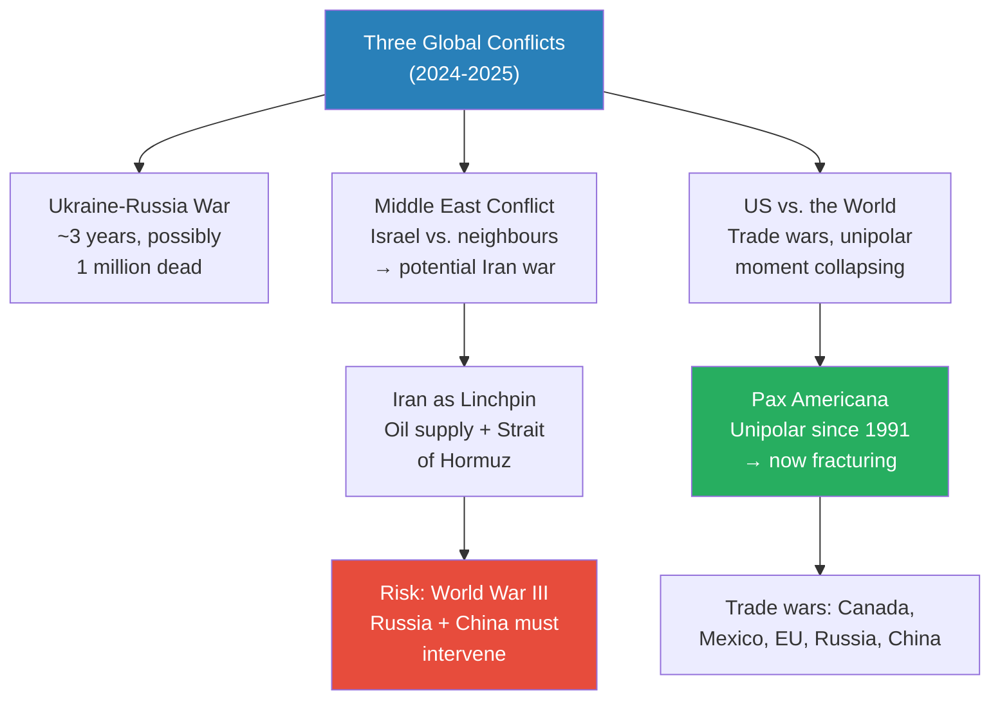
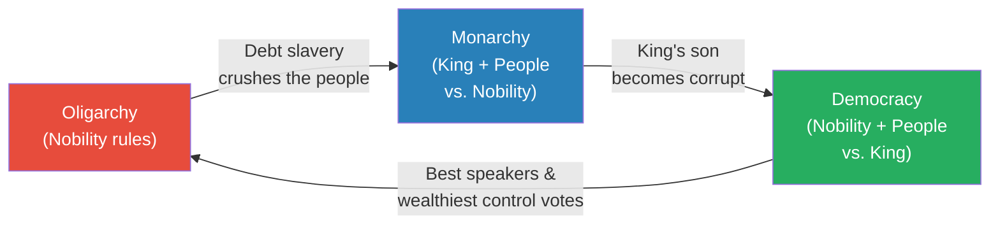
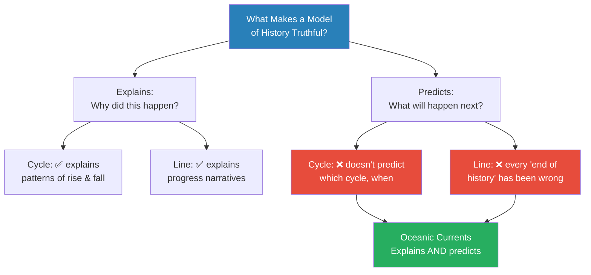
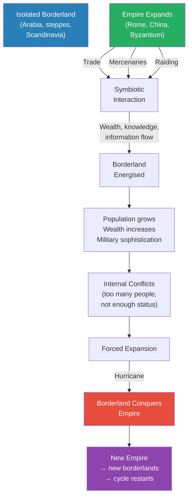
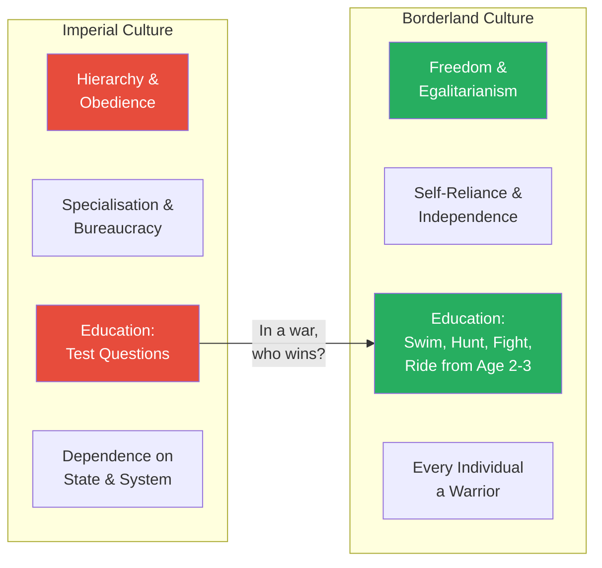
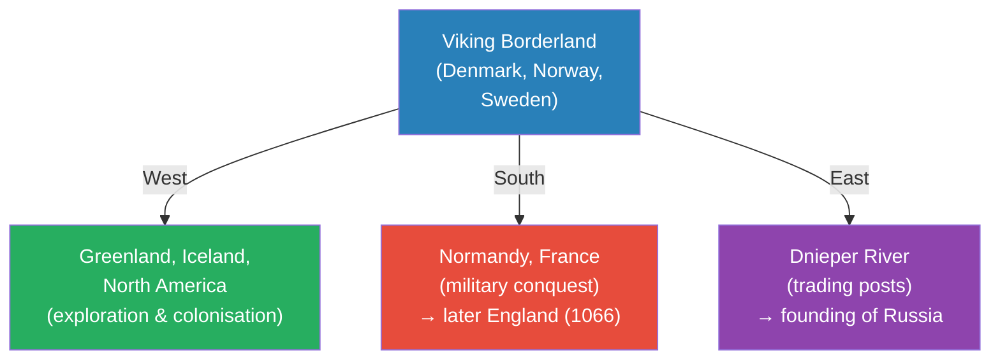

# The Oceanic Currents of History

> Prof. Jiang opens the second semester by introducing a new framework for understanding the movement of history. After surveying the two traditional models — the cycle (rise and fall of dynasties, factions rotating power) and the line (progress toward truth, from the Hebrew Bible through Hegel to Fukuyama) — he argues both are inadequate because neither can predict the future. His alternative: the oceanic currents model, where history is driven by cultural ecosystems that interact like ocean currents, generating hurricanes when borderland regions are energised by expanding empires. Empires inevitably collapse through three boundary conditions — financialism, rat utopia, and elite overproduction — while borderland cultures, forged in freedom and self-reliance, rise to conquer them. The pattern is eternal: there is no start and no end, only currents in motion.

---

## Overview: Key Highlights

- <b style="color: #2980b9">Oceanic currents of history</b> — Prof. Jiang's new model: history moves like ocean currents, with cultural ecosystems generating hurricanes that reshape civilisation
- <b style="color: #27ae60">Culture is the meta reality</b> — culture is more important than race, gender, or economics in determining who you are and how you navigate the world
- <b style="color: #2980b9">Cultural ecosystems</b> — the world divides into distinct cultural zones (Europe, Middle East, steppes, China, India) shaped by geography, history, and demographics
- <b style="color: #e74c3c">Empires are destined to collapse</b> — three boundary conditions guarantee the fall of every empire: financialism, rat utopia, and elite overproduction
- <b style="color: #2980b9">Financialism</b> — Piketty's insight: capital returns (5%) exceed real economy returns (2%), so societies shift from production to rent-seeking until war resets the system
- <b style="color: #2980b9">Rat utopia</b> — when status positions are blocked and upward mobility dies, society collapses as people stop working, marrying, and reproducing
- <b style="color: #2980b9">Elite overproduction</b> — too many elites competing for too few positions creates civil war among the powerful, not revolution from below
- <b style="color: #27ae60">Borderlands conquer empires through culture</b> — freedom, egalitarianism, and self-reliance produce superior warriors who overwhelm decadent imperial armies
- <b style="color: #e74c3c">The cycle model (oligarchy-monarchy-democracy) repeats endlessly</b> — Trump as modern king figure, promising to destroy corrupt elites on behalf of the people
- <b style="color: #2980b9">Empire-Borderland symbiosis</b> — empires interact with borderlands through trade, mercenaries, and raiding, inadvertently energising the forces that will destroy them
- <b style="color: #e74c3c">Three current hurricanes</b> — Ukraine, the Middle East, and the US-vs-the-world trade conflict are oceanic currents that cannot be stopped by negotiation
- <b style="color: #27ae60">Hurricanes stop only when they run out of energy</b> — these are natural forces, not political disputes amenable to conferences and deals

| Concept | One-line summary |
|---------|-----------------|
| **Cycle model** | History repeats through rising and falling dynasties or rotating factions (oligarchy → monarchy → democracy) |
| **Line model** | History progresses toward a final truth — from the Hebrew Bible to Fukuyama's "End of History" |
| **Oceanic currents** | Prof. Jiang's model: cultural ecosystems interact like ocean currents, generating unstoppable hurricanes |
| **Cultural ecosystem** | A region defined by shared culture rooted in geography, history, and demographics — Europe, the steppes, China, etc. |
| **Meta reality** | Culture as the foundational reality from which all other understandings derive |
| **Borderlands** | Regions at the intersections of empires — Arabia, the steppes, Scandinavia — that become energised through imperial contact |
| **Financialism** | The shift from productive enterprise to rent-seeking and capital extraction as society matures |
| **Rat utopia** | Social collapse when abundance eliminates upward mobility, blocking status positions and destroying motivation |
| **Elite overproduction** | Too many elite individuals competing for limited high-status positions, driving civil conflict among the powerful |
| **Rent-seeking behaviour** | Creating monopolies to extract wealth without producing value — the terminal stage of capitalism |
| **Jubilee** | A king clearing debts to win popular support — the mechanism by which monarchies are born |
| **Pax Americana** | The American-enforced global peace since 1991 — US military protecting shipping lanes and controlling trade |

---

# The Lecture

## Three Global Conflicts and the Stakes of This Semester [0:00 - 9:21]

*Prof. Jiang opens the second semester by surveying three active conflicts — Ukraine, the Middle East, and the United States against the world — framing them not as isolated crises but as the subject matter the semester's historical framework will explain and predict.*

*The three conflicts are not separate crises but interconnected currents — each one risks pulling the others into a single global hurricane. The Middle East route to World War III runs through Iran's control of global oil and the Strait of Hormuz.*

> [!note]- Expand: Full Lecture Detail
> Prof. Jiang welcomes the class to the first lecture of the second semester. He frames the semester's purpose: building on everything learned in the first semester to better understand human history, make sense of the present, and predict the future.
>
> He surveys three major conflicts:
>
> - <b style="color: #e74c3c">The Ukraine-Russia war</b> — roughly three years old, possibly over a million soldiers dead
>   - Trump has shown interest in ending it, but "we don't really know when the war will end"
>   - The war drives up prices, creates instability, and disrupts daily life — even flight routes must avoid Russian airspace
>
> - <b style="color: #e74c3c">The Middle East conflict</b> — Israel in conflict with Hamas, Lebanon, and Syria
>   - Prof. Jiang warns this "will probably prove to be even more dangerous" than Ukraine
>   - The great fear: Israel attacks Iran, drags the US into war, and this becomes the beginning of World War III
>   - <b style="color: #2980b9">Iran as linchpin of the global economy</b> — two reasons:
>     - Iran and the Middle East supply most of East Asia's oil — cutting supply means economic collapse for China, South Korea, and Japan
>     - The <b style="color: #2980b9">Strait of Hormuz</b> — Iran can cut off global trade through this chokepoint, forcing Western military intervention, which draws in Russia, India, and China
>   - Prof. Jiang promises to explore both geopolitical and religious factors driving this conflict throughout the semester
>
> - <b style="color: #e74c3c">The United States against the world</b> — the unravelling of the <b style="color: #2980b9">Pax Americana</b>
>   - Since 1991 and the fall of the Soviet Union, the world has lived in a <b style="color: #2980b9">unipolar moment</b> — one superpower dictating policy
>   - The US controls trade (everything denominated in dollars) and protects shipping lanes with its navy
>   - China's growth was enabled by American warships keeping sea lanes safe for Chinese cargo
>   - But unipolarity also meant the US could "invade any country for no reason" — Iraq in 2003, Libya, near-destruction of Syria
>   - Russia under Putin felt "bullied" and "disrespected," leading to the current conflict
>   - Under Trump, trade wars against Canada, Mexico, and potentially the EU, with economic war already underway against Russia and China
>
> Prof. Jiang's promise: "If you know enough history, if you study the historical structural forces that drive global conflict, then you understand what's going on, and you will also be able to predict what will happen."

---

## The Cycle — History as Eternal Return [9:21 - 19:17]

*Prof. Jiang presents the first of two traditional models of history: the cycle. Drawing on Chinese dynastic history and the Greek-Roman political cycle of oligarchy, monarchy, and democracy, he shows how this model mirrors natural cycles of birth, death, and seasons — and then connects it directly to Trump's rise as a modern "king."*

> [!tip] Core Insight
> The political cycle — oligarchy breeds debt slavery, a king-figure promises jubilee and destroys the elite, monarchy becomes corrupt, democracy replaces it, democracy becomes oligarchy again — is not ancient history. It is happening right now in the United States.

*The Greek-Roman political cycle is a three-faction game where any two can ally against the third. The cycle never ends because each form of government contains the seeds of its own corruption.*

> [!note]- Expand: Full Lecture Detail
> Prof. Jiang introduces two main models for understanding historical development. The first is the <b style="color: #2980b9">cycle</b>.
>
> He explains why cycles feel natural:
> - We are born, we die, others are born, they die — a cycle
> - Seasons cycle: winter → spring → summer → fall → winter
> - "For most of human history, most people have understood the movement of the world as a cycle"
>
> **The Chinese dynastic cycle:**
> - Dynasties rise because they have the <b style="color: #2980b9">Mandate of Heaven</b>
> - They do justice when they first arise
> - Over time, corruption and bad emperors cause them to lose the Mandate
> - Rebellion creates a new dynasty
> - "Chinese history is almost a continuous cycle of dynastic rise and decline"
>
> **The Greek-Roman factional cycle:**
> - Three factions in every society, each with a distinct source of power:
>   - **The people** — strength in numbers (mass)
>   - **The nobility** — authority, knowledge, military skill (respect)
>   - **The king** — controls the army (force)
> - These three factions are always in conflict; two ally against one
>
> The cycle works as follows:
> - <b style="color: #2980b9">Oligarchy</b> (nobility rules) → the nobles own the land, peasants work it
>   - Bad weather means peasants cannot pay rent → nobles give loans → loans become debts → debts become slavery
>   - "At a certain point you can't pay off the debt. So what happens? You become my slave, and your children become my slave as well"
> - One nobleman sees opportunity in the civil conflict and tells the people: "If you make me King, I will clear your debts"
>   - This is called a <b style="color: #2980b9">Jubilee</b> — "and this happens a lot in human history"
> - <b style="color: #2980b9">Monarchy</b> — the first king is usually good because he had to earn his position
>   - "But the problem is, the king has a son who's not so good, and then the son has a son who's awful"
> - Nobility and people rebel together → create a <b style="color: #2980b9">democracy</b>
> - In democracy, the best speakers and wealthiest people control the votes
>   - They consolidate power → recreate an oligarchy
> - The cycle restarts
>
> > [!example] Trump as Modern King
> > - Prof. Jiang applies the cycle directly to American politics
> > - "Who is Trump? Trump is a king"
> > - Trump's message to the people: "The elite are corrupt. The elite are stealing from you. The elite are lying to you. Vote for me, and I will destroy the elite"
> > - Prof. Jiang warns: "Trump is not gonna be president for four years. His ambition is to be king"
> > - The pattern is visible: a populist leader promising to clear debts and destroy the ruling elite on behalf of the masses
> > **The lesson:** The Greek-Roman factional cycle is not a historical curiosity — it is the structural template for populist power grabs across all eras, including the present.

---

## The Line — History as Progress Toward Truth [19:17 - 24:33]

*Prof. Jiang presents the second traditional model: history as a line moving toward an endpoint. From the Hebrew Bible to Virgil's Aeneid to Francis Fukuyama's "End of History" to Christian Zionism, the line model assumes humanity is progressing toward a final truth — and Prof. Jiang shows how this idea, however discredited, continues to drive real-world conflict.*

*Each version of the line model claims to know where history is heading. Each has been wrong — but the Christian Zionist version is actively driving policy in the Middle East today.*

> [!note]- Expand: Full Lecture Detail
> Prof. Jiang introduces the <b style="color: #2980b9">line</b> — the idea that history progresses toward truth, toward a good end.
>
> He traces the idea through multiple incarnations:
>
> - **The Hebrew Bible** — God (Yahweh) searches for a trustworthy friend to rule His kingdom
>   - First tries Adam and Eve (they disobey), then Noah, then Abraham, then Moses
>   - Finally finds David — "the truth is David in the Hebrew Bible"
>
> - **Virgil and Rome** — Troy was destroyed so that Rome could be founded
>   - The wars lead to Augustus Caesar and the <b style="color: #2980b9">Pax Romana</b>
>   - "This is the end of history. This is where all movement ends, because once you achieve the Pax Romana, there'll be no more war"
>   - Prof. Jiang: "Obviously this is not true, but back then... they thought it was true"
>
> - **Francis Fukuyama** — "The End of History" (1991)
>   - Argued the fall of the Soviet Union proved liberal consumer democracy is the best system
>   - "Everyone should try to be a liberal consumer democracy, including China"
>   - "We now also know this is not true"
>
> - **Christianity** — the main proponents of the line model
>   - Jesus marks a turning point in history; the Second Coming marks the end
>   - Jesus returns to usher in a millennium of peace as king
>   - <b style="color: #e74c3c">Christian Zionists</b> — "millions of Christians... who want war in the Middle East. Because if there's war in the Middle East and the world is about to end, Jesus has to return from heaven to save us"
>   - Prof. Jiang: "There are people who literally believe that we can save the world by ending it"
>   - "Crazy ideas make crazy events" — this theology is "one of the main causes of the war in the Middle East"
>
> - **Hegel's dialectic** — a variation of the line
>   - <b style="color: #2980b9">Dialectic</b> means conflict or conversation
>   - An idea (capitalism) generates a counter-idea (communism)
>   - The two merge, drawing on the best of each → synthesis (socialism)
>   - "It's a line... but he still believes that we're progressing towards the truth through this conflict"
>   - This leads to Marx, who draws on Hegel and Kant for his theory of communism
>
> Prof. Jiang's summary: "You either believe that things move in continuous motion, or they're moving towards an end."

---

## Why Both Models Fail — The Problem with History [24:33 - 34:34]

*Prof. Jiang explains why he finds both traditional models unsatisfying: history as a discipline cannot predict the future, and a model that cannot predict is not truthful. He introduces his alternative — the oceanic currents of history — and the concept of cultural ecosystems as the fundamental unit of historical analysis.*

> [!tip] Core Insight
> Culture is the meta reality — more important than gender, race, ethnicity, or economic class. A man from 2000 years ago in China would adapt to modern China in five to ten years. That same man placed in modern Germany would never adapt, no matter how long he lived there.

*Both traditional models can tell stories about the past, but neither can predict where the next crisis will come from. Prof. Jiang's oceanic currents model claims to do both.*

> [!note]- Expand: Full Lecture Detail
> Prof. Jiang articulates his frustration with history as a discipline:
>
> - "History as an academic discipline, it's just not very good"
> - With Trump, Ukraine, and the Middle East, "you would expect historians to come out and say, Oh, this has happened before, and we can then predict what will happen... but guess what? They're not doing that"
> - "History is notorious for not being able to tell us much about the future"
> - Historians retreat to: "Well, it's because we look at the past"
> - Prof. Jiang: "If the history is any good, if the history is accurate, then it should help us predict the future, or at least better understand the present"
>
> He defines what truth must do:
> - **Explain** — why did this happen? (e.g., "Hitler was a bad guy" is not an explanation)
> - **Predict** — if truthful, it predicts what will happen next
>
> He then introduces the <b style="color: #2980b9">oceanic currents of history</b>:
> - "Imagine the world as a huge ocean, and within each ocean there's an ecosystem which has currents, and then these currents come into conflict with each other, which leads to a new development"
> - "Think about hurricanes" — the model is about forces that build, collide, and create storms
> - <b style="color: #27ae60">There is no moral judgement in this model</b> — "saying this is good, this is bad, it's not helpful. Doesn't really tell us anything"
> - "I'm much more interested in explaining why this happened, how this happened, and where this is going"
>
> **Cultural ecosystems — the fundamental unit:**
> - The world divides into <b style="color: #2980b9">cultural ecosystems</b> determined by geography, history, and demographics
> - Culture is the <b style="color: #2980b9">meta reality</b> — "the understanding of the world from which all other understandings derive"
> - "Culture is the most important part of who you are, much more important than your gender, much more important than your race, your ethnicity, much more important than your economic demographic"
>
> > [!example] The Thought Experiment — 2000-Year-Old Chinese Man
> > - Take a random man from China 2000 years ago and place him in modern China
> > - In 2000 years, China has gained internet, computers, skyscrapers, cars
> > - Prof. Jiang's estimate: "At most five to ten years" to adapt
> > - Why? "Deep down inside, Chinese culture has stayed consistent for the past three to four thousand years"
> > - He would understand how to make friends, deal with a boss, raise children to succeed
> > - Now take a random man from modern China and place him in modern Germany
> > - "He will never, ever be able to adapt to the culture"
> > - He may get a job as a pizza delivery man, "but he will never, ever make friends who are German"
> > - He won't find a German wife, won't know how to succeed at work, won't know what to say to his boss
> > - This man knows the internet, can drive a car, speaks English — but "because of the culture, he's always a stranger"
> > **The lesson:** Technology changes in decades; culture persists for millennia. The deepest barriers between peoples are not technological or economic — they are cultural.
>
> Prof. Jiang maps the world's cultural ecosystems:
> - **Europe** — someone from Germany can go to Italy and feel at home; shared cultural orientation despite different languages
> - **The Middle East / Levant** — its own cultural ecosystem
> - **The steppes** — the grassland ocean from Hungary to Mongolia
> - **China** — distinct cultural ecosystem
> - **India** — distinct cultural ecosystem
> - These ecosystems are "always interacting with each other" — and when one changes, it changes its interaction with all the others

---

## The Empire-Borderland Pattern — Why Empires Fall [34:34 - 53:43]

*Prof. Jiang presents the central mechanism of the oceanic currents model: empires expand, energise their borderlands, and then are conquered by the very regions they empowered. He identifies three boundary conditions — financialism, rat utopia, and elite overproduction — that guarantee every empire's eventual collapse.*

*The empire-borderland cycle is self-perpetuating: every empire, by the act of expansion itself, creates the hurricane that will eventually destroy it. The pattern repeats because conquering borderlands become the new empire, generating new borderlands.*

> [!note]- Expand: Full Lecture Detail
> Prof. Jiang poses the question: "Why do empires fall? Why do they climb? Why do they fail?" He promises a consistent pattern that explains every major imperial collapse — Rome, Persia, China.
>
> **The empire-borderland relationship:**
> - Every empire, as it expands, encounters <b style="color: #2980b9">borderlands</b> — places at the intersections of empires
>   - Mongolia is the borderland of the Chinese Empire
>   - Arabia is the borderland of the Byzantine and Sassanid Persian empires
>   - Scandinavia is the borderland of Western Europe
>
> - The relationship starts as <b style="color: #2980b9">symbiotic</b> — three modes of interaction:
>   1. **Trade** — the simplest exchange
>   2. **Military cooperation** — empires need mercenaries; borderland people make excellent soldiers because they live in constant conflict with no central authority
>   3. **Raiding** — borderland peoples raid the empire's outskirts for resources
>
> - Over time, imperial contact <b style="color: #27ae60">energises the borderlands</b>:
>   - More wealth flows in, more knowledge, more information
>   - "It's like the Empire is adding fuel to the Borderlands"
>   - The borderlands become more populated, more wealthy, more militarily sophisticated
>
> - This energy creates internal conflicts — too many people, not enough status positions
> - The only resolution: expansion
> - "And now and then they will conquer the Empire, become the new empire"
>
> Prof. Jiang gives the examples: "This is how the Mongolians conquer China. This is how the Manchus conquered China. Before they conquered China, there was trade. The Chinese Empire was using them as mercenaries."
>
> **Why the borderlands win — the three boundary conditions:**
>
> Prof. Jiang asks: "How is it possible for the Borderlands, which is only a fraction of the wealth, the population and the resource of the Empire, to conquer the Empire?" His answer: <b style="color: #e74c3c">"Empires are destined to collapse. Empires must collapse."</b>
>
> Three boundary conditions guarantee collapse:
>
> **1. Financialism:**
> - When a society starts, people contribute to growth by building farms and factories — creating real wealth
> - Over time, "you eventually realise that it's more profitable for you to lend money than to build things"
> - "It's much more profitable, much easier for you to be a capitalist than to be an entrepreneur"
>
> > [!example] Piketty's Capital — Why Inequality Is Structural
> > - Thomas Piketty, French economist, wrote *Capital in the Twenty-First Century*
> > - His core argument: inequality happens because of the nature of capital itself
> > - Capital seeks to grow by consolidating and charging rents
> > - Five restaurants in Beijing could compete on price and quality — or they could form a cartel and charge monopoly prices
> > - <b style="color: #2980b9">Rent-seeking behaviour</b>: creating a monopoly that forces people to pay whatever you charge
> > - Return on financial capitalism: 5% per year (investing in stocks, real estate)
> > - Return on real economy: 2% per year (starting a factory, hiring people, creating goods)
> > - Result: young Americans "are not working — they're investing in Bitcoin, playing the real estate market, investing in stocks"
> > - "Your society isn't producing any value, and as a result, your economy can't move on"
> > **The lesson:** When lending money reliably beats making things, society stops producing — and the only historical escape has been war, which forces a reset by destroying accumulated rent-seeking structures.
>
> - Prof. Jiang's blunt conclusion about financialism: "What are you forced to do? Make war. When you make war, you destroy things. When you destroy things, you are forced to rebuild things. That's why we have war, because war means a game reset"
>
> **2. Rat utopia:**
> - Prof. Jiang reprises the rat utopia experiment from [[08 - Rat Utopia and the Peloponnesian War]]
> - Normal rat society is "extremely rich" and "ritualised" — male rats dance to attract females, courtship follows elaborate stages
> - Experimenters created a perfect world: unlimited food, complete freedom
> - Result: "All started collapsed. It was a complete disaster"
> - Male rats began raping female rats, no more ritual, "just rape and murder — complete breakdown of society"
>
> Prof. Jiang's analogy — the mountain metaphor:
> - Everyone stands in line to climb a mountaintop where you have status, wealth, and respect
> - Normally, people on top eventually fall off and die, making room
> - "But what happens when the people on the mountain top don't die?"
> - You are stuck in line indefinitely → frustration → violence
> - "The people in power, in China, in the United States, around the world, have been there for a long, long time, and they're not dying"
> - Young people respond with <b style="color: #e74c3c">tang ping (lying flat)</b> and <b style="color: #e74c3c">bai lan (letting it rot)</b> — quiet quitting
> - "You don't see any opportunities... because people aren't dying"
>
> **3. Elite overproduction:**
> - Same dynamic as rat utopia, but among the elites themselves
> - "It's not only that the children of poor people are being screwed over in the system. It's the children of the elite are being screwed over"
> - The poor fight each other in line; <b style="color: #e74c3c">the elite can do something — they can go to war against each other</b>
> - "If you look at America today, you can say there's a civil war going on between two different factions of the elite"
> - "A lot of revolutions happen not because the poor are trying to overthrow the rich. It's because the low nobility is fighting for opportunities against the upper nobility"

---

## Why Empires Import Their Own Destroyers [53:43 - 56:52]

*Prof. Jiang applies the three boundary conditions to explain a specific pattern: empires in decline import borderland mercenaries to fight their internal wars, and these mercenaries eventually seize power themselves.*

> [!note]- Expand: Full Lecture Detail
> Prof. Jiang connects the three boundary conditions to the empire-borderland pattern:
>
> - Most people in a declining empire "don't want to live there. They're just stuck living there"
> - Why? "Because they are in debt. Debt and landlessness" — throughout history, the longest-lasting empires all suffer from this
> - The elite fight amongst themselves — corruption is just "the elite struggling to engage in rent-seeking behaviour amongst themselves"
> - The imperial army becomes unreliable — soldiers are debt-ridden and landless, with no loyalty
>
> The fatal move:
> - "You can't trust the army anymore, because the army is made up of people who have too much debt and who are landless"
> - "So what do you do? You hire foreign mercenaries"
> - "That's what China did in its history. You can't trust your own army, so you hire foreign mercenaries"
> - "Eventually what happens? You replace your army with foreign mercenaries"
> - "And then eventually, what happens? The foreign mercenaries take over your empire"
> - <b style="color: #e74c3c">"That's what happened in Rome. That's what happened throughout human history."</b>

---

## Borderland Culture — Freedom, Egalitarianism, Self-Reliance [56:52 - 1:03:02]

*Prof. Jiang shifts to the other side of the equation: why are borderland peoples able to conquer empires many times their size? The answer is not material — it is cultural. Borderland cultures produce warriors whose freedom and self-reliance make them superior fighters to imperial conscripts raised on test questions.*

*The comparison is devastating: imperial children learn to pass exams while borderland children learn to survive. When the two meet on a battlefield, sophistication loses to self-reliance every time.*

> [!note]- Expand: Full Lecture Detail
> Prof. Jiang challenges the common understanding of civilisation:
>
> - "We have this prejudice or misunderstanding about civilization. Civilization is about cities, writing, technology, wealth"
> - "If you looked at it that way, then you don't understand why the Mongolians, the Manchus, the Vikings, the Arabians, the Greeks are able to conquer these empires"
>
> The answer is <b style="color: #27ae60">culture</b>:
> - In the borderlands, a specific culture develops because of the borderland conditions
> - This culture emphasises **freedom**, **egalitarianism**, and **self-reliance**
> - "This is true throughout the Borderlands — if we go back to Mongolia during the time of Genghis Khan, if we go back to the European north at the time of the Vikings"
>
> > [!example] Viking Education vs. Imperial Education
> > - The Vikings didn't know how to read or write
> > - They had no mathematics, no cities
> > - "But from age two or three, their kids were learning how to swim, how to row boats, how to cook, how to hunt, how to fight, how to ride horses"
> > - Meanwhile, "civilised kids" are "learning how to do test questions"
> > - "In a war, who's gonna win? Well, obviously these guys"
> > **The lesson:** Civilisational sophistication is not the same as martial capability. The skills that build empires — literacy, bureaucracy, commerce — are not the skills that defend them.
>
> Prof. Jiang frames the oceanic currents model as a unified theory:
> - Isolated borderland areas are ecosystems amongst themselves
> - The imperial current expands into them, energising them
> - "These areas actually have much more energetic potential than the Empire, which is dying"
> - The borderland becomes "like a hurricane, and they have to ride through history"
> - "Sometimes they're defeated, but sometimes, like the Greeks, like the Vikings, like the Mongolians, like the Arabians, they win"
>
> He applies the model to current events:
> - <b style="color: #e74c3c">"This war in Ukraine, it is a hurricane that will engulf all of Europe"</b>
> - <b style="color: #e74c3c">"This war in the Middle East is a hurricane that will engulf the entire world"</b>
> - "Once this starts, you can't have a conference and decide to end it. These things cannot end until they reach their natural course"
> - "The hurricane stopped when it runs out of energy... The hurricane does not negotiate with you"
> - "Spoiler alert: things will not end well. We are looking at the complete utter destruction of the world we live in today"
>
> His promise for the semester: "This will give you a unified theory of history, and you'll see how everything connects together."

---

## Q&A — What Starts the Hurricanes? [1:03:02 - 1:08:24]

*Students ask where these historical hurricanes come from and when they stop. Prof. Jiang explains there is no start — currents are always in motion — and illustrates with the Vikings, who expanded in three directions simultaneously: west to Greenland, Iceland, and North America; south to conquer Normandy; and east along the Dnieper River to found what became Russia.*

*The Viking expansion illustrates the hurricane model perfectly: too much energy, not enough status positions, so expansion erupts in every direction simultaneously — some routes peaceful (trading posts), some violent (Normandy), some exploratory (North America).*

> [!note]- Expand: Full Lecture Detail
> **Student question: What starts these hurricanes?**
>
> Prof. Jiang's answer:
> - "If you look at an ocean, you will discover that these currents are happening all the time. There's no start. They're always in motion"
> - "Once you start an empire, you're already starting to unleash a hurricane in the borderlands"
> - "Once the hurricane matures in the Borderlands, it will overwhelm the Empire, which will then start to energise a new borderland"
> - "There will always be hurricanes. Hurricanes are always forming. You just have to figure out where they're forming in order to predict where they're coming from"
>
> **Current and coming hurricanes:**
> - The two big hurricanes now: Ukraine and the Middle East
> - Future conflict in East Asia — "A lot of people are saying the conflict will be between China and the United States. I do not think that's the case. I think it will involve Japan and South Korea"
> - American civil war — "Eventually, America will have to fight a civil war... people are already predicting a civil war. It's only a question of when"
>   - He predicts acceleration around 2028: "The election in 2028 will be heavily contested. People are going to argue over who won"
>   - "There's a very good chance Trump will run again in 2028"
> - The biggest hurricane: Iran — "Eventually, United States and Iran will come in conflict with each other, and this will drag in the entire world"
>
> **Student question: What stops the hurricanes?**
>
> - "The hurricane is created because they have wealth and power, but they don't have enough status positions"
> - They expand to fill those status positions
> - "This is actually what drives empire building — it's not because you lack resources, it's because you have too many people who want status"
> - The hurricane stops when expansion absorbs the excess energy
>
> > [!example] The Viking Expansion — A Hurricane in Three Directions
> > - Vikings had been in northern Europe for most of human history — "we actually had no idea they were there"
> > - They kept to themselves in Denmark, Norway, and Sweden, trading quietly with the wider world
> > - Then they "started to come out of nowhere" and expanded in three directions:
> >   - **West:** colonised Greenland and Iceland, and reached North America — "the first Europeans to reach North America"
> >   - **South:** attacked France so relentlessly that the French gave them their own land — <b style="color: #2980b9">Normandy</b> ("the land of the north people")
> >   - **East:** sailed along the Dnieper River, established trading posts with the Islamic empire, and founded settlements that became the basis of **Russia** (from "the Rus")
> > - The Normans later conquered England in 1066
> > **The lesson:** A single borderland hurricane can reshape the entire map of Europe — creating Normandy, Russia, and the Norse settlement of North America in a single burst of expansion.
>
> Prof. Jiang closes with the semester's roadmap:
> - Next class: the fall and decline of the Roman Empire
> - Then: the rise of the Holy Roman Empire (actually the Frankish Empire)
> - Then: the rise of the Vikings
> - "This becomes a framework for which we understand all of European history for the past 2000 years"

---

## Connections

**Builds on:** [[06 - Elite Overproduction and the Bronze Age Collapse]] (elite overproduction as collapse mechanism), [[08 - Rat Utopia and the Peloponnesian War]] (rat utopia experiment and status competition), [[28 - Muhammad's Revolution of God]] (Arabia as energised borderland of Byzantine and Sassanid empires)

**Sets up:** [[32 - Rome's Rise, Fall, and Legacy]] (Roman Empire as case study for the pattern), [[34 - The Useful Fiction of the Holy Roman Empire]] (Frankish Empire as successor), [[35 - The Viking Legacy]] (Viking expansion as borderland hurricane)

**Related books in vault:** [[Capital in the Twenty-First Century - Thomas Piketty]] (financialism and r > g), [[Sapiens - Yuval Noah Harari]] (cultural persistence), [[The 33 Strategies of War - Robert Greene]] (asymmetric warfare and borderland advantage)

---

## The Takeaway

This lecture is a turning point for the series. After twenty-eight lectures building the evidence base — religion, empire, Greece, Rome, Egypt, Mesopotamia, India, Israel, Christianity, Islam — Prof. Jiang now reveals the overarching framework that connects them all. The oceanic currents model is not just another metaphor: it is a predictive engine. Empires do not fall because of bad leaders or bad luck. They fall because expansion itself energises the borderlands, while three internal diseases — financialism, rat utopia, and elite overproduction — hollow out the empire from within. The pattern is structural, not personal.

The most provocative claim is also the most testable: current events are not unique. Ukraine, the Middle East, and the American trade wars are not novel crises requiring novel explanations. They are hurricanes forming in borderlands that have been energised by the Pax Americana, following the same pattern that destroyed Rome, Persia, and every Chinese dynasty. If the model is correct, these conflicts cannot be resolved through negotiation — they will end only when they run out of energy.

The question the lecture leaves open is whether the model's amoral, naturalistic framing is a strength or a limitation. Prof. Jiang explicitly removes moral judgement from his analysis — "saying this is good, this is bad, it's not helpful" — but the examples he chooses (Trump as king, America heading for civil war, World War III through Iran) carry enormous moral weight. The semester ahead will test whether the oceanic currents model can bear that weight while maintaining its predictive clarity.
